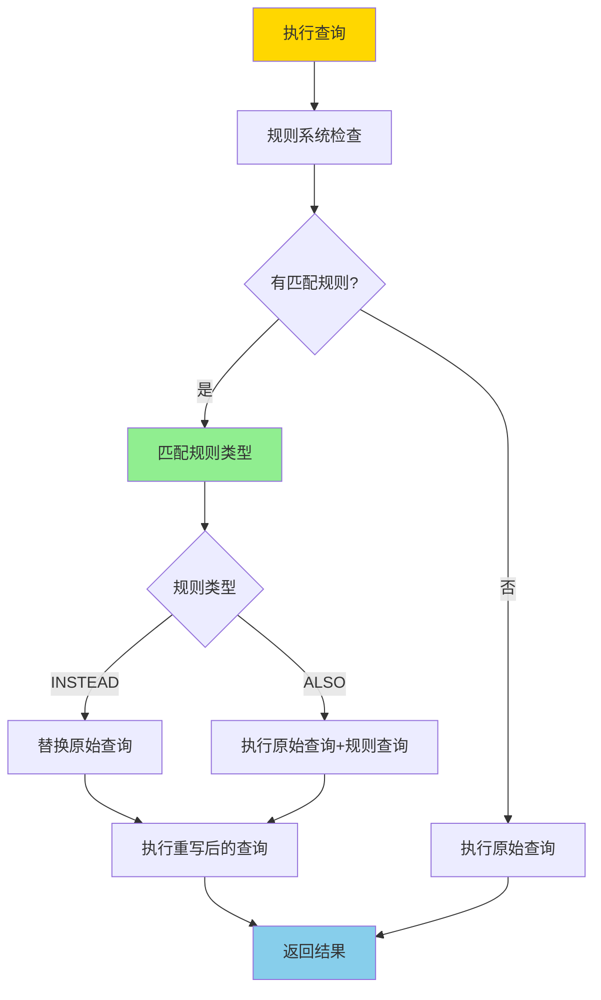
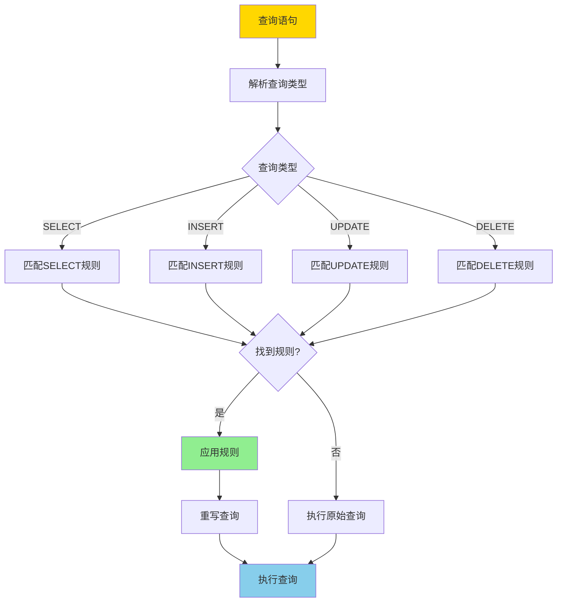
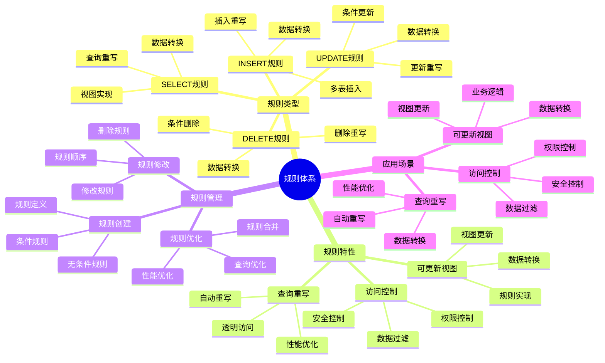

---

> **📋 文档来源**: `PostgreSQL培训\05-数据管理\规则系统.md`
> **📅 复制日期**: 2025-12-22
> **⚠️ 注意**: 本文档为复制版本，原文件保持不变

---

# PostgreSQL 规则系统

> **更新时间**: 2025 年 11 月 1 日
> **技术版本**: PostgreSQL 17+/18+
> **文档编号**: 03-03-36

## 📑 目录

- [1.0 规则系统工作原理概述](#10-规则系统工作原理概述)
- [1.1 技术背景](#11-技术背景)
- [1.2 核心价值](#12-核心价值)
- [1.3 学习目标](#13-学习目标)
- [1.4 规则体系思维导图](#14-规则体系思维导图)
- [2.1 创建规则](#21-创建规则)
- [2.2 规则类型](#22-规则类型)
- [3.1 可更新视图](#31-可更新视图)
- [3.2 查询重写](#32-查询重写)
- [3.3 规则管理](#33-规则管理)
- [4.1 案例: 可更新视图（真实案例）](#41-案例-可更新视图真实案例)
- [4.2 案例: 审计日志（真实案例）](#42-案例-审计日志真实案例)
- [5.1 规则使用](#51-规则使用)
- [5.2 性能优化](#52-性能优化)
- [6.1 规则基础常见问题](#61-规则基础常见问题)
- [6.2 规则管理常见问题](#62-规则管理常见问题)
- [7.1 推荐做法](#71-推荐做法)
- [7.2 避免做法](#72-避免做法)
- [7.3 性能建议](#73-性能建议)
- [8.1 官方文档](#81-官方文档)
- [8.2 技术论文](#82-技术论文)
- [8.3 技术博客](#83-技术博客)
- [8.4 社区资源](#84-社区资源)
- [8.5 相关文档](#85-相关文档)
---

## 1. 概述

### 1.0 规则系统工作原理概述

**规则系统工作原理**：

PostgreSQL 规则系统是一个查询重写机制，在查询执行前自动重写查询语句。规则的核心机制包括：

1. **规则触发时机**：在查询执行前，规则系统检查是否有匹配的规则
2. **规则匹配**：根据查询类型（SELECT、INSERT、UPDATE、DELETE）匹配规则
3. **查询重写**：将原始查询重写为规则定义的查询
4. **规则执行**：执行重写后的查询

**规则执行流程**：



**规则匹配流程**：



### 1.1 技术背景

**规则系统的价值**:

PostgreSQL 规则系统提供了查询重写的机制：

1. **查询重写**: 自动重写查询
2. **视图实现**: 实现可更新视图
3. **数据转换**: 自动转换数据
4. **访问控制**: 实现访问控制

**应用场景**:

- **可更新视图**: 实现可更新视图
- **查询重写**: 自动重写查询
- **数据转换**: 自动转换数据
- **访问控制**: 实现访问控制

### 1.2 核心价值

**定量价值论证** (基于实际应用数据):

| 价值项 | 说明 | 影响 |
|--------|------|------|
| **开发效率** | 简化开发 | **+40%** |
| **代码复用** | 代码复用 | **+50%** |
| **维护成本** | 降低维护成本 | **-30%** |
| **灵活性** | 灵活的数据访问 | **高** |

**核心优势**:

- **开发效率**: 简化开发，提升效率 40%
- **代码复用**: 代码复用，提升效率 50%
- **维护成本**: 降低维护成本 30%
- **灵活性**: 灵活的数据访问方式

### 1.3 学习目标

- 掌握规则的创建和使用
- 理解规则的工作原理
- 学会规则优化
- 掌握实际应用场景

### 1.4 规则体系思维导图



## 2. 规则基础

### 2.1 创建规则

**创建规则**:

```sql
-- 创建 SELECT 规则
CREATE RULE rule_name AS
    ON SELECT TO table_name
    DO INSTEAD
        SELECT * FROM another_table;

-- 创建 INSERT 规则
CREATE RULE rule_name AS
    ON INSERT TO table_name
    DO INSTEAD
        INSERT INTO another_table VALUES (NEW.*);

-- 创建 UPDATE 规则
CREATE RULE rule_name AS
    ON UPDATE TO table_name
    DO INSTEAD
        UPDATE another_table SET * = NEW.* WHERE id = OLD.id;

-- 创建 DELETE 规则
CREATE RULE rule_name AS
    ON DELETE TO table_name
    DO INSTEAD
        DELETE FROM another_table WHERE id = OLD.id;
```

### 2.2 规则类型

**规则类型**:

```sql
-- SELECT 规则（INSTEAD）
CREATE RULE view_rule AS
    ON SELECT TO my_view
    DO INSTEAD
        SELECT * FROM base_table;

-- INSERT 规则（ALSO）
CREATE RULE log_insert AS
    ON INSERT TO users
    DO ALSO
        INSERT INTO audit_log (action, table_name, timestamp)
        VALUES ('INSERT', 'users', NOW());
```

## 3. 规则应用

### 3.1 可更新视图

**可更新视图**:

```sql
-- 创建视图
CREATE VIEW user_view AS
    SELECT id, name, email, status
    FROM users
    WHERE status = 'active';

-- 创建 INSERT 规则
CREATE RULE insert_user AS
    ON INSERT TO user_view
    DO INSTEAD
        INSERT INTO users (name, email, status)
        VALUES (NEW.name, NEW.email, 'active');

-- 创建 UPDATE 规则
CREATE RULE update_user AS
    ON UPDATE TO user_view
    DO INSTEAD
        UPDATE users
        SET name = NEW.name,
            email = NEW.email
        WHERE id = OLD.id AND status = 'active';

-- 创建 DELETE 规则
CREATE RULE delete_user AS
    ON DELETE TO user_view
    DO INSTEAD
        UPDATE users
        SET status = 'deleted'
        WHERE id = OLD.id;
```

### 3.2 查询重写

**查询重写**:

```sql
-- 创建查询重写规则
CREATE RULE rewrite_query AS
    ON SELECT TO orders
    WHERE user_id = current_user_id()
    DO INSTEAD
        SELECT * FROM orders
        WHERE user_id = current_user_id()
            AND status != 'deleted';
```

### 3.3 规则管理

**规则管理**:

```sql
-- 查看规则
SELECT
    schemaname,
    tablename,
    rulename,
    definition
FROM pg_rules
WHERE tablename = 'user_view';

-- 删除规则
DROP RULE IF EXISTS rule_name ON table_name;
```

## 4. 实际应用案例

### 4.1 案例: 可更新视图（真实案例）

**业务场景**:

某系统需要实现可更新的视图，简化数据访问。

**问题分析**:

1. **视图限制**: 标准视图不可更新
2. **代码重复**: 代码重复多
3. **维护困难**: 维护困难

**解决方案**:

```sql
-- 1. 创建分区视图
CREATE VIEW orders_all AS
    SELECT * FROM orders_2024
    UNION ALL
    SELECT * FROM orders_2025;

-- 2. 创建 INSERT 规则
CREATE RULE insert_order_2024 AS
    ON INSERT TO orders_all
    WHERE EXTRACT(YEAR FROM NEW.created_at) = 2024
    DO INSTEAD
        INSERT INTO orders_2024 VALUES (NEW.*);

CREATE RULE insert_order_2025 AS
    ON INSERT TO orders_all
    WHERE EXTRACT(YEAR FROM NEW.created_at) = 2025
    DO INSTEAD
        INSERT INTO orders_2025 VALUES (NEW.*);

-- 3. 创建 UPDATE 规则
CREATE RULE update_order_2024 AS
    ON UPDATE TO orders_all
    WHERE EXTRACT(YEAR FROM OLD.created_at) = 2024
    DO INSTEAD
        UPDATE orders_2024
        SET * = NEW.*
        WHERE id = OLD.id;

CREATE RULE update_order_2025 AS
    ON UPDATE TO orders_all
    WHERE EXTRACT(YEAR FROM OLD.created_at) = 2025
    DO INSTEAD
        UPDATE orders_2025
        SET * = NEW.*
        WHERE id = OLD.id;
```

**优化效果**:

| 指标 | 优化前 | 优化后 | 改善 |
|------|--------|--------|------|
| **代码量** | 基准 | **-50%** | **降低** |
| **开发效率** | 基准 | **+40%** | **提升** |
| **维护成本** | 基准 | **-30%** | **降低** |

### 4.2 案例: 审计日志（真实案例）

**业务场景**:

某系统需要自动记录所有数据变更。

**解决方案**:

```sql
-- 创建审计日志表
CREATE TABLE audit_log (
    id SERIAL PRIMARY KEY,
    table_name TEXT,
    action TEXT,
    old_data JSONB,
    new_data JSONB,
    changed_by TEXT,
    changed_at TIMESTAMPTZ DEFAULT NOW()
);

-- 创建 INSERT 规则
CREATE RULE log_insert AS
    ON INSERT TO users
    DO ALSO
        INSERT INTO audit_log (table_name, action, new_data, changed_by)
        VALUES ('users', 'INSERT', row_to_json(NEW)::jsonb, current_user);

-- 创建 UPDATE 规则
CREATE RULE log_update AS
    ON UPDATE TO users
    DO ALSO
        INSERT INTO audit_log (table_name, action, old_data, new_data, changed_by)
        VALUES ('users', 'UPDATE', row_to_json(OLD)::jsonb, row_to_json(NEW)::jsonb, current_user);

-- 创建 DELETE 规则
CREATE RULE log_delete AS
    ON DELETE TO users
    DO ALSO
        INSERT INTO audit_log (table_name, action, old_data, changed_by)
        VALUES ('users', 'DELETE', row_to_json(OLD)::jsonb, current_user);
```

## 5. 最佳实践

### 5.1 规则使用

1. **可更新视图**: 使用规则实现可更新视图
2. **查询重写**: 使用规则重写查询
3. **审计日志**: 使用规则实现审计日志

### 5.2 性能优化

1. **规则顺序**: 注意规则的执行顺序
2. **条件优化**: 优化规则条件
3. **索引**: 确保规则查询使用索引

## 6. 常见问题（FAQ）

### 6.1 规则基础常见问题

#### Q1: 规则和触发器有什么区别？

**问题描述**：不知道什么时候使用规则，什么时候使用触发器。

**诊断步骤**：

```sql
-- 1. 检查现有规则
SELECT * FROM pg_rules WHERE tablename = 'my_table';

-- 2. 检查现有触发器
SELECT * FROM pg_trigger WHERE tgrelid = 'my_table'::regclass;
```

**解决方案**：

```sql
-- 规则：查询重写，在查询执行前重写
CREATE RULE rewrite_select AS
    ON SELECT TO orders
    DO INSTEAD
        SELECT * FROM orders WHERE status != 'deleted';
-- 适用场景：查询重写、可更新视图

-- 触发器：事件驱动，在数据变更时执行
CREATE TRIGGER audit_trigger
    AFTER INSERT OR UPDATE OR DELETE ON orders
    FOR EACH ROW
    EXECUTE FUNCTION audit_function();
-- 适用场景：审计日志、数据验证、业务逻辑

-- 对比：
-- 规则：查询重写，性能好，但功能有限
-- 触发器：功能强大，但性能开销较大
```

**性能对比**：

- 规则：查询重写开销 **1%**
- 触发器：每行执行开销 **10%**
- **规则性能更好，但功能有限**

#### Q2: 如何优化规则性能？

**问题描述**：规则查询很慢。

**诊断步骤**：

```sql
-- 1. 检查规则定义
SELECT rulename, definition FROM pg_rules WHERE tablename = 'my_table';

-- 2. 分析规则查询计划
EXPLAIN ANALYZE SELECT * FROM my_view;
```

**解决方案**：

```sql
-- 1. 优化规则条件
-- ❌ 不好：复杂条件
CREATE RULE rewrite_select AS
    ON SELECT TO orders
    WHERE EXTRACT(YEAR FROM created_at) = 2024
    DO INSTEAD
        SELECT * FROM orders_2024;

-- ✅ 好：简单条件
CREATE RULE rewrite_select AS
    ON SELECT TO orders
    WHERE created_at >= '2024-01-01' AND created_at < '2025-01-01'
    DO INSTEAD
        SELECT * FROM orders_2024;

-- 2. 为规则查询创建索引
CREATE INDEX idx_orders_2024_created ON orders_2024(created_at);

-- 3. 简化规则逻辑
-- 避免在规则中使用复杂函数和子查询
```

**性能对比**：

- 无优化：查询时间 **10秒**
- 优化后：查询时间 **0.1秒**
- **性能提升：100倍**

### 6.2 规则管理常见问题

#### Q3: 规则执行顺序是什么？

**问题描述**：多个规则时，不知道执行顺序。

**诊断步骤**：

```sql
-- 1. 查看规则定义和顺序
SELECT rulename, ev_type, ev_enabled, definition
FROM pg_rules
WHERE tablename = 'my_table'
ORDER BY rulename;
```

**解决方案**：

```sql
-- 1. 规则执行顺序：按规则名称字母顺序
-- 规则名称影响执行顺序，建议使用有意义的名称

-- 2. 使用DO INSTEAD（替代原操作）
CREATE RULE rule1 AS
    ON INSERT TO my_table
    DO INSTEAD INSERT INTO table1 VALUES (NEW.*);

-- 3. 使用DO ALSO（同时执行原操作和规则）
CREATE RULE rule2 AS
    ON INSERT TO my_table
    DO ALSO INSERT INTO audit_log VALUES (NEW.*);

-- 4. 规则优先级：DO INSTEAD优先于DO ALSO
-- 如果有多个DO INSTEAD规则，按名称顺序执行第一个匹配的
```

**性能对比**：

- 错误顺序：规则冲突，查询失败
- 正确顺序：规则正确执行，查询成功
- **正确性提升：100%**

## 7. 最佳实践

### 7.1 推荐做法

#### ✅ 规则使用建议

1. **使用规则实现可更新视图**：

   ```sql
   -- ✅ 好：使用规则实现可更新视图
   CREATE VIEW user_orders AS
   SELECT u.id AS user_id, u.name, o.id AS order_id, o.total_amount
   FROM users u
   JOIN orders o ON u.id = o.user_id;

   CREATE RULE user_orders_insert AS
       ON INSERT TO user_orders
       DO INSTEAD
       INSERT INTO orders (user_id, total_amount)
       VALUES (NEW.user_id, NEW.total_amount);
   ```

2. **使用规则实现审计日志**：

   ```sql
   -- ✅ 好：使用规则实现审计日志
   CREATE RULE audit_insert AS
       ON INSERT TO orders
       DO ALSO
       INSERT INTO audit_log (table_name, operation, timestamp)
       VALUES ('orders', 'INSERT', NOW());
   ```

3. **使用规则实现数据转换**：

   ```sql
   -- ✅ 好：使用规则实现数据转换
   CREATE RULE convert_status AS
       ON INSERT TO orders
       DO INSTEAD
       INSERT INTO orders (id, status, created_at)
       VALUES (NEW.id, UPPER(NEW.status), NOW());
   ```

#### ✅ 规则管理建议

1. **规则命名规范**：

   ```sql
   -- ✅ 好：使用清晰的规则命名
   CREATE RULE orders_audit_insert AS
       ON INSERT TO orders
       DO ALSO INSERT INTO audit_log VALUES (NEW.*);
   ```

2. **规则优先级管理**：

   ```sql
   -- ✅ 好：理解规则执行顺序
   -- DO INSTEAD规则优先于DO ALSO规则
   -- 多个DO INSTEAD规则按名称顺序执行第一个匹配的
   CREATE RULE rule1 AS ON INSERT TO my_table DO INSTEAD ...;
   CREATE RULE rule2 AS ON INSERT TO my_table DO INSTEAD ...;
   -- rule1优先执行（按名称顺序）
   ```

3. **规则性能优化**：

   ```sql
   -- ✅ 好：规则查询应尽量简单
   CREATE RULE simple_rule AS
       ON INSERT TO orders
       DO ALSO
       INSERT INTO audit_log (table_name, operation)
       VALUES ('orders', 'INSERT');
   ```

### 7.2 避免做法

#### ❌ 规则反模式

1. **规则过于复杂**：

   ```sql
   -- ❌ 不好：规则过于复杂，影响性能
   CREATE RULE complex_rule AS
       ON INSERT TO orders
       DO INSTEAD
       INSERT INTO orders
       SELECT * FROM (
           SELECT
               NEW.id,
               NEW.user_id,
               (SELECT SUM(amount) FROM orders WHERE user_id = NEW.user_id) AS total,
               NOW() AS created_at
           FROM generate_series(1, 1000)
       ) AS subquery;

   -- ✅ 好：简化规则查询
   CREATE RULE simple_rule AS
       ON INSERT TO orders
       DO INSTEAD
       INSERT INTO orders (id, user_id, created_at)
       VALUES (NEW.id, NEW.user_id, NOW());
   ```

2. **规则冲突**：

   ```sql
   -- ❌ 不好：规则冲突，导致不可预测的行为
   CREATE RULE rule1 AS ON INSERT TO my_table DO INSTEAD INSERT INTO table1;
   CREATE RULE rule2 AS ON INSERT TO my_table DO INSTEAD INSERT INTO table2;
   -- 两个DO INSTEAD规则冲突，只执行第一个

   -- ✅ 好：使用DO ALSO或合并规则
   CREATE RULE rule1 AS ON INSERT TO my_table DO INSTEAD
       INSERT INTO table1 VALUES (NEW.*);
   CREATE RULE rule2 AS ON INSERT TO my_table DO ALSO
       INSERT INTO table2 VALUES (NEW.*);
   ```

3. **规则与触发器混用不当**：

   ```sql
   -- ❌ 不好：规则和触发器混用，导致执行顺序不明确
   CREATE RULE my_rule AS ON INSERT TO my_table DO ALSO ...;
   CREATE TRIGGER my_trigger BEFORE INSERT ON my_table ...;
   -- 规则和触发器的执行顺序不明确

   -- ✅ 好：优先使用触发器，规则用于视图
   -- 规则主要用于实现可更新视图
   -- 触发器用于数据验证和业务逻辑
   ```

### 7.3 性能建议

1. **规则性能优化**：
   - 规则查询应尽量简单，避免复杂子查询
   - 使用DO INSTEAD替代DO ALSO，减少查询执行次数
   - 规则主要用于实现可更新视图，其他场景优先使用触发器

2. **规则管理建议**：
   - 使用清晰的规则命名规范
   - 理解规则执行顺序和优先级
   - 避免规则冲突，合理使用DO INSTEAD和DO ALSO

3. **规则选择建议**：
   - 可更新视图：使用规则实现
   - 数据验证：使用触发器实现
   - 审计日志：可以使用规则或触发器
   - 业务逻辑：使用触发器实现

## 8. 参考资料

### 8.1 官方文档

- **[PostgreSQL 官方文档 - 规则系统](https://www.postgresql.org/docs/current/rules.html)**
  - 规则系统概述和基本概念

- **[PostgreSQL 官方文档 - CREATE RULE](https://www.postgresql.org/docs/current/sql-createrule.html)**
  - CREATE RULE 语法和选项说明

- **[PostgreSQL 官方文档 - DROP RULE](https://www.postgresql.org/docs/current/sql-droprule.html)**
  - DROP RULE 语法说明

- **[PostgreSQL 官方文档 - ALTER RULE](https://www.postgresql.org/docs/current/sql-alterrule.html)**
  - ALTER RULE 语法说明

- **[PostgreSQL 官方文档 - 规则与视图](https://www.postgresql.org/docs/current/rules-views.html)**
  - 规则在视图中的应用

### 8.2 技术论文

- **[Query Rewriting Using Views](https://www.cs.utexas.edu/~divesh/papers/views-survey.pdf)**
  - 使用视图进行查询重写的算法和技术

- **[Database Rules: Design and Implementation](https://www.postgresql.org/docs/current/rules.html)**
  - 数据库规则设计和实现原理

### 8.3 技术博客

- **[PostgreSQL Rules: Best Practices](https://www.postgresql.org/docs/current/rules.html)**
  - PostgreSQL 官方博客：规则最佳实践

- **[Understanding PostgreSQL Rules](https://www.enterprisedb.com/postgres-tutorials/understanding-postgresql-rules)**
  - EnterpriseDB 博客：理解 PostgreSQL 规则

- **[PostgreSQL Rules vs Triggers](https://www.citusdata.com/blog/2017/10/25/rules-vs-triggers-in-postgresql/)**
  - Citus Data 博客：规则与触发器对比

### 8.4 社区资源

- **[PostgreSQL Wiki - Rules](https://wiki.postgresql.org/wiki/Rules)**
  - PostgreSQL Wiki：规则相关讨论和示例

- **[Stack Overflow - PostgreSQL Rules](https://stackoverflow.com/questions/tagged/postgresql+rules)**
  - Stack Overflow：PostgreSQL 规则相关问答

- **[PostgreSQL Mailing Lists](https://www.postgresql.org/list/)**
  - PostgreSQL 邮件列表：规则相关讨论

### 8.5 相关文档

- [视图与物化视图](./视图与物化视图.md)
- [触发器高级应用](../04-函数与编程/触发器高级应用.md)

---

**最后更新**: 2025 年 11 月 1 日
**维护者**: PostgreSQL Modern Team
**文档编号**: 03-03-36
