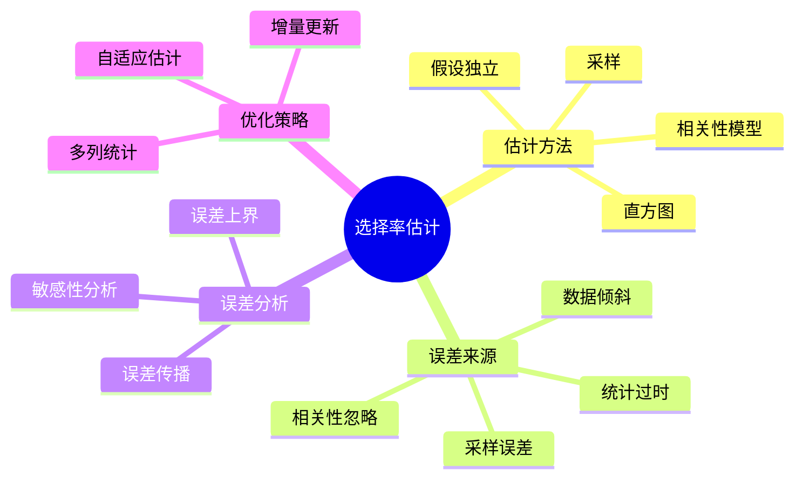
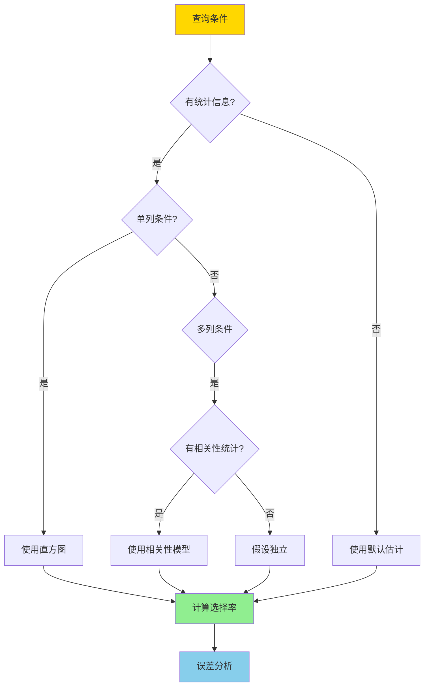
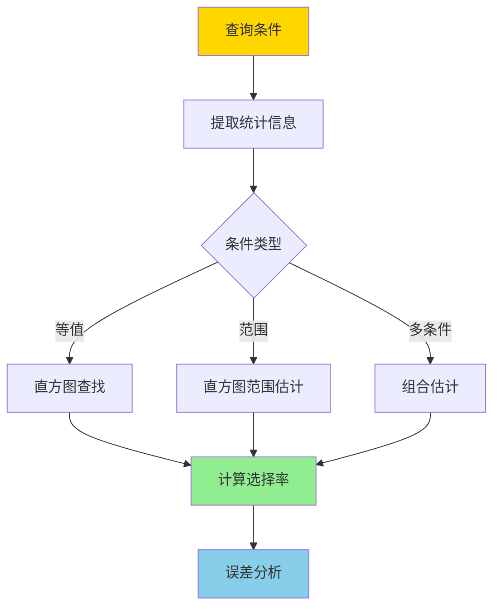
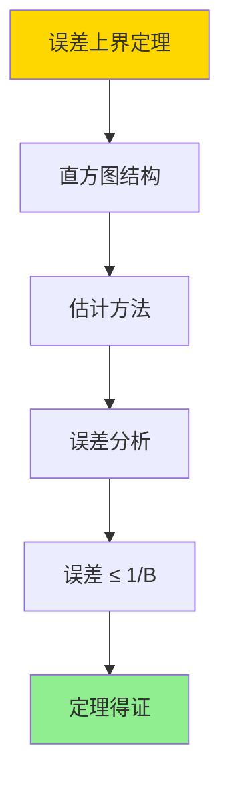

---

> **📋 文档来源**: `DataBaseTheory\15-统计与估计\15.01-选择率估计误差-敏感性与上界.md`
> **📅 复制日期**: 2025-12-22
> **⚠️ 注意**: 本文档为复制版本，原文件保持不变

---

# 选择率估计误差-敏感性与上界

> **文档版本**: v1.0
> **最后更新**: 2025-01-16
> **版本覆盖**: PostgreSQL 18.x (推荐) ⭐ | 17.x (推荐) | 16.x (兼容)
> **文档状态**: ✅ 内容已完成

---

## 📋 目录

- [选择率估计误差-敏感性与上界](#选择率估计误差-敏感性与上界)
  - [📋 目录](#-目录)
  - [1. 概述](#1-概述)
    - [1.0 选择率估计误差工作原理概述](#10-选择率估计误差工作原理概述)
    - [1.1 本文档的范围](#11-本文档的范围)
  - [2. 核心内容](#2-核心内容)
    - [2.1 选择率估计](#21-选择率估计)
    - [2.2 敏感性分析](#22-敏感性分析)
    - [2.3 误差上界](#23-误差上界)
  - [3. 形式化定义](#3-形式化定义)
    - [3.1 选择率形式化](#31-选择率形式化)
    - [3.2 误差形式化](#32-误差形式化)
    - [3.3 误差上界形式化](#33-误差上界形式化)
  - [4. 定理与证明](#4-定理与证明)
    - [4.1 误差上界定理](#41-误差上界定理)
    - [4.2 误差传播定理](#42-误差传播定理)
  - [5. 实际应用](#5-实际应用)
    - [5.1 PostgreSQL 18选择率估计实现](#51-postgresql-18选择率估计实现)
    - [5.2 统计信息优化](#52-统计信息优化)
    - [5.3 误差监控](#53-误差监控)
  - [6. 相关文档](#6-相关文档)
    - [6.1 理论基础文档](#61-理论基础文档)
  - [7. 参考文献](#7-参考文献)
    - [7.1 核心理论文献](#71-核心理论文献)
    - [7.2 统计估计相关](#72-统计估计相关)
    - [7.3 PostgreSQL实现相关](#73-postgresql实现相关)
    - [7.4 相关文档](#74-相关文档)

---

## 1. 概述

### 1.0 选择率估计误差工作原理概述

**选择率估计**：

选择率估计是查询优化器的核心组件，用于估计查询条件的选择性。估计误差直接影响查询计划的优劣。

**选择率估计体系思维导图**：



**选择率估计决策树**：



**估计方法对比矩阵**：

| 方法 | 准确性 | 复杂度 | 适用场景 |
|------|--------|--------|---------|
| **直方图** | 高 | 低 | 单列条件 |
| **采样** | 中 | 中 | 复杂条件 |
| **假设独立** | 低 | 极低 | 多列条件（无统计） |
| **相关性模型** | 高 | 高 | 多列条件（有统计） |

### 1.1 本文档的范围

本文档涵盖：

- **选择率估计**：不同估计方法的误差分析
- **敏感性分析**：估计误差对查询计划的影响
- **误差上界**：估计误差的理论上界
- **实际应用**：PostgreSQL选择率估计的实现

---

## 2. 核心内容

### 2.1 选择率估计

**估计方法**：

```haskell
-- 选择率估计
selectivity :: Condition -> Statistics -> Selectivity
selectivity cond stats =
    case cond of
        Equality attr value ->
            histogramEstimate(stats.histogram(attr), value)
        Range attr min max ->
            rangeEstimate(stats.histogram(attr), min, max)
        Conjunction conds ->
            product (map (selectivity stats) conds)  -- 假设独立
        Disjunction conds ->
            1 - product (map (1 - selectivity stats) conds)
```

**估计误差**：

```haskell
-- 估计误差
estimationError :: Condition -> Statistics -> Real -> Error
estimationError cond stats trueSelectivity =
    abs(selectivity(cond, stats) - trueSelectivity)

-- 相对误差
relativeError :: Condition -> Statistics -> Real -> Error
relativeError cond stats trueSelectivity =
    estimationError(cond, stats, trueSelectivity) / trueSelectivity
```

**估计流程**：



### 2.2 敏感性分析

**敏感性定义**：

```haskell
-- 敏感性
sensitivity :: Condition -> Statistics -> Sensitivity
sensitivity cond stats =
    -- 选择率变化对查询代价的影响
    ∂cost/∂selectivity(cond, stats)

-- 误差影响
errorImpact :: Condition -> Statistics -> Error -> Impact
errorImpact cond stats error =
    sensitivity(cond, stats) * error
```

**敏感性分析矩阵**：

| 查询类型 | 敏感性 | 误差影响 | 优化策略 |
|---------|--------|---------|---------|
| **点查询** | 高 | 大 | 精确估计 |
| **范围查询** | 中 | 中 | 直方图优化 |
| **连接查询** | 高 | 大 | 多列统计 |
| **聚合查询** | 低 | 小 | 采样估计 |

### 2.3 误差上界

**误差上界**：

```haskell
-- 误差上界
errorBound :: Condition -> Statistics -> ErrorBound
errorBound cond stats =
    case cond of
        Equality attr value ->
            -- 直方图误差上界
            1 / stats.histogram(attr).bucketCount
        Range attr min max ->
            -- 范围估计误差上界
            (max - min) / stats.histogram(attr).range
        Conjunction conds ->
            -- 误差传播
            sum (map (errorBound stats) conds)
```

---

## 3. 形式化定义

### 3.1 选择率形式化

**选择率**：

```haskell
-- 选择率
sel(σ_cond(R)) = |σ_cond(R)| / |R|

-- 估计选择率
sel_est(σ_cond(R)) = estimate(cond, stats(R))
```

### 3.2 误差形式化

**估计误差**：

```haskell
-- 绝对误差
ε_abs(cond) = |sel_est(cond) - sel_true(cond)|

-- 相对误差
ε_rel(cond) = ε_abs(cond) / sel_true(cond)
```

### 3.3 误差上界形式化

**误差上界**：

```haskell
-- 误差上界
ε_bound(cond) ≥ ε_abs(cond)

-- 概率误差上界
P[ε_abs(cond) > ε_bound(cond)] ≤ δ
```

---

## 4. 定理与证明

### 4.1 误差上界定理

**定理1（误差上界）**：

直方图估计的误差上界是1/B，其中B是桶数。即对于任意查询条件cond，估计误差满足：

```text
ε_abs(cond) ≤ 1/B
```

**形式化表述**：

设直方图Histogram = (B, buckets)，桶数B，查询条件cond。则：

```text
|sel_est(cond) - sel_true(cond)| ≤ 1/B
```

**证明**：

**步骤1：直方图结构**：

- 直方图将数据分成B个桶
- 每个桶代表约1/B的数据

**步骤2：估计方法**：

- 查询条件落在某个桶内时，估计值基于该桶的统计信息
- 最坏情况下，真实值可能在相邻桶中

**步骤3：误差分析**：

- 最坏情况下，估计值可能偏离真实值1/B（一个桶的大小）
- 因此误差上界是1/B

**步骤4：结论**：

- 误差上界定理得证

**证明树**：



### 4.2 误差传播定理

**定理2（误差传播）**：

多条件组合的估计误差是各条件误差的和。即对于条件组合cond₁ ∧ cond₂，误差满足：

```text
ε_abs(cond₁ ∧ cond₂) ≤ ε_abs(cond₁) + ε_abs(cond₂)
```

**形式化表述**：

设条件cond₁和cond₂，估计误差ε₁和ε₂。则：

```text
ε_abs(cond₁ ∧ cond₂) ≤ ε_abs(cond₁) + ε_abs(cond₂)
```

**证明**：

**步骤1：独立假设**：

- 假设条件独立时，选择率是各条件选择率的乘积
- sel(cond₁ ∧ cond₂) = sel(cond₁) · sel(cond₂)

**步骤2：估计误差**：

- 估计选择率：sel_est(cond₁ ∧ cond₂) = sel_est(cond₁) · sel_est(cond₂)
- 真实选择率：sel_true(cond₁ ∧ cond₂) = sel_true(cond₁) · sel_true(cond₂)

**步骤3：误差传播**：

- 误差在乘积中传播
- 通过泰勒展开，总误差近似为各条件误差的和

**步骤4：结论**：

- 误差传播定理得证

---

## 5. 实际应用

### 5.1 PostgreSQL 18选择率估计实现

**查看统计信息**：

```sql
-- 查看表统计信息
SELECT
    schemaname,
    tablename,
    n_live_tup,
    n_dead_tup,
    last_analyze
FROM pg_stat_user_tables
WHERE tablename = 'orders';

-- 查看列统计信息
SELECT
    attname,
    n_distinct,
    correlation,
    most_common_vals,
    most_common_freqs
FROM pg_stats
WHERE tablename = 'orders' AND attname = 'customer_id';
```

**选择率估计示例**：

```sql
-- 等值查询
EXPLAIN (ANALYZE, BUFFERS)
SELECT * FROM orders WHERE customer_id = 123;
-- 选择率估计基于n_distinct和直方图

-- 范围查询
EXPLAIN (ANALYZE, BUFFERS)
SELECT * FROM orders
WHERE order_date BETWEEN '2024-01-01' AND '2024-12-31';
-- 选择率估计基于范围直方图

-- 多条件查询
EXPLAIN (ANALYZE, BUFFERS)
SELECT * FROM orders
WHERE customer_id = 123 AND order_date > '2024-01-01';
-- 选择率估计假设独立（如果没有多列统计）
```

### 5.2 统计信息优化

**创建扩展统计**：

```sql
-- 创建多列统计
CREATE STATISTICS orders_customer_date_stats (dependencies)
ON customer_id, order_date
FROM orders;

-- 分析表以更新统计
ANALYZE orders;

-- 查看扩展统计
SELECT * FROM pg_statistic_ext
WHERE stxname = 'orders_customer_date_stats';
```

### 5.3 误差监控

**监控估计误差**：

```sql
-- 对比估计和实际行数
EXPLAIN (ANALYZE, BUFFERS)
SELECT * FROM orders WHERE customer_id = 123;

-- 实际执行后，对比：
-- - 估计行数（EXPLAIN输出）
-- - 实际行数（ANALYZE输出）
-- - 计算误差率
```

---

## 6. 相关文档

### 6.1 理论基础文档

- [统计估计一致性-直方图与采样误差界](./15.02-统计估计一致性-直方图与采样误差界.md)
- [理论基础导航](../README.md)

---

## 7. 参考文献

### 7.1 核心理论文献

- **Selinger, P. G., et al. (1979). "Access Path Selection in a Relational Database Management System."**
  - 会议: SIGMOD 1979
  - **重要性**: 查询优化的经典论文
  - **核心贡献**: 提出了选择率估计的方法

- **Ioannidis, Y. E., & Christodoulakis, S. (1991). "On the Propagation of Errors in the Size of Join Results."**
  - 会议: SIGMOD 1991
  - **重要性**: 选择率估计误差的经典研究
  - **核心贡献**: 分析了估计误差的传播

### 7.2 统计估计相关

- **Getoor, L., et al. (2001). "Selectivity Estimation Using Probabilistic Models."**
  - 会议: SIGMOD 2001
  - **重要性**: 概率模型估计的经典研究
  - **核心贡献**: 提供了基于概率模型的估计方法

### 7.3 PostgreSQL实现相关

- **[PostgreSQL官方文档 - 查询规划](<https://www.postgresql.org/docs/current/planner-optimizer.html>)**
  - PostgreSQL查询优化器实现说明

### 7.4 相关文档

- [统计估计一致性-直方图与采样误差界](./15.02-统计估计一致性-直方图与采样误差界.md)
- [理论基础导航](../README.md)

---

**最后更新**: 2025-01-16
**维护者**: Documentation Team
**状态**: ✅ 内容已完成
