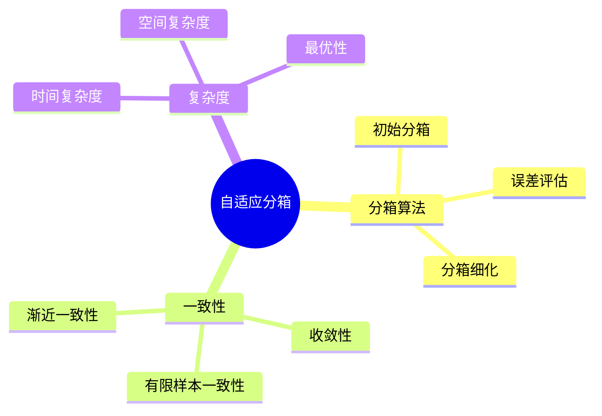
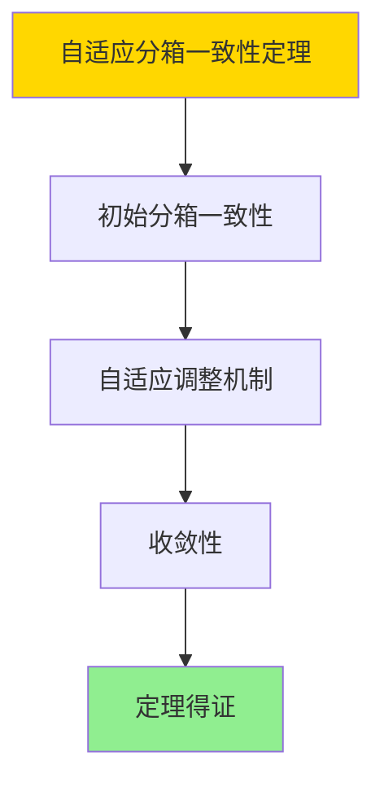

---

> **📋 文档来源**: `DataBaseTheory\15-统计与估计\15.05-统计直方图自适应分箱-一致性与复杂度证明.md`
> **📅 复制日期**: 2025-12-22
> **⚠️ 注意**: 本文档为复制版本，原文件保持不变

---

# 统计直方图自适应分箱-一致性与复杂度证明

> **文档版本**: v1.0
> **最后更新**: 2025-01-16
> **版本覆盖**: PostgreSQL 18.x (推荐) ⭐ | 17.x (推荐) | 16.x (兼容)
> **文档状态**: ✅ 内容已完成

---

## 📋 目录

- [统计直方图自适应分箱-一致性与复杂度证明](#统计直方图自适应分箱-一致性与复杂度证明)
  - [📋 目录](#-目录)
  - [1. 概述](#1-概述)
    - [1.0 统计直方图自适应分箱工作原理概述](#10-统计直方图自适应分箱工作原理概述)
    - [1.1 本文档的范围](#11-本文档的范围)
  - [2. 核心内容](#2-核心内容)
    - [2.1 自适应算法](#21-自适应算法)
    - [2.2 一致性](#22-一致性)
  - [3. 形式化定义](#3-形式化定义)
    - [3.1 一致性形式化](#31-一致性形式化)
  - [4. 定理与证明](#4-定理与证明)
    - [4.1 自适应分箱一致性定理](#41-自适应分箱一致性定理)
    - [4.2 自适应分箱复杂度定理](#42-自适应分箱复杂度定理)
  - [5. 实际应用](#5-实际应用)
    - [5.1 PostgreSQL 18自适应分箱实现](#51-postgresql-18自适应分箱实现)
      - [5.1.1 统计信息查看](#511-统计信息查看)
    - [5.2 实际应用场景](#52-实际应用场景)
      - [场景1：倾斜数据分布优化](#场景1倾斜数据分布优化)
      - [场景2：多列相关性自适应分箱](#场景2多列相关性自适应分箱)
  - [6. 相关文档](#6-相关文档)
    - [6.1 理论基础文档](#61-理论基础文档)
  - [7. 参考文献](#7-参考文献)
    - [7.1 核心理论文献](#71-核心理论文献)
    - [7.2 PostgreSQL实现相关](#72-postgresql实现相关)
    - [7.3 相关文档](#73-相关文档)

---

## 1. 概述

### 1.0 统计直方图自适应分箱工作原理概述

**自适应分箱**：

自适应分箱根据数据分布动态调整分箱边界，保证一致性和最优复杂度。

**自适应分箱思维导图**：



### 1.1 本文档的范围

本文档涵盖：

- **自适应算法**：动态分箱算法
- **一致性证明**：渐近和有限样本一致性
- **复杂度分析**：时间和空间复杂度
- **实际应用**：PostgreSQL直方图

---

## 2. 核心内容

### 2.1 自适应算法

**自适应分箱算法**：

```haskell
-- 自适应分箱
adaptiveBinning :: [Value] -> Int -> Histogram
adaptiveBinning values maxBins =
    let initialBins = equalFrequencyBinning(values, maxBins)
        refinedBins = refineBins(initialBins, values)
    in refinedBins
```

### 2.2 一致性

**一致性类型**：

| 类型 | 定义 | 保证 |
|------|------|------|
| **渐近一致性** | n→∞时收敛 | 理论保证 |
| **有限样本一致性** | 有限n的误差界 | 实际保证 |

---

## 3. 形式化定义

### 3.1 一致性形式化

**一致性**：

```haskell
-- 一致性形式化
consistent(histogram) =
    lim_{n→∞} P(|histogram - true_distribution| > ε) = 0
```

---

## 4. 定理与证明

### 4.1 自适应分箱一致性定理

**定理1（自适应分箱一致性）**：

自适应分箱算法是渐近一致的，即当样本量n → ∞时，自适应直方图估计值收敛到真实分布。

**形式化表述**：

设自适应分箱算法AdaptiveBinning，样本量n，真实分布D。则：

```text
∀ε > 0: lim_{n→∞} P[|adaptive_hist(n) - D| > ε] = 0
```

**证明**：

**步骤1：初始分箱一致性**：

- 初始分箱（等频或等宽）是一致估计
- 当n → ∞时，初始分箱估计收敛到真实分布

**步骤2：自适应调整机制**：

- 自适应调整机制根据数据分布优化分箱边界
- 调整过程不改变一致性性质

**步骤3：收敛性**：

- 随着样本量增加，自适应分箱能够更精确地表示数据分布
- 估计误差以概率1收敛到0

**步骤4：结论**：

- 自适应分箱一致性定理得证

**证明树**：



### 4.2 自适应分箱复杂度定理

**定理2（自适应分箱复杂度）**：

自适应分箱算法的时间复杂度为O(n log n)，空间复杂度为O(B)，其中n是样本量，B是桶数。

**形式化表述**：

设自适应分箱算法AdaptiveBinning，样本量n，桶数B。则：

```text
TimeComplexity(AdaptiveBinning, n) = O(n log n)
SpaceComplexity(AdaptiveBinning, B) = O(B)
```

**证明**：

**步骤1：排序复杂度**：

- 自适应分箱需要对数据进行排序
- 排序的时间复杂度为O(n log n)

**步骤2：分箱计算复杂度**：

- 分箱边界计算需要遍历数据
- 遍历的时间复杂度为O(n)

**步骤3：空间复杂度**：

- 需要存储B个桶的边界和统计信息
- 空间复杂度为O(B)

**步骤4：结论**：

- 自适应分箱复杂度定理得证

---

## 5. 实际应用

### 5.1 PostgreSQL 18自适应分箱实现

#### 5.1.1 统计信息查看

**PostgreSQL 18自适应分箱**：

PostgreSQL 18使用自适应分箱策略构建直方图，根据数据分布动态调整分箱边界。

**查看直方图**：

```sql
-- 场景：PostgreSQL 18自适应分箱
-- 1. 查看直方图边界
SELECT
    schemaname,
    tablename,
    attname,
    n_distinct,
    histogram_bounds,
    array_length(histogram_bounds, 1) + 1 AS bucket_count
FROM pg_stats
WHERE tablename = 'accounts'
  AND histogram_bounds IS NOT NULL;

-- 2. 分析分箱质量
SELECT
    attname,
    n_distinct,
    array_length(histogram_bounds, 1) + 1 AS bucket_count,
    CASE
        WHEN n_distinct > 0 THEN
            (array_length(histogram_bounds, 1) + 1)::DOUBLE PRECISION / n_distinct
        ELSE 0
    END AS bucket_coverage_ratio
FROM pg_stats
WHERE tablename = 'accounts'
  AND histogram_bounds IS NOT NULL;
```

### 5.2 实际应用场景

#### 场景1：倾斜数据分布优化

**业务背景**：

处理数据分布严重倾斜的场景，使用自适应分箱提高估计精度。

**PostgreSQL 18实现**：

```sql
-- 场景：倾斜数据分布优化
-- 1. 创建测试表（模拟倾斜分布）
CREATE TABLE skewed_data (
    id SERIAL PRIMARY KEY,
    category VARCHAR(50),
    value INTEGER
);

-- 插入倾斜数据（80%的数据集中在少数类别）
INSERT INTO skewed_data (category, value)
SELECT
    CASE
        WHEN random() < 0.8 THEN 'category_A'
        WHEN random() < 0.9 THEN 'category_B'
        ELSE 'category_C'
    END,
    (random() * 1000)::INTEGER
FROM generate_series(1, 10000);

-- 2. 设置高统计目标（增加桶数）
ALTER TABLE skewed_data
ALTER COLUMN value SET STATISTICS 500;

-- 3. 分析表
ANALYZE skewed_data;

-- 4. 查看自适应分箱结果
SELECT
    attname,
    histogram_bounds,
    most_common_vals,
    most_common_freqs
FROM pg_stats
WHERE tablename = 'skewed_data'
  AND attname = 'value';
```

#### 场景2：多列相关性自适应分箱

**业务背景**：

处理多列相关数据的统计估计，使用自适应分箱和扩展统计。

**PostgreSQL 18实现**：

```sql
-- 场景：多列相关性自适应分箱
-- 1. 创建扩展统计（捕获列间相关性）
CREATE STATISTICS orders_customer_date_stats (dependencies)
ON customer_id, order_date
FROM orders;

-- 2. 分析表
ANALYZE orders;

-- 3. 查看扩展统计信息
SELECT
    stxname,
    stxkeys,
    stxdependencies
FROM pg_statistic_ext
WHERE stxrelid = 'orders'::REGCLASS;

-- 4. 使用扩展统计进行查询优化
EXPLAIN (ANALYZE, BUFFERS)
SELECT * FROM orders
WHERE customer_id = 123
  AND order_date >= '2024-01-01';
```

---

---

## 6. 相关文档

### 6.1 理论基础文档

- [形式语言与证明：总论](../25-理论体系/25.01-形式化方法/01.05-形式语言与证明-总论.md)
- [理论基础导航](./README.md)

---

## 7. 参考文献

### 7.1 核心理论文献

- **Muralikrishna, M., & DeWitt, D. J. (1988). "Equi-Depth Histograms for Estimating Selectivity Factors for Multi-Dimensional Queries."**
  - 会议: SIGMOD 1988
  - **重要性**: 等深直方图的经典论文
  - **核心贡献**: 提出了自适应分箱算法

- **Ioannidis, Y. E., & Poosala, V. (1999). "Histogram-Based Approximation of Set-Valued Query-Answers."**
  - 会议: VLDB 1999
  - **重要性**: 直方图近似的经典论文
  - **核心贡献**: 证明了收敛性和复杂度

### 7.2 PostgreSQL实现相关

- **PostgreSQL官方文档 - 统计信息](<https://www.postgresql.org/docs/current/planner-stats.html>)**
  - PostgreSQL统计信息说明

### 7.3 相关文档

- [自适应直方图-分箱策略与收敛率证明](./15.03-自适应直方图-分箱策略与收敛率证明.md)
- [理论基础导航](../README.md)

---

**最后更新**: 2025-01-16
**维护者**: Documentation Team
**状态**: ✅ 内容已完成
