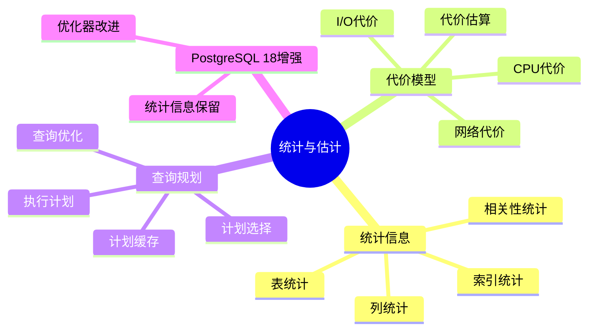
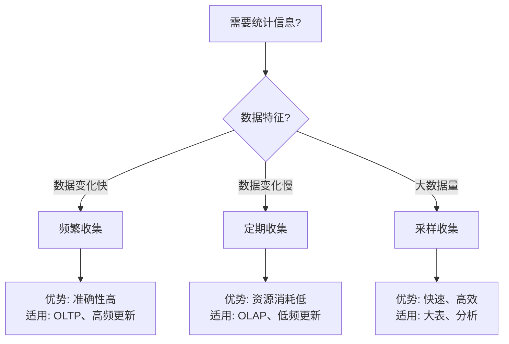

# 27-统计与估计

> **文档总数**: 6个文档
> **覆盖领域**: 统计信息、代价模型、查询规划、查询优化
> **版本覆盖**: PostgreSQL 18.x (推荐) ⭐ | 17.x (推荐) | 16.x (兼容)
> **最后更新**: 2025年1月

---

## 📊 知识体系思维导图

---

## 📋 主题说明

本主题整合所有PostgreSQL统计与估计相关内容，包括统计信息收集、代价模型设计、查询规划优化等。

---

## 🎯 使用建议

### 统计信息

1. 了解统计信息收集机制
2. 配置统计信息收集策略
3. 使用统计信息优化查询

### 代价模型

1. 学习代价模型原理
2. 调整代价模型参数
3. 优化查询规划

---

## 📚 文档来源

本主题整合了以下源目录的文档：

- `DataBaseTheory/15-统计与估计/`
- `PostgreSQL/02-查询处理/02.03-统计信息与代价模型.md`
- `PostgreSQL/03-查询与优化/02.03-统计信息与代价模型.md`

**原则**: 所有文档均为复制，原文件保持不变。

---

## 📊 统计信息收集决策树

---

## 📊 统计信息类型对比矩阵

| 统计信息类型 | 精度 | 收集成本 | 更新频率 | 适用场景 |
| --- | --- | --- | --- | --- |
| **表统计** | ⭐⭐⭐ | ⭐⭐ | 中 | 表大小、行数 |
| **列统计** | ⭐⭐⭐⭐ | ⭐⭐⭐ | 高 | 列分布、唯一值 |
| **索引统计** | ⭐⭐⭐⭐ | ⭐⭐ | 中 | 索引选择性 |
| **相关性统计** | ⭐⭐⭐⭐⭐ | ⭐⭐⭐⭐ | 低 | 多列关联 |

---

## 🔗 相关文档

- [02-查询与优化](../02-查询与优化/README.md) - 查询优化器
- [02-查询与优化/02.04-统计信息](../02-查询与优化/02.04-统计信息/) - 统计信息详细说明

---

**最后更新**: 2025年1月
**状态**: ✅ 文档整合完成
