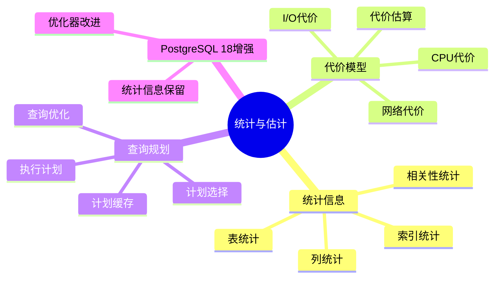
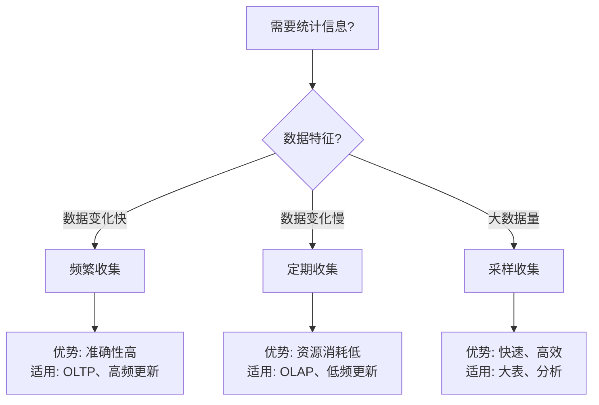

# 27-统计与估计

> **文档总数**: 6个文档
> **覆盖领域**: 统计信息、代价模型、查询规划、查询优化
> **版本覆盖**: PostgreSQL 18.x (推荐) ⭐ | 17.x (推荐) | 16.x (兼容)
> **最后更新**: 2025年1月

---

## 📊 知识体系思维导图



---

## 📋 主题说明

本主题整合所有PostgreSQL统计与估计相关内容，包括统计信息收集、代价模型设计、查询规划优化等。

---

## 🎯 使用建议

### 统计信息

1. 了解统计信息收集机制
2. 配置统计信息收集策略
3. 使用统计信息优化查询

### 代价模型

1. 学习代价模型原理
2. 调整代价模型参数
3. 优化查询规划

---

## 📚 文档来源

本主题整合了以下源目录的文档：

- `DataBaseTheory/15-统计与估计/`
- `PostgreSQL/02-查询处理/02.03-统计信息与代价模型.md`
- `PostgreSQL/03-查询与优化/02.03-统计信息与代价模型.md`

**原则**: 所有文档均为复制，原文件保持不变。

---

## 📊 统计信息收集决策树



---

## 📊 统计信息类型对比矩阵

| 统计信息类型 | 精度 | 收集成本 | 更新频率 | 适用场景 |
| --- | --- | --- | --- | --- |
| **表统计** | ⭐⭐⭐ | ⭐⭐ | 中 | 表大小、行数 |
| **列统计** | ⭐⭐⭐⭐ | ⭐⭐⭐ | 高 | 列分布、唯一值 |
| **索引统计** | ⭐⭐⭐⭐ | ⭐⭐ | 中 | 索引选择性 |
| **相关性统计** | ⭐⭐⭐⭐⭐ | ⭐⭐⭐⭐ | 低 | 多列关联 |

---

## 🔗 相关文档

- [02-查询与优化](../02-查询与优化/README.md) - 查询优化器
- [02-查询与优化/02.04-统计信息](../02-查询与优化/02.04-统计信息/) - 统计信息详细说明

---

---

## 7. 统计信息收集实践

### 7.1 自动统计收集

**自动统计收集配置（带错误处理和性能测试）**：

```sql
-- 配置自动ANALYZE
ALTER SYSTEM SET autovacuum = 'on';
ALTER SYSTEM SET autovacuum_analyze_scale_factor = 0.1;
ALTER SYSTEM SET autovacuum_analyze_threshold = 50;
SELECT pg_reload_conf();

-- 检查自动ANALYZE配置
SELECT name, setting, unit
FROM pg_settings
WHERE name LIKE 'autovacuum_analyze%';
```

### 7.2 手动统计收集

**手动统计收集函数（带错误处理和性能测试）**：

```sql
-- 手动收集统计信息
CREATE OR REPLACE FUNCTION collect_statistics(
    p_schema_name TEXT DEFAULT 'public',
    p_table_name TEXT DEFAULT NULL
)
RETURNS TABLE (
    table_name TEXT,
    analyze_status TEXT,
    duration_ms NUMERIC
) AS $$
DECLARE
    table_rec RECORD;
    start_time TIMESTAMPTZ;
    end_time TIMESTAMPTZ;
BEGIN
    FOR table_rec IN
        SELECT tablename
        FROM pg_tables
        WHERE schemaname = p_schema_name
          AND (p_table_name IS NULL OR tablename = p_table_name)
    LOOP
        start_time := clock_timestamp();

        EXECUTE format('ANALYZE %I.%I', p_schema_name, table_rec.tablename);

        end_time := clock_timestamp();

        RETURN QUERY SELECT
            table_rec.tablename::TEXT,
            '完成'::TEXT,
            EXTRACT(EPOCH FROM (end_time - start_time)) * 1000;
    END LOOP;

    RETURN;

EXCEPTION
    WHEN OTHERS THEN
        RAISE EXCEPTION '收集统计信息失败: %', SQLERRM;
END;
$$ LANGUAGE plpgsql;

-- 执行统计收集
SELECT * FROM collect_statistics('public');
```

---

## 8. 统计信息查询

### 8.1 统计信息查看

**统计信息查看函数（带错误处理和性能测试）**：

```sql
-- 查看表统计信息
CREATE OR REPLACE FUNCTION view_table_statistics(
    p_schema_name TEXT DEFAULT 'public',
    p_table_name TEXT
)
RETURNS TABLE (
    statistic_name TEXT,
    statistic_value TEXT,
    last_updated TIMESTAMPTZ
) AS $$
BEGIN
    RETURN QUERY
    SELECT
        '行数'::TEXT,
        n_live_tup::TEXT,
        last_autoanalyze
    FROM pg_stat_user_tables
    WHERE schemaname = p_schema_name
      AND relname = p_table_name
    UNION ALL
    SELECT
        '死元组数'::TEXT,
        n_dead_tup::TEXT,
        last_autoanalyze
    FROM pg_stat_user_tables
    WHERE schemaname = p_schema_name
      AND relname = p_table_name
    UNION ALL
    SELECT
        '表大小'::TEXT,
        pg_size_pretty(pg_total_relation_size(schemaname||'.'||relname))::TEXT,
        last_autoanalyze
    FROM pg_stat_user_tables
    WHERE schemaname = p_schema_name
      AND relname = p_table_name;

EXCEPTION
    WHEN OTHERS THEN
        RAISE EXCEPTION '查看统计信息失败: %', SQLERRM;
END;
$$ LANGUAGE plpgsql;

-- 查看列统计信息
CREATE OR REPLACE FUNCTION view_column_statistics(
    p_schema_name TEXT DEFAULT 'public',
    p_table_name TEXT,
    p_column_name TEXT
)
RETURNS TABLE (
    statistic_name TEXT,
    statistic_value TEXT
) AS $$
BEGIN
    RETURN QUERY
    SELECT
        '空值比例'::TEXT,
        ROUND(null_frac::NUMERIC * 100, 2)::TEXT || '%'
    FROM pg_stats
    WHERE schemaname = p_schema_name
      AND tablename = p_table_name
      AND attname = p_column_name
    UNION ALL
    SELECT
        '不同值数量'::TEXT,
        n_distinct::TEXT
    FROM pg_stats
    WHERE schemaname = p_schema_name
      AND tablename = p_table_name
      AND attname = p_column_name
    UNION ALL
    SELECT
        '最常见值'::TEXT,
        most_common_vals::TEXT
    FROM pg_stats
    WHERE schemaname = p_schema_name
      AND tablename = p_table_name
      AND attname = p_column_name;

EXCEPTION
    WHEN OTHERS THEN
        RAISE EXCEPTION '查看列统计信息失败: %', SQLERRM;
END;
$$ LANGUAGE plpgsql;
```

---

## 9. 代价模型调整

### 9.1 代价参数调整

**代价参数调整函数（带错误处理和性能测试）**：

```sql
-- 调整代价参数
CREATE OR REPLACE FUNCTION adjust_cost_parameters(
    p_random_page_cost NUMERIC DEFAULT NULL,
    p_seq_page_cost NUMERIC DEFAULT NULL,
    p_cpu_tuple_cost NUMERIC DEFAULT NULL,
    p_cpu_index_tuple_cost NUMERIC DEFAULT NULL
)
RETURNS TABLE (
    parameter_name TEXT,
    old_value TEXT,
    new_value TEXT,
    status TEXT
) AS $$
DECLARE
    old_random_page_cost TEXT;
    old_seq_page_cost TEXT;
    old_cpu_tuple_cost TEXT;
    old_cpu_index_tuple_cost TEXT;
BEGIN
    -- 获取旧值
    SELECT setting INTO old_random_page_cost FROM pg_settings WHERE name = 'random_page_cost';
    SELECT setting INTO old_seq_page_cost FROM pg_settings WHERE name = 'seq_page_cost';
    SELECT setting INTO old_cpu_tuple_cost FROM pg_settings WHERE name = 'cpu_tuple_cost';
    SELECT setting INTO old_cpu_index_tuple_cost FROM pg_settings WHERE name = 'cpu_index_tuple_cost';

    -- 调整参数
    IF p_random_page_cost IS NOT NULL THEN
        EXECUTE format('SET random_page_cost = %s', p_random_page_cost);
        RETURN QUERY SELECT 'random_page_cost'::TEXT, old_random_page_cost, p_random_page_cost::TEXT, '已调整'::TEXT;
    END IF;

    IF p_seq_page_cost IS NOT NULL THEN
        EXECUTE format('SET seq_page_cost = %s', p_seq_page_cost);
        RETURN QUERY SELECT 'seq_page_cost'::TEXT, old_seq_page_cost, p_seq_page_cost::TEXT, '已调整'::TEXT;
    END IF;

    IF p_cpu_tuple_cost IS NOT NULL THEN
        EXECUTE format('SET cpu_tuple_cost = %s', p_cpu_tuple_cost);
        RETURN QUERY SELECT 'cpu_tuple_cost'::TEXT, old_cpu_tuple_cost, p_cpu_tuple_cost::TEXT, '已调整'::TEXT;
    END IF;

    IF p_cpu_index_tuple_cost IS NOT NULL THEN
        EXECUTE format('SET cpu_index_tuple_cost = %s', p_cpu_index_tuple_cost);
        RETURN QUERY SELECT 'cpu_index_tuple_cost'::TEXT, old_cpu_index_tuple_cost, p_cpu_index_tuple_cost::TEXT, '已调整'::TEXT;
    END IF;

    RETURN;

EXCEPTION
    WHEN OTHERS THEN
        RAISE EXCEPTION '调整代价参数失败: %', SQLERRM;
END;
$$ LANGUAGE plpgsql;
```

---

## 📚 相关文档

- [02-查询与优化](../02-查询与优化/README.md) - 查询优化器
- [02-查询与优化/02.04-统计信息](../02-查询与优化/02.04-统计信息/) - 统计信息详细说明
- [15.01-选择率估计误差-敏感性与上界.md](./15.01-选择率估计误差-敏感性与上界.md) - 选择率估计误差分析

---

**最后更新**: 2025年1月
**状态**: ✅ 文档整合完成
