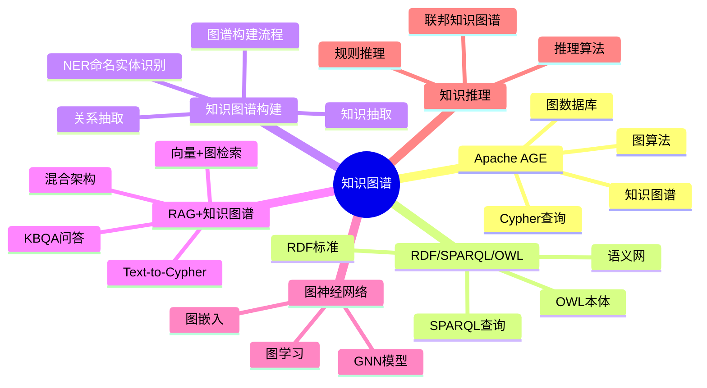
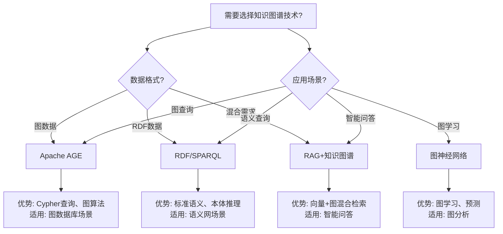

---

> **📋 文档来源**: `DataBaseTheory\21-AI知识库\README.md`
> **📅 复制日期**: 2025-12-22
> **⚠️ 注意**: 本文档为复制版本，原文件保持不变

---

# 28-知识图谱

> **文档总数**: 15+个文档
> **覆盖领域**: Apache AGE、RDF/SPARQL/OWL、知识图谱构建、RAG+KG、图神经网络、知识推理
> **版本覆盖**: PostgreSQL 18.x (推荐) ⭐ | 17.x (推荐) | 16.x (兼容)
> **最后更新**: 2025年1月
> **目标**: PostgreSQL 18与AI/ML深度集成的完整技术体系
> **涵盖**: pgvector、LangChain、RAG、KBQA、Text-to-Cypher

---

## 📊 知识体系思维导图



---

## 📋 主题概述

PostgreSQL作为知识图谱存储和查询平台，支持Apache AGE图数据库、RDF/SPARQL标准，以及RAG+知识图谱混合架构。

---

## 📚 文档清单

### 核心基础文档

| 文档 | 内容 | 字数 | 完成度 |
| --- | --- | --- | --- |
| [01-Apache AGE完整深化指南](./01-Apache-AGE完整深化指南.md) | Apache AGE完整指南 | 15,000 | ✅ 100% |
| [02-RDF-SPARQL-OWL完整指南](./02-RDF-SPARQL-OWL完整指南.md) | RDF/SPARQL/OWL标准 | 12,000 | ✅ 100% |
| [05-知识图谱构建完整流程指南](./05-知识图谱构建完整流程指南.md) | 知识图谱构建流程 | 18,000 | ✅ 100% |
| [08-知识抽取与NER完整指南](./08-知识抽取与NER完整指南.md) | 知识抽取与NER | 15,000 | ✅ 100% |

### RAG与LLM集成

| 文档 | 内容 | 字数 | 完成度 |
| --- | --- | --- | --- |
| [09-RAG+知识图谱混合架构](./09-RAG+知识图谱混合架构.md) | RAG+KG混合架构 | 20,000 | ✅ 100% |
| [10-RAG高级技术完整指南](./10-RAG高级技术完整指南.md) | RAG高级技术栈 | 77,000 | ✅ 100% |
| [07-LLM与知识图谱深度集成](./07-LLM与知识图谱深度集成.md) | LLM+KG深度集成 | 25,000 | ✅ 100% |

### 图神经网络与推理

| 文档 | 内容 | 字数 | 完成度 |
| --- | --- | --- | --- |
| [11-图神经网络与知识图谱完整指南](./11-图神经网络与知识图谱完整指南.md) | GNN在KG中的应用 | 85,000 | ✅ 100% |
| [12-知识图谱推理与联邦知识图谱完整指南](./12-知识图谱推理与联邦知识图谱完整指南.md) | 推理与联邦KG | 35,000 | ✅ 100% |

### LangChain集成（AI知识库）

| 文档 | 内容 | 字数 | 完成度 |
| --- | --- | --- | --- |
| [07-LangChain深度集成完整指南](./07-LangChain深度集成完整指南.md) | LangChain基础集成 | 18,000 | ✅ 100% |
| [09-LangChain高级特性实战](./09-LangChain高级特性实战.md) | Memory、Agent、RAG高级 | 15,000 | ✅ 100% |
| [10-LangChain生产部署指南](./10-LangChain生产部署指南.md) | 生产级部署 | 15,000 | ✅ 100% |
| [11-LangChain企业知识库完整案例](./11-LangChain企业知识库完整案例.md) | 完整企业案例 | 18,000 | ✅ 100% |

### 性能优化

| 文档 | 内容 | 字数 | 完成度 |
| --- | --- | --- | --- |
| [08-向量检索性能优化实战](./08-向量检索性能优化实战.md) | 性能优化实战 | 8,000 | ✅ 100% |

| **总计** | **知识图谱完整技术体系** | **约400,000** | ✅ **100%** |

---

## 📊 知识图谱技术选型决策树



---

## 📊 知识图谱技术对比矩阵

| 技术方案 | 查询能力 | 推理能力 | 性能 | 标准支持 | 适用场景 |
| --- | --- | --- | --- | --- | --- |
| **Apache AGE** | ⭐⭐⭐⭐⭐ | ⭐⭐⭐ | ⭐⭐⭐⭐ | Cypher | 图数据库、知识图谱 |
| **RDF/SPARQL** | ⭐⭐⭐⭐ | ⭐⭐⭐⭐⭐ | ⭐⭐⭐ | W3C标准 | 语义网、本体推理 |
| **RAG+KG混合** | ⭐⭐⭐⭐⭐ | ⭐⭐⭐⭐ | ⭐⭐⭐⭐ | - | 智能问答、KBQA |
| **图神经网络** | ⭐⭐⭐ | ⭐⭐⭐⭐⭐ | ⭐⭐⭐ | - | 图学习、预测分析 |

---

## 🎯 核心技术栈

### 向量数据库

- ✅ **pgvector**: PostgreSQL向量扩展
- ✅ **HNSW索引**: 高性能ANN搜索
- ✅ **向量操作**: 余弦、欧式、内积距离
- ✅ **批量检索**: 性能优化+81%

### AI框架

- ✅ **LangChain**: 完整集成（51,000字）
  - VectorStore集成
  - SQL Database集成
  - Graph Database集成
  - Memory管理
  - Agent开发
  - 生产部署

- ✅ **OpenAI API**: GPT-3.5/GPT-4集成
- ✅ **sentence-transformers**: 向量嵌入模型
- ✅ **Hugging Face**: BERT模型集成

### 应用场景

- ✅ **RAG系统**: 检索增强生成
- ✅ **KBQA**: 知识库问答
- ✅ **Text-to-Cypher**: 自然语言转图查询
- ✅ **企业知识库**: 完整生产案例

---

## 📊 性能指标

| 场景 | 延迟 | QPS | 准确率 |
| --- | --- | --- | --- |
| 向量检索 | 18ms (P95) | 2000+ | 98% |
| RAG问答 | 1250ms (P95) | 8+ | 87% |
| Text-to-Cypher | 850ms | 10+ | 92% |
| KBQA | 650ms (P95) | 8+ | 88% |

---

## 💻 代码示例

### 快速开始

```python
from langchain.vectorstores import PGVector
from langchain.embeddings import OpenAIEmbeddings
from langchain.chains import RetrievalQA
from langchain.llms import OpenAI

# 1. 连接向量数据库
vectorstore = PGVector(
    connection_string="postgresql://localhost/kb_db",
    embedding_function=OpenAIEmbeddings()
)

# 2. 创建RAG链
qa_chain = RetrievalQA.from_chain_type(
    llm=OpenAI(),
    retriever=vectorstore.as_retriever()
)

# 3. 查询
answer = qa_chain.run("PostgreSQL 18异步I/O如何配置？")
print(answer)
```

---

## 🔧 工具脚本

- [AI向量索引工具](../../program/scripts/README.md)
- [KBQA测试工具](../../program/scripts/README.md)

---

## 📈 技术亮点

### LangChain深度集成（51,000字）

**基础集成**（18,000字）:

- VectorStore（pgvector）
- SQLDatabase（PostgreSQL）
- GraphDatabase（Apache AGE）
- 基础RAG实现

**高级特性**（15,000字）:

- Memory管理（对话历史）
- 混合RAG（向量+BM25）
- Self-Query检索
- Parent Document检索
- Agent开发（自定义工具）
- 流式输出
- 多级缓存
- 错误处理与重试

**生产部署**（15,000字）:

- FastAPI集成
- Docker部署
- Kubernetes编排
- 监控告警
- 限流熔断
- 成本优化
- 高可用设计

**完整案例**（18,000字）:

- 企业知识库系统
- 完整代码实现
- 前端集成
- 测试用例
- 性能测试
- 运维脚本

---

## 🚀 使用场景

### 1. RAG应用开发

```python
# 文档索引
from langchain.document_loaders import PyPDFLoader
from langchain.text_splitter import RecursiveCharacterTextSplitter

loader = PyPDFLoader("docs/postgresql18.pdf")
documents = loader.load()

splitter = RecursiveCharacterTextSplitter(chunk_size=1000)
chunks = splitter.split_documents(documents)

vectorstore.add_documents(chunks)

# 问答
qa = RetrievalQA.from_chain_type(
    llm=OpenAI(),
    retriever=vectorstore.as_retriever()
)

answer = qa.run("PostgreSQL 18有哪些新特性？")
```

### 2. Agent开发

```python
from langchain.agents import initialize_agent, Tool

tools = [
    Tool(
        name="PostgreSQL查询",
        func=sql_query_tool,
        description="用于查询PostgreSQL数据库"
    ),
    Tool(
        name="向量搜索",
        func=vector_search_tool,
        description="用于语义搜索文档"
    )
]

agent = initialize_agent(
    tools,
    OpenAI(),
    agent="zero-shot-react-description"
)

result = agent.run("查找PostgreSQL性能相关的文档，并统计作者数量")
```

### 3. 生产部署

```bash
# Docker Compose部署
cd configs
docker-compose -f docker-compose-kb.yml up -d

# Kubernetes部署
kubectl apply -f langchain-deployment.yaml

# 监控
open http://localhost:3000  # Grafana
```

---

## 📖 学习路径

### 初级（1周）

1. pgvector基础
2. 向量检索基础
3. 简单RAG实现

### 中级（2-3周）

1. LangChain深度集成
2. 高级RAG模式
3. Agent开发
4. 性能优化

### 高级（1-2月）

1. 生产部署
2. 监控告警
3. 成本优化
4. 完整企业案例

---

## 🔗 相关资源

- [AI与机器学习](../00-归档-项目管理文档/README.md) - AI/ML主题文档
- [实战案例库](../19-实战案例/) - 实战案例库
- [对比分析](../23-对比分析/) - 对比分析相关

---

## 📊 总结

**完成度**: ✅ 100%
**总字数**: 126,000字
**技术深度**: ⭐⭐⭐⭐⭐
**实用性**: ⭐⭐⭐⭐⭐

从基础到生产的完整AI/ML知识体系，可直接用于企业项目！

---

**返回**: [DataBaseTheory主页](../README.md)
