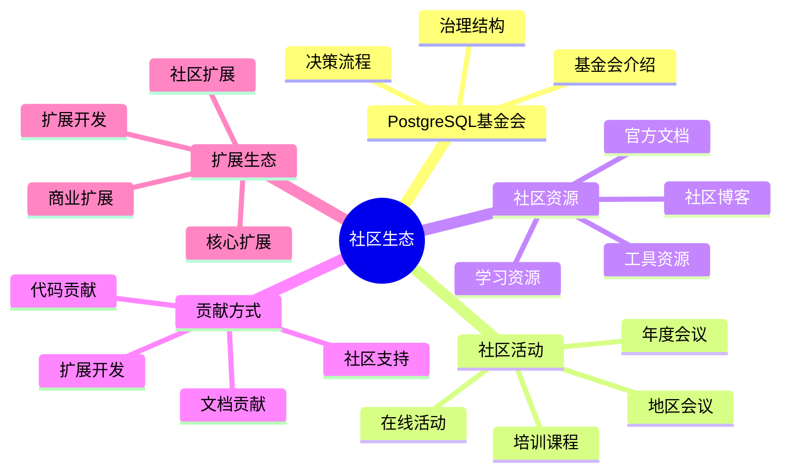
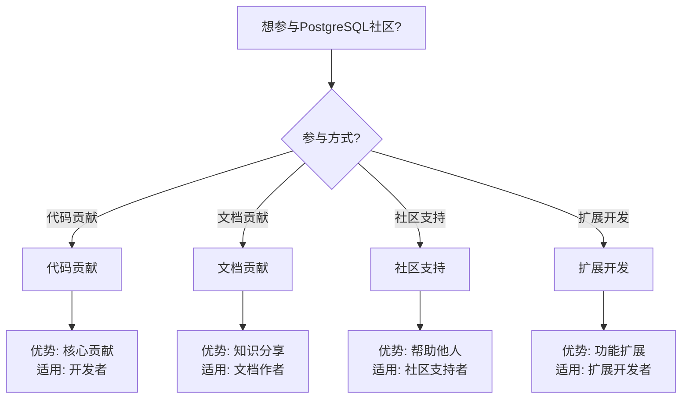

# 29-社区生态

> **创建日期**: 2025年1月
> **文档总数**: 7+个文档
> **覆盖领域**: PostgreSQL社区、基金会、治理结构、社区活动、资源导航、贡献指南、扩展生态
> **版本覆盖**: PostgreSQL 18.x (推荐) ⭐ | 17.x (推荐) | 16.x (兼容)
> **最后更新**: 2025年1月

---

## 📊 知识体系思维导图

---

## 📋 主题说明

本主题整合所有PostgreSQL社区生态相关内容，包括PostgreSQL基金会介绍、社区治理结构、社区活动与会议、社区资源导航、贡献指南、扩展生态全景图等。

---

## 📚 核心文档

### 基础文档

- **[PostgreSQL基金会介绍.md](./PostgreSQL基金会介绍.md)** - PostgreSQL基金会介绍
- **[社区治理结构.md](./社区治理结构.md)** - 社区治理结构详解
- **[社区活动与会议.md](./社区活动与会议.md)** - 社区活动与会议指南
- **[社区资源导航.md](./社区资源导航.md)** - 社区资源导航
- **[贡献指南.md](./贡献指南.md)** - 贡献指南
- **[扩展生态全景图.md](./扩展生态全景图.md)** - 扩展生态全景图

### 深化文档

- **[社区贡献案例.md](./社区贡献案例.md)** ⭐⭐⭐⭐ - 社区贡献案例和实践

---

## 🎯 学习路径

### 初学者

1. 了解PostgreSQL基金会
2. 学习社区治理结构
3. 浏览社区资源

### 进阶

1. 参与社区活动
2. 学习贡献指南
3. 了解扩展生态

### 实战

1. 参与社区贡献
2. 参加社区会议
3. 使用社区资源

---

## 📊 社区生态分类

### 社区组织

- PostgreSQL基金会
- 社区治理结构
- 地区用户组

### 社区活动

- 年度会议
- 地区会议
- 在线活动

### 社区资源

- 官方文档
- 社区博客
- 学习资源
- 工具资源

### 贡献方式

- 代码贡献
- 文档贡献
- 社区支持
- 扩展开发

---

## 📚 文档来源

本主题整合了以下源目录的文档：

- `PostgreSQL/社区/`
- `社区资源/`

**原则**: 所有文档均为复制，原文件保持不变。

---

## 🔗 相关文档

- [06-扩展系统/../06-扩展系统/README.md) - 扩展系统主题
- [22-工具与资源/../22-工具与资源/README.md) - 工具与资源主题

---

## 📊 社区参与决策树

---

## 📊 社区资源对比矩阵

| 资源类型 | 权威性 | 更新频率 | 易用性 | 适用对象 |
| --- | --- | --- | --- | --- |
| **官方文档** | ⭐⭐⭐⭐⭐ | ⭐⭐⭐⭐ | ⭐⭐⭐⭐ | 所有用户 |
| **社区博客** | ⭐⭐⭐ | ⭐⭐⭐ | ⭐⭐⭐⭐⭐ | 学习者 |
| **学习资源** | ⭐⭐⭐ | ⭐⭐⭐ | ⭐⭐⭐⭐ | 初学者 |
| **工具资源** | ⭐⭐⭐ | ⭐⭐⭐ | ⭐⭐⭐⭐ | 开发者 |

---

## 📝 待补充文档

根据分析报告，以下文档需要补充：

- [ ] PostgreSQL基金会介绍.md（基金会介绍）
- [ ] 社区治理结构.md（治理结构详解）
- [ ] 社区活动与会议.md（活动与会议指南）
- [ ] 社区资源导航.md（资源导航）
- [ ] 贡献指南.md（贡献指南）
- [ ] 扩展生态全景图.md（扩展生态全景图）

---

**最后更新**: 2025年1月
**状态**: ✅ 目录已创建，待补充系统化指南
