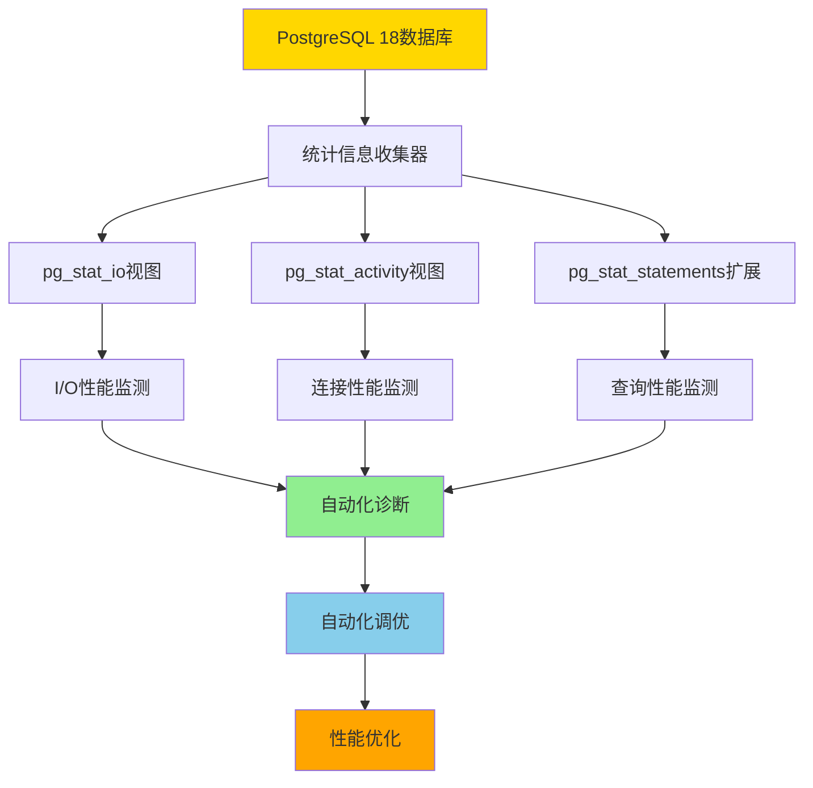

# 01-概述

> **所属主题**: PostgreSQL 18 自动化运维与自我监测
> **章节编号**: 01
> **创建日期**: 2025年1月

---

## 📋 目录

- [01-概述](#01-概述)
  - [📋 目录](#-目录)
  - [1.1 PostgreSQL 18自动化运维特性](#11-postgresql-18自动化运维特性)
  - [1.2 自我监测架构](#12-自我监测架构)
    - [架构说明](#架构说明)
  - [1.3 技术栈优势](#13-技术栈优势)
    - [内置统计信息](#内置统计信息)
    - [实时监控](#实时监控)
    - [I/O追踪](#io追踪)
    - [查询追踪](#查询追踪)
    - [自动化机制](#自动化机制)
    - [PostgreSQL 18新增特性](#postgresql-18新增特性)
  - [快速开始](#快速开始)
    - [学习路径](#学习路径)
    - [推荐阅读顺序](#推荐阅读顺序)
  - [相关资源](#相关资源)
    - [相关章节](#相关章节)
    - [参考资料](#参考资料)
  - [导航](#导航)

---

## 1.1 PostgreSQL 18自动化运维特性

**PostgreSQL 18自动化运维与自我监测**是PostgreSQL 18引入的核心能力，通过内置的统计信息、监控视图和自动化机制，实现数据库的完全自动化运维和自我监测，最大限度地利用PostgreSQL自身技术栈。

PostgreSQL 18提供了以下自动化运维特性：

1. **自动参数调优**：基于工作负载自动调整数据库参数
2. **自动索引优化**：自动识别和创建缺失索引
3. **自动统计信息更新**：根据数据变化率自动更新统计信息
4. **自动VACUUM优化**：智能调整VACUUM策略（支持并行VACUUM）
5. **自动性能诊断**：自动识别性能瓶颈和问题
6. **异步I/O支持**：通过异步I/O基础设施提升并发性能（PostgreSQL 18新增）
7. **NUMA架构优化**：支持NUMA感知，优化多处理器系统性能（PostgreSQL 18新增）
8. **并行查询增强**：pg_stat_statements新增并行工作进程追踪列（PostgreSQL 18新增）
9. **连接性能监测**：log_connections支持细粒度配置，记录连接阶段耗时（PostgreSQL 18新增）
10. **I/O性能增强**：pg_stat_io新增read_bytes和write_bytes列，提供更详细的I/O统计（PostgreSQL 18新增）
11. **EXPLAIN命令增强**：提供即时性能诊断，更细粒度的执行计划、缓存使用和索引效率信息（PostgreSQL 18新增）
12. **SET语句参数化追踪**：pg_stat_statements支持参数化SET语句追踪，减少重复语句膨胀（PostgreSQL 18新增）
13. **pg_upgrade优化**：支持保留优化器统计信息，并行数据库检查，--swap选项实现快速迁移（PostgreSQL 18新增）
14. **psql增强**：支持管道查询，新增\conninfo命令，WATCH_INTERVAL变量（PostgreSQL 18新增）
15. **虚拟生成列**：支持虚拟生成列，提高存储效率（PostgreSQL 18新增）
16. **索引优化**：B-树索引支持跳跃式扫描（Skip Scan），uuidv7()函数优化UUID索引性能（PostgreSQL 18新增）

---

## 1.2 自我监测架构

PostgreSQL 18的自我监测架构：

### 架构说明

- **统计信息收集器**：PostgreSQL 18内置的统计信息收集系统，自动收集数据库运行状态
- **监控视图**：pg_stat_io、pg_stat_activity、pg_stat_statements等视图提供实时监控数据
- **自动化诊断**：基于监控数据自动识别性能问题和瓶颈
- **自动化调优**：根据诊断结果自动调整参数和配置
- **性能优化**：持续优化数据库性能

---

## 1.3 技术栈优势

PostgreSQL 18自动化运维的技术栈优势：

### 内置统计信息

- **无需外部工具**：使用pg_stat_*视图即可完成监控
- **实时数据**：统计信息实时更新，无需轮询
- **零开销**：统计信息收集对性能影响极小

### 实时监控

- **pg_stat_activity**：实时监控活动连接和查询状态
- **pg_stat_io**：详细的I/O统计（PostgreSQL 18增强：read_bytes/write_bytes）
- **pg_stat_statements**：查询性能追踪（PostgreSQL 18新增：并行查询追踪）

### I/O追踪

- **pg_stat_io**：系统级I/O统计（PostgreSQL 18增强）
- **pg_stat_get_backend_io()**：后端级别I/O追踪（PostgreSQL 18新增）
- **pg_stat_reset_backend_stats()**：重置后端统计（PostgreSQL 18新增）

### 查询追踪

- **pg_stat_statements**：追踪所有查询性能
- **并行查询追踪**：parallel_workers_to_launch/parallel_workers_launched列（PostgreSQL 18新增）
- **SET语句参数化追踪**：减少统计信息膨胀（PostgreSQL 18新增）

### 自动化机制

- **autovacuum**：自动VACUUM，支持并行VACUUM（PostgreSQL 18新增）
- **autoanalyze**：自动ANALYZE，更新统计信息
- **异步I/O**：内置异步I/O基础设施（PostgreSQL 18新增）

### PostgreSQL 18新增特性

- **NUMA支持**：pg_shmem_allocations_numa视图查看内存跨节点分布
- **连接监测**：log_connections细粒度配置，记录连接阶段耗时
- **检查点统计**：pg_stat_checkpointer新增num_done列
- **EXPLAIN增强**：即时性能诊断，提供优化建议
- **升级工具优化**：pg_upgrade统计信息保留，并行检查，快速迁移
- **客户端工具增强**：psql管道查询，\conninfo命令，WATCH_INTERVAL变量

---

## 快速开始

### 学习路径

1. **了解特性**：阅读本章节了解PostgreSQL 18自动化运维的核心特性
2. **选择主题**：根据需求选择相应的主题深入阅读
3. **实践应用**：参考实际案例和最佳实践进行配置

### 推荐阅读顺序

| 学习阶段 | 推荐章节 | 说明 |
|---------|---------|------|
| **入门** | 01-概述（本章） | 了解整体架构和特性 |
| **基础** | 02-自动化性能调优 | 学习自动化调优方法 |
| **进阶** | 03-自我监测系统 | 掌握监测和诊断技术 |
| **实践** | 08-性能调优案例 | 学习实际应用案例 |
| **综合** | 06-综合方案 | 了解完整实施方案 |

## 相关资源

### 相关章节

- [02-自动化性能调优](../02-自动化性能调优/README.md) - 自动化性能调优功能
- [03-自我监测系统](../03-自我监测系统/README.md) - 自我监测系统
- [06-综合方案](../06-综合方案/README.md) - 综合自动化运维方案
- [10-最佳实践](../10-最佳实践/README.md) - 最佳实践指南

### 参考资料

- [PostgreSQL 18 官方文档](https://www.postgresql.org/docs/18/)
- [PostgreSQL 18 性能调优文档](https://www.postgresql.org/docs/18/performance-tips.html)
- [PostgreSQL 18 监控统计文档](https://www.postgresql.org/docs/18/monitoring-stats.html)

## 导航

- [返回主文档](../README.md)
- [下一章：02-自动化性能调优](../02-自动化性能调优/README.md)

---

**最后更新**: 2025年1月
**文档版本**: v2.0（已添加快速开始指南、学习路径、相关资源）
