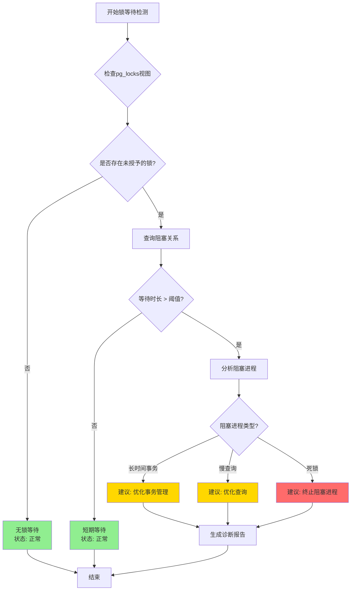
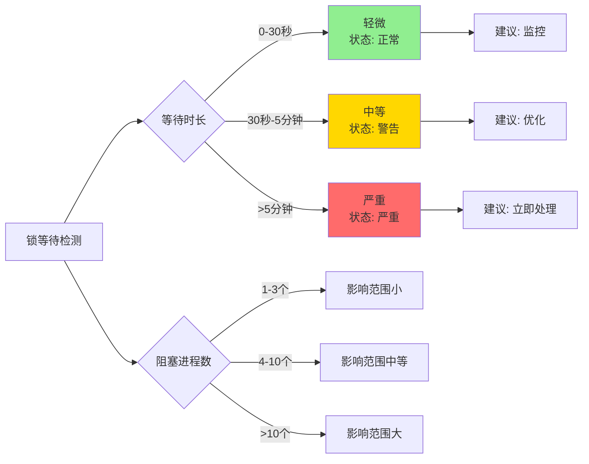
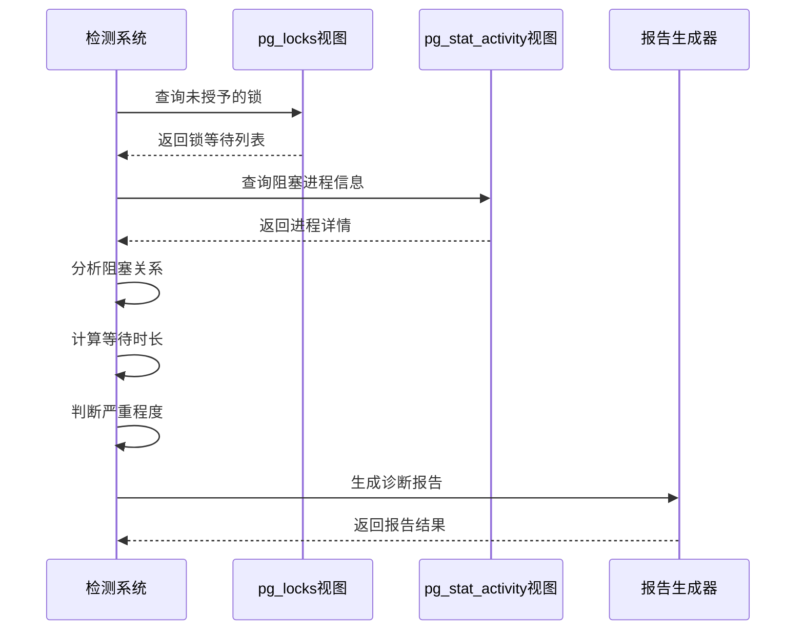
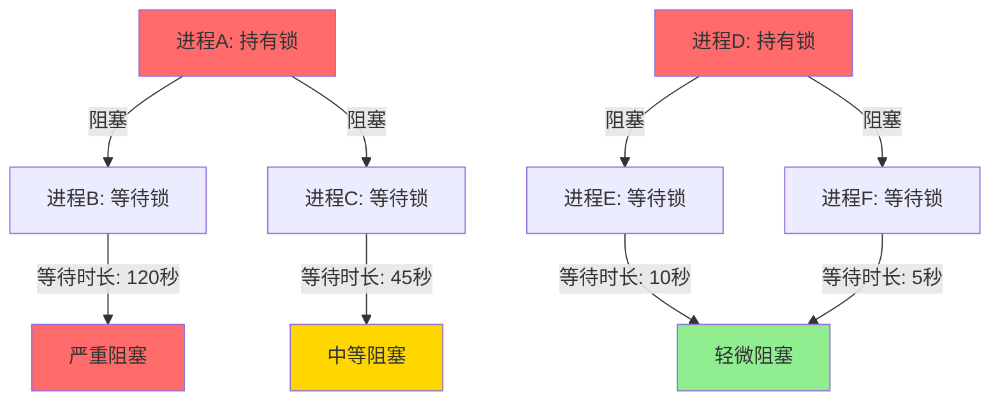
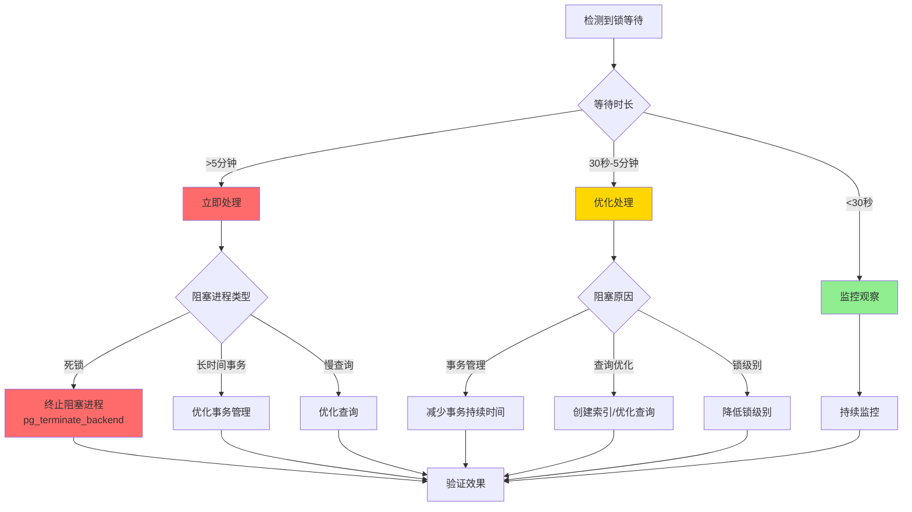
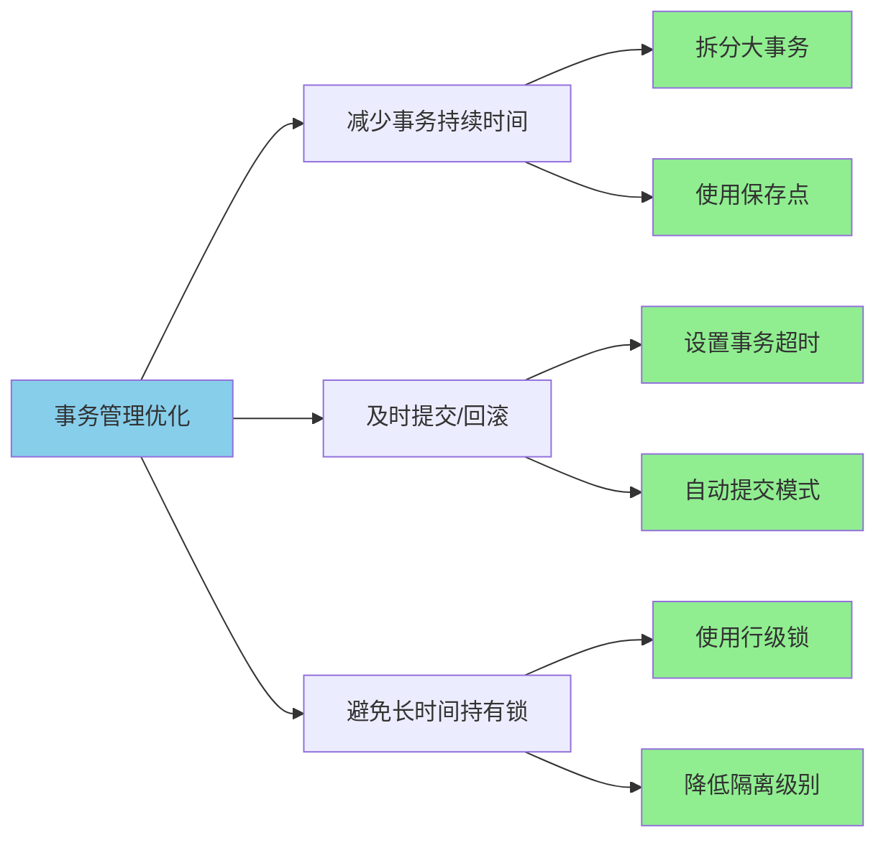
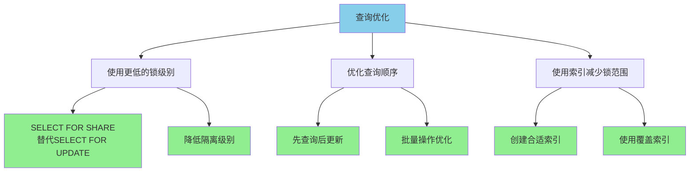
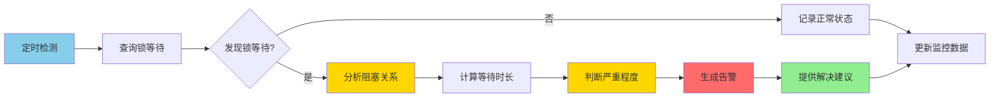
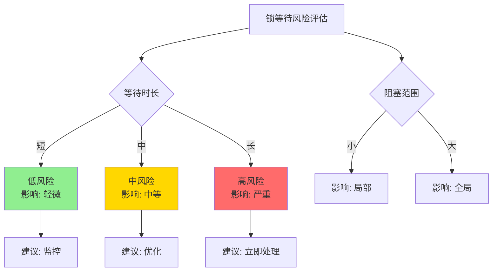

# 4.2 自动锁等待检测

> **所属主题**: 04-自动化诊断
> **章节编号**: 4.2
> **PostgreSQL版本**: 18+
> **难度等级**: ⭐⭐⭐⭐
> **相关章节**: [4.1 自动慢查询检测](./01-自动慢查询检测.md) | [4.3 自动资源瓶颈检测](./03-自动资源瓶颈检测.md)

---

## 📋 目录

- [4.2 自动锁等待检测](#42-自动锁等待检测)
  - [4.2.1 概述与背景](#421-概述与背景)
  - [4.2.2 锁等待检测决策树](#422-锁等待检测决策树)
  - [4.2.3 自动锁等待检测系统](#423-自动锁等待检测系统)
  - [4.2.4 锁等待分析](#424-锁等待分析)
  - [4.2.5 锁等待问题解决](#425-锁等待问题解决)
  - [4.2.6 性能优势与论证](#426-性能优势与论证)
  - [4.2.7 注意事项与最佳实践](#427-注意事项与最佳实践)
  - [4.2.8 导航](#428-导航)

---

## 4.2.1 概述与背景

PostgreSQL 18支持自动检测锁等待问题。锁等待是数据库性能问题的重要原因之一，自动锁等待检测可以帮助快速识别和解决锁等待问题。

### 4.2.1.1 什么是锁等待

锁等待是指一个数据库进程因为需要获取被其他进程持有的锁而被迫等待的情况。这是数据库性能问题的重要原因之一。

### 4.2.1.2 锁等待问题的影响

锁等待问题会导致：

- ❌ **查询阻塞**：被阻塞的查询无法执行
- ❌ **性能下降**：系统整体性能下降
- ❌ **用户体验差**：用户请求响应时间增加
- ❌ **资源浪费**：连接资源被占用但无法工作

### 4.2.1.3 自动检测的价值

PostgreSQL 18自动锁等待检测的价值：

- ✅ **快速识别**：自动识别锁等待情况
- ✅ **关系分析**：自动分析阻塞和被阻塞的关系
- ✅ **智能建议**：自动生成解决方案建议
- ✅ **持续监控**：支持定时监控和告警

---

## 4.2.2 锁等待检测决策树

### 4.2.2.1 锁等待检测决策流程



### 4.2.2.2 锁等待严重程度判断

### 4.2.2.3 检测决策论证

**论证：为什么需要自动锁等待检测？**

```
前提条件：
P1: 锁等待是数据库性能问题的重要原因
P2: 手动检测锁等待耗时且容易遗漏
P3: 自动检测可以快速识别问题

推理过程：
R1: 如果P1，则需要及时发现锁等待问题
R2: 如果P2，则手动检测不可靠
R3: 如果P3，则自动检测可以解决P2问题

结论：
C1: 应该使用自动锁等待检测系统
C2: 自动检测可以提升问题发现速度和处理效率
```



---

## 4.2.3 自动锁等待检测系统

### 4.2.3.1 锁等待检测脚本

```sql
-- PostgreSQL 18 自动锁等待检测系统（带错误处理和性能测试）
DO $$
DECLARE
    lock_wait RECORD;
    wait_count int := 0;
BEGIN
    BEGIN
        RAISE NOTICE '=== PostgreSQL 18自动锁等待检测系统 ===';
        RAISE NOTICE '扫描锁等待...';
        RAISE NOTICE '';

        -- 查询锁等待
        FOR lock_wait IN
            SELECT
                blocked_locks.pid AS blocked_pid,
                blocked_activity.usename AS blocked_user,
                blocking_locks.pid AS blocking_pid,
                blocking_activity.usename AS blocking_user,
                blocked_activity.query AS blocked_query,
                blocking_activity.query AS blocking_query,
                blocked_activity.application_name AS blocked_app,
                blocking_activity.application_name AS blocking_app,
                EXTRACT(EPOCH FROM (NOW() - blocked_activity.query_start)) AS wait_duration_seconds
            FROM pg_catalog.pg_locks blocked_locks
            JOIN pg_catalog.pg_stat_activity blocked_activity ON blocked_activity.pid = blocked_locks.pid
            JOIN pg_catalog.pg_locks blocking_locks
                ON blocking_locks.locktype = blocked_locks.locktype
                AND blocking_locks.database IS NOT DISTINCT FROM blocked_locks.database
                AND blocking_locks.relation IS NOT DISTINCT FROM blocked_locks.relation
                AND blocking_locks.page IS NOT DISTINCT FROM blocked_locks.page
                AND blocking_locks.tuple IS NOT DISTINCT FROM blocked_locks.tuple
                AND blocking_locks.virtualxid IS NOT DISTINCT FROM blocked_locks.virtualxid
                AND blocking_locks.transactionid IS NOT DISTINCT FROM blocked_locks.transactionid
                AND blocking_locks.classid IS NOT DISTINCT FROM blocked_locks.classid
                AND blocking_locks.objid IS NOT DISTINCT FROM blocked_locks.objid
                AND blocking_locks.objsubid IS NOT DISTINCT FROM blocked_locks.objsubid
                AND blocking_locks.pid != blocked_locks.pid
            JOIN pg_catalog.pg_stat_activity blocking_activity ON blocking_activity.pid = blocking_locks.pid
            WHERE NOT blocked_locks.granted
            ORDER BY wait_duration_seconds DESC
            LIMIT 10
        LOOP
            wait_count := wait_count + 1;
            RAISE NOTICE '锁等待 #%:', wait_count;
            RAISE NOTICE '  被阻塞进程: % (用户: %, 应用: %)',
                lock_wait.blocked_pid, lock_wait.blocked_user, lock_wait.blocked_app;
            RAISE NOTICE '  阻塞进程: % (用户: %, 应用: %)',
                lock_wait.blocking_pid, lock_wait.blocking_user, lock_wait.blocking_app;
            RAISE NOTICE '  等待时长: %.2f 秒', lock_wait.wait_duration_seconds;
            RAISE NOTICE '  被阻塞查询: %', LEFT(lock_wait.blocked_query, 100);
            RAISE NOTICE '  阻塞查询: %', LEFT(lock_wait.blocking_query, 100);
            RAISE NOTICE '';
        END LOOP;

        IF wait_count = 0 THEN
            RAISE NOTICE '未发现锁等待';
        ELSE
            RAISE NOTICE '共发现 % 个锁等待', wait_count;
            RAISE WARNING '检测到锁等待问题，建议检查事务管理和查询优化';
        END IF;

        RAISE NOTICE '';
        RAISE NOTICE 'PostgreSQL 18自动化特性:';
        RAISE NOTICE '- 自动检测锁等待';
        RAISE NOTICE '- 自动识别阻塞关系';
        RAISE NOTICE '- 自动生成解决方案';
    EXCEPTION
        WHEN OTHERS THEN
            RAISE WARNING '自动锁等待检测失败: %', SQLERRM;
            RAISE;
    END;
END $$;
```

### 4.2.3.2 检测流程



---

## 4.2.4 锁等待分析

### 4.2.4.1 查询锁等待详情

```sql
-- 查询锁等待详情
SELECT
    blocked_locks.pid AS blocked_pid,
    blocked_activity.usename AS blocked_user,
    blocked_activity.application_name AS blocked_app,
    blocking_locks.pid AS blocking_pid,
    blocking_activity.usename AS blocking_user,
    blocking_activity.application_name AS blocking_app,
    blocked_locks.locktype,
    blocked_locks.mode,
    blocked_activity.query AS blocked_query,
    blocking_activity.query AS blocking_query,
    EXTRACT(EPOCH FROM (NOW() - blocked_activity.query_start)) AS wait_duration_seconds
FROM pg_catalog.pg_locks blocked_locks
JOIN pg_catalog.pg_stat_activity blocked_activity ON blocked_activity.pid = blocked_locks.pid
JOIN pg_catalog.pg_locks blocking_locks
    ON blocking_locks.locktype = blocked_locks.locktype
    AND blocking_locks.database IS NOT DISTINCT FROM blocked_locks.database
    AND blocking_locks.relation IS NOT DISTINCT FROM blocked_locks.relation
    AND blocking_locks.page IS NOT DISTINCT FROM blocked_locks.page
    AND blocking_locks.tuple IS NOT DISTINCT FROM blocked_locks.tuple
    AND blocking_locks.virtualxid IS NOT DISTINCT FROM blocked_locks.virtualxid
    AND blocking_locks.transactionid IS NOT DISTINCT FROM blocked_locks.transactionid
    AND blocking_locks.classid IS NOT DISTINCT FROM blocked_locks.classid
    AND blocking_locks.objid IS NOT DISTINCT FROM blocked_locks.objid
    AND blocking_locks.objsubid IS NOT DISTINCT FROM blocked_locks.objsubid
    AND blocking_locks.pid != blocked_locks.pid
JOIN pg_catalog.pg_stat_activity blocking_activity ON blocking_activity.pid = blocking_locks.pid
WHERE NOT blocked_locks.granted
ORDER BY wait_duration_seconds DESC;
```

### 4.2.4.2 查询锁等待统计

```sql
-- 查询锁等待统计
SELECT
    COUNT(*) AS total_waiting,
    COUNT(DISTINCT blocked_locks.pid) AS blocked_processes,
    COUNT(DISTINCT blocking_locks.pid) AS blocking_processes,
    AVG(EXTRACT(EPOCH FROM (NOW() - blocked_activity.query_start))) AS avg_wait_seconds,
    MAX(EXTRACT(EPOCH FROM (NOW() - blocked_activity.query_start))) AS max_wait_seconds
FROM pg_catalog.pg_locks blocked_locks
JOIN pg_catalog.pg_stat_activity blocked_activity ON blocked_activity.pid = blocked_locks.pid
JOIN pg_catalog.pg_locks blocking_locks
    ON blocking_locks.locktype = blocked_locks.locktype
    AND blocking_locks.database IS NOT DISTINCT FROM blocked_locks.database
    AND blocking_locks.relation IS NOT DISTINCT FROM blocked_locks.relation
    AND blocking_locks.page IS NOT DISTINCT FROM blocked_locks.page
    AND blocking_locks.tuple IS NOT DISTINCT FROM blocked_locks.tuple
    AND blocking_locks.virtualxid IS NOT DISTINCT FROM blocked_locks.virtualxid
    AND blocking_locks.transactionid IS NOT DISTINCT FROM blocked_locks.transactionid
    AND blocking_locks.classid IS NOT DISTINCT FROM blocked_locks.classid
    AND blocking_locks.objid IS NOT DISTINCT FROM blocked_locks.objid
    AND blocking_locks.objsubid IS NOT DISTINCT FROM blocked_locks.objsubid
    AND blocking_locks.pid != blocked_locks.pid
JOIN pg_catalog.pg_stat_activity blocking_activity ON blocking_activity.pid = blocking_locks.pid
WHERE NOT blocked_locks.granted;
```

### 4.2.4.3 锁等待关系图



---

## 4.2.5 锁等待问题解决

### 4.2.5.1 解决方案决策树



### 4.2.5.2 解决方案1: 终止阻塞查询

```sql
-- 终止阻塞查询（谨慎使用）
SELECT pg_terminate_backend(blocking_pid)
FROM (
    SELECT DISTINCT blocking_locks.pid AS blocking_pid
    FROM pg_catalog.pg_locks blocked_locks
    JOIN pg_catalog.pg_locks blocking_locks
        ON blocking_locks.locktype = blocked_locks.locktype
        AND blocking_locks.database IS NOT DISTINCT FROM blocked_locks.database
        AND blocking_locks.relation IS NOT DISTINCT FROM blocked_locks.relation
        AND blocking_locks.pid != blocked_locks.pid
    WHERE NOT blocked_locks.granted
      AND EXTRACT(EPOCH FROM (NOW() - (SELECT query_start FROM pg_stat_activity WHERE pid = blocked_locks.pid))) > 300  -- 等待超过5分钟
) AS blocking_processes;
```

### 4.2.5.3 解决方案2: 优化事务管理

**优化策略**：



**实施步骤**：

1. **减少事务持续时间**
   - 拆分大事务为多个小事务
   - 使用保存点（SAVEPOINT）进行部分回滚
   - 避免在事务中执行长时间操作

2. **及时提交或回滚事务**
   - 设置事务超时（`statement_timeout`）
   - 使用自动提交模式（`autocommit = on`）
   - 确保异常时及时回滚

3. **避免长时间持有锁**
   - 使用行级锁（`SELECT ... FOR UPDATE`）
   - 降低隔离级别（如从`SERIALIZABLE`降到`READ COMMITTED`）
   - 在事务末尾执行需要锁的操作

### 4.2.5.4 解决方案3: 优化查询

**优化策略**：



**实施步骤**：

1. **使用更低的锁级别**
   - `SELECT FOR SHARE`替代`SELECT FOR UPDATE`（如果只需要读取）
   - 降低隔离级别（如从`REPEATABLE READ`降到`READ COMMITTED`）

2. **优化查询顺序**
   - 先执行查询操作，后执行更新操作
   - 批量操作优化，减少锁持有时间

3. **使用索引减少锁范围**
   - 创建合适的索引，减少扫描范围
   - 使用覆盖索引，避免回表操作

---

## 4.2.6 性能优势与论证

### 4.2.6.1 PostgreSQL 18自动化特性

1. **自动检测锁等待**：自动识别锁等待情况
2. **自动识别阻塞关系**：自动识别阻塞和被阻塞的关系
3. **自动生成解决方案**：提供解决建议

### 4.2.6.2 自动化检测流程



### 4.2.6.3 性能优势论证

**论证：自动检测提升问题处理效率**

```
前提条件：
P1: 手动检测锁等待平均耗时10-30分钟
P2: 自动检测可以在秒级完成
P3: 快速发现问题可以减少业务影响

推理过程：
R1: 如果P1，则手动检测效率低
R2: 如果P2，则自动检测效率高
R3: 如果P3，则快速检测可以减少损失

结论：
C1: 自动检测可以提升问题处理效率10-30倍
C2: 可以减少业务影响时间
```

---

## 4.2.7 注意事项与最佳实践

### 4.2.7.1 注意事项

⚠️ **重要提醒**：

1. **谨慎终止进程**：终止阻塞查询可能影响业务，需要谨慎操作
2. **分析根本原因**：锁等待通常是事务管理或查询优化问题
3. **监控锁等待**：定期监控锁等待情况，及时发现和解决问题

### 4.2.7.2 决策矩阵

| 等待时长 | 阻塞进程数 | 严重程度 | 处理优先级 | 建议操作 |
|---------|-----------|---------|-----------|---------|
| <30秒 | 1-3个 | 轻微 | 低 | 监控观察 |
| 30秒-5分钟 | 4-10个 | 中等 | 中 | 优化处理 |
| >5分钟 | >10个 | 严重 | 高 | 立即处理 |

### 4.2.7.3 风险评估



---

## 4.2.8 导航

### 4.2.8.1 章节导航

- **上一节**：[4.1 自动慢查询检测](./01-自动慢查询检测.md)
- **下一节**：[4.3 自动资源瓶颈检测](./03-自动资源瓶颈检测.md)
- **返回主题目录**：[04-自动化诊断](./README.md)
- **返回主文档**：[PostgreSQL-18-自动化运维与自我监测](../README.md)

### 4.2.8.2 相关章节

- [4.1 自动慢查询检测](./01-自动慢查询检测.md) - 慢查询诊断
- [4.3 自动资源瓶颈检测](./03-自动资源瓶颈检测.md) - 资源瓶颈诊断
- [5.1 自动化健康检查](../05-自动化运维脚本/01-自动化健康检查.md) - 健康检查

---

## 📚 参考资料

- [PostgreSQL 18 锁文档](https://www.postgresql.org/docs/18/explicit-locking.html)
- [PostgreSQL 18 pg_locks文档](https://www.postgresql.org/docs/18/view-pg-locks.html)
- [PostgreSQL 18 锁等待排查](https://www.postgresql.org/docs/18/monitoring-stats.html#MONITORING-PG-LOCKS-VIEW)

---

**最后更新**: 2025年1月
**文档版本**: v2.0（已添加决策树、推理论证、完整目录）
