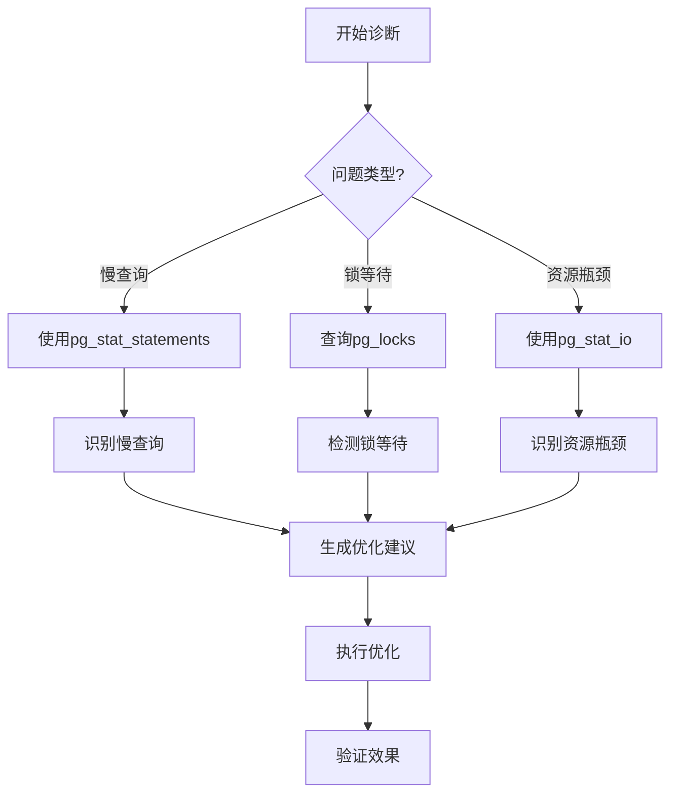

# 04-自动化诊断

> **所属主题**: PostgreSQL 18 自动化运维与自我监测
> **章节编号**: 04
> **创建日期**: 2025年1月

---

## 📋 目录

- [04-自动化诊断](#04-自动化诊断)
  - [📋 目录](#-目录)
  - [章节说明](#章节说明)
    - [诊断工具说明](#诊断工具说明)
    - [快速开始](#快速开始)
    - [诊断流程](#诊断流程)
    - [PostgreSQL 18诊断增强](#postgresql-18诊断增强)
  - [子章节](#子章节)
  - [相关资源](#相关资源)
    - [相关章节](#相关章节)
    - [参考资料](#参考资料)
  - [导航](#导航)

---

## 章节说明

本章节介绍PostgreSQL 18的自动化诊断功能，包括：

- **自动慢查询检测**：基于pg_stat_statements自动识别慢查询（PostgreSQL 18增强：并行查询追踪）
- **自动锁等待检测**：自动检测锁等待和死锁情况
- **自动资源瓶颈检测**：自动检测CPU、I/O、内存瓶颈（利用PostgreSQL 18的I/O统计增强）

### 诊断工具说明

PostgreSQL 18自动化诊断基于以下工具：

1. **pg_stat_statements扩展**：
   - PostgreSQL 18新增：`parallel_workers_to_launch`和`parallel_workers_launched`列
   - 追踪所有SQL语句的执行统计

2. **pg_stat_activity视图**：
   - 实时监控活动连接和查询状态
   - 连接性能监测（PostgreSQL 18增强）

3. **pg_stat_io视图**（PostgreSQL 18增强）：
   - 字节级别I/O统计
   - 更准确的I/O瓶颈识别

### 快速开始

1. **启用慢查询检测**（推荐优先配置）
   - 阅读：[4.1 自动慢查询检测](./01-自动慢查询检测.md)
   - 安装扩展：`CREATE EXTENSION pg_stat_statements;`
   - 运行检测函数

2. **配置锁等待检测**
   - 阅读：[4.2 自动锁等待检测](./02-自动锁等待检测.md)
   - 定期运行锁等待检测脚本

3. **设置资源瓶颈检测**
   - 阅读：[4.3 自动资源瓶颈检测](./03-自动资源瓶颈检测.md)
   - 使用PostgreSQL 18增强的I/O统计功能

### 诊断流程

### PostgreSQL 18诊断增强

PostgreSQL 18在自动化诊断方面的增强：

- **并行查询分析**：通过`parallel_workers_to_launch`和`parallel_workers_launched`列分析并行查询效率
- **I/O瓶颈精确识别**：通过`read_bytes`、`write_bytes`列精确识别I/O瓶颈
- **连接性能诊断**：通过`log_connections`细粒度配置诊断连接性能问题

---

## 子章节

| 章节编号 | 子章节 | 文件 | 说明 |
|---------|--------|------|------|
| 4.1 | 自动慢查询检测 | [01-自动慢查询检测.md](./01-自动慢查询检测.md) | ✅ 慢查询识别与分析 |
| 4.2 | 自动锁等待检测 | [02-自动锁等待检测.md](./02-自动锁等待检测.md) | ✅ 锁冲突诊断 |
| 4.3 | 自动资源瓶颈检测 | [03-自动资源瓶颈检测.md](./03-自动资源瓶颈检测.md) | ✅ CPU/I/O/内存瓶颈检测 |

> **注意**: ✅ 所有章节已完成内容拆分

---

## 相关资源

### 相关章节

- [03-自我监测系统](../03-自我监测系统/README.md) - 监测数据收集（诊断的基础）
- [05-自动化运维脚本](../05-自动化运维脚本/README.md) - 将诊断集成到自动化运维中
- [09-故障排查](../09-故障排查/README.md) - 故障排查流程（包含诊断步骤）
- [10-最佳实践](../10-最佳实践/README.md) - 诊断最佳实践

### 参考资料

- [PostgreSQL 18 pg_stat_statements文档](https://www.postgresql.org/docs/18/pgstatstatements.html)
- [PostgreSQL 18 锁文档](https://www.postgresql.org/docs/18/explicit-locking.html)
- [PostgreSQL 18 监控统计文档](https://www.postgresql.org/docs/18/monitoring-stats.html)

## 导航

- [返回主文档](../README.md)
- [上一章：03-自我监测系统](../03-自我监测系统/README.md)
- [下一章：05-自动化运维脚本](../05-自动化运维脚本/README.md)

---

**最后更新**: 2025年1月
**文档版本**: v2.0（已添加完整目录、诊断流程、PostgreSQL 18增强说明）
