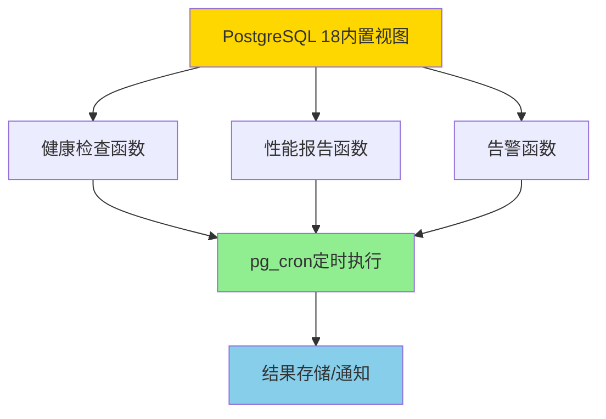

# 05-自动化运维脚本

> **所属主题**: PostgreSQL 18 自动化运维与自我监测
> **章节编号**: 05
> **创建日期**: 2025年1月

---

## 📋 目录

- [05-自动化运维脚本](#05-自动化运维脚本)
  - [📋 目录](#-目录)
  - [章节说明](#章节说明)
    - [脚本特性](#脚本特性)
    - [快速开始](#快速开始)
    - [脚本架构](#脚本架构)
    - [PostgreSQL 18增强应用](#postgresql-18增强应用)
  - [子章节](#子章节)
  - [相关资源](#相关资源)
    - [相关章节](#相关章节)
    - [参考资料](#参考资料)
  - [导航](#导航)

---

## 章节说明

本章节介绍PostgreSQL 18的自动化运维脚本，包括：

- **自动化健康检查**：全面检查数据库健康状态（利用PostgreSQL 18增强特性）
- **自动化性能报告**：生成详细的性能分析报告
- **自动化告警系统**：基于阈值自动告警（集成PostgreSQL 18监测数据）

所有脚本都基于PostgreSQL 18内置功能，无需外部工具。

### 脚本特性

PostgreSQL 18自动化运维脚本的核心特性：

1. **完全内置**：使用PostgreSQL 18内置视图和函数，无需外部工具
2. **实时监控**：基于实时统计信息，准确反映当前状态
3. **自动化执行**：支持pg_cron扩展定时执行
4. **可扩展性**：脚本采用函数形式，易于自定义和扩展

### 快速开始

1. **设置健康检查**（推荐优先配置）
   - 阅读：[5.1 自动化健康检查](./01-自动化健康检查.md)
   - 创建健康检查函数
   - 使用pg_cron定时执行：`SELECT cron.schedule('health-check', '*/5 * * * *', 'SELECT * FROM pg18_health_check();');`

2. **配置性能报告**
   - 阅读：[5.2 自动化性能报告](./02-自动化性能报告.md)
   - 生成性能报告函数
   - 定期生成报告

3. **设置告警系统**
   - 阅读：[5.3 自动化告警系统](./03-自动化告警系统.md)
   - 配置告警阈值
   - 集成告警通知（如邮件、Webhook等）

### 脚本架构

### PostgreSQL 18增强应用

脚本充分利用PostgreSQL 18的新特性：

- **I/O统计增强**：使用`read_bytes`、`write_bytes`进行I/O分析
- **后端I/O追踪**：使用`pg_stat_get_backend_io()`进行后端级别诊断
- **并行查询追踪**：使用`parallel_workers_to_launch`分析并行查询效率
- **连接性能监测**：利用`log_connections`配置进行连接性能分析

---

## 子章节

| 章节编号 | 子章节 | 文件 | 说明 |
|---------|--------|------|------|
| 5.1 | 自动化健康检查 | [01-自动化健康检查.md](./01-自动化健康检查.md) | ✅ 健康检查脚本和函数 |
| 5.2 | 自动化性能报告 | [02-自动化性能报告.md](./02-自动化性能报告.md) | ✅ 性能报告生成脚本 |
| 5.3 | 自动化告警系统 | [03-自动化告警系统.md](./03-自动化告警系统.md) | ✅ 告警规则和通知系统 |

> **注意**: ✅ 所有章节已完成内容拆分

---

## 相关资源

### 相关章节

- [03-自我监测系统](../03-自我监测系统/README.md) - 监测数据收集（脚本的数据来源）
- [04-自动化诊断](../04-自动化诊断/README.md) - 诊断逻辑（脚本的检测逻辑）
- [06-综合方案](../06-综合方案/README.md) - 综合自动化运维架构（脚本集成方案）
- [09-故障排查](../09-故障排查/README.md) - 故障排查脚本（扩展脚本库）

### 参考资料

- [PostgreSQL pg_cron扩展文档](https://github.com/citusdata/pg_cron)
- [PostgreSQL 18 监控统计文档](https://www.postgresql.org/docs/18/monitoring-stats.html)
- [PostgreSQL 18 函数和存储过程](https://www.postgresql.org/docs/18/plpgsql.html)

## 导航

- [返回主文档](../README.md)
- [上一章：04-自动化诊断](../04-自动化诊断/README.md)
- [下一章：06-综合方案](../06-综合方案/README.md)

---

**最后更新**: 2025年1月
**文档版本**: v2.0（已添加完整目录、脚本架构、PostgreSQL 18增强应用）
