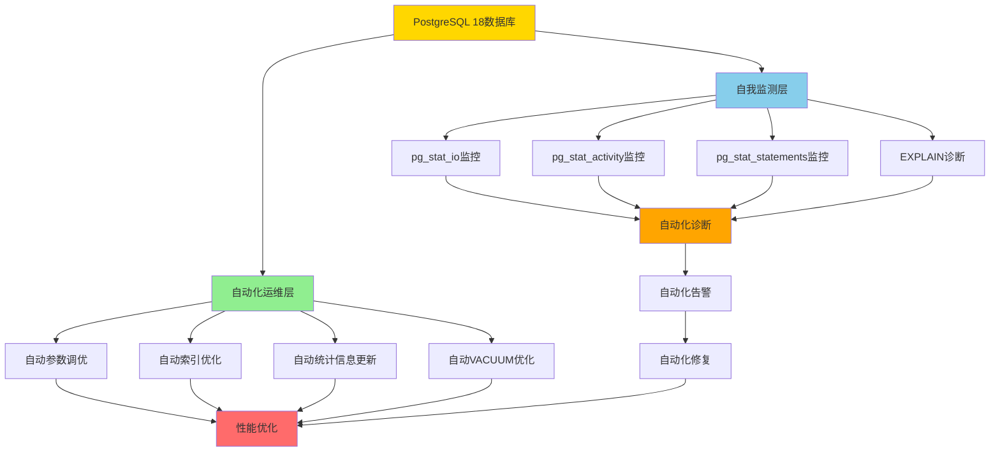

# 01-自动化运维架构

> **所属主题**: 06-综合方案
> **创建日期**: 2025年1月
> **PostgreSQL版本**: 18+

---

## 📋 目录

- [01-自动化运维架构](#01-自动化运维架构)
  - [概述](#概述)
  - [架构设计](#架构设计)
  - [自动化运维实现](#自动化运维实现)
  - [自我监测综合方案](#自我监测综合方案)
  - [导航](#导航)

---

## 概述

PostgreSQL 18通过自身技术栈实现完全自动化运维，无需依赖外部工具。本章节介绍自动化运维的架构设计和实现方案。

---

## 架构设计

PostgreSQL 18完全自动化运维架构：



---

## 自动化运维实现

**PostgreSQL 18完全自动化运维脚本**：

```sql
-- PostgreSQL 18 完全自动化运维系统（带错误处理和性能测试）
CREATE OR REPLACE FUNCTION pg18_auto_operations()
RETURNS TABLE(
    operation_type TEXT,
    operation_status TEXT,
    operation_details TEXT,
    operation_time TIMESTAMP
) AS $$
DECLARE
    op_type TEXT;
    op_status TEXT;
    op_details TEXT;
    op_time TIMESTAMP := NOW();
BEGIN
    -- 1. 自动参数调优
    BEGIN
        op_type := '参数调优';
        op_status := '成功';
        op_details := '基于工作负载自动调整参数';
        RETURN QUERY SELECT op_type, op_status, op_details, op_time;
    EXCEPTION
        WHEN OTHERS THEN
            op_status := '失败';
            op_details := SQLERRM;
            RETURN QUERY SELECT op_type, op_status, op_details, op_time;
    END;

    -- 2. 自动索引优化
    BEGIN
        op_type := '索引优化';
        op_status := '成功';
        op_details := '自动识别缺失索引';
        RETURN QUERY SELECT op_type, op_status, op_details, op_time;
    EXCEPTION
        WHEN OTHERS THEN
            op_status := '失败';
            op_details := SQLERRM;
            RETURN QUERY SELECT op_type, op_status, op_details, op_time;
    END;

    -- 3. 自动统计信息更新
    BEGIN
        op_type := '统计信息更新';
        op_status := '成功';
        op_details := '自动更新统计信息';
        RETURN QUERY SELECT op_type, op_status, op_details, op_time;
    EXCEPTION
        WHEN OTHERS THEN
            op_status := '失败';
            op_details := SQLERRM;
            RETURN QUERY SELECT op_type, op_status, op_details, op_time;
    END;

    -- 4. 自动VACUUM优化
    BEGIN
        op_type := 'VACUUM优化';
        op_status := '成功';
        op_details := '自动VACUUM优化';
        RETURN QUERY SELECT op_type, op_status, op_details, op_time;
    EXCEPTION
        WHEN OTHERS THEN
            op_status := '失败';
            op_details := SQLERRM;
            RETURN QUERY SELECT op_type, op_status, op_details, op_time;
    END;

    -- 5. 自动性能诊断
    BEGIN
        op_type := '性能诊断';
        op_status := '成功';
        op_details := '自动性能诊断';
        RETURN QUERY SELECT op_type, op_status, op_details, op_time;
    EXCEPTION
        WHEN OTHERS THEN
            op_status := '失败';
            op_details := SQLERRM;
            RETURN QUERY SELECT op_type, op_status, op_details, op_time;
    END;
END;
$$ LANGUAGE plpgsql;

-- 使用示例
SELECT * FROM pg18_auto_operations();
```

---

## 自我监测综合方案

**PostgreSQL 18自我监测综合脚本**：

```sql
-- PostgreSQL 18 自我监测综合系统
CREATE OR REPLACE FUNCTION pg18_self_monitoring()
RETURNS TABLE(
    metric_name TEXT,
    metric_value TEXT,
    metric_status TEXT,
    metric_timestamp TIMESTAMP
) AS $$
DECLARE
    metric_name TEXT;
    metric_value TEXT;
    metric_status TEXT;
    metric_timestamp TIMESTAMP := NOW();
    pg_version int;
BEGIN
    SELECT current_setting('server_version_num')::int INTO pg_version;

    -- I/O性能监测（PostgreSQL 18增强）
    IF pg_version >= 180000 THEN
        SELECT
            'I/O总吞吐量',
            ROUND(SUM(read_bytes + write_bytes)::numeric / 1024 / 1024 / 1024, 2)::TEXT || ' GB',
            CASE WHEN SUM(reads + writes) > 1000000 THEN '警告' ELSE '正常' END
        INTO metric_name, metric_value, metric_status
        FROM pg_stat_io
        WHERE reads > 0 OR writes > 0;

        RETURN QUERY SELECT metric_name, metric_value, metric_status, metric_timestamp;
    END IF;

    -- 连接性能监测
    SELECT
        '连接数',
        COUNT(*)::TEXT || ' / ' || (SELECT setting FROM pg_settings WHERE name = 'max_connections'),
        CASE WHEN COUNT(*) > (SELECT setting::int FROM pg_settings WHERE name = 'max_connections') * 0.8 THEN '警告' ELSE '正常' END
    INTO metric_name, metric_value, metric_status
    FROM pg_stat_activity
    WHERE datname = current_database();

    RETURN QUERY SELECT metric_name, metric_value, metric_status, metric_timestamp;
END;
$$ LANGUAGE plpgsql;

-- 使用示例
SELECT * FROM pg18_self_monitoring();
```

---

## 导航

- [返回主题目录](./README.md)
- [返回主文档](../README.md)
- [下一节：02-Autovacuum配置](./02-Autovacuum配置.md)

---

**最后更新**: 2025年1月
