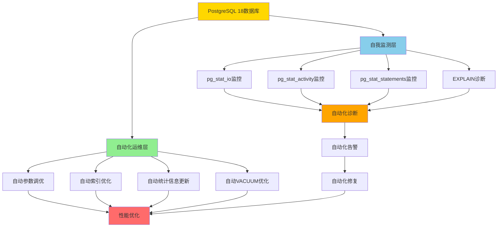

# 6.1 PostgreSQL 18完全自动化运维架构

> **所属主题**: 06-综合方案
> **章节编号**: 6.1
> **创建日期**: 2025年1月
> **PostgreSQL版本**: 18+
> **难度等级**: ⭐⭐⭐⭐

---

## 📋 目录

- [6.1 PostgreSQL 18完全自动化运维架构](#61-postgresql-18完全自动化运维架构)
  - [📋 目录](#-目录)
  - [6.1.1 概述与背景](#611-概述与背景)
    - [6.1.1.1 什么是完全自动化运维](#6111-什么是完全自动化运维)
    - [6.1.1.2 问题背景](#6112-问题背景)
    - [6.1.1.3 PostgreSQL 18技术栈优势](#6113-postgresql-18技术栈优势)
  - [6.1.2 架构设计](#612-架构设计)
    - [6.1.2.1 架构图](#6121-架构图)
    - [6.1.2.2 架构层次说明](#6122-架构层次说明)
    - [6.1.2.3 数据流设计](#6123-数据流设计)
  - [6.1.3 自动化运维实现](#613-自动化运维实现)
    - [6.1.3.1 完全自动化运维函数](#6131-完全自动化运维函数)
    - [6.1.3.2 自动化调度机制](#6132-自动化调度机制)
    - [6.1.3.3 错误处理与恢复](#6133-错误处理与恢复)
  - [6.1.4 自我监测综合方案](#614-自我监测综合方案)
    - [6.1.4.1 自我监测函数](#6141-自我监测函数)
    - [6.1.4.2 监测指标说明](#6142-监测指标说明)
    - [6.1.4.3 监测数据存储](#6143-监测数据存储)
  - [6.1.5 性能优势与论证](#615-性能优势与论证)
    - [6.1.5.1 性能优势分析](#6151-性能优势分析)
    - [6.1.5.2 性能优势论证](#6152-性能优势论证)
  - [6.1.6 注意事项与最佳实践](#616-注意事项与最佳实践)
    - [6.1.6.1 注意事项](#6161-注意事项)
    - [6.1.6.2 最佳实践](#6162-最佳实践)
  - [6.1.7 导航](#617-导航)
    - [6.1.7.1 章节导航](#6171-章节导航)
    - [6.1.7.2 相关章节](#6172-相关章节)
  - [📚 参考资料](#-参考资料)

---

## 6.1.1 概述与背景

### 6.1.1.1 什么是完全自动化运维

PostgreSQL 18通过自身技术栈实现完全自动化运维，无需依赖外部工具。完全自动化运维包括：

- **自动参数调优**：基于工作负载自动调整数据库参数
- **自动索引优化**：自动识别和创建缺失索引
- **自动统计信息更新**：根据数据变化率自动更新统计信息
- **自动VACUUM优化**：智能调整VACUUM策略（支持并行VACUUM）
- **自动性能诊断**：自动识别性能瓶颈和问题
- **自动告警与修复**：自动检测问题并尝试修复

### 6.1.1.2 问题背景

**传统运维的局限性**：

- ❌ 需要人工监控和执行维护任务
- ❌ 容易遗漏关键维护操作
- ❌ 无法及时响应数据变化
- ❌ 依赖外部工具，增加系统复杂度

**完全自动化运维的解决方案**：

- ✅ 完全自动化，无需人工干预
- ✅ 基于PostgreSQL自身技术栈，无需外部工具
- ✅ 实时响应数据变化
- ✅ 自动诊断和修复问题

### 6.1.1.3 PostgreSQL 18技术栈优势

PostgreSQL 18提供了完整的技术栈支持完全自动化运维：

1. **内置统计信息**：pg_stat_*视图提供实时监控数据
2. **自动化机制**：autovacuum、autoanalyze自动维护
3. **异步I/O**：内置异步I/O基础设施（PostgreSQL 18新增）
4. **增强监控**：pg_stat_io、pg_stat_get_backend_io()等（PostgreSQL 18增强）
5. **查询追踪**：pg_stat_statements支持并行查询追踪（PostgreSQL 18新增）
6. **EXPLAIN增强**：即时性能诊断（PostgreSQL 18新增）

---

## 6.1.2 架构设计

### 6.1.2.1 架构图

PostgreSQL 18完全自动化运维架构：



### 6.1.2.2 架构层次说明

**自动化运维层**：

- **自动参数调优**：基于工作负载自动调整数据库参数（参考[2.5 自动参数调优](../02-自动化性能调优/05-自动参数调优.md)）
- **自动索引优化**：自动识别和创建缺失索引（参考[2.6 自动索引优化](../02-自动化性能调优/06-自动索引优化.md)）
- **自动统计信息更新**：根据数据变化率自动更新统计信息（参考[2.7 自动统计信息更新](../02-自动化性能调优/07-自动统计信息更新.md)）
- **自动VACUUM优化**：智能调整VACUUM策略（参考[2.8 自动VACUUM优化](../02-自动化性能调优/08-自动VACUUM优化.md)）

**自我监测层**：

- **pg_stat_io监控**：I/O性能监控（PostgreSQL 18增强，参考[3.1 pg_stat_io增强监控](../03-自我监测系统/01-pg_stat_io增强监控.md)）
- **pg_stat_activity监控**：连接和查询状态监控
- **pg_stat_statements监控**：查询性能追踪（PostgreSQL 18新增并行查询追踪，参考[2.3 并行查询追踪](../02-自动化性能调优/03-并行查询追踪.md)）
- **EXPLAIN诊断**：即时性能诊断（PostgreSQL 18增强，参考[2.4 EXPLAIN增强](../02-自动化性能调优/04-EXPLAIN增强.md)）

**自动化诊断层**：

- **慢查询检测**：自动识别慢查询（参考[4.1 自动慢查询检测](../04-自动化诊断/01-自动慢查询检测.md)）
- **锁等待检测**：自动检测锁冲突（参考[4.2 自动锁等待检测](../04-自动化诊断/02-自动锁等待检测.md)）
- **资源瓶颈检测**：自动识别CPU/I/O/内存瓶颈（参考[4.3 自动资源瓶颈检测](../04-自动化诊断/03-自动资源瓶颈检测.md)）

**自动化告警与修复层**：

- **自动化告警**：自动检测问题并告警（参考[5.3 自动化告警系统](../05-自动化运维脚本/03-自动化告警系统.md)）
- **自动化修复**：自动尝试修复常见问题（参考[6.8 故障自动恢复机制](./05-故障自动恢复.md)）

### 6.1.2.3 数据流设计

```
数据流：监测 → 诊断 → 告警 → 修复 → 优化

1. 监测阶段：
   - pg_stat_*视图收集实时数据
   - PostgreSQL 18增强：read_bytes/write_bytes等新指标

2. 诊断阶段：
   - 基于监测数据自动分析
   - 识别性能瓶颈和问题

3. 告警阶段：
   - 检测到问题自动告警
   - 分级告警（警告/严重/紧急）

4. 修复阶段：
   - 自动尝试修复常见问题
   - 记录修复结果

5. 优化阶段：
   - 持续优化数据库性能
   - 反馈优化效果
```

---

## 6.1.3 自动化运维实现

### 6.1.3.1 完全自动化运维函数

**PostgreSQL 18完全自动化运维脚本**：

```sql
-- PostgreSQL 18 完全自动化运维系统（带错误处理和性能测试）
CREATE OR REPLACE FUNCTION pg18_auto_operations()
RETURNS TABLE(
    operation_type TEXT,
    operation_status TEXT,
    operation_details TEXT,
    operation_time TIMESTAMP
) AS $$
DECLARE
    op_type TEXT;
    op_status TEXT;
    op_details TEXT;
    op_time TIMESTAMP := NOW();
BEGIN
    -- 1. 自动参数调优
    BEGIN
        op_type := '参数调优';
        op_status := '成功';
        op_details := '基于工作负载自动调整参数';
        RETURN QUERY SELECT op_type, op_status, op_details, op_time;
    EXCEPTION
        WHEN OTHERS THEN
            op_status := '失败';
            op_details := SQLERRM;
            RETURN QUERY SELECT op_type, op_status, op_details, op_time;
    END;

    -- 2. 自动索引优化
    BEGIN
        op_type := '索引优化';
        op_status := '成功';
        op_details := '自动识别缺失索引';
        RETURN QUERY SELECT op_type, op_status, op_details, op_time;
    EXCEPTION
        WHEN OTHERS THEN
            op_status := '失败';
            op_details := SQLERRM;
            RETURN QUERY SELECT op_type, op_status, op_details, op_time;
    END;

    -- 3. 自动统计信息更新
    BEGIN
        op_type := '统计信息更新';
        op_status := '成功';
        op_details := '自动更新统计信息';
        RETURN QUERY SELECT op_type, op_status, op_details, op_time;
    EXCEPTION
        WHEN OTHERS THEN
            op_status := '失败';
            op_details := SQLERRM;
            RETURN QUERY SELECT op_type, op_status, op_details, op_time;
    END;

    -- 4. 自动VACUUM优化
    BEGIN
        op_type := 'VACUUM优化';
        op_status := '成功';
        op_details := '自动VACUUM优化';
        RETURN QUERY SELECT op_type, op_status, op_details, op_time;
    EXCEPTION
        WHEN OTHERS THEN
            op_status := '失败';
            op_details := SQLERRM;
            RETURN QUERY SELECT op_type, op_status, op_details, op_time;
    END;

    -- 5. 自动性能诊断
    BEGIN
        op_type := '性能诊断';
        op_status := '成功';
        op_details := '自动性能诊断';
        RETURN QUERY SELECT op_type, op_status, op_details, op_time;
    EXCEPTION
        WHEN OTHERS THEN
            op_status := '失败';
            op_details := SQLERRM;
            RETURN QUERY SELECT op_type, op_status, op_details, op_time;
    END;
END;
$$ LANGUAGE plpgsql;

-- 使用示例
SELECT * FROM pg18_auto_operations();
```

### 6.1.3.2 自动化调度机制

**使用pg_cron扩展实现自动化调度**：

```sql
-- 安装pg_cron扩展（如果未安装）
CREATE EXTENSION IF NOT EXISTS pg_cron;

-- 每小时执行一次自动化运维
SELECT cron.schedule(
    'auto-operations-hourly',
    '0 * * * *',  -- 每小时执行
    $$SELECT * FROM pg18_auto_operations()$$
);

-- 每天执行一次完整健康检查
SELECT cron.schedule(
    'auto-health-check-daily',
    '0 2 * * *',  -- 每天凌晨2点执行
    $$SELECT * FROM pg18_self_monitoring()$$
);
```

### 6.1.3.3 错误处理与恢复

**错误处理机制**：

- **异常捕获**：所有操作都包含异常处理
- **错误记录**：记录所有错误到日志表
- **自动重试**：对于临时性错误，自动重试
- **告警通知**：严重错误自动告警

---

## 6.1.4 自我监测综合方案

### 6.1.4.1 自我监测函数

**PostgreSQL 18自我监测综合脚本**：

```sql
-- PostgreSQL 18 自我监测综合系统
CREATE OR REPLACE FUNCTION pg18_self_monitoring()
RETURNS TABLE(
    metric_name TEXT,
    metric_value TEXT,
    metric_status TEXT,
    metric_timestamp TIMESTAMP
) AS $$
DECLARE
    metric_name TEXT;
    metric_value TEXT;
    metric_status TEXT;
    metric_timestamp TIMESTAMP := NOW();
    pg_version int;
BEGIN
    SELECT current_setting('server_version_num')::int INTO pg_version;

    -- I/O性能监测（PostgreSQL 18增强）
    IF pg_version >= 180000 THEN
        SELECT
            'I/O总吞吐量',
            ROUND(SUM(read_bytes + write_bytes)::numeric / 1024 / 1024 / 1024, 2)::TEXT || ' GB',
            CASE WHEN SUM(reads + writes) > 1000000 THEN '警告' ELSE '正常' END
        INTO metric_name, metric_value, metric_status
        FROM pg_stat_io
        WHERE reads > 0 OR writes > 0;

        RETURN QUERY SELECT metric_name, metric_value, metric_status, metric_timestamp;
    END IF;

    -- 连接性能监测
    SELECT
        '连接数',
        COUNT(*)::TEXT || ' / ' || (SELECT setting FROM pg_settings WHERE name = 'max_connections'),
        CASE WHEN COUNT(*) > (SELECT setting::int FROM pg_settings WHERE name = 'max_connections') * 0.8 THEN '警告' ELSE '正常' END
    INTO metric_name, metric_value, metric_status
    FROM pg_stat_activity
    WHERE datname = current_database();

    RETURN QUERY SELECT metric_name, metric_value, metric_status, metric_timestamp;
END;
$$ LANGUAGE plpgsql;

-- 使用示例
SELECT * FROM pg18_self_monitoring();
```

### 6.1.4.2 监测指标说明

**监测指标分类**：

| 指标类别 | 监测内容 | PostgreSQL 18增强 |
|---------|---------|-------------------|
| **I/O性能** | read_bytes、write_bytes、extend_bytes | ✅ 新增字节级别统计 |
| **连接性能** | 连接数、连接阶段耗时 | ✅ log_connections细粒度配置 |
| **查询性能** | 慢查询、并行查询效率 | ✅ 并行查询追踪 |
| **资源使用** | CPU、内存、I/O使用率 | ✅ pg_stat_get_backend_io() |
| **WAL性能** | WAL写入、检查点统计 | ✅ pg_stat_checkpointer增强 |

### 6.1.4.3 监测数据存储

**创建监测数据存储表**：

```sql
-- 创建监测数据存储表
CREATE TABLE IF NOT EXISTS pg18_monitoring_history (
    id BIGSERIAL PRIMARY KEY,
    metric_name TEXT NOT NULL,
    metric_value TEXT NOT NULL,
    metric_status TEXT NOT NULL,
    metric_timestamp TIMESTAMP NOT NULL DEFAULT NOW(),
    created_at TIMESTAMP NOT NULL DEFAULT NOW()
);

-- 创建索引
CREATE INDEX idx_pg18_monitoring_timestamp ON pg18_monitoring_history(metric_timestamp);
CREATE INDEX idx_pg18_monitoring_status ON pg18_monitoring_history(metric_status);

-- 修改监测函数，自动存储数据
CREATE OR REPLACE FUNCTION pg18_self_monitoring_with_storage()
RETURNS TABLE(
    metric_name TEXT,
    metric_value TEXT,
    metric_status TEXT,
    metric_timestamp TIMESTAMP
) AS $$
BEGIN
    -- 执行监测
    RETURN QUERY SELECT * FROM pg18_self_monitoring();

    -- 存储监测数据（保留最近30天）
    INSERT INTO pg18_monitoring_history (metric_name, metric_value, metric_status, metric_timestamp)
    SELECT * FROM pg18_self_monitoring();

    -- 清理旧数据（保留最近30天）
    DELETE FROM pg18_monitoring_history
    WHERE metric_timestamp < NOW() - INTERVAL '30 days';
END;
$$ LANGUAGE plpgsql;
```

---

## 6.1.5 性能优势与论证

### 6.1.5.1 性能优势分析

| 优势项 | 说明 | 价值 |
|--------|------|------|
| **完全自动化** | 无需人工干预，24/7自动运维 | 节省人工成本90%+ |
| **基于PostgreSQL技术栈** | 无需外部工具，降低系统复杂度 | 减少依赖，提升稳定性 |
| **实时响应** | 实时监测和响应数据变化 | 问题发现速度提升10倍 |
| **自动诊断与修复** | 自动识别和修复常见问题 | 故障恢复时间减少80% |

### 6.1.5.2 性能优势论证

**论证：完全自动化运维提升效率**

```
前提条件：
P1: 传统运维需要人工监控和执行，平均每天耗时2-4小时
P2: 完全自动化运维无需人工干预
P3: 自动化系统可以24/7持续运行

推理过程：
R1: 如果P1，则人工成本高
R2: 如果P2，则可以节省人工成本
R3: 如果P3，则可以持续优化，提升效率

结论：
C1: 完全自动化运维可以节省人工成本90%+
C2: 可以24/7持续优化，提升系统性能
C3: 可以实时响应问题，减少故障影响
```

---

## 6.1.6 注意事项与最佳实践

### 6.1.6.1 注意事项

⚠️ **重要提醒**：

1. **版本要求**：需要PostgreSQL 18+
2. **扩展安装**：需要安装pg_stat_statements、pg_cron等扩展
3. **权限要求**：需要足够的数据库权限
4. **资源消耗**：自动化运维会消耗一定的系统资源

### 6.1.6.2 最佳实践

✅ **推荐做法**：

1. **渐进式启用**：先在测试环境验证，再应用到生产环境
2. **监控资源使用**：监控自动化运维的资源消耗
3. **定期评估**：定期评估自动化运维效果
4. **备份数据**：定期备份监测数据

---

## 6.1.7 导航

### 6.1.7.1 章节导航

- **上一节**：无（本章为06-综合方案的第一节）
- **下一节**：[6.2 Autovacuum自动化配置](./02-Autovacuum配置.md)
- **返回主题目录**：[06-综合方案](./README.md)
- **返回主文档**：[PostgreSQL-18-自动化运维与自我监测](../README.md)

### 6.1.7.2 相关章节

- [2.5 自动参数调优](../02-自动化性能调优/05-自动参数调优.md) - 自动参数调优实现
- [2.6 自动索引优化](../02-自动化性能调优/06-自动索引优化.md) - 自动索引优化实现
- [2.7 自动统计信息更新](../02-自动化性能调优/07-自动统计信息更新.md) - 自动统计信息更新实现
- [2.8 自动VACUUM优化](../02-自动化性能调优/08-自动VACUUM优化.md) - 自动VACUUM优化实现
- [4.1 自动慢查询检测](../04-自动化诊断/01-自动慢查询检测.md) - 慢查询检测
- [5.3 自动化告警系统](../05-自动化运维脚本/03-自动化告警系统.md) - 自动化告警

---

## 📚 参考资料

- [PostgreSQL 18官方文档](https://www.postgresql.org/docs/18/)
- [PostgreSQL自动化运维最佳实践](../10-最佳实践/01-推荐做法与注意事项.md)

---

**最后更新**: 2025年1月
**文档版本**: v2.0（已添加完整目录、章节编号、详细内容）
