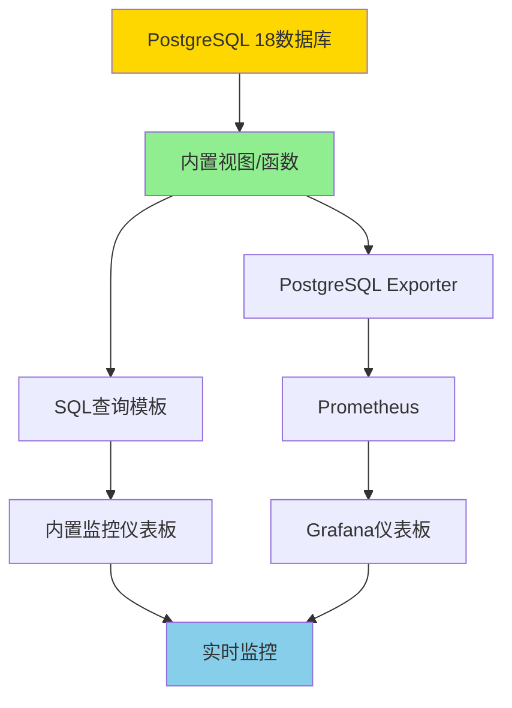

# 07-监控仪表板

> **所属主题**: PostgreSQL 18 自动化运维与自我监测
> **章节编号**: 07
> **创建日期**: 2025年1月

---

## 📋 目录

- [07-监控仪表板](#07-监控仪表板)
  - [📋 目录](#-目录)
  - [章节说明](#章节说明)
    - [监控仪表板特性](#监控仪表板特性)
    - [快速开始](#快速开始)
    - [监控指标说明](#监控指标说明)
    - [监控架构](#监控架构)
  - [子章节](#子章节)
  - [相关资源](#相关资源)
    - [相关章节](#相关章节)
    - [参考资料](#参考资料)
  - [导航](#导航)

---

## 章节说明

本章节介绍PostgreSQL 18监控仪表板的设计和配置，包括：

- **基于PostgreSQL 18内置视图的监控仪表板**（7.1）：使用PostgreSQL 18内置视图构建监控仪表板
- **Prometheus + Grafana集成方案**（7.2）：将PostgreSQL 18监测数据集成到Prometheus和Grafana

### 监控仪表板特性

PostgreSQL 18监控仪表板的核心特性：

1. **内置视图监控**（7.1）：
   - 使用pg_stat_io、pg_stat_activity等视图
   - 利用PostgreSQL 18的I/O统计增强
   - 实时监控查询模板

2. **外部工具集成**（7.2）：
   - Prometheus数据收集
   - Grafana可视化展示
   - 告警规则配置

### 快速开始

1. **构建内置视图监控**（推荐优先使用）
   - 阅读：[7.1 监控仪表板设计](./01-监控仪表板设计.md)
   - 使用提供的SQL查询模板
   - 创建定时查询脚本

2. **配置Prometheus + Grafana**（可选，适合大规模部署）
   - 阅读：[7.2 Prometheus-Grafana集成](./02-Prometheus-Grafana集成.md)
   - 安装PostgreSQL Exporter
   - 配置Grafana仪表板

### 监控指标说明

| 监控类型 | 数据来源 | PostgreSQL 18增强 |
|---------|---------|------------------|
| **I/O监控** | pg_stat_io | read_bytes, write_bytes列 |
| **连接监控** | pg_stat_activity | log_connections细粒度配置 |
| **查询监控** | pg_stat_statements | 并行查询追踪列 |
| **后端监控** | pg_stat_get_backend_io() | 后端级别I/O追踪 |
| **检查点监控** | pg_stat_checkpointer | num_done列 |

### 监控架构

---

## 子章节

| 章节编号 | 子章节 | 文件 | 说明 |
|---------|--------|------|------|
| 7.1 | 监控仪表板设计 | [01-监控仪表板设计.md](./01-监控仪表板设计.md) | ✅ 内置视图监控仪表板设计 |
| 7.2 | Prometheus-Grafana集成 | [02-Prometheus-Grafana集成.md](./02-Prometheus-Grafana集成.md) | ✅ 外部监控工具集成方案 |

> **注意**: ✅ 所有章节已完成内容拆分

---

## 相关资源

### 相关章节

- [03-自我监测系统](../03-自我监测系统/README.md) - 监测数据收集（监控仪表板的数据来源）
- [05-自动化运维脚本](../05-自动化运维脚本/README.md) - 自动化健康检查（可与监控仪表板集成）
- [06-综合方案](../06-综合方案/README.md) - 综合自动化运维架构（监控仪表板是架构的一部分）

### 参考资料

- [PostgreSQL 18 监控统计文档](https://www.postgresql.org/docs/18/monitoring-stats.html)
- [Prometheus PostgreSQL Exporter](https://github.com/prometheus-community/postgres_exporter)
- [Grafana PostgreSQL仪表板](https://grafana.com/grafana/dashboards/)

## 导航

- [返回主文档](../README.md)
- [上一章：06-综合方案](../06-综合方案/README.md)
- [下一章：08-性能调优案例](../08-性能调优案例/README.md)

---

**最后更新**: 2025年1月
**文档版本**: v2.0（已添加完整目录、监控架构、监控指标说明）
