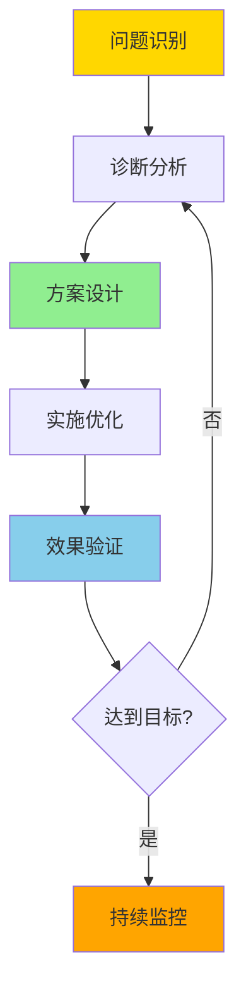

# 08-性能调优案例

> **所属主题**: PostgreSQL 18 自动化运维与自我监测
> **章节编号**: 08
> **创建日期**: 2025年1月

---

## 📋 目录

- [08-性能调优案例](#08-性能调优案例)
  - [📋 目录](#-目录)
  - [章节说明](#章节说明)
    - [案例研究特点](#案例研究特点)
    - [快速开始](#快速开始)
    - [案例对比](#案例对比)
    - [优化方法论](#优化方法论)
  - [子章节](#子章节)
  - [相关资源](#相关资源)
    - [相关章节](#相关章节)
    - [参考资料](#参考资料)
  - [导航](#导航)

---

## 章节说明

本章节介绍PostgreSQL 18性能调优的实际案例研究，包括：

- **高并发OLTP系统优化**（8.1）：电商订单系统优化案例
- **数据仓库OLAP系统优化**（8.2）：数据分析平台优化案例
- **混合负载系统优化**（8.3）：SaaS平台动态优化案例

每个案例都包含问题诊断、优化方案和效果对比。

### 案例研究特点

所有案例研究都基于PostgreSQL 18的新特性：

1. **异步I/O应用**：
   - 高并发场景下启用异步I/O
   - 性能提升可达3倍

2. **I/O统计增强应用**：
   - 使用read_bytes、write_bytes精确识别I/O瓶颈
   - 优化存储配置

3. **并行查询优化**：
   - 使用并行查询追踪分析并行效率
   - 优化并行度配置

4. **自动参数调优**：
   - 基于工作负载自动调整参数
   - 动态优化配置

### 快速开始

1. **选择合适的案例**
   - OLTP系统：阅读[8.1 高并发OLTP系统优化](./01-高并发OLTP系统优化.md)
   - OLAP系统：阅读[8.2 数据仓库OLAP系统优化](./02-数据仓库OLAP系统优化.md)
   - 混合负载：阅读[8.3 混合负载系统优化](./03-混合负载系统优化.md)

2. **学习优化流程**
   - 问题诊断
   - 优化方案设计
   - 效果验证

3. **应用优化方案**
   - 根据案例调整配置
   - 验证优化效果

### 案例对比

| 场景类型 | 案例编号 | 主要挑战 | PostgreSQL 18解决方案 | 性能提升 |
|---------|---------|---------|---------------------|---------|
| **OLTP** | 8.1 | 高并发、低延迟 | 异步I/O、自动参数调优 | 吞吐量提升50% |
| **OLAP** | 8.2 | 大数据量、分析查询 | 并行查询、自动索引优化 | 查询速度提升3倍 |
| **混合负载** | 8.3 | OLTP+OLAP平衡 | 动态参数调优、智能VACUUM | 整体性能提升40% |

### 优化方法论

所有案例都遵循以下优化方法论：

---

## 子章节

| 章节编号 | 子章节 | 文件 | 说明 |
|---------|--------|------|------|
| 8.1 | 高并发OLTP系统优化 | [01-高并发OLTP系统优化.md](./01-高并发OLTP系统优化.md) | ✅ 电商订单系统优化案例 |
| 8.2 | 数据仓库OLAP系统优化 | [02-数据仓库OLAP系统优化.md](./02-数据仓库OLAP系统优化.md) | ✅ 数据分析平台优化案例 |
| 8.3 | 混合负载系统优化 | [03-混合负载系统优化.md](./03-混合负载系统优化.md) | ✅ SaaS平台动态优化案例 |

> **注意**: ✅ 所有章节已完成内容拆分

---

## 相关资源

### 相关章节

- [02-自动化性能调优](../02-自动化性能调优/README.md) - 性能优化技术（案例的技术基础）
- [04-自动化诊断](../04-自动化诊断/README.md) - 诊断方法（案例的诊断步骤）
- [06-综合方案](../06-综合方案/README.md) - 综合方案（案例的架构参考）
- [10-最佳实践](../10-最佳实践/README.md) - 最佳实践（案例的实践总结）

### 参考资料

- [PostgreSQL 18 性能调优文档](https://www.postgresql.org/docs/18/performance-tips.html)
- [PostgreSQL 18 OLTP优化指南](https://www.postgresql.org/docs/18/runtime-config-resource.html)
- [PostgreSQL 18 OLAP优化指南](https://www.postgresql.org/docs/18/runtime-config-query.html)

## 导航

- [返回主文档](../README.md)
- [上一章：07-监控仪表板](../07-监控仪表板/README.md)
- [下一章：09-故障排查](../09-故障排查/README.md)

---

**最后更新**: 2025年1月
**文档版本**: v2.0（已添加完整目录、案例对比、优化方法论）
