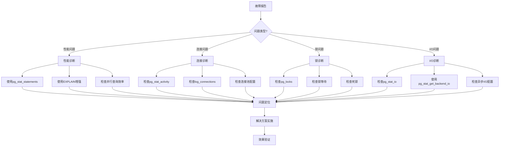

# PostgreSQL 18故障排查流程与脚本

> **PostgreSQL版本**: 18+
> **难度等级**: ⭐⭐⭐⭐
> **相关章节**: [混合负载系统优化](../08-性能调优案例/03-混合负载系统优化.md) | [推荐做法与注意事项](../10-最佳实践/01-推荐做法与注意事项.md)

---

## 概述

PostgreSQL 18故障排查流程提供了系统化的故障诊断方法，包括性能问题、连接问题、锁问题、I/O问题等的诊断流程和脚本。

---

## 故障排查流程

### 系统化故障排查流程



---

## 故障排查脚本库

### PostgreSQL 18故障排查函数

```sql
-- PostgreSQL 18 故障排查脚本库
CREATE OR REPLACE FUNCTION pg18_troubleshoot(issue_type TEXT)
RETURNS TABLE(
    check_item TEXT,
    check_result TEXT,
    status TEXT,
    recommendation TEXT
) AS $$
DECLARE
    pg_version int;
BEGIN
    SELECT current_setting('server_version_num')::int INTO pg_version;

    IF pg_version < 180000 THEN
        RAISE WARNING 'PostgreSQL 18故障排查需要PostgreSQL 18+';
        RETURN;
    END IF;

    CASE issue_type
        WHEN 'performance' THEN
            -- 性能问题排查
            RETURN QUERY
            SELECT
                '慢查询检查',
                COUNT(*)::TEXT || ' 个慢查询',
                CASE WHEN COUNT(*) > 10 THEN 'warning' ELSE 'normal' END,
                CASE WHEN COUNT(*) > 10 THEN '建议优化慢查询' ELSE '正常' END
            FROM pg_stat_statements
            WHERE mean_exec_time > 1000
            AND EXISTS (SELECT 1 FROM pg_extension WHERE extname = 'pg_stat_statements')
            UNION ALL
            SELECT
                '缓存命中率',
                ROUND(100.0 * blks_hit / NULLIF(blks_hit + blks_read, 0), 2)::TEXT || '%',
                CASE
                    WHEN ROUND(100.0 * blks_hit / NULLIF(blks_hit + blks_read, 0), 2) >= 95 THEN 'normal'
                    WHEN ROUND(100.0 * blks_hit / NULLIF(blks_hit + blks_read, 0), 2) >= 90 THEN 'warning'
                    ELSE 'critical'
                END,
                CASE
                    WHEN ROUND(100.0 * blks_hit / NULLIF(blks_hit + blks_read, 0), 2) < 90 THEN '建议增加shared_buffers'
                    ELSE '正常'
                END
            FROM pg_stat_database
            WHERE datname = current_database();

        WHEN 'connection' THEN
            -- 连接问题排查
            RETURN QUERY
            SELECT
                '连接数',
                COUNT(*)::TEXT || ' / ' || (SELECT setting FROM pg_settings WHERE name = 'max_connections'),
                CASE
                    WHEN COUNT(*) > (SELECT setting::int FROM pg_settings WHERE name = 'max_connections') * 0.9 THEN 'critical'
                    WHEN COUNT(*) > (SELECT setting::int FROM pg_settings WHERE name = 'max_connections') * 0.8 THEN 'warning'
                    ELSE 'normal'
                END,
                CASE
                    WHEN COUNT(*) > (SELECT setting::int FROM pg_settings WHERE name = 'max_connections') * 0.9 THEN '连接数接近上限，建议检查连接池'
                    WHEN COUNT(*) > (SELECT setting::int FROM pg_settings WHERE name = 'max_connections') * 0.8 THEN '连接数较高，建议监控'
                    ELSE '正常'
                END
            FROM pg_stat_activity
            WHERE datname = current_database()
            UNION ALL
            SELECT
                '空闲事务',
                COUNT(*)::TEXT || ' 个',
                CASE WHEN COUNT(*) > 10 THEN 'warning' ELSE 'normal' END,
                CASE WHEN COUNT(*) > 10 THEN '建议检查应用连接管理' ELSE '正常' END
            FROM pg_stat_activity
            WHERE datname = current_database() AND state = 'idle in transaction';

        WHEN 'lock' THEN
            -- 锁问题排查
            RETURN QUERY
            SELECT
                '锁等待',
                COUNT(*)::TEXT || ' 个',
                CASE WHEN COUNT(*) > 0 THEN 'warning' ELSE 'normal' END,
                CASE WHEN COUNT(*) > 0 THEN '建议检查锁等待查询' ELSE '正常' END
            FROM pg_catalog.pg_locks blocked_locks
            JOIN pg_catalog.pg_stat_activity blocked_activity ON blocked_activity.pid = blocked_locks.pid
            WHERE NOT blocked_locks.granted
            UNION ALL
            SELECT
                '死锁数',
                deadlocks::TEXT || ' 个',
                CASE WHEN deadlocks > 0 THEN 'critical' ELSE 'normal' END,
                CASE WHEN deadlocks > 0 THEN '检测到死锁，建议检查事务管理' ELSE '正常' END
            FROM pg_stat_database
            WHERE datname = current_database();

        WHEN 'io' THEN
            -- I/O问题排查（PostgreSQL 18增强）
            RETURN QUERY
            SELECT
                'I/O吞吐量',
                ROUND(SUM(read_bytes + write_bytes)::numeric / 1024 / 1024 / 1024, 2)::TEXT || ' GB',
                CASE
                    WHEN SUM(reads + writes) > 10000000 THEN 'warning'
                    ELSE 'normal'
                END,
                CASE
                    WHEN SUM(reads + writes) > 10000000 THEN 'I/O负载较高，建议检查查询和索引'
                    ELSE '正常'
                END
            FROM pg_stat_io
            UNION ALL
            SELECT
                '异步I/O配置',
                COALESCE((SELECT setting FROM pg_settings WHERE name = 'io_method'), 'sync'),
                CASE
                    WHEN (SELECT setting FROM pg_settings WHERE name = 'io_method') IN ('worker', 'io_uring') THEN 'normal'
                    ELSE 'warning'
                END,
                CASE
                    WHEN (SELECT setting FROM pg_settings WHERE name = 'io_method') NOT IN ('worker', 'io_uring') THEN '建议启用PostgreSQL 18异步I/O'
                    ELSE '正常'
                END;

        ELSE
            RAISE WARNING '未知的故障类型: %', issue_type;
    END CASE;
END;
$$ LANGUAGE plpgsql;

-- 使用示例
SELECT * FROM pg18_troubleshoot('performance');
SELECT * FROM pg18_troubleshoot('connection');
SELECT * FROM pg18_troubleshoot('lock');
SELECT * FROM pg18_troubleshoot('io');
```

---

## 故障类型说明

### 1. 性能问题排查

**检查项**：

- 慢查询检查
- 缓存命中率

**诊断工具**：

- pg_stat_statements（PostgreSQL 18增强）
- EXPLAIN增强
- 并行查询效率分析

### 2. 连接问题排查

**检查项**：

- 连接数
- 空闲事务

**诊断工具**：

- pg_stat_activity
- log_connections（PostgreSQL 18增强）
- 连接池配置

### 3. 锁问题排查

**检查项**：

- 锁等待
- 死锁数

**诊断工具**：

- pg_locks
- pg_stat_activity
- 锁等待检测脚本

### 4. I/O问题排查（PostgreSQL 18增强）

**检查项**：

- I/O吞吐量
- 异步I/O配置

**诊断工具**：

- pg_stat_io（PostgreSQL 18增强）
- pg_stat_get_backend_io()（PostgreSQL 18新增）
- 异步I/O配置检查

---

## 故障排查步骤

### 步骤1: 问题分类

根据故障现象确定问题类型：

- 性能问题：响应时间慢、吞吐量低
- 连接问题：连接数过高、连接超时
- 锁问题：查询阻塞、死锁
- I/O问题：I/O等待、磁盘瓶颈

### 步骤2: 执行诊断

使用对应的故障排查函数：

```sql
-- 性能问题
SELECT * FROM pg18_troubleshoot('performance');

-- 连接问题
SELECT * FROM pg18_troubleshoot('connection');

-- 锁问题
SELECT * FROM pg18_troubleshoot('lock');

-- I/O问题
SELECT * FROM pg18_troubleshoot('io');
```

### 步骤3: 问题定位

根据诊断结果定位具体问题：

- 查看check_result了解当前状态
- 查看status了解严重程度
- 查看recommendation了解解决建议

### 步骤4: 解决方案实施

根据recommendation实施解决方案：

- 优化慢查询
- 调整连接池配置
- 解决锁等待
- 优化I/O配置

### 步骤5: 效果验证

验证解决方案效果：

- 重新执行故障排查
- 对比优化前后的指标
- 确认问题已解决

---

## PostgreSQL 18增强特性

1. **I/O统计增强**：使用pg_stat_io的字节级别统计
2. **后端I/O追踪**：使用pg_stat_get_backend_io()进行后端级别追踪
3. **连接性能监测**：使用log_connections细粒度配置
4. **并行查询追踪**：使用pg_stat_statements的并行查询列

---

## 注意事项

1. **诊断频率**：合理设置诊断频率，避免过度诊断
2. **诊断影响**：诊断本身会有性能开销，注意对生产环境的影响
3. **结果分析**：综合分析多个指标，避免单一指标误判

---

## 相关资源

- [自动慢查询检测](../04-自动化诊断/01-自动慢查询检测.md)
- [自动锁等待检测](../04-自动化诊断/02-自动锁等待检测.md)
- [自动资源瓶颈检测](../04-自动化诊断/03-自动资源瓶颈检测.md)

---

**上一节**: [混合负载系统优化](../08-性能调优案例/03-混合负载系统优化.md)
**下一节**: [推荐做法与注意事项](../10-最佳实践/01-推荐做法与注意事项.md)
**返回**: [故障排查目录](./README.md)
