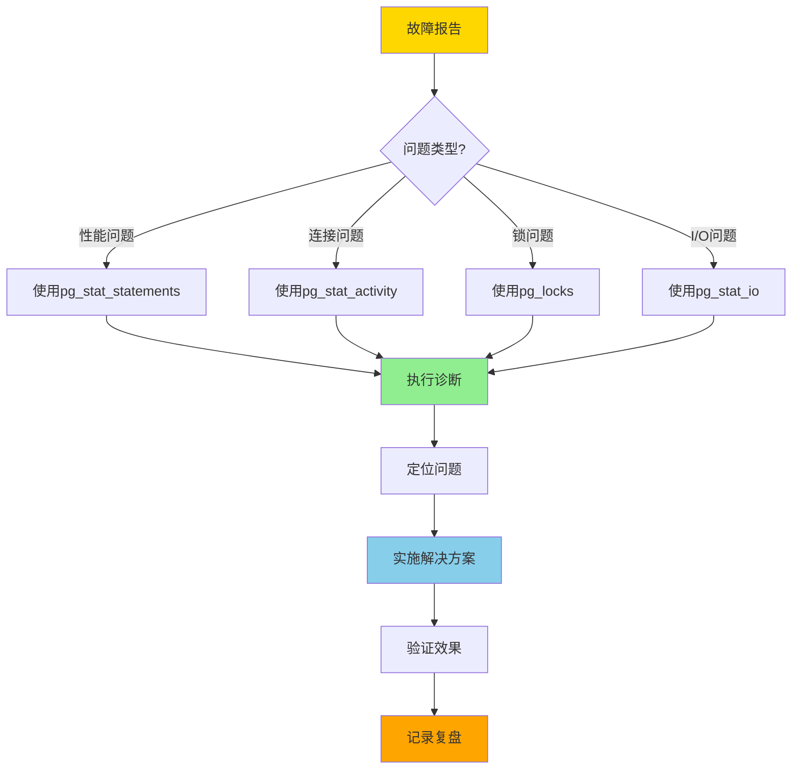

# 09-故障排查

> **所属主题**: PostgreSQL 18 自动化运维与自我监测
> **章节编号**: 09
> **创建日期**: 2025年1月

---

## 📋 目录

- [09-故障排查](#09-故障排查)
  - [📋 目录](#-目录)
  - [章节说明](#章节说明)
    - [故障排查特性](#故障排查特性)
    - [快速开始](#快速开始)
    - [故障类型分类](#故障类型分类)
    - [故障排查流程](#故障排查流程)
    - [PostgreSQL 18故障排查增强](#postgresql-18故障排查增强)
  - [子章节](#子章节)
  - [相关资源](#相关资源)
    - [相关章节](#相关章节)
    - [参考资料](#参考资料)
  - [导航](#导航)

---

## 章节说明

本章节介绍PostgreSQL 18故障排查的系统化流程和脚本，包括：

- **故障排查流程**：系统化的故障排查流程（9.1）
- **故障排查脚本库**：性能、连接、锁、I/O问题排查脚本
- **常见故障类型**：故障分类和处理方法

### 故障排查特性

PostgreSQL 18故障排查的核心特性：

1. **系统化流程**：
   - 问题分类
   - 诊断步骤
   - 解决方案

2. **自动化脚本**：
   - 性能问题排查
   - 连接问题排查
   - 锁问题排查
   - I/O问题排查（PostgreSQL 18增强）

3. **PostgreSQL 18增强**：
   - 使用pg_stat_io的字节级别统计
   - 使用pg_stat_get_backend_io()进行后端级别追踪
   - 使用log_connections进行连接性能诊断

### 快速开始

1. **了解故障排查流程**
   - 阅读：[9.1 故障排查流程与脚本](./01-故障排查流程与脚本.md)
   - 理解系统化排查流程

2. **使用故障排查函数**
   - 创建故障排查函数库
   - 使用pg18_troubleshoot()函数进行诊断

3. **建立故障排查习惯**
   - 按流程系统化排查
   - 记录排查过程和结果
   - 持续优化排查效率

### 故障类型分类

| 故障类型 | 诊断工具 | PostgreSQL 18增强 | 处理优先级 |
|---------|---------|------------------|-----------|
| **性能问题** | pg_stat_statements | 并行查询追踪 | 高 |
| **连接问题** | pg_stat_activity | log_connections | 高 |
| **锁问题** | pg_locks | - | 中 |
| **I/O问题** | pg_stat_io | read_bytes, write_bytes | 中 |

### 故障排查流程

### PostgreSQL 18故障排查增强

PostgreSQL 18在故障排查方面的增强：

- **I/O统计增强**：read_bytes、write_bytes列精确识别I/O瓶颈
- **后端I/O追踪**：pg_stat_get_backend_io()函数支持后端级别诊断
- **连接性能监测**：log_connections细粒度配置诊断连接性能问题
- **并行查询追踪**：parallel_workers_to_launch/launched列分析并行效率

---

## 子章节

| 章节编号 | 子章节 | 文件 | 说明 |
|---------|--------|------|------|
| 9.1 | 故障排查流程与脚本 | [01-故障排查流程与脚本.md](./01-故障排查流程与脚本.md) | ✅ 系统化故障排查流程和脚本库 |

> **注意**: ✅ 所有章节已完成内容拆分

---

## 相关资源

### 相关章节

- [04-自动化诊断](../04-自动化诊断/README.md) - 自动化诊断功能（故障排查的自动化实现）
- [05-自动化运维脚本](../05-自动化运维脚本/README.md) - 健康检查脚本（故障排查的预防措施）
- [06-综合方案/05-故障自动恢复](../06-综合方案/05-故障自动恢复.md) - 故障自动恢复（故障排查后的恢复机制）
- [10-最佳实践](../10-最佳实践/README.md) - 故障排查最佳实践

### 参考资料

- [PostgreSQL 18 故障排查文档](https://www.postgresql.org/docs/18/runtime-config-logging.html)
- [PostgreSQL 18 pg_stat_statements文档](https://www.postgresql.org/docs/18/pgstatstatements.html)
- [PostgreSQL 18 pg_stat_io文档](https://www.postgresql.org/docs/18/monitoring-stats.html#MONITORING-PG-STAT-IO-VIEW)

## 导航

- [返回主文档](../README.md)
- [上一章：08-性能调优案例](../08-性能调优案例/README.md)
- [下一章：10-最佳实践](../10-最佳实践/README.md)

---

**最后更新**: 2025年1月
**文档版本**: v2.0（已添加完整目录、故障排查流程、PostgreSQL 18增强说明）
