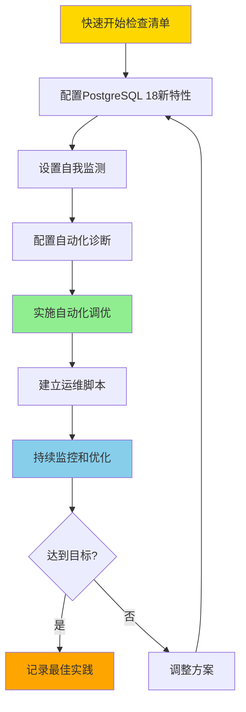

# 10-最佳实践

> **所属主题**: PostgreSQL 18 自动化运维与自我监测
> **章节编号**: 10
> **创建日期**: 2025年1月

---

## 📋 目录

- [10-最佳实践](#10-最佳实践)
  - [📋 目录](#-目录)
  - [章节说明](#章节说明)
    - [最佳实践核心](#最佳实践核心)
    - [快速开始](#快速开始)
    - [实践框架](#实践框架)
    - [PostgreSQL 18实践要点](#postgresql-18实践要点)
    - [实践检查清单](#实践检查清单)
    - [基础配置检查清单](#基础配置检查清单)
    - [监测设置检查清单](#监测设置检查清单)
    - [优化实施检查清单](#优化实施检查清单)
    - [运维自动化检查清单](#运维自动化检查清单)
  - [子章节](#子章节)
  - [相关资源](#相关资源)
    - [相关章节](#相关章节)
    - [参考资料](#参考资料)
  - [导航](#导航)

---

## 章节说明

本章节介绍PostgreSQL 18自动化运维和自我监测的最佳实践，包括：

- **推荐做法**：PostgreSQL 18自动化运维的推荐实践（10.1）
- **注意事项**：实施过程中的注意事项
- **快速开始检查清单**：快速上手的检查清单
- **总结与展望**：PostgreSQL 18自动化运维的总结和未来展望

### 最佳实践核心

PostgreSQL 18自动化运维最佳实践的核心要点：

1. **充分利用PostgreSQL 18新特性**：
   - 异步I/O：提升I/O密集型操作性能
   - I/O统计增强：精确识别I/O瓶颈
   - 并行查询追踪：优化并行查询效率
   - 连接性能监测：诊断连接瓶颈

2. **系统化实施**：
   - 按步骤实施（监测→诊断→调优→运维）
   - 持续监控和优化
   - 记录和复盘

3. **平衡性能与稳定性**：
   - 渐进式优化
   - 充分测试
   - 监控优化效果

### 快速开始

1. **阅读最佳实践指南**
   - 阅读：[10.1 推荐做法与注意事项](./01-推荐做法与注意事项.md)
   - 理解推荐做法和注意事项

2. **使用检查清单**
   - 快速开始检查清单
   - 配置检查清单
   - 优化效果验证清单

3. **建立实践流程**
   - 按最佳实践建立流程
   - 持续改进

### 实践框架

### PostgreSQL 18实践要点

| 实践领域 | PostgreSQL 18要点 | 优先级 |
|---------|------------------|--------|
| **I/O优化** | 启用异步I/O（worker/io_uring） | 高 |
| **监测设置** | 使用pg_stat_io的字节级别统计 | 高 |
| **诊断配置** | 利用并行查询追踪分析 | 中 |
| **连接优化** | 配置log_connections细粒度监测 | 中 |
| **VACUUM优化** | 使用并行VACUUM | 中 |

### 实践检查清单

### 基础配置检查清单

- [ ] PostgreSQL版本 ≥ 18
- [ ] 启用异步I/O（io_method = 'worker'或'io_uring'）
- [ ] 安装pg_stat_statements扩展
- [ ] 配置合理的autovacuum参数
- [ ] 设置log_connections细粒度配置

### 监测设置检查清单

- [ ] 查询pg_stat_io了解I/O统计
- [ ] 使用pg_stat_get_backend_io()进行后端追踪
- [ ] 配置连接性能监测
- [ ] 设置WAL性能监测

### 优化实施检查清单

- [ ] 运行自动参数调优函数
- [ ] 运行自动索引优化函数
- [ ] 配置自动统计信息更新
- [ ] 优化VACUUM配置

### 运维自动化检查清单

- [ ] 创建健康检查脚本
- [ ] 配置性能报告生成
- [ ] 设置告警系统
- [ ] 建立故障排查流程

---

## 子章节

| 章节编号 | 子章节 | 文件 | 说明 |
|---------|--------|------|------|
| 10.1 | 推荐做法与注意事项 | [01-推荐做法与注意事项.md](./01-推荐做法与注意事项.md) | ✅ 最佳实践指南和检查清单 |

> **注意**: ✅ 所有章节已完成内容拆分

---

## 相关资源

### 相关章节

- [01-概述](../01-概述/README.md) - PostgreSQL 18自动化运维概述（实践的理论基础）
- [02-自动化性能调优](../02-自动化性能调优/README.md) - 性能优化技术（实践的优化方法）
- [06-综合方案](../06-综合方案/README.md) - 综合方案（实践的架构参考）
- [08-性能调优案例](../08-性能调优案例/README.md) - 实际案例（实践的应用示例）

### 参考资料

- [PostgreSQL 18 官方文档](https://www.postgresql.org/docs/18/)
- [PostgreSQL 18 性能调优文档](https://www.postgresql.org/docs/18/performance-tips.html)
- [PostgreSQL 18 最佳实践指南](https://www.postgresql.org/docs/18/admin.html)

## 导航

- [返回主文档](../README.md)
- [上一章：09-故障排查](../09-故障排查/README.md)

---

**最后更新**: 2025年1月
**文档版本**: v2.0（已添加完整目录、实践框架、检查清单）
