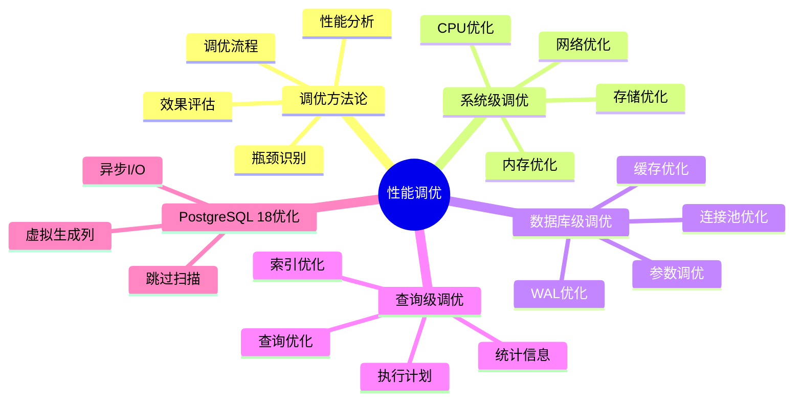
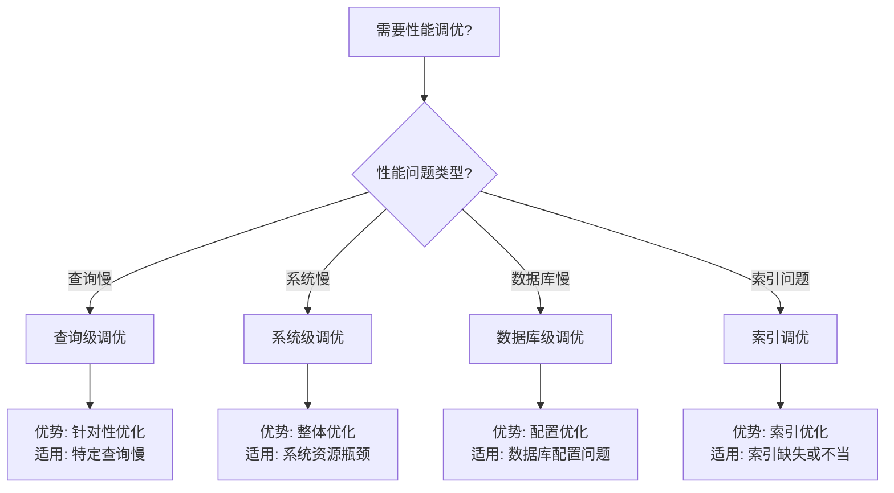

# 30-性能调优

> **创建日期**: 2025年1月
> **文档总数**: 7+个文档
> **覆盖领域**: 性能调优方法论、系统级调优、数据库级调优、查询级调优、索引调优、参数调优
> **版本覆盖**: PostgreSQL 18.x (推荐) ⭐ | 17.x (推荐) | 16.x (兼容)

---

## 📊 知识体系思维导图

---

## 📋 主题说明

本主题整合所有PostgreSQL性能调优相关内容，包括性能调优方法论、系统级调优、数据库级调优、查询级调优、索引调优、参数调优等。

---

## 📚 核心文档

### 基础文档

- **[PostgreSQL性能调优完整指南.md](./PostgreSQL性能调优完整指南.md)** - 性能调优完整指南
- **[性能调优方法论.md](./性能调优方法论.md)** - 性能调优方法论
- **[系统级调优.md](./系统级调优.md)** - 系统级调优指南
- **[数据库级调优.md](./数据库级调优.md)** - 数据库级调优指南
- **[查询级调优.md](./查询级调优.md)** - 查询级调优指南
- **[索引调优.md](./索引调优.md)** - 索引调优指南
- **[参数调优.md](./参数调优.md)** - 参数调优指南

---

## 📊 性能调优选型决策树

---

## 📊 性能调优层次对比矩阵

| 调优层次 | 影响范围 | 优化难度 | 效果 | 适用场景 |
| --- | --- | --- | --- | --- |
| **系统级调优** | 全局 | ⭐⭐⭐⭐ | ⭐⭐⭐⭐ | 系统资源瓶颈 |
| **数据库级调优** | 数据库 | ⭐⭐⭐ | ⭐⭐⭐⭐ | 数据库配置问题 |
| **查询级调优** | 查询 | ⭐⭐ | ⭐⭐⭐⭐⭐ | 特定查询慢 |
| **索引调优** | 查询 | ⭐⭐ | ⭐⭐⭐⭐⭐ | 索引问题 |

---

## 🎯 学习路径

### 初学者

1. 学习性能调优方法论
2. 了解系统级调优
3. 掌握数据库级调优

### 进阶

1. 深入学习查询级调优
2. 学习索引调优
3. 掌握参数调优

### 实战

1. 实施系统级调优
2. 优化数据库配置
3. 优化查询性能

---

## 📊 性能调优分类

### 调优层次

- 系统级调优
- 数据库级调优
- 查询级调优

### 调优对象

- 系统资源
- 数据库配置
- 查询优化
- 索引优化
- 参数优化

---

## 📚 文档来源

本主题整合了以下源目录的文档：

- `02-查询与优化/02.06-性能调优/`

**原则**: 所有文档均为复制，原文件保持不变。

---

## 🔗 相关文档

- [02-查询与优化/../02-查询与优化/README.md) - 查询与优化主题
- [12-监控与诊断/../12-监控与诊断/README.md) - 监控与诊断主题

---

## 📝 待补充文档

根据分析报告，以下文档需要补充：

- [ ] 性能调优方法论.md（调优方法论详解）
- [ ] 系统级调优.md（系统级调优详解）
- [ ] 数据库级调优.md（数据库级调优详解）
- [ ] 查询级调优.md（查询级调优详解）
- [ ] 索引调优.md（索引调优详解）
- [ ] 参数调优.md（参数调优详解）

---

**最后更新**: 2025年1月
**状态**: ✅ 目录已创建，待补充系统化指南
