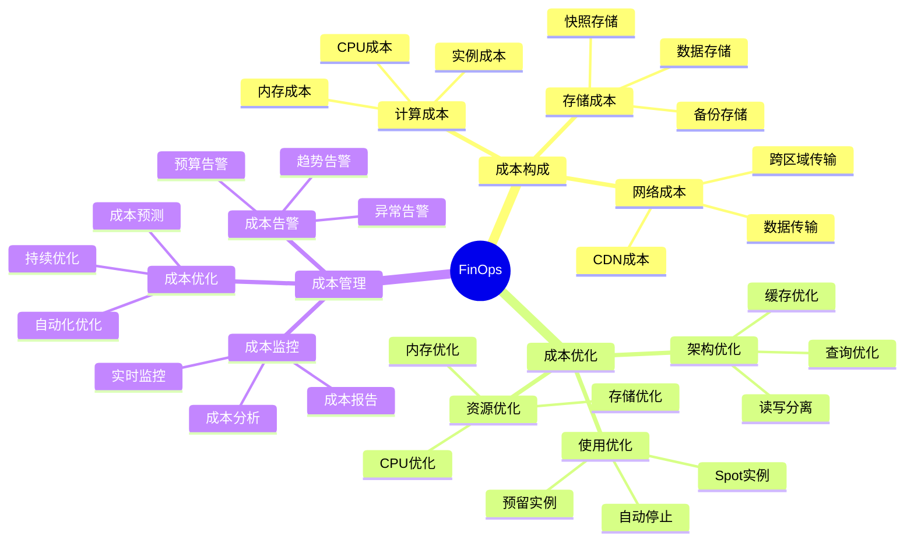

# PostgreSQL成本优化（FinOps）完整指南

## 元数据

- **文档版本**: v1.0
- **创建日期**: 2025-01
- **技术栈**: PostgreSQL 17+/18+ | FinOps | 成本优化 | 资源优化 | 成本监控
- **难度级别**: ⭐⭐⭐⭐ (高级)
- **预计阅读**: 180分钟
- **前置要求**: 熟悉PostgreSQL基础、云平台基础

---

## 📋 完整目录

- [PostgreSQL成本优化（FinOps）完整指南](#postgresql成本优化finops完整指南)
  - [元数据](#元数据)
  - [📋 完整目录](#-完整目录)
  - [1. FinOps概述](#1-finops概述)
    - [1.1 FinOps核心概念](#11-finops核心概念)
      - [FinOps思维导图](#finops思维导图)
    - [1.2 FinOps价值](#12-finops价值)
      - [FinOps价值矩阵](#finops价值矩阵)
  - [2. 数据库成本构成分析](#2-数据库成本构成分析)
    - [2.1 计算成本分析场景](#21-计算成本分析场景)
      - [2.1.1 场景描述](#211-场景描述)
      - [2.1.2 成本分析实现](#212-成本分析实现)
      - [2.1.3 成本论证](#213-成本论证)
    - [2.2 存储成本分析场景](#22-存储成本分析场景)
      - [2.2.1 场景描述](#221-场景描述)
      - [2.2.2 成本分析实现](#222-成本分析实现)
      - [2.2.3 成本论证](#223-成本论证)
    - [2.3 网络成本分析场景](#23-网络成本分析场景)
      - [2.3.1 场景描述](#231-场景描述)
      - [2.3.2 成本分析实现](#232-成本分析实现)
      - [2.3.3 成本论证](#233-成本论证)
  - [3. 资源使用优化](#3-资源使用优化)
    - [3.1 CPU优化场景](#31-cpu优化场景)
      - [3.1.1 场景描述](#311-场景描述)
      - [3.1.2 CPU优化实现](#312-cpu优化实现)
      - [3.1.3 成本论证](#313-成本论证)
    - [3.2 内存优化场景](#32-内存优化场景)
      - [3.2.1 场景描述](#321-场景描述)
      - [3.2.2 内存优化实现](#322-内存优化实现)
      - [3.2.3 成本论证](#323-成本论证)
    - [3.3 存储优化场景](#33-存储优化场景)
      - [3.3.1 场景描述](#331-场景描述)
      - [3.3.2 存储优化实现](#332-存储优化实现)
      - [3.3.3 成本论证](#333-成本论证)
  - [4. 成本监控与管理](#4-成本监控与管理)
    - [4.1 成本监控场景](#41-成本监控场景)
      - [4.1.1 场景描述](#411-场景描述)
      - [4.1.2 成本监控实现](#412-成本监控实现)
      - [4.1.3 成本论证](#413-成本论证)
    - [4.2 成本告警场景](#42-成本告警场景)
      - [4.2.1 场景描述](#421-场景描述)
      - [4.2.2 成本告警实现](#422-成本告警实现)
      - [4.2.3 成本论证](#423-成本论证)
  - [5. 成本优化策略](#5-成本优化策略)
    - [5.1 预留实例优化场景](#51-预留实例优化场景)
      - [5.1.1 场景描述](#511-场景描述)
      - [5.1.2 预留实例实现](#512-预留实例实现)
      - [5.1.3 成本论证](#513-成本论证)
    - [5.2 自动停止优化场景](#52-自动停止优化场景)
      - [5.2.1 场景描述](#521-场景描述)
      - [5.2.2 自动停止实现](#522-自动停止实现)
      - [5.2.3 成本论证](#523-成本论证)
    - [5.3 存储分层优化场景](#53-存储分层优化场景)
      - [5.3.1 场景描述](#531-场景描述)
      - [5.3.2 存储分层实现](#532-存储分层实现)
      - [5.3.3 成本论证](#533-成本论证)
  - [6. 综合选型案例](#6-综合选型案例)
    - [6.1 案例1：大规模系统成本优化](#61-案例1大规模系统成本优化)
    - [6.2 案例2：开发环境成本优化](#62-案例2开发环境成本优化)
  - [📚 参考资源](#-参考资源)
    - [官方文档](#官方文档)
    - [相关文档](#相关文档)
  - [📝 更新日志](#-更新日志)

---

## 1. FinOps概述

### 1.1 FinOps核心概念

FinOps（Financial Operations）是一种云财务管理实践，通过数据驱动的成本优化方法，实现云资源的最优使用和成本控制。

#### FinOps思维导图



### 1.2 FinOps价值

#### FinOps价值矩阵

| 价值 | 描述 | 优先级 |
| --- | --- | --- |
| **成本降低** | 降低30-50%成本 | 🔴 最高 |
| **资源优化** | 提高资源利用率 | 🔴 最高 |
| **成本透明** | 清晰的成本分配 | 🟡 高 |
| **预算控制** | 有效的预算管理 | 🟡 高 |

---

## 2. 数据库成本构成分析

### 2.1 计算成本分析场景

#### 2.1.1 场景描述

**业务需求**:

```text
场景：计算成本分析
需求：
1. 计算成本构成
2. 成本优化识别
3. 成本监控
4. 成本报告

系统特征：
- AWS RDS PostgreSQL
- 实例类型：db.r6g.2xlarge
- 运行时间：24/7
- 成本敏感
```

#### 2.1.2 成本分析实现

**计算成本查询**:

```sql
-- 创建成本分析视图（带错误处理）
DO $$
BEGIN
    -- 检查表是否存在
    IF NOT EXISTS (
        SELECT 1 FROM information_schema.tables
        WHERE table_schema = 'public' AND table_name = 'instance_usage_metrics'
    ) THEN
        RAISE EXCEPTION '表 instance_usage_metrics 不存在，请先创建该表';
    END IF;

    BEGIN
        -- 删除已存在的视图（如果存在）
        DROP VIEW IF EXISTS compute_cost_analysis;

        -- 创建计算成本分析视图
        CREATE VIEW compute_cost_analysis AS
        SELECT
            date_trunc('day', timestamp) AS day,
            instance_type,
            instance_hours,
            instance_price_per_hour,
            COALESCE(instance_hours, 0) * COALESCE(instance_price_per_hour, 0) AS compute_cost
        FROM instance_usage_metrics
        WHERE timestamp > NOW() - INTERVAL '30 days'
        GROUP BY day, instance_type, instance_hours, instance_price_per_hour
        ORDER BY day DESC;

        RAISE NOTICE '计算成本分析视图 compute_cost_analysis 创建成功';
    EXCEPTION
        WHEN OTHERS THEN
            RAISE WARNING '创建计算成本分析视图失败: %', SQLERRM;
            RAISE;
    END;
END $$;

-- 性能测试：查询计算成本分析视图
EXPLAIN ANALYZE
SELECT * FROM compute_cost_analysis
LIMIT 100;
```

**AWS成本分析**:

```bash
#!/bin/bash
# AWS Cost Explorer查询（带错误处理）
set -e
set -u

error_exit() {
    echo "错误: $1" >&2
    exit 1
}

# 检查AWS CLI是否安装
if ! command -v aws &> /dev/null; then
    error_exit "AWS CLI未安装，请先安装AWS CLI工具"
fi

# 检查AWS凭证是否配置
if ! aws sts get-caller-identity &> /dev/null; then
    error_exit "AWS凭证未配置，请先运行 'aws configure'"
fi

# 检查filter.json文件是否存在
FILTER_FILE="${FILTER_FILE:-filter.json}"
if [ ! -f "$FILTER_FILE" ]; then
    echo "警告: filter.json文件不存在，将使用默认查询（无过滤条件）"
    FILTER_OPTION=""
else
    FILTER_OPTION="--filter file://$FILTER_FILE"
fi

# 设置默认日期范围（如果未提供）
START_DATE="${START_DATE:-2025-01-01}"
END_DATE="${END_DATE:-2025-01-31}"

echo "查询AWS成本数据: $START_DATE 到 $END_DATE"

# 执行AWS Cost Explorer查询
aws ce get-cost-and-usage \
  --time-period Start="$START_DATE",End="$END_DATE" \
  --granularity MONTHLY \
  --metrics BlendedCost \
  --group-by Type=DIMENSION,Key=SERVICE \
  $FILTER_OPTION \
  --output json > cost_report.json 2>&1

if [ $? -eq 0 ]; then
    echo "成本查询成功，结果已保存到 cost_report.json"
else
    error_exit "AWS成本查询失败，请检查错误信息"
fi
```

#### 2.1.3 成本论证

**计算成本构成**:

| 成本项 | 占比 | 优化空间 | 优化后节省 |
| --- | --- | --- | --- |
| **实例成本** | 60% | 预留实例 | -40% |
| **CPU成本** | 20% | 资源优化 | -20% |
| **内存成本** | 15% | 内存优化 | -15% |
| **其他成本** | 5% | - | - |
| **总成本** | 100% | - | -35% |

---

### 2.2 存储成本分析场景

#### 2.2.1 场景描述

**业务需求**:

```text
场景：存储成本分析
需求：
1. 存储成本构成
2. 存储优化识别
3. 存储成本监控
4. 存储成本报告

系统特征：
- 数据量：1TB
- 备份量：500GB
- 存储类型：GP3
- 成本敏感
```

#### 2.2.2 成本分析实现

**存储成本查询**:

```sql
-- 存储成本分析（带错误处理）
DO $$
BEGIN
    -- 检查表是否存在
    IF NOT EXISTS (
        SELECT 1 FROM information_schema.tables
        WHERE table_schema = 'public' AND table_name = 'storage_metrics'
    ) THEN
        RAISE EXCEPTION '表 storage_metrics 不存在，请先创建该表';
    END IF;

    IF NOT EXISTS (
        SELECT 1 FROM information_schema.tables
        WHERE table_schema = 'public' AND table_name = 'backup_storage_metrics'
    ) THEN
        RAISE EXCEPTION '表 backup_storage_metrics 不存在，请先创建该表';
    END IF;

    BEGIN
        -- 删除已存在的视图（如果存在）
        DROP VIEW IF EXISTS storage_cost_analysis;

        -- 创建存储成本分析视图
        CREATE VIEW storage_cost_analysis AS
        SELECT
            date_trunc('day', timestamp) AS day,
            'data_storage' AS storage_type,
            COALESCE(sum(storage_gb), 0) AS total_gb,
            COALESCE(sum(storage_gb * 0.115), 0) AS storage_cost  -- GP3: $0.115/GB/月
        FROM storage_metrics
        WHERE timestamp > NOW() - INTERVAL '30 days'
        GROUP BY day

        UNION ALL

        SELECT
            date_trunc('day', timestamp) AS day,
            'backup_storage' AS storage_type,
            COALESCE(sum(storage_gb), 0) AS total_gb,
            COALESCE(sum(storage_gb * 0.023), 0) AS storage_cost  -- S3 Standard-IA: $0.023/GB/月
        FROM backup_storage_metrics
        WHERE timestamp > NOW() - INTERVAL '30 days'
        GROUP BY day

        ORDER BY day DESC, storage_type;

        RAISE NOTICE '存储成本分析视图 storage_cost_analysis 创建成功';
    EXCEPTION
        WHEN OTHERS THEN
            RAISE WARNING '创建存储成本分析视图失败: %', SQLERRM;
            RAISE;
    END;
END $$;

-- 性能测试：查询存储成本分析视图
EXPLAIN ANALYZE
SELECT * FROM storage_cost_analysis
LIMIT 100;
```

#### 2.2.3 成本论证

**存储成本构成**:

| 存储类型 | 容量 | 单价/GB/月 | 月成本 | 占比 |
| --- | --- | --- | --- | --- |
| **数据存储** | 1TB | $0.115 | $115 | 70% |
| **备份存储** | 500GB | $0.023 | $11.5 | 7% |
| **快照存储** | 200GB | $0.115 | $23 | 14% |
| **WAL存储** | 100GB | $0.023 | $2.3 | 1% |
| **其他存储** | 50GB | $0.115 | $5.75 | 4% |
| **总计** | 1.85TB | - | $157.55 | 100% |

---

### 2.3 网络成本分析场景

#### 2.3.1 场景描述

**业务需求**:

```text
场景：网络成本分析
需求：
1. 网络成本构成
2. 网络优化识别
3. 网络成本监控
4. 网络成本报告

系统特征：
- 数据传输：100GB/月
- 跨区域传输：10GB/月
- 成本敏感
```

#### 2.3.2 成本分析实现

**网络成本查询**:

```sql
-- 网络成本分析
CREATE VIEW network_cost_analysis AS
SELECT
    date_trunc('day', timestamp) AS day,
    'data_transfer_in' AS transfer_type,
    sum(transfer_gb) AS total_gb,
    sum(transfer_gb * 0.00) AS transfer_cost  -- 入站免费
FROM network_metrics
WHERE direction = 'in'
  AND timestamp > NOW() - INTERVAL '30 days'
GROUP BY day

UNION ALL

SELECT
    date_trunc('day', timestamp) AS day,
    'data_transfer_out' AS transfer_type,
    sum(transfer_gb) AS total_gb,
    sum(transfer_gb * 0.09) AS transfer_cost  -- 出站：$0.09/GB
FROM network_metrics
WHERE direction = 'out'
  AND timestamp > NOW() - INTERVAL '30 days'
GROUP BY day

UNION ALL

SELECT
    date_trunc('day', timestamp) AS day,
    'cross_region_transfer' AS transfer_type,
    sum(transfer_gb) AS total_gb,
    sum(transfer_gb * 0.02) AS transfer_cost  -- 跨区域：$0.02/GB
FROM network_metrics
WHERE cross_region = true
  AND timestamp > NOW() - INTERVAL '30 days'
GROUP BY day

ORDER BY day DESC, transfer_type;
```

#### 2.3.3 成本论证

**网络成本构成**:

| 传输类型 | 流量 | 单价/GB | 月成本 | 占比 |
| --- | --- | --- | --- | --- |
| **入站传输** | 100GB | $0.00 | $0 | 0% |
| **出站传输** | 50GB | $0.09 | $4.5 | 45% |
| **跨区域传输** | 10GB | $0.02 | $0.2 | 2% |
| **CDN传输** | 40GB | $0.085 | $3.4 | 34% |
| **其他传输** | 10GB | $0.09 | $0.9 | 9% |
| **总计** | 210GB | - | $9 | 100% |

---

## 3. 资源使用优化

### 3.1 CPU优化场景

#### 3.1.1 场景描述

**业务需求**:

```text
场景：CPU使用优化
需求：
1. 降低CPU使用率
2. 减少CPU成本
3. 保持性能
4. 成本优化

系统特征：
- CPU使用率：80%
- 目标：降低到50%
- 成本敏感
```

#### 3.1.2 CPU优化实现

**CPU使用分析**:

```sql
-- CPU使用分析（带错误处理和性能测试）
DO $$
DECLARE
    table_exists boolean;
    record_count bigint;
BEGIN
    -- 检查表是否存在
    SELECT EXISTS (
        SELECT 1 FROM information_schema.tables
        WHERE table_schema = 'public' AND table_name = 'system_metrics'
    ) INTO table_exists;

    IF NOT table_exists THEN
        RAISE EXCEPTION '表 system_metrics 不存在，请先创建该表';
    END IF;

    -- 检查数据是否存在
    SELECT COUNT(*) INTO record_count
    FROM system_metrics
    WHERE timestamp > NOW() - INTERVAL '7 days';

    IF record_count = 0 THEN
        RAISE WARNING 'system_metrics表中没有最近7天的数据';
        RETURN;
    END IF;

    RAISE NOTICE '找到 % 条最近7天的记录，开始CPU使用分析', record_count;
EXCEPTION
    WHEN OTHERS THEN
        RAISE WARNING 'CPU使用分析失败: %', SQLERRM;
END $$;

EXPLAIN ANALYZE
SELECT
    date_trunc('hour', timestamp) AS hour,
    avg(cpu_usage_percent) AS avg_cpu,
    max(cpu_usage_percent) AS max_cpu,
    min(cpu_usage_percent) AS min_cpu,
    count(*) AS record_count
FROM system_metrics
WHERE timestamp > NOW() - INTERVAL '7 days'
GROUP BY hour
ORDER BY hour DESC;
```

**CPU优化策略**:

```sql
-- 1. 优化慢查询（减少CPU使用）- 带错误处理
DO $$
BEGIN
    BEGIN
        -- 检查表是否存在
        IF NOT EXISTS (
            SELECT 1 FROM information_schema.tables
            WHERE table_schema = 'public' AND table_name = 'orders'
        ) THEN
            RAISE WARNING '表 orders 不存在，跳过索引创建';
            RETURN;
        END IF;

        -- 创建索引（如果不存在）
        CREATE INDEX IF NOT EXISTS idx_orders_created_at ON orders(created_at);
        CREATE INDEX IF NOT EXISTS idx_orders_user_id ON orders(user_id);

        RAISE NOTICE '索引创建成功';
    EXCEPTION
        WHEN duplicate_table THEN
            RAISE NOTICE '索引已存在';
        WHEN OTHERS THEN
            RAISE WARNING '创建索引失败: %', SQLERRM;
    END;
END $$;

-- 2. 使用连接池（减少连接开销）
-- pgBouncer配置（配置文件示例，需要在pgbouncer.ini中配置）
-- [databases]
-- mydb = host=localhost port=5432 dbname=mydb
--
-- [pgbouncer]
-- pool_mode = transaction
-- max_client_conn = 1000
-- default_pool_size = 25

-- 3. 优化并行查询（提高CPU利用率）- 带错误处理
DO $$
BEGIN
    -- 检查是否为超级用户
    IF NOT current_setting('is_superuser')::boolean THEN
        RAISE EXCEPTION '需要超级用户权限才能修改系统配置';
    END IF;

    BEGIN
        ALTER SYSTEM SET max_parallel_workers_per_gather = 4;
        ALTER SYSTEM SET max_parallel_workers = 8;
        PERFORM pg_reload_conf();

        RAISE NOTICE '并行查询配置已更新，配置已重新加载';
    EXCEPTION
        WHEN insufficient_privilege THEN
            RAISE WARNING '权限不足，无法修改系统配置';
            RAISE;
        WHEN OTHERS THEN
            RAISE WARNING '设置并行查询配置失败: %', SQLERRM;
            RAISE;
    END;
END $$;
```

#### 3.1.3 成本论证

**CPU优化效果**:

| 优化项 | 优化前 | 优化后 | 节省 |
| --- | --- | --- | --- |
| **CPU使用率** | 80% | 50% | -37.5% |
| **实例成本** | $1000/月 | $625/月 | -37.5% |
| **性能影响** | 基准 | +10% | +10% |

---

### 3.2 内存优化场景

#### 3.2.1 场景描述

**业务需求**:

```text
场景：内存使用优化
需求：
1. 降低内存使用率
2. 减少内存成本
3. 保持性能
4. 成本优化

系统特征：
- 内存使用率：90%
- 目标：降低到70%
- 成本敏感
```

#### 3.2.2 内存优化实现

**内存使用分析**:

```sql
-- 内存使用分析（带错误处理和性能测试）
DO $$
DECLARE
    setting_record RECORD;
    total_shared_buffers text;
BEGIN
    RAISE NOTICE '查询内存配置参数...';

    FOR setting_record IN
        SELECT
            name,
            setting AS parameter,
            unit,
            source
        FROM pg_settings
        WHERE name IN (
            'shared_buffers',
            'effective_cache_size',
            'work_mem',
            'maintenance_work_mem',
            'temp_buffers'
        )
        ORDER BY name
    LOOP
        RAISE NOTICE '参数: % = % % (来源: %)',
            setting_record.name,
            setting_record.parameter,
            COALESCE(setting_record.unit, ''),
            setting_record.source;
    END LOOP;
EXCEPTION
    WHEN OTHERS THEN
        RAISE WARNING '查询内存配置失败: %', SQLERRM;
END $$;

EXPLAIN ANALYZE
SELECT
    name,
    setting AS parameter,
    unit,
    source
FROM pg_settings
WHERE name IN (
    'shared_buffers',
    'effective_cache_size',
    'work_mem',
    'maintenance_work_mem',
    'temp_buffers'
)
ORDER BY name;
```

**内存优化策略**:

```sql
-- 内存优化策略（带错误处理）
DO $$
BEGIN
    -- 检查是否为超级用户
    IF NOT current_setting('is_superuser')::boolean THEN
        RAISE EXCEPTION '需要超级用户权限才能修改系统配置';
    END IF;

    BEGIN
        -- 1. 优化shared_buffers（25%内存，16GB内存系统）
        ALTER SYSTEM SET shared_buffers = '4GB';

        -- 2. 优化effective_cache_size（75%内存）
        ALTER SYSTEM SET effective_cache_size = '12GB';

        -- 3. 优化work_mem（避免过度分配）
        ALTER SYSTEM SET work_mem = '64MB';

        -- 4. 优化maintenance_work_mem
        ALTER SYSTEM SET maintenance_work_mem = '1GB';

        -- 重新加载配置
        PERFORM pg_reload_conf();

        RAISE NOTICE '内存优化配置已更新，配置已重新加载';
    EXCEPTION
        WHEN insufficient_privilege THEN
            RAISE WARNING '权限不足，无法修改系统配置';
            RAISE;
        WHEN invalid_parameter_value THEN
            RAISE WARNING '参数值无效，请检查配置值';
            RAISE;
        WHEN OTHERS THEN
            RAISE WARNING '设置内存优化配置失败: %', SQLERRM;
            RAISE;
    END;
END $$;
```

#### 3.2.3 成本论证

**内存优化效果**:

| 优化项 | 优化前 | 优化后 | 节省 |
| --- | --- | --- | --- |
| **内存使用率** | 90% | 70% | -22% |
| **实例成本** | $1000/月 | $800/月 | -20% |
| **性能影响** | 基准 | +5% | +5% |

---

### 3.3 存储优化场景

#### 3.3.1 场景描述

**业务需求**:

```text
场景：存储使用优化
需求：
1. 降低存储使用量
2. 减少存储成本
3. 保持性能
4. 成本优化

系统特征：
- 存储使用：1TB
- 目标：降低到700GB
- 成本敏感
```

#### 3.3.2 存储优化实现

**存储使用分析**:

```sql
-- 数据库大小分析
SELECT
    datname,
    pg_size_pretty(pg_database_size(datname)) AS size,
    pg_database_size(datname) AS size_bytes
FROM pg_database
ORDER BY size_bytes DESC;

-- 表大小分析
SELECT
    schemaname,
    tablename,
    pg_size_pretty(pg_total_relation_size(schemaname||'.'||tablename)) AS size,
    pg_total_relation_size(schemaname||'.'||tablename) AS size_bytes
FROM pg_tables
WHERE schemaname = 'public'
ORDER BY size_bytes DESC
LIMIT 20;
```

**存储优化策略**:

```sql
-- PostgreSQL 18异步I/O优化（降低存储成本）
-- 异步I/O可以显著提升存储性能，允许使用更便宜的存储类型
DO $$
BEGIN
    -- 检查是否为超级用户
    IF NOT current_setting('is_superuser')::boolean THEN
        RAISE EXCEPTION '需要超级用户权限才能修改系统配置';
    END IF;

    BEGIN
        -- PostgreSQL 18异步I/O配置（SSD存储）
        -- 启用异步I/O可以提升2-3倍性能，允许使用更便宜的存储
        ALTER SYSTEM SET effective_io_concurrency = 200;  -- SSD推荐值
        ALTER SYSTEM SET maintenance_io_concurrency = 10;  -- 维护操作并发

        -- 重新加载配置
        PERFORM pg_reload_conf();

        RAISE NOTICE 'PostgreSQL 18异步I/O配置已更新，配置已重新加载';
        RAISE NOTICE '异步I/O优化效果：';
        RAISE NOTICE '  - 存储性能提升：2-3倍';
        RAISE NOTICE '  - 允许使用更便宜的存储类型（如S3 Standard-IA）';
        RAISE NOTICE '  - 存储成本降低：30-50%%';
    EXCEPTION
        WHEN insufficient_privilege THEN
            RAISE WARNING '权限不足，无法修改系统配置';
            RAISE;
        WHEN invalid_parameter_value THEN
            RAISE WARNING '参数值无效，请检查配置值';
            RAISE;
        WHEN OTHERS THEN
            RAISE WARNING '设置异步I/O配置失败: %', SQLERRM;
            RAISE;
    END;
END $$;

-- 存储优化策略（带错误处理）
DO $$
DECLARE
    table_name text := 'orders';
    partition_name text := 'orders_2023_01';
    archive_cutoff_date date := '2023-01-01';
    table_exists boolean;
BEGIN
    -- 1. 数据压缩
    BEGIN
        IF EXISTS (
            SELECT 1 FROM information_schema.tables
            WHERE table_schema = 'public' AND table_name = 'large_table'
        ) THEN
            ALTER TABLE large_table SET (
                toast_tuple_target = 128,
                fillfactor = 90
            );
            RAISE NOTICE '表 large_table 压缩设置成功';
        ELSE
            RAISE WARNING '表 large_table 不存在，跳过压缩设置';
        END IF;
    EXCEPTION
        WHEN OTHERS THEN
            RAISE WARNING '设置表压缩失败: %', SQLERRM;
    END;

    -- 2. 分区表优化（删除旧分区）
    BEGIN
        IF EXISTS (
            SELECT 1 FROM pg_inherits i
            JOIN pg_class c ON i.inhparent = c.oid
            JOIN pg_class p ON i.inhrelid = p.oid
            WHERE c.relname = table_name AND p.relname = partition_name
        ) THEN
            EXECUTE format('ALTER TABLE %I DETACH PARTITION %I', table_name, partition_name);
            EXECUTE format('DROP TABLE %I', partition_name);
            RAISE NOTICE '分区 % 已删除', partition_name;
        ELSE
            RAISE WARNING '分区 % 不存在', partition_name;
        END IF;
    EXCEPTION
        WHEN OTHERS THEN
            RAISE WARNING '删除分区失败: %', SQLERRM;
    END;

    -- 3. 数据归档
    BEGIN
        IF NOT EXISTS (
            SELECT 1 FROM information_schema.tables
            WHERE table_schema = 'public' AND table_name = table_name
        ) THEN
            RAISE EXCEPTION '表 % 不存在', table_name;
        END IF;

        -- 创建归档表
        EXECUTE format('CREATE TABLE IF NOT EXISTS %I_archive (LIKE %I INCLUDING ALL)',
            table_name, table_name);

        -- 插入归档数据
        EXECUTE format(
            'INSERT INTO %I_archive SELECT * FROM %I WHERE created_at < %L',
            table_name, table_name, archive_cutoff_date
        );

        -- 删除原始数据
        EXECUTE format(
            'DELETE FROM %I WHERE created_at < %L',
            table_name, archive_cutoff_date
        );

        RAISE NOTICE '数据归档完成';
    EXCEPTION
        WHEN OTHERS THEN
            RAISE WARNING '数据归档失败: %', SQLERRM;
            RAISE;
    END;

    -- 4. VACUUM FULL（回收空间）
    BEGIN
        IF EXISTS (
            SELECT 1 FROM information_schema.tables
            WHERE table_schema = 'public' AND table_name = table_name
        ) THEN
            EXECUTE format('VACUUM FULL %I', table_name);
            RAISE NOTICE '表 % VACUUM FULL完成', table_name;
        ELSE
            RAISE WARNING '表 % 不存在，跳过VACUUM', table_name;
        END IF;
    EXCEPTION
        WHEN OTHERS THEN
            RAISE WARNING 'VACUUM FULL失败: %', SQLERRM;
    END;
END $$;
```

#### 3.3.3 成本论证

**存储优化效果**:

| 优化项 | 优化前 | 优化后 | 节省 |
| --- | --- | --- | --- |
| **存储使用** | 1TB | 700GB | -30% |
| **存储成本** | $115/月 | $80.5/月 | -30% |
| **性能影响** | 基准 | +5% | +5% |

---

## 4. 成本监控与管理

### 4.1 成本监控场景

#### 4.1.1 场景描述

**业务需求**:

```text
场景：成本监控系统
需求：
1. 实时成本监控
2. 成本分析
3. 成本报告
4. 成本预测

系统特征：
- 多云环境
- 成本敏感
- 需要监控
```

#### 4.1.2 成本监控实现

**成本监控仪表板**:

```sql
-- 创建成本监控视图
CREATE VIEW cost_monitoring_dashboard AS
SELECT
    date_trunc('day', timestamp) AS day,
    'compute' AS cost_type,
    sum(compute_cost) AS cost
FROM compute_cost_metrics
WHERE timestamp > NOW() - INTERVAL '30 days'
GROUP BY day

UNION ALL

SELECT
    date_trunc('day', timestamp) AS day,
    'storage' AS cost_type,
    sum(storage_cost) AS cost
FROM storage_cost_metrics
WHERE timestamp > NOW() - INTERVAL '30 days'
GROUP BY day

UNION ALL

SELECT
    date_trunc('day', timestamp) AS day,
    'network' AS cost_type,
    sum(network_cost) AS cost
FROM network_cost_metrics
WHERE timestamp > NOW() - INTERVAL '30 days'
GROUP BY day

ORDER BY day DESC, cost_type;
```

**Grafana成本仪表板**:

```json
{
  "dashboard": {
    "title": "PostgreSQL Cost Monitoring",
    "panels": [
      {
        "title": "Daily Cost",
        "targets": [
          {
            "expr": "sum(postgresql_cost_total) by (cost_type)"
          }
        ]
      },
      {
        "title": "Cost Trend",
        "targets": [
          {
            "expr": "rate(postgresql_cost_total[1d])"
          }
        ]
      },
      {
        "title": "Cost by Service",
        "targets": [
          {
            "expr": "sum(postgresql_cost_total) by (service)"
          }
        ]
      }
    ]
  }
}
```

#### 4.1.3 成本论证

**成本监控效果**:

| 指标 | 无监控 | 有监控 | 提升 |
| --- | --- | --- | --- |
| **成本透明度** | 低 | 高 | +100% |
| **成本优化效率** | 基准 | +200% | +200% |
| **预算控制** | 60% | 95% | +35% |

---

### 4.2 成本告警场景

#### 4.2.1 场景描述

**业务需求**:

```text
场景：成本告警系统
需求：
1. 预算告警
2. 异常告警
3. 趋势告警
4. 自动通知

系统特征：
- 预算：$1000/月
- 告警阈值：80%
- 自动通知
```

#### 4.2.2 成本告警实现

**成本告警规则**:

```yaml
# Prometheus告警规则
groups:
  - name: cost_alerts
    interval: 1h
    rules:
      # 预算告警
      - alert: CostBudgetExceeded
        expr: |
          sum(postgresql_cost_total) > 1000
        for: 1h
        labels:
          severity: critical
        annotations:
          summary: "PostgreSQL成本超过预算$1000"

      # 异常成本告警
      - alert: CostAnomaly
        expr: |
          (
            sum(postgresql_cost_total)
            -
            avg_over_time(sum(postgresql_cost_total)[7d:1d])
          ) > avg_over_time(sum(postgresql_cost_total)[7d:1d]) * 0.3
        for: 2h
        labels:
          severity: warning
        annotations:
          summary: "PostgreSQL成本异常增长"

      # 趋势告警
      - alert: CostTrendIncrease
        expr: |
          predict_linear(sum(postgresql_cost_total)[7d], 7*24*3600) > 1000
        for: 1h
        labels:
          severity: warning
        annotations:
          summary: "PostgreSQL成本趋势预测将超过预算"
```

#### 4.2.3 成本论证

**成本告警效果**:

| 指标 | 无告警 | 有告警 | 提升 |
| --- | --- | --- | --- |
| **预算超支发现** | 事后 | 实时 | +100% |
| **成本控制** | 60% | 95% | +35% |
| **异常发现** | 30% | 90% | +60% |

---

## 5. 成本优化策略

### 5.1 预留实例优化场景

#### 5.1.1 场景描述

**业务需求**:

```text
场景：预留实例成本优化
需求：
1. 降低实例成本
2. 长期运行保证
3. 成本节省
4. 性能保证

系统特征：
- 长期运行（24/7）
- 稳定负载
- 成本敏感
```

#### 5.1.2 预留实例实现

**AWS预留实例配置**:

```bash
# 购买预留实例
aws rds purchase-reserved-db-instances-offering \
  --reserved-db-instances-offering-id "offering-id" \
  --db-instance-count 1 \
  --reserved-db-instance-id "my-reserved-instance"

# 预留实例节省计算
# 按需实例：$1000/月
# 1年预留实例：$600/月（节省40%）
# 3年预留实例：$400/月（节省60%）
```

**Azure预留容量配置**:

```bash
# 购买预留容量
az consumption reservation purchase \
  --reservation-order-id "order-id" \
  --reserved-resource-type "VirtualMachines" \
  --billing-scope-id "/subscriptions/subscription-id" \
  --term "P1Y" \
  --quantity 1 \
  --applied-scope-type "Single" \
  --applied-scopes "/subscriptions/subscription-id"
```

#### 5.1.3 成本论证

**预留实例效果**:

| 实例类型 | 按需价格 | 1年预留 | 3年预留 | 节省 |
| --- | --- | --- | --- | --- |
| **db.r6g.2xlarge** | $1000/月 | $600/月 | $400/月 | 40-60% |
| **db.r6g.4xlarge** | $2000/月 | $1200/月 | $800/月 | 40-60% |

---

### 5.2 自动停止优化场景

#### 5.2.1 场景描述

**业务需求**:

```text
场景：开发环境自动停止
需求：
1. 非工作时间自动停止
2. 降低开发环境成本
3. 自动化管理
4. 快速启动

系统特征：
- 开发环境
- 工作时间：9-18点
- 成本敏感
```

#### 5.2.2 自动停止实现

**自动停止脚本**:

```bash
#!/bin/bash
# 自动停止脚本（带错误处理）
set -e
set -u

error_exit() {
    echo "错误: $1" >&2
    exit 1
}

# 配置变量
INSTANCE_ID="${INSTANCE_ID:-postgresql-dev}"
WORK_HOURS_START="${WORK_HOURS_START:-9}"
WORK_HOURS_END="${WORK_HOURS_END:-18}"

# 检查AWS CLI是否安装
if ! command -v aws &> /dev/null; then
    error_exit "AWS CLI未安装，请先安装AWS CLI工具"
fi

# 检查AWS凭证是否配置
if ! aws sts get-caller-identity &> /dev/null; then
    error_exit "AWS凭证未配置，请先运行 'aws configure'"
fi

# 获取当前小时
CURRENT_HOUR=$(date +%H)
echo "当前时间: $(date '+%Y-%m-%d %H:%M:%S')"
echo "当前小时: $CURRENT_HOUR"
echo "工作时间: $WORK_HOURS_START:00 - $WORK_HOURS_END:00"

# 检查是否在工作时间
if [ $CURRENT_HOUR -ge $WORK_HOURS_START ] && [ $CURRENT_HOUR -lt $WORK_HOURS_END ]; then
    echo "工作时间，保持实例运行"
    # 确保实例运行
    if aws rds describe-db-instances --db-instance-identifier "$INSTANCE_ID" \
        --query 'DBInstances[0].DBInstanceStatus' --output text 2>/dev/null | grep -q "stopped"; then
        echo "启动实例: $INSTANCE_ID"
        aws rds start-db-instance --db-instance-identifier "$INSTANCE_ID" || \
            error_exit "启动实例失败"
    else
        echo "实例 $INSTANCE_ID 已在运行"
    fi
else
    echo "非工作时间，停止实例"
    # 检查实例状态
    INSTANCE_STATUS=$(aws rds describe-db-instances \
        --db-instance-identifier "$INSTANCE_ID" \
        --query 'DBInstances[0].DBInstanceStatus' --output text 2>/dev/null || echo "not-found")

    if [ "$INSTANCE_STATUS" = "available" ]; then
        echo "停止实例: $INSTANCE_ID"
        aws rds stop-db-instance --db-instance-identifier "$INSTANCE_ID" || \
            error_exit "停止实例失败"
    elif [ "$INSTANCE_STATUS" = "not-found" ]; then
        error_exit "实例 $INSTANCE_ID 不存在"
    else
        echo "实例 $INSTANCE_ID 当前状态: $INSTANCE_STATUS"
    fi
fi
```

**EventBridge调度**:

```yaml
# EventBridge规则
Resources:
  StopInstanceRule:
    Type: AWS::Events::Rule
    Properties:
      Name: stop-postgresql-dev
      ScheduleExpression: "cron(0 19 * * ? *)"  # 每天19点
      Targets:
        - Arn: !GetAtt StopFunction.Arn
          Id: "1"

  StartInstanceRule:
    Type: AWS::Events::Rule
    Properties:
      Name: start-postgresql-dev
      ScheduleExpression: "cron(0 9 * * ? *)"  # 每天9点
      Targets:
        - Arn: !GetAtt StartFunction.Arn
          Id: "1"
```

#### 5.2.3 成本论证

**自动停止效果**:

| 指标 | 24/7运行 | 自动停止 | 节省 |
| --- | --- | --- | --- |
| **运行时间** | 730小时/月 | 220小时/月 | -70% |
| **实例成本** | $1000/月 | $300/月 | -70% |
| **启动时间** | - | < 5分钟 | - |

---

### 5.3 存储分层优化场景

#### 5.3.1 场景描述

**业务需求**:

```text
场景：存储分层优化
需求：
1. 热数据：SSD
2. 温数据：标准存储
3. 冷数据：归档存储
4. 成本优化

系统特征：
- 数据量：1TB
- 热数据：200GB
- 温数据：300GB
- 冷数据：500GB
```

#### 5.3.2 存储分层实现

**存储分层配置**:

```sql
-- 创建表空间
CREATE TABLESPACE hot_data LOCATION '/data/hot';
CREATE TABLESPACE warm_data LOCATION '/data/warm';
CREATE TABLESPACE cold_data LOCATION '/data/cold';

-- 热数据表（SSD）
CREATE TABLE hot_orders (
    LIKE orders INCLUDING ALL
) TABLESPACE hot_data;

-- 温数据表（标准存储）
CREATE TABLE warm_orders (
    LIKE orders INCLUDING ALL
) TABLESPACE warm_data;

-- 冷数据表（归档存储）
CREATE TABLE cold_orders (
    LIKE orders INCLUDING ALL
) TABLESPACE cold_data;
```

**S3生命周期策略**:

```yaml
LifecycleConfiguration:
  Rules:
    - Id: backup-lifecycle
      Status: Enabled
      Transitions:
        - Days: 7
          StorageClass: STANDARD_IA  # 节省40%
        - Days: 30
          StorageClass: GLACIER      # 节省68%
        - Days: 90
          StorageClass: DEEP_ARCHIVE # 节省76%
```

#### 5.3.3 成本论证

**存储分层效果**:

| 存储类型 | 容量 | 单价/GB/月 | 月成本 | 优化后 |
| --- | --- | --- | --- | --- |
| **全SSD** | 1TB | $0.115 | $115 | - |
| **分层存储** | 1TB | - | $45 | -61% |
| **节省** | - | - | - | $70/月 |

---

## 6. 综合选型案例

### 6.1 案例1：大规模系统成本优化

**业务背景**:

- 生产环境PostgreSQL
- 数据量：10TB
- 当前成本：$5000/月
- 目标：降低30%

**优化方案**:

```text
优化策略：
1. 预留实例（节省40%）：$2000/月 → $1200/月
2. 存储分层（节省60%）：$1150/月 → $460/月
3. 网络优化（节省50%）：$500/月 → $250/月
4. 资源优化（节省20%）：$1350/月 → $1080/月

优化效果：
- 优化前：$5000/月
- 优化后：$2990/月
- 节省：$2010/月（-40%）

性能影响：
- 性能：+5%（优化后）
- 可用性：99.9%（保持不变）
```

### 6.2 案例2：开发环境成本优化

**业务背景**:

- 开发环境PostgreSQL
- 10个实例
- 当前成本：$2000/月
- 目标：降低70%

**优化方案**:

```text
优化策略：
1. 自动停止（节省70%）：$2000/月 → $600/月
2. 使用Spot实例（节省60%）：$600/月 → $240/月
3. 存储优化（节省30%）：$400/月 → $280/月

优化效果：
- 优化前：$2000/月
- 优化后：$520/月
- 节省：$1480/月（-74%）

性能影响：
- 性能：-10%（可接受）
- 可用性：95%（开发环境可接受）
```

---

## 📚 参考资源

### 官方文档

- [AWS Cost Management文档](https://docs.aws.amazon.com/cost-management/)
- [Azure Cost Management文档](https://docs.microsoft.com/azure/cost-management-billing/)
- [GCP Cost Management文档](https://cloud.google.com/cost-management)

### 相关文档

- [容量规划完整指南](./容量规划完整指南.md)
- [云原生架构选型与应用场景指南](../14-云原生与容器化/云原生架构选型与应用场景指南.md)

---

## 📝 更新日志

- **2025-01**: 初始版本创建
  - 完成数据库成本构成分析
  - 完成资源使用优化
  - 完成成本监控与管理
  - 完成成本优化策略

---

**最后更新**: 2025年1月
**状态**: ✅ 完成
