# PostgreSQL成本优化（FinOps）完整指南

## 元数据

- **文档版本**: v1.0
- **创建日期**: 2025-01
- **技术栈**: PostgreSQL 17+/18+ | FinOps | 成本优化 | 资源优化 | 成本监控
- **难度级别**: ⭐⭐⭐⭐ (高级)
- **预计阅读**: 180分钟
- **前置要求**: 熟悉PostgreSQL基础、云平台基础

---

## 📋 完整目录

- [PostgreSQL成本优化（FinOps）完整指南](#postgresql成本优化finops完整指南)
  - [元数据](#元数据)
  - [📋 完整目录](#-完整目录)
  - [1. FinOps概述](#1-finops概述)
    - [1.1 FinOps核心概念](#11-finops核心概念)
      - [FinOps思维导图](#finops思维导图)
    - [1.2 FinOps价值](#12-finops价值)
      - [FinOps价值矩阵](#finops价值矩阵)
  - [2. 数据库成本构成分析](#2-数据库成本构成分析)
    - [2.1 计算成本分析场景](#21-计算成本分析场景)
      - [2.1.1 场景描述](#211-场景描述)
      - [2.1.2 成本分析实现](#212-成本分析实现)
      - [2.1.3 成本论证](#213-成本论证)
    - [2.2 存储成本分析场景](#22-存储成本分析场景)
      - [2.2.1 场景描述](#221-场景描述)
      - [2.2.2 成本分析实现](#222-成本分析实现)
      - [2.2.3 成本论证](#223-成本论证)
    - [2.3 网络成本分析场景](#23-网络成本分析场景)
      - [2.3.1 场景描述](#231-场景描述)
      - [2.3.2 成本分析实现](#232-成本分析实现)
      - [2.3.3 成本论证](#233-成本论证)
  - [3. 资源使用优化](#3-资源使用优化)
    - [3.1 CPU优化场景](#31-cpu优化场景)
      - [3.1.1 场景描述](#311-场景描述)
      - [3.1.2 CPU优化实现](#312-cpu优化实现)
      - [3.1.3 成本论证](#313-成本论证)
    - [3.2 内存优化场景](#32-内存优化场景)
      - [3.2.1 场景描述](#321-场景描述)
      - [3.2.2 内存优化实现](#322-内存优化实现)
      - [3.2.3 成本论证](#323-成本论证)
    - [3.3 存储优化场景](#33-存储优化场景)
      - [3.3.1 场景描述](#331-场景描述)
      - [3.3.2 存储优化实现](#332-存储优化实现)
      - [3.3.3 成本论证](#333-成本论证)
  - [4. 成本监控与管理](#4-成本监控与管理)
    - [4.1 成本监控场景](#41-成本监控场景)
      - [4.1.1 场景描述](#411-场景描述)
      - [4.1.2 成本监控实现](#412-成本监控实现)
      - [4.1.3 成本论证](#413-成本论证)
    - [4.2 成本告警场景](#42-成本告警场景)
      - [4.2.1 场景描述](#421-场景描述)
      - [4.2.2 成本告警实现](#422-成本告警实现)
      - [4.2.3 成本论证](#423-成本论证)
  - [5. 成本优化策略](#5-成本优化策略)
    - [5.1 预留实例优化场景](#51-预留实例优化场景)
      - [5.1.1 场景描述](#511-场景描述)
      - [5.1.2 预留实例实现](#512-预留实例实现)
      - [5.1.3 成本论证](#513-成本论证)
    - [5.2 自动停止优化场景](#52-自动停止优化场景)
      - [5.2.1 场景描述](#521-场景描述)
      - [5.2.2 自动停止实现](#522-自动停止实现)
      - [5.2.3 成本论证](#523-成本论证)
    - [5.3 存储分层优化场景](#53-存储分层优化场景)
      - [5.3.1 场景描述](#531-场景描述)
      - [5.3.2 存储分层实现](#532-存储分层实现)
      - [5.3.3 成本论证](#533-成本论证)
  - [6. 综合选型案例](#6-综合选型案例)
    - [6.1 案例1：大规模系统成本优化](#61-案例1大规模系统成本优化)
    - [6.2 案例2：开发环境成本优化](#62-案例2开发环境成本优化)
  - [📚 参考资源](#-参考资源)
    - [官方文档](#官方文档)
    - [相关文档](#相关文档)
  - [📝 更新日志](#-更新日志)

---

## 1. FinOps概述

### 1.1 FinOps核心概念

FinOps（Financial Operations）是一种云财务管理实践，通过数据驱动的成本优化方法，实现云资源的最优使用和成本控制。

#### FinOps思维导图

```mermaid
mindmap
  root((FinOps))
    成本构成
      计算成本
        实例成本
        CPU成本
        内存成本
      存储成本
        数据存储
        备份存储
        快照存储
      网络成本
        数据传输
        跨区域传输
        CDN成本
    成本优化
      资源优化
        CPU优化
        内存优化
        存储优化
      使用优化
        预留实例
        Spot实例
        自动停止
      架构优化
        读写分离
        缓存优化
        查询优化
    成本管理
      成本监控
        实时监控
        成本分析
        成本报告
      成本告警
        预算告警
        异常告警
        趋势告警
      成本优化
        自动化优化
        持续优化
        成本预测
```



### 1.2 FinOps价值

#### FinOps价值矩阵

| 价值 | 描述 | 优先级 |
|------|------|--------|
| **成本降低** | 降低30-50%成本 | 🔴 最高 |
| **资源优化** | 提高资源利用率 | 🔴 最高 |
| **成本透明** | 清晰的成本分配 | 🟡 高 |
| **预算控制** | 有效的预算管理 | 🟡 高 |

---

## 2. 数据库成本构成分析

### 2.1 计算成本分析场景

#### 2.1.1 场景描述

**业务需求**:

```text
场景：计算成本分析
需求：
1. 计算成本构成
2. 成本优化识别
3. 成本监控
4. 成本报告

系统特征：
- AWS RDS PostgreSQL
- 实例类型：db.r6g.2xlarge
- 运行时间：24/7
- 成本敏感
```

#### 2.1.2 成本分析实现

**计算成本查询**:

```sql
-- 创建成本分析视图
CREATE VIEW compute_cost_analysis AS
SELECT
    date_trunc('day', timestamp) AS day,
    instance_type,
    instance_hours,
    instance_price_per_hour,
    instance_hours * instance_price_per_hour AS compute_cost
FROM instance_usage_metrics
WHERE timestamp > NOW() - INTERVAL '30 days'
GROUP BY day, instance_type, instance_hours, instance_price_per_hour
ORDER BY day DESC;
```

**AWS成本分析**:

```bash
# AWS Cost Explorer查询
aws ce get-cost-and-usage \
  --time-period Start=2025-01-01,End=2025-01-31 \
  --granularity MONTHLY \
  --metrics BlendedCost \
  --group-by Type=DIMENSION,Key=SERVICE \
  --filter file://filter.json
```

#### 2.1.3 成本论证

**计算成本构成**:

| 成本项 | 占比 | 优化空间 | 优化后节省 |
|--------|------|---------|-----------|
| **实例成本** | 60% | 预留实例 | -40% |
| **CPU成本** | 20% | 资源优化 | -20% |
| **内存成本** | 15% | 内存优化 | -15% |
| **其他成本** | 5% | - | - |
| **总成本** | 100% | - | -35% |

---

### 2.2 存储成本分析场景

#### 2.2.1 场景描述

**业务需求**:

```text
场景：存储成本分析
需求：
1. 存储成本构成
2. 存储优化识别
3. 存储成本监控
4. 存储成本报告

系统特征：
- 数据量：1TB
- 备份量：500GB
- 存储类型：GP3
- 成本敏感
```

#### 2.2.2 成本分析实现

**存储成本查询**:

```sql
-- 存储成本分析
CREATE VIEW storage_cost_analysis AS
SELECT
    date_trunc('day', timestamp) AS day,
    'data_storage' AS storage_type,
    sum(storage_gb) AS total_gb,
    sum(storage_gb * 0.115) AS storage_cost  -- GP3: $0.115/GB/月
FROM storage_metrics
WHERE timestamp > NOW() - INTERVAL '30 days'
GROUP BY day

UNION ALL

SELECT
    date_trunc('day', timestamp) AS day,
    'backup_storage' AS storage_type,
    sum(storage_gb) AS total_gb,
    sum(storage_gb * 0.023) AS storage_cost  -- S3 Standard-IA: $0.023/GB/月
FROM backup_storage_metrics
WHERE timestamp > NOW() - INTERVAL '30 days'
GROUP BY day

ORDER BY day DESC, storage_type;
```

#### 2.2.3 成本论证

**存储成本构成**:

| 存储类型 | 容量 | 单价/GB/月 | 月成本 | 占比 |
|---------|------|-----------|--------|------|
| **数据存储** | 1TB | $0.115 | $115 | 70% |
| **备份存储** | 500GB | $0.023 | $11.5 | 7% |
| **快照存储** | 200GB | $0.115 | $23 | 14% |
| **WAL存储** | 100GB | $0.023 | $2.3 | 1% |
| **其他存储** | 50GB | $0.115 | $5.75 | 4% |
| **总计** | 1.85TB | - | $157.55 | 100% |

---

### 2.3 网络成本分析场景

#### 2.3.1 场景描述

**业务需求**:

```text
场景：网络成本分析
需求：
1. 网络成本构成
2. 网络优化识别
3. 网络成本监控
4. 网络成本报告

系统特征：
- 数据传输：100GB/月
- 跨区域传输：10GB/月
- 成本敏感
```

#### 2.3.2 成本分析实现

**网络成本查询**:

```sql
-- 网络成本分析
CREATE VIEW network_cost_analysis AS
SELECT
    date_trunc('day', timestamp) AS day,
    'data_transfer_in' AS transfer_type,
    sum(transfer_gb) AS total_gb,
    sum(transfer_gb * 0.00) AS transfer_cost  -- 入站免费
FROM network_metrics
WHERE direction = 'in'
  AND timestamp > NOW() - INTERVAL '30 days'
GROUP BY day

UNION ALL

SELECT
    date_trunc('day', timestamp) AS day,
    'data_transfer_out' AS transfer_type,
    sum(transfer_gb) AS total_gb,
    sum(transfer_gb * 0.09) AS transfer_cost  -- 出站：$0.09/GB
FROM network_metrics
WHERE direction = 'out'
  AND timestamp > NOW() - INTERVAL '30 days'
GROUP BY day

UNION ALL

SELECT
    date_trunc('day', timestamp) AS day,
    'cross_region_transfer' AS transfer_type,
    sum(transfer_gb) AS total_gb,
    sum(transfer_gb * 0.02) AS transfer_cost  -- 跨区域：$0.02/GB
FROM network_metrics
WHERE cross_region = true
  AND timestamp > NOW() - INTERVAL '30 days'
GROUP BY day

ORDER BY day DESC, transfer_type;
```

#### 2.3.3 成本论证

**网络成本构成**:

| 传输类型 | 流量 | 单价/GB | 月成本 | 占比 |
|---------|------|---------|--------|------|
| **入站传输** | 100GB | $0.00 | $0 | 0% |
| **出站传输** | 50GB | $0.09 | $4.5 | 45% |
| **跨区域传输** | 10GB | $0.02 | $0.2 | 2% |
| **CDN传输** | 40GB | $0.085 | $3.4 | 34% |
| **其他传输** | 10GB | $0.09 | $0.9 | 9% |
| **总计** | 210GB | - | $9 | 100% |

---

## 3. 资源使用优化

### 3.1 CPU优化场景

#### 3.1.1 场景描述

**业务需求**:

```text
场景：CPU使用优化
需求：
1. 降低CPU使用率
2. 减少CPU成本
3. 保持性能
4. 成本优化

系统特征：
- CPU使用率：80%
- 目标：降低到50%
- 成本敏感
```

#### 3.1.2 CPU优化实现

**CPU使用分析**:

```sql
-- CPU使用分析
SELECT
    date_trunc('hour', timestamp) AS hour,
    avg(cpu_usage_percent) AS avg_cpu,
    max(cpu_usage_percent) AS max_cpu,
    min(cpu_usage_percent) AS min_cpu
FROM system_metrics
WHERE timestamp > NOW() - INTERVAL '7 days'
GROUP BY hour
ORDER BY hour DESC;
```

**CPU优化策略**:

```sql
-- 1. 优化慢查询（减少CPU使用）
CREATE INDEX idx_orders_created_at ON orders(created_at);
CREATE INDEX idx_orders_user_id ON orders(user_id);

-- 2. 使用连接池（减少连接开销）
-- pgBouncer配置
[databases]
mydb = host=localhost port=5432 dbname=mydb

[pgbouncer]
pool_mode = transaction
max_client_conn = 1000
default_pool_size = 25

-- 3. 优化并行查询（提高CPU利用率）
ALTER SYSTEM SET max_parallel_workers_per_gather = 4;
ALTER SYSTEM SET max_parallel_workers = 8;
```

#### 3.1.3 成本论证

**CPU优化效果**:

| 优化项 | 优化前 | 优化后 | 节省 |
|--------|--------|--------|------|
| **CPU使用率** | 80% | 50% | -37.5% |
| **实例成本** | $1000/月 | $625/月 | -37.5% |
| **性能影响** | 基准 | +10% | +10% |

---

### 3.2 内存优化场景

#### 3.2.1 场景描述

**业务需求**:

```text
场景：内存使用优化
需求：
1. 降低内存使用率
2. 减少内存成本
3. 保持性能
4. 成本优化

系统特征：
- 内存使用率：90%
- 目标：降低到70%
- 成本敏感
```

#### 3.2.2 内存优化实现

**内存使用分析**:

```sql
-- 内存使用分析
SELECT
    setting AS parameter,
    unit,
    source
FROM pg_settings
WHERE name IN (
    'shared_buffers',
    'effective_cache_size',
    'work_mem',
    'maintenance_work_mem',
    'temp_buffers'
);
```

**内存优化策略**:

```sql
-- 1. 优化shared_buffers（25%内存）
ALTER SYSTEM SET shared_buffers = '4GB';  -- 16GB内存系统

-- 2. 优化effective_cache_size（75%内存）
ALTER SYSTEM SET effective_cache_size = '12GB';

-- 3. 优化work_mem（避免过度分配）
ALTER SYSTEM SET work_mem = '64MB';

-- 4. 优化maintenance_work_mem
ALTER SYSTEM SET maintenance_work_mem = '1GB';
```

#### 3.2.3 成本论证

**内存优化效果**:

| 优化项 | 优化前 | 优化后 | 节省 |
|--------|--------|--------|------|
| **内存使用率** | 90% | 70% | -22% |
| **实例成本** | $1000/月 | $800/月 | -20% |
| **性能影响** | 基准 | +5% | +5% |

---

### 3.3 存储优化场景

#### 3.3.1 场景描述

**业务需求**:

```text
场景：存储使用优化
需求：
1. 降低存储使用量
2. 减少存储成本
3. 保持性能
4. 成本优化

系统特征：
- 存储使用：1TB
- 目标：降低到700GB
- 成本敏感
```

#### 3.3.2 存储优化实现

**存储使用分析**:

```sql
-- 数据库大小分析
SELECT
    datname,
    pg_size_pretty(pg_database_size(datname)) AS size,
    pg_database_size(datname) AS size_bytes
FROM pg_database
ORDER BY size_bytes DESC;

-- 表大小分析
SELECT
    schemaname,
    tablename,
    pg_size_pretty(pg_total_relation_size(schemaname||'.'||tablename)) AS size,
    pg_total_relation_size(schemaname||'.'||tablename) AS size_bytes
FROM pg_tables
WHERE schemaname = 'public'
ORDER BY size_bytes DESC
LIMIT 20;
```

**存储优化策略**:

```sql
-- 1. 数据压缩
ALTER TABLE large_table SET (
    toast_tuple_target = 128,
    fillfactor = 90
);

-- 2. 分区表优化（删除旧分区）
ALTER TABLE orders DETACH PARTITION orders_2023_01;
DROP TABLE orders_2023_01;

-- 3. 数据归档
CREATE TABLE orders_archive (LIKE orders INCLUDING ALL);
INSERT INTO orders_archive
SELECT * FROM orders WHERE created_at < '2023-01-01';
DELETE FROM orders WHERE created_at < '2023-01-01';

-- 4. VACUUM FULL（回收空间）
VACUUM FULL orders;
```

#### 3.3.3 成本论证

**存储优化效果**:

| 优化项 | 优化前 | 优化后 | 节省 |
|--------|--------|--------|------|
| **存储使用** | 1TB | 700GB | -30% |
| **存储成本** | $115/月 | $80.5/月 | -30% |
| **性能影响** | 基准 | +5% | +5% |

---

## 4. 成本监控与管理

### 4.1 成本监控场景

#### 4.1.1 场景描述

**业务需求**:

```text
场景：成本监控系统
需求：
1. 实时成本监控
2. 成本分析
3. 成本报告
4. 成本预测

系统特征：
- 多云环境
- 成本敏感
- 需要监控
```

#### 4.1.2 成本监控实现

**成本监控仪表板**:

```sql
-- 创建成本监控视图
CREATE VIEW cost_monitoring_dashboard AS
SELECT
    date_trunc('day', timestamp) AS day,
    'compute' AS cost_type,
    sum(compute_cost) AS cost
FROM compute_cost_metrics
WHERE timestamp > NOW() - INTERVAL '30 days'
GROUP BY day

UNION ALL

SELECT
    date_trunc('day', timestamp) AS day,
    'storage' AS cost_type,
    sum(storage_cost) AS cost
FROM storage_cost_metrics
WHERE timestamp > NOW() - INTERVAL '30 days'
GROUP BY day

UNION ALL

SELECT
    date_trunc('day', timestamp) AS day,
    'network' AS cost_type,
    sum(network_cost) AS cost
FROM network_cost_metrics
WHERE timestamp > NOW() - INTERVAL '30 days'
GROUP BY day

ORDER BY day DESC, cost_type;
```

**Grafana成本仪表板**:

```json
{
  "dashboard": {
    "title": "PostgreSQL Cost Monitoring",
    "panels": [
      {
        "title": "Daily Cost",
        "targets": [
          {
            "expr": "sum(postgresql_cost_total) by (cost_type)"
          }
        ]
      },
      {
        "title": "Cost Trend",
        "targets": [
          {
            "expr": "rate(postgresql_cost_total[1d])"
          }
        ]
      },
      {
        "title": "Cost by Service",
        "targets": [
          {
            "expr": "sum(postgresql_cost_total) by (service)"
          }
        ]
      }
    ]
  }
}
```

#### 4.1.3 成本论证

**成本监控效果**:

| 指标 | 无监控 | 有监控 | 提升 |
|------|--------|--------|------|
| **成本透明度** | 低 | 高 | +100% |
| **成本优化效率** | 基准 | +200% | +200% |
| **预算控制** | 60% | 95% | +35% |

---

### 4.2 成本告警场景

#### 4.2.1 场景描述

**业务需求**:

```text
场景：成本告警系统
需求：
1. 预算告警
2. 异常告警
3. 趋势告警
4. 自动通知

系统特征：
- 预算：$1000/月
- 告警阈值：80%
- 自动通知
```

#### 4.2.2 成本告警实现

**成本告警规则**:

```yaml
# Prometheus告警规则
groups:
  - name: cost_alerts
    interval: 1h
    rules:
      # 预算告警
      - alert: CostBudgetExceeded
        expr: |
          sum(postgresql_cost_total) > 1000
        for: 1h
        labels:
          severity: critical
        annotations:
          summary: "PostgreSQL成本超过预算$1000"

      # 异常成本告警
      - alert: CostAnomaly
        expr: |
          (
            sum(postgresql_cost_total)
            -
            avg_over_time(sum(postgresql_cost_total)[7d:1d])
          ) > avg_over_time(sum(postgresql_cost_total)[7d:1d]) * 0.3
        for: 2h
        labels:
          severity: warning
        annotations:
          summary: "PostgreSQL成本异常增长"

      # 趋势告警
      - alert: CostTrendIncrease
        expr: |
          predict_linear(sum(postgresql_cost_total)[7d], 7*24*3600) > 1000
        for: 1h
        labels:
          severity: warning
        annotations:
          summary: "PostgreSQL成本趋势预测将超过预算"
```

#### 4.2.3 成本论证

**成本告警效果**:

| 指标 | 无告警 | 有告警 | 提升 |
|------|--------|--------|------|
| **预算超支发现** | 事后 | 实时 | +100% |
| **成本控制** | 60% | 95% | +35% |
| **异常发现** | 30% | 90% | +60% |

---

## 5. 成本优化策略

### 5.1 预留实例优化场景

#### 5.1.1 场景描述

**业务需求**:

```text
场景：预留实例成本优化
需求：
1. 降低实例成本
2. 长期运行保证
3. 成本节省
4. 性能保证

系统特征：
- 长期运行（24/7）
- 稳定负载
- 成本敏感
```

#### 5.1.2 预留实例实现

**AWS预留实例配置**:

```bash
# 购买预留实例
aws rds purchase-reserved-db-instances-offering \
  --reserved-db-instances-offering-id "offering-id" \
  --db-instance-count 1 \
  --reserved-db-instance-id "my-reserved-instance"

# 预留实例节省计算
# 按需实例：$1000/月
# 1年预留实例：$600/月（节省40%）
# 3年预留实例：$400/月（节省60%）
```

**Azure预留容量配置**:

```bash
# 购买预留容量
az consumption reservation purchase \
  --reservation-order-id "order-id" \
  --reserved-resource-type "VirtualMachines" \
  --billing-scope-id "/subscriptions/subscription-id" \
  --term "P1Y" \
  --quantity 1 \
  --applied-scope-type "Single" \
  --applied-scopes "/subscriptions/subscription-id"
```

#### 5.1.3 成本论证

**预留实例效果**:

| 实例类型 | 按需价格 | 1年预留 | 3年预留 | 节省 |
|---------|---------|---------|---------|------|
| **db.r6g.2xlarge** | $1000/月 | $600/月 | $400/月 | 40-60% |
| **db.r6g.4xlarge** | $2000/月 | $1200/月 | $800/月 | 40-60% |

---

### 5.2 自动停止优化场景

#### 5.2.1 场景描述

**业务需求**:

```text
场景：开发环境自动停止
需求：
1. 非工作时间自动停止
2. 降低开发环境成本
3. 自动化管理
4. 快速启动

系统特征：
- 开发环境
- 工作时间：9-18点
- 成本敏感
```

#### 5.2.2 自动停止实现

**自动停止脚本**:

```bash
#!/bin/bash
# 自动停止脚本

INSTANCE_ID="postgresql-dev"
CURRENT_HOUR=$(date +%H)
WORK_HOURS_START=9
WORK_HOURS_END=18

# 检查是否在工作时间
if [ $CURRENT_HOUR -ge $WORK_HOURS_START ] && [ $CURRENT_HOUR -lt $WORK_HOURS_END ]; then
    echo "Working hours, keeping instance running"
    # 确保实例运行
    aws rds start-db-instance --db-instance-identifier $INSTANCE_ID 2>/dev/null
else
    echo "Non-working hours, stopping instance"
    # 停止实例
    aws rds stop-db-instance --db-instance-identifier $INSTANCE_ID
fi
```

**EventBridge调度**:

```yaml
# EventBridge规则
Resources:
  StopInstanceRule:
    Type: AWS::Events::Rule
    Properties:
      Name: stop-postgresql-dev
      ScheduleExpression: "cron(0 19 * * ? *)"  # 每天19点
      Targets:
        - Arn: !GetAtt StopFunction.Arn
          Id: "1"

  StartInstanceRule:
    Type: AWS::Events::Rule
    Properties:
      Name: start-postgresql-dev
      ScheduleExpression: "cron(0 9 * * ? *)"  # 每天9点
      Targets:
        - Arn: !GetAtt StartFunction.Arn
          Id: "1"
```

#### 5.2.3 成本论证

**自动停止效果**:

| 指标 | 24/7运行 | 自动停止 | 节省 |
|------|---------|---------|------|
| **运行时间** | 730小时/月 | 220小时/月 | -70% |
| **实例成本** | $1000/月 | $300/月 | -70% |
| **启动时间** | - | < 5分钟 | - |

---

### 5.3 存储分层优化场景

#### 5.3.1 场景描述

**业务需求**:

```text
场景：存储分层优化
需求：
1. 热数据：SSD
2. 温数据：标准存储
3. 冷数据：归档存储
4. 成本优化

系统特征：
- 数据量：1TB
- 热数据：200GB
- 温数据：300GB
- 冷数据：500GB
```

#### 5.3.2 存储分层实现

**存储分层配置**:

```sql
-- 创建表空间
CREATE TABLESPACE hot_data LOCATION '/data/hot';
CREATE TABLESPACE warm_data LOCATION '/data/warm';
CREATE TABLESPACE cold_data LOCATION '/data/cold';

-- 热数据表（SSD）
CREATE TABLE hot_orders (
    LIKE orders INCLUDING ALL
) TABLESPACE hot_data;

-- 温数据表（标准存储）
CREATE TABLE warm_orders (
    LIKE orders INCLUDING ALL
) TABLESPACE warm_data;

-- 冷数据表（归档存储）
CREATE TABLE cold_orders (
    LIKE orders INCLUDING ALL
) TABLESPACE cold_data;
```

**S3生命周期策略**:

```yaml
LifecycleConfiguration:
  Rules:
    - Id: backup-lifecycle
      Status: Enabled
      Transitions:
        - Days: 7
          StorageClass: STANDARD_IA  # 节省40%
        - Days: 30
          StorageClass: GLACIER      # 节省68%
        - Days: 90
          StorageClass: DEEP_ARCHIVE # 节省76%
```

#### 5.3.3 成本论证

**存储分层效果**:

| 存储类型 | 容量 | 单价/GB/月 | 月成本 | 优化后 |
|---------|------|-----------|--------|--------|
| **全SSD** | 1TB | $0.115 | $115 | - |
| **分层存储** | 1TB | - | $45 | -61% |
| **节省** | - | - | - | $70/月 |

---

## 6. 综合选型案例

### 6.1 案例1：大规模系统成本优化

**业务背景**:

- 生产环境PostgreSQL
- 数据量：10TB
- 当前成本：$5000/月
- 目标：降低30%

**优化方案**:

```text
优化策略：
1. 预留实例（节省40%）：$2000/月 → $1200/月
2. 存储分层（节省60%）：$1150/月 → $460/月
3. 网络优化（节省50%）：$500/月 → $250/月
4. 资源优化（节省20%）：$1350/月 → $1080/月

优化效果：
- 优化前：$5000/月
- 优化后：$2990/月
- 节省：$2010/月（-40%）

性能影响：
- 性能：+5%（优化后）
- 可用性：99.9%（保持不变）
```

### 6.2 案例2：开发环境成本优化

**业务背景**:

- 开发环境PostgreSQL
- 10个实例
- 当前成本：$2000/月
- 目标：降低70%

**优化方案**:

```text
优化策略：
1. 自动停止（节省70%）：$2000/月 → $600/月
2. 使用Spot实例（节省60%）：$600/月 → $240/月
3. 存储优化（节省30%）：$400/月 → $280/月

优化效果：
- 优化前：$2000/月
- 优化后：$520/月
- 节省：$1480/月（-74%）

性能影响：
- 性能：-10%（可接受）
- 可用性：95%（开发环境可接受）
```

---

## 📚 参考资源

### 官方文档

- [AWS Cost Management文档](https://docs.aws.amazon.com/cost-management/)
- [Azure Cost Management文档](https://docs.microsoft.com/azure/cost-management-billing/)
- [GCP Cost Management文档](https://cloud.google.com/cost-management)

### 相关文档

- [容量规划完整指南](./容量规划完整指南.md)
- [云原生架构选型与应用场景指南](../14-云原生与容器化/云原生架构选型与应用场景指南.md)

---

## 📝 更新日志

- **2025-01**: 初始版本创建
  - 完成数据库成本构成分析
  - 完成资源使用优化
  - 完成成本监控与管理
  - 完成成本优化策略

---

**最后更新**: 2025年1月
**状态**: ✅ 完成
