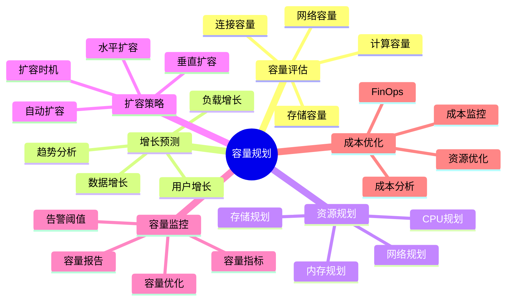
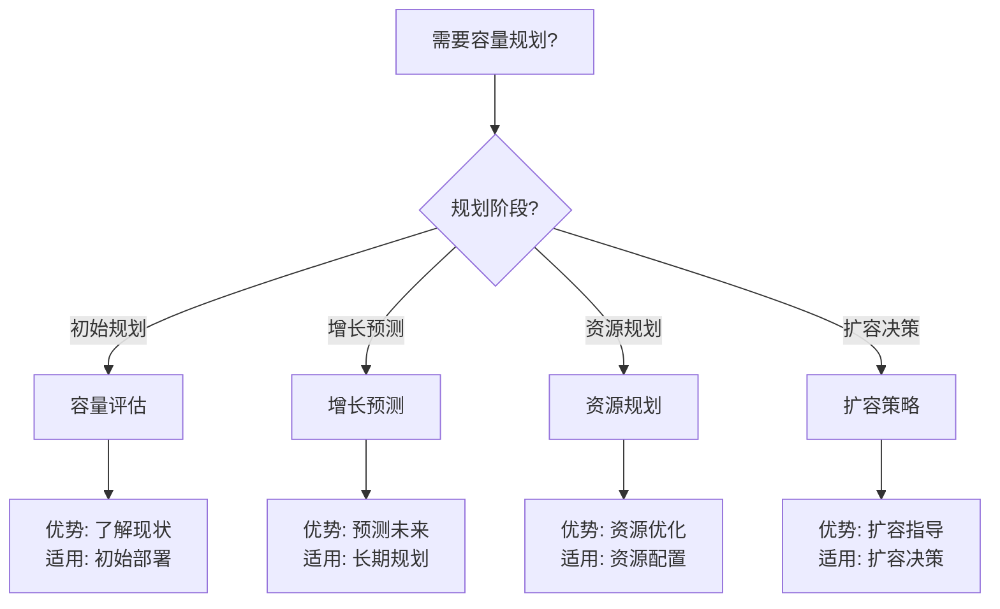

# 31-容量规划

> **创建日期**: 2025年1月
> **文档总数**: 7+个文档
> **覆盖领域**: 容量规划完整指南、容量评估方法、增长预测、资源规划、扩容策略、容量监控、成本优化
> **版本覆盖**: PostgreSQL 18.x (推荐) ⭐ | 17.x (推荐) | 16.x (兼容)

---

## 📊 知识体系思维导图

---

## 📋 主题说明

本主题整合所有PostgreSQL容量规划相关内容，包括容量规划完整指南、容量评估方法、增长预测、资源规划、扩容策略、容量监控等。

---

## 📚 核心文档

### 成本优化指南

- **[PostgreSQL成本优化（FinOps）指南.md](./PostgreSQL成本优化（FinOps）指南.md)** ⭐⭐⭐⭐⭐ ⭐ 新增
  - 数据库成本构成分析（计算成本、存储成本、网络成本）
  - 资源使用优化（CPU优化、内存优化、存储优化）
  - 成本监控与管理（成本监控、成本告警）
  - 成本优化策略（预留实例、自动停止、存储分层）
  - 综合选型案例（大规模系统、开发环境）
  - **字数**: 约22,000字
  - **状态**: ✅ 已完成

---

### 基础文档

- **[容量规划完整指南.md](./容量规划完整指南.md)** - 容量规划完整指南
- **[容量评估方法.md](./容量评估方法.md)** - 容量评估方法详解
- **[增长预测.md](./增长预测.md)** - 增长预测指南
- **[资源规划.md](./资源规划.md)** - 资源规划指南
- **[扩容策略.md](./扩容策略.md)** - 扩容策略指南
- **[容量监控.md](./容量监控.md)** - 容量监控指南

---

## 📊 容量规划选型决策树

---

## 📊 容量规划维度对比矩阵

| 规划维度 | 重要性 | 复杂度 | 更新频率 | 适用场景 |
| --- | --- | --- | --- | --- |
| **存储容量** | ⭐⭐⭐⭐⭐ | ⭐⭐ | 高 | 数据增长快 |
| **计算容量** | ⭐⭐⭐⭐⭐ | ⭐⭐⭐ | 中 | 查询负载高 |
| **网络容量** | ⭐⭐⭐ | ⭐⭐ | 低 | 网络密集型 |
| **连接容量** | ⭐⭐⭐⭐ | ⭐⭐ | 中 | 高并发场景 |

---

## 🎯 学习路径

### 初学者

1. 学习容量规划基础
2. 了解容量评估方法
3. 掌握增长预测方法

### 进阶

1. 深入学习资源规划
2. 学习扩容策略
3. 掌握容量监控

### 实战

1. 实施容量评估
2. 制定资源规划
3. 执行扩容策略

---

## 📊 容量规划分类

### 规划层次

- 存储容量规划
- 计算容量规划
- 网络容量规划
- 连接容量规划

### 规划对象

- 数据库大小
- 表大小
- 索引大小
- 连接数
- 查询负载

---

## 📚 文档来源

本主题整合了以下源目录的文档：

- `11-部署架构/`
- `12-监控与诊断/`

**原则**: 所有文档均为复制，原文件保持不变。

---

## 🔗 相关文档

- [11-部署架构/../11-部署架构/README.md) - 部署架构主题
- [12-监控与诊断/../12-监控与诊断/README.md) - 监控与诊断主题

---

## 📝 待补充文档

根据分析报告，以下文档需要补充：

- [ ] 容量规划完整指南.md（容量规划完整指南）
- [ ] 容量评估方法.md（容量评估方法详解）
- [ ] 增长预测.md（增长预测指南）
- [ ] 资源规划.md（资源规划指南）
- [ ] 扩容策略.md（扩容策略指南）
- [ ] 容量监控.md（容量监控指南）

---

**最后更新**: 2025年1月
**状态**: ✅ 目录已创建，待补充系统化指南
