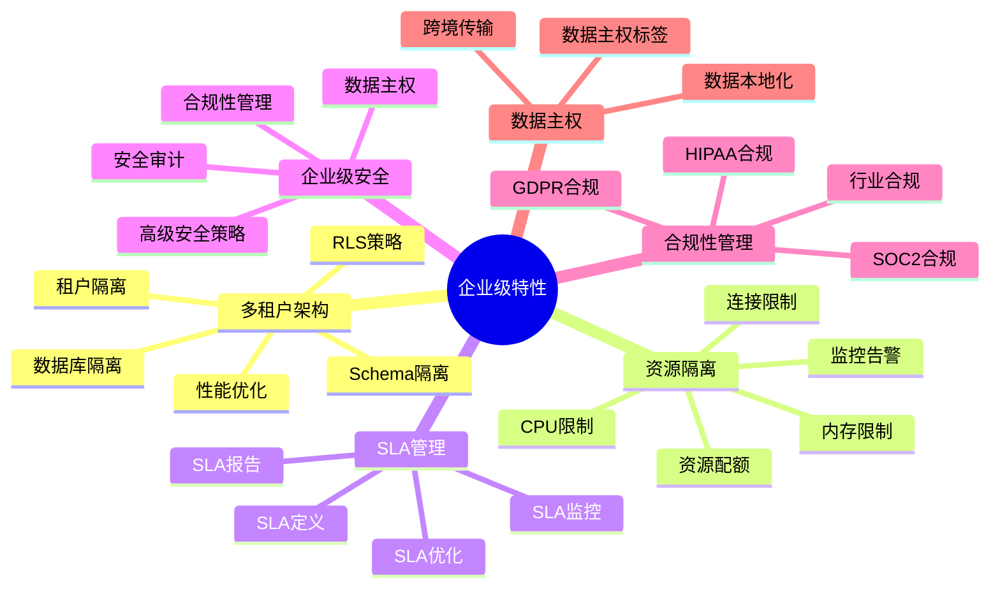
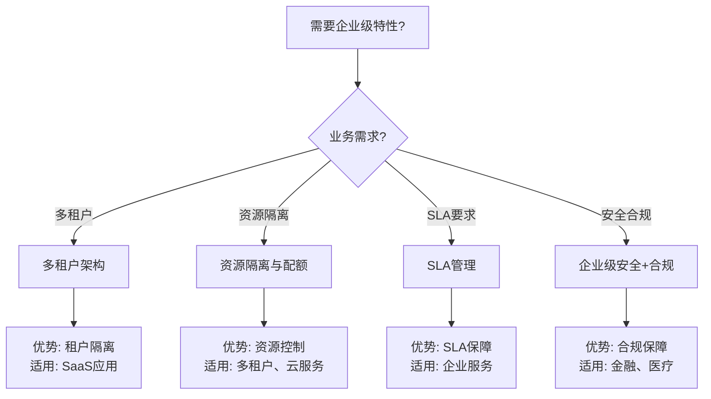

# 32-企业级特性

> **文档总数**: 6个核心文档
> **覆盖领域**: 多租户架构、资源隔离、SLA管理、企业级安全、合规性管理、数据主权
> **版本覆盖**: PostgreSQL 18.x (推荐) ⭐ | 17.x (推荐) | 16.x (兼容)
> **最后更新**: 2025年1月
> **状态**: ✅ 已完成
> **目标**: 系统化企业级特性，满足企业用户需求

---

## 📊 知识体系思维导图

## 📋 目录

- [32-企业级特性](#32-企业级特性)
  - [📊 知识体系思维导图](#-知识体系思维导图)
  - [📋 目录](#-目录)
  - [📖 主题概述](#-主题概述)
    - [什么是企业级特性？](#什么是企业级特性)
    - [适用场景](#适用场景)
  - [📚 文档列表](#-文档列表)
    - [核心文档](#核心文档)
  - [🎯 学习路径](#-学习路径)
    - [初学者路径](#初学者路径)
    - [进阶路径](#进阶路径)
    - [专家路径](#专家路径)
  - [📊 企业级特性选型决策树](#-企业级特性选型决策树)
  - [📊 企业级特性对比矩阵](#-企业级特性对比矩阵)
  - [🔗 相关文档](#-相关文档)
    - [相关主题](#相关主题)
    - [相关案例](#相关案例)
    - [相关最佳实践](#相关最佳实践)

---

## 📖 主题概述

### 什么是企业级特性？

企业级特性是指满足大型企业生产环境需求的PostgreSQL功能集合，包括：

- **多租户架构**: 支持多租户SaaS应用的数据隔离和管理
- **资源隔离与配额管理**: 资源隔离机制和配额管理策略
- **SLA管理**: 服务等级协议的定义、监控和优化
- **企业级安全**: 高级安全策略、审计和合规性管理
- **合规性管理**: GDPR、HIPAA、SOC2等合规要求
- **数据主权管理**: 数据本地化、跨境数据传输管理

### 适用场景

- ✅ 多租户SaaS应用
- ✅ 企业级数据库服务
- ✅ 云数据库服务
- ✅ 合规性要求高的行业（金融、医疗、政府）
- ✅ 多区域部署的企业应用

---

## 📚 文档列表

### 核心文档

1. **[多租户架构完整指南](./多租户架构完整指南.md)** ⭐⭐⭐⭐⭐
   - 多租户架构设计
   - 租户隔离策略（RLS、Schema隔离、数据库隔离）
   - 多租户性能优化
   - 多租户安全管理
   - 多租户数据模型设计
   - 多租户最佳实践
   - 参考案例：19-实战案例/04-多租户SaaS系统

2. **[资源隔离与配额管理](./资源隔离与配额管理.md)** ⭐⭐⭐⭐⭐
   - 资源隔离机制
   - 配额管理策略
   - 资源限制配置
   - 资源监控与告警
   - 资源隔离最佳实践

3. **[SLA管理完整指南](./SLA管理完整指南.md)** ⭐⭐⭐⭐⭐
   - SLA定义与指标
   - SLA监控方法
   - SLA报告生成
   - SLA优化策略
   - SLA最佳实践

4. **[企业级安全深化](./企业级安全深化.md)** ⭐⭐⭐⭐
   - 高级安全策略
   - 安全审计深化
   - 合规性管理
   - 数据主权管理
   - 参考：05-安全与合规/安全加固

5. **[合规性管理](./合规性管理.md)** ⭐⭐⭐⭐
   - GDPR合规
   - HIPAA合规
   - SOC2合规
   - 行业特定合规
   - 合规性检查清单

6. **[数据主权管理](./数据主权管理.md)** ⭐⭐⭐⭐
   - 数据主权概念
   - 数据本地化
   - 跨境数据传输
   - 数据主权最佳实践

---

## 🎯 学习路径

### 初学者路径

1. **了解企业级特性**
   - 阅读主题概述
   - 了解适用场景

2. **学习多租户架构**
   - 多租户架构完整指南
   - 参考：19-实战案例/04-多租户SaaS系统

3. **学习资源管理**
   - 资源隔离与配额管理

### 进阶路径

1. **深入SLA管理**
   - SLA管理完整指南
   - 参考：12-监控与诊断

2. **企业级安全**
   - 企业级安全深化
   - 参考：05-安全与合规/安全加固

3. **合规性管理**
   - 合规性管理
   - 数据主权管理

### 专家路径

1. **综合应用**
   - 多租户架构 + 资源隔离 + SLA管理
   - 企业级安全 + 合规性管理

2. **最佳实践**
   - 整合所有企业级特性
   - 参考：21-最佳实践

---

## 📊 企业级特性选型决策树

---

## 📊 企业级特性对比矩阵

| 企业级特性 | 重要性 | 复杂度 | 成本影响 | 适用场景 |
| --- | --- | --- | --- | --- |
| **多租户架构** | ⭐⭐⭐⭐⭐ | ⭐⭐⭐⭐ | 中 | SaaS应用 |
| **资源隔离** | ⭐⭐⭐⭐ | ⭐⭐⭐ | 低 | 多租户、云服务 |
| **SLA管理** | ⭐⭐⭐⭐ | ⭐⭐⭐ | 中 | 企业服务 |
| **企业级安全** | ⭐⭐⭐⭐⭐ | ⭐⭐⭐⭐ | 中-高 | 金融、医疗 |
| **合规性管理** | ⭐⭐⭐⭐⭐ | ⭐⭐⭐⭐⭐ | 高 | 合规要求高 |

---

## 🔗 相关文档

### 相关主题

- [05-安全与合规](../05-安全与合规/README.md) - 安全机制、访问控制、加密、审计
- [11-部署架构](../11-部署架构/README.md) - 部署方案、资源规划
- [12-监控与诊断](../12-监控与诊断/README.md) - 监控工具、诊断方法
- [13-高可用架构](../13-高可用架构/README.md) - 高可用方案、容灾

### 相关案例

- [19-实战案例/04-多租户SaaS系统](../19-实战案例/04-多租户SaaS系统/README.md) - 多租户架构案例
- [19-实战案例/05-金融交易系统](../19-实战案例/05-金融交易系统/) - 企业级应用案例

### 相关最佳实践

- [21-最佳实践](../21-最佳实践/README.md) - 最佳实践总结

---

**最后更新**: 2025年1月
**状态**: ✅ 已完成
**完成度**: 100%
