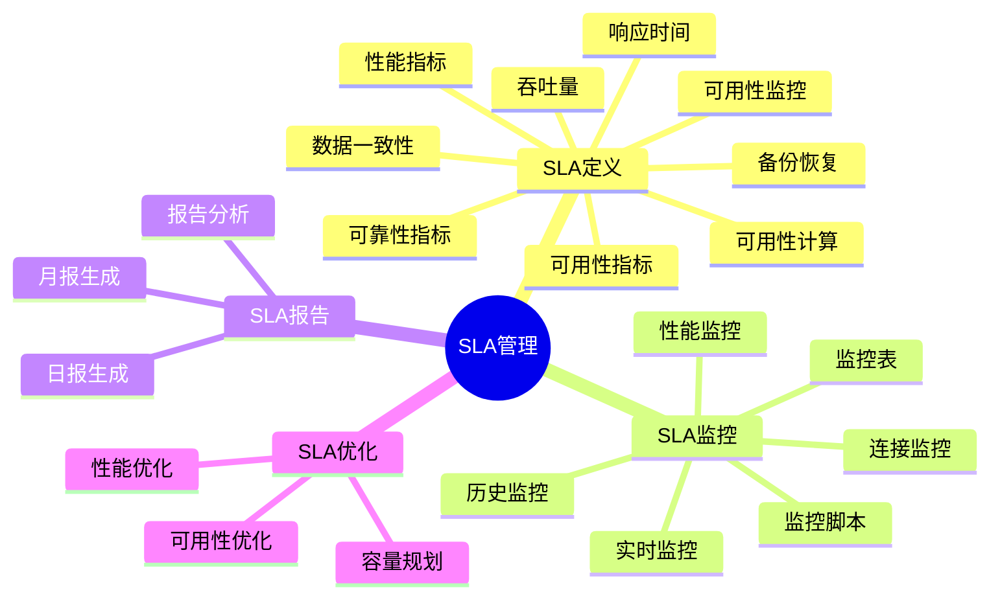
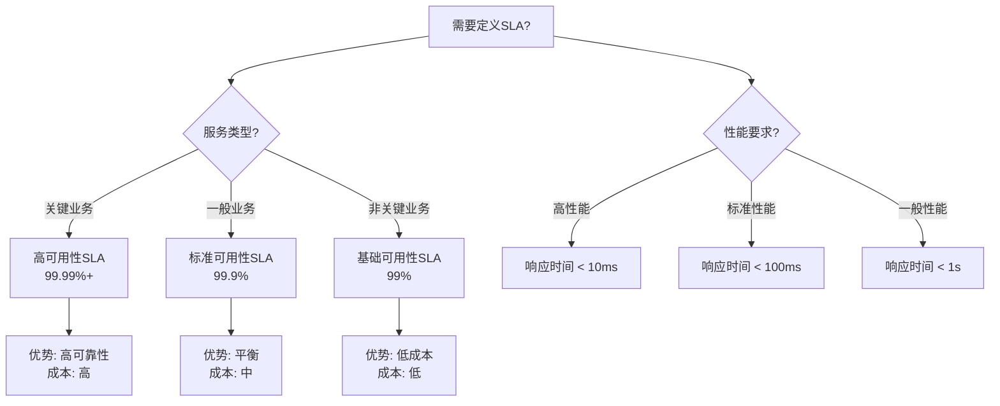

# PostgreSQL SLA管理完整指南

> **PostgreSQL版本**: 17+/18+
> **适用场景**: 企业级数据库服务、云数据库服务
> **难度等级**: ⭐⭐⭐⭐ 高级

---

## 📊 知识体系思维导图



---

## 📊 SLA指标选型决策树



---

## 📊 SLA级别对比矩阵

| SLA级别 | 可用性 | 响应时间 | 数据一致性 | 成本 | 适用场景 |
| --- | --- | --- | --- | --- | --- |
| **基础SLA** | 99% | <1s | 最终一致 | 低 | 非关键业务 |
| **标准SLA** | 99.9% | <100ms | 强一致 | 中 | 一般业务 |
| **高级SLA** | 99.99% | <10ms | 强一致 | 高 | 关键业务 |
| **企业级SLA** | 99.999% | <5ms | 强一致 | 很高 | 核心业务 |

---

## 📋 目录

- [PostgreSQL SLA管理完整指南](#postgresql-sla管理完整指南)
  - [📊 知识体系思维导图](#-知识体系思维导图)
  - [📊 SLA指标选型决策树](#-sla指标选型决策树)
  - [📊 SLA级别对比矩阵](#-sla级别对比矩阵)
  - [📋 目录](#-目录)
  - [1. 概述](#1-概述)
    - [1.1 什么是SLA？](#11-什么是sla)
    - [1.2 SLA的重要性](#12-sla的重要性)
  - [2. SLA定义与指标](#2-sla定义与指标)
    - [2.1 可用性指标](#21-可用性指标)
      - [2.1.1 可用性计算](#211-可用性计算)
      - [2.1.2 可用性监控](#212-可用性监控)
    - [2.2 性能指标](#22-性能指标)
      - [2.2.1 响应时间](#221-响应时间)
      - [2.2.2 吞吐量](#222-吞吐量)
    - [2.3 可靠性指标](#23-可靠性指标)
      - [2.3.1 数据一致性](#231-数据一致性)
      - [2.3.2 备份恢复](#232-备份恢复)
  - [3. SLA监控方法](#3-sla监控方法)
    - [3.1 实时监控](#31-实时监控)
      - [3.1.1 连接监控](#311-连接监控)
      - [3.1.2 性能监控](#312-性能监控)
    - [3.2 历史监控](#32-历史监控)
      - [3.2.1 创建监控表](#321-创建监控表)
  - [4. SLA报告生成](#4-sla报告生成)
    - [4.1 日报生成](#41-日报生成)
    - [4.2 月报生成](#42-月报生成)
  - [5. SLA优化策略](#5-sla优化策略)
    - [5.1 可用性优化](#51-可用性优化)
    - [5.2 性能优化](#52-性能优化)
    - [5.3 容量规划](#53-容量规划)
  - [6. 最佳实践](#6-最佳实践)
    - [6.1 SLA定义](#61-sla定义)
    - [6.2 SLA监控](#62-sla监控)
    - [6.3 SLA优化](#63-sla优化)
  - [📚 相关文档](#-相关文档)

---

## 1. 概述

### 1.1 什么是SLA？

服务等级协议（Service Level Agreement, SLA）是服务提供商与客户之间关于服务质量和性能的正式协议。

**SLA核心要素**:

- ✅ **可用性**: 服务可用时间百分比
- ✅ **性能**: 响应时间、吞吐量
- ✅ **可靠性**: 数据一致性、故障恢复
- ✅ **支持**: 响应时间、解决时间

### 1.2 SLA的重要性

- **客户满意度**: 明确的性能承诺
- **服务质量**: 量化服务标准
- **风险管理**: 明确责任和补偿
- **持续改进**: 基于SLA优化服务

---

## 2. SLA定义与指标

### 2.1 可用性指标

#### 2.1.1 可用性计算

```text
可用性 = (总时间 - 停机时间) / 总时间 × 100%

示例：
- 99.9%可用性 = 每月最多43.2分钟停机
- 99.99%可用性 = 每月最多4.32分钟停机
- 99.999%可用性 = 每月最多26秒停机
```

#### 2.1.2 可用性监控

```sql
-- 创建可用性监控表（带错误处理）
DO $$
BEGIN
    BEGIN
        IF EXISTS (SELECT 1 FROM information_schema.tables WHERE table_schema = 'public' AND table_name = 'sla_availability') THEN
            RAISE WARNING '表 sla_availability 已存在';
        ELSE
            CREATE TABLE sla_availability (
                id SERIAL PRIMARY KEY,
                check_time TIMESTAMPTZ DEFAULT NOW(),
                is_available BOOLEAN,
                response_time_ms NUMERIC,
                error_message TEXT
            );
            RAISE NOTICE '表 sla_availability 创建成功';
        END IF;
    EXCEPTION
        WHEN duplicate_table THEN
            RAISE WARNING '表 sla_availability 已存在';
        WHEN OTHERS THEN
            RAISE WARNING '创建表 sla_availability 失败: %', SQLERRM;
            RAISE;
    END;
END $$;

-- 插入监控数据（带错误处理）
DO $$
BEGIN
    BEGIN
        IF NOT EXISTS (SELECT 1 FROM information_schema.tables WHERE table_schema = 'public' AND table_name = 'sla_availability') THEN
            RAISE WARNING '表 sla_availability 不存在';
            RETURN;
        END IF;

        INSERT INTO sla_availability (is_available, response_time_ms)
        VALUES (true, 10.5);
        RAISE NOTICE '监控数据已插入';
    EXCEPTION
        WHEN undefined_table THEN
            RAISE WARNING '表 sla_availability 不存在';
        WHEN OTHERS THEN
            RAISE WARNING '插入监控数据失败: %', SQLERRM;
            RAISE;
    END;
END $$;

-- 计算可用性（带错误处理和性能测试）
DO $$
DECLARE
    total_records INT;
BEGIN
    BEGIN
        IF NOT EXISTS (SELECT 1 FROM information_schema.tables WHERE table_schema = 'public' AND table_name = 'sla_availability') THEN
            RAISE WARNING '表 sla_availability 不存在，无法计算可用性';
            RETURN;
        END IF;

        SELECT COUNT(*) INTO total_records
        FROM sla_availability
        WHERE check_time >= NOW() - INTERVAL '30 days';

        IF total_records = 0 THEN
            RAISE WARNING '最近30天没有监控数据';
        ELSE
            RAISE NOTICE '找到 % 条监控记录（最近30天）', total_records;
        END IF;
    EXCEPTION
        WHEN OTHERS THEN
            RAISE WARNING '计算可用性准备失败: %', SQLERRM;
            RAISE;
    END;
END $$;

EXPLAIN ANALYZE
SELECT
    DATE_TRUNC('day', check_time) as date,
    COUNT(*) as total_checks,
    SUM(CASE WHEN is_available THEN 1 ELSE 0 END) as available_checks,
    (SUM(CASE WHEN is_available THEN 1 ELSE 0 END)::NUMERIC / COUNT(*)::NUMERIC * 100) as availability_percent
FROM sla_availability
WHERE check_time >= NOW() - INTERVAL '30 days'
GROUP BY DATE_TRUNC('day', check_time)
ORDER BY date DESC;
```

### 2.2 性能指标

#### 2.2.1 响应时间

```sql
-- 使用pg_stat_statements监控查询响应时间（带错误处理）
DO $$
BEGIN
    BEGIN
        IF NOT EXISTS (SELECT 1 FROM pg_extension WHERE extname = 'pg_stat_statements') THEN
            CREATE EXTENSION pg_stat_statements;
            RAISE NOTICE 'pg_stat_statements 扩展创建成功';
        ELSE
            RAISE NOTICE 'pg_stat_statements 扩展已存在';
        END IF;
    EXCEPTION
        WHEN insufficient_privilege THEN
            RAISE WARNING '权限不足，无法创建 pg_stat_statements 扩展';
        WHEN OTHERS THEN
            RAISE WARNING '创建 pg_stat_statements 扩展失败: %', SQLERRM;
            RAISE;
    END;
END $$;

-- 查看平均响应时间（带错误处理和性能测试）
DO $$
BEGIN
    BEGIN
        IF NOT EXISTS (SELECT 1 FROM pg_extension WHERE extname = 'pg_stat_statements') THEN
            RAISE WARNING 'pg_stat_statements 扩展未安装，无法查看响应时间';
            RETURN;
        END IF;
        RAISE NOTICE '开始查看平均响应时间';
    EXCEPTION
        WHEN OTHERS THEN
            RAISE WARNING '查看响应时间准备失败: %', SQLERRM;
            RAISE;
    END;
END $$;

EXPLAIN ANALYZE
SELECT
    userid::regrole,
    query,
    calls,
    total_exec_time,
    mean_exec_time,
    max_exec_time
FROM pg_stat_statements
WHERE mean_exec_time > 100  -- 超过100ms的查询
ORDER BY mean_exec_time DESC
LIMIT 10;
```

#### 2.2.2 吞吐量

```sql
-- 监控事务吞吐量（带错误处理和性能测试）
DO $$
DECLARE
    db_count INT;
BEGIN
    BEGIN
        SELECT COUNT(*) INTO db_count
        FROM pg_stat_database
        WHERE datname NOT IN ('template0', 'template1', 'postgres');

        IF db_count = 0 THEN
            RAISE WARNING '没有找到可监控的数据库';
        ELSE
            RAISE NOTICE '找到 % 个可监控的数据库', db_count;
        END IF;
    EXCEPTION
        WHEN OTHERS THEN
            RAISE WARNING '监控事务吞吐量准备失败: %', SQLERRM;
            RAISE;
    END;
END $$;

EXPLAIN ANALYZE
SELECT
    datname,
    xact_commit as committed_transactions,
    xact_rollback as rolled_back_transactions,
    xact_commit + xact_rollback as total_transactions
FROM pg_stat_database
WHERE datname NOT IN ('template0', 'template1', 'postgres')
ORDER BY xact_commit DESC;
```

### 2.3 可靠性指标

#### 2.3.1 数据一致性

```sql
-- 检查数据完整性（带错误处理和性能测试）
DO $$
DECLARE
    problematic_tables INT;
BEGIN
    BEGIN
        SELECT COUNT(*) INTO problematic_tables
        FROM pg_stat_user_tables
        WHERE n_dead_tup > n_live_tup * 0.1;  -- 死元组超过10%

        IF problematic_tables > 0 THEN
            RAISE WARNING '发现 % 个表的死元组超过10%%，建议执行VACUUM', problematic_tables;
        ELSE
            RAISE NOTICE '所有表的死元组比例正常（<10%%）';
        END IF;
    EXCEPTION
        WHEN OTHERS THEN
            RAISE WARNING '检查数据完整性失败: %', SQLERRM;
            RAISE;
    END;
END $$;

EXPLAIN ANALYZE
SELECT
    schemaname,
    tablename,
    n_live_tup as live_rows,
    n_dead_tup as dead_rows,
    last_vacuum,
    last_autovacuum
FROM pg_stat_user_tables
WHERE n_dead_tup > n_live_tup * 0.1;  -- 死元组超过10%
ORDER BY (n_dead_tup::NUMERIC / NULLIF(n_live_tup, 0)) DESC;
```

#### 2.3.2 备份恢复

```sql
-- 检查备份状态（带错误处理）
DO $$
BEGIN
    BEGIN
        IF NOT EXISTS (SELECT 1 FROM information_schema.tables WHERE table_schema = 'public' AND table_name = 'pg_backup_history') THEN
            RAISE WARNING '表 pg_backup_history 不存在，可能需要使用pg_probackup或其他备份工具';
            RETURN;
        END IF;
        RAISE NOTICE '开始检查备份状态';
    EXCEPTION
        WHEN OTHERS THEN
            RAISE WARNING '检查备份状态准备失败: %', SQLERRM;
            RAISE;
    END;
END $$;

-- 注意：pg_backup_history表不是PostgreSQL内置表，可能需要使用第三方备份工具创建
-- 这里提供示例查询结构
SELECT
    backup_start,
    backup_end,
    backup_size,
    CASE
        WHEN backup_end IS NULL THEN 'In Progress'
        ELSE 'Completed'
    END as status
FROM pg_backup_history
ORDER BY backup_start DESC
LIMIT 10;
```

---

## 3. SLA监控方法

### 3.1 实时监控

#### 3.1.1 连接监控

```sql
-- 监控连接状态（带错误处理和性能测试）
DO $$
DECLARE
    total_connections INT;
    max_connections INT;
    usage_percentage NUMERIC;
BEGIN
    BEGIN
        SELECT COUNT(*) INTO total_connections
        FROM pg_stat_activity
        WHERE datname IS NOT NULL;

        SELECT setting::INT INTO max_connections
        FROM pg_settings
        WHERE name = 'max_connections';

        usage_percentage := (total_connections::NUMERIC / max_connections::NUMERIC) * 100;

        RAISE NOTICE '连接状态: 当前连接数=%, 最大连接数=%, 使用率=%.2f%%', total_connections, max_connections, usage_percentage;

        IF usage_percentage > 80 THEN
            RAISE WARNING '连接使用率超过80%%，建议增加max_connections或使用连接池';
        END IF;
    EXCEPTION
        WHEN OTHERS THEN
            RAISE WARNING '监控连接状态失败: %', SQLERRM;
            RAISE;
    END;
END $$;

EXPLAIN ANALYZE
SELECT
    datname,
    count(*) as current_connections,
    (SELECT setting::INT FROM pg_settings WHERE name = 'max_connections') as max_connections,
    (count(*)::NUMERIC / (SELECT setting::INT FROM pg_settings WHERE name = 'max_connections')::NUMERIC * 100) as connection_usage_percent
FROM pg_stat_activity
WHERE datname IS NOT NULL
GROUP BY datname
ORDER BY current_connections DESC;
```

#### 3.1.2 性能监控

```sql
-- 监控慢查询（带错误处理和性能测试）
DO $$
DECLARE
    slow_query_count INT;
BEGIN
    BEGIN
        SELECT COUNT(*) INTO slow_query_count
        FROM pg_stat_activity
        WHERE state = 'active'
        AND NOW() - query_start > INTERVAL '5 seconds';

        IF slow_query_count > 0 THEN
            RAISE WARNING '发现 % 个慢查询（执行时间>5秒）', slow_query_count;
        ELSE
            RAISE NOTICE '未发现慢查询（执行时间>5秒）';
        END IF;
    EXCEPTION
        WHEN OTHERS THEN
            RAISE WARNING '监控慢查询失败: %', SQLERRM;
            RAISE;
    END;
END $$;

EXPLAIN ANALYZE
SELECT
    pid,
    usename,
    datname,
    state,
    query_start,
    NOW() - query_start as query_duration,
    LEFT(query, 100) as query_preview  -- 限制查询长度以便显示
FROM pg_stat_activity
WHERE state = 'active'
AND NOW() - query_start > INTERVAL '5 seconds'
ORDER BY query_start;
```

### 3.2 历史监控

#### 3.2.1 创建监控表

```sql
-- 创建SLA监控历史表（带错误处理）
DO $$
BEGIN
    BEGIN
        IF EXISTS (SELECT 1 FROM information_schema.tables WHERE table_schema = 'public' AND table_name = 'sla_monitoring_history') THEN
            RAISE WARNING '表 sla_monitoring_history 已存在';
        ELSE
            CREATE TABLE sla_monitoring_history (
                id SERIAL PRIMARY KEY,
                check_time TIMESTAMPTZ DEFAULT NOW(),
                metric_name TEXT,
                metric_value NUMERIC,
                metric_unit TEXT,
                threshold_value NUMERIC,
                is_violated BOOLEAN
            );
            RAISE NOTICE '表 sla_monitoring_history 创建成功';
        END IF;
    EXCEPTION
        WHEN duplicate_table THEN
            RAISE WARNING '表 sla_monitoring_history 已存在';
        WHEN OTHERS THEN
            RAISE WARNING '创建表 sla_monitoring_history 失败: %', SQLERRM;
            RAISE;
    END;
END $$;

-- 创建索引（带错误处理）
DO $$
BEGIN
    BEGIN
        IF NOT EXISTS (SELECT 1 FROM information_schema.tables WHERE table_schema = 'public' AND table_name = 'sla_monitoring_history') THEN
            RAISE WARNING '表 sla_monitoring_history 不存在';
            RETURN;
        END IF;

        IF NOT EXISTS (SELECT 1 FROM pg_indexes WHERE schemaname = 'public' AND indexname = 'idx_sla_monitoring_time') THEN
            CREATE INDEX idx_sla_monitoring_time ON sla_monitoring_history(check_time);
            RAISE NOTICE '索引 idx_sla_monitoring_time 创建成功';
        ELSE
            RAISE NOTICE '索引 idx_sla_monitoring_time 已存在';
        END IF;

        IF NOT EXISTS (SELECT 1 FROM pg_indexes WHERE schemaname = 'public' AND indexname = 'idx_sla_monitoring_metric') THEN
            CREATE INDEX idx_sla_monitoring_metric ON sla_monitoring_history(metric_name);
            RAISE NOTICE '索引 idx_sla_monitoring_metric 创建成功';
        ELSE
            RAISE NOTICE '索引 idx_sla_monitoring_metric 已存在';
        END IF;
    EXCEPTION
        WHEN undefined_table THEN
            RAISE WARNING '表 sla_monitoring_history 不存在';
        WHEN duplicate_table THEN
            RAISE WARNING '索引已存在';
        WHEN OTHERS THEN
            RAISE WARNING '创建索引失败: %', SQLERRM;
            RAISE;
    END;
END $$;

#### 3.2.2 定期监控脚本

```sql
-- 监控函数（带错误处理）
CREATE OR REPLACE FUNCTION monitor_sla_metrics()
RETURNS void AS $$
DECLARE
    v_availability NUMERIC;
    v_avg_response_time NUMERIC;
    v_connection_usage NUMERIC;
BEGIN
    BEGIN
        -- 检查必需的表是否存在
        IF NOT EXISTS (SELECT 1 FROM information_schema.tables WHERE table_schema = 'public' AND table_name = 'sla_monitoring_history') THEN
            RAISE EXCEPTION '表 sla_monitoring_history 不存在';
        END IF;

        -- 计算可用性
        BEGIN
            SELECT
                (SUM(CASE WHEN is_available THEN 1 ELSE 0 END)::NUMERIC / NULLIF(COUNT(*), 0)::NUMERIC * 100)
            INTO v_availability
            FROM sla_availability
            WHERE check_time >= NOW() - INTERVAL '1 hour';

            IF v_availability IS NULL THEN
                v_availability := 0;
                RAISE WARNING '最近1小时没有可用性数据';
            END IF;
        EXCEPTION
            WHEN undefined_table THEN
                RAISE WARNING '表 sla_availability 不存在，跳过可用性计算';
                v_availability := NULL;
            WHEN OTHERS THEN
                RAISE WARNING '计算可用性失败: %', SQLERRM;
                v_availability := NULL;
        END;

        -- 计算平均响应时间
        BEGIN
            IF EXISTS (SELECT 1 FROM pg_extension WHERE extname = 'pg_stat_statements') THEN
                SELECT AVG(mean_exec_time)
                INTO v_avg_response_time
                FROM pg_stat_statements
                WHERE calls > 100;
            ELSE
                RAISE WARNING 'pg_stat_statements 扩展未安装，跳过响应时间计算';
                v_avg_response_time := NULL;
            END IF;
        EXCEPTION
            WHEN OTHERS THEN
                RAISE WARNING '计算平均响应时间失败: %', SQLERRM;
                v_avg_response_time := NULL;
        END;

        -- 计算连接使用率
        BEGIN
            SELECT
                (COUNT(*)::NUMERIC / NULLIF((SELECT setting::INT FROM pg_settings WHERE name = 'max_connections'), 0)::NUMERIC * 100)
            INTO v_connection_usage
            FROM pg_stat_activity
            WHERE datname IS NOT NULL;

            IF v_connection_usage IS NULL THEN
                v_connection_usage := 0;
            END IF;
        EXCEPTION
            WHEN OTHERS THEN
                RAISE WARNING '计算连接使用率失败: %', SQLERRM;
                v_connection_usage := NULL;
        END;

        -- 插入监控数据（可用性）
        IF v_availability IS NOT NULL THEN
            INSERT INTO sla_monitoring_history (metric_name, metric_value, metric_unit, threshold_value, is_violated)
            VALUES ('availability', v_availability, 'percent', 99.9, v_availability < 99.9);
        END IF;

        -- 插入监控数据（平均响应时间）
        IF v_avg_response_time IS NOT NULL THEN
            INSERT INTO sla_monitoring_history (metric_name, metric_value, metric_unit, threshold_value, is_violated)
            VALUES ('avg_response_time', v_avg_response_time, 'ms', 100, v_avg_response_time > 100);
        END IF;

        -- 插入监控数据（连接使用率）
        IF v_connection_usage IS NOT NULL THEN
            INSERT INTO sla_monitoring_history (metric_name, metric_value, metric_unit, threshold_value, is_violated)
            VALUES ('connection_usage', v_connection_usage, 'percent', 80, v_connection_usage > 80);
        END IF;

        RAISE NOTICE 'SLA监控指标已记录';
    EXCEPTION
        WHEN undefined_table THEN
            RAISE EXCEPTION '表 sla_monitoring_history 不存在';
        WHEN NOT_NULL_VIOLATION THEN
            RAISE EXCEPTION '必需字段不能为NULL';
        WHEN OTHERS THEN
            RAISE;
    END;
END;
$$ LANGUAGE plpgsql;

-- 使用pg_cron定期执行（如果可用）
-- SELECT cron.schedule('monitor-sla', '*/5 * * * *', 'SELECT monitor_sla_metrics();');
```

---

## 4. SLA报告生成

### 4.1 日报生成

```sql
-- 生成SLA日报（带错误处理）
CREATE OR REPLACE FUNCTION generate_sla_daily_report(report_date DATE DEFAULT CURRENT_DATE)
RETURNS TABLE (
    metric_name TEXT,
    metric_value NUMERIC,
    threshold_value NUMERIC,
    is_violated BOOLEAN,
    violation_count BIGINT
) AS $$
BEGIN
    BEGIN
        -- 参数验证
        IF report_date IS NULL THEN
            report_date := CURRENT_DATE;
        END IF;

        -- 检查表是否存在
        IF NOT EXISTS (SELECT 1 FROM information_schema.tables WHERE table_schema = 'public' AND table_name = 'sla_monitoring_history') THEN
            RAISE EXCEPTION '表 sla_monitoring_history 不存在';
        END IF;

        RETURN QUERY
        SELECT
            m.metric_name,
            AVG(m.metric_value) as metric_value,
            MAX(m.threshold_value) as threshold_value,
            BOOL_OR(m.is_violated) as is_violated,
            SUM(CASE WHEN m.is_violated THEN 1 ELSE 0 END)::BIGINT as violation_count
        FROM sla_monitoring_history m
        WHERE DATE(m.check_time) = report_date
        GROUP BY m.metric_name
        ORDER BY m.metric_name;
    EXCEPTION
        WHEN undefined_table THEN
            RAISE EXCEPTION '表 sla_monitoring_history 不存在';
        WHEN OTHERS THEN
            RAISE;
    END;
END;
$$ LANGUAGE plpgsql;

-- 执行报告（带错误处理）
DO $$
DECLARE
    report_count INT;
BEGIN
    BEGIN
        SELECT COUNT(*) INTO report_count
        FROM generate_sla_daily_report();

        IF report_count = 0 THEN
            RAISE WARNING '今天没有监控数据，无法生成报告';
        ELSE
            RAISE NOTICE '生成了 % 条SLA日报记录', report_count;
        END IF;
    EXCEPTION
        WHEN OTHERS THEN
            RAISE WARNING '生成SLA日报失败: %', SQLERRM;
            RAISE;
    END;
END $$;

SELECT * FROM generate_sla_daily_report();
```

### 4.2 月报生成

```sql
-- 生成SLA月报（带错误处理）
CREATE OR REPLACE FUNCTION generate_sla_monthly_report(report_month DATE DEFAULT DATE_TRUNC('month', CURRENT_DATE))
RETURNS TABLE (
    metric_name TEXT,
    avg_value NUMERIC,
    min_value NUMERIC,
    max_value NUMERIC,
    threshold_value NUMERIC,
    violation_count BIGINT,
    violation_percent NUMERIC
) AS $$
BEGIN
    BEGIN
        -- 参数验证
        IF report_month IS NULL THEN
            report_month := DATE_TRUNC('month', CURRENT_DATE);
        END IF;

        -- 检查表是否存在
        IF NOT EXISTS (SELECT 1 FROM information_schema.tables WHERE table_schema = 'public' AND table_name = 'sla_monitoring_history') THEN
            RAISE EXCEPTION '表 sla_monitoring_history 不存在';
        END IF;

        RETURN QUERY
        SELECT
            m.metric_name,
            AVG(m.metric_value) as avg_value,
            MIN(m.metric_value) as min_value,
            MAX(m.metric_value) as max_value,
            MAX(m.threshold_value) as threshold_value,
            SUM(CASE WHEN m.is_violated THEN 1 ELSE 0 END)::BIGINT as violation_count,
            (SUM(CASE WHEN m.is_violated THEN 1 ELSE 0 END)::NUMERIC / NULLIF(COUNT(*), 0)::NUMERIC * 100) as violation_percent
        FROM sla_monitoring_history m
        WHERE DATE_TRUNC('month', m.check_time) = report_month
        GROUP BY m.metric_name
        ORDER BY m.metric_name;
    EXCEPTION
        WHEN undefined_table THEN
            RAISE EXCEPTION '表 sla_monitoring_history 不存在';
        WHEN OTHERS THEN
            RAISE;
    END;
END;
$$ LANGUAGE plpgsql;

-- 执行月报（带错误处理）
DO $$
DECLARE
    report_count INT;
BEGIN
    BEGIN
        SELECT COUNT(*) INTO report_count
        FROM generate_sla_monthly_report();

        IF report_count = 0 THEN
            RAISE WARNING '本月没有监控数据，无法生成报告';
        ELSE
            RAISE NOTICE '生成了 % 条SLA月报记录', report_count;
        END IF;
    EXCEPTION
        WHEN OTHERS THEN
            RAISE WARNING '生成SLA月报失败: %', SQLERRM;
            RAISE;
    END;
END $$;

SELECT * FROM generate_sla_monthly_report();
```

---

## 5. SLA优化策略

### 5.1 可用性优化

```sql
-- 高可用配置（说明）
-- 1. 主从复制
-- 2. 自动故障转移
-- 3. 负载均衡

-- 监控主从延迟（带错误处理和性能测试）
DO $$
DECLARE
    replication_count INT;
BEGIN
    BEGIN
        SELECT COUNT(*) INTO replication_count
        FROM pg_stat_replication;

        IF replication_count = 0 THEN
            RAISE WARNING '没有活动的复制连接，可能未配置主从复制';
        ELSE
            RAISE NOTICE '找到 % 个活动的复制连接', replication_count;
        END IF;
    EXCEPTION
        WHEN OTHERS THEN
            RAISE WARNING '监控主从延迟失败: %', SQLERRM;
            RAISE;
    END;
END $$;

EXPLAIN ANALYZE
SELECT
    client_addr,
    state,
    sync_state,
    pg_wal_lsn_diff(pg_current_wal_lsn(), sent_lsn) as replication_lag_bytes
FROM pg_stat_replication;
```

### 5.2 性能优化

```sql
-- 查询优化（说明）
-- 1. 索引优化
-- 2. 查询重写
-- 3. 统计信息更新

-- 更新统计信息（带错误处理）
DO $$
BEGIN
    BEGIN
        ANALYZE;
        RAISE NOTICE '统计信息更新成功';
    EXCEPTION
        WHEN OTHERS THEN
            RAISE WARNING '更新统计信息失败: %', SQLERRM;
            RAISE;
    END;
END $$;

-- 查看索引使用情况（带错误处理和性能测试）
DO $$
DECLARE
    unused_index_count INT;
BEGIN
    BEGIN
        SELECT COUNT(*) INTO unused_index_count
        FROM pg_stat_user_indexes
        WHERE idx_scan = 0;  -- 未使用的索引

        IF unused_index_count > 0 THEN
            RAISE WARNING '发现 % 个未使用的索引，建议评估是否需要删除', unused_index_count;
        ELSE
            RAISE NOTICE '所有索引都有使用记录';
        END IF;
    EXCEPTION
        WHEN OTHERS THEN
            RAISE WARNING '查看索引使用情况失败: %', SQLERRM;
            RAISE;
    END;
END $$;

EXPLAIN ANALYZE
SELECT
    schemaname,
    tablename,
    indexname,
    idx_scan,
    idx_tup_read,
    idx_tup_fetch,
    pg_size_pretty(pg_relation_size(indexrelid)) as index_size
FROM pg_stat_user_indexes
WHERE idx_scan = 0  -- 未使用的索引
ORDER BY pg_relation_size(indexrelid) DESC;
```

### 5.3 容量规划

```sql
-- 容量监控（带错误处理和性能测试）
DO $$
DECLARE
    db_count INT;
    total_size BIGINT;
BEGIN
    BEGIN
        SELECT COUNT(*) INTO db_count
        FROM pg_stat_database
        WHERE datname NOT IN ('template0', 'template1', 'postgres');

        SELECT SUM(pg_database_size(datname)) INTO total_size
        FROM pg_stat_database
        WHERE datname NOT IN ('template0', 'template1', 'postgres');

        RAISE NOTICE '找到 % 个数据库，总大小: %', db_count, pg_size_pretty(total_size);
    EXCEPTION
        WHEN OTHERS THEN
            RAISE WARNING '容量监控准备失败: %', SQLERRM;
            RAISE;
    END;
END $$;

EXPLAIN ANALYZE
SELECT
    datname,
    pg_size_pretty(pg_database_size(datname)) as size,
    numbackends as connections,
    xact_commit + xact_rollback as transactions
FROM pg_stat_database
WHERE datname NOT IN ('template0', 'template1', 'postgres')
ORDER BY pg_database_size(datname) DESC;
```

---

## 6. 最佳实践

### 6.1 SLA定义

- ✅ **明确指标**: 定义清晰的性能指标
- ✅ **合理阈值**: 设置可实现的阈值
- ✅ **测量方法**: 定义准确的测量方法
- ✅ **补偿机制**: 明确违反SLA的补偿

### 6.2 SLA监控

- ✅ **实时监控**: 24/7实时监控
- ✅ **自动告警**: 自动检测SLA违反
- ✅ **历史记录**: 保存历史监控数据
- ✅ **定期报告**: 生成定期SLA报告

### 6.3 SLA优化

- ✅ **持续改进**: 基于SLA数据持续优化
- ✅ **容量规划**: 提前规划容量需求
- ✅ **故障预防**: 预防性维护
- ✅ **性能调优**: 定期性能调优

---

## 📚 相关文档

- [资源隔离与配额管理](./资源隔离与配额管理.md) - 资源管理
- [12-监控与诊断](../12-监控与诊断/README.md) - 监控和诊断
- [13-高可用架构](../13-高可用架构/README.md) - 高可用架构
- [31-容量规划](../31-容量规划/README.md) - 容量规划

---

**最后更新**: 2025年1月
**状态**: ✅ 完成
