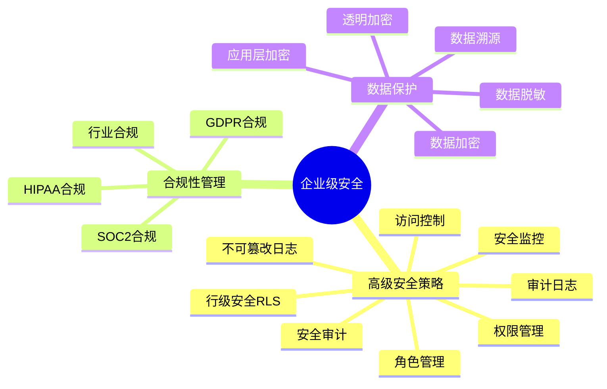
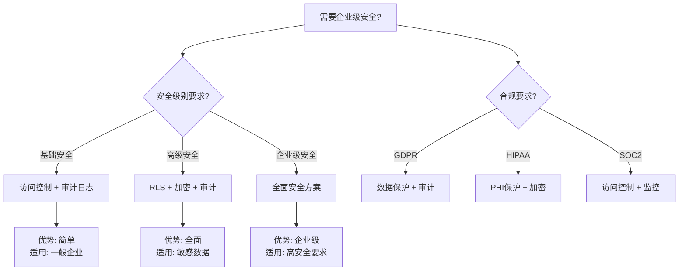

# PostgreSQL企业级安全深化指南

> **PostgreSQL版本**: 17+/18+
> **适用场景**: 企业级安全要求
> **难度等级**: ⭐⭐⭐⭐ 高级

---

## 📊 知识体系思维导图



---

## 📊 企业级安全方案选型决策树



---

## 📊 企业级安全方案对比矩阵

| 安全方案 | 安全级别 | 实施复杂度 | 性能影响 | 成本 | 适用场景 |
| --- | --- | --- | --- | --- | --- |
| **基础安全** | ⭐⭐⭐ | ⭐⭐ | 低 | 低 | 一般企业 |
| **高级安全** | ⭐⭐⭐⭐ | ⭐⭐⭐ | 中 | 中 | 敏感数据 |
| **企业级安全** | ⭐⭐⭐⭐⭐ | ⭐⭐⭐⭐ | 中-高 | 高 | 高安全要求 |
| **合规性安全** | ⭐⭐⭐⭐⭐ | ⭐⭐⭐⭐⭐ | 中-高 | 高 | 合规要求高 |

---

> **PostgreSQL版本**: 17+/18+
> **适用场景**: 企业级数据库、合规性要求高的行业
> **难度等级**: ⭐⭐⭐⭐⭐ 专家级
> **参考**: [05-安全与合规/安全加固](../05-安全与合规/安全加固/PostgreSQL安全加固完整指南.md)

---

## 📋 目录

- [PostgreSQL企业级安全深化指南](#postgresql企业级安全深化指南)
  - [📊 知识体系思维导图](#-知识体系思维导图)
  - [📊 企业级安全方案选型决策树](#-企业级安全方案选型决策树)
  - [📊 企业级安全方案对比矩阵](#-企业级安全方案对比矩阵)
  - [📋 目录](#-目录)
  - [1. 概述](#1-概述)
    - [1.1 企业级安全目标](#11-企业级安全目标)
    - [1.2 安全层次](#12-安全层次)
  - [2. 高级安全策略](#2-高级安全策略)
    - [2.1 细粒度访问控制](#21-细粒度访问控制)
      - [2.1.1 基于角色的访问控制（RBAC）](#211-基于角色的访问控制rbac)
    - [2.2 数据加密](#22-数据加密)
      - [2.2.1 透明数据加密（TDE）](#221-透明数据加密tde)
      - [2.2.2 列级加密](#222-列级加密)
    - [2.3 数据脱敏](#23-数据脱敏)
    - [3.2 审计查询](#32-审计查询)
  - [4. 合规性管理](#4-合规性管理)
    - [4.1 GDPR合规](#41-gdpr合规)
      - [4.1.1 数据主体权利](#411-数据主体权利)
    - [4.2 HIPAA合规](#42-hipaa合规)
    - [4.3 SOC2合规](#43-soc2合规)
  - [5. 数据主权管理](#5-数据主权管理)
    - [5.1 数据本地化](#51-数据本地化)
    - [5.2 跨境数据传输控制](#52-跨境数据传输控制)
  - [6. 安全事件响应](#6-安全事件响应)
    - [6.1 威胁检测](#61-威胁检测)
    - [6.2 安全事件响应流程](#62-安全事件响应流程)
  - [7. 最佳实践](#7-最佳实践)
    - [7.1 安全策略](#71-安全策略)
    - [7.2 合规性管理](#72-合规性管理)
    - [7.3 数据保护](#73-数据保护)
  - [📚 相关文档](#-相关文档)

---

## 1. 概述

### 1.1 企业级安全目标

企业级安全深化是在基础安全加固之上的高级安全措施，旨在：

- ✅ **深度防御**: 多层安全防护
- ✅ **合规性**: 满足GDPR、HIPAA、SOC2等合规要求
- ✅ **审计追踪**: 完整的操作审计
- ✅ **数据保护**: 数据加密、脱敏、主权管理
- ✅ **威胁检测**: 实时威胁检测和响应

### 1.2 安全层次

```text
应用层安全
    ↓
数据库层安全
    ↓
操作系统层安全
    ↓
网络层安全
```

---

## 2. 高级安全策略

### 2.1 细粒度访问控制

#### 2.1.1 基于角色的访问控制（RBAC）

```sql
-- 创建角色层次（带错误处理）
DO $$
BEGIN
    BEGIN
        IF NOT EXISTS (SELECT 1 FROM pg_roles WHERE rolname = 'security_admin') THEN
            CREATE ROLE security_admin;
            RAISE NOTICE '角色 security_admin 创建成功';
        ELSE
            RAISE NOTICE '角色 security_admin 已存在';
        END IF;
    EXCEPTION
        WHEN duplicate_object THEN
            RAISE WARNING '角色 security_admin 已存在';
        WHEN OTHERS THEN
            RAISE WARNING '创建角色 security_admin 失败: %', SQLERRM;
            RAISE;
    END;

    BEGIN
        IF NOT EXISTS (SELECT 1 FROM pg_roles WHERE rolname = 'data_admin') THEN
            CREATE ROLE data_admin;
            RAISE NOTICE '角色 data_admin 创建成功';
        ELSE
            RAISE NOTICE '角色 data_admin 已存在';
        END IF;
    EXCEPTION
        WHEN duplicate_object THEN
            RAISE WARNING '角色 data_admin 已存在';
        WHEN OTHERS THEN
            RAISE WARNING '创建角色 data_admin 失败: %', SQLERRM;
            RAISE;
    END;

    BEGIN
        IF NOT EXISTS (SELECT 1 FROM pg_roles WHERE rolname = 'app_user') THEN
            CREATE ROLE app_user;
            RAISE NOTICE '角色 app_user 创建成功';
        ELSE
            RAISE NOTICE '角色 app_user 已存在';
        END IF;
    EXCEPTION
        WHEN duplicate_object THEN
            RAISE WARNING '角色 app_user 已存在';
        WHEN OTHERS THEN
            RAISE WARNING '创建角色 app_user 失败: %', SQLERRM;
            RAISE;
    END;

    BEGIN
        IF NOT EXISTS (SELECT 1 FROM pg_roles WHERE rolname = 'readonly_user') THEN
            CREATE ROLE readonly_user;
            RAISE NOTICE '角色 readonly_user 创建成功';
        ELSE
            RAISE NOTICE '角色 readonly_user 已存在';
        END IF;
    EXCEPTION
        WHEN duplicate_object THEN
            RAISE WARNING '角色 readonly_user 已存在';
        WHEN OTHERS THEN
            RAISE WARNING '创建角色 readonly_user 失败: %', SQLERRM;
            RAISE;
    END;
END $$;

-- 授予权限（带错误处理）
DO $$
BEGIN
    BEGIN
        IF NOT EXISTS (SELECT 1 FROM pg_roles WHERE rolname = 'security_admin') OR
           NOT EXISTS (SELECT 1 FROM pg_roles WHERE rolname = 'data_admin') THEN
            RAISE WARNING '角色 security_admin 或 data_admin 不存在';
            RETURN;
        END IF;

        GRANT security_admin TO data_admin;
        RAISE NOTICE '已授予 security_admin 给 data_admin';
    EXCEPTION
        WHEN undefined_object THEN
            RAISE WARNING '角色不存在';
        WHEN OTHERS THEN
            RAISE WARNING '授予权限失败: %', SQLERRM;
            RAISE;
    END;

    BEGIN
        IF NOT EXISTS (SELECT 1 FROM pg_roles WHERE rolname = 'data_admin') OR
           NOT EXISTS (SELECT 1 FROM pg_roles WHERE rolname = 'app_user') THEN
            RAISE WARNING '角色 data_admin 或 app_user 不存在';
            RETURN;
        END IF;

        GRANT data_admin TO app_user;
        RAISE NOTICE '已授予 data_admin 给 app_user';
    EXCEPTION
        WHEN undefined_object THEN
            RAISE WARNING '角色不存在';
        WHEN OTHERS THEN
            RAISE WARNING '授予权限失败: %', SQLERRM;
            RAISE;
    END;
END $$;

-- 表级权限（带错误处理）
DO $$
BEGIN
    BEGIN
        IF NOT EXISTS (SELECT 1 FROM information_schema.tables WHERE table_schema = 'public' AND table_name = 'orders') THEN
            RAISE WARNING '表 orders 不存在';
            RETURN;
        END IF;

        IF NOT EXISTS (SELECT 1 FROM pg_roles WHERE rolname = 'app_user') THEN
            RAISE WARNING '角色 app_user 不存在';
            RETURN;
        END IF;

        GRANT SELECT, INSERT, UPDATE ON orders TO app_user;
        RAISE NOTICE '已授予 app_user 对表 orders 的 SELECT, INSERT, UPDATE 权限';
    EXCEPTION
        WHEN undefined_table THEN
            RAISE WARNING '表 orders 不存在';
        WHEN undefined_object THEN
            RAISE WARNING '角色 app_user 不存在';
        WHEN OTHERS THEN
            RAISE WARNING '授予表级权限失败: %', SQLERRM;
            RAISE;
    END;

    BEGIN
        IF NOT EXISTS (SELECT 1 FROM information_schema.tables WHERE table_schema = 'public' AND table_name = 'orders') THEN
            RAISE WARNING '表 orders 不存在';
            RETURN;
        END IF;

        IF NOT EXISTS (SELECT 1 FROM pg_roles WHERE rolname = 'readonly_user') THEN
            RAISE WARNING '角色 readonly_user 不存在';
            RETURN;
        END IF;

        GRANT SELECT ON orders TO readonly_user;
        RAISE NOTICE '已授予 readonly_user 对表 orders 的 SELECT 权限';
    EXCEPTION
        WHEN undefined_table THEN
            RAISE WARNING '表 orders 不存在';
        WHEN undefined_object THEN
            RAISE WARNING '角色 readonly_user 不存在';
        WHEN OTHERS THEN
            RAISE WARNING '授予表级权限失败: %', SQLERRM;
            RAISE;
    END;
END $$;

#### 2.1.2 行级安全（RLS）深化

```sql
-- 启用RLS（带错误处理）
DO $$
BEGIN
    BEGIN
        IF NOT EXISTS (SELECT 1 FROM information_schema.tables WHERE table_schema = 'public' AND table_name = 'sensitive_data') THEN
            RAISE WARNING '表 sensitive_data 不存在';
            RETURN;
        END IF;

        ALTER TABLE sensitive_data ENABLE ROW LEVEL SECURITY;
        RAISE NOTICE '表 sensitive_data 已启用行级安全';
    EXCEPTION
        WHEN undefined_table THEN
            RAISE WARNING '表 sensitive_data 不存在';
        WHEN OTHERS THEN
            RAISE WARNING '启用RLS失败: %', SQLERRM;
            RAISE;
    END;
END $$;

-- 基于角色的RLS策略（带错误处理）
DO $$
BEGIN
    BEGIN
        IF NOT EXISTS (SELECT 1 FROM information_schema.tables WHERE table_schema = 'public' AND table_name = 'sensitive_data') THEN
            RAISE WARNING '表 sensitive_data 不存在';
            RETURN;
        END IF;

        IF EXISTS (SELECT 1 FROM pg_policies WHERE schemaname = 'public' AND tablename = 'sensitive_data' AND policyname = 'manager_access') THEN
            DROP POLICY manager_access ON sensitive_data;
            RAISE NOTICE '已删除现有策略 manager_access';
        END IF;

        CREATE POLICY manager_access ON sensitive_data
            FOR ALL
            USING (
                current_user = 'manager'
                OR department_id = (
                    SELECT department_id
                    FROM employees
                    WHERE employee_id = current_user
                )
            );
        RAISE NOTICE '基于角色的RLS策略 manager_access 创建成功';
    EXCEPTION
        WHEN undefined_table THEN
            RAISE WARNING '表 sensitive_data 或 employees 不存在';
        WHEN OTHERS THEN
            RAISE WARNING '创建基于角色的RLS策略失败: %', SQLERRM;
            RAISE;
    END;
END $$;

-- 基于时间的RLS策略（带错误处理）
DO $$
BEGIN
    BEGIN
        IF NOT EXISTS (SELECT 1 FROM information_schema.tables WHERE table_schema = 'public' AND table_name = 'sensitive_data') THEN
            RAISE WARNING '表 sensitive_data 不存在';
            RETURN;
        END IF;

        IF EXISTS (SELECT 1 FROM pg_policies WHERE schemaname = 'public' AND tablename = 'sensitive_data' AND policyname = 'business_hours_access') THEN
            DROP POLICY business_hours_access ON sensitive_data;
            RAISE NOTICE '已删除现有策略 business_hours_access';
        END IF;

        CREATE POLICY business_hours_access ON sensitive_data
            FOR SELECT
            USING (
                EXTRACT(HOUR FROM NOW()) BETWEEN 9 AND 17
                AND EXTRACT(DOW FROM NOW()) BETWEEN 1 AND 5
            );
        RAISE NOTICE '基于时间的RLS策略 business_hours_access 创建成功';
    EXCEPTION
        WHEN undefined_table THEN
            RAISE WARNING '表 sensitive_data 不存在';
        WHEN OTHERS THEN
            RAISE WARNING '创建基于时间的RLS策略失败: %', SQLERRM;
            RAISE;
    END;
END $$;
```

### 2.2 数据加密

#### 2.2.1 透明数据加密（TDE）

```sql
-- PostgreSQL 15+支持TDE（带错误处理）
-- 注意：TDE需要特殊的编译选项和配置，这里提供示例
DO $$
BEGIN
    BEGIN
        IF NOT EXISTS (SELECT 1 FROM pg_roles WHERE rolname = current_user AND rolsuper = true) THEN
            RAISE EXCEPTION '需要超级用户权限来配置加密';
        END IF;

        -- 注意：以下配置需要根据实际环境调整
        -- ALTER SYSTEM SET encryption_key = 'your-encryption-key';
        -- ALTER SYSTEM SET encryption_algorithm = 'AES-256';
        -- PERFORM pg_reload_conf();

        RAISE NOTICE 'TDE配置说明：需要在postgresql.conf中配置或使用ALTER SYSTEM';
    EXCEPTION
        WHEN insufficient_privilege THEN
            RAISE WARNING '权限不足，无法配置加密';
        WHEN OTHERS THEN
            RAISE WARNING '配置加密失败: %', SQLERRM;
            RAISE;
    END;
END $$;

-- 创建加密表空间（带错误处理）
DO $$
BEGIN
    BEGIN
        IF NOT EXISTS (SELECT 1 FROM pg_roles WHERE rolname = current_user AND rolsuper = true) THEN
            RAISE EXCEPTION '需要超级用户权限来创建表空间';
        END IF;

        IF NOT EXISTS (SELECT 1 FROM pg_tablespace WHERE spcname = 'encrypted_tablespace') THEN
            CREATE TABLESPACE encrypted_tablespace
            LOCATION '/data/encrypted'
            WITH (encryption = 'on');
            RAISE NOTICE '加密表空间 encrypted_tablespace 创建成功';
        ELSE
            RAISE NOTICE '加密表空间 encrypted_tablespace 已存在';
        END IF;
    EXCEPTION
        WHEN duplicate_object THEN
            RAISE WARNING '表空间 encrypted_tablespace 已存在';
        WHEN insufficient_privilege THEN
            RAISE WARNING '权限不足，无法创建表空间';
        WHEN OTHERS THEN
            RAISE WARNING '创建加密表空间失败: %', SQLERRM;
            RAISE;
    END;
END $$;
```

#### 2.2.2 列级加密

```sql
-- 使用pgcrypto扩展（带错误处理）
DO $$
BEGIN
    BEGIN
        IF NOT EXISTS (SELECT 1 FROM pg_extension WHERE extname = 'pgcrypto') THEN
            CREATE EXTENSION pgcrypto;
            RAISE NOTICE 'pgcrypto 扩展创建成功';
        ELSE
            RAISE NOTICE 'pgcrypto 扩展已存在';
        END IF;
    EXCEPTION
        WHEN insufficient_privilege THEN
            RAISE WARNING '权限不足，无法创建 pgcrypto 扩展';
        WHEN OTHERS THEN
            RAISE WARNING '创建 pgcrypto 扩展失败: %', SQLERRM;
            RAISE;
    END;
END $$;

-- 加密存储（带错误处理）
DO $$
BEGIN
    BEGIN
        IF EXISTS (SELECT 1 FROM information_schema.tables WHERE table_schema = 'public' AND table_name = 'users') THEN
            RAISE WARNING '表 users 已存在';
        ELSE
            CREATE TABLE users (
                id SERIAL PRIMARY KEY,
                username TEXT,
                password_hash BYTEA,
                email_encrypted BYTEA,
                ssn_encrypted BYTEA
            );
            RAISE NOTICE '表 users 创建成功（支持加密存储）';
        END IF;
    EXCEPTION
        WHEN duplicate_table THEN
            RAISE WARNING '表 users 已存在';
        WHEN OTHERS THEN
            RAISE WARNING '创建表 users 失败: %', SQLERRM;
            RAISE;
    END;
END $$;

-- 加密函数（带错误处理）
CREATE OR REPLACE FUNCTION encrypt_sensitive(data TEXT, key TEXT)
RETURNS BYTEA AS $$
BEGIN
    BEGIN
        -- 参数验证
        IF data IS NULL OR key IS NULL THEN
            RAISE EXCEPTION '参数不能为NULL';
        END IF;

        -- 检查pgcrypto扩展
        IF NOT EXISTS (SELECT 1 FROM pg_extension WHERE extname = 'pgcrypto') THEN
            RAISE EXCEPTION 'pgcrypto 扩展未安装';
        END IF;

        RETURN pgp_sym_encrypt(data, key);
    EXCEPTION
        WHEN undefined_function THEN
            RAISE EXCEPTION 'pgcrypto 扩展未安装，无法使用加密功能';
        WHEN OTHERS THEN
            RAISE;
    END;
END;
$$ LANGUAGE plpgsql;

-- 解密函数（带错误处理）
CREATE OR REPLACE FUNCTION decrypt_sensitive(data BYTEA, key TEXT)
RETURNS TEXT AS $$
BEGIN
    BEGIN
        -- 参数验证
        IF data IS NULL OR key IS NULL THEN
            RAISE EXCEPTION '参数不能为NULL';
        END IF;

        -- 检查pgcrypto扩展
        IF NOT EXISTS (SELECT 1 FROM pg_extension WHERE extname = 'pgcrypto') THEN
            RAISE EXCEPTION 'pgcrypto 扩展未安装';
        END IF;

        RETURN pgp_sym_decrypt(data, key);
END;
$$ LANGUAGE plpgsql;

-- 使用加密
INSERT INTO users (username, email_encrypted)
VALUES ('user1', encrypt_sensitive('user1@example.com', 'encryption_key'));

-- 解密查询
SELECT username, decrypt_sensitive(email_encrypted, 'encryption_key') as email
FROM users;
```

### 2.3 数据脱敏

```sql
-- 创建脱敏函数（带错误处理）
CREATE OR REPLACE FUNCTION mask_email(email TEXT)
RETURNS TEXT AS $$
BEGIN
    BEGIN
        -- 参数验证
        IF email IS NULL THEN
            RETURN NULL;
        END IF;

        IF LENGTH(email) = 0 THEN
            RETURN '';
        END IF;

        RETURN regexp_replace(email, '(.)(.*)(@)', '\1***\3', 'g');
    EXCEPTION
        WHEN OTHERS THEN
            RAISE WARNING '邮件脱敏失败: %', SQLERRM;
            RETURN email;  -- 失败时返回原邮件
    END;
END;
$$ LANGUAGE plpgsql;

-- 创建脱敏视图（带错误处理）
DO $$
BEGIN
    BEGIN
        IF NOT EXISTS (SELECT 1 FROM information_schema.tables WHERE table_schema = 'public' AND table_name = 'users') THEN
            RAISE WARNING '表 users 不存在，无法创建脱敏视图';
            RETURN;
        END IF;

        IF EXISTS (SELECT 1 FROM information_schema.views WHERE table_schema = 'public' AND table_name = 'users_masked') THEN
            DROP VIEW users_masked;
            RAISE NOTICE '已删除现有视图 users_masked';
        END IF;

        CREATE VIEW users_masked AS
        SELECT
            id,
            username,
            mask_email(email) as email,
            '***-**-****' as ssn
        FROM users;
        RAISE NOTICE '脱敏视图 users_masked 创建成功';
    EXCEPTION
        WHEN undefined_table THEN
            RAISE WARNING '表 users 不存在';
        WHEN OTHERS THEN
            RAISE WARNING '创建脱敏视图失败: %', SQLERRM;
            RAISE;
    END;
END $$;

-- 授予脱敏视图访问权限（带错误处理）
DO $$
BEGIN
    BEGIN
        IF NOT EXISTS (SELECT 1 FROM information_schema.views WHERE table_schema = 'public' AND table_name = 'users_masked') THEN
            RAISE WARNING '视图 users_masked 不存在';
            RETURN;
        END IF;

        IF NOT EXISTS (SELECT 1 FROM pg_roles WHERE rolname = 'readonly_user') THEN
            RAISE WARNING '角色 readonly_user 不存在';
            RETURN;
        END IF;

        GRANT SELECT ON users_masked TO readonly_user;
        RAISE NOTICE '已授予 readonly_user 对视图 users_masked 的 SELECT 权限';
    EXCEPTION
        WHEN undefined_object THEN
            RAISE WARNING '视图或角色不存在';
        WHEN OTHERS THEN
            RAISE WARNING '授予视图访问权限失败: %', SQLERRM;
            RAISE;
    END;
END $$;

---

## 3. 安全审计深化

### 3.1 完整审计日志

#### 3.1.1 pgAudit配置

```sql
-- 安装pgAudit（带错误处理）
DO $$
BEGIN
    BEGIN
        IF NOT EXISTS (SELECT 1 FROM pg_extension WHERE extname = 'pgaudit') THEN
            CREATE EXTENSION pgaudit;
            RAISE NOTICE 'pgaudit 扩展创建成功';
        ELSE
            RAISE NOTICE 'pgaudit 扩展已存在';
        END IF;
    EXCEPTION
        WHEN insufficient_privilege THEN
            RAISE WARNING '权限不足，无法创建 pgaudit 扩展';
        WHEN OTHERS THEN
            RAISE WARNING '创建 pgaudit 扩展失败: %', SQLERRM;
            RAISE;
    END;
END $$;

-- 配置审计日志（带错误处理）
DO $$
BEGIN
    BEGIN
        IF NOT EXISTS (SELECT 1 FROM pg_database WHERE datname = 'mydb') THEN
            RAISE WARNING '数据库 mydb 不存在';
            RETURN;
        END IF;

        ALTER DATABASE mydb SET pgaudit.log = 'all';
        ALTER DATABASE mydb SET pgaudit.log_catalog = 'on';
        ALTER DATABASE mydb SET pgaudit.log_parameter = 'on';
        ALTER DATABASE mydb SET pgaudit.log_statement_once = 'off';
        RAISE NOTICE '数据库 mydb 的pgaudit配置已设置';
    EXCEPTION
        WHEN undefined_object THEN
            RAISE WARNING '数据库 mydb 不存在';
        WHEN OTHERS THEN
            RAISE WARNING '配置审计日志失败: %', SQLERRM;
            RAISE;
    END;
END $$;

#### 3.1.2 自定义审计表

```sql
-- 创建审计表
CREATE TABLE audit_log (
    id BIGSERIAL PRIMARY KEY,
    event_time TIMESTAMPTZ DEFAULT NOW(),
    username TEXT,
    database_name TEXT,
    table_name TEXT,
    operation TEXT,
    old_values JSONB,
    new_values JSONB,
    ip_address INET,
    user_agent TEXT
);

-- 创建审计触发器函数
CREATE OR REPLACE FUNCTION audit_trigger_func()
RETURNS TRIGGER AS $$
DECLARE
    v_ip_address INET;
BEGIN
    BEGIN
        -- 检查审计表是否存在
        IF NOT EXISTS (SELECT 1 FROM information_schema.tables WHERE table_schema = 'public' AND table_name = 'audit_log') THEN
            RAISE WARNING '表 audit_log 不存在，跳过审计记录';
            IF TG_OP = 'DELETE' THEN
                RETURN OLD;
            ELSE
                RETURN NEW;
            END IF;
        END IF;

        -- 获取客户端IP地址（如果可用）
        BEGIN
            SELECT inet_client_addr() INTO v_ip_address;
        EXCEPTION
            WHEN OTHERS THEN
                v_ip_address := NULL;
        END;

        IF TG_OP = 'INSERT' THEN
            INSERT INTO audit_log (username, database_name, table_name, operation, new_values, ip_address)
            VALUES (
                current_user,
                current_database(),
                TG_TABLE_NAME,
                'INSERT',
                to_jsonb(NEW),
                v_ip_address
            );
            RETURN NEW;
        ELSIF TG_OP = 'UPDATE' THEN
            INSERT INTO audit_log (username, database_name, table_name, operation, old_values, new_values, ip_address)
            VALUES (
                current_user,
                current_database(),
                TG_TABLE_NAME,
                'UPDATE',
                to_jsonb(OLD),
                to_jsonb(NEW),
                v_ip_address
            );
            RETURN NEW;
        ELSIF TG_OP = 'DELETE' THEN
            INSERT INTO audit_log (username, database_name, table_name, operation, old_values, ip_address)
            VALUES (
                current_user,
                current_database(),
                TG_TABLE_NAME,
                'DELETE',
                to_jsonb(OLD),
                v_ip_address
            );
            RETURN OLD;
        END IF;
    EXCEPTION
        WHEN undefined_table THEN
            RAISE WARNING '表 audit_log 不存在，跳过审计记录';
            IF TG_OP = 'DELETE' THEN
                RETURN OLD;
            ELSE
                RETURN NEW;
            END IF;
        WHEN OTHERS THEN
            RAISE WARNING '审计记录失败: %', SQLERRM;
            IF TG_OP = 'DELETE' THEN
                RETURN OLD;
            ELSE
                RETURN NEW;
            END IF;
    END;
END;
$$ LANGUAGE plpgsql;

-- 创建审计触发器（带错误处理）
DO $$
BEGIN
    BEGIN
        IF NOT EXISTS (SELECT 1 FROM information_schema.tables WHERE table_schema = 'public' AND table_name = 'sensitive_data') THEN
            RAISE WARNING '表 sensitive_data 不存在';
            RETURN;
        END IF;

        IF NOT EXISTS (SELECT 1 FROM pg_proc WHERE proname = 'audit_trigger_func') THEN
            RAISE WARNING '函数 audit_trigger_func 不存在，无法创建触发器';
            RETURN;
        END IF;

        IF EXISTS (SELECT 1 FROM pg_trigger WHERE tgname = 'audit_trigger') THEN
            DROP TRIGGER audit_trigger ON sensitive_data;
            RAISE NOTICE '已删除现有触发器 audit_trigger';
        END IF;

        CREATE TRIGGER audit_trigger
        AFTER INSERT OR UPDATE OR DELETE ON sensitive_data
        FOR EACH ROW EXECUTE FUNCTION audit_trigger_func();
        RAISE NOTICE '审计触发器 audit_trigger 创建成功';
    EXCEPTION
        WHEN undefined_table THEN
            RAISE WARNING '表 sensitive_data 不存在';
        WHEN undefined_function THEN
            RAISE WARNING '函数 audit_trigger_func 不存在';
        WHEN OTHERS THEN
            RAISE WARNING '创建审计触发器失败: %', SQLERRM;
            RAISE;
    END;
END $$;
```

### 3.2 审计查询

```sql
-- 查询审计日志（带错误处理和性能测试）
DO $$
DECLARE
    log_count INT;
BEGIN
    BEGIN
        IF NOT EXISTS (SELECT 1 FROM information_schema.tables WHERE table_schema = 'public' AND table_name = 'audit_log') THEN
            RAISE WARNING '表 audit_log 不存在，无法查询审计日志';
            RETURN;
        END IF;

        SELECT COUNT(*) INTO log_count
        FROM audit_log
        WHERE event_time >= NOW() - INTERVAL '24 hours';

        RAISE NOTICE '找到 % 条审计日志记录（最近24小时）', log_count;
    EXCEPTION
        WHEN OTHERS THEN
            RAISE WARNING '查询审计日志准备失败: %', SQLERRM;
            RAISE;
    END;
END $$;

EXPLAIN ANALYZE
SELECT
    event_time,
    username,
    table_name,
    operation,
    ip_address
FROM audit_log
WHERE event_time >= NOW() - INTERVAL '24 hours'
ORDER BY event_time DESC
LIMIT 1000;

-- 统计审计事件（带错误处理和性能测试）
DO $$
DECLARE
    event_count INT;
BEGIN
    BEGIN
        IF NOT EXISTS (SELECT 1 FROM information_schema.tables WHERE table_schema = 'public' AND table_name = 'audit_log') THEN
            RAISE WARNING '表 audit_log 不存在，无法统计审计事件';
            RETURN;
        END IF;

        SELECT COUNT(*) INTO event_count
        FROM audit_log
        WHERE event_time >= NOW() - INTERVAL '7 days';

        RAISE NOTICE '找到 % 条审计事件记录（最近7天）', event_count;
    EXCEPTION
        WHEN OTHERS THEN
            RAISE WARNING '统计审计事件准备失败: %', SQLERRM;
            RAISE;
    END;
END $$;

EXPLAIN ANALYZE
SELECT
    operation,
    COUNT(*) as event_count,
    COUNT(DISTINCT username) as user_count
FROM audit_log
WHERE event_time >= NOW() - INTERVAL '7 days'
GROUP BY operation
ORDER BY event_count DESC;
```

---

## 4. 合规性管理

### 4.1 GDPR合规

#### 4.1.1 数据主体权利

```sql
-- 数据访问权（Right to Access，带错误处理）
CREATE OR REPLACE FUNCTION get_user_data(user_id INT)
RETURNS TABLE (
    table_name TEXT,
    data JSONB
) AS $$
BEGIN
    BEGIN
        -- 参数验证
        IF user_id IS NULL THEN
            RAISE EXCEPTION 'user_id 不能为NULL';
        END IF;

        RETURN QUERY
        SELECT
            'users'::TEXT,
            to_jsonb(u.*)
        FROM users u
        WHERE u.id = user_id;
    EXCEPTION
        WHEN undefined_table THEN
            RAISE EXCEPTION '表 users 不存在';
        WHEN OTHERS THEN
            RAISE;
    END;
END;
$$ LANGUAGE plpgsql;

-- 数据删除权（Right to Erasure，带错误处理）
CREATE OR REPLACE FUNCTION delete_user_data(user_id INT)
RETURNS void AS $$
DECLARE
    deleted_users_count INT;
    deleted_orders_count INT;
BEGIN
    BEGIN
        -- 参数验证
        IF user_id IS NULL THEN
            RAISE EXCEPTION 'user_id 不能为NULL';
        END IF;

        -- 检查用户是否存在
        IF NOT EXISTS (SELECT 1 FROM users WHERE id = user_id) THEN
            RAISE WARNING '用户 ID % 不存在', user_id;
            RETURN;
        END IF;

        -- 删除用户数据
        DELETE FROM orders WHERE user_id = user_id;
        GET DIAGNOSTICS deleted_orders_count = ROW_COUNT;

        DELETE FROM users WHERE id = user_id;
        GET DIAGNOSTICS deleted_users_count = ROW_COUNT;

        RAISE NOTICE '已删除用户数据: 订单 % 条, 用户 % 条', deleted_orders_count, deleted_users_count;

        -- 记录删除操作（如果存在审计日志表）
        IF EXISTS (SELECT 1 FROM information_schema.tables WHERE table_schema = 'public' AND table_name = 'audit_log') THEN
            BEGIN
                INSERT INTO audit_log (username, operation, new_values, event_time)
                VALUES (current_user, 'GDPR_DELETE', jsonb_build_object('user_id', user_id), NOW());
            EXCEPTION
                WHEN OTHERS THEN
                    RAISE WARNING '记录审计日志失败: %', SQLERRM;
            END;
        END IF;
    EXCEPTION
        WHEN undefined_table THEN
            RAISE EXCEPTION '表 users 或 orders 不存在';
        WHEN foreign_key_violation THEN
            RAISE EXCEPTION '存在外键约束，无法删除用户数据';
        WHEN OTHERS THEN
            RAISE;
    END;
END;
$$ LANGUAGE plpgsql;
```

### 4.2 HIPAA合规

```sql
-- 健康信息访问控制（带错误处理）
DO $$
BEGIN
    BEGIN
        IF NOT EXISTS (SELECT 1 FROM information_schema.tables WHERE table_schema = 'public' AND table_name = 'patient_records') THEN
            RAISE WARNING '表 patient_records 不存在';
            RETURN;
        END IF;

        -- 启用RLS
        ALTER TABLE patient_records ENABLE ROW LEVEL SECURITY;

        IF EXISTS (SELECT 1 FROM pg_policies WHERE schemaname = 'public' AND tablename = 'patient_records' AND policyname = 'hipaa_access') THEN
            DROP POLICY hipaa_access ON patient_records;
            RAISE NOTICE '已删除现有策略 hipaa_access';
        END IF;

        CREATE POLICY hipaa_access ON patient_records
            FOR ALL
            USING (
                current_user IN (
                    SELECT employee_id
                    FROM authorized_healthcare_providers
                    WHERE department = 'authorized'
                )
            );
        RAISE NOTICE 'HIPAA访问控制策略 hipaa_access 创建成功';
    EXCEPTION
        WHEN undefined_table THEN
            RAISE WARNING '表 patient_records 或 authorized_healthcare_providers 不存在';
        WHEN OTHERS THEN
            RAISE WARNING '创建HIPAA访问控制策略失败: %', SQLERRM;
            RAISE;
    END;
END $$;

-- 审计健康信息访问（带错误处理）
DO $$
BEGIN
    BEGIN
        IF NOT EXISTS (SELECT 1 FROM information_schema.tables WHERE table_schema = 'public' AND table_name = 'patient_records') THEN
            RAISE WARNING '表 patient_records 不存在';
            RETURN;
        END IF;

        IF NOT EXISTS (SELECT 1 FROM pg_proc WHERE proname = 'audit_trigger_func') THEN
            RAISE WARNING '函数 audit_trigger_func 不存在，无法创建触发器';
            RETURN;
        END IF;

        IF EXISTS (SELECT 1 FROM pg_trigger WHERE tgname = 'hipaa_audit_trigger') THEN
            DROP TRIGGER hipaa_audit_trigger ON patient_records;
            RAISE NOTICE '已删除现有触发器 hipaa_audit_trigger';
        END IF;

        CREATE TRIGGER hipaa_audit_trigger
        AFTER INSERT OR UPDATE OR DELETE ON patient_records
        FOR EACH ROW EXECUTE FUNCTION audit_trigger_func();
        RAISE NOTICE 'HIPAA审计触发器 hipaa_audit_trigger 创建成功';
    EXCEPTION
        WHEN undefined_table THEN
            RAISE WARNING '表 patient_records 不存在';
        WHEN undefined_function THEN
            RAISE WARNING '函数 audit_trigger_func 不存在';
        WHEN OTHERS THEN
            RAISE WARNING '创建HIPAA审计触发器失败: %', SQLERRM;
            RAISE;
    END;
END $$;
```

### 4.3 SOC2合规

```sql
-- 访问控制审计（带错误处理和性能测试）
DO $$
DECLARE
    access_count INT;
BEGIN
    BEGIN
        IF NOT EXISTS (SELECT 1 FROM information_schema.tables WHERE table_schema = 'public' AND table_name = 'audit_log') THEN
            RAISE WARNING '表 audit_log 不存在，无法进行访问控制审计';
            RETURN;
        END IF;

        SELECT COUNT(*) INTO access_count
        FROM audit_log
        WHERE event_time >= NOW() - INTERVAL '90 days';

        RAISE NOTICE '找到 % 条访问记录（最近90天）', access_count;
    EXCEPTION
        WHEN OTHERS THEN
            RAISE WARNING '访问控制审计准备失败: %', SQLERRM;
            RAISE;
    END;
END $$;

EXPLAIN ANALYZE
SELECT
    username,
    COUNT(*) as access_count,
    MIN(event_time) as first_access,
    MAX(event_time) as last_access
FROM audit_log
WHERE event_time >= NOW() - INTERVAL '90 days'
GROUP BY username
ORDER BY access_count DESC;

-- 变更管理审计（带错误处理和性能测试）
DO $$
DECLARE
    change_count INT;
BEGIN
    BEGIN
        IF NOT EXISTS (SELECT 1 FROM information_schema.tables WHERE table_schema = 'public' AND table_name = 'audit_log') THEN
            RAISE WARNING '表 audit_log 不存在，无法进行变更管理审计';
            RETURN;
        END IF;

        SELECT COUNT(*) INTO change_count
        FROM audit_log
        WHERE operation IN ('INSERT', 'UPDATE', 'DELETE')
        AND event_time >= NOW() - INTERVAL '30 days';

        RAISE NOTICE '找到 % 条变更记录（最近30天）', change_count;
    EXCEPTION
        WHEN OTHERS THEN
            RAISE WARNING '变更管理审计准备失败: %', SQLERRM;
            RAISE;
    END;
END $$;

EXPLAIN ANALYZE
SELECT
    table_name,
    operation,
    COUNT(*) as change_count
FROM audit_log
WHERE operation IN ('INSERT', 'UPDATE', 'DELETE')
AND event_time >= NOW() - INTERVAL '30 days'
GROUP BY table_name, operation
ORDER BY change_count DESC;
```

---

## 5. 数据主权管理

### 5.1 数据本地化

```sql
-- 按地区创建表空间（带错误处理）
DO $$
BEGIN
    BEGIN
        IF NOT EXISTS (SELECT 1 FROM pg_roles WHERE rolname = current_user AND rolsuper = true) THEN
            RAISE EXCEPTION '需要超级用户权限来创建表空间';
        END IF;

        IF NOT EXISTS (SELECT 1 FROM pg_tablespace WHERE spcname = 'eu_tablespace') THEN
            CREATE TABLESPACE eu_tablespace LOCATION '/data/eu';
            RAISE NOTICE '表空间 eu_tablespace 创建成功';
        ELSE
            RAISE NOTICE '表空间 eu_tablespace 已存在';
        END IF;
    EXCEPTION
        WHEN duplicate_object THEN
            RAISE WARNING '表空间 eu_tablespace 已存在';
        WHEN insufficient_privilege THEN
            RAISE WARNING '权限不足，无法创建表空间';
        WHEN OTHERS THEN
            RAISE WARNING '创建表空间 eu_tablespace 失败: %', SQLERRM;
            RAISE;
    END;

    BEGIN
        IF NOT EXISTS (SELECT 1 FROM pg_tablespace WHERE spcname = 'us_tablespace') THEN
            CREATE TABLESPACE us_tablespace LOCATION '/data/us';
            RAISE NOTICE '表空间 us_tablespace 创建成功';
        ELSE
            RAISE NOTICE '表空间 us_tablespace 已存在';
        END IF;
    EXCEPTION
        WHEN duplicate_object THEN
            RAISE WARNING '表空间 us_tablespace 已存在';
        WHEN OTHERS THEN
            RAISE WARNING '创建表空间 us_tablespace 失败: %', SQLERRM;
            RAISE;
    END;

    BEGIN
        IF NOT EXISTS (SELECT 1 FROM pg_tablespace WHERE spcname = 'asia_tablespace') THEN
            CREATE TABLESPACE asia_tablespace LOCATION '/data/asia';
            RAISE NOTICE '表空间 asia_tablespace 创建成功';
        ELSE
            RAISE NOTICE '表空间 asia_tablespace 已存在';
        END IF;
    EXCEPTION
        WHEN duplicate_object THEN
            RAISE WARNING '表空间 asia_tablespace 已存在';
        WHEN OTHERS THEN
            RAISE WARNING '创建表空间 asia_tablespace 失败: %', SQLERRM;
            RAISE;
    END;
END $$;

-- 按地区存储数据（带错误处理）
DO $$
BEGIN
    BEGIN
        IF NOT EXISTS (SELECT 1 FROM pg_tablespace WHERE spcname = 'eu_tablespace') THEN
            RAISE WARNING '表空间 eu_tablespace 不存在';
            RETURN;
        END IF;

        IF EXISTS (SELECT 1 FROM information_schema.tables WHERE table_schema = 'public' AND table_name = 'eu_users') THEN
            RAISE WARNING '表 eu_users 已存在';
        ELSE
            CREATE TABLE eu_users (
                id SERIAL PRIMARY KEY,
                username TEXT,
                email TEXT
            ) TABLESPACE eu_tablespace;
            RAISE NOTICE '表 eu_users 创建成功';
        END IF;
    EXCEPTION
        WHEN duplicate_table THEN
            RAISE WARNING '表 eu_users 已存在';
        WHEN undefined_object THEN
            RAISE WARNING '表空间 eu_tablespace 不存在';
        WHEN OTHERS THEN
            RAISE WARNING '创建表 eu_users 失败: %', SQLERRM;
            RAISE;
    END;

    BEGIN
        IF NOT EXISTS (SELECT 1 FROM pg_tablespace WHERE spcname = 'us_tablespace') THEN
            RAISE WARNING '表空间 us_tablespace 不存在';
            RETURN;
        END IF;

        IF EXISTS (SELECT 1 FROM information_schema.tables WHERE table_schema = 'public' AND table_name = 'us_users') THEN
            RAISE WARNING '表 us_users 已存在';
        ELSE
            CREATE TABLE us_users (
                id SERIAL PRIMARY KEY,
                username TEXT,
                email TEXT
            ) TABLESPACE us_tablespace;
            RAISE NOTICE '表 us_users 创建成功';
        END IF;
    EXCEPTION
        WHEN duplicate_table THEN
            RAISE WARNING '表 us_users 已存在';
        WHEN undefined_object THEN
            RAISE WARNING '表空间 us_tablespace 不存在';
        WHEN OTHERS THEN
            RAISE WARNING '创建表 us_users 失败: %', SQLERRM;
            RAISE;
    END;
END $$;
```

### 5.2 跨境数据传输控制

```sql
-- 数据导出控制（带错误处理）
CREATE OR REPLACE FUNCTION export_data_with_consent(
    table_name TEXT,
    region TEXT,
    consent_given BOOLEAN
)
RETURNS TABLE (data JSONB) AS $$
DECLARE
    v_current_region TEXT;
BEGIN
    BEGIN
        -- 参数验证
        IF table_name IS NULL OR region IS NULL THEN
            RAISE EXCEPTION '参数不能为NULL';
        END IF;

        IF consent_given IS NULL THEN
            RAISE EXCEPTION 'consent_given 不能为NULL';
        END IF;

        IF NOT consent_given THEN
            RAISE EXCEPTION 'Data export requires explicit consent';
        END IF;

        -- 获取当前区域设置
        BEGIN
            v_current_region := current_setting('app.data_region', true);
        EXCEPTION
            WHEN undefined_object THEN
                RAISE WARNING '设置 app.data_region 不存在，跳过区域检查';
                v_current_region := NULL;
        END;

        IF v_current_region IS NOT NULL AND region != v_current_region THEN
            RAISE EXCEPTION 'Cross-region data transfer not allowed: requested region % but current region is %', region, v_current_region;
        END IF;

        -- 检查表是否存在
        IF NOT EXISTS (SELECT 1 FROM information_schema.tables WHERE table_schema = 'public' AND table_name = export_data_with_consent.table_name) THEN
            RAISE EXCEPTION '表 % 不存在', table_name;
        END IF;

        RETURN QUERY
        EXECUTE format('SELECT to_jsonb(t.*) FROM %I t', table_name);
    EXCEPTION
        WHEN undefined_table THEN
            RAISE EXCEPTION '表 % 不存在', table_name;
        WHEN OTHERS THEN
            RAISE;
    END;
END;
$$ LANGUAGE plpgsql;
```

---

## 6. 安全事件响应

### 6.1 威胁检测

```sql
-- 异常登录检测（带错误处理和性能测试）
DO $$
DECLARE
    suspicious_count INT;
BEGIN
    BEGIN
        IF NOT EXISTS (SELECT 1 FROM information_schema.tables WHERE table_schema = 'public' AND table_name = 'audit_log') THEN
            RAISE WARNING '表 audit_log 不存在，无法进行异常登录检测';
            RETURN;
        END IF;

        SELECT COUNT(*) INTO suspicious_count
        FROM (
            SELECT username, ip_address
            FROM audit_log
            WHERE operation = 'LOGIN'
            AND event_time >= NOW() - INTERVAL '1 hour'
            GROUP BY username, ip_address
            HAVING COUNT(*) > 5
        ) suspicious_logins;

        IF suspicious_count > 0 THEN
            RAISE WARNING '发现 % 个可疑登录活动', suspicious_count;
        ELSE
            RAISE NOTICE '未发现异常登录活动';
        END IF;
    EXCEPTION
        WHEN OTHERS THEN
            RAISE WARNING '异常登录检测失败: %', SQLERRM;
            RAISE;
    END;
END $$;

EXPLAIN ANALYZE
SELECT
    username,
    ip_address,
    COUNT(*) as login_attempts,
    MIN(event_time) as first_attempt,
    MAX(event_time) as last_attempt
FROM audit_log
WHERE operation = 'LOGIN'
AND event_time >= NOW() - INTERVAL '1 hour'
GROUP BY username, ip_address
HAVING COUNT(*) > 5;  -- 超过5次登录尝试

-- 异常查询检测（带错误处理和性能测试）
DO $$
DECLARE
    pg_stat_available BOOLEAN;
BEGIN
    BEGIN
        SELECT EXISTS (SELECT 1 FROM pg_extension WHERE extname = 'pg_stat_statements') INTO pg_stat_available;

        IF NOT pg_stat_available THEN
            RAISE WARNING 'pg_stat_statements 扩展未安装，无法进行异常查询检测';
            RETURN;
        END IF;

        RAISE NOTICE '开始异常查询检测';
    EXCEPTION
        WHEN OTHERS THEN
            RAISE WARNING '异常查询检测准备失败: %', SQLERRM;
            RAISE;
    END;
END $$;

EXPLAIN ANALYZE
SELECT
    username,
    LEFT(query, 100) as query_preview,
    COUNT(*) as query_count
FROM pg_stat_statements
WHERE calls > 1000
AND mean_exec_time > 1000
GROUP BY username, query
ORDER BY query_count DESC
LIMIT 100;
```

### 6.2 安全事件响应流程

```sql
-- 创建安全事件表（带错误处理）
DO $$
BEGIN
    BEGIN
        IF EXISTS (SELECT 1 FROM information_schema.tables WHERE table_schema = 'public' AND table_name = 'security_incidents') THEN
            RAISE WARNING '表 security_incidents 已存在';
        ELSE
            CREATE TABLE security_incidents (
                id SERIAL PRIMARY KEY,
                incident_time TIMESTAMPTZ DEFAULT NOW(),
                incident_type TEXT,
                severity TEXT,
                description TEXT,
                username TEXT,
                ip_address INET,
                status TEXT DEFAULT 'open',
                resolution TEXT
            );
            RAISE NOTICE '表 security_incidents 创建成功';
        END IF;
    EXCEPTION
        WHEN duplicate_table THEN
            RAISE WARNING '表 security_incidents 已存在';
        WHEN OTHERS THEN
            RAISE WARNING '创建表 security_incidents 失败: %', SQLERRM;
            RAISE;
    END;
END $$;

-- 自动记录安全事件（带错误处理）
CREATE OR REPLACE FUNCTION log_security_incident(
    p_type TEXT,
    p_severity TEXT,
    p_description TEXT
)
RETURNS void AS $$
DECLARE
    v_ip_address INET;
BEGIN
    BEGIN
        -- 参数验证
        IF p_type IS NULL OR p_severity IS NULL OR p_description IS NULL THEN
            RAISE EXCEPTION '必需参数不能为NULL';
        END IF;

        -- 检查表是否存在
        IF NOT EXISTS (SELECT 1 FROM information_schema.tables WHERE table_schema = 'public' AND table_name = 'security_incidents') THEN
            RAISE EXCEPTION '表 security_incidents 不存在';
        END IF;

        -- 获取客户端IP地址（如果可用）
        BEGIN
            SELECT inet_client_addr() INTO v_ip_address;
        EXCEPTION
            WHEN OTHERS THEN
                v_ip_address := NULL;
        END;

        INSERT INTO security_incidents (
            incident_type,
            severity,
            description,
            username,
            ip_address
        )
        VALUES (
            p_type,
            p_severity,
            p_description,
            current_user,
            v_ip_address
        );

        RAISE NOTICE '安全事件已记录: type=%, severity=%', p_type, p_severity;
    EXCEPTION
        WHEN undefined_table THEN
            RAISE EXCEPTION '表 security_incidents 不存在';
        WHEN NOT_NULL_VIOLATION THEN
            RAISE EXCEPTION '必需字段不能为NULL';
        WHEN OTHERS THEN
            RAISE;
    END;
END;
$$ LANGUAGE plpgsql;
```

---

## 7. 最佳实践

### 7.1 安全策略

- ✅ **最小权限原则**: 只授予必要的权限
- ✅ **深度防御**: 多层安全防护
- ✅ **定期审计**: 定期审查安全配置
- ✅ **持续监控**: 24/7安全监控

### 7.2 合规性管理

- ✅ **明确合规要求**: 了解适用的合规标准
- ✅ **实施合规措施**: 实施必要的技术措施
- ✅ **定期合规审计**: 定期进行合规性检查
- ✅ **文档化**: 完整记录合规措施

### 7.3 数据保护

- ✅ **数据加密**: 敏感数据加密存储
- ✅ **数据脱敏**: 非生产环境使用脱敏数据
- ✅ **数据备份**: 定期备份加密数据
- ✅ **数据销毁**: 安全的数据销毁流程

---

## 📚 相关文档

- [05-安全与合规/安全加固](../05-安全与合规/安全加固/PostgreSQL安全加固完整指南.md) - 基础安全加固
- [合规性管理](./合规性管理.md) - 合规性管理详细指南
- [数据主权管理](./数据主权管理.md) - 数据主权管理
- [多租户架构完整指南](./多租户架构完整指南.md) - 多租户安全

---

**最后更新**: 2025年1月
**状态**: ✅ 完成
