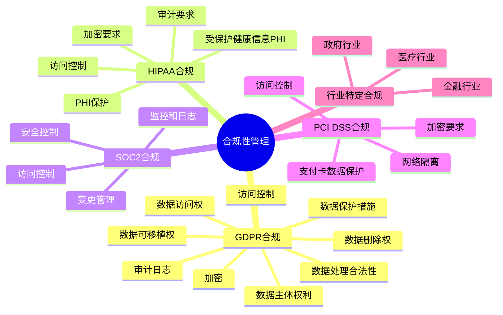
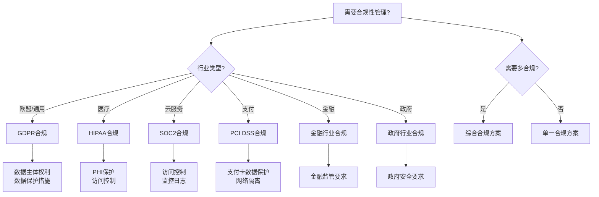

# PostgreSQL合规性管理指南

> **PostgreSQL版本**: 17+/18+
> **适用场景**: 金融、医疗、政府等合规性要求高的行业
> **难度等级**: ⭐⭐⭐⭐ 高级

---

## 📊 知识体系思维导图



---

## 📊 合规性方案选型决策树



---

## 📊 合规性标准对比矩阵

| 合规标准 | 适用范围 | 核心要求 | 实施复杂度 | 审计要求 | PostgreSQL支持 |
| --- | --- | --- | --- | --- | --- |
| **GDPR** | 欧盟/通用 | 数据主体权利、数据保护 | ⭐⭐⭐ | 高 | ✅ 支持 |
| **HIPAA** | 医疗行业 | PHI保护、访问控制 | ⭐⭐⭐⭐ | 高 | ✅ 支持 |
| **SOC2** | 云服务 | 访问控制、监控日志 | ⭐⭐⭐ | 中 | ✅ 支持 |
| **PCI DSS** | 支付行业 | 支付卡数据保护 | ⭐⭐⭐⭐ | 高 | ✅ 支持 |
| **金融监管** | 金融行业 | 数据保护、审计 | ⭐⭐⭐⭐ | 高 | ✅ 支持 |

---

## 📋 目录

- [PostgreSQL合规性管理指南](#postgresql合规性管理指南)
  - [📊 知识体系思维导图](#-知识体系思维导图)
  - [📊 合规性方案选型决策树](#-合规性方案选型决策树)
  - [📊 合规性标准对比矩阵](#-合规性标准对比矩阵)
  - [📋 目录](#-目录)
  - [1. 概述](#1-概述)
    - [1.1 什么是合规性管理？](#11-什么是合规性管理)
    - [1.2 合规性管理目标](#12-合规性管理目标)
  - [2. GDPR合规](#2-gdpr合规)
    - [2.1 GDPR核心要求](#21-gdpr核心要求)
      - [2.1.1 数据主体权利](#211-数据主体权利)
      - [2.1.2 数据处理合法性](#212-数据处理合法性)
    - [2.2 数据保护措施](#22-数据保护措施)
      - [3.1.2 访问控制](#312-访问控制)
    - [3.2 审计要求](#32-审计要求)
  - [4. SOC2合规](#4-soc2合规)
    - [4.1 SOC2控制要求](#41-soc2控制要求)
      - [4.1.1 访问控制](#411-访问控制)
      - [4.1.2 变更管理](#412-变更管理)
    - [4.2 监控和日志](#42-监控和日志)
  - [5. PCI DSS合规](#5-pci-dss合规)
    - [5.1 支付卡数据保护](#51-支付卡数据保护)
    - [5.2 网络隔离](#52-网络隔离)
  - [6. 行业特定合规](#6-行业特定合规)
    - [6.1 金融行业](#61-金融行业)
    - [6.2 政府行业](#62-政府行业)
  - [7. 合规性检查清单](#7-合规性检查清单)
    - [7.1 GDPR检查清单](#71-gdpr检查清单)
    - [7.2 HIPAA检查清单](#72-hipaa检查清单)
    - [7.3 SOC2检查清单](#73-soc2检查清单)
    - [7.4 PCI DSS检查清单](#74-pci-dss检查清单)
  - [📚 相关文档](#-相关文档)

---

## 1. 概述

### 1.1 什么是合规性管理？

合规性管理是确保数据库系统符合相关法律法规、行业标准和内部政策的过程。

**主要合规标准**:

- ✅ **GDPR**: 欧盟通用数据保护条例
- ✅ **HIPAA**: 美国健康保险流通与责任法案
- ✅ **SOC2**: 服务组织控制2
- ✅ **PCI DSS**: 支付卡行业数据安全标准
- ✅ **行业特定**: 金融、医疗、政府等行业标准

### 1.2 合规性管理目标

- **数据保护**: 保护个人和敏感数据
- **隐私保护**: 尊重用户隐私权
- **审计追踪**: 完整的操作审计
- **风险控制**: 降低合规风险

---

## 2. GDPR合规

### 2.1 GDPR核心要求

#### 2.1.1 数据主体权利

```sql
-- 1. 数据访问权（Right to Access，带错误处理）
-- 获取用户数据函数（带完整错误处理）
CREATE OR REPLACE FUNCTION get_user_data(p_user_id INT)
RETURNS TABLE (
    table_name TEXT,
    data JSONB
)
LANGUAGE plpgsql
AS $$
BEGIN
    -- 参数验证
    IF p_user_id IS NULL THEN
        RAISE EXCEPTION '用户ID不能为空';
    END IF;

    IF p_user_id < 0 THEN
        RAISE EXCEPTION '用户ID无效: % (必须>=0)', p_user_id;
    END IF;

    -- 检查表是否存在
    IF NOT EXISTS (SELECT 1 FROM information_schema.tables WHERE table_schema = 'public' AND table_name = 'users') THEN
        RAISE EXCEPTION 'users表不存在';
    END IF;

    IF NOT EXISTS (SELECT 1 FROM information_schema.tables WHERE table_schema = 'public' AND table_name = 'orders') THEN
        RAISE WARNING 'orders表不存在，将跳过订单数据';
    END IF;

    BEGIN
        RETURN QUERY
        -- 获取用户数据
        SELECT 'users'::TEXT, COALESCE(to_jsonb(u.*), '{}'::JSONB)
        FROM users u
        WHERE u.id = p_user_id
        UNION ALL
        -- 获取订单数据（如果表存在）
        SELECT 'orders'::TEXT, COALESCE(to_jsonb(o.*), '{}'::JSONB)
        FROM orders o
        WHERE o.user_id = p_user_id
          AND EXISTS (SELECT 1 FROM information_schema.tables WHERE table_schema = 'public' AND table_name = 'orders');
    EXCEPTION
        WHEN undefined_table THEN
            RAISE EXCEPTION '表users或orders不存在';
        WHEN OTHERS THEN
            RAISE EXCEPTION '获取用户数据失败: %', SQLERRM;
    END;
END;
$$;

-- 删除用户数据函数（Right to Erasure，带完整错误处理）
CREATE OR REPLACE FUNCTION delete_user_data(p_user_id INT)
RETURNS void
LANGUAGE plpgsql
AS $$
DECLARE
    v_deleted_orders_count INT := 0;
    v_deleted_users_count INT := 0;
    v_current_user TEXT;
BEGIN
    -- 参数验证
    IF p_user_id IS NULL THEN
        RAISE EXCEPTION '用户ID不能为空';
    END IF;

    IF p_user_id < 0 THEN
        RAISE EXCEPTION '用户ID无效: % (必须>=0)', p_user_id;
    END IF;

    -- 检查表是否存在
    IF NOT EXISTS (SELECT 1 FROM information_schema.tables WHERE table_schema = 'public' AND table_name = 'users') THEN
        RAISE EXCEPTION 'users表不存在';
    END IF;

    -- 检查用户是否存在
    IF NOT EXISTS (SELECT 1 FROM users WHERE id = p_user_id) THEN
        RAISE WARNING '用户ID % 不存在', p_user_id;
        RETURN;
    END IF;

    BEGIN
        -- 获取当前用户
        BEGIN
            v_current_user := current_user;
        EXCEPTION
            WHEN OTHERS THEN
                v_current_user := 'system';
        END;

        -- 删除订单数据（如果表存在）
        IF EXISTS (SELECT 1 FROM information_schema.tables WHERE table_schema = 'public' AND table_name = 'orders') THEN
            BEGIN
                DELETE FROM orders WHERE user_id = p_user_id;
                GET DIAGNOSTICS v_deleted_orders_count = ROW_COUNT;
            EXCEPTION
                WHEN foreign_key_violation THEN
                    RAISE WARNING '删除订单时违反外键约束';
                WHEN OTHERS THEN
                    RAISE WARNING '删除订单数据失败: %', SQLERRM;
            END;
        END IF;

        -- 删除用户数据
        BEGIN
            DELETE FROM users WHERE id = p_user_id;
            GET DIAGNOSTICS v_deleted_users_count = ROW_COUNT;

            IF v_deleted_users_count = 0 THEN
                RAISE WARNING '用户删除失败，用户ID可能不存在: %', p_user_id;
            END IF;
        EXCEPTION
            WHEN foreign_key_violation THEN
                RAISE EXCEPTION '删除用户失败：存在关联数据，请先删除关联数据';
            WHEN OTHERS THEN
                RAISE EXCEPTION '删除用户数据失败: %', SQLERRM;
        END;

        RAISE NOTICE '已删除用户数据: 订单 % 条, 用户 % 条', v_deleted_orders_count, v_deleted_users_count;

        -- 记录删除操作（如果存在审计日志表）
        IF EXISTS (SELECT 1 FROM information_schema.tables WHERE table_schema = 'public' AND table_name = 'audit_log') THEN
            BEGIN
                INSERT INTO audit_log (username, operation, new_values, event_time)
                VALUES (
                    v_current_user,
                    'GDPR_DELETE',
                    jsonb_build_object(
                        'user_id', p_user_id,
                        'deleted_orders', v_deleted_orders_count,
                        'deleted_users', v_deleted_users_count
                    ),
                    NOW()
                );
            EXCEPTION
                WHEN unique_violation THEN
                    RAISE WARNING '审计日志记录已存在';
                WHEN OTHERS THEN
                    RAISE WARNING '记录审计日志失败: %', SQLERRM;
            END;
        END IF;
    EXCEPTION
        WHEN undefined_table THEN
            RAISE EXCEPTION '表users或orders不存在';
        WHEN foreign_key_violation THEN
            RAISE EXCEPTION '存在外键约束，无法删除用户数据';
        WHEN OTHERS THEN
            RAISE;
    END;
END;
$$ LANGUAGE plpgsql;

-- 3. 数据可移植权（Right to Data Portability）
CREATE OR REPLACE FUNCTION export_user_data(user_id INT)
RETURNS JSONB AS $$
DECLARE
    result JSONB;
BEGIN
    SELECT jsonb_build_object(
        'user', (SELECT to_jsonb(u.*) FROM users u WHERE u.id = user_id),
        'orders', (SELECT jsonb_agg(to_jsonb(o.*)) FROM orders o WHERE o.user_id = user_id)
    ) INTO result;

    RETURN result;
END;
$$ LANGUAGE plpgsql;
```

#### 2.1.2 数据处理合法性

```sql
-- 记录数据处理合法性基础（带错误处理）
DO $$
BEGIN
    BEGIN
        IF EXISTS (SELECT 1 FROM information_schema.tables WHERE table_schema = 'public' AND table_name = 'data_processing_consent') THEN
            RAISE WARNING '表 data_processing_consent 已存在';
        ELSE
            CREATE TABLE data_processing_consent (
                id SERIAL PRIMARY KEY,
                user_id INT NOT NULL,
                processing_purpose TEXT NOT NULL,
                legal_basis TEXT NOT NULL,  -- 'consent', 'contract', 'legal_obligation', etc.
                consent_given BOOLEAN DEFAULT false,
                consent_date TIMESTAMPTZ,
                withdrawal_date TIMESTAMPTZ
            );
            RAISE NOTICE '表 data_processing_consent 创建成功';
        END IF;
    EXCEPTION
        WHEN duplicate_table THEN
            RAISE WARNING '表 data_processing_consent 已存在';
        WHEN OTHERS THEN
            RAISE WARNING '创建表 data_processing_consent 失败: %', SQLERRM;
            RAISE;
    END;
END $$;

-- 检查数据处理合法性（带错误处理）
-- 检查处理同意函数（带完整错误处理）
CREATE OR REPLACE FUNCTION check_processing_consent(
    p_user_id INT,
    p_purpose TEXT
)
RETURNS BOOLEAN
LANGUAGE plpgsql
AS $$
DECLARE
    v_consent BOOLEAN;
BEGIN
    -- 参数验证
    IF p_user_id IS NULL THEN
        RAISE EXCEPTION '用户ID不能为空';
    END IF;

    IF p_user_id < 0 THEN
        RAISE EXCEPTION '用户ID无效: % (必须>=0)', p_user_id;
    END IF;

    IF p_purpose IS NULL OR TRIM(p_purpose) = '' THEN
        RAISE EXCEPTION '处理目的不能为空';
    END IF;

    -- 检查表是否存在
    IF NOT EXISTS (SELECT 1 FROM information_schema.tables WHERE table_schema = 'public' AND table_name = 'data_processing_consent') THEN
        RAISE WARNING 'data_processing_consent表不存在，默认返回false';
        RETURN false;
    END IF;

    BEGIN
        SELECT consent_given INTO v_consent
        FROM data_processing_consent
        WHERE user_id = p_user_id
          AND processing_purpose = p_purpose
          AND withdrawal_date IS NULL
          AND consent_given = true;

        RETURN COALESCE(v_consent, false);
    EXCEPTION
        WHEN OTHERS THEN
            RAISE WARNING '检查处理同意失败: %', SQLERRM;
            RETURN false;
    END;
EXCEPTION
    WHEN OTHERS THEN
        RAISE WARNING 'check_processing_consent执行失败: %', SQLERRM;
        RETURN false;
END;
$$;
```

### 2.2 数据保护措施

```sql
-- 数据加密（带错误处理）
DO $$
BEGIN
    BEGIN
        IF NOT EXISTS (SELECT 1 FROM pg_extension WHERE extname = 'pgcrypto') THEN
            CREATE EXTENSION pgcrypto;
            RAISE NOTICE 'pgcrypto 扩展创建成功';
        ELSE
            RAISE NOTICE 'pgcrypto 扩展已存在';
        END IF;
    EXCEPTION
        WHEN insufficient_privilege THEN
            RAISE WARNING '权限不足，无法创建 pgcrypto 扩展';
        WHEN OTHERS THEN
            RAISE WARNING '创建 pgcrypto 扩展失败: %', SQLERRM;
            RAISE;
    END;
END $$;

-- 加密存储个人数据（带错误处理）
DO $$
BEGIN
    BEGIN
        IF EXISTS (SELECT 1 FROM information_schema.tables WHERE table_schema = 'public' AND table_name = 'users') THEN
            RAISE WARNING '表 users 已存在';
        ELSE
            CREATE TABLE users (
                id SERIAL PRIMARY KEY,
                username TEXT,
                email_encrypted BYTEA,
                phone_encrypted BYTEA
            );
            RAISE NOTICE '表 users 创建成功（支持加密存储）';
        END IF;
    EXCEPTION
        WHEN duplicate_table THEN
            RAISE WARNING '表 users 已存在';
        WHEN OTHERS THEN
            RAISE WARNING '创建表 users 失败: %', SQLERRM;
            RAISE;
    END;
END $$;

-- 数据脱敏（用于非生产环境，带错误处理）
-- 掩码个人数据函数（带完整错误处理）
-- 掩码个人数据函数（带完整错误处理）
CREATE OR REPLACE FUNCTION mask_personal_data(p_data TEXT)
RETURNS TEXT
LANGUAGE plpgsql
AS $$
DECLARE
    v_result TEXT;
    v_length INTEGER;
BEGIN
    -- 参数验证
    IF p_data IS NULL THEN
        RETURN NULL;
    END IF;

    BEGIN
        v_length := LENGTH(p_data);

        IF v_length = 0 THEN
            RETURN '';
        END IF;

        -- 数据掩码：保留第一个字符，其余替换为***
        BEGIN
            v_result := regexp_replace(p_data, '(.)(.*)', '\1***', 'g');

            IF v_result IS NULL OR v_result = '' THEN
                RAISE WARNING '掩码结果为空，返回原始数据';
                RETURN p_data;
            END IF;

            RETURN v_result;
        EXCEPTION
            WHEN OTHERS THEN
                RAISE WARNING '数据掩码失败: %, 返回原始数据', SQLERRM;
                RETURN p_data;
        END;
    EXCEPTION
        WHEN OTHERS THEN
            RAISE WARNING 'mask_personal_data执行失败: %, 返回原始数据', SQLERRM;
            RETURN p_data;
    END;
EXCEPTION
    WHEN OTHERS THEN
        RETURN p_data;  -- 即使出错也返回原始数据
END;
$$;
    EXCEPTION
        WHEN OTHERS THEN
            RAISE WARNING '数据脱敏失败: %', SQLERRM;
            RETURN data;  -- 失败时返回原数据
    END;
END;
$$ LANGUAGE plpgsql;

---

## 3. HIPAA合规

### 3.1 HIPAA核心要求

#### 3.1.1 受保护健康信息（PHI）保护

```sql
-- 创建患者记录表（带错误处理）
DO $$
BEGIN
    BEGIN
        IF EXISTS (SELECT 1 FROM information_schema.tables WHERE table_schema = 'public' AND table_name = 'patient_records') THEN
            RAISE WARNING '表 patient_records 已存在';
        ELSE
            CREATE TABLE patient_records (
                id SERIAL PRIMARY KEY,
                patient_id TEXT NOT NULL,
                medical_record_number TEXT,
                diagnosis TEXT,
                treatment TEXT,
                created_at TIMESTAMPTZ DEFAULT NOW()
            );
            RAISE NOTICE '表 patient_records 创建成功';
        END IF;
    EXCEPTION
        WHEN duplicate_table THEN
            RAISE WARNING '表 patient_records 已存在';
        WHEN OTHERS THEN
            RAISE WARNING '创建表 patient_records 失败: %', SQLERRM;
            RAISE;
    END;
END $$;

-- 启用RLS（带错误处理）
DO $$
BEGIN
    BEGIN
        IF NOT EXISTS (SELECT 1 FROM information_schema.tables WHERE table_schema = 'public' AND table_name = 'patient_records') THEN
            RAISE WARNING '表 patient_records 不存在';
            RETURN;
        END IF;

        ALTER TABLE patient_records ENABLE ROW LEVEL SECURITY;
        RAISE NOTICE '表 patient_records 已启用行级安全';
    EXCEPTION
        WHEN undefined_table THEN
            RAISE WARNING '表 patient_records 不存在';
        WHEN OTHERS THEN
            RAISE WARNING '启用RLS失败: %', SQLERRM;
            RAISE;
    END;
END $$;

-- 基于授权的访问控制（带错误处理）
DO $$
BEGIN
    BEGIN
        IF NOT EXISTS (SELECT 1 FROM information_schema.tables WHERE table_schema = 'public' AND table_name = 'patient_records') THEN
            RAISE WARNING '表 patient_records 不存在';
            RETURN;
        END IF;

        IF EXISTS (SELECT 1 FROM pg_policies WHERE schemaname = 'public' AND tablename = 'patient_records' AND policyname = 'hipaa_access') THEN
            DROP POLICY hipaa_access ON patient_records;
            RAISE NOTICE '已删除现有策略 hipaa_access';
        END IF;

        CREATE POLICY hipaa_access ON patient_records
            FOR ALL
            USING (
                current_user IN (
                    SELECT employee_id
                    FROM authorized_healthcare_providers
                    WHERE department = 'authorized'
                    AND access_level >= (
                        SELECT required_access_level
                        FROM access_requirements
                        WHERE record_type = 'patient_records'
                    )
                )
            );
        RAISE NOTICE 'HIPAA访问策略 hipaa_access 创建成功';
    EXCEPTION
        WHEN undefined_table THEN
            RAISE WARNING '相关表不存在，无法创建策略';
        WHEN OTHERS THEN
            RAISE WARNING '创建HIPAA访问策略失败: %', SQLERRM;
            RAISE;
    END;
END $$;

-- 审计所有PHI访问（带错误处理）
DO $$
BEGIN
    BEGIN
        IF NOT EXISTS (SELECT 1 FROM information_schema.tables WHERE table_schema = 'public' AND table_name = 'patient_records') THEN
            RAISE WARNING '表 patient_records 不存在';
            RETURN;
        END IF;

        IF NOT EXISTS (SELECT 1 FROM pg_proc WHERE proname = 'audit_trigger_func') THEN
            RAISE WARNING '函数 audit_trigger_func 不存在，无法创建触发器';
            RETURN;
        END IF;

        IF EXISTS (SELECT 1 FROM pg_trigger WHERE tgname = 'hipaa_audit_trigger') THEN
            DROP TRIGGER hipaa_audit_trigger ON patient_records;
            RAISE NOTICE '已删除现有触发器 hipaa_audit_trigger';
        END IF;

        CREATE TRIGGER hipaa_audit_trigger
        AFTER INSERT OR UPDATE OR DELETE ON patient_records
        FOR EACH ROW EXECUTE FUNCTION audit_trigger_func();
        RAISE NOTICE 'HIPAA审计触发器 hipaa_audit_trigger 创建成功';
    EXCEPTION
        WHEN undefined_table THEN
            RAISE WARNING '表 patient_records 不存在';
        WHEN undefined_function THEN
            RAISE WARNING '函数 audit_trigger_func 不存在';
        WHEN OTHERS THEN
            RAISE WARNING '创建HIPAA审计触发器失败: %', SQLERRM;
            RAISE;
    END;
END $$;
```

#### 3.1.2 访问控制

```sql
-- 创建授权医疗提供者表（带错误处理）
DO $$
BEGIN
    BEGIN
        IF EXISTS (SELECT 1 FROM information_schema.tables WHERE table_schema = 'public' AND table_name = 'authorized_healthcare_providers') THEN
            RAISE WARNING '表 authorized_healthcare_providers 已存在';
        ELSE
            CREATE TABLE authorized_healthcare_providers (
                employee_id TEXT PRIMARY KEY,
                department TEXT,
                access_level INT,
                authorization_date DATE,
                expiration_date DATE
            );
            RAISE NOTICE '表 authorized_healthcare_providers 创建成功';
        END IF;
    EXCEPTION
        WHEN duplicate_table THEN
            RAISE WARNING '表 authorized_healthcare_providers 已存在';
        WHEN OTHERS THEN
            RAISE WARNING '创建表 authorized_healthcare_providers 失败: %', SQLERRM;
            RAISE;
    END;
END $$;

-- 检查访问授权（带错误处理）
CREATE OR REPLACE FUNCTION check_hipaa_access(
    p_employee_id TEXT,
    p_record_type TEXT
)
RETURNS BOOLEAN AS $$
DECLARE
    v_authorized BOOLEAN;
BEGIN
    BEGIN
        -- 参数验证
        IF p_employee_id IS NULL OR p_record_type IS NULL THEN
            RAISE EXCEPTION '参数不能为NULL';
        END IF;

        SELECT EXISTS(
            SELECT 1
            FROM authorized_healthcare_providers
            WHERE employee_id = p_employee_id
            AND expiration_date > CURRENT_DATE
            AND access_level >= (
                SELECT required_access_level
                FROM access_requirements
            WHERE record_type = p_record_type
        )
    ) INTO v_authorized;

    RETURN v_authorized;
END;
$$ LANGUAGE plpgsql;
```

### 3.2 审计要求

```sql
-- HIPAA要求完整的审计日志（带错误处理）
DO $$
BEGIN
    BEGIN
        IF EXISTS (SELECT 1 FROM information_schema.tables WHERE table_schema = 'public' AND table_name = 'hipaa_audit_log') THEN
            RAISE WARNING '表 hipaa_audit_log 已存在';
        ELSE
            CREATE TABLE hipaa_audit_log (
                id BIGSERIAL PRIMARY KEY,
                event_time TIMESTAMPTZ DEFAULT NOW(),
                user_id TEXT,
                patient_id TEXT,
                action TEXT,
                resource_type TEXT,
                resource_id TEXT,
                ip_address INET,
                success BOOLEAN
            );
            RAISE NOTICE '表 hipaa_audit_log 创建成功';
        END IF;
    EXCEPTION
        WHEN duplicate_table THEN
            RAISE WARNING '表 hipaa_audit_log 已存在';
        WHEN OTHERS THEN
            RAISE WARNING '创建表 hipaa_audit_log 失败: %', SQLERRM;
            RAISE;
    END;
END $$;

-- 记录所有PHI访问（带错误处理）
CREATE OR REPLACE FUNCTION log_hipaa_access(
    p_user_id TEXT,
    p_patient_id TEXT,
    p_action TEXT,
    p_resource_type TEXT,
    p_resource_id TEXT
)
RETURNS void AS $$
DECLARE
    v_ip_address INET;
BEGIN
    BEGIN
        -- 参数验证
        IF p_user_id IS NULL OR p_action IS NULL OR p_resource_type IS NULL THEN
            RAISE EXCEPTION '必需参数不能为NULL';
        END IF;

        -- 获取客户端IP地址（如果可用）
        BEGIN
            SELECT inet_client_addr() INTO v_ip_address;
        EXCEPTION
            WHEN OTHERS THEN
                v_ip_address := NULL;
        END;

        INSERT INTO hipaa_audit_log (
            user_id,
            patient_id,
            action,
            resource_type,
            resource_id,
            ip_address,
            success
        )
        VALUES (
            p_user_id,
            p_patient_id,
            p_action,
            p_resource_type,
            p_resource_id,
            v_ip_address,
            true
        );

        RAISE NOTICE 'HIPAA访问日志已记录';
    EXCEPTION
        WHEN undefined_table THEN
            RAISE EXCEPTION '表 hipaa_audit_log 不存在';
        WHEN NOT_NULL_VIOLATION THEN
            RAISE EXCEPTION '必需字段不能为NULL';
        WHEN OTHERS THEN
            RAISE;
    END;
END;
$$ LANGUAGE plpgsql;
        patient_id,
        action,
        resource_type,
        resource_id,
        ip_address,
        success
    )
    VALUES (
        p_user_id,
        p_patient_id,
        p_action,
        p_resource_type,
        p_resource_id,
        inet_client_addr(),
        true
    );
END;
$$ LANGUAGE plpgsql;
```

---

## 4. SOC2合规

### 4.1 SOC2控制要求

#### 4.1.1 访问控制

```sql
-- 用户访问管理（带错误处理）
DO $$
BEGIN
    BEGIN
        IF EXISTS (SELECT 1 FROM information_schema.tables WHERE table_schema = 'public' AND table_name = 'user_access_management') THEN
            RAISE WARNING '表 user_access_management 已存在';
        ELSE
            CREATE TABLE user_access_management (
                id SERIAL PRIMARY KEY,
                user_id TEXT NOT NULL,
                role TEXT NOT NULL,
                granted_date DATE,
                revoked_date DATE,
                granted_by TEXT,
                status TEXT DEFAULT 'active'
            );
            RAISE NOTICE '表 user_access_management 创建成功';
        END IF;
    EXCEPTION
        WHEN duplicate_table THEN
            RAISE WARNING '表 user_access_management 已存在';
        WHEN OTHERS THEN
            RAISE WARNING '创建表 user_access_management 失败: %', SQLERRM;
            RAISE;
    END;
END $$;

-- 定期审查访问权限（带错误处理）
CREATE OR REPLACE FUNCTION review_user_access()
RETURNS TABLE (
    user_id TEXT,
    role TEXT,
    last_review_date DATE,
    days_since_review INT
) AS $$
BEGIN
    BEGIN
        -- 检查表是否存在
        IF NOT EXISTS (SELECT 1 FROM information_schema.tables WHERE table_schema = 'public' AND table_name = 'user_access_management') THEN
            RAISE EXCEPTION '表 user_access_management 不存在';
        END IF;

        RETURN QUERY
        SELECT
            uam.user_id,
            uam.role,
            COALESCE(MAX(ar.review_date), uam.granted_date) as last_review_date,
            EXTRACT(DAY FROM (CURRENT_DATE - COALESCE(MAX(ar.review_date), uam.granted_date)))::INT as days_since_review
        FROM user_access_management uam
        LEFT JOIN access_reviews ar ON uam.user_id = ar.user_id AND uam.role = ar.role
        WHERE uam.status = 'active'
        GROUP BY uam.user_id, uam.role, uam.granted_date
        HAVING MAX(ar.review_date) IS NULL OR EXTRACT(DAY FROM (CURRENT_DATE - MAX(ar.review_date))) > 90
        ORDER BY days_since_review DESC;
    EXCEPTION
        WHEN undefined_table THEN
            RAISE EXCEPTION '表 user_access_management 或 access_reviews 不存在';
        WHEN OTHERS THEN
            RAISE;
    END;
END;
$$ LANGUAGE plpgsql;
```

#### 4.1.2 变更管理

```sql
-- 变更管理表（带错误处理）
DO $$
BEGIN
    BEGIN
        IF EXISTS (SELECT 1 FROM information_schema.tables WHERE table_schema = 'public' AND table_name = 'change_management') THEN
            RAISE WARNING '表 change_management 已存在';
        ELSE
            CREATE TABLE change_management (
                id SERIAL PRIMARY KEY,
                change_id TEXT UNIQUE,
                change_type TEXT,
                description TEXT,
                requested_by TEXT,
                approved_by TEXT,
                change_date TIMESTAMPTZ,
                status TEXT,
                rollback_plan TEXT
            );
            RAISE NOTICE '表 change_management 创建成功';
        END IF;
    EXCEPTION
        WHEN duplicate_table THEN
            RAISE WARNING '表 change_management 已存在';
        WHEN OTHERS THEN
            RAISE WARNING '创建表 change_management 失败: %', SQLERRM;
            RAISE;
    END;
END $$;

-- 记录所有数据库变更（带错误处理）
CREATE OR REPLACE FUNCTION log_database_change(
    p_change_type TEXT,
    p_description TEXT
)
RETURNS TEXT AS $$
DECLARE
    v_change_id TEXT;
BEGIN
    BEGIN
        -- 参数验证
        IF p_change_type IS NULL OR p_description IS NULL THEN
            RAISE EXCEPTION '参数不能为NULL';
        END IF;

        -- 生成变更ID
        v_change_id := gen_random_uuid()::TEXT;

        INSERT INTO change_management (
            change_id,
            change_type,
            description,
            requested_by,
            change_date,
            status
        )
        VALUES (
            v_change_id,
            p_change_type,
            p_description,
            current_user,
            NOW(),
            'pending'
        );

        RAISE NOTICE '数据库变更已记录，变更ID: %', v_change_id;
        RETURN v_change_id;
    EXCEPTION
        WHEN undefined_table THEN
            RAISE EXCEPTION '表 change_management 不存在';
        WHEN unique_violation THEN
            RAISE EXCEPTION '变更ID冲突，请重试';
        WHEN NOT_NULL_VIOLATION THEN
            RAISE EXCEPTION '必需字段不能为NULL';
        WHEN OTHERS THEN
            RAISE;
    END;
END;
$$ LANGUAGE plpgsql;
        change_date,
        status
    )
    VALUES (
        gen_random_uuid()::TEXT,
        p_change_type,
        p_description,
        current_user,
        NOW(),
        'pending'
    );
END;
$$ LANGUAGE plpgsql;
```

### 4.2 监控和日志

```sql
-- SOC2要求完整的监控和日志（带错误处理和性能测试）
DO $$
DECLARE
    log_count INT;
BEGIN
    BEGIN
        IF NOT EXISTS (SELECT 1 FROM information_schema.tables WHERE table_schema = 'public' AND table_name = 'audit_log') THEN
            RAISE WARNING '表 audit_log 不存在，无法查询监控日志';
            RETURN;
        END IF;

        SELECT COUNT(*) INTO log_count
        FROM audit_log
        WHERE event_time >= NOW() - INTERVAL '90 days';

        RAISE NOTICE '找到 % 条审计日志记录（最近90天）', log_count;
    EXCEPTION
        WHEN OTHERS THEN
            RAISE WARNING '查询监控日志准备失败: %', SQLERRM;
            RAISE;
    END;
END $$;

EXPLAIN ANALYZE
SELECT
    event_time,
    username,
    operation,
    table_name,
    ip_address
FROM audit_log
WHERE event_time >= NOW() - INTERVAL '90 days'
ORDER BY event_time DESC
LIMIT 1000;

-- 异常活动检测（带错误处理和性能测试）
DO $$
DECLARE
    suspicious_count INT;
BEGIN
    BEGIN
        IF NOT EXISTS (SELECT 1 FROM information_schema.tables WHERE table_schema = 'public' AND table_name = 'audit_log') THEN
            RAISE WARNING '表 audit_log 不存在，无法检测异常活动';
            RETURN;
        END IF;

        SELECT COUNT(*) INTO suspicious_count
        FROM (
            SELECT username
            FROM audit_log
            WHERE event_time >= NOW() - INTERVAL '24 hours'
            GROUP BY username
            HAVING COUNT(*) > 100 OR COUNT(DISTINCT ip_address) > 5
        ) suspicious_users;

        IF suspicious_count > 0 THEN
            RAISE WARNING '发现 % 个可疑用户活动', suspicious_count;
        ELSE
            RAISE NOTICE '未发现异常活动';
        END IF;
    EXCEPTION
        WHEN OTHERS THEN
            RAISE WARNING '检测异常活动失败: %', SQLERRM;
            RAISE;
    END;
END $$;

EXPLAIN ANALYZE
SELECT
    username,
    COUNT(*) as event_count,
    COUNT(DISTINCT ip_address) as unique_ips
FROM audit_log
WHERE event_time >= NOW() - INTERVAL '24 hours'
GROUP BY username
HAVING COUNT(*) > 100 OR COUNT(DISTINCT ip_address) > 5;
```

---

## 5. PCI DSS合规

### 5.1 支付卡数据保护

```sql
-- 支付卡数据加密存储（带错误处理）
DO $$
BEGIN
    BEGIN
        IF EXISTS (SELECT 1 FROM information_schema.tables WHERE table_schema = 'public' AND table_name = 'payment_cards') THEN
            RAISE WARNING '表 payment_cards 已存在';
        ELSE
            CREATE TABLE payment_cards (
                id SERIAL PRIMARY KEY,
                card_number_encrypted BYTEA,
                cardholder_name TEXT,
                expiry_date TEXT,
                cvv_encrypted BYTEA,
                created_at TIMESTAMPTZ DEFAULT NOW()
            );
            RAISE NOTICE '表 payment_cards 创建成功（支持加密存储）';
        END IF;
    EXCEPTION
        WHEN duplicate_table THEN
            RAISE WARNING '表 payment_cards 已存在';
        WHEN OTHERS THEN
            RAISE WARNING '创建表 payment_cards 失败: %', SQLERRM;
            RAISE;
    END;
END $$;

-- 加密函数（带错误处理）
CREATE OR REPLACE FUNCTION encrypt_card_data(
    card_number TEXT,
    cvv TEXT,
    encryption_key TEXT
)
RETURNS TABLE (
    card_number_encrypted BYTEA,
    cvv_encrypted BYTEA
) AS $$
BEGIN
    BEGIN
        -- 参数验证
        IF card_number IS NULL OR cvv IS NULL OR encryption_key IS NULL THEN
            RAISE EXCEPTION '参数不能为NULL';
        END IF;

        -- 检查pgcrypto扩展
        IF NOT EXISTS (SELECT 1 FROM pg_extension WHERE extname = 'pgcrypto') THEN
            RAISE EXCEPTION 'pgcrypto 扩展未安装';
        END IF;

        -- 验证卡号格式（简单验证）
        IF LENGTH(card_number) < 13 OR LENGTH(card_number) > 19 THEN
            RAISE EXCEPTION '卡号长度无效';
        END IF;

        -- 验证CVV格式
        IF LENGTH(cvv) < 3 OR LENGTH(cvv) > 4 THEN
            RAISE EXCEPTION 'CVV长度无效';
        END IF;

        RETURN QUERY
        SELECT
            pgp_sym_encrypt(card_number, encryption_key),
            pgp_sym_encrypt(cvv, encryption_key);
    EXCEPTION
        WHEN undefined_function THEN
            RAISE EXCEPTION 'pgcrypto 扩展未安装，无法使用加密功能';
        WHEN OTHERS THEN
            RAISE;
    END;
END;
$$ LANGUAGE plpgsql;
END;
$$ LANGUAGE plpgsql;

-- 访问控制
ALTER TABLE payment_cards ENABLE ROW LEVEL SECURITY;

CREATE POLICY pci_access ON payment_cards
    FOR SELECT
    USING (
        current_user IN (
            SELECT employee_id
            FROM authorized_payment_handlers
            WHERE department = 'payment_processing'
        )
    );
```

### 5.2 网络隔离

```sql
-- PCI DSS要求网络隔离（带错误处理）
-- 使用不同的数据库或Schema隔离支付数据
DO $$
BEGIN
    BEGIN
        IF NOT EXISTS (SELECT 1 FROM information_schema.schemata WHERE schema_name = 'payment_data') THEN
            CREATE SCHEMA payment_data;
            RAISE NOTICE 'Schema payment_data 创建成功';
        ELSE
            RAISE NOTICE 'Schema payment_data 已存在';
        END IF;
    EXCEPTION
        WHEN duplicate_schema THEN
            RAISE WARNING 'Schema payment_data 已存在';
        WHEN OTHERS THEN
            RAISE WARNING '创建Schema payment_data失败: %', SQLERRM;
            RAISE;
    END;

    BEGIN
        IF NOT EXISTS (SELECT 1 FROM information_schema.schemata WHERE schema_name = 'general_data') THEN
            CREATE SCHEMA general_data;
            RAISE NOTICE 'Schema general_data 创建成功';
        ELSE
            RAISE NOTICE 'Schema general_data 已存在';
        END IF;
    EXCEPTION
        WHEN duplicate_schema THEN
            RAISE WARNING 'Schema general_data 已存在';
        WHEN OTHERS THEN
            RAISE WARNING '创建Schema general_data失败: %', SQLERRM;
            RAISE;
    END;
END $$;

-- 限制访问（带错误处理）
DO $$
BEGIN
    BEGIN
        IF NOT EXISTS (SELECT 1 FROM information_schema.schemata WHERE schema_name = 'payment_data') THEN
            RAISE WARNING 'Schema payment_data 不存在';
            RETURN;
        END IF;

        REVOKE ALL ON SCHEMA payment_data FROM PUBLIC;
        RAISE NOTICE '已撤销PUBLIC对Schema payment_data的所有权限';
    EXCEPTION
        WHEN invalid_schema_name THEN
            RAISE WARNING 'Schema payment_data 不存在';
        WHEN OTHERS THEN
            RAISE WARNING '撤销权限失败: %', SQLERRM;
            RAISE;
    END;

    BEGIN
        IF NOT EXISTS (SELECT 1 FROM pg_roles WHERE rolname = 'payment_processor_role') THEN
            RAISE WARNING '角色 payment_processor_role 不存在，无法授予权限';
            RETURN;
        END IF;

        GRANT USAGE ON SCHEMA payment_data TO payment_processor_role;
        RAISE NOTICE '已授予 payment_processor_role 对Schema payment_data的使用权限';
    EXCEPTION
        WHEN undefined_object THEN
            RAISE WARNING '角色 payment_processor_role 不存在';
        WHEN invalid_schema_name THEN
            RAISE WARNING 'Schema payment_data 不存在';
        WHEN OTHERS THEN
            RAISE WARNING '授予权限失败: %', SQLERRM;
            RAISE;
    END;
END $$;
```

---

## 6. 行业特定合规

### 6.1 金融行业

```sql
-- 金融数据保留要求（带错误处理）
DO $$
BEGIN
    BEGIN
        IF NOT EXISTS (SELECT 1 FROM information_schema.tables WHERE table_schema = 'public' AND table_name = 'financial_transactions') THEN
            RAISE WARNING '表 financial_transactions 不存在';
            RETURN;
        END IF;

        IF EXISTS (SELECT 1 FROM pg_policies WHERE schemaname = 'public' AND tablename = 'financial_transactions' AND policyname = 'financial_data_retention') THEN
            DROP POLICY financial_data_retention ON financial_transactions;
            RAISE NOTICE '已删除现有策略 financial_data_retention';
        END IF;

        CREATE POLICY financial_data_retention ON financial_transactions
            FOR DELETE
            USING (transaction_date < NOW() - INTERVAL '7 years');
        RAISE NOTICE '金融数据保留策略 financial_data_retention 创建成功';
    EXCEPTION
        WHEN undefined_table THEN
            RAISE WARNING '表 financial_transactions 不存在';
        WHEN OTHERS THEN
            RAISE WARNING '创建金融数据保留策略失败: %', SQLERRM;
            RAISE;
    END;
END $$;

-- 交易审计（带错误处理）
DO $$
BEGIN
    BEGIN
        IF NOT EXISTS (SELECT 1 FROM information_schema.tables WHERE table_schema = 'public' AND table_name = 'financial_transactions') THEN
            RAISE WARNING '表 financial_transactions 不存在';
            RETURN;
        END IF;

        IF NOT EXISTS (SELECT 1 FROM pg_proc WHERE proname = 'audit_trigger_func') THEN
            RAISE WARNING '函数 audit_trigger_func 不存在，无法创建触发器';
            RETURN;
        END IF;

        IF EXISTS (SELECT 1 FROM pg_trigger WHERE tgname = 'financial_audit_trigger') THEN
            DROP TRIGGER financial_audit_trigger ON financial_transactions;
            RAISE NOTICE '已删除现有触发器 financial_audit_trigger';
        END IF;

        CREATE TRIGGER financial_audit_trigger
        AFTER INSERT OR UPDATE OR DELETE ON financial_transactions
        FOR EACH ROW EXECUTE FUNCTION audit_trigger_func();
        RAISE NOTICE '交易审计触发器 financial_audit_trigger 创建成功';
    EXCEPTION
        WHEN undefined_table THEN
            RAISE WARNING '表 financial_transactions 不存在';
        WHEN undefined_function THEN
            RAISE WARNING '函数 audit_trigger_func 不存在';
        WHEN OTHERS THEN
            RAISE WARNING '创建交易审计触发器失败: %', SQLERRM;
            RAISE;
    END;
END $$;
```

### 6.2 政府行业

```sql
-- 数据分类（带错误处理）
DO $$
BEGIN
    BEGIN
        IF EXISTS (SELECT 1 FROM information_schema.tables WHERE table_schema = 'public' AND table_name = 'classified_data') THEN
            RAISE WARNING '表 classified_data 已存在';
        ELSE
            CREATE TABLE classified_data (
                id SERIAL PRIMARY KEY,
                classification_level TEXT,  -- 'public', 'internal', 'confidential', 'secret'
                data_content TEXT,
                access_control_list TEXT[]
            );
            RAISE NOTICE '表 classified_data 创建成功';
        END IF;
    EXCEPTION
        WHEN duplicate_table THEN
            RAISE WARNING '表 classified_data 已存在';
        WHEN OTHERS THEN
            RAISE WARNING '创建表 classified_data 失败: %', SQLERRM;
            RAISE;
    END;
END $$;

-- 基于分类的访问控制（带错误处理）
DO $$
BEGIN
    BEGIN
        IF NOT EXISTS (SELECT 1 FROM information_schema.tables WHERE table_schema = 'public' AND table_name = 'classified_data') THEN
            RAISE WARNING '表 classified_data 不存在';
            RETURN;
        END IF;

        -- 启用RLS
        ALTER TABLE classified_data ENABLE ROW LEVEL SECURITY;

        IF EXISTS (SELECT 1 FROM pg_policies WHERE schemaname = 'public' AND tablename = 'classified_data' AND policyname = 'classified_access') THEN
            DROP POLICY classified_access ON classified_data;
            RAISE NOTICE '已删除现有策略 classified_access';
        END IF;

        CREATE POLICY classified_access ON classified_data
            FOR ALL
            USING (
                classification_level = ANY(
                    SELECT security_clearance
                    FROM authorized_personnel
                    WHERE employee_id = current_user
                )
            );
        RAISE NOTICE '基于分类的访问控制策略 classified_access 创建成功';
    EXCEPTION
        WHEN undefined_table THEN
            RAISE WARNING '表 classified_data 或 authorized_personnel 不存在';
        WHEN OTHERS THEN
            RAISE WARNING '创建基于分类的访问控制策略失败: %', SQLERRM;
            RAISE;
    END;
END $$;
```

---

## 7. 合规性检查清单

### 7.1 GDPR检查清单

- [ ] 数据主体权利实现（访问、删除、可移植）
- [ ] 数据处理合法性记录
- [ ] 数据保护措施（加密、脱敏）
- [ ] 数据泄露通知机制
- [ ] 数据处理协议（DPA）

### 7.2 HIPAA检查清单

- [ ] PHI访问控制
- [ ] 授权医疗提供者管理
- [ ] 完整审计日志
- [ ] 数据加密
- [ ] 业务伙伴协议（BAA）

### 7.3 SOC2检查清单

- [ ] 访问控制管理
- [ ] 变更管理流程
- [ ] 监控和日志
- [ ] 安全事件响应
- [ ] 定期合规审计

### 7.4 PCI DSS检查清单

- [ ] 支付卡数据加密
- [ ] 网络隔离
- [ ] 访问控制
- [ ] 安全监控
- [ ] 漏洞管理

---

## 📚 相关文档

- [企业级安全深化](./企业级安全深化.md) - 企业级安全深化
- [数据主权管理](./数据主权管理.md) - 数据主权管理
- [05-安全与合规](../05-安全与合规/README.md) - 安全与合规主题

---

**最后更新**: 2025年1月
**状态**: ✅ 完成
