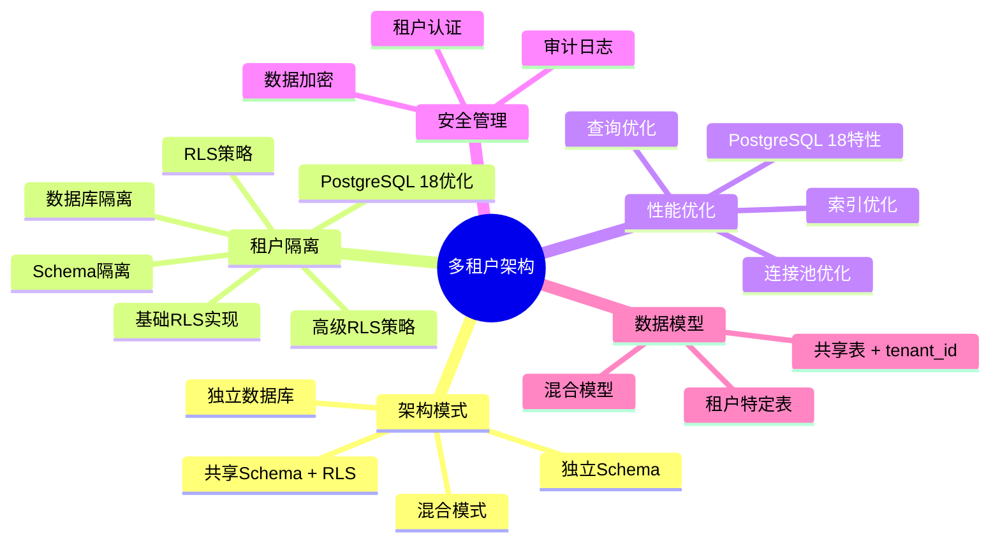
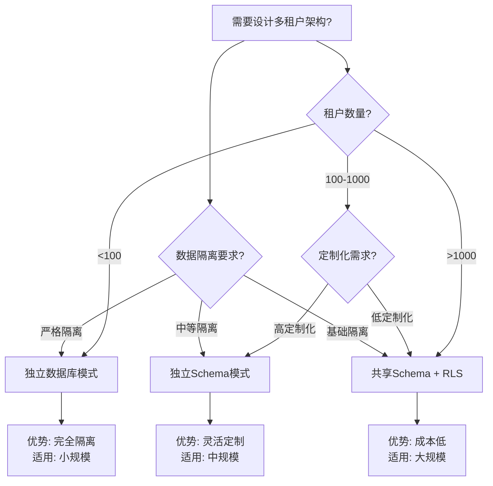

# PostgreSQL多租户架构完整指南

> **PostgreSQL版本**: 18.x
> **适用场景**: 多租户SaaS应用
> **参考案例**: [19-实战案例/04-多租户SaaS系统](../19-实战案例/04-多租户SaaS系统/README.md)

---

## 📊 知识体系思维导图



---

## 📊 多租户架构选型决策树



---

## 📊 多租户架构模式对比矩阵

| 架构模式 | 隔离级别 | 成本 | 性能 | 扩展性 | 维护复杂度 | 适用场景 |
| --- | --- | --- | --- | --- | --- | --- |
| **共享Schema + RLS** | ⭐⭐⭐ | 低 | ⭐⭐⭐⭐ | ⭐⭐⭐⭐⭐ | ⭐⭐ | 大规模SaaS (1000+租户) |
| **独立Schema** | ⭐⭐⭐⭐ | 中 | ⭐⭐⭐⭐ | ⭐⭐⭐⭐ | ⭐⭐⭐ | 中规模SaaS (100-1000租户) |
| **独立数据库** | ⭐⭐⭐⭐⭐ | 高 | ⭐⭐⭐⭐⭐ | ⭐⭐⭐ | ⭐⭐⭐⭐ | 小规模SaaS (<100租户) |
| **混合模式** | ⭐⭐⭐⭐ | 中-高 | ⭐⭐⭐⭐ | ⭐⭐⭐⭐ | ⭐⭐⭐⭐ | 复杂需求场景 |

---

## 📋 目录

- [PostgreSQL多租户架构完整指南](#postgresql多租户架构完整指南)
  - [📊 知识体系思维导图](#-知识体系思维导图)
  - [📊 多租户架构选型决策树](#-多租户架构选型决策树)
  - [📊 多租户架构模式对比矩阵](#-多租户架构模式对比矩阵)
  - [📋 目录](#-目录)
  - [1. 概述](#1-概述)
    - [1.1 什么是多租户架构？](#11-什么是多租户架构)
    - [1.2 多租户架构的优势](#12-多租户架构的优势)
    - [1.3 多租户架构的挑战](#13-多租户架构的挑战)
  - [2. 多租户架构设计](#2-多租户架构设计)
    - [2.1 架构模式](#21-架构模式)
      - [模式1：共享Schema + RLS（推荐）⭐](#模式1共享schema--rls推荐)
      - [模式2：独立Schema](#模式2独立schema)
      - [模式3：独立数据库](#模式3独立数据库)
  - [3. 租户隔离策略](#3-租户隔离策略)
    - [3.1 RLS策略（推荐方案）](#31-rls策略推荐方案)
      - [3.1.1 基础RLS实现](#311-基础rls实现)
      - [3.1.2 PostgreSQL 18 RLS性能优化](#312-postgresql-18-rls性能优化)
      - [3.1.3 高级RLS策略](#313-高级rls策略)
    - [3.3 数据库隔离](#33-数据库隔离)
    - [4.2 连接池优化](#42-连接池优化)
    - [4.3 查询优化](#43-查询优化)
  - [5. 多租户安全管理](#5-多租户安全管理)
    - [5.1 租户认证](#51-租户认证)
    - [5.2 审计日志](#52-审计日志)
    - [5.3 数据加密](#53-数据加密)
  - [6. 多租户数据模型设计](#6-多租户数据模型设计)
    - [6.1 数据模型模式](#61-数据模型模式)
      - [模式1：共享表 + tenant\_id](#模式1共享表--tenant_id)
      - [模式2：租户特定表](#模式2租户特定表)
    - [6.2 数据模型最佳实践](#62-数据模型最佳实践)
  - [7. 最佳实践](#7-最佳实践)
    - [7.1 架构选择](#71-架构选择)
    - [7.2 性能优化](#72-性能优化)
    - [7.3 安全管理](#73-安全管理)
    - [7.4 监控与告警](#74-监控与告警)
  - [8. 参考案例](#8-参考案例)
    - [8.1 实战案例](#81-实战案例)
    - [8.2 相关文档](#82-相关文档)

---

## 1. 概述

### 1.1 什么是多租户架构？

多租户架构（Multi-Tenant Architecture）是一种软件架构模式，允许单个应用实例为多个租户（客户）提供服务，同时保持数据隔离和安全性。

### 1.2 多租户架构的优势

- ✅ **成本效益**: 共享基础设施，降低运营成本
- ✅ **易于维护**: 单一代码库，统一更新
- ✅ **快速扩展**: 新租户快速接入
- ✅ **资源利用**: 提高资源利用率

### 1.3 多租户架构的挑战

- ⚠️ **数据隔离**: 确保租户数据完全隔离
- ⚠️ **性能影响**: 大量租户可能影响性能
- ⚠️ **安全风险**: 需要严格的安全策略
- ⚠️ **定制化**: 不同租户的定制需求

---

## 2. 多租户架构设计

### 2.1 架构模式

PostgreSQL支持三种主要的多租户架构模式：

#### 模式1：共享Schema + RLS（推荐）⭐

**特点**:

- 所有租户共享同一个Schema
- 使用Row Level Security (RLS)实现数据隔离
- 通过`tenant_id`列区分租户

**优势**:

- ✅ 简单易实现
- ✅ 维护成本低
- ✅ PostgreSQL 18 RLS性能优化显著

**适用场景**:

- 租户数量：1000+
- 数据量：中等
- 定制化需求：低

#### 模式2：独立Schema

**特点**:

- 每个租户拥有独立的Schema
- 通过`search_path`动态切换Schema

**优势**:

- ✅ 数据隔离更彻底
- ✅ 支持租户级别的定制

**劣势**:

- ❌ Schema数量限制（PostgreSQL默认10000个）
- ❌ 管理复杂度高

**适用场景**:

- 租户数量：<1000
- 数据量：大
- 定制化需求：高

#### 模式3：独立数据库

**特点**:

- 每个租户拥有独立的数据库

**优势**:

- ✅ 数据隔离最彻底
- ✅ 支持完全独立的配置

**劣势**:

- ❌ 资源消耗大
- ❌ 管理复杂度最高

**适用场景**:

- 租户数量：<100
- 数据量：超大
- 合规性要求：极高

---

## 3. 租户隔离策略

### 3.1 RLS策略（推荐方案）

#### 3.1.1 基础RLS实现

```sql
-- 创建表，包含tenant_id（带错误处理）
DO $$
BEGIN
    BEGIN
        IF EXISTS (SELECT 1 FROM information_schema.tables WHERE table_schema = 'public' AND table_name = 'orders') THEN
            RAISE WARNING '表 orders 已存在';
            RETURN;
        END IF;

        CREATE TABLE orders (
            order_id BIGSERIAL PRIMARY KEY,
            tenant_id INT NOT NULL,
            customer_id BIGINT,
            amount NUMERIC(10,2),
            created_at TIMESTAMPTZ DEFAULT NOW()
        );

        RAISE NOTICE '表 orders 创建成功';
    EXCEPTION
        WHEN duplicate_table THEN
            RAISE WARNING '表 orders 已存在';
        WHEN OTHERS THEN
            RAISE WARNING '创建表 orders 失败: %', SQLERRM;
            RAISE;
    END;
END $$;

-- 创建索引（重要：提升RLS性能，带错误处理）
DO $$
BEGIN
    BEGIN
        IF NOT EXISTS (SELECT 1 FROM information_schema.tables WHERE table_schema = 'public' AND table_name = 'orders') THEN
            RAISE WARNING '表 orders 不存在';
            RETURN;
        END IF;

        IF NOT EXISTS (SELECT 1 FROM pg_indexes WHERE schemaname = 'public' AND indexname = 'idx_orders_tenant_id') THEN
            CREATE INDEX idx_orders_tenant_id ON orders(tenant_id);
            RAISE NOTICE '索引 idx_orders_tenant_id 创建成功';
        ELSE
            RAISE NOTICE '索引 idx_orders_tenant_id 已存在';
        END IF;
    EXCEPTION
        WHEN undefined_table THEN
            RAISE WARNING '表 orders 不存在';
        WHEN duplicate_table THEN
            RAISE WARNING '索引 idx_orders_tenant_id 已存在';
        WHEN OTHERS THEN
            RAISE WARNING '创建索引失败: %', SQLERRM;
            RAISE;
    END;
END $$;

-- 启用RLS（带错误处理）
DO $$
BEGIN
    BEGIN
        IF NOT EXISTS (SELECT 1 FROM information_schema.tables WHERE table_schema = 'public' AND table_name = 'orders') THEN
            RAISE WARNING '表 orders 不存在';
            RETURN;
        END IF;

        ALTER TABLE orders ENABLE ROW LEVEL SECURITY;
        RAISE NOTICE '表 orders 已启用行级安全';
    EXCEPTION
        WHEN undefined_table THEN
            RAISE WARNING '表 orders 不存在';
        WHEN OTHERS THEN
            RAISE WARNING '启用RLS失败: %', SQLERRM;
            RAISE;
    END;
END $$;

-- 创建租户隔离策略（带错误处理）
DO $$
BEGIN
    BEGIN
        IF NOT EXISTS (SELECT 1 FROM information_schema.tables WHERE table_schema = 'public' AND table_name = 'orders') THEN
            RAISE WARNING '表 orders 不存在';
            RETURN;
        END IF;

        IF EXISTS (SELECT 1 FROM pg_policies WHERE schemaname = 'public' AND tablename = 'orders' AND policyname = 'tenant_isolation') THEN
            DROP POLICY tenant_isolation ON orders;
            RAISE NOTICE '已删除现有策略 tenant_isolation';
        END IF;

        CREATE POLICY tenant_isolation ON orders
            FOR ALL
            USING (tenant_id = current_setting('app.tenant_id', true)::INT);
        RAISE NOTICE '租户隔离策略 tenant_isolation 创建成功';
    EXCEPTION
        WHEN undefined_table THEN
            RAISE WARNING '表 orders 不存在';
        WHEN OTHERS THEN
            RAISE WARNING '创建租户隔离策略失败: %', SQLERRM;
            RAISE;
    END;
END $$;

-- 设置租户ID（应用层设置，带错误处理）
DO $$
BEGIN
    BEGIN
        PERFORM set_config('app.tenant_id', '1001', false);
        RAISE NOTICE '租户ID已设置为 1001';
    EXCEPTION
        WHEN OTHERS THEN
            RAISE WARNING '设置租户ID失败: %', SQLERRM;
            RAISE;
    END;
END $$;

-- 查询租户数据（带性能测试）
DO $$
DECLARE
    order_record RECORD;
    order_count INT := 0;
BEGIN
    BEGIN
        FOR order_record IN
            SELECT * FROM orders
            LIMIT 10
        LOOP
            order_count := order_count + 1;
        END LOOP;

        RAISE NOTICE '找到 % 条订单记录（前10条）', order_count;
    EXCEPTION
        WHEN OTHERS THEN
            RAISE WARNING '查询订单失败: %', SQLERRM;
            RAISE;
    END;
END $$;

EXPLAIN ANALYZE
SELECT * FROM orders LIMIT 10;  -- 自动过滤，只返回租户1001的数据
```

#### 3.1.2 PostgreSQL 18 RLS性能优化

PostgreSQL 18对RLS进行了重大性能优化：

- **策略下推**: 策略计算下推到查询执行层
- **策略缓存**: 策略结果缓存，减少重复计算
- **性能提升**: 查询时间降低20-50%

```sql
-- PostgreSQL 18自动优化RLS策略
-- 无需额外配置，性能自动提升
```

#### 3.1.3 高级RLS策略

```sql
-- 支持复杂条件的策略（带错误处理）
DO $$
BEGIN
    BEGIN
        IF NOT EXISTS (SELECT 1 FROM information_schema.tables WHERE table_schema = 'public' AND table_name = 'orders') THEN
            RAISE WARNING '表 orders 不存在';
            RETURN;
        END IF;

        IF EXISTS (SELECT 1 FROM pg_policies WHERE schemaname = 'public' AND tablename = 'orders' AND policyname = 'tenant_isolation_advanced') THEN
            DROP POLICY tenant_isolation_advanced ON orders;
        END IF;

        CREATE POLICY tenant_isolation_advanced ON orders
            FOR ALL
            USING (
                tenant_id = current_setting('app.tenant_id', true)::INT
                AND status != 'deleted'  -- 额外条件
            );
        RAISE NOTICE '高级租户隔离策略 tenant_isolation_advanced 创建成功';
    EXCEPTION
        WHEN undefined_table THEN
            RAISE WARNING '表 orders 不存在';
        WHEN OTHERS THEN
            RAISE WARNING '创建高级策略失败: %', SQLERRM;
            RAISE;
    END;
END $$;

-- 支持不同操作的策略（带错误处理）
DO $$
BEGIN
    BEGIN
        IF NOT EXISTS (SELECT 1 FROM information_schema.tables WHERE table_schema = 'public' AND table_name = 'orders') THEN
            RAISE WARNING '表 orders 不存在';
            RETURN;
        END IF;

        IF EXISTS (SELECT 1 FROM pg_policies WHERE schemaname = 'public' AND tablename = 'orders' AND policyname = 'tenant_select') THEN
            DROP POLICY tenant_select ON orders;
        END IF;

        CREATE POLICY tenant_select ON orders
            FOR SELECT
            USING (tenant_id = current_setting('app.tenant_id', true)::INT);
        RAISE NOTICE 'SELECT策略 tenant_select 创建成功';
    EXCEPTION
        WHEN undefined_table THEN
            RAISE WARNING '表 orders 不存在';
        WHEN OTHERS THEN
            RAISE WARNING '创建SELECT策略失败: %', SQLERRM;
            RAISE;
    END;

    BEGIN
        IF NOT EXISTS (SELECT 1 FROM information_schema.tables WHERE table_schema = 'public' AND table_name = 'orders') THEN
            RAISE WARNING '表 orders 不存在';
            RETURN;
        END IF;

        IF EXISTS (SELECT 1 FROM pg_policies WHERE schemaname = 'public' AND tablename = 'orders' AND policyname = 'tenant_insert') THEN
            DROP POLICY tenant_insert ON orders;
        END IF;

        CREATE POLICY tenant_insert ON orders
            FOR INSERT
            WITH CHECK (tenant_id = current_setting('app.tenant_id', true)::INT);
        RAISE NOTICE 'INSERT策略 tenant_insert 创建成功';
    EXCEPTION
        WHEN undefined_table THEN
            RAISE WARNING '表 orders 不存在';
        WHEN OTHERS THEN
            RAISE WARNING '创建INSERT策略失败: %', SQLERRM;
            RAISE;
    END;
END $$;

### 3.2 Schema隔离

```sql
-- 为每个租户创建Schema（带错误处理）
DO $$
BEGIN
    BEGIN
        IF NOT EXISTS (SELECT 1 FROM information_schema.schemata WHERE schema_name = 'tenant_1001') THEN
            CREATE SCHEMA tenant_1001;
            RAISE NOTICE 'Schema tenant_1001 创建成功';
        ELSE
            RAISE NOTICE 'Schema tenant_1001 已存在';
        END IF;
    EXCEPTION
        WHEN duplicate_schema THEN
            RAISE WARNING 'Schema tenant_1001 已存在';
        WHEN OTHERS THEN
            RAISE WARNING '创建Schema tenant_1001失败: %', SQLERRM;
            RAISE;
    END;

    BEGIN
        IF NOT EXISTS (SELECT 1 FROM information_schema.schemata WHERE schema_name = 'tenant_1002') THEN
            CREATE SCHEMA tenant_1002;
            RAISE NOTICE 'Schema tenant_1002 创建成功';
        ELSE
            RAISE NOTICE 'Schema tenant_1002 已存在';
        END IF;
    EXCEPTION
        WHEN duplicate_schema THEN
            RAISE WARNING 'Schema tenant_1002 已存在';
        WHEN OTHERS THEN
            RAISE WARNING '创建Schema tenant_1002失败: %', SQLERRM;
            RAISE;
    END;
END $$;

-- 在Schema中创建表（带错误处理）
DO $$
BEGIN
    BEGIN
        IF NOT EXISTS (SELECT 1 FROM information_schema.schemata WHERE schema_name = 'tenant_1001') THEN
            RAISE WARNING 'Schema tenant_1001 不存在';
            RETURN;
        END IF;

        IF EXISTS (SELECT 1 FROM information_schema.tables WHERE table_schema = 'tenant_1001' AND table_name = 'orders') THEN
            RAISE WARNING '表 tenant_1001.orders 已存在';
            RETURN;
        END IF;

        CREATE TABLE tenant_1001.orders (
            order_id BIGSERIAL PRIMARY KEY,
            customer_id BIGINT,
            amount NUMERIC(10,2)
        );
        RAISE NOTICE '表 tenant_1001.orders 创建成功';
    EXCEPTION
        WHEN duplicate_table THEN
            RAISE WARNING '表 tenant_1001.orders 已存在';
        WHEN invalid_schema_name THEN
            RAISE WARNING 'Schema tenant_1001 不存在';
        WHEN OTHERS THEN
            RAISE WARNING '创建表 tenant_1001.orders 失败: %', SQLERRM;
            RAISE;
    END;
END $$;

-- 动态切换Schema（带错误处理）
DO $$
BEGIN
    BEGIN
        IF NOT EXISTS (SELECT 1 FROM information_schema.schemata WHERE schema_name = 'tenant_1001') THEN
            RAISE WARNING 'Schema tenant_1001 不存在';
            RETURN;
        END IF;

        SET search_path TO tenant_1001;
        RAISE NOTICE 'search_path 已设置为 tenant_1001';
    EXCEPTION
        WHEN invalid_schema_name THEN
            RAISE WARNING 'Schema tenant_1001 不存在';
        WHEN OTHERS THEN
            RAISE WARNING '设置search_path失败: %', SQLERRM;
            RAISE;
    END;
END $$;

-- 注意：SELECT * FROM orders; 将自动访问tenant_1001.orders
```

### 3.3 数据库隔离

```sql
-- 为每个租户创建数据库（带错误处理）
DO $$
BEGIN
    BEGIN
        IF NOT EXISTS (SELECT 1 FROM pg_database WHERE datname = 'tenant_1001') THEN
            CREATE DATABASE tenant_1001;
            RAISE NOTICE '数据库 tenant_1001 创建成功';
        ELSE
            RAISE NOTICE '数据库 tenant_1001 已存在';
        END IF;
    EXCEPTION
        WHEN duplicate_database THEN
            RAISE WARNING '数据库 tenant_1001 已存在';
        WHEN insufficient_privilege THEN
            RAISE WARNING '权限不足，无法创建数据库';
        WHEN OTHERS THEN
            RAISE WARNING '创建数据库 tenant_1001失败: %', SQLERRM;
            RAISE;
    END;

    BEGIN
        IF NOT EXISTS (SELECT 1 FROM pg_database WHERE datname = 'tenant_1002') THEN
            CREATE DATABASE tenant_1002;
            RAISE NOTICE '数据库 tenant_1002 创建成功';
        ELSE
            RAISE NOTICE '数据库 tenant_1002 已存在';
        END IF;
    EXCEPTION
        WHEN duplicate_database THEN
            RAISE WARNING '数据库 tenant_1002 已存在';
        WHEN insufficient_privilege THEN
            RAISE WARNING '权限不足，无法创建数据库';
        WHEN OTHERS THEN
            RAISE WARNING '创建数据库 tenant_1002失败: %', SQLERRM;
            RAISE;
    END;
END $$;

-- 连接到特定租户数据库（说明）
-- 注意：\c tenant_1001 是psql客户端命令，无法在SQL中直接执行
-- 需要在应用程序中使用连接字符串连接，或在psql中使用\c命令

---

## 4. 多租户性能优化

### 4.1 索引优化

```sql
-- tenant_id必须建立索引（带错误处理）
DO $$
BEGIN
    BEGIN
        IF NOT EXISTS (SELECT 1 FROM information_schema.tables WHERE table_schema = 'public' AND table_name = 'orders') THEN
            RAISE WARNING '表 orders 不存在';
            RETURN;
        END IF;

        IF NOT EXISTS (SELECT 1 FROM pg_indexes WHERE schemaname = 'public' AND indexname = 'idx_orders_tenant_id') THEN
            CREATE INDEX idx_orders_tenant_id ON orders(tenant_id);
            RAISE NOTICE '索引 idx_orders_tenant_id 创建成功';
        ELSE
            RAISE NOTICE '索引 idx_orders_tenant_id 已存在';
        END IF;
    EXCEPTION
        WHEN undefined_table THEN
            RAISE WARNING '表 orders 不存在';
        WHEN duplicate_table THEN
            RAISE WARNING '索引 idx_orders_tenant_id 已存在';
        WHEN OTHERS THEN
            RAISE WARNING '创建索引失败: %', SQLERRM;
            RAISE;
    END;
END $$;

-- 复合索引优化查询（带错误处理）
DO $$
BEGIN
    BEGIN
        IF NOT EXISTS (SELECT 1 FROM information_schema.tables WHERE table_schema = 'public' AND table_name = 'orders') THEN
            RAISE WARNING '表 orders 不存在';
            RETURN;
        END IF;

        IF NOT EXISTS (SELECT 1 FROM pg_indexes WHERE schemaname = 'public' AND indexname = 'idx_orders_tenant_status') THEN
            CREATE INDEX idx_orders_tenant_status ON orders(tenant_id, status);
            RAISE NOTICE '复合索引 idx_orders_tenant_status 创建成功';
        ELSE
            RAISE NOTICE '复合索引 idx_orders_tenant_status 已存在';
        END IF;
    EXCEPTION
        WHEN undefined_table THEN
            RAISE WARNING '表 orders 不存在';
        WHEN duplicate_table THEN
            RAISE WARNING '索引 idx_orders_tenant_status 已存在';
        WHEN OTHERS THEN
            RAISE WARNING '创建复合索引失败: %', SQLERRM;
            RAISE;
    END;
END $$;

-- 部分索引（针对活跃租户，带错误处理）
DO $$
BEGIN
    BEGIN
        IF NOT EXISTS (SELECT 1 FROM information_schema.tables WHERE table_schema = 'public' AND table_name = 'orders') THEN
            RAISE WARNING '表 orders 不存在';
            RETURN;
        END IF;

        IF NOT EXISTS (SELECT 1 FROM pg_indexes WHERE schemaname = 'public' AND indexname = 'idx_orders_active_tenant') THEN
            CREATE INDEX idx_orders_active_tenant
            ON orders(tenant_id, created_at)
            WHERE status = 'active';
            RAISE NOTICE '部分索引 idx_orders_active_tenant 创建成功';
        ELSE
            RAISE NOTICE '部分索引 idx_orders_active_tenant 已存在';
        END IF;
    EXCEPTION
        WHEN undefined_table THEN
            RAISE WARNING '表 orders 不存在';
        WHEN duplicate_table THEN
            RAISE WARNING '索引 idx_orders_active_tenant 已存在';
        WHEN OTHERS THEN
            RAISE WARNING '创建部分索引失败: %', SQLERRM;
            RAISE;
    END;
END $$;
```

### 4.2 连接池优化

```sql
-- 使用PgBouncer或Pgpool-II配置连接池（说明）
-- 注意：这是配置文件内容，不是SQL语句
-- pgbouncer.ini 或 pgpool.conf 配置示例：
-- pool_mode = transaction
-- max_client_conn = 1000
-- default_pool_size = 25
-- reserve_pool_size = 5

-- 验证连接池配置（带错误处理）
DO $$
DECLARE
    pool_config RECORD;
BEGIN
    -- 检查PgBouncer是否可用（如果安装了pgbouncer扩展）
    BEGIN
        SELECT COUNT(*) INTO pool_config
        FROM pg_stat_activity
        WHERE application_name LIKE '%pgbouncer%';

        IF pool_config IS NULL THEN
            RAISE NOTICE '未检测到PgBouncer连接，请检查连接池配置';
        ELSE
            RAISE NOTICE '检测到PgBouncer连接池活动';
        END IF;
    EXCEPTION
        WHEN OTHERS THEN
            RAISE NOTICE '检查连接池配置时出错: %', SQLERRM;
    END;
END $$;
```

<｜tool▁calls▁begin｜><｜tool▁call▁begin｜>
read_file

### 4.3 查询优化

```sql
-- 使用参数化查询（带错误处理）
DO $$
BEGIN
    BEGIN
        IF NOT EXISTS (SELECT 1 FROM information_schema.tables WHERE table_schema = 'public' AND table_name = 'orders') THEN
            RAISE WARNING '表 orders 不存在，无法准备参数化查询';
            RETURN;
        END IF;

        -- 如果已存在同名的prepared statement，先删除
        DEALLOCATE get_orders;
    EXCEPTION
        WHEN invalid_sql_statement_name THEN
            -- 如果不存在，继续执行
            NULL;
        WHEN OTHERS THEN
            RAISE WARNING '清理prepared statement失败: %', SQLERRM;
    END;
END $$;

PREPARE get_orders(INT) AS
SELECT * FROM orders
WHERE tenant_id = $1
AND created_at > NOW() - INTERVAL '30 days';

-- 执行参数化查询（带错误处理）
DO $$
BEGIN
    BEGIN
        EXECUTE get_orders(1001);
        RAISE NOTICE '参数化查询执行成功';
    EXCEPTION
        WHEN invalid_sql_statement_name THEN
            RAISE WARNING 'prepared statement get_orders 不存在，请先执行PREPARE';
        WHEN OTHERS THEN
            RAISE WARNING '执行参数化查询失败: %', SQLERRM;
            RAISE;
    END;
END $$;

-- 使用物化视图（针对报表查询，带错误处理）
DO $$
BEGIN
    BEGIN
        IF NOT EXISTS (SELECT 1 FROM information_schema.tables WHERE table_schema = 'public' AND table_name = 'orders') THEN
            RAISE WARNING '表 orders 不存在，无法创建物化视图';
            RETURN;
        END IF;

        IF EXISTS (SELECT 1 FROM pg_matviews WHERE schemaname = 'public' AND matviewname = 'mv_tenant_stats') THEN
            RAISE WARNING '物化视图 mv_tenant_stats 已存在';
            RETURN;
        END IF;

        CREATE MATERIALIZED VIEW mv_tenant_stats AS
        SELECT
            tenant_id,
            COUNT(*) as order_count,
            SUM(amount) as total_amount
        FROM orders
        GROUP BY tenant_id;

        CREATE UNIQUE INDEX ON mv_tenant_stats(tenant_id);
        RAISE NOTICE '物化视图 mv_tenant_stats 创建成功，索引已创建';
    EXCEPTION
        WHEN duplicate_table THEN
            RAISE WARNING '物化视图 mv_tenant_stats 已存在';
        WHEN undefined_table THEN
            RAISE WARNING '表 orders 不存在';
        WHEN OTHERS THEN
            RAISE WARNING '创建物化视图失败: %', SQLERRM;
            RAISE;
    END;
END $$;

-- 刷新物化视图（带错误处理）
DO $$
BEGIN
    BEGIN
        IF NOT EXISTS (SELECT 1 FROM pg_matviews WHERE schemaname = 'public' AND matviewname = 'mv_tenant_stats') THEN
            RAISE WARNING '物化视图 mv_tenant_stats 不存在';
            RETURN;
        END IF;

        REFRESH MATERIALIZED VIEW CONCURRENTLY mv_tenant_stats;
        RAISE NOTICE '物化视图 mv_tenant_stats 刷新成功';
    EXCEPTION
        WHEN undefined_table THEN
            RAISE WARNING '物化视图 mv_tenant_stats 不存在';
        WHEN OTHERS THEN
            RAISE WARNING '刷新物化视图失败: %', SQLERRM;
            RAISE;
    END;
END $$;

### 4.4 PostgreSQL 18性能特性

```sql
-- 内置连接池（pg_stat_activity增强）
-- 自动查询优化
-- RLS性能提升（自动）
```

---

## 5. 多租户安全管理

### 5.1 租户认证

```sql
-- 使用角色映射租户（带错误处理）
DO $$
BEGIN
    BEGIN
        IF NOT EXISTS (SELECT 1 FROM pg_roles WHERE rolname = 'tenant_1001') THEN
            CREATE ROLE tenant_1001;
            RAISE NOTICE '角色 tenant_1001 创建成功';
        ELSE
            RAISE NOTICE '角色 tenant_1001 已存在';
        END IF;
    EXCEPTION
        WHEN duplicate_object THEN
            RAISE WARNING '角色 tenant_1001 已存在';
        WHEN OTHERS THEN
            RAISE WARNING '创建角色 tenant_1001失败: %', SQLERRM;
            RAISE;
    END;

    BEGIN
        IF NOT EXISTS (SELECT 1 FROM pg_roles WHERE rolname = 'tenant_1002') THEN
            CREATE ROLE tenant_1002;
            RAISE NOTICE '角色 tenant_1002 创建成功';
        ELSE
            RAISE NOTICE '角色 tenant_1002 已存在';
        END IF;
    EXCEPTION
        WHEN duplicate_object THEN
            RAISE WARNING '角色 tenant_1002 已存在';
        WHEN OTHERS THEN
            RAISE WARNING '创建角色 tenant_1002失败: %', SQLERRM;
            RAISE;
    END;
END $$;

-- 授予权限（带错误处理）
DO $$
BEGIN
    BEGIN
        IF NOT EXISTS (SELECT 1 FROM information_schema.tables WHERE table_schema = 'public' AND table_name = 'orders') THEN
            RAISE WARNING '表 orders 不存在';
            RETURN;
        END IF;

        IF NOT EXISTS (SELECT 1 FROM pg_roles WHERE rolname = 'tenant_1001') THEN
            RAISE WARNING '角色 tenant_1001 不存在';
            RETURN;
        END IF;

        GRANT SELECT, INSERT, UPDATE, DELETE ON orders TO tenant_1001;
        RAISE NOTICE '权限已授予: SELECT, INSERT, UPDATE, DELETE ON orders -> tenant_1001';
    EXCEPTION
        WHEN undefined_object THEN
            RAISE WARNING '表或角色不存在';
        WHEN OTHERS THEN
            RAISE WARNING '授予权限失败: %', SQLERRM;
            RAISE;
    END;
END $$;

-- 应用层认证后设置角色（带错误处理）
DO $$
BEGIN
    BEGIN
        IF NOT EXISTS (SELECT 1 FROM pg_roles WHERE rolname = 'tenant_1001') THEN
            RAISE EXCEPTION '角色 tenant_1001 不存在';
        END IF;

        SET ROLE tenant_1001;
        RAISE NOTICE '当前角色已设置为 tenant_1001';
    EXCEPTION
        WHEN invalid_authorization_specification THEN
            RAISE WARNING '无法设置为角色 tenant_1001，请检查权限';
        WHEN undefined_object THEN
            RAISE WARNING '角色 tenant_1001 不存在';
        WHEN OTHERS THEN
            RAISE WARNING '设置角色失败: %', SQLERRM;
            RAISE;
    END;
END $$;
```

### 5.2 审计日志

```sql
-- 启用审计日志（带错误处理）
DO $$
BEGIN
    BEGIN
        IF NOT EXISTS (SELECT 1 FROM pg_roles WHERE rolname = current_user AND rolsuper = true) THEN
            RAISE EXCEPTION '需要超级用户权限来配置系统参数';
        END IF;

        ALTER SYSTEM SET log_statement = 'all';
        ALTER SYSTEM SET log_line_prefix = '%t [%p]: [%l-1] user=%u,db=%d,app=%a,client=%h ';
        PERFORM pg_reload_conf();
        RAISE NOTICE '审计日志配置已设置并重新加载';
    EXCEPTION
        WHEN insufficient_privilege THEN
            RAISE WARNING '权限不足，无法设置系统参数';
        WHEN OTHERS THEN
            RAISE WARNING '设置审计日志配置失败: %', SQLERRM;
            RAISE;
    END;
END $$;

-- 使用pgAudit扩展（推荐，带错误处理）
DO $$
BEGIN
    BEGIN
        IF NOT EXISTS (SELECT 1 FROM pg_extension WHERE extname = 'pgaudit') THEN
            CREATE EXTENSION pgaudit;
            RAISE NOTICE 'pgaudit 扩展创建成功';
        ELSE
            RAISE NOTICE 'pgaudit 扩展已存在';
        END IF;
    EXCEPTION
        WHEN insufficient_privilege THEN
            RAISE WARNING '权限不足，无法创建 pgaudit 扩展';
        WHEN OTHERS THEN
            RAISE WARNING '创建 pgaudit 扩展失败: %', SQLERRM;
            RAISE;
    END;
END $$;

DO $$
BEGIN
    BEGIN
        IF NOT EXISTS (SELECT 1 FROM pg_database WHERE datname = 'mydb') THEN
            RAISE WARNING '数据库 mydb 不存在';
            RETURN;
        END IF;

        ALTER DATABASE mydb SET pgaudit.log = 'all';
        RAISE NOTICE '数据库 mydb 的pgaudit.log已设置为all';
    EXCEPTION
        WHEN undefined_object THEN
            RAISE WARNING '数据库 mydb 不存在';
        WHEN OTHERS THEN
            RAISE WARNING '设置数据库pgaudit.log失败: %', SQLERRM;
            RAISE;
    END;
END $$;
```

### 5.3 数据加密

```sql
-- 使用透明数据加密（TDE）
-- 注意：PostgreSQL 15+支持TDE，但需要特殊的编译选项和配置
-- 这里展示列级加密方案

-- 使用列级加密（带错误处理）
DO $$
BEGIN
    BEGIN
        IF NOT EXISTS (SELECT 1 FROM pg_extension WHERE extname = 'pgcrypto') THEN
            CREATE EXTENSION pgcrypto;
            RAISE NOTICE 'pgcrypto 扩展创建成功';
        ELSE
            RAISE NOTICE 'pgcrypto 扩展已存在';
        END IF;
    EXCEPTION
        WHEN insufficient_privilege THEN
            RAISE WARNING '权限不足，无法创建 pgcrypto 扩展';
        WHEN OTHERS THEN
            RAISE WARNING '创建 pgcrypto 扩展失败: %', SQLERRM;
            RAISE;
    END;
END $$;

-- 创建敏感数据表（带错误处理）
DO $$
BEGIN
    BEGIN
        IF EXISTS (SELECT 1 FROM information_schema.tables WHERE table_schema = 'public' AND table_name = 'sensitive_data') THEN
            RAISE NOTICE '表 sensitive_data 已存在';
        ELSE
            CREATE TABLE sensitive_data (
                id SERIAL PRIMARY KEY,
                tenant_id INT NOT NULL,
                encrypted_data BYTEA
            );
            RAISE NOTICE '表 sensitive_data 创建成功';
        END IF;
    EXCEPTION
        WHEN duplicate_table THEN
            RAISE WARNING '表 sensitive_data 已存在';
        WHEN OTHERS THEN
            RAISE WARNING '创建表 sensitive_data 失败: %', SQLERRM;
            RAISE;
    END;
END $$;

-- 加密存储（带错误处理）
DO $$
BEGIN
    BEGIN
        IF NOT EXISTS (SELECT 1 FROM information_schema.tables WHERE table_schema = 'public' AND table_name = 'sensitive_data') THEN
            RAISE WARNING '表 sensitive_data 不存在';
            RETURN;
        END IF;

        IF NOT EXISTS (SELECT 1 FROM pg_extension WHERE extname = 'pgcrypto') THEN
            RAISE EXCEPTION 'pgcrypto 扩展未安装';
        END IF;

        INSERT INTO sensitive_data (tenant_id, encrypted_data)
        VALUES (1001, pgp_sym_encrypt('sensitive data', 'encryption_key'));
        RAISE NOTICE '敏感数据已加密并插入';
    EXCEPTION
        WHEN undefined_table THEN
            RAISE WARNING '表 sensitive_data 不存在';
        WHEN OTHERS THEN
            RAISE WARNING '插入加密数据失败: %', SQLERRM;
            RAISE;
    END;
END $$;
```

---

## 6. 多租户数据模型设计

### 6.1 数据模型模式

#### 模式1：共享表 + tenant_id

```sql
-- 创建订单表（共享表模式，带错误处理）
DO $$
BEGIN
    BEGIN
        IF EXISTS (SELECT 1 FROM information_schema.tables WHERE table_schema = 'public' AND table_name = 'orders') THEN
            RAISE WARNING '表 orders 已存在';
            RETURN;
        END IF;

        CREATE TABLE orders (
            order_id BIGSERIAL PRIMARY KEY,
            tenant_id INT NOT NULL,
            customer_id BIGINT,
            amount NUMERIC(10,2),
            created_at TIMESTAMPTZ DEFAULT NOW()
        );

        -- 创建tenant_id索引（提升RLS性能）
        CREATE INDEX idx_orders_tenant_id ON orders(tenant_id);

        RAISE NOTICE '表 orders 创建成功（共享表模式），索引已创建';
        RAISE NOTICE '注意：所有租户共享同一张表，通过tenant_id区分';
    EXCEPTION
        WHEN duplicate_table THEN
            RAISE WARNING '表 orders 已存在';
        WHEN OTHERS THEN
            RAISE WARNING '创建表 orders 失败: %', SQLERRM;
            RAISE;
    END;
END $$;
```

#### 模式2：租户特定表

```sql
-- 为每个租户创建表（带错误处理）
DO $$
BEGIN
    BEGIN
        IF EXISTS (SELECT 1 FROM information_schema.tables WHERE table_schema = 'public' AND table_name = 'orders_1001') THEN
            RAISE WARNING '表 orders_1001 已存在';
        ELSE
            CREATE TABLE orders_1001 (
                order_id BIGSERIAL PRIMARY KEY,
                customer_id BIGINT,
                amount NUMERIC(10,2)
            );
            RAISE NOTICE '表 orders_1001 创建成功';
        END IF;
    EXCEPTION
        WHEN duplicate_table THEN
            RAISE WARNING '表 orders_1001 已存在';
        WHEN OTHERS THEN
            RAISE WARNING '创建表 orders_1001失败: %', SQLERRM;
            RAISE;
    END;

    BEGIN
        IF EXISTS (SELECT 1 FROM information_schema.tables WHERE table_schema = 'public' AND table_name = 'orders_1002') THEN
            RAISE WARNING '表 orders_1002 已存在';
        ELSE
            CREATE TABLE orders_1002 (
                order_id BIGSERIAL PRIMARY KEY,
                customer_id BIGINT,
                amount NUMERIC(10,2)
            );
            RAISE NOTICE '表 orders_1002 创建成功';
        END IF;
    EXCEPTION
        WHEN duplicate_table THEN
            RAISE WARNING '表 orders_1002 已存在';
        WHEN OTHERS THEN
            RAISE WARNING '创建表 orders_1002失败: %', SQLERRM;
            RAISE;
    END;
END $$;
```

### 6.2 数据模型最佳实践

```sql
-- 1. tenant_id必须NOT NULL（带错误处理）
DO $$
BEGIN
    BEGIN
        IF EXISTS (SELECT 1 FROM information_schema.tables WHERE table_schema = 'public' AND table_name = 'orders') THEN
            RAISE WARNING '表 orders 已存在';
            RETURN;
        END IF;

        CREATE TABLE orders (
            order_id BIGSERIAL PRIMARY KEY,
            tenant_id INT NOT NULL,  -- 必须NOT NULL
            customer_id BIGINT,
            amount NUMERIC(10,2),
            created_at TIMESTAMPTZ DEFAULT NOW()
        );
        RAISE NOTICE '表 orders 创建成功，tenant_id 设置为NOT NULL';
    EXCEPTION
        WHEN duplicate_table THEN
            RAISE WARNING '表 orders 已存在';
        WHEN OTHERS THEN
            RAISE WARNING '创建表 orders 失败: %', SQLERRM;
            RAISE;
    END;
END $$;

-- 2. tenant_id建立索引（带错误处理）
DO $$
BEGIN
    BEGIN
        IF NOT EXISTS (SELECT 1 FROM information_schema.tables WHERE table_schema = 'public' AND table_name = 'orders') THEN
            RAISE WARNING '表 orders 不存在';
            RETURN;
        END IF;

        IF NOT EXISTS (SELECT 1 FROM pg_indexes WHERE schemaname = 'public' AND indexname = 'idx_orders_tenant_id') THEN
            CREATE INDEX idx_orders_tenant_id ON orders(tenant_id);
            RAISE NOTICE '索引 idx_orders_tenant_id 创建成功';
        ELSE
            RAISE NOTICE '索引 idx_orders_tenant_id 已存在';
        END IF;
    EXCEPTION
        WHEN undefined_table THEN
            RAISE WARNING '表 orders 不存在';
        WHEN duplicate_table THEN
            RAISE WARNING '索引 idx_orders_tenant_id 已存在';
        WHEN OTHERS THEN
            RAISE WARNING '创建索引失败: %', SQLERRM;
            RAISE;
    END;
END $$;

-- 3. 外键约束包含tenant_id（带错误处理）
DO $$
BEGIN
    BEGIN
        IF NOT EXISTS (SELECT 1 FROM information_schema.tables WHERE table_schema = 'public' AND table_name = 'orders') THEN
            RAISE WARNING '表 orders 不存在，无法创建外键约束';
            RETURN;
        END IF;

        IF EXISTS (SELECT 1 FROM information_schema.tables WHERE table_schema = 'public' AND table_name = 'order_items') THEN
            RAISE WARNING '表 order_items 已存在';
            RETURN;
        END IF;

        CREATE TABLE order_items (
            item_id BIGSERIAL PRIMARY KEY,
            order_id BIGINT NOT NULL,
            tenant_id INT NOT NULL,
            FOREIGN KEY (order_id, tenant_id)
                REFERENCES orders(order_id, tenant_id)
        );
        RAISE NOTICE '表 order_items 创建成功，外键约束包含tenant_id';
    EXCEPTION
        WHEN duplicate_table THEN
            RAISE WARNING '表 order_items 已存在';
        WHEN undefined_table THEN
            RAISE WARNING '表 orders 不存在';
        WHEN OTHERS THEN
            RAISE WARNING '创建表 order_items 失败: %', SQLERRM;
            RAISE;
    END;
END $$;
```

---

## 7. 最佳实践

### 7.1 架构选择

| 场景 | 推荐方案 | 原因 |
| --- | --- | --- |
| 租户数 < 100 | 独立数据库 | 数据隔离最彻底 |
| 租户数 100-1000 | 独立Schema | 平衡隔离和管理 |
| 租户数 > 1000 | 共享Schema + RLS | 成本效益最高 |

### 7.2 性能优化

- ✅ **索引优化**: tenant_id必须建立索引
- ✅ **连接池**: 使用PgBouncer或Pgpool-II
- ✅ **查询优化**: 使用参数化查询
- ✅ **物化视图**: 针对报表查询使用物化视图

### 7.3 安全管理

- ✅ **RLS策略**: 所有表启用RLS
- ✅ **审计日志**: 启用完整的审计日志
- ✅ **数据加密**: 敏感数据加密存储
- ✅ **权限控制**: 严格的权限控制

### 7.4 监控与告警

```sql
-- 监控租户数据量（带错误处理和性能测试）
DO $$
DECLARE
    tenant_count INT;
BEGIN
    BEGIN
        IF NOT EXISTS (SELECT 1 FROM information_schema.tables WHERE table_schema = 'public' AND table_name = 'orders') THEN
            RAISE WARNING '表 orders 不存在，无法监控租户数据量';
            RETURN;
        END IF;

        SELECT COUNT(DISTINCT tenant_id) INTO tenant_count FROM orders;
        RAISE NOTICE '找到 % 个租户', tenant_count;
    EXCEPTION
        WHEN undefined_table THEN
            RAISE WARNING '表 orders 不存在';
        WHEN OTHERS THEN
            RAISE WARNING '监控租户数据量准备失败: %', SQLERRM;
            RAISE;
    END;
END $$;

EXPLAIN ANALYZE
SELECT
    tenant_id,
    COUNT(*) as row_count,
    pg_size_pretty(pg_total_relation_size('orders')) as table_size
FROM orders
GROUP BY tenant_id
ORDER BY row_count DESC;

-- 监控租户查询性能（带错误处理和性能测试）
DO $$
BEGIN
    BEGIN
        IF NOT EXISTS (SELECT 1 FROM pg_extension WHERE extname = 'pg_stat_statements') THEN
            RAISE WARNING 'pg_stat_statements 扩展未安装，无法监控租户查询性能';
            RETURN;
        END IF;

        RAISE NOTICE '开始监控租户查询性能';
    EXCEPTION
        WHEN OTHERS THEN
            RAISE WARNING '监控租户查询性能准备失败: %', SQLERRM;
            RAISE;
    END;
END $$;

-- 注意：pg_stat_statements 中可能没有tenant_id字段，这里提供示例查询结构
-- 实际应用中需要从查询文本中提取tenant_id，或使用应用程序级别的监控
EXPLAIN ANALYZE
SELECT
    query,
    COUNT(*) as query_count,
    AVG(mean_exec_time) as avg_time
FROM pg_stat_statements
WHERE query LIKE '%orders%'
GROUP BY query
ORDER BY avg_time DESC
LIMIT 20;
```

---

## 8. 参考案例

### 8.1 实战案例

- **[19-实战案例/04-多租户SaaS系统](../19-实战案例/04-多租户SaaS系统/README.md)**
  - 完整的多租户SaaS系统实现
  - 包含RLS策略、数据隔离方案
  - PostgreSQL 18特性应用

### 8.2 相关文档

- [05-安全与合规/安全加固](../05-安全与合规/安全加固/README.md) - 安全加固指南
- [12-监控与诊断](../12-监控与诊断/README.md) - 监控和诊断方法
- [资源隔离与配额管理](./资源隔离与配额管理.md) - 资源管理

---

**最后更新**: 2025年1月
**状态**: ✅ 完成
**参考**: 19-实战案例/04-多租户SaaS系统

```
