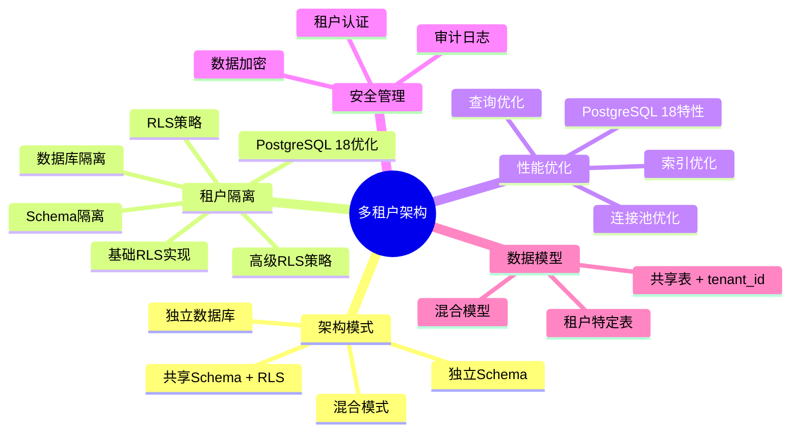
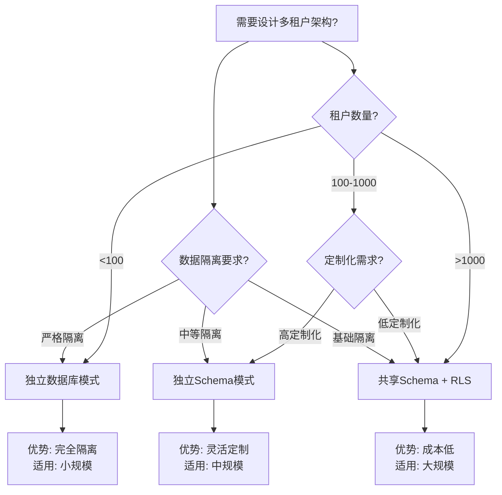

# PostgreSQL多租户架构完整指南

> **PostgreSQL版本**: 18.x
> **适用场景**: 多租户SaaS应用
> **参考案例**: [19-实战案例/04-多租户SaaS系统](../19-实战案例/04-多租户SaaS系统/README.md)

---

## 📊 知识体系思维导图



---

## 📊 多租户架构选型决策树



---

## 📊 多租户架构模式对比矩阵

| 架构模式 | 隔离级别 | 成本 | 性能 | 扩展性 | 维护复杂度 | 适用场景 |
| --- | --- | --- | --- | --- | --- | --- |
| **共享Schema + RLS** | ⭐⭐⭐ | 低 | ⭐⭐⭐⭐ | ⭐⭐⭐⭐⭐ | ⭐⭐ | 大规模SaaS (1000+租户) |
| **独立Schema** | ⭐⭐⭐⭐ | 中 | ⭐⭐⭐⭐ | ⭐⭐⭐⭐ | ⭐⭐⭐ | 中规模SaaS (100-1000租户) |
| **独立数据库** | ⭐⭐⭐⭐⭐ | 高 | ⭐⭐⭐⭐⭐ | ⭐⭐⭐ | ⭐⭐⭐⭐ | 小规模SaaS (<100租户) |
| **混合模式** | ⭐⭐⭐⭐ | 中-高 | ⭐⭐⭐⭐ | ⭐⭐⭐⭐ | ⭐⭐⭐⭐ | 复杂需求场景 |

---

## 📋 目录

- [PostgreSQL多租户架构完整指南](#postgresql多租户架构完整指南)
  - [📊 知识体系思维导图](#-知识体系思维导图)
  - [📊 多租户架构选型决策树](#-多租户架构选型决策树)
  - [📊 多租户架构模式对比矩阵](#-多租户架构模式对比矩阵)
  - [📋 目录](#-目录)
  - [1. 概述](#1-概述)
    - [1.1 什么是多租户架构？](#11-什么是多租户架构)
    - [1.2 多租户架构的优势](#12-多租户架构的优势)
    - [1.3 多租户架构的挑战](#13-多租户架构的挑战)
  - [2. 多租户架构设计](#2-多租户架构设计)
    - [2.1 架构模式](#21-架构模式)
      - [模式1：共享Schema + RLS（推荐）⭐](#模式1共享schema--rls推荐)
      - [模式2：独立Schema](#模式2独立schema)
      - [模式3：独立数据库](#模式3独立数据库)
  - [3. 租户隔离策略](#3-租户隔离策略)
    - [3.1 RLS策略（推荐方案）](#31-rls策略推荐方案)
      - [3.1.1 基础RLS实现](#311-基础rls实现)
      - [3.1.2 PostgreSQL 18 RLS性能优化](#312-postgresql-18-rls性能优化)
      - [3.1.3 高级RLS策略](#313-高级rls策略)
    - [3.2 Schema隔离](#32-schema隔离)
    - [3.3 数据库隔离](#33-数据库隔离)
  - [4. 多租户性能优化](#4-多租户性能优化)
    - [4.1 索引优化](#41-索引优化)
    - [4.2 连接池优化](#42-连接池优化)
    - [4.3 查询优化](#43-查询优化)
    - [4.4 PostgreSQL 18性能特性](#44-postgresql-18性能特性)
  - [5. 多租户安全管理](#5-多租户安全管理)
    - [5.1 租户认证](#51-租户认证)
    - [5.2 审计日志](#52-审计日志)
    - [5.3 数据加密](#53-数据加密)
  - [6. 多租户数据模型设计](#6-多租户数据模型设计)
    - [6.1 数据模型模式](#61-数据模型模式)
      - [模式1：共享表 + tenant\_id](#模式1共享表--tenant_id)
      - [模式2：租户特定表](#模式2租户特定表)
    - [6.2 数据模型最佳实践](#62-数据模型最佳实践)
  - [7. 最佳实践](#7-最佳实践)
    - [7.1 架构选择](#71-架构选择)
    - [7.2 性能优化](#72-性能优化)
    - [7.3 安全管理](#73-安全管理)
    - [7.4 监控与告警](#74-监控与告警)
  - [8. 参考案例](#8-参考案例)
    - [8.1 实战案例](#81-实战案例)
    - [8.2 相关文档](#82-相关文档)

---

## 1. 概述

### 1.1 什么是多租户架构？

多租户架构（Multi-Tenant Architecture）是一种软件架构模式，允许单个应用实例为多个租户（客户）提供服务，同时保持数据隔离和安全性。

### 1.2 多租户架构的优势

- ✅ **成本效益**: 共享基础设施，降低运营成本
- ✅ **易于维护**: 单一代码库，统一更新
- ✅ **快速扩展**: 新租户快速接入
- ✅ **资源利用**: 提高资源利用率

### 1.3 多租户架构的挑战

- ⚠️ **数据隔离**: 确保租户数据完全隔离
- ⚠️ **性能影响**: 大量租户可能影响性能
- ⚠️ **安全风险**: 需要严格的安全策略
- ⚠️ **定制化**: 不同租户的定制需求

---

## 2. 多租户架构设计

### 2.1 架构模式

PostgreSQL支持三种主要的多租户架构模式：

#### 模式1：共享Schema + RLS（推荐）⭐

**特点**:

- 所有租户共享同一个Schema
- 使用Row Level Security (RLS)实现数据隔离
- 通过`tenant_id`列区分租户

**优势**:

- ✅ 简单易实现
- ✅ 维护成本低
- ✅ PostgreSQL 18 RLS性能优化显著

**适用场景**:

- 租户数量：1000+
- 数据量：中等
- 定制化需求：低

#### 模式2：独立Schema

**特点**:

- 每个租户拥有独立的Schema
- 通过`search_path`动态切换Schema

**优势**:

- ✅ 数据隔离更彻底
- ✅ 支持租户级别的定制

**劣势**:

- ❌ Schema数量限制（PostgreSQL默认10000个）
- ❌ 管理复杂度高

**适用场景**:

- 租户数量：<1000
- 数据量：大
- 定制化需求：高

#### 模式3：独立数据库

**特点**:

- 每个租户拥有独立的数据库

**优势**:

- ✅ 数据隔离最彻底
- ✅ 支持完全独立的配置

**劣势**:

- ❌ 资源消耗大
- ❌ 管理复杂度最高

**适用场景**:

- 租户数量：<100
- 数据量：超大
- 合规性要求：极高

---

## 3. 租户隔离策略

### 3.1 RLS策略（推荐方案）

#### 3.1.1 基础RLS实现

```sql
-- 创建表，包含tenant_id
CREATE TABLE orders (
    order_id BIGSERIAL PRIMARY KEY,
    tenant_id INT NOT NULL,
    customer_id BIGINT,
    amount NUMERIC(10,2),
    created_at TIMESTAMPTZ DEFAULT NOW()
);

-- 创建索引（重要：提升RLS性能）
CREATE INDEX idx_orders_tenant_id ON orders(tenant_id);

-- 启用RLS
ALTER TABLE orders ENABLE ROW LEVEL SECURITY;

-- 创建租户隔离策略
CREATE POLICY tenant_isolation ON orders
    FOR ALL
    USING (tenant_id = current_setting('app.tenant_id')::INT);

-- 设置租户ID（应用层设置）
SET app.tenant_id = '1001';
SELECT * FROM orders;  -- 自动过滤，只返回租户1001的数据
```

#### 3.1.2 PostgreSQL 18 RLS性能优化

PostgreSQL 18对RLS进行了重大性能优化：

- **策略下推**: 策略计算下推到查询执行层
- **策略缓存**: 策略结果缓存，减少重复计算
- **性能提升**: 查询时间降低20-50%

```sql
-- PostgreSQL 18自动优化RLS策略
-- 无需额外配置，性能自动提升
```

#### 3.1.3 高级RLS策略

```sql
-- 支持复杂条件的策略
CREATE POLICY tenant_isolation_advanced ON orders
    FOR ALL
    USING (
        tenant_id = current_setting('app.tenant_id')::INT
        AND status != 'deleted'  -- 额外条件
    );

-- 支持不同操作的策略
CREATE POLICY tenant_select ON orders
    FOR SELECT
    USING (tenant_id = current_setting('app.tenant_id')::INT);

CREATE POLICY tenant_insert ON orders
    FOR INSERT
    WITH CHECK (tenant_id = current_setting('app.tenant_id')::INT);
```

### 3.2 Schema隔离

```sql
-- 为每个租户创建Schema
CREATE SCHEMA tenant_1001;
CREATE SCHEMA tenant_1002;

-- 在Schema中创建表
CREATE TABLE tenant_1001.orders (
    order_id BIGSERIAL PRIMARY KEY,
    customer_id BIGINT,
    amount NUMERIC(10,2)
);

-- 动态切换Schema
SET search_path TO tenant_1001;
SELECT * FROM orders;  -- 自动访问tenant_1001.orders
```

### 3.3 数据库隔离

```sql
-- 为每个租户创建数据库
CREATE DATABASE tenant_1001;
CREATE DATABASE tenant_1002;

-- 连接到特定租户数据库
\c tenant_1001
```

---

## 4. 多租户性能优化

### 4.1 索引优化

```sql
-- tenant_id必须建立索引
CREATE INDEX idx_orders_tenant_id ON orders(tenant_id);

-- 复合索引优化查询
CREATE INDEX idx_orders_tenant_status ON orders(tenant_id, status);

-- 部分索引（针对活跃租户）
CREATE INDEX idx_orders_active_tenant
ON orders(tenant_id, created_at)
WHERE status = 'active';
```

### 4.2 连接池优化

```sql
-- 使用PgBouncer或Pgpool-II
-- 配置连接池参数
pool_mode = transaction
max_client_conn = 1000
default_pool_size = 25
```

### 4.3 查询优化

```sql
-- 使用参数化查询
PREPARE get_orders(INT) AS
SELECT * FROM orders
WHERE tenant_id = $1
AND created_at > NOW() - INTERVAL '30 days';

EXECUTE get_orders(1001);

-- 使用物化视图（针对报表查询）
CREATE MATERIALIZED VIEW mv_tenant_stats AS
SELECT
    tenant_id,
    COUNT(*) as order_count,
    SUM(amount) as total_amount
FROM orders
GROUP BY tenant_id;

CREATE UNIQUE INDEX ON mv_tenant_stats(tenant_id);
REFRESH MATERIALIZED VIEW CONCURRENTLY mv_tenant_stats;
```

### 4.4 PostgreSQL 18性能特性

```sql
-- 内置连接池（pg_stat_activity增强）
-- 自动查询优化
-- RLS性能提升（自动）
```

---

## 5. 多租户安全管理

### 5.1 租户认证

```sql
-- 使用角色映射租户
CREATE ROLE tenant_1001;
CREATE ROLE tenant_1002;

-- 授予权限
GRANT SELECT, INSERT, UPDATE, DELETE ON orders TO tenant_1001;

-- 应用层认证后设置角色
SET ROLE tenant_1001;
```

### 5.2 审计日志

```sql
-- 启用审计日志
ALTER SYSTEM SET log_statement = 'all';
ALTER SYSTEM SET log_line_prefix = '%t [%p]: [%l-1] user=%u,db=%d,app=%a,client=%h ';

-- 使用pgAudit扩展（推荐）
CREATE EXTENSION pgaudit;
ALTER DATABASE mydb SET pgaudit.log = 'all';
```

### 5.3 数据加密

```sql
-- 使用透明数据加密（TDE）
-- PostgreSQL 15+支持

-- 使用列级加密
CREATE EXTENSION pgcrypto;

CREATE TABLE sensitive_data (
    id SERIAL PRIMARY KEY,
    tenant_id INT NOT NULL,
    encrypted_data BYTEA
);

-- 加密存储
INSERT INTO sensitive_data (tenant_id, encrypted_data)
VALUES (1001, pgp_sym_encrypt('sensitive data', 'encryption_key'));
```

---

## 6. 多租户数据模型设计

### 6.1 数据模型模式

#### 模式1：共享表 + tenant_id

```sql
CREATE TABLE orders (
    order_id BIGSERIAL PRIMARY KEY,
    tenant_id INT NOT NULL,
    customer_id BIGINT,
    amount NUMERIC(10,2),
    created_at TIMESTAMPTZ DEFAULT NOW()
);

-- 所有租户共享同一张表
-- 通过tenant_id区分
```

#### 模式2：租户特定表

```sql
-- 为每个租户创建表
CREATE TABLE orders_1001 (
    order_id BIGSERIAL PRIMARY KEY,
    customer_id BIGINT,
    amount NUMERIC(10,2)
);

CREATE TABLE orders_1002 (
    order_id BIGSERIAL PRIMARY KEY,
    customer_id BIGINT,
    amount NUMERIC(10,2)
);
```

### 6.2 数据模型最佳实践

```sql
-- 1. tenant_id必须NOT NULL
CREATE TABLE orders (
    tenant_id INT NOT NULL,
    ...
);

-- 2. tenant_id建立索引
CREATE INDEX idx_orders_tenant_id ON orders(tenant_id);

-- 3. 外键约束包含tenant_id
CREATE TABLE order_items (
    item_id BIGSERIAL PRIMARY KEY,
    order_id BIGINT NOT NULL,
    tenant_id INT NOT NULL,
    FOREIGN KEY (order_id, tenant_id)
        REFERENCES orders(order_id, tenant_id)
);
```

---

## 7. 最佳实践

### 7.1 架构选择

| 场景 | 推荐方案 | 原因 |
| --- | --- | --- |
| 租户数 < 100 | 独立数据库 | 数据隔离最彻底 |
| 租户数 100-1000 | 独立Schema | 平衡隔离和管理 |
| 租户数 > 1000 | 共享Schema + RLS | 成本效益最高 |

### 7.2 性能优化

- ✅ **索引优化**: tenant_id必须建立索引
- ✅ **连接池**: 使用PgBouncer或Pgpool-II
- ✅ **查询优化**: 使用参数化查询
- ✅ **物化视图**: 针对报表查询使用物化视图

### 7.3 安全管理

- ✅ **RLS策略**: 所有表启用RLS
- ✅ **审计日志**: 启用完整的审计日志
- ✅ **数据加密**: 敏感数据加密存储
- ✅ **权限控制**: 严格的权限控制

### 7.4 监控与告警

```sql
-- 监控租户数据量
SELECT
    tenant_id,
    COUNT(*) as row_count,
    pg_size_pretty(pg_total_relation_size('orders')) as table_size
FROM orders
GROUP BY tenant_id
ORDER BY row_count DESC;

-- 监控租户查询性能
SELECT
    tenant_id,
    COUNT(*) as query_count,
    AVG(execution_time) as avg_time
FROM pg_stat_statements
WHERE query LIKE '%orders%'
GROUP BY tenant_id;
```

---

## 8. 参考案例

### 8.1 实战案例

- **[19-实战案例/04-多租户SaaS系统](../19-实战案例/04-多租户SaaS系统/README.md)**
  - 完整的多租户SaaS系统实现
  - 包含RLS策略、数据隔离方案
  - PostgreSQL 18特性应用

### 8.2 相关文档

- [05-安全与合规/安全加固](../05-安全与合规/安全加固/README.md) - 安全加固指南
- [12-监控与诊断](../12-监控与诊断/README.md) - 监控和诊断方法
- [资源隔离与配额管理](./资源隔离与配额管理.md) - 资源管理

---

**最后更新**: 2025年1月
**状态**: ✅ 完成
**参考**: 19-实战案例/04-多租户SaaS系统
