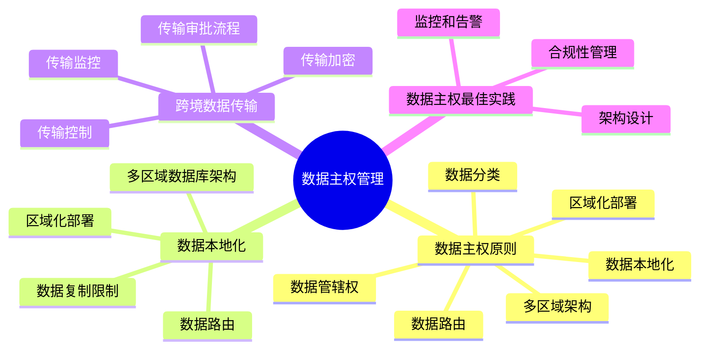
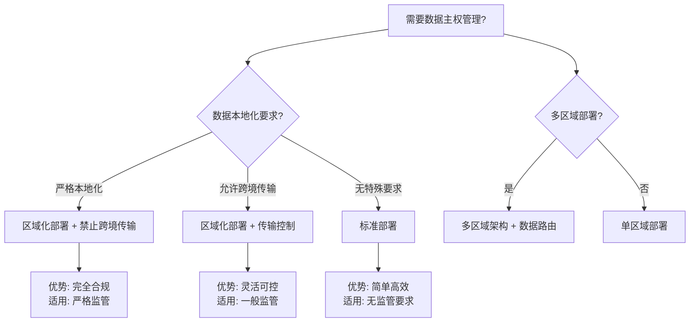

# PostgreSQL数据主权管理指南

> **PostgreSQL版本**: 17+/18+
> **适用场景**: 多区域部署、数据本地化要求
> **难度等级**: ⭐⭐⭐⭐ 高级

---

## 📊 知识体系思维导图



---

## 📊 数据主权方案选型决策树



---

## 📊 数据主权方案对比矩阵

| 数据主权方案 | 本地化级别 | 跨境传输 | 实施复杂度 | 成本 | 适用场景 |
| --- | --- | --- | --- | --- | --- |
| **严格本地化** | ⭐⭐⭐⭐⭐ | 禁止 | ⭐⭐⭐⭐ | 高 | 严格监管地区 |
| **区域化部署** | ⭐⭐⭐⭐ | 受控 | ⭐⭐⭐ | 中-高 | 一般监管要求 |
| **标准部署** | ⭐⭐ | 允许 | ⭐⭐ | 低 | 无特殊要求 |
| **混合模式** | ⭐⭐⭐⭐ | 部分允许 | ⭐⭐⭐⭐ | 中-高 | 复杂合规需求 |

---

## 📋 目录

- [PostgreSQL数据主权管理指南](#postgresql数据主权管理指南)
  - [📊 知识体系思维导图](#-知识体系思维导图)
  - [📊 数据主权方案选型决策树](#-数据主权方案选型决策树)
  - [📊 数据主权方案对比矩阵](#-数据主权方案对比矩阵)
  - [📋 目录](#-目录)
  - [1. 概述](#1-概述)
    - [1.1 什么是数据主权？](#11-什么是数据主权)
    - [1.2 数据主权的重要性](#12-数据主权的重要性)
  - [2. 数据主权概念](#2-数据主权概念)
    - [2.1 数据主权原则](#21-数据主权原则)
      - [2.1.1 数据本地化](#211-数据本地化)
      - [2.1.2 数据分类](#212-数据分类)
      - [4.1.2 传输加密](#412-传输加密)
    - [4.2 传输监控](#42-传输监控)
  - [5. 数据主权最佳实践](#5-数据主权最佳实践)
    - [5.1 架构设计](#51-架构设计)
    - [5.2 合规性管理](#52-合规性管理)
    - [5.3 监控和告警](#53-监控和告警)
  - [📚 相关文档](#-相关文档)

---

## 1. 概述

### 1.1 什么是数据主权？

数据主权是指国家或地区对其境内数据拥有控制权和管辖权的概念。

**数据主权要求**:

- ✅ **数据本地化**: 数据必须存储在特定地区
- ✅ **跨境传输限制**: 限制或禁止数据跨境传输
- ✅ **数据访问控制**: 控制谁可以访问数据
- ✅ **数据管辖权**: 数据受当地法律管辖

### 1.2 数据主权的重要性

- **法律合规**: 遵守数据保护法规
- **国家安全**: 保护国家重要数据
- **隐私保护**: 保护个人隐私
- **商业风险**: 降低数据泄露风险

---

## 2. 数据主权概念

### 2.1 数据主权原则

#### 2.1.1 数据本地化

```sql
-- 按地区创建表空间（带错误处理）
DO $$
BEGIN
    BEGIN
        IF NOT EXISTS (SELECT 1 FROM pg_tablespace WHERE spcname = 'eu_tablespace') THEN
            CREATE TABLESPACE eu_tablespace LOCATION '/data/eu';
            RAISE NOTICE '表空间 eu_tablespace 创建成功';
        ELSE
            RAISE NOTICE '表空间 eu_tablespace 已存在';
        END IF;
    EXCEPTION
        WHEN duplicate_object THEN
            RAISE WARNING '表空间 eu_tablespace 已存在';
        WHEN insufficient_privilege THEN
            RAISE WARNING '权限不足，无法创建表空间';
        WHEN OTHERS THEN
            RAISE WARNING '创建表空间 eu_tablespace 失败: %', SQLERRM;
            RAISE;
    END;

    BEGIN
        IF NOT EXISTS (SELECT 1 FROM pg_tablespace WHERE spcname = 'us_tablespace') THEN
            CREATE TABLESPACE us_tablespace LOCATION '/data/us';
            RAISE NOTICE '表空间 us_tablespace 创建成功';
        ELSE
            RAISE NOTICE '表空间 us_tablespace 已存在';
        END IF;
    EXCEPTION
        WHEN duplicate_object THEN
            RAISE WARNING '表空间 us_tablespace 已存在';
        WHEN insufficient_privilege THEN
            RAISE WARNING '权限不足，无法创建表空间';
        WHEN OTHERS THEN
            RAISE WARNING '创建表空间 us_tablespace 失败: %', SQLERRM;
            RAISE;
    END;

    BEGIN
        IF NOT EXISTS (SELECT 1 FROM pg_tablespace WHERE spcname = 'asia_tablespace') THEN
            CREATE TABLESPACE asia_tablespace LOCATION '/data/asia';
            RAISE NOTICE '表空间 asia_tablespace 创建成功';
        ELSE
            RAISE NOTICE '表空间 asia_tablespace 已存在';
        END IF;
    EXCEPTION
        WHEN duplicate_object THEN
            RAISE WARNING '表空间 asia_tablespace 已存在';
        WHEN insufficient_privilege THEN
            RAISE WARNING '权限不足，无法创建表空间';
        WHEN OTHERS THEN
            RAISE WARNING '创建表空间 asia_tablespace 失败: %', SQLERRM;
            RAISE;
    END;
END $$;

-- 按地区存储数据（带错误处理）
DO $$
BEGIN
    BEGIN
        IF NOT EXISTS (SELECT 1 FROM pg_tablespace WHERE spcname = 'eu_tablespace') THEN
            RAISE EXCEPTION '表空间 eu_tablespace 不存在';
        END IF;

        IF EXISTS (SELECT 1 FROM information_schema.tables WHERE table_schema = 'public' AND table_name = 'eu_users') THEN
            RAISE WARNING '表 eu_users 已存在';
        ELSE
            CREATE TABLE eu_users (
                id SERIAL PRIMARY KEY,
                username TEXT,
                email TEXT,
                region TEXT DEFAULT 'EU'
            ) TABLESPACE eu_tablespace;
            RAISE NOTICE '表 eu_users 创建成功';
        END IF;
    EXCEPTION
        WHEN duplicate_table THEN
            RAISE WARNING '表 eu_users 已存在';
        WHEN undefined_object THEN
            RAISE WARNING '表空间 eu_tablespace 不存在';
        WHEN OTHERS THEN
            RAISE WARNING '创建表 eu_users 失败: %', SQLERRM;
            RAISE;
    END;

    BEGIN
        IF NOT EXISTS (SELECT 1 FROM pg_tablespace WHERE spcname = 'us_tablespace') THEN
            RAISE EXCEPTION '表空间 us_tablespace 不存在';
        END IF;

        IF EXISTS (SELECT 1 FROM information_schema.tables WHERE table_schema = 'public' AND table_name = 'us_users') THEN
            RAISE WARNING '表 us_users 已存在';
        ELSE
            CREATE TABLE us_users (
                id SERIAL PRIMARY KEY,
                username TEXT,
                email TEXT,
                region TEXT DEFAULT 'US'
            ) TABLESPACE us_tablespace;
            RAISE NOTICE '表 us_users 创建成功';
        END IF;
    EXCEPTION
        WHEN duplicate_table THEN
            RAISE WARNING '表 us_users 已存在';
        WHEN undefined_object THEN
            RAISE WARNING '表空间 us_tablespace 不存在';
        WHEN OTHERS THEN
            RAISE WARNING '创建表 us_users 失败: %', SQLERRM;
            RAISE;
    END;
END $$;
```

#### 2.1.2 数据分类

```sql
-- 数据分类表（带错误处理）
DO $$
BEGIN
    BEGIN
        IF EXISTS (SELECT 1 FROM information_schema.tables WHERE table_schema = 'public' AND table_name = 'data_classification') THEN
            RAISE WARNING '表 data_classification 已存在';
        ELSE
            CREATE TABLE data_classification (
                id SERIAL PRIMARY KEY,
                table_name TEXT NOT NULL,
                data_type TEXT,  -- 'personal', 'sensitive', 'public'
                region_requirement TEXT,  -- 'EU', 'US', 'ASIA', 'LOCAL'
                cross_border_allowed BOOLEAN DEFAULT false,
                encryption_required BOOLEAN DEFAULT true
            );
            RAISE NOTICE '表 data_classification 创建成功';
        END IF;
    EXCEPTION
        WHEN duplicate_table THEN
            RAISE WARNING '表 data_classification 已存在';
        WHEN OTHERS THEN
            RAISE WARNING '创建表 data_classification 失败: %', SQLERRM;
            RAISE;
    END;
END $$;

-- 插入数据分类（带错误处理）
DO $$
BEGIN
    BEGIN
        IF NOT EXISTS (SELECT 1 FROM information_schema.tables WHERE table_schema = 'public' AND table_name = 'data_classification') THEN
            RAISE WARNING '表 data_classification 不存在';
            RETURN;
        END IF;

        INSERT INTO data_classification (table_name, data_type, region_requirement, cross_border_allowed, encryption_required)
        VALUES
            ('eu_users', 'personal', 'EU', false, true),
            ('us_users', 'personal', 'US', false, true),
            ('public_content', 'public', 'GLOBAL', true, false)
        ON CONFLICT DO NOTHING;
        RAISE NOTICE '数据分类已插入';
    EXCEPTION
        WHEN undefined_table THEN
            RAISE WARNING '表 data_classification 不存在';
        WHEN OTHERS THEN
            RAISE WARNING '插入数据分类失败: %', SQLERRM;
            RAISE;
    END;
END $$;

### 2.2 数据管辖权

```sql
-- 数据管辖权表（带错误处理）
DO $$
BEGIN
    BEGIN
        IF EXISTS (SELECT 1 FROM information_schema.tables WHERE table_schema = 'public' AND table_name = 'data_jurisdiction') THEN
            RAISE WARNING '表 data_jurisdiction 已存在';
        ELSE
            CREATE TABLE data_jurisdiction (
                id SERIAL PRIMARY KEY,
                data_region TEXT NOT NULL,
                jurisdiction_country TEXT NOT NULL,
                applicable_laws TEXT[],
                data_retention_period INTERVAL,
                cross_border_rules TEXT
            );
            RAISE NOTICE '表 data_jurisdiction 创建成功';
        END IF;
    EXCEPTION
        WHEN duplicate_table THEN
            RAISE WARNING '表 data_jurisdiction 已存在';
        WHEN OTHERS THEN
            RAISE WARNING '创建表 data_jurisdiction 失败: %', SQLERRM;
            RAISE;
    END;
END $$;

-- 插入管辖权规则（带错误处理）
DO $$
BEGIN
    BEGIN
        IF NOT EXISTS (SELECT 1 FROM information_schema.tables WHERE table_schema = 'public' AND table_name = 'data_jurisdiction') THEN
            RAISE WARNING '表 data_jurisdiction 不存在';
            RETURN;
        END IF;

        INSERT INTO data_jurisdiction (data_region, jurisdiction_country, applicable_laws, data_retention_period, cross_border_rules)
        VALUES
            ('EU', 'Germany', ARRAY['GDPR'], INTERVAL '7 years', 'Requires explicit consent'),
            ('US', 'United States', ARRAY['CCPA', 'State Laws'], INTERVAL '5 years', 'Requires legal basis')
        ON CONFLICT DO NOTHING;
        RAISE NOTICE '管辖权规则已插入';
    EXCEPTION
        WHEN undefined_table THEN
            RAISE WARNING '表 data_jurisdiction 不存在';
        WHEN OTHERS THEN
            RAISE WARNING '插入管辖权规则失败: %', SQLERRM;
            RAISE;
    END;
END $$;

---

## 3. 数据本地化

### 3.1 区域化部署

#### 3.1.1 多区域数据库架构

```sql
-- 欧洲区域数据库（带错误处理）
DO $$
BEGIN
    BEGIN
        IF NOT EXISTS (SELECT 1 FROM pg_database WHERE datname = 'eu_production') THEN
            CREATE DATABASE eu_production;
            RAISE NOTICE '数据库 eu_production 创建成功';
        ELSE
            RAISE NOTICE '数据库 eu_production 已存在';
        END IF;
    EXCEPTION
        WHEN duplicate_database THEN
            RAISE WARNING '数据库 eu_production 已存在';
        WHEN insufficient_privilege THEN
            RAISE WARNING '权限不足，无法创建数据库';
        WHEN OTHERS THEN
            RAISE WARNING '创建数据库 eu_production 失败: %', SQLERRM;
            RAISE;
    END;
END $$;

-- 美国区域数据库（带错误处理）
DO $$
BEGIN
    BEGIN
        IF NOT EXISTS (SELECT 1 FROM pg_database WHERE datname = 'us_production') THEN
            CREATE DATABASE us_production;
            RAISE NOTICE '数据库 us_production 创建成功';
        ELSE
            RAISE NOTICE '数据库 us_production 已存在';
        END IF;
    EXCEPTION
        WHEN duplicate_database THEN
            RAISE WARNING '数据库 us_production 已存在';
        WHEN insufficient_privilege THEN
            RAISE WARNING '权限不足，无法创建数据库';
        WHEN OTHERS THEN
            RAISE WARNING '创建数据库 us_production 失败: %', SQLERRM;
            RAISE;
    END;
END $$;

-- 亚洲区域数据库（带错误处理）
DO $$
BEGIN
    BEGIN
        IF NOT EXISTS (SELECT 1 FROM pg_database WHERE datname = 'asia_production') THEN
            CREATE DATABASE asia_production;
            RAISE NOTICE '数据库 asia_production 创建成功';
        ELSE
            RAISE NOTICE '数据库 asia_production 已存在';
        END IF;
    EXCEPTION
        WHEN duplicate_database THEN
            RAISE WARNING '数据库 asia_production 已存在';
        WHEN insufficient_privilege THEN
            RAISE WARNING '权限不足，无法创建数据库';
        WHEN OTHERS THEN
            RAISE WARNING '创建数据库 asia_production 失败: %', SQLERRM;
            RAISE;
    END;
END $$;

-- 注意：在每个区域创建相同的表结构，但数据存储在各自的区域

#### 3.1.2 数据路由

```sql
-- 数据路由函数（带错误处理）
CREATE OR REPLACE FUNCTION route_data_by_region(
    p_user_region TEXT,
    p_data_type TEXT
)
RETURNS TEXT AS $$
DECLARE
    v_target_region TEXT;
BEGIN
    BEGIN
        -- 参数验证
        IF p_user_region IS NULL OR p_data_type IS NULL THEN
            RAISE EXCEPTION '参数不能为NULL: p_user_region=%, p_data_type=%', p_user_region, p_data_type;
        END IF;

        -- 根据用户区域和数据类型确定目标区域
        SELECT region_requirement INTO v_target_region
        FROM data_classification
        WHERE data_type = p_data_type;

        -- 如果未找到数据分类，返回错误
        IF v_target_region IS NULL THEN
            RAISE EXCEPTION '未找到数据类型 % 的分类信息', p_data_type;
        END IF;

        -- 如果用户区域与要求区域不匹配，返回错误
        IF p_user_region != v_target_region AND v_target_region != 'GLOBAL' THEN
            RAISE EXCEPTION 'Data must be stored in region: %', v_target_region;
        END IF;

        RETURN v_target_region;
    EXCEPTION
        WHEN NO_DATA_FOUND THEN
            RAISE EXCEPTION '未找到数据类型 % 的分类信息', p_data_type;
        WHEN OTHERS THEN
            RAISE;
    END;
END;
$$ LANGUAGE plpgsql;

### 3.2 数据复制限制

```sql
-- 检查数据复制权限（带错误处理）
CREATE OR REPLACE FUNCTION check_replication_allowed(
    p_source_region TEXT,
    p_target_region TEXT,
    p_table_name TEXT
)
RETURNS BOOLEAN AS $$
DECLARE
    v_cross_border_allowed BOOLEAN;
BEGIN
    BEGIN
        -- 参数验证
        IF p_source_region IS NULL OR p_target_region IS NULL OR p_table_name IS NULL THEN
            RAISE EXCEPTION '参数不能为NULL';
        END IF;

        -- 检查是否允许跨境复制
        SELECT cross_border_allowed INTO v_cross_border_allowed
        FROM data_classification
        WHERE table_name = p_table_name;

        -- 如果未找到数据分类，默认不允许复制
        IF v_cross_border_allowed IS NULL THEN
            RAISE WARNING '未找到表 % 的分类信息，默认不允许复制', p_table_name;
            RETURN false;
        END IF;

        -- 如果是同一区域，允许复制
        IF p_source_region = p_target_region THEN
            RETURN true;
        END IF;

        -- 如果允许跨境，检查是否有法律依据
        IF v_cross_border_allowed THEN
            -- 检查是否有合法的跨境传输依据
            -- 注意：假设cross_border_consents表存在，如果不存在会返回false
            RETURN EXISTS(
                SELECT 1
                FROM cross_border_consents
                WHERE table_name = p_table_name
                AND consent_given = true
                AND expiration_date > CURRENT_DATE
            );
        END IF;

        RETURN false;
    EXCEPTION
        WHEN undefined_table THEN
            RAISE WARNING '表 cross_border_consents 不存在，无法检查法律依据';
            RETURN false;
        WHEN OTHERS THEN
            RAISE WARNING '检查复制权限失败: %', SQLERRM;
            RETURN false;
    END;
END;
$$ LANGUAGE plpgsql;

---

## 4. 跨境数据传输

### 4.1 传输控制

#### 4.1.1 传输审批流程

```sql
-- 跨境传输申请表（带错误处理）
DO $$
BEGIN
    BEGIN
        IF EXISTS (SELECT 1 FROM information_schema.tables WHERE table_schema = 'public' AND table_name = 'cross_border_transfer_requests') THEN
            RAISE WARNING '表 cross_border_transfer_requests 已存在';
        ELSE
            CREATE TABLE cross_border_transfer_requests (
                id SERIAL PRIMARY KEY,
                request_id TEXT UNIQUE,
                source_region TEXT NOT NULL,
                target_region TEXT NOT NULL,
                table_name TEXT NOT NULL,
                data_type TEXT,
                purpose TEXT,
                legal_basis TEXT,
                requested_by TEXT,
                approved_by TEXT,
                approval_date DATE,
                status TEXT DEFAULT 'pending',
                expiration_date DATE
            );
            RAISE NOTICE '表 cross_border_transfer_requests 创建成功';
        END IF;
    EXCEPTION
        WHEN duplicate_table THEN
            RAISE WARNING '表 cross_border_transfer_requests 已存在';
        WHEN OTHERS THEN
            RAISE WARNING '创建表 cross_border_transfer_requests 失败: %', SQLERRM;
            RAISE;
    END;
END $$;

-- 创建传输请求函数（带错误处理）
CREATE OR REPLACE FUNCTION request_cross_border_transfer(
    p_source_region TEXT,
    p_target_region TEXT,
    p_table_name TEXT,
    p_purpose TEXT,
    p_legal_basis TEXT
)
RETURNS TEXT AS $$
DECLARE
    v_request_id TEXT;
BEGIN
    BEGIN
        -- 参数验证
        IF p_source_region IS NULL OR p_target_region IS NULL OR p_table_name IS NULL THEN
            RAISE EXCEPTION '必需参数不能为NULL';
        END IF;

        -- 生成请求ID
        v_request_id := gen_random_uuid()::TEXT;

        -- 检查是否允许跨境传输
        IF NOT check_replication_allowed(p_source_region, p_target_region, p_table_name) THEN
            RAISE EXCEPTION 'Cross-border transfer not allowed for table: %', p_table_name;
        END IF;

        -- 创建传输请求
        INSERT INTO cross_border_transfer_requests (
            request_id,
            source_region,
            target_region,
            table_name,
            purpose,
            legal_basis,
            requested_by
        )
        VALUES (
            v_request_id,
            p_source_region,
            p_target_region,
            p_table_name,
            p_purpose,
            p_legal_basis,
            current_user
        );

        RETURN v_request_id;
    EXCEPTION
        WHEN unique_violation THEN
            RAISE EXCEPTION '请求ID冲突，请重试';
        WHEN foreign_key_violation THEN
            RAISE EXCEPTION '外键约束违反';
        WHEN OTHERS THEN
            RAISE;
    END;
END;
$$ LANGUAGE plpgsql;
```

#### 4.1.2 传输加密

```sql
-- 加密传输数据（带错误处理）
CREATE OR REPLACE FUNCTION export_encrypted_data(
    p_table_name TEXT,
    p_region TEXT,
    p_encryption_key TEXT
)
RETURNS TABLE (
    encrypted_data BYTEA,
    metadata JSONB
) AS $$
BEGIN
    BEGIN
        -- 参数验证
        IF p_table_name IS NULL OR p_region IS NULL OR p_encryption_key IS NULL THEN
            RAISE EXCEPTION '参数不能为NULL';
        END IF;

        -- 检查pgcrypto扩展
        IF NOT EXISTS (SELECT 1 FROM pg_extension WHERE extname = 'pgcrypto') THEN
            RAISE EXCEPTION 'pgcrypto 扩展未安装';
        END IF;

        -- 检查表是否存在
        IF NOT EXISTS (SELECT 1 FROM information_schema.tables WHERE table_schema = 'public' AND table_name = p_table_name) THEN
            RAISE EXCEPTION '表 % 不存在', p_table_name;
        END IF;

        RETURN QUERY
        EXECUTE format('
            SELECT
                pgp_sym_encrypt(to_jsonb(t.*)::TEXT, %L) as encrypted_data,
                jsonb_build_object(
                    ''table_name'', %L,
                    ''region'', %L,
                    ''export_time'', NOW()
                ) as metadata
            FROM %I t
            WHERE region = %L
        ', p_encryption_key, p_table_name, p_region, p_table_name, p_region);
    EXCEPTION
        WHEN undefined_table THEN
            RAISE EXCEPTION '表 % 不存在', p_table_name;
        WHEN undefined_function THEN
            RAISE EXCEPTION 'pgcrypto 扩展未安装，无法使用加密功能';
        WHEN OTHERS THEN
            RAISE;
    END;
END;
$$ LANGUAGE plpgsql;
```

### 4.2 传输监控

```sql
-- 传输日志表（带错误处理）
DO $$
BEGIN
    BEGIN
        IF EXISTS (SELECT 1 FROM information_schema.tables WHERE table_schema = 'public' AND table_name = 'cross_border_transfer_log') THEN
            RAISE WARNING '表 cross_border_transfer_log 已存在';
        ELSE
            CREATE TABLE cross_border_transfer_log (
                id BIGSERIAL PRIMARY KEY,
                transfer_time TIMESTAMPTZ DEFAULT NOW(),
                request_id TEXT,
                source_region TEXT,
                target_region TEXT,
                table_name TEXT,
                data_size BIGINT,
                transfer_status TEXT,
                error_message TEXT
            );
            RAISE NOTICE '表 cross_border_transfer_log 创建成功';
        END IF;
    EXCEPTION
        WHEN duplicate_table THEN
            RAISE WARNING '表 cross_border_transfer_log 已存在';
        WHEN OTHERS THEN
            RAISE WARNING '创建表 cross_border_transfer_log 失败: %', SQLERRM;
            RAISE;
    END;
END $$;

-- 记录传输（带错误处理）
CREATE OR REPLACE FUNCTION log_cross_border_transfer(
    p_request_id TEXT,
    p_source_region TEXT,
    p_target_region TEXT,
    p_table_name TEXT,
    p_data_size BIGINT,
    p_status TEXT,
    p_error TEXT DEFAULT NULL
)
RETURNS void AS $$
BEGIN
    BEGIN
        -- 参数验证
        IF p_source_region IS NULL OR p_target_region IS NULL OR p_table_name IS NULL OR p_status IS NULL THEN
            RAISE EXCEPTION '必需参数不能为NULL';
        END IF;

        INSERT INTO cross_border_transfer_log (
            request_id,
            source_region,
            target_region,
            table_name,
            data_size,
            transfer_status,
            error_message
        )
        VALUES (
            p_request_id,
            p_source_region,
            p_target_region,
            p_table_name,
            p_data_size,
            p_status,
            p_error
        );
    EXCEPTION
        WHEN undefined_table THEN
            RAISE EXCEPTION '表 cross_border_transfer_log 不存在';
        WHEN NOT_NULL_VIOLATION THEN
            RAISE EXCEPTION '必需字段不能为NULL';
        WHEN OTHERS THEN
            RAISE;
    END;
END;
$$ LANGUAGE plpgsql;
```

---

## 5. 数据主权最佳实践

### 5.1 架构设计

- ✅ **区域化部署**: 按地区部署独立的数据库实例
- ✅ **数据分类**: 明确数据分类和区域要求
- ✅ **访问控制**: 基于区域的访问控制
- ✅ **加密存储**: 敏感数据加密存储

### 5.2 合规性管理

- ✅ **法律依据**: 明确跨境传输的法律依据
- ✅ **审批流程**: 建立跨境传输审批流程
- ✅ **传输加密**: 所有跨境传输加密
- ✅ **审计追踪**: 完整记录所有数据传输

### 5.3 监控和告警

```sql
-- 监控数据位置（带错误处理和性能测试）
DO $$
DECLARE
    table_count INT;
BEGIN
    BEGIN
        IF NOT EXISTS (SELECT 1 FROM information_schema.tables WHERE table_schema = 'public' AND table_name = 'data_classification') THEN
            RAISE WARNING '表 data_classification 不存在，无法监控数据位置';
            RETURN;
        END IF;

        SELECT COUNT(*) INTO table_count FROM data_classification;
        RAISE NOTICE '找到 % 个数据分类记录', table_count;
    EXCEPTION
        WHEN OTHERS THEN
            RAISE WARNING '监控数据位置准备失败: %', SQLERRM;
            RAISE;
    END;
END $$;

EXPLAIN ANALYZE
SELECT
    region_requirement as region,
    COUNT(*) as table_count,
    SUM(pg_total_relation_size('public.'||table_name)) as total_size
FROM data_classification
GROUP BY region_requirement;

-- 检测违规传输（带错误处理和性能测试）
DO $$
DECLARE
    unauthorized_count INT;
BEGIN
    BEGIN
        IF NOT EXISTS (SELECT 1 FROM information_schema.tables WHERE table_schema = 'public' AND table_name = 'cross_border_transfer_log') THEN
            RAISE WARNING '表 cross_border_transfer_log 不存在，无法检测违规传输';
            RETURN;
        END IF;

        SELECT COUNT(*) INTO unauthorized_count
        FROM cross_border_transfer_log
        WHERE transfer_status = 'unauthorized'
        AND transfer_time >= NOW() - INTERVAL '24 hours';

        IF unauthorized_count > 0 THEN
            RAISE WARNING '发现 % 个违规传输记录（最近24小时）', unauthorized_count;
        ELSE
            RAISE NOTICE '未发现违规传输记录（最近24小时）';
        END IF;
    EXCEPTION
        WHEN OTHERS THEN
            RAISE WARNING '检测违规传输准备失败: %', SQLERRM;
            RAISE;
    END;
END $$;

EXPLAIN ANALYZE
SELECT
    transfer_time,
    source_region,
    target_region,
    table_name,
    transfer_status
FROM cross_border_transfer_log
WHERE transfer_status = 'unauthorized'
AND transfer_time >= NOW() - INTERVAL '24 hours';
```

---

## 📚 相关文档

- [企业级安全深化](./企业级安全深化.md) - 企业级安全深化
- [合规性管理](./合规性管理.md) - 合规性管理
- [多租户架构完整指南](./多租户架构完整指南.md) - 多租户架构

---

**最后更新**: 2025年1月
**状态**: ✅ 完成
