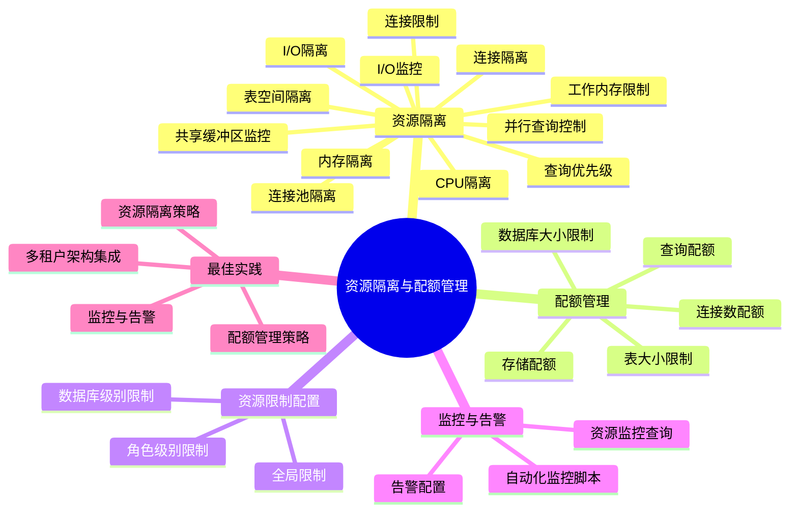
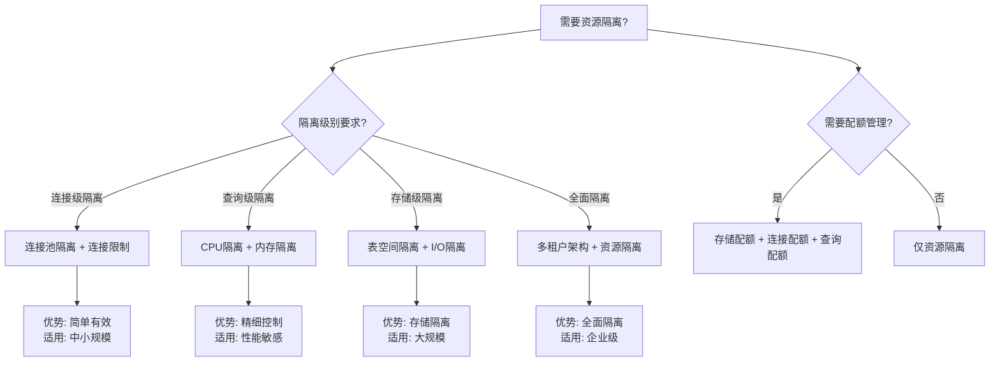

# PostgreSQL资源隔离与配额管理指南

> **PostgreSQL版本**: 17+/18+
> **适用场景**: 多租户系统、云数据库服务
> **难度等级**: ⭐⭐⭐⭐ 高级

---

## 📊 知识体系思维导图



---

## 📊 资源隔离方案选型决策树



---

## 📊 资源隔离方案对比矩阵

| 隔离方案 | 隔离级别 | 实现复杂度 | 性能影响 | 适用场景 | PostgreSQL支持 |
| --- | --- | --- | --- | --- | --- |
| **连接池隔离** | 连接级 | ⭐⭐ | 低 | 中小规模多租户 | ✅ PgBouncer |
| **连接限制** | 连接级 | ⭐ | 极低 | 基础隔离需求 | ✅ 原生支持 |
| **CPU隔离** | 查询级 | ⭐⭐⭐ | 中 | 性能敏感场景 | ⚠️ 部分支持 |
| **内存隔离** | 查询级 | ⭐⭐ | 低 | 内存敏感场景 | ✅ 原生支持 |
| **表空间隔离** | 存储级 | ⭐⭐ | 低 | 存储隔离需求 | ✅ 原生支持 |
| **多租户架构** | 全面 | ⭐⭐⭐⭐ | 中 | 企业级多租户 | ✅ RLS + 隔离 |

---

## 📋 目录

- [PostgreSQL资源隔离与配额管理指南](#postgresql资源隔离与配额管理指南)
  - [📊 知识体系思维导图](#-知识体系思维导图)
  - [📊 资源隔离方案选型决策树](#-资源隔离方案选型决策树)
  - [📊 资源隔离方案对比矩阵](#-资源隔离方案对比矩阵)
  - [📋 目录](#-目录)
  - [1. 概述](#1-概述)
    - [1.1 什么是资源隔离与配额管理？](#11-什么是资源隔离与配额管理)
    - [1.2 适用场景](#12-适用场景)
  - [2. 资源隔离机制](#2-资源隔离机制)
    - [2.1 连接隔离](#21-连接隔离)
      - [2.1.1 连接池隔离](#211-连接池隔离)
      - [2.1.2 连接限制](#212-连接限制)
    - [2.2 CPU隔离](#22-cpu隔离)
      - [2.2.1 查询优先级](#221-查询优先级)
      - [2.2.2 并行查询控制](#222-并行查询控制)
    - [2.3 内存隔离](#23-内存隔离)
      - [2.3.1 工作内存限制](#231-工作内存限制)
      - [2.3.2 共享缓冲区监控](#232-共享缓冲区监控)
    - [2.4 I/O隔离](#24-io隔离)
      - [2.4.1 表空间隔离](#241-表空间隔离)
      - [2.4.2 I/O监控](#242-io监控)
  - [3. 配额管理策略](#3-配额管理策略)
    - [3.1 存储配额](#31-存储配额)
      - [3.1.1 数据库大小限制](#311-数据库大小限制)
      - [3.1.2 表大小限制](#312-表大小限制)
    - [3.2 连接数配额](#32-连接数配额)
    - [3.3 查询配额](#33-查询配额)
  - [4. 资源限制配置](#4-资源限制配置)
    - [4.1 角色级别限制](#41-角色级别限制)
    - [4.2 数据库级别限制](#42-数据库级别限制)
    - [4.3 全局限制](#43-全局限制)
  - [5. 资源监控与告警](#5-资源监控与告警)
    - [5.1 资源监控查询](#51-资源监控查询)
    - [5.2 告警配置](#52-告警配置)
    - [5.3 自动化监控脚本](#53-自动化监控脚本)
  - [6. 最佳实践](#6-最佳实践)
    - [6.1 资源隔离策略](#61-资源隔离策略)
    - [6.2 配额管理策略](#62-配额管理策略)
    - [6.3 监控与告警](#63-监控与告警)
    - [6.4 多租户架构集成](#64-多租户架构集成)
  - [📚 相关文档](#-相关文档)

---

## 1. 概述

### 1.1 什么是资源隔离与配额管理？

资源隔离与配额管理是确保多租户系统或云数据库服务中，不同租户或用户能够公平、安全地使用数据库资源的关键机制。

**核心目标**:

- ✅ **资源隔离**: 防止一个租户的资源使用影响其他租户
- ✅ **配额管理**: 限制每个租户的资源使用上限
- ✅ **公平分配**: 确保资源公平分配
- ✅ **性能保障**: 保障关键租户的性能

### 1.2 适用场景

- 多租户SaaS应用
- 云数据库服务
- 共享数据库环境
- 企业内部分部门资源管理

---

## 2. 资源隔离机制

### 2.1 连接隔离

#### 2.1.1 连接池隔离

```sql
-- 使用PgBouncer实现连接池隔离
-- pgbouncer.ini配置
[databases]
tenant1 = host=localhost port=5432 dbname=mydb
tenant2 = host=localhost port=5432 dbname=mydb

[pgbouncer]
pool_mode = transaction
max_client_conn = 1000
default_pool_size = 25
reserve_pool_size = 5
```

#### 2.1.2 连接限制

```sql
-- 为每个租户设置连接限制
ALTER ROLE tenant1_user CONNECTION LIMIT 50;
ALTER ROLE tenant2_user CONNECTION LIMIT 50;

-- 查看当前连接数
SELECT
    usename,
    count(*) as connection_count
FROM pg_stat_activity
WHERE datname = 'mydb'
GROUP BY usename;
```

### 2.2 CPU隔离

#### 2.2.1 查询优先级

```sql
-- 使用pg_stat_statements监控CPU使用
CREATE EXTENSION pg_stat_statements;

-- 查看CPU密集型查询
SELECT
    userid::regrole,
    query,
    calls,
    total_exec_time,
    mean_exec_time
FROM pg_stat_statements
ORDER BY total_exec_time DESC
LIMIT 10;
```

#### 2.2.2 并行查询控制

```sql
-- 限制并行查询
ALTER ROLE tenant1_user SET max_parallel_workers_per_gather = 2;
ALTER ROLE tenant2_user SET max_parallel_workers_per_gather = 2;

-- 全局并行查询限制
ALTER SYSTEM SET max_parallel_workers = 8;
ALTER SYSTEM SET max_parallel_workers_per_gather = 4;
```

### 2.3 内存隔离

#### 2.3.1 工作内存限制

```sql
-- 为每个租户设置工作内存
ALTER ROLE tenant1_user SET work_mem = '64MB';
ALTER ROLE tenant2_user SET work_mem = '64MB';

-- 监控内存使用
SELECT
    usename,
    state,
    query,
    query_start
FROM pg_stat_activity
WHERE state = 'active';
```

#### 2.3.2 共享缓冲区监控

```sql
-- 查看共享缓冲区使用
SELECT
    schemaname,
    tablename,
    pg_size_pretty(pg_total_relation_size(schemaname||'.'||tablename)) as size
FROM pg_tables
ORDER BY pg_total_relation_size(schemaname||'.'||tablename) DESC
LIMIT 10;
```

### 2.4 I/O隔离

#### 2.4.1 表空间隔离

```sql
-- 为不同租户创建独立表空间
CREATE TABLESPACE tenant1_tablespace
LOCATION '/data/tenant1';

CREATE TABLESPACE tenant2_tablespace
LOCATION '/data/tenant2';

-- 在表空间创建表
CREATE TABLE tenant1.orders (
    id SERIAL PRIMARY KEY,
    ...
) TABLESPACE tenant1_tablespace;
```

#### 2.4.2 I/O监控

```sql
-- 监控I/O使用
SELECT
    schemaname,
    tablename,
    seq_scan,
    seq_tup_read,
    idx_scan,
    idx_tup_fetch
FROM pg_stat_user_tables
ORDER BY seq_scan DESC;
```

---

## 3. 配额管理策略

### 3.1 存储配额

#### 3.1.1 数据库大小限制

```sql
-- 监控数据库大小
SELECT
    datname,
    pg_size_pretty(pg_database_size(datname)) as size
FROM pg_database
ORDER BY pg_database_size(datname) DESC;

-- 设置警告阈值（通过监控系统）
-- 当数据库大小超过阈值时告警
```

#### 3.1.2 表大小限制

```sql
-- 监控表大小
SELECT
    schemaname,
    tablename,
    pg_size_pretty(pg_total_relation_size(schemaname||'.'||tablename)) as size
FROM pg_tables
WHERE schemaname = 'tenant1'
ORDER BY pg_total_relation_size(schemaname||'.'||tablename) DESC;
```

### 3.2 连接数配额

```sql
-- 设置连接数配额
ALTER ROLE tenant1_user CONNECTION LIMIT 50;
ALTER ROLE tenant2_user CONNECTION LIMIT 50;

-- 监控连接数使用
SELECT
    usename,
    count(*) as current_connections,
    (SELECT rolconnlimit FROM pg_roles WHERE rolname = usename) as max_connections
FROM pg_stat_activity
WHERE datname = 'mydb'
GROUP BY usename;
```

### 3.3 查询配额

```sql
-- 使用pg_stat_statements监控查询
SELECT
    userid::regrole,
    count(*) as query_count,
    sum(calls) as total_calls
FROM pg_stat_statements
WHERE userid IN (
    SELECT oid FROM pg_roles WHERE rolname LIKE 'tenant%'
)
GROUP BY userid;
```

---

## 4. 资源限制配置

### 4.1 角色级别限制

```sql
-- 创建租户角色
CREATE ROLE tenant1_user WITH LOGIN PASSWORD 'password';
CREATE ROLE tenant2_user WITH LOGIN PASSWORD 'password';

-- 设置资源限制
ALTER ROLE tenant1_user SET work_mem = '64MB';
ALTER ROLE tenant1_user SET maintenance_work_mem = '256MB';
ALTER ROLE tenant1_user SET max_parallel_workers_per_gather = 2;
ALTER ROLE tenant1_user CONNECTION LIMIT 50;
```

### 4.2 数据库级别限制

```sql
-- 为特定数据库设置限制
ALTER DATABASE tenant1_db SET work_mem = '64MB';
ALTER DATABASE tenant1_db SET max_connections = 100;
```

### 4.3 全局限制

```sql
-- 全局资源限制
ALTER SYSTEM SET max_connections = 1000;
ALTER SYSTEM SET shared_buffers = '8GB';
ALTER SYSTEM SET work_mem = '64MB';
ALTER SYSTEM SET maintenance_work_mem = '1GB';
```

---

## 5. 资源监控与告警

### 5.1 资源监控查询

```sql
-- 监控连接数
SELECT
    datname,
    count(*) as connections,
    max_conn_limit
FROM pg_stat_activity
JOIN pg_database ON pg_stat_activity.datname = pg_database.datname
GROUP BY datname, max_conn_limit;

-- 监控内存使用
SELECT
    usename,
    state,
    query,
    query_start,
    state_change
FROM pg_stat_activity
WHERE state = 'active'
ORDER BY query_start;
```

### 5.2 告警配置

```sql
-- 创建监控函数
CREATE OR REPLACE FUNCTION check_resource_usage()
RETURNS TABLE (
    tenant_name TEXT,
    connection_count BIGINT,
    max_connections INT,
    usage_percent NUMERIC
) AS $$
BEGIN
    RETURN QUERY
    SELECT
        r.rolname::TEXT,
        COUNT(a.pid)::BIGINT,
        r.rolconnlimit,
        CASE
            WHEN r.rolconnlimit > 0 THEN
                (COUNT(a.pid)::NUMERIC / r.rolconnlimit::NUMERIC * 100)
            ELSE 0
        END
    FROM pg_roles r
    LEFT JOIN pg_stat_activity a ON a.usename = r.rolname
    WHERE r.rolname LIKE 'tenant%'
    GROUP BY r.rolname, r.rolconnlimit
    HAVING COUNT(a.pid) > r.rolconnlimit * 0.8;  -- 80%阈值
END;
$$ LANGUAGE plpgsql;

-- 执行监控
SELECT * FROM check_resource_usage();
```

### 5.3 自动化监控脚本

```bash
#!/bin/bash
# 资源监控脚本

psql -d mydb -c "
SELECT
    usename,
    count(*) as connections,
    (SELECT rolconnlimit FROM pg_roles WHERE rolname = usename) as max_conn
FROM pg_stat_activity
WHERE datname = 'mydb'
GROUP BY usename
HAVING count(*) > (SELECT rolconnlimit FROM pg_roles WHERE rolname = usename) * 0.8;
" | mail -s "PostgreSQL Resource Alert" admin@example.com
```

---

## 6. 最佳实践

### 6.1 资源隔离策略

| 资源类型 | 隔离方法 | 推荐配置 |
| --- | --- | --- |
| **连接** | 连接池 + 角色限制 | 每个租户50-100连接 |
| **CPU** | 查询优先级 + 并行限制 | max_parallel_workers_per_gather = 2 |
| **内存** | work_mem限制 | 每个租户64-128MB |
| **I/O** | 表空间隔离 | 独立表空间 |
| **存储** | 数据库/表空间配额 | 监控 + 告警 |

### 6.2 配额管理策略

- ✅ **存储配额**: 设置数据库/表空间大小限制，定期监控
- ✅ **连接配额**: 根据租户规模设置连接数限制
- ✅ **查询配额**: 监控查询频率和复杂度
- ✅ **资源预留**: 为关键租户预留资源

### 6.3 监控与告警

- ✅ **实时监控**: 使用pg_stat_activity和pg_stat_statements
- ✅ **告警阈值**: 设置80%使用率告警
- ✅ **自动化响应**: 自动限制或拒绝超配额请求
- ✅ **定期报告**: 生成资源使用报告

### 6.4 多租户架构集成

```sql
-- 结合多租户架构的资源隔离
-- 1. 使用RLS实现数据隔离
ALTER TABLE orders ENABLE ROW LEVEL SECURITY;
CREATE POLICY tenant_isolation ON orders
    FOR ALL
    USING (tenant_id = current_setting('app.tenant_id')::INT);

-- 2. 为每个租户设置资源限制
ALTER ROLE tenant1_user SET work_mem = '64MB';
ALTER ROLE tenant1_user CONNECTION LIMIT 50;

-- 3. 监控租户资源使用
SELECT
    current_setting('app.tenant_id') as tenant_id,
    count(*) as connections,
    pg_size_pretty(sum(pg_total_relation_size(schemaname||'.'||tablename))) as storage
FROM pg_stat_activity
JOIN pg_tables ON pg_stat_activity.datname = current_database()
WHERE usename LIKE 'tenant%'
GROUP BY tenant_id;
```

---

## 📚 相关文档

- [多租户架构完整指南](./多租户架构完整指南.md) - 多租户架构设计
- [SLA管理完整指南](./SLA管理完整指南.md) - SLA管理
- [31-容量规划](../31-容量规划/README.md) - 容量规划
- [12-监控与诊断](../12-监控与诊断/README.md) - 监控和诊断

---

**最后更新**: 2025年1月
**状态**: ✅ 完成
