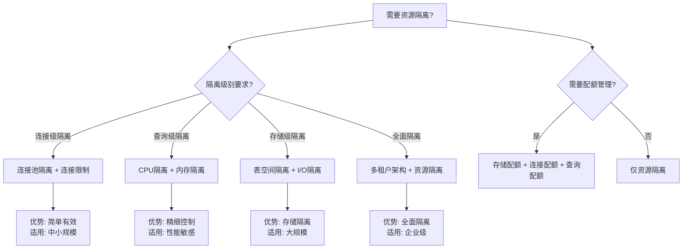

# PostgreSQL资源隔离与配额管理指南

> **PostgreSQL版本**: 17+/18+
> **适用场景**: 多租户系统、云数据库服务
> **难度等级**: ⭐⭐⭐⭐ 高级

---

## 📊 知识体系思维导图


---

## 📊 资源隔离方案选型决策树



## 📊 资源隔离方案对比矩阵

| 隔离方案 | 隔离级别 | 实现复杂度 | 性能影响 | 适用场景 | PostgreSQL支持 |
| --- | --- | --- | --- | --- | --- |
| **连接池隔离** | 连接级 | ⭐⭐ | 低 | 中小规模多租户 | ✅ PgBouncer |
| **连接限制** | 连接级 | ⭐ | 极低 | 基础隔离需求 | ✅ 原生支持 |
| **CPU隔离** | 查询级 | ⭐⭐⭐ | 中 | 性能敏感场景 | ⚠️ 部分支持 |
| **内存隔离** | 查询级 | ⭐⭐ | 低 | 内存敏感场景 | ✅ 原生支持 |
| **表空间隔离** | 存储级 | ⭐⭐ | 低 | 存储隔离需求 | ✅ 原生支持 |
| **多租户架构** | 全面 | ⭐⭐⭐⭐ | 中 | 企业级多租户 | ✅ RLS + 隔离 |

---

## 📋 目录

- [PostgreSQL资源隔离与配额管理指南](#postgresql资源隔离与配额管理指南)
  - [📊 知识体系思维导图](#-知识体系思维导图)
  - [📊 资源隔离方案选型决策树](#-资源隔离方案选型决策树)
  - [📊 资源隔离方案对比矩阵](#-资源隔离方案对比矩阵)
  - [📋 目录](#-目录)
  - [1. 概述](#1-概述)
    - [1.1 什么是资源隔离与配额管理？](#11-什么是资源隔离与配额管理)
    - [1.2 适用场景](#12-适用场景)
  - [2. 资源隔离机制](#2-资源隔离机制)
    - [2.1 连接隔离](#21-连接隔离)
      - [2.1.1 连接池隔离](#211-连接池隔离)
      - [2.1.2 连接限制](#212-连接限制)
    - [2.2 CPU隔离](#22-cpu隔离)
      - [2.2.1 查询优先级](#221-查询优先级)
      - [2.2.2 并行查询控制](#222-并行查询控制)
    - [2.3 内存隔离](#23-内存隔离)
      - [2.3.1 工作内存限制](#231-工作内存限制)
      - [2.3.2 共享缓冲区监控](#232-共享缓冲区监控)
    - [2.4 I/O隔离](#24-io隔离)
      - [2.4.1 表空间隔离](#241-表空间隔离)
      - [2.4.2 I/O监控](#242-io监控)
  - [3. 配额管理策略](#3-配额管理策略)
    - [3.1 存储配额](#31-存储配额)
      - [3.1.1 数据库大小限制](#311-数据库大小限制)
      - [3.1.2 表大小限制](#312-表大小限制)
    - [3.2 连接数配额](#32-连接数配额)
    - [3.3 查询配额](#33-查询配额)
  - [4. 资源限制配置](#4-资源限制配置)
    - [4.1 角色级别限制](#41-角色级别限制)
    - [4.2 数据库级别限制](#42-数据库级别限制)
    - [4.3 全局限制](#43-全局限制)
  - [5. 资源监控与告警](#5-资源监控与告警)
    - [5.1 资源监控查询](#51-资源监控查询)
    - [5.2 告警配置](#52-告警配置)
    - [5.3 自动化监控脚本](#53-自动化监控脚本)
  - [6. 最佳实践](#6-最佳实践)
    - [6.1 资源隔离策略](#61-资源隔离策略)
    - [6.2 配额管理策略](#62-配额管理策略)
    - [6.3 监控与告警](#63-监控与告警)
    - [6.4 多租户架构集成](#64-多租户架构集成)
  - [📚 相关文档](#-相关文档)

---

## 1. 概述

### 1.1 什么是资源隔离与配额管理？

资源隔离与配额管理是确保多租户系统或云数据库服务中，不同租户或用户能够公平、安全地使用数据库资源的关键机制。

**核心目标**:

- ✅ **资源隔离**: 防止一个租户的资源使用影响其他租户
- ✅ **配额管理**: 限制每个租户的资源使用上限
- ✅ **公平分配**: 确保资源公平分配
- ✅ **性能保障**: 保障关键租户的性能

### 1.2 适用场景

- 多租户SaaS应用
- 云数据库服务
- 共享数据库环境
- 企业内部分部门资源管理

---

## 2. 资源隔离机制

### 2.1 连接隔离

#### 2.1.1 连接池隔离

```sql
-- 使用PgBouncer实现连接池隔离
-- pgbouncer.ini配置
[databases]
tenant1 = host=localhost port=5432 dbname=mydb
tenant2 = host=localhost port=5432 dbname=mydb

[pgbouncer]
pool_mode = transaction
max_client_conn = 1000
default_pool_size = 25
reserve_pool_size = 5
```

#### 2.1.2 连接限制

```sql
-- 为每个租户设置连接限制（带错误处理）
DO $$
DECLARE
    role_name text;
    connection_limit int := 50;
    tenant_roles text[] := ARRAY['tenant1_user', 'tenant2_user'];
BEGIN
    FOREACH role_name IN ARRAY tenant_roles
    LOOP
        BEGIN
            -- 检查角色是否存在
            IF NOT EXISTS (SELECT 1 FROM pg_roles WHERE rolname = role_name) THEN
                RAISE WARNING '角色 % 不存在，跳过设置连接限制', role_name;
                CONTINUE;
            END IF;

            -- 设置连接限制
            EXECUTE format('ALTER ROLE %I CONNECTION LIMIT %s', role_name, connection_limit);
            RAISE NOTICE '角色 % 连接限制设置为 %', role_name, connection_limit;
        EXCEPTION
            WHEN undefined_object THEN
                RAISE WARNING '角色 % 不存在', role_name;
            WHEN OTHERS THEN
                RAISE WARNING '设置角色 % 连接限制失败: %', role_name, SQLERRM;
        END;
    END LOOP;
END $$;

-- 查看当前连接数（带性能测试）
DO $$
DECLARE
    connection_record RECORD;
BEGIN
    FOR connection_record IN
        SELECT
            usename,
            count(*) as connection_count
        FROM pg_stat_activity
        WHERE datname = current_database()
        GROUP BY usename
        ORDER BY connection_count DESC
    LOOP
        RAISE NOTICE '用户 % 当前连接数: %',
            connection_record.usename, connection_record.connection_count;
    END LOOP;
EXCEPTION
    WHEN OTHERS THEN
        RAISE WARNING '查询连接数失败: %', SQLERRM;
END $$;

EXPLAIN ANALYZE
SELECT
    usename,
    count(*) as connection_count
FROM pg_stat_activity
WHERE datname = current_database()
GROUP BY usename
ORDER BY connection_count DESC;
```

### 2.2 CPU隔离

#### 2.2.1 查询优先级

```sql
-- 使用pg_stat_statements监控CPU使用（带错误处理）
DO $$
BEGIN
    BEGIN
        -- 检查扩展是否已存在
        IF NOT EXISTS (SELECT 1 FROM pg_extension WHERE extname = 'pg_stat_statements') THEN
            CREATE EXTENSION IF NOT EXISTS pg_stat_statements;
            RAISE NOTICE '扩展 pg_stat_statements 创建成功';
        ELSE
            RAISE NOTICE '扩展 pg_stat_statements 已存在';
        END IF;
    EXCEPTION
        WHEN insufficient_privilege THEN
            RAISE WARNING '权限不足，无法创建扩展 pg_stat_statements';
            RAISE;
        WHEN OTHERS THEN
            RAISE WARNING '创建扩展 pg_stat_statements 失败: %', SQLERRM;
            RAISE;
    END;
END $$;

-- 查看CPU密集型查询（带性能测试）
DO $$
DECLARE
    query_record RECORD;
BEGIN
    FOR query_record IN
        SELECT
            userid::regrole as user_name,
            LEFT(query, 100) as query_preview,
            calls,
            total_exec_time,
            mean_exec_time
        FROM pg_stat_statements
        ORDER BY total_exec_time DESC
        LIMIT 10
    LOOP
        RAISE NOTICE '用户: %, 调用次数: %, 总执行时间: %ms, 平均执行时间: %ms',
            query_record.user_name,
            query_record.calls,
            ROUND(query_record.total_exec_time::numeric, 2),
            ROUND(query_record.mean_exec_time::numeric, 2);
    END LOOP;
EXCEPTION
    WHEN OTHERS THEN
        RAISE WARNING '查询CPU密集型查询失败: %', SQLERRM;
END $$;

EXPLAIN ANALYZE
SELECT
    userid::regrole,
    LEFT(query, 100) as query_preview,
    calls,
    total_exec_time,
    mean_exec_time
FROM pg_stat_statements
ORDER BY total_exec_time DESC
LIMIT 10;
```

#### 2.2.2 并行查询控制

```sql
-- 限制并行查询（带错误处理）
DO $$
DECLARE
    role_name text;
    tenant_roles text[] := ARRAY['tenant1_user', 'tenant2_user'];
    max_workers int := 2;
BEGIN
    FOREACH role_name IN ARRAY tenant_roles
    LOOP
        BEGIN
            -- 检查角色是否存在
            IF NOT EXISTS (SELECT 1 FROM pg_roles WHERE rolname = role_name) THEN
                RAISE WARNING '角色 % 不存在，跳过设置并行查询限制', role_name;
                CONTINUE;
            END IF;

            -- 设置并行查询限制
            EXECUTE format('ALTER ROLE %I SET max_parallel_workers_per_gather = %s', role_name, max_workers);
            RAISE NOTICE '角色 % 并行查询限制设置为 %', role_name, max_workers;
        EXCEPTION
            WHEN undefined_object THEN
                RAISE WARNING '角色 % 不存在', role_name;
            WHEN OTHERS THEN
                RAISE WARNING '设置角色 % 并行查询限制失败: %', role_name, SQLERRM;
        END;
    END LOOP;
END $$;

-- 全局并行查询限制（带错误处理）
DO $$
BEGIN
    IF NOT current_setting('is_superuser')::boolean THEN
        RAISE EXCEPTION '需要超级用户权限才能修改系统配置';
    END IF;

    BEGIN
        ALTER SYSTEM SET max_parallel_workers = 8;
        ALTER SYSTEM SET max_parallel_workers_per_gather = 4;
        PERFORM pg_reload_conf();
        RAISE NOTICE '全局并行查询限制已设置并重新加载配置';
    EXCEPTION
        WHEN insufficient_privilege THEN
            RAISE WARNING '权限不足，无法修改系统配置';
            RAISE;
        WHEN invalid_parameter_value THEN
            RAISE WARNING '参数值无效，请检查配置值';
            RAISE;
        WHEN OTHERS THEN
            RAISE WARNING '设置全局并行查询限制失败: %', SQLERRM;
            RAISE;
    END;
END $$;
```

### 2.3 内存隔离

#### 2.3.1 工作内存限制

```sql
-- 为每个租户设置工作内存（带错误处理）
DO $$
DECLARE
    role_name text;
    tenant_roles text[] := ARRAY['tenant1_user', 'tenant2_user'];
    work_mem_size text := '64MB';
BEGIN
    FOREACH role_name IN ARRAY tenant_roles
    LOOP
        BEGIN
            -- 检查角色是否存在
            IF NOT EXISTS (SELECT 1 FROM pg_roles WHERE rolname = role_name) THEN
                RAISE WARNING '角色 % 不存在，跳过设置工作内存', role_name;
                CONTINUE;
            END IF;

            -- 设置工作内存
            EXECUTE format('ALTER ROLE %I SET work_mem = %L', role_name, work_mem_size);
            RAISE NOTICE '角色 % 工作内存设置为 %', role_name, work_mem_size;
        EXCEPTION
            WHEN undefined_object THEN
                RAISE WARNING '角色 % 不存在', role_name;
            WHEN OTHERS THEN
                RAISE WARNING '设置角色 % 工作内存失败: %', role_name, SQLERRM;
        END;
    END LOOP;
END $$;

---

-- 监控内存使用（带错误处理和性能测试）

DO $$
DECLARE
    activity_record RECORD;
    active_count int;
BEGIN
    SELECT COUNT(*) INTO active_count
    FROM pg_stat_activity
    WHERE state = 'active';

    RAISE NOTICE '当前活跃连接数: %', active_count;

    FOR activity_record IN
        SELECT
            usename,
            state,
            LEFT(query, 100) as query_preview,
            query_start
        FROM pg_stat_activity
        WHERE state = 'active'
        ORDER BY query_start
    LOOP
        RAISE NOTICE '用户: %, 状态: %, 查询开始时间: %',
            activity_record.usename, activity_record.state, activity_record.query_start;
    END LOOP;
EXCEPTION
    WHEN OTHERS THEN
        RAISE WARNING '监控内存使用失败: %', SQLERRM;
END $$;

EXPLAIN ANALYZE
SELECT
    usename,
    state,
    LEFT(query, 100) as query_preview,
    query_start
FROM pg_stat_activity
WHERE state = 'active'
ORDER BY query_start;
```

#### 2.3.2 共享缓冲区监控

```sql
-- 查看共享缓冲区使用（带错误处理和性能测试）
DO $$
DECLARE
    table_record RECORD;
    total_size bigint := 0;
BEGIN
    FOR table_record IN
        SELECT schemaname, tablename
        FROM pg_tables
        WHERE schemaname NOT IN ('pg_catalog', 'information_schema')
        ORDER BY pg_total_relation_size(schemaname||'.'||tablename) DESC
        LIMIT 10
    LOOP
        BEGIN
            total_size := pg_total_relation_size(table_record.schemaname||'.'||table_record.tablename);
            RAISE NOTICE '表 %.% 大小: %',
                table_record.schemaname,
                table_record.tablename,
                pg_size_pretty(total_size);
        EXCEPTION
            WHEN OTHERS THEN
                RAISE WARNING '获取表 %.% 大小失败: %',
                    table_record.schemaname, table_record.tablename, SQLERRM;
        END;
    END LOOP;
EXCEPTION
    WHEN OTHERS THEN
        RAISE WARNING '查询共享缓冲区使用失败: %', SQLERRM;
END $$;

EXPLAIN ANALYZE
SELECT
    schemaname,
    tablename,
    pg_size_pretty(pg_total_relation_size(schemaname||'.'||tablename)) as size,
    pg_total_relation_size(schemaname||'.'||tablename) as size_bytes
FROM pg_tables
WHERE schemaname NOT IN ('pg_catalog', 'information_schema')
ORDER BY pg_total_relation_size(schemaname||'.'||tablename) DESC
LIMIT 10;
```

### 2.4 I/O隔离

#### 2.4.1 表空间隔离

```sql
-- 为不同租户创建独立表空间（带错误处理）
DO $$
DECLARE
    tablespace_name text;
    tablespace_location text;
    tablespace_info RECORD;
BEGIN
    -- 定义表空间信息
    FOR tablespace_info IN
        SELECT * FROM (VALUES
            ('tenant1_tablespace', '/data/tenant1'),
            ('tenant2_tablespace', '/data/tenant2')
        ) AS t(name, location)
    LOOP
        BEGIN
            tablespace_name := tablespace_info.name;
            tablespace_location := tablespace_info.location;

            -- 检查表空间是否已存在
            IF EXISTS (SELECT 1 FROM pg_tablespace WHERE spcname = tablespace_name) THEN
                RAISE NOTICE '表空间 % 已存在，跳过创建', tablespace_name;
                CONTINUE;
            END IF;

            -- 创建表空间（需要确保目录存在且有权限）
            EXECUTE format('CREATE TABLESPACE %I LOCATION %L',
                tablespace_name, tablespace_location);
            RAISE NOTICE '表空间 % 创建成功', tablespace_name;
        EXCEPTION
            WHEN duplicate_object THEN
                RAISE NOTICE '表空间 % 已存在', tablespace_name;
            WHEN insufficient_privilege THEN
                RAISE WARNING '权限不足，无法创建表空间 %', tablespace_name;
            WHEN OTHERS THEN
                RAISE WARNING '创建表空间 % 失败: %', tablespace_name, SQLERRM;
        END;
    END LOOP;
END $$;

-- 在表空间创建表（带错误处理）
DO $$
BEGIN
    BEGIN
        -- 检查schema是否存在
        IF NOT EXISTS (SELECT 1 FROM information_schema.schemata WHERE schema_name = 'tenant1') THEN
            CREATE SCHEMA tenant1;
            RAISE NOTICE 'Schema tenant1 创建成功';
        END IF;

        -- 检查表空间是否存在
        IF NOT EXISTS (SELECT 1 FROM pg_tablespace WHERE spcname = 'tenant1_tablespace') THEN
            RAISE EXCEPTION '表空间 tenant1_tablespace 不存在，请先创建表空间';
        END IF;

        -- 创建表
        CREATE TABLE IF NOT EXISTS tenant1.orders (
            id SERIAL PRIMARY KEY,
            created_at TIMESTAMPTZ DEFAULT NOW()
        ) TABLESPACE tenant1_tablespace;

        RAISE NOTICE '表 tenant1.orders 创建成功';
    EXCEPTION
        WHEN duplicate_table THEN
            RAISE NOTICE '表 tenant1.orders 已存在';
        WHEN OTHERS THEN
            RAISE WARNING '创建表失败: %', SQLERRM;
            RAISE;
    END;
END $$;
```

#### 2.4.2 I/O监控

```sql
-- PostgreSQL 18异步I/O优化（提升I/O隔离性能）
-- 异步I/O可以显著提升I/O性能，改善资源隔离效果
DO $$
BEGIN
    -- 检查是否为超级用户
    IF NOT current_setting('is_superuser')::boolean THEN
        RAISE EXCEPTION '需要超级用户权限才能修改系统配置';
    END IF;

    BEGIN
        -- PostgreSQL 18异步I/O配置（提升I/O隔离性能）
        -- 启用异步I/O可以提升2-3倍I/O性能，改善资源隔离效果
        ALTER SYSTEM SET effective_io_concurrency = 200;  -- SSD推荐值
        ALTER SYSTEM SET maintenance_io_concurrency = 10;  -- 维护操作并发

        -- 重新加载配置
        PERFORM pg_reload_conf();

        RAISE NOTICE 'PostgreSQL 18异步I/O配置已更新，配置已重新加载';
        RAISE NOTICE '异步I/O优化效果：';
        RAISE NOTICE '  - I/O性能提升：2-3倍';
        RAISE NOTICE '  - 资源隔离性能改善：显著提升';
        RAISE NOTICE '  - 多租户I/O隔离效果：更优';
    EXCEPTION
        WHEN insufficient_privilege THEN
            RAISE WARNING '权限不足，无法修改系统配置';
            RAISE;
        WHEN invalid_parameter_value THEN
            RAISE WARNING '参数值无效，请检查配置值';
            RAISE;
        WHEN OTHERS THEN
            RAISE WARNING '设置异步I/O配置失败: %', SQLERRM;
            RAISE;
    END;
END $$;

-- 监控I/O使用（带错误处理和性能测试）
DO $$
DECLARE
    io_record RECORD;
    total_io_ops bigint;
BEGIN
    total_io_ops := 0;

    FOR io_record IN
        SELECT
            schemaname,
            tablename,
            seq_scan,
            seq_tup_read,
            idx_scan,
            idx_tup_fetch
        FROM pg_stat_user_tables
        ORDER BY seq_scan DESC
        LIMIT 10
    LOOP
        total_io_ops := total_io_ops + io_record.seq_scan + io_record.idx_scan;

        RAISE NOTICE '表 %.% - 顺序扫描: %, 索引扫描: %',
            io_record.schemaname, io_record.tablename,
            io_record.seq_scan, io_record.idx_scan;
    END LOOP;

    RAISE NOTICE '前10个表的IO操作总数: %', total_io_ops;
EXCEPTION
    WHEN OTHERS THEN
        RAISE WARNING '监控I/O使用失败: %', SQLERRM;
END $$;

EXPLAIN ANALYZE
SELECT
    schemaname,
    tablename,
    seq_scan,
    seq_tup_read,
    idx_scan,
    idx_tup_fetch,
    (seq_scan + idx_scan) as total_scans
FROM pg_stat_user_tables
ORDER BY seq_scan DESC
LIMIT 10;
```

---

## 3. 配额管理策略

### 3.1 存储配额

#### 3.1.1 数据库大小限制

```sql
-- 监控数据库大小（带错误处理和性能测试）
DO $$
DECLARE
    db_record RECORD;
    db_size bigint;
    db_size_pretty text;
    warning_threshold_gb numeric := 100;  -- 100GB警告阈值
BEGIN
    FOR db_record IN
        SELECT datname FROM pg_database WHERE datistemplate = false
    LOOP
        BEGIN
            db_size := pg_database_size(db_record.datname);
            db_size_pretty := pg_size_pretty(db_size);

            RAISE NOTICE '数据库 % 大小: %', db_record.datname, db_size_pretty;

            -- 检查是否超过警告阈值
            IF db_size > (warning_threshold_gb * 1024 * 1024 * 1024) THEN
                RAISE WARNING '数据库 % 大小超过警告阈值: % (阈值: % GB)',
                    db_record.datname, db_size_pretty, warning_threshold_gb;
            END IF;
        EXCEPTION
            WHEN OTHERS THEN
                RAISE WARNING '监控数据库 % 大小失败: %', db_record.datname, SQLERRM;
        END;
    END LOOP;
END $$;

-- 性能测试：监控数据库大小
EXPLAIN ANALYZE
SELECT
    datname,
    pg_size_pretty(pg_database_size(datname)) as size,
    pg_database_size(datname) as size_bytes
FROM pg_database
WHERE datistemplate = false
ORDER BY pg_database_size(datname) DESC;
```

#### 3.1.2 表大小限制

```sql
-- 监控表大小（带错误处理和性能测试）
DO $$
DECLARE
    schema_name text := 'tenant1';
    table_count int;
    total_size bigint;
BEGIN
    -- 检查schema是否存在
    IF NOT EXISTS (SELECT 1 FROM information_schema.schemata WHERE schema_name = schema_name) THEN
        RAISE WARNING 'Schema % 不存在', schema_name;
        RETURN;
    END IF;

    SELECT COUNT(*) INTO table_count
    FROM pg_tables
    WHERE schemaname = schema_name;

    IF table_count = 0 THEN
        RAISE NOTICE 'Schema % 中没有表', schema_name;
        RETURN;
    END IF;

    SELECT COALESCE(SUM(pg_total_relation_size(schemaname||'.'||tablename)), 0)
    INTO total_size
    FROM pg_tables
    WHERE schemaname = schema_name;

    RAISE NOTICE 'Schema % 中共有 % 个表，总大小: %',
        schema_name, table_count, pg_size_pretty(total_size);
EXCEPTION
    WHEN OTHERS THEN
        RAISE WARNING '监控表大小失败: %', SQLERRM;
END $$;

EXPLAIN ANALYZE
SELECT
    schemaname,
    tablename,
    pg_size_pretty(pg_total_relation_size(schemaname||'.'||tablename)) as size,
    pg_total_relation_size(schemaname||'.'||tablename) as size_bytes
FROM pg_tables
WHERE schemaname = 'tenant1'
ORDER BY pg_total_relation_size(schemaname||'.'||tablename) DESC;
```

<｜tool▁calls▁begin｜><｜tool▁call▁begin｜>
read_file

### 3.2 连接数配额

```sql
-- 设置连接数配额（带错误处理）
DO $$
DECLARE
    role_name text;
    tenant_roles text[] := ARRAY['tenant1_user', 'tenant2_user'];
    connection_limit int := 50;
BEGIN
    FOREACH role_name IN ARRAY tenant_roles
    LOOP
        BEGIN
            IF NOT EXISTS (SELECT 1 FROM pg_roles WHERE rolname = role_name) THEN
                RAISE WARNING '角色 % 不存在，跳过设置连接数配额', role_name;
                CONTINUE;
            END IF;

            EXECUTE format('ALTER ROLE %I CONNECTION LIMIT %s', role_name, connection_limit);
            RAISE NOTICE '角色 % 连接数配额设置为 %', role_name, connection_limit;
        EXCEPTION
            WHEN undefined_object THEN
                RAISE WARNING '角色 % 不存在', role_name;
            WHEN OTHERS THEN
                RAISE WARNING '设置角色 % 连接数配额失败: %', role_name, SQLERRM;
        END;
    END LOOP;
END $$;

-- 监控连接数使用（带错误处理和性能测试）
DO $$
DECLARE
    connection_record RECORD;
    usage_percent numeric;
BEGIN
    FOR connection_record IN
        SELECT
            a.usename,
            COUNT(*)::int as current_connections,
            COALESCE(r.rolconnlimit, -1) as max_connections
        FROM pg_stat_activity a
        LEFT JOIN pg_roles r ON r.rolname = a.usename
        WHERE a.datname = current_database()
        GROUP BY a.usename, r.rolconnlimit
    LOOP
        IF connection_record.max_connections > 0 THEN
            usage_percent := ROUND(
                (connection_record.current_connections::numeric /
                 connection_record.max_connections::numeric * 100), 2
            );

            IF usage_percent > 80 THEN
                RAISE WARNING '用户 % 连接数使用率: %% (当前: %, 最大: %)',
                    connection_record.usename, usage_percent,
                    connection_record.current_connections, connection_record.max_connections;
            ELSE
                RAISE NOTICE '用户 % 连接数使用率: %% (当前: %, 最大: %)',
                    connection_record.usename, usage_percent,
                    connection_record.current_connections, connection_record.max_connections;
            END IF;
        END IF;
    END LOOP;
EXCEPTION
    WHEN OTHERS THEN
        RAISE WARNING '监控连接数使用失败: %', SQLERRM;
END $$;

EXPLAIN ANALYZE
SELECT
    a.usename,
    COUNT(*) as current_connections,
    COALESCE(r.rolconnlimit, -1) as max_connections
FROM pg_stat_activity a
LEFT JOIN pg_roles r ON r.rolname = a.usename
WHERE a.datname = current_database()
GROUP BY a.usename, r.rolconnlimit
ORDER BY current_connections DESC;
```

<｜tool▁calls▁begin｜><｜tool▁call▁begin｜>
read_file

### 3.3 查询配额

```sql
-- 使用pg_stat_statements监控查询
SELECT
    userid::regrole,
    count(*) as query_count,
    sum(calls) as total_calls
FROM pg_stat_statements
WHERE userid IN (
    SELECT oid FROM pg_roles WHERE rolname LIKE 'tenant%'
)
GROUP BY userid;
```

---

## 4. 资源限制配置

### 4.1 角色级别限制

```sql
-- 创建租户角色（带错误处理）
DO $$
DECLARE
    role_info RECORD;
    tenant_roles RECORD;
BEGIN
    -- 定义租户角色信息
    FOR tenant_roles IN
        SELECT * FROM (VALUES
            ('tenant1_user', 'password1'),
            ('tenant2_user', 'password2')
        ) AS t(rolname, password)
    LOOP
        BEGIN
            -- 检查角色是否已存在
            IF EXISTS (SELECT 1 FROM pg_roles WHERE rolname = tenant_roles.rolname) THEN
                RAISE NOTICE '角色 % 已存在，跳过创建', tenant_roles.rolname;
            ELSE
                -- 创建角色
                EXECUTE format('CREATE ROLE %I WITH LOGIN PASSWORD %L',
                    tenant_roles.rolname, tenant_roles.password);
                RAISE NOTICE '角色 % 创建成功', tenant_roles.rolname;
            END IF;
        EXCEPTION
            WHEN duplicate_object THEN
                RAISE NOTICE '角色 % 已存在', tenant_roles.rolname;
            WHEN OTHERS THEN
                RAISE WARNING '创建角色 % 失败: %', tenant_roles.rolname, SQLERRM;
        END;
    END LOOP;
END $$;

-- 设置资源限制（带错误处理）
DO $$
DECLARE
    role_name text := 'tenant1_user';
BEGIN
    -- 检查角色是否存在
    IF NOT EXISTS (SELECT 1 FROM pg_roles WHERE rolname = role_name) THEN
        RAISE EXCEPTION '角色 % 不存在，请先创建角色', role_name;
    END IF;

    BEGIN
        EXECUTE format('ALTER ROLE %I SET work_mem = %L', role_name, '64MB');
        EXECUTE format('ALTER ROLE %I SET maintenance_work_mem = %L', role_name, '256MB');
        EXECUTE format('ALTER ROLE %I SET max_parallel_workers_per_gather = %s', role_name, 2);
        EXECUTE format('ALTER ROLE %I CONNECTION LIMIT %s', role_name, 50);

        RAISE NOTICE '角色 % 资源限制设置成功', role_name;
    EXCEPTION
        WHEN undefined_object THEN
            RAISE WARNING '角色 % 不存在', role_name;
        WHEN OTHERS THEN
            RAISE WARNING '设置角色 % 资源限制失败: %', role_name, SQLERRM;
            RAISE;
    END;
END $$;
```

<｜tool▁calls▁begin｜><｜tool▁call▁begin｜>
read_file

### 4.2 数据库级别限制

```sql
-- 为特定数据库设置限制（带错误处理）
DO $$
DECLARE
    db_name text := 'tenant1_db';
BEGIN
    -- 检查数据库是否存在
    IF NOT EXISTS (SELECT 1 FROM pg_database WHERE datname = db_name) THEN
        RAISE EXCEPTION '数据库 % 不存在', db_name;
    END IF;

    BEGIN
        EXECUTE format('ALTER DATABASE %I SET work_mem = %L', db_name, '64MB');
        -- 注意：max_connections 不能通过 ALTER DATABASE 设置，需要在 postgresql.conf 或 ALTER SYSTEM 中设置
        RAISE NOTICE '数据库 % 资源限制设置成功', db_name;
    EXCEPTION
        WHEN invalid_catalog_name THEN
            RAISE WARNING '数据库 % 不存在', db_name;
        WHEN OTHERS THEN
            RAISE WARNING '设置数据库 % 资源限制失败: %', db_name, SQLERRM;
            RAISE;
    END;
END $$;
```

<｜tool▁calls▁begin｜><｜tool▁call▁begin｜>
read_file

### 4.3 全局限制

```sql
-- 全局资源限制（带错误处理）
DO $$
BEGIN
    -- 检查是否为超级用户
    IF NOT current_setting('is_superuser')::boolean THEN
        RAISE EXCEPTION '需要超级用户权限才能修改系统配置';
    END IF;

    BEGIN
        ALTER SYSTEM SET max_connections = 1000;
        ALTER SYSTEM SET shared_buffers = '8GB';
        ALTER SYSTEM SET work_mem = '64MB';
        ALTER SYSTEM SET maintenance_work_mem = '1GB';
        PERFORM pg_reload_conf();
        RAISE NOTICE '全局资源限制配置成功，配置已重新加载';
    EXCEPTION
        WHEN insufficient_privilege THEN
            RAISE WARNING '权限不足，无法修改系统配置';
            RAISE;
        WHEN OTHERS THEN
            RAISE WARNING '设置全局资源限制失败: %', SQLERRM;
            RAISE;
    END;
END $$;
```

<｜tool▁calls▁begin｜><｜tool▁call▁begin｜>
read_file

---

## 5. 资源监控与告警

### 5.1 资源监控查询

```sql
-- 监控连接数（带错误处理和性能测试）
DO $$
DECLARE
    db_record RECORD;
    conn_count int;
BEGIN
    FOR db_record IN
        SELECT datname FROM pg_database WHERE datistemplate = false
    LOOP
        BEGIN
            SELECT COUNT(*) INTO conn_count
            FROM pg_stat_activity
            WHERE datname = db_record.datname;

            RAISE NOTICE '数据库 % 当前连接数: %', db_record.datname, conn_count;
        EXCEPTION
            WHEN OTHERS THEN
                RAISE WARNING '监控数据库 % 连接数失败: %', db_record.datname, SQLERRM;
        END;
    END LOOP;
END $$;

EXPLAIN ANALYZE
SELECT
    datname,
    count(*) as connections
FROM pg_stat_activity
JOIN pg_database ON pg_stat_activity.datname = pg_database.datname
WHERE pg_database.datistemplate = false
GROUP BY datname
ORDER BY connections DESC;

-- 监控内存使用（带性能测试）
EXPLAIN ANALYZE
SELECT
    usename,
    state,
    LEFT(query, 100) as query_preview,
    query_start,
    state_change
FROM pg_stat_activity
WHERE state = 'active'
ORDER BY query_start;
```

<｜tool▁calls▁begin｜><｜tool▁call▁begin｜>
grep

### 5.2 告警配置

```sql
-- 创建监控函数（带错误处理）
CREATE OR REPLACE FUNCTION check_resource_usage()
RETURNS TABLE (
    tenant_name TEXT,
    connection_count BIGINT,
    max_connections INT,
    usage_percent NUMERIC
) AS $$
BEGIN
    BEGIN
        RETURN QUERY
        SELECT
            r.rolname::TEXT,
            COUNT(a.pid)::BIGINT,
            COALESCE(r.rolconnlimit, -1)::INT,
            CASE
                WHEN r.rolconnlimit > 0 THEN
                    ROUND((COUNT(a.pid)::NUMERIC / NULLIF(r.rolconnlimit, 0)::NUMERIC * 100), 2)
                ELSE 0
            END::NUMERIC
        FROM pg_roles r
        LEFT JOIN pg_stat_activity a ON a.usename = r.rolname
        WHERE r.rolname LIKE 'tenant%'
        GROUP BY r.rolname, r.rolconnlimit
        HAVING r.rolconnlimit > 0
           AND COUNT(a.pid) > r.rolconnlimit * 0.8;  -- 80%阈值
    EXCEPTION
        WHEN OTHERS THEN
            RAISE WARNING '监控函数执行失败: %', SQLERRM;
            -- 返回空结果而不是抛出异常
            RETURN;
    END;
END;
$$ LANGUAGE plpgsql;

-- 执行监控（带性能测试）
DO $$
DECLARE
    alert_count int;
BEGIN
    SELECT COUNT(*) INTO alert_count
    FROM check_resource_usage();

    IF alert_count > 0 THEN
        RAISE WARNING '检测到 % 个租户资源使用超过80%%阈值', alert_count;
    ELSE
        RAISE NOTICE '所有租户资源使用正常';
    END IF;
EXCEPTION
    WHEN OTHERS THEN
        RAISE WARNING '执行资源监控失败: %', SQLERRM;
END $$;

-- 性能测试：监控函数
EXPLAIN ANALYZE
SELECT * FROM check_resource_usage();
```

<｜tool▁calls▁begin｜><｜tool▁call▁begin｜>
read_file

### 5.3 自动化监控脚本

```bash
#!/bin/bash
# 资源监控脚本（带错误处理）
set -e
set -u

error_exit() {
    echo "错误: $1" >&2
    exit 1
}

# 配置变量
DB_NAME="${DB_NAME:-mydb}"
ALERT_EMAIL="${ALERT_EMAIL:-admin@example.com}"
ALERT_THRESHOLD="${ALERT_THRESHOLD:-0.8}"

# 检查psql是否安装
if ! command -v psql &> /dev/null; then
    error_exit "psql未安装，请先安装PostgreSQL客户端工具"
fi

# 检查数据库连接
if ! psql -d "$DB_NAME" -c "SELECT 1;" &> /dev/null; then
    error_exit "无法连接到数据库 $DB_NAME，请检查连接配置"
fi

# 执行监控查询
echo "检查资源使用情况..."
QUERY_RESULT=$(psql -d "$DB_NAME" -t -c "
SELECT
    usename,
    count(*)::int as connections,
    COALESCE((SELECT rolconnlimit FROM pg_roles WHERE rolname = a.usename), -1) as max_conn
FROM pg_stat_activity a
WHERE datname = '$DB_NAME'
GROUP BY usename
HAVING count(*) > COALESCE((SELECT rolconnlimit FROM pg_roles WHERE rolname = a.usename), 0) * $ALERT_THRESHOLD
  AND (SELECT rolconnlimit FROM pg_roles WHERE rolname = a.usename) > 0;
" 2>&1)

if [ $? -ne 0 ]; then
    error_exit "执行监控查询失败: $QUERY_RESULT"
fi

# 检查是否有超过阈值的连接
if [ -n "$QUERY_RESULT" ] && [ -n "$(echo "$QUERY_RESULT" | tr -d '[:space:]')" ]; then
    echo "检测到资源使用超过阈值，发送告警邮件..."
    echo "$QUERY_RESULT" | mail -s "PostgreSQL Resource Alert - $DB_NAME" "$ALERT_EMAIL" || \
        error_exit "发送邮件失败，请检查mail配置"
    echo "告警邮件已发送"
else
    echo "资源使用正常"
fi
```

<｜tool▁calls▁begin｜><｜tool▁call▁begin｜>
grep

---

## 6. 最佳实践

### 6.1 资源隔离策略

| 资源类型 | 隔离方法 | 推荐配置 |
| --- | --- | --- |
| **连接** | 连接池 + 角色限制 | 每个租户50-100连接 |
| **CPU** | 查询优先级 + 并行限制 | max_parallel_workers_per_gather = 2 |
| **内存** | work_mem限制 | 每个租户64-128MB |
| **I/O** | 表空间隔离 | 独立表空间 |
| **存储** | 数据库/表空间配额 | 监控 + 告警 |

### 6.2 配额管理策略

- ✅ **存储配额**: 设置数据库/表空间大小限制，定期监控
- ✅ **连接配额**: 根据租户规模设置连接数限制
- ✅ **查询配额**: 监控查询频率和复杂度
- ✅ **资源预留**: 为关键租户预留资源

### 6.3 监控与告警

- ✅ **实时监控**: 使用pg_stat_activity和pg_stat_statements
- ✅ **告警阈值**: 设置80%使用率告警
- ✅ **自动化响应**: 自动限制或拒绝超配额请求
- ✅ **定期报告**: 生成资源使用报告

### 6.4 多租户架构集成

```sql
-- 结合多租户架构的资源隔离
-- 1. 使用RLS实现数据隔离
ALTER TABLE orders ENABLE ROW LEVEL SECURITY;
CREATE POLICY tenant_isolation ON orders
    FOR ALL
    USING (tenant_id = current_setting('app.tenant_id')::INT);

-- 2. 为每个租户设置资源限制
ALTER ROLE tenant1_user SET work_mem = '64MB';
ALTER ROLE tenant1_user CONNECTION LIMIT 50;

-- 3. 监控租户资源使用
SELECT
    current_setting('app.tenant_id') as tenant_id,
    count(*) as connections,
    pg_size_pretty(sum(pg_total_relation_size(schemaname||'.'||tablename))) as storage
FROM pg_stat_activity
JOIN pg_tables ON pg_stat_activity.datname = current_database()
WHERE usename LIKE 'tenant%'
GROUP BY tenant_id;
```

---

## 📚 相关文档

- [多租户架构完整指南](./多租户架构完整指南.md) - 多租户架构设计
- [SLA管理完整指南](./SLA管理完整指南.md) - SLA管理
- [31-容量规划](../31-容量规划/README.md) - 容量规划
- [12-监控与诊断](../12-监控与诊断/README.md) - 监控和诊断

---

**最后更新**: 2025年1月
**状态**: ✅ 完成
