# 数据模型与建模主题导航地图

> **创建日期**: 2025年1月
> **用途**: 快速导航到相关主题和子主题
> **更新频率**: 随内容扩展持续更新

---

## 🗺️ 主题导航地图

```mermaid
graph TD
    A[数据模型与建模] --> B[理论基础]
    A --> C[权威资源]
    A --> D[方法论]
    A --> E[OLTP建模]
    A --> F[OLAP建模]
    A --> G[IoT建模]
    A --> H[工作流建模]
    A --> I[PostgreSQL实践]
    A --> J[模式与反模式]
    A --> K[应用案例]

    B --> B1[范式理论]
    B --> B2[ER模型]
    B --> B3[关系代数]
    B --> B4[约束理论]

    C --> C1[Silverston三卷本]
    C --> C2[Kimball维度建模]
    C --> C3[行业标准]
    C --> C4[开源模型]

    D --> D1[思维表征]
    D --> D2[决策框架]
    D --> D3[成本分析]
    D --> D4[成熟度模型]

    E --> E1[范式化设计]
    E --> E2[Party模型]
    E --> E3[订单模型]
    E --> E4[PostgreSQL实现]

    F --> F1[维度建模]
    F --> F2[事实表]
    F --> F3[维度表]
    F --> F4[列存实现]

    G --> G1[时序模型]
    G --> G2[TimescaleDB]
    G --> G3[设备孪生]
    G --> G4[持续聚合]

    H --> H1[BPMN]
    H --> H2[状态机]
    H --> H3[JSONB实现]
    H --> H4[工作流模式]

    I --> I1[数据类型]
    I --> I2[索引策略]
    I --> I3[分区策略]
    I --> I4[约束设计]
    I --> I5[性能优化]

    J --> J1[设计模式]
    J --> J2[反模式]
    J --> J3[重构策略]
    J --> J4[最佳实践]

    K --> K1[电商案例]
    K --> K2[IoT案例]
    K --> K3[数据仓库案例]
    K --> K4[工作流案例]
```

---

## 📋 主题与子主题完整列表

### 1. 数据建模理论基础

**路径**: `01-数据建模理论基础/`

| 子主题 | 文档 | 关键词 |
|--------|------|--------|
| 范式理论 | `范式理论.md` | 1NF、2NF、3NF、BCNF、4NF、5NF |
| ER模型 | `ER模型.md` | 实体、关系、属性、Chen、Crow's Foot |
| 关系代数 | `关系代数.md` | 选择、投影、连接、并、差、交 |
| 约束理论 | `约束理论.md` | 实体完整性、参照完整性、用户定义约束 |

**快速链接**:

- [范式理论详解](../01-数据建模理论基础/范式理论.md)
- [ER模型设计指南](../01-数据建模理论基础/ER模型.md)

---

### 2. 权威资源与标准

**路径**: `02-权威资源与标准/`

| 子主题 | 文档 | 关键词 |
|--------|------|--------|
| Silverston数据模型资源手册 | `Silverston数据模型资源手册.md` | 通用模型、行业模型、设计模式 |
| Kimball维度建模 | `Kimball维度建模.md` | 星型模式、事实表、维度表、SCD |
| 行业标准与规范 | `行业标准与规范.md` | ISO/IEC、OMG、HL7、ISO 20022 |
| 开源数据模型 | `开源数据模型.md` | AdventureWorks、Sakila、OSDM |

**快速链接**:

- [权威资源索引](../00-导航与索引/权威资源索引.md)
- [Silverston三卷本详解](../02-权威资源与标准/Silverston数据模型资源手册.md)

---

### 3. 建模方法论

**路径**: `03-建模方法论/`

| 子主题 | 文档 | 关键词 |
|--------|------|--------|
| 思维表征方法 | `思维表征方法.md` | 思维导图、矩阵、决策树、证明网络 |
| 建模决策框架 | `建模决策框架.md` | 技术选型、权衡分析、决策树 |
| 成本收益分析 | `成本收益分析.md` | TCO、ROI、性能成本权衡 |
| 知识成熟度模型 | `知识成熟度模型.md` | L1-L5、能力评估、晋升路径 |

**快速链接**:

- [决策框架详解](../03-建模方法论/建模决策框架.md)
- [成本收益分析](../03-建模方法论/成本收益分析.md)

---

### 4. OLTP建模

**路径**: `04-OLTP建模/`

| 子主题 | 文档 | 关键词 |
|--------|------|--------|
| 范式化设计 | `范式化设计.md` | 3NF、规范化、消除冗余 |
| Party模型 | `Party模型.md` | 人员、组织、角色、多态关联 |
| 订单管理模型 | `订单管理模型.md` | 订单、支付、物流、发票 |
| PostgreSQL实现 | `PostgreSQL实现.md` | 继承表、分区、外键、CHECK |

**快速链接**:

- [Party模型详解](../04-OLTP建模/Party模型.md)
- [PostgreSQL实现指南](../04-OLTP建模/PostgreSQL实现.md)

---

### 5. OLAP建模

**路径**: `05-OLAP建模/`

| 子主题 | 文档 | 关键词 |
|--------|------|--------|
| 维度建模基础 | `维度建模基础.md` | 星型模式、雪花模式、对比分析 |
| 事实表技术 | `事实表技术.md` | 事务事实表、周期快照、累积快照 |
| 维度表技术 | `维度表技术.md` | SCD Type 1/2/3、角色扮演维度 |
| PostgreSQL列存实现 | `PostgreSQL列存实现.md` | Citus、HTAP、列存优化 |

**快速链接**:

- [维度建模基础](../05-OLAP建模/维度建模基础.md)
- [事实表技术详解](../05-OLAP建模/事实表技术.md)

---

### 6. IoT与时序建模

**路径**: `06-IoT与时序建模/`

| 子主题 | 文档 | 关键词 |
|--------|------|--------|
| 时序数据模型 | `时序数据模型.md` | 时序数据特点、时间分区 |
| TimescaleDB实践 | `TimescaleDB实践.md` | 超表、chunk、持续聚合 |
| 设备孪生模型 | `设备孪生模型.md` | Device Twin、设备状态 |
| 持续聚合策略 | `持续聚合策略.md` | 物化视图、自动刷新、查询优化 |

**快速链接**:

- [TimescaleDB完整指南](../06-IoT与时序建模/TimescaleDB实践.md)
- [时序数据模型设计](../06-IoT与时序建模/时序数据模型.md)

---

### 7. 工作流建模

**路径**: `07-工作流建模/`

| 子主题 | 文档 | 关键词 |
|--------|------|--------|
| BPMN建模 | `BPMN建模.md` | BPMN 2.0、事件、活动、网关 |
| 状态机建模 | `状态机建模.md` | 状态机、状态转换、米勒定律 |
| JSONB状态机实现 | `JSONB状态机实现.md` | JSONB、GIN索引、并发控制 |
| 工作流模式 | `工作流模式.md` | Workflow Patterns、控制流、数据流 |

**快速链接**:

- [BPMN 2.0标准](../07-工作流建模/BPMN建模.md)
- [PostgreSQL JSONB实现](../07-工作流建模/JSONB状态机实现.md)

---

### 8. PostgreSQL建模实践

**路径**: `08-PostgreSQL建模实践/`

| 子主题 | 文档 | 关键词 |
|--------|------|--------|
| 数据类型选择 | `数据类型选择.md` | 43种类型、JSONB、数组、自定义类型 |
| 索引策略 | `索引策略.md` | B-Tree、GIN、GIST、BRIN、SP-GIST |
| 分区策略 | `分区策略.md` | 声明式分区、RANGE、LIST、HASH |
| 约束设计 | `约束设计.md` | CHECK、EXCLUDE、外键、唯一约束 |
| 性能优化 | `性能优化.md` | 执行计划、统计信息、参数调优 |

**快速链接**:

- [索引策略详解](../08-PostgreSQL建模实践/索引策略.md)
- [分区策略最佳实践](../08-PostgreSQL建模实践/分区策略.md)

---

### 9. 建模模式与反模式

**路径**: `09-建模模式与反模式/`

| 子主题 | 文档 | 关键词 |
|--------|------|--------|
| 设计模式 | `设计模式.md` | Party模式、SCD模式、通用模式 |
| 反模式识别 | `反模式识别.md` | 过度JSONB、分区失控、缺失约束 |
| 重构策略 | `重构策略.md` | 模型重构、数据迁移、版本管理 |
| 最佳实践 | `最佳实践.md` | PostgreSQL特定最佳实践 |

**快速链接**:

- [反模式识别与避免](../09-建模模式与反模式/反模式识别.md)
- [PostgreSQL最佳实践](../09-建模模式与反模式/最佳实践.md)

---

### 10. 综合应用案例

**路径**: `10-综合应用案例/`

| 子主题 | 文档 | 关键词 |
|--------|------|--------|
| 电商数据模型案例 | `电商数据模型案例.md` | 订单、商品、用户、支付完整模型 |
| IoT监控系统案例 | `IoT监控系统案例.md` | 设备、指标、告警、时序数据 |
| 数据仓库案例 | `数据仓库案例.md` | 星型模式、ETL、BI报表 |
| 工作流引擎案例 | `工作流引擎案例.md` | BPMN实现、状态管理、审批流程 |

**快速链接**:

- [电商模型完整案例](../10-综合应用案例/电商数据模型案例.md)
- [IoT监控系统案例](../10-综合应用案例/IoT监控系统案例.md)

---

## 🔍 按场景快速查找

### 场景1: 设计新的交易系统

**推荐路径**:

1. `01-数据建模理论基础/范式理论.md` - 学习范式理论
2. `04-OLTP建模/范式化设计.md` - 掌握OLTP设计原则
3. `04-OLTP建模/Party模型.md` - 参考通用模型
4. `08-PostgreSQL建模实践/` - PostgreSQL特定实现
5. `10-综合应用案例/电商数据模型案例.md` - 参考案例

---

### 场景2: 构建数据仓库

**推荐路径**:

1. `02-权威资源与标准/Kimball维度建模.md` - 学习Kimball方法论
2. `05-OLAP建模/维度建模基础.md` - 掌握维度建模
3. `05-OLAP建模/事实表技术.md` - 设计事实表
4. `05-OLAP建模/维度表技术.md` - 设计维度表
5. `05-OLAP建模/PostgreSQL列存实现.md` - PostgreSQL实现

---

### 场景3: 开发IoT监控系统

**推荐路径**:

1. `06-IoT与时序建模/时序数据模型.md` - 理解时序数据特点
2. `06-IoT与时序建模/TimescaleDB实践.md` - TimescaleDB完整指南
3. `06-IoT与时序建模/设备孪生模型.md` - 设备建模
4. `06-IoT与时序建模/持续聚合策略.md` - 查询优化
5. `10-综合应用案例/IoT监控系统案例.md` - 完整案例

---

### 场景4: 实现工作流引擎

**推荐路径**:

1. `07-工作流建模/BPMN建模.md` - 学习BPMN标准
2. `07-工作流建模/状态机建模.md` - 状态机设计
3. `07-工作流建模/JSONB状态机实现.md` - PostgreSQL实现
4. `08-PostgreSQL建模实践/索引策略.md` - GIN索引优化
5. `10-综合应用案例/工作流引擎案例.md` - 完整案例

---

## 📊 学习路径推荐

### 初学者路径

1. **理论基础** (2周)
   - 范式理论
   - ER模型
   - 约束理论

2. **OLTP建模** (2周)
   - 范式化设计
   - Party模型
   - PostgreSQL实现

3. **实践案例** (1周)
   - 电商数据模型案例

**预计时间**: 5周

---

### 中级路径

1. **OLAP建模** (3周)
   - 维度建模基础
   - 事实表技术
   - 维度表技术

2. **PostgreSQL高级特性** (2周)
   - 索引策略
   - 分区策略
   - 性能优化

3. **IoT建模** (2周)
   - TimescaleDB实践
   - 时序数据模型

**预计时间**: 7周

---

### 高级路径

1. **权威资源研究** (4周)
   - Silverston三卷本
   - Kimball维度建模
   - 行业标准

2. **建模方法论** (2周)
   - 决策框架
   - 成本分析
   - 成熟度模型

3. **模式与反模式** (2周)
   - 设计模式
   - 反模式识别
   - 重构策略

**预计时间**: 8周

---

## 🔗 相关资源

- [README.md](../README.md) - 主文档
- [权威资源索引.md](./权威资源索引.md) - 权威资源列表
- [快速查找指南.md](./快速查找指南.md) - 快速查找工具

---

**最后更新**: 2025年1月
**维护者**: PostgreSQL Modern Team
