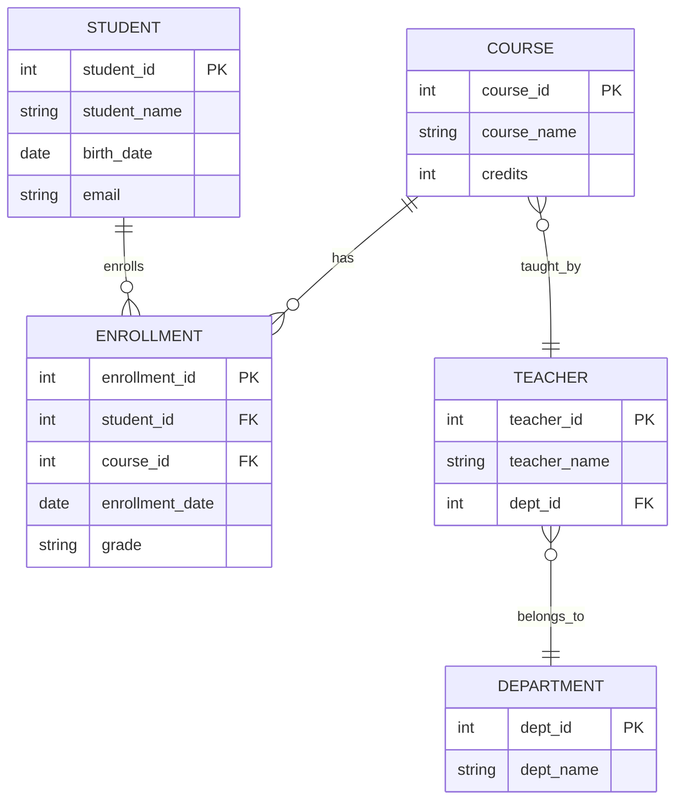

# ER模型完整指南

> **创建日期**: 2025年1月
> **来源**: 数据库系统理论基础
> **状态**: 基于现有内容深化扩展
> **文档编号**: 01-02

---

## 📑 目录

- [ER模型完整指南](#er模型完整指南)
  - [📑 目录](#-目录)
  - [1. 概述](#1-概述)
  - [1.1 理论基础](#11-理论基础)
    - [1.1.1 ER模型基本概念](#111-er模型基本概念)
    - [1.1.2 实体理论](#112-实体理论)
    - [1.1.3 属性理论](#113-属性理论)
    - [1.1.4 关系理论](#114-关系理论)
    - [1.1.5 ER图理论](#115-er图理论)
    - [1.1.6 ER模型到关系模型转换理论](#116-er模型到关系模型转换理论)
    - [1.1.7 复杂度分析](#117-复杂度分析)
  - [2. 核心概念](#2-核心概念)
    - [2.1 实体（Entity）](#21-实体entity)
    - [2.2 属性（Attribute）](#22-属性attribute)
    - [2.3 关系（Relationship）](#23-关系relationship)
  - [3. ER图表示法](#3-er图表示法)
    - [3.1 Chen表示法（经典表示法）](#31-chen表示法经典表示法)
    - [3.2 Crow's Foot表示法（现代表示法）](#32-crows-foot表示法现代表示法)
  - [4. 关系类型详解](#4-关系类型详解)
    - [4.1 一对一关系（1:1）](#41-一对一关系11)
    - [4.2 一对多关系（1:N）](#42-一对多关系1n)
    - [4.3 多对多关系（M:N）](#43-多对多关系mn)
  - [5. ER模型设计步骤](#5-er模型设计步骤)
    - [5.1 步骤1: 识别实体](#51-步骤1-识别实体)
    - [5.2 步骤2: 识别属性](#52-步骤2-识别属性)
    - [5.3 步骤3: 识别关系](#53-步骤3-识别关系)
    - [5.4 步骤4: 确定关系的属性](#54-步骤4-确定关系的属性)
    - [5.5 步骤5: 绘制ER图](#55-步骤5-绘制er图)
  - [6. ER模型到关系模型的转换](#6-er模型到关系模型的转换)
    - [6.1 转换规则](#61-转换规则)
      - [规则1: 实体转换为表](#规则1-实体转换为表)
      - [规则2: 1:1关系转换](#规则2-11关系转换)
      - [规则3: 1:N关系转换](#规则3-1n关系转换)
      - [规则4: M:N关系转换](#规则4-mn关系转换)
      - [规则5: 多值属性转换](#规则5-多值属性转换)
      - [规则6: 复合属性转换](#规则6-复合属性转换)
  - [7. 高级ER概念](#7-高级er概念)
    - [7.1 弱实体（Weak Entity）](#71-弱实体weak-entity)
    - [7.2 继承关系（ISA关系）](#72-继承关系isa关系)
    - [7.3 参与约束（Participation Constraint）](#73-参与约束participation-constraint)
    - [7.4 角色（Role）](#74-角色role)
  - [8. ER模型设计最佳实践](#8-er模型设计最佳实践)
    - [8.1 命名规范](#81-命名规范)
    - [8.2 避免常见错误](#82-避免常见错误)
    - [8.3 设计原则](#83-设计原则)
  - [9. ER模型验证](#9-er模型验证)
    - [9.1 检查清单](#91-检查清单)
  - [10. 相关资源](#10-相关资源)
  - [11. 参考文档](#11-参考文档)

---

## 1. 概述

ER模型（Entity-Relationship Model，实体-关系模型）是数据库设计中最常用的概念建模方法，由Peter Chen在1976年提出。
ER模型通过实体、属性和关系来描述现实世界的数据结构。

---

## 1.1 理论基础

### 1.1.1 ER模型基本概念

**ER模型（Entity-Relationship Model）**:

- **定义**: 概念数据模型，用于描述现实世界的数据结构
- **组成**: 实体（Entity）、属性（Attribute）、关系（Relationship）
- **目的**: 在数据库设计前进行概念建模

**ER模型优势**:

- **直观性**: 图形化表示，易于理解
- **抽象性**: 独立于具体数据库实现
- **标准化**: 有标准的表示方法

### 1.1.2 实体理论

**实体（Entity）**:

- **定义**: 现实世界中可以独立存在、具有唯一标识的对象
- **实体集**: $E = \{e_1, e_2, ..., e_n\}$
- **实体类型**: 具有相同属性的实体集合

**实体特征**:

- **唯一性**: 每个实体都有唯一标识符
- **独立性**: 实体可以独立存在
- **可区分性**: 实体之间可以区分

### 1.1.3 属性理论

**属性（Attribute）**:

- **定义**: 描述实体特征的数据项
- **属性域**: 属性的取值范围
- **属性值**: 属性的具体值

**属性分类**:

- **简单属性**: 不可再分的属性
- **复合属性**: 可分解为多个子属性
- **单值属性**: 每个实体只有一个值
- **多值属性**: 每个实体可以有多个值
- **派生属性**: 可以从其他属性计算得出

### 1.1.4 关系理论

**关系（Relationship）**:

- **定义**: 实体之间的关联
- **关系集**: $R = \{(e_1, e_2, ..., e_n) | e_i \in E_i\}$
- **关系度**: 关系中涉及的实体数量

**关系类型**:

- **一对一（1:1）**: 每个实体最多关联一个实体
- **一对多（1:N）**: 一个实体可以关联多个实体
- **多对多（M:N）**: 多个实体可以关联多个实体

**关系约束**:

- **参与约束**: 实体参与关系的约束
- **基数约束**: 实体参与关系的数量约束

### 1.1.5 ER图理论

**ER图（ER Diagram）**:

- **实体**: 用矩形表示
- **属性**: 用椭圆表示
- **关系**: 用菱形表示
- **连接**: 用直线表示

**ER图表示法**:

- **Chen表示法**: 经典表示法
- **Crow's Foot表示法**: 现代表示法
- **UML表示法**: 统一建模语言表示法

### 1.1.6 ER模型到关系模型转换理论

**转换规则**:

- **实体转换**: 实体转换为表
- **属性转换**: 属性转换为列
- **关系转换**: 关系转换为外键或关联表

**转换算法**:

- **1:1关系**: 在任一表中添加外键
- **1:N关系**: 在多的一方添加外键
- **M:N关系**: 创建关联表

### 1.1.7 复杂度分析

**存储复杂度**:

- **实体**: $O(E)$ where E is number of entities
- **属性**: $O(E \times A)$ where A is average attributes per entity
- **关系**: $O(R)$ where R is number of relationships

**查询复杂度**:

- **实体查询**: $O(\log E)$ with index
- **关系查询**: $O(\log R)$ with index
- **JOIN查询**: $O(E \times R)$ (worst case)

---

## 2. 核心概念

### 2.1 实体（Entity）

**定义**: 现实世界中可以独立存在、具有唯一标识的对象。

**特点**:

- 每个实体都有唯一标识符（主键）
- 实体可以是具体的（如"学生"）或抽象的（如"课程"）
- 实体用矩形表示

**示例**:

- 学生（Student）
- 课程（Course）
- 订单（Order）
- 产品（Product）

---

### 2.2 属性（Attribute）

**定义**: 描述实体特征的数据项。

**分类**:

- **简单属性**: 不可再分的属性（如姓名、年龄）
- **复合属性**: 可分解为多个子属性（如地址=省+市+区+街道）
- **单值属性**: 每个实体只有一个值（如身份证号）
- **多值属性**: 每个实体可以有多个值（如电话号码）
- **派生属性**: 可以从其他属性计算得出（如年龄=当前日期-出生日期）

**示例**:

```sql
-- 学生实体属性
Student {
    学号 (主键, 简单, 单值)
    姓名 (简单, 单值)
    出生日期 (简单, 单值)
    年龄 (派生, 单值)
    地址 (复合: 省+市+区+街道)
    电话号码 (简单, 多值)
}
```

---

### 2.3 关系（Relationship）

**定义**: 实体之间的关联。

**关系的度（Degree）**:

- **一元关系（Unary）**: 同一实体内部的关系（如员工管理员工）
- **二元关系（Binary）**: 两个实体之间的关系（如学生选课）
- **三元关系（Ternary）**: 三个实体之间的关系（如供应商-产品-仓库）

**关系的基数（Cardinality）**:

- **一对一（1:1）**: 每个实体实例只与另一个实体的一个实例相关
- **一对多（1:N）**: 一个实体实例可以与多个另一个实体实例相关
- **多对多（M:N）**: 两个实体的实例都可以与多个对方实例相关

---

## 3. ER图表示法

### 3.1 Chen表示法（经典表示法）

**符号**:

- **实体**: 矩形
- **属性**: 椭圆
- **关系**: 菱形
- **主键**: 下划线
- **多值属性**: 双椭圆
- **派生属性**: 虚线椭圆

**示例**:

```text
        ┌─────────┐
        │  学生   │
        └────┬────┘
             │
             │ 选课
             │
        ┌────┴────┐
        │  课程   │
        └─────────┘
```

---

### 3.2 Crow's Foot表示法（现代表示法）

**符号**:

- **实体**: 矩形
- **关系**: 线条
- **基数**: 线条端点标记
  - `|` 表示1
  - `||` 表示多
  - `o` 表示可选（0）
  - `|` 表示必须（1）

**示例**:

```text
学生 ──|选课|── 课程
       │    │
       │    │
       └────┘
```

---

## 4. 关系类型详解

### 4.1 一对一关系（1:1）

**特点**: 每个实体实例最多与另一个实体的一个实例相关。

**实现方式**:

- 方式1: 在其中一个表中添加外键
- 方式2: 合并为一张表（如果关系紧密）

**PostgreSQL实现**:

```sql
-- 示例：用户与用户档案（1:1）
CREATE TABLE users (
    user_id SERIAL PRIMARY KEY,
    username VARCHAR(50) UNIQUE NOT NULL,
    email VARCHAR(100) UNIQUE NOT NULL
);

CREATE TABLE user_profiles (
    profile_id SERIAL PRIMARY KEY,
    user_id INT UNIQUE NOT NULL REFERENCES users(user_id),
    first_name VARCHAR(50),
    last_name VARCHAR(50),
    bio TEXT
);
```

**应用场景**:

- 用户与用户档案
- 国家与首都
- 员工与员工工位

---

### 4.2 一对多关系（1:N）

**特点**: 一个实体实例可以与多个另一个实体实例相关。

**实现方式**: 在多的一方添加外键指向一的一方。

**PostgreSQL实现**:

```sql
-- 示例：部门与员工（1:N）
CREATE TABLE departments (
    dept_id SERIAL PRIMARY KEY,
    dept_name VARCHAR(100) NOT NULL
);

CREATE TABLE employees (
    emp_id SERIAL PRIMARY KEY,
    emp_name VARCHAR(100) NOT NULL,
    dept_id INT NOT NULL REFERENCES departments(dept_id),
    salary NUMERIC(10,2)
);

-- 创建索引优化查询
CREATE INDEX idx_emp_dept ON employees(dept_id);
```

**应用场景**:

- 部门与员工
- 客户与订单
- 分类与产品

---

### 4.3 多对多关系（M:N）

**特点**: 两个实体的实例都可以与多个对方实例相关。

**实现方式**: 创建中间关联表（连接表）。

**PostgreSQL实现**:

```sql
-- 示例：学生与课程（M:N）
CREATE TABLE students (
    student_id SERIAL PRIMARY KEY,
    student_name VARCHAR(100) NOT NULL,
    email VARCHAR(100) UNIQUE
);

CREATE TABLE courses (
    course_id SERIAL PRIMARY KEY,
    course_name VARCHAR(100) NOT NULL,
    credits INT NOT NULL
);

-- 中间关联表
CREATE TABLE enrollments (
    enrollment_id SERIAL PRIMARY KEY,
    student_id INT NOT NULL REFERENCES students(student_id),
    course_id INT NOT NULL REFERENCES courses(course_id),
    enrollment_date DATE DEFAULT CURRENT_DATE,
    grade CHAR(2),
    UNIQUE(student_id, course_id) -- 防止重复选课
);

-- 创建复合索引
CREATE INDEX idx_enroll_student ON enrollments(student_id);
CREATE INDEX idx_enroll_course ON enrollments(course_id);
```

**应用场景**:

- 学生与课程
- 产品与订单
- 作者与书籍

---

## 5. ER模型设计步骤

### 5.1 步骤1: 识别实体

**方法**:

1. 从业务需求文档中提取名词
2. 识别可以独立存在、有唯一标识的对象
3. 排除属性、关系、操作

**示例**:

```text
业务需求: "学生可以选课，课程由教师授课，教师属于某个系"
实体: 学生、课程、教师、系
```

---

### 5.2 步骤2: 识别属性

**方法**:

1. 为每个实体识别描述性特征
2. 区分主键属性和非主键属性
3. 识别复合属性和多值属性

**示例**:

```text
学生实体:
- 学号（主键）
- 姓名
- 出生日期
- 地址（复合：省+市+区）
- 电话号码（多值）
```

---

### 5.3 步骤3: 识别关系

**方法**:

1. 分析实体之间的业务关联
2. 确定关系的度（一元、二元、三元）
3. 确定关系的基数（1:1、1:N、M:N）

**示例**:

```text
学生 ──选课── 课程 (M:N)
课程 ──授课── 教师 (N:1)
教师 ──属于── 系 (N:1)
```

---

### 5.4 步骤4: 确定关系的属性

**方法**:

1. 检查关系是否需要存储额外信息
2. 将关系属性添加到关联表或关系实体

**示例**:

```text
选课关系需要存储:
- 选课日期
- 成绩
- 学期

因此需要创建enrollments关联表
```

---

### 5.5 步骤5: 绘制ER图

**工具**:

- **在线工具**: draw.io, Lucidchart, dbdiagram.io
- **专业工具**: ER/Studio, PowerDesigner, pgModeler
- **代码工具**: Mermaid, PlantUML

**Mermaid示例**:



---

## 6. ER模型到关系模型的转换

### 6.1 转换规则

#### 规则1: 实体转换为表

每个实体转换为一张表，实体的属性转换为表的列。

```sql
-- 实体: 学生
-- 转换为表:
CREATE TABLE students (
    student_id SERIAL PRIMARY KEY,
    student_name VARCHAR(100),
    birth_date DATE,
    email VARCHAR(100)
);
```

---

#### 规则2: 1:1关系转换

**方式1**: 在其中一个表中添加外键（推荐）

```sql
CREATE TABLE users (
    user_id SERIAL PRIMARY KEY,
    username VARCHAR(50)
);

CREATE TABLE user_profiles (
    profile_id SERIAL PRIMARY KEY,
    user_id INT UNIQUE REFERENCES users(user_id),
    first_name VARCHAR(50)
);
```

**方式2**: 合并为一张表（如果关系紧密）

```sql
CREATE TABLE users (
    user_id SERIAL PRIMARY KEY,
    username VARCHAR(50),
    first_name VARCHAR(50),
    last_name VARCHAR(50)
);
```

---

#### 规则3: 1:N关系转换

在多的一方添加外键。

```sql
CREATE TABLE departments (
    dept_id SERIAL PRIMARY KEY,
    dept_name VARCHAR(100)
);

CREATE TABLE employees (
    emp_id SERIAL PRIMARY KEY,
    emp_name VARCHAR(100),
    dept_id INT REFERENCES departments(dept_id)
);
```

---

#### 规则4: M:N关系转换

创建中间关联表。

```sql
CREATE TABLE students (
    student_id SERIAL PRIMARY KEY,
    student_name VARCHAR(100)
);

CREATE TABLE courses (
    course_id SERIAL PRIMARY KEY,
    course_name VARCHAR(100)
);

CREATE TABLE enrollments (
    enrollment_id SERIAL PRIMARY KEY,
    student_id INT REFERENCES students(student_id),
    course_id INT REFERENCES courses(course_id),
    enrollment_date DATE,
    UNIQUE(student_id, course_id)
);
```

---

#### 规则5: 多值属性转换

创建独立的表存储多值属性。

```sql
-- 学生实体有多个电话号码（多值属性）
CREATE TABLE students (
    student_id SERIAL PRIMARY KEY,
    student_name VARCHAR(100)
);

CREATE TABLE student_phones (
    phone_id SERIAL PRIMARY KEY,
    student_id INT REFERENCES students(student_id),
    phone_number VARCHAR(20) NOT NULL
);
```

---

#### 规则6: 复合属性转换

将复合属性展开为多个列。

```sql
-- 地址是复合属性（省+市+区+街道）
CREATE TABLE students (
    student_id SERIAL PRIMARY KEY,
    student_name VARCHAR(100),
    province VARCHAR(50),  -- 省
    city VARCHAR(50),      -- 市
    district VARCHAR(50),  -- 区
    street VARCHAR(200)    -- 街道
);
```

---

## 7. 高级ER概念

### 7.1 弱实体（Weak Entity）

**定义**: 依赖于其他实体存在的实体，没有独立的主键。

**特点**:

- 必须与所有者实体关联
- 主键由所有者实体的主键+部分属性组成（部分键）

**示例**:

```text
订单（强实体）
  └── 订单项（弱实体，依赖于订单）
```

**PostgreSQL实现**:

```sql
CREATE TABLE orders (
    order_id SERIAL PRIMARY KEY,
    order_date DATE NOT NULL,
    customer_id INT REFERENCES customers(customer_id)
);

CREATE TABLE order_items (
    order_id INT NOT NULL REFERENCES orders(order_id),
    line_number INT NOT NULL,
    product_id INT REFERENCES products(product_id),
    quantity INT NOT NULL,
    unit_price NUMERIC(10,2),
    PRIMARY KEY (order_id, line_number) -- 复合主键
);
```

---

### 7.2 继承关系（ISA关系）

**定义**: 实体之间的"是一个"关系，表示特殊化/一般化。

**示例**:

```text
人员（一般实体）
  ├── 学生（特殊实体）
  └── 教师（特殊实体）
```

**PostgreSQL实现**:

```sql
-- 方式1: 使用继承表
CREATE TABLE persons (
    person_id SERIAL PRIMARY KEY,
    name VARCHAR(100),
    birth_date DATE
);

CREATE TABLE students (
    student_id INT PRIMARY KEY REFERENCES persons(person_id),
    student_number VARCHAR(20) UNIQUE,
    enrollment_date DATE
) INHERITS (persons);

CREATE TABLE teachers (
    teacher_id INT PRIMARY KEY REFERENCES persons(person_id),
    employee_number VARCHAR(20) UNIQUE,
    hire_date DATE
) INHERITS (persons);

-- 方式2: 使用分区表（PostgreSQL 10+）
CREATE TABLE persons (
    person_id SERIAL,
    person_type CHAR(1) NOT NULL CHECK (person_type IN ('S', 'T')),
    name VARCHAR(100),
    birth_date DATE,
    PRIMARY KEY (person_id, person_type)
) PARTITION BY LIST (person_type);

CREATE TABLE students PARTITION OF persons
    FOR VALUES IN ('S');

CREATE TABLE teachers PARTITION OF persons
    FOR VALUES IN ('T');
```

---

### 7.3 参与约束（Participation Constraint）

**定义**: 实体参与关系的约束。

**类型**:

- **完全参与（Total Participation）**: 每个实体实例都必须参与关系（用双线表示）
- **部分参与（Partial Participation）**: 实体实例可以参与也可以不参与关系（用单线表示）

**示例**:

```text
订单项 ──||属于||── 订单  (订单项完全参与，每个订单项必须属于一个订单)
客户 ──|下单|── 订单    (客户部分参与，客户可以下单也可以不下单)
```

---

### 7.4 角色（Role）

**定义**: 实体在关系中的作用。

**示例**:

```text
员工 ──|管理|── 员工
      │    │
      │    │
      └────┘

关系: 管理
角色: 管理者、被管理者
```

**PostgreSQL实现**:

```sql
CREATE TABLE employees (
    emp_id SERIAL PRIMARY KEY,
    emp_name VARCHAR(100),
    manager_id INT REFERENCES employees(emp_id)
);
```

---

## 8. ER模型设计最佳实践

### 8.1 命名规范

**实体命名**:

- 使用单数名词（Student而非Students）
- 使用大写字母开头
- 避免缩写（除非是标准缩写）

**属性命名**:

- 使用小写字母和下划线
- 主键使用`实体名_id`格式
- 外键使用`关联实体名_id`格式

**关系命名**:

- 使用动词或动词短语
- 清晰表达关系的含义

---

### 8.2 避免常见错误

**错误1: 将关系作为属性**

```text
❌ 错误:
学生 {
    学号
    姓名
    课程名  -- 错误：这是关系，不是属性
}

✅ 正确:
学生 ──选课── 课程
```

**错误2: 将属性作为实体**

```
❌ 错误:
学生
课程
成绩  -- 错误：成绩是关系属性，不是独立实体

✅ 正确:
学生 ──选课── 课程
      │
      └── 成绩（关系属性）
```

**错误3: 忽略多值属性**

```
❌ 错误:
学生 {
    学号
    姓名
    电话号码  -- 错误：一个学生可能有多个电话
}

✅ 正确:
学生 {
    学号
    姓名
}
学生电话 {
    学号（外键）
    电话号码
}
```

---

### 8.3 设计原则

**原则1: 保持简单**

- 避免过度复杂的关系
- 优先使用二元关系而非三元关系

**原则2: 规范化**

- 消除冗余
- 遵循范式理论

**原则3: 可扩展性**

- 考虑未来需求变化
- 使用灵活的设计模式（如Party模型）

---

## 9. ER模型验证

### 9.1 检查清单

- [ ] 每个实体都有唯一标识符（主键）
- [ ] 所有关系都有明确的基数
- [ ] 多值属性已转换为独立表
- [ ] 复合属性已展开
- [ ] 弱实体有正确的依赖关系
- [ ] 命名规范一致
- [ ] 没有循环依赖
- [ ] 关系属性已正确放置

---

## 10. 相关资源

- [范式理论](./范式理论.md) - 数据库规范化理论
- [关系代数](./关系代数.md) - 关系模型的数学基础
- [约束理论](./约束理论.md) - 数据完整性约束

---

## 11. 参考文档

- 《数据库系统概念》- Abraham Silberschatz et al.
- 《An Introduction to Database Systems》- C.J. Date
- PostgreSQL官方文档: [Table Inheritance](https://www.postgresql.org/docs/current/ddl-inherit.html)

---

**最后更新**: 2025年1月
**维护者**: PostgreSQL Modern Team
