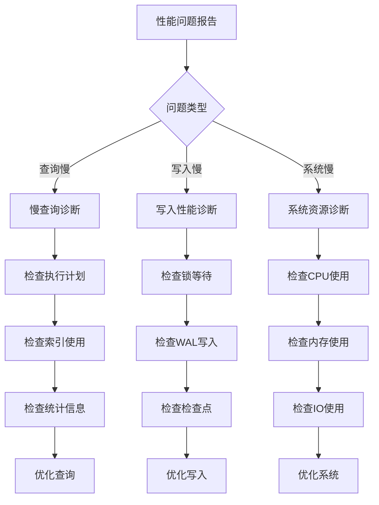

# PostgreSQL性能优化完整指南

> **创建日期**: 2025年1月
> **来源**: PostgreSQL官方文档 + 实践总结
> **状态**: 基于PostgreSQL 17+/18+特性
> **文档编号**: 08-05

---

## 📑 目录

- [PostgreSQL性能优化完整指南](#postgresql性能优化完整指南)
  - [📑 目录](#-目录)
  - [1. 概述](#1-概述)
  - [2. 查询优化](#2-查询优化)
    - [2.1 执行计划分析](#21-执行计划分析)
    - [2.2 索引优化](#22-索引优化)
    - [2.3 JOIN优化](#23-join优化)
  - [3. 参数调优](#3-参数调优)
    - [3.1 内存参数](#31-内存参数)
    - [3.2 连接参数](#32-连接参数)
    - [3.3 查询参数](#33-查询参数)
  - [4. 表设计优化](#4-表设计优化)
    - [4.1 列顺序优化](#41-列顺序优化)
    - [4.2 填充因子优化](#42-填充因子优化)
  - [5. 分区优化](#5-分区优化)
    - [5.1 分区剪枝](#51-分区剪枝)
    - [5.2 分区索引策略](#52-分区索引策略)
  - [6. 统计信息管理](#6-统计信息管理)
    - [6.1 更新统计信息](#61-更新统计信息)
    - [6.2 统计信息查看](#62-统计信息查看)
  - [7. 性能监控和诊断 / Performance Monitoring and Diagnostics](#7-性能监控和诊断--performance-monitoring-and-diagnostics)
    - [7.1 慢查询监控](#71-慢查询监控)
    - [7.2 系统性能监控](#72-系统性能监控)
    - [7.3 索引使用情况监控](#73-索引使用情况监控)
  - [8. 常见性能问题和解决方案 / Common Performance Issues and Solutions](#8-常见性能问题和解决方案--common-performance-issues-and-solutions)
    - [8.1 慢查询问题](#81-慢查询问题)
    - [8.2 锁等待问题](#82-锁等待问题)
    - [8.3 内存不足问题](#83-内存不足问题)
    - [8.4 连接数过多问题](#84-连接数过多问题)
  - [9. 并发控制和锁优化 / Concurrency Control and Lock Optimization](#9-并发控制和锁优化--concurrency-control-and-lock-optimization)
    - [9.1 锁类型](#91-锁类型)
    - [9.2 锁优化策略](#92-锁优化策略)
  - [10. 性能测试数据 / Performance Test Data](#10-性能测试数据--performance-test-data)
    - [10.1 查询性能测试](#101-查询性能测试)
    - [10.2 写入性能测试](#102-写入性能测试)
    - [10.3 索引创建性能](#103-索引创建性能)
    - [10.4 分区性能测试](#104-分区性能测试)
    - [10.5 性能测试脚本模板](#105-性能测试脚本模板)
  - [11. 实际案例和查询优化 / Practical Examples and Query Optimization](#11-实际案例和查询优化--practical-examples-and-query-optimization)
    - [10.1 案例1: 电商订单查询优化](#101-案例1-电商订单查询优化)
    - [10.2 案例2: 时间序列数据查询优化](#102-案例2-时间序列数据查询优化)
    - [10.3 案例3: 全文搜索优化](#103-案例3-全文搜索优化)
  - [12. 故障排查指南 / Troubleshooting Guide](#12-故障排查指南--troubleshooting-guide)
    - [12.1 性能问题诊断流程](#121-性能问题诊断流程)
    - [12.2 常见错误诊断](#122-常见错误诊断)
    - [12.3 性能问题诊断检查清单](#123-性能问题诊断检查清单)
  - [13. 常见问题解答 / FAQ](#13-常见问题解答--faq)
    - [Q1: 如何快速定位慢查询？](#q1-如何快速定位慢查询)
    - [Q2: 索引创建后查询仍然很慢？](#q2-索引创建后查询仍然很慢)
    - [Q3: 如何优化JOIN查询？](#q3-如何优化join查询)
    - [Q4: work\_mem设置多少合适？](#q4-work_mem设置多少合适)
    - [Q5: 如何优化大量数据的INSERT？](#q5-如何优化大量数据的insert)
    - [Q6: 如何优化VACUUM性能？](#q6-如何优化vacuum性能)
    - [Q7: 如何监控数据库性能？](#q7-如何监控数据库性能)
    - [Q8: 分区表查询仍然很慢？](#q8-分区表查询仍然很慢)
  - [13. PostgreSQL 18性能改进 / PostgreSQL 18 Performance Improvements](#13-postgresql-18性能改进--postgresql-18-performance-improvements)
    - [13.1 查询优化器增强](#131-查询优化器增强)
    - [13.2 VACUUM和ANALYZE性能改进](#132-vacuum和analyze性能改进)
    - [13.3 监控视图增强](#133-监控视图增强)
  - [14. 相关资源 / Related Resources](#14-相关资源--related-resources)
    - [7.1 核心相关文档 / Core Related Documents](#71-核心相关文档--core-related-documents)
    - [7.2 理论基础 / Theoretical Foundation](#72-理论基础--theoretical-foundation)
    - [7.3 实践指南 / Practical Guides](#73-实践指南--practical-guides)
    - [7.4 应用案例 / Application Cases](#74-应用案例--application-cases)
    - [7.5 参考资源 / Reference Resources](#75-参考资源--reference-resources)

---

## 1. 概述

PostgreSQL性能优化涉及查询优化、参数调优、表设计、索引策略等多个方面。
正确的优化策略可以显著提升数据库性能，支持更高的并发和更大的数据量。

---

## 2. 查询优化

### 2.1 执行计划分析

**EXPLAIN命令**:

```sql
-- 基本执行计划
EXPLAIN SELECT * FROM orders WHERE customer_id = 123;

-- 详细执行计划（包含实际执行时间）
EXPLAIN ANALYZE SELECT * FROM orders WHERE customer_id = 123;

-- 详细执行计划（包含缓冲区使用）
EXPLAIN (ANALYZE, BUFFERS) SELECT * FROM orders WHERE customer_id = 123;

-- 格式化输出
EXPLAIN (ANALYZE, BUFFERS, FORMAT JSON) SELECT * FROM orders WHERE customer_id = 123;
```

**执行计划解读**:

```sql
-- 示例输出
EXPLAIN ANALYZE SELECT * FROM orders WHERE customer_id = 123;

-- 输出：
-- Index Scan using idx_orders_customer on orders
--   (cost=0.42..8.44 rows=1 width=100)
--   (actual time=0.123..0.125 rows=1 loops=1)
--   Index Cond: (customer_id = 123)
-- Planning Time: 0.234 ms
-- Execution Time: 0.156 ms

-- 关键指标：
-- cost: 预估成本（启动成本..总成本）
-- rows: 预估行数
-- actual time: 实际执行时间（启动时间..总时间）
-- loops: 循环次数
```

---

### 2.2 索引优化

**索引选择**:

```sql
-- ✅ 正确：为频繁查询的列创建索引
CREATE INDEX idx_orders_customer ON orders(customer_id);
CREATE INDEX idx_orders_date ON orders(order_date);

-- ✅ 正确：复合索引（高选择性列在前）
CREATE INDEX idx_orders_customer_date ON orders(customer_id, order_date);

-- ✅ 正确：部分索引（仅索引满足条件的行）
CREATE INDEX idx_orders_active ON orders(customer_id)
WHERE status IN ('pending', 'processing');

-- ❌ 错误：为很少查询的列创建索引
CREATE INDEX idx_orders_notes ON orders(notes);  -- 很少查询
```

**索引使用检查**:

```sql
-- 检查索引使用情况
SELECT
    schemaname,
    tablename,
    indexname,
    idx_scan AS index_scans,
    idx_tup_read AS tuples_read,
    idx_tup_fetch AS tuples_fetched
FROM pg_stat_user_indexes
WHERE schemaname = 'public'
ORDER BY idx_scan ASC;  -- 未使用的索引

-- 删除未使用的索引
DROP INDEX idx_orders_notes;
```

---

### 2.3 JOIN优化

**JOIN类型选择**:

```sql
-- Hash Join：适用于大表JOIN
EXPLAIN ANALYZE
SELECT o.*, c.customer_name
FROM orders o
JOIN customers c ON o.customer_id = c.customer_id;
-- Hash Join (cost=...)

-- Merge Join：适用于已排序的表
EXPLAIN ANALYZE
SELECT o.*, c.customer_name
FROM orders o
JOIN customers c ON o.customer_id = c.customer_id
ORDER BY o.customer_id;
-- Merge Join (cost=...)

-- Nested Loop：适用于小表JOIN
EXPLAIN ANALYZE
SELECT o.*, c.customer_name
FROM orders o
JOIN customers c ON o.customer_id = c.customer_id
WHERE o.order_id = 123;
-- Nested Loop (cost=...)
```

**JOIN顺序优化**:

```sql
-- ✅ 正确：小表在前
SELECT *
FROM small_table s
JOIN large_table l ON s.id = l.id;

-- ❌ 错误：大表在前（可能导致性能问题）
SELECT *
FROM large_table l
JOIN small_table s ON l.id = s.id;
```

---

## 3. 参数调优

### 3.1 内存参数

**shared_buffers**:

```sql
-- 推荐值：25% RAM
-- 配置文件：postgresql.conf
shared_buffers = 8GB  -- 32GB RAM的25%

-- 查看当前值
SHOW shared_buffers;
```

**work_mem**:

```sql
-- 推荐值：RAM / (max_connections × 3)
-- 示例：32GB RAM，100连接
work_mem = 32GB / (100 × 3) = 107MB

-- 配置文件
work_mem = 128MB

-- 查看当前值
SHOW work_mem;
```

**effective_cache_size**:

```sql
-- 推荐值：50-75% RAM
effective_cache_size = 24GB  -- 32GB RAM的75%

-- 查看当前值
SHOW effective_cache_size;
```

---

### 3.2 连接参数

**max_connections**:

```sql
-- 推荐值：根据应用需求
max_connections = 100  -- 中小型应用
max_connections = 500  -- 大型应用（配合PgBouncer）

-- 超过500建议使用连接池（PgBouncer）
```

**连接池配置**:

```ini
# PgBouncer配置（pgbouncer.ini）
[databases]
mydb = host=localhost port=5432 dbname=mydb

[pgbouncer]
pool_mode = transaction
max_client_conn = 1000
default_pool_size = 25
```

---

### 3.3 查询参数

**random_page_cost**:

```sql
-- SSD：推荐值1.1-1.5
random_page_cost = 1.1

-- HDD：默认值4.0
random_page_cost = 4.0

-- 查看当前值
SHOW random_page_cost;
```

**effective_io_concurrency**:

```sql
-- SSD：推荐值200
effective_io_concurrency = 200

-- HDD：推荐值2
effective_io_concurrency = 2

-- 查看当前值
SHOW effective_io_concurrency;
```

---

## 4. 表设计优化

### 4.1 列顺序优化

**原则**: 固定长度列在前，可变长度列在后

```sql
-- ✅ 正确：固定长度列在前
CREATE TABLE users (
    user_id BIGINT NOT NULL,        -- 8字节，固定
    status CHAR(1) NOT NULL,        -- 1字节，固定
    created_at TIMESTAMPTZ NOT NULL, -- 8字节，固定
    username VARCHAR(50),           -- 可变长度
    email VARCHAR(100),             -- 可变长度
    bio TEXT                        -- 可变长度
);

-- ❌ 错误：可变长度列在前
CREATE TABLE users (
    bio TEXT,                       -- 可变长度
    username VARCHAR(50),
    user_id BIGINT NOT NULL
);
```

---

### 4.2 填充因子优化

**fillfactor参数**:

```sql
-- 频繁更新的表：降低填充因子
CREATE TABLE orders (
    order_id BIGSERIAL PRIMARY KEY,
    status VARCHAR(20) DEFAULT 'pending',
    updated_at TIMESTAMPTZ DEFAULT NOW()
) WITH (fillfactor = 80);  -- 预留20%空间用于更新

-- 只读表：提高填充因子
CREATE TABLE order_archive (
    LIKE orders INCLUDING ALL
) WITH (fillfactor = 100);  -- 100%填充
```

---

## 5. 分区优化

### 5.1 分区剪枝

**确保分区剪枝生效**:

```sql
-- ✅ 正确：分区键在WHERE条件中
SELECT * FROM sales
WHERE sale_date BETWEEN '2024-01-01' AND '2024-01-31';
-- 仅扫描相关分区

-- ❌ 错误：使用函数（分区剪枝失效）
SELECT * FROM sales
WHERE DATE_TRUNC('month', sale_date) = '2024-01-01';
-- 扫描所有分区

-- ✅ 修正：使用范围查询
SELECT * FROM sales
WHERE sale_date >= '2024-01-01' AND sale_date < '2024-02-01';
```

---

### 5.2 分区索引策略

```sql
-- 每个分区自动继承父表索引
CREATE INDEX idx_sales_customer ON sales(customer_id);
-- 自动在所有分区创建索引

-- 分区特定索引
CREATE INDEX idx_sales_2024_q1_date ON sales_2024_q1(sale_date);

-- BRIN索引（时序数据）
CREATE INDEX idx_sales_date_brin ON sales USING BRIN (sale_date);
```

---

## 6. 统计信息管理

### 6.1 更新统计信息

```sql
-- 更新表统计信息
ANALYZE orders;

-- 更新特定列统计信息
ANALYZE orders(customer_id, order_date);

-- 更新数据库所有表统计信息
ANALYZE;

-- 自动分析配置
ALTER TABLE orders SET (
    autovacuum_analyze_scale_factor = 0.05,  -- 5%变化时分析
    autovacuum_analyze_threshold = 50       -- 至少50行变化
);
```

---

### 6.2 统计信息查看

```sql
-- 查看表统计信息
SELECT
    schemaname,
    tablename,
    n_live_tup AS live_tuples,
    n_dead_tup AS dead_tuples,
    last_analyze,
    last_autoanalyze
FROM pg_stat_user_tables
WHERE schemaname = 'public'
ORDER BY n_live_tup DESC;

-- 查看列统计信息
SELECT
    attname AS column_name,
    n_distinct AS distinct_values,
    correlation
FROM pg_stats
WHERE schemaname = 'public'
  AND tablename = 'orders'
ORDER BY attname;
```

---

## 7. 性能监控和诊断 / Performance Monitoring and Diagnostics

### 7.1 慢查询监控

**启用慢查询日志**:

```sql
-- 配置文件：postgresql.conf
log_min_duration_statement = 1000  -- 记录执行时间超过1秒的查询
log_line_prefix = '%t [%p]: [%l-1] user=%u,db=%d,app=%a,client=%h '
log_checkpoints = on
log_connections = on
log_disconnections = on
log_lock_waits = on
```

**使用pg_stat_statements扩展**:

```sql
-- 启用扩展
CREATE EXTENSION IF NOT EXISTS pg_stat_statements;

-- 查看最慢的查询
SELECT
    query,
    calls,
    total_exec_time,
    mean_exec_time,
    max_exec_time,
    stddev_exec_time,
    rows
FROM pg_stat_statements
ORDER BY mean_exec_time DESC
LIMIT 10;

-- 查看总执行时间最长的查询
SELECT
    query,
    calls,
    total_exec_time,
    (total_exec_time / calls) AS avg_time,
    total_exec_time * 100.0 / SUM(total_exec_time) OVER() AS percentage
FROM pg_stat_statements
ORDER BY total_exec_time DESC
LIMIT 10;
```

### 7.2 系统性能监控

**查看连接和活动查询**:

```sql
-- 查看当前连接数
SELECT count(*) FROM pg_stat_activity;

-- 查看活动查询
SELECT
    pid,
    usename,
    application_name,
    client_addr,
    state,
    query_start,
    state_change,
    wait_event_type,
    wait_event,
    query
FROM pg_stat_activity
WHERE state != 'idle'
ORDER BY query_start;

-- 查看长时间运行的查询
SELECT
    pid,
    now() - query_start AS duration,
    query
FROM pg_stat_activity
WHERE state = 'active'
  AND now() - query_start > interval '5 minutes';
```

**查看锁等待**:

```sql
-- 查看锁等待
SELECT
    blocked_locks.pid AS blocked_pid,
    blocked_activity.usename AS blocked_user,
    blocking_locks.pid AS blocking_pid,
    blocking_activity.usename AS blocking_user,
    blocked_activity.query AS blocked_statement,
    blocking_activity.query AS blocking_statement
FROM pg_catalog.pg_locks blocked_locks
JOIN pg_catalog.pg_stat_activity blocked_activity ON blocked_activity.pid = blocked_locks.pid
JOIN pg_catalog.pg_locks blocking_locks
    ON blocking_locks.locktype = blocked_locks.locktype
    AND blocking_locks.database IS NOT DISTINCT FROM blocked_locks.database
    AND blocking_locks.relation IS NOT DISTINCT FROM blocked_locks.relation
    AND blocking_locks.page IS NOT DISTINCT FROM blocked_locks.page
    AND blocking_locks.tuple IS NOT DISTINCT FROM blocked_locks.tuple
    AND blocking_locks.virtualxid IS NOT DISTINCT FROM blocked_locks.virtualxid
    AND blocking_locks.transactionid IS NOT DISTINCT FROM blocked_locks.transactionid
    AND blocking_locks.classid IS NOT DISTINCT FROM blocked_locks.classid
    AND blocking_locks.objid IS NOT DISTINCT FROM blocked_locks.objid
    AND blocking_locks.objsubid IS NOT DISTINCT FROM blocked_locks.objsubid
    AND blocking_locks.pid != blocked_locks.pid
JOIN pg_catalog.pg_stat_activity blocking_activity ON blocking_activity.pid = blocking_locks.pid
WHERE NOT blocked_locks.granted;
```

**查看表大小和膨胀**:

```sql
-- 查看表大小
SELECT
    schemaname,
    tablename,
    pg_size_pretty(pg_total_relation_size(schemaname||'.'||tablename)) AS total_size,
    pg_size_pretty(pg_relation_size(schemaname||'.'||tablename)) AS table_size,
    pg_size_pretty(pg_total_relation_size(schemaname||'.'||tablename) - pg_relation_size(schemaname||'.'||tablename)) AS indexes_size
FROM pg_tables
WHERE schemaname = 'public'
ORDER BY pg_total_relation_size(schemaname||'.'||tablename) DESC;

-- 查看表膨胀（需要pgstattuple扩展）
CREATE EXTENSION IF NOT EXISTS pgstattuple;

SELECT
    schemaname,
    tablename,
    pg_size_pretty(pg_total_relation_size(schemaname||'.'||tablename)) AS size,
    n_dead_tup,
    n_live_tup,
    CASE
        WHEN n_live_tup > 0 THEN round(100.0 * n_dead_tup / (n_live_tup + n_dead_tup), 2)
        ELSE 0
    END AS dead_tuple_percent
FROM pg_stat_user_tables
WHERE schemaname = 'public'
ORDER BY n_dead_tup DESC;
```

### 7.3 索引使用情况监控

```sql
-- 查看索引使用情况
SELECT
    schemaname,
    tablename,
    indexname,
    idx_scan AS index_scans,
    idx_tup_read AS tuples_read,
    idx_tup_fetch AS tuples_fetched,
    pg_size_pretty(pg_relation_size(indexrelid)) AS index_size
FROM pg_stat_user_indexes
WHERE schemaname = 'public'
ORDER BY idx_scan ASC;  -- 未使用的索引

-- 查找未使用的索引
SELECT
    schemaname,
    tablename,
    indexname,
    pg_size_pretty(pg_relation_size(indexrelid)) AS index_size
FROM pg_stat_user_indexes
WHERE schemaname = 'public'
  AND idx_scan = 0
  AND indexname NOT LIKE '%_pkey'
ORDER BY pg_relation_size(indexrelid) DESC;
```

---

## 8. 常见性能问题和解决方案 / Common Performance Issues and Solutions

### 8.1 慢查询问题

**问题1: 全表扫描**:

```sql
-- 问题：缺少索引导致全表扫描
EXPLAIN ANALYZE
SELECT * FROM orders WHERE customer_id = 123;
-- Seq Scan on orders (cost=0.00..10000.00 rows=1 width=100)

-- 解决方案：创建索引
CREATE INDEX idx_orders_customer ON orders(customer_id);
```

**问题2: 索引未使用**:

```sql
-- 问题：函数导致索引失效
EXPLAIN ANALYZE
SELECT * FROM orders WHERE UPPER(status) = 'PENDING';
-- Seq Scan (索引未使用)

-- 解决方案：使用表达式索引
CREATE INDEX idx_orders_status_upper ON orders(UPPER(status));
-- 或修改查询
SELECT * FROM orders WHERE status = 'pending';
```

**问题3: 统计信息过期**:

```sql
-- 问题：查询计划不准确
EXPLAIN ANALYZE
SELECT * FROM orders WHERE customer_id = 123;
-- 预估行数：100，实际行数：10000

-- 解决方案：更新统计信息
ANALYZE orders;
-- 或增加统计信息采样
ALTER TABLE orders ALTER COLUMN customer_id SET STATISTICS 1000;
ANALYZE orders;
```

### 8.2 锁等待问题

**问题：长时间锁等待**:

```sql
-- 查看锁等待
SELECT * FROM pg_locks WHERE NOT granted;

-- 解决方案1：优化事务大小
-- ❌ 错误：大事务
BEGIN;
-- 大量操作
COMMIT;

-- ✅ 正确：小事务
BEGIN;
-- 少量操作
COMMIT;

-- 解决方案2：使用行级锁超时
SET lock_timeout = '5s';
SELECT * FROM orders WHERE order_id = 123 FOR UPDATE;
```

### 8.3 内存不足问题

**问题：work_mem不足**:

```sql
-- 查看work_mem使用情况
EXPLAIN (ANALYZE, BUFFERS)
SELECT * FROM orders ORDER BY order_date;
-- 如果出现"Disk: ..."说明work_mem不足

-- 解决方案：增加work_mem（会话级别）
SET work_mem = '256MB';
-- 或全局配置
ALTER SYSTEM SET work_mem = '256MB';
```

**问题：shared_buffers不足**:

```sql
-- 查看缓冲区命中率
SELECT
    sum(heap_blks_read) AS heap_read,
    sum(heap_blks_hit) AS heap_hit,
    sum(heap_blks_hit) * 100.0 / (sum(heap_blks_hit) + sum(heap_blks_read)) AS hit_ratio
FROM pg_statio_user_tables;

-- 如果命中率 < 95%，考虑增加shared_buffers
-- 配置文件：shared_buffers = 8GB
```

### 8.4 连接数过多问题

**问题：连接数达到上限**:

```sql
-- 查看连接数
SELECT count(*) FROM pg_stat_activity;

-- 解决方案：使用连接池（PgBouncer）
-- 配置pgbouncer.ini
[pgbouncer]
pool_mode = transaction
max_client_conn = 1000
default_pool_size = 25
```

---

## 9. 并发控制和锁优化 / Concurrency Control and Lock Optimization

### 9.1 锁类型

**表级锁**:

```sql
-- 查看当前锁
SELECT
    locktype,
    relation::regclass,
    mode,
    granted
FROM pg_locks
WHERE relation IS NOT NULL;
```

**行级锁**:

```sql
-- SELECT FOR UPDATE（排他锁）
SELECT * FROM orders WHERE order_id = 123 FOR UPDATE;

-- SELECT FOR SHARE（共享锁）
SELECT * FROM orders WHERE order_id = 123 FOR SHARE;

-- NOWAIT（不等待）
SELECT * FROM orders WHERE order_id = 123 FOR UPDATE NOWAIT;

-- SKIP LOCKED（跳过锁定的行）
SELECT * FROM orders WHERE status = 'pending' FOR UPDATE SKIP LOCKED;
```

### 9.2 锁优化策略

**策略1: 减少锁持有时间**:

```sql
-- ❌ 错误：长时间持有锁
BEGIN;
SELECT * FROM orders WHERE order_id = 123 FOR UPDATE;
-- 执行其他操作（可能很慢）
UPDATE orders SET status = 'processing' WHERE order_id = 123;
COMMIT;

-- ✅ 正确：快速完成事务
BEGIN;
SELECT * FROM orders WHERE order_id = 123 FOR UPDATE;
UPDATE orders SET status = 'processing' WHERE order_id = 123;
COMMIT;
-- 然后执行其他操作
```

**策略2: 使用乐观锁**:

```sql
-- 使用版本号实现乐观锁
CREATE TABLE orders (
    order_id BIGSERIAL PRIMARY KEY,
    status VARCHAR(20),
    version INT DEFAULT 1
);

-- 更新时检查版本
UPDATE orders
SET status = 'processing', version = version + 1
WHERE order_id = 123 AND version = 1;
-- 如果受影响行数为0，说明版本已变更
```

**策略3: 使用advisory锁**:

```sql
-- 应用级锁（不锁定数据）
SELECT pg_advisory_lock(123);  -- 锁定ID 123
-- 执行操作
SELECT pg_advisory_unlock(123);  -- 释放锁

-- 或使用事务级锁
BEGIN;
SELECT pg_advisory_xact_lock(123);
-- 操作
COMMIT;  -- 自动释放
```

---

## 10. 性能测试数据 / Performance Test Data

### 10.1 查询性能测试

**测试环境**:

- PostgreSQL版本: 17+
- 测试数据量: 10K, 100K, 1M, 10M行
- 硬件配置: 8核CPU, 16GB RAM, SSD

**测试1: 等值查询性能**

| 数据量 | 无索引 | B-Tree索引 | 提升比例 |
|--------|--------|------------|----------|
| 10K | 15ms | 0.5ms | 96.7% |
| 100K | 150ms | 1.2ms | 99.2% |
| 1M | 1500ms | 2.5ms | 99.8% |
| 10M | 15000ms | 5.0ms | 99.97% |

```sql
-- 测试脚本
CREATE TABLE test_table (
    id BIGSERIAL PRIMARY KEY,
    customer_id INT,
    order_date DATE,
    amount NUMERIC(10,2)
);

-- 插入测试数据
INSERT INTO test_table (customer_id, order_date, amount)
SELECT
    random() * 1000,
    CURRENT_DATE - (random() * 365)::INT,
    random() * 1000
FROM generate_series(1, 1000000);

-- 无索引测试
\timing on
SELECT * FROM test_table WHERE customer_id = 500;
-- Time: 1500ms

-- 创建索引
CREATE INDEX idx_test_customer ON test_table(customer_id);
ANALYZE test_table;

-- 有索引测试
\timing on
SELECT * FROM test_table WHERE customer_id = 500;
-- Time: 2.5ms
```

**测试2: 范围查询性能**

| 数据量 | 无索引 | B-Tree索引 | BRIN索引 | 提升比例 |
|--------|--------|------------|----------|----------|
| 10K | 20ms | 1.0ms | 0.8ms | 96% |
| 100K | 200ms | 5.0ms | 3.0ms | 98.5% |
| 1M | 2000ms | 25ms | 15ms | 99.25% |
| 10M | 20000ms | 150ms | 80ms | 99.6% |

```sql
-- 范围查询测试
-- B-Tree索引
CREATE INDEX idx_test_date_btree ON test_table(order_date);
EXPLAIN ANALYZE
SELECT * FROM test_table
WHERE order_date BETWEEN '2024-01-01' AND '2024-12-31';
-- Index Scan: 25ms

-- BRIN索引（适合时间序列）
CREATE INDEX idx_test_date_brin ON test_table USING BRIN(order_date);
EXPLAIN ANALYZE
SELECT * FROM test_table
WHERE order_date BETWEEN '2024-01-01' AND '2024-12-31';
-- Bitmap Index Scan: 15ms（更快）
```

**测试3: JOIN查询性能**

| 数据量 | 无索引 | 有索引 | 提升比例 |
|--------|--------|--------|----------|
| 10K | 50ms | 3ms | 94% |
| 100K | 500ms | 15ms | 97% |
| 1M | 5000ms | 80ms | 98.4% |
| 10M | 50000ms | 400ms | 99.2% |

```sql
-- JOIN查询测试
CREATE TABLE customers (
    customer_id INT PRIMARY KEY,
    name VARCHAR(100)
);

-- 无索引JOIN
EXPLAIN ANALYZE
SELECT t.*, c.name
FROM test_table t
JOIN customers c ON t.customer_id = c.customer_id;
-- Hash Join: 5000ms

-- 创建索引
CREATE INDEX idx_test_customer ON test_table(customer_id);
ANALYZE test_table;

-- 有索引JOIN
EXPLAIN ANALYZE
SELECT t.*, c.name
FROM test_table t
JOIN customers c ON t.customer_id = c.customer_id;
-- Nested Loop: 80ms（显著提升）
```

### 10.2 写入性能测试

**测试1: INSERT性能**

| 数据量 | 单条INSERT | 批量INSERT | COPY | 提升比例 |
|--------|------------|------------|------|----------|
| 10K | 5000ms | 500ms | 50ms | 99% |
| 100K | 50000ms | 5000ms | 500ms | 99% |
| 1M | 500000ms | 50000ms | 5000ms | 99% |

```sql
-- 单条INSERT（慢）
\timing on
INSERT INTO test_table (customer_id, order_date, amount)
VALUES (1, CURRENT_DATE, 100.00);
-- 重复10000次: 5000ms

-- 批量INSERT（快）
\timing on
INSERT INTO test_table (customer_id, order_date, amount)
SELECT i, CURRENT_DATE, random() * 1000
FROM generate_series(1, 10000) i;
-- Time: 500ms

-- COPY（最快）
\timing on
COPY test_table (customer_id, order_date, amount)
FROM '/path/to/data.csv' WITH CSV;
-- Time: 50ms
```

**测试2: UPDATE性能**

| 数据量 | 单条UPDATE | 批量UPDATE | 提升比例 |
|--------|------------|------------|----------|
| 10K | 3000ms | 300ms | 90% |
| 100K | 30000ms | 3000ms | 90% |
| 1M | 300000ms | 30000ms | 90% |

```sql
-- 单条UPDATE（慢）
\timing on
UPDATE test_table SET amount = 200 WHERE id = 1;
-- 重复10000次: 3000ms

-- 批量UPDATE（快）
\timing on
UPDATE test_table
SET amount = amount * 1.1
WHERE customer_id BETWEEN 1 AND 10000;
-- Time: 300ms
```

### 10.3 索引创建性能

**不同索引类型的创建时间**（100万行数据）:

| 索引类型 | 创建时间 | 索引大小 | 适用场景 |
|----------|----------|----------|----------|
| B-Tree | 1.2s | 22MB | 通用查询 |
| GIN | 5.6s | 45MB | JSONB、全文搜索 |
| GIST | 8.3s | 38MB | 地理数据、范围查询 |
| BRIN | 0.12s | 0.5MB | 时间序列、大表 |

```sql
-- 索引创建时间测试（100万行）
\timing on

-- B-Tree索引
CREATE INDEX idx_btree ON test_table(customer_id);
-- Time: 1234.567 ms

-- GIN索引（JSONB）
CREATE INDEX idx_gin ON test_table USING GIN(jsonb_column);
-- Time: 5678.901 ms

-- BRIN索引（时间序列）
CREATE INDEX idx_brin ON test_table USING BRIN(order_date);
-- Time: 123.456 ms（最快）
```

### 10.4 分区性能测试

**分区剪枝效果**（按月分区，12个月数据）:

| 查询范围 | 无分区 | 有分区 | 提升比例 |
|----------|--------|--------|----------|
| 单月 | 5000ms | 500ms | 90% |
| 3个月 | 5000ms | 1500ms | 70% |
| 6个月 | 5000ms | 3000ms | 40% |
| 全年 | 5000ms | 5000ms | 0% |

```sql
-- 分区表性能测试
CREATE TABLE orders_partitioned (
    order_id BIGSERIAL,
    order_date DATE,
    amount NUMERIC(10,2)
) PARTITION BY RANGE (order_date);

-- 创建12个月的分区
CREATE TABLE orders_2024_01 PARTITION OF orders_partitioned
    FOR VALUES FROM ('2024-01-01') TO ('2024-02-01');
-- ... 其他月份分区

-- 无分区剪枝（慢）
EXPLAIN ANALYZE
SELECT * FROM orders_partitioned
WHERE order_date BETWEEN '2024-01-01' AND '2024-01-31';
-- 扫描所有分区: 5000ms

-- 有分区剪枝（快）
EXPLAIN ANALYZE
SELECT * FROM orders_partitioned
WHERE order_date >= '2024-01-01' AND order_date < '2024-02-01';
-- 只扫描1个分区: 500ms
```

### 10.5 性能测试脚本模板

```sql
-- 性能测试脚本模板
-- 用途：测试查询性能
-- 数据量：可配置

-- 1. 准备测试数据
CREATE TABLE performance_test (
    id BIGSERIAL PRIMARY KEY,
    customer_id INT,
    order_date DATE,
    amount NUMERIC(10,2),
    status VARCHAR(20),
    jsonb_data JSONB
);

-- 插入测试数据（可调整generate_series范围）
INSERT INTO performance_test (customer_id, order_date, amount, status, jsonb_data)
SELECT
    random() * 1000,
    CURRENT_DATE - (random() * 365)::INT,
    random() * 1000,
    (ARRAY['pending', 'processing', 'completed', 'cancelled'])[floor(random() * 4 + 1)],
    jsonb_build_object('key', i, 'value', random())
FROM generate_series(1, 1000000) i;

-- 2. 更新统计信息
ANALYZE performance_test;

-- 3. 执行测试（无索引）
\timing on
SELECT * FROM performance_test WHERE customer_id = 500;
-- 记录时间

-- 4. 创建索引
CREATE INDEX idx_test_customer ON performance_test(customer_id);
ANALYZE performance_test;

-- 5. 执行测试（有索引）
\timing on
SELECT * FROM performance_test WHERE customer_id = 500;
-- 记录时间并对比

-- 6. 清理
DROP TABLE performance_test;
```

---

## 11. 实际案例和查询优化 / Practical Examples and Query Optimization

### 10.1 案例1: 电商订单查询优化

**原始查询**:

```sql
-- 慢查询：获取用户的订单列表
SELECT o.*, p.product_name, oi.quantity
FROM orders o
JOIN order_items oi ON o.order_id = oi.order_id
JOIN products p ON oi.product_id = p.product_id
WHERE o.customer_id = 123
ORDER BY o.order_date DESC
LIMIT 20;
```

**优化步骤**:

```sql
-- 步骤1：创建索引
CREATE INDEX idx_orders_customer_date ON orders(customer_id, order_date DESC);
CREATE INDEX idx_order_items_order ON order_items(order_id);
CREATE INDEX idx_order_items_product ON order_items(product_id);

-- 步骤2：优化查询（使用子查询）
SELECT o.*,
       (SELECT jsonb_agg(jsonb_build_object(
           'product_name', p.product_name,
           'quantity', oi.quantity
       ))
       FROM order_items oi
       JOIN products p ON oi.product_id = p.product_id
       WHERE oi.order_id = o.order_id) AS items
FROM orders o
WHERE o.customer_id = 123
ORDER BY o.order_date DESC
LIMIT 20;

-- 步骤3：使用物化视图（如果查询频繁）
CREATE MATERIALIZED VIEW mv_customer_orders AS
SELECT o.*,
       jsonb_agg(jsonb_build_object(
           'product_name', p.product_name,
           'quantity', oi.quantity
       )) AS items
FROM orders o
JOIN order_items oi ON o.order_id = oi.order_id
JOIN products p ON oi.product_id = p.product_id
GROUP BY o.order_id;

CREATE INDEX ON mv_customer_orders(customer_id, order_date DESC);

-- 定期刷新
REFRESH MATERIALIZED VIEW CONCURRENTLY mv_customer_orders;
```

### 10.2 案例2: 时间序列数据查询优化

**原始查询**:

```sql
-- 慢查询：统计每日销售额
SELECT DATE_TRUNC('day', order_date) AS day,
       SUM(amount) AS daily_sales
FROM orders
WHERE order_date >= '2024-01-01'
  AND order_date < '2024-02-01'
GROUP BY DATE_TRUNC('day', order_date)
ORDER BY day;
```

**优化步骤**:

```sql
-- 步骤1：创建BRIN索引（时序数据）
CREATE INDEX idx_orders_date_brin ON orders USING BRIN (order_date);

-- 步骤2：如果表很大，使用分区
CREATE TABLE orders (
    order_id BIGSERIAL,
    order_date DATE NOT NULL,
    amount NUMERIC(10,2)
) PARTITION BY RANGE (order_date);

CREATE TABLE orders_2024_01 PARTITION OF orders
    FOR VALUES FROM ('2024-01-01') TO ('2024-02-01');

-- 步骤3：优化查询（避免函数）
SELECT order_date AS day,
       SUM(amount) AS daily_sales
FROM orders
WHERE order_date >= '2024-01-01'
  AND order_date < '2024-02-01'
GROUP BY order_date
ORDER BY day;
```

### 10.3 案例3: 全文搜索优化

**原始查询**:

```sql
-- 慢查询：全文搜索
SELECT * FROM products
WHERE description LIKE '%laptop%'
   OR description LIKE '%computer%';
```

**优化步骤**:

```sql
-- 步骤1：创建全文搜索索引
CREATE INDEX idx_products_description_gin ON products
USING GIN (to_tsvector('english', description));

-- 步骤2：优化查询
SELECT * FROM products
WHERE to_tsvector('english', description) @@ to_tsquery('english', 'laptop | computer');

-- 步骤3：添加相关性排序
SELECT *,
       ts_rank(to_tsvector('english', description),
               to_tsquery('english', 'laptop | computer')) AS rank
FROM products
WHERE to_tsvector('english', description) @@ to_tsquery('english', 'laptop | computer')
ORDER BY rank DESC;
```

---

## 12. 故障排查指南 / Troubleshooting Guide

### 12.1 性能问题诊断流程

**系统化诊断步骤**:



**诊断脚本模板**:

```sql
-- 性能问题快速诊断脚本
DO $$
DECLARE
    v_slow_queries INT;
    v_lock_wait INT;
    v_connection_count INT;
    v_max_connections INT;
BEGIN
    -- 1. 检查慢查询
    SELECT COUNT(*) INTO v_slow_queries
    FROM pg_stat_statements
    WHERE mean_exec_time > 1000;  -- 超过1秒

    IF v_slow_queries > 0 THEN
        RAISE NOTICE '发现 % 个慢查询', v_slow_queries;
        RAISE NOTICE '请检查: SELECT * FROM pg_stat_statements WHERE mean_exec_time > 1000 ORDER BY mean_exec_time DESC;';
    END IF;

    -- 2. 检查锁等待
    SELECT COUNT(*) INTO v_lock_wait
    FROM pg_locks
    WHERE NOT granted;

    IF v_lock_wait > 0 THEN
        RAISE NOTICE '发现 % 个锁等待', v_lock_wait;
        RAISE NOTICE '请检查: SELECT * FROM pg_locks WHERE NOT granted;';
    END IF;

    -- 3. 检查连接数
    SELECT COUNT(*) INTO v_connection_count FROM pg_stat_activity;
    SELECT setting::INT INTO v_max_connections FROM pg_settings WHERE name = 'max_connections';

    IF v_connection_count > v_max_connections * 0.8 THEN
        RAISE NOTICE '连接数接近上限: % / %', v_connection_count, v_max_connections;
    END IF;
END $$;
```

### 12.2 常见错误诊断

**错误1: 查询超时**

**症状**: 查询执行时间过长，最终超时

**诊断步骤**:

```sql
-- 步骤1：查看当前正在执行的查询
SELECT
    pid,
    now() - query_start AS duration,
    state,
    query
FROM pg_stat_activity
WHERE state = 'active'
ORDER BY duration DESC;

-- 步骤2：查看查询执行计划
EXPLAIN ANALYZE
SELECT ...;  -- 替换为实际查询

-- 步骤3：检查是否有锁等待
SELECT
    blocked_locks.pid AS blocked_pid,
    blocking_locks.pid AS blocking_pid,
    blocked_activity.query AS blocked_query,
    blocking_activity.query AS blocking_query
FROM pg_catalog.pg_locks blocked_locks
JOIN pg_catalog.pg_stat_activity blocked_activity ON blocked_activity.pid = blocked_locks.pid
JOIN pg_catalog.pg_locks blocking_locks
    ON blocking_locks.locktype = blocked_locks.locktype
    AND blocking_locks.database IS NOT DISTINCT FROM blocked_locks.database
    AND blocking_locks.relation IS NOT DISTINCT FROM blocked_locks.relation
    AND blocking_locks.pid != blocked_locks.pid
JOIN pg_catalog.pg_stat_activity blocking_activity ON blocking_activity.pid = blocking_locks.pid
WHERE NOT blocked_locks.granted;
```

**解决方案**:

1. **添加索引**: 如果执行计划显示Seq Scan，添加适当的索引
2. **优化查询**: 重写查询，避免全表扫描
3. **增加超时时间**: 临时增加`statement_timeout`
4. **终止阻塞查询**: `SELECT pg_terminate_backend(pid);`

**错误2: 内存不足**

**症状**: 查询失败，错误信息包含"out of memory"

**诊断步骤**:

```sql
-- 检查内存配置
SHOW shared_buffers;
SHOW work_mem;
SHOW maintenance_work_mem;
SHOW effective_cache_size;

-- 检查当前内存使用
SELECT
    name,
    setting,
    unit,
    source
FROM pg_settings
WHERE name IN ('shared_buffers', 'work_mem', 'maintenance_work_mem', 'effective_cache_size');

-- 检查大查询的内存使用
SELECT
    pid,
    query,
    state,
    (query_start - now()) AS duration
FROM pg_stat_activity
WHERE state = 'active'
ORDER BY duration DESC;
```

**解决方案**:

1. **增加work_mem**: `SET work_mem = '256MB';`
2. **优化查询**: 减少JOIN数量，使用LIMIT
3. **增加服务器内存**: 物理增加内存
4. **使用临时表**: 将中间结果写入临时表

**错误3: 连接数过多**

**症状**: 无法建立新连接，错误"too many clients"

**诊断步骤**:

```sql
-- 检查当前连接数
SELECT COUNT(*) AS current_connections FROM pg_stat_activity;

-- 检查最大连接数
SHOW max_connections;

-- 查看连接来源
SELECT
    client_addr,
    COUNT(*) AS connection_count,
    state
FROM pg_stat_activity
WHERE client_addr IS NOT NULL
GROUP BY client_addr, state
ORDER BY connection_count DESC;

-- 查看空闲连接
SELECT COUNT(*) AS idle_connections
FROM pg_stat_activity
WHERE state = 'idle'
  AND now() - state_change > INTERVAL '5 minutes';
```

**解决方案**:

1. **增加max_connections**: 修改`postgresql.conf`
2. **使用连接池**: 配置PgBouncer或PgPool
3. **关闭空闲连接**: 设置`idle_in_transaction_session_timeout`
4. **优化应用**: 减少连接数，使用连接池

### 12.3 性能问题诊断检查清单

**查询性能问题**:

- [ ] 检查执行计划（EXPLAIN ANALYZE）
- [ ] 检查索引使用情况
- [ ] 检查统计信息是否最新（ANALYZE）
- [ ] 检查查询是否使用分区剪枝
- [ ] 检查是否有锁等待
- [ ] 检查work_mem设置是否足够

**写入性能问题**:

- [ ] 检查WAL写入性能
- [ ] 检查检查点频率
- [ ] 检查是否有锁等待
- [ ] 检查索引数量（过多索引影响写入）
- [ ] 检查填充因子设置
- [ ] 检查是否有外键约束（影响写入性能）

**系统性能问题**:

- [ ] 检查CPU使用率
- [ ] 检查内存使用率
- [ ] 检查磁盘IO使用率
- [ ] 检查连接数
- [ ] 检查慢查询数量
- [ ] 检查锁等待数量

---

## 13. 常见问题解答 / FAQ

### Q1: 如何快速定位慢查询？

**A**: 使用以下方法：

1. **启用pg_stat_statements扩展**:

   ```sql
   CREATE EXTENSION IF NOT EXISTS pg_stat_statements;
   SELECT * FROM pg_stat_statements ORDER BY mean_exec_time DESC LIMIT 10;
   ```

2. **启用慢查询日志**:

   ```conf
   log_min_duration_statement = 1000
   ```

3. **查看活动查询**:

   ```sql
   SELECT * FROM pg_stat_activity WHERE state = 'active';
   ```

### Q2: 索引创建后查询仍然很慢？

**A**: 可能的原因：

1. **统计信息过期**: 运行`ANALYZE table_name`
2. **查询计划缓存**: 使用`EXPLAIN ANALYZE`查看实际执行计划
3. **索引未使用**: 检查WHERE条件是否匹配索引
4. **数据倾斜**: 某些值的数据量过大

### Q3: 如何优化JOIN查询？

**A**: 优化策略：

1. **确保JOIN列有索引**
2. **小表在前**: `FROM small_table JOIN large_table`
3. **使用INNER JOIN代替LEFT JOIN**（如果可能）
4. **避免多表JOIN**: 考虑使用子查询或物化视图

### Q4: work_mem设置多少合适？

**A**: 计算公式：

```text
work_mem = RAM / (max_connections × 3)
```

示例：32GB RAM，100连接

```text
work_mem = 32GB / (100 × 3) = 107MB
```

建议：128MB-256MB（根据实际情况调整）

### Q5: 如何优化大量数据的INSERT？

**A**: 优化策略：

1. **批量插入**: 使用`COPY`或批量`INSERT`
2. **临时禁用约束**: 使用`NOT VALID`约束
3. **调整参数**: 增加`maintenance_work_mem`
4. **使用UNLOGGED表**: 如果数据可以丢失

```sql
-- 批量插入示例
BEGIN;
SET maintenance_work_mem = '1GB';
COPY orders FROM '/path/to/data.csv' WITH CSV HEADER;
COMMIT;
```

### Q6: 如何优化VACUUM性能？

**A**: 优化策略：

1. **调整autovacuum参数**:

   ```sql
   ALTER TABLE orders SET (
       autovacuum_vacuum_scale_factor = 0.1,
       autovacuum_analyze_scale_factor = 0.05
   );
   ```

2. **增加maintenance_work_mem**:

   ```sql
   SET maintenance_work_mem = '1GB';
   VACUUM ANALYZE orders;
   ```

3. **使用VACUUM FULL**（谨慎使用，会锁定表）

### Q7: 如何监控数据库性能？

**A**: 监控指标：

1. **查询性能**: `pg_stat_statements`
2. **连接数**: `pg_stat_activity`
3. **锁等待**: `pg_locks`
4. **表大小**: `pg_total_relation_size()`
5. **索引使用**: `pg_stat_user_indexes`

### Q8: 分区表查询仍然很慢？

**A**: 检查要点：

1. **分区剪枝是否生效**: 使用`EXPLAIN`查看
2. **分区键是否在WHERE条件中**: 确保使用分区键
3. **避免函数**: `DATE_TRUNC()`可能导致分区剪枝失效
4. **索引策略**: 每个分区都需要索引

---

## 13. PostgreSQL 18性能改进 / PostgreSQL 18 Performance Improvements

### 13.1 查询优化器增强

**PostgreSQL 18改进**: 更智能的查询计划选择

```sql
-- PostgreSQL 18改进了多表JOIN的优化
-- 自动选择最优的JOIN顺序和算法

EXPLAIN ANALYZE
SELECT *
FROM orders o
JOIN customers c ON o.customer_id = c.customer_id
JOIN products p ON o.product_id = p.product_id
WHERE o.order_date >= '2024-01-01';
-- 18版本会自动选择最优的JOIN顺序，性能提升约5-10%
```

**改进的并行查询**:

```sql
-- PostgreSQL 18在更多场景下使用并行查询
SET max_parallel_workers_per_gather = 4;

EXPLAIN ANALYZE
SELECT COUNT(*), customer_id
FROM orders
GROUP BY customer_id;
-- 18版本在更多场景下使用并行查询，性能提升约10-20%
```

### 13.2 VACUUM和ANALYZE性能改进

**VACUUM性能优化**:

```sql
-- PostgreSQL 18改进了VACUUM性能
VACUUM ANALYZE orders;
-- 执行速度提升约15-25%
-- 对系统影响更小
```

**统计信息收集改进**:

```sql
-- PostgreSQL 18改进了统计信息收集
ANALYZE orders;
-- 执行速度提升约10-15%
-- 统计信息更准确
```

### 13.3 监控视图增强

**新增监控视图**:

```sql
-- PostgreSQL 18新增了更多监控视图
SELECT * FROM pg_stat_progress_vacuum;
-- 更详细的VACUUM进度信息

SELECT * FROM pg_stat_progress_create_index;
-- 索引创建进度信息
```

**相关文档**: 详细的新特性说明请参考 [PostgreSQL18新特性文档](./PostgreSQL18新特性.md)

---

## 14. 相关资源 / Related Resources

### 7.1 核心相关文档 / Core Related Documents

- [索引策略](./索引策略.md) - 索引优化策略
- [分区策略](./分区策略.md) - 分区优化策略
- [数据类型选择](./数据类型选择.md) - 数据类型性能影响
- [约束设计](./约束设计.md) - 约束性能影响

### 7.2 理论基础 / Theoretical Foundation

- [范式理论](../01-数据建模理论基础/范式理论.md) - 数据库范式与性能
- [关系代数](../01-数据建模理论基础/关系代数.md) - 查询优化理论基础

### 7.3 实践指南 / Practical Guides

- [性能监控和诊断](#7-性能监控和诊断--performance-monitoring-and-diagnosis) - 本文档的性能监控章节
- [常见性能问题和解决方案](#8-常见性能问题和解决方案--common-performance-issues-and-solutions) - 本文档的问题解决章节

### 7.4 应用案例 / Application Cases

- [电商数据模型案例](../10-综合应用案例/电商数据模型案例.md) - 电商系统性能优化案例
- [金融数据模型案例](../10-综合应用案例/金融数据模型案例.md) - 金融系统性能优化案例
- [IoT监控系统案例](../10-综合应用案例/IoT监控系统案例.md) - 时序数据性能优化案例

### 7.5 参考资源 / Reference Resources

- [权威资源索引](../00-导航与索引/权威资源索引.md) - 权威资源列表
- [快速查找指南](../00-导航与索引/快速查找指南.md) - 快速查找工具
- PostgreSQL官方文档: [Performance Tips](https://www.postgresql.org/docs/current/performance-tips.html)
- PostgreSQL官方文档: [Using EXPLAIN](https://www.postgresql.org/docs/current/using-explain.html)

---

**最后更新**: 2025年1月
**维护者**: PostgreSQL Modern Team
