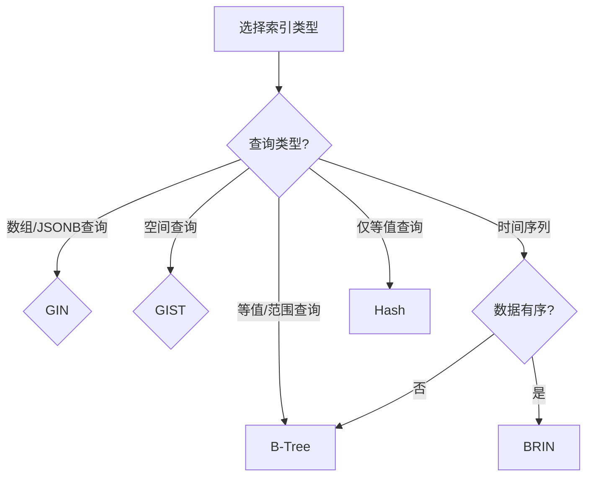

# PostgreSQL索引策略完整指南

> **创建日期**: 2025年1月
> **来源**: PostgreSQL官方文档 + 实践总结
> **状态**: 基于PostgreSQL 17+/18+特性
> **文档编号**: 08-02

---

## 📑 目录

- [1. 概述](#1-概述)
- [2. 索引类型](#2-索引类型)
  - [2.1 B-Tree索引](#21-b-tree索引)
  - [2.2 GIN索引](#22-gin索引)
  - [2.3 GIST索引](#23-gist索引)
  - [2.4 BRIN索引](#24-brin索引)
  - [2.5 SP-GIST索引](#25-sp-gist索引)
  - [2.6 Hash索引](#26-hash索引)
- [3. 索引选择决策](#3-索引选择决策)
- [4. 索引设计最佳实践](#4-索引设计最佳实践)
- [5. 索引维护与优化](#5-索引维护与优化)
- [6. 常见索引模式](#6-常见索引模式)
- [7. 索引性能调优](#7-索引性能调优)
- [8. 相关资源](#8-相关资源)

---

## 1. 概述

PostgreSQL提供了5种主要索引类型（B-Tree、GIN、GIST、BRIN、SP-GIST），每种索引类型针对不同的查询模式和数据特性优化。
正确选择和使用索引是PostgreSQL性能优化的关键。

---

## 2. 索引类型

### 2.1 B-Tree索引

**定义**: 最常用的索引类型，适用于大多数查询场景。

**特点**:

- 支持等值查询和范围查询
- 支持排序（ORDER BY）
- 支持唯一约束
- 自动创建（PRIMARY KEY、UNIQUE约束）

**时间复杂度**: O(log n)

**存储空间**: 约1.2×数据量

**适用场景**:

- 等值查询（WHERE column = value）
- 范围查询（WHERE column BETWEEN ...）
- 排序查询（ORDER BY column）
- 唯一性约束

**PostgreSQL实现**:

```sql
-- 自动创建（主键）
CREATE TABLE users (
    user_id BIGSERIAL PRIMARY KEY,  -- 自动创建B-Tree索引
    username VARCHAR(50) UNIQUE,     -- 自动创建B-Tree索引
    email VARCHAR(100) UNIQUE
);

-- 手动创建
CREATE INDEX idx_users_email ON users(email);
CREATE INDEX idx_users_created_at ON users(created_at);

-- 复合索引
CREATE INDEX idx_users_name_email ON users(username, email);

-- 部分索引（仅索引满足条件的行）
CREATE INDEX idx_active_users ON users(email) WHERE is_active = TRUE;

-- 表达式索引
CREATE INDEX idx_users_lower_email ON users(LOWER(email));

-- 排序索引（支持DESC排序）
CREATE INDEX idx_users_created_desc ON users(created_at DESC);
```

**性能对比**:

```sql
-- 无索引：全表扫描 O(n)
EXPLAIN ANALYZE SELECT * FROM users WHERE email = 'test@example.com';
-- Seq Scan on users (cost=0.00..10000.00 rows=1 width=100)

-- 有索引：索引扫描 O(log n)
EXPLAIN ANALYZE SELECT * FROM users WHERE email = 'test@example.com';
-- Index Scan using idx_users_email (cost=0.42..8.44 rows=1 width=100)
```

---

### 2.2 GIN索引

**定义**: Generalized Inverted Index，倒排索引，适用于数组、JSONB、全文搜索。

**特点**:

- 支持数组包含查询（@>、&&）
- 支持JSONB路径查询
- 支持全文搜索（tsvector）
- 写入性能较慢（需维护倒排列表）

**时间复杂度**: O(k)，k为关键词数

**存储空间**: 约0.5×数据量

**适用场景**:

- JSONB字段查询
- 数组包含查询
- 全文搜索
- 标签系统

**PostgreSQL实现**:

```sql
-- JSONB索引
CREATE TABLE products (
    product_id BIGSERIAL PRIMARY KEY,
    name TEXT NOT NULL,
    attributes JSONB,
    tags TEXT[]
);

-- GIN索引JSONB
CREATE INDEX idx_products_attributes_gin ON products USING GIN (attributes);

-- GIN索引数组
CREATE INDEX idx_products_tags_gin ON products USING GIN (tags);

-- JSONB路径索引
CREATE INDEX idx_products_attributes_path ON products USING GIN ((attributes->'category'));

-- 查询示例
SELECT * FROM products
WHERE attributes @> '{"color": "red"}';  -- GIN索引加速

SELECT * FROM products
WHERE tags @> ARRAY['electronics'];  -- GIN索引加速

-- 全文搜索索引
CREATE INDEX idx_products_name_fts ON products USING GIN (to_tsvector('english', name));

SELECT * FROM products
WHERE to_tsvector('english', name) @@ to_tsquery('laptop');
```

**性能对比**:

```sql
-- 无索引：全表扫描
EXPLAIN ANALYZE SELECT * FROM products WHERE attributes @> '{"color": "red"}';
-- Seq Scan on products (cost=0.00..50000.00 rows=1000 width=200)

-- 有GIN索引：索引扫描
EXPLAIN ANALYZE SELECT * FROM products WHERE attributes @> '{"color": "red"}';
-- Bitmap Index Scan on idx_products_attributes_gin (cost=0.00..100.00 rows=1000)
```

---

### 2.3 GIST索引

**定义**: Generalized Search Tree，通用搜索树，适用于空间数据、范围类型。

**特点**:

- 支持空间查询（PostGIS）
- 支持范围查询（tsrange、int4range等）
- 支持EXCLUDE约束
- 支持KNN查询（最近邻）

**时间复杂度**: O(log n)

**存储空间**: 约1.5×数据量

**适用场景**:

- 空间数据查询（PostGIS）
- 范围类型查询
- 全文搜索（替代GIN）
- 网络地址查询

**PostgreSQL实现**:

```sql
-- 启用PostGIS扩展
CREATE EXTENSION IF NOT EXISTS postgis;

CREATE TABLE locations (
    location_id BIGSERIAL PRIMARY KEY,
    name TEXT NOT NULL,
    geom_point GEOGRAPHY(POINT, 4326),
    geom_polygon GEOMETRY(POLYGON, 4326)
);

-- GIST空间索引
CREATE INDEX idx_locations_geom_point ON locations USING GIST (geom_point);
CREATE INDEX idx_locations_geom_polygon ON locations USING GIST (geom_polygon);

-- 空间查询
SELECT * FROM locations
WHERE ST_DWithin(
    geom_point,
    ST_GeogFromText('POINT(116.4074 39.9042)'),  -- 北京
    100000  -- 100公里
);

-- KNN查询（最近邻）
SELECT *, ST_Distance(geom_point, ST_GeogFromText('POINT(116.4074 39.9042)')) AS distance
FROM locations
ORDER BY geom_point <-> ST_GeogFromText('POINT(116.4074 39.9042)')
LIMIT 10;

-- 范围类型索引
CREATE TABLE bookings (
    booking_id BIGSERIAL PRIMARY KEY,
    room_id INT NOT NULL,
    booking_period TSRANGE NOT NULL,
    EXCLUDE USING GIST (
        room_id WITH =,
        booking_period WITH &&
    )
);

CREATE INDEX idx_bookings_period ON bookings USING GIST (booking_period);
```

---

### 2.4 BRIN索引

**定义**: Block Range Index，块范围索引，适用于有序数据。

**特点**:

- 索引极小（约0.01%数据量）
- 写入性能极快（仅更新元数据）
- 适用于顺序数据（时间序列、自增ID）
- 查询性能取决于数据局部性

**时间复杂度**: O(n/block_range)

**存储空间**: 约0.01%数据量（极小）

**适用场景**:

- 时间序列数据
- 自增ID范围查询
- 顺序写入的数据
- 大表（TB级）的粗粒度索引

**PostgreSQL实现**:

```sql
-- 时间序列表
CREATE TABLE sensor_readings (
    reading_id BIGSERIAL PRIMARY KEY,
    device_id INT NOT NULL,
    timestamp TIMESTAMPTZ NOT NULL,
    value DOUBLE PRECISION NOT NULL
);

-- BRIN索引（时间序列）
CREATE INDEX idx_readings_timestamp_brin ON sensor_readings USING BRIN (timestamp);

-- BRIN索引（自增ID）
CREATE INDEX idx_readings_id_brin ON sensor_readings USING BRIN (reading_id);

-- 自定义块范围大小（默认128页）
CREATE INDEX idx_readings_timestamp_brin_custom ON sensor_readings
USING BRIN (timestamp) WITH (pages_per_range = 64);

-- 查询示例（时间范围查询）
SELECT * FROM sensor_readings
WHERE timestamp BETWEEN '2024-01-01' AND '2024-01-31'
  AND device_id = 123;
```

**性能对比**:

```sql
-- B-Tree索引：12GB（1亿行数据）
CREATE INDEX idx_readings_timestamp_btree ON sensor_readings USING BTREE (timestamp);
-- 索引大小：12GB

-- BRIN索引：1.2MB（1亿行数据）
CREATE INDEX idx_readings_timestamp_brin ON sensor_readings USING BRIN (timestamp);
-- 索引大小：1.2MB（小10000倍）

-- 写入性能对比
-- B-Tree：每次INSERT更新12GB索引 -> 5ms
-- BRIN：仅更新元数据 -> 0.1ms（快50倍）
```

---

### 2.5 SP-GIST索引

**定义**: Space-Partitioned GIST，空间分区GIST，适用于非平衡树结构。

**特点**:

- 支持非平衡数据结构
- 适用于点、范围、文本等类型
- 性能介于GIST和GIN之间

**适用场景**:

- 点数据（非空间）
- IP地址范围
- 文本前缀匹配

**PostgreSQL实现**:

```sql
-- IP地址范围索引
CREATE TABLE ip_ranges (
    range_id BIGSERIAL PRIMARY KEY,
    network_name TEXT NOT NULL,
    ip_range INET NOT NULL
);

CREATE INDEX idx_ip_ranges_spgist ON ip_ranges USING SPGIST (ip_range);

-- 查询示例
SELECT * FROM ip_ranges
WHERE ip_range >>= '192.168.1.100';  -- 包含查询
```

---

### 2.6 Hash索引

**定义**: 哈希索引，仅支持等值查询。

**特点**:

- 仅支持等值查询（=）
- 不支持范围查询、排序
- 写入性能快
- 不常用（B-Tree已足够好）

**时间复杂度**: O(1)

**存储空间**: 约1.0×数据量

**适用场景**:

- 仅等值查询的场景
- 高并发写入场景

**PostgreSQL实现**:

```sql
CREATE INDEX idx_users_email_hash ON users USING HASH (email);

-- 仅支持等值查询
SELECT * FROM users WHERE email = 'test@example.com';  -- ✅ 使用Hash索引
SELECT * FROM users WHERE email > 'test@example.com';   -- ❌ 不使用Hash索引
```

---

## 3. 索引选择决策

### 3.1 索引选择决策树



---

### 3.2 索引类型对比矩阵

| 索引类型 | 等值查询 | 范围查询 | 数组查询 | JSONB查询 | 空间查询 | 存储空间 | 写入性能 |
|---------|---------|---------|---------|----------|---------|---------|---------|
| **B-Tree** | ✅ 优秀 | ✅ 优秀 | ❌ | ❌ | ❌ | 1.2× | 良好 |
| **GIN** | ⚠️ 一般 | ❌ | ✅ 优秀 | ✅ 优秀 | ❌ | 0.5× | 较慢 |
| **GIST** | ⚠️ 一般 | ✅ 良好 | ❌ | ❌ | ✅ 优秀 | 1.5× | 良好 |
| **BRIN** | ⚠️ 一般 | ✅ 良好 | ❌ | ❌ | ❌ | 0.01× | 极快 |
| **Hash** | ✅ 优秀 | ❌ | ❌ | ❌ | ❌ | 1.0× | 良好 |

---

## 4. 索引设计最佳实践

### 4.1 索引设计原则

**原则1: 为频繁查询的列创建索引**

```sql
-- ✅ 正确：查询频繁的列
CREATE INDEX idx_orders_customer ON orders(customer_id);
CREATE INDEX idx_orders_date ON orders(order_date);

-- ❌ 错误：很少查询的列
CREATE INDEX idx_orders_notes ON orders(notes);  -- 很少查询
```

---

**原则2: 复合索引列顺序**

```sql
-- 查询：WHERE customer_id = ? AND order_date BETWEEN ? AND ?
-- ✅ 正确：高选择性列在前
CREATE INDEX idx_orders_customer_date ON orders(customer_id, order_date);

-- ❌ 错误：低选择性列在前
CREATE INDEX idx_orders_date_customer ON orders(order_date, customer_id);
```

---

**原则3: 使用部分索引减少索引大小**

```sql
-- ✅ 正确：仅索引活跃订单
CREATE INDEX idx_orders_active ON orders(customer_id)
WHERE status IN ('pending', 'processing');

-- ❌ 错误：索引所有订单
CREATE INDEX idx_orders_all ON orders(customer_id);
```

---

**原则4: 使用表达式索引支持函数查询**

```sql
-- ✅ 正确：支持大小写不敏感查询
CREATE INDEX idx_users_email_lower ON users(LOWER(email));

-- 查询
SELECT * FROM users WHERE LOWER(email) = LOWER('Test@Example.com');
```

---

### 4.2 索引命名规范

**命名格式**: `idx_表名_列名_类型`

**示例**:

```sql
-- B-Tree索引（默认，可不标注）
CREATE INDEX idx_users_email ON users(email);

-- GIN索引
CREATE INDEX idx_products_tags_gin ON products USING GIN (tags);

-- GIST索引
CREATE INDEX idx_locations_geom_gist ON locations USING GIST (geom_point);

-- BRIN索引
CREATE INDEX idx_readings_timestamp_brin ON sensor_readings USING BRIN (timestamp);
```

---

## 5. 索引维护与优化

### 5.1 索引维护

**重建索引**:

```sql
-- 重建索引（回收空间）
REINDEX INDEX idx_users_email;

-- 重建表的所有索引
REINDEX TABLE users;

-- 重建数据库的所有索引
REINDEX DATABASE mydb;
```

---

**索引统计信息更新**:

```sql
-- 更新表统计信息（影响查询计划）
ANALYZE users;

-- 更新索引统计信息
ANALYZE users(email);
```

---

**索引膨胀检查**:

```sql
-- 检查索引大小
SELECT
    schemaname,
    tablename,
    indexname,
    pg_size_pretty(pg_relation_size(indexrelid)) AS index_size,
    idx_scan AS index_scans,
    idx_tup_read AS tuples_read,
    idx_tup_fetch AS tuples_fetched
FROM pg_stat_user_indexes
WHERE schemaname = 'public'
ORDER BY pg_relation_size(indexrelid) DESC;
```

---

### 5.2 索引优化策略

**策略1: 删除未使用的索引**

```sql
-- 查找未使用的索引
SELECT
    schemaname,
    tablename,
    indexname,
    idx_scan
FROM pg_stat_user_indexes
WHERE idx_scan = 0
  AND schemaname = 'public';
```

---

**策略2: 合并重复索引**

```sql
-- ❌ 错误：重复索引
CREATE INDEX idx_users_email1 ON users(email);
CREATE INDEX idx_users_email2 ON users(email);

-- ✅ 正确：只保留一个
CREATE INDEX idx_users_email ON users(email);
```

---

**策略3: 使用覆盖索引**

```sql
-- 覆盖索引：索引包含查询所需的所有列
CREATE INDEX idx_orders_covering ON orders(customer_id, order_date, total_amount);

-- 查询仅需扫描索引，无需访问表
SELECT customer_id, order_date, total_amount
FROM orders
WHERE customer_id = 123;
```

---

## 6. 常见索引模式

### 6.1 时间序列索引模式

```sql
-- 模式：BRIN + B-Tree复合
CREATE TABLE time_series_data (
    id BIGSERIAL,
    timestamp TIMESTAMPTZ NOT NULL,
    device_id INT NOT NULL,
    value DOUBLE PRECISION
);

-- BRIN索引：时间范围查询
CREATE INDEX idx_ts_timestamp_brin ON time_series_data USING BRIN (timestamp);

-- B-Tree索引：设备查询
CREATE INDEX idx_ts_device ON time_series_data(device_id);

-- 复合查询：时间范围 + 设备
CREATE INDEX idx_ts_device_timestamp ON time_series_data(device_id, timestamp);
```

---

### 6.2 JSONB索引模式

```sql
-- 模式：GIN + 表达式索引
CREATE TABLE products (
    product_id BIGSERIAL PRIMARY KEY,
    attributes JSONB
);

-- GIN索引：通用JSONB查询
CREATE INDEX idx_products_attrs_gin ON products USING GIN (attributes);

-- 表达式索引：特定路径查询
CREATE INDEX idx_products_category ON products ((attributes->>'category'));
CREATE INDEX idx_products_price ON products ((attributes->>'price')::NUMERIC);
```

---

### 6.3 全文搜索索引模式

```sql
-- 模式：GIN + tsvector
CREATE TABLE articles (
    article_id BIGSERIAL PRIMARY KEY,
    title TEXT NOT NULL,
    content TEXT NOT NULL
);

-- GIN全文搜索索引
CREATE INDEX idx_articles_title_fts ON articles USING GIN (to_tsvector('english', title));
CREATE INDEX idx_articles_content_fts ON articles USING GIN (to_tsvector('english', content));

-- 查询
SELECT * FROM articles
WHERE to_tsvector('english', title || ' ' || content) @@ to_tsquery('postgresql & performance');
```

---

## 7. 索引性能调优

### 7.1 索引参数调优

**B-Tree参数**:

```sql
-- fillfactor：控制索引页填充率（默认90%）
CREATE INDEX idx_users_email ON users(email) WITH (fillfactor = 80);
```

---

**BRIN参数**:

```sql
-- pages_per_range：控制块范围大小（默认128页）
CREATE INDEX idx_readings_timestamp_brin ON sensor_readings
USING BRIN (timestamp) WITH (pages_per_range = 64);
```

---

### 7.2 查询计划分析

```sql
-- 查看查询计划
EXPLAIN ANALYZE SELECT * FROM users WHERE email = 'test@example.com';

-- 输出示例：
-- Index Scan using idx_users_email on users
--   (cost=0.42..8.44 rows=1 width=100)
--   (actual time=0.123..0.125 rows=1 loops=1)
--   Index Cond: (email = 'test@example.com'::text)
```

---

## 8. 相关资源

- [数据类型选择](./数据类型选择.md) - 数据类型与索引选择
- [分区策略](./分区策略.md) - 分区表索引策略
- [性能优化](./性能优化.md) - 查询性能优化
- PostgreSQL官方文档: [Indexes](https://www.postgresql.org/docs/current/indexes.html)

---

**最后更新**: 2025年1月
**维护者**: PostgreSQL Modern Team
