# The Data Model Resource Book

Revised Edition

# Volume 1

A Library of Universal Data Models for All Enterprises

Len Silverston

Foreword by Graeme Simsion

# The Data Model Resource Book Revised Edition Volume 1

A Library of Universal Data Models for All Enterprises

Len Silverston

Wiley Computer Publishing


John Wiley & Sons, Inc.

NEW YORK CHICHESTER WEINHEIM BRISBANE SINGAPORE TORONTO

Publisher: Robert Ipsen

Editor: Robert M. Elliott

Assistant Editor: Emilie Herman

Managing Editor: John Atkins

Associate New Media Editor: Brian Snapp

Text Design & Composition: Publishers' Design and Production Services, Inc.

Designations used by companies to distinguish their products are often claimed as trademarks. In all instances where John Wiley & Sons, Inc., is aware of a claim, the product names appear in initial capital or ALL CAPITAL LETTERS. Readers, however, should contact the appropriate companies for more complete information regarding trademarks and registration.

This book is printed on acid-free paper.  $\otimes$

Copyright © 2001 by Len Silverston. All rights reserved.

Published by John Wiley & Sons, Inc.

Published simultaneously in Canada.

No part of this publication may be reproduced, stored in a retrieval system or transmitted in any form or by any means, electronic, mechanical, photocopying, recording, scanning or otherwise, except

as permitted under Sections 107 or 108 of the 1976 United States Copyright Act, without either the prior written permission of the Publisher, or authorization through payment of the appropriate per-copy fee to the Copyright Clearance Center, 222 Rosewood Drive, Danvers, MA 01923, (978) 750-8400, fax (978) 646-8700. Requests to the Publisher for permission should be addressed to the Permissions Department, John Wiley & Sons, Inc., 10475 Crosspoint Blvd., Indianapolis, IN 46256, (317) 572-3447, fax (317) 572-4447, e-mail: permcoordinator@ wiley.com.

This publication is designed to provide accurate and authoritative information in regard to the subject matter covered. It is sold with the understanding that the publisher is not engaged in professional services. If professional advice or other expert assistance is required, the services of a competent professional person should be sought.

# Library of Congress Cataloging-in-Publication Data:

ISBN: 978-0-471-38023-8

10 9 8

# Advance Praise for The Data Model Resource Book, Revised Edition, Volume 1

"The Data Model Resource Book, Revised Edition, Volume 1, is the best book I've seen on data architecture. It does not merely address the top levels of a data architecture (Zachman Framework row one or two); it provides both common and industry-specific logical models as well as data designs that may be customized to meet your requirements. The end result is a rich framework whose models span the higher and lower levels of a data architecture, including high-level models, logical models, warehouse designs, star schemas, and SQL scripts. You can use the data models, designs, and scripts as templates or starting points for your own modeling, an introduction to subject areas you might not be familiar with, a reference to validate your existing models, and a help to building an enterprise data architecture. The book provides techniques to transform models from one level to another, as well as tips and techniques for getting the appropriate levels of abstraction in the models. Instance tables (sample data) help bring the models to life. I have customized and used the models from the first edition on

many projects in the last two years—it is an invaluable resource to me."

Van Scott

President, Sonata Consulting, Inc.

"Len Silverston has produced an enormously useful two-volume compendium of generic (but not too generic) data models for an extensive set of typical enterprise subject areas, and for various industries that any data modeler will likely encounter at some point in his or her career. The material is clearly written, well organized, and goes below the obvious to some of the more perverse and difficult information requirements in an enterprise. This is an invaluable resource for doing one's homework before diving into any modeling session; if you can't find it here, there is certainly a very similar template that you can use for just about any situation with which you might be faced."

William G. Smith

President, William G. Smith & Associates

"In today's fast-paced e-oriented world, it is no longer acceptable to bury business constraints in hard-to-change data

structures. Data architects must comprehend complex requirements and recast them into data architecture with vision for unforeseen futures. Len's models provide an outstanding starting point for novice and advanced data architects for delivering flexible data models. These models position an organization for the business rule age. Their proper implementation and customization allows the organization to externalize and manage business policies and rules so that the business can proactively change itself. In this way, the data architecture, based on Len's models and procedures for customizing them, becomes by design the foundation for business change."

Barbara von Halle

Founder, Knowledge Partners, Inc.

Co-author of Handbook of Relational Database Design

"These books are long overdue and a must for any company implementing universal data models. They contain practical insights and templates for implementing universal data models and can help all enterprises regardless of their level of experience. Most books address the needs for data models but

give little in the way of practical advice. These books fill in that void and should be utilized by all enterprises."

Ron Powell

Publisher, DMReview

"Businesses across the world are demanding quality systems that are built faster by IT shops. This book provides a foundation of patterns for data modelers to expand upon and can cut days, if not weeks, off a project schedule. I have found The Data Model Resource Book, Revised Edition, Volume 1, valuable as a resource for my modeling efforts at L.L. Bean, Inc. and feel it is an essential component in any modelers toolkit."

Susan T. Oliver

Enterprise Data Architect, L.L. Bean, Inc.

"I was first introduced to The Data Model Resource Book three years ago when I was hired by a firm who wanted an enterprise data model. This company did not believe the dictum that 'all companies are basically the same'; they felt they were somehow unique. After a little analysis with Len Silverston's help, we found that we were actually quite a bit the same: we had

customers, accounts, employees, benefits, and all the things you'd find in any corporation. All we had to do was adapt the product component of Len's book and we were ready to move ahead with a great framework for all of our data. A CD-ROM (that can be purchased separately) provides scripts to build the model in Oracle very quickly. We then began mapping all of our detailed data types to the enterprise model and, voila, we could find a place for all of those various spellings and misspellings of Account Number.

"Volume 2 of this revised edition provided even more exciting features: models of industry-specific data. I began to see interesting patterns that permeated this volume. For example, a reservation is a reservation, whether you're an airline, a restaurant, or a hotel. (We even have something similar in the oil industry—the allocation.)

"Another concept from the book that has changed my thinking and vocabulary is the word 'party.' I recently managed a project in which an employee could also function as a customer and as an on-line computer user. The team was in disagreement regarding a name for this entity; but after checking The Data

Model Resource Book, we realized that here we had a party playing three roles.

"Whether your job is to jump-start a data warehouse project or borrow ideas for any subject area in your next operational database, I highly recommend The Data Model Resource Books, Revised Edition, Volumes 1 and 2, as your bible for design."

Ted Kowalski

Equilon Enterprises LLC

Author of Opening Doors: A Facilitator's Handbook

Foreword

Acknowledgments

About the Author

Chapter 1 Introduction

Why Is There a Need for This Book?

Who Can Benefit from Reading This Book?

The Need for Universal Data Models

A Holistic Approach to Systems Development

What Is the Intent of This Book and These Models?

What Is New in the Second Edition of the Data Model Resource Book?

Conventions and Standards Used in This Book

Entities

Subtypes and Supertypes

Non-Mutually Exclusive Sets of Subtypes

Attributes

Relationships

Relationship Optionality

Relationship Cardinality

Foreign Key Relationships

Foreign Key Inheritance

Intersection or Association Entities to Handle Many-to-Many

Relationships

Exclusive Arcs

Recursive Relationships

Physical Models

Conventions Used for Illustration Tables

Conventions Used to Reference Figures

The Companion Electronic Product

Chapter 2 People and Organizations

Organization

Person

Person—Alternate Model

Party

Party Roles

Organization Roles

Common Party Role Subtypes

Should Roles Be Defined at the Time of the Transaction?

Party Role Example

Role Types Throughout This Book

Party Relationship

Party Relationship Examples

Party Relationship Information

Status Types

Party Contact Information

Postal Address Information

Geographic Boundaries

Party Contact Mechanism—Telecommunications Numbers and Electronic Addresses

Party Contact Mechanism (Expanded)

Contact Mechanism Purpose

Facility Versus Contact Mechanism

Party Communication Event

Communication Event Follow-Up

Summary

Chapter 3 Products

Product Definition

Product Category

Product Identification Codes

Product Features

Product Feature Interaction

Product Feature Subtypes

Product Feature Examples

Unit of Measure

Suppliers and Manufacturers of Products

Inventory Item Storage

Product Pricing

Pricing Subtypes

Price Component Attributes and Relationship to Product or Product

Feature

Pricing Factors

International Pricing

Example of Product Pricing

Product Costing

Product to Product Associations

Products and Parts

Summary

Chapter 4 Ordering Products

Standard Order Model

Order and Order Items

Order Parties and Contact Mechanisms

Sales Order Parties and Contact Mechanisms

Party Placing Order and Related Contact Mechanism

Party Taking Order and Related Contact Mechanism

Ship-to Party and Contact Mechanism

Bill-to Party and Contact Mechanism

Person Roles for Orders

Purchase Order Parties and Contact Mechanisms

Generic Order Roles and Contact Mechanisms

Order Adjustments

Order Status and Terms

Order Status

Order Terms

Order Item Association

Optional Order Models

Requirements

Requirement Roles

Requirements Status

Product Requirements

Order Requirement Commitments

Requirement Example

Requests

Request

Request Items

Quote Definition

Quote Roles

Quote

Quote Items

Quote Terms

Agreement Definition

Agreement Item

Agreement Terms

Agreement Pricing

Agreement to Order

Summary

Chapter 5 Shipments

Shipments

Shipment Types

Shipments Parties and Contact Mechanisms

Shipping Detail

Shipment Status

Shipment-to-Order Relationship

Shipment Receipts

Item Issuance for Outgoing Shipments

Shipment Documents

Shipment Routing

Shipment Vehicle

Summary

Chapter 6 Work Effort

Work Requirement and Work Efforts

Work Requirement Definition

Requirement Types

Anticipated Demand

Work Requirement Compared to Order

Work Requirement Roles

Work Effort Generation

Work Effort Type and Work Effort Purpose Type

Work Effort Attributes

Fulfillment of Work Requirements

Work Effort and Facility

Work Effort Generation—Alternate Model

Work Effort Associations

Work Effort Association Definition

Work Effort Dependency

Work Efforts and Work Tasks

Work Effort Party Assignment

Work Effort Party Assignment

Party Skill and Skill Type

Work Effort Status

Work Effort Party Assignment

Work Effort Role Type

Work Effort Assignment Facility

Work Effort Time Tracking

Work Effort Rates

Work Effort Assignment Rate

Inventory Assignments

Fixed Asset Assignments

Fixed Asset

Fixed Asset Type

Fixed Asset Assignment and Status

Party Fixed Asset Assignments

Work Effort Type Standards

Work Effort Skill Standards

Work Effort Good Standards

Work Effort Fixed Asset Standard

Work Effort Results

Summary

Chapter 7 Invoicing

Invoices and Invoice Items

Invoice Roles

Billing Account

Invoice Specific Roles

Invoice Terms and Status

Invoice Status

Invoice Terms

Invoice and Associated Transactions

Billing for Shipment Items

Billing for Work Efforts and Time Entries

Billing for Order Items

Payments

Financial Accounts, Deposits, and Withdrawals

Summary

Chapter 8 Accounting and Budgeting

Chart of Accounts for Internal Organizations

General Ledger Accounts and Types

Organization GL Account

Accounting Period

Accounting Transactions Definition

Business Transactions versus Accounting Transactions?

Accounting Transaction

Accounting Transactions and Their Related Parties

Accounting Transaction Details

Transaction Detail

Relationships between Accounting Transaction Details

Account Balances and Transactions

Subsidiary Accounts

Asset Depreciation

Budget Definition

Budget

Budget Item

Budget Status

Budget Revision

Budget Review

Budget Scenarios

Usage and Sources of Budgeted Amounts

Commitments against Budgets

Payments against Budgets

Budget Relationship to General Ledger

Budgeted Items versus General Ledger Accounts

Summary

Chapter 9 Human Resources

Standard Human Resources Model

Employment

Position Definition

Position

Position Authorization

Position Type

Position Responsibilities

Position Type Definition

Organization

Position Fulfillment and Tracking

Position Fulfillment

Position Status Type

Hiring Organization

Other Considerations

Position Reporting Relationships

Position Reporting Structure

Salary Determination and Pay History

Position Type Rate

Pay Grade and Salary Step

Pay History and Actual Salary

Benefits Definition and Tracking

Employment

Party Benefit

Period Type

Benefit Type

Payroll Information

Employee

Payment Method Type

Payroll Preference

Paycheck

Deduction and Deduction Type

Employment Application

Employee Skills and Qualifications

Employee Performance

Employee Termination

Summary

Chapter 10 Creating the Data Warehouse Data Model from the Enterprise Data Model

The Data Warehouse Architecture

The Enterprise Data Model

The Data Warehouse Design

The Departmental Data Warehouse Design or Data Mart

An Architected Data Warehouse Environment

The Enterprise Data Model

Transformation Requirements

Process Models

High-Level and Logical Data Models

Making the Transformation

Removing Operational Data

Adding an Element of Time to the Warehouse Key

Adding Derived Data

Creating Relationship Artifacts

Changing Granularity of Data

Merging Tables

Creation of Arrays of Data

Organizing Data According to Its Stability

Summary

Chapter 11 A Sample Data Warehouse Data Model

Transformation to Customer Invoice

Removing Operational Data

Adding an Element of Time

Adding Derived Data

Creating Relationship Artifacts

Accommodating Levels of Granularity

Merging Tables

Separation Based on Stability

Other Considerations

The Sample Data Warehouse Data Model

Common Reference Tables

Summary

Chapter 12 Star Schema Designs for Sales Analysis

Sales Analysis Data Mart

Customer Sales Facts

Customer Dimension

Customer Demographics Dimensions

Sales Reps Dimension

Internal Organizations Dimension

Addresses Dimension

Product Dimension

Time Dimension

Transaction-Oriented Sales Data Mart

Variations on the Sales Analysis Data Mart

Variation 1: Sales Rep Performance Data Mart

Customer Rep Sales Fact

Time Dimension

Variation 2: Product Analysis Data Mart

Product Sales Facts

Geographic Boundaries Dimension

Summary

Chapter 13 Star Schema Designs for Human Resources

Human Resources Star Schema

Human Resource Fact Table

Organizations Dimension

Position Types Dimension

Genders Dimension

Length of Services Dimension

Statuses Dimension

Pay Grades Dimension

EEOC Types Dimension

Time By Month Dimension

Human Resources Star Schema at a Higher Level of Granularization

Summary

Chapter 14 Additional Star Schema Designs

Inventory Management Analysis

Purchase Order Analysis

Shipment Analysis

Work Effort Analysis

Financial Analysis

Summary

Chapter 15 Implementing the Universal Data Models

The Enterprise Data Model—An Integrated Business View of the Enterprise's Information

Customizing the Universal Data Models

Degrees of Customization

Customizing the Models for Unique Business Terminology

Example of Changing the Terms for the Specific Enterprise

Additional Information Requirements Needed for the Enterprise

How the Universal Data Models and Enterprise Data Model Solve Business Problems

Using a Data Model for a Particular Application

Understanding Business Processes

Building the Logical Data Model

Physical Database Design

Basic Database Design Principles

Creating a Physical Database Design

Physical Database Design Examples

Review of the Party Role and Relationship Model

Party Roles and Relationships Physical Design, Option 1

Party Roles and Relationships Physical Design, Option 2

Party Roles and Relationships Generic Design, Option 3

Using the Data Warehouse Models

Summary

For More Information

Appendix A Logical Data Model Entities and Attributes

Appendix B Data Warehouse Data Model Tables and Columns

Appendix C Star Schema Design Tables and Columns

Other Reusable Data Model and Data Warehouse Design Resources

Index

# Foreword

When I first became involved in data modeling in the mid-1970s, I was taught a set of diagramming conventions, the rules of normalization, and a few principles of good design. It did not take me long to discover that my education had covered only the easy part. The real challenge, as any experienced modeler knows, lies in understanding business requirements and choosing an appropriate set of concepts and structures to support them. The traditional advice to “ask which things the enterprise needs to keep information about and how they are related” is a gross over-simplification of the often very difficult process of identifying entities and relationships.

Research in the last few years has supported what practitioners have known for a long time: rather than modeling from first principles, experienced data modelers re-use and adapt models and parts of models from their previous work. In fact, their "experience" may well reside more in their personal library of models—typically remembered rather than documented—than in greater facility with the basic techniques. The use of pre-existing templates also changes the nature of the dialog between the business experts and modelers: modelers will seek to discover which model or models from their repertoire may be appropriate to the situation, then to check the detail of those models. This is a far more proactive role for modelers

than that traditionally described, and recognizes that both parties can contribute ideas and content to the final model.

Of course, it takes time and exposure to a wide variety of business requirements for an individual to build up anything approaching a comprehensive library of models. Only specialist data modelers are likely to have this opportunity, and the reality is that much data modeling is performed by non-specialists.

The obvious step forward from this rather haphazard individual approach is for experienced modelers to develop and publish models for the most commonly encountered business requirements, so that solutions can be shared, reviewed and improved. Almost every commercial enterprise needs to keep data about customers, about staff, about sales. And almost every data modeler has spent time wrestling with these common—but by no means simple—situations, painfully aware that he or she is re-inventing the wheel, but without any confidence that any particular modeler has done a better job.

Such additions to data modeling's "body of knowledge" have been a long time coming. Books, papers, and educational material have continued to focus on the foundations of data modeling: modeling paradigms, diagramming conventions, and normalization. These are important topics, to be sure, but the absence of more developed

material lends credence to the argument that data modeling does not deserve the status of a fully-fledged discipline.

Perhaps the reason for the gap in the literature is that the individuals best placed to recognize common situations and to develop models for them are data modeling practitioners—more particularly consultants who have had the opportunity to see a range of different business requirements. The models that they have developed over the years are a valuable professional resource, more profitably deployed on consulting assignments than as material for general publication. It also takes some courage to present one's own solutions for scrutiny by peers, all of whom will turn naturally to the problems for which they have personally developed the most elegant solutions!

I am therefore delighted that Len Silverston has chosen to publish a second and substantially expanded edition of *The Data Modeling Resource Book*. The first edition was essential reading for anyone charged with developing data models for business information systems, and was particularly notable for including contributions by specialists in particular data modeling domains. The second edition retains this feature, covers new business areas, and updates the original material. Len's willingness to continue to improve the material gives me hope that the core models will acquire a deserved status as standard starting points.

The second edition of The Data Modeling Resource Book is an excellent answer to the question "what is the second data modeling book I should purchase, once I've learned the basics?"--and every practitioner of data modeling should own at least two books on the subject!

Graeme Simsion

1 January 2001

# Acknowledgments

I wrote this book because I deeply feel that universal data models can provide effective solutions to many important data management and integration issues. However, this book would not have been possible without the insights and knowledge gained through my rewarding interactions and relationships with clients over the past 20 years. I am extraordinarily grateful to these clients who allowed me to provide service for them, while expanding my knowledge of business and information management. Their use, implementation of and modifications to universal data model constructs have greatly contributed to the content of this book. From among the many people that have contributed, I want to thank Regina Pieper, Howard Jenkins, Rob Jacoby, Chris Nickerson, Jay Edson, Dean Boyer, Joe Misiaszek, Paul Zulauf, Steve Seay, Ken Haley, Ted Kowalski, Mike Brightwell, Dan Adler, Linda Abt, Joe Lakitsky, Trent Hampton, Kevin Morris, Karen Vitone, Tracy Muesing, Steve Lark, and Chuck Dana. I also want to thank the many client organizations that have added to and supported the universal data model paradigm.

I am very thankful to the people who added to the content of this current edition of the book. A person that made a significant contribution is Bob Conway, who took time to review these models out of a very busy consulting schedule and who scrupulously

reviewed the models, making insightful suggestions as only Bob could have done. I greatly appreciate the work that Burt Holmes has done in implementing these universal data models at numerous clients and in providing valuable feedback regarding changes required for practical implementation of these models. I am very grateful to Natalie Arsenault, who provided ongoing ideas about the universal data models based upon her extensive data modeling background and who also drafted the first cut of the Implementing Universal Data Models chapter. I thank David Templeton, who reviewed the Implementing Universal Data Model chapter.

I want to thank several people who were instrumental in the first edition of this book. A great deal of thanks is due to Bill Inmon for suggesting the first edition of this book to Wiley; if not for him, The Data Model Resource Book may not have been published. Bill Inmon has added to this book through his visionary perspectives on data warehousing and his method of how to convert logical data models to data warehouse designs. I am grateful to Kent Graziano whose discipline and writing contributions added a tremendous amount to the first edition of this book, and whose Designer 2000 expertise was instrumental in the creation of the first edition CD-ROM. I thank Claudia Imhoff for her help in data warehousing on the first edition as well as her positive foreword in the first edition.

There were mentors that helped guide me and helped me see this work through completion. I am grateful to Richard Flint for his inspiration, guidance and encouragement to follow my visions. I am very thankful to John DeMartini for helping me to view my life more holistically and for inspiring me to continually learn and write about holistic, integrated systems.

I feel honored to have been able to work on this book with Bob Elliott, the finest editor I know, at John Wiley & Sons and I appreciate his excellent vision, management, editing, and support for this book as well as his ongoing encouragement to me. I want to thank Emilie Herman from John Wiley & Sons for taking care of a great number of tasks at Wiley in publishing this book.

I am thankful to my mom, Dede Silverston, a writer herself, who inspired and supported me in my writing; my dad, Nat Silverston, who has been a great father; my brother and great friend, Steve Silverston, who has lifted my spirits and been there for me; and my sister, Betty Silverston, who has such a big heart. Most of all, I am blessed to have had the support, patience, and love of my beautiful wife, Annette, and daughters, Danielle and Michaela, throughout the trial and tribulations of writing this book.

# About the Author

Len Silverston is an author, lecturer, consultant, and pioneer in the field of data management. He has devoted the last 20 years to helping organizations build and integrate information systems, using his unique approaches to develop information architectures, design databases, and solve data management issues.

Mr. Silverston has been an invited speaker at numerous national and international conferences and has written many articles on database design and data warehousing in publications such as Data

Management Review and Data Warehouse Institute's Journal of Data Warehousing.

Len Silverston is the founder and owner of Universal Data Models, LLC (www.universaldatamodels.com), a Colorado-based firm providing consulting and training to help enterprises customize and implement "universal data models" and develop holistic, integrated systems. Universal Data Models, LLC, has helped many diverse organizations develop data architectures and designs in a fraction of the typical time through its extensive repository of reusable data models and data warehouse designs. The company offers several seminars that provide tools to deliver higher quality databases and information systems in less time.

Mr. Silverston lives in Castle Rock, Colorado, with his wife Annette and his daughters, Danielle and Michaela. He holds a masters degree in Computer Science from Renssellear Polytechnic Institute with a specialization in database management systems.

He can be reached at lsilverston@univdata.com.

About the Contributors

Kent Graziano (graziano@bewellnet.com) is a Senior Technical Architect for Aris Corporation in Denver, Colorado, and is the current president of the Oracle Development Tools User Group. He has over 18 years of experience, with the last 12 years devoted to Oracle data modeling and data warehousing. Kent was the recipient of the 1999 Chris Wooldridge Award from the International Oracle Users Group for outstanding contributions to the Oracle user community.

W. H. Inmon, the acknowledged “father of data warehousing,” is a partner in www.billinmon.com, a Web site for the corporate information factory and modern systems architecture. He has written more than 40 books on databases, database management, and data warehouse technology, including the recently published Exploration Warehousing (Wiley). Bill is also a frequent speaker at leading industry conferences and contributes to DM Review.

Natalie Arsenal has worked for major Fortune 100 companies in database administration, design, and modeling for most of her 20-year career. Her current work supports an enterprise data framework that is consistently leveraged throughout the company. She is involved with data standards, metadata planning and is a member of the enterprise technical architecture team.

Ms. Arsenal has been a conference speaker at several international conferences on data modeling, and her colleagues seek her expertise.

# CHAPTER

# 1

# Introduction

# If you see can see more of the whole, you are moving closer towards the truth.

Why Is There a Need for This Book?

On many data modeling consulting engagements, clients have asked the same question: "Where can we find a book showing a standard way to model this structure? Surely, we are not the first company to model company and address information."

Many organizations develop their data models or data warehouse designs with very few outside reference materials. A large cost is associated with either hiring experienced consultants or using internal staff to develop this critical component of the system design. Often there is no objective reference material that the company can use to validate its data models or data warehouse designs or to seek alternate options for database structures.

Based on numerous experiences of using template or “universal data models” and customizing them for various enterprises, we have

concluded that usually more than 50 percent of the data model (corporate or logical) consists of common constructs that are applicable to most organizations, another 25 percent of the model is industry specific (these models are covered in The Data Model Resource Book, Volume 2), and, on average, about 25 percent of the enterprise's data model is specific to that organization. This means that most data modeling efforts are recreating data modeling constructs that have already been created many times before in other organizations.

With this in mind, doesn't it make sense to have a source to use to get a head start on your data model so that you are not "reinventing the wheel" each time a company develops a new system?

Organizations can save time and money by leveraging the use of common or universal database structures. Even if a company has data models from its previous systems development efforts, it is very helpful to be able to check the designs against an unbiased source in order to evaluate alternative options.

Although a large number of publications describe how to model data, very few compilations of data model examples exist in published form. This book provides both a starting point and a source for validating data models. It can help data modelers minimize design costs and develop more effective and integrated database designs.

Who Can Benefit from Reading This Book?

This book can assist many different systems development professionals: data administrators, data modelers, data analysts, database designers, data warehouse administrators, data warehouse designers, data stewards, corporate data integrators, or anyone who needs to analyze or integrate data structures. Systems professionals can use the database constructs contained in this book to increase their productivity and provide a checkpoint for quality designs.

The Need for Universal Data Models

Data modeling first gained recognition in Dr. Peter Chen's 1976 article, "Entity-Relationship Modeling," which illustrated his newfound approach. Since then data modeling has become the standard approach used to design databases. By properly modeling an organization's data, the database designer can eliminate data redundancies, which are a key source of inaccurate information and ineffective systems.

Currently, data modeling is a well-known and accepted method for designing effective databases. Therefore, there is a great need to provide standard templates to enterprises (the term "enterprise" is used to describe the organizations for whom the models and

systems are being developed) so that they can refine and customize their data models instead of starting from scratch.

Although many standards exist for data modeling, there is a great need to take data modeling to the next step: providing accessibility to libraries of common data model examples in a convenient format. Many different organizations and industries should be able to use these libraries of data models. Such universal data models can help save tremendous amounts of time and money spent in the systems development process.

A Holistic Approach to Systems Development

One of the greatest challenges to building effective systems is integration. Systems are often built separately to meet particular needs at different times within each enterprise. Enterprises need to build many systems: contact management systems, sales order systems, project management systems, accounting systems, budgeting systems, purchase order systems, and human resources systems, to name a few.

When systems are built separately, separate pools of information are created for each system. Many of these systems will use common information about organizations, people, geographic locations, or products. This means that each separate system will build and use

its own source of information. A huge problem with this approach is that it is almost impossible to maintain accurate, up-to-date information because the same type of information is stored redundantly across many systems. In large organizations, it is not uncommon to see information about customers, employees, organizations, products, and locations stored in dozens of separate systems. How is it possible to know which source of information is the most current or most accurate?

Another disadvantage of building separate systems with non-integrated data structures is that the enterprise (the organization for which the models and systems are being designed) does not have the benefit of viewing integrated information. Being able to see a complete profile for a person, organization, product, or inventory item is an enormous benefit. Imagine systems that are built so that each part of an organization knows what the other part is doing, where the customer service, sales, purchasing, and accounting departments of an organization have integrated information about the people, organizations, and products of the enterprise. This integration can make a big different in the service, sales, and performance of an enterprise.

Another way to approach systems development is from a perspective that an enterprise's systems are connected and, in fact, may be viewed as one interconnected system. From this perspective, there

are tremendous benefits to building an enterprise-wide framework so that systems can work together more effectively. Part of this framework should include a corporate data model (i.e., an enterprise data model) that can assist the enterprise in maintaining one of its most valued assets: information. Because each system or application may use similar information about people, organizations, products, and geographic locations, a shared information architecture can be invaluable.

The IS (information systems) industry has recognized the need for integrated designs, prompting the many corporate data modeling and corporate data warehouse modeling efforts. Unfortunately, the IS track record for building and implementing corporate data models has been very poor. Enterprises have realized that it takes a tremendous amount of time and resources to build these models.

Enter CASE (Computer-Aided Systems Engineering) tools. These tools claimed tremendous productivity and time savings when used for corporate-wide modeling efforts. While these tools help document the models, unfortunately they do not reduce the time needed to develop good corporate models.

Many enterprises have stopped building corporate data models because of their time constraints. They are looking at the track

record of corporate data modeling and CASE efforts and choosing other alternatives.

Enter data warehousing. Finally, here is an approach to provide executives with the management information they need, without all the time and expense of corporate data modeling. Enterprises are now extracting the various pieces of information they need directly from their operational systems in order to build decision support systems.

The only problem with this approach is that the same problem, exists! First of all, the information in the data warehouse may be extracted from several different, inconsistent sources. If there are multiple places where customer information is being held, which system represents the most accurate source of information?

According to data warehousing principles, the transformation routines are responsible for consolidating and cleansing the data. If different departments have different needs for various pieces of data, then each department may build its own extracts from the operational systems. One department may transform the information using one algorithm; a different department may use another algorithm. For example, if two departments are extracting sales analysis information, one department may use the order entry system as its source and another department may use the invoicing

system as its source. A high-level manager may view information from both data warehouses and see inconsistent results, thus questioning the credibility of all the information. This type of scenario actually compounds the initial problem of many data sources by creating even more slices of data.

This is not to say that data warehousing is the wrong approach. It is an ingenious approach that can be used extremely effectively not only to create decision support systems but also to build a migration path to an integrated environment. The data warehouse transformation process helps to identify where there are data inconsistencies and data redundancies in the operational environment. It is imperative, though, to use this information to migrate to more integrated data structures.

The answer is still to build integrated data structures in order to provide good, accurate information. The only effective way to do this is to understand how the data within an enterprise and the relationships fit together and to be able to see the data in a holistic integrated manner. It is necessary to understand the nature of the data in order to build effective systems. Instead of saying that corporate data modeling or CASE is the wrong approach because it just takes too long, the IS community needs to find a way to make it work effectively. By building common, reusable data structures, the IS community can produce quicker results and move toward

integrated structures in both the transaction processing and data warehouse environments.

What Is the Intent of This Book and These Models?

Most data modeling books focus on the techniques and methodologies behind data modeling. The approach behind this book is dramatically different. This book assumes that the reader knows how to model data. Data modeling has been around long enough that most information systems professionals are familiar with this concept and will be able to understand this book. Therefore, this book makes no efforts to teach data modeling principles, except by example. Data modelers can use this book, and their previous experience, to build on and refine the data model examples contained within the book in order to develop more customized data models. Essentially, it gives the modeler fundamental tools and building blocks that can be reused. Therefore, the modeler can be more productive and save a great deal of time by starting with standard data models instead of building data models from scratch.

Furthermore, the reader can also benefit from the data warehouse models that are applicable to decision support environments. This book not only presents examples of data warehouse designs, but it also explains in detail how to convert the logical data models to an enterprise-wide data warehouse, then to departmental data marts.

The logical data models and data warehouse models presented here are applicable across a wide variety of enterprises.

These models are intended to be a starting point for developing logical and data warehouse data models for an enterprise. Each enterprise will have its own detailed requirements; the models will need to be modified and customized in order to be implemented for a specific enterprise. Because the data warehouse data models reflect actual database designs (as opposed to logical data models), they are even more dependent on the business needs of the specific enterprise wishing to use these models. In addition, the models in this book can be used to validate an enterprise's existing data models.

The models presented in the first part of this book (Chapters 2 through 9) are logical data models, not physical database designs. Therefore, these models are normalized and may require some denormalization when designing the physical database. Consistent with this point, the logical data models do not include any derived attributes because derived attributes do not add anything to the information requirements of a business. They merely serve to enhance performance of the physical database.

These logical data models represent possible data requirements for enterprises. They do not include many of the business processing

rules that may accompany data models. The data models generally provide all the information needed to enforce business rules; however, the reader is advised in many cases that additional business rules may need to be developed to supplement the data models. Examples of the need for business rules are provided throughout this book.

These data models were designed to benefit many different industries and enterprises. They were picked specifically because they represent very common data constructs that appear in most organizations. Within these models, whenever there was a data modeling decision that may have been dependent on a specific enterprise, the most flexible data modeling option was chosen in order to accommodate many different enterprises.

Furthermore, the chapter on Implementing Universal Data Models provides an explanation on how to use the data models to build an enterprise data model, logical data models, and physical database designs. Detailed examples are provided for how to transform the data models into a physical database design that can be implemented for a database management system.

What Is New in the Second Edition of the Data Model Resource Book?

The second edition of the Data Model Resource Book provides many enhancements and additional models. There are a great number of updates and additions; the following points describe them at a high level.

A great majority of the data models in the original Data Model Resource Book have been significantly enhanced with additional entities, attributes, and relationships.

Many of the data models have slightly different and more enhanced data structures. Based on numerous usages and implementations of these models, the models have been updated to reflect even more effective data structures.

A number of new chapters have been added to the second edition. Chapter 14 provides additional star schemas that can be used as templates for data analysis solutions. Chapter 15 provides an explanation of how to use the universal data models to create an enterprise data model, a logical data model, and a physical database design. This chapter provides examples of customizing enterprise and logical data models and several physical database design examples for implementing one of the universal data models. A great number of new universal data models have been added to the already existing comprehensive library from the first edition. Table 1.1 provides a listing of the new models.

Table 1.1 Data Models Added in Second Edition

<table><tr><td>CHAPTER</td><td>NEW DATA MODELS THAT HAVE BEEN ADDED FROM THE FIRST EDITION TO THE SECOND EDITION</td></tr><tr><td rowspan="7">2 Parties</td><td>2b Person-alternate model</td></tr><tr><td>2.4 Party roles</td></tr><tr><td>2.5 Specific party relationships</td></tr><tr><td>2.6 Common party relationships</td></tr><tr><td>2.11 Facility versus contact mechanism</td></tr><tr><td>2.12 Party communication event</td></tr><tr><td>2.13 Communication event follow up event</td></tr><tr><td rowspan="3">3 Products</td><td>3.4 Product feature</td></tr><tr><td>3.10a Products and parts</td></tr><tr><td>3.10b Products and parts-alternate model</td></tr><tr><td rowspan="4">4 Orders</td><td>4.3 Sales order parties and contact mechanisms</td></tr><tr><td>4.4 Purchase order parties and contact mechanisms</td></tr><tr><td>4.6 Order adjustments</td></tr><tr><td>4.12 Agreement roles</td></tr><tr><td>5 Shipments</td><td>5.4 Shipment receipt for incoming shipments</td></tr><tr><td></td><td>5.5 Item issuances for outgoing shipments</td></tr><tr><td></td><td>5.6 Shipping documents</td></tr><tr><td></td><td>5.7 Shipment route segments</td></tr><tr><td>6 Work Efforts</td><td>6.1 Work requirement</td></tr><tr><td></td><td>6.2 Work requirement roles</td></tr><tr><td></td><td>6.12 Work effort results</td></tr><tr><td>7 Invoices</td><td>7.8a Invoice payments</td></tr><tr><td></td><td>7.8b Invoice payments-alternate model</td></tr><tr><td></td><td>7.9 Financial accounts, withdrawals and deposits</td></tr><tr><td>8 Accounting</td><td>8.2 Business transactions versus accounting transactions</td></tr><tr><td></td><td>8.4 General ledger account associations and subsidiary ledger accounts</td></tr><tr><td></td><td>8.7 Budget revision</td></tr><tr><td></td><td>8.8 Budget revision review</td></tr><tr><td></td><td>8.9 Budget scenario</td></tr><tr><td>9 Human Resources</td><td>9.8 Benefits tracking</td></tr><tr><td></td><td>9.10 Employee application</td></tr><tr><td></td><td>9.11 Employee skills and qualifications</td></tr><tr><td></td><td>9.12 Employee performance</td></tr><tr><td></td><td>9.13 Employee termination</td></tr></table>

12 Star Schema Designs for Sales Analysis Star Schema Designs
14 Additional Star Schema Designs

12.2 Transaction oriented sales data mart

14.1 Inventory management stars schema
14.2 Purchase order star schema
14.3 Shipment star schema
14.4 Work effort star schema
14.5 Financial analysis star schema

15 Implementing Universal Data Models

15.2. Customized party contact mechanism (using different terms)
15.3 Additions to the party contact mechanism model
15.4 Detailed model for sales force (showing a customized version for a particular application)
15.6 Party roles and relationships physical design option 1
15.7 Party roles and relationships physical design option 2
15.8 Party roles and relationships physical design option 3

Conventions and Standards Used in This Book

The following section describes the naming standards and diagramming conventions used for presenting the models in this book. Details are provided for entities, subtypes, attributes, relationships, foreign keys, physical models, and illustration tables.

# Entities

An entity is something of significance about which the enterprise wishes to store information. Whenever entities are referenced throughout the book, they are shown in capital letters. For example, ORDER represents an entity that stores information about a commitment between parties to purchase products. When the name of an entity is used in a sentence to illustrate concepts and business rules, it may be shown in normal text—for example, "Many enterprises have mechanisms such as a sales order form to record sales order information."

The naming conventions for an entity include using a singular noun that is as meaningful as possible to reflect the information it is maintaining. Additionally, the suffix TYPE is added to the entity name if the entity represents a classification of information such as an ORDER TYPE (i.e., sales versus purchase order) rather than a specific instance of a real thing such as an ORDER ("order #23987").

The data models in this book include TYPE entities on the diagrams, even though they usually have only an id and a description. These entities are included for completeness and to show where allowable values or look-ups are stored.

Entities are included in the data model if it is a requirement of the enterprise to maintain the information included in the entity. For example, if an enterprise doesn't really care about tracking the tasks associated with a shipment, then even though this information exists in the real world, the data model should not incorporate this information because it may not be important enough information for the enterprise to maintain.

Entities are represented by rounded boxes. Figure 1.1 shows an example of the entity ORDER.


Figure 1.1 An entity.

# Subtypes and Supertypes

A subtype, sometimes referred to as a subentity, is a classification of an entity that has characteristics such as attributes or relationships

in common with the more general entity. LEGAL ORGANIZATION and INFORMAL ORGANIZATION are, for example, subtypes of ORGANIZATION.

Subtypes are represented in the data modeling diagrams by entities inside other entities. The common attributes and relationships between subtypes are shown in the outside entity, which is known as the supertype. The attributes and relationships of the supertype are therefore inherited by the subtype. Figure 1.2 shows the supertype ORGANIZATION and its sub-types LEGAL ORGANIZATION and INFORMAL ORGANIZATION. Notice that the name applies to the supertype ORGANIZATION and the federal tax ID applies only to the LEGAL ORGANIZATION subtype. It is therefore shown at the subtype level of LEGAL ORGANIZATION because it applies only to that subtype. Both LEGAL ORGANIZATION and INFORMAL ORGANIZATION would have a name because they will inherit the values of the supertype.

Figure 1.2 Subtypes and supertypes.

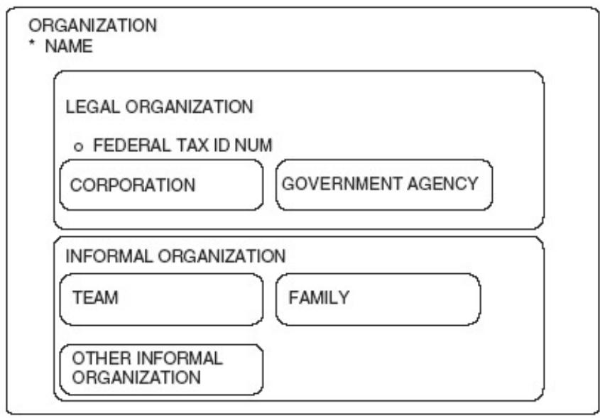

Supertypes may have many levels. Figure 1.2 shows that a CORPORATION and GOVERNMENT AGENCY are subtypes of LEGAL ORGANIZATION, which is also a subtype of ORGANIZATION. Thus boxes may be in boxes down to any level to illustrate which subtypes inherit the attributes and relationships of the parent supertype (its outer box).

The subtypes within an entity should represent a complete set of classifications (meaning that the sum of the subtypes covers the supertype in its entirety) and at the same time be mutually exclusive of each other (an exception of handling separate sets of non-mutually exclusive subtypes will be covered in the next section). Many times the data model includes an OTHER...subtype to provide for other possible classifications of the entity that may be defined by the enterprise using the model. For example, each INFORMATION

ORGANIZATION may be a TEAM, FAMILY, or OTHER INFORMAL ORGANIZATION.

While the subtypes represent a complete set of possible classifications, there may be more detailed subtypes that are not included in the data model; instead, they may be included in a TYPE entity. In this case, subtypes are shown in two places on a model: as a subtype and in a TYPE entity that shows the domain of allowed types for the entity.

Non-Mutually Exclusive Sets of Subtypes

Sometimes, subtypes are not mutually exclusive; in other words, supertypes may be subtyped different ways and more than one set of subtypes may apply to the same supertype.

Consider Figure 1.3, which shows that a REQUIREMENT may be subtyped different ways. A REQUIREMENT may be from a customer (CUSTOMER REQUIREMENT) or may represent an internal requirement of the enterprise (INTERNAL REQUIREMENT). At the same time, the REQUIREMENT may be a requirement that states the need for a specific product (PRODUCT REQUIREMENT) or a requirement that states the need for work to be done (WORK REQUIREMENT).

Figure 1.3 Non-mutually exclusive subtypes and supertypes.


Therefore, more than one subtype could occur for a REQUIREMENT; for instance, it could be a CUSTOMER REQUIREMENT and PRODUCT REQUIREMENT. Figure 1.3 illustrates a convention to show mutually exclusive sets of subtypes by having a box around each set of possible subtypes with no name for the box. The boxes merely serve to establish when there is more than one set of subtypes for a supertype.

# Attributes

An attribute holds a particular piece of information about an entity, such as the order date on an order. Attributes are identified in the text of the book by boldface, lowercase letters such as the previous order date example.

Attributes may be part of the unique identifier of an entity (also referred to as a primary key), mandatory, or optional. The primary

key attribute(s) is identified by a "#" sign preceding the attribute name on the diagram. Mandatory attributes are signified by a"*" before the attribute name. Optional attributes have an "o" before the attribute. Figure 1.4 shows that the ORDER entity has order ID as a primary key attribute, order date as a mandatory attribute, and entry date as an optional attribute.

Figure 1.4 Attributes.

```sql
ORDER #ORDERID \*ORDERDATE oENTRYDATE
```

Certain strings included in an attribute's name have meanings based on the conventions shown in Table 1.2.

Table 1.2 Conventions Used in Attribute Naming

<table><tr><td>STRING WITHINMEANING</td></tr><tr><td>ATTRIBUTE</td></tr><tr><td>NAME</td></tr></table>

ID System-generated sequential unique numeric identifier (i.e., 1, 2, 3, 4,...)

Seq id System-generated sequence within a parent ID (e.g., order line sequence number)

<table><tr><td>Code</td><td>Unique mnemonic—used to identify user-defined unique identifiers that may have some meaning embedded in the key (i.e., an example of a geo code to store Colorado may be “CO”)</td></tr><tr><td>Name</td><td>A proper pronoun such as a person, geographical area, organization</td></tr><tr><td>Description</td><td>The descriptive value for a unique code or identifier</td></tr><tr><td>Ind (indicator)</td><td>A binary choice for values (i.e., yes/no or male/female)</td></tr><tr><td>from date</td><td>Attribute that specifies the beginning date of a date range and is inclusive of the date specified</td></tr><tr><td>thru date</td><td>Attribute that specifies the end date of a date range and is inclusive of the date specified (to date is not used because thru date more clearly represents an inclusive end of date range)</td></tr></table>

# Relationships

Relationships define how two entities are associated with each other. When relationships are used in the text, they are usually shown in lowercase as a normal part of the text. In some situations, where they are specifically highlighted, they are identified by boldface lowercase letters. For example, manufactured by could be the way a relationship may appear in the text of this book.

# Relationship Optionality

Relationships may be either optional or mandatory. A dotted relationship line next to an entity means that the relationship from that entity is optional, and a continuous line means that the relationship is mandatory (the relationship has to exist for all occurrences of each entity). Figure 1.5 shows a relationship that "each SHIPMENT must be shipped from one and only one POSTAL ADDRESS." This means that the postal address for each shipment must be specified in order to create a shipment instance. The same relationship has an optional aspect when read in the other direction: "Each POSTAL ADDRESS may be the source of one or more SHIPMENTS." Hence, there could be a postal address which has not been used for a shipment yet.

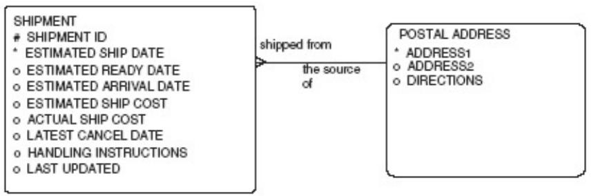
Figure 1.5 Mandatory versus optional relationships.

# Relationship Cardinality

Relationships may be one-to-one, one-to-many, or many-to-many. This is generally known as the cardinality of the relationship. The presence of a crowsfoot (a three-pronged line that looks like a crow's foot) defines whether an entity points to more than one occurrence of another entity. Figure 1.6 shows that "each ORDER must be composed of one or more ORDER ITEMS" because the crows-foot is at the ORDER ITEM side. The other relationship side states that "each ORDER ITEM must be part of one and only one ORDER." A one-to-one relationship doesn't have any crowsfeet on the relationship, and a many-to-many relationship has crowsfeet at both ends of the relationship. Sometimes, one-to-many relationships are referred to as parent-child relationships.

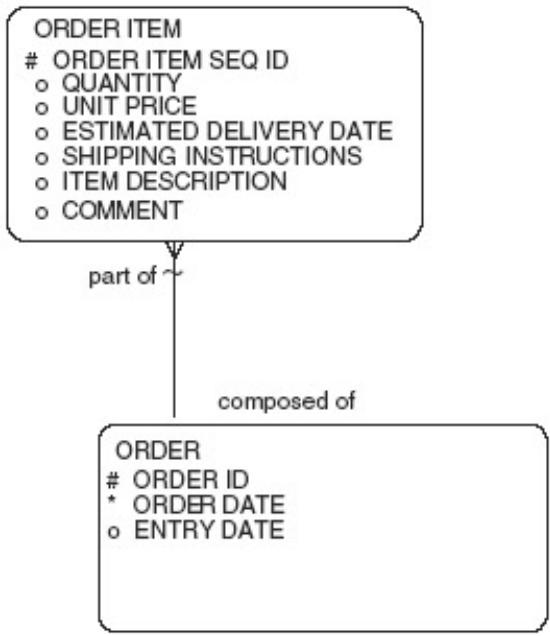
Figure 1.6 One-to-many relationship.

Sometimes the term "over time" needs to be added to the relationship sentence to verify whether the relationship is one-to-many. For instance, an ORDER may appear to have only one ORDER STATUS; however, if status history is required, then each ORDER may be in the status of by one or more ORDER STATUSes, over time.

The data models in the book have very few one-to-one relationships because most of the time one-to-one relationships can be grouped together into a single entity when normalized. The data model diagrams do not show many-to-many relationships because many-to-many-relationships are almost always broken out into intersection entities.

# Foreign Key Relationships

A foreign key is defined as the presence of another entity's (or table's) primary key in an entity (or table). For example, in Figure 1.6 the order ID from the ORDER entity is part of the ORDER ITEM entity; therefore, it is a foreign key. Any one-to-many relationship indicates that the primary key of the entity on the one side of the relationship is brought into the entity on the many side of the relationship. Some data modelers show this foreign key as an attribute of the entity (this is sometimes known as key migration).

The data models in this book do not show the foreign keys of entities as attributes because this is redundant.

Instead, the relationship itself identifies the foreign key. In Figure 1.6, the order ID is not shown as an attribute in the ORDER ITEM entity because the one-to-many nature of the relationship reveals that it is a foreign key.

Foreign Key Inheritance

A diagramming convention in this book is to use a tilde ("~") relationship line to indicate that the inherited foreign key is part of the primary key of the child entity. The tilde ("~") line across the relationship in Figure 1.6 indicates that the order ID is part of the ORDER ITEM entity primary key. This convention allows a shorthand notation, providing for the primary key to be identified as a combination of the primary key attributes (identified with a "#") as well as the primary keys of the entity to which the relationship with a tilde is pointing.

Therefore the primary key to the ORDER ITEM is the order item seq ID plus the primary key of the order, order id.

This convention allows a shorthand notation to document the primary keys of each entity without taking up a great deal of space by repeated foreign keys that form part of another entity's primary

key. This notation also shows the semantics of the primary key by clearly specifying the relationships that make up the primary key as well as any attributes with a “#” symbol next to them.

Intersection or Association Entities to Handle Many-to-Many Relationships

Intersection entities are also known as associative entities or cross-reference entities. They are used to resolve many-to-many relationships by cross-referencing one entity to another. Often they include additional attributes that may further delineate the relationship. Figure 1.7 shows a many-to-many relationship between a PARTY and a CONTACT MECHANISM that is resolved in this way. The diagram indicates that a PARTY may be contacted via more than one CONTACT MECHANISM such as a POSTAL ADDRESS, TELECOMMUNICATIONS NUMBER, or ELECTRONIC ADDRESS because a party may have many ways to be contacted. Conversely, a CONTACT MECHANISM may be used by more than one PARTY. For instance, many people may have the same work address or work phone number. This many-to-many relationship is resolved by the intersection entity PARTY CONTACT MECHANISM.

Figure 1.7 Many-to-many relationships.

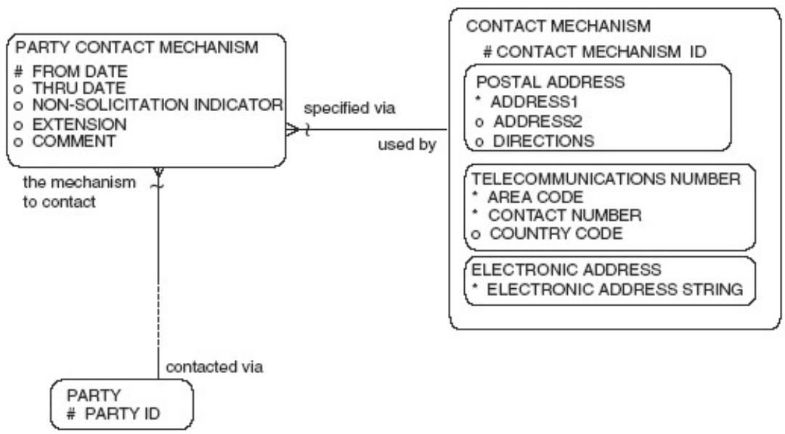

Each associative entity inherits the key to each of the entities it intersects. Therefore the tilde  $(\sim \prime \prime)$  is always used in the reference relationships of an associative entity to show that the associative entity inherits the key of each of the referenced entities (see "foreign key inheritance" mentioned in the last section). For example, the party id and the contact mechanism id are parts of the primary key to PARTY CONTACT MECHANISM, along with the from date.

Notice that in all the examples given, each relationship has two relationship names associated with it that describe the relationship in both directions. The relationship names should be combined so that they read as a complete sentence, as shown in the following format: "Each ENTITY {must be/may be} relationship name {one and only one/one or more} ENTITY, over time," where the appropriate choices are filled in.

In the models presented, the crowsfeet on the relationships generally point up and to the left in order to provide a consistent mechanism for reading the diagrams. This tends to organize the data models in a more understandable format.

# Exclusive Arcs

Exclusive arcs are used to identify relationships where an entity is related to two or more other entities, but only one relationship can exist for a specific entity occurrence. The exclusive arc is represented by a curved line going through two or more relationship lines. Figure 1.8 shows an example of an exclusive arc. The relationships are read as "Each INVENTORY ITEM must be either located at one and only FACILITY or must be located within one and only one CONTAINER, but not both." This communicates that inventory items are stored at one of two types of levels: They are either located at facilities such as a warehouse or stored within containers such as a bin that is located within a facility.

Figure 1.8 Exclusive arcs.


# Recursive Relationships

Recursive relationships are relationships that show how one entity is related to itself. For example, a recursive relationship could be modeled either via a relationship pointing from an entity to itself or via a many-to-many-relationship. This depends on if it is a many-to-many recursion or a one-to-many recursion. It is possible for an entity to have many recursive relationships.

Figure 1.9 shows an example of a one-to-many recursion around the WORK EFFORT entity to show that work efforts may be redone. It also shows a many-to-many recursion that is resolved by the intersection entity WORK EFFORT ASSOCIATION to show that work

efforts may be either dependent on other work efforts (WORK

EFFORT DEPENDENCY subtype) or broken down into several lower-

level work efforts (WORK EFFORT BREAKDOWN subtype).


Figure 1.9 Recursive relationships.

# Physical Models

The data warehouse models and diagrams (Chapters 10 through 14)

as well as some of the models in Chapter 15, represent physical

database designs. The

same notations can be used as previously stated with the exception

that because these models represent physical database designs,

each box represents a table, and the field names are columns.

Conventions Used for Illustration Tables

Many parts of the data models are illustrated via tables that contain possible values for attributes. Each illustration table is normally defined to show a specific entity and the relevant information from related entities. For instance, there may be a table illustrating the ORDER ITEM entity, as shown in Table 1.3.

Table 1.3 Order Item

<table><tr><td>ORDER ID</td><td>ORDER DATE</td><td>ORDER ITEM SEQ ID</td><td>COMMENT</td></tr><tr><td>12930</td><td>April 30, 1995</td><td>1</td><td>Need this item urgently</td></tr><tr><td></td><td></td><td>2</td><td>There&#x27;s no time pressure at all on this item</td></tr></table>

In order to illustrate the details of an ORDER ITEM, Table 1.3 brings in some attribute information from the ORDER entity. Whenever data from each illustration table is referenced in the text of this book, it is surrounded by double quotes. For instance, the text may refer to specific order “12930,” order item seq id “1”, which has a comment of “Need this item urgently.”

Conventions Used to Reference Figures

Because there are two volumes for the Data Model Resource Book, figures are referenced by the following notation:

Vx:Figure x.x

Where Vx signifies a reference to either Volume 1 or Volume 2

For example, V1:2.1 references Figure 2.1 in Volume 1, the Organization data model. V2:2.2 references Figure 2.2 (Parts and products) in the second volume. If there is no Vx in front of the reference, then the reader may assume that the figure is in the current volume.

# The Companion Electronic Product

This book and its appendices provide very detailed descriptions of the models discussed. The diagrams lay out all the relationships, the mandatory attributes and columns, the primary keys, and they even include some optional attributes. The appendices include the physical details for the attributes and columns, such as the datatype and size. With this information, it would be possible for a data modeler or database designer to recreate these models in the tool of his or her choice or write the SQL code to build them in a database.

This, however, would take a substantial amount of time and opens the possibility of data entry errors. To assist those interested in quickly implementing the models described in these pages, the models are provided in electronic form. The Demo CD-ROM that accompanies this book offers a free demonstration of the electronic models. The full set of models for Volume 1 is sold separately. See

"How to Use the Electronic Product" at the end of this book for details on purchasing, accessing, and using the CD-ROM.

The demo files on this CD-ROM contain a sample of SQL scripts derived directly from the models in the book. In the full version, all the entities, attributes, tables, and columns discussed are implemented with this code. Scripts are provided for several database platforms. There are also generic standard SQL scripts that could be used with other ODBC databases.

Because the CD-ROM includes standard SQL scripts, they should work with not only the current versions of these database management systems but also with future versions. This includes object-relational databases assuming that they support relational designs. The constructs in the book are, of course, also generally applicable to any relational or object-relational database.

Use of the scripts on the CD-ROM will allow an enterprise to more rapidly deploy the models presented in this book. In addition to the time savings, there is obviously a cost savings as well (nobody has to type in all the definitions or write SQL scripts). Once the scripts have been run, the models could be reverse-engineered into the enterprise's favorite CASE tool (most popular CASE tools provide a reverse-engineering feature). Once the models have been brought into a repository, they are easily accessible and may be customized

for a specific enterprise's needs. Additionally, they can be used to jump-start the development of corporate data models, new applications, data warehouse designs, or decision support systems.

The CD-ROM also contains the data model diagrams in electronic formats and a series of reports that list and cross-reference the subject data areas, entities, attributes, tables, and columns of the data models.

The remainder of this book will provide many examples of universal data models and data warehouse designs that can assist in increasing the productivity of system development efforts. Detailed examples of how to implement these models will be provided in chapter 15, "Implementing Universal Data Models."

# CHAPTER

# 2

# People and Organizations

The most frequent business information need is to ask questions about people and organizations and to be able to rely on accurate answers to these questions. For instance:

- What are the attributes or characteristics of the people and organizations that are involved in the course of conducting business?
- What relationships exist between various people, between various organizations, and between people and organizations?
- What are the addresses, phone numbers, and other contact mechanisms of people and organizations, and how can they be contacted?
- What types of communication or contacts have occurred between various parties, and what is necessary to effectively follow up on these communications?

Almost all business applications track information about people and organizations, recording information about customers, suppliers, subsidiaries, departments, employees, and contractors redundantly

in many different systems. For this reason, it is very difficult to keep key information such as client contact data consistent and accurate. Examples of applications that store information about people and organizations include sales, marketing, purchasing, order entry, invoicing, project management, and accounting.

The data model within this chapter can be used for most organizations and applications. Subsequent chapters use this data model as a basis on which to add more detail. This chapter includes data models on the following:

- Organization
- Person (alternate model also provided)
- Party (organizations or people)
- Party roles (i.e., customers, suppliers, internal organizations)
- Specific party relationships (i.e., customer relationship, supplier relationship, employment)
Common party relationships
- Party relationship information
- Postal address information (postal addresses and geographic boundaries)
- Party contact mechanism—telecommunications numbers and electronic addresses
- Party contact mechanism (expanded)
- Facility versus contact mechanism

- Party communication event (i.e., phone calls, support calls, meetings)
- Communication event follow-up

# Organization

Most data models maintain organizational information in various entities that are portrayed as completely separate entities. For instance, there may be a customer entity, a vendor entity, and a department entity. Each application within an enterprise has its own needs; therefore, the data modeler will often base the model on the needs of a particular application. For example, when building an order entry application, the customer information is crucial; therefore, the data modeler shows a separate entity for customer. Likewise, the supplier information is critical when building a purchasing application; hence, there is normally a supplier entity. For a human resources system, the data modeler might show an entity called a department within which the employees work.

The problem is that an organization may play many roles, depending on the particular circumstance. For instance, in larger companies, internal organizations sell to each other. The property management division may be a supplier to the product sales division. The property management division may also be a customer of the product sales division. In this case, there would normally be both a customer and

supplier record, with redundant data, for each of these divisions. Not only could there be a customer and a supplier record, but there could also be many additional records for the organization depending on how many roles the organization plays within the enterprise.

When an organization's information changes—such as a change in address—the information might be updated in only one of the many systems where organization information is stored. This, of course, results in inconsistent information within the enterprise. It may also result in major frustration on the part of managers, customers, suppliers, and anyone who might want to generate a correct mailing list!

The solution to this redundancy problem is to model an entity called ORGANIZATION that stores information about a group of people with a common purpose such as a corporation, department, division, government agency, or nonprofit organization. Basic organizational information, such as its name and federal tax ID num (for legal entities), is stored once within this entity, reducing redundancy of information and eliminating possible update discrepancies.

Figure 2.1 shows the data model for organization information. An organization is defined as a group of individuals that, together, have an informal or formal association. An ORGANIZATION may be a

LEGAL ORGANIZATION, such as a CORPORATION or GOVERNMENT AGENCY, or an INFORMAL ORGANIZATION, such as a FAMILY, TEAM, or OTHER INFORMAL ORGANIZATION. Both legal and informal organizations may share many relationships because they may both be assigned to various roles and responsibilities and may be managed by people. While they share many things in common, they also have differences. For instance, a legal organization is the only type of organization that may be a party to a contract.

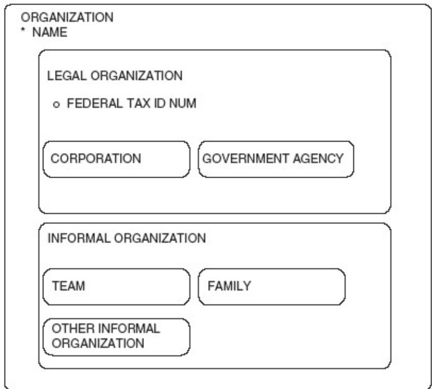
Figure 2.1 Organization.

This model reduces redundancy because the organization information is stored only once, as opposed to storing this

information redundantly in a customer entity, a supplier entity, a department entity, or any other entity storing organization information.

Table 2.1 gives examples of data in the ORGANIZATION entity. ABC Corporation and ABC Subsidiary are examples of legal organizations that happen to be internal organizations of the enterprise being modeled. "Accounting Division," "Information Systems Department," and "Customer Service Division" are informal organizations and internal to the enterprise. "Fantastic Supplies," "Hughs Cargo," and "Sellers Assistance Corporation" are legal corporations that represent companies with whom the enterprise engages in business. The "Smith family" is an organization because it represents a group of individuals that are associated by family, and it may be useful for recording demographic information. The "Government Quality Commission" is a government agency that is involved in monitoring the operations of the enterprise.

Table 2.1 Organizations

<table><tr><td>ORGANIZATION ID</td><td>ORGANIZATION SUBTYPE</td><td rowspan="3">NAME ABC Corporation ABC Subsidiary</td></tr><tr><td>100</td><td>Legal organization</td></tr><tr><td>200</td><td>Legal organization</td></tr><tr><td>300</td><td>Informal organization</td><td>Accounting Division</td></tr><tr><td>400</td><td>Informal organization</td><td>Information Systems Department</td></tr><tr><td>500</td><td>Informal organization</td><td>Customer Service Division</td></tr><tr><td>600</td><td>Informal organization</td><td>Customer Support Team</td></tr><tr><td>700</td><td>Legal organization</td><td>ACME Corporation</td></tr><tr><td>800</td><td>Legal organization</td><td>Fantastic Supplies</td></tr><tr><td>900</td><td>Legal organization</td><td>Hughs Cargo</td></tr><tr><td>1000</td><td>Legal organization</td><td>Sellers Assistance Corporation</td></tr><tr><td>1100</td><td>Informal organization</td><td>Smith Family</td></tr><tr><td>1200</td><td>Legal organization</td><td>Government Quality Commission</td></tr></table>

For the remainder of this book, the term "enterprise" will be used to refer to all the internal organizations for whom the data model is being developed. For instance, each enterprise will have its own specific needs and business rules that will determine how the enterprise will customize these models for its own use.

# Person

Just as most data models show separate entities for various types of organizations, they also show separate entities for various types of

people such as employees, contractors, supplier contacts, and customer contacts. The problem with keeping this information in separate entities is that people may also have different jobs and roles that change over time. Most systems will record redundant information about a person because they store a record each time the person's role changes.

For example, John Smith was a good customer of ABC Corporation. John then decided to perform contract labor for ABC Corporation. The people at ABC Corporation liked his work so much that they then hired him as an employee. For most systems, there would be a separate record for John Smith as a customer contact, then as a contractor, then as an employee. Much of John Smith's information has remained the same, such as his name, gender, birth date, skills, and other demographics. Because John Smith's information is stored in several locations, many systems would have trouble keeping his information accurate and consistent.

Another problem is that the same person may have many different roles at the same time. For instance, ABC Corporation is a large company with many divisions. Shirley Jones is an employee and manager of the transportation division. She is also considered a customer of the supplies division. At the same time, she is the supplier for the publishing division, which needs her services to transport catalogues. Therefore, Shirley is an employee of one

division, a customer contact of another division, and a supplier contact of yet another division. Rather than have three separate records for Shirley with redundant information, there should be only one record.

To address this issue, Figure 2.2a shows a PERSON entity that stores a particular person's information, independent of his or her jobs or roles. Attributes of the PERSON entity may include current last name, current first name, current middle initial, gender, birth date, height, weight, and many other attributes that are listed in Figure 2.2a and describe the person.


Figure 2.2a Person.

Table 2.2 shows some example data for the PERSON entity. The table shows key information about John Smith, Judy Smith, Nancy Barry, Marc Martinez, William Jones, Shirley Jones, Barry Cunningham, and Harry Johnson. This model helps reduce redundancy because the person's base information is maintained only once, even though the person may play many different roles. The "Party Roles" section later in this chapter will describe how to model the various roles each person and organization can play and the "Party Relationship" section will show how to model the interrelationships between party roles.

Table 2.2 Person Data

<table><tr><td>PERSON ID</td><td>LAST NAME</td><td>FIRST NAME</td><td>GENDER</td><td>BIRTH DATE</td><td>HEIGHT</td><td>WEIGHT</td></tr><tr><td>5000</td><td>Smith</td><td>John</td><td>Male</td><td>1/5/49</td><td>6&#x27;</td><td>190</td></tr><tr><td>5100</td><td>Smith</td><td>Judy</td><td>Female</td><td></td><td></td><td></td></tr><tr><td>5200</td><td>Barry</td><td>Nancy</td><td>Female</td><td></td><td></td><td></td></tr><tr><td>5300</td><td>Martinez</td><td>Marc</td><td>Male</td><td></td><td></td><td></td></tr><tr><td>5400</td><td>Jones</td><td>William</td><td>Male</td><td></td><td></td><td></td></tr><tr><td>5500</td><td>Jones</td><td>Shirley</td><td>Female</td><td>4/12/59</td><td>5&#x27;2&quot;</td><td>100</td></tr><tr><td>5600</td><td>Cunningham</td><td>Bobby</td><td>Male</td><td>3/14/65</td><td>5&#x27;11&quot;</td><td>170</td></tr><tr><td>5700</td><td>Johnson</td><td>Harry</td><td>Male</td><td>12/9/37</td><td>5&#x27;8&quot;</td><td>178</td></tr><tr><td>5800</td><td>Goldstein</td><td>Barry</td><td></td><td></td><td></td><td></td></tr><tr><td>5900</td><td>Schmoe</td><td>Joe</td><td>Male</td><td></td><td></td><td></td></tr><tr><td>6000</td><td>Red</td><td>Jerry</td><td>Male</td><td></td><td></td><td></td></tr></table>

Some of these attributes in the PERSON entity may be repeating attributes and may need to be separated into their own entity,

depending on whether the enterprise has the will and means to store many instances of that attribute.

Person—Alternate Model

Figure 2.2b shows an alternate model for PERSON with the repeated attributes separated into their own entities. For instance, the MARITAL STATUS entity allows the maintenance of the history of marital changes, and the MARITAL STATUS TYPE entity could store instances such as "single," "married," "divorced," and "widowed."

To reiterate the diagramming convention from Chapter 1, a tilde ("~") across the relationship line indicates that the inherited foreign key is part of the primary key of the child entity. For instance, the tildes ("~") across the relationship lines in the top left corner of Figure 2.2b indicate that the party id and marital status type id are part of the MARITAL STATUS entity primary key. This convention allows a shorthand notation, providing for the primary key to be identified as a combination of the primary key attributes (identified with a "#") as well as the primary keys of the entity to which the relationship with a tilde is referencing.

The PHYSICAL CHARACTERISTICs entity provides a means to store the history of a person's physical characteristics such as height and weight. This history is also useful in health-related fields. The details

of each characteristic is stored in the PHYSICAL CHARACTERISTIC TYPE entity, which could have values of "height," "weight," "blood pressure," and so on. The value attribute in the PHYSICAL CHARACTERISTIC maintains the characteristic's measurement such as a height of 6 "#" and is an alphanumeric attribute to accommodate different characteristics.

A person may have many PERSON NAMES either at the same time (name aliases) or over time as his or her name changes. This may be important information in many applications. An example of this is in a prison or correctional facility where the enterprise would want to maintain a history of names and aliases. In these cases, the PERSON NAME entity can be used to store all the names and aliases. The current last name, current first name, current middle initial, current prefix, current suffix, and current nickname attributes are now maintained in the PERSON NAME and PERSON NAME TYPE entities. The PERSON NAME entity stores the name and the time period during which it is valid, and the PERSON NAME TYPE entity maintains the type of name it is in the description attribute. For instance, the PERSON NAME TYPE description may be "first" or "last." This data model provides much more flexibility because many names can now be stored. Some cultures have more than one middle or last name, and this structure handles diverse needs. Because the current name has great applicability in many circumstances, the current last name, current first name, current

middle name, current personal title (i.e., Mr., Mrs., Dr., Ms.), current suffix (i.e., Jr., Senior, III) and any nicknames or aliases could be stored in the PERSON entity as in the previous diagram, and the PERSON NAME could be used to store a history of names.

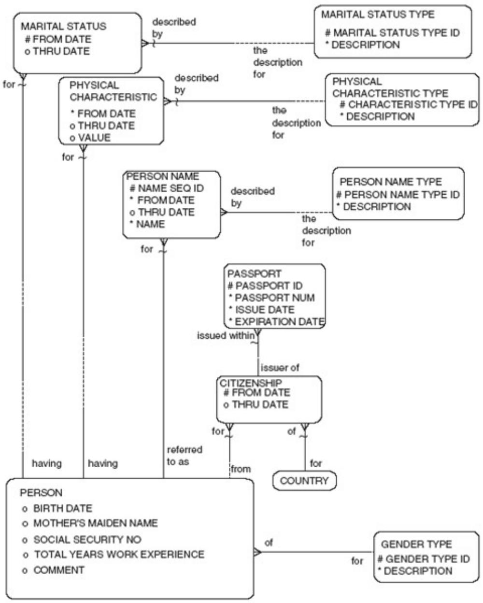
Figure 2.2b Person-alternate model.

Also shown in Figure 2.2b are entities to show the CITIZENSHIP and PASSPORTs that a person has had instead of the simple current passport number and passport expiration date attributes in the first model. This could be useful in travel applications.

The GENDER TYPE entity stores common descriptions for gender classifications and may contain instances such as "male," "female," "male to female," "female to male," and "not provided." If a history is needed, for instance, in specialized medical enterprises, there could be an associative entity of PERSON GENDER that may be between PERSON and GENDER TYPE.

As the model illustrates, a great deal of demographic information is maintained about people and organizations. By maintaining information about people and organizations once in a single place, the enterprise can capture much more consistent data and be able to apply this information in many contexts.

# Party

Organizations and people are similar in many respects. They both have common characteristics that describe them, such as their credit rating, address, phone number, fax number, or e-mail address. Organizations and people can also serve in similar roles as parties to contracts, buyers, sellers, responsible parties, or members of other

organizations. For example, membership organizations (like a computer users group) may keep similar information on their corporate members and their individual members. Contracts can usually specify an organization or a person as a contracted party. The customer for a sales order may be either an organization or a person.

If person and organization were modeled as completely separate entities, the data model would be more complex. Each contract, sales order, membership, or transaction that involved either a person or an organization would need two relationships: one to the person entity and one to the organization entity. Furthermore, these relationships are mutually exclusive and thus would require an exclusive arc (see Chapter 1 for a discussion on exclusive arcs). For instance, a sales order could be placed by a person or an organization, but a single sales order cannot be placed by both a person and an organization at the same time.

Therefore, Figure 2.3 shows a superentity named PARTY that has as its two subtypes PERSON and ORGANIZATION. This PARTY entity will enable storage of some of the common characteristics and relationships that people and organizations share.

Figure 2.3 Party.


Parties are classified into various categories using the entity PARTY CLASSIFICATION, which stores each category into which parties may belong. There are subtypes for ORGANIZATION CLASSIFICATION such as INDUSTRY CLASSIFICATION, SIZE CLASSIFICATION, and MINORITY CLASSIFICATION as well as subtypes to categorize people such as EEOC (Equal Employment Opportunity Commission)

CLASSIFICATION and INCOME CLASSIFICATION. The ORGANIZATION CLASSIFICATION and PERSON CLASSIFICATION could be related to ORGANIZATION and PERSON, respectively, if one wanted to model them more specifically. For simplicity purposes, however, this model shows them as subtypes of PARTY CLASSIFICATION, which is related to PARTY. These represent only a few possible types for illustration purposes, and other possible values for categories are maintained in the PARTY TYPE entity.

Examples for MINORITY CLASSIFICATION include "minority-owned business," "8A business," or "woman-owned business." INDUSTRY CLASSIFICATION may include "telecommunications," "government institute," or "manufacturer." SIZE CLASSIFICATION may be "small," "medium," "large," and "national account" and may also be defined by a range of number of employees. For people, the EEOC CLASSIFICATION instances may include values such as "african american," "native american," "asian or pacific islander," "hispanic," and "white non-hispanic." The instance "women" is another EEOC classification; however, it is covered using the gender attribute within the PERSON entity. INCOME CLASSIFICATIONS may include values to indicate yearly income such as "less than  $20,000,"$ " $\$ 20,001$  to  $50,000,"$ " $\$ 50,001$  to  $250,000," and "over$ 250,000."

These categorizations of parties can be used to determine if there are any special business considerations for parties, special pricing

arrangements, or special terms based on the type of party. It is also a mechanism for classifying businesses into types of industries for market segmentation and to target marketing efforts. A from date and thru date are included so history can be tracked because it is possible for the definition to change over time [e.g., businesses may "graduate" from the 8A (minority startup) program].

Table 2.3 shows several party occurrences that are merely consolidations from the person and organization examples. This single entity allows the data models to refer to either a person or an organization as a party to a transaction. The table shows our previous examples of organizations and people along with the PARTY TYPES that serve to classify them according to various demographic categories. Organizations and people may be classified several ways, thus the need for the many-to-many relationship between PARTY and PARTY TYPE. "ABC Corporation" is classified as a "minority owned business" and a "manufacturer." "ACME Corporation" is classified as a "woman-owned business," "mail order firm," and a "large organization." People may be classified into various categories such as EEOC CLASSIFICATION types as well as other personal classifications such as INCOME CLASSIFICATION. Table 2.3 shows that Marc Martinez is classified as a "Hispanic" with an income classification of "$50,000-250,000" and that William Jones is classified as an "African American." Many of the people do not have

classifications, which illustrates that this information is totally optionally and may not be available from many of the parties.

Table 2.3 Party Data

<table><tr><td>PARTY</td><td>PARTY NAME (ORGANIZATION)</td><td>PARTY TYPE</td></tr><tr><td>ID</td><td>NAME OR FIRST NAME/LAST NAME)</td><td></td></tr><tr><td>100</td><td>ABC Corporation</td><td>Minority-owned business Manufacturer</td></tr><tr><td>200</td><td>ABC Subsidiary</td><td>Minority-owned business Manufacturer</td></tr><tr><td>300</td><td>Accounting Division</td><td></td></tr><tr><td>400</td><td>Information Systems Department</td><td></td></tr><tr><td>500</td><td>Customer Service Division</td><td></td></tr><tr><td>600</td><td>Customer support team</td><td></td></tr><tr><td>700</td><td>ACME Corporation</td><td>Woman-owned business Mail order firm Large organization</td></tr><tr><td>800</td><td>Fantastic Supplies</td><td>Janitorial service organization Small organization</td></tr><tr><td>900</td><td>Hughs Cargo</td><td>8A organization Service organization Small organization organization Small organization</td></tr><tr><td>1000</td><td>Sellers Assistance Corporation</td><td>Marketing service provider
Medium-sized organization</td></tr><tr><td>1100</td><td>Smith Family</td><td></td></tr><tr><td>5000</td><td>John Smith</td><td></td></tr><tr><td>5100</td><td>Judy Smith</td><td></td></tr><tr><td>5200</td><td>Nancy Barry</td><td></td></tr><tr><td>5300</td><td>Marc Martinez</td><td>Hispanic Income classification
$50,000–250,000</td></tr><tr><td>5400</td><td>William Jones</td><td>African American</td></tr><tr><td>5500</td><td>Shirley Jones</td><td></td></tr><tr><td>5600</td><td>Barry Cunningham</td><td></td></tr><tr><td>5700</td><td>Harry Johnson</td><td></td></tr><tr><td>5800</td><td>Barry Goldstein</td><td></td></tr><tr><td>5900</td><td>Joe Schmoe</td><td></td></tr><tr><td>6000</td><td>Jerry Red</td><td></td></tr></table>

# Party Roles

As noted previously, a person or organization may play any number of roles such as a customer, supplier, employee, or internal organization. Because the same PARTY may play many roles over time or at the same time, the need to define the information about each role arises. The PARTY entity defines the nature of the party, which will not change over time. The PARTY TYPE classifies the party

into certain categories. The PARTY ROLE entity defines how a party acts or, in other words, what roles the party plays in the context of the enterprise's environment. There may be certain information related to a party that applies only to a specific role. For instance, credit information may be applicable only to customers and thus be a relationship or attribute of this role only. Specific relationships may be applicable only to certain roles. For instance, the relationship from the entity EMPLOYMENT with a "from date" and "start date" is specifically related to a role of employee.

Are these roles just subtypes of the party entity, or is there a PARTY ROLE entity to indicate that each PARTY may act in one or more PARTY ROLES? For example, are the entities CUSTOMER and SUPPLIER subtypes of the PARTY entity, or should they be subtypes of a PARTY ROLE entity to show that the same PARTY can be both a CUSTOMER and a SUPPLIER? One can argue the data model either way (which has happened innumerable times during the course of this writing).

With either of these approaches, it is important to establish that these roles such as CUSTOMER, SUPPLIER, EMPLOYEE, and INTERNAL ORGANIZATION are entities that need to be tracked in addition to the PARTY entity. The PARTY entity allows the enterprise to track consistent information about the person or organization once. The PARTY ROLE allows the enterprise to maintain information

(attributes or relationships) about each party within the context of their specific roles. For example, a certain party may have various contact information (home address, office address, home phone, cell phone, and so on) regardless of how many roles he or she may play within the enterprise (the party may be a customer, a supplier, and an agent). For the party's role as a customer, and only for that role, it may be important to store credit rating information.

Figure 2.4 provides a data model to illustrate how to model specific roles within an enterprise. It contains many common roles that are widely applicable to many enterprises. The Party Role id primary key attribute allows the same party to play the same role at different points in time. Roles are subtyped into PERSON ROLES, ORGANIZATION ROLES, and roles that may be either. PERSON ROLES include EMPLOYEE for legal employees of the enterprise, CONTRACTOR for a person who is or has performed a contract with the enterprise, FAMILY MEMBER to indicate that this person is part of a biological family, and CONTACT to indicate someone who is acting as a representative with an organization (this may be a sales contact, support contact, customer contact, supplier contact, or any other type of representative).

Figure 2.4 Party roles.

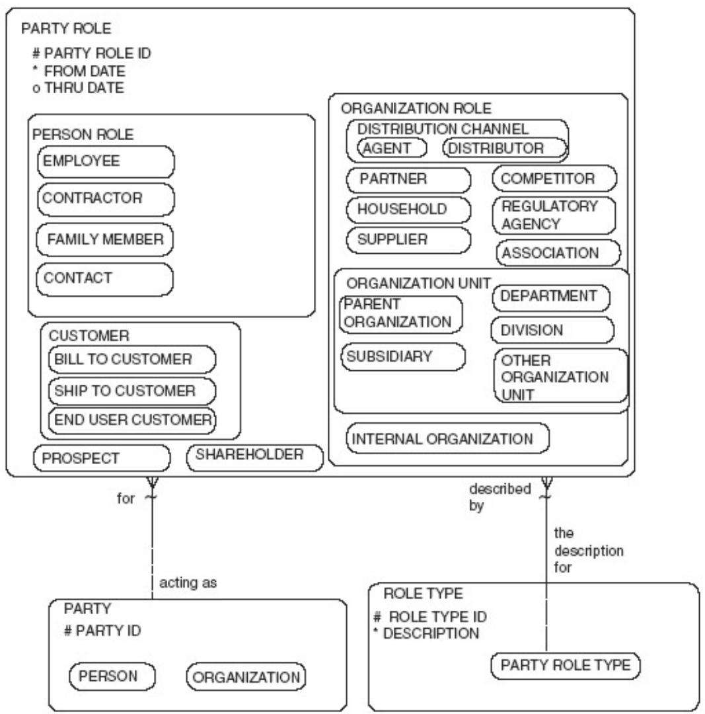

Common roles that may be for either people or organizations are CUSTOMER, which is a party that has purchased (BILL TO CUSTOMER), been shipped (SHIP TO CUSTOMER), or used (END USER CUSTOMER) products (either goods or services) from the enterprise. A SHAREHOLDER may also be either a person or an organization and is therefore not a person role or organization role. The same applies to a PROSPECT, which is a person or organization

that the enterprise thinks will purchase, be shipped, or use their products.

# Organization Roles

The ORGANIZATION roles include DISTRIBUTION CHANNEL (which typically is an AGENT or a DISTRIBUTOR), COMPETITOR, PARTNER, REGULATORY AGENCY, HOUSEHOLD, ASSOCIATION, SUPPLIER, various ORGANIZATION UNITS such as a PARENT ORGANIZATION, SUBSIDIARY, DEPARTMENT, DIVISION, and OTHER ORGANIZATION UNIT as well as INTERNAL ORGANIZATION, which indicates if the organization is part of the enterprise or is an external organization.

A DISTRIBUTION CHANNEL is an organization that markets the enterprise's products. An AGENT markets these products without buying or carrying goods while a DISTRIBUTOR generally markets the goods by first buying them and then selling them. A COMPETITOR carries similar products and is tracking performance for comparative analysis. A PARTNER is an organization that is identified as an ally and with whom mutually beneficial relationships are established. A REGULATORY AGENCY is an organization that regulates or governs the activities of the enterprise. A HOUSEHOLD is an informal organization of people that live within the same residence and is typically a family. This information is helpful to establish customer demographics for

personal products. An ASSOCIATION is an organization that provides services such as networking and sharing of information within particular fields of interest or industries. A SUPPLIER is an enterprise that may or does provide products (goods and/or services) to the enterprise. An ORGANIZATION UNIT identifies the form of this organization and is useful to identify parts of organizations as well as maintenance of organizational structures. This role may be further subtyped as a PARENT ORGANIZATION, SUBSIDIARY, DEPARTMENT, DIVISION, or OTHER ORGANIZATION UNIT to cover more unique types of organizations that are specific to the enterprise. A PARENT ORGANIZATION is a role whereby this enterprise encompasses other enterprises. A SUBSIDIARY organization is a role whereby this organization is encompassed by another enterprise and is partially or wholly owned by the parent organization. A DIVISION is a portion of an organization dedicated to a specific purpose within the enterprise. A DEPARTMENT is also a portion of an organization dedicated to a more specific purpose within the enterprise and is sometimes within a division of the enterprise. An INTERNAL ORGANIZATION is an organization that is part of the enterprise for whom the data model is developed.

# Common Party Role Subtypes

These subtypes are intended in order to provide a list of common subtypes used in most enterprises, and it should be understood that

each enterprise may modify this list of subtypes to suit its own specific needs. Therefore, each PARTY ROLE may be described by one and only one PARTY ROLE TYPE. The PARTY ROLE TYPE is a subtype of ROLE TYPE that has a description attribute that stores available values of role types. Roles may be defined declaratively such as this person is a "prospect" or roles may be associated with specific transactions such as orders, agreements, requirements, and so on. Therefore, this book will use the ROLE TYPE entity to show additional role types showing how parties are involved in the enterprise. Other ROLE TYPE subtypes that will be discussed later in this book will be an ORDER ROLE TYPE, AGREEMENT ROLE TYPE, REQUIREMENT ROLE TYPE, and specific role types for many other types of transactions.

Examples of PARTY ROLE TYPES include all the subtypes previously mentioned such as "employee," "contact," "customer," "supplier," "internal organization," and so on, plus more specific role types such as "placing customer," "bill to customer," "installation customer," "customer contact," "supplier contact," and any other roles not specified in the PARTY ROLE subtypes. As a reminder, for illustrative purposes, the notation of this book shows subtypes within an entity such as PARTY ROLE and then also shows a relationship to a "TYPE" entity to cover all the other possible types.

Some PARTY ROLES are dependent on the context of another party in order to fully define them, and some roles can stand on their own. For instance, a PARENT ORGANIZATION role is useful to identify companies that own other companies. This role is usually dependent on the other organization that is the SUBSIDIARY ORGANIZATION. These roles are therefore dependent on having a PARTY RELATIONSHIP instance, which will be defined in the next section. PARTY ROLES such as "notary" or "doctor" can stand on their own, and parties may have these roles, even without an associated PARTY RELATIONSHIP.

Each PARTY ROLE may be valid for certain time frames, and therefore the attributes from date and thru date are part of the PARTY ROLE. These attributes are optional because many of the time frames for the roles will be dependent on (and can be derived from) the PARTY RELATIONSHIP entity, which will be discussed in the next section. These attributes are particularly useful for relationship-independent roles such as "notary" or "doctor."

Should Roles Be Defined at the Time of the Transaction?

One may make the point that the enterprise doesn't really know the role of the party until certain transactions take place and therefore this role information is derived and unneeded. For instance, if CUSTOMER is defined as a party that has purchased, been shipped,

or used products, the ORDER, INVOICE, DEPLOYMENT USAGE (from Volume 2) or SHIPMENT entities will dictate who is a customer; this information will be available from relationships between these entities and the PARTY entity. As a practical matter, it is important to be able to declaratively state the role of certain parties. The enterprise may declaratively state that "XYZ company" is a prospect, although there aren't any transactions that the enterprise maintains about the event of becoming a prospect. Similarly, the enterprise may want to declaratively state a certain party is a customer even though there aren't any associated transactions. Additionally, even though this is a technical consideration, the enterprise, as a practical matter, would want to know who was a customer, supplier, employee, and so on without having to search for the related transactions. The relationship-independent roles such as "notary" and "doctor" need to be declaratively stated without necessarily being related to transactions that the enterprise is interested in storing.

Another point about the argument of these roles being defined when the transactions occur is that, in some circumstances, the enterprise could instantiate these roles at the time of the transactions. The roles do not necessarily have to be instantiated before any transactions occur. For instance, when a party places an order, the party could then be set up as an instance of a PARTY ROLE of a CUSTOMER (and the enterprise may specifically have them in several

customer roles such as BILL TO CUSTOMER, SHIP TO CUSTOMER, END USER CUSTOMER) and then the ORDER could be related to these instances.

Party Role Example

Table 2.4 illustrates examples of possible roles. Notice that most parties will have at least one role because they are maintained for some reason, and they often have more than one role. It is possible for a party to not have even a single role, for instance, in maintaining census data for people (although one could argue that the role is "census participant").

Table 2.4 Party Role Data

<table><tr><td>PARTY</td><td>PARTY</td><td>PARTY ROLE</td></tr><tr><td>ID</td><td></td><td></td></tr><tr><td rowspan="2">100</td><td rowspan="2">ABC Corporation</td><td>Internal organization</td></tr><tr><td>Parent organization</td></tr><tr><td rowspan="2">200</td><td rowspan="2">ABC Subsidiary</td><td>Internal organization</td></tr><tr><td>Subsidiary organization</td></tr><tr><td>300</td><td>Accounting Division</td><td>Internal organization Division</td></tr><tr><td rowspan="2">400</td><td rowspan="2">Information Systems Department</td><td>Internal organization</td></tr><tr><td>Department</td></tr><tr><td>500</td><td>Customer Service Division</td><td>Internal organization
Department</td></tr><tr><td>600</td><td>Customer support team</td><td>Internal organization Team</td></tr><tr><td>700</td><td>ACME Corporation</td><td>Customer Supplier</td></tr><tr><td>800</td><td>Fantastic Supplies</td><td>Supplier Prospect</td></tr><tr><td>900</td><td>Hughs Cargo</td><td>Supplier</td></tr><tr><td>1000</td><td>Sellers Assistance Corporation</td><td>Agent</td></tr><tr><td>1100</td><td>Smith Family</td><td>Prospect</td></tr><tr><td>5000</td><td>John Smith</td><td>Employee
Supplier coordinator
Parent</td></tr><tr><td></td><td></td><td>Team leader</td></tr><tr><td></td><td></td><td>Mentor</td></tr><tr><td>5100</td><td>Judy Smith</td><td>Child</td></tr><tr><td>5200</td><td>Nancy Barry</td><td>Supplier service contact</td></tr><tr><td>5300</td><td>Marc Martinez</td><td>Customer contact</td></tr><tr><td>5400</td><td>William Jones</td><td>Employee
Account manager
(internal sales representative)</td></tr><tr><td>5500</td><td>Shirley Jones</td><td>Project manager
Employee</td></tr><tr><td></td><td></td><td>QA representative</td></tr><tr><td>5600</td><td>Barry Cunningham</td><td>Contractor</td></tr></table>

5700 Harry Johnson Notary
5800 Barry Goldstein Employee

Apprentice

5900 Joe Schmoe Customer contact
6000 Jerry Red Employee

Customer service

representative

Role Types Throughout This Book

The previous section illustrated that parties may play many roles.

Roles may be defined “declaratively” for a party without a

transaction involved, such as the person is a “doctor.” Roles may also

be defined for any type of transactions involved in the data model.

There may be roles for orders, shipments, invoices, and any other

types of transactions occurring in the data model.

All of these roles will have a standard structure and will be

associated with a PARTY, be of a ROLE TYPE, and be associated with

the transaction. For example, each ORDER may have many ORDER

RROLEs of certain ORDER ROLES TYPES (party taking order, party

giving order, party paying for the order) associated with PARTYs.

Each of these ROLE TYPES (ORDER ROLE TYPE, PARTY ROLE TYPE,

SHIPMENT ROLE TYPE, INVOICE ROLE TYPE, and so on) will be

considered subtypes of ROLE TYPE and will therefore inherit the

attributes of ROLE TYPE such as role type id and description. This subtype notation for role is shown in Figure 2.6 (a PARTY ROLE TYPE is a subtype of ROLE TYPE); however, the rest of the book will show only the specific role type, for example, ORDER ROLE TYPE without its supertype for simplification reasons.

# Party Relationship

As noted previously, a person or organization may play any number of roles such as a customer, supplier, employer, or subsidiary. Many roles that a party plays make sense only in relation to another party. If ACME Company is a customer, is it a customer of ABC Subsidiary or a customer of the parent company, ABC Corporation? Maybe it is a customer of the widgets division or the gadgets division.

Customer relationship management is a hot field in our industry. An amazing fact is that many customer relationship management systems fail to include an entity to track each relationship between parties. These systems will frequently have a "contact" entity (and table) to track information about parties (if they even implement the concept of parties). Then they will associate statuses, priorities and notes, and various dates about these contacts.

The problem is that a great deal of information such as statuses, priorities, notes, and certain dates are not related to a "contact";

they are related to a relationship between two parties. For example, picture three salespeople selling different product lines who all have a relationship to the same "contact" of Marc Martinez at ACME Company. Is it possible that each salesperson may want to assign his or her own status, priority, notes, and relationship start date? Each salesperson has a unique relationship to Marc and one salesperson who has sold a great deal to Marc may record a relationship status of "very active" while another salesperson records a status of "inactive" because they don't do much business for the time being. If a status attribute is related to just the contact (Marc), these sales representatives will probably override each other's information depending on their relationship and perspective. Each salesperson will also have conversations and want to record notes about their relationships, some of which may be private to their relationship. Of course, the enterprise would also want to be able to access the entire information about the "contact" but they should also want to maintain the unique information about each relationship. In other words, if relationships are so important, why not maintain information about each relationship?

Therefore, in addition to modeling the roles of the party, there is a need to model the relationship between parties. For example, there is a need to know not only that Marc Martinez is a customer contact, but to maintain the details of Marc's relationship with each of the sales representatives. Similarly, there is a need to know not only that

ACME Company is a customer, but that ACME Company is a customer of ABC Subsidiary (as opposed to another internal organization of the enterprise).

A relationship is defined by the two parties and their respective roles. For example, Figure 2.5 shows CUSTOMER RELATIONSHIP, EMPLOYMENT, and ORGANIZATION ROLLUP as subtypes and examples of PARTY RELATIONSHIPS. The PARTY RELATIONSHIP entity allows parties to be related to other parties and maintains the respective roles in the relationship. The PARTY RELATIONSHIP entity has attributes of from date and thru date in order to show when the relationship started and optionally when (and if) it ended.

Figure 2.5 Specific party relationships.


The PARTY RELATIONSHIP entity shown in Figure 2.5 allows parties to be related to other parties and maintains the respective roles in the relationship.

While there are many subtypes of party relationships, a few subtypes are shown, namely, EMPLOYMENT, CUSTOMER

RELATIONSHIP, and ORGANIZATION ROLLUP. For example, the PARTY RELATIONSHIP TYPE subtype of CUSTOMER RELATIONSHIP may be related to the PARTY ROLE subtype of CUSTOMER and a PARTY ROLE subtype of INTERNAL ORGANIZATION. The PARTY RELATIONSHIP entity has attributes of from date and thru date in order to show the valid time frames of the relationship. For the CUSTOMER RELATIONSHIP, this would indicate when the party formed a customer relationship and when (and if) it ended.

The CUSTOMER RELATIONSHIP subtype shows that a CUSTOMER may be involved as a customer in several INTERNAL

ORGANZATIONS and vice versa—hence, this associative, many-to-many entity. If there was a need not only to store customers of the enterprise but also to track who is a customer of what organization (i.e., who are our partners' and competitors' customers) then CUSTOMER RELATIONSHIP subtype could be related to the CUSTOMER and SUPPLIER role subtypes instead of the CUSTOMER and INTERNAL ORGANIZATION roles. This would enable relating customers to any organization and showing who are the customers and suppliers of any organization.

The EMPLOYMENT subtype of PARTY RELATIONSHIP provides a means for relating people who are employees of each of the enterprise's internal organizations—hence, the relationships to EMPLOYEE and INTERNAL ORGANIZATION. This is also a many-to-

many relationship because, over time, a person may be an employee of several internal organizations and an INTERNAL ORGANIZATION may have several EMPLOYEES.

The ORGANIZATION ROLLUP associative entity shows that each ORGANIZATION UNIT may be within one or more ORGANIZATION UNITS, over time. One may argue that a DEPARTMENT is always within one and only one DIVISION; however, what if the organization structure changes over time and at first it was within one division and then it moved to another division? If there are known one-to-many relationships between two PARTY ROLES, the modeler can show the one-to-many relationship between these roles instead of using the PARTY RELATIONSHIP entity. Most relationships between two PARTY ROLES, though, tend to be of a many-to-many nature.

These examples illustrate that there is some commonality between various party relationships. Figure 2.6a shows many more examples of party relationships and generalizes the model instead of showing the specific relationships between each pair of roles. When customizing or applying this model, it is recommended to draw relationship lines for each specific PARTY RELATIONSHIP subtype to the two PARTY ROLES to which it is related. This will clarify the nature of each relationship, and this is crucial because each of these relationships represents very important information. Figure 2.6a

shows the general nature of these PARTY RELATIONSHIPs being related to and from PARTY ROLES.


Figure 2.6a Common party relationships.
Figure 2.6a also shows the corresponding PARTY RELATIONSHIP TYPE and its relationship to PARTY ROLE TYPE entity. The PARTY

RELATIONSHIP TYPE description attribute describes in more detail the meaning behind this type of relationship. An example is that a "customer relationship" (which would be the name value) has a description of "where the customer has purchased or used purchasing products from an internal organization." (Substitute "supplier" for internal organization if a larger scope for customer is needed.).

Each relationship type is valid only for a specific role pair. For example the "customer relationship" party relationship type is only valid for the "customer"/ "internal organization" role pair. The application of the PARTY RELATIONSHIP TYPE of "customer relationship" would yield a PARTY RELATIONSHIP instance with PARTY ROLES for the actual parties that play the roles of "customer" and "internal organization." The name attribute in the PARTY RELATIONSHIP TYPE describes the nature of a specific relationship. For example, a "customer relationship" name may define the relationship between the "customer" PARTY ROLE and the "internal organization" PARTY ROLE identifying where this party is a customer to each internal organization.

The PARTY ROLE TYPE entity is a list of possible roles that can be played by the parties within a PARTY RELATIONSHIP TYPE. The two relationships from PARTY ROLE TYPE to PARTY RELATIONSHIP TYPE define the nature of the relationship. To form a "customer

relationship" PARTY RELATIONSHIP TYPE, there would be two lines to the PARTY ROLE entity: one to the "customer" instance in the PARTY ROLE TYPE entity and another to the "internal organization" PARTY ROLE instance.

Is the party relationship type id part of the key to the PARTY RELATIONSHIP entity? If roles are defined in such a way that each pair of roles forms a unique PARTY RELATIONSHIP instance, then it is not necessary to define the party relationship id as part of the key. In this scenario, the PARTY RELATIONSHIP TYPE entity has as part of its key, two party role ids and hence the foreign key inheritance lines (the small horizontal tildes “~” across the relationship line) shown in the relationship between PARTY RELATIONSHIP TYPE and PARTY ROLE TYPE.

One could also argue that different pairs of roles types could be related to the same relationship. For instance, there could be a "person client" role and an "organization client" role, each of which could be used in the party relationship "client relationship," which links either of these roles to an "internal organization" in order to fully define the relationship. Instead of defining these roles, one could just define a "client role" and the PARTY entity will define if it is a person or an organization. Alternatively, one could define two party relationships: a person client relationship and an organization client relationship. Still, if the enterprise wants to have the flexibility

to model different combinations of roles for the same party relationship, then include the party relationship type id as part of the unique identifier of the PARTY RELATIONSHIP entity and form many-to-many relationships between PARTY ROLE TYPE and PARTY RELATIONSHIP TYPE.

Party Relationship Examples

Whereas Table 2.3 identified the roles that parties played, the following tables show their relationships to other parties to complete the information needed. Table 2.5 shows the examples of data maintained in the PARTY RELATIONSHIP to represent organization to organization relationships and Figure 2.6b graphically illustrates these relationships.

Table 2.5 Organization-to-Organization Party Relationships

<table><tr><td colspan="7">PARTY</td></tr><tr><td>RELATIONSHIP TYPE NAME</td><td>FROM PARTY</td><td>FROM ROLE</td><td>TO PARTY</td><td>TO ROLE</td><td>FROM DATE</td><td>THRU DATE</td></tr><tr><td>Organization rollup</td><td>ABC Subsidiary</td><td>Subsidiary</td><td>ABC Corporation</td><td>Parent corporation</td><td>3/4/1998</td><td></td></tr><tr><td>Organization rollup</td><td>XYZ Subsidiary</td><td>Subsidiary</td><td>ABC Corporation</td><td>Parent corporation</td><td>7/7/1999</td><td></td></tr><tr><td>Organization rollup</td><td>Customer Service Division</td><td>Division</td><td>ABC Subsidiary</td><td>Subsidiary</td><td>1/2/2000</td><td></td></tr><tr><td>Customer relationship</td><td>ACME Company</td><td>Customer</td><td>ABC Subsidiary</td><td>Internal organization</td><td>1/1/1999</td><td></td></tr><tr><td>Agent relationship</td><td>Sellers Assistance Corporation</td><td>Sales agent</td><td>ABC Subsidiary</td><td>Internal organization</td><td>6/1/1999</td><td>12/31/2001</td></tr><tr><td>Supplier relationship</td><td>Fantastic Supplies</td><td>Supplier</td><td>ABC Subsidiary</td><td>Internal organization</td><td>4/5/2001</td><td></td></tr></table>


Figure 2.6b Party relationship hierarchy example.

The internal organizations illustrated within Table 2.5 are ABC Corporation, ABC Subsidiary, XYZ Subsidiary, and ABC's Customer Service Division. The first 2 rows show that ABC Subsidiary and XYZ subsidiary are subsidiaries of the parent corporation, ABC Corporation. The third row shows that the Customer Service Division

is a division of ABC Subsidiary. The fourth row shows that ACME Company is a customer of ABC Subsidiary. The fifth row shows that Sellers Assistance Corporation has a relationship with ABC Subsidiary as its agent and can sell products for ABC Corporation. Notice that the sixth row shows that Fantastic Supplies is a supplier for ABC Subsidiary. If Fantastic Supplies was a supplier for all of ABC Corporation, there would be a relationship to the parent company, ABC Corporation, instead of to the subsidiary.

Table 2.6 shows examples of people's relationships within their respective organizations. Table 2.4 identified that John Smith and William Jones were employees, and this table further identifies that they are employees of ABC Subsidiary (as opposed to the parent company, ABC Corporation). Nancy Barry is a supplier representative for Fantastic Supplies; therefore, people can contact her to purchase items from Fantastic Supplies. Marc Martinez is the customer representative for ACME Company and is the person to contact for getting in touch with this customer. Barry Cunningham is a contractor for the parent company, ABC Corporation. Table 2.6 shows person-to-person relationship examples. These relationships are stored in the same entity (PARTY RELATIONSHIP) as organization-to-organization relationships; however, Table 2.6 shows only person-to-person relationships for ease of understanding.

Table 2.6 Person-to-Organization Party Relationships

<table><tr><td colspan="7">PARTY</td></tr><tr><td>RELATIONSHIP TYPE NAME</td><td>FROM PARTY</td><td>FROM ROLE</td><td>TO PARTY</td><td>TO ROLE</td><td>FROM DATE</td><td>THRU DATE</td></tr><tr><td>Employment</td><td>John Smith</td><td>Employee</td><td>ABC Subsidiary</td><td>Employer</td><td>12/31/ 1989</td><td>12/01/ 1999</td></tr><tr><td>Employment</td><td>William Jones</td><td>Employee</td><td>ABC Subsidiary</td><td>Employer</td><td>5/07/ 1990</td><td></td></tr><tr><td>Organization contact relationship (supplier contact)</td><td>Nancy Barry</td><td>Supplier representative</td><td>Fantastic Supplies</td><td>Supplier</td><td>2/28/ 1999</td><td></td></tr><tr><td>Organization contact relationship (customer contact)</td><td>Marc Martinez</td><td>Customer representative</td><td>ACME Company</td><td>Customer</td><td>8/30/ 2001</td><td></td></tr><tr><td>Contractor relationship</td><td>Barry Cunningham</td><td>Contractor</td><td>ABC Corporation</td><td>Internal organization</td><td>1/31/ 2001</td><td>12/31/ 2001</td></tr></table>

To complete the examples of party relationships, Table 2.7 provides examples of people who have relationships with other people.

Examples of person-to-person relationships include customer contact relationships, supplier contact relationships, people's mentors, and people's family structures. John Smith is the supplier coordinator for ABC and has a relationship with Nancy Barry, who is the supplier service contact (and is the supplier representative for Fantastic Supplies, as shown in the previous table). William Jones is an account manager and has a relationship with Marc Martinez, who is the customer representative for ACME Company. John Smith is the mentor for Barry Goldstein, and the last row shows that Judy Smith is John Smith's daughter.

Table 2.7 Person-to-Person Party Relationships

<table><tr><td colspan="7">PARTY</td></tr><tr><td>RELATIONSHIP TYPE NAME</td><td>FROM PARTY</td><td>FROM ROLE</td><td>TO PARTY</td><td>TO ROLE</td><td>FROM DATE</td><td>THRU DATE</td></tr><tr><td>Supplier contact relationship</td><td>John Smith</td><td>Supplier coordinator</td><td>Nancy Barry</td><td>Supplier service contact</td><td>3/15/1999</td><td></td></tr><tr><td>Customer contact relationship</td><td>William Jones</td><td>Account manager (for ABC Subsidiary)</td><td>Marc Martinez</td><td>Customer contact</td><td>5/10/1999</td><td></td></tr><tr><td>Mentoring relationship</td><td>John Smith</td><td>Mentor</td><td>Barry Goldstein</td><td>Apprentice</td><td>9/2/2001</td><td></td></tr><tr><td>Parent-child relationship</td><td>John Smith</td><td>Parent</td><td>Judy Smith</td><td>Child</td><td>4/5/1979</td><td></td></tr></table>

# Party Relationship Information

PARTY RELATIONSHIPs have other information associated with them, as shown in Figure 2.7. Each PARTY RELATIONSHIP may have a PRIORITY TYPE, a PARTY RELATIONSHIP STATUS TYPE, and several COMMUNICATION EVENTS associated with it. The PRIORITY TYPE entity establishes the relative importance of the relationship to the enterprise. Examples may include "very high," "high," "medium," and "low." Alternatively, an enterprise may choose to use "first," "second," "third," and so on to prioritize the importance of various relationships. The PARTY RELATIONSHIP STATUS TYPE entity defines the current state of the relationship. Examples include "active," "inactive," or "pursuing more involvement." Each COMMUNICATION EVENT records any type of contact between parties within a relationship—for example, phone calls, meetings, e-mails, and so on. This entity will be further described later in this chapter. Table 2.8 provides examples of information that may be maintained for party

relationships. The table shows that the customer relationship with ACME is regarded as high and the relationship is active. The agent relationship with Sellers Assistance Corporation is currently inactive. The supplier relationship with Fantastic Supplies is active, and the priority is regarded as medium. John Smith and Nancy Barry's supplier coordinator relationship is active, and so is the customer contact relationship between William Jones and Marc Martinez.

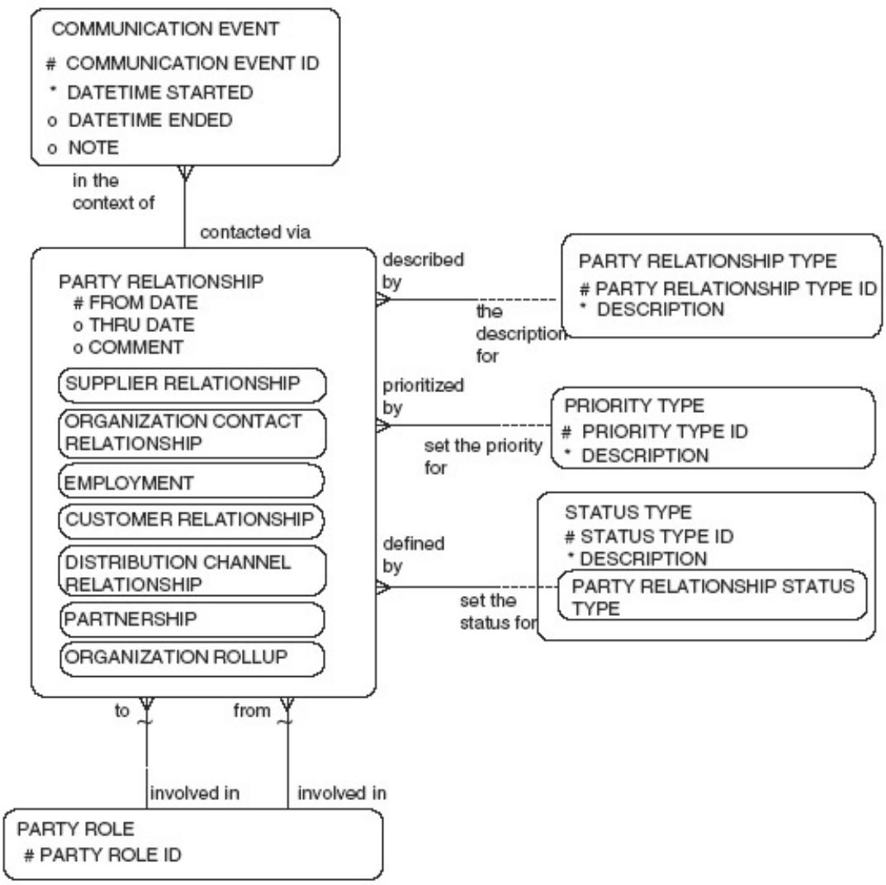
Figure 2.7 Party relationship information.

Table 2.8 Party Relationship Information

<table><tr><td colspan="7">PARTY</td></tr><tr><td>RELATIONSHIP TYPE NAME</td><td>FROM PARTY</td><td>FROM ROLE</td><td>TO PARTY</td><td>TO ROLE</td><td>STATUS</td><td>PRIORITY</td></tr><tr><td>Customer relationship</td><td>ACME Company</td><td>Customer</td><td>ABC Subsidiary</td><td>Internal organization</td><td>Active</td><td>High</td></tr><tr><td>Agent relationship</td><td>Sellers Assistance Corporation</td><td>Sales agent</td><td>ABC Subsidiary</td><td>Internal organization</td><td>Inactive</td><td></td></tr><tr><td>Supplier relationship</td><td>Fantastic Supplies</td><td>Supplier</td><td>ABC Subsidiary</td><td>Internal organization</td><td>Active</td><td>Medium</td></tr><tr><td>Supplier contact relationship</td><td>John Smith</td><td>Supplier coordinator</td><td>Nancy Barry</td><td>Supplier service contact</td><td>Active</td><td></td></tr><tr><td>Customer contact relationship</td><td>William Jones</td><td>Account manager (for ABC Subsidiary)</td><td>Marc Martinez</td><td>Customer contact</td><td>Active</td><td></td></tr></table>

# Status Types

Similar to ROLE TYPES, there will be many statuses for many entities throughout the data models-for example, ORDER STATUS, SHIPMENT STATUS, WORK EFFORT STATUS, and so on. The PARTY RELATIONSHIP STATUS TYPE is shown as a subtype of STATUS TYPE. Other STATUS TYPES throughout this book will also be subtypes of STATUS TYPE; however, again for simplicity purposes (and to make best use of room on the paper), the subtype relationship will not always be explicitly shown as it is in Figure 2.7).

# Party Contact Information

People and organizations may be contacted many different ways; by mail, phone, fax, e-mail, cell phone, pager. This section describes

three very flexible data models for storing information about addresses, phone numbers, fax numbers, and any other type of mechanism used for contacting parties.

Most data models will portray contact information in separate attributes such address line 1, address line 2, home phone, office phone, office fax, and so on. There are two main issues with modeling information this way. First of all, how does one know how many contact numbers to allow for and what types? What if someone has two or three home addresses or home phones? What if new mechanisms arise for contacting people? In practice, when the database doesn't allow for all possibilities, the user just adds this information into the "comment" field which makes searching much more difficult!

The other issue with modeling contact information as individual attributes is that each contact address, number, or string may have its own information. For instance, addresses may have directions, and contact numbers may have information associated with them such as indications not to solicit or information about the best times to call. If these contact mechanisms are not modeled on their own, a great deal of redundancy can occur. For instance, if the address of the headquarters of a large company is stored as an attribute, the directions may be stored inconsistently a number of times in the database.

# Postal Address Information

One way to contact a person or organization is by either visiting them at their address or mailing them at their postal address. Figure 2.8 provides a data model to capture postal address and geographic boundary information. The POSTAL ADDRESS entity maintains all addresses used by the enterprise in a central place. The PARTY POSTAL ADDRESS entity shows which POSTAL ADDRESSES are related to which PARTYs. The GEOGRAPHIC BOUNDARY entity maintains any type of encompassing area such as a COUNTY, CITY, STATE, COUNTRY, POSTAL CODE, PROVINCE, or TERRITORY, and it is related back to the POSTAL ADDRESSES as well as recursively to other GEOGRAPHIC BOUNDARY.

# Figure 2.8 Postal address information.

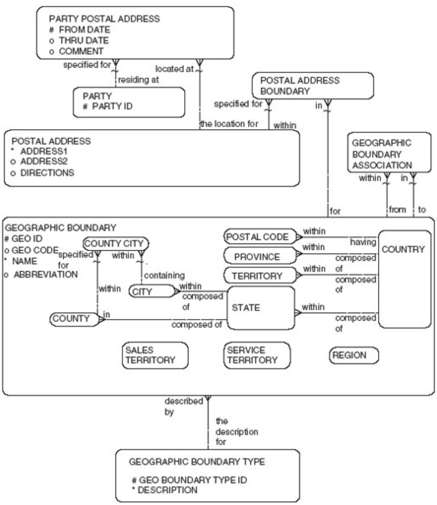

An organization may have many addresses or locations. For instance, a retailer might have several outlets at different addresses. In this instance, there is only one organization but many locations or addresses. Additionally, the same postal address might be used by many organizations. For instance, many subsidiaries of an organization might share the same address. Also, different

organizations might share the same address if they are in a shared office facility.

There is also a many-to-many relationship between PERSON and POSTAL ADDRESS. A particular address may have many people residing there, such as many employees who work at the same facility. And, of course, people generally have many addresses: their home address, work address, vacation address, and so forth. Therefore, there is a many-to-many relationship between PARTY and POSTAL ADDRESS.

Instead of two separate relationships for people and organizations, the model shows a many-to-many relationship between PARTY and POSTAL ADDRESS that is resolved via an intersection entity (sometimes referred to as an associative or cross-reference entity) named PARTY POSTAL ADDRESS, as shown in Figure 2.8. Notice that PARTY ADDRESS has a from date and thru date that allow tracking of the address history of parties.

Tables 2.9 and 2.10 give examples of party addresses. Table 2.9 lists the individual address records, while Table 2.10 cross-references parties to addresses. With this model, addresses are stored only once—thus eliminating redundant data problems—and can be reused many times in relationship to many parties. For instance, in Tables 2.9 and 2.10, the same address, address ID 2300, is used by ABC

Corporation and ABC Subsidiary. Additionally, ABC Subsidiary has more than one address, as illustrated by its two entries in Table 2.10.

Table 2.9 Postal Address Data

<table><tr><td>ADDRESS ID</td><td>ADDRESS1</td><td>ADDRESS2</td><td>CITY</td></tr><tr><td>2300</td><td>100 Main Street</td><td>Suite 101</td><td>New York</td></tr><tr><td>2400</td><td>255 Fetch Street</td><td></td><td>Portland</td></tr><tr><td>2500</td><td>234 Stretch Street</td><td></td><td>Minneapolis</td></tr></table>

Table 2.10 Party Postal Address Data

PARTY ADDRESS ID

ABC Corporation2300

ABC Subsidiary 2300

ABC Subsidiary 2400

ACME Company 2500

The POSTAL ADDRESS entity stores attributes to identify the specific location for either visiting or sending mail to a party. The address1 and address2 attributes provide a mechanism for two text lines of an address. There may be a need for more address line attributes depending on the needs of the enterprise. The directions attribute provides instructions on what roads to travel and what turns to take in order to arrive at that address. Often this direction information is

repeated in databases where the address is not treated as a separate entity on its own.

# Geographic Boundaries

Each address may have many other GEOGRAPHIC BOUNDARYs. For example, each POSTAL ADDRESS may have a CITY, PROVINCE, TERRITORY, or other GEOGRAPHIC BOUNDARY, depending on its location within the world. POSTAL ADDRESSES may also be identified within other boundaries such as a SALES TERRITORY, SERVICE TERRITORY, or REGION. Each POSTAL ADDRESS may also have a POSTAL CODE. The POSTAL CODE identifies the mailing code that is used for sorting addresses and delivery within postal services. In the United States, the postal code is referred to as the zip code.

An alternate data model for this structure could be to tie the POSTAL ADDRESS to the specific GEOGRAPHIC BOUNDARYs that apply, instead of using the associative entity, POSTAL ADDRESS BOUNDARY. For instance, there could be a one-to-many relationship from POSTAL ADDRESS to CITY and another one-to-many relationship from POSTAL ADDRESS to POSTAL CODE. If there is a need for worldwide applicability—perhaps some addresses use territories (Australia), provinces (Canada), prefectures (Japan)—there would need to be a supertype for all of these or individual relationships. If a more specific application of this model is needed,

the reader is encouraged to modify this model with more specific relationships.

GEOGRAPHIC BOUNDARYs are recursively related to other GEOGRAPHIC BOUNDARYs. For instance, each SALES TERRITORY, SERVICE TERRITORY, or REGION may be defined by relating it to a number of CITYs, STATES, or COUNTRYs.

In many data models, phone numbers are shown as attributes of the organization or person. Usually, there are also fields for fax numbers, modem numbers, pager numbers, cellular numbers, and electronic mail addresses. This often leads to limitations in the systems built. For instance, if someone has two or three business phone numbers and there is only one business phone number field for a person, where are the other business phone number entered? In this new world, where there are many methods for contacting parties, more flexible data structures are needed.

Party Contact Mechanism—Telecommunications Numbers and Electronic Addresses

The CONTACT MECHANISM entity in Figure 2.9 stores access mechanisms for parties. Each CONTACT MECHANISM may be the way to contact a particular PARTY. The intersection entity PARTY CONTACT MECHANISM shows which contact mechanisms are related

to which parties. The CONTACT MECHANISM TYPE entity maintains allowable values for different types of contact mechanisms, for example, "phone," "mobile phone," "fax number," "e-mail address," and so on.


Figure 2.9 Party contact mechanism—telecommunications numbers and electronic addresses.

CONTACT MECHANISMS are subtyped to include TELECOMMUNICATIONS NUMBER and ELECTRONIC ADDRESS. TELECOMMUNICATIONS NUMBER includes any access via telecommunications lines such as phones, faxes, modems, pagers, and cellular numbers. ELECTRONIC ADDRESS includes any access via services like the Internet or other electronic mail services.

The CONTACT MECHANISM TYPE entity shows all the possible values for types of contact mechanism. Examples include "phone," "fax," "modem," "mobile phone," "Internet address," and "Web URL." With technology growing so quickly, it is very likely that there will be other ways to get in touch with someone. The data structure in Figure 2.9 provides an easy method for adding any new contact mechanisms by simply inserting and using new CONTACT MECHANISM TYPES.

The attribute non-solicitation ind on PARTY CONTACT MECHANISM provides a mechanism to indicate that that the mechanism is not to be called for solicitation purposes. If someone indicated that he or she did not want to be solicited on a particular number, it would be important to record this from a consideration point of view as well as a legal point of view.

Party Contact Mechanism (Expanded)

If CONTACT MECHANISMS are a means of reaching a person or organization, why not include POSTAL ADDRESSES as a subtype of CONTACT MECHANISM? Postal addresses are merely another mechanism for reaching someone. Imagine contact management systems that could provide flexible, scroll-down lists showing all the different ways of getting ahold of a party showing all the phone numbers, fax numbers, e-mail and postal addresses and categorized by their purpose (i.e., “primary home address,” “summer home

address," "main office number," "secondary fax number," "billing inquiries," "headquarters number," "emergency only," and so on.). This could greatly facilitate how we contact parties and allow for very flexible and easily accessible contact information.

Another advantage of including POSTAL ADDRESSES as a subtype of CONTACT MECHANISM is that many business processes need a contact mechanism to complete a transaction and that contact mechanism may be a postal address, telecommunications number, or electronic address. For example, an order may be secured with either a POSTAL ADDRESS or an ELECTRONIC ADDRESS (i.e., an e-mail address).

Figure 2.10 provides a standard data model with this flexible structure. The CONTACT MECHANISM entity contains the subtypes POSTAL ADDRESS, TELECOMMUNICATIONS NUMBER, and ELECTRONIC ADDRESS. Because it has already been established that there is a many-to-many relationship between each of these subtypes and PARTY, this diagram shows a many-to-many relationship between CONTACT MECHANISM and PARTYs.

Figure 2.10 Party contact mechanism (expanded).


Also PARTY CONTACT MECHANISMS are optionally related to PARTY ROLE TYPE to indicate that each party's contact mechanism may be specified for a particular roles only. For instance, an organization may provide address information only in their role as a customer, and this may not be applicable to any other role.

Contact mechanisms may be related to each other and hence the recursive entity, CONTACT MECHANISM LINK. For example, certain phone numbers, when busy, may be automatically routed to pagers or cellular numbers. Fax numbers may be automatically connected to e-mail addresses. This may be important information to know when contacting parties.

# Contact Mechanism Purpose

Each contact mechanism for each party may have many purposes. For instance, an address might be used as a mailing address, a headquarters address, a service address, and so on. Most systems have a separate record for the mailing address, headquarters address, and service address, even though the address information may be exactly the same. Furthermore, just as addresses are intended for specific purposes, so are other contact mechanisms. A single contact mechanism may have more than one purpose. For example, business people sometimes have a single number for both their phone and fax needs.

Therefore, the data model in Figure 2.10 shows that each PARTY CONTACT MECHANISM must have one or more PARTY CONTACT MECHANISM PURPOSES, each of which is described by a CONTACT MECHANISM PURPOSE TYPE.

Because the purposes of various contact mechanisms change over time, the from date and thru date identify when the purposes are valid. The CONTACT MECHANISM PURPOSE TYPE maintains the possible list of purposes that can be applied.

An alternate way this could be modeled is to relate the CONTACT MECHANISM PURPOSE TYPE directly to the PARTY CONTACT MECHANISM and include the contact mechanism purpose type id as part of the key to the PARTY CONTACT MECHANISM entity. This would be a simpler design, but it would lead to redundancy in many cases. For example, if the same party's address served as a mailing, headquarters, and service address, it would be stored as three instances in the PARTY CONTACT MECHANISM entity. Each instance would have the same party and contact mechanism id but would have a different purpose. Therefore information related to just the party and contact mechanism, such as the non-solication ind, would be repeated. In other words, the PARTY CONTACT MECHANISM entity has significance on its own and may have its own attributes or relationships, independent of the purpose(s). For this reason, our model shows separate PARTY CONTACT MECHANISM and PARTY CONTACT MECHANISM PURPOSE entities.

Table 2.11 gives examples of party contact mechanisms. The first seven entries show that there are many contact mechanisms for ABC Corporation. The first contact mechanism is a phone number and

serves as the general phone number for the organization. The main fax number shows on the second row. ABC Corporation has a secondary fax number, shown as (212) 356-4898. The next rows show that 100 Main Street has more than one purpose; it is both the headquarters and the address for billing inquiries. ABC Corporation has another address where it has a sales office at 500 Jerry Street. ABC Corporation has its Web address at abccorporation.com. ABC Subsidiary, which is part of ABC Corporation, has two addresses listed: one at 100 Main Street for a service address and one at a sales address at 255 Fetch Street. As another example, John Smith has several contact mechanisms listed such as his main office number, main home number, his cellular or mobile number, and his home and work addresses. Barry Goldstein's contact numbers show two work numbers, a primary number and a secondary number, along with a work e-mail, personal e-mail, and home address.

Table 2.11 Party Contact Mechanisms

<table><tr><td>PARTY</td><td>CONTACT MECHANISM</td><td>CONTACT MECHANISM TYPE</td><td>CONTACT MECHANISM PURPOSE</td></tr><tr><td>ABC Corporation</td><td>(212) 234 0958</td><td>Phone</td><td>General phone number</td></tr><tr><td>ABC Corporation</td><td>(212) 334 5896</td><td>Fax</td><td>Main fax number</td></tr><tr><td>ABC Corporation</td><td>(212) 356 4898</td><td>Fax</td><td>Secondary fax number</td></tr><tr><td>ABC Corporation</td><td>100 Main Street</td><td>Postal address</td><td>Headquarters</td></tr><tr><td>ABC Corporation</td><td>100 Main Street</td><td>Postal address</td><td>Billing inquiries</td></tr><tr><td>ABC Corporation</td><td>500 Jerry Street</td><td>Postal address</td><td>Sales office</td></tr><tr><td>ABC Corporation</td><td>Abccorporation.com</td><td>Web address</td><td>Central Internet address</td></tr><tr><td>ABC Subsidiary</td><td>100 Main Street</td><td>Postal address</td><td>Service address</td></tr><tr><td>ABC Subsidiary</td><td>255 Fetch Street</td><td>Postal address</td><td>Sales office</td></tr><tr><td>John Smith</td><td>(212) 234 9856</td><td>Phone</td><td>Main office number</td></tr><tr><td>John Smith</td><td>(212) 748 5893</td><td>Phone</td><td>Main home number</td></tr><tr><td>John Smith</td><td>(212) 384 4387</td><td>Cellular</td><td></td></tr><tr><td>John Smith</td><td>345 Hamlet Place</td><td>Postal address</td><td>Main home address</td></tr><tr><td>John Smith</td><td>245 Main Street</td><td>Postal address</td><td>Main work address</td></tr><tr><td>Barry Goldstein</td><td>(212) 234 0045</td><td>Phone</td><td>Main office number</td></tr><tr><td>Barry Goldstein</td><td>(212) 234 0046</td><td>Phone</td><td>Secondary office number</td></tr><tr><td>Barry Goldstein</td><td>Bgoldstein@abc.com</td><td>E-mail address</td><td>Work e-mail address</td></tr><tr><td>Barry Goldstein</td><td>Barry@barrypersonal.com</td><td>E-mail address</td><td>Personal e-mail address</td></tr><tr><td>Barry Goldstein</td><td>2985 Cordova Road</td><td>Postal address</td><td>Main home address</td></tr></table>

Table 2.11 shows the flexibility and maintainability of correct contact information for all types of current contact mechanisms as well as new contact mechanisms that could potentially emerge as telecommunications evolves.

Facility Versus Contact Mechanism

A contact mechanism could be tied to a particular PARTY, such as a person's cellular telephone number, or it may be tied to a physical location, for example, the telephone number for a manufacturing plant or the telephone number for a tower facility. These physical

facilities are not postal addresses or parties (although they are associated with postal addresses and parties), and another entity is needed to describe them. The CONTACT MECHANISM entity maintains information about a label or identifier for contacting a party; the FACILITY stores the attributes or relationships associated with physical structures.

Figure 2.11 provides a structure to record information about physical facilities. FACILITY subtypes include WAREHOUSE, PLANT, BUILDING, ROOM, OFFICE, and the FACILITY TYPE allows for other types. Each FACILITY may be made up of other FACILITIES. For example, a BUILDING may be made up of ROOMs; if there is a more specific need to track floors, a BUILDING may be made up of FLOORs that are made up of ROOMS. An attribute that may be of interest to the physical facility is square footage.

Figure 2.11 Facility versus contact mechanism.

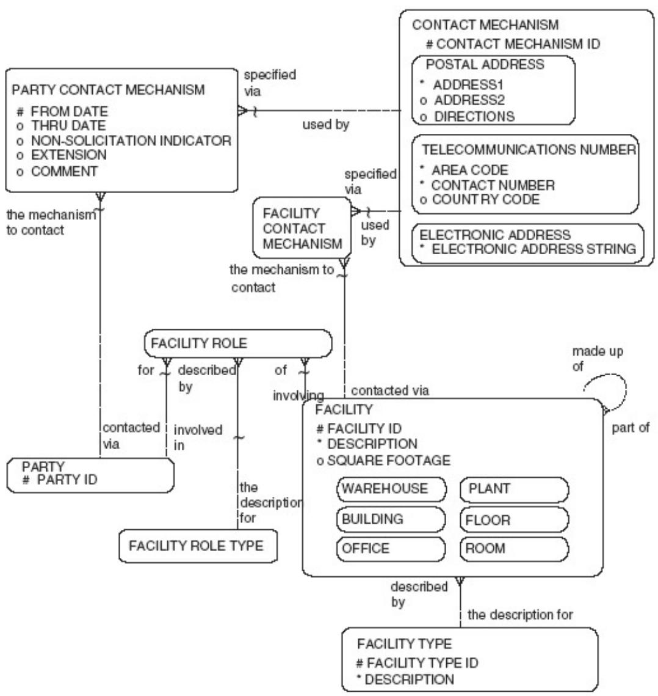

Each FACILITY may involve one or more parties, thus the FACILITY ROLE entity maintains what PARTYs are playing what FACILITY ROLE TYPES for what FACILITIES. For instance, certain parties may use the facility, lease the facility, rent the facility, or own the facility-hence, the FACILITY ROLE TYPE entity stores these possible values. Also, each FACILITY may be contacted via one or more CONTACT MECHANISM. A PLANT facility may be contacted using several of the previously mentioned contact mechanisms such as phone, fax, e-

mail, postal address, and so on. The FACILITY could have more than one of each of these CONTACT MECHANISMS; for example, it may have a street postal address of 100 Smith Street and another address of PO Box 1234.

Depending on the environment, a CONTACT MECHANISM may be the mechanism to contact more than one FACILITY. For example, perhaps the same postal address may be the contact mechanism for more than one plant that is grouped together within the same postal address. Since this may be possible, the FACILIY CONTACT MECHANISM associative entity provides for a many-to-many relationship between CONTACT MECHANISM and FACILITY.

# Party Communication Event

It is important in many applications to track information regarding with whom and when contact or communication was made within relationships between parties. For instance, sales or account representatives often need to know who was called for what purpose and when in order to properly follow up with their customers. The contact or communication might have been via a telephone call, an in-person sales meeting, a conference call, a letter, or any other method of encounter.

In Figure 2.12, the entity COMMUNICATION EVENT provides a history of the various communications that have been made or will be made between parties. A COMMUNICATIONS EVENT is defined as the interchange of information between parties via some type of contact such as a phone call, meeting, videoconference, and so on. The COMMUNICATION EVENT may be within the context of a particular PARTY RELATIONSHIP, or it may be between many parties and therefore use the COMMUNICATION EVENT ROLE to describe the roles of parties. For contact events that involved more than two parties (for instance, a meeting or seminar), the COMMUNICATION EVENT ROLE may define the parties and the roles they play with the event (facilitator, participant, note taker, and so on).

Figure 2.12 Communication event.


The COMMUNICATION EVENT will usually be within the context of a PARTY RELATIONSHIP and not the COMMUNICATION EVENT ROLE because it is within a relationship that communications usually make sense. It is possible to have several relationships between two parties. For instance, Marc Martinez might be the customer contact for John Smith in one relationship. At a later date, Marc Martinez

might decide to work for John Smith's company (ABC Subsidiary) and report to him. It would be appropriate to track the communication events for these relationships separately.

COMMUNICATION EVENTS may be categorized two main ways: what contact mechanism was used to conduct the event (phone, fax, letter, e-mail, face to face, and so on) and what was the purpose of the contact event (support call, sales follow-up, customer service call, conference, seminar). A COMMUNICATION EVENT occurs via one and only one CONTACT MECHANISM TYPE; however, it may have many COMMUNICATIONS EVENT PURPOSES. For instance, a particular meeting may be a customer service support call as well as a request to deliver an additional item. Figure 2.12 provides the subtypes of INQUIRY, SUPPORT CALL, CUSTOMER SERVICE CALL, MEETING, SALES FOLLOW-UP, CONFERENCE, SEMINAR, ACTIVITY REQUEST as well as the COMMUNICATION EVENT PURPOSE TYPE to indicate that there may be additional COMMUNICATION EVENT PURPOSES. Other possible purposes include "initial sales call," "service repair call," "demonstration," "sales lunch appointment," or "telephone solicitation." The description attribute provides for storing additional information about the purpose such as "This is a critical sales call that must turn client around".

The VALID CONTACT MECHANISM ROLE provides a mechanism to identify what types of COMMUNICATION EVENT ROLES TYPES are

valid for what types of CONTACT MECHANISM TYPES. For instance, a " caller" and "receiver" may be valid for a "phone" contact mechanism type, while "facilitator," "participant," and "note taker" are valid roles for a "face-to-face communication." The

COMMUNICATION EVENT STATUS TYPE maintains the state of the event. Example statuses include "scheduled," "in progress," and "completed."

The COMMUNICATION EVENT maintains the datetime started, datetime ended, and a note describing the contact. An example note may be "initial sales call went well and customer seemed interested in moving forward quickly with a demonstration of the Thingamajig product". Table 2.12 gives other examples of types of communication events.

Table 2.12 Communication Events

<table><tr><td>COMMUNICATION
EVENT ID</td><td>FROM PARTY</td><td>TO PARTY</td><td>START DATETIME</td><td>COMMUNICATION
EVENT PURPOSE</td><td>CONTACT
MECHANISM TYPE</td><td>COMMUNICATION
EVENT STATUS TYPE</td></tr><tr><td>1010</td><td>William Jones</td><td>Marc Martinez</td><td>Jan 12, 2001, 3 PM</td><td>Initial sales call
Initial product
demonstration</td><td>Face to face</td><td>Completed</td></tr><tr><td>1300</td><td>William Jones</td><td>Marc Martinez</td><td>Jan 30, 2001, 2PM</td><td>Demo of product</td><td>Web-based interaction</td><td>Completed</td></tr><tr><td>1450</td><td>William Jones</td><td>Marc Martinez</td><td>Feb 12, 2002, 10AM</td><td>Sales close
Gather order details</td><td>Face to face</td><td>Completed</td></tr><tr><td>1900</td><td>William Jones</td><td>Marc Martinez</td><td>June 1, 2002, 1PM</td><td>Customer service
follow-up
Customer satisfaction
survey</td><td>Phone</td><td>Scheduled</td></tr><tr><td>3010</td><td>John Smith</td><td>Nancy Barry</td><td>Sept 12, 2001, 3PM</td><td>Purchasing follow-up
(to find out status of
pending purchase
order)</td><td>E-mail</td><td>Completed</td></tr><tr><td>3011</td><td>Joe Schmoe</td><td>Jerry Red</td><td>Sept 19, 2001, 3PM</td><td>Technical support call
Request for a software
patch</td><td>Phone</td><td>Pending resolution</td></tr></table>

# Table 2.12 gives examples of possible communication events.

William Jones, an account manager for ABC Corporation, has made several sales contacts with Marc Martinez, the customer contact for ACME Corporation. The first four entries in Table 2.12 show the date, time, purpose, and type of contact mechanism used as well as the status of the event. The status is used to indicate if the activity has been completed or if it is just scheduled. William Jones started with a face-to-face initial sales meeting on January 12 and then proceeded with a more detailed product demonstration using the company's Web site, which has the capabilities to do a product demonstration and includes chatting capabilities. The fifth entry shows an email contact initiated by John Smith to Nancy Barry who is a supplier representative. The sixth entry shows that Joe Schmoe has made a call to Jerry Red regarding a problem and illustrates that communication event tracking is important not only in sales but in other areas of the business such as purchasing relationships. This data structure provides a mechanism for tracking communication events for all types of relationships and circumstances and is a very powerful business tool.

# Communication Event Follow-Up

Very often, communication events require follow-ups and management in order to ensure proper service, sales coverage, or support. Many times, cases are opened to manage related

communication events involving the same issue. For instance, if a customer calls up about a technical support problem, an action may need to be taken—for instance, sending the latest patch to correct the problem.

Figure 2.13 shows the data model that both supports grouping communication events into cases and relates each event to some work that may be required as a result of the communication event. A CASE may be set up for a series of related COMMUNICATION EVENTS regarding a particular issue. Each CASE may have several CASE ROLES that identify who is responsible for the CASE, who checks the quality of service within the CASE, who is the customer for the CASE, and so on.

Figure 2.13 Communication event follow up.


Each COMMUNICATION EVENT may be related to one or more WORK EFFORTS because in a single event one of the parties may have more than one follow-up action. WORK EFFORTS will be further defined and explained later in this book in Chapter 6, Work Efforts. Also each WORK EFFORT may be related to one or more COMMUNICATION EVENTS because a caller may request a WORK

EFFORT, follow up on the progress of the WORK EFFORT, and have several other communications about the WORK EFFORT.

Table 2.13 provides sample data for the WORK EFFORTs that stem from communication events. All the communication events listed are related to a technical issue of a customer's software crashing and calling in on a support line to establish the first communication event. Jerry Reed is the person handling the call; he opens case "105." Joe Schmoe is the customer calling in, and Larry Assure is his manager, who is monitoring this case. The first call is taken on Sept 19 at 3 p.m. Jerry realized that he needs to send out a software patch so he sets up a work effort "1029" to make sure this gets done. On Sept 20 he follows up on this outstanding work effort and sends out the software patch with another communication effort, namely an e-mail. The example illustrates that a work effort to send a software patch in order to correct the problem may be related to two communication events; it is related to the request to send the software as well as to the communication event in which the software patch was sent. It also could have been related to follow-up calls from the customer about the sending of the patch. The third communication event shows that he followed up to make sure the patch worked and to close the case.

Table 2.13 Communication Event Follow-Up

<table><tr><td>CASE</td><td>CASE DESCRIPTION</td><td>CASE ROLE</td><td>COMMUNI-CATION EVENT ID</td><td>START DATETIME</td><td>COMMUNICATION EVENT PURPOSE</td><td>CONTACT MECHANISM TYPE</td><td>COMMUNICATION EVENT WORK EFFORT</td><td>WORK EFFORT</td></tr><tr><td>105</td><td>Technical support issue with customer-software keeps crashing</td><td>Jerry Red-technical resolution lead Joe Schmoe-case customer Larry Assure-quality assurance manager</td><td>3010</td><td>Sept 19,2001, 3PM</td><td>Technical support callActivity request</td><td>Phone</td><td>Request for a software patch</td><td>Work effort id 1029- Send software patch out to customer to correct problem</td></tr><tr><td></td><td></td><td></td><td>3098</td><td>Sept 20,2001, 2PM</td><td>Send software patch</td><td>E-mail</td><td></td><td>Work effort id 1029- Send software patch out to customer to correct problem</td></tr><tr><td></td><td></td><td></td><td>3120</td><td>Sept 19,2001, 3PM</td><td>Technical support follow-up Call. resolution</td><td>Phone</td><td></td><td></td></tr></table>

# Summary

Most data models and database designs unnecessarily duplicate information regarding people and organizations. As a result, many organizations have a difficult time maintaining accurate information. This chapter has illustrated how to build a very flexible and normalized data model for people, organizations, party relationships, addresses, contact mechanisms, and contacts made between parties. Figure 2.14 shows the key entities discussed in this chapter and their relationships.

Figure 2.14 Overall party model.


Please refer to Appendix A for a listing of entities and attributes. SQL scripts to build tables and columns derived from the logical models in this book can be found on the full-blown CD-ROM, which is licensed separately.

# CHAPTER

# 3

# Products

Having established the models for parties and party roles and their relationships, this chapter focuses on the products that parties produce and use. Products are defined as goods or services that were, are, or will be sold by the enterprise. Goods are products that are more tangible in nature and generally created in advance for sale. Services are products that involve the use of parties' time and are less tangible in nature. Every organization needs to know a great deal of product information on a regular basis, such as the following issues:

- How do the enterprise's services or goods compare in quality and price to those of its competitors?
- What inventory is needed at each location to meet the needs of customers?
- What are the prices, costs, and profitability for the services or goods that are offered?
- Where can the enterprise purchase the best services and goods at the best prices?

Just as the party model stores common information about parties independent of their roles, the product model stores common product information regardless of whose products they are. This product model is therefore more flexible, stable, and understandable because product information is modeled only one time, regardless of whether it is the enterprise's products, competitors' products, or suppliers' products. This chapter models information on the following areas of product:

Product definition
Product category
Product identification
Product feature
- Suppliers and manufacturers of products
- Inventory item storage
Product pricing
Product costing
- Product to product associations (alternate model also provided)
- Product and parts (alternate model also provided)

# Product Definition

Just as parties include both internal and external parties, the product model includes products that the enterprise provides, products from suppliers, and products that competitors provide. Some of the

information may be independent of the supplier, such as the description, category, and features of the product. Some of the information about the products, such as the availability and pricing of products, may depend on the supplier of the product.

Figure 3.1 shows an entity called PRODUCT that models all products including the products the enterprise sells, products from suppliers, and competitors' products. The model shows that the key is product id, which is an identifier for the product. The attributes of PRODUCT are name, which uniquely describes a product; introduction date, stating when the product was first available to be sold; sales discontinuation date, which documents when the product will not be sold any more by the manufacturer; support discontinuation date, which states when the product will no longer be supported by the manufacturer; and a comment, which documents particular descriptions or notes relating to the product.

Figure 3.1 Product definition.


Products include both tangible goods, which are called GOODS, and non-tangible offerings, which are calledSERVICES. For example, a GOOD may include specific types of pens, furniture, equipment, or anything that can be physically stored. (Even a software program, which is a GOOD, can be physically stored.) The alternate subtype, SERVICE, is for products that involve selling people's time and expertise such as consulting services, legal services, or any other services that provide time and/or expertise. (See Table 3.1.)

Table 3.1 Products

<table><tr><td>PRODUCT ID</td><td>PRODUCT DESCRIPTION</td><td>PRODUCT</td></tr><tr><td></td><td></td><td>SUBTYPE</td></tr><tr><td>PAP192</td><td>Johnson fine grade 8½ by 11 inch bond paper</td><td>Good</td></tr></table>

PEN202 Goldstein Elite pen Good

DSK401 Jerry's box of  $3 1 / 2$  -inch diskettes Good

FRMCHFA1500Preprinted forms for insurance claims Good

Office supply inventory management
CNS109
consulting service

# Product Category

The classification of products is a key aspect of maintaining product information. Products are often classified many ways—by product line, by model, by product grade, by industry segments, and by various other product categories. Often, these classifications are shown as separate entities in the data model. The issue of showing these product categories separately is that other information may be based on any of these categories and should be related to the supertype of PRODUCT CATEGORY to provide more flexibility. For instance, targeting market interest in products may be based on several product categories. Another example is that product pricing may be based on and related to many product categories.

Figure 3.2 illustrates that a PRODUCT may be classified in one or more PRODUCT CATEGORYs to group products together that may be useful for several purposes, such as catalog organization, sales analysis, listings, or other types of product analysis. The PRODUCT CATEGORY can include more that one PRODUCT, and therefore the

associative entity, PRODUCT CATEGORY CLASSIFICATION describes which products are in which category. For example, all pens, pencils, paper, notebooks, desk sets, and diskettes are classified into the category of office supplies.


Figure 3.2 Product category.

Product categories may change over time; therefore, the PRODUCT CATEGORY CLASSIFICATION has the attributes from date and thru date, which state when the product was classified into its grouping.

PRODUCT CATEGORYs may be made up of other PRODUCT CATEGORYs and hence the recursive entity PRODUCT CATEGORY ROLLUP that allows each product category to be made up of many other categories as well as a sub-category to be in a different parent category. An example of this is that the product, "Johnson fine grade  $8 \frac{1}{2}$  by 11 bond paper," is classified as a paper product, which is a subcategory of the office supplies category and may also be a subcategory of the computer supplies category.

To assist in sales forecasting and prospecting, the entity MARKET INTEREST is included in this model. It is an intersection entity linking information about PARTY TYPE and PRODUCT CATEGORY that allows an enterprise to record the category of products for which particular types of parties may be interested. If the PARTY TYPE includes specific industries or industry segments as types and these have been associated with actual parties, then an enterprise can easily identify organizations within segments of a target industry that may be interested in types of products or services. These organizations could then be the focus of a new sales campaign for those types of products. Because interests change over time, the attributes from date and thru date are also included.

Table 3.2 illustrates examples of product categories. Notice that diskettes are categorized as both office supplies and computer supplies. This categorization may be useful for showing different types of products under various product catalogs. The enterprise needs to be careful when classifying a product into multiple categories, as it can result in misleading results when performing certain queries. For instance, if products were grouped into multiple categories and there was a sales analysis report by category, the total sales amount for the report would be overstated because some product sales would be counted numerous times for each of their categories. The model has a primary flag to indicate which is the primary category for the product to avoid this situation.

Table 3.2 Product Categories

<table><tr><td>PRODUCT ID</td><td>PRODUCT DESCRIPTION</td><td>PRODUCT CATEGORY</td><td>PRIMARY FLAG</td><td>PARTY TYPE MARKET INTEREST</td></tr><tr><td>PAP192</td><td>Johnson fine grade 8½ by 11 bond paper</td><td>Office supplies</td><td>Yes</td><td></td></tr><tr><td></td><td></td><td>Paper</td><td>No</td><td></td></tr><tr><td>PEN202</td><td>Goldstein Elite pen</td><td>Office supplies</td><td>Yes</td><td></td></tr><tr><td></td><td></td><td>Pens</td><td>Yes</td><td></td></tr><tr><td>DSK401</td><td>Jerry&#x27;s box of 3½ inch diskettes</td><td>Office supplies</td><td>No</td><td></td></tr><tr><td></td><td></td><td>Computer supplies</td><td>Yes</td><td></td></tr><tr><td>CNS109</td><td>Office supply inventory management consulting service</td><td>Consulting services</td><td>Yes</td><td></td></tr><tr><td>FRMCHFA1500</td><td>Preprinted forms for insurance claims</td><td>Forms</td><td>Yes</td><td></td></tr><tr><td></td><td></td><td>Insurance</td><td>No</td><td>Insurance companies Insurance brokers Health care provider organizations</td></tr></table>

Notice that in Table 3.2 the diskettes are classified in two categories; however, one category is flagged as the primary category to avoid duplication of results when analyzing sales. The enterprise needs to enforce a business rule that only one category for the product may be primary. The last row shows a preprinted claims insurance forms product that falls into two product categories, a forms product and an insurance product. The types of parties that have been identified as possibly having an interest in the insurance category of products are insurance companies, insurance brokers, and health care provider organizations such as doctors' offices, hospitals, and so on.

If the category that is primary varies depending on the application, then instead of the primary flag attribute, another entity would

need to be added such as PRODUCT CLASSIFICATION TYPE which would be related to the PRODUCT CATEGORY CLASSIFICATION, to allow for more flexibility. Instances within this entity could be "primary category for catalogues," "primary category for sales analysis" and so on.

# Product Identification Codes

Goods may have various ids that are used as a standard means of identifying the goods. Figure 3.3 provides a data model to identify the various code or id values that a good may have. A single code may uniquely identify goods and/or services, however, some goods may have more than identification value. The GOOD

IDENTIFICATION entity has an attribute of ID value to store the various identification codes that the good may have. The subtypes of GOOD IDENTIFICATION designate the types of ids that may be given to a good. The MANUFACTURER's ID NO is a good id designated by the manufacturer. The SKU (stock-keeping unit) is a standard product id that distinctly identifies various products. The subtype UPCA stands for Universal Product Code—American and is a mechanism for identifying products within America. UPCE (Universal Product Code—European) is a mechanism for identifying products in Europe. ISBN (International Standard Book Number) is a mechanism to identify specific books throughout the world. A single good may have more than one standard id. For instance, a certain

office supply product may have a manufacturer ID number designated by the manufacturer and a UPCA number identified by the industry.

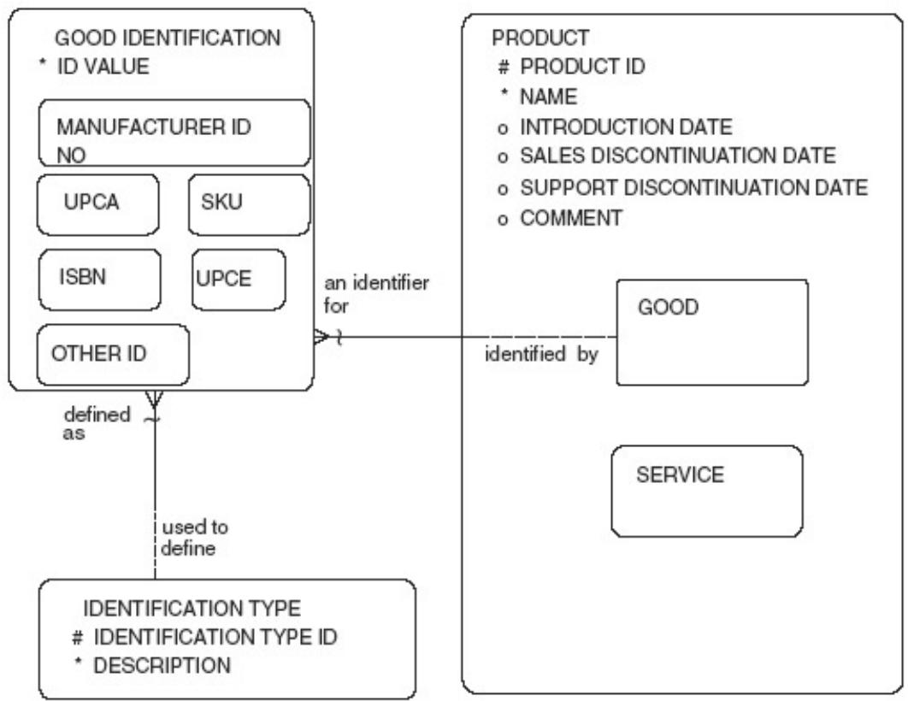
Figure 3.3 Product identification.

# Product Features

Products may have features that could also be called characteristics, options, variations, or modifiers, allowing either customization of a product or describing the characteristics of a product. One may think that these should be two separate entities, one to describe the features included in the product and another to record the available

options. The issue with having two separate entities is that the same feature may be part of one product and be an option in another product. For example, a "copier paper" product offering may be defined using white paper as a part of the product definition, while another product, "colored stationery," may have the color "white" as an option. Additionally, the same product variation may be part of the product and later in time be considered an optional feature.

Therefore, the data model will maintain product features that may be required as part of the product, may come standard with a product (meaning that this feature may be deselected), or may be selected as an option for a product. Examples of features include the product quality, brand name (which may be different from the manufacturer), color, size, dimension, style, hardware features, software features, or billing options.

In Figure 3.4, a PRODUCT FEATURE entity is used to define these ways in which the product may be modified or tweaked. Because a PRODUCT FEATURE may be used in many products and each product may have many features, the PRODUCT FEATURE APPLICABILITY maintains which PRODUCTS may be available with which PRODUCT FEATURES. The PRODUCT FEATURE CATEGORY entity allows for the classification of PRODUCT FEATURES such as "quality", "color", or "size". The subtypes, STANDARD FEATURE, REQUIRED FEATURE, SELECTABLE FEATURE, and OPTIONAL

FEATURE allow the capability to specify if the features come as part of the standard configuration of the product, if the feature is mandatory as part of the product, if the feature needs to be selected (e.g., color), or if the feature is an optional component.

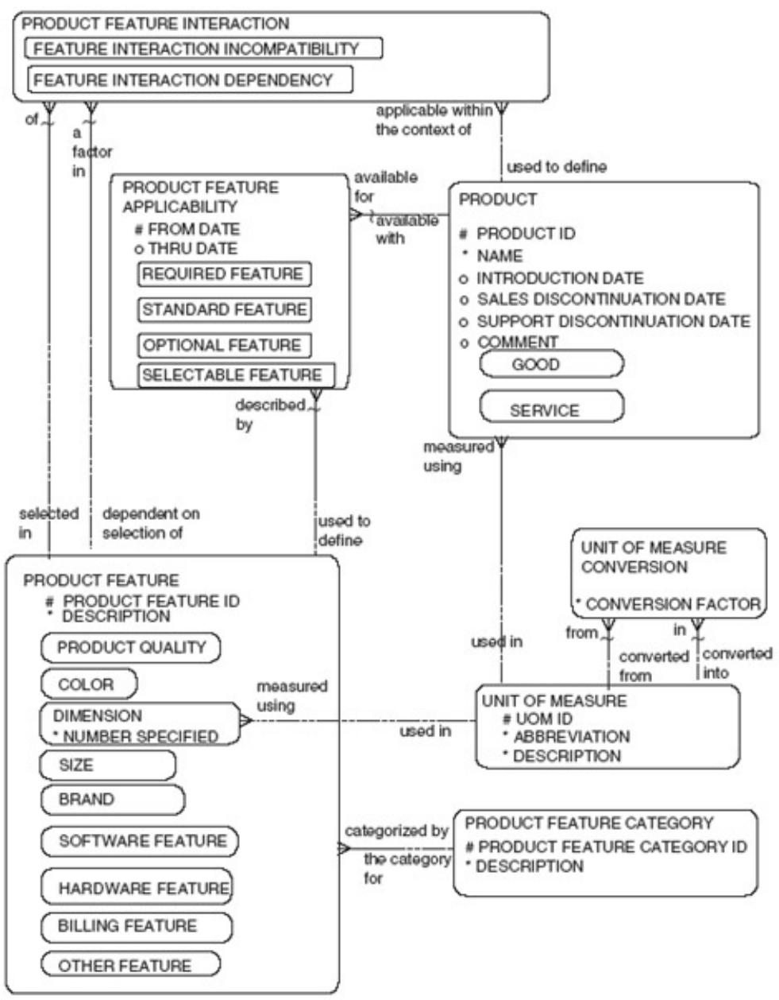
Figure 3.4 Product feature.

The UNIT OF MEASURE entity helps define the product in terms of the type of measurement for the product. It also helps further define the DIMENSION subtype of PRODUCT FEATURE. The UNIT OF MEASURE CONVERSION allows different units of measures to be converted to a common unit in order to assess inventory levels of a type of good.

# Product Feature Interaction

The applicability of certain product features may depend on other features that have been selected. For example, if one is buying a laptop computer, the optional feature of selecting an internal DVD may be possible if and only if an internal rewritable CD-ROM has not been selected. The PRODUCT FEATURE INTERACTION entity provides the capability to store which features are incompatible with other features (they will be subtyped SELECTION INTERACTION INCOMPATIBILITY) and which features are dependent on other features being selected (they will be subtyped FEATURE INTERACTION DEPENDENCY).

# Product Feature Subtypes

The PRODUCT FEATURE entity may have many subtypes and will invariably be customized for the enterprise, depending on the types

of features that are applicable. Subtypes of PRODUCT FEATURE may include the following:

- PRODUCT QUALITY classifies the product by value such as "grade A" or "grade B." For service products, such as a consultant, this may represent "expert" or "junior."
- COLOR describes the color(s) of the good. A good may have more than one COLOR option, but a different color may also denote that it is a separate good.
- DIMENSION describes the various numeric descriptions of the good such as "8½-inch width," "11-inch length," or "10 pound."
The DIMENSION is related to UNIT OF MEASURE, which has a description attribute that defines how the feature is being measured. The unit of measure may determine how the product can be inventoried and sold, such as by the "box" or "each." For service products, the unit of measure values may be "hours" or "days."
- SIZE specifies how large or small a product is in more general terms than dimension such as "extra large," "large," "medium," or "small." This feature could be useful in the garment industry.
- BRAND NAME describes the marketing name tied to the good, such as "Buick" for a General Motors vehicle. Note that the brand name may be different from the manufacturer's name.
- SOFTWARE FEATURE allows additional software to be added to products or allows certain software settings to be specified for a

product. For instance, software dollar limits could be set for products that are based on usage, such as meters. Another example could be the setting of software preferences for a software package or hardware purchase.

- HARDWARE FEATURES allow for the specification of certain components that are included or that may be added to a product-for example, a cover for a printer.
- A BILLING FEATURE is an example of a product feature that specifies the standard types of terms that may be associated with a product, such as recording that an Internet access service may be available with either monthly or quarterly billing.

# Product Feature Examples

An example of a sample product with features is a "Johnson fine grade  $8 \frac{1}{2}$  by 11 gray bond paper" where Johnson is the brand name,  $8 \frac{1}{2}$  inches wide and 11 inches long are the dimensions, gray is the color, fine grade is the quality, and bond paper is the product type. In this example, these features would all be maintained as REQUIRED FEATURES.

This product may be further defined by specifying the particular colors in which the product is available. This is done by associating the available optional features that could be associated with this product. This product may come in two colors, and therefore there is

a need to relate two optional product features that could be selected: "blue" and "gray" bond paper. These optional features allow pricing to be related at the base product and the ability to specify optional features to a particular product that may or may not affect other information about the product such as pricing. In the example, a customer may order the product with different colors; however, the prices associated with the product need be stored only once, at the product level. Alternatively, pricing may be based on the product features also. (There will be more discussion on product pricing later in this chapter.)

Products may be defined at multiple levels of specificity. For example, an enterprise may want to define a product known as "Johnson fine grade  $8 \frac{1}{2}$  by 11 bond paper" as well as another product offering that is more specific, such as "Johnson fine grade  $8 \frac{1}{2}$  by 11 gray bond paper". This data model will allow a great deal of flexibility to define required features that help determine the product or as optional features that could be available for the product.

Table 3.3 shows examples of possible products and different types of features. Notice that the product name may describe many of the features of a product so that it may be ordered by name, while the feature allows products to be correctly defined and categorized and allows for customization of the product without necessarily having to

store a product for each product variation. The details behind the product are stored in PRODUCT FEATURE APPLICABILITY entity and are shown in this table to clarify the definition of the product.

Table 3.3 Product Features

<table><tr><td>PRODUCT ID</td><td>NAME</td><td>QUALITY</td><td>COLOR</td><td>DIMENSION AND UNIT OF MEASURE</td><td>BRAND NAME</td><td>UNIT OF MEASURE</td></tr><tr><td>PAP192</td><td>Johnson fine grade 8½ by 11 paper</td><td>Fine grade, Required feature Extra glossy finish, Optional feature</td><td>Blue Gray Cream White Selectable feature</td><td>8½&quot; width 11&quot; length Required feature</td><td>Johnson, Required feature</td><td>Ream</td></tr><tr><td>PEN202</td><td>Goldstein Elite pen</td><td>Fine point, Required feature</td><td>Black, Standard Feature Blue, Optional feature</td><td></td><td>Goldstein, Required feature</td><td>Each</td></tr><tr><td>DSK401</td><td>Jerry&#x27;s box of 3½&quot; diskettes</td><td></td><td>Red, Required feature</td><td>3½&quot;, Required feature</td><td>Jerry&#x27;s, Required feature</td><td>Box</td></tr><tr><td>CNS109</td><td>Office supply inventory management consulting service</td><td>Expert, Required feature</td><td></td><td></td><td>ABC Corporation, Required feature</td><td></td></tr></table>

There are other possible types of features of products, many of which are dependent on the enterprise's type of business. Shoe manufacturers may be interested in styles, clothing organizations characterize products by lines, commodities organizations have varieties, and so on. This model is useful as the baseline model, but the subtypes of the PRODUCT FEATURE may need to be customized for the enterprise.

# Unit of Measure

Is a unit of measure another example of a product feature? If the same product may be sold in different units of measure, then perhaps a unit of measure may be another variable or feature of the product. Most organizations will conclude that if the same type of product is sold in different units of measure, then it really is a different product. For instance, a ream of paper is quite different from a piece of paper and would be regarded as a separate product.

The UNIT OF MEASURE entity is therefore not a subtype of PRODUCT FEATURE in this model. This entity allows products to be further defined in terms of the product measurement. It is important for enterprises to be able to determine inventory for products that are identical except for the unit of measure. The associative entity UNIT OF MEASURE CONVERSION provides the capability to use a common unit of measure to calculate how much inventory the enterprise has of a product. The attribute conversion factor in UNIT OF MEASURE CONVERSION is provided for this purpose. For example, there may be several products for Henry #2 pencils that have different units of measure such as "each," "small box," and "large box." In many cases, organizations need to show total inventories, costs, and sales for all of a product regardless of its unit of measure. By defining a common unit of measure, such as "each," and including a conversion factor (e.g., 12 for "small box" and 24 for

"large box"), it is possible to determine the total amount of Henry #2 pencils there are in inventory and how many have been sold.

Another example is process manufacturers that are often dealing with liters, gallons, tons, and other metric conversion factors. It is often necessary to provide a common unit of measure to determine inventory levels. If this type of unit of measure conversion is required, then the UNIT OF MEASURE CONVERSION entity could be used. This would show the many-to-many recursion between different units of measures. The conversion factor attribute is required in the UNIT OF MEASURE CONVERSION entity to provide for a conversion to common units of measure. For example, the conversion factor would be “4” in the relationship between quarts and gallons.

Suppliers and Manufacturers of Products

Figure 3.5 shows which suppliers and manufacturers are associated with each product. Because products may be sold by more than one organization and organizations sell more than one product, the entity SUPPLIER PRODUCT shows which products are offered by which organizations. The available from date and available thru date state when the product is offered by that supplier. This information is important because it provides the capability to find out where and when specific products may be purchased, what products

competitors sell, and which products the enterprise sells. Another important consideration for SUPPLIER PRODUCTS is lead time, which indicates the average amount of time it takes for a supplier to deliver the product to the customer location from the time of order. While the actual average lead time can be derived from information stored in orders and shipments (this will be covered in later chapters), the standard lead time is provided because some suppliers quote a standard amount for delivery of each product.

Figure 3.5 Suppliers and manufacturers of products.


Because there may be many suppliers from which the enterprise can order products, the PREFERENCE TYPE entity provides information to track the priority of whom to order from first, second, third, and so on. This priority is the information that would be stored in the description attribute and related back to the SUPPLIER PRODUCT entity. In addition to preferences that rank the preferred SUPPLIER

PRODUCTs in order, each SUPPLIER PRODUCT also has a RATING TYPE that is used to rate overall performance for each product.

The REORDER GUIDELINE entity provides information on how to best reorder products. The REORDER GUIDELINE for a product is defined for each GOOD because services do not generally get reordered based on this type of guideline. The attribute of reorder level states the quantity at which the good needs to be reordered or reproduced. The attribute reorder quantity states the recommended amount of the good to order. This may have been derived by analysis to determine the most efficient quantity. This reorder level and quantity may be for goods that the enterprise is buying or for goods that the enterprise is selling because some firms let the vendor monitor the stock levels of inventory and do the appropriate ordering. The reorder guidelines may vary based on whether the product need is for a particular GEOGRAPHIC BOUNDARY, such as for a certain state, FACILITY, such as for a specific plant, and/or for a particular INTERNAL ORGANIZATION, such as a division.

Table 3.4 provides examples of the suppliers that provide "Johnson fine grade  $8 \frac{1}{2}$  by 11 bond paper." Notice that the enterprise, ABC Corporation, sells this product; and if the enterprise does not have this product in stock, there are two other sources for obtaining this product. The pallets are a product that the enterprise needs to

purchase for its own use. The table illustrates representative data that would be stored in SUPPLIER PRODUCT.

Table 3.4 Supplier Products

<table><tr><td>PRODUCT</td><td>SUPPLIER</td><td>PREFERENCE
TYPE</td><td>RATING TYPE</td><td>STANDARD
LEAD TIME</td></tr><tr><td>Johnson fine grade 8½ by 11 bond paper</td><td>ABC Corporation</td><td>First</td><td>Outstanding</td><td>2 days</td></tr><tr><td>Johnson fine grade 8½ by 11 bond paper</td><td>Joe&#x27;s Stationery</td><td>Second</td><td>Outstanding</td><td>3 days</td></tr><tr><td>Johnson fine grade 8½ by 11 bond paper</td><td>Mike&#x27;s Office Supply</td><td>Third</td><td>Good</td><td>4 days</td></tr><tr><td>6&#x27; by 6&#x27; warehouse pallets</td><td>Gregg&#x27;s Pallet Shop</td><td>First</td><td>Outstanding</td><td>2 days</td></tr><tr><td>6&#x27; by 6&#x27; warehouse pallets</td><td>Pallets Incorporated</td><td>Second</td><td>Good</td><td>3 days</td></tr><tr><td>6&#x27; by 6&#x27; warehouse pallets</td><td>The Warehouse Company</td><td>Third</td><td>Fair</td><td>5 days</td></tr></table>

Products may be manufactured by only one organization. Of course, it is possible for an organization to subcontract with another organization to produce a product. The organization that hired the subcontractor is still the manufacturer. For example, a car manufacturer often hires another organization to produce its cars. Because the original car manufacturer is still responsible for the product, it is considered the manufacturer.

Inventory Item Storage

Figure 3.6 shows how inventory items are modeled. While a GOOD represents a cataloged item or a standard product that can be purchased, an INVENTORY ITEM represents the physical occurrence

of a good at a location. The GOOD may be "Johnson fine grade,  $8 \frac{1}{2}$ by 11 bond paper," while the INVENTORY ITEM is the 100 reams of this good sitting in the central warehouse.


Figure 3.6 Inventory item storage.

The INVENTORY ITEM may be either a SERIALIZED INVENTORY ITEM, which means each item's serial num(ber) is tracked, or a NON-SERIALIZED INVENTORY ITEM, which means a group of items is tracked together and the quantity on hand for these is

maintained by their location. The quantity on hand attribute is updated based on incoming and outgoing shipments of this good (shipments will be covered in Chapter 5). The model does not include attributes for ordered quantity expected in or committed quantity going out as this information can be derived from order information (orders will be covered in Chapter 4).

A concept found in some production-oriented industries is that of the LOT. A lot is simply a grouping of items of the same type generally used to track inventory items back to their source; it is often the result of a production run. Another source of lot information may be from the shipment from suppliers, which could determine the lot. This information is very important in the event a recall of items is required.

Inventory items can be separately identified by lots because an INVENTORY ITEM may be made up of one and only one LOT. This implies that there may be more than one inventory item of the same item type at a specific location, if there is more than one lot involved. Lot identification numbers, lot ids, are tracked so that if there is a customer complaint at a later time, it will be possible to identify where the items came from.

The inventory item may be tracked at a facility level, such as a warehouse, or it may be tracked at a more detailed level within a

facility such as a container or a bin. The FACILITY entity is related to the INVENTORY ITEM and maintains the physical structure, building, warehouse, plant, or office where inventory items are located. A more detailed location is referred to as a CONTAINER, which resides within a facility. The CONTAINER TYPE entity specifies the type of container such as a "shelf," "file drawer," "bin," "barrel," "room," or any other detailed location.

The INVENTORY ITEM STATUS TYPE maintains the current condition of the items, for example, "good," "being repaired," "slightly damaged," "defective," or "scrap." If a history of the status of inventory items is needed for serialized items, then the enterprise may need an additional intersection entity of INVENTORY ITEM STATUS with a status date. This entity would be between the INVENTORY ITEM and INVENTORY ITEM STATUS TYPE.

Table 3.5 provides examples of INVENTORY ITEM. ABC Corporation stores most of its office supplies in bins within each facility. The first four rows show how much inventory of various serialized goods is located in various bins within different facilities. Notice that there are two records for "Johnson fine grade  $8 \frac{1}{2}$  by 11 bond paper": the inventory of 156 reams (the product record defines the unit of measure in reams) stored at 100 Main Street with ABC Corporation and the inventory of 300 reams stored at 255 Fetch Street with ABC Subsidiary. The last row shows a serialized item of a copier, a large

item that may be stored at a facility level, instead of a container within a facility. Therefore, the container type is left blank.

Table 3.5 Inventory Item

<table><tr><td>GOOD</td><td>FACILITY</td><td>CONTAINER TYPE</td><td>INVENTORY ITEM ID</td><td>INVENTORY ITEM TYPE</td><td>QUANTITY ON HAND</td><td>SERIAL NUMBER</td></tr><tr><td>Johnson fine grade 81/2 by 11 bond paper</td><td>Warehouse at ABC Corporation 100 Main Street</td><td>Bin 200</td><td>1</td><td>Non-serialized</td><td>156</td><td></td></tr><tr><td>Johnson fine grade 81/2 by 11 bond paper</td><td>Warehouse at ABC Subsidiary 255 Fetch Street</td><td>Bin 400</td><td>2</td><td>Non-serialized</td><td>300</td><td></td></tr><tr><td>Goldstein Elite Pen</td><td>Warehouse at ABC Corporation 100 Main Street</td><td>Bin 125</td><td>1</td><td>Non-serialized</td><td>200</td><td></td></tr><tr><td>Jerry&#x27;s box of 31/2 inch diskettes</td><td>Warehouse at ABC Corporation 100 Main Street</td><td>Bin 250</td><td>1</td><td>Non-serialized</td><td>500</td><td></td></tr><tr><td>Action 250 Quality Copier</td><td>Warehouse at ABC Corporation 100 Main Street</td><td></td><td>1</td><td>Serialized</td><td>1</td><td>1094853</td></tr></table>

The ITEM VARIANCE entity keeps a history of inventory item shrinkage or overages that were noticed during physical inventories or inspections of the item. The physical inventory date specifies the date that the item variance was discovered. The quantity is the difference between quantity of items within INVENTORY ITEM (which is 1 for serialized items and the quantity on hand for non-serialized items) and the physical inventory at the time of the

physical inventory date. The information within the INVENTORY ITEM VARIANCE could be used to adjust the INVENTORY ITEM quantities. When this adjustment occurs, the on-hand amount of the INVENTORY ITEM should be reduced if the quantity in ITEM VARIANCE is negative, and it should be increased if the quantity is positive.

The REASON entity provides standard explanations of the variance to the inventory item's on-hand amount. Possible values may be "theft," "shrinkage," "unknown variance," and "ruined goods." The comment attribute in the INVENTORY ITEM VARIANCE allows additional non-standard explanations. For example, if the enterprise discovered that there was a loss of inventory items due to theft, it can record the date the theft was discovered, the amount of the product that was stolen, and the specific details behind the theft. This serves as an audit trail to account for any changes to the product's on-hand quantity resulting from transactions other than incoming and outgoing shipments.

# Product Pricing

Every organization seems to have different mechanisms for pricing its products. There are some common principles behind pricing that are captured in the data model in Figure 3.7.

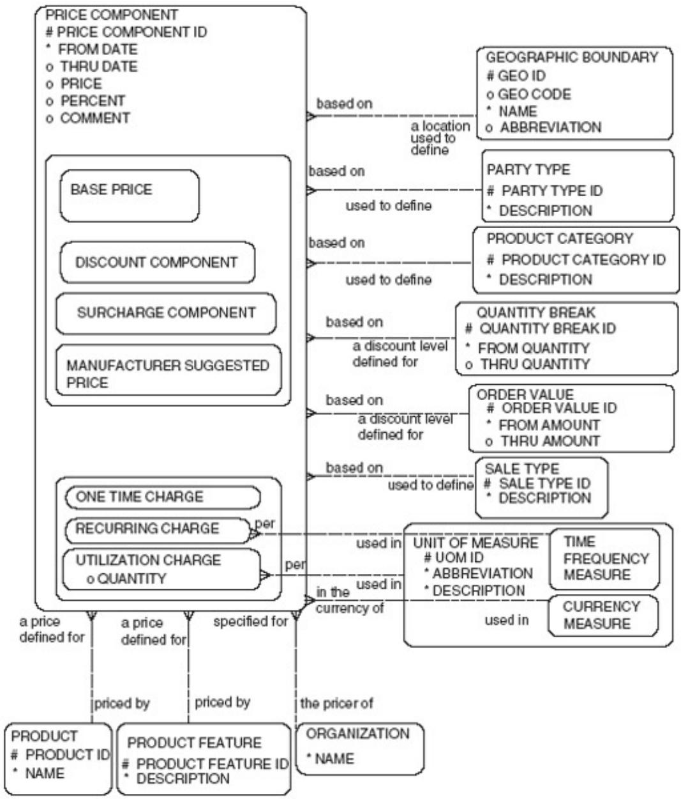
Figure 3.7 Standard product pricing.

In most organizations, there are several aspects to pricing a product: the base price for which the organization sells the product, various discounts applied against the base price such as quantity breaks, surcharges such as freight and handling charges, and the

manufacturer's suggested price. The PRICE COMPONENT stores these aspects of prices for each supplier's products.

Notice the entity is named PRICE COMPONENT to allow the entity to be reused in other circumstances such as in agreement pricing, which will be covered in Chapter 4.

# Pricing Subtypes

This entity is broken down into two non-mutually exclusive sets of subtypes (see explanation in Chapter 1, Non-Mutually Exclusive Sets of Subtypes, describing this notation). One subtyping that occurs is the subtypes of BASE PRICE, which has the starting price for the product, DISCOUNT COMPONENT, which stores valid reductions to the base price, SURCHARGE COMPONENT, which adds on possible charges, and MANUFACTURERS SUGGESTED PRICE. Another subtyping that categorizes types of prices is that the PRICE COMPONENT may be a ONE TIME CHARGE (such as for buying a good), a RECURRING CHARGE (an ongoing charge such as a monthly fee for a standard type of service), or a UTILIZATION CHARGE, which is a price component based on billing for usage of a product. The RECURRING CHARGE is based on per TIME FREQUENCY MEASURE (per hour, per day, per month), which is a type of UNIT OF MEASURE. The UTILIZATION CHARGE is based on

a UNIT OF MEASURE, such as per a certain quantity of "internet hits" to describe the charge for Web hosting services.

Price Component Attributes and Relationship to Product or Product Feature

The PRICE COMPONENT stores a from date and thru date to indicate the starting and ending dates for which the price component is valid.

The price attribute maintains a dollar amount and a percent attribute that can be used to record discounts or quantity breaks. Each PRICE COMPONENT stores a value in either the price attribute or the percent attribute but not both. The comment allows each price component to be annotated, for example, "special discount provided to increase sales."

The PRICE COMPONENT entity is related to either the PRODUCT or PRODUCT FEATURE entity or both of them because product features may be priced independently or in conjunction with the price. For example, a product feature of the color blue may be priced with the product Goldstein elite pen. The PRICE COMPONENT may be specified for different ORGANIZATIONS because it is possible for multiple organizations to supply the same product. For instance, it may be important to maintain the various prices for all alternate

suppliers of the enterprises product Johnson fine grade  $8 \frac{1}{2}$ by 11 bond paper, including, of course, the price that the enterprise charges.

# Pricing Factors

Each PRICE COMPONENT may be based on many variables or combinations of these variables. Pricing variables include GEOGRAPHIC BOUNDARY, PARTY TYPE, PRODUCT CATEGORY, QUANTITY BREAK, ORDER VALUE, and SALE TYPE. These represent common variables for pricing; however, the enterprise needs to determine if these variables are applicable or if there are other pricing variables for the enterprise. The GEOGRAPHIC BOUNDARY relationship allows pricing to be dependent on geographical regions such as countries, states, cities, or any other geographic boundaries. The PARTY TYPE relationship allows pricing to be dependent on the classifications of the party buying the goods such as special pricing for minority parties or governmental organizations. The PRODUCT CATEGORY relationship allows pricing to be associated with any classifications of products such as by product family, product model, product type, product function, and so on. The QUANTITY BREAK relationship allows special pricing for different quantity levels of purchasing. The ORDER VALUE allows different pricing levels based on total amounts of orders. The SALE TYPE allows different prices based on different methods of selling; for instance, Internet-based

sales may have a different price than retail-based sales or catalog-based sales. It is important to provide a very flexible data model because pricing is very likely to change over time within organizations. The optional relationship to these various pricing variables provides for a very flexible design since any combination of these factors may be used to determine a price component.

Each subtype of the PRICE COMPONENT may have values that are based on these pricing factors. For example, the BASE PRICE may be dependent on the type of enterprise that purchases the product, which is why there is an optional relationship to the PARTY TYPE entity. Another example is that there may be a lower price for minority-owned businesses. The base price may be dependent on the geographic area of the delivery, so there is also an optional relationship to the GEOGRAPHIC BOUNDARY entity. For instance, there may be a higher base product price if the good(s) are delivered to an area outside the enterprise's normal geographic boundaries. The base product price may also be based on quantities of products ordered. The QUANTITY BREAK entity stores various ranges of quantity breaks in the from quantity and thru quantity attributes. The enterprise needs to enforce business rules to determine which base price component takes priority over another component. For instance, there may be a base product price for a minority-owned business and a different base product price for customers in the eastern region. If a buyer fits both criteria, then

the enterprise needs to build business rules to determine which price takes precedence.

The DISCOUNT COMPONENT may be dependent on the PARTY TYPE, GEOGRAPHIC BOUNDARY, QUANTITY BREAK, or certain PRODUCT CATE-GORYs. For instance, there may be a 2 percent standard discount for all organizations with a PARTY TYPE of "minority-owned business." The enterprise may specify a discount for any delivery to a customer within the same city or GEOGRAPHIC BOUNDARY as the enterprise because the delivery charges would be less. Another discount may be based on the number of products purchased and therefore be dependent on the QUANTITY BREAK. Perhaps if the customer purchases more than 100 reams of a certain type of paper, there could be either an amount or percentage discount per good. There may also be a discount based on a PRODUCT CATEGORY such as 5 percent off for all paper products during the month of September as part of an advertising campaign. Notice that this discount does not even specify a PRODUCT or PRODUCT FEATURE, which is why both of these have optional relationships to PRICE COMPONENT. Finally, there may be combinations of pricing discounts such as a special on furniture within a certain geographic area. Another example of a pricing combination occurs when a quantity break applies exclusively to a specific party type, such as a minority-owned business.

A SURCHARGE COMPONENT is a PRICE COMPONENT that adds to the base price of the product. Examples of surcharges include freight costs and additional mileage costs. Product price surcharges are generally based on the GEOGRAPHIC BOUNDARY, such as additional freight charges being assessed based on the distance of the customer from the enterprise's nearest warehouse.

ONE TIME CHARGES, RECURRING CHARGES, and UTILIZATION CHARGES may also be specified for different combinations of the various pricing factors.

International Pricing

Sometimes pricing is specified in different currencies for products that are sold internationally. The relationship to CURRENCY MEASURE allows a PRICE COMPONENT for each CURRENCY MEASURE such as "US dollars," "yen," "marks," and so on. These would be stored in the CURRENCY MEASURE description and used to define each PRODUCT COMPONENT price.

Units of measures are related to other units of measure as shown in the Product Feature model, Figure 3.4, in the UNIT OF MEASURE CONVERSION entity. In this case, the enterprise could store the monetary conversions from currency to currency if the enterprise had the will and means to capture this information.

# Example of Product Pricing

Table 3.5 illustrates an example of price components for the product "Johnson fine grade  $8 \frac{1}{2}$  by 11 bond paper." In this example, ABC Corporation has established standard base prices for certain geographical regions and for certain volumes of quantity ordered. The first four rows show the standard prices for the eastern and western regions and depend on the quantity being ordered. In addition, ABC Corporation has established a 2 percent discount if the purchasing party is a government agency. There is a 5 percent discount on all paper products (i.e., products with a product category of "paper") that is applicable in September 2001. The dates for this promotion would actually be entered in the PRICE COMPONENT attributes of from date and thru date. A surcharge of $2.00 is added to the product price for all deliveries to Hawaii.

# Table 3.5 Standard Product Pricing

<table><tr><td>PRODUCTDESCRIPTION</td><td>PRODUCTFEATURE</td><td>ORGANIZATION</td><td>PRICE COMPONENTTYPE</td><td>PRICECOMPID</td><td>PARTYTYPE</td><td>GEOGRAPHICBOUNDARY</td><td>QUANTITYBREAK</td><td>PRICE</td><td>PERCENTAGE</td></tr><tr><td>Johnson fine grade81/2by 11 bond paper</td><td></td><td>ABC Corporation</td><td>Base</td><td>1</td><td></td><td>Eastern region</td><td>0-100</td><td>$9.75</td><td></td></tr><tr><td>Johnson fine grade81/2by 11 bond paper</td><td></td><td>ABC Corporation</td><td>Base</td><td>2</td><td></td><td>Eastern region</td><td>101-</td><td>$9.00</td><td></td></tr><tr><td>Johnson fine grade81/2by 11 bond paper</td><td></td><td>ABC Corporation</td><td>Base</td><td>3</td><td></td><td>Western region</td><td>0-100</td><td>$8.75</td><td></td></tr><tr><td>Johnson fine grade81/2by 11 bond paper</td><td></td><td>ABC Corporation</td><td>Base</td><td>4</td><td></td><td>Western region</td><td>101-</td><td>$8.50</td><td></td></tr><tr><td>Johnson fine grade81/2by 11 bond paper</td><td></td><td>ABC Corporation</td><td>Discount</td><td>5</td><td>Govt</td><td></td><td></td><td></td><td>2</td></tr><tr><td>Johnson fine grade81/2by 11 bond paper</td><td></td><td>ABC Corporation</td><td>Discount</td><td>6</td><td>Paper products(special offerin Sept.2001)</td><td></td><td></td><td></td><td>5</td></tr><tr><td>Johnson fine grade81/2by 11 bond paper</td><td></td><td>ABC Corporation</td><td>Surcharge</td><td>7</td><td></td><td>Hawaii</td><td></td><td>$2.00</td><td></td></tr><tr><td>Johnson fine grade81/2by 11 bond paper</td><td></td><td>Joe&#x27;s Stationery</td><td>Base</td><td>8</td><td></td><td></td><td></td><td>$11.00</td><td></td></tr><tr><td>Johnson fine grade81/2by 11 bond paper</td><td>Creamcolor</td><td>ABC Corporation</td><td>Base</td><td>9</td><td></td><td></td><td></td><td>$1.00</td><td></td></tr><tr><td></td><td>Extra glossyfinish</td><td>ABC Corporation</td><td>Base</td><td>10</td><td></td><td></td><td></td><td>$2.00</td><td></td></tr></table>

In this model, products may have different price components for each organization, so the same model can be used to store competitors' prices to determine how competitive the enterprise's price is. Notice that the third to last row of Table 3.5 shows the standard price of the product for its competitor, Joe's Stationery. This model can maintain product prices for each product purchased from the enterprise's suppliers.

This model can also store the product prices for product features. Features may have prices that are within context of a product, or they may just have a price independent of the product. The second to last row records that the "cream color" feature for Johnson fine grade  $8 \frac {1}{2}$  by 11 bond paper is priced at an additional $1.00. This means that the "cream color" feature could have a different price if applied to another product. The last row shows that the feature

"extra glossy finish" has a base price of $2.00 and is independent of the product to which it is applied.

There are many different variations on the way each enterprise prices its products. When it comes to negotiating deals, it is amazing how creative people and organizations can get! Therefore, this pricing model is very flexible and can handle many different pricing scenarios. It is important that the enterprise determine its business rules in order to avoid confusion. For example, does the enterprise have a business rule that certain discounts override other discounts? Does the enterprise allow the sales representative to choose which discount applies if several discounts are applicable? Does the organization include quantity breaks as part of its base price, or does it consider quantity breaks a discount to the base price? These types of questions need to be answered in order to use this model effectively and store the right type of information within the attributes.

# Product Costing

It is important for organizations to have good information on product costs in order to ensure that the products are priced profitably. Having appropriate product cost information may also help to determine appropriate commissions, if they are based on profitability.

Some data modelers might have the insight to realize that the actual product costs are in many aspects of a data model and derivable from data in various entities. For instance, purchase orders hold information about the cost of the raw materials. The shipment to the customer will have freight charges, which are a cost component of the product. Time sheets and payroll records hold information about the labor costs involved in the manufacturing or delivery of products. For manufactured goods, the cost of scheduling equipment in production runs is stored in equipment assignment records. Overhead such as rent, office supplies, and other administrative goods can be factored into the product cost as well.

Instead of using actual product costs to figure out the cost of various products, this model uses estimated costs that product analysts will typically enter for each product. The advantage to using estimated costs is that product analysts can predict future trends of how much they think the product will cost instead of simply using historical information. For example, the freight charges might have historically been $1.00 from destination A to destination B. Data on current freight charges may be more appropriate for figuring out the real cost of a product. The enterprise can use the actual product costs combined with its understanding of the marketplace and future trends to enter what it believes will be the best estimate of the costs of selling its products.

Of course, the only product costs that are worthwhile tracking are usually those for the enterprise's own products. Supplier and competitor cost information is usually not available. An exception is that some government organizations need to track the costs of their suppliers' products to ensure that profit margins are not excessive.

# Figure 3.8 is a data model for storing estimated product costs. Many cost components figure into the overall costs of a product.

Therefore, either a PRODUCT or a PRODUCT FEATURE may be costed by many ESTIMATED COST COMPONENTs. The ESTIMATED PRODUCT COST entity maintains information on each product and its many costs. The COST COMPONENT TYPE entity specifies what type of cost it is. COST COMPONENT TYPES include ESTIMATED MATERIALS COSTs, ESTIMATED LABOR COSTs, and ESTIMATED OTHER COSTs such as manufacturing costs (i.e., the use of machinery and equipment), shrinkage costs (i.e., theft or perishable good losses), shipping costs, costs in selling the product (i.e., commissions or brokerage charges), and administrative costs of running an office. Additionally, product costs may vary by season or over time, so the attributes from date and thru dates are included to show the time period that the cost is valid.

Figure 3.8 Estimated product cost.

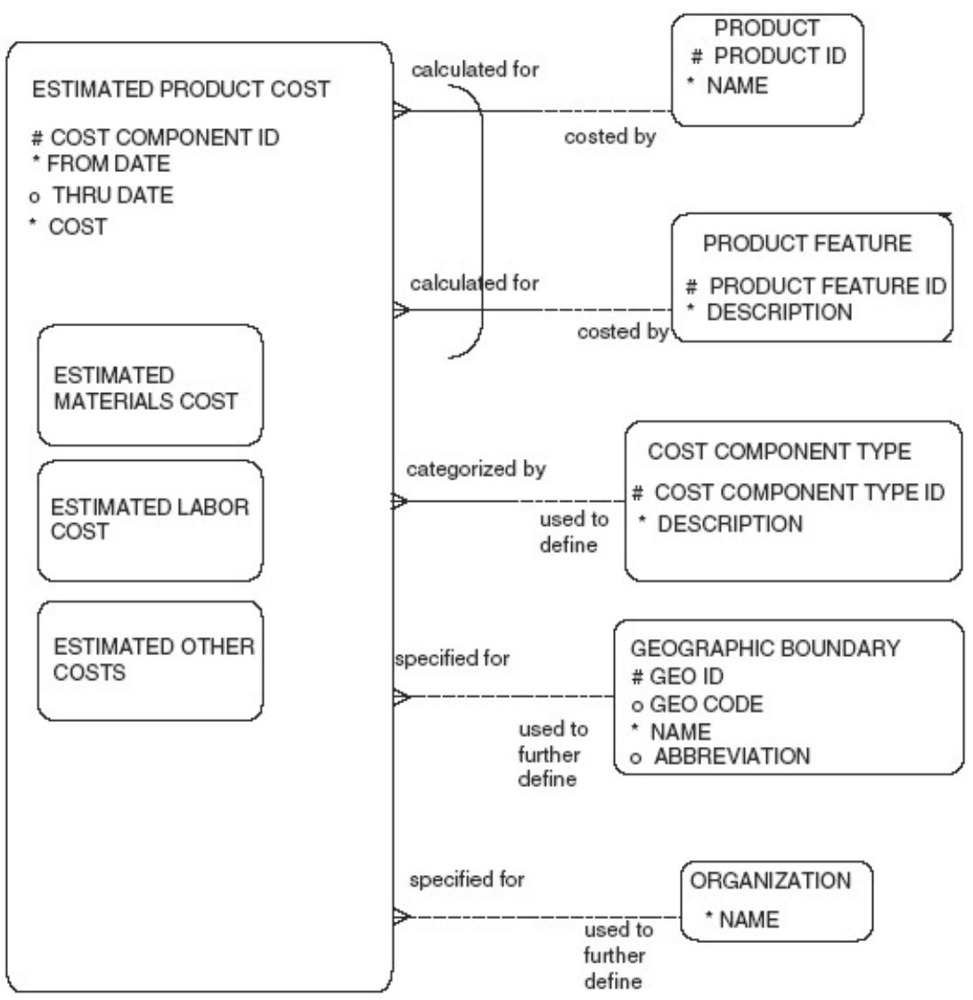

The cost component may vary based on where the costs are incurred and hence the optional relationship to GEOGRAPHIC BOUNDARY. For instance, manufacturing costs may be less expensive in a plant located in one country versus another country. Delivery costs may be less expensive if the shipment is located in a nearby location versus an overseas shipment. Shrinkage costs due to theft may be higher in certain cities.

The estimated costs may, in some cases, vary by ORGANIZATION. If the organization is tracking and comparing the costs for multiple suppliers, then the enterprise may want to be able to record separate costs for each organization and hence this optional relationship to ORGANIZATION.

Product cost component may vary depending on the type of business. For instance, a distributor may track the cost of buying the goods, shipping and handling charges, selling costs, and administrative overhead. A manufacturer may track the cost of the materials used, labor used to produce the goods, the cost of running manufacturing equipment, selling costs, and administrative overhead. The costs for a service organization generally include the cost of labor, selling costs, and administrative costs.

Table 3.6 shows examples of product cost information that would be stored in ESTIMATED PRODUCT COST. The table shows that while the anticipated purchase cost of the product "Johnson fine grade  $8 \frac{1}{2}$  by 11 bond paper" is the same for New York as it is in Idaho, the administrative overhead and freight costs are less if this product is sold in Idaho.

Table 3.6 Estimated Product Costs

<table><tr><td>PRODUCT</td><td>COST TYPE</td><td>GEOGRAPHIC BOUNDARY</td><td>COST</td><td>FROM DATE</td><td>THRU DATE</td></tr><tr><td>Johnson fine grade 81/2 by 11 bond paper</td><td>Anticipated purchase cost</td><td>N.Y.</td><td>$2.00</td><td>Jan 9, 2001</td><td></td></tr><tr><td>Johnson fine grade 81/2 by 11 bond paper</td><td>Administrative overhead</td><td>N.Y.</td><td>$1.90</td><td>Jan 9, 2001</td><td></td></tr><tr><td>Johnson fine grade 81/2 by 11 bond paper</td><td>Freight</td><td>N.Y.</td><td>$1.50</td><td>Jan 9, 2001</td><td></td></tr><tr><td>Johnson fine grade 81/2 by 11 bond paper</td><td>Anticipated purchase cost</td><td>Idaho</td><td>$2.00</td><td>Jan 9, 2001</td><td></td></tr><tr><td>Johnson fine grade 81/2 by 11 bond paper</td><td>Administrative overhead</td><td>Idaho</td><td>$1.10</td><td>Jan 9, 2001</td><td></td></tr><tr><td>Johnson fine grade 81/2 by 11 bond paper</td><td>Freight</td><td>Idaho</td><td>$1.10</td><td>Jan 9, 2001</td><td></td></tr></table>

# Product to Product Associations

Products have many different types of relationships to other products. This section will provide models to handle product componentization, product substitution, product obsolescence, product complement, and product incompatibility. Figure 3.9a illustrates a data model that provides for these common information requirements of products, and Figure 3.9b represents an alternative model for maintaining this type of information.

Figure 3.9a Product to product associations.


Figure 3.9b Product to product associations—alternate model.


Let's first address the need to store what products are made up of other products or product components. Most people view the combining of components into a saleable product as a function limited to manufacturing organizations. Other types of organizations package together components to make a product offering. Some distribution companies assemble kits that include individual goods

that could also be sold. For instance, a beauty supply distributor may combine combs, scissors, and makeup into a beauty kit that the customer can purchase. Service organizations often bundle together services that are sold as a single product. For instance, there may be a single price for a software application package that consists of the documentation, the software stored on a CD-ROM, introductory training, and a certain number of hours of initial consulting.

The PRODUCT COMPONENT entity shows which products are made up of other products. A product can be made up of more than one other product; alternatively, a product may be used in several other products. For example, an office desk set may consist of a pen, pencil, calendar, clock, and wood base. Any one of these components may be used in the assembly of another product. Service organizations may also assemble one or more of their services into a product and, alternatively, use the same service in many product offerings.

The PRODUCT COMPONENT has attributes of from date and thru date to signify the time periods that certain product components are made of other product components. This implies that the components of a product may change. At one point in time, an office desk set may include a certain type of pen; at a later time it may include a different type of pen.

Another attribute of PRODUCT COMPONENT is the quantity used. This attribute indicates how many of a certain product are used in the assembly of another product. For example, in some office desk sets two pens may be included in the set. The instruction attribute explains how to assemble the products. If a comprehensive set of instructions is needed, then a new entity named INSTRUCTION should be added and related to the PRODUCT COMPONENT. The comment attribute is used to describe any other note about the assembly of products. Table 3.7 shows an example of a product that is made up of other products.

Table 3.7 Product Components

<table><tr><td>PARENT PRODUCT TYPE</td><td>CHILD PRODUCT TYPE</td><td>QUANTITY</td></tr><tr><td>Office supply kit</td><td>Johnson fine grade 8½ by 11 bond paper</td><td>5</td></tr><tr><td>Office supply kit</td><td>Pennie&#x27;s 8½ by 11 binders</td><td>5</td></tr><tr><td>Office supply kit</td><td>Shwinger black ball point pen</td><td>6</td></tr></table>

Some enterprises need to know the makeup of their products. For instance, some laboratories need to know how their research apparatus is put together. Organizations that repair the equipment they sell need to know how the product is assembled even though they might not have manufactured it themselves.

The PRODUCT SUBSTITUTE entity shows which products may be substituted by other products. A PRODUCT may be substituted by many other PRODUCTS. For example, perhaps a certain pen within an office desk set may be substituted by a few other pens of similar quality. Alternatively, a PRODUCT can also be used as a substitute for many PRODUCTS. Perhaps a specific pen is used as a substitute in many circumstances. The from date and thru date attributes specify the time frames that products may be substituted for each other. The quantity attribute allows a product to be substituted for a certain quantity of another product. For example, Table 3.8 provides an example of a small box of pencils being substituted for 12 individual pencils of the same type. The comment attribute provides additional information regarding the substitution of a product; for example, "try not to substitute with this product if it can be avoided as the product is of a lower quality than the standard product."

# Table 3.8 Substitute Products

PRODUCT

SUBSTITUTE PRODUCT QUANTITY

Small box of Henry #2 pencilsIndividual Henry #2 pencil12

Goldstein Elite pen

George's Elite pen

The PRODUCT OBSOLESCENCE entity shows which products are about to be or have already been superseded by other products.

There is a many-to-many recursive relationship from the PRODUCT entity to show that a product can be superseded by numerous new products and that a new product may supersede many old products. For example, the next release of a software package may combine several separate pieces of software into a single piece of software or vice versa.

The PRODUCT COMPLEMENT entity provides the capability of showing products that are well suited to function with other products. For example, the product "Jerry's desk blotter refill paper" may be a complementary product to "Jerry's desk blotter" because it could be suggested as a desirable accessory product when buying the desk blotter.

The PRODUCT INCOMPATIBILITY entity provides the capability to maintain which product may not be used with other products. For instance, a "Barry's pen refill" may not be compatible with the product "Goldstein Elite Pen"; it would be good to let customers know this by maintaining this PRODUCT INCOMPATIBLE information and using it at the time of an order. If a great many of the combinations of product lead to product incompatibilities, the model could alternatively have a PRODUCT COMPATIBILITY recursive entity to show which products are compatible with other products.

Figure 3.9b shows an alternate model for maintaining these products associations. Because there are many common attributes and because the relationship structures of these product associations are identical, the former product associations are now supertyped into a PRODUCT ASSOCIATION entity. The PRODUCT ASSOCIATION TYPE entity provides an entity that could store additional types of product associations should the need arise, hence yielding a more flexible data structure.

# Products and Parts

How should the data model handle the modeling of parts, raw materials, supplies, and product components? Are office supplies, spare part supplies, or pieces that are part of a product also considered products? In one sense, they must have been attained from somewhere and are a product of some organization. On the other hand, the parts that may be used to repair products or bought for office supplies are substantially different from the mainstream products that are the key offerings for the enterprise.

One method of handling this is to simply subtype the GOOD entity into FINISHED GOOD, RAW MATERIAL, and SUBASSEMBLY, as shown in Figure 3.10a. A FINISHED GOOD is a product that is ready to be shipped, and some work may have been performed to get the product to its current state. A RAW MATERIAL is a component used

in making a product in which no work on it has been performed by the enterprise and it is the lowest level component that makes up a product. A RAW MATERIAL may be sold as a good or used in another good. A SUBASSEMBLY good is a product that is in a state of partial completion and is not generally sold to a customer or purchased from a supplier. If the enterprise purchased the subassembly from a supplier, it would be considered a RAW MATERIAL because the enterprise did not perform any additional work on the product.


Figure 3.10a Products and parts.

Another method for data modeling this structure is to consider a PART something separate from a PRODUCT. This really depends on one's perspective as well as the enterprise's needs. If the enterprise buys screws for use in assembling its product, it is buying someone else's product. If one wanted to be more specific and create a

separate entity for the individual pieces or parts that make up a product offering, then the model in Figure 3.10b may be better suited. Additionally, if the nature of the enterprise regards parts as a very significant piece of information, for instance, in an assembly line manufacturing enterprise, then it may be appropriate to model the PART entity separately.

Figure 3.10b Product and parts—alternate model.

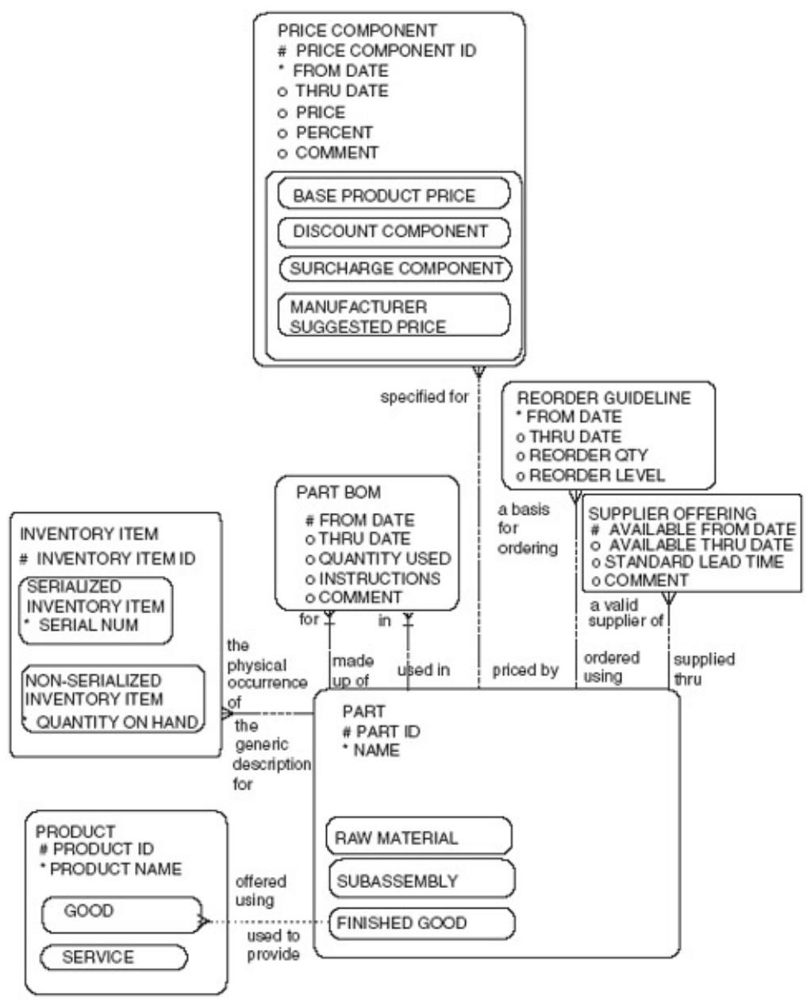
In Figure 3.10b, the PART entity represents a physical item that exists, as opposed to a PRODUCT that is what is marketed. A PART, and specifically a FINISHED GOOD, may be used to produce one or more PRODUCTS. How can this be? Sometimes, the same physical item can be sold as two different products depending on circumstance of the sale such as to whom the product is sold. A

telecommunications company may sell the same finished good, for example, a telephone line, as two products: a residential line or a business line, depending on whether the customer is an individual or a business. Therefore, the PRODUCT represents the marketing offering, which could vary from the actual item, which is the PART.

The PART is subtyped into RAW MATERIAL, SUBASSEMBLY, and FINISHED GOOD, which have the same definitions as stated previously. Instead of using the PRODUCT COMPONENT entity to show how RAW MATERIALS and SUBASSEMBLYs are combined into FINISHED GOODS, the PART BOM (bill of materials) entity maintains which parts are made up of other parts. The PRODUCT COMPONENT entity would now maintain packages of products together. An alternative name for the PRODUCT COMPONENT could be MARKETING PACKAGE because in this model it represents packaging of products and not parts.

The model shows that if PARTs are modeled they need to be related to INVENTORY ITEMS, PRICE COMPONENT, REORDER GUIDELINE, and SUPPLIER PRODUCT. Parts need to be inventoried in addition to products, and this relationship could also be shown as a mutually exclusive arc to either PARTs or PRODUCTS. Parts may be priced using the PRICE COMPONENT relationship, and these may include parts the enterprise is selling or parts the enterprise is buying. Parts may need reordering information as well as information on which

party supplies the parts, hence the relationships to REORDER GUIDELINE and SUPPLIER OFFERING (formerly SUPPLIER PRODUCT). If the enterprise manages parts separately from products, then the entity SUPPLIER PRODUCT should be changed to SUPPLIER OFFERING because this entity now represents parties that offer either parts or products.

# Summary

This chapter has focused on the data model for products, which include both goods and services. Goods are tangible, physical goods whereas services are the selling of professionals' time to accomplish some function. The data models in this chapter incorporate the information needs for the enterprise's own products, suppliers' products, and competitors' products. Product information covered in this chapter includes the definition of products, supplier products and manufacturers, product storage, product pricing, product costing, and product to product association information. Figure 3.11 provides an overview of the product models covered in this chapter.

Figure 3.11 Overall product model.

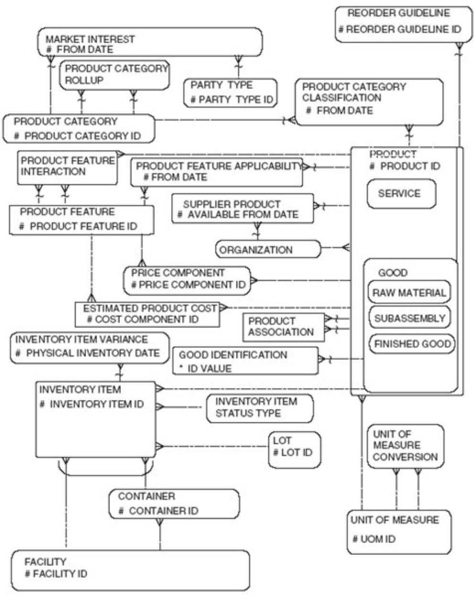

Please refer to Appendix A for a listing of entities and attributes. SQL scripts to build tables and columns derived from the logical models in this book can be found on the full-blown CD-ROM, which is licensed separately.

# CHAPTER

# 4

# Ordering Products

The previous chapters focused on information about the parties that conduct business and what products they need. This chapter focuses on how parties obtain these products—in other words, the ordering of products.

Businesses need information to answer many questions about orders; they need to know the terms associated with each order. For instance:

- When is the expected delivery time, and are there consequences for late delivery?
Who is responsible for paying for the order?
- What is the negotiated price for each product that is ordered?
- What people and organizations are involved in the order?
- Who placed the order? To whom is the order being shipped?
- Was there an approved requirement for the order?
- Were there previous quotes for the order?
- Were there requests to many vendors to bid for the order?

• Are there general agreements in place that govern the terms of the order such as special pricing arrangements?

This chapter discusses the following models:

- Standard order model
- Order and order items
- Order parties and contact mechanisms
- Order adjustments
- Order status and terms
- Order Item Associations
- Requirements
- Requests
- Quotes
- Agreements
- Agreement items
- Agreement terms
- Agreement pricing
- Agreement to orders

Standard Order Model

Most organizations model orders using the standard data model that is shown throughout many textbooks on data modeling. Figure 4.1 illustrates this standard data model. A SUPPLIER is related to one or

more PURCHASE ORDERS, which have PURCHASE ORDER LINE ITEMS that relate to PRODUCT. This model is similar for sales. A CUSTOMER can be related to one or more SALES ORDERS, which have SALES ORDER LINE ITEMS that relate to specific PRODUCTS. Table 4.1 shows the example of a typical sales order. A customer, ACME Company, placed a sales order on June 8, 2001, for several items (or items), each of which is defined in the PRODUCT entity. The sales order stores information such as the date the order was given, the customer placing the order, shipping instructions, and payment terms.

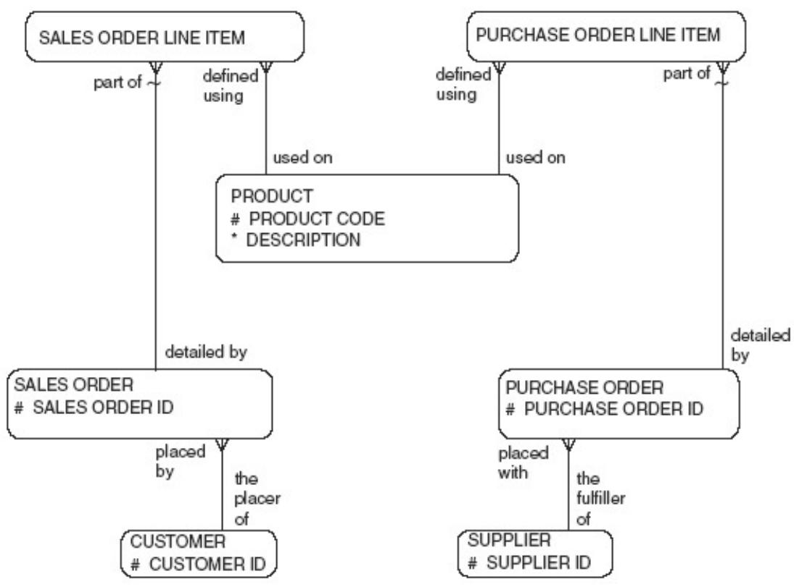
Figure 4.1 Standard order model.

Table 4.1 Standard Order Model

<table><tr><td>ORDER ID</td><td>CUSTOMER</td><td>ORDER
DATE</td><td>SHIPPING
INSTRUCTIONS</td><td>PAYMENT
TERMS</td></tr><tr><td>12560</td><td>ACME Company</td><td>June 8, 2001</td><td>Via truck</td><td>Net 30</td></tr><tr><td>23000</td><td>Jones Corporation</td><td>Sept 5, 2001</td><td>UPS</td><td>Net 30</td></tr></table>

Order line items show the individual products or services that were purchased. Table 4.2 shows examples of ORDER LINE ITEMS. In this example, three items are being ordered: 10 reams of paper, 4 pens, and 6 boxes of diskettes.

Table 4.2 Order Item

<table><tr><td>ORDER ID</td><td>ITEM ID</td><td>PRODUCT</td><td>QUANTITY</td><td>UNIT PRICE</td></tr><tr><td>12560</td><td>1</td><td>Johnson fine grade 8½ by 11 bond paper</td><td>10</td><td>$8.00</td></tr><tr><td>12560</td><td>2</td><td>Goldstein Elite pen</td><td>4</td><td>$12.00</td></tr><tr><td>12560</td><td>3</td><td>Jerry&#x27;s box of 3½-inch diskettes</td><td>6</td><td>$7.00</td></tr></table>

When a purchase order is given to a supplier, the same types of relationships exist. A supplier is given many purchase orders, each of which has line items that correspond to a specific product type.

The attributes of sales orders and purchase orders are very similar, if not the same. An order is an order; the only real difference between a sales order and a purchase order is a matter of perspective. In other words, the information on the seller's sales order should, for the most part, correspond to the information on the purchaser's purchase order. The only reason that the attributes may be different is that the two parties may require different information depending

on whether one is the seller or the buyer. For example, the enterprise taking the sales order may need to know the commissions for the salespeople involved in the order, whereas when a purchase order is given to a vendor, the purchaser is usually not privileged enough to know what the commission is for the salespeople.

As Figure 4.1 shows, the relationships and data structures between sales and purchase orders are very similar. By having two separate models for both of these types of orders, the model does not recognize the similar properties of sales and purchase orders and developers cannot take advantage of common applications to handle both sales and purchases. For instance, if the structures are the same, developers can create common routines against the same data structures. There could be common routines to look up the terms of an order, to monitor the status of the order against the expected delivery date, or to calculate line-item price extensions.

There is another embedded assumption in this standard order data model: Only one organization is involved in the sales order model, namely the customer, and only one organization is involved in the order in the purchase order model, namely the supplier. Most systems model information from an "I" perspective. This perspective states that the model doesn't have to indicate the party receiving sales orders or placing purchase orders; it's obviously us (meaning the enterprise building the system)! The problem with this

perspective is that there may be several internal organizations within the enterprise that may receive a sales order or place a purchase order and this information needs to be recorded for each order. Even if an organization is a small business, there may be a broker who takes a sales order or the organization may grow later on to include subsidiaries, divisions, or other related internal organizations.

There are actually many parties involved in the order who could be involved in many roles. There could be a placing customer, delivery customer, bill-to customer, installation customer, person taking the order, organization that books the order, and similar roles for purchase orders.

Additionally, there are many contact mechanisms involved in sales and purchase orders. Where should the order be billed? Where should the order be shipped? From what contact mechanism did the order originate; for example, did it come from a specific e-mail or phone number? What was the location or contact mechanism that received the order? A model that maintains these various contact mechanisms for the order is needed.

The following order model addresses these previous issues and provides a more flexible structure to maintain purchase and sales order information.

# Order and Order Items

The data model in Figure 4.2 is more flexible, modular, and maintainable than the data model in the previous section and is the one that will be built on throughout the remainder of this book. This model portrays a broader perspective than the "I" model of the previous section and has a more stable, object-oriented approach where orders are related to parties that may play several roles, depending on the circumstances. The following models also provide flexible order data structures for maintaining contact mechanism information, adjustments, statuses, terms and order item associations.

Figure 4.2 Orders and order items.


Figure 4.2 shows that the ORDER entity is subtyped into SALES ORDER and PURCHASE ORDER to cover both sales and purchase orders. Orders are composed of ORDER ITEMS that specify the product(s) that are to be ordered, hence the relationship to PRODUCT. The ORDER ITEM is also subtyped into PURCHASE ORDER ITEM and SALES ORDER ITEM to accommodate information about the ORDER ITEM that is just for a purchase order item or for a sales order item. Each ORDER ITEM may be for one and only one

PRODUCT or may be for one and only one PRODUCT FEATURE.
PRODUCT FEATURES may be ordered via an ORDER ITEM such as a certain COLOR, SIZE, SOFTWARE FEATURE, or other product variation that may be included in the order. These features can be specified via the recursive relationship ordered with from an ORDER ITEM that is for a product feature that is ordered for an ORDER ITEM that is for a product feature.

The attribute on ORDER named order date specifies the date on which the enterprise received or gave the order. The attribute entry date is the date on which the order was entered into the enterprise's system. The ORDER entity is subtyped into a SALES ORDER and a PURCHASE ORDER entity in order to accommodate specific attributes or relationships related to either a sales order or a purchase order.

ORDER ITEMS represent the ordering of specific goods or services. Therefore, each ORDER ITEM is defined using one and only one PRODUCT. ORDER ITEMS have a quantity attribute. For goods, this represents the number of goods that are ordered. For services, this represents the amount of hours, days, or other measurement being billed. The unit of measure for this quantity is determined by the unit of measure that is associated with the product (see Chapter 3, Figure 3.4). The unit price attribute stores the charge for an item or the rate for a service. The estimated delivery date is the date

that the good is expected to be shipped to the customer or the expected date of service fulfillment to the customer. The shipping instructions attribute stores directions for transporting products to their destination, for example, "do not leave outside," "fragile-handle with care," or "requires signature by customer when delivering." The comments attribute allows additional explanation of the order item. The item description attribute provides a mechanism for storing descriptions for items that are non-standard and would not be maintained within the PRODUCT or PRODUCT FEATURE entities.

This item description attribute could also account for orders that are not product specific such as order items to perform work efforts or to order time for professional services. It will be shown in Chapter 6, Figure 6.3, that order items may also be related to one or more WORK EFFORTs—for example, when a customer places an order for a job to be done.

In Chapter 3, the data model shows that the price for each product can be stored as PRICE COMPONENTs and based on many variables such as geographic location, quantity breaks, the type of party, and outstanding promotions on certain types of products. So why is the unit price not a derived field? The unit price is important as this attribute allows the user to override the calculated price with the negotiated price for this order. Base, discount, and surcharge

product price components can all appear as order items associated with a particular product.

Many models will portray orders having "order line items." The reason that this model does not call them "order line items" is that this term connotes physical lines on an order form. The physical lines on an order form often encompass many other things aside from the items that have been ordered. For instance, there may be notes to records adjustments, taxes, estimated freight costs, explanations, and other descriptive detail for the order. Rather than portray the entity as capturing each of the documented lines on an order form, the ORDER ITEM entity represents a major information need for the order, namely the items or products that have been ordered.

Table 4.3 illustrates the ORDER ITEM entity. The major difference in this entity from the standard order line item entity in Table 4.2 is that both sales and purchase order items are included in this entity. Notice that the purchase order has two items: one for a service ("hourly office cleaning service") and one for an item ("basic cleaning supplies kit"). This is one reason that orders are not subtyped as service and good orders because one order can include both services and goods.

Table 4.3 Sales and Purchase Orders

<table><tr><td>ORDERID</td><td>ORDERSUBTYPE</td><td>ORDERDATE</td><td>ORDERITEM SEQ_ID</td><td>PRODUCT</td><td>QUANTITY</td><td>UNITPRICE</td></tr><tr><td>12560</td><td>Sales order</td><td>June 8,2001</td><td>1</td><td>Johnson fine grade8½by 11 bond paper</td><td>10</td><td>$8.00</td></tr><tr><td></td><td></td><td></td><td>2</td><td>Goldstein Elite pen</td><td>4</td><td>$12.00</td></tr><tr><td></td><td></td><td></td><td>3</td><td>Jerry&#x27;s box of 3½-inch diskettes</td><td>6</td><td>$7.00</td></tr><tr><td>23000</td><td>Sales Order</td><td>Sept 5,2001</td><td>1</td><td>George&#x27;s Elite pen</td><td>10</td><td>$11.00</td></tr><tr><td>A2395</td><td>Purchaseorder</td><td>July 9,2001</td><td>1</td><td>Hourly office cleaning service</td><td>12</td><td>$15.00</td></tr><tr><td></td><td></td><td></td><td>2</td><td>Basic cleaning supplies kit</td><td>1</td><td>$10.00</td></tr></table>

ORDER ITEMS may be selected with certain product features that allow customization of the order. This is becoming more and more common in business as the need for customized products rises.

Table 4.4 shows examples of product features that may be selected with sales order 12560 or with purchase order A2395. Only features that are optional or selectable are shown as standard, and required features can be derived through the product model. The feature of choosing the color "gray" is a selectable feature for that product, and "extra glossy paper" is a product quality feature that is optional and has a charge. Notice that more than one feature may be recorded for an order item, as has been done for the "Johnson fine grade  $8 \frac{1}{2}$  by 11 bond paper" item. Each of these features is related to the first item in the order, namely the Johnson paper. Purchase orders may also record features that have been selected such as a billing feature of automatically charging the amounts to a credit card.

Table 4.4 Sales and Purchase Orders

<table><tr><td>ORDERID</td><td>ORDERSUBTYPE</td><td>ORDERITEMSEQ ID</td><td>PRODUCT</td><td>ORDER ITEMFEATURESELECTED</td><td>FEATUREPRICE</td><td>ORDERED FOR(RECURSIVERELATIONSHIP)</td></tr><tr><td>12560</td><td>Salesorder</td><td>1</td><td>Johnson fine grade8 1/2 by 11 bond paper</td><td></td><td></td><td></td></tr><tr><td></td><td></td><td>2</td><td></td><td>Color-gray</td><td></td><td>Order 12560,Item Seq ID 1</td></tr><tr><td></td><td></td><td>3</td><td></td><td>Product quality,Extra glossyfinish</td><td>$2.00</td><td>Order 12560,Item Seq ID 1</td></tr><tr><td></td><td></td><td>4</td><td>Goldstein Elite pen</td><td>Color-blue</td><td></td><td></td></tr><tr><td></td><td></td><td>5</td><td>Jerry&#x27;s box of 3 1/2-inch diskettes</td><td></td><td></td><td></td></tr><tr><td>A2395</td><td>Purchaseorder</td><td>1</td><td>Hourly office cleaning service</td><td>Billing feature,automaticallycharged tocredit card</td><td></td><td></td></tr><tr><td></td><td></td><td>2</td><td>Basic cleaningsupplies kit</td><td></td><td></td><td></td></tr></table>

There are two ways that features for ordered products could conceivably be modeled. Ordered features could be modeled as a recursive relationship from a feature-related ORDER ITEM to a product-related ORDER ITEM. Alternatively, ordered features could be handled by maintaining the relationships to both the ordered feature with its related product recorded in the same order item. One issue with the latter approach is that the same product may be ordered on two different order items, and each product may have a different set of features associated with it. For this reason, a recursive relationship is used, relating an order item specifying a feature to another order item for the ordered product.

Order Parties and Contact Mechanisms

As said previously, many parties are involved in an order. The standard order model at the beginning of this chapter shows a simplistic model where there is a CUSTOMER for sales orders and a SUPPLIER for purchase orders. Who is the customer? Is it the party placing the order? The party receiving delivery? The party paying for the order? The party that is located at the point of installation (if there is an installation involved)? The party that uses the product? The same questions need to be addressed with regard to purchase orders, although the roles for the order may be named differently.

Each of these facts may be important. It is therefore essential to record each of these roles in association with the order. The key parties involved in an order are the following:

- The party placing the order
- The party taking the order
- The parties that will receive the delivery of the order
- The party that will pay for the order
- The party for whom the product is installed and/or set up
- The people who were involved in various roles regarding the order such as the person entering the order, quality assuring the order, managing the order, and so on

Figure 4.3 illustrates a data model for these order roles and associated contact mechanisms for sales orders. The next section

will address a similar data model for purchase orders (Figure 4.4), and then a model will be presented that can handle either sales or purchase orders (Figure 4.5).


Figure 4.3 Sales order parties and contact mechanisms.
Figure 4.4 Purchase order parties and contact mechanisms.


Figure 4.5 Generic order roles and contact mechanisms.

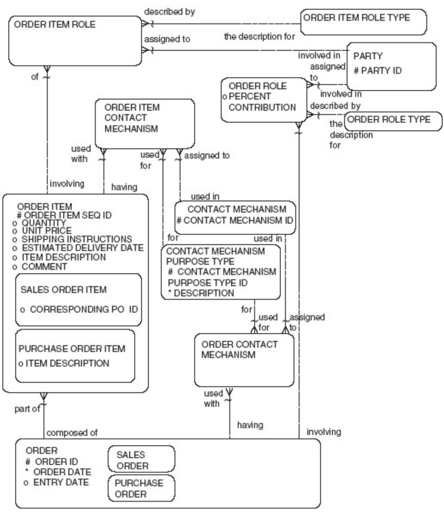

# Sales Order Parties and Contact Mechanisms

Figure 4.3 provides a specific data model showing the roles and the contact mechanisms involved in a sales order. Each SALES ORDER and SALES ORDER ITEM have many PARTY ROLE subtypes as well as many CONTACT MECHANISMS associated with them. A SALES

ORDER may be placed by a PLACING CUSTOMER, taken by an INTERNAL ORGANIZATION CONTACT, and with a requested bill to a BILL TO CUSTOMER. This clearly represents the business rules of most standard sales orders.

The SALES ORDER may be placed using a CONTACT MECHANISM, which may be an address or phone number, and this number may also be used for confirmation of the order (or alternatively another confirmation number relationship could be added). The ORDER may be designated to be billed to a certain CONTACT

MECHANISM, which may be a specific postal address or e-mail address. The order is also taken via a CONTACT MECHANISM that helps establish the phone number or email server that handled the order.

The ORDER ITEM may be designated to be shipped to a SHIP TO CUSTOMER and designated to be shipped to a specific CONTACT MECHANISM, which could be a postal address or e-mail address. The SHIP TO CUSTOMER is not related to the SALES ORDER entity but to the SALES ORDER ITEM because different SALES ORDER ITEMS may be designated to go to different parties. The designated to be shipped to CONTACT MECHANISM may also vary by ORDER ITEM within the same ORDER. For example, the customer may order one item to be delivered to one address and a different item delivered to another address.

If installation is needed, the enterprise may want to consider adding another relationship to record the installation address, which may be different from the shipping address. If this is needed, then the modeler can add the relationship: the SALES ORDER ITEM may be designated to be installed at an INSTALLATION CUSTOMER and be designated to be installed at a CONTACT MECHANISM, which would probably be a postal address.

Are the relationships from ORDER to PARTY and CONTACT MECHANISM independent relationships, or should an ORDER be related to a PARTY CONTACT MECHANISM that provides for both of these together? For example, instead of having two separate relationships to show the placed by PARTY ROLE and the placed using CONTACT MECHANISM, should the sales order be tied to a PARTY CONTACT MECHANISM that stores the party placing the order at their associated contact mechanism? The issue with doing the latter is that one may have one fact without the other. The enterprise may know who the placing party is and may not know its contact mechanism. In some cases, such as Internet-based orders, the enterprise may know the contact mechanism and not know who the party is! Therefore, these are modeled as independent facts of the order.

Note also that the PARTY CONTACT MECHANISM represents the addresses, phone numbers, fax numbers, and other contact

mechanisms associated with the party for ongoing contact purposes. The relationship to CONTACT MECHANISM in this model represents the specific contact information to be used for the order and may or may not also belong in the master contact information that is in PARTY CONTACT MECHANISM. For example, the customer may want to specify a contact mechanism that is solely for use for that order.

Party Placing Order and Related Contact Mechanism

Orders may be placed by an individual or an organization depending on the business requirements of the organization for whom the system is built. In mailorder catalog businesses, the order is usually placed by a person. In manufacturing firms, the order is usually placed by an organization. The order may also be placed by an agent or a broker of a party. The PARTY RELATIONSHIP entity can identify if certain types of parties are allowed to place an order for the enterprise, such as checking to see if a valid broker relationship exists.

The SALES ORDER is related to the CONTACT MECHANISM to maintain order confirmation or follow-up information. This information may or may not be different from the party's contact information that is stored in the PARTY CONTACT MECHANISM, which stores all the default contact information for a party. The PARTY CONTACT MECHANISM information could serve to warn if a

new contact mechanism is used for an order. A party could elect to designate the contact mechanism that placed the order for order confirmation purposes that they do not want in their contact information. An example of this could be a temporary location that is only for the purpose of the order and not for ongoing contact information purposes.

# Party Taking Order and Related Contact Mechanism

The order is always taken by a party whether it is taken at the enterprise for a sales order or taken by the supplier for purchase orders. Figure 4.3 shows that an ORDER must be taken by a PARTY ROLE or INTERNAL ORGANIZATION and may be taken via a particular CONTACT MECHANISM. The order may be taken by a particular subsidiary, division, or department. A particular store may take an order, or the corporate headquarters may take the order. The order may also be taken through the World Wide Web; therefore, the order would be associated with a contact mechanism of the URL and the internal organization that received the order would also be recorded.

# Ship-to Party and Contact Mechanism

In certain circumstances, orders are placed by one party and delivered to other parties. It is possible for someone to order a gift

that is to be shipped to another party. It is also possible for an authorized agent of an organization to place an order that may be delivered to its client's address or addresses.

Figure 4.3 shows that each ORDER ITEM may be with a requested bill to a BILL TO CUSTOMER and designated to be shipped to one and only one CONTACT MECHANISM. Physical items will always require a destination where the items need to be shipped. Orders for service are also generally delivered to a specific location. The designated to be shipped to relationship is at the item level because one order could have many destinations. For example, a large department store chain may order 5,000 cases of cola with instructions to deliver 1,000 cases to each of its five regional stores. With this model it is possible to then record five items of 1,000 cases each, then specify a different delivery address for each item. If this relationship was to the ORDER entity, it would be necessary to record five different orders, which would result in storing redundant information and increase the margin for error during data entry.

It may seem as though the shipping information should be specified as part of the SHIPMENT model, for instance as a scheduled shipment, but there is a reason why it is not. As will be seen in the next chapter, a SHIPMENT can be made up of order items from many orders. That is, if several order items from different orders are to be sent to the same location, these can be consolidated into one

delivery. Therefore, it is important to record the requested ship-to information on the order because it may affect how shipments are delivered. In other words, the information on designated to be shipped to parties cannot be specified by a SHIPMENT because it has not yet been determined which orders will be combined together in which shipments.

Note that this relationship is optional because there are cases where the location of the delivery is immaterial. For example, an order to provide cleaning services for a corporation may be provided across the entire enterprise, so there may not be a need for a designated to be shipped to relationship because there is not a single delivery address for the work.

The shipped from relationship is not specified in this chapter because this will most likely be determined after the order is created, when the SHIPMENT is determined. This relationship is included in the data model in Chapter 5, which covers shipments.

Bill-to Party and Contact Mechanism

The order needs to specify the party responsible for paying for the order as well as the contact mechanism that serves as the billing location for the order (generally where the invoices are sent). The relationship from SALES ORDER with a requested bill to a BILL

TO CUSTOMER identifies the party responsible for paying for the invoice. The relationship from SALES ORDER designated to be billed to a CONTACT MECHANISM identifies where to send the bill and where to follow up for payment.

Table 4.5 gives examples of orders and the associated party addresses or contact mechanisms. Note that the order item seq id 3 order 12560 has a different ship-to than the other order items and is allowable because the ship-to is determined at the order item level. Order 23000 has a different ship-to party and contact mechanism than bill-to. Furthermore, this was an Internet-based order, taken via a contact mechanism that is a web URL. Order 24830 was placed by an e-mail address as the contact mechanism that placed the order.

Table 4.5 Order Roles

<table><tr><td>ORDERID</td><td>PLACING CUSTOMERAND CONTACT MECHANISM</td><td>TAKEN BY INTERNALORGANIZATION ANDCONTACT MECHANISM</td><td>BILL TO CUSTOMERAND CONTACTMECHANISM</td><td>ORDERITEM SEQ</td><td>SHIP TO CUSTOMERAND CONTACT MECHANISM</td></tr><tr><td>12560</td><td>ACME Company234 Stretch Street</td><td>ABC Subsidiary100 Main Street</td><td>ACME Company234 Stretch Street</td><td>1</td><td>ACME Company2300 Drident Avenue</td></tr><tr><td></td><td></td><td></td><td></td><td>2</td><td>ACME Company2300 Drident Avenue</td></tr><tr><td></td><td></td><td></td><td></td><td>3</td><td>ACME Company234 Stretch Street</td></tr><tr><td>23000</td><td>Jones Corporation900 Washington Blvd</td><td>ABC Subsidiarysupplies@ABC.com</td><td>Smith Corporation900 Washington Blvd</td><td>1</td><td>Jones Corporation2300 Drident Avenue</td></tr><tr><td>24830</td><td>Blord@person.com</td><td>ABC Subsidiarysupplies@ABC.com</td><td>Bob Ford2930 Brianwood Avenue</td><td>1</td><td>Bob Ford 2930Briarwood Avenue</td></tr><tr><td>A2395</td><td>ABC Subsidiary100 Main Street</td><td>Ace Cleaning Service3590 Cottage Avenue</td><td>ABC Corporation100 Main Street</td><td>1</td><td>ABC Retail Store2345 Johnson Blvd</td></tr><tr><td></td><td></td><td></td><td></td><td>2</td><td>ABC Retail Store2345 Johnson Blvd</td></tr></table>

Person Roles for Orders

In addition to the key order relationships named previously, many other parties could be involved in the order process. Examples include the person giving the order, the person processing the order, the person approving the order, the parties that are scheduled to coordinate installation, and the parties responsible for fulfilling the order. Therefore, other parties may play various roles in an order.

Figure 4.3 includes a data model structure that maintains the other roles parties play in orders.

Each ORDER may be involving one or more ORDER ROLES, which are described by an ORDER ROLE TYPE. Each ORDER ROLE must be involving one and only one PARTY. While many times these roles will involve people, organizations may also play some of these roles, such as a service team that is responsible for ensuring fulfillment of an order.

Table 4.6 gives examples of the various roles that parties could play in an order. In order 23000, John Jones and Nancy Barker were the salespeople involved in closing the sale. Because they are both equally involved, the percent contribution attribute stores the fact that they were both given 50 percent of the credit for the sale. This information could be used in a commissions system. Frank Parks is responsible for processing the order or, in other words, entering the data into the system. Joe Williams is the party responsible for reviewing the information in the order. The order needs to be

authorized or approved as a valid commitment by John Smith. Notice that the roles dictate the party responsible for accomplishing these functions so even if the function has not been performed yet, a party can still be slotted to play a role.

Table 4.6 Order Roles

<table><tr><td>ORDER ID</td><td>PERSON</td><td>ROLE</td><td>PERCENT CONTRIBUTION</td></tr><tr><td>12560</td><td>John Jones</td><td>Salesperson</td><td>50</td></tr><tr><td>12560</td><td>Nancy Barker</td><td>Salesperson</td><td>50</td></tr><tr><td>12560</td><td>Frank Parks</td><td>Processor</td><td></td></tr><tr><td>12560</td><td>Joe Williams</td><td>Reviewer</td><td></td></tr><tr><td>12560</td><td>John Smith</td><td>Authorizer</td><td></td></tr></table>

The roles described are just a sample of possible roles, and parties could play many other roles in the order. For instance, in some cases, the product needs to be set up or installed, and therefore installation parties are needed. These relationships identify the party that is responsible from the customer for coordinating the setup and repair of the order as well as the place. For instance, if a customer orders a personal computer, either the end user or the customer PC support person may be the installation contact, and the address or phone number of that person could be given. The model could be expanded to allow for a many-to-many relationship of PARTYs as well as CONTACT MECHANISMS to store numerous parties and contact information if necessary.

Purchase Order Parties and Contact Mechanisms

As discussed earlier, the data contained in purchase orders is very similar to the data in sales orders because they both represent the same type of transaction, only from different points of view.

Figure 4.4 provides a data model with purchase order roles and contact mechanisms. Not surprisingly, the data structures are very similar to those of the previous model. Because either a sales order or a purchase order represents a commitment between parties, regardless of whether one is on the buying or selling side, each party has a need to track the details of the order. The only difference is the name of the roles involved. For instance, instead of the INTERNAL ORGANIZATION taking the sales order, the SUPPLIER is that party that takes the purchase order. Instead of the PLACING CUSTOMER, the PLACING PARTY is shown to account for the party that gives the order, which may be an internal organization or an agent of the enterprise. Instead of a BILL TO CUSTOMER, the BILL TO PURCHASER role is used, and instead of a SHIP TO CUSTOMER, the SHIP TO BUYER maintains the party to whom the order is shipped.

Table 4.7 provides an example of the roles involved in purchase order A2395. In addition to these roles there would be additional ORDER ROLES for the people involved in the purchase order, similar to the sales order model.

Table 4.7 Purchase Order Roles

<table><tr><td>ORDERID</td><td>PLACINGPARTY ANDCONTACTMECHANISM</td><td>SUPPLIERANDCONTACTMECHANISM</td><td>BILL TOPURCHASERAND CONTACTMECHANISM</td><td>ORDERITEMSEQ</td><td>SHIP-TOBUYERSAND CONTACTMECHANISM</td></tr><tr><td>A2395</td><td>ABC Subsidiary100 Main Street</td><td>Ace Cleaning Service3590 Cottage Avenue</td><td>ABC Corporation100 Main Street</td><td>1</td><td>ABC Retail Store2345 JohnsonBlvd</td></tr><tr><td></td><td></td><td></td><td></td><td>2</td><td>ABC Retail Store2345 JohnsonBlvd</td></tr></table>

Generic Order Roles and Contact Mechanisms

Should the sales order and purchase order models be combined to take advantage of similar data constructs that could simplify the systems design? Should the data model show relationships from the order to specific party role entities (SHIP TO CUSTOMER, BILL TO CUSTOMER, and so on), or leave the model flexible and relate the order to many ORDER ROLES of ORDER ROLE TYPES, thus facilitating easier database changes over time? Should the model show specific relationships to order role entities as well as flexible role types that could be changed easily?

This is really not just an issue limited to orders. Any transaction type entity will have many parties associated with it. This may be modeled more generically by showing a relationship to a transaction role (ORDER ROLE, SHIPMENT ROLE, INVOICE ROLE) of a ROLE TYPE and then associated with a PARTY. Alternatively, specific PARTY ROLE subtypes could be related to the transaction. For example, an

ORDER may be related to the party role, BILL TO CUSTOMER, SHIP TO CUSTOMER, and so on.

The advantage of showing specific relationships to party roles such as BILL TO CUSTOMER and SHIP TO CUSTOMER is that the model can show and enforce business rules. For instance, perhaps there is a business rule that says there is one and only one BILL TO CUSTOMER associated with an order. Or perhaps the enterprise allows more than one BILL TO CUSTOMER, and this can be shown as well. The point is that the business rule of the enterprise is explicitly stated in the data model.

The other advantage of showing specific relationships is that the model is less abstract and easier to read. It is easier to comprehend that an order is associated with a BILL TO CUSTOMER instead of that orders are associated with many ORDER ROLES of ROLE TYPES and one of the instances of ROLE TYPE is "bill-to customer."

The advantage of developing the data model with the transaction (i.e., ORDER, SHIPMENT, INVOICE) associated with more than one ROLE (ORDER ROLE, SHIPMENT ROLE, INVOICE ROLE) is that the data model, and the ensuing database design, is then much more flexible. The business rule could change from one bill-to customer to the allowance of many bill-to customers over time. If this flexible model is used, the underlying data structure does not have to be

changed (although there may be a change needed to some code or a stored procedure). This structure would also allow additional roles to be added without changing the underlying data model or data structure.

Therefore, if the business rule is stable and not expected to change over time, then using the more specific data modeling method is preferable. Be careful, as it is common for one to think a data structure will not need to be changed and then invariably things change! If it is anticipated that the data model structure may need to change over time, then the more flexible way of modeling roles should be used.

Figure 4.3 and 4.4 showed specific data models for modeling the sales and purchase order roles; Figure 4.5 shows an alternate, more flexible data model for modeling these roles and contact mechanisms.

Figures 4.5 shows that each ORDER may involve one or more ORDER ROLES, each of which is assigned to a PARTY and is described by an ORDER ROLE TYPE. This structure accommodates handling any number of roles for either sales orders or purchase orders by storing the possible roles in ORDER ROLE TYPE and then relating them to the ORDER ROLE. Possible ORDER ROLE TYPES include "placing party," "bill-to customer," "internal organization

taking order," "placing customer," "placing buyer," "supplier," "bill to purchaser," "order entry person," "order salesperson," and "order autho-rizer." Each ORDER ITEM may also have ORDER ITEM ROLES of ORDER ITEM ROLE TYPES, which could include "ship-to buyer," "ship-to customer," "installation customer contact," and "installer."

Each ORDER may have one or more ORDER CONTACT MECHANISMS, and each ORDER ITEM may have one or more ORDER ITEM CONTACT MECHANISMS in order to record the address, phone, fax, e-mail, or other contact mechanism to confirm, ship, bill, take, or install the order. The CONTACT MECHANISM PURPOSE TYPE maintains values such as "ship to," "bill to," "confirmation," "placing," or "taken via" to describe the role of the contact mechanism. The CONTACT MECHANISM entity stores the actual address, phone number, fax number, e-mail address, or other contact mechanism that was used in conjunction with the order.

As the business rules of the enterprise change, the organization may want to track additional roles or there may be changes to the cardinality rules. This generic model is flexible enough to handle new data requirements easily. For example, a new order entry process may dictate that there may be at least two contact mechanisms that can serve to confirm orders. This structure accommodates as many contact mechanisms and roles as are needed in any circumstance. Restrictive business rules such as allowing only one bill-to customer

could be accommodated outside the data structures in stored procedures or common routines. This rule, for example, could also change over time to allow more than one party to be billed for an order, and the model would be able to easily handle this requirement.

# Order Adjustments

There are other parts of the order that do not reflect the ordering of specific products or features. Examples include discounts, surcharges, processing fees, and shipping and handling charges. Should these be considered subtypes of ORDER ITEMS or be considered their own entity and related to ORDER ITEMS?

If these adjustments are portrayed as subtypes of ORDER ITEM, then a recursive relationship would need to exist between ORDER ITEMS in order to relate the adjustments to the appropriate other ORDER ITEM. This data model is somewhat complicated because many of these adjustments may affect either or both the ORDER and ORDER ITEM. Is an adjustment really a similar enough thing to the ORDER ITEM, which represents the product being ordered? Another way of looking at this is that the item being ordered is an ORDER ITEM and an ORDER ADJUSTMENT is a separate entity since an adjustment doesn't really represent something that is "ordered."

For these reasons, the ORDER ADJUSTMENT is shown in Figure 4.6 as a separate entity. The subtypes are DISCOUNT ADJUSTMENT, SURCHARGE ADJUSTMENT, SALES TAX, SHIPPING AND HANDLING CHARGES, FEE, and MISCELLANEOUS CHARGE. The DISCOUNT ADJUSTMENT and SURCHARGE ADJUSTMENT are subtypes that store price adjustments to either the complete ORDER or to each ORDER ITEM. These price adjustments may be either an amount or a percentage.

Figure 4.6 Order adjustments.

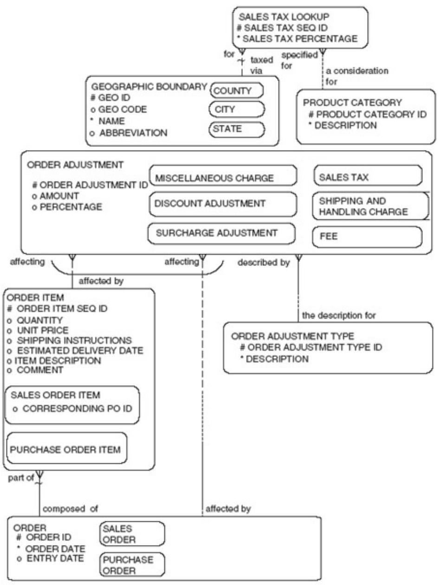

The first three items in Table 4.8 are examples of discounts and a surcharge. The first shows that there is a \(1.00 discount off each unit of a certain item (the next section will cover how to relate it to the item to which it refers). The second item shows that there is a 10 percent discount off the entire order, and the third item shows

that there is a \(10.00 surcharge for delivery outside the normal area.

Table 4.8 Order and Order Item Adjustments

<table><tr><td>ORDERID</td><td>ORDER ITEMSEQ ID</td><td>PRODUCT</td><td>ADJUSTMENTTYPE</td><td>AMOUNT</td><td>PERCENTAGE</td></tr><tr><td>12560</td><td>3</td><td>Jerry&#x27;s box of 31/2-inch diskettes</td><td>Discount</td><td>$1.00</td><td></td></tr><tr><td>12560</td><td></td><td></td><td>Discount</td><td></td><td>10</td></tr><tr><td>12560</td><td></td><td></td><td>Surcharge-Delivery outside normal geographic area</td><td>$10.00</td><td></td></tr><tr><td>12560</td><td></td><td></td><td>Fee-order processing fee</td><td>$1.50</td><td></td></tr></table>

The SALES TAX provides information on the sales tax charged either on the whole order or on a particular order item. SHIPPING AND HANDLING CHARGE would add an order adjustment to the ORDER or ORDER ITEM. FEE could store adjustments for charges such as "order processing fee," "handling fee" for covering the arrangements of the shipment of an order, or a "management fee."

The MISCELLANEOUS CHARGE subtype provides a mechanism to store information about any other charges that could occur on an order. An example of this could be "adjustment error" to correct a prior order. The ORDER ADJUSTMENT TYPE entity provides the ability to classify the various types of adjustments into detailed categories. The description attribute defines the possible values that may be related to adjustments.

An additional data structure is provided in Figure 4.6, which provides information on how much sales tax to charge. The SALES TAX LOOKUP entity stores a sales tax percentage that could vary by GEOGRAPHIC BOUNDARY such as COUNTY, CITY, or STATE and also may vary by PRODUCT CATEGORY. For instance, food products may have different tax implications than non-perishable products. Some types of products may be tax-exempt and could be classified this way by relating them to a "tax exempt" PRODUCT CATEGORY.

Table 4.8 provides examples of adjustments that could be stored in the model. The first row shows that the third order item, "Jerry's box of  $3^{1}$ ?2-inch diskettes," has an order adjustment of a discount of \ $1.00 applied to it. The next three rows are adjustments that were applied to the whole order because no order item is signified. There was a 10 percent discount off the entire order, a surcharge of \$ 10.00 applied because the delivery location was outside the acceptable geographic area, and a fee associated with it of \$1.50 for order processing charges.

Order Status and Terms

Figure 4.7 builds on the order model by illustrating information needs for the status and terms of the ORDER and ORDER ITEMS. This figure includes an ORDER STATUS entity to track the progress as well as to know the current state of an ORDER or ORDER ITEM.

The ORDER STATUS TYPE maintains the status of possible order. The ORDER TERM entity tracks the conditions of business associated with the ORDER or ORDER ITEM. The TERM TYPE entity maintains the possible terms available to use.

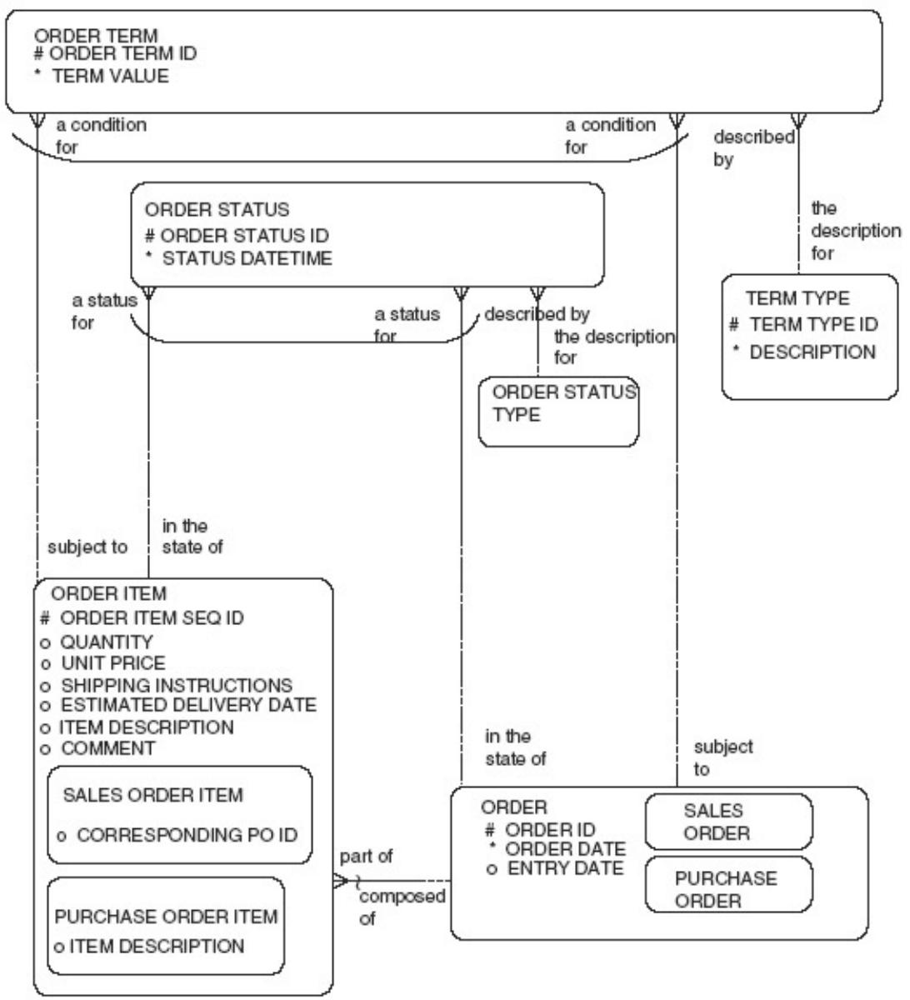
Figure 4.7 Order status and terms.

# Order Status

Because an order may be in many different states at different points in time, the model in Figure 4.7 shows that the order may have more than one status over a period of time. The status datetime

attribute of ORDER STATUS provides for the tracking of when each status of the order occurred. For example, this model will allow the tracking of when the order was received, when it was approved, and when and if it was canceled. The description attribute of the ORDER STATUS TYPE entity stores the possible statuses such as "received," "approved," and "cancelled." If it is necessary to know only the current status of the order and not a history of when each status occurred, then there could simply be a many-to-one relationship from ORDER to ORDER STATUS TYPE (and ORDER ITEM to ORDER STATUS TYPE).

Why not have "shipped," "completed," "backordered," or "invoiced" as order statuses? As will be discussed in later chapters, because shipments and invoices are tied to orders, "shipped," "completed," and "invoiced" can be derived through the relationships to shipment items and invoice items. "Back-ordered" can be derived through the ORDER ITEM ASSOCIATION entity discussed later in this chapter. Although these statuses are derivable values in the logical model, the physical database design may have these statuses available in the ORDER STATUS TYPE table for easy access.

# Order Terms

The parties involved may agree on many arrangements or terms. Delivery terms, exchange or refund policies, and penalties for nonperformance are some examples. Each ORDER or ORDER ITEM may have one or more ORDER TERMS, each of which is categorized by a TERM TYPE. The term value attribute is applicable only to some of the order terms, and its meaning is dependent on the type of term.

Table 4.9 shows examples of order terms. Order 12560 has three terms defined to it. The first two terms document that if the purchaser cancels the order 10 days after placing it, there is a 25 percent cancellation charge. The third term says there are no refunds or exchanges after this item has been delivered.

Table 4.9 Order Term

<table><tr><td>ORDER ID</td><td>ORDER ITEM
SEQ ID</td><td>PRODUCT</td><td>VALUE</td><td>TERM TYPE</td></tr><tr><td>12560</td><td></td><td></td><td>25</td><td>Percentage cancellation charge</td></tr><tr><td></td><td></td><td></td><td>10</td><td>Days within which one may cancel order without a penalty</td></tr><tr><td></td><td>2</td><td>Goldstein Elite pen</td><td></td><td>No exchanges or refunds once delivered</td></tr><tr><td>A2395</td><td>1</td><td>Hourly office cleaning service</td><td>5</td><td>Percentage penalty paid by supplier for nonperformance</td></tr><tr><td></td><td>1</td><td>Hourly office cleaning service</td><td>30</td><td>Number of days within which delivery must occur</td></tr></table>

While one may think that that terms are associated with only the order header, in some cases the individual order items also have

terms associated with them. Table 4.9 shows several examples of terms that are associated with the order item. The "Goldstein Elite pen" order item has a term that it cannot be exchanged or refunded once delivered.

On the purchase order A2395, for the order item “hourly office cleaning service” there is a 5 percent non-performance penalty if the order is delivered more than 30 days past the estimated delivery date.

Order Item Association

Sometimes there is a relationship from one order item to another order item. The ORDER ITEM ASSOCATION entity in Figure 4.8 relates sales order items to purchase order items.

Figure 4.8 Order item association.


An example of this association occurs when a sales order item is dependent on a purchase order item. For example, a distributor may receive a sales order but may not have enough inventory in stock to cover one of the items on it. In turn, the distributor may place a purchase order to one of its suppliers (or many purchase orders to many suppliers) to fulfill the item that was short. In other words, the

sales order item was "backordered" and covered by a purchase order item.

A single item on a purchase order may be used to fulfill several items on sales orders. Alternatively, a sales order item may be fulfilled by many purchase orders items because the additional inventory may be ordered from many different suppliers. The ORDER ITEM ASSOCIATION handles this many-to-many relationship.

The example shown in Table 4.10 illustrates the data that would occur from a purchase order item tied to a sales order item. Order 23490 is a purchase order that has an item that will provide the items needed for sales order 13480, item 1.

Table 4.10 Order Item Association

<table><tr><td>ORDER ID</td><td>ORDER ITEM SEQ ID</td><td>ORDER ID</td><td>ORDER ITEM SEQ ID</td></tr><tr><td>13480</td><td>1</td><td>23490</td><td>1</td></tr></table>

Another situation where sales and purchase orders are linked is when a sales order requires the corresponding purchase order number from the buyer. Because the seller may want to track the buyer's corresponding purchase order ID, the attribute

corresponding PO ID is on the SALES ORDER ITEM entity. This attribute is defined at the order item level and not the order header because each order item of the sales order may be related to a different purchase order. The ORDER ITEM ASSOCIATION entity is

not used to relate the purchase order to a sales order in this case because the seller is generally not interested in recording the full details behind the purchase order—the seller usually needs only the purchase order number.

In the latter case, one sales order item is generally not related to multiple purchase orders. If an item on a sales order is placed due to two or more purchase order items, the sales order item may be split into separate sales order items to be able to trace the exact amount of the item that corresponded to each purchase order.

# Optional Order Models

The data models and information about orders covered thus far in this chapter are very common to most enterprises. The remainder of this chapter will illustrate data models that may or may not be applicable to an enterprise, depending on the information requirements of each specific enterprise. The data models already presented may represent a complete ORDER data model for some enterprises.

The next sections illustrate additional aspects around the order subject data area. These include: REQUIREMENTS to identify either customer or internal needs, which could lead to either sales or purchase orders, REQUESTs, which represent the solicitation of

suppliers or solicitation to the enterprise to bid on orders, QUOTEs, which are the responses to requests to bid, and AGREEMENTs, which define terms and conditions that may govern orders. Each enterprise needs to evaluate which of these data models are applicable to its business and should be incorporated into its design.

# Requirements

An order occurs because a party has a need for something. Some enterprises will track these needs, and some may not. The enterprise may track its customer needs as well as its own needs. An example of a customer need is capturing a requirement of a customer to help build a system for him or her. An example of an internal need is a requirement to purchase certain office supplies.

The organization may be interested in tracking either customer or internal needs, or both, depending on the type of enterprise. In some enterprises, such as professional service organizations, it is very important to capture the needs of customers. In other organizations, such as mail-order catalog enterprises, the enterprise may not track its customer needs and track only needs for their internal requirements.

Figure 4.9 provides a very flexible data model that handles the capturing of both customer and internal requirements.


Figure 4.9 Requirements.

A REQUIREMENT is an organization's need for anything. The REQUIREMENT entity represents a need that may be either a CUSTOMER REQUIREMENT or an INTERNAL REQUIREMENT. Similarly, each REQUIREMENT could be either a PRODUCT REQUIREMENT or a WORK REQUIREMENT. A PRODUCT

REQUIREMENT may be related to a specified PRODUCT and/or several DESIRED FEATURES because the need may be expressed as either a need for a product or a need for something with certain types of characteristics.

REQUIREMENTS may be made up of other REQUIREMENTS and hence the recursive relationship around REQUIREMENT. For instance, there may be a WORK REQUIREMENT to buy office supplies. This requirement may be further broken down into more specific requirements to buy paper, pencils, pens, and CD-ROMs. Similarly, a WORK REQUIREMENT to "develop a new sales analysis system" may be further broken down into more specific requirements to "conduct needs analysis," "select application packages," "select hardware and software," and "implement system." With this recursive structure, the enterprise may define multiple levels of requirements.

Many people may be associated with the REQUIREMENT in various REQUIREMENT ROLES of REQUIREMENT ROLE TYPES such as "owner," "originator," "manager," "authorizer," or "implementer." The REQUIREMENT may have several REQUIREMENT STATUSes over time such as "active," "on hold," or "inactive." Each REQUIREMENT may be needed at a certain FACILITY such as a particular plant, warehouse, office, or room of a building.

The REQUIREMENT may be related to one or more ORDER ITEMS via the associative entity ORDER REQUIREMENT COMMITMENT. This entity would maintain which SALES ORDER ITEMS fulfilled which REQUIREMENT from CUSTOMER REQUIREMENTS. It would also maintain which PURCHASE ORDER ITEMS are fulfilled by the REQUIREMENT from INTERNAL REQUIREMENTS.

REQUIREMENTS have a description attribute that defines the need of the requirement. The requirement creation date specifies when the requirement was first created, and the required by date within the REQUIREMENT entity specifies the date by which the requirement item is needed. The estimated budget attribute identifies how much money is allocated for fulfilling this requirement. The description allows a full explanation and comments for the requirement. The attribute quantity determines the number of items needed in the requirement and allows the requirement to specify that several products or things are needed. For instance, there may be a requirement to hire three programmers. The reason attribute explains why there is a need for the requirement.

# Requirement Roles

Similar to orders, requirements may have many people involved in them. For instance, one person may be responsible for creating the requirement, and another person may be responsible for approving

the requirement. The REQUIREMENT ROLE entity maintains which people play which roles in the requirement. Therefore, the relationship to PARTY identifies the person or organization that is responsible for playing the role. The from date and thru date attributes on REQUIREMENT ROLE define the time period for which the party is responsible for playing the role. The REQUIREMENT ROLE TYPE entity maintains the possible values for these role types.

Some example roles that parties could play in a requirement are "owner," "originator," "manager," "authorize," or "implementor." The owner is the party for whom the requirement is created. The originator is the person or organization that identified the need or requirement. The manager is the person responsible for monitoring the requirement and seeing that it is fulfilled. The authorization is the person who approves or denies the requirement. The implementor is the party who makes sure that once authorized, the requirement is fulfilled.

# Requirements Status

Requirements also have a status such as "active," "on-hold," or "inactive." The REQUIREMENT STATUS entity stores a history of the various statuses of the requirement and the date each status occurred. The REQUIREMENT STATUS TYPE entity maintains the types of statuses that could occur. If the history of the requirement

statuses is unimportant and the enterprise is interested only in the current status, then an alternate data model would reflect a many-to-one relationship from REQUIREMENT to REQUIREMENT STATUS TYPE.

# Product Requirements

Notice that the relationship to PRODUCT is optional and only applies to PRODUCT REQUIREMENTS. Chapter 6 more fully describes the work requirement and work effort data models.

PRODUCT REQUIREMENTS may specify the need for certain features as illustrated in the relationship to DESIRED FEATURE. The optional ind (indicator) attribute in the DESIRED FEATURE indicates that the feature is desired and not required if the value is "yes." For example, the "Goldstein Elite pen" could be specified together with a DESIRED FEATURE of color "blue" with an optional ind of "yes" stating that this is nice to have but not absolutely required.

# Order Requirement Commitments

A requirement or a need to obtain products can naturally result in orders. One REQUIREMENT may lead to many ORDER ITEMSs. For example, the need for 1500 #2 pencils may be fulfilled by several purchase order items. Alternatively, there may be several outstanding requirements for #2 pencils that may all be ordered in a

single order item. Figure 4.9 therefore shows a many-to-many relationship between REQUIREMENT and ORDER ITEM.

The ORDER REQUIREMENT COMMITMENT determines how many items are allocated from an order item to a requirement. For instance, suppose there are two requirements, each with items for 1500 #2 pencils (3000 total pencils needed), and one order item for 2000 of these items that partially fills the requirements. Then it is necessary to specify how many of the order items were used to fulfill each requirement. The quantity attribute in ORDER REQUIREMENT COMMITMENT serves this purpose.

Requirement Example

Table 4.11 shows some examples of requirements. The first two requirements are internal requirements, one for the parent company, ABC Corporation, and one for the subsidiary, ABC Subsidiary. Requirement 24905 is a requirement to have PCs repaired. The requirement specifies a request to fix 14 PCs. This work requirement may be fulfilled by one or more order items.

Table 4.11 Requirements

<table><tr><td>REQUIREMENT ID</td><td>REQUIREMENT CREATION DATE</td><td>REQUIREMENT OWNER</td><td>DESCRIPTION</td><td>RELATED REQUIREMENT</td><td>QTY</td><td>PRODUCT</td><td>DESIRED FEATURE</td></tr><tr><td>24905</td><td>Apr. 13, 2001</td><td>ABC Corporation</td><td>Repair 14 PCs</td><td></td><td>14</td><td></td><td></td></tr><tr><td>43005</td><td>May 16 2002</td><td>ABC Subsidiary</td><td>Requirement to have office cleaned on a regular basis</td><td></td><td></td><td></td><td></td></tr><tr><td>43006</td><td>May 16 2002</td><td>ABC Subsidiary</td><td>Cleaning service</td><td>43005</td><td></td><td></td><td></td></tr><tr><td>43007</td><td>May 16 2002</td><td>ABC Subsidiary</td><td>Cleaning supplies</td><td>43005</td><td></td><td></td><td></td></tr><tr><td>30003</td><td>May 15, 2001</td><td>ACME Corporation</td><td>Requirement for office supplies</td><td></td><td></td><td></td><td></td></tr><tr><td>30004</td><td>May 16 2002</td><td>ABC Subsidiary</td><td>Reams of bond paper</td><td>30003</td><td>50</td><td></td><td>8½ by 11-inch, Fine Grade</td></tr><tr><td>30005</td><td>May 16 2002</td><td>ABC Subsidiary</td><td>Goldstein Elite pen</td><td>30003</td><td>40</td><td></td><td>Blue</td></tr><tr><td>30006</td><td>May 16 2002</td><td>ABC Subsidiary</td><td>Reams of copier paper</td><td>30003</td><td>20</td><td></td><td>8½ by 11-inch, white</td></tr><tr><td>30007</td><td>May 16 2002</td><td>ABC Subsidiary</td><td>Diskettes</td><td>30003</td><td>200</td><td></td><td>3½&quot;, High density, Formatted</td></tr><tr><td>34988</td><td>Jun. 20, 2001</td><td>ABC Corporation</td><td>Repair 15 PCs</td><td>30003</td><td>15</td><td></td><td></td></tr></table>

Requirement 43005 shows a requirement with related subrequirements. The requirement to have the office cleaned on a regular basis involves the two sub-requirements of hiring a cleaning service and procuring cleaning supplies.

The next requirement, requirement 30003, is a customer requirement from ACME Corporation, which is need of office supplies to run its own office. The overall requirement is linked (through the recursive relationship) to several lower level requirements of 50 reams of bond paper, 40 Goldstein Elite Pens, 20 reams of copier paper, and 200 diskettes.

The 50 reams of bond paper is specified though the free-form description attribute in the REQUIREMENT entity and further specified by relating the DESIRED FEATURES of "8 $^{1}$ ?2 by 11-inch" dimension and quality of "Fine Grade." The second lower level requirement shows that the specific product of "Goldstein Elite pen" is desired in the color "blue." The third and fourth lower level

requirements for “reams of copy paper” and “diskettes” are specified with a combination of the REQUIREMENT description and DESIRED FEATURES. The example illustrates that each REQUIREMENT may be specified by relating it to a specific PRODUCT, describing it with a description, and/or specifying DESIRED FEATURES.

The last requirement in the table shows a similar requirement to fix PCs that may have been generated from another part of ABC Corporation.

# Requests

Instead of immediately ordering the products on a requirement, sometimes a process of requesting and receiving quotes is used. A request is a means of asking vendors for bids, quotes, or responses to the requirement. The request could be sent to the enterprise, or it could be sent out from the enterprise to solicit responses from suppliers.

Figure 4.10 shows the key entities associated with requests. The REQUEST may have many REQUEST ROLES, each of which is of a REQUEST ROLE TYPE and is related to a PARTY. Examples of roles include "originator" (the party that the request is from), "prepareder," "manager," and "quality assurer." The RESPONDING PARTY maintains information about the parties that may be responding. The

CONTACT MECHANISM records what contact mechanism will be used or was used to send the request to the responding party. Each REQUEST may be composed of one or more REQUEST ITEMS. Each REQUEST ITEM represents one or more REQUIREMENT ITEMS that may be combined in the request. Because REQUIREMENTS may be related to multiple REQUEST ITEMS, the associative entity, REQUIREMENT REQUEST, resolves the many-to-many relationship.

Figure 4.10 Requests.

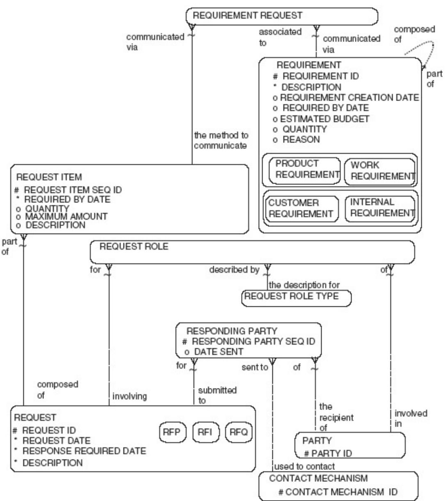

# Request

There are several types of requests. The REQUEST entity has three subtypes that are the most common forms of requests. The RFP subtype stands for “request for proposal” and asks vendors to propose a solution to the needs specified in the details of the request. The RFQ subtype stands for “request for quote” and asks

for bids from vendors on specific products. The RFI subtype stands for “request for information” and is generally sent out before an RFP or RFQ in order to determine preliminary information about the qualification of vendors. This is often used as a mechanism to screen the vendors that will be allowed to respond to an RFP or RFQ.

The REQUEST entity maintains the request date, which is when the request was created, a request required date, which is the deadline when vendors need to respond to the request, and a description, which details the nature of the request.

Table 4.12 illustrates the information contained in a REQUEST. The first row is a request for information to determine which vendors are qualified to bid on repairing PCs. The second row is a request for proposal that follows the RFI and asks vendors to bid on solutions to the PC repair maintenance needs. The third row illustrates an RFQ, which is an incoming request that asks the enterprise to quote prices and terms for specific office supply products.

Table 4.12 Requests

<table><tr><td>REQUEST ID</td><td>REQUEST ORIGINATOR</td><td>REQUEST TYPE</td><td>REQUEST DATE</td><td>RESPONSE REQUIRED DATE</td><td>DESCRIPTION</td></tr><tr><td>23498</td><td>ABC Corporation</td><td>RFI</td><td>Jan 12, 2001</td><td>Feb 10, 2002</td><td>To request information concerning PC repair vendors</td></tr><tr><td>38967</td><td>ABC Corporation</td><td>RFP</td><td>Mar 13, 2002</td><td>Apr 23, 2002</td><td>To request a quote from vendors on repairing PCs</td></tr><tr><td>38948</td><td>ACME Corporation</td><td>RFQ</td><td>Mar 13, 2002</td><td>Mar 21, 2002</td><td>To request a quote on office supplies</td></tr></table>

Requests are sent by a certain party and to certain parties. The party that it is sent by is stored at the REQUEST ROLE of "originator." The party(s) that it is sent to is stored in the RESPONDING PARTY entity. A RESPONDING PARTY is one that is asked to respond to a request with information or a bid, quote, or proposal for the request. The RESPONDING PARTY entity is principally used for outgoing requests because incoming requests will usually have only one responding party, namely the part of the enterprise that received the request and will respond to it. The date sent attribute indicates when the enterprise sent the request to the responding party.

# Request Items

Requests have items describing the various things they need in the request. The REQUEST ITEM has an attribute of quantity stating how many of the items are needed. The required by date indicates when the items need to be delivered to the requesting organization.

The maximum amount attribute describes an upper limit price for the item, beyond which the enterprise will not even consider.

The request may be for a specific product, as in an RFQ, or it may be a request asking vendors to provide solutions to a specific problem. If the request is for a product, then the relationship to PRODUCT accommodates these types of request items. If the request is for a proposal to specific problems as in an RFP, then the description attribute maintains a description of the problem.

REQUIREMENTS are related to REQUEST ITEMS. One REQUIREMENT may be related to more than one REQUEST ITEM. For example, the first two rows of Table 4.13 show that requirement 24905 had two requests associated with it. A request for information was sent out first, then a request for quote followed.

Table 4.13 Request Items

<table><tr><td>REQUEST ID</td><td>REQUEST ORIGINATOR</td><td>REQUEST TYPE</td><td>DESCRIPTION</td><td>REQUEST ITEM SEQ ID</td><td>QUANTITY</td><td>REQUIREMENT ID, DESCRIPTION</td></tr><tr><td>23498</td><td>ABC Corporation</td><td>RFI</td><td>To request information concerning PC repair vendors</td><td>1</td><td>29</td><td>24905, Repair 14 PCs, 34988, Repair 15 PCs</td></tr><tr><td>38967</td><td>ABC Corporation</td><td>RFQ</td><td>To request a quote from vendors on repairing PCs</td><td>1</td><td>29</td><td>24905, Repair 14 PCs, 34988, Repair 15 PCs</td></tr><tr><td>38948</td><td>ACME Corporation</td><td>RFQ</td><td>To request a quote on office supplies</td><td>1</td><td>50</td><td>30004, Reams of bond paper</td></tr><tr><td></td><td></td><td></td><td></td><td>2</td><td>40</td><td>30005, Goldstein Elite pen</td></tr><tr><td></td><td></td><td></td><td></td><td>3</td><td>20</td><td>30006, Reams of copier paper</td></tr><tr><td></td><td></td><td></td><td></td><td>4</td><td>200</td><td>30007, Diskettes</td></tr></table>

One REQUEST ITEM may be associated with more than one REQUIREMENT. Table 4.13 shows that the request for information 23498 combined the need for items in requirements 24905 and 34988, resulting in a request to fix 29 PCs, 14 from one requirement and 15 from another. Also note that more than one request was sent out for these same requirements. One request was for an informal RFI (request for information) and one for an RFQ (a more formal request for quotation). This is an example of the need for the intersection entity REQUIREMENT REQUEST, as shown on Figure 4.10.

Request id 38948 provides an example where each REQUEST ITEM within it corresponds directly to an associated REQUIREMENT in a 1:1 fashion. Request item seq ID "1" corresponds to

REQUIREMENT "30004," request item seq ID "2" corresponds to REQUIREMENT "30005" and so on. However, the many-to-many associative entity, REQUIREMENT REQUEST, still accommodates this information.

The data model in Figure 4.10 provides the flexibility to have the same REQUIREMENT requested many times in several REQUEST ITEMSs. The latter example showed that, for the same requirement, there may be a request for information and then a request for proposal.

A simpler, alternate model that may meet the needs of many organizations could be to relate REQUESTs directly to REQUIREMENTS. This only makes sense if the enterprise knows that there will not be multiple REQUEST ITEMS for the same REQUIREMENT and also if REQUIREMENTS may not be combined into a single REQUEST ITEM.

Quote Definition

A quote is a response to a request; it is synonymous with a bid or proposal. The quote provides the pricing and terms associated with products that fill the need for the request.

Figure 4.11 shows the data model associated with quotes. QUOTEs are issued by a PARTY and given to a PARTY. The enterprise, or a

part of the enterprise, may be the receiver or giver of a QUOTE. Other roles are associated with the quote that are stored in the QUOTE ROLE entity, and allowable values for roles are maintained in the QUOTE ROLE TYPE entity. The entity QUOTE stores the basic information related to the quote and is composed of QUOTE ITEMs that describe the specific PRODUCT or WORK EFFORT being quoted. QUOTE ITEMs must be related to a single REQUEST ITEM because quote items are defined as responses to these request items. Each QUOTE ITEM may, in turn, lead to one or more ORDER ITEMs because the quoted item may be ordered more than once. Similar to orders, each QUOTE or QUOTE ITEM may have terms associated with it that create the need for the relationships to QUOTE TERM and to TERM TYPE.

Figure 4.11 Quotes.

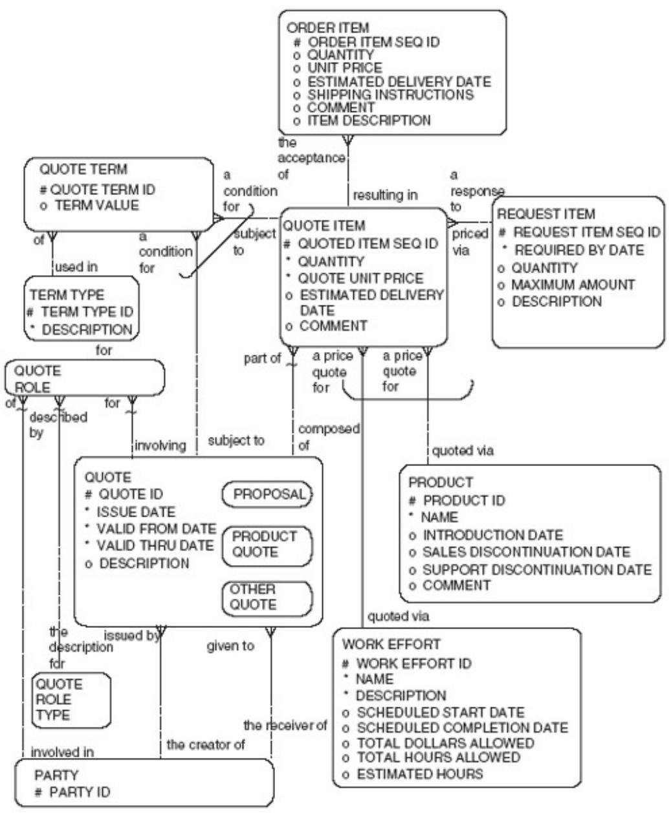

# Quote Roles

Similar to requests, two very significant relationships are explicitly stated, namely, what party issued the quote and the party to whom the quote was given. Just as orders, requirements, and requests have other various roles, quotes also have people playing various

roles. Examples of roles for a quote might be "quoted by," "reviewed by," and "approved by."

# Quote

The QUOTE entity stores header information about the quote. For example, the issue date maintains when the quote was communicated to the intended party. The valid from date and valid thru date maintain when the quote can first be acted on and when the quote expires. The description attribute describes the nature of the quote.

A QUOTE has a subtype of PROPOSAL that is generally more elaborate and includes many sections, such as statements of need, proposal descriptions, benefits, cost justifications, resources required, and so forth. Another subtype is a PRODUCT QUOTE, which is simpler and just tracks the terms and prices behind the products being quoted. There may be other types of quotes, such as bids or offers, depending on the enterprise and its terminology. Table 4.14 gives some examples of quotes.

Table 4.14 Quotes

<table><tr><td>QUOTE ID</td><td>QUOTE TYPE</td><td>ISSUE DATE</td><td>DESCRIPTION</td><td>VALID FROM</td><td>VALID THRU</td></tr><tr><td>35678</td><td>Proposal</td><td>Feb 19, 2002</td><td>Proposal to support the repair of PCs</td><td>Feb 19, 2002</td><td>Mar 19, 2002</td></tr><tr><td>36908</td><td>Product Quote</td><td>Mar 12, 2001</td><td>Bid on pens and pencils</td><td>Mar 12, 2002</td><td>Mar 30, 2002</td></tr></table>

The first quote is a proposal because within the quote there may be a description of the approach to repairing the PCs. The second quote is a product quote because it is simply quoting prices for specific pens and pencils.

# Quote Items

The QUOTE ITEM entity contains information for specific products and is therefore related to PRODUCT. The QUOTE ITEM is also associated with a REQUEST ITEM. One may conclude from looking at this model that the relationship to PRODUCT is unnecessary because it is possible to derive the product that a quote item references. This may be done by traversing the model from QUOTE ITEM to REQUEST ITEM to PRODUCT. The product from the quote, however, may be different from the product requested. For instance, the product requested may be a "#2 pencil." The product quoted may be more specific, such as a "Johnson Red Striped #2 pencil."

QUOTE ITEM has a many-to-one relationship with REQUEST ITEM. When a request is sent out, the quote, bid, or proposal should correspond to only one specific request from an organization, whether it is verbal or written. A request, such as an RFP, though, may have many quotes associated with it because many suppliers may respond.

Table 4.15 shows examples of quotes that correspond to the requests of Table 4.12. Each quote item corresponds to a request item. The original request ("38967") called for a quote to fix 14 PCs. The corresponding quote in the first row of Table 4.14 ("35678") was for 70 hours of service, which is the estimate for fixing the PCs.

Table 4.15 Quote Item

<table><tr><td>QUOTE
ID</td><td>QUOTE ITEM
SEQ ID</td><td>QUANTITY</td><td>PRODUCT</td><td>QUOTE
UNIT PRICE</td><td>REQUEST
ID</td><td>REQUEST
ITEM SEQ ID</td></tr><tr><td>35678</td><td>1</td><td>70</td><td>PC Repair</td><td>$75</td><td>38967</td><td>1</td></tr><tr><td>36908</td><td>1</td><td>50</td><td>Johnson fine grade
8½ by 11 bond paper</td><td>$3.75</td><td>38948</td><td>1</td></tr><tr><td></td><td>2</td><td>40</td><td>Johnson Black pens</td><td>$1.25</td><td>38948</td><td>2</td></tr></table>

The quoted items for paper and pens in rows 2 and 3 show more specific products than were asked for in the corresponding request items from Request id “38948” from Table 4.12. Only two of the four items that were requested in request “38948” were quoted.

The QUOTE ITEM may also be associated with an ORDER if the quote is accepted. An ORDER ITEM will generally not have more than one QUOTE ITEM associated with it. The quote item may be the basis for the pricing on several orders; therefore, several ORDER ITEMS may be associated with one QUOTE ITEM.

Quote Terms

Similar to orders, both quotes and quote items may have terms associated with them. A quote to fix PCs may have a term stating that someone within the organization needing the repair must act as a central point of contact. The term may specify that if this central point of contact does not exist, the quoted price may be raised. A term of a particular quote item on furniture items may be that the receiving party needs to pay the actual freight costs incurred.

The relationship from QUOTE to QUOTE TERM allows many terms to be associated with the quote. The QUOTE ITEM may also have many terms associated with it via the relationship to QUOTE TERM. The TERM TYPE identifies the possible terms that can be applied. This entity is also used for other types of transactions such as orders.

# Agreement Definition

An agreement is a set of terms and conditions that govern the relationship between two parties—for example, a customer and a supplier. A key difference between an order and an agreement is that an order is a one-time commitment to buy products while an agreement specifies how the two parties will conduct business over time.

Figure 4.12 shows the data model associated with agreements. Agreements are classified into AGREEMENT TYPE—for instance,

PRODUCT AGREEMENTs, EMPLOYMENT AGREEMENTs, or OTHER AGREEMENTs, depending on the needs of the enterprise. The AGREEMENT TYPE allows maintenance of many more specific types of agreements. AGREEMENTs may involve many AGREEMENT ROLES of PARTYs such as AGREEMENT ROLES TYPES of "seller," "buyer," "licensee," "licensor," "contracting firm," and "employer," and the roles will depend on the type of agreement involved. The AGREEMENT may be associated with a specific PARTY RELATIONSHIP such as a sales agreement that is associated with a customer relationship.

Figure 4.12 Agreement definition.

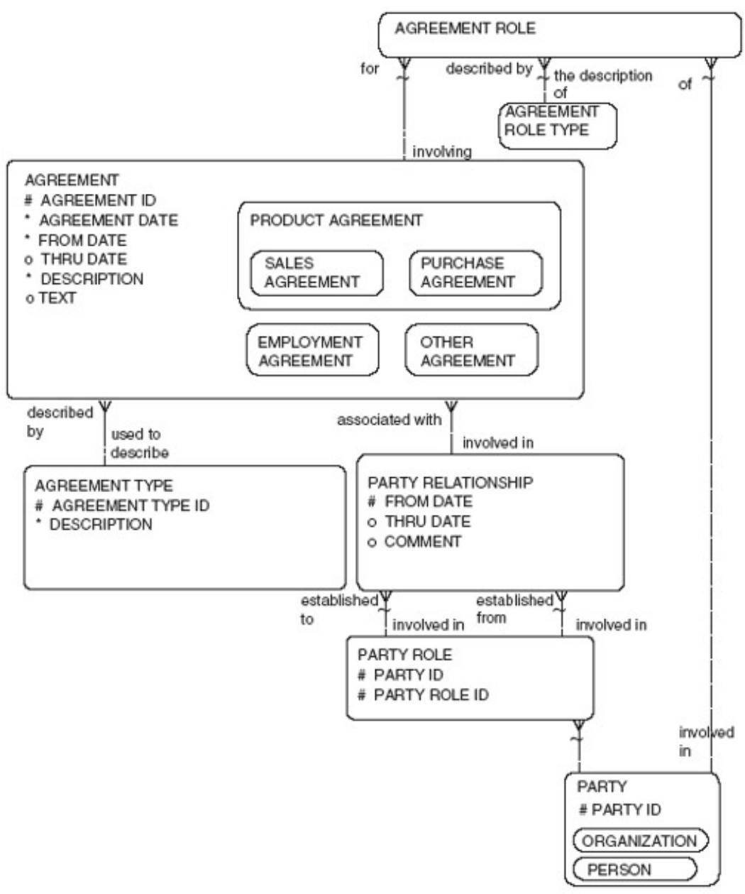

ADDENDUMs modify the agreement to which they may be attached. Each AGREEMENT may be composed of one or more AGREEMENT ITEMS that, in turn, may be related to a specific PRODUCT. Both AGREEMENT and AGREEMENT ITEM may have terms associated with them and are thus further defined by one or more AGREEMENT TERMS or AGREEMENT ITEM TERMS.

The agreement roles may be defined using either the relationship to PARTY RELATIONSHIP or the AGREEMENT ROLES or both. For example, there may exist a customer relationship that, when formalized, is done so through an agreement. Each PARTY RELATIONSHIP may be involved in one or more AGREEMENTs. There also may be more than two parties involved in the agreement, such as in a three-way partnership agreement. The AGREEMENT ROLE entity would be used to store the roles associated with the agreement in this circumstance. The AGREEMENT ROLE may also store many other roles such as "legal council," "approver," "guarantor," "entered by," and any other role involving parties in the agreement.

There are many different types of agreements, and these will vary substantially depending on the nature of the organization. Often many types of agreements are involved in the enterprise, and most of the chapters in Volume 2 illustrate various standard types of agreements that are used in different industries.

Figure 4.12 provides a few standard types of agreements, and Table 4.16 provides sample data for some of these agreements. PRODUCT AGREEMENTs define the terms and conditions of the buying and selling of products. A PRODUCT AGREEMENT may be subtyped as either a SALES AGREEMENT or a PURCHASE AGREEMENT. Agreement 10002 in Table 4.16 is a SALES AGREEMENT. ABC

Corporation acts in the "supplier" agreement role and ACME Company acts in the "customer" agreement role. The agreement represents a contractual commitment and is associated with their party relationship of customer relationship, which was an informal relationship.

Table 4.16 Agreement

<table><tr><td>AGREEMENTID</td><td>AGREEMENTTYPE</td><td>DESCRIPTION</td><td>AGREEMENTROLES</td><td>ASSOCIATEDPARTYRELATIONSHIP</td><td>STARTINGDATE</td><td>ENDINGDATE</td></tr><tr><td>10002</td><td>Sales agreement(associated with customer relationship)</td><td>Agreement regarding the pricing and terms of buying inventory items</td><td>ABC Corporation (supplier) ACME Company (customer)</td><td>Customer relationship</td><td>Jan 1, 2002</td><td>Dec 30, 2002</td></tr><tr><td>86749</td><td>Employment agreement</td><td>Hired William as an entry-level information systems programmer</td><td>William Jones (employee) ABC Corporation (employer)</td><td>Employment relationship</td><td>May 7, 1990</td><td></td></tr><tr><td>489589</td><td>Partnership agreement</td><td>Agreement to form an informal partnership with terms designer to compensate partners</td><td>ABC Corporation (partner), Sellers Assistance Corporation (partner) XYZ Corporation (partner)</td><td></td><td>June 1, 2000</td><td>June 1, 2001</td></tr></table>

The EMPLOYMENT AGREEMENT subtype defines the arrangement behind an employee and employer relationship. Agreement 86749 in Table 4.16 is an employment agreement. Over time there could be several employment agreements; this represents just one of them.

The third agreement shown is a PARTNERSHIP AGREEMENT and is between three parties all playing the same role as a "partner." The data model supports as many roles necessary for any agreement and allows new role types to be added and hence is a very flexible model.

There may be other types of agreements depending on the enterprise involved. For example, there may be ownership agreements, real estate agreements, franchising agreements, licensing agreements, and so on. The AGREEMENT TYPE maintains the various types of agreements that are valid for the enterprise.

One may argue that redundant data is stored in this data model because the roles are stored in the PARTY RELATIONSHIP as well as the AGREEMENT. For instance, in the CUSTOMER RELATIONSHIP, which is a subtype of PARTY RELATIONSHIP, ABC Corporation has a role of internal organization and ACME Corporation has a role of customer. When a formal agreement is established between these parties and a contract is drawn stipulating certain terms of this agreement, an AGREEMENT instance is created, and the AGREEMENT ROLE entity stores ABC Corporation as a supplier and ACME Corporation as a customer.

Doesn't the model already have ACME Corporation as a customer? One answer to this is that there is a difference between a party's

role in an informal relationship and in a formal agreement or contract. The informal relationship may exist, or the agreement may exist, or both may exist. Therefore, this model provides a mechanism to store roles involved in any of these cases.

One may also argue that the AGREEMENT can inherit the roles from the associated PARTY RELATIONSHIP. This could work in many circumstances and is perhaps a valid alternative. Agreements may involve more than two parties, though, and it is probably cleaner to store all the roles for agreements in the same place, namely, the AGREEMENT ROLE entity.

# Agreement Item

An agreement defines a formal contract between two or more parties whereby they both make a commitment to terms for a certain length of time. Each AGREEMENT may have AGREEMENT ITEMS that allow for either subagreements or portions of the agreement. These portions may be particular sections or clauses and may allow the agreement to be subdivided and referred to by section. Alternatively, the agreement may have portions that apply to certain geographic areas, certain types of products, or certain parts of the organization involved in the agreement.

Figure 4.13 shows a data model that shows the information requirements needed for AGREEMENT ITEMS. Each AGREEMENT ITEM represents a component of an agreement and has agreement text and optionally an agreement image that could represent a graphic component. For simple agreements, such as a one-page agreement between parties, there may not be a need to store AGREEMENT ITEMS because the text of the agreement may be stored in the AGREEMENT entity text attribute. Standard terms could be attached to the agreement that will be shown in the next figure, which stores the text and terms of the agreement. For more complex agreements, there may be many AGREEMENT ITEMS that represent portions of the agreement.

Figure 4.13 Agreement item.

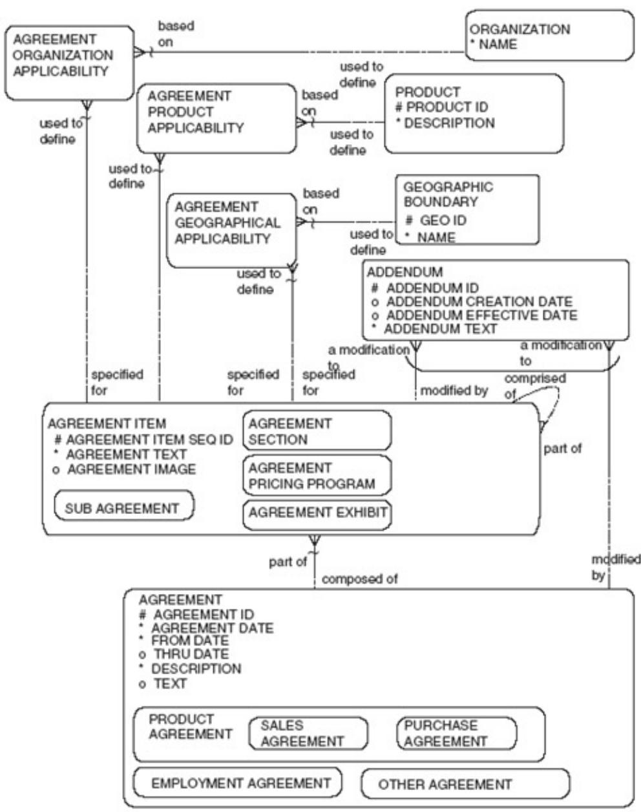

The AGREEMENT ITEM has subtypes of SUB AGREEMENT, AGREEMENT SECTION, AGREEMENT PRICING PROGRAM, and AGREEMENT EXHIBIT. A SUB AGREEMENT represents an agreement within an agreement, such as a confidentiality agreement that forms part of an overall professional services agreement or several subagreements for different parts of an organization. An

AGREEMENT SECTION represents a portion of an agreement that is split out as an AGREEMENT ITEM, allowing it to be related to a specific organization, product, or geographic area if needed. The AGREEMENT PRICING PROGRAM represents information about agreed-on prices for products or features based on different criteria. An AGREEMENT EXHIBIT is a portion of an agreement that is attached to an agreement and usually referred to throughout the agreement.

Each AGREEMENT ITEM may be comprised of other AGREEMENT ITEMS, as shown by the recursive relationship on AGREEMENT ITEM. Subagreements may be broken down into agreement sections, which may be further broken down into agreement clauses. The recursive relationship allows agreement items to be composed in as many levels of detail as necessary.

Either an AGREEMENT or an AGREEMENT ITEM may be modified by an ADDENDUM that could modify the text of the AGREEMENT or AGREEMENT ITEM with the addendum text attribute within the ADDENDUM. The ADDENDUM entity maintains the addendum creation date, which is when the addendum was created, and an addendum effective date, which is when the addendum goes into effect. The addendum text describes the addendum. An example of an addendum is a time extension to the thru date of a customer-vendor agreement. In this case, the thru date would be updated in

the AGREEMENT entity, and an ADDENDUM would be added to show the history of changes to the applicable agreement item. Each AGREEMENT may be modified by one or more ADDENDUMs.

Each AGREEMENT ITEM may be specified for certain geographic boundaries, products, and/or organizations. The AGREEMENT GEOGRAPHICAL APPLICABILITY, AGREEMENT PRODUCT APPLICABILITY, and AGREEMENT ORGANIZATION APPLICABILITY allow AGREEMENT ITEMS to be customized for certain geographic boundaries, products, or organizations. For instance, perhaps different subsidiaries within an enterprise may have specific parts of the agreement that apply to each subsidiary. This structure allows separate sections, which can be applied to each subsidiary. Similarly, certain sections of an agreement may be applicable only to certain products or geographic areas.. There may be other factors that define the AGREEMENT ITEM, such as the applicability for specific types of product, and therefore other "applicability" entities could be added, such as, in this case, an AGREEMENT PRODUCT CATEGORY APPLICABILITY.

Table 4.17 shows a simple example that agreement 10002 is an agreement that has two agreement items governing the terms for buying two products: "Johnson fine grade  $8 \frac{1}{2}$  by 11 blue bond paper" and "Jerry's box of  $3 \frac{1}{2}$ -inch diskettes."

Table 4.17 Agreement Items

<table><tr><td>AGREEMENT</td><td>AGREEMENT ITEM</td><td>PRODUCT</td></tr><tr><td>ID</td><td>SEQ ID</td><td></td></tr><tr><td>10002</td><td>1</td><td>Johnson fine grade 8½ by 11 blue bond paper</td></tr><tr><td></td><td>2</td><td>Jerry&#x27;fs box of 3½ inch diskettes</td></tr></table>

# Agreement Terms

An agreement and its items may each have terms associated with them. The AGREEMENT TERM entity stores the valid terms of the agreement as well as the effective dates of the terms. Different types of terms can be referenced from the TERM TYPE entity. The AGREEMENT TERM entity provides a structure to maintain various types of terms that could either be applied to the AGREEMENT (for simpler agreements without items) or to the AGREEMENT ITEM. Terms and conditions can include legal terms, financial terms, incentives, thresholds, clauses for renewals, agreement termination, indemnification, noncompetition, and provisions for exclusive relationships.

For example, a product agreement between a supplier and its customer may call for an exclusive arrangement preventing the supplier from selling its products to the customer's competitors. An

example of this exclusive arrangement is found when a consulting firm performs services for its client that involve sensitive proprietary information that needs to be safeguarded from the competition. Therefore, the customer may request that the supplier not do business with the customer's competitors for a specified time in order to protect its confidentiality. In Table 4.18, the first row of data gives an example of an AGREEMENT TERM that is associated with agreement 23884. The term is that the agreement calls for an exclusive arrangement prohibiting the supplier from supplying similar services to the customer's competitors for up to 60 days after the contract ends.

Table 4.18 Agreement Terms

<table><tr><td>AGREEMENT ID</td><td>AGREEMENT ITEM SEQ ID</td><td>PRODUCT</td><td>TERM TYPE</td><td>TERM VALUE</td><td>FROM DATE</td><td>THRU DATE</td></tr><tr><td>23884</td><td></td><td></td><td>Exclusive arrangement prohibiting supplier from supplying similar services to customer&#x27;s competitors for specified number of days after contract ends</td><td>60</td><td></td><td></td></tr><tr><td>10002</td><td>1</td><td>Johnson fine grade 81/2 by 11 blue bond paper</td><td>Quantity not to exceed</td><td>1000</td><td>Jan 1, 2002</td><td>Dec 31, 2002</td></tr><tr><td></td><td></td><td>Johnson fine grade 81/2 by 11 blue bond paper</td><td>Dollars not to exceed</td><td>$10,000</td><td>Jan 1, 2002</td><td>June 30, 2002</td></tr><tr><td></td><td>2</td><td>Jerry&#x27;s box of 31/2 inch diskettes</td><td>Customer will exclusively buy from supplier</td><td></td><td>Jan 1, 2002</td><td>Dec 30, 2002</td></tr></table>

Each agreement item may have terms associated with it. The AGREEMENT TERM entity may also maintain the valid terms of an

agreement item. The second, third, and fourth rows of Table 4.18 show examples of agreement items and the terms associated with them. The second and third rows (agreement ID #10002, item #1) represent the same AGREEMENT ITEM for the product "Johnson fine grade \(8 \frac{1}{2}\) by 11 blue bond paper." There is more than one term associated with this agreement item. The two terms specify that the agreement item is valid only for up to 1,000 of these items between January 1, 2002 and December 31, 2002. The agreement also has a term that the dollars expended cannot exceed \(10,000 from January 1, 2002 through June 30, 2002. The fourth row (agreement ID #10002, item #2) specifies that the customer is agreeing to buy these types of products exclusively from the supplier.

Figure 4.14 Agreement terms.

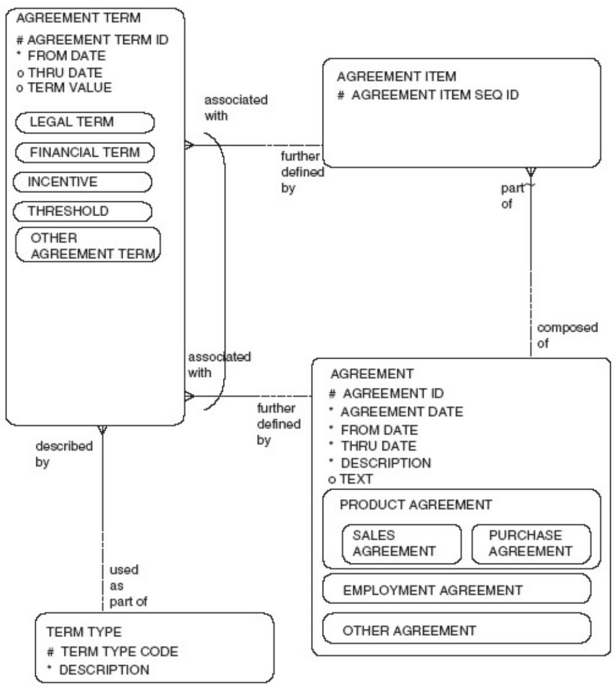

# Agreement Pricing

The entity AGREEMENT ITEM relates to an entity that maintains agreed-on product prices between parties. The prices may vary by time periods, quantities, party addresses, and geographic regions.

Figure 4.15 illustrates the use of the pricing model discussed in Chapter 3 (see Figure 3.7) for agreements. In order to handle the

needs of agreement pricing, the PRICE COMPONENTs are now

additionally related to an AGREEMENT PRICING PROGRAM (subtype

of AGREEMENT ITEM). Each AGREEMENT PRICING PROGRAM may

have many PRICE COMPONENTs.

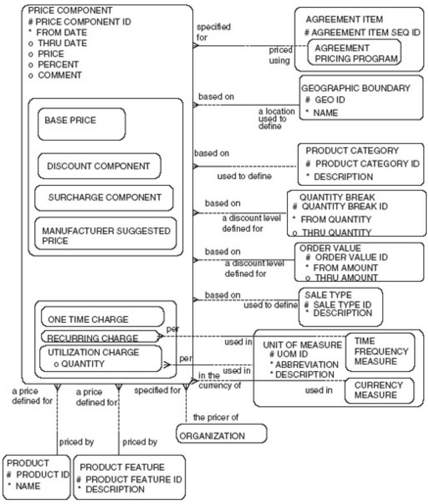
Figure 4.15 Agreement pricing.

As already discussed, these PRICE COMPONENTs may be a base price (BASE PRICE), a discount (DISCOUNT COMPONENT), a surcharge (SURCHARGE COMPONENT), or a MANUFACTURER SUGGESTED PRICE. The attribute price is used to record base prices, flat discounts, or flat surcharges. The attribute percent is used to record percentages for discounts or surcharges to certain agreement items. The relationships to GEOGRAPHIC BOUNDARY, PRODUCT CATEGORY, QUANTITY BREAK, ORDER VALUE, and/or SALE TYPE allow different prices based on different combinations of these factors.

An alternative data model is to have a PRODUCT PRICE COMPONENT entity and a separate AGREEMENT PRICE COMPONENT entity. The disadvantage to this alternate model is that there is reuse of a very similar entity with similar attributes. The advantage is that the data structures to price products and agreements are slightly different and that the information in these data structures will probably be used in very different circumstances. One slight difference in these structures is that product pricing may be based on the PARTY TYPE entity (this relationship is shown in Figure 3.7 Product pricing); this is not necessary in agreement pricing because the pricing is for a particular party and will therefore not vary by the type of party.

Table 4.19 gives some examples of the pricing components used within agreements. The three rows are the pricing arrangement for agreement 10002 item 1, which refers to the product "Johnson fine grade  $8 \frac{1}{2}$  by 11 blue bond paper." The agreement says that the price in the eastern region for this product is  $7.00 and in the western region the price is$ 7.50. If more than 1,000 reams are ordered in the same order, then a 2 percent discount is applied to this product.

Table 4.19 Agreement Item Price

<table><tr><td>AGREEMENTID</td><td>AGREEMENTITEM SEQ</td><td>PRODUCT</td><td>PRICE COMPONENTEN SUBTYPE</td><td>GEOGRAPHIC BOUNDARY</td><td>QTY BREAK FROM</td><td>QTY BREAK THRU</td><td>PRICE</td><td>PERCENT</td></tr><tr><td>10002</td><td>1</td><td>Johnson fine grade 81/2×11 blue bond paper</td><td>Base</td><td>Eastern region</td><td></td><td></td><td>$7.00</td><td></td></tr><tr><td></td><td></td><td></td><td>Base</td><td>Western region</td><td></td><td></td><td>$7.50</td><td></td></tr><tr><td></td><td></td><td></td><td>Discount</td><td></td><td>1000</td><td></td><td>2</td><td></td></tr></table>

With the addition of this pricing model application, pricing may be determined by three different means: through the standard price associated with a product, through an agreement made in advance, or through a specific negotiation of an order. It is important to specify the business rules that govern when to use which price. Most enterprises have business rules in place that an agreement will override the standard product price and that specific negotiation on an order will overrule standard product prices or agreements.

# Agreement to Order

In most cases, there is no direct relationship between ORDER and AGREEMENT because the terms and pricing of an agreement will dictate business rules that govern the processing of an order.

The data model in Figure 4.16 shows ORDER and AGREEMENT data structures regarding pricing. These data structures have already been shown in separate diagrams and Figure 4.16 provides another view to these structures to provide insight about the relationship from ORDER to AGREEMENT.

Figure 4.16 Relationship of agreement to order.

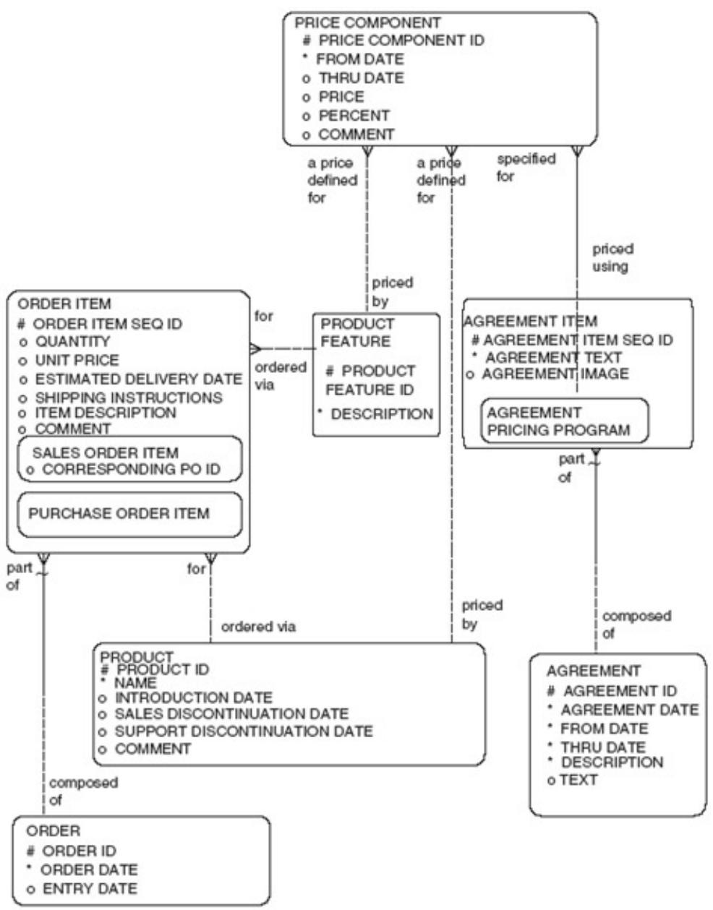

As illustrated in Figure 4.16, each ORDER has ORDER ITEMS with an associated PRODUCT and optionally with PRODUCT FEATURES specified. The AGREEMENT has AGREEMENT ITEMS, which may be an AGREEMENT PRICING PROGRAM that has PRICE COMPONENTs dictating the pricing of the PRODUCTS and PRODUCT FEATURES. The order processing routines would check to see if one or more

agreements were in effect by comparing the order date to the agreement from date and thru date as well as seeing if the party ordering the products is the same as the party that had this agreement in place. The ORDER ROLES and AGREEMENT ROLES (not shown in the diagram) would need be compared to accomplish this. The AGREEMENT or AGREEMENT ITEM may also have terms associated with it that may be checked at the time of order processing.

The fact that orders are governed by agreements means that the order is subject to the pricing and terms of the agreement. Of course, it is possible for an order to override the pricing and terms of an agreement in some circumstances. For example, perhaps there is an agreement between a customer and a supplier that a certain type of pen will cost $2.00 each. All orders generally follow the terms of this agreement; however, the supplier might make an exception and discount the price of pens by $.50 for a specific order due to a complaint about the late delivery of a previous order. This may be a gesture on the part of the supplier, even though there are no terms or conditions to give this discount.

# Summary

The data model from this chapter provides a way to maintain information about orders, requirements, requests, quotes, and

agreements (see Figure 4.17). These models incorporate both sales and purchase order perspectives and cover services as well as goods.


Figure 4.17 Overall order model.

Orders go through a process, beginning with a requirement or a need for a product(s). The requirement may be directly fulfilled by an order, or it may lead to a request to suppliers, a quote, then an order. Agreements may be established in advance that govern relationships and transactions between parties and influence terms and pricing. This chapter models most of the information that many enterprises need to establish commitments between parties.

Models for delivering these commitments are covered in Chapters 5 and 6. The delivery of commitments of goods is usually accomplished through shipments, which are covered in Chapter 5. The delivery of services is usually accomplished through work efforts, which are covered in Chapter 6.

Please refer to Appendix A for a listing of entities and attributes. SQL scripts to build tables and columns derived from the logical models in this book can be found on the full-blown CD-ROM, which is licensed separately.

# CHAPTER

# 5

# Shipments

Now that orders have been taken, how do they get to their destinations and, once there, how are they paid for? Other questions to answer are these:

What is being shipped?
- When will it ship?
- To and from where is it shipped?
What is the current status of the shipment?
- What inventory receipts and issuances occurred during what times at what locations?
- What is the volume and nature of incoming and outgoing shipments?
- Was the entire order shipped or only part of it?
- What shipping documents have been completed and maintained?
- What carrier was used in the shipment and what routes did the shipment take?

This chapter will deal with the shipment of items that are scheduled to be or have been delivered. As will be shown, the information to

support these functions does not, at first glance, seem very complex; however, the data interrelationships in a real-world environment can be complicated.

Models discussed in this chapter are the following:

- Shipments
Shipping detail
- Shipment-to-order relationship
- Shipment receipt for incoming shipments
- Item issuance for outgoing shipments
Shipping documents
- Shipment method

# Shipments

The basic data model for shipments is shown in Figure 5.1. There is the SHIPMENT entity, which can have many types. The relationships from SHIPMENT to PARTY are to record the shipped-from PARTY and the shipped-to PARTY. The relationship from SHIPMENT to POSTAL ADDRESS is to track where the shipment began and where the shipment was delivered. The model also shows that additional CONTACT MECHANISMS can be maintained to record where queries can be made to inquire about the shipment from the sender as well

as a contact number for the receiver to facilitate delivery just in case the carrier cannot easily access or find the postal address.

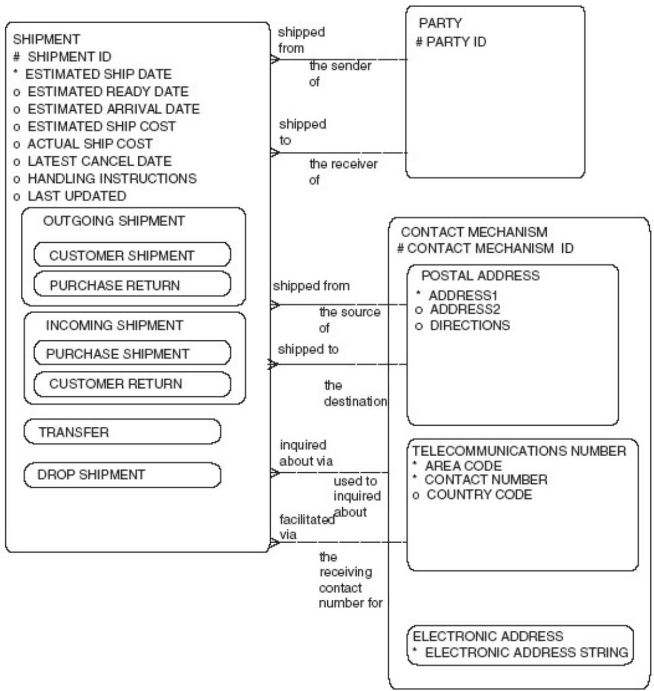
Figure 5.1 Shipment definition.

An enterprise may need to know many things about a shipment. Some are critical; some are not so critical. The first thing to record in the SHIPMENT entity is the estimated ship date, which indicates

when the shipment is expected to begin its journey to the client. This will be critical to customer service personnel when an irate client calls to see what happened to his or her order. The estimated ready date documents when the item is expected to be ready for shipment (perhaps packaging or other preparation is needed for the item). Other bits of information to know include estimated arrival date, estimated ship cost, actual ship cost (may be important for billing), and any special handling instructions (i.e., "fragile," "requires signature upon delivery," etc.). In the case of a cancellation, there is a need to know the latest date the shipment could be canceled. The last updated attribute provides a way to determine when this information was last changed because the estimated dates may change frequently, although the enterprise would hope not. The actual dates of all these events are recorded in SHIPMENT STATUS, which is discussed in a later section.

# Shipment Types

As can be seen in Figure 5.1, several subtypes on the SHIPMENT entity are included in the model to distinguish between some basic types of shipments. These types could be inferred based on the organizations involved in the shipment, but they have been included for clarity. If the shipment is from an internal organization to an external organization, then it is an OUTGOING SHIPMENT, which may be either a CUSTOMER SHIPMENT or a PURCHASE RETURN. A

CUSTOMER SHIPMENT defines shipments sent out to customers. A PURCHASE RETURN defines shipments that were returned to the supplier. If it is an external organization shipping to an internal organization, then it is referred to as an INCOMING SHIPMENT and may be a PURCHASE SHIPMENT or a CUSTOMER RETURN. A PURCHASE SHIPMENT is an incoming shipment of purchased items from a supplier. A CUSTOMER RETURN is an incoming shipment from a customer that has returned the products bought from the enterprise. A shipment from an internal organization to another internal organization (e.g., from department A to department B) is called a TRANSFER. If the shipment moves from an external organization to a different external organization, then it is a DROP SHIPMENT. Typically, a drop shipment is a mechanism for a distributor to ship products directly from its supplier to its customer.

Shipments Parties and Contact Mechanisms

The shipment would not be a shipment if the enterprise wasn't sending something somewhere—but where? Shipments must be delivered to and from a location. Therefore, there are two relationships to POSTAL ADDRESS. One shows the location that is the ultimate destination of the shipment; the other shows the source or starting point of the shipment. A shipment, once scheduled, will need to show both shipped to and shipped from even prior to actual shipment.

The shipment is related to parties in addition to contact mechanisms. The shipped to party is needed as well as the shipped from party. The shipped to party will most likely be the same as the designated to be shipped to PARTY of the ORDER, and similarly the shipped to CONTACT MECHANISM relationship will likely be the designated to be shipped to relationship from ORDER to CONTACT MECHANISM. Therefore, it is possible to use these pieces of information as a default in order to determine the shipped to party and shipped to contact mechanism.

This may appear to be a duplication of data (PARTY and CONTACT MECHANISM information tied to both SHIPMENT and ORDER), but the information needs to appear in both places because the shipment record may not be created until much later than the order. If the shipment record was created during order entry, then the information could be stored only in the shipment record. This, of course, could also be controlled through business rules and processes. It is also possible that the shipment information may change and be overridden during the shipment process.

The model shows additional relationships from SHIPMENT to CONTACT MECHANISM to provide information about how to trace the shipment. There may be a receiving contact number for the receiver of the SHIPMENT, which would be a TELECOMMUNICATIONS NUMBER such as a phone number. This

could be used to contact the receiver should the postal address of the shipment be in question. The used to inquire about relationship from CONTACT MECHANISM to SHIPMENT provides a way for any party to inquire about the shipment.

Table 5.1 shows some sample data regarding SHIPMENT and related CONTACT MECHANISM information. The first three rows show customer shipments that are shipped to the customer, ACME Corporation, from the internal organization, ABC Subsidiary. Shipments #1146 and #1149 represent incoming shipments, specifically purchase shipments from the supplier, General Goods Corporation. Shipment #1578 represents the return of a purchase, specifically, the return of goods to the supplier, General Goods Corporation. Shipment #3485 represents a transfer of goods from ABC Subsidiary to ABC Corporation. Finally, shipment #4800 represents a drop shipment from ABC's sales agent, Sellers Assistant Corporation, to its customer, ACME Corporation.

Table 5.1 Shipment Data and Contact Mechanisms

<table><tr><td>SHIPMENT ID</td><td>SHIPMENT TYPE</td><td>ESTIMATED SHIP DATE</td><td>ESTIMATED ARRIVAL DATE</td><td>SHIPPED-TO PARTY AND POSTAL ADDRESS</td><td>SHIPPED-FROM PARTY AND POSTAL ADDRESS</td></tr><tr><td>9000</td><td>Customer shipment</td><td>Mar 6, 2001</td><td>Mar 8, 2001</td><td>ACME Corporation 234 Stretch Street</td><td>ABC Subsidiary 300 Main Street</td></tr><tr><td>9200</td><td>Customer shipment</td><td>Mar 12, 2001</td><td>Mar 14, 2001</td><td>ACME Corporation 234 Stretch Street</td><td>ABC Subsidiary 300 Main Street</td></tr><tr><td>9400</td><td>Customer shipment</td><td>Mar 22, 2001</td><td>Mar 25, 2001</td><td>ACME Corporation 234 Stretch Street</td><td>ABC Subsidiary 300 Main Street</td></tr><tr><td>1146</td><td>Purchase shipment</td><td>Mar. 19, 2001</td><td>Mar. 20, 2001</td><td>ABC Corporation 100 Main Street</td><td>General Goods Corporation 300 Jennifer Street</td></tr><tr><td>1149</td><td>Purchase shipment</td><td>Mar. 25, 2001</td><td>Mar. 31, 2001</td><td>ABC Corporation 100 Main Street</td><td>General Goods Corporation 300 Jennifer Street</td></tr><tr><td>1578</td><td>Purchase return</td><td>Apr 9, 2001</td><td>Apr 12, 2001</td><td>General Goods Corporation 300 Jennifer Street</td><td>ABC Corporation 100 Main Street</td></tr><tr><td>3485</td><td>Transfer</td><td>Jun 23, 2001</td><td>Jun 25, 2001</td><td>ABC Subsidiary 300 Main Street</td><td>ABC Corporation 100 Main Street</td></tr><tr><td>4800</td><td>Drop shipment</td><td>July 12, 2001</td><td>July 13, 2001</td><td>Sellers Assistance Corporation 400 Benny Street</td><td>ACME Company 234 Stretch Street</td></tr></table>

# Shipping Detail

What items are being shipped, and what is the status of the shipment? This is what is reflected in the data model in Figure 5.2. Each SHIPMENT may be detailed by many SHIPMENT ITEMS. This provides a mechanism to track what was shipped or received and how many of each item was shipped via the quantity attribute.

Figure 5.2 Shipping detail.


Now that one can tell where a shipment is going to and coming from, and when it is being shipped, it is necessary to know what is being shipped and how many items are being shipped. The SHIPMENT ITEM entity will provide information on how many items will be shipped or are scheduled to be shipped. Details about what was shipped may be found in either the GOOD entity if it is a standard product or in the shipment contents description, if the

item is not a standard item that is kept on file. For example, there could be a one-time incoming shipment from a supplier that is not maintained in the GOOD entity because it is not a standard product. Because shipments may change state during their life cycle (i.e., from "in transit" to "delivered"), the SHIPMENT STATUS entity is needed to describe the state of the shipment at various points in time. The recursive relationship around the SHIPMENT ITEMS accounts for the fact that shipment items may be in response to other shipment items, for example, when an organization receives the item, determines that the item is defective, and sends it back (which is another shipment item that is related to the original shipment item).

Why is a SHIPMENT ITEM related to GOOD and not INVENTORY ITEM? After all, the shipment item is involved in the process of taking something out of inventory and/or receiving into inventory. One reason is that the particular inventory item(s) may not be known when scheduling the shipment. Another reason is that the inventory items are related indirectly to the SHIPMENT ITEM through other entities such as SHIPMENT RECEIPT and ITEM ISSUANCE of inventory items that will be shown later in this chapter.

Table 5.2 highlights possible data for SHIPMENT ITEM. Shipment #9000 details the previously described customer shipment to ACME

Corporation, and Table 5.2 shows that three items are being shipped.

Table 5.2 Shipment Items

<table><tr><td>SHIPMENT ID</td><td>ITEM SEQ</td><td>QUANTITY</td><td>INVENTORY ITEM</td></tr><tr><td>9000</td><td>1</td><td>1000</td><td>Jones #2 pencils</td></tr><tr><td></td><td>2</td><td>1000</td><td>Goldstein Elite pens</td></tr><tr><td></td><td>3</td><td>100</td><td>Boxes of HD diskettes</td></tr></table>

Shipment Status

The entity SHIPMENT STATUS in Figure 5.2 allows for the accurate tracking of the status of the shipment over its life. The status (from SHIPMENT STATUS TYPE) identifies the state of the shipment at a point in time. Possible statuses include "scheduled," " shipped," " in route," " delivered," and " canceled." This model will allow the storage of any and all statuses of interest to the enterprise.

Table 5.3 shows sample data that could be stored with this entity. While the estimated ship date and estimated arrival date are stored as attributes in the SHIPMENT entity, the SHIPMENT STATUS stores the dates (and times, if needed) that activities actually occurred on the shipment. Customer shipment #9000 was scheduled for shipment March 4 (meaning that the shipment was first recorded) and actually shipped out on Mar 7 and received on Mar 7. Drop shipment #4800 was scheduled for shipment on July 9 and then canceled on July 10.

Table 5.3 Shipment Status Data
SHIPMENT IDSHIPMENT STATUSSTATUS DATE

<table><tr><td>9000</td><td>Scheduled</td><td>Mar 4, 2001</td></tr><tr><td></td><td>Shipped</td><td>Mar 7, 2001</td></tr><tr><td></td><td>Received</td><td>Mar 7, 2001</td></tr><tr><td>4800</td><td>Scheduled</td><td>July 9, 2002</td></tr><tr><td></td><td>Canceled</td><td>July 10, 2002</td></tr></table>

Shipment-to-Order Relationship

For the data model to be truly integrated and functional, there is a need to link orders taken to the shipments made. This will be handled through the entity ORDER SHIPMENT in Figure 5.3. This entity is the resolution of a many-to-many relationship between SHIPMENT ITEM and ORDER ITEM. The many-to-many relationship is required to handle partial shipments and combined shipments.

Figure 5.3 Shipment-to-order relationship.


Each SHIPMENT ITEM may be a shipment of one and only one GOOD and/or one or more SHIPMENT ITEM FEATURES; alternatively it may be described only via a shipment contents description for non-standard items. Why is it necessary to record the goods and product features for a shipment if they are already included in the order? First of all, shipments and shipment items may exist

independently of an order—for instance, with transfers of inventory. Second, it is possible that the good shipped is different from the ordered item. For example, perhaps a substitution occurred.

Tables 5.4, 5.5, and 5.6 give some sample data to demonstrate the many-to-many relationship from ORDER ITEMS to SHIPMENT ITEMS. For simplicity purposes, the data represents customer orders #100 and #200 and customer shipments #9000, #9200, and #9400. The data in these tables may seem complex, but there is a very good explanation behind this: In the real world, the relationship between orders and shipments is a complex one.

Table 5.4 Order Item Data

<table><tr><td>ORDER ID</td><td>ORDER ITEM SEQ ID</td><td>QUANTITY</td><td>PRODUCT</td></tr><tr><td>100</td><td>1</td><td>1500</td><td>Jones #2 pencils</td></tr><tr><td></td><td>2</td><td>2500</td><td>Goldstein Elite pens</td></tr><tr><td></td><td>3</td><td>350</td><td>Standard erasers</td></tr><tr><td>200</td><td>1</td><td>300</td><td>Goldstein Elite pens</td></tr><tr><td></td><td>2</td><td>200</td><td>Boxes of HD diskettes</td></tr></table>

Table 5.5 Shipment Item Data

<table><tr><td>SHIPMENT ID</td><td>SHIPMENT ITEM SEQ ID</td><td>QUANTITY</td><td>PRODUCT</td></tr><tr><td>9000</td><td>1</td><td>1000</td><td>Jones #2 pencils</td></tr><tr><td></td><td>2</td><td>1000</td><td>Goldstein Elite pens</td></tr><tr><td></td><td>3</td><td>100</td><td>Boxes of HD diskettes</td></tr><tr><td>9200</td><td>1</td><td>350</td><td>Standard erasers</td></tr><tr><td></td><td>2</td><td>100</td><td>Boxes of HD diskettes</td></tr><tr><td></td><td>3</td><td>1500</td><td>Jones #2 pencils</td></tr><tr><td>9400</td><td>1</td><td>500</td><td>Jones #2 pencils</td></tr></table>

Table 5.6 Order Shipment Cross-Reference Data

<table><tr><td>ORDER ID</td><td>ORDER ITEM
SEQ ID</td><td>SHIPMENT ID</td><td>SHIPMENT ITEM
SEQ ID</td><td>QUANTITY
(SHIPPED)</td></tr><tr><td>100</td><td>1</td><td>9000</td><td>1</td><td>1000</td></tr><tr><td></td><td>1</td><td>9400</td><td>1</td><td>500</td></tr><tr><td></td><td>2</td><td>9000</td><td>2</td><td>700</td></tr><tr><td></td><td>3</td><td>9200</td><td>1</td><td>350</td></tr><tr><td>200</td><td>1</td><td>9000</td><td>2</td><td>300</td></tr><tr><td></td><td>2</td><td>9000</td><td>3</td><td>100</td></tr><tr><td></td><td>2</td><td>9200</td><td>2</td><td>100</td></tr></table>

Table 5.4 shows that there are two orders, #100 and #200. Table 5.5 shows that there are three shipments, #9000, #9200, and #9400. Table 5.6 illustrates how one order item could be distributed across multiple shipments. The first two lines of Table 5.6 show the relationship of one order item to two shipment items. Order ID #100, item #1 (from Table 5.4) was partially delivered by shipment #9000, item #1, then completed in a later delivery of shipment #9400, item #1, with a quantity of 1,000 to the first and 500 to the second. In this way, the entire order of 1,500 Jones #2 pencils was delivered.

Conversely, one shipment item could be used to deliver items from more than one order. The third and fifth rows of Table 5.6 illustrate this point. Shipment ID #9000, seq id #2, shown in Table, 5.5, is a shipment to deliver 1000 Goldstein Elite pens. It combines a partial shipment of order #100, item #2 (700 out of 2,500 Elite pens ordered), with order #200, item #1 (300 Elite pens). The partial

shipment could be due to a lack of inventory at the time the shipment was made. This scenario assumes that business rules and processes are in place to ensure that both orders (i.e., #100 and #200) are intended to go to the same location and are for the same product. Note that the relationship is not between ORDER (as opposed to ORDER ITEM) and SHIPMENT because it is usually necessary to track the actual items being ordered and shipped.

Is it possible to ship an item with different features than were ordered? Certainly it is possible to do this by mistake. Another possibility is that the customer agreed to accept a different feature than what was ordered. In this case, the order could be changed, or the enterprise may want to reflect that the customer ordered an item with a specific feature, but he or she agreed to accept something else in the delivery.

To handle these cases, one can relate the PRODUCT FEATURES to SHIPMENT ITEMS using the associative entity, SHIPMENT ITEM FEATURE to show which features the shipments had or were scheduled to have. The relationship from SHIPMENT ITEM through the associative entity SHIPMENT ITEM FEATURE to PRODUCT FEATURE in Figure 5.3 allows the enterprise to maintain SHIPMENT ITEMS as well as the PRODUCT FEATURES that are to be shipped.

An alternative to the model shown is to store which ordered features are being shipped in the associative entity between order item and shipment item, ORDER SHIPMENT. When there is a difference in what is being shipped versus what is being ordered, this can be derived because each SHIPMENT ITEM is ultimately tied to an INVENTORY ITEM (this will be shown in later sections of this chapter), which is an actual instance of the good and has a configuration that includes the features included on it. The issue with this alternative is that there is still no mechanism for storing the features for a scheduled shipment (specific inventory is not yet tied to it) when the shipment features are different from the ordered features.

Table 5.7 provides an example whereby blue pens were ordered and then black pens were delivered in response to the orders. The shipment combines 700 pens from one order and 300 pens from another order, as in the previous example. This table also shows that the order item feature was blue; however, the shipment item feature was black. This could mean that either there was a mistake or the shipment was intentionally shipped with a different feature, perhaps because there were no blue pens in stock and the customer indicated that he or she would accept the color black as a substitute.

Table 5.7 Order Shipment Cross-Reference of Product Features

<table><tr><td>ORDERID</td><td>ORDERITEMSEQ ID</td><td>ORDERITEMFEATURE</td><td>QUANTITY</td><td>SHIPMENTID</td><td>SHIPMENTITEMSEQ ID</td><td>QUANTITY( SHIPPED)</td><td>SHIPMENTITEMFEATURE</td></tr><tr><td>100</td><td>2</td><td>Color blue</td><td>2500</td><td>9000</td><td>2</td><td>1000</td><td>Color black</td></tr><tr><td>200</td><td>1</td><td>Color blue</td><td>300</td><td></td><td></td><td></td><td></td></tr></table>

This example has involved only customer shipments to simplify the explanation of the data model. The data structures in these data models will also support the many-to-many relationships that occur with all types of shipments, including purchase shipment, drop shipments, and transfers. All of these types of shipments may combine the need to move items and involve partial shipments, which is why many-to-many relationships are necessary in any type of shipment.

# Shipment Receipts

Incoming shipments may be received at a formal dock or informally at a desk. Either way, information about the receipt of these items needs to be recorded. There is a need for information about how many items of what types were accepted or rejected; this information includes the contents of packages, the roles involved in the receipt, the date and time of the receipt, and where it was accepted into inventory.

Figure 5.4 provides a data model for shipment receipts. Each SHIPMENT ITEM may be packaged within one or more SHIPMENT PACKAGES and vice versa, hence the associative entity, PACKAGING

CONTENT with a quantity attribute to determine how many items are in which package. The shipment package id could very well be a bar-coded number in order to track shipment packages more easily. Each SHIPMENT PACKAGE may be received via one or more SHIPMENT RECEIPTs that store the details of the receipt. However, the SHIPMENT PACKAGE may exist without having a SHIPMENT RECEIPT, for instance on outgoing shipments when the organization assembles something into a package. So there is only a mandatory relationship from SHIPMENT RECEIPT to SHIPMENT PACKAGE and not vice versa. There could be many SHIPMENT RECEIPT ROLES involved in each receipt, such as the person signing for the receipt, the inspector of the goods, the person responsible for storing the receipt within inventory, the receiving manager, and the organization that is receiving the item. Each SHIPMENT RECEIPT may be verified against and applied to an ORDER ITEM to record if the receipt was what was expected. Each SHIPMENT RECEIPT may be stored in an INVENTORY ITEM, allowing these received goods' physical storage place to be recorded.

Figure 5.4 Shipment receipt for incoming shipments.


The SHIPMENT RECEIPT maintains the record of each item and how many items are actually within a received package. The SHIPMENT RECEIPT will store the datetime received, which indicates exactly when the receipt occurred. The item description maintains what was received for non-standard items that would not be maintained as goods within the data model-for instance, for one-time purchases.

The relationship to GOOD maintains what was received for standard goods. The quantity accepted represents the quantity of that item that the organization determined to be acceptable to receive. The quantity rejected represents the quantity of the item that the organization determined to be unacceptable to receive. The REJECTION REASON stores an explanation of why certain items may not be accepted. The recursion around the SHIPMENT ITEM handles related shipment items to each other, allowing the enterprise to track shipments that were sent back.

The model assumes that all SHIPMENT ITEMS are packaged in one form or another. Therefore, the SHIPMENT RECEIPT is always within a SHIPMENT PACKAGE, even if there is a single SHIPMENT ITEM that is in the SHIPMENT PACKAGE. There does not necessarily have to be packaging for the shipment, although usually items have some form of packaging such as a box, carton, or container.

Should the shipment receipt be related to the SHIPMENT PACKAGE or the SHIPMENT ITEM? In other words, is it a receipt for a shipment item or for a package? Suppose you received a package that had many different shipment items and some of them represented only partial amounts of the shipment items because perhaps the shipment box wasn't big enough for the full quantities. The model relates the receipt to the package because that is what was physically received. A reconciliation from the SHIPMENT

RECEIPT to the SHIPMENT ITEM is needed, and this can be accomplished by traversing the data model through SHIPMENT PACKAGE to PACKAGING CONTENT to SHIPMENT ITEM in order to compare received items against what was expected.

Table 5.8 provides examples of receipts for shipments that are being received. These could represent the stocking of inventory items from suppliers so that ABC Corporation can sell them to its customers. Purchase shipment #1146 illustrates that a single shipment item could have multiple packages. The first two rows show that the first item of Jones #2 pencils was shipped using two packages. Package #52000 stored 1,000 pencils in its package, and shipment package #52001 stored the other 1,000 pencils. These may have been received at the same time, or the receipts may have occurred at different times because the boxes could have been separated. Shipment items seq id 2 and 3 each fit neatly into their own respective packages.

Table 5.8 Shipment Receipts

<table><tr><td>SHIPMENT ID</td><td>SHIPMENT ITEM SEQ ID</td><td>QUANTITY</td><td>PRODUCT</td><td>PACKAGING CONTENT QUANTITY</td><td>SHIPMENT PACKAGE ID</td><td>RECEIPT ID</td><td>QUANTITY ACCEPTED</td></tr><tr><td>1146 (incoming shipment from a supplier)</td><td>1</td><td>2000</td><td>Jones #2 pencils</td><td>1000</td><td>52000</td><td>12900</td><td>1000</td></tr><tr><td></td><td></td><td></td><td></td><td>1000</td><td>52001</td><td>12901</td><td>1000</td></tr><tr><td></td><td>2</td><td>1000</td><td>Goldstein Elite pens</td><td>1000</td><td>52002</td><td>12901</td><td>1000</td></tr><tr><td></td><td>3</td><td>1000</td><td>Boxes of HD diskettes</td><td>100</td><td>52003</td><td>13902</td><td>100</td></tr><tr><td>1149 (incoming shipment from a supplier)</td><td>1</td><td>200</td><td>Standard erasers</td><td>200</td><td>53100</td><td>13903</td><td>200</td></tr><tr><td></td><td>2</td><td>200</td><td>Boxes of HD diskettes</td><td>200</td><td>53100</td><td>13904</td><td>200</td></tr><tr><td></td><td>3</td><td>100</td><td>Jones #2 pencils</td><td>100</td><td>53100</td><td>13905</td><td>100</td></tr><tr><td>4800 (transfer)</td><td>1</td><td>500</td><td>Jones #2 pencils</td><td>500</td><td>52004</td><td>13804</td><td>300</td></tr></table>

Multiple shipment items may also be delivered in the same package. All three shipment items within shipment #1149 were delivered in a single shipment package #53100. All the items were accepted. This shows that a single SHIPMENT PACKAGE could contain many SHIPMENT ITEMS.

The transfer shipment #4800 shipped one item in one package; however, only 300 of the 500 items were accepted. A rejection reason, such as "damaged goods," "wrong amount," and so on, could have been recorded, depending on the reason for rejecting the other 200 items.

# Item Issuance for Outgoing Shipments

Outgoing items being shipped need to issued, or in other words pulled, from inventory. A process takes place that may involve generating a pick list to determine which items need to be extracted from inventory, based on the current shipment needs. Different people are involved in the issuance of inventory in various roles to pick the items and quality assure the process.

Figure 5.5 provides a data model to handle the information requirements of the item issuance process. Based on the shipment needs, which could be obtained by reviewing the outstanding SHIPMENTS and SHIPMENT ITEMS, a PICKLIST is generated, identifying the plan for picking from inventory. Each PICKLIST will have a PICKLIST ITEM that stores the quantity of goods needed and are to be picked from each INVENTORY ITEM in order to meet the shipment needs. Various algorithms may have been used to generate this picklist, and once it is generated it is important to record because it represents the plan of action for issuing items out of inventory. Each SHIPMENT ITEM may be obtained via one or more ITEM ISSUANCES, which are each issued from an INVENTORY ITEM. Each ITEM ISSUANCE may have many people involved in this process and therefore may have many ITEM ISSUANCE ROLES for each PARTY involved; each role is described by the ITEM ISSUANCE ROLE TYPE.

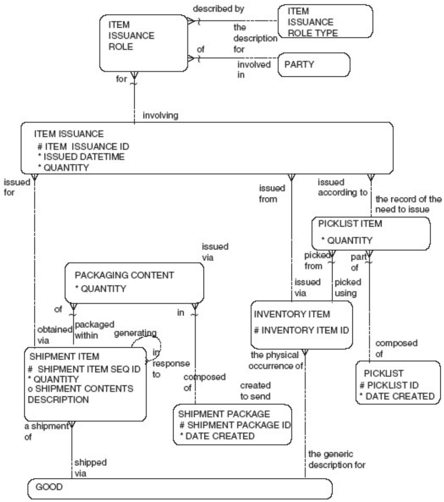
Figure 5.5 Item issuance for outgoing shipments.

Notice that the relationship between ITEM ISSUANCE and SHIPMENT ITEM is optional because items may be issued from inventory for other reasons other than from shipments. For instance, an item may be issued for use within the enterprise at the same location that the inventory is stored.

Table 5.9 provides examples of item issuances. Shipment ID #9000 represents a customer shipment of three items. A thousand Jones #2 pencils are needed, and item issuance #12900 issues these 1,000 items out of inventory. For the second item, 1,000 Goldstein Elite pens, only 800 were available in the inventory location. A replenishment was expected soon, so the other 200 were issued out of inventory shortly afterward to accommodate the shipment item. This illustrates that multiple ITEM ISSUANCES may be associated with a SHIPMENT ITEM. The last two rows in the table show a similar circumstance of two item issuances for the same shipment item, only in this case the items are packaged in separate packages.

Table 5.9 Item Issuances

<table><tr><td>SHIPMENT ID</td><td>SHIPMENT ITEM SEQ ID</td><td>QUANTITY</td><td>PRODUCT</td><td>PACKAGING CONTENT QUANTITY</td><td>SHIPMENT PACKAGE ID</td><td>ITEM ISSUANCE ID</td><td>QUANTITY ISSUED</td></tr><tr><td>9000 (outgoing shipment to a customer)</td><td>1</td><td>1000</td><td>Jones #2 pencils</td><td>1000</td><td>62000</td><td>12900</td><td>1000</td></tr><tr><td></td><td>2</td><td>1000</td><td>Goldstein Elite pens</td><td>1000</td><td>62000</td><td>12901</td><td>800</td></tr><tr><td></td><td></td><td></td><td></td><td></td><td></td><td>13100</td><td>200</td></tr><tr><td></td><td>3</td><td>100</td><td>Boxes of HD diskettes</td><td>100</td><td>62000</td><td>12902</td><td>100</td></tr><tr><td>9200 (outgoing shipment to a customer)</td><td>1</td><td>350</td><td>Standard erasers</td><td>350</td><td>62001</td><td>13800</td><td>350</td></tr><tr><td></td><td>2</td><td>100</td><td>Boxes of HD diskettes</td><td>100</td><td>62002</td><td>13801</td><td>100</td></tr><tr><td></td><td>3</td><td>1500</td><td>Jones #2 pencils</td><td>1500</td><td>62002</td><td>13802</td><td>1000</td></tr><tr><td></td><td></td><td></td><td></td><td>500</td><td>62003</td><td>13803</td><td>500</td></tr></table>

# Shipment Documents

Shipments often are required to carry shipment documents for various reasons. Some reasons are practical in nature, such as to easily identify the contents of packages with a packing slip or bills of lading to identify the contents of shipments. Some reasons are regulated, such as tax, tariff, or export documentation.

To which shipment entity are shipping documents related? The SHIPMENT? SHIPMENT ITEM? SHIPMENT PACKAGE? Depending on the shipment document, the document may be related to either the entire shipment or a specific package.

Figure 5.6 provides a data model for the information requirements of shipment documents. SHIPMENT DOCUMENT is a subtype of DOCUMENT since there may be many other documents that the enterprise maintains. Each SHIPMENT DOCUMENT may be for a SHIPMENT ITEM, a SHIPMENT PACKAGE, and/or a SHIPMENT, depending on the type and nature of the document. For instance, a PACKAGING SLIP generally describes the contents of a package while a MANIFEST describes the contents of a SHIPMENT. A HAZARDOUS MATERIALS DOCUMENT may describe the contents of a SHIPMENT ITEM or possibly a whole SHIPMENT.

Figure 5.6 Shipping documents.


The shipment documents used may vary based on the type of business; however, some standard subtypes are provided in this model. SHIPMENT DOCUMENTs are subtyped into BILL OF LADING, PACKAGING SLIP, EXPORT DOCUMENT, MANIFEST, PORT CHARGES DOCUMENT, TAX AND TARIFF DOCUMENT, HAZARDOUS MATERIALS DOCUMENT, or OTHER SHIPPING DOCUMENT. The DOCUMENT

TYPE entity provides for other types of documents that the enterprise may want to maintain.

# Shipment Routing

There is often a need to track the routes that the shipments and their items and packages travel in order to ensure that items are delivered according to needs and expectations. Enterprises need information about the various paths or shipment route segments to determine the status of the shipment and possibly expedite it. Some packages may have only one path that is tracked, for example, from a warehouse to a customer address. Some packages may have several shipment route segments, such as from a warehouse to a distribution center to an airline route, then to a local truck route, and finally to the customer's receiving dock. Depending on the nature of the enterprise, it may be important to track the progress of the shipment package as it moves along the delivery route. There is a need to track incoming as well as outgoing shipment packages.

Figure 5.7 provides a data model to track the packages along their routes in order to deliver them to their desired destination. Each SHIPMENT ROUTE SEGMENT maintains information about each leg of the journey for a SHIPMENT. In other words, it identifies the particular portions of the journey along which a shipment travels. The SHIPMENT ROUTE SEGMENT must be shipped via a particular

SHIPMENT METHOD TYPE, such as by ground, cargo ship, or air. It must be shipped by a particular CARRIER, even if that carrier is part of the enterprise itself. Optionally, the enterprise may want to track the particular VEHICLE involved used in the segment as well as the from and to FACILITYs that maintain each location through which the shipment route segment travels.


Figure 5.7 Shipment route segments.

The relationship to VEHICLE would usually be tracked in circumstances where the enterprise maintains its own fleet. If the enterprise uses external carriers, the enterprise would probably not need this relationship within its data model. Could more than one vehicle be used in a particular SHIPMENT ROUTE SEGMENT? For instance, could truck #100 be used and then truck #120 take over the route at midpoint? This data model will define this circumstance as two shipment route segments; therefore, each route would have one and only one vehicle.

The relationships to FACILITY are optional because the enterprise may not have the will and means to track each physical location to and from which the shipment travels. This relationship would probably not be needed for enterprises that always use external carriers to ship their goods.

One question that arises is whether a SHIPMENT ROUTE SEGMENT should be related to a SHIPMENT, SHIPMENT ITEM, and/or a SHIPMENT PACKAGE. Does the organization need to trace the routes of entire shipments, individual items within the shipments, or the path of each package within a shipment? The routes of each shipment item would probably not need to be traced separately because these items will be stored together as part of a shipment. Packages are also maintained as part of a shipment (through their relationships to SHIPMENT ITEM). Could the packages within a

shipment be combined and intermixed with packages from different shipments to provide optimal routings of goods? Another question is whether different packages within the same shipment can take two different routes, and would this actually constitute the same shipment? For instance, could the shipment of an office desk and some supplies, which are packaged separately, be shipped through two different shipment methods and still be considered the same shipment? For the purposes of the data model presented, these would be considered two different shipments, and therefore it would probably be wise to track and monitor these as two separate shipment transactions, even though they may be applicable to the same order.

Another scenario is that one of the shipment packages got lost along the way and there was a need to track the routes of the shipment packages separately. If the enterprise had the will and means to track the routes for each package, then instead of a relationship from SHIPMENT ROUTE SEGMENT to SHIPMENT, there could be a many-to-many relationship set up from SHIPMENT ROUTE SEGMENT to SHIPMENT PACKAGE (with an associative entity in between these entities).

The SHIPMENT METHOD TYPE entity contains information about the way the item or items were shipped. The various types of shipment methods described in SHIPMENT METHOD TYPE may include records

such as "ground," "rail," "first class air," or "cargo ship." These values may differ depending on the enterprise's needs. Each SHIPMENT may be shipped via one or more SHIPMENT METHODS. For example, a shipment may require transportation by train, then by truck.

Table 5.10 contains examples of what might be stored in the SHIPMENT ROUTE SEGMENT entity. Notice that shipment #9000 is shipped in two shipment route segments that are all controlled by ABC Subsidiary. The first segment is by one truck, and then the shipment to the final destination is completed by a second truck. The other shipments are more straightforward and involve only one shipment route segment. Shipment #9200 is outsourced to the organization Very Reliable Parcel Service, and only one segment of the shipment journey is tracked because they pick up the shipment and delivery it straight to the customer. Shipment 1146 represents an incoming shipment whose route may also need to be tracked in order to know when to expect the goods.

Table 5.10 Shipment Route Segment

<table><tr><td>SHIPMENT ID</td><td>SHIPMENT TYPE</td><td>SHIPMENT ROUTE SEGMENT ID</td><td>SHIPMENT METHOD TYPE</td><td>CARRIER</td><td>ESTIMATED START DATETIME</td><td>ESTIMATED ARRIVAL DATETIME</td></tr><tr><td>9000</td><td>Customer shipment</td><td>1</td><td>Truck</td><td>ABC Subsidiary</td><td>Mar 7 2001 10AM</td><td>Mar 7 2001 1PM</td></tr><tr><td></td><td></td><td>2</td><td>Truck</td><td>ABC Subsidiary</td><td>Mar 7 2001 2PM</td><td>Mar 7 2001 4 PM</td></tr><tr><td>9200</td><td>Customer shipment</td><td>1</td><td>Ground</td><td>Very Reliable Parcel Service</td><td>Mar 12 2001 1PM</td><td>Mar 14 2001 1PM</td></tr><tr><td>1146</td><td>Purchase shipment</td><td>1</td><td>Air</td><td>Air Goods Delivery Express</td><td>Mar 19 2001 4PM</td><td>Mar 20 2001 12 noon</td></tr></table>

# Shipment Vehicle

If an enterprise does its own shipping and owns the method of shipment, then it may need to track the actual vehicle being used. Thus, the entity VEHICLE is needed to record this information. The entity VEHICLE is a subtype of FIXED ASSET (further explained in Chapter 8, Figure 8.5). There is a one-to-many relationship from VEHICLE to SHIPMENT ROUTE SEGMENT because one truck could be used to deliver many shipments. Notice in Table 5.10 that shipment #9000, which had two segments within the shipment, is now broken down further into the actual trucks being used

Information that enterprises may want to keep about the VEHICLE would be the statistics behind the use of the vehicle, such as the start mileage and end mileage (if appropriate) and amount of fuel used. For detailed tracking one may also want to track the date and time a particular vehicle picked up a shipment and when it unloaded it. With this information it can easily be determined in

what order multiple vehicles were used to deliver a single shipment and how long it took, including transfers. See Table 5.11 for examples.

Table 5.11 Shipment Vehicle Data

<table><tr><td>SHIPMENT ID</td><td>SHIPMENT METHOD</td><td>VEHICLE NAME</td><td>ACTUAL START DATETIME</td><td>ACTUAL END DATETIME</td><td>START MILEAGE</td><td>END MILEAGE</td><td>FUEL USED</td></tr><tr><td>9000</td><td>Truck</td><td>Truck #1</td><td>Mar 7, 2001 10:00 A.M.</td><td>Mar 7, 2001 11:35 A.M.</td><td>52,000</td><td>52,061</td><td>2 gallons</td></tr><tr><td></td><td></td><td>Truck #25</td><td>Mar 7, 2001 12:05 P.M.</td><td>Mar 7, 2001 8:16 P.M.</td><td>73,525</td><td>74,006</td><td>25 gallons</td></tr><tr><td>9002</td><td>Truck</td><td>Truck #1</td><td>Mar 7, 2001 10:00 A.M.</td><td>Mar 7, 2001 11:35 A.M.</td><td>52,000</td><td>52,061</td><td>2 gallons</td></tr></table>

In the example given, one shipment (#9000) is delivered using two vehicles (Truck #1 and Truck #25). Looking at the appropriate start and end times, it is possible to determine that there was a 30-minute delay in the delivery of shipment #9000 while it was being transferred from the first vehicle to the second. Also, notice in the data that the vehicle "Truck #1" was used to deliver a second shipment (#9002). The reason the start time is the same as that of the previous shipment is that the truck contained two shipments that were loaded at the same time.

The data shown also provides information for calculating the real cost of the delivery. It shows the mileage and amount of fuel used. Knowing the cost of fuel, it would be possible to determine this part

of the cost of delivery for each shipment. Additionally, mileage could be used to determine wear and tear on the vehicles used.

An enterprise may also need to track estimated and actual dates and times for each shipment route segment and for each vehicle to determine if the shipment is running behind schedule. The

estimated start datetime and estimated arrival datetime attributes as well as the actual start datetime and actual arrival datetime on SHIPMENT ROUTE SEGMENT provide this additional functionality, if it is needed.

# Summary

In this chapter there has been discussion of the details of shipments and how they relate to orders and to each other. The chapter provided models for shipments, shipment items, relationships of shipment items to order items, shipment receipts, item issuances, shipping documents, and shipment route segments. The key entities and relationships are shown in an overall model in Figure 5.8. These data structures, combined with the interrelationships with other aspects of the models, will allow for the development of robust, integrated systems. These models should, once implemented, minimize the occurrence of redundant data and make the maintenance of referential integrity simpler.

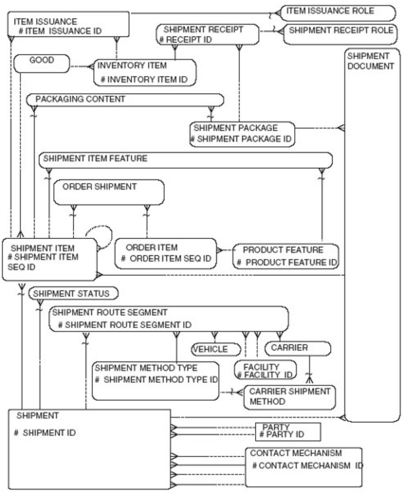
Figure 5.8 Overall shipments model.

Please refer to Appendix A for a listing of entities and attributes. SQL scripts to build tables and columns derived from the logical models in this book can be found on the full-blown CD-ROM, which is licensed separately. Note that there are some differences in the way service is delivered versus items. Inventory items are things that can

be shipped. Service cannot really be shipped by any conventional means; instead, it is delivered to a customer through an entity called WORK EFFORT, which will be explained in the next chapter.

# CHAPTER

# 6

# Work Effort

A key component of conducting business is the act of providing various types of services to various parties. As previously noted, businesses generally provide two types of product offerings: They sell either goods or services. When businesses sell services, they have a responsibility to perform those services, and then they need to bill for them. This often involves the completion of some type of work effort. Businesses also perform work efforts within their internal organizations to accomplish tasks, such as completing a project, producing inventory for sale, or maintaining some corporate asset.

Some questions that enterprises need to answer in the course of doing business include the following:

What type of work effort is required?
- What items need to be produced, or what services need to be delivered?
Who will be involved and what are their roles?
- Where will the work take place?

How long will it take?
What is the current status of the effort?
• Are the appropriate resources (people, inventory, equipment) available? If not, when will they be?
- What standards and metrics are in place to measure work effort effectiveness?
What results are work efforts producing and how efficient are they?

This chapter will illustrate the following models that help answer those questions:

Work requirements
Work requirement roles
- Work effort generation (alternate model also provided)
Work effort associations
Work effort party assignment
Work effort time tracking
Work effort rates
- Inventory item assignment
- Fixed asset assignment
- Party fixed asset assignment
Work effort type standards
Work effort results

Work Requirement and Work Efforts

A WORK REQUIREMENT and a WORK EFFORT are two different but related entities. A work requirement represents the need to perform some type of work. This could be a requirement stemming from a decision to manufacture inventory items, deliver services, conduct a project, or repair an asset of the enterprise such as a piece of equipment or a piece of software.

A work effort is the fulfillment of the work requirement. This includes setting up and planning for the actual work that will be performed, as well as recording the status and information related to the efforts and tasks that are taking place.

Work Requirement Definition

Where does a work requirement come from? A work requirement is created when there is a need to perform some type of work by the enterprise, either for the enterprise or for an external organization, most likely a customer. Examples of work requirements include the following:

- The need to manufacture a particular item because market research indicates an increased demand for that item beyond previous projections

- The need for a piece of equipment within the enterprise to be repaired
- The need for an internal project such as an analysis of existing operations, development of a plan, or creation of a new product or service

Figure 6.1 shows the key entities used to define a work requirement. First, the WORK REQUIREMENT is a subtype of the previously modeled REQUIREMENT entity. The REQUIREMENT TYPE defines the possible categories for requirements, which, of course, includes categorizations for WORK REQUIREMENTS. Possible values for REQUIREMENT TYPE include "project," "maintenance," and "production run." The WORK REQUIREMENT may be for work to be delivered of either a DELIVERABLE, FIXED ASSET, or a PRODUCT.

Figure 6.1 Work requirement.


Several key pieces of information need to be kept in the WORK REQUIREMENT entity. The description attribute defines the need of the requirement. The requirement creation date is a date by which the work is required. The required by date within the REQUIREMENT entity specifies the date by which the requirement is needed. The estimated budget attribute identifies how much money is allocated for fulfilling this requirement. The attribute

quantity determines the number of items needed in the requirement. The reason attribute explains why there is a need for the requirement.

Table 6.1 shows some data that could appear in the WORK REQUIREMENT entity.

Table 6.1 Work Requirement Data

<table><tr><td>WORK
REQUIREMENT
ID</td><td>TYPE</td><td>REQUIREMENT
CREATION DATE</td><td>REQUIRED
BY DATE</td><td>DESCRIPTION</td></tr><tr><td>50985</td><td>Production run</td><td>Jul 5, 2000</td><td>Aug 5, 2000</td><td>Anticipated demand of 2,000 custom engraved black pens with gold trim</td></tr><tr><td>60102</td><td>Internal project</td><td>Oct 15, 2000</td><td>Dec 15, 2000</td><td>Develop sales and marketing plan for 2002</td></tr><tr><td>70485</td><td>Maintenance</td><td>June 16, 2000</td><td>June 18, 2000</td><td>Fix engraving machine</td></tr></table>

# Requirement Types

In addition, other information is needed depending on the REQUIREMENT TYPE. If the type is "production run," then information about what is to be produced and how many is of critical importance. This is why the model includes an optional attribute for quantity and a possible relationship to PRODUCT.

If the type is "maintenance" or "repair," then there is a definite need to know what piece of equipment needs to be worked on. To

accommodate this need, the model also includes an optional relationship to FIXED ASSET.

Finally, if the type is "internal project," then WORK REQUIREMENT may be associated with a DELIVERABLE. This would include such things as a management report, analysis document, or the creation of a particular business method or tool. The DELIVERABLE TYPE entity would contain a list of the possible types of deliverables an enterprise may produce for itself, such as "management report," "project plan," "presentation," or "market analysis."

Note that there is an exclusive arc across DELIVERABLE, FIXED ASSET, and PRODUCT because a single WORK REQUIREMENT can be related to one PRODUCT or one DELIVERABLE or for work on one FIXED ASSET, but not all three. Table 6.2 shows examples of various types of work requirements.

Table 6.2 Work Requirement Types

<table><tr><td>WORK
REQUIREMENT
ID</td><td>WORK
REQUIREMENT
TYPE</td><td>DESCRIPTION</td><td>PRODUCT</td><td>QUANTITY
REQUIRED</td><td>DELIVERABLE</td><td>FIXED
ASSET
ID</td></tr><tr><td>50985</td><td>Production run</td><td>Anticipated demand of 2,000 custom-engraved black pens with gold trim</td><td>Engraved black pen with gold trim</td><td>2,000</td><td></td><td></td></tr><tr><td>51245</td><td>Production run</td><td>Anticipated demand of 1,500 custom-engraved black pens with gold trim</td><td>Engraved black pen with gold trim</td><td>1,500</td><td></td><td></td></tr><tr><td>51285</td><td>Production run</td><td>Anticipated demand of 3,000 custom-engraved black pens with gold trim</td><td>Engraved black pen with gold trim</td><td>3,000</td><td></td><td></td></tr><tr><td>60102</td><td>Internal project</td><td>Develop sales and marketing plan for 2001</td><td></td><td></td><td>2001 Sales/
Marketing
Plan</td><td></td></tr><tr><td>70485</td><td>Maintenance</td><td>Fix engraving machine</td><td></td><td></td><td></td><td>5025</td></tr></table>

The data shown indicates that work requirement #50985 is a "production run." Because of this, the product to be produced, "engraved black pen with gold trim," and the required quantity to produce, 2,000 of these items, are also included. Requirement #51245 and #51285 are also requirements to produce certain amounts of the same pen. Requirement #60102 is an "internal project" related to the deliverable "2001 Sales/Marketing Plan." Work requirement #70485 is a "maintenance" task that requires a particular piece of equipment to be repaired, so the asset ID for this machine is also included. As discussed with previous examples, appropriate business rules need to be in place to ensure that work requirements of certain types are appropriately related to the entities describing what the work requirement produces.

This data model does not include relationships from WORK EFFORT to SHIPMENT to handle the work requirements or corresponding work efforts of managing the delivering of inventory items. Usually, the sales order and shipping entities covered in Chapters 4 and 5 provide enough information to help the enterprise manage the delivery of items. The enterprise generally doesn't need to track the work efforts involved in delivering a product because they are usually quite simple and consist of loading, shipping, and unloading the items. This model, however, can be easily modified to provide for tracking work requirements and work efforts associated with delivery of items by creating a relationship from WORK EFFORT to SHIPMENT ITEM (work efforts will be discussed later in this chapter).

# Anticipated Demand

Anticipated demand is a situation where WORK REQUIREMENTS may be needed, and it warrants special consideration. Not only do specific customer or internal requirements generate the need to schedule a production run, but so can anticipated or forecasted demand (as shown in Tables 6.1 and 6.2). Anticipated demand from a corporate forecaster can result in an internal work requirement to produce certain inventory items. For example, a forecast based on the trend analysis in a sales data warehouse could show that there should be a spike in future sales of a particular item. Rather than

wait for the actual sales orders to start coming in, a work requirement to produce the expected increase is entered so that when orders do come in the enterprise will have an ample supply on hand to meet the demand.

Anticipated demand applies only to inventory items, not services, because it is not really possible to prefabricate a service. It is not possible to fix something or provide accounting, legal, or professional services to a client before a contract or order for this is in place. It is, however, possible to prepare for anticipated service orders by preparing standard work products to be used as templates, but those would be treated as internal projects. For instance, an enterprise may initiate a work requirement for an infrastructure project to prepare an outline project plan in anticipation of an accounting audit review or other consulting-type engagement.

Work Requirement Compared to Order

Is a work requirement a special type of ORDER because it describes a requirement to complete some type of work? As shown in Figure 4.9 in Chapter 4, each REQUIREMENT has a many-to-many relationship with each ORDER ITEM; however they are different entities because the REQUIREMENT represents the need and the ORDER represents a commitment to have the need fulfilled.

A REQUIREMENT also has major differences in structure and attributes from a standard order item. For instance, for internal work requirements, there is generally no need to track the terms of the work order, relate it to agreements, or include pricing structures. It is possible, though, that companies may need this information for internal monitoring of intercompany transactions because different parts of the company may perform these work effort functions.

Is a WORK REQUIREMENT then related to a subtype of ORDER ITEM, namely a WORK ORDER ITEM? This is a valid construct and one that is adopted within these models because order items represent commitments, including items for completing work. Both sales and purchase order items may be related to work orders, and therefore the data model would need another type of classification for PRODUCT ORDER ITEMS and WORK ORDER ITEMSs. For example, a professional services firm may record several requirements for a customer that lead to an engagement (a type of order), which is then associated with several work efforts (projects). The section on work efforts will show how to model this.

Another question that arises is where a requisition falls into the model. Depending on the definition for requisition, it is either a synonym for a requirement or an order. If a requisition describes a request for getting something done or ordering something, then a requisition is really a requirement. If a requisition describes a

commitment to having work done or having something ordered, then the requisition is synonymous with an order item.

# Work Requirement Roles

Just as there are many roles that parties play in a purchase or sales order (refer to Chapter 4), there are many roles that organizations and people play in the work requirement. Among these roles, several could be important to an enterprise including: the internal organization for which the work requirement is created, the person requesting the work, people involved in the authorization of the work requirement, and the person responsible for ensuring the work requirement is completed. Figure 6.2 depicts the entities needed to maintain this information.

# Figure 6.2 Work requirement roles.


The WORK REQUIREMENT ROLE TYPE entity is used to store all the valid roles defined by an enterprise that could be related to a WORK REQUIREMENT. The PARTY WORK REQUIREMENT ROLE entity contains the intersection of PARTY, WORK REQUIREMENT, and WORK REQUIREMENT ROLE TYPE. In this case, the primary key will be a combination of the work requirement ID, party ID, and role type id. This, however, is not enough because it is possible (though not likely) that one party may be assigned the same role at different times over the life of a work requirement. Because of this, the model includes a date (or alternatively one could add an additional sequence ID) as part of the primary key in order to ensure

uniqueness. Table 6.3 contains sample data to demonstrate some of these possibilities.

Table 6.3 Party Work Requirement Role Data

<table><tr><td>WORK
REQUIREMENT
ID</td><td>PARTY</td><td>WORK
REQUIREMENT
ROLE TYPE</td><td>FROM DATE</td><td>THRU DATE</td></tr><tr><td>50985</td><td>ABC Manufacturing, Inc.</td><td>Created for</td><td>Jul 5, 2000</td><td></td></tr><tr><td></td><td>John Smith</td><td>Created by</td><td>Jul 5, 2000</td><td></td></tr><tr><td></td><td>John Smith</td><td>Responsible for</td><td>Jul 5, 2000</td><td>Dec 15, 2000</td></tr><tr><td></td><td>Sam Bossman</td><td>Authorized by</td><td>Jul 8, 2000</td><td></td></tr><tr><td></td><td>Dick Jones</td><td>Responsible for</td><td>Dec 16, 2001</td><td>Feb 20, 2001</td></tr><tr><td></td><td>John Smith</td><td>Responsible for</td><td>Feb 21, 2000</td><td></td></tr><tr><td>60102</td><td>Sam Bossman</td><td>Created for</td><td>Jun 10, 2000</td><td></td></tr><tr><td></td><td>Dick Jones</td><td>Responsible for</td><td>Jun 15, 2000</td><td>Jan 1, 2001</td></tr></table>

As the example data shows for work requirement ID #50985, John Smith has two roles. He created the work requirement, and he is responsible for tracking the work requirement through its cycle from start through fulfillment. At one point he is replaced by Dick Jones, but later he is reassigned his original role. Notice, too, that Dick Jones has the role "responsible for" on two work requirements during overlapping time periods. As with the model for role assignments in orders, this model is flexible enough to allow for a variety of options.

# Work Effort Generation

Enterprises need to track requirements to perform work, commitments to do work, and the actual work that is being

performed. Requirements have been addressed in the last section and it was established that the commitment to do work is a type of order item. The remainder of this chapter will focus on managing the work effort, which is the tracking of the work being performed.

Figure 6.3a shows a data model that tracks work from the REQUIREMENT to one or more committed WORK ORDER ITEMS to the fulfillment of one or more WORK EFFORTs. The WORK REQUIREMENT represents the need to do something, the WORK ORDER ITEM represents the commitment to complete some work, and the WORK EFFORT entity tracks the fulfillment and performance of work that results from a WORK ORDER ITEM. There is a many-to-many relationship between each of these, allowing requirements to be flexibly combined into commitments and commitments to be grouped into manageable work efforts. The ORDER REQUIREMENT COMMITMENT associative entity was explained in Chapter 4, and the WORK ORDER ITEM FULFILLMENT associative entity is introduced in this chapter.

Figure 6.3a Work effort generation.

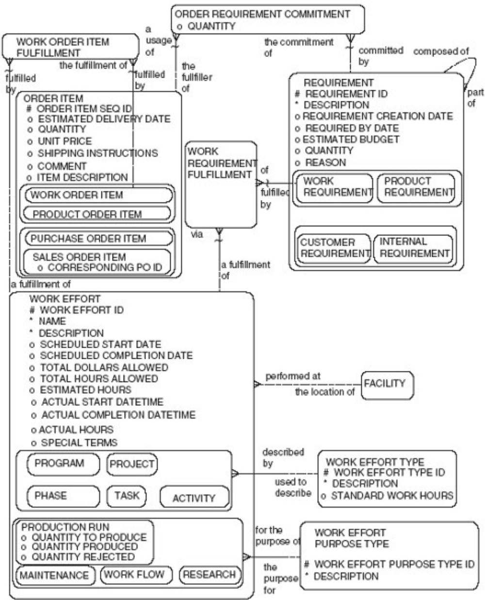

The WORK ORDER ITEM will usually result from WORK REQUIREMENTS; however, it could result from certain PRODUCT REQUIREMENTS such as for products that need to be manufactured. The work effort may be fulfilling an internal commitment to do work, or it may be fulfilling an external requirement such as a SALES

ORDER ITEM. The work effort may result from scenarios such as these:

- A work requirement (as defined in the previous section).
- A customer orders an item that needs to be manufactured.
- A service that was sold now needs to be performed.
- A customer places an order to repair or service an item that was previously sold to him or her.

In addition to defining the basic information for a WORK EFFORT, the model also keeps track of WORK EFFORT TYPE, WORK EFFORT PURPOSE TYPE, and the FACILITY where the work takes place.

Work Effort Type and Work Effort Purpose Type

In order to fulfill the requirement of either a work requirement or a work order item, the WORK EFFORT entity is used. The WORK EFFORT is subtyped according to its level of detail. Possible subtypes include PROGRAM, PROJECT, PHASE, ACTIVITY, and TASK. The WORK EFFORT TYPE entity is used to include more types if necessary. The standard work hours attribute in WORK EFFORT TYPE is used to record the estimate of how many hours it would normally take to complete this effort.

A WORK EFFORT tracks the work to fix or produce something for manufacturing and involves the allocation of resources: people

(labor), parts (inventory), and fixed assets (equipment). Therefore each WORK EFFORT may be for the purpose of a WORK EFFORT PURPOSE TYPE. Subtypes for WORK EFFORT PURPOSE TYPE include MAINTENANCE, PRODUCTION RUN, WORK FLOW, and RESEARCH. The work effort may be a MAINTENANCE effort, such as performing preventive maintenance on various pieces of equipment. It could be a PRODUCTION RUN to fulfill an immediate or anticipated request. The quantity to produce maintains the expected quantity for the production run, and the quantity produced records the actual production from that production run. Another purpose for a work effort is a WORK FLOW, which indicates that there is a task or effort that was assigned in the process of doing business, perhaps by a work flow system. RESEARCH would indicate that the work effort is needed to track the researching of some type of question—for example, the reason why a customer had a certain credit status.

# Work Effort Attributes

Other information that an enterprise may want to record about the WORK EFFORT could include a name for the overall effort (such as a project name) and a detailed description of the effort. To facilitate project tracking, the enterprise may also want to list a scheduled start date, scheduled completion date, and estimated hours for the effort. The actual start datetime, actual completion datetime, and actual hours are stored to

track efficiency of efforts. If there is a need for any special terms that anyone needs to know about, those can be recorded as well.

Some institutions have other considerations that need to be considered. Funding or time limits may be imposed under certain circumstances by various agencies, so the model includes attributes to store total dollars allowed and total hours allowed. An example of this would be IRS regulations restricting the amount of time a contractor can work for an enterprise without being considered an employee. Also, many government-funded organizations have spending limits set by budget appropriations or even by law.

Fulfillment of Work Requirements

Each requirement to do work may be fulfilled by work efforts. Depending on the nature of the work requirement and how much data the enterprise has the will and means to capture, the work requirement may be either directly related to the work effort or related to an order item that, in turn, is related to a work effort.

For example, if there is a requirement from a customer to have certain work performed—for instance, the customer may have specified a need to build a specific application system—the enterprise would want to record the REQUIREMENT, relate it to the

ORDER ITEM (which it obtained, we hope), and then track the corresponding work effort(s). The many-to-many relationships from REQUIREMENT to ORDER ITEM and then from ORDER ITEM to WORK EFFORT provide a very flexible structure to map requirements, to commitments (orders), and then to the corresponding projects (work efforts).

If there was an internal need to complete work—for instance, a repair to a piece of machinery—then the enterprise may want only to capture the WORK REQUIREMENT and corresponding WORK EFFORTs. The associative entity, WORK REQUIREMENT FULFILLMENT, between WORK REQUIREMENT and WORK EFFORT, allows work requirements to be combined into a single effort or a single requirement to be managed in several work efforts.

As indicated by the data in Table 6.4, a single work effort may have originated from one or more work requirements, or the corresponding work effort may be originated from an ORDER ITEM or a WORK REQUIREMENT. The ORDER ITEM will typically be from a sales order and not a purchase order because sales orders, especially for services, more typically create a need to track a work effort. The enterprise usually will not track work efforts for items that they have purchased, although it may happen if the work effort is large enough and it is important for the purchaser to track the progress of the delivery.

Table 6.4 Work Efforts from Work Requirement

<table><tr><td>WORK EFFORT ID</td><td>NAME</td><td>DESCRIPTION</td><td>SCHEDULED START DATE</td><td>WORK REQUIREMENT</td></tr><tr><td>28045</td><td>Production run</td><td>Production run of 3,500 pencils</td><td>June 1, 2000</td><td>Work Requirement Item #50985 Anticipated demand of 2,000 custom-engraved black pens with gold trim</td></tr><tr><td></td><td></td><td></td><td></td><td>Work Requirement Item #51245 Anticipated demand of 1,500 custom-engraved black pens with gold trim</td></tr><tr><td>51285</td><td>Production run</td><td>Production run of 1,500 pencils</td><td>Dec 5, 2000</td><td>Work Requirement Item #51285 Anticipated demand of 3,000 custom-engraved black pens with gold trim</td></tr><tr><td>51298</td><td>Production run</td><td>Production run of 1,500 pencils</td><td>Dec 6, 2000</td><td></td></tr><tr><td>32898</td><td>Fix engraving machine</td><td>Repair engraving machine #12 because it may not be powered up</td><td>Dec 12, 2000</td><td>Repair of engraving machine</td></tr><tr><td>39409</td><td>Sales and marketing plan development</td><td>Develop a sales and marketing plan for 2002 including sales projections, channel distribution strategy, and competitive analysis</td><td>Dec 15, 2000</td><td>Work Requirement #60102 Develop sales and marketing plan for 2002</td></tr></table>

The model shows a many-to-many relationship from REQUIREMENT to ORDER ITEM. There may be a sales order that has an item for 1,000 items. Management may decide to manage this as three separate work efforts and perhaps create three production runs in separate plants in order to generate the inventory needed to fulfill this one order. Likewise, an internal work requirement to revamp an enterprise's computer systems could be divided into multiple projects in order to phase the development effort.

Table 6.4 contains data samples for some scenarios of how a work effort originated. Several requirements may be combined into a single work effort, as shown in the first two rows of Table 6.4. Requirement items #50985 and #51245, which may have come from different managers, are combined into a single production run. Conversely, a single requirement, for example #51285, may be fulfilled with two work efforts in order to better manage each of these production runs. This scenario may occur with other types of requirements being fulfilled by a single work effort or multiple work efforts originating from a single requirement.

Thus, the associative entity WORK REQUIREMENT FULFILLMENT handles this many-to-many relationship. The last two rows show the requirements and the corresponding work effort for fixing an engraving machine and developing a sales and marketing plan.

Table 6.5 provides an example of the data when a REQUIREMENT is mapped to an ORDER ITEM and then fulfilled with a WORK EFFORT. The requirement was from a customer who had a need for customized pens. This need was converted into a sales order item to produce 2,500 customized pens. The order item was fulfilled using two work efforts, namely production run #1 and production run #2.

Table 6.5 Work Efforts Originated from Order Items

<table><tr><td>WORK EFFORT ID</td><td>NAME</td><td>DESCRIPTION</td><td>SCHEDULED START DATE</td><td>ORDER ITEM</td><td>REQUIREMENT ITEM</td></tr><tr><td>29534</td><td>Production run #1 of pens</td><td>Production of 1,500 customized engraved pens with gold lettering</td><td>Feb 23, 2001</td><td>Sales Order Item to produce 2,500 customized engraved pens</td><td>Need for customized pens</td></tr><tr><td>29874</td><td>Production run #2 of pens</td><td>Production of 1,000 customized engraved pens with gold lettering</td><td>Mar 23, 2001</td><td>Sales Order Item to produce 2,500 customized engraved pens</td><td>Need for customized pens</td></tr></table>

Work Effort and Facility

A final question to ask is: Where is the WORK EFFORT going to take place? As shown in Figure 6.3a, the WORK EFFORT may be performed at or associated with one and only one FACILITY.

As stated in the discussion of WORK EFFORT, some parts of the work effort may not happen at the main site. Take for example a project to develop a sales and marketing plan for the enterprise. The effort is associated with a main office where the headquarters are located. Various tasks associated with this effort, such as interviews, may happen at a branch office, while others, such as writing up the report, happen at the main office. For the tasks that do not occur in the main office, there may be a desire to record that secondary work location. The optional relationship to FACILITY from WORK EFFORT may occur at any level in the WORK EFFORT breakdown (because work efforts are defined recursively). For those efforts that have no facility association, it is assumed that they occur at the main facility associated with the parent WORK EFFORT (or that location is immaterial in this case).

The FACILITY is used because these work efforts may happen at an actual physical structure such as a particular building, room, or floor. The enterprise may need another relationship (which is not shown here), from WORK EFFORT to POSTAL ADDRESS, just in case the facility is not stored and there is simply an address that is known.

Work Effort Generation—Alternate Model

Some organizations do not have a need to maintain which requirements are fulfilled by which order items. They may, however, have internal requirements and associated work efforts that fulfill these work requirements. Figure 6.3b provides an alternate model for work effort generation to handle this type of situation.

Figure 6.3b Work effort generation—alternate model.

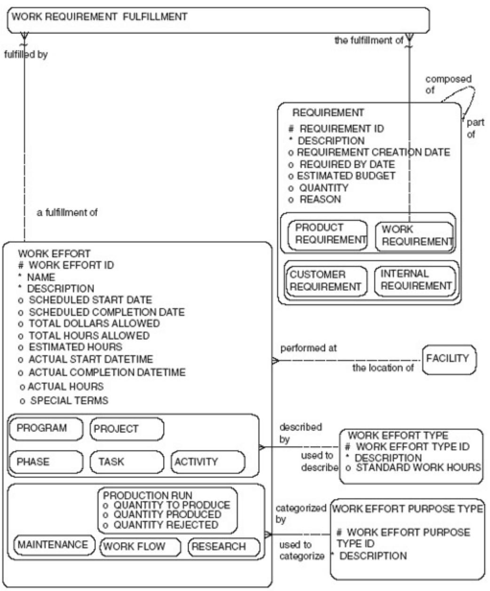
Work Effort Associations

Work efforts may be defined at various levels of detail and broken down in different ways. Each subtype of WORK EFFORT may be related to different subtypes depending on the circumstances. For instance, to manage programs within an enterprise and associated

internal projects PROGRAMs may be broken down into PROJECTs, which may be broken down into ACTIVITYs, which may be broken down into TASKs. For a production run, a JOB may be broken down into ACTIVITYs—for instance, as in a production run. Tasks are the activities or steps that need to occur to accomplish a work effort. For any WORK EFFORT there may be any number of WORK EFFORTs that may be broken down into any number of other WORK EFFORTs. In addition, for some tasks there may also be a WORK EFFORT DEPENDENCY, meaning that one effort may need to be performed before another task, which is maintained in the WORK EFFORT PRECEDENCY. Another type of dependency is that one effort may need to be done concurrently with the other effort that is maintained in the WORK EFFORT CONCURRENCY. The one-to-many recursion around WORK EFFORT provides for work efforts to be redone by other work efforts and to capture this relationship (see Figure 6.4).

Figure 6.4 Work effort breakdown.


Work Effort Association Definition

Table 6.6 shows the work efforts for a job of producing pencils on a particular production run. Included in the data are the attributes for scheduled start date and scheduled completion date and the estimated hours. These tasks will be useful for planning staff and

equipment assignments (discussed in a later section). Included are scheduled work efforts and the sub-efforts that make up each work effort. Job #28045, which is a production run of pens, has four activities related to it. Notice that the first activity of setting up a production line is an activity not only of this production run but also of the next production run. Hence, each work effort may be made up of many other work efforts, and conversely each work effort may be used within one or more other work efforts. This many-to-many recursion is handled by the WORK EFFORT ASSOCIATION entity in the model, and Table 6.6 shows how work efforts are related to other work efforts. The WORK EFFORT TYPE carried out by the enterprise may track the standard work hours usually spent on this type of effort. Notice that the estimated hours of the WORK EFFORT may be different from the standard work hours because particular circumstances are involved in the execution of the task (perhaps the project manager knows that very efficient workers will be assigned and will therefore lower the estimate).

Table 6.6 Work Effort Breakdown Data

<table><tr><td>WORK EFFORT ID (JOB)</td><td>WORK EFFORT SUB-TYPE</td><td>WORK EFFORT DESCRIPTION</td><td>ASSOCIATED WORK EFFORT(S) ID AND DESCRIPTION</td><td>STANDARD WORK HOURS</td><td>SCHEDULED START DATE</td><td>SCHEDULED COMPLETION DATE</td><td>ESTIMATED HOURS</td></tr><tr><td>28045</td><td>Job</td><td>Production run #1</td><td></td><td></td><td>Jun 1, 2000</td><td>Jun 4, 2000</td><td></td></tr><tr><td>120001</td><td>Activity</td><td>Set up production line</td><td>28045 Production run #1 51245 Production run #2</td><td>20</td><td>Jun 1, 2000</td><td>Jun 2, 2000</td><td>20</td></tr><tr><td>120002</td><td>Activity</td><td>Operate machinery</td><td>28045 Production run #1</td><td>10</td><td>Jun 3, 2000</td><td>Jun 3, 2000</td><td>10</td></tr><tr><td>120003</td><td>Activity</td><td>Clean up machinery</td><td>28045 Production run #1</td><td>5</td><td>Jun 4, 2000</td><td>Jun 4, 2000</td><td>5</td></tr><tr><td>120004</td><td>Activity</td><td>Quality assure goods produced</td><td>28045 Production run #1</td><td>10</td><td>Jun 3, 2000</td><td>Jun 4, 2000</td><td>10</td></tr><tr><td>3454587</td><td>Task</td><td>Move pen manufacturing machinery in place</td><td>1200 Set up production line</td><td>5</td><td>Jun 1, 2000</td><td>Jun 1, 2000</td><td>4</td></tr><tr><td>3454588</td><td>Task</td><td>Move raw materials in place for production run</td><td>1200 Set up production line</td><td>8</td><td>Jun 1, 2000</td><td>Jun 1, 2000</td><td>7</td></tr><tr><td>3454589</td><td>Task</td><td>Set up assembly line rollers</td><td>1200 Set up production line</td><td>7</td><td>Jun 1, 2000</td><td>Jun 1, 2000</td><td>6</td></tr></table>

# Work Effort Dependency

The WORK EFFORT DEPENDENCY entity allows the enterprise to track the fact that some efforts may not be a breakdown of other efforts but may actually be dependent on other efforts. For example, the task "operate machinery" cannot be executed until the task "set up production line" is completed. The WORK EFFORT DEPENDENCY entity provides a method for relating work efforts with other work efforts. Work efforts may be dependent on each other in different ways. In the example regarding "operate machinery" and "set up production line," the second effort must be preceded by the completion of the first task and is a WORK EFFORT PRECEDEENCY subtype. Other situations may occur where two tasks need to be executed in parallel. In that case, the WORK EFFORT CONCURRENCY subtype would be used.

Work Efforts and Work Tasks

An alternative to using the WORK EFFORT ASSOCIATION could be to show a WORK EFFORT with a one-to-many relationship to a separate entity, WORK TASK (with a recursion around WORK TASK) in order to distinguish the whole project from its individual phases, activities, tasks, and so on. The issue with this model is that there are usually many similarities between the whole work effort and its parts. For instance, parties, inventory, and fixed assets may be assigned to a whole project (a work effort) or an individual task. The benefit of having a WORK EFFORT that is recursively associated with other WORK EFFORTs, is that work efforts may be dynamically linked to other work efforts as needed.

# Work Effort Party Assignment

In order for the WORK EFFORT to be completed, certain resources need to be made available. Parties, inventory, and equipment may need to be assigned to WORK EFFORTs at different levels of detail. For instance, people may need to be assigned roles at a high level, such as a program or project, and roles may also be assigned at more detailed levels of activity. This section discusses the assignment of parties to WORK EFFORTs. It includes the entities WORK EFFORT PARTY ASSIGNMENT, WORK EFFORT ROLE TYPE, PARTY SKILL, SKILL TYPE, WORK EFFORT STATUS, and WORK EFFORT STATUS TYPE (see Figure 6.5).

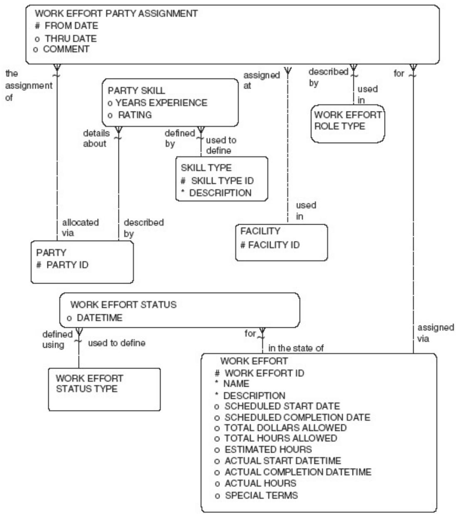
Figure 6.5 Work effort party assignment.

# Work Effort Party Assignment

For planning and scheduling purposes, the model includes a means by which people, or groups of people, can be assigned or allocated to a WORK EFFORT. This is accomplished through the WORK

EFFORT PARTY ASSIGNMENT entity (refer to Figure 6.5). With this it is possible to assign parties to work efforts in various roles as well as at various levels of the work effort. Table 6.7 gives examples of the data available when the relationships are resolved.

Table 6.7 Work Effort Party Assignment Data

<table><tr><td>WORK EFFORT ID AND DESCRIPTION</td><td>PARTY</td><td>WORK EFFORT ROLE TYPE</td><td>FROM DATE</td><td>THRU DATE</td><td>COMMENT</td></tr><tr><td>39409 Develop a sales and marketing plan</td><td>Dick Jones</td><td>Project manager</td><td>Jan 2, 2001</td><td>Sept 15, 2001</td><td></td></tr><tr><td></td><td>Bob Jenkins</td><td>Project administrator</td><td></td><td></td><td></td></tr><tr><td></td><td>John Smith</td><td>Team member</td><td>Mar 5, 2001</td><td>Aug 6, 2001</td><td>Leaving for three-week vacation on Aug 7, 2001</td></tr><tr><td></td><td>John Smith</td><td>Team member</td><td>Sept 1, 2001</td><td>Dec 2, 2001</td><td></td></tr><tr><td></td><td>Jane Smith</td><td>Team member</td><td>Aug 6, 2000</td><td>Sept 15, 2001</td><td>Very excited about assignment</td></tr><tr><td>29000 Develop project plan (part of effort 39409)</td><td>Dick Jones</td><td>Creator</td><td>Jan 2, 2001</td><td>Jan 4, 2001</td><td></td></tr><tr><td>29000 Develop project plan (part of effort 39409)</td><td>Bob Jenkins</td><td>Data entry in system</td><td>Jan 4, 2001</td><td>Jan 4, 2001</td><td></td></tr><tr><td>29003 Conduct initial interviews (part of effort 39409)</td><td>John Smith</td><td>Performer</td><td>Jan 5, 2001</td><td>Feb 5, 2001</td><td></td></tr><tr><td>29005 Conduct market research (part of effort 39409)</td><td>USA Consulting</td><td>Outsourcing responsibility</td><td>Mar 1, 2001</td><td>Jul 1, 2001</td><td>Contracted outside</td></tr></table>

Dick Jones is shown as being assigned as the project manager to the sales and marketing plan development work effort, with Bob Jenkins being the project administrator. John Smith is assigned to the project

from March 5, 2001 to August 6, 2001 and then not assigned for a good part of August due to a vacation, then assigned again from September 1, 2001 through December 2, 2001. Dick, the project manager, can see that there will be a three-week period when John Smith is not assigned to this effort (between August 6 and September 1) and has assigned an employee, Jane Smith, with a lot of interest in this work effort, to be scheduled for this effort during this time period. With this information the manager will know not to assign John to any critical tasks that must be completed in August.

Additionally, the data indicates that for work effort #39409 there are additional work efforts within the overall work effort. One work effort is to develop a project plan that has two parties assigned to it. Dick Jones, the project manager, is responsible for developing the plan, and his assistant, Bob Jenkins, is responsible for entering it into the project management system. John Smith is assigned the effort of conducting initial interviews. An outside contracting firm is allocated to the project for four months; its responsibility is to do market research. Thus the data structure allows for efforts to be completely outsourced with no internal employee actually assigned to the work, only a particular organization. In this case, the internal manager is not concerned with who does the work, only that it be well managed and tracked with this outside firm. This illustrates the reason why parties are assigned to work efforts and not just persons.

# Party Skill and Skill Type

When scheduling these assignments, managers need to know the qualifications of prospective parties. This can be handled using the PARTY SKILL and SKILL TYPE entities. PARTY SKILL contains a list of parties, skill types, years of experience, and a skill rating. Table 6.8 contains sample data.

Table 6.8 Party Skill Data

<table><tr><td>PARTY</td><td>SKILL TYPE</td><td>YEARS OF EXPERIENCE</td><td>RATING</td></tr><tr><td>John Smith</td><td>Project management</td><td>20</td><td>10</td></tr><tr><td></td><td>Marketing</td><td>5</td><td>6</td></tr><tr><td>Dick Jones</td><td>Project management</td><td>12</td><td>8</td></tr><tr><td>USA Consulting</td><td>Market research</td><td>25</td><td>10</td></tr><tr><td></td><td>Sales analysis</td><td>15</td><td>7</td></tr><tr><td></td><td>Data warehousing</td><td>5</td><td>5</td></tr></table>

As indicated by the data, skills are associated not only with people but with companies as well (this is why the entity is PARTY SKILL, not PERSON SKILL). This information could be vital to project managers who are staffing new efforts. If no people within the enterprise are available for use, the manager can evaluate outside agencies for their ability to support the effort in question.

Additionally, for people who have not already been allocated, this information can be used to determine appropriate work effort assignments. Years experience tells how many years that the person or organization has been involved in this skill. It may seem

that this is derivable data from the start date that one started using a skill; however, skills are often used on and off within a time frame, and often the data in this attribute is subjective. The rating indicates how proficient the party is in the skill, and this may also be subjective.

# Work Effort Status

Another required piece of information is the status of the work effort. It is through the association to WORK EFFORT STATUS that the status for WORK EFFORT is maintained. The status of the work effort may have an effect on the REQUIREMENT STATUS (see Figure 4.9); however, they may also be independent of each other. For instance, a status of "completed" on the work efforts required to implement a requirement may lead to the requirement having a status of "fulfilled." They, however, may have different unrelated statuses, such as the requirement having a status of "approved" and the work effort having a status of "in progress."

Some example data for work effort statuses is provided in Table 6.9.

Table 6.9 Work Effort Statuses

<table><tr><td>WORK EFFORT ID</td><td>WORK EFFORT SUBTYPE</td><td>WORK EFFORT DESCRIPTION</td><td>ASSOCIATED WORK EFFORT(S) ID AND DESCRIPTION</td><td>SCHEDULED START DATE</td><td>SCHEDULED END DATE</td><td>WORK EFFORT STATUS</td></tr><tr><td>28045</td><td>Job</td><td>Production run #1</td><td></td><td>Jun 1, 2000</td><td>Jun 4, 2000</td><td>In progress</td></tr><tr><td>120001</td><td>Activity</td><td>Set up production line</td><td>28045 Production run #151245 Production run #2</td><td>Jun 1, 2000</td><td>Jun 2, 2000</td><td>Started Jun 2 2000, 1PM Completed June 2, 2000 2PM</td></tr><tr><td>120002</td><td>Activity</td><td>Operate machinery</td><td>28045 Production run #1</td><td>Jun 3, 2000</td><td>Jun 3, 2000</td><td>Started Jun 3 2000 1 PM Completed Jun 3 2000 4PM</td></tr><tr><td>120003</td><td>Activity</td><td>Clean up machinery</td><td>28045 Production run #1</td><td>Jun 4, 2000</td><td>Jun 4, 2000</td><td>Started Jun 4, 9AM Completed June 4 10AM</td></tr><tr><td>120004</td><td>Activity</td><td>Quality assure goods produced</td><td>28045 Production run #1</td><td>Jun 3, 2000</td><td>Jun 4, 2000</td><td>Pending</td></tr></table>

Based on this data, the status for any level of the work effort may be available. A manager could see that the work effort is still in progress, that three of the four activities have been completed, and that the last activity of quality assuring the goods has not yet been completed. Because there are many statuses for any work effort, the data can also show when work efforts were started, completed, or underwent any other status at any point in time.

# Work Effort Party Assignment

This entity allows a WORK EFFORT to be assigned to one or more PARTYs in order to allow different roles or just allow many people to be assigned in order to accomplish the effort faster. If desired, an

enterprise could put in place business rules that require parties to be assigned at the top level of the effort—for example, the overall project—in order to be assigned to lower levels of responsibility. For this reason, a scheduled start date and scheduled completion date are included as attributes of the work effort in order to schedule parties or record what actually occurred in terms of their assignment. For instance, a person may be assigned to a work effort, and then the dates of the scheduled assignment may change until the person is actually working on the effort. The scheduled completion date is optional to handle such things as ongoing service contracts or people who are assigned indefinitely to an effort until they are notified otherwise. Because an enterprise may also wish to track such things as assignment extensions, the from date is also included in the primary key of WORK EFFORT PARTY ASSIGNMENT, allowing more than one assignment for the same PARTY and WORK EFFORT.

Work Effort Role Type

Because many parties could be assigned to a single effort, some other information that may be important to track would be the role a particular party plays in a work effort. This is tracked by selecting the appropriate WORK EFFORT ROLE from the entity WORK EFFORT ROLE TYPE and assigning this role to a particular PARTY. This information is especially useful when one party fills multiple roles, as

is often the case, or for identifying who does what on a task that requires a team of people. Possible roles could be "supervisor," "analyst," "laborer," "quality assurer," or "contractor."

Work Effort Assignment Facility

The relationship from WORK EFFORT PARTY ASSIGNMENT to FACILITY appears even though each work effort (and their sub-work efforts) may also be related to a facility. Why is that? This optional relationship is there to handle efforts that must be completed in what is now a very mobile society. With the increase in telecommuting, there is no longer any assurance, or requirement, that a particular work effort or part of a work effort must always be in a particular location. Take, for example, the task of building a complex data warehouse model for a large corporation. This task could involve many data modelers as well as business analysts. It is entirely conceivable that they could all work remotely from home offices, communicating with each other and the client via fax, e-mail, and voice mail. In this case, the facility that each individual is using is associated with the individuals assigned to the work effort.

Instead of a relationship to FACILITY, should the CONTACT MECHANISM for that party be used as the location for the WORK EFFORT PARTY ASSIGNMENT? It may very well be that only a postal address or e-mail address is known for that party. If the FACILITY of

the assignment is sometimes not known, the CONTACT MECHANISM could be added as another relationship to the WORK EFFORT PARTY ASSIGNMENT.

For WORK EFFORTs that have no location recorded for them, it is assumed that they occur at the facility associated with the parent WORK EFFORT or that the location is immaterial.

Work Effort Time Tracking

Tracking time entries is critical to many organizations, and a model for this is shown in Figure 6.6. The TIME ENTRY entity is, of course, very important for payroll, but it is also important for task tracking, cost determination, and perhaps client billing. This entity quite simply holds information about how much time was spent during a given period on various WORK EFFORTs. Included in this information are the from datetime, thru datetime, and the hours worked in order to capture the time frame and amount of hours worked. Each TIME ENTRY may be part of a TIMESHEET that may record many time entries. Each TIME ENTRY may be for a particular WORKER, which is a PARTY ROLE, namely anyone who performs work, and may be an EMPLOYEE or a CONTRACTOR. Each TIMESHEET may have several other PARTYs in various TIME-SHEET ROLES categorized by TIMESHEET ROLE TYPES such as "approver," "manager," "enterer."


Figure 6.6 Work effort time tracking.

The model shows that each WORKER may be submitting many TIME-SHEETs over time, which are each composed of TIME ENTRYs for a particular period of time. Each TIME ENTRY is within a TIMESHEET and also tied back to a WORK EFFORT, which determines the effort to which time is charged.

Why not relate the TIME ENTRY to a WORK EFFORT PARTY ASSIGNMENT, as the time entry must be attributed to a PARTY that is assigned to a WORK EFFORT? The reason that TIME ENTRYs are not directly related to WORK EFFORT PARTY ASSIGNMENTS is that this would result in redundantly storing the PARTY of the time entry. The PARTY of the time entry is already identified, as a TIME ENTRY is within a TIMESHEET for the hours of a WORKER, which must be for a PARTY.

If other units of measures are needed for time entries aside from hours, such as the number of days, then instead of an hours attribute, the attribute should be quantity with a relationship to UNIT OF MEASURE.

Table 6.10 contains sample time entry data. Dick Jones submitted a time-sheet covering the period of January 1, 2001 to January 15, 2001. He had two time entries to develop a plan and to identify potential team members. The first task was worked on from January 2 to January 4, and 13 hours were worked; the second was from January 5 to January 6, and 7 hours were used. John Smith had two time entries totaling 36 hours on one timesheet, consisting of two time entries for the February 1–February 16 period and another 45 hours for the next time period for one of the same tasks, "Conduct Initial Interviews." Depending on how granular time entries are, there may be several time entries for the same work effort and even

within the same time period. For instance, if time entries were recorded each day, there may have been several time entries for "Conduct Initial Interviews" for John Smith, one time entry for each day.

Table 6.10 Timesheet and Time Entry Data

<table><tr><td>TIMESHEET ID</td><td>TIME SHEET FROM DATE</td><td>TIME SHEET THRU DATE</td><td>PARTY</td><td>WORK EFFORT ID</td><td>TIME ENTRY FROM DATETIME</td><td>TIME ENTRY THRU DATETIME</td><td>HOURS</td></tr><tr><td>1390</td><td>Jan 1, 2001</td><td>Jan 15, 2001</td><td>Dick Jones</td><td>29000 Develop project plan (part of effort 39409)</td><td>Jan 2, 2001</td><td>Jan 4, 2001</td><td>13</td></tr><tr><td></td><td></td><td></td><td></td><td>29005 Identify potential team members for project</td><td>Jan 5, 2001</td><td>Jan 6, 2001</td><td>7</td></tr><tr><td>1200</td><td>Feb 1, 2001</td><td>Feb 15, 2001</td><td>John Smith</td><td>29003 Conduct initial interviews</td><td>Feb 1, 2001</td><td>Feb 5, 2001</td><td>30</td></tr><tr><td></td><td></td><td></td><td></td><td>294395 Facilitate monthly goals Session</td><td>Feb 6, 2001</td><td>Feb 6, 2001</td><td>6</td></tr><tr><td>1450</td><td>Feb 16, 2001</td><td>Mar 1, 2001</td><td>John Smith</td><td>29003 Conduct initial interviews</td><td>Feb 16, 2001</td><td>Mar 1, 2001</td><td>45</td></tr></table>

# Work Effort Rates

In addition to tracking time, many applications need to track the rate and/or cost of the work effort. If the work effort is for professional services that will be billed, then it is very important to track the rate that will be charged for the effort. Alternatively, there may be a cost of doing work, for instance, to establish the cost of performing various business operations.

Figure 6.7 shows a model to capture the rates and/or costs associated with work efforts. Rates and costs may be based on three factors: the rate/cost established for a particular party, the rate/cost established for a certain type of position (the position of “assembly

line worker" may have a standard rate), or the rate/cost established for the work effort assignment.


Figure 6.7 Work effort rates.

There may be more than one rate/cost for each of these factors because the rates/costs may change over time. Therefore, each

WORK EFFORT PARTY ASSIGNMENT may have many WORK EFFORT ASSIGNMENT RATES (over time). Also, because sometimes rates are established by the person or organization conducting the effort (John Smith's rate is $180 per hour), each PARTY (PERSON or ORGANIZATION) may have many PARTY RATES over time. And because many times a position dictates the rate (a senior consultant's rate is $250 per hour) each POSITION may have several rates over time.

The RATE TYPE entity provides the ability to classify the various types of rates to allow the flexibility to capture different types of rates such as billing rates, payroll rates (amount that needs to be paid to the worker), costs, overtime rates, and so on.

Each RATE entity may store a rate, overtime rate, cost, or other type of rate depending on the needs of the organization. The RATE TYPE would indicate which rate is being specified. A RATE TYPE

description of “billing rate” establishes how much is billed and whether it is to be billed to an external or internal organization. A RATE TYPE description of “cost” determines how much will be used as the cost basis to calculate how much the work is costing.

Depending on the application, either or both of these are needed. For instance, a professional services application may store both because it needs to know its cost for the professional as well as the rate charges to the client. A manufacturing firm may need to store

the cost of the people who are assembling a product, and it may or may not need the rate attribute. For instance it may want to track rates to establish how much to charge another part of the organization (this would be an internal transaction for accounting purposes).

Work Effort Assignment Rate

The entity WORK EFFORT ASSIGNMENT RATE is used to record the rates and/or costs charged to a particular party working on a work effort (WORK EFFORT PARTY ASSIGNMENT). The rate or cost may come from the rate assigned to a party or a position, or it may be maintained for the specific work effort, depending on the enterprise's business rules. The entity has a from date and thru date to allow for the recording of multiple rates for an assignment over time. The relationship to RATE TYPE provides the ability to record various kinds of rates against an assignment such as for billing rates, costs, regular time, overtime, second shift, third shift, and so on.

Table 6.11 shows examples of rate data.

Table 6.11 Work Effort Rate Data

<table><tr><td>WORK TASK</td><td>PARTY</td><td>RATE TYPE</td><td>FROM DATE</td><td>THRU DATE</td><td>RATE</td></tr><tr><td>Develop Gary Smith accounting program</td><td></td><td>Regular billing</td><td>May 15, 2000</td><td>May 14, 2001</td><td>$65.00</td></tr><tr><td></td><td></td><td>Overtime billing</td><td>May 15, 2000</td><td>May 14, 2001</td><td>$70.00</td></tr><tr><td></td><td></td><td>Regular pay</td><td>May 15, 2000</td><td>May 14, 2001</td><td>$40.00</td></tr><tr><td></td><td></td><td>Overtime pay</td><td>May 15, 2000</td><td>May 14, 2001</td><td>$43.00</td></tr><tr><td></td><td></td><td>Regular pay</td><td>May 15, 2001</td><td></td><td>$45.00</td></tr><tr><td></td><td></td><td>Overtime pay</td><td>May 15, 2001</td><td></td><td>$45.00</td></tr></table>

As the example shows, there are four different rate types recorded for Mr. Smith: "regular billing" rate, an "overtime billing" rate, a "regular pay" rate, and an "overtime pay" rate. The "regular billing" and "overtime billing" rate types determine how much to charge clients for Gary Smith's time. The "regular pay" and "overtime pay" determine how much to pay Gary Smith.

These rates may have been determined for that work effort, they may have been derived from Gary Smith's normal rate, they may have been derived from Gary Smith's position in the organization, or they may have been derived from a combination of these factors. Using the information for the billing rates, it would be easy to calculate how much to charge the client for Gary Smith's time, or pay Gary Smith, by multiplying his hours from the TIME ENTRY times the appropriate rate type.

Note that business rules need to be in place to ensure that the rates used are for the same time period as the hours being charged for. There are also business rules needed to determine what rate should

be used if more than one rate applies—for example, if Gary Smith has rates for his position, for him and for his work effort party assignment. Also there is a need to put business rules in place to determine what constitutes overtime work.

Notice also in the table that Mr. Smith has an increase in pay rate recorded to be effective on May 15, 2001. There is no thru date. This indicates that the rate will be good until the end of the assignment. Also, note that the "overtime pay" is the same as the "regular pay" after the increase occurs. This would indicate that the enterprise may have automated rules on when to pay overtime, but in this case Mr. Smith no longer gets a higher rate. By recording the second rate, the payroll process that calculates his check does not need to be changed; it will simply calculate his overtime pay as always, but it effectively is at the same rate.

# Inventory Assignments

In order to complete certain work efforts, raw materials or other items may be required. Figure 6.8 shows the intersection entity WORK EFFORT INVENTORY ASSIGNMENT between WORK EFFORT and INVENTORY ITEM. This tracks the actual use of inventory during the execution of a work effort. Table 6.12 shows the data that might be associated with assembling pencil components, which is a task (a

type of work effort) within a larger work effort to produce 100 pencils.


Figure 6.8 Inventory assignments.

Table 6.12 Inventory Assignment

<table><tr><td>WORK EFFORT</td><td>INVENTORY</td><td>ITEMQUANTITY</td></tr><tr><td>Assemble pencil componentsPencil cartridges</td><td>100</td><td></td></tr><tr><td>Assemble pencil componentsErasers</td><td>100</td><td></td></tr><tr><td>Assemble pencil componentsLabels</td><td>100</td><td></td></tr></table>

As indicated by the data shown, this one task (assemble pencil components) used three different items from inventory to be completed. For each item used, a quantity of 100 was used. When this work effort uses inventory, business processes need to be in place to ensure that the inventory information is updated to reflect the depletion from inventory.

# Fixed Asset Assignments

As with inventory, some work efforts will require various pieces of equipment, machinery, vehicles, or property in order to be completed. These are called FIXED ASSETS in this model (see Figure 6.9). This entity shows several subtypes of interest: PROPERTY, VEHICLE, EQUIPMENT, and OTHER FIXED ASSETS. In addition, other asset types may be identified within the entity FIXED ASSET TYPE. In order to track when and for what an asset is being used, the model includes the entity WORK EFFORT FIXED ASSET ASSIGNMENT. To further establish the state of the assignment, a reference to WORK EFF ASSET ASSIGNSTATUS TYPE is used.

Figure 6.9 Fixed asset assignments.

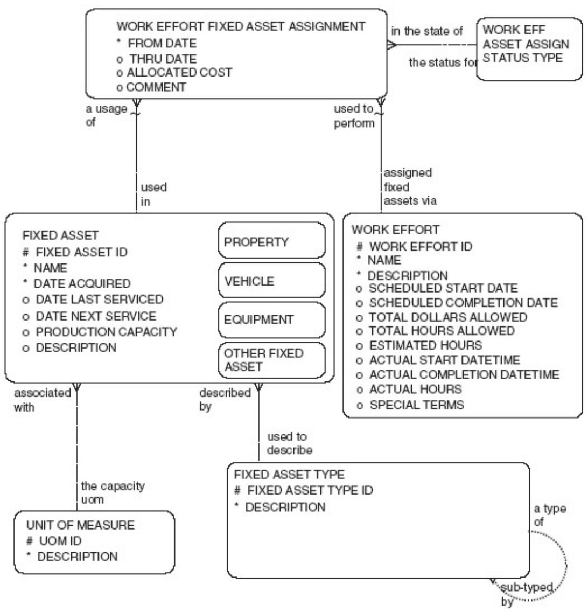

# Fixed Asset

Other information stored in FIXED ASSET that may be of interest to an enterprise includes the asset ID, a name for identification, date acquired, which was established when the asset was acquired (important for depreciation, which is discussed in Chapter 8, Figure 8.5), date last serviced, which may not be needed if this can be derived from maintenance records (which are work efforts), and

date next service, which is when the next service is scheduled. The production capacity maintains a value for the asset's production capabilities and a relationship to UNIT OF MEASURE, that allows this capacity to be maintained in various measurements such as the number of units that can be produced per day. Examples of data that could be found in FIXED ASSET are shown in Table 6.13.

Table 6.13 Fixed Asset Data

<table><tr><td>FIXED
ASSET ID</td><td>ASSET
TYPE</td><td>NAME</td><td>DATE
ACQUIRED</td><td>DATE LAST
SERVICED</td><td>DATE NEXT
SERVICE</td><td>PRODUCTION
CAPACITY</td><td>UOM</td></tr><tr><td>1000</td><td>Pencil-
making
machine</td><td>Pencil
labeler
#1</td><td>Jun 12, 2000</td><td>Jun 12, 2000</td><td>Jun 12, 2001</td><td>1,000,000</td><td>Pens/day</td></tr><tr><td>2266</td><td>Fork lift</td><td>Fork lift
#25</td><td>Mar 1, 1999</td><td>Mar 15, 2001</td><td>Aug 1, 2001</td><td>5</td><td>People</td></tr></table>

# Fixed Asset Type

Of course, many kinds of assets may be important to an enterprise for various reasons. These can be listed using the FIXED ASSET TYPE entity. Notice that there is a recursive relationship on this entity. This relationship allows for the detailed breakdown of the various asset types. As an example, take the fixed asset type of "equipment." The information that a given asset is a piece of equipment is probably not enough in some cases. It would be nice to know what kind of equipment it is, should it be needed for a work effort. In the same manner, it might be good to know that a

"vehicle" is a "minivan" and that the "minivan" is actually a "Ford Aerostar." Table 6.14 shows sample data for this entity.

Table 6.14 Fixed Asset Type Data

<table><tr><td colspan="3">FIXED ASSET TYPE IDDESCRIPTION PARENT ASSET TYPE</td></tr><tr><td>1000</td><td>Equipment</td><td></td></tr><tr><td>1390</td><td>Pencil-making machineEquipment</td><td></td></tr><tr><td>1458</td><td>Pen-making machine Equipment</td><td></td></tr><tr><td>1532</td><td>Paper-making machineEquipment</td><td></td></tr><tr><td>2000</td><td>Vehicle</td><td></td></tr><tr><td>2019</td><td>Truck</td><td>Vehicle</td></tr><tr><td>2188</td><td>Mac truck-18 wheels</td><td>Truck</td></tr><tr><td>2266</td><td>Fork lift</td><td>Vehicle</td></tr><tr><td>2356</td><td>Jet airplane</td><td>Vehicle</td></tr><tr><td>2567</td><td>Car</td><td>Vehicle</td></tr></table>

In the examples, there are three asset types ("pencil making machine," "pen making machine," "paper making machine") that roll up to a type of "equipment." In addition, there are several types of vehicles, "truck," "fork lift," "jet," and "car," that roll up to "vehicle." Then there is the type "Mac Truck-18 wheels," which is a type of "truck," which is a type of "vehicle." All of these are asset types. This model is flexible enough to allow as much detail as needed.

# Fixed Asset Assignment and Status

Because a machine or piece of equipment can usually be used only for one effort at a time, it is necessary to tell what is being used and when it is in use. Figure 6.9 shows the model for tracking this information. In it there is the WORK EFFORT FIXED ASSET ASSIGNMENT entity, which is at the intersection of WORK EFFORT and FIXED ASSET. In this entity are attributes for storing the start and end date for the assignment, which are the from date and thru dates. These will be very important for task scheduling purposes. In addition, there is a relationship to WORK EFFAsset ASSIGN STATUS TYPE. The status type will indicate such things as whether the assignment is "requested" or "assigned." The allocated cost attribute provides a record of how much cost was recorded to that work effort for the usage of that fixed asset. This information would be important to capture the costs incurred during any work efforts for usage of fixed assets.

Table 6.15 gives some examples.
Table 6.15 Fixed Asset Assignment Data

<table><tr><td>WORK EFFORT</td><td>FIXED ASSET</td><td>FROM DATE</td><td>THRU DATE</td><td>COMMENT</td></tr><tr><td>Label pencils</td><td>Pencil labeler #1</td><td>Jun 12, 2000</td><td>Jun 15, 2000</td><td></td></tr><tr><td>Move raw materials in place for production run</td><td>Fork lift #25</td><td>Apr 15, 2000</td><td>May 15, 2000</td><td>May need for longer time</td></tr><tr><td>Test database tool</td><td>Office laptop #2</td><td>Jul 1, 2000</td><td></td><td>Ongoing effort</td></tr></table>

Note that the from and thru dates for the assignment may not be the same as the scheduled start date and scheduled

completion date on the WORK EFFORT. A certain machine may be needed only for part of the work effort's life cycle. Business rules (or database constraints) need to be in place, however, to ensure that the equipment assignment is at least within the scheduled date range for the associated effort.

Party Fixed Asset Assignments

Besides being assigned to work efforts, assets can be assigned or checked out to a PARTY. During this time, it is not uncommon to hold the party responsible for the safekeeping or use of the asset in question. This association is depicted in Figure 6.9. Again, an intersection called PARTY FIXED ASSET ASSIGNMENT joins information from PARTY and FIXED ASSET (see Figure 6.10). Also related to this entity is PARTY ASSET ASSIGN STATUS TYPE, which provides additional information about the assignment. Sample data is provided in Table 6.16.

Figure 6.10 Party fixed asset assignments.

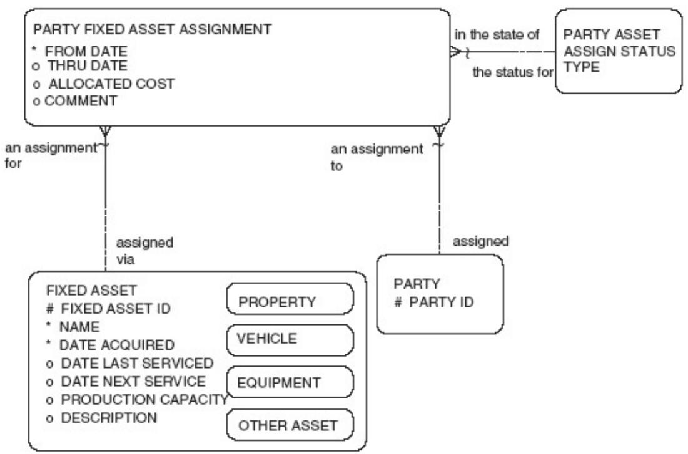

Table 6.16 Party Fixed Asset Assignment Data

<table><tr><td>PARTY</td><td>FIXED ASSET</td><td>START DATE</td><td>END DATE</td><td>STATUS</td></tr><tr><td>John Smith</td><td>Car#25</td><td>Jan 1, 2000</td><td>Jan 1, 2001</td><td>Active</td></tr><tr><td>Dick Jones</td><td>Tool set #5</td><td>Mar 15, 2000</td><td>Mar 15, 2000</td><td>Lost</td></tr></table>

Assignment data like this provides the enterprise with vital information for tracking the condition and whereabouts of its assets. In this case, the enterprise knows that John Smith has the truck known as "Truck #25" until January 1, 2001, so if they need to give someone else a car, they know that this car is not available. The data also shows that Dick Jones was assigned a particular tool set and that he lost it.

Work Effort Type Standards

In order to facilitate planning, this model includes additional entities to record various standards regarding different types of work efforts for the purposes of planning (see Figure 6.11). This data model provides information about what types of skills, what goods, and what types of fixed assets are needed for various types of work efforts. These metrics can be used to predict the resources needed for the scheduled work efforts, so that the organization can properly prepare.

Figure 6.11 Work effort type standards.


Figure 6.11 shows the standards that apply to each WORK EFFORT TYPE. Each WORK EFFORT TYPE may have standards regarding the types of skills that are generally needed to accomplish the effort (WORK EFFORT SKILL STANDARD), the type of goods or parts that are needed within the work effort (WORK EFFORT GOOD STANDARD), and the types of fixed assets needed to accomplish the work effort (WORK EFFORT FIXED ASSET STANDARD). These

standards would need to be determined by the enterprise and entered using these structures. This information can then be used for scheduling resources and estimating time and costs for each work effort. Additionally it can be used to compare actual skills, goods, and fixed asset usage against the standards.

Each of these standards entities has attributes that define expected needs for that type of work effort. The WORK EFFORT SKILL STANDARD maintains the estimated num people, which records how many people of that skill type are typically needed for that type of work effort. The estimated duration records how long the skill is needed for the work effort type. The estimated cost is an estimation of how much this type of skill will cost for the associated work effort type.

The WORK EFFORT GOOD STANDARD maintains an estimated quantity attribute, maintaining how many of each GOOD is typically needed, and an estimated cost attribute, maintaining the estimated cost that is expected for that type of work effort.

The WORK EFFORT FIXED ASSET STANDARD maintains an estimated quantity attribute to determine how many of the fixed assets are needed for the work effort type. The estimated duration maintains how long that fixed asset is typically needed for

the work effort type. The estimated cost maintains the anticipated cost for that type of work effort.

Similarly to WORK EFFORTs, each WORK EFFORT TYPE has associated WORK EFFORT TYPES that represent the standard WORK EFFORT TYPE BREAKDOWNs and WORK EFFORT TYPE DEPENDENCYs. These represent the standard types of efforts that normally make up a larger type of work effort as well as the standard dependencies that occur.

Figure 6.10 also shows that each WORK EFFORT TYPE may be characterized by the fact that it is used to repair a FIXED ASSET TYPE or to produce a certain DELIVERABLE or a certain PRODUCT.

Work Effort Skill Standards

The WORK EFFORT SKILL STANDARD entity provides the enterprise with information on how many people are needed with what skills, for how long, and what are the estimated costs. For a “large production run of pencils” there may be a skill of “foreman” for three hours with a cost of  $100 as well as a skill of “assembly line worker” for three people for three hours each with a cost of$ 200.

Work Effort Good Standards

The WORK EFFORT GOOD STANDARD entity relates WORK EFFORT TYPES to the GOODs that are typically needed for that work effort. If the PARTs model is used (Figure 2.10b), the entity PART would be substituted for GOOD. The entity includes an attribute for the estimated quantity required and an attribute for estimated cost. This information can be used for ensuring that enough of those goods exist in inventory to execute a particular work effort. Table 6.17 contains sample data for this entity.

Table 6.17 Work Effort Good Standard Data

<table><tr><td>WORK EFFORT TYPE</td><td>ITEM</td><td>ESTIMATED QUANTITY</td><td>ESTIMATED COST</td></tr><tr><td rowspan="2">Large production run of pencils</td><td>Erasers</td><td>1,000</td><td>$2,500</td></tr><tr><td>Labels</td><td>1,000</td><td>$2,000</td></tr><tr><td>Large production run of pens</td><td>Ink cartridges</td><td>2,000</td><td>$3,000</td></tr></table>

Note that the relationship is to GOOD, not INVENTORY ITEM.

Because this information is for planning, it is necessary to know only the type of GOOD needed. There is no need to locate an actual inventory item in stock. If, in examining this information, it is determined that for a planned WORK EFFORT, the WORK EFFORT TYPE will require more of a GOOD than is currently in inventory, then the enterprise will know that it needs to reorder that good in order to complete the planned effort.

Another point to note is that not all WORK EFFORT TYPES will have inventory requirements. For example, a work effort type of "prepare project plan," which is a work effort associated with providing service as opposed to creating products, would not have any inventory requirements.

An alternative to this model for manufacturing firms and other firms that deal heavily with bill of materials, is to change the relationship to PART instead of GOOD and distinguish PARTs from GOODs. This is an option in many parts of the data models, and it is discussed in more detail in Volume 2, Chapter 2.

Work Effort Fixed Asset Standard

In a similar manner, WORK EFFORT FIXED ASSET REQUIREMENT will provide information for the scheduling and assignment of types of fixed assets. Other information carried by this entity includes the estimated quantity of the type of fixed asset needed, the estimated duration amount of time the fixed assets will be used in the execution of this WORK EFFORT TYPE and the estimated cost. Examples of this data are given in Table 6.18.

Table 6.18 Work Effort Fixed Asset Requirement Data

<table><tr><td>WORK EFFORT TYPE</td><td>FIXED ASSET TYPE</td><td>ESTIMATED QUANTITY</td><td>ESTIMATED DURATION</td></tr><tr><td>Large production run of pencils</td><td>Pencil labeler</td><td>1</td><td>10 days</td></tr><tr><td></td><td>Fork lift</td><td>2</td><td>5 days</td></tr></table>

# Work Effort Results

Finally, it is important to document the results of the work effort. The data model in Figure 6.12 shows the entities and relationships needed to maintain this information. While the WORK EFFORT TYPE maintained what the WORK EFFORT standards showing what should have been produced, it is important to capture what was actually produced as a result of the WORK EFFORT.

Figure 6.12 Work effort results.

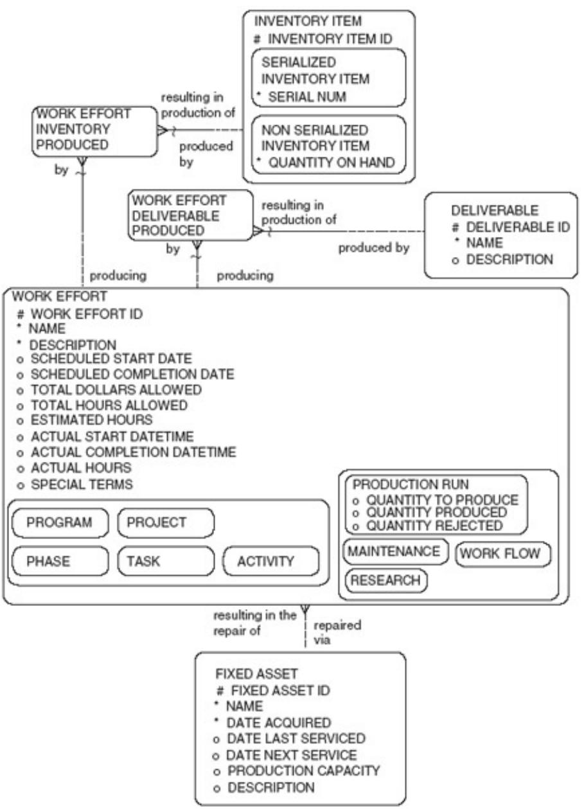

The model in Figure 6.12 shows that each WORK EFFORT may result in the production of one or more DELIVERABLEs via the WORK EFFORT DELIVERABLE PRODUCED; it may result in the repair of a FIXED ASSET; or it may result in production of one or more INVENTORY ITEMS via the WORK EFFORT INVENTORY PRODUCED entity.

Keep in mind that the relationships to these entities should be maintained at lower levels of the WORK EFFORT instances. This allows the deliverables, inventory items produced, and fixed assets repaired to be rolled up to see the total results for an overall work effort such as an entire project.

# Summary

The details of the data model in this chapter involve the requirement for work efforts, creation of work efforts, scheduling of resources, and completion of work efforts (see Figure 6.13). Included are the complete breakdown of work efforts to other work efforts and the tracking of assignments of people, fixed assets, and inventory necessary for the completion of the tasks. Incorporated into the model as well are the entities needed to record the standards associated with type of work efforts as well as the actual results from work efforts.

Figure 6.13 Overall work effort model.


With this data model, enterprises should be able to effectively maintain lists of ongoing efforts and the various resources that are available or already assigned to the completion of these efforts. The availability of this information could be critical to the continued success and development of the enterprise; it is therefore of importance and needs to be included in the overall corporate model.

Please refer to Appendix A for a listing of entities and attributes. SQL scripts to build tables and columns derived from the logical models in this book can be found on the full-blown CD-ROM, which is licensed separately.

# CHAPTER

# 7

# Invoicing

Ensuring that payment occurs is critical for organizations. Now that items have been ordered, shipped, or delivered in some fashion, it is critical for the enterprise to make sure that it requests payments; this is often done through invoices. It is important to send out correct invoices that correspond to the appropriate orders, shipments, or work efforts. The enterprise needs to set up systems that facilitate getting paid, and this could involve setting up appropriate billing accounts; matching invoices to orders, billing for shipments, invoicing for work efforts; sending out invoices; tracking payments against invoices; recording deposits, and issuing statements.

Questions that enterprises need to know about invoicing include the following:

- How does each invoice relate to orders, shipments, and/or work efforts?
- What are the products, features, and other charges for which payments are due?

Who owes how much to whom?
What is the status of each invoice?
What is the payment history of each party?

Models discussed in this chapter are as follows:

- Invoice and invoice items (alternate model also provided)
- Invoice roles
- Invoice billing account
- Invoice specific roles
- Invoice status and terms
- Billing for shipment items
- Invoicing of work efforts and time entries
- Billing for order items
- Invoice payments (alternate model also provided)
- Financial accounts, withdrawals, and deposits

Invoices and Invoice Items

Invoices, like shipments and orders, may have many items showing the detailed information about the goods or services that are charged to parties. The items on an invoice may be for products, features, work efforts, time entries, or adjustments such as sales tax, shipping and handling charges, fees, and so on.

Figure 7.1a provides a data model with some of the key entities for invoicing. Each INVOICE is composed of INVOICE ITEMS that represent any items that are being charged. The INVOICE maintains header information about the transaction, and the INVOICE ITEM maintains the details of each item that is being charged. Each INVOICE ITEM may have a many-to-one relationship to either PRODUCT or PRODUCT FEATURE. The INVOICE ITEM may also be related to a SERIALIZED INVENTORY ITEM because maintaining the actual instance of the product that was bought with its serial number may be useful. For instance, computer manufacturers often record the serial number of the computer that was bought and invoiced.

Figure 7.1a Invoice and invoice items.


Because INVOICE ITEMSs do not relate only to products (i.e., they also relate to work efforts, time entries) other relationships to other entities will be covered later in this chapter. If the item represents a one-time charge item that is not catalogued, then the item description attribute within the INVOICE entity may be used to record what was charged. Each INVOICE ITEM may be categorized

by an INVOICE ITEM TYPE, which could include values such as "invoice adjustment," "invoice item adjustment," "invoice product item," "invoice product feature item," "invoice work effort item," or "invoice time entry item." Each INVOICE ITEM has a recursive relationship as it may be adjusted by one or more other INVOICE ITEMS, which would be of INVOICE ITEM TYPE "invoice item adjustment." Each INVOICE ITEM may also be sold with other INVOICE ITEMS that would be of type "invoice product feature item."

As with shipments, many things are needed in order to send a correct bill to customers. The first thing to record about the invoice (besides a unique identifier) is the invoice creation date or invoice date. This will be an important piece of information used in tracking the progress of the invoice when a client calls to discuss his or her bill. Some systems may want to include a specific note or message to the customer on the invoice, so the model includes the attribute message. The description attribute describes the nature of the invoice. Table 7.1 shows sample data for the INVOICE entity.

Table 7.1 Invoice Data

<table><tr><td>INVOICE ID</td><td>INVOICE DATE</td><td>MESSAGE</td><td>DESCRIPTION</td></tr><tr><td>30002</td><td>May 25, 2001</td><td></td><td>Fulfillment of office supply order</td></tr><tr><td>30005</td><td>June 5, 2001</td><td>Thanks for the business!</td><td></td></tr></table>

Because each INVOICE ITEM may be for a product, product feature, work effort, or time entry or because it may be described via an

item description for non-standard items, the relationships to PRODUCT and PRODUCT FEATURE are both optional. When features are shown in invoice items, the recursive relationship sold with should be recorded in order to indicate that the feature was invoiced for a specific invoice item that was for a product. The quantity is optional because there may only be an amount and not a quantity for items such as features where the quantity really isn't necessary and is not applicable.

Instead of tying an INVOICE ITEM recursively to another INVOICE ITEM to record the feature for a product, why not just record both the product and feature on an invoice item? This would not account for invoices that have the same product on two different invoice items. For instance, if an organization bought two different computer servers with different features on each, it would be important to record which combination of features corresponded with which specific products. What if a feature was later added (and invoiced) on an existing product that the customer already has? The invoice item could be related to the initial invoice item that had the product charge.

Table 7.2 provides an example invoice with four items being charged, three for products and one for the feature of special glossy paper for the Johnson fine grade  $8 \frac{1}{2}$  by 11 bond paper. The second item, which is for extra glossy finish for the Johnson fine grade  $8 \frac{1}{2}$  by 11

bond paper, includes a recursive relationship to the invoice item for the product in order to show that the item is for a feature within the context of a product.

Table 7.2 Invoice Item Data

<table><tr><td>INVOICE
ID</td><td>INVOICE
ITEM
SEQ ID</td><td>PRODUCT</td><td>PRODUCT
FEATURE</td><td>SOLD
WITH</td><td>QUANTITY</td><td>AMOUNT</td><td>TAXABLE
FLAG?</td></tr><tr><td>30002</td><td>1</td><td>Johnson fine
grade 8½ by
11 bond paper</td><td></td><td></td><td>10</td><td>$8.00</td><td>Y</td></tr><tr><td></td><td>2</td><td></td><td>Product
quality,
Extra glossy
finish</td><td>Invoice
30002,
Seq ID 1</td><td></td><td>$2.00</td><td>Y</td></tr><tr><td></td><td>3</td><td>Goldstein
Elite pens</td><td></td><td></td><td>4</td><td>$12.00</td><td>Y</td></tr><tr><td></td><td>4</td><td>HD 3½-inch
diskettes</td><td></td><td></td><td>6</td><td>$7.00</td><td>Y</td></tr></table>

In addition to the invoice ID and product or feature, the details include the quantity of items being billed, the amount, and whether this is a taxable item through the taxable flag attribute. Note that product-specific information, such as unit of measure for the quantity, can be derived through the relationship from PRODUCT to UNIT OF MEASURE (see Chapter 3 for more on product definition). Also, notice that the extended price for the item is not an attribute because this is derivable information.

The taxable flag is stored on the invoice item to signify if the item is to be taxed. This cannot always be determined by the item being invoiced because the taxability of an item could vary depending on

many circumstances, such as the source and destination of the shipment or the tax status of the purchasing organization. The information needed to calculate taxes is not included in this model because it is highly dependent on the rules and regulations of each geographic boundary.

Other information that enterprises may want to know about an invoice include adjustments to the invoice such as the total tax (after it is calculated), freight charges, and handling charges. Each adjustment is stored as an instance of INVOICE ITEM because these are also charged items. Why was ORDER ADJUSTMENT a separate entity in the order chapter, but invoices include adjustments as instances of an INVOICE ITEM? The reason is that when parties order something, they do not request adjustments such as sales tax, fees, handling charges, and so on. These adjustments are recorded as ORDER ADJUSTMENTS in order to maintain potential expected charges; however, they are still not "ordered items." INVOICE ITEMS represent charges that are incurred, and these adjustments are included in this definition.

The INVOICE ITEM TYPE could include different types of adjustments such as "miscellaneous charge," "sales tax," "discount adjustment," "shipping and handling charges," "surcharge adjustment," and "fee." If needed, a percentage attribute could be

added to the INVOICE ITEM to store the percentage of the adjustment, such as .07 for sales tax.

Table 7.3 contains examples of adjustment data for an invoice.

Table 7.3 Invoice Item Adjustment Data

<table><tr><td>INVOICE ID</td><td>INVOICE ITEM SEQ ID</td><td>INVOICE ITEM TYPE</td><td>AMOUNT</td><td>TAXABLE?</td></tr><tr><td>30002</td><td>5</td><td>Shipping and handling</td><td>$16.00</td><td>N</td></tr><tr><td></td><td>6</td><td>Fee (order processing fee)</td><td>$5.00</td><td>N</td></tr><tr><td></td><td>7</td><td>Tax</td><td>$25.65</td><td>N</td></tr></table>

Using this structure, an enterprise can include any number of adjustments to an invoice that could be of many different types. This is much more flexible than including attributes such as tax amount or freight charge on the INVOICE entity because new attributes would have to be added to the entity if the enterprise discovered that other adjustments needed to be tracked. With this model, the enterprise simply defines new invoice items that may have different INVOICE ITEM TYPES and then relates additional instances to either the INVOICE or INVOICE ITEM (through a recursive relationship).

Invoice items may be adjusted by other invoice items in another way. For example, suppose there was a mistake in which the quantity of items invoiced was 10 instead of 8, the correct quantity. A future invoice item showing a credit of 2 items could be used to correct the invoice. This correction could be implemented using an INVOICE ITEM with a quantity of -2 that related back to the

original INVOICE ITEM that had a quantity of 10. Many enterprises will show corrections using this approach as opposed to modifying the invoice, which could lead to control and audit issues. The recursive relationship around the INVOICE ITEM provides the information necessary for relating invoice items together.

Figure 7.1b provides an alternative model that more specifically illustrates the subtypes of INVOICE ITEM. The INVOICE ADJUSTMENT shows the various adjustment subtypes, and the INVOICE ACQUIRING ITEM represents the items that the party really got, whether they were a product, feature, work effort, or time. Instead of showing the recursive relationships around INVOICE ITEMS to handle features sold with products or adjustments to invoice items, this model has relationships from INVOICE PRODUCT ITEM to INVOICE PRODUCT FEATURE ITEM as well as from INVOICE ACQUIRING ITEM to INVOICE ADJUSTMENT, which enforce more specific business rules.

Figure 7.1b Invoice and invoice items-alternate model.

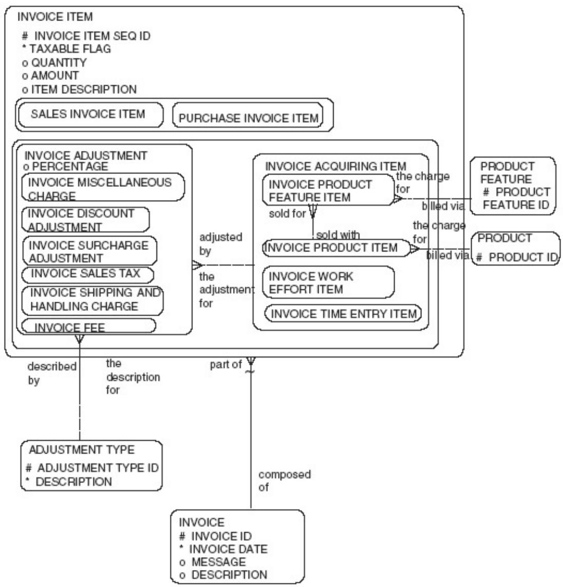

# Invoice Roles

Of course, enterprises also need to know where to send the invoice and where it came from. Standard models often record only the customer address, and the supplier address is assumed to be the enterprise doing the billing (the "I" model). This model accommodates a more flexible structure for both sales and purchase invoices for a multilocation or multiccompany organization.

Figure 7.2 provides a basic data model for the parties involved in the invoice. Each INVOICE may be billed to or billed from any PARTY, and therefore it may accommodate both incoming (PURCHASE INVOICE) and outgoing invoices (SALES INVOICES). The billed to and billed from are the two main roles and represent the party owing the money and the party that is requesting payment.


Figure 7.2 Invoice parties.

In addition to these two key roles, additional roles may be involved in the invoice. The additional roles are maintained by the INVOICE ROLE, which records each PARTY involved in each INVOICE ROLE TYPE for an INVOICE. For example, invoice role types may include "entered by," "approver," "sender," and "receiver." The datetime attribute indicates the date and time that the person or organization performed the role.

Flexible means of sending and receiving invoices are needed in order to record from where and to where the invoice was sent because there are many ways to send an invoice. Therefore, Figure 7.2 shows that each INVOICE also needs to maintain the CONTACT MECHANISMS to which the invoice is addressed and the CONTACT MECHANISM from which it was sent. This is related to the supertype, CONTACT MECHANISM, because the INVOICE may be sent or received via numerous subtypes of CONTACT MECHANISM including POSTAL ADDRESS, ELECTRONIC ADDRESS, or TELECOMMUNICATIONS NUMBER. In these days of e-commerce, sending an invoice via e-mail, which is a form of ELECTRONIC ADDRESS, is becoming more and more common. An invoice may be faxed, which is a type of TELECOMMUNICATIONS NUMBER. Finally, an invoice could be sent the old-fashioned way, by addressing it via a POSTAL ADDRESS.

Table 7.4 shows example data for the information maintained about the invoice parties.

Table 7.4 Invoice Parties.

<table><tr><td>INVOICE ID</td><td>INVOICE DATE</td><td>BILLED TO PARTY</td><td>ADDRESSD TO CONTACT MECHANISM</td><td>SENDER OF PARTY</td><td>SENT FROM CONTACT MECHANISM</td></tr><tr><td>30002</td><td>May 25, 2001</td><td>ACME Corporation</td><td>123 Main Street</td><td>ABC Subsidiary</td><td>100 Bridge Street</td></tr><tr><td>30005</td><td>June 5, 2001</td><td>John Smith</td><td>jsmith@us.com</td><td>ABC Subsidiary</td><td>100 Bridge Street</td></tr><tr><td>30010</td><td>June 5, 2001</td><td>Tom Jones</td><td>1235,678@cis.com</td><td>ACME Corporation</td><td>acorp@ acme.com</td></tr></table>

Notice that invoice #30002 has standard addressed to and sent from locations, but #30005 is addressed to an Internet e-mail address. In this situation, the invoice is being sent via e-mail (however, the data shows only the physical address of the sender). For invoice #30010, the data indicates that the invoice is being sent from one electronic mail address to another e-mail.

As more and more enterprises and people get online, this type of transaction will become more prevalent; thus, the need for a more flexible data model will become apparent. Current invoicing systems that require a physical address to mail an invoice may become unusable in the future.

The PARTY CONTACT MECHANISM PURPOSE entity (see Chapter 2, Figure 2.10) could be used for additional validation if an enterprise

wanted to implement additional business rules to see if the invoice contact mechanism recorded is valid for invoicing purposes. A possible example would be a rule that states that an invoice may be related only to a PARTY CONTACT MECHANISM with a role of "location for receiving invoices."

# Billing Account

As shown in Figure 7.3a, there is another way to bill a customer in addition to sending a bill to a PARTY, namely through the use of a BILLING ACCOUNT. This method of billing is used only in certain circumstances for specific types of businesses. Therefore, the BILLING ACCOUNT, BILLING ACCOUNT ROLE, and PARTY entities and their associated relationships in Figure 7.3a are optional and are included only if the enterprise has a need to maintain billing accounts.

Figure 7.3a Billing account.


A BILLING ACCOUNT provides a mechanism for grouping different types of items on different invoices. A client might want one account for his or her office supplies and another account for furniture purchases. A billing account allows customers to receive separate invoices to track different types of items separately. Banks and credit card companies use this concept frequently to allow separation of various charges for their customers. A telecommunications company may set up separate billing accounts for different

telecommunications lines. Perhaps one account is for standard telephone service, while another account is set up for the enterprise's dedicated lines.

Figure 7.3a adds to the previous model shown in Figure 7.2 by providing for invoices that may be sent to a BILLING ACCOUNT as an alternative to sending it directly to a PARTY. Some enterprises may have a need to track more than one party that is responsible for paying an invoice that is sent to a BILLING ACCOUNT. Therefore, the model in Figure 7.3a has an intersection entity called BILLING ACCOUNT ROLE between PARTY and BILLING ACCOUNT, allowing for maintenance of the various parties involved on the account. The BILLING ACCOUNT ROLE allows each PARTY to play a BILLING ACCOUNT ROLE TYPE in the account. Roles could include "primary payer," indicating the main party that is supposed to pay, or "secondary payer," indicating other parties that could pay in case of default. There may be other roles as well, such as "customer service representative," "manager," and "sales representative," that could be involved with the account as well. Other attributes needed on the BILLING ACCOUNT ROLE include the from date, which is when the party became active on the account, and the thru date, which indicates through when the role is involved.

Each invoice may then be billed to either a BILLING ACCOUNT or directly to a PARTY with this model. The BILLING ACCOUNT has a

from date (when it became active), a thru date, and a description identifying the nature of the billing account. In order to determine where to send the invoice, the account in question must, in turn, be related to a CONTACT MECHANISM. Eventually, all invoices must end up at a location of some sort. Also, note that if the enterprise uses billing accounts, the order models in Chapter 4 (Figures 4.3 and 4.5) should include a with a requested bill to relationship to the BILLING ACCOUNT entity, with a mutually exclusive arc similar to the arc in the invoicing model.

Table 7.5 provides the example of ACME Corporation setting up an account for its office supplies and a separate account for using consulting services.

Table 7.5Billing Account Data

<table><tr><td>BILLING ACCOUNT ID</td><td>FROM DATE</td><td>THRU DATE</td><td>PARTY</td><td>BILLING ACCOUNT ROLE</td><td>MECHANISM</td><td>CONTACT DESCRIPTION</td></tr><tr><td>1295</td><td>Apr 15, 2000</td><td></td><td>ACME Corporation</td><td>Primary payer</td><td>123 Main Street</td><td>All charges for office supplies</td></tr><tr><td>1296</td><td>Apr 15, 2000</td><td></td><td>ACME Corporation</td><td>Primary payer</td><td>123 Main Street</td><td>All charges for consulting services</td></tr></table>

Table 7.6 shows sample data for an account with more than one party assigned to it. The sample data shows a typical situation that could occur for a credit card account, a bank account, a telecommunications account, or a utilities account, possibly with

many individuals on it. Initially the account was opened with both Jane and Joe Smith assigned to the account on April 15, 2000. Jane had primary responsibility for paying for the account and if, for some reason, she did not pay, then John would be held accountable in his role as the secondary payer. Then, on June 16, 2001, Joe Smith was added to the account, replacing John Smith as the secondary payer on the account. Because the thru date is blank, it can be inferred that both Jane and Joe are still active on the account.

Table 7.6 Billing Account with More Than One Party

<table><tr><td>BILLING ACCOUNT ID</td><td>BILLING ACCOUNT ROLE FROM DATE</td><td>BILLING ACCOUNT ROLE THRU DATE</td><td>PARTY</td><td>BILLING ACCOUNT ROLE TYPE</td></tr><tr><td>1459</td><td>Apr 15, 2000</td><td></td><td>Jane Smith</td><td>Primary payer</td></tr><tr><td>1459</td><td>Apr 15, 2000</td><td>June 15, 2001</td><td>John Smith</td><td>Secondary payer</td></tr><tr><td>1459</td><td>June 16, 2001</td><td></td><td>Joe Smith</td><td>Secondary payer</td></tr></table>

Cards can be issued against an account-for example, a banking card or credit card. If this is needed, then a CARD or MEDIA entity, maintaining banking card or credit card information, could be added and related to BILLING ACCOUNT as well as PARTY. Based on the business rules of the enterprise the relationship from the CARD entity could be a one-to-many or a many-to-many relationship to either the BILLING ACCOUNT or the PARTY.

Another common example of the usage of billing accounts is in the telecommunication industry. In some cases, all phone services for several phone numbers might appear on one billing account, while

all charges for other phone numbers for the same location might appear on a different account. This could allow the charges for standard telephone service to be included on one account while other services, such as dedicated line and network services, might appear on another account. Again, telephone cards may be issued that give the customer the right numbers to charge calls to the account.

# Invoice Specific Roles

An alternative to the data models in Figure 7.2 or Figure 7.3a is to relate the invoices to the specific entities that represent roles for invoicing. Figure 7.3b provides additional relationships to represent the key roles of BILL TO CUSTOMER, INTERNAL ORGANIZATION, and SUPPLIER, which are subtypes of PARTY ROLE and are still tied to PARTY.

Figure 7.3b Invoice specific party roles.


This model defines more specific rules for the way that SALES INVOICES and PURCHASE INVOICES operate. A SALES INVOICE must be billed to a BILLING ACCOUNT or directly to a BILL TO CUSTOMER. If billing accounts are not used at the enterprise, then just remove the BILLING ACCOUNT entity relationships to this entity. The SALES INVOICE must be billed from an INTERNAL ORGANIZATION. A PURCHASE INVOICE must be billed to a BILLING ACCOUNT or an INTERNAL ORGANIZATION. The

PURCHASE INVOICE must be billed from one and only one SUPPLIER.

Each of these roles, BILL TO CUSTOMER, INTERNAL ORGANIZATION, and SUPPLIER, are subtypes of PARTY ROLES, which are each related to a PARTY. This allows the same PARTY to act in multiple PARTY ROLES, each of which may be related to different invoices in different ways. Thus, this data structure still maintains the idea that a PARTY may have the same information that can still be stored once, independently of the information associated with the various roles that the party may play.

The advantage of this alternative data model over the more generic models in Figure 7.2 or Figure 7.3a is that it conveys more specific business rules showing the specific roles that parties are required to play in the sales and purchase invoicing. For instance, it shows that the INTERNAL ORGANIZATION is the party role that receives the PURCHASE INVOICE and the party role that is the sender of each SALES INVOICE.

The disadvantage of this alternative model is that it is less flexible than Figure 7.2 and Figure 7.3a because it conveys specific business rules that may or may not hold up over time. For instance, what if an AGENT of the enterprise is a party that may be the sender of the

INVOICE? What if other roles change the nature of the way that INVOICEs are processed?

As a general guideline, one should use the more specific models such as the one in Figure 7.3b when the relationships between the entities are very stable and will probably not change over time. If one knows that there will always be one and only one SUPPLIER that is always going to be the sender of PURCHASE INVOICEs, then it is safe to model this relationship as such.

Invoice Terms and Status

Like orders, shipments, and many other transactions, invoices also have status and terms. Figure 7.4 shows that the INVOICE entity can have multiple INVOICE STATUSes and that either the INVOICE or INVOICE ITEM entity can have multiple INVOICE TERMS.

Figure 7.4 Invoice status and terms.


# Invoice Status

Similar to orders, the state of an invoice changes over time. To track this, the entity INVOICE STATUS is used. It is an intersection entity between INVOICE and INVOICE STATUS TYPE (which is another subtype of STATUS TYPE). Examples of statuses include: "sent,"

"void," and "approved." "Paid" is not a valid status because it can be determined via payment transactions, which will be discussed later in this chapter. Additionally, the need to know when this status took effect is provided by the attribute status date. Table 7.7 shows how this data might look.

Table 7.7 Invoice Status Data
INVOICE IDSTATUS TYPESTATUS DATE

<table><tr><td>30002</td><td>Approved</td><td>May 25, 2001</td></tr><tr><td></td><td>Sent</td><td>May 30, 2001</td></tr><tr><td>30005</td><td>Sent</td><td>June 5, 2001</td></tr><tr><td></td><td>Void</td><td>June 6, 2001</td></tr></table>

To find the current status, look for the most recent date. Note that if the number of statuses is somewhat limited, these items would be good candidates for denormalization in a physical model. If the model was denormalized, there may be approved date, sent date, and void date as attributes within the INVOICE entity instead of as records within the INVOICE STATUS entity.

# Invoice Terms

Some systems or enterprises might need to record various terms and conditions on invoices, such as payment terms. Terms may sometimes apply at the item level. The model handles this with the

INVOICE TERM entity, which must be related to either the INVOICE or INVOICE ITEM entities.

Table 7.8 shows three terms that were applied to an invoice and one term that is applied to only one of the items on that invoice. The first three rows describe terms for payment, late fees, and penalties that apply to the INVOICE. This data indicates that for invoice #30002, the payment is due in 30 days. If it is late, there is a 2 percent late fee added. If the invoice is sent to a collection agency, then there is an additional 5 percent added to the amount due. The last row provides an example of a term that is applied to the INVOICE ITEM, namely that the second item on invoice 30002 is nonrefundable.

Table 7.8 Invoice Term Data

<table><tr><td>INVOICE ID</td><td>INVOICE ITEM SEQ ID</td><td>TERM TYPE DESCRIPTION</td><td>TERM VALUE</td></tr><tr><td>30002</td><td></td><td>Payment–net days</td><td>30</td></tr><tr><td>30002</td><td></td><td>Late fee–percent</td><td>2</td></tr><tr><td>30002</td><td></td><td>Penalty for collection agency–percent</td><td>5</td></tr><tr><td>30002</td><td>2</td><td>Non-returnable sales item</td><td></td></tr></table>

Invoice and Associated Transactions

Invoices generally stem from associated transactions, which may include shipments, work efforts, and time entries, or directly from orders. An invoice represents a request for payment, and each invoice item identifies each part of the request as it relates to the

items that are chargeable. Each invoice item may include moneys that are owed from shipment items, work efforts, time entries, or order items. In each of these cases the invoice item may group together the items from which the charge came. There could be many shipment items, work efforts, time entries, or order items for an invoice item.

Also, there may be multiple invoice items for each order item, shipment item, or work effort due to two factors. The first factor is that the invoice item may only partially bill for the amount due and bill the rest at a later point in time. The second factor is that additional invoice items may be added in order to correct the initial shipment item, work effort, time entry, or order item.

The following three data models and corresponding sections describe how shipment items are related to shipment items, work efforts, and order items, respectively.

Billing for Shipment Items

A very common relationship is from the invoice item to the shipment item because these shipments often represent the delivery of goods that need to be paid after they have been received. How does one ensure that everything shipped actually gets billed?

The SHIPMENT ITEM BILLING entity allows enterprises to track this information (see Figure 7.5). This entity provides a means to store intersection information between INVOICE ITEM and SHIPMENT ITEM. Each of the invoice items should represent the bill for one or more shipment items. Conversely, one shipment item could be related to many invoice items in the case where adjustments to the original invoice item were needed. For example, if some of the goods for the original shipment were damaged, a credit for these items would be needed. The credit would take the form of an invoice item on a second invoice. Thus, the one shipment item would actually have a relationship to two different invoice items. It is unlikely that one shipment item would be related to two invoice items on the same invoice (though this would need to be enforced with a business rule).

Figure 7.5 Billing for shipment items.

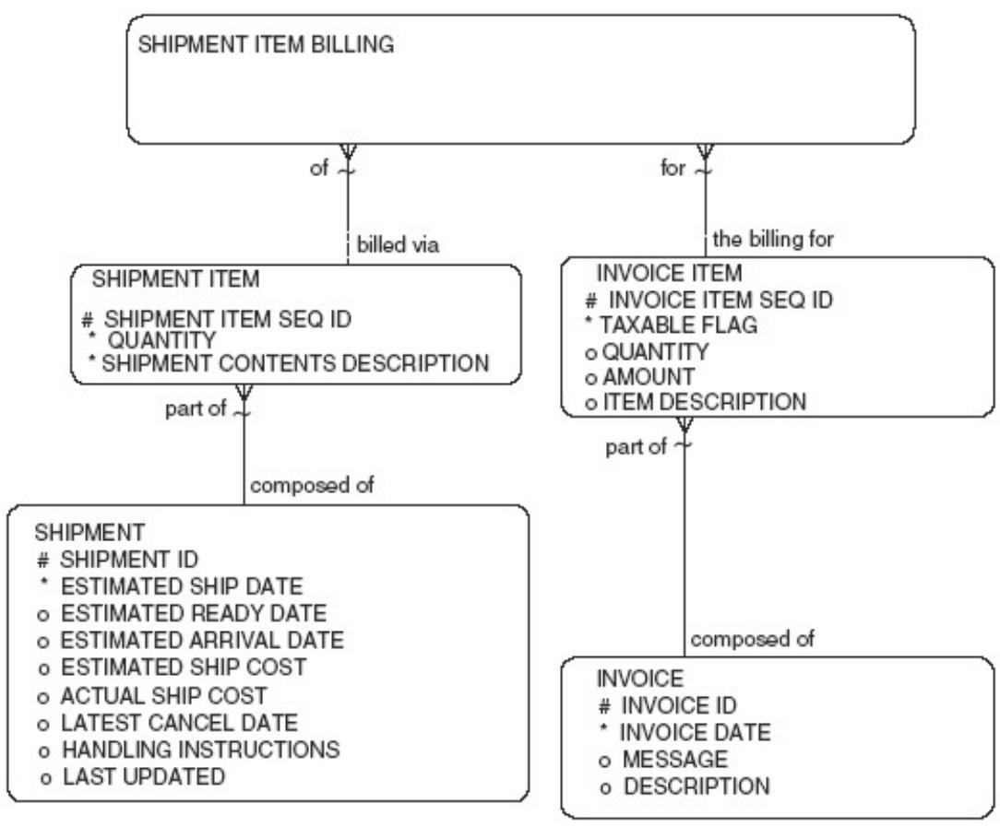

Table 7.9 gives some examples of the data held by this entity. The table shows an example of a single shipment that resulted in two invoice items. Observe that the same shipment item (shipment ID #1235, item #1) is related to two invoice items. The first invoice item was a bill for the shipment of 1,000 items. On receipt, the customer found 10 items damaged; therefore, on a subsequent invoice another invoice item was to credit the customer for the 10 damaged items. This adjustment was then linked to the original shipment item to allow for proper tracking. Therefore, there were two invoice items for the same shipment item.

Table 7.9 Shipment Invoice Data

<table><tr><td>SHIPMENT
ID</td><td>SHIPMENT
ITEM SEQ ID</td><td>INVOICE
ID</td><td>INVOICE
ITEM SEQ ID</td><td>QUANTITY (FROM
INVOICE ITEM)</td></tr><tr><td>1235</td><td>1</td><td>30002</td><td>1</td><td>1000</td></tr><tr><td></td><td>2</td><td>30002</td><td>2</td><td>1000</td></tr><tr><td></td><td>3</td><td>30002</td><td>3</td><td>100</td></tr><tr><td>1235</td><td>1</td><td>30045</td><td>1</td><td>-10</td></tr><tr><td>1330</td><td>1</td><td>30005</td><td>1</td><td></td></tr><tr><td></td><td>2</td><td>30005</td><td>1</td><td></td></tr><tr><td></td><td>3</td><td>30005</td><td>1</td><td></td></tr></table>

The example of shipment ID #1330 shows the opposite situation. In this case, three shipment items are mapped to only one invoice item. This can occur when the shipment items show component parts for an item, but the invoice shows only the price for the entire assembly. This situation could also occur when three shipments on different dates are grouped together into one invoice (perhaps due to a prearranged billing agreement).

Notice that there is not a quantity attribute on the SHIPMENT INVOICE and that the quantity shown in Table 7.9 comes from the INVOICE ITEM. The reason for this is that an enterprise will usually not partially invoice for items that have been shipped. If this case can exist and it is necessary to map quantities of invoice items to shipment items, then the quantity attribute could be added.

Keep in mind that there will not always be a SHIPMENT INVOICE record for every shipment. Some shipments, such as transfers, will

not show up on an invoice unless the enterprise wants to keep track of internal transactions.

Billing for Work Efforts and Time Entries

The previous section identified how the delivery of goods is usually invoiced. How are services invoiced then? Services are generally invoiced one of two ways: The organization performing the services bills their client for either their time or for progress on specific work efforts.

Figure 7.6 provides a data model for billing of work efforts and/or time entries. For many of the same reasons that SHIPMENT ITEMS have a many-to-many relationship to INVOICE ITEMS, both WORK EFFORT and/or TIME ENTRY are also related in a many-to-many fashion to INVOICE ITEM. Each WORK EFFORT may be billed by many INVOICE ITEMS and vice versa. The associative entity WORK EFFORT BILLING accommodates this many-to-many relationship. Similarly, the associative entity TIME ENTRY BILLING resolves the many-to-many relationship from TIME ENTRY to INVOICE ITEM.

Figure 7.6 Billing of time entries and work efforts.

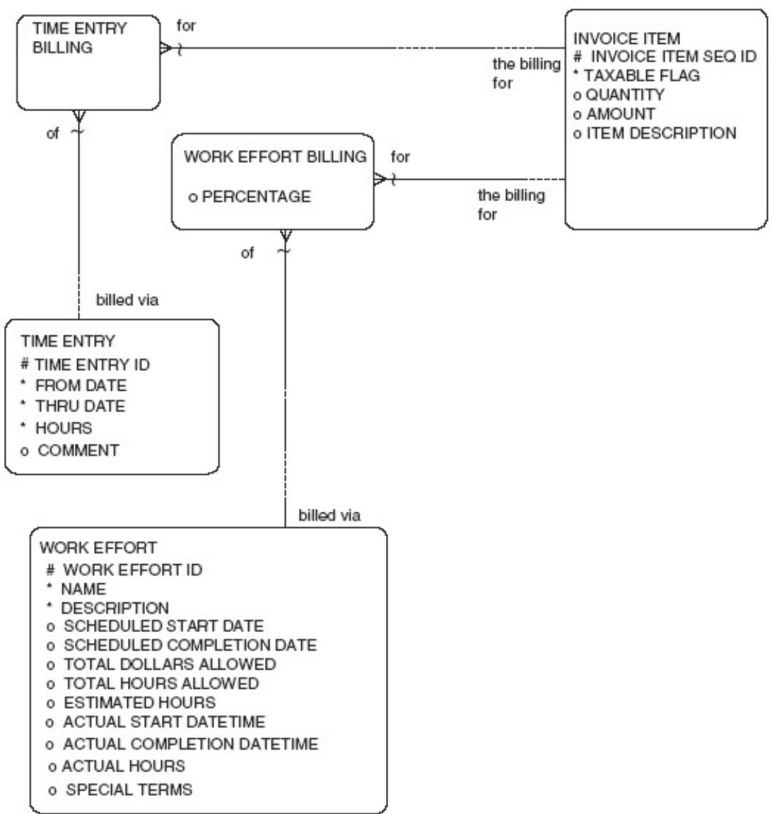

A WORK EFFORT may have many INVOICE ITEMSs because it is common for companies to charge progress payments on the work effort. For instance, a professional services firm such as a consulting organization may charge a client 30 percent of a project (i.e., a type of work effort) on starting, 30 percent on initial delivery, and 40 percent 30 days after the project's completion. This would represent three INVOICE ITEMSs for the same work effort. The percentage

attribute allows recording of how much of the work effort was invoiced in that invoice item. Many WORK EFFORTS could be combined and invoiced in a single INVOICE ITEM. For example, a law firm may agree to perform three different efforts for a set fee, which is invoiced as a single INVOICE ITEM.

Each TIME ENTRY may have many INVOICE ITEMS associated with it. Suppose a TIME ENTRY was for five hours of consulting services. The client called and complained that he or she did not get what was expected in the five hours, and the consulting firm responded by agreeing to issue a credit of two hours regarding that time entry. Therefore, this led to two INVOICE ITEMSs for the same TIME ENTRY. Usually partial invoicing of a time entry is not done; however, if this is possible then an hours attribute could be added to the TIME ENTRY BILLING record to show how much of each time entry was billed.

Instead of assuming that each TIME ENTRY can be billed via more than one INVOICE ITEM to handle adjusting invoice item entries, can corrections to invoices be handled with a relationship from one INVOICE ITEM to the previous INVOICE ITEM? One of the problems with handling it via a recursive relationship on INVOICE ITEM is that the INVOICE ITEM may represent multiple time entries on different dates. In this case, it may be important to record to which of the three time entries the adjusting INVOICE ITEM applied. For this

reason, this data model assumes that each should be related directly to the source transaction(s) that generated the invoice item.

Many TIME ENTRYs could also be combined on the same INVOICE ITEM, particularly if the time entries had similar information except for the date. An accountant may work two hours on Monday, three hours on Wednesday, and four hours on Friday, and the invoice may show an INVOICE ITEM for nine hours with an attached time sheet that could show the related time entries.

Billing for Order Items

What if the enterprise bills based on the order? Perhaps payment is due after ordering the goods and/or services. Or perhaps the enterprise does not track the shipment or work effort associated with the order and tracks only the order and its following invoice. For example, enterprises will not always track the work efforts associated with purchase orders for services rendered.

Figure 7.7 provides an additional data structure to show that ORDER ITEMS may also have a many-to-many relationship with INVOICE ITEMS. The associative entity ORDER ITEM BILLING lets order items be grouped together on an INVOICE ITEM or, conversely, more than one INVOICE ITEM for an ORDER ITEM. The amount and quantity attributes on the ORDER ITEM BILLING entity are provided to record

the distribution of the amount or quantity from an order item to multiple invoices or vice versa.

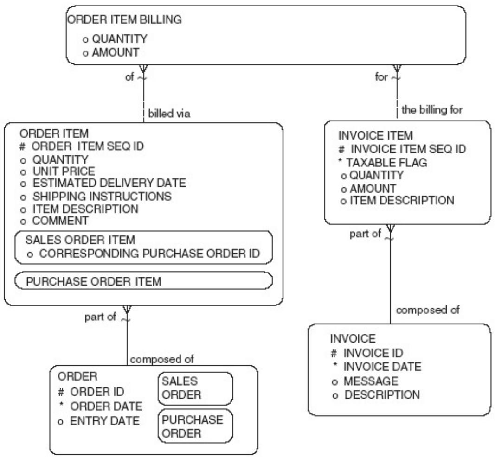
Figure 7.7 Billing for order items.

Take, as an example, a purchase order item for a year's worth of accounting services at a cost of $120,000. The accounting firm invoices monthly. An invoice arrives with an invoice item for $10,000. This is then linked to the appropriate order item on the purchase order (using ORDER ITEM BILLING), and the amount of $10,000 is

entered to show that  $10,000 of the original$ 120,000 has been billed. This allows the enterprise to easily track over time how much of the original commitment has actually been billed to date (and also to notice if it has been billed beyond the amount of the purchase order). This example illustrated that a single ORDER ITEM may be related to many INVOICE ITEMS.

To show that a single INVOICE ITEM may be for multiple ORDER ITEMS, consider an enterprise in need of hardware support for its internal computer systems. Over the course of time, it executes three separate purchase orders to the same external company to provide this support. Each order has an order item for 40 hours of on-site support, for a total of 120 hours. Again, over time, the services are delivered, but due to the billing cycles at the vendor company, the first invoice has one order item for 100 hours. The final 20 hours are billed on the next invoice. Table 7.10 shows the details for these transactions.

Table 7.10 Billing for Order Items

<table><tr><td>PURCHASEORDER ID</td><td>ORDERITEMSEQ ID</td><td>QUANTITY</td><td>UNITPRICE</td><td>INVOICEID</td><td>INVOICEITEMSEQ ID</td><td>INVOICEQUANTITY</td><td>ORDERITEMBILLINGQUANTITY</td></tr><tr><td>10001</td><td>1</td><td>40 (hours)</td><td>$60</td><td>990023</td><td>1</td><td>100</td><td>40</td></tr><tr><td>10002</td><td>1</td><td>40 (hours)</td><td>$60</td><td></td><td></td><td></td><td>40</td></tr><tr><td>10003</td><td>1</td><td>40 (hours)</td><td>$60</td><td></td><td></td><td></td><td>20</td></tr><tr><td>10003</td><td>1</td><td>40 (hours)</td><td>$60</td><td>990026</td><td>1</td><td>20</td><td>20</td></tr></table>

Using this construct, it is possible to handle almost any combination of order and invoicing. Why go to such lengths to provide this flexibility in the data model? An enterprise has no real way of controlling service vendors and how they invoice; with this model that does not matter. How the vendor chooses to do business regarding customer purchase orders will make no difference to the enterprise because this model is flexible enough to handle a variety of situations. Additionally, this model provides flexibility in recording the billing of both sales and purchase order items.

# Payments

Invoices are issued to request payment. The tracking of payments issued and received is a very important universal data concept for most businesses because it represents the flow of money from and to the enterprise.

Figure 7.8a provides a data model to track payments against invoices and billing accounts. Each PAYMENT may be applied toward many INVOICEs through the PAYMENT APPLICATION. Conversely, multiple payments may pay for a single INVOICE when partial payments are made.

Figure 7.8a Invoice payments.


Alternatively, the payment may be applied "on account," which means it is applied to a BILLING ACCOUNT without being applied to specific invoices. This allows for situations where a payment comes in and it is not clear for which invoice(s) it is paying. Also it allows moneys to be accepted in advance of charges. In either of these cases, the payments can be properly allocated later to the appropriate invoice items, once this is known.

The PAYMENT APPLICATION provides for the many-to-many relationships that can exist between the PAYMENT and INVOICE ITEM as well as between the PAYMENT and BILLING ACCOUNT.

The PAYMENT entity represents instances of moneys transferred from a PARTY and to a PARTY. A RECEIPT subtype represents incoming moneys to an internal organization of the enterprise, and a DISBURSEMENT represents outgoing payments of moneys sent by an internal organization of the enterprise. A payment made from one internal organization to another internal organization results in two PAYMENT instances; one internal organization will record a RECEIPT, and the other internal organization will record a DISBURSEMENT.

The PAYMENT entity is related to the PAYMENT METHOD TYPE entity whose description identifies the kind of payment such as "electronic" (for electronic transfers of moneys), "cash," "certified check,"

"personal check," or "credit card." The payment ref num references a payment identifier such as a check number or electronic transfer identifier. The effective date documents when the payment can be realized. For instance, an electronic transfer may be for a future time, or a check may be postdated and take effect at a later time. The comment provides an attribute to fully describe any circumstances involved in the transaction such as "payment was made with a message that complimented the service provided."

Table 7.11 shows example data for payments. The amount owed on invoice ID #30002 is $184.04, which can be calculated by extending each of the invoice items (multiplying the quantity times the unit price) and adding them together. The enterprise received a partial

payment check for $182.20 against invoice #30002 because the paying organization had an outstanding issue with the Goldstein Elite pens and did not pay at first. After resolving the issue, they paid the other $12.84 (12.00 plus .84 for the sales tax for the pens) against the same invoice #30002, thus fully paying off the invoice. This example illustrates that when partial payments are issued against an invoice there can be more than one payment for an invoice.

Table 7.11 Invoice Payments

<table><tr><td>INVOICEID</td><td>INVOICEITEMSEQ ID</td><td>PRODUCT</td><td>PRODUCTFEATURE</td><td>ADJUSTMENT</td><td>QUANTITY</td><td>UNITPRICE</td><td>PAYMENTAPPLICATIONAMOUNT</td><td>PAYMENTID</td><td>PAYMENTAMOUNT</td></tr><tr><td>30002</td><td></td><td></td><td></td><td></td><td></td><td></td><td>$182.20</td><td>1298398</td><td>$182.20</td></tr><tr><td></td><td></td><td></td><td></td><td></td><td></td><td></td><td>$12.84</td><td>1298412</td><td>$12.84</td></tr><tr><td></td><td>1</td><td>Johnson fine grade8 1/2 by 11 bond paper</td><td></td><td></td><td>10</td><td>$8.00</td><td></td><td></td><td></td></tr><tr><td></td><td>2</td><td></td><td>Product quality,Extra glossy finish</td><td></td><td></td><td>$2.00</td><td></td><td></td><td></td></tr><tr><td></td><td>3</td><td>Goldstein Elite pens</td><td></td><td></td><td>4</td><td>$12.00</td><td></td><td></td><td></td></tr><tr><td></td><td>4</td><td>HD 3 1/2-inch diskettes</td><td></td><td></td><td>6</td><td>$7.00</td><td></td><td></td><td></td></tr><tr><td></td><td>5</td><td></td><td></td><td>Sales tax</td><td></td><td>$12.04</td><td></td><td></td><td></td></tr><tr><td></td><td>6</td><td></td><td></td><td>Shipping andhandling</td><td></td><td>$16.00</td><td></td><td></td><td></td></tr><tr><td></td><td>7</td><td></td><td></td><td>Fee (orderprocessing fee)</td><td></td><td>$5.00</td><td></td><td></td><td></td></tr><tr><td>990023</td><td></td><td></td><td></td><td></td><td></td><td></td><td>$6,000</td><td>488893</td><td>$7,000</td></tr><tr><td></td><td>1</td><td>Accounting services</td><td></td><td></td><td></td><td>$6,000</td><td></td><td></td><td></td></tr><tr><td>990026</td><td></td><td></td><td></td><td></td><td></td><td></td><td>$1,000</td><td></td><td></td></tr><tr><td></td><td>1</td><td>Accounting services</td><td></td><td></td><td></td><td>$1,200</td><td></td><td></td><td></td></tr></table>

The other two invoices, purchase invoices #990023 and #990026, have one payment that is for both of them. $6,000 of the $7,000 payment was applied to invoice #990023, and the enterprise decided to pay only $1,000 of the $1,200 due, leaving $200 additional due on the second invoice.

In some enterprises, invoices are very complex and are tracked at an invoice item level. For instance, a large consulting firm that outsources the information systems function of an organization may have a single bill for all the engaged consultants. The paying firm may pay against only the invoice items with which it is comfortable, and the receiving firm may want to track which invoice items have been paid.

The previous example in Table 7.11 for Invoice #30002 shows why the enterprise may also desire to track the payments against the invoice items to see which invoice items are outstanding. The company fully paid off three of the invoice items, and they may want to track which invoice items are outstanding as opposed to just recording that the invoice was partially paid off. The decision to track payments against invoice items would depend on the organization and how often individual invoice items are paid versus how often the full invoice is paid. The trade-off is that tracking by invoice item is more specific; however, it requires more work and more database records because there would be at least one PAYMENT APPLICATION record for every INVOICE ITEM.

Figure 7.8b provides an alternate data model to handle tracking payments at an invoice item level. In this model the PAYMENT APPLICATION relates to an INVOICE ITEM, thus tracking payment of each part of the invoice. This structure allows the enterprise to know

for which invoice items they have received moneys and for which invoice items they have disbursed moneys. Of course, with this model, it assumes that the enterprise has the necessary information as well as the desire to record which items corresponded to which payments.

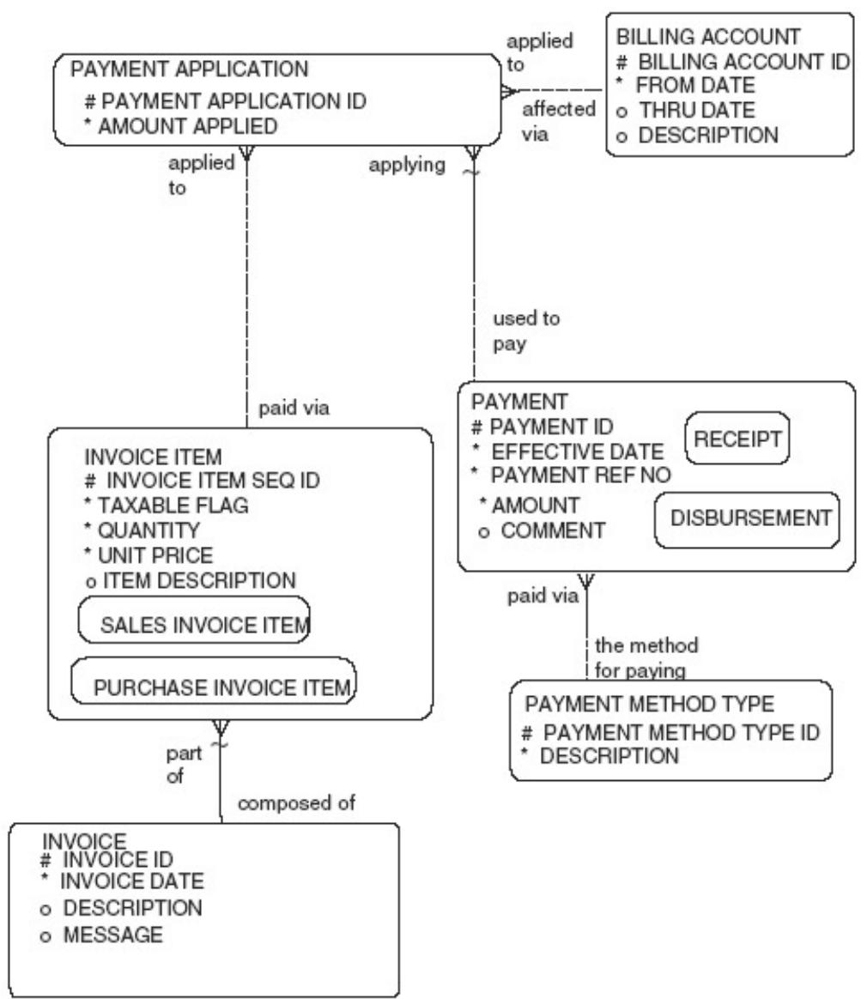
Figure 7.8b Invoice item payments.

A common example of payments is to invoice item charges occurring in the banking industry. When loans are due, invoices may be issued. Then when a partial payment for a loan amount is received, business rules determine which invoice items should be paid off first.

Therefore, tracking which invoice items are paid is important. For instance, the moneys could be first applied to fees, then applied to interest due, and then applied to the principal.

A third possible data model is to account for the PAYMENT APPLICATIONs being related to either INVOICEs or INVOICE ITEMS. This would allow the enterprise to record full payments of invoices easily and, when necessary, record payments against individual INVOICE ITEMS. This option has a large drawback because the option to apply payments against either invoices or invoice items may lead to more confusion (with procedures and invoice tracking) than it is worth.

Financial Accounts, Deposits, and Withdrawals

Once payments are received, it is important to deposit these receipts into a bank account, investment account, or some form of financial account where funds are kept. This section describes the handling of receipts and withdrawals that are recorded as transactions against financial accounts.

Figure 7.9 provides a data model to handle financial accounts, deposits, and withdrawals. A FINANCIAL ACCOUNT is a vehicle for maintaining funds, and subtypes include a BANK ACCOUNT and an INVESTMENT ACCOUNT. There could be other types of FINANCIAL ACCOUNTs, such as a "checking account," "savings account," "IRA account," "mutual fund account," and so on, which could be described in the FINANCIAL ACCOUNT TYPE entity. Each PAYMENT may be either a RECEIPT or DISBURSEMENT, which is linked to different types of FINANCIAL ACCOUNT TRANSACTIONS, namely DEPOSIT and WITHDRAWAL. One or more RECEIPTS could be included in a DEPOSIT, which is a type of FINANCIAL ACCOUNT TRANSACTION that affects a FINANCIAL ACCOUNT. Each DISBURSEMENT may be related to a WITHDRAWAL, which is a type of FINANCIAL ACCOUNT TRANSACTION that affects a FINANCIAL ACCOUNT.

Figure 7.9 Financial accounts, withdrawals, and deposits.


For example, an enterprise may receive three incoming checks (i.e., RECEIPTs) and have a DEPOSIT transaction that records that these three checks have been deposited into a bank account (FINANCIAL ACCOUNT). This enterprise may issue a check (i.e., DISBURSEMENT) that ultimately results in a WITHDRAWAL of funds, which is a

FINANCIAL ACCOUNT TRANSACTION, which also affects a FINANCIAL ACCOUNT, for example, a BANK ACCOUNT.

Table 7.12 provides an example of a typical case of a DEPOSIT, which consists of four RECEIPTs. There are also two withdrawals, which consist of two checks. The first two receipts are the receipts from the previous example in Table 7.11, and two additional receipts that have not previously been shown are included to illustrate the idea of recording each deposit and its corresponding receipts.

Table 7.12 Deposits and Withdrawals.

<table><tr><td>PAYMENTID</td><td>PAYMENTAMOUNT</td><td>DEPOSITID</td><td>DEPOSITAMOUNT</td><td>WITHDRAWALAMOUNT</td><td>FINANCIAL ACCOUNT ID(BANK ACCOUNT NUMBEROR INVESTMENT ACCOUNT ID)</td></tr><tr><td>1298398</td><td>$182.20</td><td>398749</td><td>$917.04</td><td></td><td>8389309984</td></tr><tr><td>1298412</td><td>$12.84</td><td></td><td></td><td></td><td></td></tr><tr><td>394789</td><td>$343.00</td><td></td><td></td><td></td><td></td></tr><tr><td>97873</td><td>$379.00</td><td></td><td></td><td></td><td></td></tr><tr><td>88394</td><td>$480.00</td><td>398761</td><td></td><td>$480.00</td><td>8389309984</td></tr><tr><td>88756</td><td>$670.00</td><td>398762</td><td></td><td>$670.00</td><td>8389309984</td></tr></table>

# Summary

This chapter has provided models for invoice and invoice items for products, product features, adjustments, shipments, work efforts, and orders. Other models described in this chapter have been invoice roles, invoice billing accounts, invoice status and terms, invoice payments, and financial account deposits and withdrawals. The main entities and relationships are shown in Figure 7.10. It is

the interrelationships with other parts of the model and the intersection entities that will allow for the development of a robust, integrated solution. These models should, once implemented, minimize the occurrence of redundant data and simplify the maintenance of the database.


Figure 7.10 Overall invoice model.

Please refer to Appendix A for a listing of entities and attributes. SQL scripts to build tables and columns derived from the logical models in this book can be found on the full-blown CD-ROM, which is licensed separately.

# CHAPTER

# 8

# Accounting and Budgeting

Many accounting functions are very similar across enterprises.

Enterprises need to record transactions, post these transactions to each internal organization's chart of accounts, set up budgets, track variances to their budgets, and report on the results of their business operations.

An accounting and budgeting data model needs to maintain financial information to answer many important questions that affect an enterprise's existence:

- What is the financial position of the enterprise, and how did this change from previous periods?
• What types of transactions occurred in each period, and how much of each transaction occurred? For instance, what payments were made to which invoices, and what invoices are still outstanding?
- What expenses were incurred during various periods?
- What effect did transactions such as depreciation, capitalization, and amortization have on the enterprise?

- What budgets were set up, and how did the enterprise perform compared to these budgets?

This chapter illustrates data models with the following types of information:

Chart of accounts
- Business transactions versus accounting transactions
- Accounting transactions
- Accounting transaction detail
- General ledger account associations and subsidiary ledger accounts
- Asset depreciation
Budget definition
Budget revision
Budget review
Budget scenario
- Use and sources of budgeted money
Budget versus general ledger

Chart of Accounts for Internal Organizations

Generally, the first step in setting up an accounting system is determining a chart of accounts for each organization. A chart of accounts is simply a list of the buckets or categories of transactions

that the enterprise will use to track its business activity for accounting purposes.

Figure 8.1 shows a data model that can establish and maintain a chart of accounts for each organization within the enterprise. The GENERAL LEDGER ACCOUNT represents a type of financial reporting bucket to which transactions are posted, for example a "cash" account or a "supplies expense" account. Each GENERAL LEDGER ACCOUNT may be categorized by one and only one GENERAL LEDGER ACCOUNT TYPE to specify the type of account (for instance, "asset" or "liability"). Each INTERNAL ORGANIZATION may be using many GENERAL LEDGER ACCOUNTs, and each GENERAL LEDGER ACCOUNT may be associated with more than one INTERNAL ORGANIZATION. The ORGANIZATION GL ACCOUNT resolves this many-to-many relationship. Each internal organization needs to establish the ACCOUNTING PERIOD for which it reports its business activities. Each ACCOUNTING PERIOD is of PERIOD TYPE such as "fiscal year," "calendar year," "fiscal quarter," and so on.

Figure 8.1 Chart of accounts for internal organizations.


# General Ledger Accounts and Types

General ledger accounts are mechanisms to categorize similar types of transactions together for the purpose of financial reporting. The field name shown in the GENERAL LEDGER entity identifies the name of the account that will be used for reporting purposes in financial statements. Examples of general ledger account names include "cash," "accounts receivable," "notes payable," or "advertising expense." The description attribute provides a definition behind the account to ensure that it is understood properly.

The key to a GENERAL LEDGER ACCOUNT entity in this model is the general ledger account ID and is filled with a non-meaningful unique number. Many other accounting systems assign a meaningful mnemonic to the general ledger account ID so that accounts are easily identified. The key may start with an organization component, then have a suborganization portion, then have the type of account, and then have a number representing the account. An example of this ID structure is ABC100-200-A-101, where "ABC100" represents the organization, "200" represents a specific division, "A" stands for asset, and "101" represents the account "cash." The problem with having a meaningful key is that if things change within the enterprise, such as a reorganization of the enterprise, then it creates a major problem for the system because key values and foreign key values need to be changed and there is a high chance of data inconsistencies. This is not what is desired, especially in an accounting system that needs to be precise.

The GENERAL LEDGER ACCOUNT TYPE entity identifies the classification of the GENERAL LEDGER ACCOUNT. Valid classifications include "asset," "liability," "owners equity," "revenue," and "expense." This information provides a mechanism to group information on financial statements. The "asset," "liability," and "owners equity" categories, along with the associated general ledger accounts, are generally used for the organization's balance sheet. The "revenue"

and "expense" categories are generally used for the income statement.

Table 8.1 shows examples of general ledger accounts along with the type associated with each account.

Table 8.1 General Ledger Accounts

<table><tr><td>GL ACCOUNT ID</td><td>NAME</td><td>DESCRIPTION</td><td>GL ACCOUNT TYPE</td></tr><tr><td>110</td><td>Cash</td><td>Liquid amounts of money available</td><td>Asset</td></tr><tr><td>120</td><td>Accounts receivable</td><td>Total amount of moneys due from all sources</td><td>Asset</td></tr><tr><td>240</td><td>Notes Payable</td><td>Amounts due in the form of written contractual promissory notes</td><td>Liability</td></tr><tr><td>300</td><td>Retained Earnings</td><td>Identifies the difference between assets and liabilities that the owners have earned</td><td>Owners Equity</td></tr><tr><td>420</td><td>Interest Income</td><td>Amounts of revenues accumulated for a period due to interest earned</td><td>Revenue</td></tr><tr><td>520</td><td>Advertising expense</td><td>Costs due to all ads placed in newspapers, magazines, etc.</td><td>Expense</td></tr><tr><td>530</td><td>Office Supplies expense</td><td>Expenses for buying supplies needed for the office</td><td>Expense</td></tr></table>

# Organization GL Account

Now that general ledger accounts have been established, they need to be related to the internal organizations that use them for reporting. Each INTERNAL ORGANIZATION may have many GENERAL LEDGER ACCOUNTs associated with it. Conversely, each GENERAL LEDGER ACCOUNT may be reused to satisfy the needs of many INTERNAL ORGANIZATIONS. The ORGANIZATION GL

ACCOUNT shows which internal organizations use which general ledger accounts. The from date and thru date attributes on the ORGANIZATION GL ACCOUNT entity indicate when general ledger accounts were added to an internal organization's chart of accounts and for what period of time they were valid.

The ORGANIZATION GL ACCOUNT represents the instance of a general ledger for a particular internal organization and is therefore a very significant entity. For instance, accounting transactions will be related to this entity, thus allowing maintenance of all the transactions for a particular balance sheet or income statement account.

# Accounting Period

The ACCOUNTING PERIOD entity indicates the periods of time that the organization uses for its financial reporting. This may be to define a fiscal year, fiscal quarter, fiscal month, calendar year, calendar month, or any other time period that is available in the PERIOD TYPE. The acctg period num(ber) identifies the relative number of the accounting period. For instance, if there are 13 accounting periods in a year, the acctg period num would vary from "1" to "13" for this type of period. Quarters may vary from "1" to "4." The from date and thru date attributes define the time period for each instance.

An alternative structure is to use a from day and thru day to identify the starting day and ending day of a period, instead of the attributes from date and thru date. These would be character strings and not date domains because they specify only part of a date such as the month and day for the start and end of a period. The benefit of this design is to be able to define a period once. For example, the fiscal from day may be "Mar 1" and the fiscal thru day may be "Feb 28" to identify a PERIOD TYPE of "fiscal year," instead of having to reen-ter the accounting period for each year. One downside of this data structure is that it creates complications in handling leap years for periods ending at the end of Feb. Another downside of this data structure is that it is less practical to implement because date conversions will be needed to figure out which transactions should be posted to which periods, versus explicitly storing the dates, as shown in Figure 8.1.

Each ACCOUNTING PERIOD may be within one and only one ACCOUNTING PERIOD, as shown in the recursive relationship. This allows monthly periods to be rolled up to quarters, which can be rolled up to years.

Table 8.2 illustrates examples of the chart of accounts for ABC Corporation and ABC Subsidiary. Notice that while many general ledger accounts are used within both organizations, some accounts are different. For example, ABC Corporation has a "trade show

expense" account whereas the subsidiary doesn't have this account because it is not involved in trade shows.

Table 8.2 Organization GL Account

<table><tr><td>INTERNAL ORGANIZATION</td><td>ACCTG PERIOD FROM DATE</td><td>ACCTG PERIOD THRU DATE</td><td>PERIOD TYPE</td><td>GENERAL LEDGER ACCOUNT TYPE</td><td>GENERAL LEDGER ACCOUNT</td><td>GL ACCOUNT FROM DATE</td><td>GL ACCOUNT THRU DATE</td></tr><tr><td>ABC Corporation</td><td>Jan 1, 2001</td><td>Dec 31, 2001</td><td>Fiscal Year</td><td>Asset</td><td>Cash</td><td>Jan 1, 1995</td><td></td></tr><tr><td></td><td></td><td></td><td></td><td></td><td>Accounts receivable</td><td>Jan 1, 1995</td><td></td></tr><tr><td></td><td></td><td></td><td></td><td>Liability</td><td>Notes payable</td><td>Jan 1, 1995</td><td></td></tr><tr><td></td><td></td><td></td><td></td><td>Owners Equity</td><td>Retained earnings</td><td>Jan 1, 1995</td><td></td></tr><tr><td></td><td></td><td></td><td></td><td>Revenue</td><td>Interest income</td><td>Jan 1, 1995</td><td></td></tr><tr><td></td><td></td><td></td><td></td><td>Expense</td><td>Marketing expense</td><td>Jan 1, 1995</td><td>Dec 31, 1996</td></tr><tr><td></td><td></td><td></td><td></td><td></td><td>Advertising expense</td><td>Jan 1, 1997</td><td></td></tr><tr><td></td><td></td><td></td><td></td><td></td><td>Trade show expense</td><td>Jan 1, 1997</td><td></td></tr><tr><td></td><td></td><td></td><td></td><td></td><td>Office supplies</td><td>Jan 1, 1995</td><td></td></tr><tr><td>ABC Subsidiary</td><td>Jan 1, 2001</td><td>Dec 31, 2001</td><td>Fiscal Year</td><td>Asset</td><td>Cash</td><td>Jun 1, 1997</td><td></td></tr><tr><td></td><td></td><td></td><td></td><td></td><td>Accounts receivable</td><td>Jun 1, 1997</td><td></td></tr><tr><td></td><td></td><td></td><td></td><td>Liability</td><td>Notes payable</td><td>Jun 1, 1997</td><td></td></tr><tr><td></td><td></td><td></td><td></td><td>Owners Equity</td><td>Retained earnings</td><td>Jun 1, 1997</td><td></td></tr><tr><td></td><td></td><td></td><td></td><td>Revenue</td><td>Interest income</td><td>Jun 1, 1997</td><td></td></tr><tr><td></td><td></td><td></td><td></td><td>Expense</td><td>Marketing expense</td><td>Jun 1, 1997</td><td></td></tr><tr><td></td><td></td><td></td><td></td><td></td><td>Office supplies</td><td>Jun 1, 1997</td><td></td></tr></table>

Also, notice that each organization has its fiscal year accounting periods associated with it (ACCOUNTING PERIOD from date and thru date). The two organizations shown have the same fiscal year period; however, it is possible for internal organizations within the same enterprise to have different accounting periods. For example, an organization with a fiscal period from June 1 to May 31 may have been recently merged into an internal organization whose fiscal period is January 1 to December 31.

The ORGANIZATION GL ACCOUNT from date and thru date provide the ability to track which GL accounts existed for which INTERNAL ORGANIZATIONS at what periods of time. For example,

Table 8.2 shows that on January 1, 1997, ABC Corporation divided its "marketing expense" account into two accounts: "advertising expense" and "trade show expense."

Accounting Transactions Definition

In various parts of this book, there are transactions that affect the accounting of the organization. For example, in Chapter 7, the creation of an INVOICE will result in a related accounting transaction, namely a SALES ACCTG TRANS. In Chapter 3, the identification of an ITEM VARIANCE to adjust INVENTORY ITEMS will lead to an ITEM VARIANCE ACCTG TRANS. Thus, there is a need in enterprises to maintain information about the accounting transactions.

Figure 8.2 provides the initial part of the accounting transaction data model. The ACCOUNTING TRANSACTION entity is a supertype that encompasses all the transactions that affect the financial statements of the enterprise. It includes INTERNAL ACCTG TRANS such as DEPRECIATION, CAPITALIZATION, AMORTIZATION, ITEM VARIANCE ACCTG TRANS, and OTHER INTERNAL ACCTG TRANS that document adjustments to the internal organization's financial position. Accounting transactions may also be EXTERNAL ACCTG TRANS that involve either OBLIGATION ACCTG TRANS or PAYMENT ACCTG TRANS made. Each PAYMENT ACCTG TRANS represents either a

RECEIPT ACCTG TRANS for moneys coming in or a DISBURSEMENT ACCTG TRANS for moneys going out.


Figure 8.2 Accounting transactions.

Each ACCOUNTING TRANSACTION may be related to its business transaction from which it originated. Thus the SALES ACCTG TRANS

must be originated from each INVOICE instance, each PAYMENT ACCTG TRANS is originated from a PAYMENT instance, and each ITEM VARIANCE ACCTG TRANS must be originated from a INVENTORY ITEM VARIANCE instance that shows adjustments to inventory.

The relationship from ACCOUNTING TRANSACTION to ACCOUNTING TRANSACTION TYPE provides a specific low-level categorization of each transaction. Types may include further breakdowns of the subtypes such as "Payment Receipt for Asset Sale" or "Payment Disbursement for Purchase Order."

Business Transactions versus Accounting Transactions?

Each ACCOUNTING TRANSACTION may be originated from a corresponding business transaction, which is any transaction through the enterprise's data model that will affect the financial status of the organization. The model shows a few of these corresponding business transaction relationships, and there may be many others depending on the nature of the organization. The model shows that INVENTORY ITEM VARIANCE instance may be posted via a corresponding ITEM VARIANCE ACCTG TRANS transaction. Similarly, each INVOICE may be posted via a SALES ACCTG TRANS, and each PAYMENT corresponds to a PAYMENT ACCTG TRANS.

Are each of these business transactions such as an INVOICE actually a separate entity tied to an accounting transaction, or are they really a subtype of an ACCOUNTING TRANSACTION? One may think that these business transactions and accounting transactions are the same thing because they have a one-to-one relationship and they represent the same thing: a transaction that affects the books of the enterprise. On the other hand, there may be a timing difference between the business transaction and the accounting transaction. For instance, an INVOICE may be maintained by the enterprise even though, at a particular point in time, there may not be a related accounting transaction because it has not yet been posted. Furthermore, the INVOICE may have a status of "pending approval from manager," thus maintaining it as an INVOICE but not as an ACCOUNTING TRANSACTION. Therefore, the data model shows that each of the business transactions is a separate entity from the corresponding accounting transactions.

# Accounting Transaction

Each ACCOUNTING TRANSACTION instance represents a journal entry in accounting terms. The ACCOUNTING TRANSACTION entity has a transaction ID that uniquely identifies the particular transaction. The transaction date is the date on which the transaction occurred. The entry date is the date on which the entry was made into the system. The description attribute describes the

details behind the transaction. Note that there is no amount attribute because the transaction amounts are maintained in the transaction detail, which will be covered in the next section.

Accounting deals with two main types of transactions. An ACCOUNTING TRANSACTION may be either an INTERNAL ACCTG TRANS or an EXTERNAL ACCTG TRANS. INTERNAL ACCTG TRANS are adjustment transactions that affect only the books of the internal organization being affected. EXTERNAL ACCT TRANS are transactions that involve transactions with a party that is external to the enterprise for whom the books are kept.

The subtypes reveal examples of INTERNAL ACCTG TRANS such as DEPRECIATION, CAPITALIZATION, AMORTIZATION, ITEM VARIANCE ACCTG TRANS, and OTHER INTERNAL ACCTG TRANS that adjust the financial position of the internal organization.

The OBLIGATION ACCTG TRANS subtype is broken down into various other subtypes that represent different forms of a party owing moneys to another party. One subtype of OBLIGATION is a NOTE. It may be a note payable, where the internal organization owes money, or a note receivable, where the organization is due money. Another subtype is CREDIT MEMO, which is a transaction where credit is given from one party to another party. TAX DUE is an obligation to pay taxes to government agencies. The SALES ACCTG

TRANS entity represents the obligation to pay for products sold. CREDIT LINE represents money actually borrowed from a line of credit extended from a financial institute to another party. There may be other forms of obligations depending on the business; therefore, the OTHER OBLIGATION subtype is included.

The PAYMENT ACCTG TRANS subentity represents collections of moneys received by an internal organization (RECEIPT ACCTG TRANS) or payments of moneys sent by an internal organization (DISBURSEMENT ACCTG TRANS). A payment made from one internal organization to another internal organization results in two PAYMENT ACCTG TRANS instances; one internal organization will record a RECEIPT, and the other internal organization will record a DISBURSEMENT.

Accounting Transactions and Their Related Parties

The INTERNAL ACCTG TRANS identifies transactions that serve as adjustments to the books of an internal organization. Because there is only one organization involved in the transaction (namely, the internal organization whose books are being adjusted), there is a single relationship to an INTERNAL ORGANIZATION.

The EXTERNAL ACCTG TRANS subtype models accounting transactions that affect two parties. An EXTERNAL ACCTG TRANS

may be either an OBLIGATION ACCTG TRANS or a PAYMENT ACCTG TRANS. An OBLIGATION ACCTG TRANS represents a transaction where one party has recognized that it owes moneys to another party. Therefore, the from and to relationships identify the parties involved on both sides of a transaction. A PAYMENT ACCTG TRANS represents a transaction where one party is paying another party; therefore it also relates to two parties.

Table 8.3 provides examples of various types of accounting transactions. The first row (transaction ID 32389) is an example of an internal transaction that records a depreciation expense for a piece of equipment. Only one party is affected—the internal organization that owns that piece of equipment, ABC Corporation. The rest of the transactions are various types of external transactions that involve a "to" party and a "from" party. For instance, transaction 39776 describes a receipt (incoming payment) to pay off $700 owed by ACME Company to ABC Corporation.

Table 8.3 Accounting Transaction

<table><tr><td>TRANSACTIONID</td><td>TO PARTY</td><td>FROM PARTY</td><td>TRANSACTIONDATE</td><td>TRANSACTIONAMOUNT</td><td>TRANSACTION TYPE</td><td>DESCRIPTION</td></tr><tr><td>32389</td><td></td><td>ABC Corporation</td><td>Jan 1, 2000</td><td>$200</td><td>Depreciation</td><td>Depreciation on pen engraver</td></tr><tr><td>38948</td><td>ACME Company</td><td>ABC Corporation</td><td>May 31, 2000</td><td>$900</td><td>Invoice</td><td>Invoiced amount due</td></tr><tr><td>39776</td><td>ABC Corporation</td><td>ACME Company</td><td>Jun 13, 2000</td><td>$700</td><td>Payment receipt for invoices</td><td>Payment against invoice</td></tr><tr><td>45783</td><td>ACME Company</td><td>ABC Corporation</td><td>Jul 2, 2000</td><td>$200</td><td>Credit memo</td><td>Credit to invoice #</td></tr><tr><td>45894</td><td>ABC Corporation</td><td>ACME Company</td><td>Aug 13, 2000</td><td>$300</td><td>Payment receipt for invoices</td><td>Payment made on account with invoice in mind</td></tr><tr><td>46325</td><td>ACME Company</td><td>ABC Corporation</td><td>Oct 10, 2000</td><td>-$300</td><td>Payment receipt for invoices</td><td>Returned payment for moneys held with no invoice</td></tr><tr><td>47874</td><td>ABC Corporation</td><td>Johnson Recycling</td><td>Oct 11, 2000</td><td>$1200</td><td>Payment receipt for asset sale</td><td>Payment received for sale of pen engraver</td></tr></table>

# Accounting Transaction Details

Figure 8.3a adds to the previous accounting transaction model by adding the transaction detail debit and credit entries to the accounting transaction as well as relating the transaction detail to the organizations' general ledger accounts. Each ACCOUNTING TRANSACTION is broken down into numerous TRANSACTION DETAILS that represent the debits and credit entries for the transaction. Each debit or credit entry will affect one of the internal organization's accounts and therefore is related to an ORGANIZATION GL ACCOUNT, which is the bucket for a GENERAL LEDGER ACCOUNT for an INTERNAL ORGANIZATION.

Figure 8.3a Accounting transaction details.

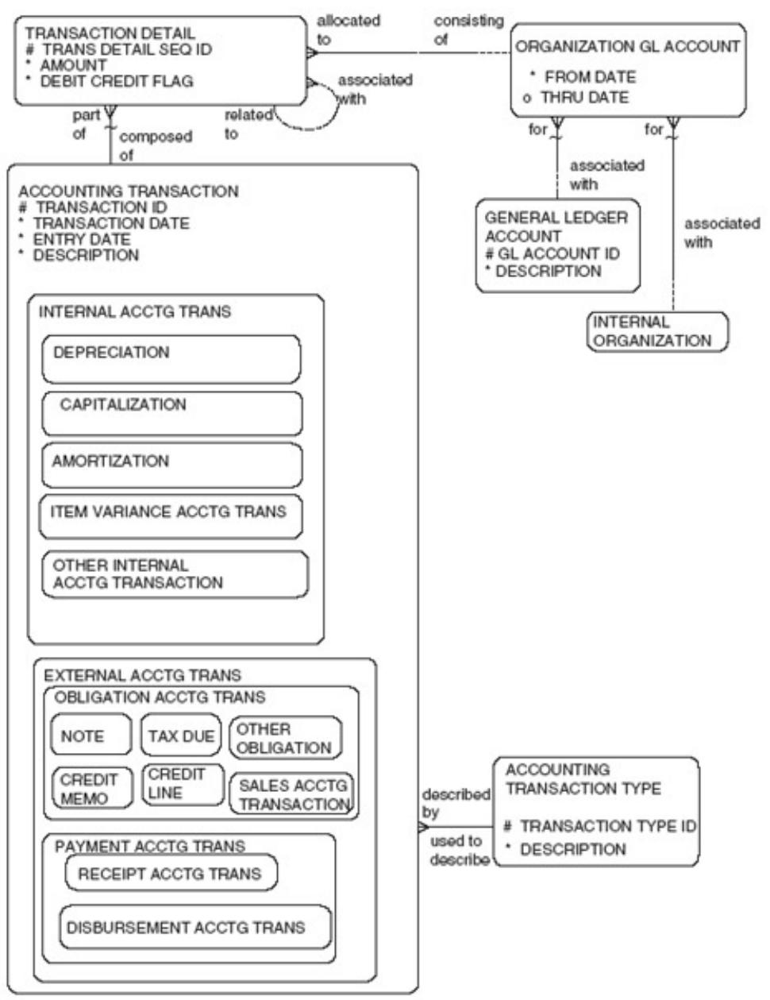

# Transaction Detail

As shown in Figure 8.3a, each ACCOUNTING TRANSACTION must be composed of one or more TRANSACTION DETAILS, which show how each part of the transaction affects a specific ORGANIZATION GL

ACCOUNT. A TRANSACTION DETAIL instance corresponds to a "journal entry line item" in accounting terms.

According to the principles of double-entry accounting, each transaction has at least two detail records, a debit and a credit. For instance, an ACCOUNTING TRANSACTION of type INVOICE may result in two TRANSACTION DETAIL instances: a debit to the general ledger account "accounts receivable" (showing that moneys are due) and a credit to the general ledger account "revenue" (showing that revenue is recognized). Table 8.4 illustrates the details of this transaction (transaction ID 38948 in the table).

Table 8.4 Transaction Detail

<table><tr><td rowspan="2">TRANSACTION ID</td><td rowspan="2">TRANSACTION DESCRIPTION</td><td colspan="2">TRANS DETAIL</td><td rowspan="2">DEBIT/CREDIT FLAG</td><td rowspan="2">ORGANIZATION GL ACCOUNT</td></tr><tr><td>SEQ ID</td><td>AMOUNT</td></tr><tr><td>32389</td><td>Depreciation on equipment</td><td>1</td><td>$200</td><td>Debit</td><td>Depreciation expense (ABC Corporation)</td></tr><tr><td></td><td></td><td>2</td><td>$200</td><td>Credit</td><td>Accumulated depreciation for equipment (ABC Corporation)</td></tr><tr><td>38948</td><td>Invoiced amount due</td><td>1</td><td>$900</td><td>Debit</td><td>Accounts receivable (ABC Corporation)</td></tr><tr><td></td><td></td><td>2</td><td>$900</td><td>Credit</td><td>Revenue (ABC Corporation)</td></tr><tr><td>39776</td><td>Payment against invoice</td><td>1</td><td>$882</td><td>Debit</td><td>Cash (ABC Corporation)</td></tr><tr><td></td><td></td><td>2</td><td>$18</td><td>Debit</td><td>Discount expense (ABC Corporation)</td></tr><tr><td></td><td></td><td>3</td><td>$900</td><td>Credit</td><td>Accounts receivable</td></tr><tr><td>47874</td><td>Payment received for sale of pen engraver</td><td>1</td><td>$1000</td><td>Debit</td><td>Cash (ABC Corporation)</td></tr><tr><td></td><td></td><td>2</td><td>$200</td><td>Debit</td><td>Accumulated depreciation (ABC Corporation)</td></tr><tr><td></td><td></td><td>3</td><td>$800</td><td>Credit</td><td>Asset (ABC Corporation)</td></tr><tr><td></td><td></td><td>4</td><td>$400</td><td>Credit</td><td>Capital gain (ABC Corporation)</td></tr></table>

Each transaction is related to the general ledger account within a specific internal organization, which is why the organization GL account column of Table 8.4 references the "ABC Corporation" in parentheses. Appropriate business rules need to be put in place to make sure that the organization associated with the ORGANIZATION GL ACCOUNT makes sense in relation to the PARTY associated with the ACCOUNTING TRANSACTION. For instance, if there is an INTERNAL TRANSACTION for ABC Corporation, then the TRANSACTION DETAIL records need to be related to

ORGANIZATION GL ACCOUNTS of "ABC Corporation" and not of another internal organization.

The transaction ID and the trans detail seq id uniquely identify the TRANSACTION DETAIL because it is a detail record that breaks down the ACCOUNTING TRANSACTION. The debit/credit flag indicates whether the transaction detail is posted as a debit or credit to the appropriate general ledger account. The amount indicates the amount of that portion of the transaction. Many physical database designs implement the debit/credit flag as a positive or negative sign within the amount field so that arithmetic functions can be easily used to offset debits and credits.

It was stated that an ACCOUNTING TRANSACTION has at least two TRANSACTION DETAIL records. In many cases, an accounting transaction may have more than two detail entries. Consider the third transaction in Table 8.4, transaction ID 39776. This transaction was a payment against an invoice with a 2 percent discount taken for early payment. The transaction resulted in three detail records, a credit to clear the accounts receivable of  $900, a cash increase of$ 882, and a discount expense of $18.

The fourth transaction in Table 8.4 (transaction ID 47874) provides an example of an accounting transaction with four detail records. The sale of a piece of equipment, in this case the pen engraving

machine, resulted in a debit to cash of the  $1,000 received, a debit of$ 200 that clears the accumulated depreciation of the machine, a credit of  $800 that was the book value of the asset, and a credit to record the capital gain on the transaction of$ 400 ( $1,000 received minus the net value of the equipment of$ 600).

Relationships between Accounting Transaction Details

Businesses need to answer questions regarding the relationships between certain transactions. For example, which invoices have been paid off through which payments, and which invoices are still outstanding? Which invoices have been reduced via credit memos issued to customers? Which payments were subsequently sent back to the originating party because they did not correspond to an invoice or amount due?

The recursive relationship around TRANSACTION Detail provides the capability to track which accounting transaction details are associated with other transaction details. Using this recursive relationship, the model can provide the information to answer the previous questions.

Is there a need for TRANSACTION Detail recursions showing which payment was for which obligation? Is this not derived information, as one can see that a payment for $500 paid off an obligation of $500?

What if there were several obligations for $500? It is necessary to maintain which payment paid off which obligation. When partial payments occur, it is even more important to track which payments are paying off which obligations. Similarly, it is also important to track which obligations are related to which obligations (an invoice with a related credit, for example).

Table 8.5 illustrates how the model can be used to relate different accounting transactions to one another. A very common type of related transaction is what payments are made against which invoices. Transaction ID 38948 shows that  $\$ {900}$  is due as an accounts receivable. The next transaction shown (39776) is a payment that is applied to this invoice. The last column, Associated Transaction ID and TRANS Detail Seq ID, represents the recursive relationship from one transaction detail to another transaction detail. In this case, it identifies that the credit to accounts receivable is specifically regarding transaction 38948, which was the original invoice that was paid off.

Table 8.5 Transaction Detail Relationships

<table><tr><td>TRANSACTIONID</td><td>TRANSACTIONDESCRIPTION</td><td>TRANSDETAILSEQ ID</td><td>AMOUNT</td><td>DEBIT/CREDIT</td><td>ORGANIZATIONGL ACCOUNT</td><td>ASSOCIATEDTRANSACTION ID ANDTRANS DETAIL SEQ ID</td></tr><tr><td rowspan="2">38948</td><td rowspan="2">Invoiced amount due</td><td>1</td><td>$900</td><td>Debit</td><td>Accounts receivable (ABC Corporation)</td><td></td></tr><tr><td>2</td><td>$900</td><td>Credit</td><td>Revenue (ABC Corporation)</td><td></td></tr><tr><td rowspan="3">39776</td><td rowspan="3">Payment against invoice</td><td>1</td><td>$892</td><td>Debit</td><td>Cash (ABC Corporation)</td><td></td></tr><tr><td>2</td><td>$18</td><td>Debit</td><td>Discount expense (ABC Corporation)</td><td></td></tr><tr><td>3</td><td>$900</td><td>Credit</td><td>Accounts receivable (ABC Corporation)</td><td>38948, 1</td></tr><tr><td rowspan="2">50984</td><td rowspan="2">Invoiced amount due</td><td>1</td><td>$1000</td><td>Debit</td><td>Accounts receivable (ABC Corporation)</td><td></td></tr><tr><td>2</td><td>$1000</td><td>Credit</td><td>Revenue (ABC Corporation)</td><td></td></tr><tr><td rowspan="2">50999</td><td rowspan="2">Invoiced amount due</td><td>1</td><td>$2000</td><td>Debit</td><td>Accounts receivable (ABC Corporation)</td><td></td></tr><tr><td>2</td><td>$2000</td><td>Credit</td><td>Revenue (ABC Corporation)</td><td></td></tr><tr><td rowspan="3">60985</td><td rowspan="3">Payment against invoice</td><td>1</td><td>$3000</td><td>Debit</td><td>Cash (ABC Corporation)</td><td></td></tr><tr><td>2</td><td>$1000</td><td>Credit</td><td>Accounts receivable (ABC Corporation)</td><td>50984, 1</td></tr><tr><td>3</td><td>$2000</td><td>Credit</td><td>Accounts receivable (ABC Corporation)</td><td>50999, 1</td></tr></table>

Table 8.5 also shows that two invoices (transactions 50984 and 50999) were paid off via a single payment (transaction 60985). In this case, the transaction detail representing the "accounts receivable" entry was split into two detail records in order to identify the amounts allocated for each of the two invoices.

This model can accommodate any type of transaction relationship that occurs in accounting. For instance, it can provide the information to maintain credit memos that reduce invoice amounts (obligations related to other obligations), refunds of payments (payments related to other payments), partial payments applied to invoices (payments to obligations), and sales of depreciated equipment applied to the original purchase transaction (payments related to payments and to internal transactions; namely, depreciation).

Account Balances and Transactions

Should each TRANSACTION Detail be related to the ORGANIZATION GL ACCOUNT, as it is in the previous model, or should it be related to an entity that stores the balances for the account for each accounting period?

There is a strong argument for modeling the account balance as an entity. After all, the financial statements and other financial reporting will most likely be based on account balances, making this is a critical piece of information. Also, managers will frequently want to see the balance for a particular general ledger account for a period without necessarily looking up the related transactions. Furthermore, the related transactions may be archived for account balances for previous years.

The model in Figure 8.3a does not show the account balance as either an entity or attribute because the account balance amount is derived information from the transactions that affect the account. Whenever derived data is included in a data model, there is redundant information. When there is redundant information modeled in a system, data synchronization issues occur that can affect the accuracy of data. Regarding account balances, one can argue that the information doesn't change much after the period ends so it is not much of a data synchronization issue. Retroactive accounting adjustments for past periods could complicate matters and make the storing of account balances in a logical model unwise.

Certainly in the physical implementation of this logical model, it may be a good idea to include account balances for various time periods. Managers will no doubt need fast access to this information, and the physical design should not have to scan through the transactions associated with the general ledger account to determine the account balance.

Even though the modeling of account balance does not represent a "pure" data modeling practice, many data modelers would argue that it needs to be included for the model to be complete and practical. Therefore, Figure 8.3b shows an alternate model that includes account balance information. This data model would represent a very practical database design for implementation purposes.

Figure 8.3b Accounting transactions detail with account balances.

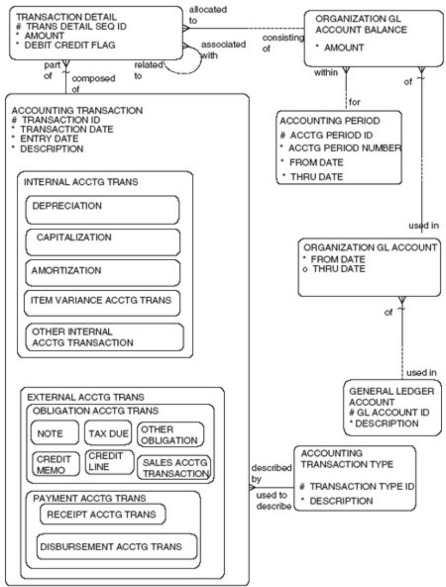
Figure 8.3b shows that the ORGANIZATION GL ACCOUNT BALANCE has been inserted between the TRANSACTION Detail and the ORGANIZATION GL ACCOUNT. This allows direct access to the critical attribute amount in the ORGANIZATION GL ACCOUNT BALANCE, which stores the current balance of the ORGANIZATION GL ACCOUNT for a certain ACCOUNTING PERIOD.

# Subsidiary Accounts

In accounting, organizations often keep subsidiary ledgers to track the status of specific accounts. There may be an "accounts receivable" general ledger account to show how much is owed to the enterprise. This account may be composed of accounts receivable subsidiary ledger accounts showing the amounts owed and paid for each bill-to customer or other party that owes moneys. Similarly, the general ledger "accounts payable" account has subsidiary ledger accounts, each of which represents suppliers or other parties that owe money to the enterprise. General ledger accounts to represent various products or product categories may also be captured as separate general ledger accounts and rolled into an overall product revenue account.

Figure 8.4 provides a data model to capture the information requirements of subsidiary ledgers. The diagram has a recursive relationship showing that each ORGANIZATION GL ACCOUNT may comprise one or more other ORGANIZATION GL ACCOUNTs. The parent general ledger account represents an account such as accounts payable or accounts receivable. The recursive comprised of relationship relates to the associated subsidiary ledger accounts, which each maintain information about a specific customer, supplier, product, or product category. Each of those subsidiary accounts may be related to other entities in the data model such as BILL TO

CUSTOMER (a subtype of PARTY ROLE), SUPPLIER (a subtype of PARTY ROLE), PRODUCT, or PRODUCT TYPE. General ledger accounts may be related to particular products in order to track the revenues produced by a specific product, or if there are a great deal of products, then the general ledger accounts may be related to product categories.


Figure 8.4 General ledger account associations and subsidiary ledger accounts.

Subsidiary general ledger accounts are related to the roles of BILL TO CUSTOMER and SUPPLIER, which represent very specific roles of

parties. It could be that other parties in other roles owe moneys to the enterprise and/or the enterprise owes moneys to them.

Therefore, the model could show relationships to PARTY as an alternate, more generic structure, instead of tying them to the specific roles of BILL TO CUSTOMER and/or SUPPLIER.

# Asset Depreciation

Additional entities are used to determine how certain accounting transactions are calculated. This section illustrates the means by which a common type of internal transaction, namely, depreciation, is calculated.

As shown in Figure 8.5, each DEPRECIATION transaction is specifically for one and only one FIXED ASSET (described in Chapter 6). A FIXED ASSET may be depreciated using DEPRECIATION METHODS. The same depreciation method may be used to depreciate more than one fixed asset, and a fixed asset may have more than one DEPRECIATION METHOD over time because a fixed asset's depreciation method may change (although this may be regulated by agencies such as the IRS). Therefore, the FIXED ASSET DEPRECIATION METHOD entity documents which depreciation method was used on each fixed asset during various periods of time.

# Figure 8.5 Asset depreciation.

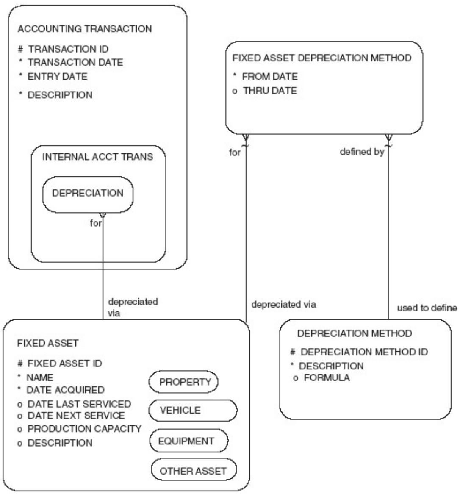

The DEPRECIATION METHOD entity has a description attribute that specifies the type of depreciation such as "straight line depreciation" or "double declining balance depreciation." It also describes the formula for calculating depreciation. Table 8.6 illustrates examples of the type of information maintained for depreciation calculation purposes. In this example, the pen engraver used "double-declining balance" as a method for the year 1999;

starting in 2000, it began using the "straight-line depreciation"

method of depreciation. Although it may be very interesting to

describe the formulas behind these depreciation methods (for a very

select breed), this information can be found in any accounting book

and is beyond the scope of this book.

Table 8.6 Fixed Asset Depreciation Method

<table><tr><td>FIXED
ASSET
NAME</td><td>DEPRECIATION
METHOD
DESCRIPTION</td><td>DEPRECIATION
METHOD
FORMULA</td><td>FROM DATE</td><td>THRU DATE</td></tr><tr><td>Pen Engraver</td><td>Double-declining balance depreciation</td><td>(Purchase cost - salvage cost)* (1/estimated life in years of the asset)*2</td><td>Jan 1, 1999</td><td>Dec 31, 1999</td></tr><tr><td></td><td>Straight-line depreciation</td><td>(Purchase cost - salvage cost)/estimated life in years of the asset</td><td>Jan 1, 2000</td><td></td></tr></table>

# Budget Definition

Another aspect of financial control is budgeting. Figure 8.6 illustrates a data model that provides information on budgets that are set up to monitor the spending of moneys. Each BUDGET may be an OPERATING BUDGET for expense type items or a CAPITAL BUDGET for fixed assets and long-term items.

Figure 8.6 Budget definition.

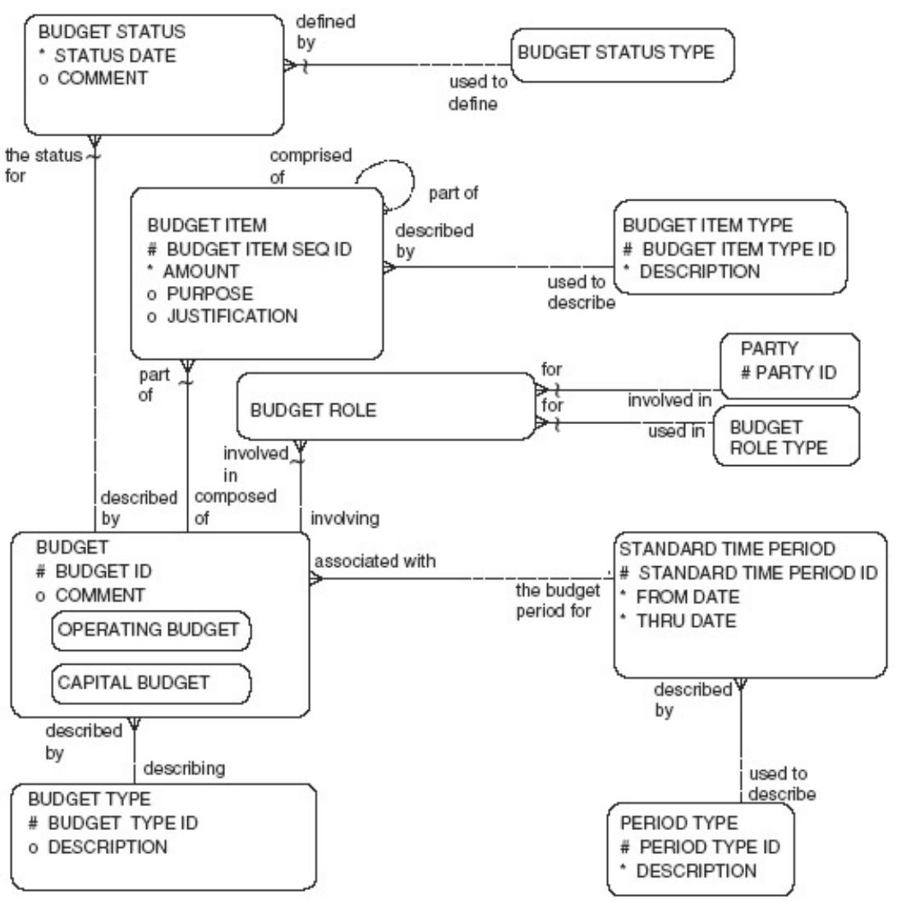

The BUDGET TYPE allows the flexibility to categorize other types of budgets according to the needs of the organization. The BUDGET entity describes the information about the amounts of moneys needed for a group of expense items over a certain period of time. STANDARD TIME PERIOD maintains possible time periods for which budgets could be allocated. Each BUDGET may have many parties involved in various BUDGET ROLES and several BUDGET STATUSes over time. BUDGET ROLES for PARTYs (which may be a person or an

organization) include the initiator of the budget request, the party for whom the budget is requested, the reviewer(s) of a budget, and the approver of the budget. Each BUDGET must be composed of one or more BUDGET ITEMS, each of which is described by a BUDGET ITEM TYPE that describes the budgeted items. BUDGET ITEMS may be recursively related to other BUDGET ITEMS, allowing for a hierarchy of budget item rollups.

# Budget

Budgets are mechanisms for planning the spending of moneys. Figure 8.6 has a BUDGET entity that describes the key information regarding budgets. A budget is uniquely identified by a budget ID. The relationship to STANDARD TIME PERIOD identifies the time period for which the budget applies, including the from date and thru date for that period. This may represent different types of periods for different enterprises. The entity PERIOD TYPE identifies the particular type used by each defined period. Common period types are "month," "quarter," or "year." The description attribute describes the budget at a high level.

Table 8.7 illustrates examples of the information in the BUDGET entity. Budget ID 29839 represents the 2001 annual budget submitted by the marketing department of ABC Corporation for its marketing expenses. Budget ID 38576 is a monthly budget, for June

of 2002, from the administration department of ABC Corporation for its planned office expenses. Budget 39908 is a capital budget for the purchase of manufacturing machines in 2001.

Table 8.7 Budget Data

<table><tr><td>BUDGET ID</td><td>BUDGET TYPE</td><td>PARTY FOR WHOM BUDGET IS REQUESTED</td><td>BUDGET PERIOD</td><td>PERIOD TYPE</td><td>BUDGET DESCRIPTION</td></tr><tr><td>29839</td><td>Operating budget</td><td>Marketing department</td><td>1/1/2001-12/31/2001</td><td>Year</td><td>Marketing budget</td></tr><tr><td>38576</td><td>Operating budget</td><td>Administration department</td><td>6/1/2002-6/30/2002</td><td>Month</td><td>Office expenses budget</td></tr><tr><td>39908</td><td>Capital budget</td><td>Manufacturing operations</td><td>1/1/2001-12/31/2001</td><td>Year</td><td>New manufacturing machines needed</td></tr></table>

Notice that budgets are defined for individual parties that may be departments, divisions, organizations, or whatever organizational structure the enterprise uses. The budget should be defined at the lowest level in the organizations, thus allowing the enterprise the ability to roll up budgeted amounts to various levels.

# Budget Item

Each BUDGET must be composed of one or more BUDGET ITEMS, which store the details of exactly what is being budgeted. The amount attribute defines the total amount of funds required for the item within the time period. The purpose attribute identifies why the items are needed, and the justification attribute describes why the budgeted amount of money should be expended. Each BUDGET

ITEM is described by a BUDGET ITEM TYPE so that common budget item descriptions can be reused. BUDGET ITEMS may be comprised of other BUDGET ITEMS via the recursive relationship around BUDGET ITEM. Table 8.8 provides two simple examples of budget items within the budgets described in the previous section.

Table 8.8 Budget Item

<table><tr><td>BUDGET ID</td><td>BUDGET DESCRIPTION</td><td>BUDGET ITEM SEQ</td><td>BUDGET ITEM DESCRIPTION</td><td>AMOUNT</td><td>PURPOSE</td><td>JUSTIFICATION</td></tr><tr><td>29839</td><td>Marketing budget</td><td>1</td><td>Trade shows</td><td>$20,000</td><td>Connect directly with various markets</td><td>Last year, this amount was spent and it resulted in three new clients</td></tr><tr><td></td><td></td><td>2</td><td>Advertising</td><td>$30,000</td><td>Create public awareness of products</td><td>Competition demands product recognition</td></tr><tr><td></td><td></td><td>3</td><td>Direct mail</td><td>$15,000</td><td>To generate sales leads</td><td>Experience predicts that one can expect 50 leads for every $5,000 expended</td></tr><tr><td>38576</td><td>Office expenses budget</td><td>1</td><td>Office supplies</td><td>$5,000</td><td>Supplies needed to perform office administration tasks</td><td>This is the amount expended last year and is required again</td></tr><tr><td></td><td></td><td>2</td><td>Furniture</td><td>$10,000</td><td>For new facility on Benjamin Street</td><td>New facility needs some basic items of furniture</td></tr></table>

# Budget Status

Each BUDGET generally moves through various stages as the budget process unfolds. A budget is typically created on a certain date, reviewed, submitted for approval, then accepted, rejected, or sent back to the submitter for modifications.

Figure 8.6 shows that each BUDGET has one or more BUDGET STATUSes over time, each of which is described by a BUDGET STATUS TYPE, which is another subtype of STATUS TYPE. This structure provides for the tracking of the history of a budget through its various stages.

Table 8.9 illustrates examples of budget statuses. Notice that on November 15 when the budget was sent back to the submitter for modifications, it created the need for a new revision of the budget, which will be discussed in the next section.

Table 8.9 Budget Status

<table><tr><td>BUDGET ID</td><td>STATUS DATE</td><td>BUDGET STATUS
TYPE DESCRIPTION</td><td>COMMENT</td></tr><tr><td>29839</td><td>Oct 15, 2000</td><td>Created</td><td></td></tr><tr><td>29839</td><td>Nov 1, 2000</td><td>Submitted</td><td></td></tr><tr><td>29839</td><td>Nov 15, 2000</td><td>Sent back for modifications</td><td>Management agreed with the types of items budgeted; however, it asked that all amounts be lowered.</td></tr><tr><td>29839</td><td>Nov 20, 2000</td><td>Submitted</td><td></td></tr><tr><td>29839</td><td>Nov 30, 2000</td><td>Approved</td><td></td></tr></table>

# Budget Revision

Each budget will usually go through a process whereby several budget revisions are created for a BUDGET. Figure 8.7 provides two alternatives for how BUDGET REVISION information may be stored, depending on the needs of the enterprise. If the enterprise does not need to track each change to a budget and if it considers each

revision to a budget a whole new budget, then the top model will work. If the enterprise wants to track changes to each budgeted item over time, then the bottom model is needed.

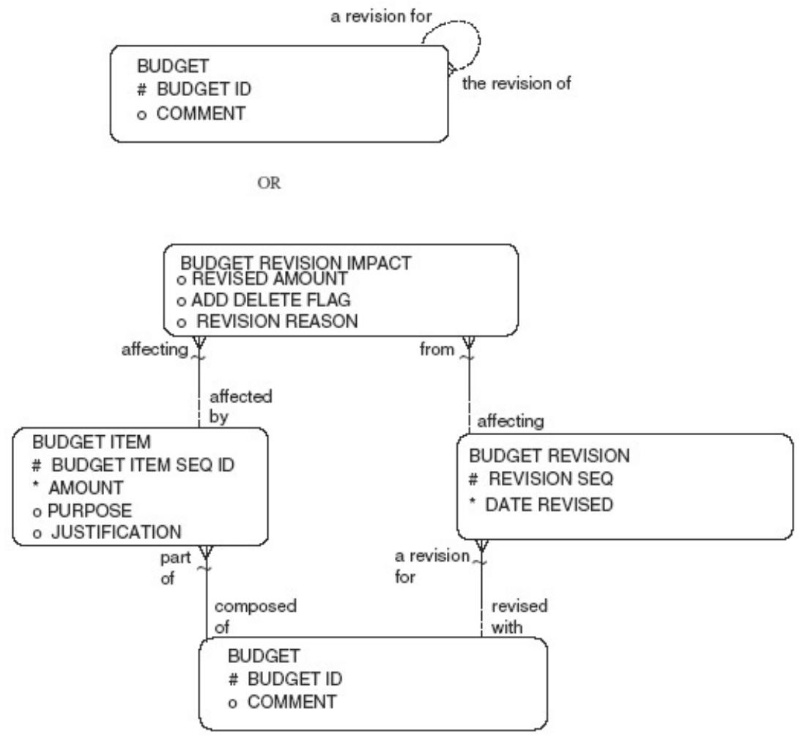
Figure 8.7 Budget revisions.

The top model in Figure 8.7 simply shows that budget revisions may simply be handled by creating and maintaining a whole new budget each time a revision is needed. The old budget can then be related to the next budget via the recursive relationship around BUDGET.

While this model is very simple, the disadvantage is that the whole budget needs to be rerecorded, even though many of the budgeted items may remain consistent from one revision to the next. Also, this model will not track the history of changes that were made from one budget revision to the next. This model is designed for organizations with relatively simply budgets and budgeting needs.

The bottom model in Figure 8.7 shows that each BUDGET may have one or more BUDGET REVISIONs over time, which can affect many parts of the BUDGET. Each BUDGET is composed of one or more BUDGET ITEMS, each of which may be affected by one or more BUDGET REVISION IMPACTs. Each BUDGET REVISION may affect more than one BUDGET ITEM and vice versa, thus resulting in the many-to-many relationship between BUDGET ITEMS and BUDGET REVISIONs, resolved by the BUDGET REVISION IMPACTs, which is an associative entity.

The revised amount attribute of BUDGET REVISION IMPACT maintains the reduction or increased amount of a budgeted item. The add delete flag shows which budget items have been added or deleted according to the budget revision. The revision reason attribute shows why each budgeted item needed to be changed.

Because budgets may go through many revisions or versions, the BUDGET REVISION entity is used to maintain each revision in its

entirety. Each BUDGET REVISION is uniquely identified by the budget ID and the revision seq that specifies the version of the budget.

Table 8.10 illustrates examples of the information in the BUDGET REVISION entity. This example shows that budget 29839 had two revisions, 1.1 and 1.2.

Table 8.10 Budget Revision Impact

<table><tr><td>BUDGET ID</td><td>BUDGET DESCRIPTION</td><td>REVISION NUMBER</td><td>A REVISION OF</td><td>BUDGET REVISION IMPACT REASON</td><td>BUDGET REVISION IMPACT RELATIONSHIP TO BUDGET ITEM</td><td>BUDGET REVISION IMPACT AMOUNT</td><td>ADD DELETE FLAG</td></tr><tr><td>29839</td><td>Marketing budget</td><td></td><td></td><td></td><td></td><td></td><td></td></tr><tr><td>29839</td><td>Marketing budget</td><td>1.1</td><td>29839</td><td>Needed to substantially cut advertising</td><td>29839, item 2</td><td>-$10,000</td><td></td></tr><tr><td></td><td></td><td></td><td></td><td>Needed to substantially cut direct mail</td><td>29839, item 3</td><td>-$7,000</td><td></td></tr><tr><td></td><td></td><td></td><td></td><td>Need to add budget for internet advertising</td><td>29839, item 4</td><td>+$5,000</td><td>Added</td></tr><tr><td>29839</td><td>Marketing budget</td><td>1.2</td><td>29839</td><td>Direct mail budget still needs to be reduced</td><td>29839, items 3</td><td>-$2,000</td><td></td></tr></table>

The initial budget was subsequently revised by revision 1.1. Revision 1.1 consisted of changes to items 2 and 3 and adding an item for Internet advertising. This shows that a BUDGET REVISION can affect more than one BUDGET ITEM. Revision 1.2 was needed to adjust the direct mail budget again, showing that the same BUDGET ITEM

may be affected by more than one BUDGET REVISION. This example, which confirms the need for a many-to-many relationship, is accounted for using the BUDGET REVISION IMPACT entity, which stores the changes to the BUDGET ITEMS. With this structure, both the current and change history of the budget can be maintained and accessed.

# Budget Review

In the budgeting process several people may be involved in reviewing a budget for approval. Depending on the degree of formality in the budget process of the enterprise, there may be a need to track the results of each budget review. The BUDGET REVIEW, PARTY, and BUDGET REVIEW RESULT TYPE entities in Figure 8.8 provide for the tracking of the parties involved in budget reviews as well as the results of the budget review process.

# Figure 8.8 Budget review.

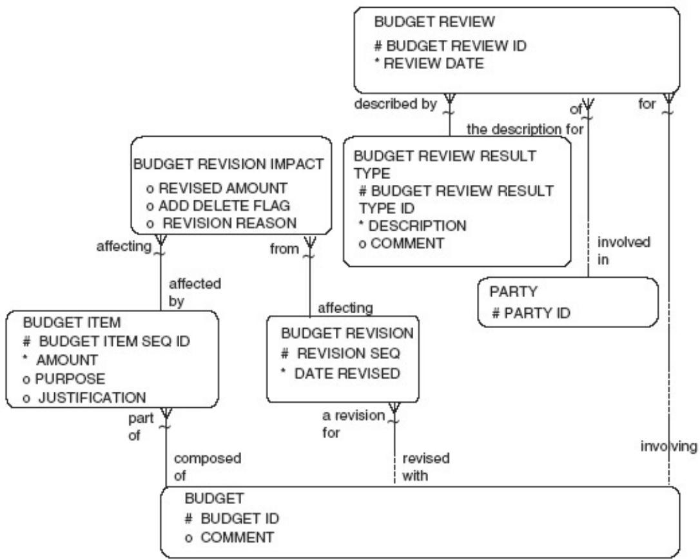

The BUDGET REVIEW entity provides the information about which parties were involved in the review process via the relationship from BUDGET REVIEW to PARTY. The review date identifies when they were involved in the review. The comment attribute allows any personal opinions about the review to be documented. Each person's decision regarding the budget review is indicated via the relationship to BUDGET REVIEW RESULT TYPE.

Is the budget review process related to the BUDGET entity or the BUDGET REVISION? While each revision may be reviewed, each BUDGET REVISION is really a part of the BUDGET and is thus

covered in the review process. Therefore, the BUDGET REVIEW is related to the BUDGET, which may include one or more BUDGET REVISIONs.

Table 8.11 illustrates the information that may be contained in the BUDGET REVIEW process. The example provides information on the people involved in the budget review process and their comments and conclusions. This information serves as supporting information regarding budget reviews and could ultimately affect the BUDGET STATUS, which was defined in Figure 8.6.

Table 8.11Budget Review

<table><tr><td>BUDGET ID</td><td>BUDGET REVISION PARTY ID</td><td>REVIEW DATE</td><td>BUDGET REVIEW RESULT DESCRIPTION</td><td>COMMENT</td></tr><tr><td>29839</td><td>Susan Jones</td><td>Nov 10, 2000</td><td>Accepted</td><td>Budget seems reasonable</td></tr><tr><td></td><td>John Smith</td><td>Nov 15, 2000</td><td>Rejected</td><td>Budgeted amount is too high</td></tr><tr><td>29839</td><td>Susan Jones</td><td>Nov 22, 2000</td><td>Accepted</td><td>Budget is OK</td></tr><tr><td></td><td>John Smith</td><td>Nov 30, 2000</td><td>Accepted</td><td>Budget is OK</td></tr></table>

One may think that the BUDGET REVIEW entity is related to the BUDGET STATUS because the result of the reviews may affect the budget revision status. In reality, there is not really a direct data relationship between these entities because reviews and statuses each exist independently for a budget. The enterprise, however, may maintain business rules to determine what review results would constitute moving from one status to the next.

# Budget Scenarios

Budgeted items frequently have different figures associated with them based on various scenarios. For example, there may be different moneys allocated to a budgeted item depending on whether the market conditions are excellent, fair, or poor. The data model then needs a way to show what the budgeted amount is for the items under different conditions or scenarios.

Figure 8.9 provides a model that allows variations on the amounts budgeted based on different BUDGET SCENARIOS. Each BUDGET SCENARIO has a description that stores the type of scenario such as "excellent market condition," "poor market conditions," "worst case," "best case," "major deal signed," "no major deal signed." This allows maintaining multiple budgeted figures based on these conditions. Each BUDGET or BUDGET ITEM may have several BUDGET SCENARIO APPLICATIONs, which store either an amount change or a percentage change for each BUDGET SCENARIO.

This means that these amounts or percentages may be applied uniformly across the whole budget (if it is related to the BUDGET) or may vary for each budgeted item (if it is related to the BUDGET ITEM). The amount change or percentage change maintains either the dollar amount of the change or the percentage of the change that is applied to each BUDGET ITEM amount, which will vary based on the particular BUDGET SCENARIO. For instance, there

may be  $\$ 10,000$ more in the budget item for “marketing” if the BUDGET SCENARIO description is “excellent market conditions,” but there will be - $\$ 5,000$ for the same BUDGET ITEM with a BUDGET SCENARIO of “poor market conditions.”


Figure 8.9 Budget scenario.

The BUDGET SCENARIO RULE stores the standard percentage change or amount change with which to raise or lower the amounts or percentages for standard BUDGET ITEM TYPES. These rules may be the default amounts or percentages tied to the BUDGET ITEM SCENARIO; however, they may be different than the values for specific budgeted items because more might be known at budgeting time.

Table 8.12 provides an example of the values that may be in budget scenarios. The table shows that the budgeted item amounts may vary based on different scenarios. The "trade show" budget is  $20,000; however the data structures provide for a 20 percent higher budget if there are excellent marketing conditions and 20 percent lower if poor marketing conditions. This implies that the budget is still$ 20,000 and is not changed in average marketing conditions. THE BUDGET SCENARIO RULE PERCENTAGE CHANGE column represents the suggested increase or decrease for the budget item type. The BUDGET SCENARIO APPLICATION PERCENTAGE CHANGE represents the actual percentage change that was used for the specific budget. The example that follows shows that the rule was used to define changes on scenarios for all budget items except for trade shows under "poor marketing conditions," where the budget specified -20 percent instead of the suggested -15 percent.

Table 8.12 Budget Scenarios

<table><tr><td>BUDGET ID</td><td>BUDGET DESCRIPTION</td><td>BUDGET ITEM SEQ</td><td>BUDGET ITEM TYPE DESCRIPTION</td><td>AMOUNT</td><td>BUDGET ITEM SCENARIO</td><td>BUDGET SCENARIO RULE PERCENTAGE CHANGE</td><td>BUDGET SCENARIO PERCENTAGE CHANGE</td></tr><tr><td>29839</td><td>Marketing budget</td><td>1</td><td>Trade shows</td><td>$20,000</td><td>Excellent marketing conditions</td><td>+20%</td><td>+20%</td></tr><tr><td></td><td></td><td></td><td></td><td></td><td>Poor marketing conditions</td><td>-15%</td><td>-20%</td></tr><tr><td></td><td></td><td>2</td><td>Advertising</td><td>$30,000</td><td>Excellent marketing conditions</td><td>+25%</td><td>+25%</td></tr><tr><td></td><td></td><td></td><td></td><td></td><td>Poor marketing conditions</td><td>-15%</td><td>-15%</td></tr><tr><td></td><td></td><td>3</td><td>Direct mail</td><td>$15,000</td><td>Over 2% return responses</td><td>+30%</td><td>+30%</td></tr><tr><td></td><td></td><td></td><td></td><td></td><td>Less than 1% return responses</td><td>-40%</td><td>-40%</td></tr></table>

# Usage and Sources of Budgeted Amounts

Now that budgets have been set up, how does the organization monitor whether financial commitments have the proper budgeting appropriated for them and monitor what commitments and expenses have been made to each budget item? Certain transactions, such as requirements, orders, and payments, may need to be related to budgeted items in order to monitor ongoing use of budgets. The following models may be used to track budgets for expenditures (usages of budgeted amounts) or to track budget revenues (sources of budgeted amounts).

Figure 8.10 provides a data model to answer these questions. Each ORDER ITEM may be authorized via and allocated to a specific BUDGET ITEM. This relationship establishes what commitments (and dollar amounts) have been made to various budget items. A REQUIREMENT may be funded via many BUDGET ITEMS (and vice versa) through the entity REQUIREMENT BUDGET ALLOCATION. This relationship provides information about the outstanding needs for the use of budgets.

Figure 8.10 Budget allocations.


The many-to-many relationship between PAYMENT and BUDGET ITEM is resolved by using a PAYMENT BUDGET ALLOCATION entity. The PAYMENT BUDGET ALLOCATION records both disbursements and receipts against budget items, but only for disbursements that do not have a corresponding order associated with them. For disbursements that have a purchase order, the relationship between

ORDER ITEM and BUDGET ITEM records the commitment of moneys against the budget. To determine the payment of moneys (which is the next step beyond the commitment) for disbursements that have a purchase order, the PAYMENT BUDGET ALLOCATION is not used because the budget item allocation can be derived from relationships from the PAYMENT to the corresponding PURCHASE ORDER ITEM of the purchase order.

The next two sections describe the model in Figure 8.10, which illustrates how to track commitments against budgeted amount, such as placing an order, as well as payments against budgets, such as the disbursement of funds.

# Commitments against Budgets

Most enterprises involved in budgeting are interested in two types of comparisons against the budget: what commitments exist against a budget item, and what has been expended against a budget item. This section addresses the information needed to track commitments against a budget.

After a budget is approved, enterprises are interested in tracking commitments against a budget. An item on a purchase order may establish a commitment against a budget item. Therefore, in Figure 8.10, the data model illustrates that each ORDER ITEM may be

allocated to one and only one BUDGET ITEM. The order item will generally be from a purchase order; however, for revenue budgets the same model can also be used for sales orders. For example, a purchase order item for 20 "Johnson Elite Pens" may be recorded against an administration department's budget item for "office supplies."

One may conclude that each purchase order item is for a specific product and that each product corresponds to a particular budget item. This would result in a PRODUCT to BUDGET ITEM relationship instead of the ORDER ITEM to BUDGET ITEM. Although this may work in some circumstances, the allocation of a commitment is very dependent on the particular situation and usually cannot be generalized.

Consider the purchase of a personal computer (PC). On one purchase order, the PC is used for a systems development project and is tied to the budget item for that project. On another purchase order for a PC, the PC is for a particular employee and may be allocated to a computer equipment budget item. Therefore, rather than perform budget allocations based on the product being ordered, the ORDER ITEM determines the allocation to a BUDGET ITEM so that individual circumstances can be accommodated.

Budget items may also be used to provide funding for REQUIREMENTS to determine if those requirements can actually be implemented. In other words, before committing to a requirement, there may be a need to allocate it to a budget item in order to determine if there is enough money in the budget for this item. The cost of the requirement may need allocation to one or more BUDGET ITEMS. Figure 8.10 shows that each REQUIREMENT may be allocated to many BUDGET ITEMS and that one BUDGET ITEM may be used to fund more than one REQUIREMENT. Hence, this many-to-many relationship is resolved with the entity REQUIREMENT BUDGET ALLOCATION. The amount attribute is used to store the dollar allocation information so that total requirements for any given item are easily calculated.

For example, an internal repair order (i.e., a work requirement) to repair a personal computer may have an estimated cost of \(50 per hour for the employee who is fixing it. This may represent a possible commitment toward a specific budget item such as "PC Repairs" (if the requirement is acted on). Over time, there could be many such orders against the same budgeted item.

On the other hand, a WORK REQUIREMENT for a project may require $100,000 total from several different budget items. In order to pay the project staff, the work order may need $80,000 from the BUDGET ITEM for "salary" that is included in a budget for research

projects. In addition, the project may also need $20,000 for office supplies, which comes from a budget item for "office supplies" in the overhead budget for the enterprise.

# Payments against Budgets

In addition to knowing what commitments have been made against budget items, organizations also want to know what payments have been made against each budget item. The commitment, such as a purchase order item, represents an obligation to pay, whereas the payment, such as a disbursement, represents actual payments made against the budget item.

The data model shown in Figure 8.10 provides the ability to capture payments against budgets under two different scenarios: when there is an order prior to the disbursement and when there is an payment without an order preceding it.

When there is an order prior to the payment, the payment may be traced back to the corresponding order item. This is necessary to determine how much of the purchase order item is now expended versus what was committed against the budget item. In other words, the data model tracks disbursements against the corresponding order that is tied to the budget item. For instance, a $50,000 purchase order for an "office supplies" budget item may

have a  $25,000 disbursement against it. The$ 50,000 represents the budget item commitment. The $25,000 represents disbursements against that commitment.

The PAYMENT is related back to the ORDER ITEM through a series of data model transversals. The PAYMENT is related to the INVOICE ITEM entity through the INVOICE PAYMENT ITEM APPLICATION. Then each INVOICE ITEM is related to either SHIPMENT ITEMS (for goods) or directly to the ORDER ITEM (for services purchased). The SHIPMENT ITEM is then related back to an ORDER ITEM of a purchase order.

Needless to say, the relationships from a disbursement back to the originating order item are very complex and require numerous business rules. For instance, payments may pay off partial orders or many orders for various shipments. The enterprise will need business rules regarding how to allocate the disbursements to the appropriate purchase orders.

While it may be complex to trace back a payment to an order, it is also necessary if the budget is to accurately reflect committed and expended amounts against a budget item. Whether the information is stored in the database or a person manually figures out the budget allocation, the same process needs to occur: The disbursement needs to be mapped to the corresponding invoice,

mapped to the shipment, then mapped to the order details, in order to figure out the proper budget allocation.

In some circumstances, an order may not be in place before the payment is made. For example, an employee may go out to a store and pay for items with a check, without a purchase order. Yet, this disbursement may still need to be allocated against a budget item. The data model shown in Figure 8.10 accommodates this circumstance by using the PAYMENT BUDGET ALLOCATION entity. This is an intersection entity between the BUDGET ITEM and the PAYMENT. The amount attribute records how much of each payment is allocated to each budget item.

Table 8.13 gives an example of a disbursement budget allocation. In this case, an employee went out to an office supplies store and wrote out a check for  $2,000 for the purchase of a chair and some office supplies. This payment needs to be allocated between two budget items: office supplies and furniture. The first two columns of the table describe the budget and the item budgeted. The next three columns describe information about the disbursement. The last column shows that$ 500 of the transaction was allocated to the "office supplies" budget item and $1,500 was allocated to the "furniture" budget item.

Table 8.13 Disbursement Budget Allocation

<table><tr><td>BUDGET ID</td><td>BUDGET ITEM TYPE DESCRIPTION</td><td>PAYMENT (DISBURSEMENT) ID</td><td>PAYMENT TRANSACTION DESCRIPTION</td><td>PAYMENT TRANSACTION AMOUNT</td><td>PAYMENT BUDGET ALLOCATION AMOUNT</td></tr><tr><td>38576</td><td>Office supplies</td><td>2903</td><td>Payment by check for a chair and office supplies</td><td>$2,000</td><td>$500</td></tr><tr><td>38576</td><td>Furniture</td><td>2903</td><td>Payment by check for a chair and office supplies</td><td>$2,000</td><td>$1,500</td></tr></table>

This budget data model is intended to accommodate not only the purchase order commitment and disbursement side of budgeting but also the projected revenue and receipts of moneys. The model in Figure 8.10 can be used to accommodate the usage and source of moneys, meaning tracking sales order commitments and receipts against budgeted projections.

The PAYMENT BUDGET ALLOCATION may be for a RECEIPT or DISBURSEMENT, thereby including receipts of moneys as they relate to projected sales invoices. Also, the relationship from BUDGET ITEM to ORDER ITEM should allow tracking of items on sales orders as well as purchase orders. This model allows the enterprise to set up budgets for incoming and outgoing moneys.

Budget Relationship to General Ledger

Budgets are used for different purposes than general ledger accounts. Budgets are used to monitor disbursements; general ledger accounts are used to report the financial performance of an

enterprise. Department managers may define budget items in any fashion that helps them control costs. Accountants categorize their chart of accounts to meet tax needs and various financial reporting needs.

Therefore, budget items may not correspond directly with general ledger accounts. It is very helpful (and sometimes required) to be able to tie budget items to general ledger accounts. An enterprise may want to see how much was budgeted and expended for a specific general ledger account such as "marketing expense."

Figure 8.11 shows a data model that relates budget item types to general ledger accounts. Each BUDGET ITEM TYPE may be related to many GENERAL LEDGER ACCOUNTS and vice versa. Therefore, the GL BUDGET XREF entity resolves the many-to-many relationship.

Figure 8.11 Budget relationship to general ledger.


Table 8.14 illustrates examples of relationships between budget items and general ledger accounts. The first example illustrates a situation that accountants love! When a departmental manager uses the general ledger account name for budgeting purposes, then the budget item ("office supplies") has a one-to-one mapping to the general ledger account ("office supplies expense").

Table 8.14 General Ledger Budget Xref

<table><tr><td>GENERAL LEDGER ACCOUNT NAME</td><td>BUDGET ITEM TYPE DESCRIPTION</td><td>GL BUDGET XREF ALLOCATION PERCENTAGE</td><td>GL BUDGET XREF FROM DATE</td><td>GL BUDGET XREF THRU DATE</td></tr><tr><td>Office Supplies Expense</td><td>Office supplies</td><td>100</td><td>Jan 1, 2001</td><td></td></tr><tr><td>Salaries Expense</td><td>Sales director</td><td>100</td><td>Jan 1, 2001</td><td></td></tr><tr><td>Salaries Expense</td><td>Sales representative</td><td>100</td><td>Jan 1, 2001</td><td></td></tr><tr><td>Trade Show Expense</td><td>Marketing</td><td>50</td><td>Jan 1, 2001</td><td></td></tr><tr><td>Advertising Expense</td><td>Marketing</td><td>50</td><td>Jan 1, 2001</td><td></td></tr></table>

The second example, illustrated by the second and third rows in Table 8.14, shows that many budget item types may correspond to a single general ledger account (this is still easy for accountants to track and audit). Budget items were set up for a sales director position and for a sales representative. These are both mapped to a general ledger account called "salaries expense."

The third example is the most complex and will require more work on the part of the enterprise to maintain correctly. The fourth and fifth rows of Table 8.14 show that "marketing" budget items should be mapped 50 percent to "trade show" and 50 percent to "advertising expense" general ledger accounts.

The rules for how budget items map to general ledger accounts may change over time. The from date and thru date attributes on the GL BUDGET XREF entity allow different mappings over time. This model assumes that the mappings will be the same for different organizations within an enterprise.

Budgeted Items versus General Ledger Accounts

The previous model showed that there are standard mappings from budget item types to general ledger accounts. Another common information requirement is to show the budgeted figures as they compare to general ledger accounts. For example, there may be budgets for certain classifications of expenses, for depreciation, for projected revenues, or for any other general ledger account.

The model in Figure 8.11 can be used to find out the budgeted amount for each general ledger account. Each BUDGET ITEM is of a BUDGET ITEM TYPE that relates to one or more GENERAL LEDGER ACCOUNTS (thru GL BUDGET XREF), which then relates to the ORGANIZATION GL ACCOUNT, hence tying the budget item amount back to the specific general account for an organization. This relationship transversal is complex because of the fact that there may be many-to-many relationships between general ledger accounts and budgets. If there is always a one-to-one correspondence, the model could be changed to put in a one-to-one relationship between the GENERAL LEDGER ACCOUNT and BUDGET ITEM TYPE instead of the associative GL BUDGET XREF.

Furthermore, with a one-to-one relationship, one could show budgeted amount as a field in the ORGANIZATION GL ACCOUNT in lieu of the BUDGET and BUDGET ITEM structures, if there was no need to store other budget information.

# Summary

There are many similar accounting and budgeting information requirements among various enterprises. This chapter has included data models to establish charts of accounts for internal organizations, track accounting transactions, set up budgets, record budget revisions, maintain budget scenarios, maintain budget review process information, record commitments and allocations against budgets, and cross-reference budgets to general ledger accounts.

Figure 8.12 shows an overall view of the accounting and budgeting models included in this chapter.

Figure 8.12 Overall accounting and budgeting model.


Please refer to Appendix A for a listing of entities and attributes. SQL scripts to build tables and columns derived from the logical models in this book can be found on the full-blown CD-ROM, which is sold separately.

# CHAPTER

# 9

# Human Resources

So far, this book has discussed models for handling much of the information an enterprise needs to conduct business: parties, products, orders, shipments, invoices, work efforts, and accounting. One critical section of the business remains for discussion: human resources, or HR. Without human resources, an enterprise cannot employ and use the key resources it needs to stay in business.

Information that an enterprise may want to keep includes the following:

- Who is employed, and what is the history of employments?
What positions exist in the company?
• Are they filled? If so, who has what position, and what are his or her responsibilities?
Who reports to whom?
What is the rate of pay for these positions?
Who received raises and when?
- What benefits does the enterprise provide and to whom?
What is the cost of these benefits?

- What is the status of employment applications?
What are the skills of employees?
What is the performance of employees?
- What are the preferences, deductions, and payroll information needed to process payroll?
- What applicants have there been, and how many of them have turned into employees?
- What has been the rate of turnover and the causes of turnover?

Why is it necessary to model human resource data given that enterprises usually buy a standard human resources package with its own data structure? One reason is that it is important to know what the information requirements are for the enterprise in order to drive a proper package selection. Another reason is that many enterprises implement a separate HR system, very often through a package that may not integrate well with other in-house systems.

This chapter illustrates a model that allows an enterprise to track basic human resources information and have it tied to other models presented in this book. The models presented in this chapter include the following:

- Standard human resources model (EMP DEPT model)
- Employment
- Position definition

- Position type definition
- Position fulfillment
- Position reporting
- Position fulfillment and tracking
- Salary determination and pay history
- Benefits tracking
Payroll information
- Employee application
- Employee skills and qualifications
- Employee performance (alternate model also provided)
- Employee termination

Standard Human Resources Model

A very basic model for employees, shown in many textbooks, is called the EMP DEPT model. Figure 9.1 shows this model. Each EMP (employee) has information such as his or her employee id (emp id), emp name, position, and date hired. Each EMP reports to another EMP, who is the manager, as shown in the recursive relationship from EMP to EMP. Each EMP is within a DEPT, which also has an ID and description.

Figure 9.1 Standard emp dept model.


Figure 9.1 is useful to demonstrate data model principles by using this simplified model of human resources. The models shown in this book will illustrate a much more effective human resources data model to maintain real-life human resource information requirements.

There are several simplifying structures in this standard model:

- Employee, manager, and departments are roles that should be ideally maintained as a subtype of PARTY ROLE so that a person or organization is not redundantly stated for each role played.
- The employment of an individual to an internal organization is an important PARTY RELATIONSHIP that is not shown.
• Positions are shown as an attribute in the standard model.
• POSITION is an important entity, which has its own information as

well as a many-to-many relationship with the employee (this will be explained later).

- The reporting structure showing one employee reporting to one and only one other employee is overly simplistic. For one thing, an employee may report to more than one manager through a dotted line or matrix structure. Another issue is whether the reporting structure really is from one employee to another. If John Jones gets promoted, do all the people that John had reporting to him also get promoted at that time? Is the reporting structure based on the person, or do positions really report to other positions?
- There is no history reflected in these data models. When did each employee have each position? When was he or she in each department? When was he employed with the organization?

The following universal data models for human resources will handle these questions and provide for a much more robust human resources data structure.

# Employment

What data structure could one use to model the employee-employer relationship? There is a from date and a thru date for the relationship, there is a status of the relationship, there may be associated agreements within the context of the relationship and

communication events within the relationship. These all represent information requirements for any relationship between two parties, or in other words, a PARTY RELATIONSHIP.

Figure 9.2 provides a data model to maintain employment information. EMPLOYMENT is a subtype of PARTY RELATIONSHIP and represents a relationship between the PARTY ROLES of EMPLOYEE and INTERNAL ORGANIZATION. This assumes that the enterprise is interested only in tracking its own employees. If the model needs to accommodate employees of external organizations as well, then the EMPLOYMENT entity should be between the EMPLOYEE and EMPLOYER instead.

Figure 9.2 Employment.


The EMPLOYMENT inherits the properties of PARTY RELATIONSHIP because it is a type of relationship between two parties. It inherits the fact that it has a from date, which would represent the start of the relationship or the hire date, as well as the thru date, which would be the last date of the employment. It inherits the relationship to PARTY RELATIONSHIP STATUS TYPE because each employment will have a status such as "active," "inactive," "pending," "terminated," and so on.

The EMPLOYMENT entity allows important pieces of information to be placed where they belong. For example, many data models will show the status of the employee when the data really represents the status of the employment. The status of “resigned” is not really the

status of that employee. That employee may have resigned from one subsidiary and then been hired by another subsidiary within the enterprise. The status of resigned is really the status of the EMPLOYMENT because it represents a piece of information about two parties, namely that the employee resigned from an internal organization.

This provides yet another example of the importance of distinguishing between attributes of the party versus those of the relationship (two parties). When these two entities get mixed up, (and they will get mixed up if there are not two different entities in the data model from which to reference a party versus a relationship), data inconsistencies and errors occur, leading to inaccurate data.

# Position Definition

What does a position represent? A POSITION represents a job slot in an enterprise that can be occupied by more than one person over time. In some enterprises, this may also be referred to as an FTE or full-time equivalent. For example, if the HR department of an organization was told that there were two positions (two FTEs) open for a junior programmer, that would indicate that they could hire two people. Each of these people may perform the same type of duties, but they would be filling two separate job slots. Over time, one of

these people may resign and be replaced by a third person. This third person would fill the existing position that had been vacated. This would not constitute a new position. (This will be explained further in the section on position fulfillment.)

In Figure 9.3 the entities used to define a position are modeled. The POSITION entity contains the basic information to track about any given job slot. The POSITION TYPE entity provides information for further defining and categorizing a job, while the BUDGET ITEM provides a possible means of authorizing a slot. The entities RESPONSIBILITY TYPE, VALID RESPONSIBILITY, and POSITION RESPONSIBILITY provide a mechanism for assigning and tracking what are the possible and actual responsibilities for any position.

Figure 9.3 Position definition.

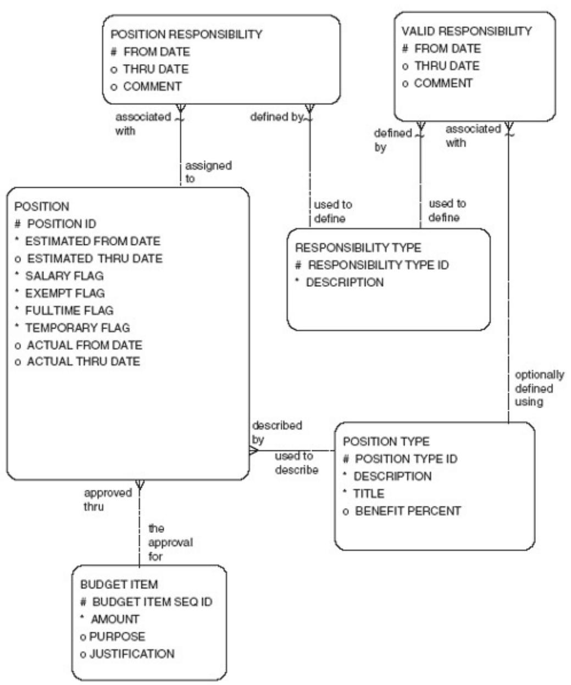

# Position

Some of the data an enterprise may wish to track about a POSITION is shown in Figure 9.3. The estimated from date and estimated thru date can be used for planning. This data is the first indication of when the enterprise expects to need a person to fill this role in

the organization. If the position is for an indefinite period, the estimated thru date would remain blank.

The various flags included in the entity help to define the particular circumstances under which a person hired for a position will be employed. Will the person be salaried or hourly? Is the position exempt or nonexempt under the Fair Labor Standards Act (FLSA)? Will this be a full-time or part-time position? Is it temporary or permanent? The answers to these questions will be very important for benefits administrators and payroll personnel. Additionally, the model includes an actual from date and actual thru date to allow tracking of this data once it is known. Sample data for some of these attributes is shown in Table 9.1.

Table 9.1 Position Data

<table><tr><td>POSITION ID</td><td>ESTIMATED FROM DATE</td><td>ESTIMATED THRU DATE</td><td>SALARY?</td><td>EXEMPT?</td><td>FULL-TIME?</td><td>TEMP?</td></tr><tr><td>101</td><td>Jan 1, 2001</td><td></td><td>Yes</td><td>No</td><td>Yes</td><td>No</td></tr><tr><td>204</td><td>Jun 1, 2001</td><td>Aug 31, 2001</td><td>Yes</td><td>Yes</td><td>Yes</td><td>Yes</td></tr></table>

Position Authorization

First, for a job to even exist in an enterprise, it must usually be approved and funded in some manner. In this model, positions can be approved through a BUDGET ITEM. One BUDGET ITEM may approve or fund one or more positions. For example, there may be a budget item for programmers. The amount of this budget item is

then used to fund the multiple programmer positions that the enterprise has. If a position is tied to a budget, then the position is considered “authorized” when the BUDGET STATUS for the BUDGET that affects BUDGET ITEM has been approved (see Chapter 8 for more on the BUDGET model).

# Position Type

Even though each job opening represents a single occurrence of POSITION, several of these openings could have some characteristics in common, such as a title or description of the type of job. Those common characteristics are represented by a common POSITION TYPE. The entity POSITION TYPE maintains information associated with all the slots that exist for a kind of job. Table 9.2 contains examples of this data.

Table 9.2 Position Type Data

<table><tr><td>POSITION
TYPE ID</td><td>DESCRIPTION</td><td>TITLE</td><td>BENEFIT
PERCENT</td></tr><tr><td>1100</td><td>Recommend proper policies, procedures, and mechanisms for conducting effective business.</td><td>Business Analyst</td><td>100</td></tr><tr><td>2200</td><td>Enter bookkeeping figures, file appropriate accounting papers, and perform administrative accounting tasks.</td><td>Accounting Clerk</td><td>50</td></tr></table>

As shown in the data, each POSITION TYPE will have a position type ID for identification, a brief description, and a standard job title. Other data that could be stored is the benefit percent, which records the percentage of benefits that an enterprise will pay for a

particular type of position. For example, the data in Table 9.2 indicates that the enterprise has made a decision to pay 100 percent of the benefits for all "business analyst" positions.

# Position Responsibilities

Also shown in Figure 9.1 are the entities RESPONSIBILITY TYPE, VALID RESPONSIBILITY, and POSITION RESPONSIBILITY. These will allow for the definition of various job responsibilities, identification of which responsibilities are appropriate for the different position types, and identification of responsibilities that are actually assigned to a given position. Notice that both VALID RESPONSIBILITY and POSITION RESPONSIBILITY have a from date and a thru date. These allow the enterprise to assign and track historically changing responsibilities for jobs and positions. In this way very specific and detailed job descriptions can be developed, while at the same time allowing for ongoing change.

To maintain a tightly integrated system, the enterprise may wish to establish business rules to control some of this data. Data checks could be developed to ensure that, if a certain RESPONSIBILITY TYPE is assigned as a POSITION RESPONSIBILITY, it is first identified as a VALID RESPONSIBILITY for the POSITION TYPE with which the POSITION is associated. For example, a new position for an "account representative" is created. One of the responsibilities is

to "create monthly sales report." Before that could be assigned, "create monthly sales report" would have to already exist as a VALID RESPONSIBILITY associated with the POSITION TYPE of "account representative." In addition, the from date and thru date in both entities could be compared to be sure that the assigned responsibility is actually valid for the assigned time period.

Position Type Definition

Some enterprises may need to further classify the types of positions they have. To help with this, the model shown in Figure 9.4 was developed. In it an optional entity POSITION TYPE CLASS is shown as an intersection between POSITION TYPE and POSITION CLASSIFICATION TYPE. Using these entities, additional groupings of types of positions can be done. Because it is possible that a POSITION TYPE could be reclassified over time, the POSITION TYPE CLASS entity with its attributes of from date and thru date are included to support the many-to-many relationship between POSITION TYPE and POSITION CLASSIFICATION TYPE. An example of possible data is shown in Table 9.3

Figure 9.4 Position type definition.

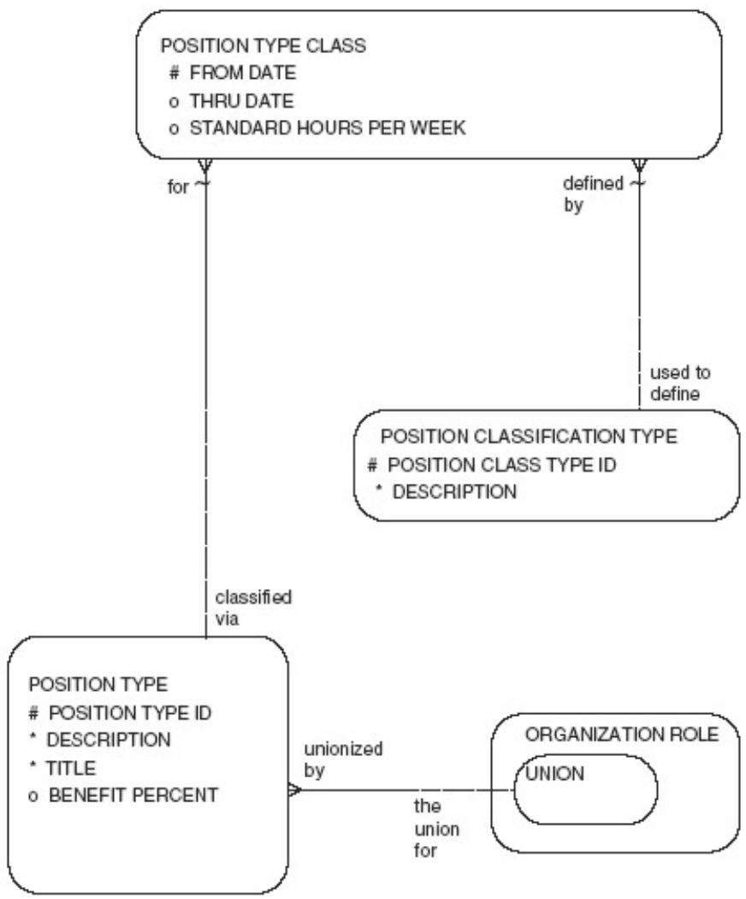

Table 9.3 Position Type Classification Data

<table><tr><td>POSITION TYPE</td><td>CLASSIFICATION TYPE</td><td>FROM DATE</td><td>THRU DATE</td></tr><tr><td>Programmer</td><td>Computer</td><td>Jan 1, 1995</td><td></td></tr><tr><td></td><td>Technical</td><td>Jan 1, 1995</td><td></td></tr><tr><td>System Administrator</td><td>Computer</td><td>Jan 1, 1995</td><td></td></tr><tr><td></td><td>Admin Support</td><td>Apr 1, 1997</td><td></td></tr><tr><td>Business Analyst</td><td>Computer</td><td>Jan 1, 1995</td><td>Dec 31, 1999</td></tr><tr><td></td><td>MIS</td><td>Jan 1, 2000</td><td></td></tr></table>

The data shown in Table 9.3 indicates that for the enterprise in question, the position types "programmer," "system administrator,"

and "business analyst" were at one time all classified as "computer" positions. Then in 2000, the "business analyst" was reclassified to "MIS." In addition to the "computer" classification, "programmer" is also classified as "technical" while the "system administrator" is considered "admin support." In any of the cases where the thru date is not included, it is assumed that the classification is still valid. Using this model, the enterprise can develop a very detailed and flexible classification system to meet its needs.

Some enterprises may wish to use the POSITION CLASSIFICATION TYPE entity to categorize how the position will offer pay. POSITION CLASSIFICATION TYPES could include data such as "hourly," "salary," "exempt," "non-exempt," "part-time," "full-time," "regular," or "temporary." Then, the entity POSITION TYPE CLASS would act as an historical list of these base classifications for a POSITION. Note that the POSITION entity currently shows binary attributes for pairs of these classifications. If this use is implemented with the listed data, then these attributes could be removed from POSITION. (In a physical model the enterprise may also want to implement this data as flags associated with a position slot for easier reporting of current data.)

Organization

Certain enterprises may need to track whether certain types of positions are unionized. This is handled through the relationship to UNION, which is a subtype of ORGANIZATION ROLE because a union is one type of organization. This information could be of vital importance during salary and benefits negotiations or in the case of a pending strike. If a position is protected through a union relationship, then the enterprise may have certain guidelines regarding these types of positions.

Position Fulfillment and Tracking

Figure 9.5 shows a model that will allow the enterprise to track each person's position history within the organization. It includes entities for tracking POSITION FULFILLMENT and POSITION STATUS TYPE. The model needs the entities POSITION and PERSON for context. ORGANIZATION is also included to provide information on the hiring company.

Figure 9.5 Position fulfillment.


# Position Fulfillment

A person can, of course, occupy more than one position either over time or at the same time. Conversely, a position may be filled by more than one person over time (and even at the same time through job sharing). The POSITION FULFILLMENT entity provides a very flexible way to retain the history of this activity. The attributes from date and thru date will allow the enterprise to keep historically accurate information about this data. It is a convenient and effective way to resolve the many-to-many relationship that

really exists between PERSON and POSITION. Some possible data is shown in Table 9.5.

The data given shows the career path of Mike Johnson as he moved progressively up the corporate ladder from the position of "mail clerk" to "CEO." Because the thru date for the "CEO" entry is blank, it is assumed that he currently holds that position. Also shown is the career of Sue Jones. She started in the position of "programmer" in 1995 then in 1997 took on the additional role of "business analyst." She was then promoted to "MIS manager" in 1999. Finally, she earned her current position as "CIO" (Chief Information Officer) on November 2, 2000.

A popular trend in many enterprises is the concept of job sharing. In this situation, two people fill one position. Both work part-time and share the responsibilities of the position. This is where the concept of an FTE (full-time equivalent) is most useful. With a job-share situation, the enterprise has authorized only one full-time position (one FTE), which constitutes one "head count." One half-time person plus another half-time person equals one FTE. The number of FTEs is the information needed for resource allocation, budgeting, reporting relationships, and such. Again, the information is related to or dependent on the position, not the person.

Another feature of the POSITION FULFILLMENT entity is that it can be used to record employee assignments in a job-sharing situation without confusing the FTE or head count. This is due to the fact that the primary key of this entity is the combination of an inherited key from POSITION (position ID), an inherited key from PERSON (party ID), and the attribute from date. With this three-part key, it is possible to record more than one person as having accepted the same position during the same time period. Of course, whether this is allowable could be controlled by implementing some business rules. If an enterprise never does job sharing, then the model could be changed to enforce this by removing the relationship to PERSON and hence removing the party ID from the compound key. If that were done, then the model would allow one and only one person to occupy a position during the same time period (even in this case, some business rules will be needed).

Note that it is also possible that a person from outside of the organization could fill a position that was authorized, such as a contractor. Because this model shows that POSITION FULFILLMENT must be accepted by a PERSON and not an EMPLOYEE, it is much more flexible than standard models and can handle this situation. To determine if the person is an employee or a person external to the enterprise the PARTY RELATIONSHIP entity may be used (refer to Chapter 2). Because it contains this information, PARTY

RELATIONSHIP could also be used to enforce business rules such as whether positions may be filled by non-employees.

Position Status Type

The POSITION STATUS TYPE identifies the current state of a position. When a position is first identified, it is in a state of "planned for." When the enterprise decides to pursue fulfillment of the position, it may then change to a state of "active" or "open." If the enterprise then decides that it no longer needs that position, the status may be "inactive" or "closed." A "fulfilled" status would not be a value because this information can be derived from the POSITION FULFILLMENT entity.

Hiring Organization

What is the hiring company for the position? This is easily tracked via a relationship between POSITION and ORGANIZATION. Without the enterprise doing the hiring, there would be no need for a position.

Other Considerations

Some other information not obvious in this model concerns how a person actually gets offered an open position. In fact, the interview process can be tracked through the PARTY COMMUNICATION EVENT

model (see Figure 2.12). An interview is a COMMUNICATION EVENT PURPOSE TYPE with interview notes stored in the entity COMMUNICATION EVENT. See Chapter 2 for more details on this model.

By using the POSITION FULFILLMENT model, combined with the model for position reporting, an enterprise can retain and access a complete picture of its organization and structure at any point in time.

Position Reporting Relationships

Most data models show people reporting to and managed by other people. As discussed in Chapter 2, common models for people and organizations are generally oversimplified. Many models show an EMPLOYEE entity with a recursive relationship for the manager. In a large and dynamic organization, this structure could result in a lot of updating and possible data inconsistencies.

The problem is that in reality the reporting structure is a function of the organizational structure of the enterprise, not of the people in the positions. If it really was a function of the person, then when a person gets promoted, everyone who was previously reporting to that person would still be reporting to that person after the promotion. This is usually not the case. In most instances, when a

supervisor is promoted, the vacated supervisory position is filled by another person. The people who originally reported to the supervisor now report to a new person, but they still report to the same position. Instead of changing everyone's reporting relationships, the position reporting model handles this situation by changing one person's position assignment (further demonstrated later in the chapter).

Additionally, an enterprise may identify its position hierarchy before assigning people to the various positions. Certainly this is the case when an organization is first created. This situation also occurs when enterprises reorganize.

What happens when the simplified model is implemented is that usually only a picture of the organization structure at the current time is maintained. All history of reorganizations and promotions is lost. This can be a serious problem when, for example, an EEOC suit is filed against the enterprise and it becomes necessary to determine who occupied a position at a particular point in time and who was the supervisor. The model presented in Figure 9.6 solves this and other challenges.

Figure 9.6 Position reporting relationships.

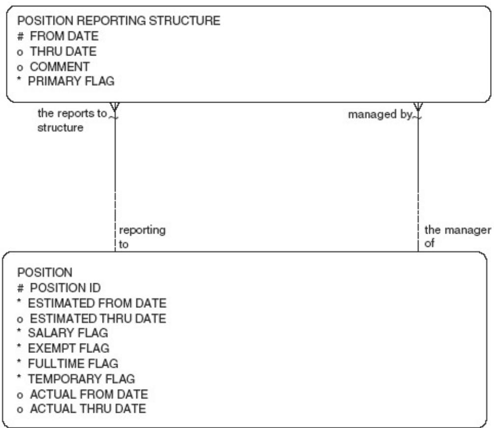

# Position Reporting Structure

The model in Figure 9.6 shows the entity POSITION REPORTING STRUCTURE, which links POSITION back to itself. The attributes from date and thru date are provided to allow for tracking organizational changes through time, as previously discussed. The primary flag attribute is included to help model flexible, matrix-type structures. In these cases, certain positions may report to more than one position at the same time. This indicator allows the enterprise to indicate which reporting relationship is the overriding one.

In the examples shown in Table 9.4, business analysts, system administrators, and programmer/analysts report to the director of IS. Suppose that the enterprise grows and subsequently creates an IS development manager position and a maintenance manager position that report to the director of IS. Instead of changing the reporting relationship of each of the people, the old reporting relationships of the positions would be expired (using the thru date) and new records could be added to show the revised structure. In this way, the enterprise can more easily implement the new reporting structure and at the same time retain an accurate history of previous structures.

Table 9.4 Position Reporting Relationship Data

<table><tr><td>REPORTING TO POSITION</td><td>THE MANAGER OF POSITION</td><td>FROM DATE</td><td>THRU DATE</td><td>PRIMARY FLAG</td></tr><tr><td>Director of Business Information Systems</td><td>Business Analyst</td><td>Jan 1, 2000</td><td>Dec 30, 2000</td><td>Yes</td></tr><tr><td></td><td>Systems Administrator</td><td>Jan 1, 2000</td><td>Dec 31, 2000</td><td>Yes</td></tr><tr><td></td><td>Programmer/Analyst</td><td>Jan 1, 2000</td><td>Dec 31, 2000</td><td>Yes</td></tr><tr><td>IS Development Manager</td><td>Business Analyst</td><td>Jan 1, 2001</td><td></td><td>Yes</td></tr><tr><td></td><td>Systems Administrator</td><td>Jan 1, 2001</td><td></td><td>No</td></tr><tr><td></td><td>Programmer/Analyst</td><td>Jan 1, 2001</td><td></td><td>Yes</td></tr><tr><td>Maintenance Manager</td><td>Systems Administrator</td><td>Jan 1, 2001</td><td></td><td>Yes</td></tr><tr><td></td><td>Programmer/Analyst</td><td>Jan 1, 2001</td><td></td><td>No</td></tr></table>

Table 9.5 Position Fulfillment Data

<table><tr><td>PERSON</td><td>POSITION</td><td>FROM DATE</td><td>THRU DATE</td></tr><tr><td>Mike Johnson</td><td>Mail Clerk</td><td>May 31, 1980</td><td>Jun 1, 1980</td></tr><tr><td></td><td>Mail Supervisor</td><td>Jun 1, 1980</td><td>Dec 31, 1983</td></tr><tr><td></td><td>Office Manager</td><td>Jan 1, 1984</td><td>May 31, 1990</td></tr><tr><td></td><td>Regional Manager</td><td>Jun 1, 1990</td><td>May 31, 1996</td></tr><tr><td></td><td>CEO</td><td>Jun 1, 1996</td><td></td></tr><tr><td>Sue Jones</td><td>Programmer</td><td>Mar 1, 1995</td><td>Feb 27, 1997</td></tr><tr><td></td><td>Business Analyst</td><td>Feb 28, 1997</td><td>Mar 14, 1999</td></tr><tr><td></td><td>MIS Manager</td><td>Mar 15, 1999</td><td>Nov 1, 2000</td></tr><tr><td></td><td>CIO</td><td>Nov 2, 2000</td><td></td></tr></table>

Notice that in the sample data, the current reporting relationships are identified where the thru date is blank. Alternatively, a thru date in the future could also indicate a current relationship with a preplanned end date. Note also that with the new structure, the "programmer/analyst" and "systems administrator" positions now report to both the "IS development manager" and the "maintenance manager" (these positions represent actual slots within the enterprise and not position types). They have split duties. In the case of the "systems administrator," the primary flag is set to "yes" for the relationship to the "maintenance manager"; it is the opposite for the "programmer/analyst" position. In this way it is possible to identify to which position each of these ultimately reports.

In larger enterprises, these changes to organization structure may affect hundreds or thousands of people. By designing a system that merely changes the reporting relationship of the position instead of the actual parties involved, fewer updates will be required and presumably data will be much cleaner in the long run.

The point is that positions and people are separate entities. The next section will discuss how people and positions are actually related.

Salary Determination and Pay History

The model presented in this section is an extended compensation model that handles both highly structured organizations such as the government or less structured organizations such as small private businesses (see Figure 9.7). This is done using the entities POSITION TYPE RATE, RANGE TYPE, PERIOD TYPE, PAY GRADE, and SALARY STEP. In addition, this model also includes entities and relationships to allow the tracking of salary history (i.e., PAY HISTORY and EMPLOYMENT).

Figure 9.7 Salary determination and history.

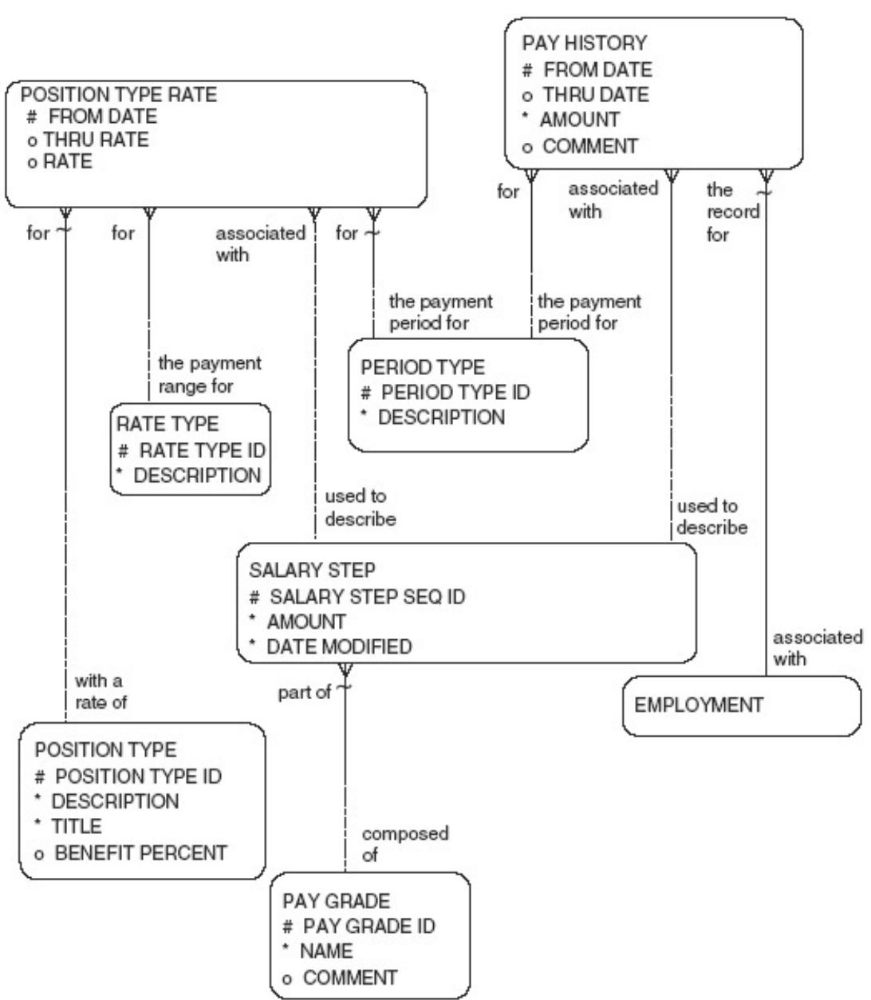

# Position Type Rate

The POSITION TYPE RATE and RATE TYPE entities were defined in Chapter 6 (see Figure 6.7) to provide the costs and standard rates for various types of positions in order to capture appropriate cost estimates for work efforts. This section will expand the use of this

entity to incorporate other types of position rates for tracking standard pay rates and ranges.

The POSITION RATE TYPE entity may be used to record the allowable or acceptable salary and salary ranges for a particular position type. This information could be used by managers during the hiring process when negotiating salary. A from date and thru date are included so that a history of these standards can also be kept.

The relationship to RATE TYPE provides the ability to record reference information such as "highest pay rate," "lowest pay rate," "average pay rate," and "standard pay rate," which represent different types of pay rates that can be captured for each type of position. This would indicate such things as the upper limit, average amount paid, lower limit, and the default, standard amount of pay for a type of position. The relationship to PERIOD TYPE will allow an enterprise to define various pay period types for which rates can be recorded. Examples of PERIOD TYPE include "per year," "per week," "per month," and so on. This relationship is part of the primary key to allow an enterprise to record information for multiple period types (i.e., average per hour and average per month). Table 9.6 contains sample pay rate data.

Table 9.6 Rate of Pay Data

<table><tr><td>POSITION TYPE</td><td>RATE TYPE</td><td>AMOUNT</td><td>PERIOD TYPE</td><td>FROM DATE</td><td>THRU DATE</td></tr><tr><td rowspan="8">Programmer</td><td>Average pay rate</td><td>$45,000</td><td>per year</td><td>Jan 1, 1990</td><td>Dec 31, 1999</td></tr><tr><td>Highest pay rate</td><td>$70,000</td><td>per year</td><td>Jan 1, 1990</td><td>Dec 31, 1999</td></tr><tr><td>Lowest pay rate</td><td>$25,000</td><td>per year</td><td>Jan 1, 1990</td><td>Dec 31, 1999</td></tr><tr><td>Standard pay rate</td><td>$30.00</td><td>per hour</td><td>Jan 1, 1990</td><td>Dec 31, 1999</td></tr><tr><td>Average pay rate</td><td>$55,000</td><td>per year</td><td>Jan 1, 2000</td><td></td></tr><tr><td>Highest pay rate</td><td>$90,000</td><td>per year</td><td>Jan 1, 2000</td><td></td></tr><tr><td>Lowest pay rate</td><td>$30,000</td><td>per year</td><td>Jan 1, 2000</td><td></td></tr><tr><td>Standard pay rate</td><td>$55.00</td><td>per hour</td><td>Jan 1, 2000</td><td></td></tr></table>

The sample data indicates that the enterprise in question has updated rate information for the position type "programmer" only once in 10 years. The rate of pay stayed the same from 1990 through 1999, then was increased in 2000. This organization kept information on the average, high, and low annual salary that it was willing to pay to programmers. It also kept track of a standard rate that was used to establish hourly pay.

Pay Grade and Salary Step

Additional information stored in this entity could also include a PAY GRADE and SALARY STEP for use in enterprises that have a predefined, highly structured pay system (such as the federal government). This is done by reference to a structured pay schedule. These types of schedules normally have two levels: a grade and a step. The SALARY STEP entity includes an amount attribute and is generally described in the context of a PAY GRADE. Table 9.7 includes part of a sample grade schedule.

Table 9.7 Pay Grade System Sample

<table><tr><td>GRADE ID</td><td>PAY GRADE NAME</td><td>SALARY STEP SEQ ID</td><td>SALARY STEP AMOUNT</td></tr><tr><td>1</td><td>GG-1</td><td>1</td><td>$10,000</td></tr><tr><td></td><td></td><td>2</td><td>$10,200</td></tr><tr><td></td><td></td><td>3</td><td>$10,400</td></tr><tr><td></td><td></td><td>4</td><td>$10,500</td></tr><tr><td></td><td></td><td>5</td><td>$10,800</td></tr><tr><td>2</td><td>GG-2</td><td>1</td><td>$10,450</td></tr><tr><td></td><td></td><td>2</td><td>$10,780</td></tr><tr><td></td><td></td><td>3</td><td>$11,200</td></tr><tr><td></td><td></td><td>4</td><td>$11,650</td></tr></table>

Notice that there is an overlap in the pay scale between "GG-1" and "GG-2." Step #1 for GG-2 falls between step #3 and step #4 of GG-1. This is not uncommon in these types of pay systems. It allows HR administrators some flexibility in negotiating pay for new employees. Because the grades are basically "set in stone" and tied to specific position types, the administrators are restricted as to what grades can be offered for any given position. To compensate for these restrictions, the range of pay covered by the steps of a grade are often very wide. Table 9.8 gives sample data for POSITION TYPE RATE where a grade system is used.

Table 9.8 Rate of Pay Sample #2

<table><tr><td>POSITION
TYPE</td><td>RATE
TYPE</td><td>POSITION
TYPE RATE</td><td>GRADE</td><td>SALARY
STEP SEQ ID</td><td>PERIOD
TYPE</td><td>FROM
DATE</td><td>THRU
DATE</td></tr><tr><td>Programmer</td><td>Average pay rate</td><td></td><td>GG-6</td><td>6</td><td>per year</td><td>Jan 1, 1990</td><td></td></tr><tr><td></td><td>Highest pay rate</td><td></td><td>GG-8</td><td>10</td><td>per year</td><td>Jan 1, 1990</td><td></td></tr><tr><td></td><td>Lowest pay rate</td><td></td><td>GG-5</td><td>1</td><td>per year</td><td>Jan 1, 1990</td><td></td></tr></table>

There are several things to notice in the data shown in Table 9.8. First, there are no values in the POSITION TYPE RATE rate column because, when using a pay grade system, the amount is taken directly from SALARY STEP. Business processes would, of course, need to be implemented to ensure that rate was not filled in; otherwise, there could be conflicting information. In implementing this model for use with a pay schedule, this attribute could be dropped. Conversely, when implementing the model for an enterprise that will not use a schedule, the POSITION TYPE RATE rate attribute should be mandatory.

Second, note that the thru date is also blank. This illustrates the concept that, over time, the dollar amount for a selected pay grade and step may increase, but the step assignment related to the POSITION TYPE RATE does not need to change. In this case, nothing needs to be changed in the pay rate records to indicate the increase in pay. In other words, there is no need to enter a thru date, then create a new record to show the pay increase because the pay increase is reflected via an update to the SALARY STEP information.

Pay History and Actual Salary

Actual salary or pay, represented by PAY HISTORY, is related to a person, not POSITION or POSITION TYPE. In fact, it is really related

to the EMPLOYMENT (which is a subtype of PARTY RELATIONSHIP) that exists between the employer and employee.

Salary is not related to POSITION because the position the person occupies can change over time, but that doesn't mean the salary will automatically change as well. Sometimes, a person is given more responsibility and placed in a higher-level position but is not given the salary raise until he or she demonstrates the capability of performing the duties appropriately. Also, consider again the job-sharing scenario. If the pay were tied to the position, both people would have to be paid the same. This would limit the flexibility of the enterprise to pay one party more than the other based on differing levels of skill or experience.

Depending on the nature of the enterprise, salary is represented by actual dollar amounts and optionally by the relationship to SALARY STEP. Unlike the POSITION TYPE RATE attribute of rate, amount is always recorded in PAY HISTORY to ensure that there is no confusion on what the person was paid during a given time period. Also, note that because this is a record of the actual rate of pay for a person, not a list of possible rates, there can be only one record for the person for any selected time period. The PERIOD TYPE associated with this record is determined by how the enterprise wants to see this data. See Table 9.9 for examples of this data.

Table 9.9 Pay History Data

<table><tr><td>EMPLOYER</td><td>EMPLOYEE</td><td>FROM DATE</td><td>THRU DATE</td><td>AMOUNT</td><td>PERIOD TYPE</td></tr><tr><td>ABC Corporation</td><td>John Smith</td><td>Jan 1, 1995</td><td>Dec 31, 1997</td><td>$45,000</td><td>per year</td></tr><tr><td></td><td></td><td>Jan 1, 1998</td><td>Dec 31, 2000</td><td>$55,000</td><td>per year</td></tr><tr><td></td><td></td><td>Jan 1, 2001</td><td></td><td>$62,500</td><td>per year</td></tr></table>

The data shown gives the record of pay for John Smith, who works for ABC Corporation. It shows his salary and increases over the past six years. Where the thru date is missing, assume that this indicates his current annual salary. With this kind of data, an enterprise can accurately track the salary history of its employees. If it is necessary to track the pay of outside parties, such as contractors, then the data model should relate PAY HISTORY to the supertype of PARTY RELATIONSHIP instead of the subtype EMPLOYMENT.

Benefits Definition and Tracking

In addition to salary or pay, most enterprises provide compensation through a benefits package. This could include vacation, health or life insurance, sick leave, or a retirement plan. The cost of these benefits may be partly or completely absorbed by the enterprise.

Figure 9.8 demonstrates a simplified model for benefits tracking. It includes the information on the PARTY BENEFITS for each BENEFIT TYPE within an EMPLOYMENT for each PERIOD TYPE.

Figure 9.8 Benefits tracking.

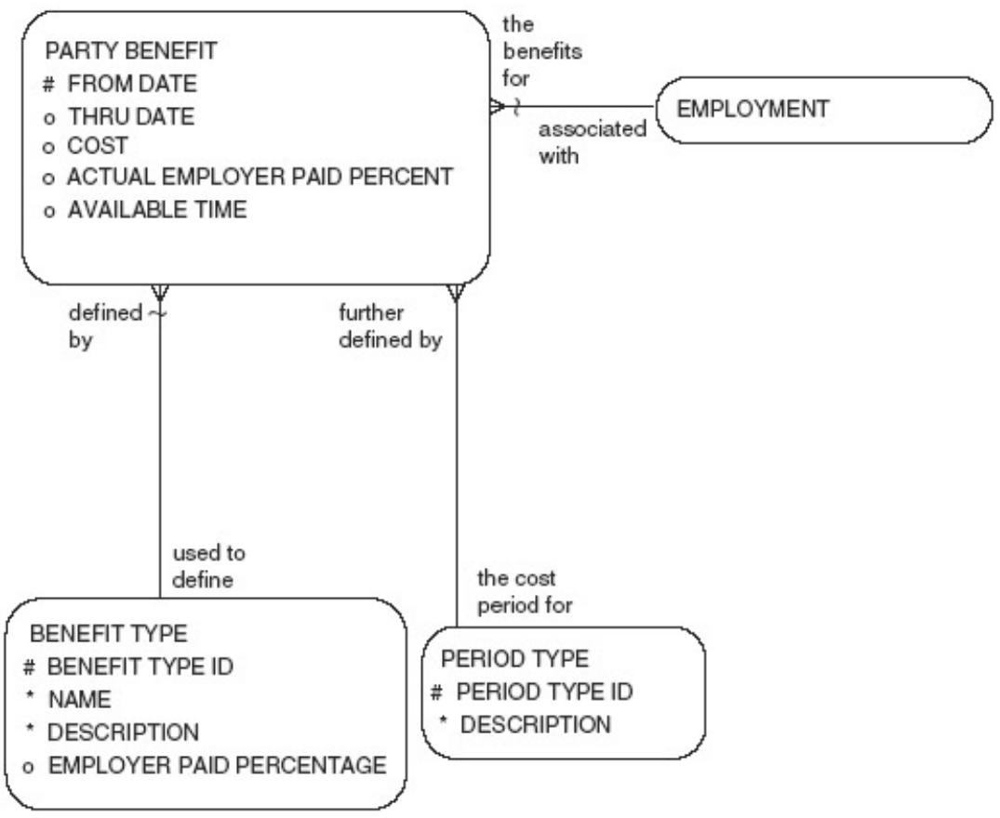

# Employment

Similar to PAY HISTORY, PARTY BENEFIT is also related to the EMPLOYMENT subtype of PARTY RELATIONSHIP, not the PARTY or PERSON, because the benefits are associated with a particular employer and employee relationship. In a large multicompany enterprise people may move from one company to another, so sometimes their benefits may come from different organizations at different times in their career. If the enterprise wants to track benefits costs at the lower levels of the organization, then associating the costs simply with the employee will not be sufficient.

Why not associate the benefit with the employee and the organization directly? By using EMPLOYMENT, the enterprise can enforce business rules that would prevent such things as contractors accidentally being given benefits.

For insurance purposes, there may be a need to determine the benefits for a person for more than one organization (through the EMPLOYMENT instances for that person). Some of its employees may have two part-time jobs; it may be important to know the benefits offered by each job to avoid duplication of benefits (a coordination of benefits issue). This is also useful for determining which insurance policy should pay for an illness. The information could be critical in helping the insurance company control its costs.

# Party Benefit

In PARTY BENEFIT there can be several pieces of information that the enterprise may wish to track. First is the from date and thru date. These allow the tracking of benefits through time. Additionally, the enterprise may want to track the actual cost of the benefit and the actual employer paid percentage. With that information it would be possible to calculate the cost not only to the employee but to the enterprise as well. Another attribute, available time, is also included for tracking allowable time off such as vacation and sick leave. Example benefit data is shown in Table 9.10.

Table 9.10 Party Benefit Data

<table><tr><td>EMPLOYER</td><td>EMPLOYEE</td><td>BENEFIT TYPE</td><td>FROM DATE</td><td>THRU DATE</td><td>COST</td><td>PERIOD TYPE</td><td>ACTUAL EMPLOYER PAID %</td><td>AVAILABLE TIME</td></tr><tr><td rowspan="5">ABC Corporation</td><td rowspan="5">John Smith</td><td rowspan="2">Health</td><td>Jan 1, 1998</td><td>Dec 31, 2000</td><td>$1200</td><td>per year</td><td>50</td><td></td></tr><tr><td>Jan 1, 2001</td><td></td><td>$1500</td><td>per year</td><td>60</td><td></td></tr><tr><td>Vacation</td><td></td><td></td><td></td><td>days</td><td>100</td><td>15</td></tr><tr><td>Sick leave</td><td></td><td></td><td></td><td>days</td><td>100</td><td>10</td></tr><tr><td>401k</td><td>Jan 1, 2001</td><td></td><td>$50.00</td><td>per year</td><td>100</td><td></td></tr></table>

The examples given deal with John Smith, who works for ABC

Corporation. Over the years, the cost of his health insurance has risen from  $1,200 to$ 1,500 per year. During that time ABC

Corporation initially paid 50 percent of the cost for him, but it now pays 60 percent. The data also shows that he has 15 vacation days and 10 sick days as a current balance and that the company absorbs the full cost of that time off. Mr. Smith also has a 401k plan that he started when he was eligible in 2001. The information indicates that the plan cost is $50 per year (for administration), with the company picking up 100 percent of the cost.

# Period Type

Notice that Table 9.10 includes Period Type. This is the result of the resolution of the relationship to the entity PERIOD TYPE (see Figure 9.8). This information is used primarily to modify the cost attribute. Without it, there would be no context for the dollars

reported and thus no way to determine the enterprise's costs accurately. Additionally, it could also be used as the context for types like "vacation" and "sick leave," as shown in the table.

# Benefit Type

The various types of benefits provided by the enterprise are listed in the entity BENEFIT TYPE. Samples of that data are included in Table 9.10. In addition to the identification of the benefit, this entity may also store a standard employer paid percentage that can be used to calculate costs related to all employees with a particular benefit.

Percentages for employer contribution are included not only in BENEFIT TYPE but also in PARTY BENEFIT and POSITION TYPE to allow recording this information at various levels of detail. Because of this, certain business rules need to be put in place. A likely set of rules would be as follows:

- If actual employer paid percent exists in PARTY BENEFIT, that number takes precedence.
- If that is blank, then benefit percent on the POSITION TYPE associated with the person's current position (as indicated in POSITION FULFILLMENT) is used.
- If both of these values are blank, then the employer paid percentage in BENEFIT TYPE would be the override.

Note that this section has provided a general data structure for handling benefits; if a more comprehensive model is needed for enterprises in the insurance industry, there is a more complete model in Chapter 5 of Volume 2- "Insurance."

# Payroll Information

Another item to consider for a standard human resources model is payroll (see Figure 9.9). Without payroll, there won't be many human resources working for the enterprise for long! This model considers what to many people will be the most critical portion of payroll: getting paid correctly. Information about payroll is included in the entities EMPLOYEE, INTERNAL ORGANIZATION, PAYMENT METHOD TYPE, PAYROLL PREFERENCE, PAYCHECK, DEDUCTION, and DEDUCTION TYPE.

Figure 9.9 Payroll information.


PAYCHECK is a subtype of the DISBURSEMENT entity and is modeled separately because of some of the unique aspects of a paycheck as opposed to other disbursements. The payment model in Chapter 7 describes a generic data model for making any type of payments, and this section elaborates on that model by adding the specifics of payroll payments.

# Employee

As with benefits and salary, all payroll information is related to the EMPLOYEE and INTERNAL ORGANIZATION. These relationships represent more specific modeling of the relationships of PAYMENT from and to PARTY. The relationships are mandatory because if there were no employer (internal organization) and employee or similar relationship, there would be no need for a paycheck. By using the relationships as a base, business rules can be used to ensure that not just any party within the system can be issued a paycheck.

# Payment Method Type

In today's world of convenience and electronic commerce, getting paid is not as simple as it once was. Now employers can choose many options to offer their employees when it comes to methods of receiving their pay. The basic form of these options is described by the entity PAYMENT METHOD TYPE, as described in the payment models section of Chapter 7. In it could be stored data such as "cash," "check," and "electronic." Depending on the capabilities of an enterprise's payroll department, any or all of these options may be offered to employees.

# Payroll Preference

It is possible that an employee may want part of his or her pay in check form and the rest in cash. Others may want their money split up and electronically deposited to several different banks. Some employees may want standard deductions to be accounted for each and every paycheck, unless overridden.

In order to handle this type of information, the model includes the entity PAYROLL PREFERENCE. Because an employee may change preferences over time, the attributes from date and thru date are included. Other information that is needed includes the percentage of total pay or a flat amount that the employee wants designated to a particular PAYMENT METHOD TYPE or designated for certain recurring deductions that are maintained through the relationship from PAYROLL PREFERENCE to DEDUCTION TYPE. If the type of pay selected is "electronic," then the routing number, account number, and bank name may be used to successfully complete the transaction. These are stored as attributes instead of as entities because the enterprise probably does not have the will and means to maintain these as their own entity. Each PAYROLL PREFERENCE may be defined for certain PERIOD TYPES. For example, a particular standard deduction that is desired may be specified for pay period types of "per year," "per month," or "weekly."

Sample data is included in Table 9.11.

Table 9.11 Payroll Preference Data

<table><tr><td>PAYROLL
PREFERENCE
SEQ ID</td><td>PAYMENT
METHOD
TYPE</td><td>FROM
DATE</td><td>THRU
DATE</td><td>PERCENTAGE</td><td>FLAT
AMOUNT</td><td>ROUTING
NO AND
ACCOUNT
NUMBER</td><td>DEDUCTION
TYPE</td><td>PERIOD
TYPE</td></tr><tr><td>1</td><td>Electronic</td><td>Jan 1, 1995</td><td>Nov 1, 1999</td><td>50</td><td></td><td>99986-99, 30984098</td><td></td><td></td></tr><tr><td>2</td><td>Electronic</td><td>Jan 1, 1995</td><td></td><td>50</td><td></td><td>99986-98, 93485999</td><td></td><td></td></tr><tr><td>3</td><td>Electronic</td><td>Nov 2, 1999</td><td></td><td>50</td><td></td><td>11111-22, 67567676</td><td></td><td></td></tr><tr><td>4</td><td></td><td>Nov 2, 1999</td><td></td><td></td><td>$125</td><td></td><td>Insurance</td><td>Per month</td></tr></table>

As in previous examples, assume that the employer is still ABC Corporation and the employee is John Smith. The sample data contains what is a very common scenario that payroll departments encounter today. When Mr. Smith starts with the company, he chooses to have his paycheck deposited electronically. As indicated in the data, he wants it split between a checking and a savings account. Then in 1999, he decides to close one checking account and open a new one at a different bank. The payroll department is informed, and the first preference is then expired, and a new one is entered to take effect on November 2. The fourth row shows that there is a standard deduction for insurance each month.

Note that the primary key for PAYROLL PREFERENCE is a simple sequence number compounded with the primary keys from EMPLOYEE and INTERNAL ORGANIZATION ( the hiring firm). This is needed because, depending on the type of payroll preference,

different information will be recorded in the PAYROLL PREFERENCE entity.

# Paycheck

Now that method of payment has been established, it is time to consider the actual payment itself. The PAYCHECK entity contains basic information an enterprise needs to record about the checks it writes to its employees. As seen in Figure 9.9, this entity inherits the attributes it needs from PAYMENT, namely a payment ID, payment ref num (could be a check number or electronic transfer number), effective date (date of check or electronic transfer), amount, and optionally a comment.

Financial account information for a check may be determined after depositing a check, using the payment financial account data model in Figure 7.9 in Chapter 7. This information, along with the payment ref num, will contain the information to uniquely identify a particular paycheck and to know where it has been deposited. Even electronically deposited checks need a source account and a check number, which show up on the paper confirmation. The effective date is the actual date the payroll disbursement was issued. In the case of electronic deposit, this may or may not correspond to the bank posting date. The amount is recorded as part of the PAYMENT entity and inherited by the subtype PAYCHECK

as the gross amount of pay. The net amount of the paycheck can be calculated by subtracting from the PAYCHECK amount, the amounts recorded in the associated instances of the DEDUCTION entity.

Deduction and Deduction Type

The DEDUCTION entity stores information about the various deductions that occur on a particular check. The DEDUCTION TYPE entity contains a list of the valid types of deductions that are allowed by the enterprise or are required by law. Some of these include: "federal tax," "FICA," "state tax," "401k," "retirement," "insurance," or "cafeteria plan."

DEDUCTION TYPES may be applied to the actual payroll disbursements when they are related to DEDUCTIONS. These DEDUCTIONS represent instances of moneys deducted from actual payroll checks (or electronic transfers). DEDUCTION TYPES may also be used to provide standard deductions that employees want on an ongoing basis.

Table 9.12 contains examples of deductions as they have been applied to a particular paycheck.

Table 9.12 Payroll Data

<table><tr><td>CHECK NO</td><td>EFFECTIVE DATE</td><td>AMOUNT</td><td>DEDUCTION ID</td><td>DEDUCTION TYPE</td><td>AMOUNT</td></tr><tr><td>1001</td><td>Jan 1, 2001</td><td>$2,000</td><td>1</td><td>Federal tax</td><td>$200.00</td></tr><tr><td></td><td></td><td></td><td>2</td><td>FICA</td><td>$54.50</td></tr><tr><td></td><td></td><td></td><td>3</td><td>State tax</td><td>$80.00</td></tr><tr><td></td><td></td><td></td><td>4</td><td>Insurance</td><td>$125.00</td></tr></table>

Again, assume that the sample data is related to John Smith and ABC Corporation. The data shows an example that would be typical in most organizations. The check number 10001 is cut on January 1, 2001, with a gross amount of $2,000. The deductions include the standard ones that everybody sees, plus an additional deduction for insurance. The total deductions add up to $459.50, making the net amount for the check $1,540.50

So where did the \(1,540.50 go? It should be deposited or distributed based on what was recorded in the PAYROLL PREFERENCE occurrence that is associated with the same EMPLOYEE that the PAYCHECK is associated with (i.e., if a paycheck is issued for John Smith at ABC Corporation, then the preferences for John Smith at ABC Corporation should be used). If there were no preference records, then what happens? Is a paper check cut by default, or is the check processing held up until preferences are declared? Again, more business rules need to be in place to make these decisions and ensure that the entire transaction is completed correctly.

Employment Application

Each employment may have started with an employment application. Applications may be maintained in order to ensure that they are properly reviewed and processed. Also this information can provide valuable analysis of the recruiting process, yielding information such as how many applications are received, from where are they received (the source of the application), and the ratio of applications that turn into employees.

Figure 9.10 provides a data model that shows information about employment applications. Each EMPLOYMENT APPLICATION may be for a POSITION. This relationship is optional because applications may be for employment without knowing if a specific position slot is available. Each EMPLOYMENT APPLICATION may have an EMPLOYMENT APPLICATION STATUS TYPE associated with it such as "received," "reviewed," "filed," "rejected," "notified candidate of non-interest," and so on. Each EMPLOYMENT APPLICATION may also be from an EMPLOYMENT APPLICATION SOURCE TYPE such as "newspaper," "personal referral," "Internet," and so on. Each application may be from one and only one PERSON who represents the candidate. The application may also be referred from a PERSON that is the referrer of the candidate.

Figure 9.10 Employment application.

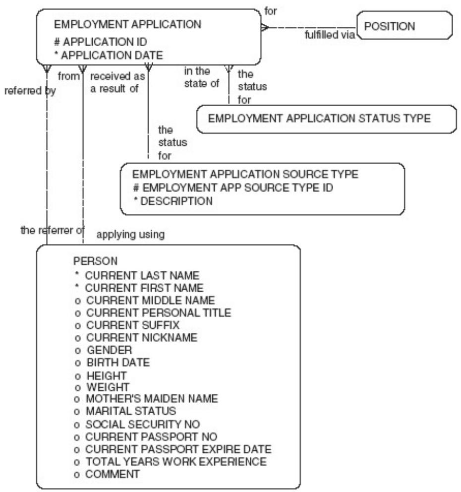

# Employee Skills and Qualifications

An important aspect of human resources is keeping track of the skills, qualifications, and training levels for people and organizations. This information is needed to facilitate parties being placed in the most suitable positions based on their skills and qualifications.

Figure 9.11 provides a model that helps to maintain the skills, qualifications, and training of not only employees, but of all people and organizations for whom this is useful. Each PARTY may have one

or more PARTY QUALIFICATIONS or PARTY SKILLS because it may be useful to track these for both a person and/or an organization in assessing to whom to assign responsibilities. In order to maintain the level of training that people have, each PERSON may have one or more PERSON TRAINING instances, indicating which training programs he or she has attended. The RESUME entity records one or more textual descriptions regarding the background and qualifications of each PARTY.

Figure 9.11 Employee skills and qualifications.

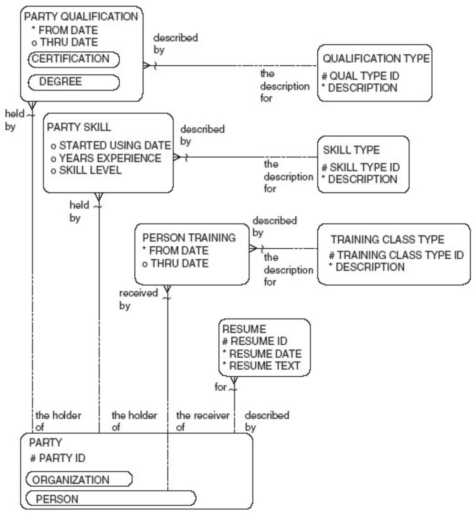

One may think that qualifications, skills, and resumes should be related to PERSON and not PARTY. Organizations may also have qualifications about which they are judged, skills that they specialize in, and resumes that describe their talents.

Employee Performance

Part of the human resource function is tracking the effectiveness of employees over time. Employees are generally evaluated periodically, and an audit trail of comments or notes may be recorded about employees.

Figure 9.12a provides a data model that maintains information regarding performance reviews and notes that can be used to provide an audit trail for employees. Each EMPLOYEE may be the receiver of one or more PERFORMANCE REVIEWS. The receiver is the person for whom the performance review is written. Each EMPLOYEE PERFORMANCE REVIEW is from one and only one MANAGER responsible for the review. If the enterprise has a need to track more than one manager who may give a specific review, then this relationship may need to be many-to-many. Each EMPLOYEE PERFORMANCE REVIEW may be composed of PERFORMANCE REVIEW ITEMS that represent the various questions that may be asked on a performance review. An example of this is "Rate employee's promptness" or "Describe employee's teamwork style." Each PERFORMANCE REVIEW ITEM represents the specific item as it relates to that review, along with a possible RATING, as illustrated by relationship to the RATING TYPE, for that item and a comment (some items may not have a rating and only a comment if the item asks only for a description).

Figure 9.12a Employee performance.

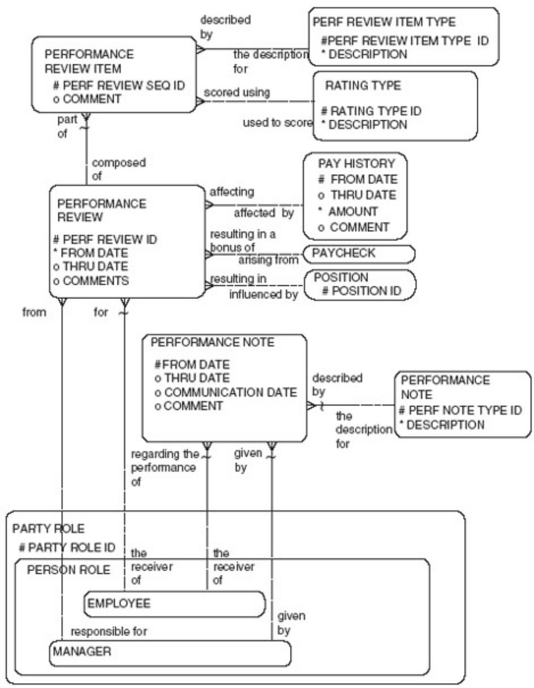

Each EMPLOYEE may be the receiver of one or more PERFORMANCE NOTES, which is another mechanism for documenting an employee's performance. An example is that there may be NOTE on particular communication dates on January 20, 2001, with a comment of "Hal Smith was insubordinate and refused to listen to the direction of his manager."

The information maintained in Figure 9.12a is mandatory for employees in most organizations. The model may also be expanded to include this information for other people such as contractors for whom performance reviews may also be given, if this is a need of the enterprise. Some enterprises may even want to track performance reviews for organizations that provide goods and/or services to them. In order for the model to be expanded, the relationships for PERFORMANCE NOTE and PERFORMANCE REVIEW would be to either PERSON or PARTY, depending on whether organizations also were going to receive performance reviews and performance notes.

Raises, bonuses, promotions, and demotions are important pieces of information that may arise from a PERFORMANCE REVIEW.

Therefore, the PAY HISTORY, PAYCHECK, and POSITION entities are related to the review. Raises or cuts in salary are maintained within instances of PAY HISTORY and may be affected by a

PERFORMANCE REVIEW. Bonuses would be maintained as a PAYCHECK and may be arising from a PERFORMANCE REVIEW. A POSITION may be influenced by a PERFORMANCE REVIEW, as the review may lead to a promotion or demotion if it is related to a certain POSITION.

Another alternative to the model in Figure 9.12a is shown in Figure 9.12b. This model maintains the PERFORMANCE NOTE as well as the

PERFORMANCE REVIEW information as a subtype of COMMUNICATION EVENT PURPOSE with a corresponding COMMUNICATION EVENT describing the purpose for a PARTY RELATIONSHIP of EMPLOYMENT. This model also provides for the fact that a PERFORMANCE NOTE or PERFORMANCE REVIEW may be for any PARTY that is involved in the COMMUNICATION EVENT. For example, performance notes or reviews could be kept for contractors who would have a "contractor being reviewed" COMMUNICATION EVENT ROLE.

Figure 9.12b Employee performance-alternate model.


Should performance notes and reviews be considered types of communication events? The answer could be "yes," as many of the same attributes and relationships are applicable. However the first model (Figure 9.12a) treats performance notes and performance reviews as separate entities, as they are very sensitive in nature and would most likely be maintained separately. The modeler needs to

decide which model is most appropriate for the enterprise being modeled.

# Employee Termination

Unfortunately, or fortunately, depending on how you look at it, there is a need to track information about the termination of employees. The dates of termination, reason for termination, and type of termination, as well as possible aftereffects such as unemployment claims, are important pieces of information to capture.

Figure 9.13 captures information about employee terminations. As stated previously, the EMPLOYMENT entity is a subtype of PARTY RELATIONSHIP that establishes a relationship between an EMPLOYEE and an INTERNAL ORGANIZATION. When the EMPLOYMENT ends, the thru date of the PARTY RELATIONSHIP stores the date of termination. On termination, the PARTY RELATIONSHIP STATUS TYPE instance of "terminated" is now used to signify that the employment has ended. The TERMINATION TYPE stores what kind of termination happened, such as "resignation," "firing," or "retirement." The TERMINATION REASON maintains the description explaining the circumstances and cause of the termination. Examples include "insubordination," "took new job," "non-performance," "moved," and so on.

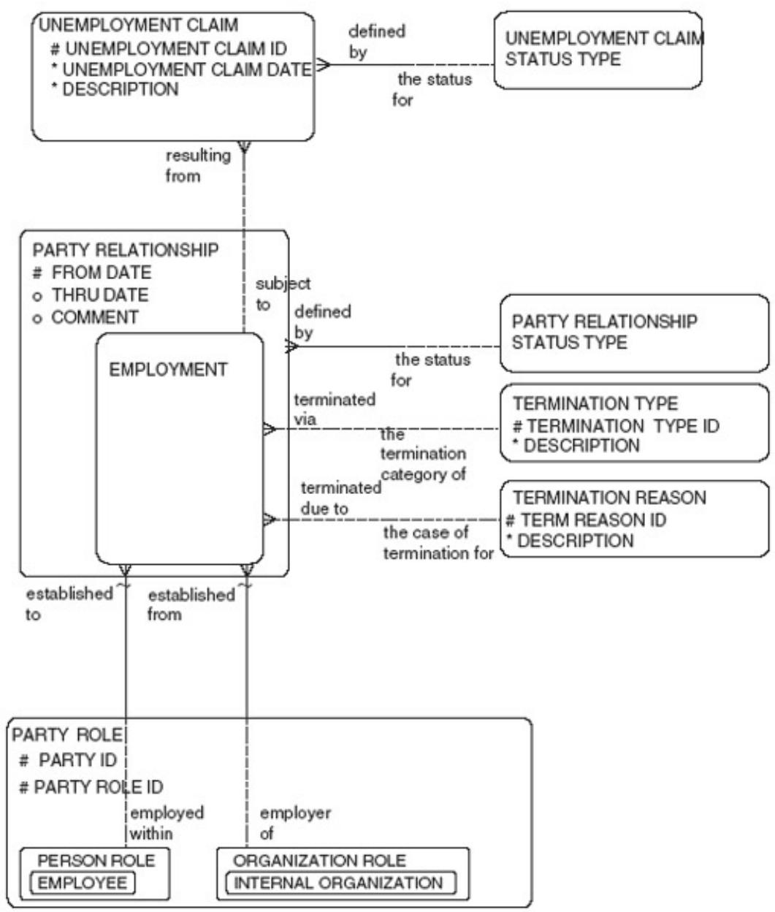
Figure 9.13 Employee termination.

The UNEMPLOYMENT CLAIM maintains information about unemployment claims that may be related to terminations of employees. The claim date shows what date the unemployment claim was filed. The description provides information on the background of the claim, and the relationship to UNEMPLOYMENT

CLAIM STATUS TYPE stores whether the claim was "filed," "pending," "accepted," "rejected," or any other important status. If a history of statuses is needed, then the model needs to include a many-to-many relationship between UNEMPLOYMENT CLAIM and UNEMPLOYMEN CLAIM STATUS TYPE. Other information may be associated with the UNEMPLOYMENT CLAIM, such as the various parties involved, notes about the claim, dollar figures involved in the claim, and so on, depending on the needs of the enterprise.

It is important to note that the employee has not really been terminated (unless the person passes away), even though that is the common means of expressing this fact. The employment is the thing that has really terminated. This is why the PARTY RELATIONSHIP STATUS TYPE is used to record the termination status as opposed to the PARTY STATUS, which is used to record information about the party irrespective of any relationship (this would be used to record if someone were "deceased").

# Summary

This chapter has discussed one of the more complex aspects of operating a business: the tracking and management of human resources information (see Figure 9.14). The models presented allow an enterprise to more efficiently track positions and assignments associated with its employees and contractors. In addition, the

models contain elements for position classifications, reporting structures, determining pay rates, tracking the salary history of those people associated with the enterprise, benefits tracking, payroll information, employment applications, employee skills, employee performance, and employee termination.

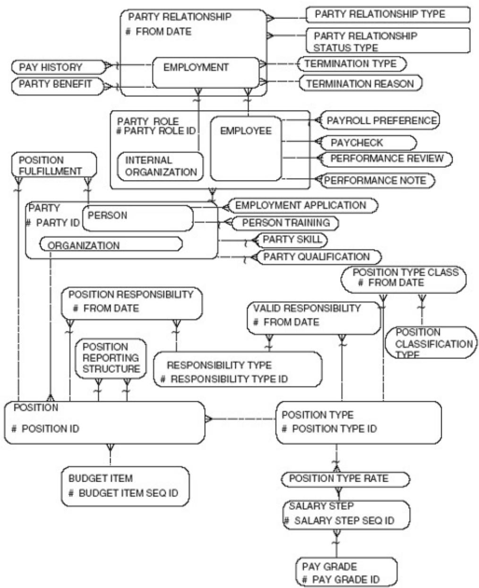
Figure 9.14 Overall human resources model.

Please refer to Appendix A for a listing of entities and attributes. SQL scripts to build tables and columns derived from the logical models in this book can be found on the full-blown CD-ROM, which is licensed separately.

# CHAPTER

# 10

# Creating the Data Warehouse Data Model from the Enterprise Data Model

Each of the previous chapters focused on the data model for a specific subject data area, namely parties, products, orders, shipments, work efforts, accounting, and human resources. These data models are essential for building not only a data warehouse but also any type of system because it is critical to understand the nature of the data and their relationships.

What is the process for using these data models to build a data warehouse? This chapter not only describes the transformation process, but also provides examples of each type of transformation by using the logical data models from the previous chapters as a basis.

The Data Warehouse Architecture

Before discussing how to convert the logical data models into a data warehouse, it is important to understand the three types of models involved in the transformation process from the operational environment to a decision support system:

- The enterprise data model
- The data warehouse design
- The departmental data warehouse design or data mart

# The Enterprise Data Model

The enterprise data model is an enterprise-wide view of the data and its relationships. It normally includes a high-level model that is an overview of each subject data area and the relationships between them, as well as logical data models for each subject data area. These models are the basis for developing both the enterprise's online transaction processing (OLTP) systems and its data warehouses. The models presented in the previous chapters could serve as a starting point for an enterprise's enterprise data model.

# The Data Warehouse Design

The data warehouse design is sometimes referred to as a data warehouse data model. It represents an integrated, subject-oriented, and very granular base of strategic information that serves as a single source for the decision support environment. This allows an

architecture where information is extracted from the operational environment, cleansed, and transformed into a central, integrated enterprise-wide data warehouse environment. The data warehouse data model maintains this integrated, detailed level of information so that all the departments and other internal organizations of the enterprise can benefit from a consistent, integrated source of decision support information.

The Departmental Data Warehouse Design or Data Mart

The departmental data warehouse design is used to maintain departmental information that is extracted from the enterprise data warehouse. This is sometimes referred to as lightly and highly summarized data or as data marts. An example of a departmental data warehouse is the maintaining of a particular department's sales analysis information such as its product sales by customer, by date, and by sales representative. This department can create a departmental data warehouse and pull the information into its own data warehouse (or data mart) from the enterprise data warehouse.

Another department of the corporation, for example, the marketing department, may be interested in higher-level sales information across the enterprise such as sales by month, by product, and by geographic area. This department can create a departmental data warehouse design for its own purposes. Rather than building its own

extraction, transformation, and cleansing routines against the operational systems to gather this information, it can rely on the enterprise data warehouse.

# An Architected Data Warehouse Environment

By using this architected approach, as illustrated in Figure 10.1, the enterprise will avoid the pitfall of having each department extracting different views of the enterprise's information. These inconsistent extractions lead to more unint-grated and inconsistent data. After all, the primary goal of decision support is to provide strategic, meaningful management information. The most ideal method of doing this is by focusing on developing integrated data; then, once this is done, passing it on to different departments that have various information needs.

Figure 10.1 Data warehouse architecture.

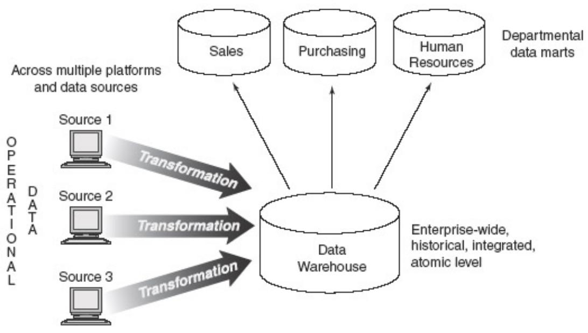

It is important to note that as the enterprise moves from the enterprise data model to the data warehouse data model to the departmental data warehouse, the models become more dependent on the particular enterprise. For instance, many parts of the logical data models in the prior chapters can be used by many different enterprises. The data warehouse data model is more specific to an enterprise because it is based on numerous assumptions concerning the type of decision support information that is considered useful to the enterprise. The departmental data warehouse is even more dependent on the specific needs of a department. Therefore, the data warehouse models presented later in this chapter and in subsequent chapters serve only as examples because each enterprise's data warehouse designs will be highly dependent on its own specific business needs.

This chapter will focus specifically on the transformation of the enterprise data model to the data warehouse data models. Chapter 11 provides an example of a data warehouse data model containing several subject areas. Chapters 12, 13, and 14 provide examples of departmental data models and illustrate various designs for structuring the departmental warehouse using the star schema representation for multidimensional analysis.

The Enterprise Data Model

The point of departure for the design and construction of the data warehouse is the enterprise data model. Without a data model it is very difficult to organize the structure and content of data in the data warehouse.

The enterprise data model may cover a very wide scope; when it does, it is often called an enterprise data model (corporate data model is a synonym). On the other hand, a data model within an enterprise may cover a restricted scope; for instance, it may cover the information within a particular department or division. In either case—that of the enterprise data model or the data model for a part of the enterprise—the data model is the starting point for creating the data warehouse data model.

Many organizations have recognized the importance of the data model over the years and have invested the time and effort to build such a model. One of the problems with classical data modeling techniques is that there is no distinction between modeling for the operational and decision support environments. Classical data modeling techniques gather and synthesize the informational needs of the entire enterprise without consideration for the context of the information. The result of such a model is the enterprise data model, which tends to be very normalized.

The enterprise data model is a very good place to start the process of building a data warehouse. It provides a foundation for integration and unification at an intellectual level. Because the enterprise data model is not built specifically for the data warehouse, some amount of transformation is necessary to adapt it to the design to build the data warehouse data model.

# Transformation Requirements

To do the transformation from the enterprise data model to the data warehouse data model, the enterprise data model must have identified and structured, at least, the following:

Major subjects of the enterprise
- Relationships between the subjects

- Definitions of the subject areas
- Logical data models for each subject data area (sometimes referred to as entity relationship diagrams)

Also, for each major logical data model, the following must be identified and structured:

- Entities
Key(s) of the entity
- Attributes of the entity
- Subtypes of the entity
- Relationships between entities

Figure 10.2 identifies the minimum components of the enterprise data model.

Figure 10.2 The components of a data model.


High-level data model:

Major subject areas

Relationships between subjects/areas


Logical data model:

Entities

Keys

Attributes

Sub-types

Relationships

The logical models in the previous chapters can be used as a starting point toward the development of an enterprise data model. The models presented represent many of the major subject data areas within enterprises. Each of the previous chapters of this book, Chapters 2-9, correspond roughly to a possible subject data area for an enterprise. For instance, there is often a PARTY subject data area, PRODUCT subject data area, and so on. Each enterprise needs to select the appropriate subject data areas for its specific business and add any other subject data areas needed.

# Process Models

Many more design and modeling components may be used in conjunction with an enterprise data model. For example, the

enterprise may model the design and synthesis of processes as well. Process analysis typically consists of the following:

- Functional decomposition
Data and process matrices
Data flow diagrams
State transition diagrams
HIPO charts
Pseudocode

These are generally included in an enterprise process model, as opposed to being part of the enterprise data model. This book addresses "universal data models," but there is also a great need for "universal process models"—or templates to help develop these enterprise process models.

While these corporate process models are interesting to some, the process model usually is not of much interest to the data warehouse designer because the process analysis applies directly to the operational environment, not the data warehouse or the decision support system (DSS) environment. It is the enterprise data model that forms the backbone of design for the data warehouse, not the process models.

High-Level and Logical Data Models

As stated previously, the enterprise data model is usually divided into multiple levels—a high-level model and logical data models for each subject area. The high level of the enterprise data model contains the major subject areas and the relationship between the subject areas. Figure 10.3 shows a simple example of a high-level enterprise data model.


Figure 10.3 A simple example of a high-level model.

In Figure 10.3 there are five subject areas: party, order, product, shipment, and work effort. A direct relationship exists between party and order, order and work effort, order and shipment, and order and product. Of course, many indirect relationships are inferred from the highlevel data model, but only the direct relationships are shown. Note that the high-level enterprise data model does not contain any amount of detail at all; at this level, detail only clutters up the model unnecessarily.

The next level of modeling found in the enterprise data model is logical data modeling. Here is where much of the detail of the model is found. These models contain entities, keys, attributes, subtypes, and relationships, and they are fully normalized. Each of the previous chapters generally corresponds to a subject data area and includes a normalized logical data model for that area. There is a relationship between each subject area identified in the high-level model and the logical data models. For each subject area identified, there is a single logical data model, as shown in Figure 10.4

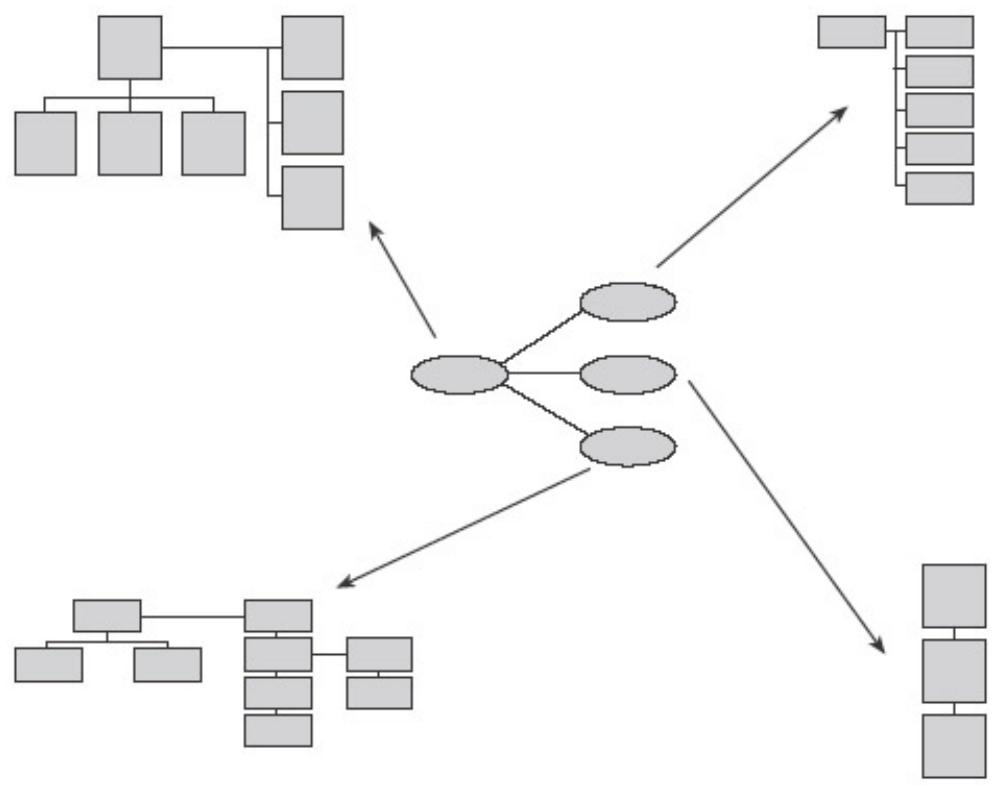
Figure 10.4 Each major subject area has its own mid-level model.

Note that in many organizations the logical data model is not fleshed out to the same level of detail. Some logical data models are completely designed and fully attributed, while other models are only sketched out, with little or no detail.

The degree of completion of the larger enterprise data model is of little concern to the data warehouse developer because the data warehouse will be developed iteratively, one stage at a time. In other words, it is very unusual to develop the data warehouse on a massive frontal assault, where all logical data models are developed at once. Therefore, the fact that the enterprise data model is in a state of differing degrees of readiness is not a concern to the data warehouse developer. Figure 10.5 shows that the data warehouse will be built one step at a time. First, one part of the data model (perhaps a particular subject data area such as "product") is transformed and readied for data warehouse design, then another part of the data model is transformed, and so forth.

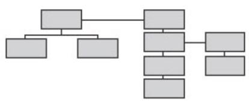
Figure 10.5 Each major subject area will be integrated one step at a time.
1st subject area to be placed into warehouse

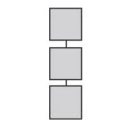
2nd subject area to be placed into warehouse


3rd subject area to be placed into warehouse

# Making the Transformation

Once the enterprise has an enterprise data model, the transformation process into the data warehouse data model can begin. Following are a set of procedures for how to transform the enterprise data model to a data warehouse data model:

- Removal of purely operational data
- Addition of an element of time to the key structure of the data warehouse if one is not already present
- Addition of appropriate derived data
- Transformation of data relationships into data artifacts
- Accommodation for the different levels of granularity found in the data warehouse
- Merging of like data from different tables together
Creation of arrays of data
- Separation of data attributes according to their stability characteristics

These activities serve as guidelines in creating the data warehouse data model. Transformation decisions should be based largely on the enterprise's specific decision support requirements. The following sections will discuss each of these aspects in detail.

# Removing Operational Data

The first task is to examine the enterprise data model and remove all data that is purely operational, as illustrated in Figure 10.6. The figure shows that some data found in the enterprise data model finds its way into the data model for the data warehouse. Some data, such as message, description, terms and status, usually apply to the operational environment. These should be removed as a first step in building the data warehouse data model. They are not removed from the logical data models; they are simply not useful in the data warehouse. Note that the box represents information about the INVOICE within the corporate data model and may be either an attribute such as message or description, or related information such as INVOICE TERM or INVOICE STATUS.


Figure 10.6 Removing data that will not be used for DSS processing.

The removal of operational data is seldom a straightforward decision. It always centers around the question, "What is the chance the data will be used for DSS?" Unfortunately, circumstances can be contrived such that almost any data can be used for DSS. A more

rational approach is to ask, "What is the reasonable chance that the data will be used for DSS?"

The argument that can always be raised is that one never knows what is to be used for DSS because it always involves the unknown. On that basis, any and all data should be kept. The cost of managing volumes of data in the data warehouse environment, however, is such that it is patently a mistake not to weed out data that will be used for DSS only in farfetched or contrived circumstances.

Adding an Element of Time to the Warehouse Key

The second necessary modification to the enterprise data model is the addition of an element of time to the data warehouse key if one does not already exist, as shown in Figure 10.7.

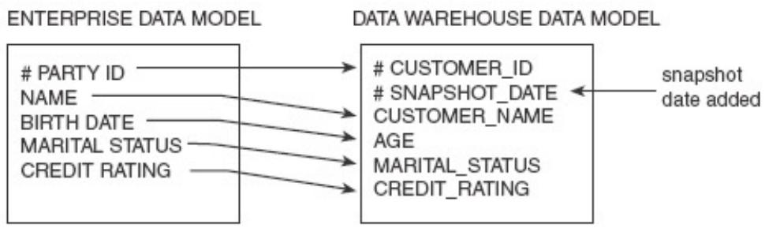
Figure 10.7 Adding an element of time to the data warehouse data model.

In the figure, snapshot_date has been added as a key to the customer record. The enterprise data model has specified party information with only a party ID as the key. But in the warehouse,

snapshots of customer-related party data are made because customer demographics may change over time. The effective date of those snapshots is added to the key structure. Note that there are many different ways to take these snapshots and a few common ways to add an element of time to the data warehouse key. The technique shown in the example is a common one.

Another common technique is the addition of a from and thru date to the key structure. This technique has the advantage of representing continuous data rather than snapshots at a specified point in time. An example of this technique is illustrated in the sample data warehouse data model in Figure 11.2

If data identified in the logical data model already has an element of time, such as a from datetime orthru datetime attribute, then there is no need to add another element of time to the data warehouse key structure.

Adding Derived Data

The next transformation to the logical data models is the addition of derived data to the data warehouse data model where it is appropriate, as shown in Figure 10.8. The total_amount field is derived by multiplying the quantity times the amount field of the INVOICE.

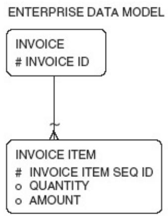
Figure 10.8 Adding appropriate derived data.


As a rule, data modelers do not include derived data as part of the data modeling process. Logical models show only the data requirements of an enterprise. The reason for the omission of derived data in logical data models is that when derived data is included, certain processes are inferred regarding the derivation or calculation of that data. Derived data is added only to the physical database design for performance or ease of access reasons.

It is appropriate to add derived data to the data warehouse data model where the derived data is popularly accessed and calculated once. The addition of derived data makes sense because it reduces the amount of processing required on accessing the data in the warehouse. In addition, once properly calculated, there is little fear in the integrity of the calculation. Said another way, once the derived data is properly calculated, there is no chance that someone will

come along and use an incorrect algorithm to calculate the data, thus enhancing the credibility of the data in the data warehouse.

Of course, any time that data is added to the data warehouse, the following question must be asked: "Is the addition of the data worth it?" The issue of volume of data in a data warehouse is such that every byte of data needs to be questioned. Otherwise, the data warehouse will quickly grow to unmanageable proportions.

# Creating Relationship Artifacts

The data relationships found in classical data modeling assume that there is one and only one business value underlying the relationship (i.e., there is only one primary supplier for a product). For the assumption that data is accurate as of the moment of access (i.e., operational data), the classical representation of a relationship is correct. A data warehouse usually has many relationship values between tables of data because data in a warehouse represents data over a long spectrum of time; therefore, there will naturally be many relationship values over time (i.e., there are many product suppliers for a product over time). Thus, the classical representation of relationships between tables as found in classical data modeling is inadequate for the data warehouse. Relationships between tables in the data warehouse are achieved by means of the creation of artifacts.

One means of describing a relationship artifact is that it is the existence of a relationship that existed at one point in time and no longer exists. If one is married and gets a divorce, an alimony payment is an indication of a relationship artifact. It is the reminder of a relationship that used to exist and that no longer exists. For sales analysis purposes within businesses, old customer relationships are important to record in the data warehouse even though they may no longer exist in the operational system.

An artifact of a relationship that is maintained in the warehouse is merely that part of a relationship that is obvious and tangible at the moment the snapshot of data is made for the data warehouse. In other words, when the snapshot is made the data associated with the relationship that is useful and obvious will be pulled into the warehouse table.

The artifact may include foreign keys and other relevant data, such as columns from the associated table, or the snapshot may include only relevant data and no foreign keys. This is one of the most complex subjects facing the data warehouse designer. Consider the simple data relationship shown in Figure 10.9.

Figure 10.9 An operational relationship between product and supplier.

Figure 10.10 Artifacts of the operational data relationship.
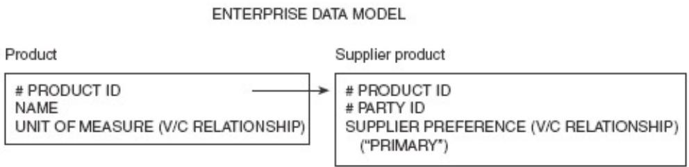
Figure 10.9 shows that there is a relationship between a PRODUCT and a SUPPLIER. This information is shown in Chapter 3, Figure 3.5, in the entities PRODUCT, SUPPLIER PRODUCT, and PREFERENCE TYPE. In the example, each PRODUCT has a primary SUPPLIER (a PREFERENCE TYPE of primary). Integrity constraints dictate that if a SUPPLIER (or organization) is deleted, a SUPPLIER PRODUCT record may not exist that has that SUPPLIER as the primary source. In other words, the information about who was the primary supplier is lost because the supplier record was deleted. The relationship represents an ongoing relationship of data that is active and accurate as of the moment of access.

Now consider how snapshots of data might be made and how the relationship information might be captured. Figure 10.10 shows a snapshot of PRODUCT and SUPPLIER data that might appear in the data warehouse.

# PRODUCT SNAPSHOT TABLE

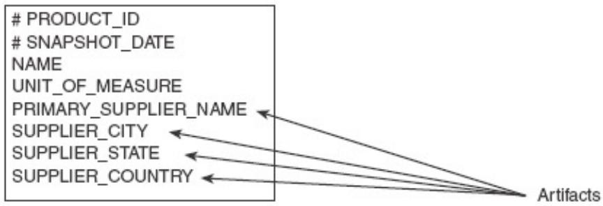

The PRODUCT snapshot table is one that is created periodically-at the end of the week, the end of the month, and so on. Much detailed information about a PRODUCT is captured at this time. One of the pieces of information that is captured is primary supplier name as of the moment of snapshot. Another artifact is the supplier location that is extracted from the supplier information found in the operational system at that point in time. Even if the enterprise stops doing business with a supplier and the supplier record is deleted, the data warehouse still maintains a history of the primary suppliers for the product. This, then, is an example of an artifact of a relationship being captured. Note that the relationship is accurate as of the moment of capture. No other implications are intended or implied.

The snapshot previously discussed has one major drawback: It is incomplete. It shows only the relationship as it exists as of some moment in time. Major events may have occurred that the snapshots never capture. For example, suppose the PRODUCT SNAPSHOT is

made every week. A product may have had three primary suppliers during the week, yet the snapshot would never reflect this fact.

Snapshots are easy to make and are an essential part of the data warehouse, but they do have their drawbacks. To capture a complete record of data, an historical record rather than a snapshot is required for data in the data warehouse. Figure 10.11 shows an example of historical data in a data warehouse.

Figure 10.11 Another form of warehouse data is discrete historical data in which all activities are captured.

DATA WAREHOUSE DATA MODEL

PRODUCT HISTORY TABLE

PRODUCT_ID

SHIPMENT_ID

DATE RECEIVED

SUPPLIER_ID

SUPPLIER_NAME

UNIT_OF_MEASURE

CONDITION

RECEIVED_BY

STORAGE/container

In the PRODUCT HISTORY table, a shipment has been received at the loading dock and relevant information is recorded. Among other things, the SUPPLIER of the PRODUCT is recorded. This is another form of artifact relationship information being recorded inside a data warehouse. Assuming that all deliveries have an historical record created for them, the record of the relationship between the two tables, over time, is complete.

# Changing Granularity of Data

One of the features of a data warehouse is the different levels of granularity. In some cases, the level of granularity does not change as data passes from the operational environment to the data warehouse environment. In other cases, the level of granularity does change as data is passed into the data warehouse. When there is a change in the level of granularity, the data warehouse data model needs to reflect those changes, as shown in Figure 10.12


Figure 10.12 Accommodating the different changes in granularity in going from the operations environment to the data warehouse environment.

In the figure, the enterprise data model shows shipment activity data that is gathered each time a shipment is made. Due to the requirements specified by end users, data granularity is changed as the data passes into the data warehouse. Two summarizations of

shipment data are made-the monthly summarization of total shipments and the summarization of shipments made by the shipped from location.

The issues in the changing of granularity (insofar as the data warehouse data modeler is concerned) revolve around the following questions:

• What period of time should be used to summarize the data (i.e., summarized by day, by week, by month, etc.)?
- What elements of data should be in the summarized table?
- Will the operational environment support the summarized data elements (i.e., has the data warehouse designer specified data in the warehouse that cannot be calculated from the operational data source)?
- What is the trade-off between keeping lower levels of granularity for detailed analysis versus the cost of storing those details? The costs include disk space, performance, and database management overhead, especially for very large databases (VLDB).

# Merging Tables

The next transformation consideration involves merging corporate tables into one data warehouse table, as illustrated in Figure 10.13.

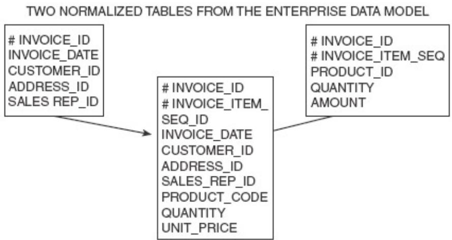
Figure 10.13 Merging corporate data tables into a warehouse data model.

The figure shows two tables, INVOICEs and INVOICE_ ITEMS (the top two boxes), from an operational environment (see Chapter 7). The tables are normalized. As they are placed in the data warehouse environment, they are merged together. The merge can greatly improve query performance and can simplify the data structure by eliminating a commonly required join.

The conditions under which a merge makes sense are when the following situations occur:

- The tables share a common key (or partial key).
- The data from the different tables is used together frequently.
- The pattern of insertion is roughly the same.

If any one of these conditions is not met, it may not make sense to merge the tables together.
