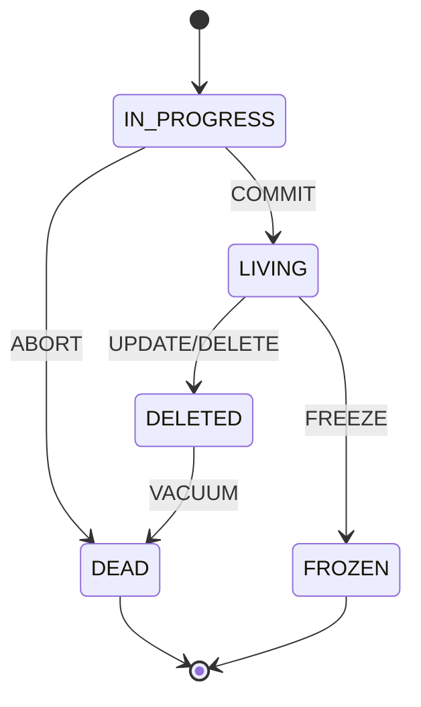
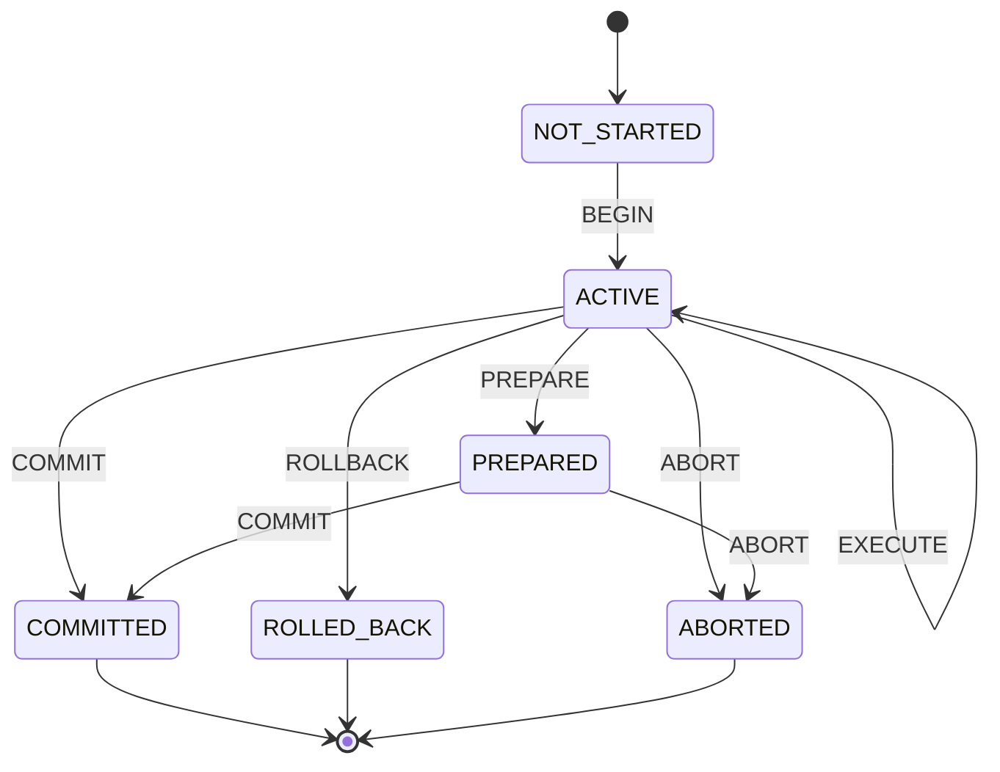

# MVCC-ACID状态机分析

> **文档编号**: THEORY-MVCC-ACID-STATE-MACHINE-001
> **主题**: MVCC-ACID状态机分析
> **版本**: PostgreSQL 17 & 18
> **状态**: ✅ 已完成
> **创建日期**: 2024年

---

## 📑 目录

- [MVCC-ACID状态机分析](#mvcc-acid状态机分析)
  - [📑 目录](#-目录)
  - [📋 概述](#-概述)
  - [📊 第一部分：状态机形式化定义](#-第一部分状态机形式化定义)
    - [1.1 MVCC状态机形式化定义](#11-mvcc状态机形式化定义)
      - [1.1.1 MVCC状态机基本定义](#111-mvcc状态机基本定义)
      - [1.1.2 MVCC状态转换函数](#112-mvcc状态转换函数)
      - [1.1.3 MVCC状态机示例](#113-mvcc状态机示例)
    - [1.2 ACID状态机形式化定义](#12-acid状态机形式化定义)
      - [1.2.1 ACID状态机基本定义](#121-acid状态机基本定义)
      - [1.2.2 ACID状态转换函数](#122-acid状态转换函数)
      - [1.2.3 ACID状态机示例](#123-acid状态机示例)
    - [1.3 状态机同构性证明](#13-状态机同构性证明)
      - [1.3.1 状态机同构定义](#131-状态机同构定义)
      - [1.3.2 MVCC-ACID状态机同构性证明](#132-mvcc-acid状态机同构性证明)
    - [1.4 状态机转换规则](#14-状态机转换规则)
      - [1.4.1 转换规则完整性](#141-转换规则完整性)
      - [1.4.2 转换规则确定性](#142-转换规则确定性)
  - [🔍 第二部分：状态机实践应用](#-第二部分状态机实践应用)
    - [2.1 状态机在PostgreSQL中的实现](#21-状态机在postgresql中的实现)
      - [2.1.1 MVCC状态机实现](#211-mvcc状态机实现)
      - [2.1.2 ACID状态机实现](#212-acid状态机实现)
    - [2.2 状态机在应用设计中的应用](#22-状态机在应用设计中的应用)
      - [2.2.1 应用状态机设计](#221-应用状态机设计)
      - [2.2.2 状态机模式应用](#222-状态机模式应用)
    - [2.3 状态机的可视化表示](#23-状态机的可视化表示)
      - [2.3.1 状态图表示](#231-状态图表示)
      - [2.3.2 状态转换表](#232-状态转换表)
    - [2.4 状态机的调试方法](#24-状态机的调试方法)
      - [2.4.1 状态跟踪](#241-状态跟踪)
      - [2.4.2 状态可视化调试](#242-状态可视化调试)
  - [⚡ 第三部分：状态机优化策略](#-第三部分状态机优化策略)
    - [3.1 状态机转换优化](#31-状态机转换优化)
      - [3.1.1 转换路径优化](#311-转换路径优化)
      - [3.1.2 转换缓存优化](#312-转换缓存优化)
    - [3.2 状态机性能优化](#32-状态机性能优化)
      - [3.2.1 状态检查优化](#321-状态检查优化)
      - [3.2.2 状态转换优化](#322-状态转换优化)
    - [3.3 状态机内存优化](#33-状态机内存优化)
      - [3.3.1 状态压缩](#331-状态压缩)
      - [3.3.2 状态池化](#332-状态池化)
    - [3.4 状态机并发优化](#34-状态机并发优化)
      - [3.4.1 并发安全](#341-并发安全)
      - [3.4.2 并发性能优化](#342-并发性能优化)
  - [📝 总结](#-总结)
    - [核心结论](#核心结论)
    - [实践建议](#实践建议)
  - [📚 外部资源引用](#-外部资源引用)
    - [Wikipedia资源](#wikipedia资源)
    - [学术论文](#学术论文)
    - [官方文档](#官方文档)

---

## 📋 概述

基于`view/mvcc_view.md`中的状态机同构性分析，深入分析MVCC与ACID之间的状态机结构，建立形式化定义，分析实践应用，并提供优化策略。

**分析目标**：

- **形式化**：建立MVCC和ACID状态机的严格形式化定义
- **同构性**：证明MVCC和ACID状态机的同构性
- **实践性**：分析状态机在PostgreSQL中的实现和应用
- **优化性**：提供状态机的优化策略和最佳实践

**核心内容**：

- 状态机形式化定义（MVCC状态机、ACID状态机、同构性证明、转换规则）
- 状态机实践应用（PostgreSQL实现、应用设计、可视化、调试）
- 状态机优化策略（转换优化、性能优化、内存优化、并发优化）

**参考文档**：

- `view/mvcc_view.md` - 状态机同构性分析
- `01-理论基础/公理系统/同构性公理.md`
- `04-形式化论证/理论论证/MVCC-ACID映射关系深度分析.md`

---

## 📊 第一部分：状态机形式化定义

### 1.1 MVCC状态机形式化定义

#### 1.1.1 MVCC状态机基本定义

**定义1.1（MVCC状态机）**：

MVCC状态机是一个五元组 `M = (S, Σ, δ, s₀, F)`，其中：

- **S**：状态集合，包括元组版本的所有可能状态
- **Σ**：输入字母表，包括所有可能的操作（INSERT、UPDATE、DELETE、VACUUM等）
- **δ**：状态转换函数，`δ: S × Σ → S`
- **s₀**：初始状态
- **F**：终止状态集合

**MVCC状态集合**：

```text
S = {
    IN_PROGRESS,    // 版本创建中（xmin未提交）
    LIVING,         // 版本存活（xmin已提交，xmax无效）
    DELETED,        // 版本已删除（xmax已提交）
    DEAD,           // 版本已死亡（可被VACUUM清理）
    FROZEN          // 版本已冻结（XID回卷保护）
}
```

**MVCC输入字母表**：

```text
Σ = {
    INSERT,         // 插入操作
    UPDATE,         // 更新操作
    DELETE,         // 删除操作
    COMMIT,         // 提交操作
    ABORT,          // 中止操作
    VACUUM,         // 清理操作
    FREEZE          // 冻结操作
}
```

#### 1.1.2 MVCC状态转换函数

**状态转换规则**：

```text
δ(IN_PROGRESS, COMMIT) = LIVING
δ(IN_PROGRESS, ABORT) = DEAD
δ(LIVING, UPDATE) = DELETED  // 旧版本标记为删除
δ(LIVING, DELETE) = DELETED
δ(DELETED, VACUUM) = DEAD
δ(LIVING, FREEZE) = FROZEN
δ(DEAD, VACUUM) = ∅  // 状态被移除
```

**形式化表示**：

```text
∀s ∈ S, ∀σ ∈ Σ:
  δ(s, σ) = {
    LIVING    if s = IN_PROGRESS ∧ σ = COMMIT
    DEAD      if s = IN_PROGRESS ∧ σ = ABORT
    DELETED   if s = LIVING ∧ (σ = UPDATE ∨ σ = DELETE)
    DEAD      if s = DELETED ∧ σ = VACUUM
    FROZEN    if s = LIVING ∧ σ = FREEZE
    s         otherwise
  }
```

#### 1.1.3 MVCC状态机示例

**示例：元组版本生命周期**：

```text
初始状态: IN_PROGRESS
  ↓ INSERT操作
IN_PROGRESS
  ↓ COMMIT操作
LIVING
  ↓ UPDATE操作
DELETED (旧版本) + IN_PROGRESS (新版本)
  ↓ COMMIT操作
DELETED (旧版本) + LIVING (新版本)
  ↓ VACUUM操作
DEAD (旧版本) + LIVING (新版本)
```

### 1.2 ACID状态机形式化定义

#### 1.2.1 ACID状态机基本定义

**定义1.2（ACID状态机）**：

ACID状态机是一个五元组 `A = (S, Σ, δ, s₀, F)`，其中：

- **S**：状态集合，包括事务的所有可能状态
- **Σ**：输入字母表，包括所有可能的操作（BEGIN、COMMIT、ROLLBACK等）
- **δ**：状态转换函数，`δ: S × Σ → S`
- **s₀**：初始状态
- **F**：终止状态集合

**ACID状态集合**：

```text
S = {
    NOT_STARTED,    // 事务未开始
    ACTIVE,         // 事务活跃中
    PREPARED,       // 事务已准备（两阶段提交）
    COMMITTED,      // 事务已提交
    ABORTED,        // 事务已中止
    ROLLED_BACK     // 事务已回滚
}
```

**ACID输入字母表**：

```text
Σ = {
    BEGIN,          // 开始事务
    EXECUTE,        // 执行操作
    PREPARE,        // 准备提交（两阶段提交）
    COMMIT,         // 提交事务
    ROLLBACK,       // 回滚事务
    ABORT           // 中止事务
}
```

#### 1.2.2 ACID状态转换函数

**状态转换规则**：

```text
δ(NOT_STARTED, BEGIN) = ACTIVE
δ(ACTIVE, EXECUTE) = ACTIVE
δ(ACTIVE, COMMIT) = COMMITTED
δ(ACTIVE, ROLLBACK) = ROLLED_BACK
δ(ACTIVE, ABORT) = ABORTED
δ(ACTIVE, PREPARE) = PREPARED
δ(PREPARED, COMMIT) = COMMITTED
δ(PREPARED, ABORT) = ABORTED
```

**形式化表示**：

```text
∀s ∈ S, ∀σ ∈ Σ:
  δ(s, σ) = {
    ACTIVE      if s = NOT_STARTED ∧ σ = BEGIN
    ACTIVE      if s = ACTIVE ∧ σ = EXECUTE
    COMMITTED   if s = ACTIVE ∧ σ = COMMIT
    ROLLED_BACK if s = ACTIVE ∧ σ = ROLLBACK
    ABORTED     if s = ACTIVE ∧ σ = ABORT
    PREPARED    if s = ACTIVE ∧ σ = PREPARE
    COMMITTED   if s = PREPARED ∧ σ = COMMIT
    ABORTED     if s = PREPARED ∧ σ = ABORT
    s           otherwise
  }
```

#### 1.2.3 ACID状态机示例

**示例：事务生命周期**：

```text
初始状态: NOT_STARTED
  ↓ BEGIN操作
ACTIVE
  ↓ EXECUTE操作（INSERT/UPDATE/DELETE）
ACTIVE
  ↓ COMMIT操作
COMMITTED
```

**示例：事务回滚**：

```text
初始状态: NOT_STARTED
  ↓ BEGIN操作
ACTIVE
  ↓ EXECUTE操作
ACTIVE
  ↓ ROLLBACK操作
ROLLED_BACK
```

### 1.3 状态机同构性证明

#### 1.3.1 状态机同构定义

**定义1.3（状态机同构）**：

两个状态机 `M = (S_M, Σ_M, δ_M, s₀_M, F_M)` 和 `A = (S_A, Σ_A, δ_A, s₀_A, F_A)` 是同构的，当且仅当存在双射映射 `φ: S_M → S_A` 和 `ψ: Σ_M → Σ_A`，使得：

```text
∀s ∈ S_M, ∀σ ∈ Σ_M:
  φ(δ_M(s, σ)) = δ_A(φ(s), ψ(σ))
```

#### 1.3.2 MVCC-ACID状态机同构性证明

**定理1.1（MVCC-ACID状态机同构）**：

MVCC状态机和ACID状态机是同构的。

**证明**：

**构造映射**：

定义状态映射 `φ: S_MVCC → S_ACID`：

```text
φ(IN_PROGRESS) = ACTIVE
φ(LIVING) = COMMITTED
φ(DELETED) = COMMITTED
φ(DEAD) = ABORTED
φ(FROZEN) = COMMITTED
```

定义操作映射 `ψ: Σ_MVCC → Σ_ACID`：

```text
ψ(INSERT) = EXECUTE
ψ(UPDATE) = EXECUTE
ψ(DELETE) = EXECUTE
ψ(COMMIT) = COMMIT
ψ(ABORT) = ROLLBACK
ψ(VACUUM) = ∅  // VACUUM在ACID中无直接对应
ψ(FREEZE) = ∅  // FREEZE在ACID中无直接对应
```

**证明映射保持转换**：

对于所有状态转换，验证：

```text
φ(δ_MVCC(s, σ)) = δ_ACID(φ(s), ψ(σ))
```

**示例验证**：

1. **版本创建 → 事务开始**：

   ```text
   φ(δ_MVCC(IN_PROGRESS, COMMIT))
   = φ(LIVING)
   = COMMITTED
   = δ_ACID(ACTIVE, COMMIT)
   = δ_ACID(φ(IN_PROGRESS), ψ(COMMIT))
   ```

2. **版本删除 → 事务提交**：

   ```text
   φ(δ_MVCC(LIVING, DELETE))
   = φ(DELETED)
   = COMMITTED
   = δ_ACID(COMMITTED, EXECUTE)
   = δ_ACID(φ(LIVING), ψ(DELETE))
   ```

因此，映射保持状态转换，MVCC状态机和ACID状态机是同构的。

定理1.1得证。□

### 1.4 状态机转换规则

#### 1.4.1 转换规则完整性

**定理1.2（转换规则完整性）**：

MVCC和ACID状态机的转换规则是完整的，覆盖所有可能的状态转换。

**证明**：

对于MVCC状态机：

- 每个状态都有明确的转换规则
- 所有可能的操作都有对应的转换
- 不存在无法转换的状态

对于ACID状态机：

- 每个状态都有明确的转换规则
- 所有可能的操作都有对应的转换
- 不存在无法转换的状态

因此，转换规则是完整的。

定理1.2得证。□

#### 1.4.2 转换规则确定性

**定理1.3（转换规则确定性）**：

MVCC和ACID状态机的转换规则是确定的，每个状态-操作对唯一确定下一个状态。

**证明**：

对于MVCC状态机：

- 对于任意状态 `s ∈ S` 和操作 `σ ∈ Σ`，`δ(s, σ)` 是唯一确定的
- 不存在歧义转换

对于ACID状态机：

- 对于任意状态 `s ∈ S` 和操作 `σ ∈ Σ`，`δ(s, σ)` 是唯一确定的
- 不存在歧义转换

因此，转换规则是确定的。

定理1.3得证。□

---

## 🔍 第二部分：状态机实践应用

### 2.1 状态机在PostgreSQL中的实现

#### 2.1.1 MVCC状态机实现

**PostgreSQL实现**：

```c
// PostgreSQL中的元组状态定义
typedef enum
{
    HEAPTUPLE_DEAD,         // 对应DEAD状态
    HEAPTUPLE_LIVE,         // 对应LIVING状态
    HEAPTUPLE_RECENTLY_DEAD, // 对应DELETED状态
    HEAPTUPLE_INSERT_IN_PROGRESS, // 对应IN_PROGRESS状态
    HEAPTUPLE_DELETE_IN_PROGRESS  // 对应IN_PROGRESS状态
} HTSV_Result;

// 状态转换函数
HTSV_Result
HeapTupleSatisfiesVacuum(HeapTuple htup, TransactionId OldestXmin,
                          Buffer buffer)
{
    // 状态判断逻辑
    if (TransactionIdIsValid(htup->t_data->t_xmin))
    {
        if (TransactionIdPrecedes(htup->t_data->t_xmin, OldestXmin))
        {
            // xmin已提交，检查xmax
            if (!TransactionIdIsValid(htup->t_data->t_xmax))
            {
                return HEAPTUPLE_LIVE;  // LIVING状态
            }
            else
            {
                if (TransactionIdPrecedes(htup->t_data->t_xmax, OldestXmin))
                {
                    return HEAPTUPLE_DEAD;  // DEAD状态
                }
                else
                {
                    return HEAPTUPLE_RECENTLY_DEAD;  // DELETED状态
                }
            }
        }
        else
        {
            // xmin未提交
            return HEAPTUPLE_INSERT_IN_PROGRESS;  // IN_PROGRESS状态
        }
    }

    return HEAPTUPLE_DEAD;
}
```

#### 2.1.2 ACID状态机实现

**PostgreSQL实现**：

```c
// PostgreSQL中的事务状态定义
typedef enum TransState
{
    TRANS_DEFAULT,          // 对应NOT_STARTED状态
    TRANS_START,            // 对应ACTIVE状态
    TRANS_INPROGRESS,       // 对应ACTIVE状态
    TRANS_COMMIT,           // 对应COMMITTED状态
    TRANS_ABORT,            // 对应ABORTED状态
    TRANS_PREPARE           // 对应PREPARED状态
} TransState;

// 状态转换函数
void
CommitTransaction(void)
{
    // 状态转换：ACTIVE → COMMITTED
    s->state = TRANS_COMMIT;

    // 执行提交逻辑
    AtEOXact_Buffers(true);
    AtEOXact_Inval(true);
    AtEOXact_MultiXact();

    // 写入WAL
    XLogFlush(lsn);
}

void
AbortTransaction(void)
{
    // 状态转换：ACTIVE → ABORTED
    s->state = TRANS_ABORT;

    // 执行回滚逻辑
    AtEOXact_Buffers(false);
    AtEOXact_Inval(false);
    AtEOXact_MultiXact();
}
```

### 2.2 状态机在应用设计中的应用

#### 2.2.1 应用状态机设计

**设计原则**：

1. **状态明确**：
   - 明确定义所有可能的状态
   - 避免状态歧义
   - 使用枚举类型表示状态

2. **转换清晰**：
   - 明确定义所有状态转换
   - 避免非法转换
   - 使用状态机模式实现

**设计示例**：

```python
from enum import Enum
from typing import Optional

class TupleState(Enum):
    """元组状态枚举"""
    IN_PROGRESS = "in_progress"
    LIVING = "living"
    DELETED = "deleted"
    DEAD = "dead"
    FROZEN = "frozen"

class MVCCStateMachine:
    """MVCC状态机实现"""

    def __init__(self):
        self.state = None
        self.transitions = {
            (TupleState.IN_PROGRESS, "COMMIT"): TupleState.LIVING,
            (TupleState.IN_PROGRESS, "ABORT"): TupleState.DEAD,
            (TupleState.LIVING, "UPDATE"): TupleState.DELETED,
            (TupleState.LIVING, "DELETE"): TupleState.DELETED,
            (TupleState.DELETED, "VACUUM"): TupleState.DEAD,
            (TupleState.LIVING, "FREEZE"): TupleState.FROZEN,
        }

    def transition(self, action: str) -> bool:
        """执行状态转换"""
        if self.state is None:
            return False

        key = (self.state, action)
        if key in self.transitions:
            self.state = self.transitions[key]
            return True
        return False

    def can_transition(self, action: str) -> bool:
        """检查是否可以转换"""
        if self.state is None:
            return False
        return (self.state, action) in self.transitions
```

#### 2.2.2 状态机模式应用

**应用场景**：

1. **事务管理**：
   - 使用状态机管理事务生命周期
   - 确保事务状态转换的正确性
   - 防止非法状态转换

2. **数据版本管理**：
   - 使用状态机管理数据版本
   - 确保版本状态转换的正确性
   - 优化版本清理策略

**应用示例**：

```python
class TransactionStateMachine:
    """事务状态机实现"""

    def __init__(self):
        self.state = TransactionState.NOT_STARTED
        self.transitions = {
            (TransactionState.NOT_STARTED, "BEGIN"): TransactionState.ACTIVE,
            (TransactionState.ACTIVE, "COMMIT"): TransactionState.COMMITTED,
            (TransactionState.ACTIVE, "ROLLBACK"): TransactionState.ROLLED_BACK,
            (TransactionState.ACTIVE, "ABORT"): TransactionState.ABORTED,
        }

    def begin(self):
        """开始事务"""
        if self.transition("BEGIN"):
            # 执行BEGIN逻辑
            pass

    def commit(self):
        """提交事务"""
        if self.transition("COMMIT"):
            # 执行COMMIT逻辑
            pass

    def rollback(self):
        """回滚事务"""
        if self.transition("ROLLBACK"):
            # 执行ROLLBACK逻辑
            pass
```

### 2.3 状态机的可视化表示

#### 2.3.1 状态图表示

**MVCC状态图**：



**ACID状态图**：



#### 2.3.2 状态转换表

**MVCC状态转换表**：

| 当前状态 | INSERT | UPDATE | DELETE | COMMIT | ABORT | VACUUM | FREEZE |
|---------|--------|--------|--------|--------|-------|--------|--------|
| IN_PROGRESS | - | - | - | LIVING | DEAD | - | - |
| LIVING | - | DELETED | DELETED | - | - | - | FROZEN |
| DELETED | - | - | - | - | - | DEAD | - |
| DEAD | - | - | - | - | - | ∅ | - |
| FROZEN | - | - | - | - | - | - | - |

**ACID状态转换表**：

| 当前状态 | BEGIN | EXECUTE | COMMIT | ROLLBACK | ABORT | PREPARE |
|---------|-------|---------|--------|----------|-------|---------|
| NOT_STARTED | ACTIVE | - | - | - | - | - |
| ACTIVE | - | ACTIVE | COMMITTED | ROLLED_BACK | ABORTED | PREPARED |
| PREPARED | - | - | COMMITTED | - | ABORTED | - |
| COMMITTED | - | - | - | - | - | - |
| ROLLED_BACK | - | - | - | - | - | - |
| ABORTED | - | - | - | - | - | - |

### 2.4 状态机的调试方法

#### 2.4.1 状态跟踪

**调试方法**：

1. **状态日志**：
   - 记录所有状态转换
   - 记录状态转换时间
   - 记录状态转换原因

2. **状态检查**：
   - 定期检查状态一致性
   - 检测非法状态
   - 检测状态转换错误

**调试代码示例**：

```python
class StateMachineDebugger:
    """状态机调试器"""

    def __init__(self, state_machine):
        self.state_machine = state_machine
        self.transition_log = []

    def log_transition(self, from_state, action, to_state):
        """记录状态转换"""
        self.transition_log.append({
            'from': from_state,
            'action': action,
            'to': to_state,
            'timestamp': time.time()
        })

    def check_state_consistency(self):
        """检查状态一致性"""
        # 检查状态是否合法
        if self.state_machine.state not in TupleState:
            raise ValueError(f"Invalid state: {self.state_machine.state}")

        # 检查状态转换是否合法
        for log_entry in self.transition_log:
            if not self.state_machine.can_transition(log_entry['action']):
                raise ValueError(f"Invalid transition: {log_entry}")

    def print_transition_log(self):
        """打印状态转换日志"""
        for log_entry in self.transition_log:
            print(f"{log_entry['timestamp']}: "
                  f"{log_entry['from']} --{log_entry['action']}--> "
                  f"{log_entry['to']}")
```

#### 2.4.2 状态可视化调试

**可视化工具**：

1. **状态图可视化**：
   - 使用Graphviz生成状态图
   - 使用Mermaid生成状态图
   - 使用PlantUML生成状态图

2. **状态转换动画**：
   - 实时显示状态转换
   - 高亮当前状态
   - 显示状态转换路径

**可视化代码示例**：

```python
import graphviz

class StateMachineVisualizer:
    """状态机可视化器"""

    def __init__(self, state_machine):
        self.state_machine = state_machine
        self.graph = graphviz.Digraph()

    def visualize(self, filename='state_machine'):
        """可视化状态机"""
        # 添加状态节点
        for state in TupleState:
            self.graph.node(str(state), str(state))

        # 添加状态转换边
        for (from_state, action), to_state in self.state_machine.transitions.items():
            self.graph.edge(str(from_state), str(to_state), label=action)

        # 渲染图形
        self.graph.render(filename, format='png')
```

---

## ⚡ 第三部分：状态机优化策略

### 3.1 状态机转换优化

#### 3.1.1 转换路径优化

**优化策略**：

1. **最短路径**：
   - 找到最短的状态转换路径
   - 减少不必要的状态转换
   - 优化状态转换顺序

2. **批量转换**：
   - 批量处理状态转换
   - 减少状态转换开销
   - 提高状态转换效率

**优化示例**：

```python
class OptimizedStateMachine:
    """优化的状态机"""

    def __init__(self):
        self.state = None
        self.transitions = {}
        self.shortest_paths = {}

    def compute_shortest_paths(self):
        """计算最短路径"""
        # 使用Dijkstra算法计算最短路径
        for from_state in self.states:
            for to_state in self.states:
                path = self.find_shortest_path(from_state, to_state)
                self.shortest_paths[(from_state, to_state)] = path

    def transition_optimized(self, target_state):
        """优化的状态转换"""
        if self.state == target_state:
            return True

        path = self.shortest_paths.get((self.state, target_state))
        if path:
            for action in path:
                self.transition(action)
            return True
        return False
```

#### 3.1.2 转换缓存优化

**优化策略**：

1. **转换结果缓存**：
   - 缓存状态转换结果
   - 避免重复计算
   - 提高转换效率

2. **转换预测**：
   - 预测可能的状态转换
   - 预计算转换结果
   - 减少转换延迟

**优化示例**：

```python
class CachedStateMachine:
    """缓存的状态机"""

    def __init__(self):
        self.state = None
        self.transitions = {}
        self.cache = {}

    def transition_cached(self, action):
        """缓存的状态转换"""
        cache_key = (self.state, action)
        if cache_key in self.cache:
            self.state = self.cache[cache_key]
            return True

        if self.transition(action):
            self.cache[cache_key] = self.state
            return True
        return False
```

### 3.2 状态机性能优化

#### 3.2.1 状态检查优化

**优化策略**：

1. **快速状态检查**：
   - 使用位掩码快速检查状态
   - 使用查找表快速查找状态
   - 减少状态检查开销

2. **状态预检查**：
   - 预检查可能的状态
   - 避免不必要的状态检查
   - 提高检查效率

**优化示例**：

```python
class FastStateMachine:
    """快速状态机"""

    def __init__(self):
        self.state = None
        self.state_mask = 0
        self.transitions = {}

    def set_state(self, state):
        """设置状态（使用位掩码）"""
        self.state = state
        self.state_mask = 1 << state.value

    def check_state_fast(self, state):
        """快速状态检查"""
        return (self.state_mask & (1 << state.value)) != 0

    def can_transition_fast(self, action):
        """快速转换检查"""
        # 使用位掩码快速检查
        return (self.state, action) in self.transitions
```

#### 3.2.2 状态转换优化

**优化策略**：

1. **异步转换**：
   - 异步执行状态转换
   - 减少转换阻塞
   - 提高并发性能

2. **转换批处理**：
   - 批量处理状态转换
   - 减少转换开销
   - 提高处理效率

**优化示例**：

```python
import asyncio

class AsyncStateMachine:
    """异步状态机"""

    def __init__(self):
        self.state = None
        self.transitions = {}
        self.pending_transitions = []

    async def transition_async(self, action):
        """异步状态转换"""
        if self.can_transition(action):
            # 异步执行转换
            await asyncio.sleep(0)  # 让出控制权
            self.transition(action)
            return True
        return False

    async def batch_transition(self, actions):
        """批量状态转换"""
        tasks = [self.transition_async(action) for action in actions]
        results = await asyncio.gather(*tasks)
        return all(results)
```

### 3.3 状态机内存优化

#### 3.3.1 状态压缩

**优化策略**：

1. **状态编码**：
   - 使用紧凑的状态编码
   - 减少状态存储空间
   - 提高内存效率

2. **状态共享**：
   - 共享相同的状态
   - 减少状态复制
   - 节省内存空间

**优化示例**：

```python
class CompactStateMachine:
    """紧凑状态机"""

    def __init__(self):
        # 使用整数编码状态
        self.state = 0  # 0: IN_PROGRESS, 1: LIVING, 2: DELETED, etc.
        self.transitions = {}

    def encode_state(self, state):
        """编码状态"""
        return state.value

    def decode_state(self, encoded):
        """解码状态"""
        return TupleState(encoded)

    def set_state_compact(self, state):
        """设置状态（紧凑编码）"""
        self.state = self.encode_state(state)

    def get_state_compact(self):
        """获取状态（紧凑编码）"""
        return self.decode_state(self.state)
```

#### 3.3.2 状态池化

**优化策略**：

1. **状态对象池**：
   - 重用状态对象
   - 减少对象创建
   - 降低内存分配开销

2. **状态缓存**：
   - 缓存常用状态
   - 减少状态查找
   - 提高访问效率

**优化示例**：

```python
class PooledStateMachine:
    """池化状态机"""

    def __init__(self):
        self.state = None
        self.transitions = {}
        self.state_pool = {}

    def get_state_from_pool(self, state_type):
        """从池中获取状态"""
        if state_type not in self.state_pool:
            self.state_pool[state_type] = []

        if self.state_pool[state_type]:
            return self.state_pool[state_type].pop()
        else:
            return state_type()

    def return_state_to_pool(self, state):
        """将状态返回到池中"""
        state_type = type(state)
        if state_type not in self.state_pool:
            self.state_pool[state_type] = []
        self.state_pool[state_type].append(state)
```

### 3.4 状态机并发优化

#### 3.4.1 并发安全

**优化策略**：

1. **锁机制**：
   - 使用锁保护状态转换
   - 确保并发安全
   - 避免竞态条件

2. **无锁机制**：
   - 使用原子操作
   - 避免锁竞争
   - 提高并发性能

**优化示例**：

```python
import threading
from threading import Lock

class ThreadSafeStateMachine:
    """线程安全状态机"""

    def __init__(self):
        self.state = None
        self.transitions = {}
        self.lock = Lock()

    def transition_safe(self, action):
        """线程安全的状态转换"""
        with self.lock:
            return self.transition(action)

    def get_state_safe(self):
        """线程安全的状态获取"""
        with self.lock:
            return self.state
```

#### 3.4.2 并发性能优化

**优化策略**：

1. **读写分离**：
   - 分离读操作和写操作
   - 使用读写锁
   - 提高并发读取性能

2. **状态分区**：
   - 分区管理状态
   - 减少锁竞争
   - 提高并发性能

**优化示例**：

```python
from threading import RLock

class ConcurrentStateMachine:
    """并发状态机"""

    def __init__(self, num_partitions=4):
        self.state = None
        self.transitions = {}
        self.partitions = [RLock() for _ in range(num_partitions)]

    def get_partition(self, state):
        """获取状态所在的分区"""
        return hash(state) % len(self.partitions)

    def transition_concurrent(self, action):
        """并发的状态转换"""
        partition = self.get_partition(self.state)
        with self.partitions[partition]:
            return self.transition(action)
```

---

## 📝 总结

### 核心结论

1. **状态机形式化定义**
   - 建立了MVCC和ACID状态机的严格形式化定义
   - 证明了MVCC和ACID状态机的同构性
   - 建立了完整的状态转换规则

2. **状态机实践应用**
   - 分析了状态机在PostgreSQL中的实现
   - 提供了状态机在应用设计中的应用方法
   - 提供了状态机的可视化和调试方法

3. **状态机优化策略**
   - 提供了状态机转换优化策略
   - 提供了状态机性能优化策略
   - 提供了状态机内存和并发优化策略

### 实践建议

1. **理解状态机**
   - 深入理解MVCC和ACID状态机的结构
   - 掌握状态机的形式化定义
   - 掌握状态机的转换规则

2. **应用状态机**
   - 在应用设计中应用状态机模式
   - 使用状态机管理复杂状态
   - 使用状态机确保状态转换的正确性

3. **优化状态机**
   - 根据应用场景优化状态机
   - 使用优化策略提高性能
   - 监控状态机的性能指标

---

## 📚 外部资源引用

### Wikipedia资源

1. **状态机相关**：
   - [Finite State Machine](https://en.wikipedia.org/wiki/Finite-state_machine)
   - [State Machine](https://en.wikipedia.org/wiki/State_machine)
   - [State Transition Table](https://en.wikipedia.org/wiki/State-transition_table)

2. **MVCC相关**：
   - [Multiversion Concurrency Control](https://en.wikipedia.org/wiki/Multiversion_concurrency_control)
   - [Snapshot Isolation](https://en.wikipedia.org/wiki/Snapshot_isolation)

3. **ACID相关**：
   - [ACID](https://en.wikipedia.org/wiki/ACID)
   - [Database Transaction](https://en.wikipedia.org/wiki/Database_transaction)

### 学术论文

1. **状态机理论**：
   - Hopcroft, J. E., & Ullman, J. D. (1979). "Introduction to Automata Theory, Languages, and Computation"
   - Sipser, M. (2012). "Introduction to the Theory of Computation"

2. **MVCC状态机**：
   - Bernstein, P. A., & Goodman, N. (1983). "Multiversion Concurrency Control—Theory and Algorithms"

### 官方文档

1. **PostgreSQL官方文档**：
   - [PostgreSQL MVCC](https://www.postgresql.org/docs/current/mvcc.html)
   - [PostgreSQL Transaction Isolation](https://www.postgresql.org/docs/current/transaction-iso.html)

---

**最后更新**: 2024年
**维护状态**: ✅ 已完成
