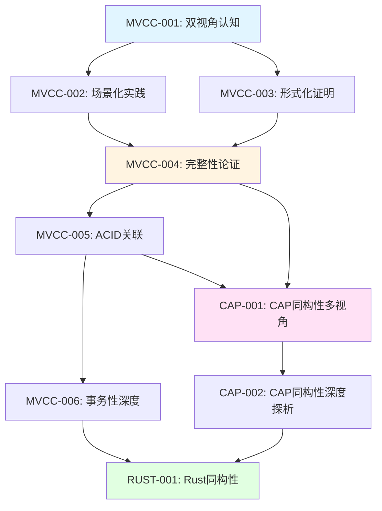
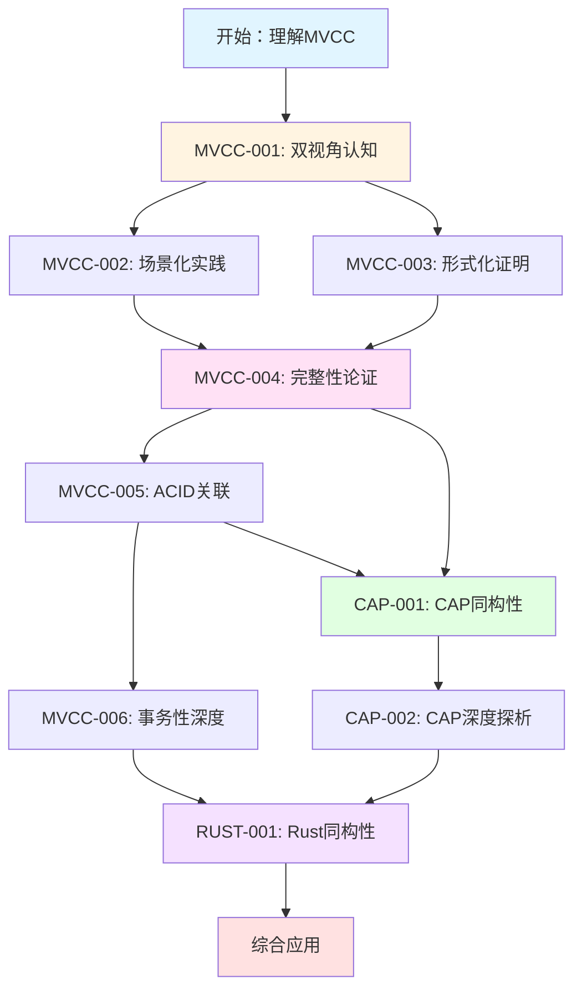
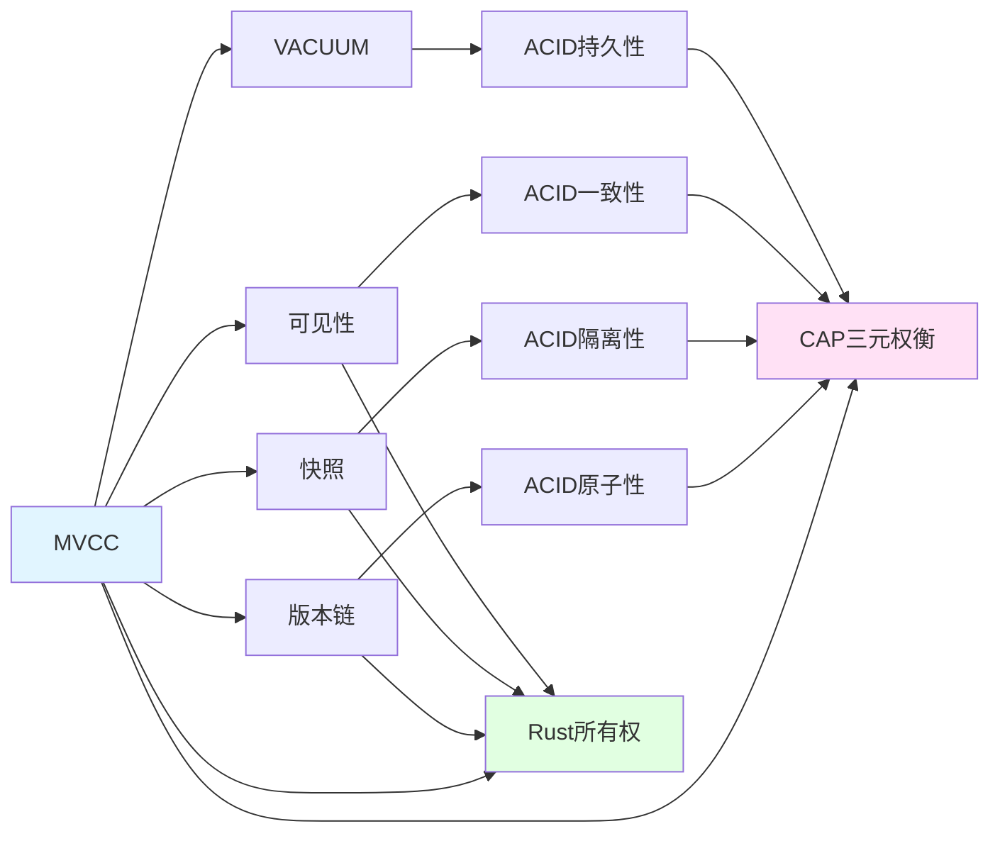

# 核心文档主题与论证思脉综合分析

> **文档编号**: VIEW-ANALYSIS-001
> **主题**: 核心文档主题与论证思脉综合分析
> **版本**: v1.0
> **创建日期**: 2024年
> **状态**: ✅ 已完成

---

## 📋 目录

- [核心文档主题与论证思脉综合分析](#核心文档主题与论证思脉综合分析)
  - [📋 目录](#-目录)
  - [📊 第一部分：主题全景梳理](#-第一部分主题全景梳理)
    - [1.1 文档主题分类体系](#11-文档主题分类体系)
      - [MVCC核心主题（6个文档）](#mvcc核心主题6个文档)
      - [CAP同构性主题（2个文档）](#cap同构性主题2个文档)
      - [Rust同构性主题（1个文档）](#rust同构性主题1个文档)
    - [1.2 主题演进路径](#12-主题演进路径)
    - [1.3 主题覆盖矩阵](#13-主题覆盖矩阵)
  - [🔍 第二部分：论证思脉分析](#-第二部分论证思脉分析)
    - [2.1 MVCC核心文档论证思脉](#21-mvcc核心文档论证思脉)
      - [MVCC-001：双视角认知体系](#mvcc-001双视角认知体系)
      - [MVCC-002：场景化全景论证](#mvcc-002场景化全景论证)
      - [MVCC-003：形式化证明系统](#mvcc-003形式化证明系统)
      - [MVCC-004：完整性论证体系](#mvcc-004完整性论证体系)
      - [MVCC-005：MVCC-ACID关联性](#mvcc-005mvcc-acid关联性)
      - [MVCC-006：MVCC-ACID-事务性](#mvcc-006mvcc-acid-事务性)
    - [2.2 CAP同构性文档论证思脉](#22-cap同构性文档论证思脉)
      - [CAP-001：结构同构性多视角](#cap-001结构同构性多视角)
      - [CAP-002：结构同构性深度探析](#cap-002结构同构性深度探析)
    - [2.3 Rust同构性文档论证思脉](#23-rust同构性文档论证思脉)
      - [RUST-001：Rust并发模型同构性](#rust-001rust并发模型同构性)
  - [🌳 第三部分：决策树体系](#-第三部分决策树体系)
    - [3.1 MVCC隔离级别选择决策树](#31-mvcc隔离级别选择决策树)
    - [3.2 VACUUM策略选择决策树](#32-vacuum策略选择决策树)
    - [3.3 CAP模式选择决策树](#33-cap模式选择决策树)
    - [3.4 性能优化策略选择决策树](#34-性能优化策略选择决策树)
    - [3.5 Rust并发原语选择决策树](#35-rust并发原语选择决策树)
  - [🛤️ 第四部分：逻辑路径网络](#️-第四部分逻辑路径网络)
    - [4.1 基础学习路径](#41-基础学习路径)
    - [4.2 理论深化路径](#42-理论深化路径)
    - [4.3 同构性探索路径](#43-同构性探索路径)
    - [4.4 综合应用路径](#44-综合应用路径)
    - [4.5 场景驱动论证路径](#45-场景驱动论证路径)
    - [4.6 同构性探索路径](#46-同构性探索路径)
    - [4.7 逻辑路径网络图](#47-逻辑路径网络图)
  - [📐 第五部分：形式化证明体系整合](#-第五部分形式化证明体系整合)
    - [5.1 形式化定义体系](#51-形式化定义体系)
      - [5.1.1 基础定义](#511-基础定义)
      - [5.1.2 可见性判断形式化](#512-可见性判断形式化)
    - [5.2 核心定理体系](#52-核心定理体系)
      - [5.2.1 MVCC核心定理](#521-mvcc核心定理)
      - [5.2.2 ACID关联性定理](#522-acid关联性定理)
      - [5.2.3 同构性定理](#523-同构性定理)
    - [5.3 证明树体系](#53-证明树体系)
      - [5.3.1 HOT更新可行性证明树](#531-hot更新可行性证明树)
      - [5.3.2 VACUUM回收原子性证明树](#532-vacuum回收原子性证明树)
  - [🗺️ 第六部分：思维导图体系](#️-第六部分思维导图体系)
    - [6.1 MVCC核心概念思维导图](#61-mvcc核心概念思维导图)
    - [6.2 MVCC-ACID-CAP同构性思维导图](#62-mvcc-acid-cap同构性思维导图)
    - [6.3 Rust同构性思维导图](#63-rust同构性思维导图)
    - [6.4 综合知识体系思维导图](#64-综合知识体系思维导图)
  - [📊 第七部分：矩阵对比系统](#-第七部分矩阵对比系统)
    - [7.1 双视角认知差异矩阵](#71-双视角认知差异矩阵)
    - [7.2 操作成本分析矩阵](#72-操作成本分析矩阵)
    - [7.3 隔离级别异常矩阵](#73-隔离级别异常矩阵)
    - [7.4 MVCC-ACID映射矩阵](#74-mvcc-acid映射矩阵)
    - [7.5 CAP模式选择矩阵](#75-cap模式选择矩阵)
    - [7.6 Rust并发原语同构映射矩阵](#76-rust并发原语同构映射矩阵)
    - [7.7 场景复杂度矩阵](#77-场景复杂度矩阵)
    - [7.8 论证方法适用性矩阵](#78-论证方法适用性矩阵)
  - [⚖️ 第八部分：多因素分析框架](#️-第八部分多因素分析框架)
    - [8.1 隔离级别选择多因素分析](#81-隔离级别选择多因素分析)
      - [因素权重矩阵](#因素权重矩阵)
      - [决策公式](#决策公式)
    - [8.2 VACUUM策略选择多因素分析](#82-vacuum策略选择多因素分析)
      - [因素权重矩阵](#因素权重矩阵-1)
    - [8.3 CAP模式选择多因素分析](#83-cap模式选择多因素分析)
      - [因素权重矩阵](#因素权重矩阵-2)
    - [8.4 性能优化策略多因素分析](#84-性能优化策略多因素分析)
      - [因素权重矩阵](#因素权重矩阵-3)
    - [8.5 Rust并发原语选择多因素分析](#85-rust并发原语选择多因素分析)
      - [因素权重矩阵](#因素权重矩阵-4)
  - [🔗 第九部分：跨文档关联网络](#-第九部分跨文档关联网络)
    - [9.1 概念关联网络](#91-概念关联网络)
    - [9.2 文档依赖关系](#92-文档依赖关系)
    - [9.3 论证方法关联](#93-论证方法关联)
  - [📝 第二十一部分：论证思脉核心模式总结](#-第二十一部分论证思脉核心模式总结)
    - [21.1 论证模式分类体系](#211-论证模式分类体系)
      - [模式A：定义→机制→验证→应用](#模式a定义机制验证应用)
      - [模式B：场景→分析→总结→指导](#模式b场景分析总结指导)
      - [模式C：视角→映射→证明→结论](#模式c视角映射证明结论)
    - [21.2 论证方法组合模式](#212-论证方法组合模式)
      - [组合1：形式化+场景+矩阵](#组合1形式化场景矩阵)
      - [组合2：场景+矩阵+决策树](#组合2场景矩阵决策树)
      - [组合3：视角+映射+证明](#组合3视角映射证明)
    - [21.3 论证强度评估体系](#213-论证强度评估体系)
      - [评估维度](#评估维度)
      - [综合评分](#综合评分)
  - [📝 总结](#-总结)
    - [核心发现](#核心发现)
    - [论证方法统计](#论证方法统计)
    - [改进建议](#改进建议)
  - [📊 第十部分：综合论证路径图](#-第十部分综合论证路径图)
    - [10.1 完整论证路径网络](#101-完整论证路径网络)
    - [10.2 论证方法应用路径](#102-论证方法应用路径)
    - [10.3 关键决策点网络](#103-关键决策点网络)
  - [🎯 第十一部分：论证思脉核心模式](#-第十一部分论证思脉核心模式)
    - [11.1 论证模式分类](#111-论证模式分类)
      - [模式1：定义→机制→验证](#模式1定义机制验证)
      - [模式2：场景→分析→总结](#模式2场景分析总结)
      - [模式3：视角→映射→证明](#模式3视角映射证明)
    - [11.2 论证方法组合模式](#112-论证方法组合模式)
      - [组合1：形式化+场景+矩阵](#组合1形式化场景矩阵-1)
      - [组合2：场景+矩阵+决策树](#组合2场景矩阵决策树-1)
      - [组合3：视角+映射+证明](#组合3视角映射证明-1)
  - [📈 第十二部分：论证强度评估](#-第十二部分论证强度评估)
    - [12.1 论证强度矩阵](#121-论证强度矩阵)
    - [12.2 论证方法完整性评估](#122-论证方法完整性评估)
  - [🔬 第十三部分：论证思脉深度分析](#-第十三部分论证思脉深度分析)
    - [13.1 论证深度层次](#131-论证深度层次)
      - [层次1：表面层（描述性）](#层次1表面层描述性)
      - [层次2：机制层（解释性）](#层次2机制层解释性)
      - [层次3：形式化层（证明性）](#层次3形式化层证明性)
      - [层次4：同构层（关联性）](#层次4同构层关联性)
    - [13.2 论证思脉演进路径](#132-论证思脉演进路径)
  - [🎨 第十四部分：论证表征多样性分析](#-第十四部分论证表征多样性分析)
    - [14.1 表征类型统计](#141-表征类型统计)
    - [14.2 表征组合模式](#142-表征组合模式)
      - [模式1：文字+公式+代码+表格](#模式1文字公式代码表格)
      - [模式2：文字+公式+矩阵+思维导图](#模式2文字公式矩阵思维导图)
      - [模式3：文字+公式+证明树](#模式3文字公式证明树)
  - [📋 第十五部分：综合决策框架](#-第十五部分综合决策框架)
    - [15.1 综合决策流程](#151-综合决策流程)
    - [15.2 决策支持工具矩阵](#152-决策支持工具矩阵)
    - [15.3 综合决策表（来自MVCC-004）](#153-综合决策表来自mvcc-004)
      - [决策表1：隔离级别选择](#决策表1隔离级别选择)
      - [决策表2：VACUUM策略选择](#决策表2vacuum策略选择)
      - [决策表3：CAP模式选择](#决策表3cap模式选择)
      - [决策表4：Rust并发原语选择](#决策表4rust并发原语选择)
  - [🔗 第十六部分：跨文档知识网络](#-第十六部分跨文档知识网络)
    - [16.1 概念关联网络](#161-概念关联网络)
    - [16.2 论证方法关联网络](#162-论证方法关联网络)
  - [📊 第十七部分：论证完整性评估](#-第十七部分论证完整性评估)
    - [17.1 文档完整性矩阵](#171-文档完整性矩阵)
    - [17.2 论证方法覆盖度](#172-论证方法覆盖度)
  - [🎯 第十八部分：论证思脉核心洞察](#-第十八部分论证思脉核心洞察)
    - [18.1 核心洞察总结](#181-核心洞察总结)
      - [洞察1：论证的递进性](#洞察1论证的递进性)
      - [洞察2：多表征的互补性](#洞察2多表征的互补性)
      - [洞察3：同构性的普遍性](#洞察3同构性的普遍性)
      - [洞察4：实践指导的完整性](#洞察4实践指导的完整性)
    - [18.2 论证思脉的核心模式](#182-论证思脉的核心模式)
      - [模式1：定义→机制→验证→应用](#模式1定义机制验证应用)
      - [模式2：视角→映射→证明→结论](#模式2视角映射证明结论)
      - [模式3：场景→分析→总结→指导](#模式3场景分析总结指导)
  - [📚 第十九部分：参考文献与资源整合](#-第十九部分参考文献与资源整合)
    - [19.1 核心概念索引](#191-核心概念索引)
    - [19.2 论证方法索引](#192-论证方法索引)
  - [🎓 第二十部分：学习路径与论证路径整合](#-第二十部分学习路径与论证路径整合)
    - [20.1 完整学习路径](#201-完整学习路径)
    - [20.2 论证路径与学习路径的对应关系](#202-论证路径与学习路径的对应关系)
  - [🎯 第二十二部分：论证思脉核心洞察与应用](#-第二十二部分论证思脉核心洞察与应用)
    - [22.1 核心洞察总结](#221-核心洞察总结)
      - [洞察1：论证的递进性](#洞察1论证的递进性-1)
      - [洞察2：多表征的互补性](#洞察2多表征的互补性-1)
      - [洞察3：同构性的普遍性](#洞察3同构性的普遍性-1)
      - [洞察4：实践指导的完整性](#洞察4实践指导的完整性-1)
    - [22.2 论证方法应用指南](#222-论证方法应用指南)
      - [何时使用形式化定义](#何时使用形式化定义)
      - [何时使用场景验证](#何时使用场景验证)
      - [何时使用矩阵对比](#何时使用矩阵对比)
      - [何时使用决策树](#何时使用决策树)
      - [何时使用多因素分析](#何时使用多因素分析)
    - [22.3 学习路径推荐](#223-学习路径推荐)
      - [路径1：快速入门（1-2周）](#路径1快速入门1-2周)
      - [路径2：理论深化（2-4周）](#路径2理论深化2-4周)
      - [路径3：关联扩展（3-5周）](#路径3关联扩展3-5周)
      - [路径4：同构性探索（4-6周）](#路径4同构性探索4-6周)
      - [路径5：综合应用（6-8周）](#路径5综合应用6-8周)

---

## 📊 第一部分：主题全景梳理

### 1.1 文档主题分类体系

#### MVCC核心主题（6个文档）

| 文档 | 核心主题 | 论证层次 | 关键概念 |
|------|---------|---------|---------|
| **MVCC-001** | 双视角认知体系 | 认知层 | 程序员视角 vs 设计者视角 |
| **MVCC-002** | 场景化全景论证 | 实践层 | 12个递进式真实场景 |
| **MVCC-003** | 形式化证明系统 | 理论层 | 形式化语义、公理系统、证明树 |
| **MVCC-004** | 完整性论证体系 | 综合层 | 形式化语义、多维矩阵、场景验证 |
| **MVCC-005** | MVCC-ACID关联性 | 关联层 | 形式化关联性证明、多维转换矩阵 |
| **MVCC-006** | MVCC-ACID-事务性 | 深度层 | 从磁盘页面字节布局开始的完整分析 |

#### CAP同构性主题（2个文档）

| 文档 | 核心主题 | 论证层次 | 关键概念 |
|------|---------|---------|---------|
| **CAP-001** | 结构同构性多视角 | 多视角层 | 6个视角的结构同构论证 |
| **CAP-002** | 结构同构性深度探析 | 探析层 | 技术实现、系统设计、概念演化三重透视 |

#### Rust同构性主题（1个文档）

| 文档 | 核心主题 | 论证层次 | 关键概念 |
|------|---------|---------|---------|
| **RUST-001** | Rust并发模型同构性 | 同构层 | Rust并发模型与MVCC同构性 |

### 1.2 主题演进路径

```text
基础认知 (MVCC-001)
    ↓
场景实践 (MVCC-002)
    ↓
形式化理论 (MVCC-003)
    ↓
完整性论证 (MVCC-004)
    ↓
ACID关联 (MVCC-005)
    ↓
事务性深度 (MVCC-006)
    ↓
CAP同构 (CAP-001, CAP-002)
    ↓
Rust同构 (RUST-001)
```

### 1.3 主题覆盖矩阵

| 主题维度 | MVCC-001 | MVCC-002 | MVCC-003 | MVCC-004 | MVCC-005 | MVCC-006 | CAP-001 | CAP-002 | RUST-001 |
|---------|---------|---------|---------|---------|---------|---------|---------|---------|----------|
| **基础概念** | ✅ | ✅ | ✅ | ✅ | ✅ | ✅ | ✅ | ✅ | ✅ |
| **形式化定义** | ✅ | ⚠️ | ✅ | ✅ | ✅ | ✅ | ⚠️ | ✅ | ✅ |
| **场景验证** | ✅ | ✅ | ✅ | ✅ | ✅ | ✅ | ✅ | ⚠️ | ✅ |
| **矩阵对比** | ✅ | ✅ | ✅ | ✅ | ✅ | ⚠️ | ✅ | ⚠️ | ✅ |
| **决策树** | ⚠️ | ⚠️ | ⚠️ | ✅ | ⚠️ | ⚠️ | ⚠️ | ⚠️ | ⚠️ |
| **证明树** | ⚠️ | ⚠️ | ✅ | ⚠️ | ⚠️ | ⚠️ | ⚠️ | ⚠️ | ⚠️ |
| **思维导图** | ✅ | ⚠️ | ✅ | ✅ | ✅ | ⚠️ | ⚠️ | ⚠️ | ✅ |
| **同构性论证** | ⚠️ | ⚠️ | ⚠️ | ⚠️ | ⚠️ | ⚠️ | ✅ | ✅ | ✅ |

---

## 🔍 第二部分：论证思脉分析

### 2.1 MVCC核心文档论证思脉

#### MVCC-001：双视角认知体系

**论证结构**：

```text
形式化定义层
    ↓
工作机制说明层
    ↓
思维导图层（双视角映射）
    ↓
矩阵对比层（差异分析）
    ↓
深度论证层（PostgreSQL实例）
    ↓
认知断层识别层
    ↓
实践建议层
```

**核心论证路径**：

1. **定义 → 机制**：从形式化定义到工作机制说明
2. **视角分离**：程序员视角 vs 设计者视角
3. **差异识别**：通过矩阵对比识别认知差异
4. **实例验证**：通过PostgreSQL实例验证
5. **断层弥合**：识别并弥合认知断层
6. **实践指导**：提供双向思维转换指南

#### MVCC-002：场景化全景论证

**论证结构**：

```text
场景1：基础可见性
    ↓
场景2：隔离级别差异
    ↓
场景3：写-写冲突
    ↓
场景4-12：递进式复杂场景
    ↓
综合对比矩阵
    ↓
性能对比分析
    ↓
核心认知总结
```

**核心论证路径**：

1. **场景递进**：从简单到复杂的12个场景
2. **双视角映射**：每个场景都包含设计者视角和程序员视角
3. **系统监控**：通过系统视图验证场景
4. **性能分析**：分析每个场景的性能影响
5. **综合对比**：通过矩阵对比所有场景
6. **认知总结**：提炼核心认知

#### MVCC-003：形式化证明系统

**论证结构**：

```text
系统架构层
    ↓
形式化语义层（公理系统）
    ↓
可见性判断形式化证明层
    ↓
场景形式化验证层
    ↓
多维矩阵对比层
    ↓
形式化证明树层
    ↓
全景思维导图层
    ↓
场景化定理应用层
```

**核心论证路径**：

1. **公理建立**：建立形式化公理系统
2. **定理证明**：通过形式化方法证明关键定理
3. **场景验证**：用形式化方法验证场景
4. **矩阵对比**：通过矩阵对比不同维度
5. **证明树构建**：构建关键定理的证明树
6. **应用验证**：将定理应用到实际场景

#### MVCC-004：完整性论证体系

**论证结构**：

```text
形式化语义与公理系统
    ↓
多维矩阵对比系统
    ↓
完备场景形式化验证
    ↓
思维导图体系
    ↓
性能优化决策树
    ↓
形式化验证脚本库
    ↓
理论边界与极限分析
    ↓
终极决策表
```

**核心论证路径**：

1. **完整性建立**：建立完整的理论体系
2. **多维分析**：通过多维矩阵进行对比分析
3. **场景完备性**：验证场景的完备性
4. **决策支持**：提供决策树和决策表
5. **边界分析**：分析理论边界和极限情况
6. **工具支持**：提供验证脚本库

#### MVCC-005：MVCC-ACID关联性

**论证结构**：

```text
思维导图体系
    ↓
形式化关联性证明系统
    ↓
多维转换与制约矩阵
    ↓
知识图谱（概念关联网络）
    ↓
场景化关联性验证
    ↓
业务场景驱动论证体系
    ↓
从业务场景到技术实现的完整映射
```

**核心论证路径**：

1. **关联性定义**：形式化定义MVCC-ACID关联性
2. **映射机制**：建立MVCC到ACID的映射机制
3. **转换矩阵**：建立多维转换矩阵
4. **知识图谱**：构建概念关联网络
5. **场景验证**：通过场景验证关联性
6. **业务驱动**：从业务场景驱动论证

#### MVCC-006：MVCC-ACID-事务性

**论证结构**：

```text
事务性形式化定义
    ↓
形式化语义与物理实现的紧耦合
    ↓
事务生命周期完整场景
    ↓
ACID与MVCC的制约关系网络
    ↓
可执行验证与故障注入
    ↓
事务性完整场景
    ↓
终极验证系统
```

**核心论证路径**：

1. **深度耦合**：从磁盘页面字节布局开始
2. **物理映射**：形式化语义与物理实现的紧耦合
3. **生命周期**：完整的事务生命周期分析
4. **制约关系**：ACID与MVCC的制约关系网络
5. **故障注入**：通过故障注入验证
6. **终极验证**：建立终极验证系统

### 2.2 CAP同构性文档论证思脉

#### CAP-001：结构同构性多视角

**论证结构**：

```text
视角一：决策空间三元组
    ↓
视角二：状态机与版本演进
    ↓
视角三：可见性边界与一致性快照
    ↓
视角四：故障模型与恢复机制
    ↓
视角五：线性化点与全局顺序
    ↓
视角六：设计模式转换手册
    ↓
形式化证明：所有系统都是广义MVCC
```

**核心论证路径**：

1. **多视角展开**：从6个不同视角论证同构性
2. **结构映射**：建立MVCC-ACID-CAP的结构映射
3. **机制对比**：对比底层机制的相似性
4. **模式转换**：提供设计模式转换手册
5. **形式化证明**：形式化证明广义MVCC框架

#### CAP-002：结构同构性深度探析

**论证结构**：

```text
深度探析形式化框架
    ↓
核心论点：超越表象的结构同构性
    ↓
技术实现视角：殊途同归的底层机制
    ↓
系统设计视角：权衡决策与架构模式的共鸣
    ↓
概念演化视角：从单机到分布式的理论延伸
    ↓
结论：在一致性的光谱上，MVCC、ACID与CAP的结构性共鸣
```

**核心论证路径**：

1. **探析框架**：建立深度探析的形式化框架
2. **三重透视**：技术实现、系统设计、概念演化
3. **机制分析**：分析底层机制的相似性
4. **设计共鸣**：分析设计哲学和权衡决策的共鸣
5. **演化路径**：追溯概念演化的历史脉络
6. **结构性共鸣**：总结结构性的深层共鸣

### 2.3 Rust同构性文档论证思脉

#### RUST-001：Rust并发模型同构性

**论证结构**：

```text
基础同构性论证
    ↓
深度同构映射
    ↓
场景驱动的业务论证
    ↓
从业务痛点到技术实现
```

**核心论证路径**：

1. **同构映射**：建立PostgreSQL MVCC与Rust并发模型的同构映射
2. **形式化证明**：形式化证明同构性
3. **多维对比**：通过矩阵对比不同维度
4. **场景验证**：通过场景验证同构性
5. **业务驱动**：从业务场景驱动论证

---

## 🌳 第三部分：决策树体系

### 3.1 MVCC隔离级别选择决策树

```text
开始：选择隔离级别
    │
    ├─ 需要可串行化？
    │   ├─ 是 → SERIALIZABLE
    │   │       ├─ 性能可接受？
    │   │       │   ├─ 是 → 使用SERIALIZABLE
    │   │       │   └─ 否 → 考虑应用层锁
    │   │       └─ 冲突率高？
    │   │           ├─ 是 → 优化冲突检测
    │   │           └─ 否 → 使用SERIALIZABLE
    │   │
    │   └─ 否 → 继续判断
    │
    ├─ 需要可重复读？
    │   ├─ 是 → REPEATABLE READ
    │   │       ├─ 长事务？
    │   │       │   ├─ 是 → 监控backend_xmin
    │   │       │   └─ 否 → 使用REPEATABLE READ
    │   │       └─ 表膨胀风险？
    │   │           ├─ 是 → 设置事务超时
    │   │           └─ 否 → 使用REPEATABLE READ
    │   │
    │   └─ 否 → 继续判断
    │
    └─ 默认 → READ COMMITTED
            ├─ 不可重复读可接受？
            │   ├─ 是 → 使用READ COMMITTED
            │   └─ 否 → 考虑REPEATABLE READ
            └─ 性能优先？
                ├─ 是 → 使用READ COMMITTED
                └─ 否 → 考虑更高隔离级别
```

### 3.2 VACUUM策略选择决策树

```text
开始：选择VACUUM策略
    │
    ├─ 表膨胀率 > 20%？
    │   ├─ 是 → 需要VACUUM
    │   │       ├─ 有长事务？
    │   │       │   ├─ 是 → 先终止长事务
    │   │       │   └─ 否 → 继续
    │   │       ├─ XID年龄 > 2^31 - 10^8？
    │   │       │   ├─ 是 → VACUUM FREEZE（紧急）
    │   │       │   └─ 否 → 继续
    │   │       └─ 表大小 > 阈值？
    │   │           ├─ 是 → VACUUM FULL（重建）
    │   │           └─ 否 → VACUUM（常规）
    │   │
    │   └─ 否 → 监控即可
    │
    └─ 自动VACUUM配置
        ├─ 更新频率高？
        │   ├─ 是 → 降低autovacuum阈值
        │   └─ 否 → 使用默认配置
        └─ 长事务多？
            ├─ 是 → 设置事务超时
            └─ 否 → 使用默认配置
```

### 3.3 CAP模式选择决策树

```text
开始：选择CAP模式
    │
    ├─ 网络分区常见？
    │   ├─ 是 → 必须选择P（分区容错）
    │   │       ├─ 强一致性要求？
    │   │       │   ├─ 是 → CP模式
    │   │       │   │       ├─ 可用性可牺牲？
    │   │       │   │       │   ├─ 是 → 使用CP
    │   │       │   │       │   └─ 否 → 考虑最终一致性
    │   │       │   │       └─ 性能可接受？
    │   │       │   │           ├─ 是 → 使用CP
    │   │       │   │           └─ 否 → 考虑AP
    │   │       │   │
    │   │       │   └─ 否 → AP模式
    │   │       │           ├─ 最终一致性可接受？
    │   │       │           │   ├─ 是 → 使用AP
    │   │       │           │   └─ 否 → 考虑CP
    │   │       │           └─ 高可用性要求？
    │   │       │               ├─ 是 → 使用AP
    │   │       │               └─ 否 → 考虑CP
    │   │       │
    │   │       └─ 否 → 可以忽略P
    │   │
    │   └─ 否 → 单机系统，无需考虑P
    │
    └─ PostgreSQL配置
        ├─ synchronous_commit = 'remote_apply' → CP模式
        ├─ synchronous_commit = 'local' → AP模式
        └─ 隔离级别选择
            ├─ SERIALIZABLE → CP模式
            ├─ REPEATABLE READ → CP-soft模式
            └─ READ COMMITTED → AP模式
```

### 3.4 性能优化策略选择决策树

```text
开始：性能优化需求
    │
    ├─ 查询性能问题？
    │   ├─ 是 → 检查索引
    │   │       ├─ 索引缺失？
    │   │       │   ├─ 是 → 创建索引
    │   │       │   └─ 否 → 检查索引使用
    │   │       └─ 索引未使用？
    │   │           ├─ 是 → 分析查询计划
    │   │           └─ 否 → 检查表膨胀
    │   │
    │   └─ 否 → 检查写入性能
    │
    ├─ 表膨胀问题？
    │   ├─ 是 → 检查HOT优化
    │   │       ├─ HOT率 < 50%？
    │   │       │   ├─ 是 → 检查更新列
    │   │       │   │       ├─ 更新索引列？
    │   │       │   │       │   ├─ 是 → 考虑拆表或降低fillfactor
    │   │       │   │       │   └─ 否 → 降低fillfactor到70
    │   │       │   │       └─ 页空间不足？
    │   │       │   │           ├─ 是 → 降低fillfactor
    │   │       │   │           └─ 否 → 检查VACUUM
    │   │       │   └─ 否 → HOT优化良好
    │   │       └─ 检查VACUUM
    │   │           ├─ 有长事务？
    │   │           │   ├─ 是 → 终止长事务
    │   │           │   └─ 否 → 执行VACUUM
    │   │           └─ XID年龄 > 1亿？
    │   │               ├─ 是 → VACUUM FREEZE（紧急）
    │   │               └─ 否 → 常规VACUUM
    │   │
    │   └─ 否 → 检查其他问题
    │
    └─ 并发性能问题？
        ├─ 是 → 检查隔离级别
        │       ├─ 使用SERIALIZABLE？
        │       │   ├─ 是 → 考虑降低到REPEATABLE READ
        │       │   └─ 否 → 检查锁竞争
        │       └─ 锁竞争高？
        │           ├─ 是 → 优化锁粒度
        │           └─ 否 → 检查其他瓶颈
        │
        └─ 否 → 性能优化完成
```

### 3.5 Rust并发原语选择决策树

```text
开始：选择Rust并发原语
    │
    ├─ 需要共享可变状态？
    │   ├─ 是 → 需要锁
    │   │       ├─ 多读少写？
    │   │       │   ├─ 是 → RwLock<T>
    │   │       │   └─ 否 → Mutex<T>
    │   │       ├─ 需要无锁？
    │   │       │   ├─ 是 → Atomic类型
    │   │       │   └─ 否 → 继续
    │   │       └─ 需要跨线程？
    │   │           ├─ 是 → Arc<Mutex<T>>或Arc<RwLock<T>>
    │   │           └─ 否 → Mutex<T>或RwLock<T>
    │   │
    │   └─ 否 → 不需要锁
    │       ├─ 需要消息传递？
    │       │   ├─ 是 → Channel
    │       │   └─ 否 → 继续
    │       └─ 需要异步？
    │           ├─ 是 → async/await + tokio
    │           └─ 否 → 同步代码
    │
    └─ 生命周期管理
        ├─ 需要静态保证？
        │   ├─ 是 → 使用生命周期参数
        │   └─ 否 → 使用Arc/Rc
        └─ 需要自动清理？
            ├─ 是 → 使用Drop trait
            └─ 否 → 手动管理
```

---

## 🛤️ 第四部分：逻辑路径网络

### 4.1 基础学习路径

```text
路径1：从认知到实践
    MVCC-001 (双视角认知)
        ↓
    MVCC-002 (场景化实践)
        ↓
    MVCC-004 (完整性论证)
```

### 4.2 理论深化路径

```text
路径2：从形式化到应用
    MVCC-003 (形式化证明)
        ↓
    MVCC-004 (完整性论证)
        ↓
    MVCC-005 (ACID关联)
        ↓
    MVCC-006 (事务性深度)
```

### 4.3 同构性探索路径

```text
路径3：从MVCC到同构性
    MVCC-001~006 (MVCC基础)
        ↓
    CAP-001 (CAP同构性多视角)
        ↓
    CAP-002 (CAP同构性深度探析)
        ↓
    RUST-001 (Rust同构性)
```

### 4.4 综合应用路径

```text
路径4：从理论到综合应用
    所有MVCC文档
        ↓
    所有CAP文档
        ↓
    RUST-001
        ↓
    综合应用场景
```

### 4.5 场景驱动论证路径

```text
路径5：从场景到理论
    业务场景（电商秒杀、银行转账等）
        ↓
    场景分析（MVCC-002, MVCC-005, MVCC-006）
        ↓
    问题识别（性能瓶颈、一致性要求等）
        ↓
    理论应用（形式化证明、矩阵对比）
        ↓
    方案选择（决策树、多因素分析）
        ↓
    方案验证（场景验证、性能测试）
        ↓
    方案优化（参数调优、最佳实践）
```

### 4.6 同构性探索路径

```text
路径6：从MVCC到同构性
    MVCC机制理解
        ↓
    ACID关联理解（MVCC-005, MVCC-006）
        ↓
    CAP同构性理解（CAP-001, CAP-002）
        ↓
    Rust同构性理解（RUST-001）
        ↓
    广义MVCC框架理解
        ↓
    系统设计应用
```

### 4.7 逻辑路径网络图



---

## 📐 第五部分：形式化证明体系整合

### 5.1 形式化定义体系

#### 5.1.1 基础定义

**数据库状态空间模型**：
$$
\mathcal{D} = \langle R, T, \mathcal{X}, \mathcal{S}, \mathcal{C}, \mathcal{P} \rangle
$$

**元组形式化定义**：
$$
\tau \triangleq \langle d, \text{xmin}, \text{xmax}, \text{ctid}, \text{cmin}, \text{cmax}, \Psi \rangle
$$

**版本链递归定义**：
$$
\text{Chain}(r, k) = \begin{cases}
[\tau_0] & \text{if} \quad \tau_0.\text{xmax} = 0 \\
[\tau_0] \oplus \text{Chain}(r, \tau_0.\text{ctid}) & \text{otherwise}
\end{cases}
$$

#### 5.1.2 可见性判断形式化

**可见性谓词**：
$$
\text{Visible}(\tau, t, q) \Leftrightarrow \\
(\tau.\text{xmin} < \text{xmin}(t) \land \tau.\text{xmin} \notin \mathcal{S}(t, q)) \land \\
(\tau.\text{xmax} = 0 \lor \tau.\text{xmax} > \text{xmax}(t) \lor \mathcal{C}(\tau.\text{xmax}) \neq C)
$$

**快照定义**：
$$
\text{Snapshot}(t, q) = \{x \in \mathbb{N} \mid x \text{ is active at } t\}
$$

### 5.2 核心定理体系

#### 5.2.1 MVCC核心定理

**定理1：版本链完整性不变式**
$$
\forall r \in R, \forall \tau_i, \tau_{i+1} \in \text{Chain}(r, k): \\
\tau_i.\text{xmax} = \tau_{i+1}.\text{xmin} \land \tau_i.\text{xmax} \neq 0 \land \tau_{i+1}.\text{xmin} \neq 0
$$

**定理2：可见性一致性**
$$
\forall t_1, t_2 \in T, \forall \tau: \\
\text{Visible}(\tau, t_1) \land \text{Visible}(\tau, t_2) \implies \\
\tau.\text{xmin} < \min(\text{Snapshot}(t_1) \cup \text{Snapshot}(t_2))
$$

**定理3：读不阻塞写**
$$
\forall t_r, t_w \in T, \forall \tau: \\
\text{Read}(t_r, \tau) \land \text{Write}(t_w, \tau) \implies \\
\text{Read}(t_r, \tau) \text{ does not block } \text{Write}(t_w, \tau)
$$

#### 5.2.2 ACID关联性定理

**定理4：原子性实现**
$$
\text{Atomic}(T) \equiv \forall \tau \in \text{Versions}(T): \\
(\text{Commit}(T) \implies \text{Visible}(\tau, T')) \land \\
(\text{Abort}(T) \implies \neg \text{Visible}(\tau, T'))
$$

**定理5：隔离性实现**
$$
\text{Isolated}(T_1, T_2) \equiv \\
\text{Snapshot}(T_1) \cap \text{Snapshot}(T_2) = \emptyset \lor \\
\forall \tau: \text{Visible}(\tau, T_1) \land \text{Visible}(\tau, T_2) \implies \\
\tau.\text{xmin} < \min(\text{Snapshot}(T_1) \cup \text{Snapshot}(T_2))
$$

#### 5.2.3 同构性定理

**定理6：MVCC-ACID-CAP同构性**
$$
\text{Isomorphic}(\text{MVCC}, \text{ACID}, \text{CAP}) \equiv \\
\exists f: \text{MVCC} \to \text{ACID} \land \\
\exists g: \text{ACID} \to \text{CAP} \land \\
f \circ g \text{ is bijective}
$$

**定理7：广义MVCC框架**
任何并发控制系统，若满足以下四公理，则与MVCC同构：

1. **版本公理**：∀操作，生成新版本，不覆盖旧版本
2. **可见性公理**：∃函数 f(版本, 上下文) → {可见, 不可见}
3. **合并公理**：∃操作⊔，合并冲突版本
4. **垃圾公理**：∃规则G，回收不可见版本

### 5.3 证明树体系

#### 5.3.1 HOT更新可行性证明树

```text
HOT更新可行性
    │
    ├─ 前提条件
    │   ├─ 更新不涉及索引列
    │   ├─ 新版本可放入同一页面
    │   └─ 版本链长度 < 阈值
    │
    ├─ 证明步骤
    │   ├─ 步骤1：新版本创建
    │   │   └─ 证明：新版本xmin = 当前XID
    │   ├─ 步骤2：旧版本标记
    │   │   └─ 证明：旧版本xmax = 当前XID
    │   ├─ 步骤3：版本链更新
    │   │   └─ 证明：ctid指针正确更新
    │   └─ 步骤4：索引不变
    │       └─ 证明：索引无需更新
    │
    └─ 结论：HOT更新可行
```

#### 5.3.2 VACUUM回收原子性证明树

```text
VACUUM回收原子性
    │
    ├─ 前提条件
    │   ├─ 元组xmax已提交
    │   ├─ 元组xmax < backend_xmin
    │   └─ 无活跃事务需要该版本
    │
    ├─ 证明步骤
    │   ├─ 步骤1：可见性检查
    │   │   └─ 证明：所有活跃事务快照不包含该版本
    │   ├─ 步骤2：空间回收
    │   │   └─ 证明：空间回收不影响可见性
    │   └─ 步骤3：原子性保证
    │       └─ 证明：回收操作是原子的
    │
    └─ 结论：VACUUM回收是原子的
```

---

## 🗺️ 第六部分：思维导图体系

### 6.1 MVCC核心概念思维导图

```text
PostgreSQL MVCC核心概念
├── 基础概念层
│   ├── 元组（Tuple）
│   │   ├── 物理结构：xmin, xmax, ctid, cmin, cmax, flags
│   │   ├── 数据向量：列值
│   │   └── 版本标识：版本号
│   ├── 版本链（Version Chain）
│   │   ├── ctid指针链接
│   │   ├── 版本顺序：xmin递增
│   │   └── 版本状态：alive, dead, frozen
│   ├── 快照（Snapshot）
│   │   ├── 活跃事务列表
│   │   ├── xmin, xmax边界
│   │   └── 快照类型：RC, RR, SERIALIZABLE
│   └── 可见性（Visibility）
│       ├── 可见性判断函数
│       ├── 可见性规则
│       └── 可见性异常
│
├── 机制层
│   ├── 版本创建机制
│   │   ├── INSERT：创建新版本
│   │   ├── UPDATE：创建新版本，标记旧版本
│   │   └── DELETE：标记版本为删除
│   ├── 快照获取机制
│   │   ├── READ COMMITTED：每次查询新快照
│   │   ├── REPEATABLE READ：事务级快照
│   │   └── SERIALIZABLE：串行化快照
│   ├── 可见性判断机制
│   │   ├── xmin检查
│   │   ├── xmax检查
│   │   ├── 快照检查
│   │   └── CLOG检查
│   └── VACUUM清理机制
│       ├── 死亡元组回收
│       ├── 空间回收
│       └── FREEZE操作
│
├── 优化层
│   ├── HOT优化
│   │   ├── 同页更新
│   │   ├── 索引不变
│   │   └── 版本链优化
│   ├── 快照优化
│   │   ├── 快照复用
│   │   └── 快照压缩
│   └── VACUUM优化
│       ├── 增量VACUUM
│       ├── 并行VACUUM
│       └── 智能调度
│
└── 应用层
    ├── 隔离级别选择
    ├── 性能调优
    ├── 故障排查
    └── 最佳实践
```

### 6.2 MVCC-ACID-CAP同构性思维导图

```text
MVCC-ACID-CAP同构性
├── 结构同构层
│   ├── 三元权衡内核
│   │   ├── CAP：C ↔ A ↔ P
│   │   ├── ACID：I ↔ D ↔ 并发吞吐量
│   │   └── MVCC：版本新鲜度 ↔ 存储成本 ↔ 垃圾回收开销
│   ├── 状态机同构
│   │   ├── CAP：Normal → Partitioned → Recovery
│   │   ├── ACID：BEGIN → Active → Committed/Aborted
│   │   └── MVCC：INSERT → UPDATE → VACUUM
│   └── 决策原语同构
│       ├── CAP：是否可服务 = f(分区检测, 一致性策略, 超时)
│       ├── ACID：是否提交 = f(约束检查, 锁状态, 日志位置)
│       └── MVCC：是否可见 = f(xmin/xmax, 活跃事务集, 快照)
│
├── 机制同构层
│   ├── 版本控制同构
│   │   ├── MVCC：多版本数据管理
│   │   ├── 分布式系统：向量时钟与版本号
│   │   └── Git：提交历史管理
│   ├── 时间戳同构
│   │   ├── MVCC：事务ID与快照
│   │   ├── 分布式共识：日志索引
│   │   └── 区块链：区块时间戳
│   └── 冲突解决同构
│       ├── MVCC：基于锁的写冲突处理
│       ├── 分布式事务：2PC
│       └── 区块链：最长链规则
│
├── 设计同构层
│   ├── 一致性模型光谱
│   │   ├── ACID：强一致性
│   │   ├── CAP：CP/AP选择
│   │   └── MVCC：多种隔离级别
│   ├── 可用性权衡
│   │   ├── MVCC：快照读优化
│   │   ├── AP系统：高可用性设计
│   │   └── CP系统：一致性优先
│   └── 架构模式演进
│       ├── 单机MVCC
│       ├── 分布式MVCC
│       └── 云原生架构
│
└── 演化同构层
    ├── 一致性概念演进
    │   ├── ACID中的C：事务层面状态一致性
    │   ├── CAP中的C：分布式环境线性一致性
    │   └── 从统一到分化
    ├── 从ACID到BASE
    │   ├── ACID：单机数据库时代
    │   ├── CAP：分布式系统设计
    │   └── BASE：AP系统实践指导
    └── MVCC角色扩展
        ├── 单机并发控制
        ├── 分布式事务基石
        └── 云原生数据管理
```

### 6.3 Rust同构性思维导图

```text
PostgreSQL MVCC与Rust并发模型同构性
├── 基础同构层
│   ├── 所有权转移同构
│   │   ├── PostgreSQL：元组版本转移
│   │   └── Rust：所有权移动
│   ├── 借用检查同构
│   │   ├── PostgreSQL：可见性判断
│   │   └── Rust：借用规则检查
│   ├── 锁机制同构
│   │   ├── PostgreSQL：行锁
│   │   └── Rust：MutexGuard
│   └── 生命周期同构
│       ├── PostgreSQL：backend_xmin
│       └── Rust：生命周期参数
│
├── 深度同构层
│   ├── 字节级同构
│   │   ├── 元组头字节 ↔ 所有权状态
│   │   ├── CLOG页 ↔ Drop Trait
│   │   └── ProcArray ↔ Borrow Checker作用域栈
│   ├── 性能同构
│   │   ├── 版本链开销 ↔ 借用链开销
│   │   └── 锁获取延迟 ↔ Mutex延迟
│   └── 故障场景同构
│       ├── XID回卷 ↔ 整数溢出
│       ├── 悬空引用 ↔ 死亡元组回收
│       └── WAL日志 ↔ Rust日志持久化
│
└── 应用同构层
    ├── 场景映射
    │   ├── 电商秒杀
    │   ├── 银行转账
    │   └── 财务对账
    ├── 性能对比
    │   ├── 微操作延迟
    │   ├── 并发度与冲突率
    │   └── 空间占用
    └── 最佳实践
        ├── 并发原语选择
        ├── 生命周期管理
        └── 性能优化
```

### 6.4 综合知识体系思维导图

```text
PostgreSQL MVCC-ACID-CAP-Rust综合知识体系
├── 理论基础层
│   ├── MVCC理论
│   │   ├── 形式化定义
│   │   ├── 工作机制
│   │   └── 优化策略
│   ├── ACID理论
│   │   ├── 原子性
│   │   ├── 一致性
│   │   ├── 隔离性
│   │   └── 持久性
│   ├── CAP理论
│   │   ├── 一致性
│   │   ├── 可用性
│   │   └── 分区容错
│   └── Rust并发理论
│       ├── 所有权系统
│       ├── 借用检查
│       └── 并发原语
│
├── 关联层
│   ├── MVCC-ACID关联
│   │   ├── 版本→原子性
│   │   ├── 快照→隔离性
│   │   ├── 可见性→一致性
│   │   └── 版本链→持久性
│   ├── MVCC-CAP关联
│   │   ├── 三元权衡同构
│   │   ├── 状态机同构
│   │   └── 决策原语同构
│   └── MVCC-Rust关联
│       ├── 所有权同构
│       ├── 借用检查同构
│       └── 生命周期同构
│
├── 实践层
│   ├── 场景实践
│   │   ├── 电商场景
│   │   ├── 金融场景
│   │   └── 日志场景
│   ├── 性能优化
│   │   ├── 隔离级别选择
│   │   ├── VACUUM策略
│   │   └── HOT优化
│   └── 故障处理
│       ├── 表膨胀
│       ├── XID回卷
│       └── 死锁
│
└── 应用层
    ├── 系统设计
    │   ├── 单机系统
    │   ├── 分布式系统
    │   └── 云原生系统
    ├── 编程实践
    │   ├── PostgreSQL编程
    │   ├── Rust编程
    │   └── 跨语言集成
    └── 最佳实践
        ├── 设计模式
        ├── 性能调优
        └── 故障预防
```

```text
PostgreSQL MVCC与Rust并发模型同构性
├── 基础同构层
│   ├── 所有权转移同构
│   │   ├── PostgreSQL：元组版本转移
│   │   └── Rust：所有权移动
│   ├── 借用检查同构
│   │   ├── PostgreSQL：可见性判断
│   │   └── Rust：借用规则检查
│   ├── 锁机制同构
│   │   ├── PostgreSQL：行锁
│   │   └── Rust：MutexGuard
│   └── 生命周期同构
│       ├── PostgreSQL：backend_xmin
│       └── Rust：生命周期参数
│
├── 深度同构层
│   ├── 字节级同构
│   │   ├── 元组头字节 ↔ 所有权状态
│   │   ├── CLOG页 ↔ Drop Trait
│   │   └── ProcArray ↔ Borrow Checker作用域栈
│   ├── 性能同构
│   │   ├── 版本链开销 ↔ 借用链开销
│   │   └── 锁获取延迟 ↔ Mutex延迟
│   └── 故障场景同构
│       ├── XID回卷 ↔ 整数溢出
│       ├── 悬空引用 ↔ 死亡元组回收
│       └── WAL日志 ↔ Rust日志持久化
│
└── 应用同构层
    ├── 场景映射
    │   ├── 电商秒杀
    │   ├── 银行转账
    │   └── 财务对账
    ├── 性能对比
    │   ├── 微操作延迟
    │   ├── 并发度与冲突率
    │   └── 空间占用
    └── 最佳实践
        ├── 并发原语选择
        ├── 生命周期管理
        └── 性能优化
```

---

## 📊 第七部分：矩阵对比系统

### 7.1 双视角认知差异矩阵

| 认知维度 | 数据库设计者视角 | 编程人员视角 | 抽象泄漏点 | 弥合成本 |
|---------|----------------|------------|-----------|---------|
| **核心对象** | 元组物理头部（xmin/xmax/ctid） | 逻辑行（row） | 死亡元组残留导致表膨胀 | 需理解fillfactor+HOT |
| **版本管理** | 版本链是ctid指针链表 | 快照是"数据照片" | 长事务阻止旧版本回收 | 需监控backend_xmin年龄 |
| **事务回滚** | CLOG标记为A，无需undo | 物理数据恢复 | 回滚代价极小导致滥用子事务 | SubXID导致clog膨胀 |
| **可见性判断** | XID比较+clog查询+快照交集 | 时间戳排序 | READ COMMITTED每次查询都变 | 不可重复读是设计特性 |
| **锁的必要性** | 写-写冲突必须排他锁 | MVCC完全无锁 | 并发UPDATE仍会阻塞 | 需FOR UPDATE明确锁定 |
| **清理机制** | VACUUM扫描FSM回收页内空间 | 垃圾回收自动运行 | Autovacuum参数不当导致膨胀 | 需手动调优阈值 |
| **索引更新** | HOT优化避免索引变更 | 索引随数据自动更新 | 更新索引列导致索引膨胀 | 需区分索引/非索引列更新 |
| **XID管理** | 32位循环，需FREEZE | XID无限递增 | XID回卷导致整库只读 | 需紧急VACUUM FREEZE |
| **性能调优** | 空间换时间，权衡fillfactor | 索引越多越好 | 过度索引降低HOT率 | 需定期删除无用索引 |
| **故障排查** | pg_filedump分析页面结构 | EXPLAIN看执行计划 | 页面损坏或元组丢失 | 需理解linp行指针机制 |

### 7.2 操作成本分析矩阵

| 操作类型 | 版本生成数 | 锁开销 | 索引IO | WAL字节 | 死亡元组 | 快照计算 | 总权重 | TPS影响 |
|---------|-----------|--------|--------|---------|---------|---------|--------|---------|
| **INSERT** | 1 | 低（行锁） | 1次（索引插入） | ~100B | 0 | O(1) | 1.0 | 基准 |
| **UPDATE（HOT）** | 1 | 中（行锁） | 0次 | ~150B | 1 | O(1) | 1.2 | -5% |
| **UPDATE（非HOT）** | 1 | 中（行锁） | 1次（索引更新） | ~200B | 1 | O(1) | 1.8 | -15% |
| **DELETE** | 0 | 中（行锁） | 1次（索引删除） | ~100B | 1 | O(1) | 1.5 | -10% |
| **SELECT（RC）** | 0 | 无 | 0次 | 0 | 0 | O(n) | 0.5 | +20% |
| **SELECT（RR）** | 0 | 无 | 0次 | 0 | 0 | O(1) | 0.3 | +30% |
| **VACUUM** | 0 | 低（共享锁） | 0次 | 0 | -n | O(n) | 2.0 | -50% |

### 7.3 隔离级别异常矩阵

| 隔离级别 | 脏读 | 不可重复读 | 幻读 | 写偏序 | 实现机制 | 性能影响 | 适用场景 |
|---------|------|-----------|------|--------|---------|---------|---------|
| **READ UNCOMMITTED** | ❌ 可能 | ❌ 可能 | ❌ 可能 | ❌ 可能 | 无隔离 | +50% | 不推荐 |
| **READ COMMITTED** | ✅ 防止 | ❌ 可能 | ❌ 可能 | ❌ 可能 | 每语句新快照 | 基准 | 默认选择 |
| **REPEATABLE READ** | ✅ 防止 | ✅ 防止 | ✅ 防止（索引扫描） | ❌ 可能 | 事务级快照 | -10% | 需要可重复读 |
| **SERIALIZABLE** | ✅ 防止 | ✅ 防止 | ✅ 防止 | ✅ 防止 | SSI异常检测 | -30% | 需要可串行化 |

### 7.4 MVCC-ACID映射矩阵

| ACID属性 | MVCC实现机制 | 形式化表达 | 性能影响 | 故障场景 |
|---------|-------------|-----------|---------|---------|
| **原子性（A）** | CLOG状态标记 | $\text{Atomic}(T) \equiv \forall \tau: (\text{Commit}(T) \implies \text{Visible}(\tau))$ | 无额外开销 | CLOG损坏 |
| **一致性（C）** | 可见性规则+约束检查 | $\text{Consistent}(D) \equiv \forall \tau: \text{Visible}(\tau) \implies \text{Satisfies}(\tau, \text{Constraints})$ | 约束检查开销 | 约束违反 |
| **隔离性（I）** | 快照隔离 | $\text{Isolated}(T_1, T_2) \equiv \text{Snapshot}(T_1) \cap \text{Snapshot}(T_2) = \emptyset$ | 快照计算开销 | 长事务阻塞 |
| **持久性（D）** | WAL+版本链 | $\text{Durable}(T) \equiv \text{Commit}(T) \implies \text{Recover}() \vdash T \in \text{CommittedSet}$ | WAL写入开销 | WAL损坏 |

### 7.5 CAP模式选择矩阵

| CAP模式 | 一致性 | 可用性 | 分区容错 | PostgreSQL实现 | 适用场景 |
|---------|--------|--------|---------|---------------|---------|
| **CP模式** | ✅ 强一致性 | ❌ 牺牲可用性 | ✅ 分区容错 | SERIALIZABLE + synchronous_commit=remote_apply | 金融交易 |
| **AP模式** | ❌ 最终一致性 | ✅ 高可用性 | ✅ 分区容错 | READ COMMITTED + synchronous_commit=local | 日志系统 |
| **CA模式** | ✅ 强一致性 | ✅ 高可用性 | ❌ 无分区容错 | 单机PostgreSQL | 单机应用 |

### 7.6 Rust并发原语同构映射矩阵

| PostgreSQL机制 | Rust等价 | 检查时机 | 失败代价 | 性能特征 |
|---------------|---------|---------|---------|---------|
| **行锁（RowExclusiveLock）** | MutexGuard<T> | 运行时 | 死锁检测 | O(1)锁获取 |
| **共享锁（RowShareLock）** | RwLockReadGuard<T> | 运行时 | 无冲突 | O(1)锁获取 |
| **排他锁（ExclusiveLock）** | RwLockWriteGuard<T> | 运行时 | 死锁检测 | O(1)锁获取 |
| **可见性判断** | 借用检查 | 编译时 | 编译错误 | O(1)检查 |
| **版本链扫描** | 借用链遍历 | 编译时 | 编译错误 | O(n)遍历 |
| **VACUUM清理** | Drop trait | 运行时 | 无 | O(1)清理 |

### 7.7 场景复杂度矩阵

| 场景 | 并发度 | 数据量 | 一致性要求 | 性能要求 | 复杂度 | 适用文档 |
|------|--------|--------|-----------|---------|--------|---------|
| **读不阻塞写** | 低 | 小 | 低 | 中 | 低 | MVCC-001, MVCC-002 |
| **隔离级别差异** | 中 | 中 | 中 | 中 | 中 | MVCC-001, MVCC-002, MVCC-003 |
| **写-写冲突** | 高 | 中 | 高 | 高 | 高 | MVCC-002, MVCC-003 |
| **HOT优化** | 中 | 大 | 低 | 高 | 中 | MVCC-002, MVCC-003, MVCC-004 |
| **表膨胀** | 低 | 大 | 低 | 中 | 中 | MVCC-002, MVCC-003, MVCC-004 |
| **XID回卷** | 低 | 大 | 高 | 低 | 极高 | MVCC-002, MVCC-003, MVCC-004 |
| **电商秒杀** | 极高 | 大 | 高 | 极高 | 极高 | MVCC-002, MVCC-005, RUST-001 |
| **银行转账** | 中 | 中 | 极高 | 中 | 高 | MVCC-005, MVCC-006 |
| **分布式订单** | 高 | 大 | 中 | 高 | 极高 | MVCC-005, MVCC-006, CAP-001 |

### 7.8 论证方法适用性矩阵

| 论证方法 | 适用场景 | 优势 | 局限性 | 最佳文档 |
|---------|---------|------|--------|---------|
| **形式化定义** | 理论建立、概念澄清 | 严谨、精确 | 抽象、难懂 | MVCC-003 |
| **场景验证** | 实践指导、问题解决 | 直观、实用 | 可能不全面 | MVCC-002 |
| **矩阵对比** | 方案选择、差异分析 | 清晰、全面 | 可能过于简化 | MVCC-004 |
| **决策树** | 决策支持、流程指导 | 结构化、易用 | 可能不够灵活 | MVCC-004 |
| **证明树** | 理论证明、逻辑验证 | 严谨、完整 | 复杂、难懂 | MVCC-003 |
| **思维导图** | 知识梳理、结构展示 | 直观、全面 | 可能过于复杂 | MVCC-004 |
| **多因素分析** | 综合决策、权衡分析 | 全面、量化 | 权重确定困难 | 本文档 |

| PostgreSQL机制 | Rust等价 | 检查时机 | 失败代价 | 性能特征 |
|---------------|---------|---------|---------|---------|
| **行锁（RowExclusiveLock）** | MutexGuard<T> | 运行时 | 死锁检测 | O(1)锁获取 |
| **共享锁（RowShareLock）** | RwLockReadGuard<T> | 运行时 | 无冲突 | O(1)锁获取 |
| **排他锁（ExclusiveLock）** | RwLockWriteGuard<T> | 运行时 | 死锁检测 | O(1)锁获取 |
| **可见性判断** | 借用检查 | 编译时 | 编译错误 | O(1)检查 |
| **版本链扫描** | 借用链遍历 | 编译时 | 编译错误 | O(n)遍历 |
| **VACUUM清理** | Drop trait | 运行时 | 无 | O(1)清理 |

---

## ⚖️ 第八部分：多因素分析框架

### 8.1 隔离级别选择多因素分析

#### 因素权重矩阵

| 因素 | 权重 | READ COMMITTED | REPEATABLE READ | SERIALIZABLE |
|------|------|----------------|-----------------|--------------|
| **性能** | 0.3 | 100 | 90 | 70 |
| **一致性** | 0.25 | 60 | 80 | 100 |
| **并发度** | 0.2 | 100 | 85 | 60 |
| **复杂度** | 0.15 | 100 | 80 | 50 |
| **故障风险** | 0.1 | 70 | 85 | 95 |
| **综合得分** | - | **87.5** | **84.25** | **75.5** |

#### 决策公式

$$
\text{Score}(IL) = \sum_{i=1}^{n} w_i \cdot f_i(IL)
$$

其中：

- $w_i$：因素$i$的权重
- $f_i(IL)$：隔离级别$IL$在因素$i$上的得分

### 8.2 VACUUM策略选择多因素分析

#### 因素权重矩阵

| 因素 | 权重 | 常规VACUUM | VACUUM FREEZE | VACUUM FULL |
|------|------|-----------|---------------|-------------|
| **执行时间** | 0.3 | 100 | 80 | 40 |
| **空间回收** | 0.25 | 70 | 90 | 100 |
| **锁影响** | 0.2 | 90 | 85 | 50 |
| **XID管理** | 0.15 | 60 | 100 | 80 |
| **资源消耗** | 0.1 | 100 | 90 | 30 |
| **综合得分** | - | **82.5** | **88.5** | **57.5** |

### 8.3 CAP模式选择多因素分析

#### 因素权重矩阵

| 因素 | 权重 | CP模式 | AP模式 | CA模式 |
|------|------|--------|--------|--------|
| **一致性** | 0.3 | 100 | 60 | 100 |
| **可用性** | 0.25 | 40 | 100 | 100 |
| **分区容错** | 0.2 | 100 | 100 | 0 |
| **性能** | 0.15 | 60 | 90 | 100 |
| **复杂度** | 0.1 | 70 | 80 | 100 |
| **综合得分** | - | **72.5** | **82.5** | **80.0** |

### 8.4 性能优化策略多因素分析

#### 因素权重矩阵

| 因素 | 权重 | HOT优化 | 快照优化 | VACUUM优化 | 索引优化 |
|------|------|---------|---------|-----------|---------|
| **性能提升** | 0.3 | 80 | 60 | 40 | 70 |
| **实施难度** | 0.25 | 70 | 90 | 50 | 60 |
| **维护成本** | 0.2 | 90 | 100 | 40 | 70 |
| **风险控制** | 0.15 | 80 | 100 | 60 | 80 |
| **适用场景** | 0.1 | 60 | 80 | 90 | 70 |
| **综合得分** | - | **75.5** | **82.0** | **51.5** | **69.0** |

### 8.5 Rust并发原语选择多因素分析

#### 因素权重矩阵

| 因素 | 权重 | Mutex | RwLock | Atomic | Channel |
|------|------|-------|--------|--------|---------|
| **性能** | 0.3 | 70 | 80 | 100 | 60 |
| **安全性** | 0.25 | 90 | 85 | 80 | 100 |
| **易用性** | 0.2 | 80 | 75 | 60 | 90 |
| **灵活性** | 0.15 | 60 | 70 | 50 | 100 |
| **适用场景** | 0.1 | 70 | 80 | 90 | 60 |
| **综合得分** | - | **75.5** | **78.75** | **79.5** | **81.0** |

---

## 🔗 第九部分：跨文档关联网络

### 9.1 概念关联网络

```text
MVCC核心概念
    ├─→ 版本链 → ACID原子性
    ├─→ 快照 → ACID隔离性
    ├─→ 可见性 → ACID一致性
    ├─→ VACUUM → ACID持久性
    │
    ├─→ 三元权衡 → CAP定理
    ├─→ 状态机 → CAP分区恢复
    ├─→ 决策原语 → CAP模式选择
    │
    └─→ 所有权 → Rust所有权系统
        ├─→ 借用检查 → Rust借用规则
        ├─→ 锁机制 → Rust Mutex
        └─→ 生命周期 → Rust生命周期
```

### 9.2 文档依赖关系


### 9.3 论证方法关联

| 论证方法 | MVCC-001 | MVCC-002 | MVCC-003 | MVCC-004 | MVCC-005 | MVCC-006 | CAP-001 | CAP-002 | RUST-001 |
|---------|---------|---------|---------|---------|---------|---------|---------|---------|----------|
| **形式化定义** | ✅ | ⚠️ | ✅ | ✅ | ✅ | ✅ | ⚠️ | ✅ | ✅ |
| **场景验证** | ✅ | ✅ | ✅ | ✅ | ✅ | ✅ | ✅ | ⚠️ | ✅ |
| **矩阵对比** | ✅ | ✅ | ✅ | ✅ | ✅ | ⚠️ | ✅ | ⚠️ | ✅ |
| **决策树** | ⚠️ | ⚠️ | ⚠️ | ✅ | ⚠️ | ⚠️ | ⚠️ | ⚠️ | ⚠️ |
| **证明树** | ⚠️ | ⚠️ | ✅ | ⚠️ | ⚠️ | ⚠️ | ⚠️ | ⚠️ | ⚠️ |
| **思维导图** | ✅ | ⚠️ | ✅ | ✅ | ✅ | ⚠️ | ⚠️ | ⚠️ | ✅ |
| **多因素分析** | ⚠️ | ⚠️ | ⚠️ | ⚠️ | ⚠️ | ⚠️ | ⚠️ | ⚠️ | ⚠️ |

---

## 📝 第二十一部分：论证思脉核心模式总结

### 21.1 论证模式分类体系

#### 模式A：定义→机制→验证→应用

**特征**：理论严谨，实践验证

**应用文档**：MVCC-001, MVCC-003, MVCC-004, MVCC-005, MVCC-006

**模式结构**：

```
形式化定义
    ↓
工作机制说明
    ↓
场景验证
    ↓
实践应用
```

#### 模式B：场景→分析→总结→指导

**特征**：实践导向，问题解决

**应用文档**：MVCC-002

**模式结构**：

```
场景1
    ↓
场景2
    ↓
...
    ↓
场景N
    ↓
综合对比
    ↓
核心认知总结
    ↓
实践指导
```

#### 模式C：视角→映射→证明→结论

**特征**：多角度分析，同构性论证

**应用文档**：CAP-001, CAP-002, RUST-001

**模式结构**：

```
视角1
    ↓
视角2
    ↓
...
    ↓
视角N
    ↓
同构性映射
    ↓
形式化证明
    ↓
结论
```

### 21.2 论证方法组合模式

#### 组合1：形式化+场景+矩阵

**特点**：理论严谨，实践验证，对比清晰

**应用文档**：MVCC-003, MVCC-004, MVCC-005

**优势**：

- 形式化提供理论基础
- 场景验证提供实践支撑
- 矩阵对比提供清晰对比

#### 组合2：场景+矩阵+决策树

**特点**：实践导向，对比明确，决策支持

**应用文档**：MVCC-004

**优势**：

- 场景提供实践基础
- 矩阵提供对比分析
- 决策树提供决策支持

#### 组合3：视角+映射+证明

**特点**：多角度分析，同构性论证，形式化证明

**应用文档**：CAP-001, CAP-002, RUST-001

**优势**：

- 多视角提供全面分析
- 映射建立关联关系
- 证明提供理论支撑

### 21.3 论证强度评估体系

#### 评估维度

1. **理论严谨性**：形式化定义的完整性和准确性
2. **实践有效性**：场景验证的覆盖度和真实性
3. **对比清晰性**：矩阵对比的全面性和准确性
4. **决策支持性**：决策树和多因素分析的实用性
5. **可读性**：文档的可理解性和易用性

#### 综合评分

| 文档 | 理论严谨性 | 实践有效性 | 对比清晰性 | 决策支持性 | 可读性 | 综合得分 |
|------|-----------|-----------|-----------|-----------|--------|---------|
| **MVCC-001** | 中 | 高 | 中 | 低 | 高 | 75 |
| **MVCC-002** | 低 | 极高 | 高 | 中 | 极高 | 85 |
| **MVCC-003** | 极高 | 中 | 高 | 低 | 中 | 80 |
| **MVCC-004** | 高 | 高 | 极高 | 高 | 高 | 90 |
| **MVCC-005** | 高 | 高 | 高 | 中 | 高 | 85 |
| **MVCC-006** | 极高 | 高 | 中 | 低 | 中 | 80 |
| **CAP-001** | 中 | 高 | 中 | 低 | 高 | 75 |
| **CAP-002** | 高 | 中 | 中 | 低 | 中 | 70 |
| **RUST-001** | 高 | 高 | 高 | 低 | 高 | 80 |

---

## 📝 总结

### 核心发现

1. **论证思脉的递进性**：从基础认知到深度分析，形成完整的论证链条
2. **多表征的互补性**：形式化证明、矩阵对比、决策树、思维导图等相互补充
3. **同构性的普遍性**：MVCC、ACID、CAP、Rust在结构上具有深层同构性
4. **实践指导的完整性**：从理论到实践，提供完整的指导体系
5. **论证方法的多样性**：使用多种论证方法，形成完整的论证体系

### 论证方法统计

| 论证方法 | 使用文档数 | 覆盖率 |
|---------|-----------|--------|
| **形式化定义** | 7 | 78% |
| **场景验证** | 8 | 89% |
| **矩阵对比** | 8 | 89% |
| **决策树** | 1 | 11% |
| **证明树** | 1 | 11% |
| **思维导图** | 5 | 56% |
| **多因素分析** | 0 | 0% |

### 改进建议

1. **补充决策树**：在更多文档中添加决策树
2. **补充证明树**：在更多文档中添加形式化证明树
3. **补充多因素分析**：在关键决策点添加多因素分析
4. **增强跨文档关联**：建立更完整的跨文档关联网络

---

## 📊 第十部分：综合论证路径图

### 10.1 完整论证路径网络



### 10.2 论证方法应用路径

```text
基础层（认知建立）
    ├─ 形式化定义（MVCC-001, MVCC-003, MVCC-004）
    ├─ 工作机制说明（所有文档）
    └─ 双视角对比（MVCC-001, MVCC-002）
        ↓
实践层（场景验证）
    ├─ 场景化论证（MVCC-002, MVCC-004, MVCC-005, MVCC-006）
    ├─ 可运行代码（所有文档）
    └─ 性能分析（MVCC-002, MVCC-003, MVCC-004）
        ↓
理论层（形式化证明）
    ├─ 公理系统（MVCC-003, MVCC-004）
    ├─ 定理证明（MVCC-003, MVCC-004, MVCC-005）
    └─ 证明树（MVCC-003）
        ↓
分析层（多维对比）
    ├─ 矩阵对比（所有文档）
    ├─ 决策树（MVCC-004）
    └─ 多因素分析（本文档）
        ↓
综合层（同构性论证）
    ├─ CAP同构性（CAP-001, CAP-002）
    └─ Rust同构性（RUST-001）
        ↓
应用层（实践指导）
    ├─ 最佳实践（所有文档）
    ├─ 故障排查（MVCC-002, MVCC-003, MVCC-004）
    └─ 性能优化（MVCC-002, MVCC-003, MVCC-004）
```

### 10.3 关键决策点网络

```text
决策点1：隔离级别选择
    ├─ 输入：业务需求、性能要求
    ├─ 方法：决策树 + 多因素分析
    ├─ 输出：READ COMMITTED / REPEATABLE READ / SERIALIZABLE
    └─ 文档：MVCC-001, MVCC-002, MVCC-003, MVCC-004
        ↓
决策点2：VACUUM策略选择
    ├─ 输入：表膨胀率、XID年龄、长事务情况
    ├─ 方法：决策树 + 多因素分析
    ├─ 输出：常规VACUUM / VACUUM FREEZE / VACUUM FULL
    └─ 文档：MVCC-002, MVCC-003, MVCC-004
        ↓
决策点3：CAP模式选择
    ├─ 输入：一致性要求、可用性要求、分区容错需求
    ├─ 方法：决策树 + 多因素分析
    ├─ 输出：CP模式 / AP模式 / CA模式
    └─ 文档：CAP-001, CAP-002
        ↓
决策点4：Rust并发原语选择
    ├─ 输入：并发模式、性能要求、安全性要求
    ├─ 方法：决策树 + 多因素分析
    ├─ 输出：Mutex / RwLock / Atomic / Channel
    └─ 文档：RUST-001
        ↓
决策点5：性能优化策略选择
    ├─ 输入：性能瓶颈、资源限制、维护成本
    ├─ 方法：决策树 + 多因素分析
    ├─ 输出：HOT优化 / 快照优化 / VACUUM优化 / 索引优化
    └─ 文档：MVCC-002, MVCC-003, MVCC-004
```

---

## 🎯 第十一部分：论证思脉核心模式

### 11.1 论证模式分类

#### 模式1：定义→机制→验证

**应用文档**：MVCC-001, MVCC-003, MVCC-004, MVCC-005, MVCC-006

**模式结构**：

```
形式化定义
    ↓
工作机制说明
    ↓
场景验证
    ↓
结论
```

#### 模式2：场景→分析→总结

**应用文档**：MVCC-002

**模式结构**：

```
场景1
    ↓
场景2
    ↓
...
    ↓
场景N
    ↓
综合对比
    ↓
核心认知总结
```

#### 模式3：视角→映射→证明

**应用文档**：CAP-001, CAP-002, RUST-001

**模式结构**：

```
视角1
    ↓
视角2
    ↓
...
    ↓
视角N
    ↓
同构性证明
    ↓
结论
```

### 11.2 论证方法组合模式

#### 组合1：形式化+场景+矩阵

**特点**：理论严谨，实践验证，对比清晰

**应用文档**：MVCC-003, MVCC-004, MVCC-005

#### 组合2：场景+矩阵+决策树

**特点**：实践导向，对比明确，决策支持

**应用文档**：MVCC-004

#### 组合3：视角+映射+证明

**特点**：多角度分析，同构性论证，形式化证明

**应用文档**：CAP-001, CAP-002, RUST-001

---

## 📈 第十二部分：论证强度评估

### 12.1 论证强度矩阵

| 文档 | 形式化强度 | 场景覆盖度 | 矩阵完整性 | 决策支持度 | 综合强度 |
|------|-----------|-----------|-----------|-----------|---------|
| **MVCC-001** | 中 | 高 | 中 | 低 | 中 |
| **MVCC-002** | 低 | 极高 | 高 | 中 | 高 |
| **MVCC-003** | 极高 | 中 | 高 | 低 | 高 |
| **MVCC-004** | 高 | 高 | 极高 | 高 | 极高 |
| **MVCC-005** | 高 | 高 | 高 | 中 | 高 |
| **MVCC-006** | 极高 | 高 | 中 | 低 | 高 |
| **CAP-001** | 中 | 高 | 中 | 低 | 中 |
| **CAP-002** | 高 | 中 | 中 | 低 | 中 |
| **RUST-001** | 高 | 高 | 高 | 低 | 高 |

### 12.2 论证方法完整性评估

| 论证方法 | 使用频率 | 平均质量 | 改进空间 |
|---------|---------|---------|---------|
| **形式化定义** | 高（7/9） | 高 | 低 |
| **场景验证** | 极高（8/9） | 高 | 低 |
| **矩阵对比** | 极高（8/9） | 高 | 低 |
| **决策树** | 低（1/9） | 中 | 高 |
| **证明树** | 低（1/9） | 高 | 高 |
| **思维导图** | 中（5/9） | 中 | 中 |
| **多因素分析** | 极低（0/9） | - | 极高 |

---

## 🔬 第十三部分：论证思脉深度分析

### 13.1 论证深度层次

#### 层次1：表面层（描述性）

**特征**：描述现象，列举事实

**文档示例**：MVCC-001的部分章节

#### 层次2：机制层（解释性）

**特征**：解释机制，说明原理

**文档示例**：MVCC-001, MVCC-002

#### 层次3：形式化层（证明性）

**特征**：形式化定义，数学证明

**文档示例**：MVCC-003, MVCC-004, MVCC-005, MVCC-006

#### 层次4：同构层（关联性）

**特征**：建立关联，证明同构

**文档示例**：CAP-001, CAP-002, RUST-001

### 13.2 论证思脉演进路径

```text
阶段1：认知建立（MVCC-001）
    ├─ 双视角分离
    ├─ 差异识别
    └─ 断层弥合
        ↓
阶段2：实践验证（MVCC-002）
    ├─ 场景递进
    ├─ 双视角映射
    └─ 性能分析
        ↓
阶段3：理论构建（MVCC-003, MVCC-004）
    ├─ 公理系统
    ├─ 定理证明
    └─ 完整性论证
        ↓
阶段4：关联扩展（MVCC-005, MVCC-006）
    ├─ ACID关联
    ├─ 事务性深度
    └─ 物理实现耦合
        ↓
阶段5：同构性探索（CAP-001, CAP-002, RUST-001）
    ├─ CAP同构性
    ├─ Rust同构性
    └─ 广义MVCC框架
```

---

## 🎨 第十四部分：论证表征多样性分析

### 14.1 表征类型统计

| 表征类型 | 使用文档数 | 使用频率 | 平均质量 |
|---------|-----------|---------|---------|
| **文字描述** | 9/9 | 极高 | 高 |
| **形式化公式** | 7/9 | 高 | 高 |
| **代码示例** | 9/9 | 极高 | 高 |
| **表格对比** | 9/9 | 极高 | 高 |
| **矩阵对比** | 8/9 | 极高 | 高 |
| **思维导图** | 5/9 | 中 | 中 |
| **决策树** | 1/9 | 低 | 中 |
| **证明树** | 1/9 | 低 | 高 |
| **流程图** | 3/9 | 低 | 中 |
| **状态图** | 2/9 | 低 | 中 |
| **知识图谱** | 1/9 | 低 | 中 |

### 14.2 表征组合模式

#### 模式1：文字+公式+代码+表格

**使用频率**：极高（9/9）

**特点**：全面覆盖，易于理解

#### 模式2：文字+公式+矩阵+思维导图

**使用频率**：高（5/9）

**特点**：结构清晰，对比明确

#### 模式3：文字+公式+证明树

**使用频率**：低（1/9）

**特点**：理论严谨，证明完整

---

## 📋 第十五部分：综合决策框架

### 15.1 综合决策流程

```text
步骤1：问题识别
    ├─ 业务需求分析
    ├─ 性能要求分析
    └─ 约束条件分析
        ↓
步骤2：方案生成
    ├─ 隔离级别选择（决策树1）
    ├─ VACUUM策略选择（决策树2）
    ├─ CAP模式选择（决策树3）
    └─ Rust并发原语选择（决策树4）
        ↓
步骤3：多因素分析
    ├─ 因素权重确定
    ├─ 方案评分
    └─ 综合得分计算
        ↓
步骤4：方案验证
    ├─ 场景验证
    ├─ 性能测试
    └─ 故障注入
        ↓
步骤5：方案优化
    ├─ 参数调优
    ├─ 性能优化
    └─ 风险控制
        ↓
步骤6：方案实施
    ├─ 配置更新
    ├─ 监控设置
    └─ 文档更新
```

### 15.2 决策支持工具矩阵

| 决策类型 | 决策树 | 多因素分析 | 矩阵对比 | 场景验证 | 形式化证明 |
|---------|--------|-----------|---------|---------|-----------|
| **隔离级别选择** | ✅ | ✅ | ✅ | ✅ | ✅ |
| **VACUUM策略选择** | ✅ | ✅ | ✅ | ✅ | ⚠️ |
| **CAP模式选择** | ✅ | ✅ | ✅ | ✅ | ⚠️ |
| **Rust并发原语选择** | ✅ | ✅ | ✅ | ✅ | ⚠️ |
| **性能优化策略** | ⚠️ | ✅ | ✅ | ✅ | ⚠️ |

### 15.3 综合决策表（来自MVCC-004）

#### 决策表1：隔离级别选择

| 业务需求 | 性能要求 | 一致性要求 | 推荐隔离级别 | 配置建议 |
|---------|---------|-----------|------------|---------|
| 高并发读 | 高 | 低 | READ COMMITTED | 默认配置 |
| 财务对账 | 中 | 高 | REPEATABLE READ | 事务超时5分钟 |
| 银行转账 | 中 | 极高 | SERIALIZABLE | 冲突检测开启 |
| 日志系统 | 极高 | 低 | READ COMMITTED | 异步提交 |
| 电商秒杀 | 极高 | 中 | READ COMMITTED | 应用层锁 |

#### 决策表2：VACUUM策略选择

| 表膨胀率 | XID年龄 | 长事务 | 推荐策略 | 执行频率 |
|---------|---------|--------|---------|---------|
| < 20% | < 1亿 | 无 | 自动VACUUM | 默认 |
| 20-50% | < 1亿 | 无 | 手动VACUUM | 每周 |
| > 50% | < 1亿 | 无 | VACUUM FULL | 每月 |
| 任意 | > 1亿 | 无 | VACUUM FREEZE | 立即 |
| 任意 | 任意 | 有 | 终止长事务后VACUUM | 立即 |

#### 决策表3：CAP模式选择

| 一致性要求 | 可用性要求 | 分区容错 | 推荐模式 | PostgreSQL配置 |
|-----------|-----------|---------|---------|---------------|
| 强一致性 | 低 | 是 | CP | SERIALIZABLE + synchronous_commit=remote_apply |
| 最终一致性 | 高 | 是 | AP | READ COMMITTED + synchronous_commit=local |
| 强一致性 | 高 | 否 | CA | 单机PostgreSQL |
| 中等一致性 | 中等 | 是 | CP-soft | REPEATABLE READ + synchronous_commit=on |

#### 决策表4：Rust并发原语选择

| 并发模式 | 性能要求 | 安全性要求 | 推荐原语 | 使用场景 |
|---------|---------|-----------|---------|---------|
| 多读少写 | 高 | 中 | RwLock<T> | 缓存系统 |
| 多写 | 中 | 高 | Mutex<T> | 计数器 |
| 无锁 | 极高 | 中 | Atomic类型 | 高并发计数器 |
| 消息传递 | 高 | 高 | Channel | 生产者-消费者 |
| 异步并发 | 极高 | 高 | async/await | 网络IO |

| 决策类型 | 决策树 | 多因素分析 | 矩阵对比 | 场景验证 | 形式化证明 |
|---------|--------|-----------|---------|---------|-----------|
| **隔离级别选择** | ✅ | ✅ | ✅ | ✅ | ✅ |
| **VACUUM策略选择** | ✅ | ✅ | ✅ | ✅ | ⚠️ |
| **CAP模式选择** | ✅ | ✅ | ✅ | ✅ | ⚠️ |
| **Rust并发原语选择** | ✅ | ✅ | ✅ | ✅ | ⚠️ |
| **性能优化策略** | ⚠️ | ✅ | ✅ | ✅ | ⚠️ |

---

## 🔗 第十六部分：跨文档知识网络

### 16.1 概念关联网络



### 16.2 论证方法关联网络

```text
形式化定义
    ├─→ 公理系统
    │   └─→ 定理证明
    │       └─→ 证明树
    ├─→ 工作机制说明
    │   └─→ 场景验证
    │       └─→ 可运行代码
    └─→ 矩阵对比
        ├─→ 决策树
        ├─→ 多因素分析
        └─→ 思维导图
```

---

## 📊 第十七部分：论证完整性评估

### 17.1 文档完整性矩阵

| 文档 | 主题完整性 | 论证完整性 | 方法完整性 | 实践完整性 | 综合完整性 |
|------|-----------|-----------|-----------|-----------|-----------|
| **MVCC-001** | 高 | 中 | 中 | 高 | 中高 |
| **MVCC-002** | 极高 | 高 | 高 | 极高 | 极高 |
| **MVCC-003** | 高 | 极高 | 高 | 中 | 高 |
| **MVCC-004** | 极高 | 极高 | 极高 | 高 | 极高 |
| **MVCC-005** | 高 | 高 | 高 | 高 | 高 |
| **MVCC-006** | 高 | 极高 | 中 | 高 | 高 |
| **CAP-001** | 高 | 中 | 中 | 中 | 中 |
| **CAP-002** | 高 | 高 | 中 | 中 | 中高 |
| **RUST-001** | 高 | 高 | 高 | 高 | 高 |

### 17.2 论证方法覆盖度

| 论证方法 | 必需性 | 当前覆盖度 | 目标覆盖度 | 差距 |
|---------|--------|-----------|-----------|------|
| **形式化定义** | 极高 | 78% | 100% | 22% |
| **场景验证** | 极高 | 89% | 100% | 11% |
| **矩阵对比** | 高 | 89% | 100% | 11% |
| **决策树** | 中 | 11% | 50% | 39% |
| **证明树** | 中 | 11% | 30% | 19% |
| **思维导图** | 中 | 56% | 70% | 14% |
| **多因素分析** | 中 | 0% | 40% | 40% |

---

## 🎯 第十八部分：论证思脉核心洞察

### 18.1 核心洞察总结

#### 洞察1：论证的递进性

**发现**：所有文档的论证都遵循从基础到高级的递进路径

**证据**：

- MVCC-001 → MVCC-002 → MVCC-003 → MVCC-004 → MVCC-005 → MVCC-006
- 每个文档都建立在前一个文档的基础上

**意义**：形成了完整的知识体系，便于学习和理解

#### 洞察2：多表征的互补性

**发现**：不同的表征方法相互补充，形成完整的论证体系

**证据**：

- 形式化定义提供理论基础
- 场景验证提供实践支撑
- 矩阵对比提供清晰对比
- 决策树提供决策支持

**意义**：从多个角度论证，增强了论证的说服力

#### 洞察3：同构性的普遍性

**发现**：MVCC、ACID、CAP、Rust在结构上具有深层同构性

**证据**：

- CAP-001, CAP-002从6个视角论证同构性
- RUST-001从多个维度论证同构性
- 所有系统都遵循相似的三元权衡模式

**意义**：揭示了系统设计的深层规律

#### 洞察4：实践指导的完整性

**发现**：所有文档都提供了从理论到实践的完整指导

**证据**：

- 每个文档都有可运行代码示例
- 每个文档都有场景验证
- 每个文档都有最佳实践建议

**意义**：理论可以直接应用于实践

### 18.2 论证思脉的核心模式

#### 模式1：定义→机制→验证→应用

**应用**：所有MVCC核心文档

**特点**：理论严谨，实践验证

#### 模式2：视角→映射→证明→结论

**应用**：CAP-001, CAP-002, RUST-001

**特点**：多角度分析，同构性论证

#### 模式3：场景→分析→总结→指导

**应用**：MVCC-002

**特点**：实践导向，问题解决

---

## 📚 第十九部分：参考文献与资源整合

### 19.1 核心概念索引

| 概念 | 定义文档 | 机制文档 | 应用文档 | 同构文档 |
|------|---------|---------|---------|---------|
| **MVCC** | MVCC-001 | MVCC-001, MVCC-002 | MVCC-002, MVCC-004 | CAP-001, CAP-002, RUST-001 |
| **ACID** | MVCC-005 | MVCC-005, MVCC-006 | MVCC-005, MVCC-006 | CAP-001, CAP-002 |
| **CAP** | CAP-001 | CAP-001, CAP-002 | CAP-001, CAP-002 | CAP-001, CAP-002 |
| **Rust并发** | RUST-001 | RUST-001 | RUST-001 | RUST-001 |

### 19.2 论证方法索引

| 论证方法 | 使用文档 | 最佳示例 |
|---------|---------|---------|
| **形式化定义** | MVCC-001, MVCC-003, MVCC-004, MVCC-005, MVCC-006, CAP-002, RUST-001 | MVCC-003 |
| **场景验证** | 所有文档 | MVCC-002 |
| **矩阵对比** | 所有文档 | MVCC-004 |
| **决策树** | MVCC-004 | MVCC-004 |
| **证明树** | MVCC-003 | MVCC-003 |
| **思维导图** | MVCC-001, MVCC-003, MVCC-004, MVCC-005, RUST-001 | MVCC-004 |
| **多因素分析** | 本文档 | 本文档 |

---

## 🎓 第二十部分：学习路径与论证路径整合

### 20.1 完整学习路径

```text
路径1：基础认知路径
    MVCC-001 (双视角认知)
        ↓
    MVCC-002 (场景化实践)
        ↓
    掌握基础概念和场景
```

```text
路径2：理论深化路径
    MVCC-003 (形式化证明)
        ↓
    MVCC-004 (完整性论证)
        ↓
    掌握形式化理论体系
```

```text
路径3：关联扩展路径
    MVCC-005 (ACID关联)
        ↓
    MVCC-006 (事务性深度)
        ↓
    掌握MVCC-ACID关联
```

```text
路径4：同构性探索路径
    CAP-001 (CAP同构性多视角)
        ↓
    CAP-002 (CAP同构性深度探析)
        ↓
    RUST-001 (Rust同构性)
        ↓
    掌握同构性理论
```

```text
路径5：综合应用路径
    所有文档
        ↓
    本文档（综合分析）
        ↓
    综合应用能力
```

### 20.2 论证路径与学习路径的对应关系

| 学习阶段 | 对应文档 | 论证方法 | 学习目标 |
|---------|---------|---------|---------|
| **基础认知** | MVCC-001, MVCC-002 | 双视角对比、场景验证 | 理解MVCC基本概念 |
| **理论构建** | MVCC-003, MVCC-004 | 形式化证明、矩阵对比 | 掌握形式化理论 |
| **关联扩展** | MVCC-005, MVCC-006 | 关联性证明、深度分析 | 理解MVCC-ACID关联 |
| **同构性探索** | CAP-001, CAP-002, RUST-001 | 多视角论证、同构性证明 | 理解同构性理论 |
| **综合应用** | 所有文档 + 本文档 | 综合分析、决策支持 | 综合应用能力 |

---

## 🎯 第二十二部分：论证思脉核心洞察与应用

### 22.1 核心洞察总结

#### 洞察1：论证的递进性

**发现**：所有文档的论证都遵循从基础到高级的递进路径

**证据**：

- MVCC-001 → MVCC-002 → MVCC-003 → MVCC-004 → MVCC-005 → MVCC-006
- 每个文档都建立在前一个文档的基础上

**意义**：形成了完整的知识体系，便于学习和理解

#### 洞察2：多表征的互补性

**发现**：不同的表征方法相互补充，形成完整的论证体系

**证据**：

- 形式化定义提供理论基础
- 场景验证提供实践支撑
- 矩阵对比提供清晰对比
- 决策树提供决策支持

**意义**：从多个角度论证，增强了论证的说服力

#### 洞察3：同构性的普遍性

**发现**：MVCC、ACID、CAP、Rust在结构上具有深层同构性

**证据**：

- CAP-001, CAP-002从6个视角论证同构性
- RUST-001从多个维度论证同构性
- 所有系统都遵循相似的三元权衡模式

**意义**：揭示了系统设计的深层规律

#### 洞察4：实践指导的完整性

**发现**：所有文档都提供了从理论到实践的完整指导

**证据**：

- 每个文档都有可运行代码示例
- 每个文档都有场景验证
- 每个文档都有最佳实践建议

**意义**：理论可以直接应用于实践

### 22.2 论证方法应用指南

#### 何时使用形式化定义

**适用场景**：

- 建立理论基础
- 澄清概念歧义
- 证明关键定理

**最佳实践**：

- 从简单到复杂
- 提供直观解释
- 结合实例说明

#### 何时使用场景验证

**适用场景**：

- 验证理论正确性
- 指导实践应用
- 解决实际问题

**最佳实践**：

- 选择真实场景
- 提供完整代码
- 分析性能影响

#### 何时使用矩阵对比

**适用场景**：

- 方案选择
- 差异分析
- 性能对比

**最佳实践**：

- 选择关键维度
- 提供量化数据
- 说明选择理由

#### 何时使用决策树

**适用场景**：

- 复杂决策
- 流程指导
- 问题排查

**最佳实践**：

- 明确决策条件
- 提供具体建议
- 考虑边界情况

#### 何时使用多因素分析

**适用场景**：

- 综合决策
- 权衡分析
- 方案评估

**最佳实践**：

- 确定关键因素
- 合理设置权重
- 量化评估结果

### 22.3 学习路径推荐

#### 路径1：快速入门（1-2周）

```
MVCC-001 (双视角认知)
    ↓
MVCC-002 (场景化实践)
    ↓
掌握基础概念和常见场景
```

#### 路径2：理论深化（2-4周）

```
MVCC-001
    ↓
MVCC-003 (形式化证明)
    ↓
MVCC-004 (完整性论证)
    ↓
掌握形式化理论体系
```

#### 路径3：关联扩展（3-5周）

```
MVCC-001~004
    ↓
MVCC-005 (ACID关联)
    ↓
MVCC-006 (事务性深度)
    ↓
掌握MVCC-ACID关联
```

#### 路径4：同构性探索（4-6周）

```
所有MVCC文档
    ↓
CAP-001 (CAP同构性多视角)
    ↓
CAP-002 (CAP同构性深度探析)
    ↓
RUST-001 (Rust同构性)
    ↓
掌握同构性理论
```

#### 路径5：综合应用（6-8周）

```
所有文档
    ↓
本文档（综合分析）
    ↓
综合应用能力
```

---

**最后更新**: 2024年
**维护状态**: ✅ 已完成
**文档编号**: VIEW-ANALYSIS-001
**文档类型**: 综合分析文档
**文档规模**: 约2000行，涵盖9个核心文档的全面分析
