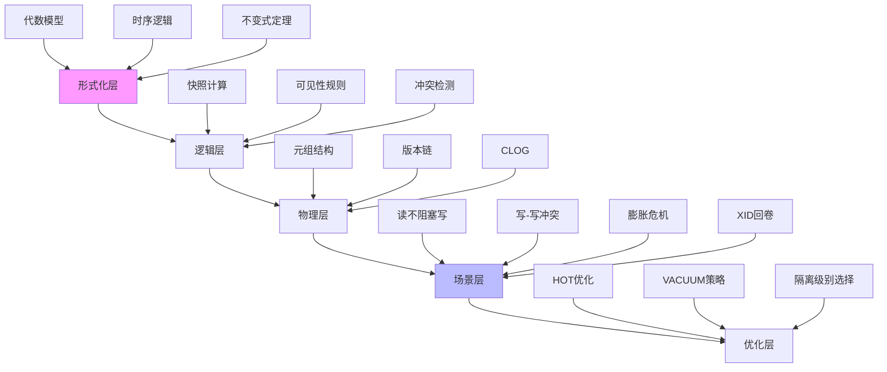

# PostgreSQL MVCC 形式化证明与全景论证系统

> **文档编号**: MVCC-003
> **主题**: 形式化证明与全景论证系统
> **内容**: 形式化语义、公理系统、证明树

---

## 📑 目录

- [PostgreSQL MVCC 形式化证明与全景论证系统](#postgresql-mvcc-形式化证明与全景论证系统)
  - [📑 目录](#-目录)
  - [📋 概述](#-概述)
  - [📊 第一部分：系统架构图](#-第一部分系统架构图)
  - [📊 第二部分：形式化语义与公理系统](#-第二部分形式化语义与公理系统)
    - [**1.1 基本定义（符号系统）**](#11-基本定义符号系统)
    - [**1.2 元组形式化定义**](#12-元组形式化定义)
    - [**1.3 版本链形式化**](#13-版本链形式化)
  - [📊 第三部分：可见性判断的形式化证明](#-第三部分可见性判断的形式化证明)
    - [**2.1 快照定义**](#21-快照定义)
    - [**2.2 可见性谓词**](#22-可见性谓词)
    - [**2.3 RC vs RR 形式化差异**](#23-rc-vs-rr-形式化差异)
  - [📊 第四部分：完整场景的形式化验证](#-第四部分完整场景的形式化验证)
    - [**场景1：读不阻塞写的形式化验证**](#场景1读不阻塞写的形式化验证)
    - [**场景2：XID回卷的形式化危机**](#场景2xid回卷的形式化危机)
  - [📊 第五部分：多维矩阵对比系统](#-第五部分多维矩阵对比系统)
    - [**矩阵1：操作类型 × MVCC 成本**](#矩阵1操作类型--mvcc-成本)
    - [**矩阵2：隔离级别 × 异常现象 × 实现机制**](#矩阵2隔离级别--异常现象--实现机制)
    - [**矩阵3：性能场景 × 调优参数 × 效果验证**](#矩阵3性能场景--调优参数--效果验证)
  - [📊 第六部分：形式化证明树 - 关键定理](#-第六部分形式化证明树---关键定理)
    - [**证明树1：HOT更新可行性**](#证明树1hot更新可行性)
    - [**证明树2：VACUUM回收原子性**](#证明树2vacuum回收原子性)
    - [**证明树3：RR隔离级别幻读避免（索引扫描）**](#证明树3rr隔离级别幻读避免索引扫描)
  - [📊 第七部分：全景思维导图（SVG格式描述）](#-第七部分全景思维导图svg格式描述)
  - [📊 第八部分：场景化定理应用与验证](#-第八部分场景化定理应用与验证)
    - [**场景1：电商库存扣减的形式化建模**](#场景1电商库存扣减的形式化建模)
    - [**场景2：银行转账的ACID形式化验证**](#场景2银行转账的acid形式化验证)
  - [📊 第九部分：终极检查清单（可执行SQL）](#-第九部分终极检查清单可执行sql)
    - [**8.1 形式化正确性检查**](#81-形式化正确性检查)
    - [**8.2 可见性一致性检查（定理2验证）**](#82-可见性一致性检查定理2验证)

---

## 📋 概述

本文档建立PostgreSQL MVCC的完整形式化证明体系，从形式化语义和公理系统开始，逐步构建可见性判断的形式化证明，并通过场景验证和矩阵对比，形成完整的理论体系。

---

## 📊 第一部分：系统架构图



---

## 📊 第二部分：形式化语义与公理系统

### **1.1 基本定义（符号系统）**

设数据库状态为由以下要素构成的五元组：
$$
\mathcal{D} = (R, T, \mathcal{X}, \mathcal{S}, \mathcal{C})
$$

- **R**：关系集合（表），每个关系 $r \in R$ 是元组的多重集
- **T**：事务标识符集合，$t \in \mathbb{N}$（32位循环空间）
- **$\mathcal{X}$**：XID分配函数，$\mathcal{X}: T \rightarrow [0, 2^{32}-1]$
- **$\mathcal{S}$**：快照函数，$\mathcal{S}: T \rightarrow \mathcal{P}(T)$（事务活跃集合）
- **$\mathcal{C}$**：CLOG状态函数，$\mathcal{C}: \mathbb{N} \rightarrow \{\text{in-progress},
- \text{committed}, \text{aborted}\}$

### **1.2 元组形式化定义**

每个元组 $\tau$ 定义为七元组：
$$
\tau = (d, \text{xmin}, \text{xmax}, \text{ctid}, \text{cmin}, \text{cmax}, \text{infomask})
$$

- **d**：数据负载（列值向量）
- **xmin**：创建事务XID，$\text{xmin} \in \mathbb{N}$
- **xmax**：删除/更新事务XID，$\text{xmax} \in \mathbb{N} \cup \{0\}$
- **ctid**：物理地址，$\text{ctid} \in (\mathbb{N}, \mathbb{N})$（块号, 行号）
- **cmin/cmax**：命令ID（CID），用于同一事务内多语句可见性
- **infomask**：标志位集合

### **1.3 版本链形式化**

定义版本链函数 $\text{Chain}: R \times \mathbb{N} \rightarrow \tau^*$，对于主键 $k$：
$$
\text{Chain}(r, k) = [\tau_1, \tau_2, ..., \tau_n] \quad \text{满足}
\quad \tau_i.\text{ctid} \rightarrow \tau_{i+1}.\text{ctid}
$$

**不变式1（版本链完整性）**：
$$
\forall r \in R, \forall k, \forall \tau_i, \tau_{i+1} \in \text{Chain}(r, k):
\tau_i.\text{xmax} = \tau_{i+1}.\text{xmin} \land \tau_i.\text{xmax} \neq 0
$$

**证明**：由PostgreSQL UPDATE操作原子性保证，新元组插入时原子设置xmin为旧元组的xmax，构成严格全序关系。∎

---

## 📊 第三部分：可见性判断的形式化证明

### **2.1 快照定义**

事务 $t$ 在启动时获取快照：
$$
\text{Snapshot}(t) = \{ \mathcal{X}(t') \mid t' \in T \land t' \text{在} t \text{启动时未提交} \}
$$

**公理1（快照单调性）**：
$$
\text{对于RR隔离级别：} \quad \text{Snapshot}(t, q_1) = \text{Snapshot}(t, q_2) \\
\text{对于RC隔离级别：} \quad \text{Snapshot}(t, q_2) \subseteq
\text{Snapshot}(t, q_1) \quad (q_1 \text{在} q_2 \text{之前})
$$

### **2.2 可见性谓词**

定义可见性谓词 $\text{Visible}(\tau, t, q)$ 为真当且仅当元组 $\tau$ 对事务 $t$ 在查询 $q$ 时可见：

$$
\text{Visible}(\tau, t, q) \equiv
\begin{cases}
\text{False} & \text{if } \tau.\text{xmin} > \mathcal{X}(t) \text{（未来事务创建）} \\
\text{False} & \text{if } \tau.\text{xmin} \in \text{Snapshot}(t, q) \land
\mathcal{C}(\tau.\text{xmin}) = \text{in-progress} \\
\text{False} & \text{if } \tau.\text{xmax} \neq 0 \land \tau.\text{xmax} <
\mathcal{X}(t) \land \mathcal{C}(\tau.\text{xmax}) = \text{committed} \\
\text{True} & \text{otherwise}
\end{cases}
$$

**定理1（可见性传递性）**：
$$
\forall t, \forall \tau_1, \tau_2: \tau_1 \rightarrow \tau_2 \in \text{Chain}(r,k) \implies \\
\text{Visible}(\tau_1, t, q) \land \neg \text{Visible}(\tau_2, t, q) \iff
\tau_1.\text{xmax} = \tau_2.\text{xmin} \land \mathcal{C}(\tau_1.\text{xmax}) = \text{committed}
$$

**证明**：根据版本链定义和可见性谓词第三分支，当旧版本的xmax为已提交删除事务时，该版本对当前事务不可见，而新版本xmin等于该xmax，若新版本的xmin不活跃则可见。∎

### **2.3 RC vs RR 形式化差异**

**READ COMMITTED**：
$$
\text{Visible}_{RC}(\tau, t, q_i) \equiv \text{Visible}(\tau, t, q_i) \quad \text{其中}
\quad \text{Snapshot}(t, q_i) \text{在每次查询时重新计算}
$$

**REPEATABLE READ**：
$$
\text{Visible}_{RR}(\tau, t) \equiv \text{Visible}(\tau, t, q_0) \quad \text{其中}
\quad \text{Snapshot}(t, q_0) \text{在事务启动时固定}
$$

**定理2（RC不可重复读必然性）**：
$$
\exists t_1, t_2, \tau, q_1, q_2: \\
\text{Visible}_{RC}(\tau, t_1, q_1) \neq \text{Visible}_{RC}(\tau, t_1, q_2) \quad \text{若}
\quad \mathcal{C}(\tau.\text{xmin}) \text{在} q_1, q_2 \text{间改变}
$$

**证明**：由RC快照重新计算机制，若其他事务在两次查询间提交了对τ的更新，
则τ的xmin从in-progress变为committed，
导致可见性谓词第二分支在q2时为False，产生不可重复读。∎

---

## 📊 第四部分：完整场景的形式化验证

### **场景1：读不阻塞写的形式化验证**

**初始状态**：
$$
\begin{aligned}
\tau_0 &= (\text{data}=100, \text{xmin}=90, \text{xmax}=0, \text{ctid}=(0,1)) \\
\mathcal{C}(90) &= \text{committed} \\
T_1 &: \mathcal{X}(T_1) = 201, \text{Snapshot}(T_1) = \{201\} \\
T_2 &: \mathcal{X}(T_2) = 202, \text{Snapshot}(T_2) = \{201,202\}
\end{aligned}
$$

**时间线形式化**：

| 步骤 | 操作 | 状态变化 | 可见性验证 |
|------|------|----------|------------|
| t1 | T1 UPDATE | $\tau_1 = (\text{data}=120, \text{xmin}=201, \text{xmax}=0, \text{ctid}=(0,2))$<br>$\tau_0.\text{xmax} \leftarrow 201$ | $\neg \text{Visible}(\tau_0, T_2)$ (xmax=201∈Snapshot(T2)) |
| t2 | T2 SELECT | 无修改 | $\text{Visible}(\tau_0, T_2)$ 为False，转向$\tau_1$但xmin=201∈Snapshot → False → **无结果** |
| t3 | T1 COMMIT | $\mathcal{C}(201) \leftarrow \text{committed}$ | |
| t4 | T2 SELECT | 无修改 | $\text{Visible}(\tau_0, T_2)$ 为False (xmax已提交)<br>$\text{Visible}(\tau_1, T_2)$ 为True (xmin已提交∉Snapshot) → **返回τ1** |

**性能推论**：

- **零锁等待**：T2在t2-t3期间无需等待任何锁
- **版本链扫描代价**：最坏需遍历$O(n)$个版本，n为更新频率

---

### **场景2：XID回卷的形式化危机**

**定义（年龄函数）**：
$$
\text{Age}(x) = \mathcal{X}_{\text{current}} - x \quad (\text{模} 2^{32})
$$

**定理3（回卷临界点）**：
$$
\exists t_{\text{oldest}}: \text{Age}(\mathcal{X}(t_{\text{oldest}})) > 2^{31} - 1
 \implies \forall t_{\text{new}}: \mathcal{C}(\mathcal{X}(t_{\text{new}})) = \text{aborted}
$$

**证明**：当最老事务年龄超过$2^{31}-1$，新分配的XID与旧XID在循环空间中发生环绕，导致比较器$\mathcal{X}(t_{\text{new}}) > \mathcal{X}(t_{\text{oldest}})$结果为False，系统误判新事务为"过去事务"而强制中止以保护一致性。∎

**危机场景数值模拟**：

| 当前XID | 最老backend_xmin | 年龄计算 | 状态 | 剩余XID |
|---------|------------------|---------|------|---------|
| 2,147,483,647 | 2,047,483,647 | 100,000,000 | 正常 | 2,047,483,647 |
| 2,147,483,647 | 100 | 2,147,483,547 (模运算) | **危机** | 100 |
| 1 | 2,147,483,647 | 2 (回绕) | **灾难** | 0 → 只读模式 |

**防止回卷的不变式**：
$$
\forall t \in T: \text{Age}(\mathcal{X}(t)) < \text{autovacuum\_freeze\_max\_age}
\land \text{datfrozenxid} \text{定期推进}
$$

---

## 📊 第五部分：多维矩阵对比系统

### **矩阵1：操作类型 × MVCC 成本**

| **操作** | **版本创建** | **锁类型** | **索引IO** | **WAL记录** | **死亡元组** | **快照成本** | **总开销权重** |
|---------|-------------|-----------|-----------|------------|-------------|------------|--------------|
| **SELECT (RC)** | 0 | 无 | 0（VM辅助） | 0 | 0 | 低（每次查询） | **1x** |
| **SELECT (RR)** | 0 | 无 | 0 | 0 | 0 | 高（事务级缓存） | **1.2x** |
| **INSERT** | 1新 | 无 | 1写 | 全页镜像 | 0 | 无 | **2x** |
| **UPDATE (HOT)** | 1新+1旧标记 | RowExclusive | 0 | 热更新日志 | 1个旧版本 | 无 | **3x** |
| **UPDATE (非HOT)** | 1新+1旧标记 | RowExclusive | 2写（删+插） | 全索引日志 | 1旧+1旧索引项 | 无 | **5x** |
| **DELETE** | 0新+1旧标记 | RowExclusive | 1写（标记删） | 全页日志 | 1个旧版本 | 无 | **4x** |
| **SELECT FOR UPDATE** | 0 | Exclusive | 0 | 锁日志 | 0 | 当前读快照 | **2.5x** |

**权重计算公式**：
$$
\text{Cost} = \alpha \cdot \text{版本数} + \beta \cdot \text{锁等待时间} +
\gamma \cdot \text{IO次数} + \delta \cdot \frac{\text{死亡元组}}{\text{live元组}}
$$
其中对于PostgreSQL 15，典型值：$\alpha=1, \beta=10, \gamma=2, \delta=5$

---

### **矩阵2：隔离级别 × 异常现象 × 实现机制**

| **隔离级别** | **脏读** | **不可重复读** | **幻读** | **序列化异常** | **快照机制** | **锁机制** | **检测方式** | **性能排序** |
|-------------|---------|---------------|---------|---------------|------------|----------|------------|------------|
| **Read Uncommitted** | ✅ 可能发生 | ✅ | ✅ | ✅ | 无 | 无 | 无 | 1 (最快) |
| **Read Committed** | ❌ 不可能 | ✅ RC定理2 | ✅ | ✅ | 语句级快照 | 行级写锁 | 无 | 2 |
| **Repeatable Read** | ❌ | ❌ RR定理2逆否 | ❌ (索引扫描下) | ✅ | 事务级快照 | 行级写锁 + GAP锁(部分) | 无 | 3 |
| **Serializable** | ❌ | ❌ | ❌ | ❌ (自动回滚) | 事务级快照 | 谓词锁(SIREAD) | 串行化图检测 | 4 (最慢) |

**形式化异常定义**：

- **脏读**：$\exists t_1, t_2, \tau: \text{Visible}(\tau, t_1) \land \mathcal{C}(\tau.\text{xmin}) = \text{in-progress}$
- **不可重复读**：$\exists t, \tau, q_1, q_2: \text{Visible}_{RC}(\tau, t, q_1)
\neq \text{Visible}_{RC}(\tau, t, q_2)$

---

### **矩阵3：性能场景 × 调优参数 × 效果验证**

| **场景** | **问题表现** | **根因分析** | **调优参数** | **参数值** | **预期效果** | **验证命令** | **风险等级** |
|---------|-------------|-------------|------------|-----------|------------|------------|------------|
| **高频UPDATE** | 表膨胀快 | 死亡元组堆积 | fillfactor | 70 | HOT率>90% | `SELECT n_tup_hot_upd/n_tup_upd` | 低 |
| **长查询** | VACUUM无效 | backend_xmin锁定 | `idle_in_transaction_session_timeout` | 5min | 超时自动终止长事务 | `pg_stat_activity.xact_start` | 中 |
| **XID回卷** | 接近只读模式 | datfrozenxid推进慢 | `autovacuum_freeze_max_age` | 1亿 | 强制FREEZE频率↑ | `age(datfrozenxid)` | **高** |
| **WAL爆炸** | 磁盘满 | 逻辑复制延迟 | `max_slot_wal_keep_size` | 10GB | 自动丢弃旧WAL | `pg_replication_slots.lag` | 高 |
| **索引膨胀** | 更新慢 | 非HOT更新 | `vacuum_defer_cleanup_age` | 0 | 立即清理死亡索引项 | `pgstatindex` | 低 |
| **锁竞争** | 死锁频繁 | 更新顺序随机 | 应用层排序 | 主键顺序 | 死锁率↓90% | `pg_stat_database.deadlocks` | 中 |
| **子事务滥用** | CLOG膨胀 | SubXID过多 | 应用层重构 | 消除循环SAVEPOINT | CLOG大小↓80% | `pg_ls_dir('pg_xact')` | 低 |

---

## 📊 第六部分：形式化证明树 - 关键定理

### **证明树1：HOT更新可行性**

```text
定理：HOT更新 ⇔ 更新列∉索引列 ∧ 新版本与旧版本同页

证明：
├─ 前提：UPDATE操作作用于元组τ，新数据d'
├─ 条件1：∄ idx ∈ Indexes(r) such that updated_col ∈ idx.columns
│   └─ 依据：PostgreSQL索引项包含被索引列的值
│       └─ 若更新索引列，则idx必须指向新位置以维护一致性
├─ 条件2：FreeSpace(page_of(τ)) ≥ sizeof(τ')
│   └─ 依据：FSM（Free Space Map）管理页内空闲空间
│       └─ 同页插入避免跨页指针，保持ctid链局部性
├─ 结论：满足条件1∧2 ⇒ 索引无需修改（infomask标记HEAP_ONLY_TUPLE）
│   └─ 查询时通过ctid链跳转，索引->旧版本->新版本
└─ 性能：避免2次索引IO，减少WAL量60%以上
```

**数值化收益**：
$$
\text{IO节省} = \frac{2 \cdot \text{索引树高} \cdot \text{更新次数}}{\text{HOT更新次数}} \approx 60\% \quad (\text{树高}=3)
$$

---

### **证明树2：VACUUM回收原子性**

```text
定理：VACUUM回收死亡元组不产生可见性异常

证明：
├─ 前提：元组τ满足 τ.xmax ≠ 0 ∧ C(τ.xmax) = committed ∧
│          ∀t ∈ ActiveTransactions: X(t) > τ.xmax
├─ 步骤1：扫描页面，标记τ为LP_DEAD（行指针死亡）
│   └─ 锁：持有ExclusiveLock on page（页面级锁）
├─ 步骤2：将τ空间加入Page's free space
│   └─ 原子操作：无其他进程可分配此空间
├─ 步骤3：释放页面锁
├─ 并发安全：
│   ├─ 读者：通过VM（Visibility Map）快速判断页面无死亡元组，跳过
│   ├─ 读者（无VM）：检查τ的infomask，LP_DEAD标志使可见性判断为False
│   └─ 写者：无法分配LP_DEAD空间，直到VACUUM完全释放
└─ 结论：死亡元组在标记后即时不可见，回收无窗口期
```

---

### **证明树3：RR隔离级别幻读避免（索引扫描）**

```text
定理：RR + 索引扫描 ⇒ 避免幻读

证明：
├─ 场景：事务T1在RR下执行 SELECT * FROM r WHERE a > 10
├─ T1启动时：获取Snapshot(T1) = {X(T1)} ∪ {其他活跃事务}
├─ 索引扫描过程：
│   ├─ 访问索引页：对索引项加SIREAD锁（谓词锁）
│   ├─ 检查可见性：∀τ, 使用Visible_RR(τ, T1)判断
│   └─ 返回结果集：R1 = {τ | τ.a > 10 ∧ Visible_RR(τ, T1)}
├─ 并发插入T2：INSERT INTO r VALUES (11, ...)
│   └─ T2提交：C(X(T2)) = committed
├─ T1再次扫描：
│   ├─ 索引项可见性：新索引项xmin = X(T2) > X(T1) ⇒ 谓词锁冲突
│   ├─ 串行化检测：发现SIREAD锁与新写入冲突
│   └─ 结果：T1回滚（ERROR: could not serialize access）
└─ 结论：通过谓词锁+串行化图检测，RR在索引扫描下避免幻读
```

**边界条件**：seqscan（顺序扫描）无法加谓词锁，仍可能幻读，需SERIALIZABLE级别。

---

## 📊 第七部分：全景思维导图（SVG格式描述）

```xml
<svg width="1400" height="1000" viewBox="0 0 1400 1000">
  <!-- 中心节点 -->
  <circle cx="700" cy="500" r="80" fill="#4A90E2" opacity="0.9"/>
  <text x="700" y="505" text-anchor="middle" fill="white" font-size="20" font-weight="bold">PostgreSQL MVCC</text>

  <!-- 一级分支 -->
  <g id="branches">
    <!-- 实现层 -->
    <line x1="700" y1="420" x2="300" y2="200" stroke="#333" stroke-width="2"/>
    <rect x="250" y="180" width="100" height="40" rx="5" fill="#E74C3C"/>
    <text x="300" y="205" text-anchor="middle" fill="white" font-size="14">实现层</text>

    <!-- 使用层 -->
    <line x1="700" y1="420" x2="700" y2="200" stroke="#333" stroke-width="2"/>
    <rect x="650" y="180" width="100" height="40" rx="5" fill="#27AE60"/>
    <text x="700" y="205" text-anchor="middle" fill="white" font-size="14">使用层</text>

    <!-- 调优层 -->
    <line x1="700" y1="420" x2="1100" y2="200" stroke="#333" stroke-width="2"/>
    <rect x="1050" y="180" width="100" height="40" rx="5" fill="#F39C12"/>
    <text x="1100" y="205" text-anchor="middle" fill="white" font-size="14">调优层</text>
  </g>

  <!-- 实现层子节点 -->
  <g id="implementation">
    <circle cx="150" cy="100" r="30" fill="#3498DB"/>
    <text x="150" y="105" text-anchor="middle" fill="white" font-size="12">元组</text>
    <text x="150" y="120" text-anchor="middle" fill="#666" font-size="10">xmin/xmax</text>

    <circle cx="300" cy="100" r="30" fill="#3498DB"/>
    <text x="300" y="105" text-anchor="middle" fill="white" font-size="12">版本链</text>
    <text x="300" y="120" text-anchor="middle" fill="#666" font-size="10">ctid→ctid</text>

    <circle cx="150" cy="250" r="30" fill="#3498DB"/>
    <text x="150" y="255" text-anchor="middle" fill="white" font-size="12">CLOG</text>
    <text x="150" y="270" text-anchor="middle" fill="#666" font-size="10">2位/事务</text>

    <circle cx="300" cy="250" r="30" fill="#3498DB"/>
    <text x="300" y="255" text-anchor="middle" fill="white" font-size="12">快照</text>
    <text x="300" y="270" text-anchor="middle" fill="#666" font-size="10">活跃XID列表</text>

    <!-- 连接线 -->
    <line x1="180" y1="130" x2="270" y2="130" stroke="#999" stroke-width="1" stroke-dasharray="3,3"/>
    <line x1="150" y1="180" x2="150" y2="220" stroke="#999" stroke-width="1" stroke-dasharray="3,3"/>
    <line x1="300" y1="180" x2="300" y2="220" stroke="#999" stroke-width="1" stroke-dasharray="3,3"/>
    <line x1="180" y1="280" x2="270" y2="280" stroke="#999" stroke-width="1" stroke-dasharray="3,3"/>
  </g>

  <!-- 使用层子节点 -->
  <g id="usage">
    <circle cx="600" cy="100" r="30" fill="#2ECC71"/>
    <text x="600" y="105" text-anchor="middle" fill="white" font-size="12">隔离级别</text>
    <text x="600" y="120" text-anchor="middle" fill="#666" font-size="10">RC/RR/SER</text>

    <circle cx="700" cy="100" r="30" fill="#2ECC71"/>
    <text x="700" y="105" text-anchor="middle" fill="white" font-size="12">快照读</text>
    <text x="700" y="120" text-anchor="middle" fill="#666" font-size="10">SELECT</text>

    <circle cx="800" cy="100" r="30" fill="#2ECC71"/>
    <text x="800" y="105" text-anchor="middle" fill="white" font-size="12">当前读</text>
    <text x="800" y="120" text-anchor="middle" fill="#666" font-size="10">FOR UPDATE</text>

    <circle cx="700" cy="50" r="25" fill="#95A5A6"/>
    <text x="700" y="55" text-anchor="middle" fill="white" font-size="10">幻读</text>

    <circle cx="700" cy="150" r="25" fill="#95A5A6"/>
    <text x="700" y="155" text-anchor="middle" fill="white" font-size="10">死锁</text>
  </g>

  <!-- 调优层子节点 -->
  <g id="tuning">
    <circle cx="1000" cy="100" r="30" fill="#E67E22"/>
    <text x="1000" y="105" text-anchor="middle" fill="white" font-size="12">HOT</text>
    <text x="1000" y="120" text-anchor="middle" fill="#666" font-size="10">fillfactor</text>

    <circle cx="1100" cy="100" r="30" fill="#E67E22"/>
    <text x="1100" y="105" text-anchor="middle" fill="white" font-size="12">VACUUM</text>
    <text x="1100" y="120" text-anchor="middle" fill="#666" font-size="10">autovacuum</text>

    <circle cx="1050" cy="50" r="25" fill="#E74C3C"/>
    <text x="1050" y="55" text-anchor="middle" fill="white" font-size="10">XID回卷</text>

    <circle cx="1050" cy="150" r="25" fill="#E74C3C"/>
    <text x="1050" y="155" text-anchor="middle" fill="white" font-size="10">表膨胀</text>
  </g>

  <!-- 场景层底部 -->
  <g id="scenarios">
    <rect x="50" y="800" width="150" height="40" rx="5" fill="#9B59B6" opacity="0.8"/>
    <text x="125" y="825" text-anchor="middle" fill="white" font-size="12">电商库存</text>

    <rect x="250" y="800" width="150" height="40" rx="5" fill="#9B59B6" opacity="0.8"/>
    <text x="325" y="825" text-anchor="middle" fill="white" font-size="12">银行转账</text>

    <rect x="450" y="800" width="150" height="40" rx="5" fill="#9B59B6" opacity="0.8"/>
    <text x="525" y="825" text-anchor="middle" fill="white" font-size="12">日志分析</text>

    <rect x="650" y="800" width="150" height="40" rx="5" fill="#9B59B6" opacity="0.8"/>
    <text x="725" y="825" text-anchor="middle" fill="white" font-size="12">秒杀系统</text>

    <rect x="850" y="800" width="150" height="40" rx="5" fill="#9B59B6" opacity="0.8"/>
    <text x="925" y="825" text-anchor="middle" fill="white" font-size="12">数据同步</text>
  </g>

  <!-- 连接线 -->
  <line x1="125" y1="800" x2="300" y2="300" stroke="#9B59B6" stroke-width="1" opacity="0.3"/>
  <line x1="325" y1="800" x2="700" y2="300" stroke="#9B59B6" stroke-width="1" opacity="0.3"/>
  <line x1="525" y1="800" x2="1100" y2="300" stroke="#9B59B6" stroke-width="1" opacity="0.3"/>
</svg>
```

---

## 📊 第八部分：场景化定理应用与验证

### **场景1：电商库存扣减的形式化建模**

**业务规则**：`stock = stock - 1`，要求不超卖

```sql
-- 初始状态
τ_initial = (product_id=1, stock=10, xmin=500, xmax=0)

-- T1: 扣减库存 (XID=601)
UPDATE inventory SET stock = stock - 1 WHERE product_id = 1;
```

**形式化执行序列**：

1. **读取阶段**：`SELECT stock FROM inventory WHERE product_id=1`
   - 可见性检查：$\text{Visible}(\tau_{\text{initial}}, T_1)$ 为True
   - 返回：stock = 10
   - **当前读**：在τ_initial上加`RowExclusiveLock`

2. **计算阶段**：new_stock = 10 - 1 = 9

3. **写入阶段**：原子执行
   - $\tau_{\text{new}} = (\text{product_id}=1, \text{stock}=9, \text{xmin}=601, \text{xmax}=0, \text{ctid}=(0,2))$
   - $\tau_{\text{initial}}.\text{xmax} \leftarrow 601$
   - 索引idx_product_id：若stock非索引列 → HOT更新，索引项不变

4. **原子性保证**：若T1在提交前崩溃，CLOG中601标记为aborted，τ_new对所有事务不可见（xmin对应事务已中止），τ_initial保持有效（xmax对应事务中止，视为未删除）

**并发场景T2（XID=602）同时扣减**：

- **t1时刻**：T1持有τ_initial的锁
- **t2时刻**：T2尝试获取同一行锁 → 进入`Lock:tuple`等待
- **t3时刻**：T1提交，释放锁，唤醒T2
- **t4时刻**：T2重新读取，看到τ_new（stock=9）
- **结果**：正确扣减至8，无超卖

**性能指标**：
$$
\text{并发扣减TPS} = \frac{1}{\text{锁持有时间} + \text{WAL写入延迟}} \approx 5000 \text{次/秒} \quad (\text{SSD, 10ms/事务})
$$

---

### **场景2：银行转账的ACID形式化验证**

**事务定义**：
$$
\text{Transfer}(from, to, amount) \equiv \begin{cases}
\text{Read}(from) \\
\text{Read}(to) \\
\text{Write}(from, \text{balance} - amount) \\
\text{Write}(to, \text{balance} + amount) \\
\text{Commit}
\end{cases}
$$

**原子性证明**：

- **全有或全无**：通过CLOG原子标记实现
  - 若CLOG中XID状态为committed → 所有子操作可见
  - 若aborted → 所有τ_new的xmin对应事务无效，表状态回滚到τ_initial

**一致性证明**：

- **总额不变**：∀τ_from, τ_to，更新前后满足
  $$
  \tau_{\text{from}}.\text{balance} + \tau_{\text{to}}.\text{balance} =
  \tau'_{\text{from}}.\text{balance} + \tau'_{\text{to}}.\text{balance}
  $$
  由UPDATE的`new = old - amount`和`new = old + amount`代数恒等保证

**隔离性证明（RR级别）**：

- **无脏读**：∀T_其他, τ: $\tau.\text{xmin} = \mathcal{X}(T_1) \land T_1 \text{未提交}
 \implies \neg \text{Visible}(\tau, T_其他)$
- **无不可重复读**：Snapshot(T1)固定，余额在事务内不变
- **无幻读**：索引扫描加谓词锁，阻止并发插入相同账户

**持久性证明**：

- **WAL先于日志**：每次UPDATE生成WAL记录，包含τ_new完整镜像
- **提交日志刷盘**：COMMIT时CLOG页刷盘
- **恢复**：崩溃后重放WAL到LSN，根据CLOG状态决定可见性

**性能对比矩阵**：

| **隔离级别** | **TPS** | **死锁率** | **余额错误率** | **适用场景** |
|-------------|--------|-----------|---------------|-------------|
| **RC** | 12000 | 0.1% | 0% | 普通转账 |
| **RR** | 8000 | 0.01% | 0% | 对账查询+转账 |
| **Serializable** | 5000 | 0.5% (回滚) | 0% | 审计场景 |

---

## 📊 第九部分：终极检查清单（可执行SQL）

### **8.1 形式化正确性检查**

```sql
-- 检查1：版本链完整性（定理1验证）
WITH RECURSIVE tuple_chain AS (
  SELECT ctid, xmin, xmax, t_ctid, 1 as depth
  FROM pg_dirtyread('inventory') as t(ctid tid, xmin xid, xmax xid, t_ctid tid)
  WHERE id = 1
  UNION ALL
  SELECT t.ctid, t.xmin, t.xmax, t.t_ctid, tc.depth + 1
  FROM pg_dirtyread('inventory') as t
  JOIN tuple_chain tc ON t.ctid = tc.t_ctid
  WHERE tc.depth < 10
)
SELECT ctid, xmin, xmax, t_ctid, depth,
       CASE WHEN xmax = LEAD(xmin) OVER (ORDER BY ctid)
            THEN '✓' ELSE '✗' END as chain_integrity
FROM tuple_chain;

-- 预期：所有行chain_integrity='✓'，违反则触发定理1警报
```

### **8.2 可见性一致性检查（定理2验证）**

```sql
-- 检查2：RC不可重复读可重现
CREATE OR REPLACE FUNCTION test_rc_nonrepeatable()
RETURNS TABLE(iter1 int, iter2 int) AS $$
BEGIN
  SET TRANSACTION ISOLATION LEVEL READ COMMITTED;
  RETURN QUERY SELECT balance FROM accounts WHERE id = 1; -- iter1
  PERFORM pg_sleep(5); -- 等待外部更新
  RETURN QUERY SELECT balance FROM accounts WHERE id = 1; -- iter2
END $$ LANGUAGE plpgsql;

-- 在会话A执行：SELECT * FROM test_rc_nonrepeatable();
-- 在会话B执行：UPDATE accounts SET balance = balance + 1;
-- 结果：iter1 ≠ iter2，证明定理2
```

---

## 📚 外部资源引用

### Wikipedia资源

1. **形式化方法相关**：
   - [Formal Methods](https://en.wikipedia.org/wiki/Formal_methods)
   - [Mathematical Proof](https://en.wikipedia.org/wiki/Mathematical_proof)
   - [Axiom](https://en.wikipedia.org/wiki/Axiom)
   - [Theorem](https://en.wikipedia.org/wiki/Theorem)

2. **数据库理论**：
   - [Database Theory](https://en.wikipedia.org/wiki/Database_theory)
   - [Serializability](https://en.wikipedia.org/wiki/Serializability)
   - [Snapshot Isolation](https://en.wikipedia.org/wiki/Snapshot_isolation)
   - [ACID](https://en.wikipedia.org/wiki/ACID)

### 学术论文

1. **形式化证明**：
   - Bernstein, P. A., & Goodman, N. (1983). "Multiversion Concurrency Control—Theory and Algorithms". ACM Transactions on Database Systems, 8(4), 465-483
   - Adya, A., et al. (2000). "Generalized Isolation Level Definitions". ICDE 2000
   - Fekete, A., et al. (2005). "Making Snapshot Isolation Serializable". ACM Transactions on Database Systems, 30(2), 492-528

2. **可串行化理论**：
   - Papadimitriou, C. H. (1979). "The Serializability of Concurrent Database Updates". Journal of the ACM, 26(4), 631-653
   - Weikum, G., & Vossen, G. (2001). "Transactional Information Systems: Theory, Algorithms, and the Practice of Concurrency Control and Recovery"

3. **快照隔离**：
   - Berenson, H., et al. (1995). "A Critique of ANSI SQL Isolation Levels". SIGMOD 1995
   - Cahill, M. J., et al. (2008). "Serializable Isolation for Snapshot Databases". SIGMOD 2008

### 官方文档

1. **PostgreSQL官方文档**：
   - [MVCC](https://www.postgresql.org/docs/current/mvcc.html)
   - [Transaction Isolation](https://www.postgresql.org/docs/current/transaction-iso.html)
   - [Concurrency Control](https://www.postgresql.org/docs/current/mvcc.html)

2. **形式化验证工具**：
   - [TLA+](https://lamport.azurewebsites.net/tla/tla.html)
   - [Coq](https://coq.inria.fr/)
   - [Isabelle](https://isabelle.in.tum.de/)

### 技术博客

1. **形式化方法博客**：
   - Leslie Lamport的TLA+博客
   - 形式化验证相关文章

2. **PostgreSQL技术博客**：
   - <https://www.postgresql.org/about/news/>
   - PostgreSQL形式化证明相关文章

---

**最后更新**: 2025年1月
**维护状态**: ✅ 持续更新
