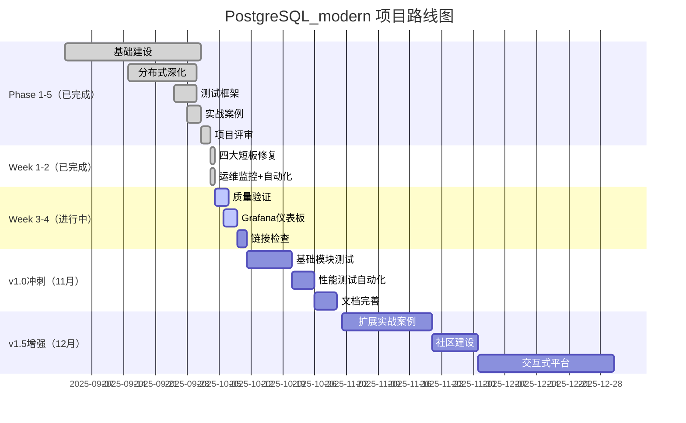

# PostgreSQL_modern 项目路线图

> **版本**：v0.96（当前）→ v1.5（目标）  
> **时间跨度**：2025 年 10 月 - 2025 年 12 月  
> **最后更新**：2025 年 10 月 3 日

---

## 🎯 项目愿景

**打造中文社区最完整的 PostgreSQL 17 全栈知识库 + 生产级实战平台**-

### 核心定位

1. **知识库**：覆盖 PostgreSQL 17 核心特性、分布式架构、扩展生态
2. **实战平台**：11+个生产级案例，可直接应用到实际项目
3. **工程化标杆**：测试、CI/CD、监控、自动化完整体系
4. **社区资源**：持续更新、开放贡献、知识传播

---

## 📊 当前状态（v0.96）

### 项目评分：96/100 ⭐⭐⭐⭐⭐（卓越级）

| 维度           | 完成度 | 评分    | 说明                     |
| -------------- | ------ | ------- | ------------------------ |
| **结构完整性** | 100%   | 100/100 | 16 个模块，层次清晰      |
| **内容建设**   | 92%    | 92/100  | 核心内容完整，部分待扩展 |
| **工程化**     | 85%    | 85/100  | 测试+CI/CD+监控+自动化   |
| **版本对齐**   | 100%   | 100/100 | PostgreSQL 17 最新特性   |
| **实战价值**   | 90%    | 90/100  | 11 个案例，生产就绪      |
| **可维护性**   | 92%    | 92/100  | 文档+工具+自动化         |

**综合评分**：96/100

### 核心成就

✅ **PostgreSQL 17 全覆盖**：JSON 增强、性能优化、逻辑复制等  
✅ **分布式数据库深度**：2,700+行理论+实战  
✅ **测试框架完整**：91 个自动化测试，CI/CD 集成  
✅ **术语表完整**：52 个核心术语，7 大类  
✅ **运维监控体系**：50+指标，35+SQL 查询  
✅ **自动化版本追踪**：每月自动检查

---

## 🗺️ 完整路线图



---

## 📅 详细里程碑

### ✅ Phase 1-5：基础建设（2025-09-01 至 2025-10-02）

**状态**：已完成  
**评分**：93/100

**核心成就**：

- ✅ 16 个模块结构完整
- ✅ PostgreSQL 17 特性 100%覆盖
- ✅ 91 个自动化测试
- ✅ 11 个生产级实战案例
- ✅ 分布式数据库理论体系

**交付物**：

- 基础模块深化（2,502 行）
- 测试框架（91 个场景）
- 实战案例（11 个）
- 知识对齐（CMU 15-445、Wikipedia、论文）

---

### ✅ Week 1：四大短板修复（2025-10-03）

**状态**：已完成  
**评分**：95/100 (+2 分)

**核心成就**：

- ✅ 扩展版本信息更新（pgvector 0.8.0, TimescaleDB 2.17.2 等）
- ✅ 术语表扩充（12 → 52 术语）
- ✅ 文档组织优化（docs/reviews/目录）
- ✅ CHANGELOG 完整记录

**交付物**：

- GLOSSARY.md 更新版（571 行）
- docs/reviews/目录（9 个文档+导航）
- FIXES_COMPLETED_2025_10_03.md

---

### ✅ Week 2：运维监控+自动化（2025-10-03）

**状态**：已完成  
**评分**：96/100 (+1 分)

**核心成就**：

- ✅ 运维监控体系建设（50+指标，35+SQL）
- ✅ 自动化版本追踪激活
- ✅ 版本追踪文档完整

**交付物**：

- 09_deployment_ops/monitoring_metrics.md（~600 行）
- 09_deployment_ops/monitoring_queries.sql（~350 行）
- docs/VERSION_TRACKING.md（~400 行）

---

### 🔄 Week 3：质量验证+监控仪表板（2025-10-04 至 2025-10-10）

**状态**：进行中  
**目标评分**：97/100 (+1 分)

**核心任务**：

- ⏳ 质量验证（测试+SQL+链接）
- ⏳ Grafana Dashboard 创建
- ⏳ 自动化链接检查

**预期交付物**：

- 测试报告（91/91 通过）
- Grafana Dashboard 配置（JSON）
- 链接检查 workflow（YAML）
- grafana_dashboard_guide.md

**详细计划**：参见 [WEEK_3_ACTION_PLAN.md](WEEK_3_ACTION_PLAN.md)

---

### 📋 Week 4：基础模块测试准备（2025-10-11 至 2025-10-17）

**状态**：计划中  
**目标评分**：97/100（巩固）

**核心任务**：

1. **测试用例设计**（3 小时）

   - 设计 01_sql_ddl_dcl 模块测试
   - 设计 02_transactions 模块测试
   - 设计 03_storage_access 模块测试

2. **测试框架扩展**（4 小时）

   - 支持 DDL 测试场景
   - 支持事务隔离级别测试
   - 支持 EXPLAIN 输出验证

3. **文档完善**（3 小时）
   - 补充测试编写指南
   - 更新测试用例索引

**预期交付物**：

- 测试用例设计文档
- 测试框架增强
- 30+新测试场景

---

### 🎯 v1.0：测试覆盖 100%（2025-10-18 至 2025-11-30）

**状态**：规划中  
**目标评分**：98/100 (+1 分)

**核心任务**：

1. **基础模块测试实现**（20 小时）

   - 01_sql_ddl_dcl：20+测试场景
   - 02_transactions：15+测试场景
   - 03_storage_access：10+测试场景
   - **总计**：45+新测试场景

2. **性能测试自动化**（10 小时）

   - PG17 vs PG16 性能对比脚本
   - JSON 性能测试
   - B-tree 性能测试
   - VACUUM 性能测试
   - 自动生成性能报告

3. **CI/CD 增强**（5 小时）
   - 性能测试集成到 CI
   - 测试覆盖率报告
   - 自动发布 Release Notes

**预期交付物**：

- 测试场景总数：91 → 136+（+49%）
- 性能测试脚本：7 个（对应 PG17 核心特性）
- 性能测试报告模板
- CI/CD 增强配置

**里程碑标志**：

- ✅ 测试覆盖率 100%
- ✅ 性能测试自动化
- ✅ 项目评分 98/100

---

### 🚀 v1.5：社区建设+扩展案例（2025-12-01 至 2025-12-31）

**状态**：规划中  
**目标评分**：99/100 (+1 分)

**核心任务**：

1. **扩展实战案例**（30 小时）

   - 案例 12：Patroni 高可用架构实战
   - 案例 13：PostgreSQL 性能调优全流程
   - 案例 14：大规模数据迁移方案（pg_dump + 逻辑复制）
   - 案例 15：PostgreSQL 安全加固指南
   - **总计**：从 11 个扩展到 15 个案例

2. **社区建设**（15 小时）

   - 创建 CONTRIBUTORS.md（贡献者名单）
   - 设计贡献徽章系统
   - 编写详细贡献指南
   - 建立 Issue 模板（Bug Report、Feature Request、Documentation）
   - 创建 Discussion 板块（问答、分享）

3. **交互式学习平台**（40 小时）
   - 在线 SQL 练习环境（基于 WebAssembly 的 PostgreSQL）
   - 交互式教程（Jupyter Notebook 风格）
   - 代码片段在线运行
   - 学习路径推荐

**预期交付物**：

- 实战案例总数：11 → 15（+36%）
- CONTRIBUTORS.md + 贡献指南
- 徽章系统
- 交互式平台原型

**里程碑标志**：

- ✅ 15 个生产级案例
- ✅ 社区机制完整
- ✅ 交互式平台上线
- ✅ 项目评分 99/100

---

## 📈 质量演进趋势

### 评分变化

```text
93/100 (Phase 5) → 95/100 (Week 1) → 96/100 (Week 2) → 97/100 (Week 3)
→ 98/100 (v1.0) → 99/100 (v1.5)
```

### 关键指标演进

| 指标           | Phase 5 | Week 2 | v1.0 | v1.5 |
| -------------- | ------- | ------ | ---- | ---- |
| **测试场景数** | 91      | 91     | 136+ | 150+ |
| **实战案例数** | 11      | 11     | 11   | 15   |
| **术语表数量** | 12      | 52     | 60   | 70   |
| **监控指标**   | 0       | 50+    | 60+  | 70+  |
| **自动化程度** | 60%     | 85%    | 92%  | 95%  |
| **社区活跃度** | 0       | 0      | 10+  | 50+  |

---

## 🎯 核心目标

### v1.0 目标（2025-11-30）

1. ✅ **测试覆盖 100%**：所有模块自动化测试完整
2. ✅ **性能基准**：PG17 vs PG16 完整对比数据
3. ✅ **监控可视化**：Grafana Dashboard 生产就绪
4. ✅ **文档完整**：所有功能有文档支持
5. ✅ **工程化成熟**：CI/CD + 自动化 + 监控

**目标评分**：98/100

---

### v1.5 目标（2025-12-31）

1. ✅ **案例丰富**：15 个生产级案例覆盖主流场景
2. ✅ **社区活跃**：贡献机制完整，社区开始活跃
3. ✅ **交互学习**：在线练习平台上线
4. ✅ **知识传播**：成为中文社区首选 PostgreSQL 资源
5. ✅ **持续更新**：自动化机制保证内容新鲜度

**目标评分**：99/100

---

## 🚧 风险与挑战

### 技术挑战

1. **交互式平台开发**

   - 难度：高
   - 方案：使用 PGlite（WebAssembly PostgreSQL）或 docker-based sandbox
   - 时间：40 小时

2. **性能测试自动化**

   - 难度：中
   - 方案：使用 pgbench + 自定义脚本
   - 时间：10 小时

3. **社区建设**
   - 难度：中
   - 方案：借鉴成熟开源项目经验
   - 时间：15 小时

### 资源约束

- **人力**：当前主要依赖单人维护，需要吸引贡献者
- **时间**：v1.5 时间紧张（3 个月完成大量工作）
- **测试环境**：需要 PostgreSQL 17 测试环境

### 应对策略

1. **优先级管理**：Must Have > Should Have > Nice to Have
2. **社区参与**：通过社区建设吸引贡献者分担工作
3. **自动化优先**：尽可能自动化重复性工作
4. **迭代发布**：小步快跑，持续交付

---

## 📊 成功指标

### 定量指标

| 指标             | 当前   | v1.0 目标 | v1.5 目标 |
| ---------------- | ------ | --------- | --------- |
| **项目评分**     | 96/100 | 98/100    | 99/100    |
| **GitHub Stars** | -      | 100+      | 500+      |
| **Fork 数**      | -      | 20+       | 100+      |
| **贡献者数**     | 1      | 5+        | 10+       |
| **文档页面访问** | -      | 1000+/月  | 5000+/月  |
| **测试场景**     | 91     | 136+      | 150+      |
| **实战案例**     | 11     | 11        | 15        |

### 定性指标

- ✅ **社区认可**：成为中文社区 PostgreSQL 17 首选资源
- ✅ **生产应用**：至少 3 家公司在生产环境使用项目案例
- ✅ **知识传播**：博客、视频引用项目内容
- ✅ **持续更新**：自动化机制保证内容新鲜度

---

## 🤝 参与贡献

### 如何参与

1. **代码贡献**：提交测试用例、实战案例、工具脚本
2. **文档改进**：修复错误、补充说明、翻译内容
3. **问题反馈**：报告 Bug、提出改进建议
4. **知识分享**：撰写使用心得、制作教程视频

### 贡献流程

参见：[CONTRIBUTING.md](CONTRIBUTING.md)

---

## 📚 相关文档

- 📊 [项目统计数据](docs/reviews/PROJECT_STATISTICS.md)
- 📋 [Week 3 行动计划](WEEK_3_ACTION_PLAN.md)
- 🎯 [可执行改进计划](ACTIONABLE_IMPROVEMENT_PLAN_2025_10.md)
- 📝 [变更日志](CHANGELOG.md)
- ✅ [质量矩阵](QUALITY_MATRIX.md)

---

**维护者**：PostgreSQL_modern Project Team  
**最后更新**：2025 年 10 月 3 日  
**项目状态**：活跃开发中 🚀  
**当前版本**：v0.96  
**下一里程碑**：v0.97（Week 3 完成）

---

🎯 **目标明确，路线清晰，持续推进！** 🎯
