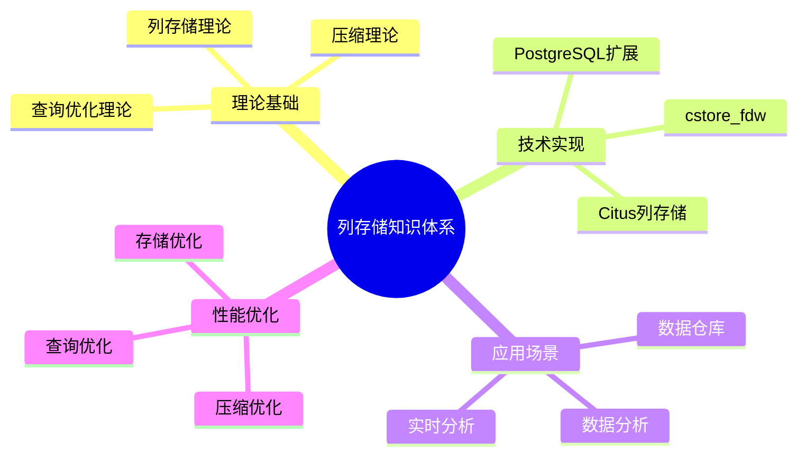
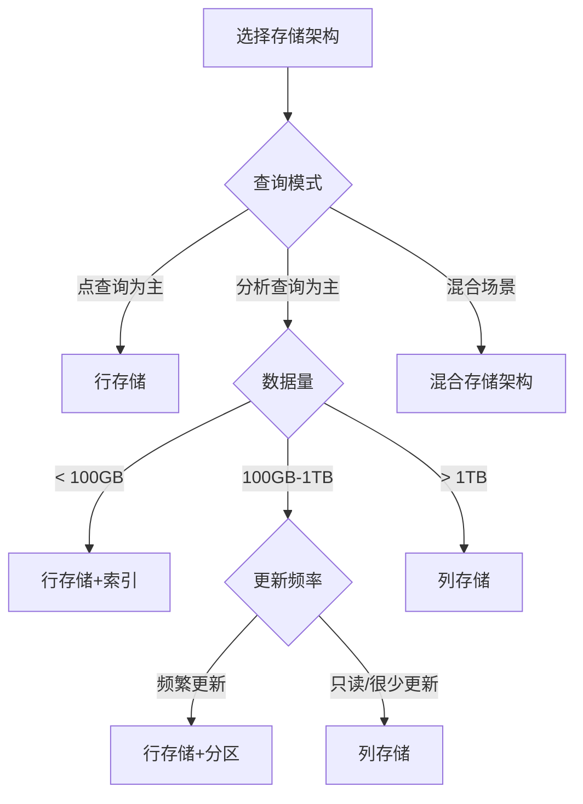
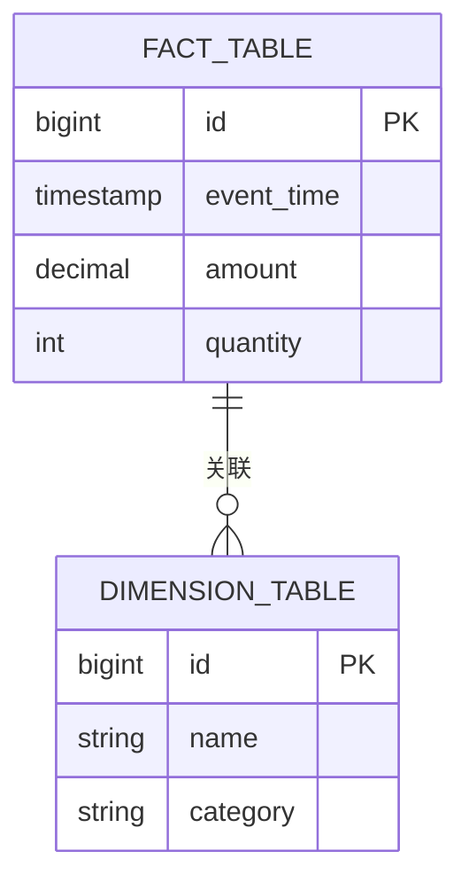
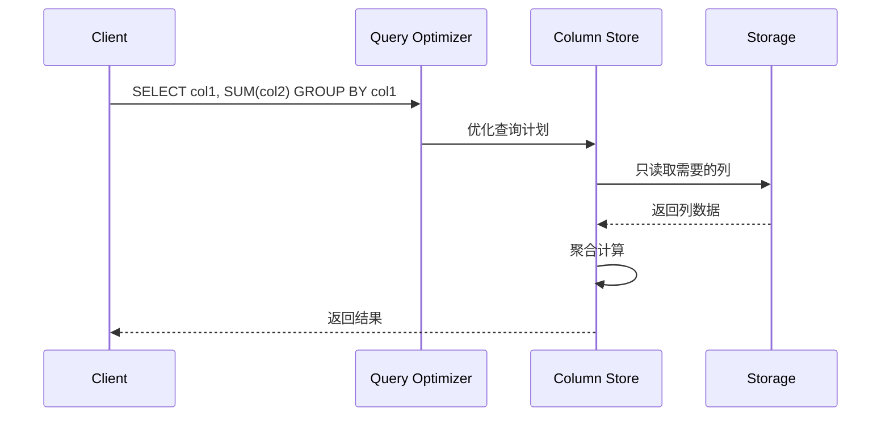

# 列存储内容全面增强计划

> **创建日期**: 2025-01-15
> **完成日期**: 2025-01-15
> **优先级**: 🔴 P0（最高）
> **状态**: ✅ 已完成
> **目标**: 对标最新最成熟的技术堆栈，补充完整的思维表征和技术论证
> **完成报告**: [列存储内容增强完成报告-2025-01-15.md](./列存储内容增强完成报告-2025-01-15.md)

---

## 📋 问题分析

### 当前问题

1. **思维表征不充分**
   - ❌ 缺少思维导图（Mindmap）
   - ❌ 缺少多维对比矩阵
   - ❌ 缺少决策树（Decision Tree）
   - ❌ 缺少流程图（Flowchart）
   - ❌ 缺少时序图（Sequence Diagram）
   - ❌ 缺少架构图（Architecture Diagram）

2. **技术论证不充分**
   - ❌ 缺少ER图（Entity-Relationship Diagram）
   - ❌ 缺少数据流图（Data Flow Diagram）
   - ❌ 缺少交互图（Interaction Diagram）
   - ❌ 缺少存储架构图
   - ❌ 缺少性能对比数据
   - ❌ 缺少实际案例数据

3. **技术栈对标不足**
   - ❌ 缺少与最新技术栈的对比（ClickHouse, DuckDB, Snowflake, BigQuery等）
   - ❌ 缺少实际生产案例
   - ❌ 缺少性能基准测试数据
   - ❌ 缺少最佳实践总结

4. **数据架构论证不足**
   - ❌ 缺少完整的数据架构设计
   - ❌ 缺少数据模型设计图
   - ❌ 缺少存储层次结构图
   - ❌ 缺少查询执行流程图

---

## 🎯 增强目标

### 1. 思维表征完整性

为每个列存储相关文档补充：

- ✅ **思维导图**：展示知识体系结构
- ✅ **对比矩阵**：多维度技术对比
- ✅ **决策树**：技术选型决策流程
- ✅ **流程图**：操作流程和算法流程
- ✅ **时序图**：系统交互时序
- ✅ **架构图**：系统架构设计

### 2. 技术论证完整性

为每个列存储相关文档补充：

- ✅ **ER图**：数据模型设计
- ✅ **数据流图**：数据流转过程
- ✅ **存储架构图**：存储层次结构
- ✅ **查询执行图**：查询优化过程
- ✅ **性能对比图**：性能基准测试
- ✅ **实际案例数据**：生产环境数据

### 3. 技术栈对标

补充与最新技术栈的对比：

- ✅ **列存储数据库对比**：ClickHouse, DuckDB, Snowflake, BigQuery, Redshift
- ✅ **压缩算法对比**：LZ4, Zstd, Snappy, Gzip, Brotli
- ✅ **查询引擎对比**：PostgreSQL, Apache Arrow, Polars, DuckDB
- ✅ **实际案例对比**：不同场景下的性能表现

---

## 📊 任务清单

### Phase 1: 核心文档增强（优先级：P0）

#### 1.1 存储管理与数据持久化文档增强

**文件**: `PostgreSQL/01-核心基础/01.06-存储管理与数据持久化.md`

**任务**:

- [ ] 添加思维导图：列存储知识体系
- [ ] 添加对比矩阵：行存储 vs 列存储 vs 混合存储
- [ ] 添加决策树：存储架构选择决策树
- [ ] 添加ER图：列存储数据模型设计
- [ ] 添加存储架构图：列存储物理架构
- [ ] 添加查询执行流程图：列存储查询优化流程
- [ ] 添加性能对比矩阵：不同压缩算法对比
- [ ] 添加技术栈对比：PostgreSQL vs ClickHouse vs DuckDB
- [ ] 添加实际案例：生产环境性能数据

**预计工作量**: 8小时

#### 1.2 数据建模完整指南增强

**文件**: `PostgreSQL/09-应用设计/数据模型设计/09.02-数据建模完整指南.md`

**任务**:

- [ ] 添加思维导图：存储架构选择知识体系
- [ ] 添加决策树：行存储 vs 列存储选择决策树
- [ ] 添加ER图：列存储数据模型设计示例
- [ ] 添加数据流图：行存储到列存储迁移流程
- [ ] 添加架构图：混合存储架构设计
- [ ] 添加对比矩阵：不同存储架构适用场景
- [ ] 添加实际案例：电商/金融/日志分析场景

**预计工作量**: 6小时

#### 1.3 数据仓库设计指南增强

**文件**: `PostgreSQL/09-应用设计/数据模型设计/09.03-数据仓库设计指南.md`

**任务**:

- [ ] 添加思维导图：数据仓库列存储知识体系
- [ ] 添加决策树：数据仓库存储架构选择
- [ ] 添加ER图：星型模型/雪花模型列存储设计
- [ ] 添加数据流图：ETL到列存储的流程
- [ ] 添加架构图：数据仓库列存储架构
- [ ] 添加对比矩阵：cstore_fdw vs Citus vs Greenplum
- [ ] 添加性能对比：不同列存储方案性能数据
- [ ] 添加实际案例：数据仓库列存储实践

**预计工作量**: 8小时

### Phase 2: 查询优化文档增强（优先级：P0）

#### 2.1 查询优化器原理增强

**文件**: `PostgreSQL/03-查询与优化/02.01-查询优化器原理.md`

**任务**:

- [ ] 添加思维导图：列存储查询优化知识体系
- [ ] 添加决策树：列存储查询优化策略选择
- [ ] 添加查询执行流程图：列存储查询执行流程
- [ ] 添加对比矩阵：行存储 vs 列存储查询性能
- [ ] 添加性能对比图：不同查询类型性能对比
- [ ] 添加实际案例：查询优化前后性能对比

**预计工作量**: 6小时

#### 2.2 执行计划与性能调优增强

**文件**: `PostgreSQL/03-查询与优化/02.04-执行计划与性能调优.md`

**任务**:

- [ ] 添加思维导图：列存储查询优化知识体系
- [ ] 添加决策树：列存储查询优化决策流程
- [ ] 添加执行计划对比图：行存储 vs 列存储执行计划
- [ ] 添加性能对比矩阵：不同优化策略效果对比
- [ ] 添加实际案例：执行计划优化案例

**预计工作量**: 6小时

### Phase 3: 实践案例增强（优先级：P1）

#### 3.1 数据仓库实践案例增强

**文件**: `PostgreSQL/12-全面使用分析/09-实践案例/09.05-数据仓库实践案例.md`

**任务**:

- [ ] 添加思维导图：数据仓库列存储实践知识体系
- [ ] 添加ER图：完整的数据仓库数据模型
- [ ] 添加架构图：数据仓库列存储架构
- [ ] 添加数据流图：ETL到列存储的完整流程
- [ ] 添加时序图：查询执行时序
- [ ] 添加性能对比图：优化前后性能对比
- [ ] 添加实际数据：生产环境性能指标
- [ ] 添加技术栈对比：不同列存储方案对比

**预计工作量**: 8小时

#### 3.2 数据分析完整指南增强

**文件**: `PostgreSQL/09-应用设计/数据模型设计/09.01-数据分析完整指南.md`

**任务**:

- [ ] 添加思维导图：数据分析列存储知识体系
- [ ] 添加决策树：数据分析存储架构选择
- [ ] 添加ER图：分析数据模型设计
- [ ] 添加数据流图：分析数据流转流程
- [ ] 添加对比矩阵：不同分析场景存储选择
- [ ] 添加实际案例：时间序列分析、用户行为分析

**预计工作量**: 6小时

### Phase 4: 技术栈对标（优先级：P1）

#### 4.1 创建列存储技术栈对比文档

**新文件**: `PostgreSQL/09-应用设计/数据模型设计/09.06-列存储技术栈对比.md`

**任务**:

- [ ] 创建技术栈对比矩阵：PostgreSQL vs ClickHouse vs DuckDB vs Snowflake vs BigQuery
- [ ] 添加性能基准测试数据
- [ ] 添加适用场景对比
- [ ] 添加成本对比
- [ ] 添加实际案例对比
- [ ] 添加选型决策树

**预计工作量**: 10小时

#### 4.2 创建列存储最佳实践文档

**新文件**: `PostgreSQL/09-应用设计/数据模型设计/09.07-列存储最佳实践.md`

**任务**:

- [ ] 总结最佳实践原则
- [ ] 添加实际案例
- [ ] 添加性能优化建议
- [ ] 添加常见问题解决方案
- [ ] 添加技术选型指南

**预计工作量**: 8小时

### Phase 5: 理论基础增强（优先级：P2）

#### 5.1 学术研究前沿增强

**文件**: `PostgreSQL/10-理论基础/10.02-学术研究前沿.md`

**任务**:

- [ ] 添加思维导图：列存储理论研究知识体系
- [ ] 添加理论对比矩阵：不同列存储理论对比
- [ ] 添加算法流程图：列存储压缩算法流程
- [ ] 添加性能分析图：理论性能分析
- [ ] 添加实际应用案例：理论在实际中的应用

**预计工作量**: 6小时

---

## 🛠️ 技术栈对标参考

### 列存储数据库对比

| 数据库 | 类型 | 优势 | 劣势 | 适用场景 |
|--------|------|------|------|---------|
| **PostgreSQL + cstore_fdw** | 扩展 | 与PostgreSQL集成、SQL兼容 | 性能不如专用列存储 | 混合负载、已有PostgreSQL |
| **ClickHouse** | 专用列存储 | 高性能、压缩率高 | 不支持事务、更新性能差 | OLAP、实时分析 |
| **DuckDB** | 嵌入式列存储 | 轻量级、高性能 | 单机、不支持分布式 | 数据分析、BI工具 |
| **Snowflake** | 云原生列存储 | 弹性扩展、易用 | 成本高、厂商锁定 | 企业数据仓库 |
| **BigQuery** | 云原生列存储 | 无服务器、易用 | 成本高、厂商锁定 | 企业数据仓库 |
| **Redshift** | 云原生列存储 | AWS集成、性能好 | 成本高、厂商锁定 | AWS生态数据仓库 |

### 压缩算法对比

| 算法 | 压缩率 | 压缩速度 | 解压速度 | CPU占用 | 适用场景 |
|------|--------|---------|---------|---------|---------|
| **LZ4** | 中 | 极快 | 极快 | 低 | 实时压缩、高吞吐 |
| **Zstd** | 高 | 快 | 快 | 中 | 平衡压缩率和速度 |
| **Snappy** | 中 | 快 | 快 | 低 | 快速压缩、低延迟 |
| **Gzip** | 高 | 慢 | 中 | 中 | 高压缩率、离线压缩 |
| **Brotli** | 极高 | 慢 | 中 | 高 | 最高压缩率、存储优化 |

### 查询引擎对比

| 引擎 | 类型 | 优势 | 劣势 | 适用场景 |
|------|------|------|------|---------|
| **PostgreSQL** | 行存储+列存储扩展 | 通用、事务支持 | 列存储性能不如专用引擎 | 混合负载 |
| **Apache Arrow** | 列式内存格式 | 跨语言、高性能 | 需要配合查询引擎 | 数据交换、内存分析 |
| **Polars** | 列式查询引擎 | 高性能、易用 | 相对较新 | 数据分析、ETL |
| **DuckDB** | 嵌入式列存储 | 轻量级、高性能 | 单机 | 数据分析、BI工具 |

---

## 📐 思维表征模板

### 思维导图模板

### 决策树模板

### 对比矩阵模板

| 维度 | 行存储 | 列存储 | 混合存储 |
|------|--------|--------|---------|
| **点查询** | ⭐⭐⭐⭐⭐ | ⭐⭐ | ⭐⭐⭐⭐ |
| **分析查询** | ⭐⭐ | ⭐⭐⭐⭐⭐ | ⭐⭐⭐⭐ |
| **插入性能** | ⭐⭐⭐⭐⭐ | ⭐⭐ | ⭐⭐⭐ |
| **压缩率** | ⭐⭐ | ⭐⭐⭐⭐⭐ | ⭐⭐⭐⭐ |
| **OLTP场景** | ⭐⭐⭐⭐⭐ | ⭐⭐ | ⭐⭐⭐⭐ |
| **OLAP场景** | ⭐⭐ | ⭐⭐⭐⭐⭐ | ⭐⭐⭐⭐ |

### ER图模板

### 时序图模板

---

## 📅 实施计划

### Week 1: Phase 1 核心文档增强

- Day 1-2: 存储管理与数据持久化文档增强
- Day 3-4: 数据建模完整指南增强
- Day 5: 数据仓库设计指南增强

### Week 2: Phase 2 查询优化文档增强

- Day 1-2: 查询优化器原理增强
- Day 3-4: 执行计划与性能调优增强
- Day 5: 测试和验证

### Week 3: Phase 3 实践案例增强

- Day 1-2: 数据仓库实践案例增强
- Day 3-4: 数据分析完整指南增强
- Day 5: 测试和验证

### Week 4: Phase 4 技术栈对标

- Day 1-3: 创建列存储技术栈对比文档
- Day 4-5: 创建列存储最佳实践文档

### Week 5: Phase 5 理论基础增强

- Day 1-3: 学术研究前沿增强
- Day 4-5: 测试、验证和文档整理

---

## ✅ 验收标准

### 思维表征完整性

- [ ] 每个列存储相关文档至少包含1个思维导图
- [ ] 每个列存储相关文档至少包含1个对比矩阵
- [ ] 每个列存储相关文档至少包含1个决策树
- [ ] 技术选型相关文档包含ER图
- [ ] 系统交互相关文档包含时序图

### 技术论证完整性

- [ ] 每个列存储相关文档包含存储架构图
- [ ] 每个列存储相关文档包含性能对比数据
- [ ] 每个列存储相关文档包含实际案例
- [ ] 数据模型相关文档包含ER图
- [ ] 查询优化相关文档包含执行流程图

### 技术栈对标完整性

- [ ] 包含与主流列存储数据库的对比
- [ ] 包含压缩算法对比
- [ ] 包含查询引擎对比
- [ ] 包含实际性能基准测试数据
- [ ] 包含选型决策指南

---

## 📚 参考资源

### 技术栈文档

- [ClickHouse官方文档](https://clickhouse.com/docs)
- [DuckDB官方文档](https://duckdb.org/docs/)
- [Snowflake官方文档](https://docs.snowflake.com/)
- [BigQuery官方文档](https://cloud.google.com/bigquery/docs)
- [Apache Arrow文档](https://arrow.apache.org/docs/)

### 学术论文

- C-Store: A Column-oriented DBMS (VLDB 2005)
- The Design and Implementation of Modern Column-Oriented Database Systems (VLDB 2012)
- MonetDB/X100: Hyper-Pipelining Query Execution (CIDR 2005)

### 最佳实践

- PostgreSQL列存储最佳实践
- 数据仓库列存储设计指南
- 列存储性能优化指南

---

## 📝 更新日志

- **2025-01-15**: 创建任务计划文档
- **待更新**: 实施进度和完成情况
