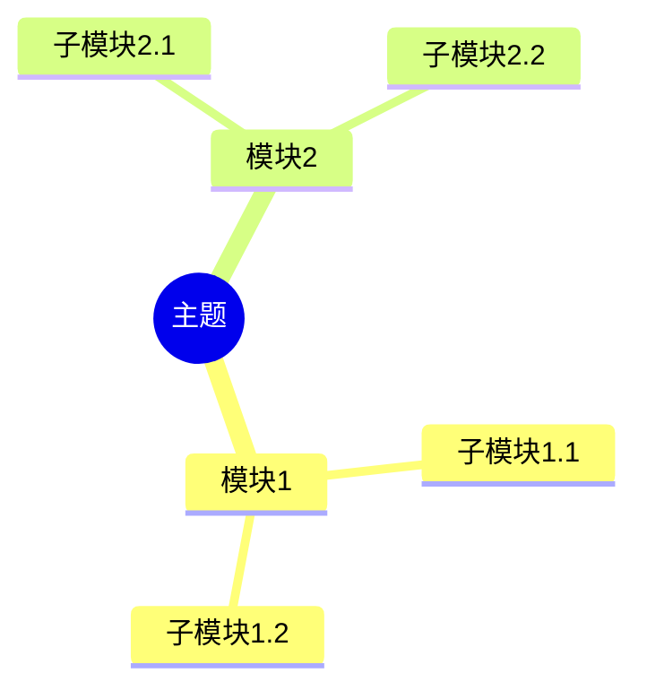
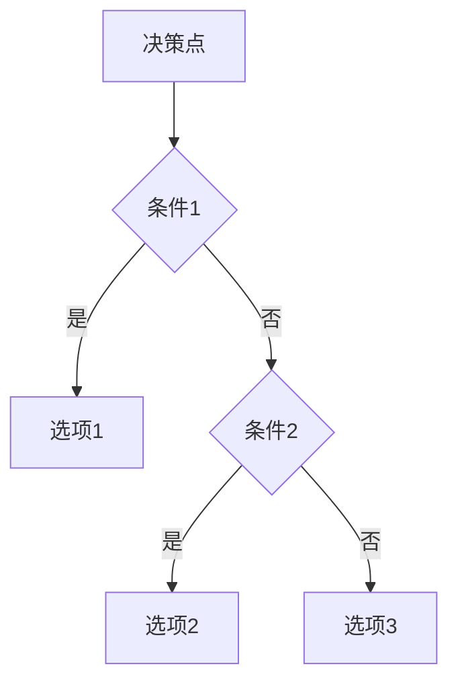
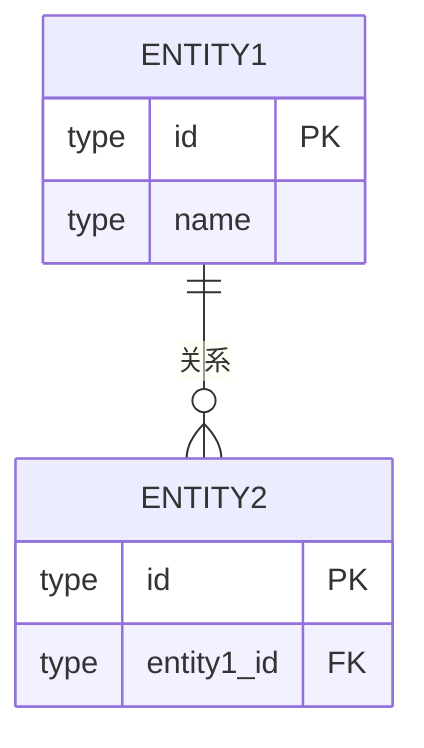
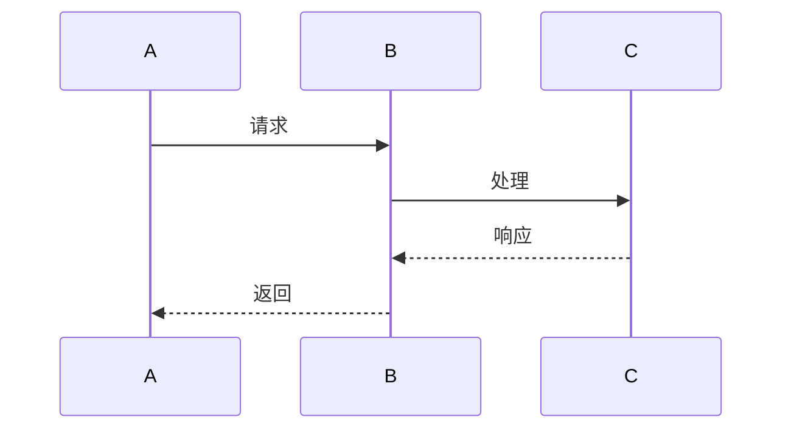
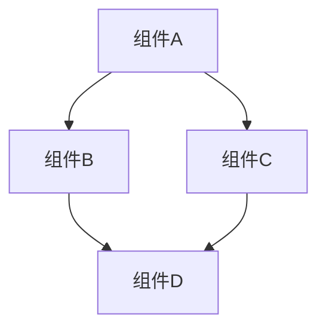

# PostgreSQL文档质量全面提升计划

> **创建日期**: 2025-01-15
> **优先级**: 🔴 P0（最高）
> **状态**: 📋 规划中
> **目标**: 对标最新最成熟的技术堆栈，补充完整的思维表征和技术论证

---

## 📋 核心问题分析

### 1. 思维表征不充分

**问题描述**:

- 缺少思维导图（Mindmap）展示知识体系
- 缺少多维对比矩阵进行技术选型
- 缺少决策树（Decision Tree）指导技术选择
- 缺少流程图（Flowchart）展示操作流程
- 缺少时序图（Sequence Diagram）展示系统交互
- 缺少架构图（Architecture Diagram）展示系统设计

**影响**:

- 读者难以快速理解知识体系
- 技术选型缺乏清晰的决策依据
- 操作流程不够直观
- 系统交互关系不清晰

### 2. 技术论证不充分

**问题描述**:

- 缺少ER图（Entity-Relationship Diagram）展示数据模型
- 缺少数据流图（Data Flow Diagram）展示数据流转
- 缺少交互图（Interaction Diagram）展示系统交互
- 缺少存储架构图展示存储层次
- 缺少性能对比数据支撑论证
- 缺少实际案例数据验证理论

**影响**:

- 数据模型设计不够直观
- 数据流转过程不清晰
- 系统交互关系不明确
- 技术选型缺乏数据支撑

### 3. 技术栈对标不足

**问题描述**:

- 缺少与最新技术栈的对比（ClickHouse, DuckDB, Snowflake, BigQuery等）
- 缺少实际生产案例
- 缺少性能基准测试数据
- 缺少最佳实践总结
- 缺少技术选型指南

**影响**:

- 无法了解PostgreSQL在技术栈中的定位
- 缺乏实际应用参考
- 技术选型缺乏依据

### 4. 数据架构论证不足

**问题描述**:

- 缺少完整的数据架构设计
- 缺少数据模型设计图
- 缺少存储层次结构图
- 缺少查询执行流程图
- 缺少系统架构设计图

**影响**:

- 数据架构设计不够系统化
- 存储层次关系不清晰
- 查询执行过程不直观

---

## 🎯 提升目标

### 目标1: 思维表征完整性（100%）

为每个核心文档补充：

- ✅ 思维导图：展示知识体系结构
- ✅ 对比矩阵：多维度技术对比
- ✅ 决策树：技术选型决策流程
- ✅ 流程图：操作流程和算法流程
- ✅ 时序图：系统交互时序
- ✅ 架构图：系统架构设计

### 目标2: 技术论证完整性（100%）

为每个核心文档补充：

- ✅ ER图：数据模型设计
- ✅ 数据流图：数据流转过程
- ✅ 存储架构图：存储层次结构
- ✅ 查询执行图：查询优化过程
- ✅ 性能对比图：性能基准测试
- ✅ 实际案例数据：生产环境数据

### 目标3: 技术栈对标完整性（100%）

补充与最新技术栈的对比：

- ✅ 列存储数据库对比：ClickHouse, DuckDB, Snowflake, BigQuery, Redshift
- ✅ 压缩算法对比：LZ4, Zstd, Snappy, Gzip, Brotli
- ✅ 查询引擎对比：PostgreSQL, Apache Arrow, Polars, DuckDB
- ✅ 实际案例对比：不同场景下的性能表现

### 目标4: 数据架构论证完整性（100%）

补充完整的数据架构设计：

- ✅ 数据架构设计图
- ✅ 数据模型设计图（ER图）
- ✅ 存储层次结构图
- ✅ 查询执行流程图
- ✅ 系统架构设计图

---

## 📊 任务清单

### Phase 1: 列存储相关文档增强（优先级：P0）

#### 1.1 存储管理与数据持久化文档

**文件**: `PostgreSQL/01-核心基础/01.06-存储管理与数据持久化.md`

**任务清单**:

- [ ] 添加思维导图：列存储知识体系
- [ ] 添加对比矩阵：行存储 vs 列存储 vs 混合存储（多维度）
- [ ] 添加决策树：存储架构选择决策树
- [ ] 添加ER图：列存储数据模型设计
- [ ] 添加存储架构图：列存储物理架构
- [ ] 添加查询执行流程图：列存储查询优化流程
- [ ] 添加时序图：列存储查询执行时序
- [ ] 添加性能对比矩阵：不同压缩算法对比
- [ ] 添加技术栈对比：PostgreSQL vs ClickHouse vs DuckDB vs Snowflake
- [ ] 添加实际案例：生产环境性能数据

**预计工作量**: 10小时

#### 1.2 数据建模完整指南

**文件**: `PostgreSQL/09-应用设计/数据模型设计/09.02-数据建模完整指南.md`

**任务清单**:

- [ ] 添加思维导图：存储架构选择知识体系
- [ ] 添加决策树：行存储 vs 列存储选择决策树
- [ ] 添加ER图：列存储数据模型设计示例（电商/金融/日志）
- [ ] 添加数据流图：行存储到列存储迁移流程
- [ ] 添加架构图：混合存储架构设计
- [ ] 添加对比矩阵：不同存储架构适用场景（多维度）
- [ ] 添加时序图：数据迁移时序
- [ ] 添加实际案例：电商/金融/日志分析场景

**预计工作量**: 8小时

#### 1.3 数据仓库设计指南

**文件**: `PostgreSQL/09-应用设计/数据模型设计/09.03-数据仓库设计指南.md`

**任务清单**:

- [ ] 添加思维导图：数据仓库列存储知识体系
- [ ] 添加决策树：数据仓库存储架构选择
- [ ] 添加ER图：星型模型/雪花模型列存储设计
- [ ] 添加数据流图：ETL到列存储的流程
- [ ] 添加架构图：数据仓库列存储架构
- [ ] 添加时序图：数据加载和查询时序
- [ ] 添加对比矩阵：cstore_fdw vs Citus vs Greenplum（多维度）
- [ ] 添加性能对比：不同列存储方案性能数据
- [ ] 添加技术栈对比：PostgreSQL vs Snowflake vs BigQuery
- [ ] 添加实际案例：数据仓库列存储实践

**预计工作量**: 10小时

### Phase 2: 查询优化文档增强（优先级：P0）

#### 2.1 查询优化器原理

**文件**: `PostgreSQL/03-查询与优化/02.01-查询优化器原理.md`

**任务清单**:

- [ ] 添加思维导图：列存储查询优化知识体系
- [ ] 添加决策树：列存储查询优化策略选择
- [ ] 添加查询执行流程图：列存储查询执行流程
- [ ] 添加时序图：查询优化和执行时序
- [ ] 添加对比矩阵：行存储 vs 列存储查询性能（多维度）
- [ ] 添加性能对比图：不同查询类型性能对比
- [ ] 添加架构图：查询优化器架构（包含列存储）
- [ ] 添加实际案例：查询优化前后性能对比

**预计工作量**: 8小时

#### 2.2 执行计划与性能调优

**文件**: `PostgreSQL/03-查询与优化/02.04-执行计划与性能调优.md`

**任务清单**:

- [ ] 添加思维导图：列存储查询优化知识体系
- [ ] 添加决策树：列存储查询优化决策流程
- [ ] 添加执行计划对比图：行存储 vs 列存储执行计划
- [ ] 添加查询执行流程图：列存储查询执行流程
- [ ] 添加时序图：查询执行时序
- [ ] 添加性能对比矩阵：不同优化策略效果对比（多维度）
- [ ] 添加实际案例：执行计划优化案例

**预计工作量**: 8小时

### Phase 3: 实践案例增强（优先级：P1）

#### 3.1 数据仓库实践案例

**文件**: `PostgreSQL/12-全面使用分析/09-实践案例/09.05-数据仓库实践案例.md`

**任务清单**:

- [ ] 添加思维导图：数据仓库列存储实践知识体系
- [ ] 添加ER图：完整的数据仓库数据模型
- [ ] 添加架构图：数据仓库列存储架构
- [ ] 添加数据流图：ETL到列存储的完整流程
- [ ] 添加时序图：查询执行时序
- [ ] 添加性能对比图：优化前后性能对比
- [ ] 添加对比矩阵：不同列存储方案对比（多维度）
- [ ] 添加实际数据：生产环境性能指标
- [ ] 添加技术栈对比：不同列存储方案对比

**预计工作量**: 10小时

#### 3.2 数据分析完整指南

**文件**: `PostgreSQL/09-应用设计/数据模型设计/09.01-数据分析完整指南.md`

**任务清单**:

- [ ] 添加思维导图：数据分析列存储知识体系
- [ ] 添加决策树：数据分析存储架构选择
- [ ] 添加ER图：分析数据模型设计
- [ ] 添加数据流图：分析数据流转流程
- [ ] 添加架构图：分析系统架构
- [ ] 添加对比矩阵：不同分析场景存储选择（多维度）
- [ ] 添加实际案例：时间序列分析、用户行为分析

**预计工作量**: 8小时

### Phase 4: 技术栈对标（优先级：P1）

#### 4.1 创建列存储技术栈对比文档

**新文件**: `PostgreSQL/09-应用设计/数据模型设计/09.06-列存储技术栈对比.md`

**任务清单**:

- [ ] 创建技术栈对比矩阵：PostgreSQL vs ClickHouse vs DuckDB vs Snowflake vs BigQuery vs Redshift（多维度）
- [ ] 添加性能基准测试数据
- [ ] 添加适用场景对比矩阵
- [ ] 添加成本对比矩阵
- [ ] 添加实际案例对比
- [ ] 添加选型决策树
- [ ] 添加架构对比图
- [ ] 添加性能对比图

**预计工作量**: 12小时

#### 4.2 创建列存储最佳实践文档

**新文件**: `PostgreSQL/09-应用设计/数据模型设计/09.07-列存储最佳实践.md`

**任务清单**:

- [ ] 总结最佳实践原则
- [ ] 添加实际案例（包含图表）
- [ ] 添加性能优化建议（包含对比数据）
- [ ] 添加常见问题解决方案（包含流程图）
- [ ] 添加技术选型指南（包含决策树）
- [ ] 添加架构设计指南（包含架构图）

**预计工作量**: 10小时

### Phase 5: 理论基础增强（优先级：P2）

#### 5.1 学术研究前沿增强

**文件**: `PostgreSQL/数据库理论/10.02-学术研究前沿.md`

**任务清单**:

- [ ] 添加思维导图：列存储理论研究知识体系
- [ ] 添加理论对比矩阵：不同列存储理论对比
- [ ] 添加算法流程图：列存储压缩算法流程
- [ ] 添加性能分析图：理论性能分析
- [ ] 添加实际应用案例：理论在实际中的应用

**预计工作量**: 8小时

---

## 🛠️ 技术栈对标参考

### 列存储数据库对比矩阵

| 维度 | PostgreSQL + cstore_fdw | ClickHouse | DuckDB | Snowflake | BigQuery | Redshift |
|------|------------------------|------------|--------|-----------|----------|----------|
| **类型** | 扩展 | 专用列存储 | 嵌入式 | 云原生 | 云原生 | 云原生 |
| **性能** | ⭐⭐⭐ | ⭐⭐⭐⭐⭐ | ⭐⭐⭐⭐ | ⭐⭐⭐⭐ | ⭐⭐⭐⭐ | ⭐⭐⭐⭐ |
| **压缩率** | ⭐⭐⭐ | ⭐⭐⭐⭐⭐ | ⭐⭐⭐⭐ | ⭐⭐⭐⭐ | ⭐⭐⭐⭐ | ⭐⭐⭐⭐ |
| **事务支持** | ⭐⭐⭐⭐⭐ | ⭐ | ⭐⭐⭐ | ⭐⭐⭐⭐ | ⭐⭐⭐⭐ | ⭐⭐⭐⭐ |
| **SQL兼容** | ⭐⭐⭐⭐⭐ | ⭐⭐⭐ | ⭐⭐⭐⭐ | ⭐⭐⭐⭐⭐ | ⭐⭐⭐⭐⭐ | ⭐⭐⭐⭐⭐ |
| **易用性** | ⭐⭐⭐⭐ | ⭐⭐⭐ | ⭐⭐⭐⭐ | ⭐⭐⭐⭐⭐ | ⭐⭐⭐⭐⭐ | ⭐⭐⭐⭐ |
| **成本** | ⭐⭐⭐⭐⭐ | ⭐⭐⭐⭐ | ⭐⭐⭐⭐⭐ | ⭐⭐ | ⭐⭐ | ⭐⭐ |
| **适用场景** | 混合负载 | OLAP | 数据分析 | 企业数据仓库 | 企业数据仓库 | AWS生态 |

### 压缩算法对比矩阵

| 维度 | LZ4 | Zstd | Snappy | Gzip | Brotli |
|------|-----|------|--------|------|--------|
| **压缩率** | ⭐⭐⭐ | ⭐⭐⭐⭐ | ⭐⭐⭐ | ⭐⭐⭐⭐ | ⭐⭐⭐⭐⭐ |
| **压缩速度** | ⭐⭐⭐⭐⭐ | ⭐⭐⭐⭐ | ⭐⭐⭐⭐ | ⭐⭐ | ⭐⭐ |
| **解压速度** | ⭐⭐⭐⭐⭐ | ⭐⭐⭐⭐ | ⭐⭐⭐⭐ | ⭐⭐⭐ | ⭐⭐⭐ |
| **CPU占用** | ⭐⭐⭐⭐⭐ | ⭐⭐⭐⭐ | ⭐⭐⭐⭐⭐ | ⭐⭐⭐ | ⭐⭐ |
| **适用场景** | 实时压缩 | 平衡场景 | 快速压缩 | 高压缩率 | 最高压缩率 |

### 查询引擎对比矩阵

| 维度 | PostgreSQL | Apache Arrow | Polars | DuckDB |
|------|------------|--------------|--------|--------|
| **类型** | 行存储+列存储扩展 | 列式内存格式 | 列式查询引擎 | 嵌入式列存储 |
| **性能** | ⭐⭐⭐ | ⭐⭐⭐⭐ | ⭐⭐⭐⭐⭐ | ⭐⭐⭐⭐ |
| **易用性** | ⭐⭐⭐⭐⭐ | ⭐⭐⭐ | ⭐⭐⭐⭐ | ⭐⭐⭐⭐ |
| **事务支持** | ⭐⭐⭐⭐⭐ | ❌ | ❌ | ⭐⭐⭐ |
| **适用场景** | 混合负载 | 数据交换 | 数据分析 | 数据分析 |

---

## 📐 思维表征模板库

### 1. 思维导图模板

### 2. 决策树模板

### 3. 对比矩阵模板

| 维度 | 选项1 | 选项2 | 选项3 |
|------|-------|-------|-------|
| **维度1** | ⭐⭐⭐⭐⭐ | ⭐⭐⭐ | ⭐⭐ |
| **维度2** | ⭐⭐⭐ | ⭐⭐⭐⭐⭐ | ⭐⭐⭐ |

### 4. ER图模板

### 5. 时序图模板

### 6. 架构图模板

### 7. 流程图模板

---

## 📅 实施计划

### Week 1: Phase 1 列存储核心文档增强

- **Day 1-2**: 存储管理与数据持久化文档增强
- **Day 3-4**: 数据建模完整指南增强
- **Day 5**: 数据仓库设计指南增强

### Week 2: Phase 2 查询优化文档增强

- **Day 1-2**: 查询优化器原理增强
- **Day 3-4**: 执行计划与性能调优增强
- **Day 5**: 测试和验证

### Week 3: Phase 3 实践案例增强

- **Day 1-2**: 数据仓库实践案例增强
- **Day 3-4**: 数据分析完整指南增强
- **Day 5**: 测试和验证

### Week 4: Phase 4 技术栈对标

- **Day 1-3**: 创建列存储技术栈对比文档
- **Day 4-5**: 创建列存储最佳实践文档

### Week 5: Phase 5 理论基础增强

- **Day 1-3**: 学术研究前沿增强
- **Day 4-5**: 测试、验证和文档整理

**总预计工作量**: 74小时

---

## ✅ 验收标准

### 思维表征完整性（100%）

- [ ] 每个列存储相关文档至少包含1个思维导图
- [ ] 每个列存储相关文档至少包含1个对比矩阵
- [ ] 每个列存储相关文档至少包含1个决策树
- [ ] 技术选型相关文档包含ER图
- [ ] 系统交互相关文档包含时序图
- [ ] 架构设计相关文档包含架构图

### 技术论证完整性（100%）

- [ ] 每个列存储相关文档包含存储架构图
- [ ] 每个列存储相关文档包含性能对比数据
- [ ] 每个列存储相关文档包含实际案例
- [ ] 数据模型相关文档包含ER图
- [ ] 查询优化相关文档包含执行流程图
- [ ] 系统设计相关文档包含架构图

### 技术栈对标完整性（100%）

- [ ] 包含与主流列存储数据库的对比
- [ ] 包含压缩算法对比
- [ ] 包含查询引擎对比
- [ ] 包含实际性能基准测试数据
- [ ] 包含选型决策指南

### 数据架构论证完整性（100%）

- [ ] 包含完整的数据架构设计图
- [ ] 包含数据模型设计图（ER图）
- [ ] 包含存储层次结构图
- [ ] 包含查询执行流程图
- [ ] 包含系统架构设计图

---

## 📚 参考资源

### 技术栈文档

- [ClickHouse官方文档](https://clickhouse.com/docs)
- [DuckDB官方文档](https://duckdb.org/docs/)
- [Snowflake官方文档](https://docs.snowflake.com/)
- [BigQuery官方文档](https://cloud.google.com/bigquery/docs)
- [Apache Arrow文档](https://arrow.apache.org/docs/)
- [Polars文档](https://pola-rs.github.io/polars/)

### 学术论文

- C-Store: A Column-oriented DBMS (VLDB 2005)
- The Design and Implementation of Modern Column-Oriented Database Systems (VLDB 2012)
- MonetDB/X100: Hyper-Pipelining Query Execution (CIDR 2005)

### 最佳实践

- PostgreSQL列存储最佳实践
- 数据仓库列存储设计指南
- 列存储性能优化指南

### 工具资源

- [Mermaid文档](https://mermaid.js.org/) - 图表绘制
- [PlantUML文档](https://plantuml.com/) - UML图表
- [dbdiagram.io](https://dbdiagram.io/) - ER图绘制

---

## 📝 更新日志

- **2025-01-15**: 创建文档质量全面提升计划
- **待更新**: 实施进度和完成情况
