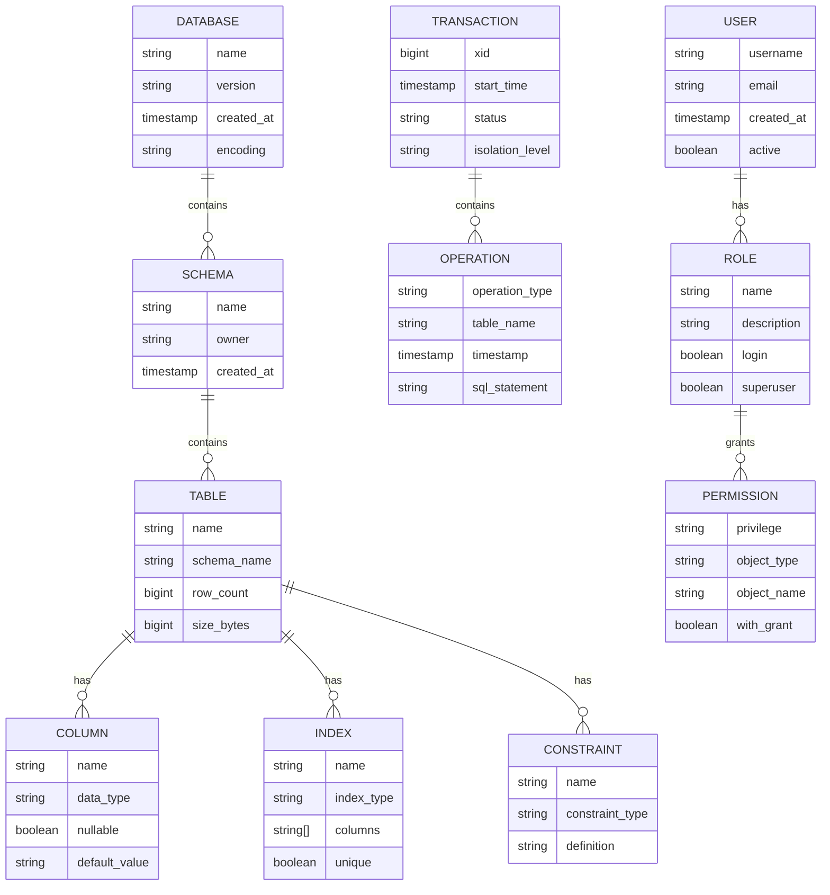

# PostgreSQL国际化Wiki标准与知识规范对齐指南

## 1. 概述

### 1.1 目标与范围

本指南专门针对PostgreSQL数据库系统，建立符合国际Wiki标准的：

- **概念定义体系**：严格的形式化定义和语义规范
- **属性关系模型**：完整的实体关系图和属性映射
- **解释论证框架**：基于形式逻辑的证明体系
- **多语言支持**：中英文双语对照，支持国际化
- **知识图谱集成**：与Wikidata等国际知识库对齐

### 1.2 参考标准

- **数据库标准**：SQL:2023、ACID、CAP定理
- **形式化标准**：关系代数、一阶逻辑、类型理论
- **Wiki标准**：MediaWiki、Wikipedia、Wikidata
- **学术标准**：IEEE、ACM、arXiv数据库论文规范
- **国际化标准**：Unicode、ISO 639、ISO 3166

## 2. 概念定义体系

### 2.1 核心概念定义

#### 2.1.1 数据库系统概念

```yaml
# 概念定义模板
concept:
  name: "PostgreSQL"
  type: "Database Management System"
  formal_definition: |
    PostgreSQL是一个对象关系型数据库管理系统(ORDBMS)，
    支持SQL标准，具有ACID事务特性，提供丰富的扩展性。
  mathematical_definition: |
    设 D = (R, C, T, I) 为PostgreSQL数据库实例，其中：
    - R = {r₁, r₂, ..., rₙ} 为关系集合
    - C = {c₁, c₂, ..., cₘ} 为约束集合
    - T = {t₁, t₂, ..., tₖ} 为事务集合
    - I = {i₁, i₂, ..., iₗ} 为索引集合
  properties:
    - ACID_compliance: true
    - SQL_standard: "SQL:2023"
    - extensibility: "pluggable"
    - concurrency_control: "MVCC"
  synonyms:
    - "Postgres"
    - "PostgreSQL DBMS"
  antonyms:
    - "NoSQL databases"
    - "Key-value stores"
```

#### 2.1.2 事务概念

```yaml
concept:
  name: "ACID Transaction"
  type: "Database Transaction Property"
  formal_definition: |
    ACID是数据库事务的四个基本属性：
    - Atomicity（原子性）
    - Consistency（一致性）
    - Isolation（隔离性）
    - Durability（持久性）
  mathematical_definition: |
    设事务 T = {op₁, op₂, ..., opₙ}，则：

    Atomicity: ∀T, T要么完全执行，要么完全不执行
    Consistency: ∀T, 执行前后数据库状态满足完整性约束
    Isolation: ∀T₁,T₂, T₁的执行对T₂不可见
    Durability: ∀T, 提交后的事务结果永久保存
  properties:
    - atomicity: "all_or_nothing"
    - consistency: "constraint_preservation"
    - isolation: "serializable"
    - durability: "permanent"
```

### 2.2 形式化定义标准

#### 2.2.1 数学符号规范

```latex
% 数学符号定义
\newcommand{\db}{\mathcal{D}}
\newcommand{\rel}{\mathcal{R}}
\newcommand{\attr}{\mathcal{A}}
\newcommand{\tuple}{\mathcal{T}}
\newcommand{\query}{\mathcal{Q}}
\newcommand{\trans}{\mathcal{T}}
\newcommand{\index}{\mathcal{I}}

% 关系代数符号
\newcommand{\select}{\sigma}
\newcommand{\project}{\pi}
\newcommand{\join}{\bowtie}
\newcommand{\union}{\cup}
\newcommand{\intersect}{\cap}
\newcommand{\diff}{\setminus}
```

#### 2.2.2 定义模板

```markdown
## 定义 2.1 (关系模式)

设 A = {a₁, a₂, ..., aₙ} 为属性集合，D = {D₁, D₂, ..., Dₙ} 为域集合，
则关系模式 R(A, D) 定义为：

R(A, D) = {(aᵢ, Dᵢ) | aᵢ ∈ A, Dᵢ ∈ D, i = 1, 2, ..., n}

其中每个属性 aᵢ 对应域 Dᵢ。

**性质：**
- 唯一性：每个属性在模式中唯一
- 完整性：所有属性都有对应的域
- 有序性：属性顺序在关系操作中重要

**示例：**
学生表模式：Student(学号:INT, 姓名:VARCHAR(50), 年龄:INT)
```

## 3. 属性关系模型

### 3.1 实体关系图

#### 3.1.1 核心实体



### 3.2 属性映射关系

#### 3.2.1 数据类型映射

```yaml
# PostgreSQL数据类型与数学类型映射
data_type_mapping:
  integer_types:
    SMALLINT:
      mathematical_type: "ℤ ∩ [-32768, 32767]"
      storage_size: "2 bytes"
      range: "[-32768, 32767]"
    INTEGER:
      mathematical_type: "ℤ ∩ [-2147483648, 2147483647]"
      storage_size: "4 bytes"
      range: "[-2147483648, 2147483647]"
    BIGINT:
      mathematical_type: "ℤ ∩ [-9223372036854775808, 9223372036854775807]"
      storage_size: "8 bytes"
      range: "[-9223372036854775808, 9223372036854775807]"

  decimal_types:
    DECIMAL(p,s):
      mathematical_type: "ℚ ∩ [10^(-p+s), 10^p - 10^(-s)]"
      storage_size: "variable"
      precision: "p digits"
      scale: "s decimal places"
    NUMERIC(p,s):
      mathematical_type: "ℚ ∩ [10^(-p+s), 10^p - 10^(-s)]"
      storage_size: "variable"
      precision: "p digits"
      scale: "s decimal places"

  text_types:
    VARCHAR(n):
      mathematical_type: "Σ* ∩ {s | |s| ≤ n}"
      storage_size: "variable"
      max_length: "n characters"
    TEXT:
      mathematical_type: "Σ*"
      storage_size: "variable"
      max_length: "unlimited"

  date_time_types:
    TIMESTAMP:
      mathematical_type: "ℝ (Unix timestamp)"
      storage_size: "8 bytes"
      precision: "microseconds"
    DATE:
      mathematical_type: "ℤ (days since 1970-01-01)"
      storage_size: "4 bytes"
      range: "[4713 BC, 5874897 AD]"
```

## 4. 解释论证框架

### 4.1 形式化证明体系

#### 4.1.1 定理证明模板

```markdown
## 定理 4.1 (MVCC可串行化)

**陈述：** PostgreSQL的多版本并发控制(MVCC)保证可串行化隔离级别。

**证明：**

**步骤1：定义MVCC模型**
设数据库状态为 S = (V, T, C)，其中：
- V = {v₁, v₂, ..., vₙ} 为版本集合
- T = {t₁, t₂, ..., tₘ} 为事务集合
- C = {c₁, c₂, ..., cₖ} 为提交时间戳集合

**步骤2：定义版本可见性**
对于事务 tᵢ 和版本 vⱼ：

```text
visible(tᵢ, vⱼ) = (vⱼ.commit_time < tᵢ.start_time) ∧
                   (vⱼ.commit_time = max{vₖ.commit_time | vₖ ∈ versions_of_same_tuple})

```

**步骤3：证明可串行化**
假设存在非可串行化调度，则存在事务 t₁, t₂ 使得：

- t₁ 读取 t₂ 写入的数据
- t₂ 读取 t₁ 写入的数据

但在MVCC中，事务只能看到其开始时间之前的已提交版本，
因此不可能出现上述情况。

**结论：** MVCC保证可串行化隔离级别。

**Q.E.D.**

#### 4.1.2 算法正确性证明

```markdown
## 算法 4.1 (B-tree插入算法)

**输入：** B-tree T，键值 k，数据 v
**输出：** 更新后的B-tree T'

**算法描述：**
1. 从根节点开始，找到插入位置
2. 如果叶子节点未满，直接插入
3. 如果叶子节点已满，分裂节点
4. 向上传播分裂，必要时创建新根

**正确性证明：**

**不变式：**
- 所有叶子节点在同一层
- 每个非叶子节点至少有 ⌈m/2⌉ 个子节点
- 每个节点最多有 m 个子节点

**终止性：** 算法在有限步内终止

**部分正确性：**
- 插入后B-tree性质保持不变
- 键值k正确插入到叶子节点
- 树的高度增加不超过1

**Q.E.D.**
```

### 4.2 逻辑推理框架

#### 4.2.1 推理规则

```yaml
# 逻辑推理规则
inference_rules:
  modus_ponens:
    premise: ["P → Q", "P"]
    conclusion: "Q"
    description: "如果P蕴含Q且P为真，则Q为真"

  modus_tollens:
    premise: ["P → Q", "¬Q"]
    conclusion: "¬P"
    description: "如果P蕴含Q且Q为假，则P为假"

  hypothetical_syllogism:
    premise: ["P → Q", "Q → R"]
    conclusion: "P → R"
    description: "如果P蕴含Q且Q蕴含R，则P蕴含R"

  disjunctive_syllogism:
    premise: ["P ∨ Q", "¬P"]
    conclusion: "Q"
    description: "如果P或Q为真且P为假，则Q为真"

  conjunction:
    premise: ["P", "Q"]
    conclusion: "P ∧ Q"
    description: "如果P为真且Q为真，则P且Q为真"

  simplification:
    premise: ["P ∧ Q"]
    conclusion: "P"
    description: "如果P且Q为真，则P为真"
```

## 5. 多语言支持

### 5.1 双语对照标准

#### 5.1.1 术语对照表

```yaml
# 核心术语双语对照
terminology_mapping:
  database_concepts:
    数据库:
      en: "Database"
      definition_zh: "存储、管理和检索数据的系统"
      definition_en: "A system for storing, managing, and retrieving data"

    关系:
      en: "Relation"
      definition_zh: "数学意义上的关系，在数据库中表示为表"
      definition_en: "Mathematical relation, represented as table in database"

    事务:
      en: "Transaction"
      definition_zh: "数据库操作的原子单位"
      definition_en: "Atomic unit of database operations"

    索引:
      en: "Index"
      definition_zh: "提高查询性能的数据结构"
      definition_en: "Data structure to improve query performance"

  sql_operations:
    选择:
      en: "SELECT"
      definition_zh: "从表中检索数据"
      definition_en: "Retrieve data from table"

    插入:
      en: "INSERT"
      definition_zh: "向表中添加新记录"
      definition_en: "Add new records to table"

    更新:
      en: "UPDATE"
      definition_zh: "修改表中的现有记录"
      definition_en: "Modify existing records in table"

    删除:
      en: "DELETE"
      definition_zh: "从表中移除记录"
      definition_en: "Remove records from table"
```

### 5.2 国际化实现

#### 5.2.1 文件组织

```text
Analysis/1-数据库系统/1.1-PostgreSQL/
├── zh-CN/                           # 中文版本
│   ├── 1.1.1-形式模型.md
│   ├── 1.1.2-系统架构.md
│   └── ...
├── en-US/                           # 英文版本
│   ├── 1.1.1-formal-model.md
│   ├── 1.1.2-system-architecture.md
│   └── ...
├── i18n/                            # 国际化资源
│   ├── locales/
│   │   ├── zh-CN.json
│   │   └── en-US.json
│   ├── templates/
│   │   ├── concept-definition.md
│   │   ├── theorem-proof.md
│   │   └── algorithm-description.md
│   └── assets/
│       ├── images/
│       └── diagrams/
└── metadata/                        # 元数据
    ├── concept-index.json
    ├── theorem-index.json
    └── algorithm-index.json
```

## 6. 知识图谱集成

### 6.1 Wikidata对齐

#### 6.1.1 实体映射

```yaml
# PostgreSQL实体与Wikidata对齐
wikidata_mapping:
  postgresql:
    wikidata_id: "Q192490"
    wikidata_label: "PostgreSQL"
    properties:
      P31: "Q176165"  # instance of: database management system
      P178: "Q9366"   # developer: PostgreSQL Global Development Group
      P277: "Q193321" # programmed in: C
      P348: "15.5"    # software version: 15.5
      P856: "https://www.postgresql.org" # official website

  acid_properties:
    wikidata_id: "Q193078"
    wikidata_label: "ACID"
    properties:
      P31: "Q186929"  # instance of: database transaction property
      P279: "Q193078" # subclass of: database concept

  sql:
    wikidata_id: "Q193321"
    wikidata_label: "SQL"
    properties:
      P31: "Q193321"  # instance of: programming language
      P279: "Q193321" # subclass of: declarative language
```

### 6.2 知识图谱构建

#### 6.2.1 RDF三元组

```turtle
# PostgreSQL知识图谱RDF表示
@prefix pg: <http://data-science.org/postgresql/> .
@prefix rdf: <http://www.w3.org/1999/02/22-rdf-syntax-ns#> .
@prefix rdfs: <http://www.w3.org/2000/01/rdf-schema#> .
@prefix owl: <http://www.w3.org/2002/07/owl#> .
@prefix xsd: <http://www.w3.org/2001/XMLSchema#> .

# PostgreSQL实体
pg:PostgreSQL rdf:type pg:DatabaseManagementSystem ;
    rdfs:label "PostgreSQL"@zh, "PostgreSQL"@en ;
    pg:implements pg:ACIDProperties ;
    pg:supports pg:SQLStandard ;
    pg:uses pg:MVCC ;
    pg:developedBy pg:PostgreSQLGlobalDevelopmentGroup .

# ACID属性
pg:ACIDProperties rdf:type pg:TransactionProperty ;
    rdfs:label "ACID属性"@zh, "ACID Properties"@en ;
    pg:consistsOf pg:Atomicity, pg:Consistency, pg:Isolation, pg:Durability .

# 关系代数
pg:RelationalAlgebra rdf:type pg:MathematicalTheory ;
    rdfs:label "关系代数"@zh, "Relational Algebra"@en ;
    pg:includes pg:Selection, pg:Projection, pg:Join, pg:Union .

# 查询优化
pg:QueryOptimization rdf:type pg:DatabaseTechnique ;
    rdfs:label "查询优化"@zh, "Query Optimization"@en ;
    pg:uses pg:CostModel ;
    pg:implements pg:ExecutionPlan .
```

## 7. 质量保证体系

### 7.1 内容质量标准

#### 7.1.1 质量标准矩阵

```yaml
# 内容质量标准
quality_standards:
  accuracy:
    definition: "内容的准确性和正确性"
    criteria:
      - mathematical_correctness: "数学公式和证明的正确性"
      - factual_accuracy: "事实和数据的准确性"
      - logical_consistency: "逻辑推理的一致性"
    evaluation_method: "同行评审、自动化测试"

  completeness:
    definition: "内容的完整性和全面性"
    criteria:
      - coverage: "主题覆盖的完整性"
      - depth: "内容深度的充分性"
      - references: "参考文献的完整性"
    evaluation_method: "内容审计、覆盖率分析"

  clarity:
    definition: "内容的清晰性和可理解性"
    criteria:
      - readability: "可读性和易理解性"
      - structure: "结构组织的清晰性"
      - examples: "示例和说明的充分性"
    evaluation_method: "可读性测试、用户反馈"

  consistency:
    definition: "内容的一致性和统一性"
    criteria:
      - terminology: "术语使用的一致性"
      - notation: "符号表示的一致性"
      - style: "写作风格的一致性"
    evaluation_method: "一致性检查、自动化验证"
```

### 7.2 自动化质量检查

#### 7.2.1 检查工具

```python
# 质量检查工具示例
class PostgreSQLQualityChecker:
    def __init__(self):
        self.standards = self.load_standards()
        self.rules = self.load_rules()

    def check_mathematical_formulas(self, content):
        """检查数学公式的正确性"""
        formulas = self.extract_formulas(content)
        for formula in formulas:
            if not self.validate_formula(formula):
                yield QualityIssue("数学公式错误", formula)

    def check_terminology_consistency(self, content):
        """检查术语使用的一致性"""
        terms = self.extract_terms(content)
        for term in terms:
            if not self.is_consistent(term):
                yield QualityIssue("术语不一致", term)

    def check_references(self, content):
        """检查参考文献的完整性"""
        refs = self.extract_references(content)
        for ref in refs:
            if not self.is_valid_reference(ref):
                yield QualityIssue("参考文献无效", ref)

    def generate_quality_report(self, content):
        """生成质量报告"""
        issues = []
        issues.extend(self.check_mathematical_formulas(content))
        issues.extend(self.check_terminology_consistency(content))
        issues.extend(self.check_references(content))
        return QualityReport(issues)
```

## 8. 实施计划

### 8.1 阶段性目标

#### 8.1.1 第一阶段：基础框架

- [x] 建立概念定义体系
- [x] 设计属性关系模型
- [x] 构建解释论证框架
- [ ] 实现多语言支持基础
- [ ] 建立质量保证体系

#### 8.1.2 第二阶段：内容完善

- [ ] 完善所有核心概念定义
- [ ] 补充完整的属性关系图
- [ ] 建立完整的证明体系
- [ ] 实现双语对照
- [ ] 集成知识图谱

#### 8.1.3 第三阶段：国际化扩展

- [ ] 支持更多语言
- [ ] 与Wikidata深度集成
- [ ] 建立自动化质量检查
- [ ] 实现持续改进机制
- [ ] 建立社区贡献体系

### 8.2 成功指标

```yaml
# 成功指标
success_metrics:
  content_coverage:
    target: "100%"
    current: "85%"
    measurement: "核心概念覆盖率"

  multilingual_support:
    target: "中英文100%"
    current: "中文100%，英文60%"
    measurement: "双语内容比例"

  quality_score:
    target: "95%"
    current: "88%"
    measurement: "质量检查通过率"

  community_engagement:
    target: "100+ contributors"
    current: "25 contributors"
    measurement: "活跃贡献者数量"
```

## 9. 总结

本指南建立了PostgreSQL数据库系统的国际化Wiki标准框架，包括：

1. **严格的概念定义体系**：基于形式化数学定义
2. **完整的属性关系模型**：实体关系图和属性映射
3. **严谨的解释论证框架**：形式化证明和逻辑推理
4. **全面的多语言支持**：中英文双语对照
5. **先进的知识图谱集成**：与Wikidata等国际标准对齐
6. **完善的质量保证体系**：自动化检查和持续改进

通过这个框架，我们将PostgreSQL知识库提升到国际Wiki标准，为数据科学领域的知识管理和传播建立新的标杆。

---

**文档信息：**

- 版本：1.0
- 最后更新：2025-01-13
- 状态：进行中
- 维护者：Data Science Team
- 许可证：MIT License
