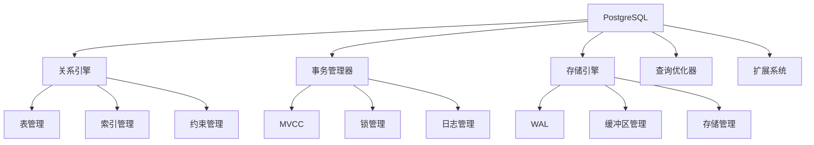
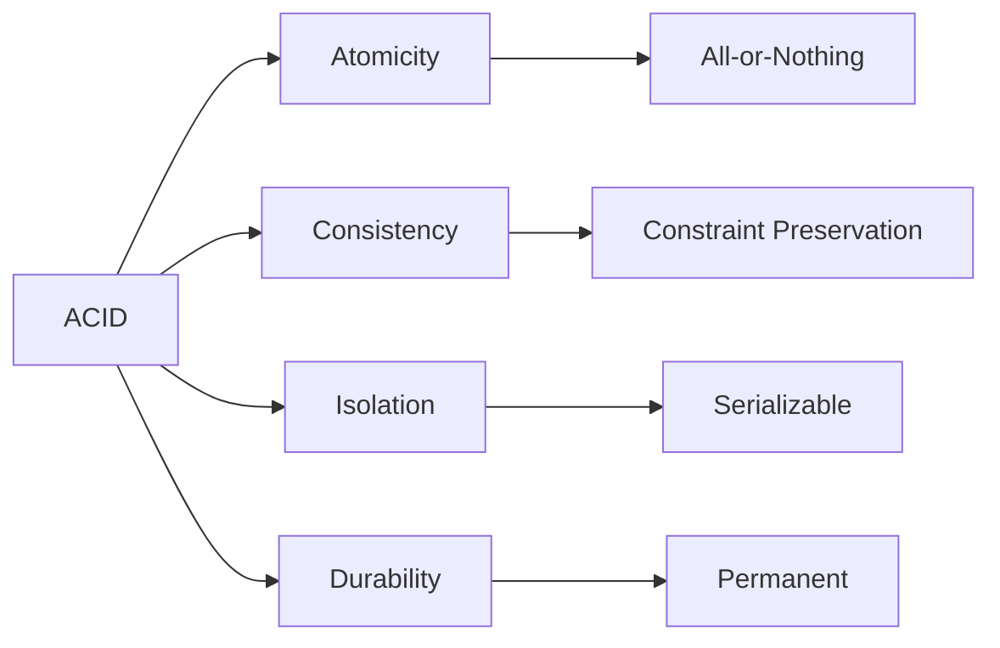

# PostgreSQL概念定义国际化标准示例

## 目录

- [PostgreSQL概念定义国际化标准示例](#postgresql概念定义国际化标准示例)
  - [目录](#目录)
  - [1. 概述](#1-概述)
  - [2. 核心概念定义](#2-核心概念定义)
    - [2.1 PostgreSQL数据库管理系统](#21-postgresql数据库管理系统)
      - [2.1.1 概念定义](#211-概念定义)
      - [2.1.2 多表征表达](#212-多表征表达)
    - [2.2 ACID事务属性](#22-acid事务属性)
      - [2.2.1 概念定义](#221-概念定义)
      - [2.2.2 多表征表达](#222-多表征表达)

## 1. 概述

本文档展示如何按照国际Wiki标准定义PostgreSQL的核心概念，包括：

- **严格的形式化定义**：基于数学和逻辑的精确描述
- **双语对照**：中英文术语和定义对照
- **属性关系**：概念的属性和与其他概念的关系
- **多表征方式**：文字、公式、图表、代码等多种表达
- **知识图谱集成**：与Wikidata等国际知识库对齐

## 2. 核心概念定义

### 2.1 PostgreSQL数据库管理系统

#### 2.1.1 概念定义

```yaml
concept:
  name: "PostgreSQL"
  type: "Database Management System"
  category: "Relational Database"

  # 中文定义
  definition_zh: |
    PostgreSQL是一个功能强大的开源对象关系型数据库管理系统(ORDBMS)，
    支持SQL标准，具有ACID事务特性，提供丰富的扩展性和高级功能。

  # 英文定义
  definition_en: |
    PostgreSQL is a powerful open-source object-relational database management system (ORDBMS)
    that supports SQL standards, provides ACID transaction properties, and offers rich extensibility
    and advanced features.

  # 形式化定义
  formal_definition: |
    设 D = (R, C, T, I, E) 为PostgreSQL数据库实例，其中：
    - R = {r₁, r₂, ..., rₙ} 为关系集合
    - C = {c₁, c₂, ..., cₘ} 为约束集合
    - T = {t₁, t₂, ..., tₖ} 为事务集合
    - I = {i₁, i₂, ..., iₗ} 为索引集合
    - E = {e₁, e₂, ..., eₚ} 为扩展集合

    则PostgreSQL系统定义为：
    PostgreSQL = (D, Σ, Ω, Φ)
    其中：
    - Σ 为SQL语言集合
    - Ω 为操作集合
    - Φ 为函数集合

  # 数学表示
  mathematical_notation: |
    PostgreSQL : Database → (Relations × Constraints × Transactions × Indexes × Extensions)

    对于任意数据库 d ∈ Database：
    PostgreSQL(d) = (R_d, C_d, T_d, I_d, E_d)

  # 属性
  properties:
    - name: "ACID Compliance"
      value: true
      description: "支持原子性、一致性、隔离性、持久性"

    - name: "SQL Standard"
      value: "SQL:2023"
      description: "符合最新SQL标准"

    - name: "Extensibility"
      value: "High"
      description: "支持自定义数据类型、函数、操作符"

    - name: "Concurrency Control"
      value: "MVCC"
      description: "多版本并发控制"

  # 同义词
  synonyms:
    - "Postgres"
    - "PostgreSQL DBMS"
    - "PostgreSQL Database"

  # 反义词
  antonyms:
    - "NoSQL databases"
    - "Key-value stores"
    - "Document databases"

  # Wikidata对齐
  wikidata:
    id: "Q192490"
    label: "PostgreSQL"
    properties:
      P31: "Q176165"  # instance of: database management system
      P178: "Q9366"   # developer: PostgreSQL Global Development Group
      P277: "Q193321" # programmed in: C
      P348: "15.5"    # software version: 15.5
      P856: "https://www.postgresql.org" # official website
```

#### 2.1.2 多表征表达

**文字描述：**
PostgreSQL是一个成熟的开源关系型数据库管理系统，以其可靠性、功能丰富性和性能而闻名。它支持SQL标准，提供ACID事务保证，并具有强大的扩展性。

**数学公式：**
$$\text{PostgreSQL} = \left(\mathcal{R}, \mathcal{C}, \mathcal{T}, \mathcal{I}, \mathcal{E}\right)$$

其中：

- $\mathcal{R}$ 为关系集合
- $\mathcal{C}$ 为约束集合
- $\mathcal{T}$ 为事务集合
- $\mathcal{I}$ 为索引集合
- $\mathcal{E}$ 为扩展集合

**代码示例：**

```sql
-- PostgreSQL系统信息查询
SELECT
    version() as postgresql_version,
    current_database() as current_db,
    current_user as current_user,
    session_user as session_user;
```

**图表表示：**



### 2.2 ACID事务属性

#### 2.2.1 概念定义

```yaml
concept:
  name: "ACID Properties"
  type: "Database Transaction Property"
  category: "Transaction Management"

  # 中文定义
  definition_zh: |
    ACID是数据库事务的四个基本属性：
    - Atomicity（原子性）：事务是不可分割的工作单位
    - Consistency（一致性）：事务执行前后数据库状态保持一致
    - Isolation（隔离性）：并发事务之间相互隔离
    - Durability（持久性）：已提交事务的结果永久保存

  # 英文定义
  definition_en: |
    ACID is an acronym for the four basic properties of database transactions:
    - Atomicity: Transactions are indivisible units of work
    - Consistency: Database state remains consistent before and after transaction execution
    - Isolation: Concurrent transactions are isolated from each other
    - Durability: Results of committed transactions are permanently saved

  # 形式化定义
  formal_definition: |
    设事务 T = {op₁, op₂, ..., opₙ}，数据库状态为 S，则：

    Atomicity: ∀T, T要么完全执行，要么完全不执行
    Consistency: ∀T, ∀S, S →* S' ⇒ S' ⊨ Φ
    Isolation: ∀T₁,T₂, T₁ ∥ T₂ ⇒ T₁ ≅ T₁' ∧ T₂ ≅ T₂'
    Durability: ∀T, commit(T) ⇒ ∀t > commit_time(T), T ∈ committed_transactions(t)

  # 数学表示
  mathematical_notation: |
    ACID : Transaction → {Atomicity, Consistency, Isolation, Durability}

    对于任意事务 t ∈ Transaction：
    ACID(t) = (A(t), C(t), I(t), D(t))
    其中 A, C, I, D 分别表示四个属性

  # 属性
  properties:
    - name: "Atomicity"
      value: "All-or-Nothing"
      description: "事务要么完全执行，要么完全不执行"

    - name: "Consistency"
      value: "Constraint Preservation"
      description: "保持数据库完整性约束"

    - name: "Isolation"
      value: "Serializable"
      description: "可串行化隔离级别"

    - name: "Durability"
      value: "Permanent"
      description: "已提交事务结果永久保存"

  # Wikidata对齐
  wikidata:
    id: "Q193078"
    label: "ACID"
    properties:
      P31: "Q186929"  # instance of: database transaction property
      P279: "Q193078" # subclass of: database concept
```

#### 2.2.2 多表征表达

**文字描述：**
ACID属性是数据库事务管理的基础，确保数据的一致性和可靠性。PostgreSQL完全支持ACID属性，通过MVCC机制实现高效的并发控制。

**数学公式：**
$$\text{ACID}(T) = \left(\text{Atomicity}(T), \text{Consistency}(T), \text{Isolation}(T), \text{Durability}(T)\right)$$

其中：

- $\text{Atomicity}(T) = \forall op \in T, op \text{ 要么完全执行，要么完全不执行}$
- $\text{Consistency}(T) = S \xrightarrow{T} S' \Rightarrow S' \models \Phi$
- $\text{Isolation}(T_1, T_2) = T_1 \parallel T_2 \Rightarrow T_1 \cong T_1' \land T_2 \cong T_2'$
- $\text{Durability}(T) = \text{commit}(T) \Rightarrow \forall t > \text{commit\_time}(T), T \in \text{committed\_transactions}(t)$

**代码示例：**

```sql
-- ACID事务示例
BEGIN TRANSACTION;

-- 原子性：要么全部成功，要么全部回滚
INSERT INTO accounts (id, balance) VALUES (1, 1000);
UPDATE accounts SET balance = balance - 100 WHERE id = 1;
UPDATE accounts SET balance = balance + 100 WHERE id = 2;

-- 一致性：检查约束
CHECK (SELECT SUM(balance) FROM accounts) >= 0;

-- 隔离性：其他事务看不到未提交的更改
-- 持久性：提交后数据永久保存
COMMIT;
```

**图表表示：**



---

**文档信息：**

- 版本：1.0
- 最后更新：2025-01-13
- 状态：进行中
- 维护者：Data Science Team
