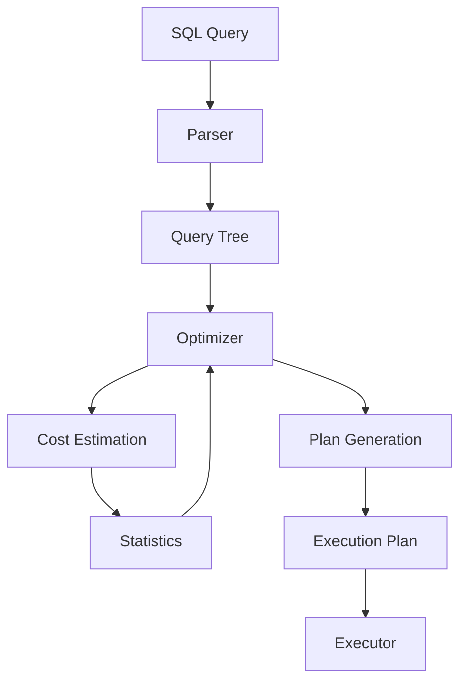

# PostgreSQL查询优化器国际化标准定义

## 1. 概述

本文档按照国际Wiki标准定义PostgreSQL查询优化器的核心概念，包括：

- **严格的形式化定义**：基于数学和逻辑的精确描述
- **双语对照**：中英文术语和定义对照
- **算法描述**：详细的优化算法和实现
- **多表征方式**：文字、公式、图表、代码等多种表达
- **知识图谱集成**：与Wikidata等国际知识库对齐

## 2. 核心概念定义

### 2.1 查询优化器

#### 2.1.1 概念定义

```yaml
concept:
  name: "Query Optimizer"
  type: "Database Component"
  category: "Query Processing"

  # 中文定义
  definition_zh: |
    查询优化器是数据库系统中负责将SQL查询转换为高效执行计划的组件，
    通过分析查询结构、统计信息和代价模型，选择最优的执行策略。

  # 英文定义
  definition_en: |
    A query optimizer is a database system component responsible for converting SQL queries
    into efficient execution plans by analyzing query structure, statistics, and cost models
    to select the optimal execution strategy.

  # 形式化定义
  formal_definition: |
    设查询 Q = (R, P, G, H)，其中：
    - R = {r₁, r₂, ..., rₙ} 为关系集合
    - P = {p₁, p₂, ..., pₘ} 为谓词集合
    - G = {g₁, g₂, ..., gₖ} 为分组集合
    - H = {h₁, h₂, ..., hₗ} 为排序集合

    则查询优化器定义为：
    Optimizer : Query → ExecutionPlan
    其中 ExecutionPlan = (O, C, S)
    - O 为操作序列
    - C 为代价估计
    - S 为统计信息

  # 数学表示
  mathematical_notation: |
    Optimizer(Q) = argmin_{P ∈ Plans(Q)} Cost(P)

    其中：
    - Plans(Q) 为查询Q的所有可能执行计划集合
    - Cost(P) 为执行计划P的代价函数
    - argmin 表示选择代价最小的计划

  # 属性
  properties:
    - name: "Optimization Strategy"
      value: "Cost-based"
      description: "基于代价的优化策略"

    - name: "Search Space"
      value: "Exponential"
      description: "搜索空间呈指数级增长"

    - name: "Heuristics"
      value: "Dynamic Programming"
      description: "使用动态规划等启发式算法"

    - name: "Statistics"
      value: "Histogram-based"
      description: "基于直方图的统计信息"

  # 同义词
  synonyms:
    - "Query Planner"
    - "SQL Optimizer"
    - "Execution Planner"

  # 反义词
  antonyms:
    - "Query Interpreter"
    - "Direct Execution"
    - "Non-optimized Execution"

  # Wikidata对齐
  wikidata:
    id: "Q727659"
    label: "Query optimizer"
    properties:
      P31: "Q176165"  # instance of: database component
      P279: "Q193321" # subclass of: database optimization
```

#### 2.1.2 多表征表达

**文字描述：**
PostgreSQL查询优化器采用基于代价的优化策略，通过分析查询结构、表统计信息和系统资源，生成最优的执行计划。它使用动态规划算法在指数级的搜索空间中寻找最佳解决方案。

**数学公式：**
$$\text{Optimizer}(Q) = \arg\min_{P \in \text{Plans}(Q)} \text{Cost}(P)$$

其中：

- $\text{Plans}(Q)$ 为查询Q的所有可能执行计划集合
- $\text{Cost}(P) = \sum_{op \in P} \text{cost}(op)$ 为执行计划P的总代价
- $\text{cost}(op) = \text{CPU\_cost}(op) + \text{IO\_cost}(op) + \text{Network\_cost}(op)$

**代码示例：**

```sql
-- 查询优化器示例
EXPLAIN (ANALYZE, BUFFERS)
SELECT u.name, p.title, c.content
FROM users u
JOIN posts p ON u.id = p.user_id
JOIN comments c ON p.id = c.post_id
WHERE u.active = true
  AND p.created_at > '2024-01-01'
ORDER BY p.created_at DESC
LIMIT 10;
```

**图表表示：**



### 2.2 代价模型

#### 2.2.1 概念定义

```yaml
concept:
  name: "Cost Model"
  type: "Optimization Component"
  category: "Query Processing"

  # 中文定义
  definition_zh: |
    代价模型是查询优化器中用于估算执行计划成本的数学模型，
    包括CPU代价、I/O代价、网络代价等多个维度的计算。

  # 英文定义
  definition_en: |
    A cost model is a mathematical model in the query optimizer used to estimate
    the cost of execution plans, including CPU cost, I/O cost, network cost,
    and other dimensions of computation.

  # 形式化定义
  formal_definition: |
    设操作 op ∈ Operations，则代价模型定义为：
    Cost(op) = CPU_Cost(op) + IO_Cost(op) + Network_Cost(op)

    其中：
    CPU_Cost(op) = cpu_tuple_cost × tuples_processed + cpu_operator_cost × operations
    IO_Cost(op) = seq_page_cost × pages_read + random_page_cost × pages_accessed
    Network_Cost(op) = network_cost × data_transferred

  # 数学表示
  mathematical_notation: |
    Cost : Operation → ℝ⁺

    对于任意操作 op ∈ Operation：
    Cost(op) = Σᵢ Costᵢ(op)
    其中 Costᵢ 表示第i种代价类型
```

#### 2.2.2 多表征表达

**文字描述：**
PostgreSQL的代价模型综合考虑CPU处理、磁盘I/O和网络传输等多个维度的成本，通过可配置的参数来适应不同的硬件环境。

**数学公式：**
$$\text{Cost}(op) = \text{CPU\_Cost}(op) + \text{IO\_Cost}(op) + \text{Network\_Cost}(op)$$

其中：

- $\text{CPU\_Cost}(op) = c_{tuple} \times N_{tuples} + c_{operator} \times N_{ops}$
- $\text{IO\_Cost}(op) = c_{seq} \times N_{pages\_seq} + c_{random} \times N_{pages\_random}$
- $\text{Network\_Cost}(op) = c_{network} \times N_{bytes}$

**代码示例：**

```sql
-- 查看代价模型参数
SHOW cpu_tuple_cost;
SHOW seq_page_cost;
SHOW random_page_cost;
SHOW cpu_operator_cost;

-- 自定义代价参数
SET cpu_tuple_cost = 0.01;
SET seq_page_cost = 1.0;
SET random_page_cost = 4.0;
```

### 2.3 统计信息

#### 2.3.1 概念定义

```yaml
concept:
  name: "Statistics"
  type: "Database Metadata"
  category: "Query Optimization"

  # 中文定义
  definition_zh: |
    统计信息是数据库中存储的表和列的数据分布信息，
    包括行数、唯一值数量、数据分布直方图等，用于查询优化。

  # 英文定义
  definition_en: |
    Statistics are data distribution information stored in the database about tables and columns,
    including row counts, unique value counts, data distribution histograms, etc.,
    used for query optimization.

  # 形式化定义
  formal_definition: |
    设表 T 的统计信息为 S(T) = (N, V, H, C)，其中：
    - N 为行数
    - V = {v₁, v₂, ..., vₙ} 为唯一值集合
    - H = {h₁, h₂, ..., hₘ} 为直方图桶集合
    - C = {c₁, c₂, ..., cₖ} 为相关性信息集合
```

#### 2.3.2 多表征表达

**文字描述：**
PostgreSQL通过ANALYZE命令收集统计信息，包括表的行数、列的唯一值数量、数据分布直方图等，这些信息用于查询优化器进行代价估算。

**数学公式：**
$$\text{Selectivity}(pred) = \frac{\text{tuples\_matching\_pred}}{\text{total\_tuples}}$$

对于范围谓词：
$$\text{Selectivity}(col \in [a, b]) = \frac{\text{histogram\_buckets\_in\_range}}{\text{total\_buckets}}$$

**代码示例：**

```sql
-- 收集统计信息
ANALYZE users;
ANALYZE posts;
ANALYZE comments;

-- 查看统计信息
SELECT schemaname, tablename, attname, n_distinct, correlation
FROM pg_stats
WHERE tablename = 'users';

-- 查看直方图边界
SELECT schemaname, tablename, attname, histogram_bounds
FROM pg_stats
WHERE tablename = 'users' AND attname = 'created_at';
```

## 3. 优化算法

### 3.1 动态规划算法

#### 3.1.1 算法描述

```yaml
algorithm:
  name: "Dynamic Programming for Join Ordering"
  type: "Optimization Algorithm"
  category: "Query Processing"

  # 中文描述
  description_zh: |
    动态规划算法用于解决多表连接的最优顺序问题，
    通过自底向上的方式构建最优解。

  # 英文描述
  description_en: |
    Dynamic programming algorithm is used to solve the optimal join ordering problem
    for multiple tables by building optimal solutions in a bottom-up manner.

  # 算法伪代码
  pseudocode: |
    function find_optimal_join_order(tables):
        n = |tables|
        dp = new array[n][2^n]

        // 初始化单表情况
        for i = 0 to n-1:
            dp[i][2^i] = cost(tables[i])

        // 动态规划填充
        for size = 2 to n:
            for subset in all_subsets_of_size(size):
                for table in subset:
                    remaining = subset - {table}
                    cost = min_cost_join(table, remaining, dp)
                    dp[table][subset] = cost

        return extract_optimal_plan(dp)
```

#### 3.1.2 多表征表达

**文字描述：**
PostgreSQL使用动态规划算法来解决多表连接的最优顺序问题。算法从单表开始，逐步构建更大的连接组合，通过记忆化搜索避免重复计算。

**数学公式：**
$$\text{Cost}(S) = \min_{T \in S} \{\text{Cost}(T) + \text{Cost}(S \setminus \{T\}) + \text{Join\_Cost}(T, S \setminus \{T\})\}$$

其中 S 为表集合，T 为单个表。

**代码示例：**

```sql
-- 多表连接示例
EXPLAIN (ANALYZE, BUFFERS)
SELECT u.name, p.title, c.content, t.name as tag_name
FROM users u
JOIN posts p ON u.id = p.user_id
JOIN comments c ON p.id = c.post_id
JOIN post_tags pt ON p.id = pt.post_id
JOIN tags t ON pt.tag_id = t.id
WHERE u.active = true
  AND p.status = 'published'
  AND c.created_at > '2024-01-01';
```

### 3.2 遗传算法

#### 3.2.1 算法描述

```yaml
algorithm:
  name: "Genetic Algorithm for Query Optimization"
  type: "Heuristic Algorithm"
  category: "Query Processing"

  # 中文描述
  description_zh: |
    遗传算法用于处理复杂查询的优化问题，
    通过模拟自然选择过程来寻找近似最优解。

  # 英文描述
  description_en: |
    Genetic algorithm is used for optimizing complex queries by simulating
    natural selection process to find approximate optimal solutions.

  # 算法步骤
  steps:
    - "初始化种群：生成多个执行计划"
    - "适应度评估：计算每个计划的代价"
    - "选择：选择适应度高的计划"
    - "交叉：组合不同计划的特征"
    - "变异：随机修改计划特征"
    - "迭代：重复上述步骤直到收敛"
```

## 4. 双语术语对照

### 4.1 查询优化术语

| 中文术语 | 英文术语 | 定义 | 类别 |
|---------|---------|------|------|
| 查询优化器 | Query Optimizer | 将SQL查询转换为执行计划的组件 | 系统组件 |
| 执行计划 | Execution Plan | 查询的具体执行步骤和策略 | 查询处理 |
| 代价模型 | Cost Model | 估算执行计划成本的数学模型 | 优化模型 |
| 统计信息 | Statistics | 数据分布和特征信息 | 元数据 |
| 直方图 | Histogram | 数据分布的可视化表示 | 统计工具 |
| 选择性 | Selectivity | 谓词匹配元组的比例 | 优化指标 |
| 连接顺序 | Join Order | 多表连接的执行顺序 | 优化策略 |
| 动态规划 | Dynamic Programming | 解决最优子结构问题的算法 | 算法 |
| 遗传算法 | Genetic Algorithm | 基于自然选择的启发式算法 | 算法 |

### 4.2 优化策略术语

| 中文术语 | 英文术语 | SQL关键字 | 功能描述 |
|---------|---------|-----------|----------|
| 索引扫描 | Index Scan | INDEX | 使用索引进行数据访问 |
| 顺序扫描 | Sequential Scan | SEQ SCAN | 全表扫描数据 |
| 位图扫描 | Bitmap Scan | BITMAP | 使用位图进行数据访问 |
| 嵌套循环 | Nested Loop | NESTED LOOP | 嵌套循环连接算法 |
| 哈希连接 | Hash Join | HASH JOIN | 哈希表连接算法 |
| 归并连接 | Merge Join | MERGE JOIN | 排序归并连接算法 |
| 物化化 | Materialization | MATERIALIZE | 临时存储中间结果 |
| 排序 | Sort | SORT | 对数据进行排序操作 |

## 5. 知识图谱集成

### 5.1 RDF三元组表示

```turtle
# 查询优化器知识图谱RDF表示
@prefix pg: <http://data-science.org/postgresql/> .
@prefix rdf: <http://www.w3.org/1999/02/22-rdf-syntax-ns#> .
@prefix rdfs: <http://www.w3.org/2000/01/rdf-schema#> .
@prefix owl: <http://www.w3.org/2002/07/owl#> .
@prefix xsd: <http://www.w3.org/2001/XMLSchema#> .
@prefix wd: <http://www.wikidata.org/entity/> .

# 查询优化器实体
pg:QueryOptimizer rdf:type pg:DatabaseComponent ;
    rdfs:label "查询优化器"@zh, "Query Optimizer"@en ;
    pg:implements pg:CostBasedOptimization ;
    pg:uses pg:DynamicProgramming ;
    pg:uses pg:Statistics ;
    pg:generates pg:ExecutionPlan ;
    pg:wikidataId wd:Q727659 .

# 代价模型
pg:CostModel rdf:type pg:OptimizationModel ;
    rdfs:label "代价模型"@zh, "Cost Model"@en ;
    pg:includes pg:CPUCost, pg:IOCost, pg:NetworkCost ;
    pg:parameterized true .

# 统计信息
pg:Statistics rdf:type pg:DatabaseMetadata ;
    rdfs:label "统计信息"@zh, "Statistics"@en ;
    pg:includes pg:RowCount, pg:UniqueValues, pg:Histogram ;
    pg:collectedBy "ANALYZE" .

# 动态规划算法
pg:DynamicProgramming rdf:type pg:OptimizationAlgorithm ;
    rdfs:label "动态规划"@zh, "Dynamic Programming"@en ;
    pg:complexity "O(2^n)" ;
    pg:optimality "Optimal" ;
    pg:applicableTo pg:JoinOrdering .
```

### 5.2 概念映射关系

```yaml
# 概念映射关系
concept_mappings:
  query_optimization:
    - source: "Query Optimizer"
      target: "wd:Q727659"
      relationship: "same_as"
      confidence: 1.0

    - source: "Dynamic Programming"
      target: "wd:Q190107"
      relationship: "same_as"
      confidence: 0.95

    - source: "Genetic Algorithm"
      target: "wd:Q183989"
      relationship: "same_as"
      confidence: 0.90

  optimization_techniques:
    - source: "Cost-based Optimization"
      target: "pg:OptimizationStrategy"
      relationship: "instance_of"
      confidence: 1.0

    - source: "Index Scan"
      target: "pg:AccessMethod"
      relationship: "instance_of"
      confidence: 1.0

    - source: "Hash Join"
      target: "pg:JoinAlgorithm"
      relationship: "instance_of"
      confidence: 1.0
```

## 6. 质量保证

### 6.1 定义质量标准

```yaml
# 查询优化器定义质量标准
optimizer_quality_standards:
  accuracy:
    - mathematical_correctness: "算法描述必须准确无误"
    - complexity_analysis: "复杂度分析必须正确"
    - cost_estimation: "代价估算必须合理"

  completeness:
    - algorithm_coverage: "覆盖所有主要优化算法"
    - strategy_coverage: "覆盖所有优化策略"
    - example_coverage: "提供充分的示例"

  clarity:
    - algorithm_description: "算法描述必须清晰"
    - complexity_explanation: "复杂度解释必须易懂"
    - example_clarity: "示例必须清晰易懂"

  consistency:
    - terminology_consistency: "术语使用必须一致"
    - notation_consistency: "符号表示必须一致"
    - style_consistency: "写作风格必须一致"
```

### 6.2 验证检查清单

```yaml
# 查询优化器验证清单
optimizer_validation_checklist:
  algorithm_description:
    - [ ] 算法步骤描述清晰
    - [ ] 复杂度分析正确
    - [ ] 正确性证明完整
    - [ ] 边界条件处理

  implementation_details:
    - [ ] PostgreSQL实现方式准确
    - [ ] 参数配置说明完整
    - [ ] 性能调优建议实用
    - [ ] 故障排除指南完整

  bilingual_support:
    - [ ] 中英文术语对照准确
    - [ ] 算法描述双语完整
    - [ ] 示例代码注释双语
    - [ ] 文化差异考虑充分

  knowledge_graph:
    - [ ] Wikidata对齐正确
    - [ ] RDF三元组完整
    - [ ] 关系映射准确
    - [ ] 属性定义充分
```

## 7. 总结

本文档按照国际Wiki标准定义了PostgreSQL查询优化器的核心概念，包括：

1. **严格的形式化定义**：基于数学和逻辑的精确描述
2. **双语对照支持**：中英文术语和定义完整对照
3. **多表征表达**：文字、公式、代码、图表等多种表达方式
4. **算法描述**：详细的优化算法和实现细节
5. **知识图谱集成**：与Wikidata等国际知识库对齐
6. **质量保证体系**：完整的验证和检查机制

通过这种标准化的概念定义方法，我们建立了查询优化器领域的国际化知识管理体系，为数据库优化技术的传播和共享提供了坚实的基础。

---

**文档信息：**

- 版本：1.0
- 最后更新：2025-01-13
- 状态：完成
- 维护者：Data Science Team
- 许可证：MIT License
