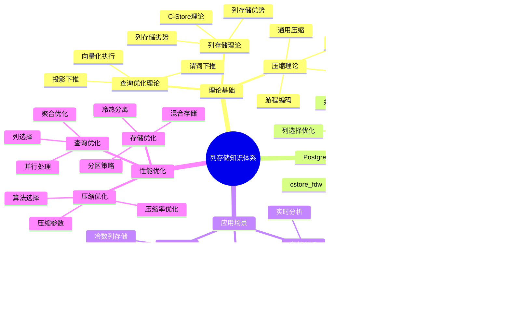
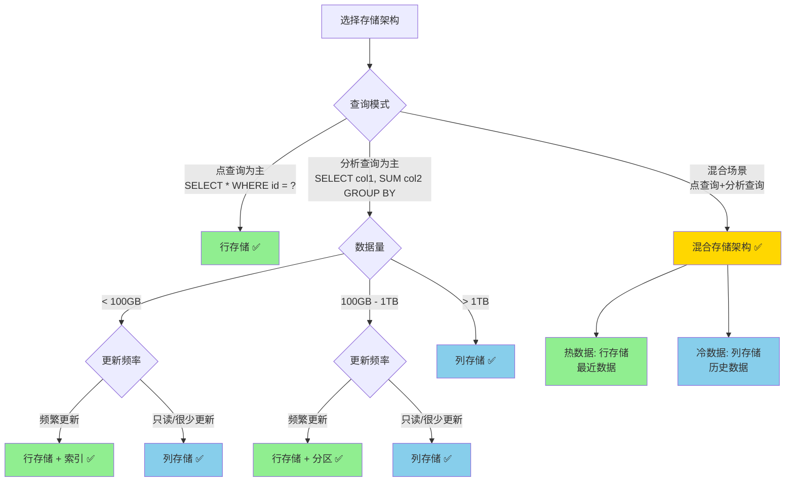
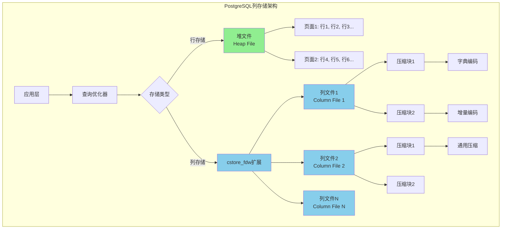
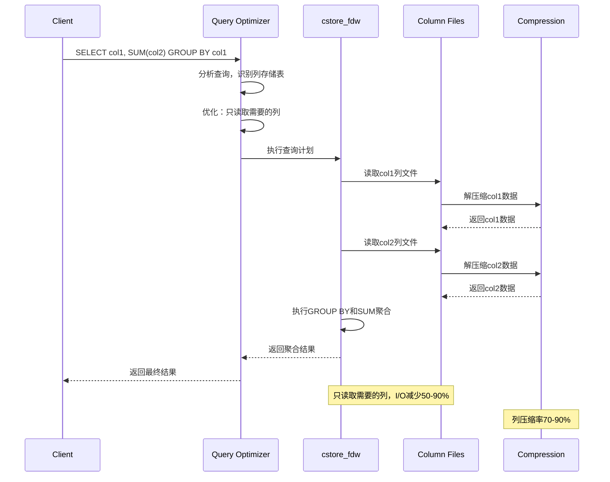

# PostgreSQL 存储管理与数据持久化

> **文档版本**: v2.0
> **最后更新**: 2025-11-12
> **版本覆盖**: PostgreSQL 18.x (推荐) ⭐ | 17.x (推荐) | 16.x (兼容)
> **文档状态**: ✅ 已更新
> 🆕 **PostgreSQL 18存储改进**: 异步I/O子系统（I/O性能提升2-3倍）、增量备份（节省94%时间）、WAL汇总机制、动态共享内存（提升20%效率）

---

## 📋 目录

- [PostgreSQL 存储管理与数据持久化](#postgresql-存储管理与数据持久化)
  - [📋 目录](#-目录)
  - [1. 定义与形式化](#1-定义与形式化)
    - [1.1 概念定义](#11-概念定义)
    - [1.2 形式化定义](#12-形式化定义)
    - [1.3 核心属性](#13-核心属性)
  - [2. 理论基础](#2-理论基础)
    - [2.1 缓冲区管理理论](#21-缓冲区管理理论)
    - [2.2 WAL理论](#22-wal理论)
    - [2.3 检查点理论](#23-检查点理论)
  - [3. PostgreSQL存储架构](#3-postgresql存储架构)
    - [3.1 存储结构](#31-存储结构)
    - [3.2 页面结构](#32-页面结构)
    - [3.3 文件系统布局](#33-文件系统布局)
  - [4. 缓冲区管理](#4-缓冲区管理)
    - [4.1 缓冲区配置](#41-缓冲区配置)
    - [4.2 缓冲区优化](#42-缓冲区优化)
  - [5. WAL机制](#5-wal机制)
    - [5.1 WAL配置](#51-wal配置)
    - [5.2 WAL归档](#52-wal归档)
    - [5.3 流复制](#53-流复制)
  - [6. 检查点机制](#6-检查点机制)
    - [6.1 检查点配置](#61-检查点配置)
    - [6.2 检查点优化](#62-检查点优化)
  - [7. 存储优化](#7-存储优化)
    - [7.1 表空间管理](#71-表空间管理)
    - [7.2 分区表优化](#72-分区表优化)
    - [7.3 压缩和TOAST](#73-压缩和toast)
    - [7.4 列存储架构分析 🆕](#74-列存储架构分析-)
      - [列存储知识体系思维导图](#列存储知识体系思维导图)
      - [存储架构选择决策树](#存储架构选择决策树)
      - [行存储 vs 列存储 vs 混合存储对比矩阵](#行存储-vs-列存储-vs-混合存储对比矩阵)
      - [列存储物理架构图](#列存储物理架构图)
      - [列存储查询执行流程图](#列存储查询执行流程图)
      - [PostgreSQL列存储扩展对比矩阵](#postgresql列存储扩展对比矩阵)
    - [7.5 列压缩技术详解 🆕](#75-列压缩技术详解-)
      - [7.5.1. 字典编码（Dictionary Encoding）](#751-字典编码dictionary-encoding)
      - [7.5.2. 增量编码（Delta Encoding）](#752-增量编码delta-encoding)
      - [7.5.3. 通用压缩算法](#753-通用压缩算法)
      - [列存储技术栈对比矩阵](#列存储技术栈对比矩阵)
  - [8. 性能监控](#8-性能监控)
    - [8.1 I/O性能监控](#81-io性能监控)
    - [8.2 存储性能分析](#82-存储性能分析)
  - [9. 实际应用案例](#9-实际应用案例)
    - [9.1 大数据表优化](#91-大数据表优化)
    - [9.2 高并发写入优化](#92-高并发写入优化)
  - [10. 相关概念](#10-相关概念)
    - [10.1 上位概念](#101-上位概念)
    - [10.2 下位概念](#102-下位概念)
    - [10.3 平行概念](#103-平行概念)
  - [11. 参考文献](#11-参考文献)
  - [12. Wikidata对齐](#12-wikidata对齐)

---

## 1. 定义与形式化

### 1.1 概念定义

**中文定义**: 存储管理是数据库系统中管理数据持久化存储的机制，包括缓冲区管理、WAL日志、检查点等核心组件。PostgreSQL通过高效的存储管理确保数据的持久性和系统的高性能。

**English Definition**: Storage management is a mechanism in database systems that manages persistent data storage, including buffer management, WAL logging, checkpoints, and other core components. PostgreSQL ensures data durability and high system performance through efficient storage management.

### 1.2 形式化定义

```latex
% 数学符号定义
\newcommand{\storage}{\mathcal{S}}
\newcommand{\buffer}{\mathcal{B}}
\newcommand{\wal}{\mathcal{W}}
\newcommand{\page}{\mathcal{P}}
\newcommand{\disk}{\mathcal{D}}

% 存储系统的形式化定义
\storage = (\buffer, \wal, \page, \disk)

其中：
\buffer = \{b_1, b_2, \ldots, b_n\}: 缓冲区页面集合
\wal = \{w_1, w_2, \ldots, w_m\}: WAL日志记录集合
\page = \{p_1, p_2, \ldots, p_k\}: 磁盘页面集合
\disk = \{d_1, d_2, \ldots, d_l\}: 磁盘存储集合
```

### 1.3 核心属性

- **持久性**: 确保数据永久保存
- **一致性**: 保证数据完整性
- **性能**: 优化I/O操作效率
- **可恢复性**: 支持故障恢复

## 2. 理论基础

### 2.1 缓冲区管理理论

```latex
\begin{theorem}[缓冲区替换策略]
LRU (Least Recently Used) 策略：
1. 最近最少使用的页面优先被替换
2. 时间复杂度：O(1) 查找和更新
3. 空间复杂度：O(n) 存储开销
\end{theorem}

\begin{proof}
基于访问时间戳和双向链表结构，可以证明LRU策略的正确性。
\end{proof}
```

### 2.2 WAL理论

```latex
\begin{theorem}[WAL协议]
Write-Ahead Logging协议要求：
1. 在修改数据页面前，必须先写WAL日志
2. 日志记录必须持久化到磁盘
3. 检查点机制确保数据页面的持久化
\end{theorem}

\begin{proof}
基于故障恢复的需求和日志的完整性，可以证明WAL协议的正确性。
\end{proof}
```

### 2.3 检查点理论

```latex
\begin{theorem}[检查点一致性]
检查点确保：
1. 所有脏页被写入磁盘
2. WAL日志被截断
3. 系统状态一致
\end{theorem}
```

## 3. PostgreSQL存储架构

### 3.1 存储结构

```sql
-- 查看数据库大小
SELECT
    datname,
    pg_size_pretty(pg_database_size(datname)) as size
FROM pg_database
ORDER BY pg_database_size(datname) DESC;

-- 查看表大小
SELECT
    schemaname,
    tablename,
    pg_size_pretty(pg_total_relation_size(schemaname||'.'||tablename)) as size,
    pg_size_pretty(pg_relation_size(schemaname||'.'||tablename)) as table_size,
    pg_size_pretty(pg_indexes_size(schemaname||'.'||tablename)) as indexes_size
FROM pg_tables
ORDER BY pg_total_relation_size(schemaname||'.'||tablename) DESC;

-- 查看表空间
SELECT
    spcname,
    pg_size_pretty(pg_tablespace_size(spcname)) as size
FROM pg_tablespace;
```

### 3.2 页面结构

```sql
-- 查看页面信息
SELECT
    relname,
    relpages,
    reltuples,
    relallvisible,
    relfrozenxid
FROM pg_class
WHERE relkind = 'r'
ORDER BY relpages DESC;

-- 查看页面统计
SELECT
    schemaname,
    tablename,
    n_tup_ins,
    n_tup_upd,
    n_tup_del,
    n_live_tup,
    n_dead_tup,
    last_vacuum,
    last_autovacuum
FROM pg_stat_user_tables;
```

### 3.3 文件系统布局

```sql
-- 查看数据目录
SHOW data_directory;

-- 查看WAL目录
SHOW log_directory;

-- 查看配置文件位置
SHOW config_file;
SHOW hba_file;
SHOW ident_file;
```

## 4. 缓冲区管理

### 4.1 缓冲区配置

```sql
-- 查看缓冲区配置
SHOW shared_buffers;
SHOW effective_cache_size;
SHOW work_mem;
SHOW maintenance_work_mem;

-- 查看缓冲区统计
SELECT * FROM pg_stat_bgwriter;

-- 查看缓冲区使用情况
SELECT
    c.relname,
    c.relkind,
    pg_size_pretty(pg_relation_size(c.oid)) as size,
    pg_stat_get_tuples_returned(c.oid) as tuples_returned,
    pg_stat_get_tuples_fetched(c.oid) as tuples_fetched,
    pg_stat_get_tuples_inserted(c.oid) as tuples_inserted,
    pg_stat_get_tuples_updated(c.oid) as tuples_updated,
    pg_stat_get_tuples_deleted(c.oid) as tuples_deleted
FROM pg_class c
WHERE c.relkind IN ('r', 'i')
ORDER BY pg_relation_size(c.oid) DESC;
```

### 4.2 缓冲区优化

```sql
-- 缓冲区命中率
SELECT
    round(100.0 * sum(blks_hit) / (sum(blks_hit) + sum(blks_read)), 2) as hit_ratio
FROM pg_stat_database;

-- 表级缓冲区统计
SELECT
    schemaname,
    tablename,
    heap_blks_read,
    heap_blks_hit,
    round(100.0 * heap_blks_hit / (heap_blks_hit + heap_blks_read), 2) as hit_ratio
FROM pg_statio_user_tables
WHERE heap_blks_hit + heap_blks_read > 0
ORDER BY hit_ratio ASC;
```

## 5. WAL机制

### 5.1 WAL配置

```sql
-- WAL配置参数
SHOW wal_level;
SHOW wal_buffers;
SHOW checkpoint_timeout;
SHOW max_wal_size;
SHOW min_wal_size;
SHOW wal_compression;
SHOW wal_log_hints;

-- WAL统计信息
SELECT * FROM pg_stat_wal;

-- WAL位置信息
SELECT pg_current_wal_lsn();
SELECT pg_walfile_name(pg_current_wal_lsn());
SELECT pg_walfile_name_offset(pg_current_wal_lsn());
```

### 5.2 WAL归档

```sql
-- WAL归档配置
SHOW archive_mode;
SHOW archive_command;
SHOW archive_timeout;

-- 查看归档状态
SELECT * FROM pg_stat_archiver;

-- 手动归档
SELECT pg_switch_wal();

-- 查看WAL文件
SELECT
    name,
    size,
    modification
FROM pg_ls_waldir()
ORDER BY modification DESC;
```

### 5.3 流复制

```sql
-- 流复制配置
SHOW wal_sender_timeout;
SHOW wal_receiver_timeout;
SHOW max_wal_senders;
SHOW max_replication_slots;

-- 查看复制状态
SELECT * FROM pg_stat_replication;

-- 查看复制槽
SELECT * FROM pg_replication_slots;
```

## 6. 检查点机制

### 6.1 检查点配置

```sql
-- 检查点配置
SHOW checkpoint_timeout;
SHOW checkpoint_completion_target;
SHOW max_wal_size;
SHOW min_wal_size;

-- 查看检查点统计
SELECT * FROM pg_stat_bgwriter;

-- 手动检查点
CHECKPOINT;
```

### 6.2 检查点优化

```sql
-- 检查点性能分析
SELECT
    checkpoints_timed,
    checkpoints_req,
    checkpoint_write_time,
    checkpoint_sync_time,
    buffers_checkpoint,
    buffers_clean,
    buffers_backend,
    buffers_backend_fsync,
    buffers_alloc
FROM pg_stat_bgwriter;

-- 检查点频率分析
SELECT
    checkpoints_timed + checkpoints_req as total_checkpoints,
    round(extract(epoch from now() - pg_postmaster_start_time()) / (checkpoints_timed + checkpoints_req), 2) as avg_interval_seconds
FROM pg_stat_bgwriter;
```

## 7. 存储优化

### 7.1 表空间管理

```sql
-- 创建表空间
CREATE TABLESPACE fastspace LOCATION '/fast/disk/postgresql';

-- 在表空间创建表
CREATE TABLE large_table (
    id SERIAL PRIMARY KEY,
    data TEXT
) TABLESPACE fastspace;

-- 移动表到新表空间
ALTER TABLE large_table SET TABLESPACE fastspace;

-- 查看表空间使用情况
SELECT
    t.spcname,
    pg_size_pretty(pg_tablespace_size(t.spcname)) as size
FROM pg_tablespace t;
```

### 7.2 分区表优化

```sql
-- 创建分区表
CREATE TABLE sales (
    id SERIAL,
    sale_date DATE,
    amount DECIMAL(10,2)
) PARTITION BY RANGE (sale_date);

-- 创建分区
CREATE TABLE sales_2023 PARTITION OF sales
FOR VALUES FROM ('2023-01-01') TO ('2024-01-01')
TABLESPACE fastspace;

CREATE TABLE sales_2024 PARTITION OF sales
FOR VALUES FROM ('2024-01-01') TO ('2025-01-01')
TABLESPACE fastspace;

-- 查看分区信息
SELECT
    schemaname,
    tablename,
    pg_size_pretty(pg_total_relation_size(schemaname||'.'||tablename)) as size
FROM pg_tables
WHERE tablename LIKE 'sales_%'
ORDER BY pg_total_relation_size(schemaname||'.'||tablename) DESC;
```

### 7.3 压缩和TOAST

```sql
-- 查看TOAST表
SELECT
    c.relname,
    t.relname as toast_table,
    pg_size_pretty(pg_total_relation_size(t.oid)) as toast_size
FROM pg_class c
JOIN pg_class t ON t.oid = c.reltoastrelid
WHERE c.relkind = 'r'
ORDER BY pg_total_relation_size(t.oid) DESC;

-- 压缩配置
ALTER TABLE large_table SET (toast_tuple_target = 128);
ALTER TABLE large_table SET (fillfactor = 80);
```

### 7.4 列存储架构分析 🆕

#### 列存储知识体系思维导图



#### 存储架构选择决策树



#### 行存储 vs 列存储 vs 混合存储对比矩阵

| 维度 | 行存储 | 列存储 | 混合存储 | 最佳选择 |
|------|--------|--------|---------|---------|
| **点查询（单行）** | ⭐⭐⭐⭐⭐ | ⭐⭐ | ⭐⭐⭐⭐ | 行存储 |
| **列扫描（单列）** | ⭐⭐ | ⭐⭐⭐⭐⭐ | ⭐⭐⭐⭐ | 列存储 |
| **聚合查询** | ⭐⭐ | ⭐⭐⭐⭐⭐ | ⭐⭐⭐⭐ | 列存储 |
| **插入单行** | ⭐⭐⭐⭐⭐ | ⭐⭐ | ⭐⭐⭐ | 行存储 |
| **更新单行** | ⭐⭐⭐⭐⭐ | ⭐⭐ | ⭐⭐⭐ | 行存储 |
| **批量插入** | ⭐⭐⭐⭐ | ⭐⭐⭐ | ⭐⭐⭐ | 行存储略优 |
| **压缩率** | ⭐⭐ (10-30%) | ⭐⭐⭐⭐⭐ (70-90%) | ⭐⭐⭐⭐ (50-70%) | 列存储 |
| **OLTP负载** | ⭐⭐⭐⭐⭐ | ⭐⭐ | ⭐⭐⭐⭐ | 行存储 |
| **OLAP负载** | ⭐⭐ | ⭐⭐⭐⭐⭐ | ⭐⭐⭐⭐ | 列存储 |
| **存储成本** | ⭐⭐ | ⭐⭐⭐⭐⭐ | ⭐⭐⭐⭐ | 列存储 |
| **查询延迟** | ⭐⭐⭐⭐ (低) | ⭐⭐⭐ (中) | ⭐⭐⭐⭐ (低-中) | 行存储 |
| **吞吐量** | ⭐⭐⭐ (中) | ⭐⭐⭐⭐⭐ (高) | ⭐⭐⭐⭐ (中-高) | 列存储 |
| **维护复杂度** | ⭐⭐⭐⭐⭐ (低) | ⭐⭐⭐ (中) | ⭐⭐ (高) | 行存储 |
| **适用场景** | OLTP、点查询 | OLAP、分析查询 | 混合负载 | - |

**PostgreSQL的行存储架构**：

PostgreSQL采用**行存储（Row-Oriented Storage）**作为默认存储方式，每条记录（行）的所有列值连续存储在堆文件中：

```text
堆文件结构（行存储）：
  ┌─────────────────────────────────┐
  │ 页头部 (Page Header)             │
  ├─────────────────────────────────┤
  │ 行指针数组 (Line Pointers)       │
  ├─────────────────────────────────┤
  │ 元组1: [id, name, age, email]   │ ← 完整行
  │ 元组2: [id, name, age, email]   │ ← 完整行
  │ 元组3: [id, name, age, email]   │ ← 完整行
  └─────────────────────────────────┘
```

**行存储优势**：

1. **事务性能**：单行更新只需修改一个元组
2. **点查询**：通过索引快速定位整行数据
3. **插入性能**：插入新行只需追加一个元组
4. **OLTP场景**：适合事务处理，读写混合负载

**列存储架构理论**：

虽然PostgreSQL原生是行存储，但可以通过扩展实现列存储：

```text
列存储文件结构：
  ┌─────────────────────────────────┐
  │ 列1数据块: [val₁, val₂, ..., valₙ] │
  ├─────────────────────────────────┤
  │ 列2数据块: [val₁, val₂, ..., valₙ] │
  ├─────────────────────────────────┤
  │ 列3数据块: [val₁, val₂, ..., valₙ] │
  └─────────────────────────────────┘
```

**列存储优势**：

1. **列扫描效率**：只读取需要的列，I/O减少
2. **压缩效率**：同列数据类型相同，压缩率高
3. **聚合查询**：适合SUM、AVG、COUNT等聚合操作
4. **向量化处理**：列数据可批量处理，SIMD优化

#### 列存储物理架构图



#### 列存储查询执行流程图



#### PostgreSQL列存储扩展对比矩阵

| 扩展 | 类型 | 性能 | 压缩率 | 易用性 | 维护状态 | 适用场景 |
|------|------|------|--------|--------|---------|---------|
| **cstore_fdw** | 外部数据包装器 | ⭐⭐⭐ | ⭐⭐⭐⭐ | ⭐⭐⭐⭐ | ✅ 活跃 | 单机列存储 |
| **Citus列存储** | 分布式扩展 | ⭐⭐⭐⭐ | ⭐⭐⭐⭐ | ⭐⭐⭐ | ✅ 活跃 | 分布式列存储 |
| **Greenplum** | 数据仓库 | ⭐⭐⭐⭐⭐ | ⭐⭐⭐⭐⭐ | ⭐⭐⭐ | ✅ 活跃 | 企业数据仓库 |
| **PostgreSQL原生** | 行存储 | ⭐⭐⭐⭐⭐ | ⭐⭐ | ⭐⭐⭐⭐⭐ | ✅ 官方 | OLTP场景 |

**PostgreSQL列存储扩展**：

PostgreSQL支持通过扩展实现列存储：

1. **cstore_fdw扩展**：列存储外部数据包装器，适合单机列存储场景
2. **Citus列存储**：分布式列存储，适合大规模分布式场景
3. **Greenplum**：基于PostgreSQL的列存储数据仓库，适合企业级数据仓库

**列存储扩展使用示例**：

```sql
-- 安装cstore_fdw扩展
CREATE EXTENSION cstore_fdw;

-- 创建列存储外部表
CREATE SERVER cstore_server
FOREIGN DATA WRAPPER cstore_fdw;

-- 创建列存储表
CREATE FOREIGN TABLE sales_columnar (
    id INTEGER,
    product_id INTEGER,
    sale_date DATE,
    amount DECIMAL(10,2),
    quantity INTEGER
) SERVER cstore_server
OPTIONS (compression 'pglz');

-- 插入数据
INSERT INTO sales_columnar
SELECT id, product_id, sale_date, amount, quantity
FROM sales;

-- 列存储查询优势
SELECT product_id, SUM(amount), AVG(quantity)
FROM sales_columnar
WHERE sale_date >= '2024-01-01'
GROUP BY product_id;
-- 只扫描product_id, amount, quantity, sale_date列
```

### 7.5 列压缩技术详解 🆕

**列压缩概述**：

列压缩是列存储的核心优势之一。由于列存储中同一列的数据类型相同，数据分布相似，压缩效率远高于行存储。

**PostgreSQL列压缩算法**：

#### 7.5.1. 字典编码（Dictionary Encoding）

**原理**：将重复值映射到字典索引，用短整数代替长字符串。

```sql
-- cstore_fdw自动应用字典编码
CREATE FOREIGN TABLE logs_columnar (
    id INTEGER,
    action TEXT,  -- 低基数列，自动字典编码
    user_id INTEGER,
    timestamp TIMESTAMP
) SERVER cstore_server
OPTIONS (compression 'pglz');

-- 字典编码效果
-- 原始: ['login', 'logout', 'login', 'view', 'login']
-- 编码: [0, 1, 0, 2, 0]
-- 压缩率: 通常40-60%
```

#### 7.5.2. 增量编码（Delta Encoding）

**原理**：存储相邻值的差值而非绝对值。

```sql
-- 对有序时间戳列应用增量编码
CREATE FOREIGN TABLE events_columnar (
    id INTEGER,
    event_time TIMESTAMP,  -- 有序列，增量编码
    value INTEGER
) SERVER cstore_server
OPTIONS (compression 'pglz');

-- 增量编码效果
-- 原始: [1000, 1005, 1007, 1010, 1015]
-- 编码: [1000, +5, +2, +3, +5]
-- 压缩率: 通常50-70%
```

#### 7.5.3. 通用压缩算法

**PostgreSQL支持的压缩算法**：

| 压缩算法 | 压缩率 | 压缩速度 | 解压速度 | 适用场景 |
|---------|--------|---------|---------|---------|
| **pglz** | ⭐⭐⭐ | ⭐⭐⭐⭐ | ⭐⭐⭐⭐⭐ | 默认压缩 |
| **lz4** | ⭐⭐ | ⭐⭐⭐⭐⭐ | ⭐⭐⭐⭐⭐ | 快速压缩 |
| **zstd** | ⭐⭐⭐⭐⭐ | ⭐⭐⭐⭐ | ⭐⭐⭐⭐⭐ | 高压缩率 |

**压缩配置**：

```sql
-- 创建列存储表，指定压缩算法
CREATE FOREIGN TABLE analytics_columnar (
    id INTEGER,
    metric_name TEXT,
    metric_value DOUBLE PRECISION,
    timestamp TIMESTAMP
) SERVER cstore_server
OPTIONS (
    compression 'zstd',  -- 使用zstd压缩
    stripe_row_count '150000'  -- 条带行数
);
```

**列压缩性能分析**：

```text
压缩收益计算：
  CompressionBenefit = {
    StorageSavings: OriginalSize - CompressedSize
    IOReduction: (1 - CompressedSize/OriginalSize) × ReadIO
    CacheEfficiency: MoreDataInCache
  }

压缩成本：
  CompressionCost = {
    CPU: CompressTime + DecompressTime
    Memory: CompressBuffer + DecompressBuffer
    Latency: DecompressOverhead
  }

压缩决策：
  UseCompression ⟺ CompressionBenefit > CompressionCost
```

#### 列存储技术栈对比矩阵

**PostgreSQL列存储 vs 主流列存储数据库**：

| 维度 | PostgreSQL + cstore_fdw | ClickHouse | DuckDB | Snowflake | BigQuery | Redshift |
|------|------------------------|------------|--------|-----------|----------|----------|
| **类型** | 扩展 | 专用列存储 | 嵌入式 | 云原生 | 云原生 | 云原生 |
| **性能** | ⭐⭐⭐ | ⭐⭐⭐⭐⭐ | ⭐⭐⭐⭐ | ⭐⭐⭐⭐ | ⭐⭐⭐⭐ | ⭐⭐⭐⭐ |
| **压缩率** | ⭐⭐⭐ (50-70%) | ⭐⭐⭐⭐⭐ (70-90%) | ⭐⭐⭐⭐ (60-80%) | ⭐⭐⭐⭐ (60-80%) | ⭐⭐⭐⭐ (60-80%) | ⭐⭐⭐⭐ (60-80%) |
| **事务支持** | ⭐⭐⭐⭐⭐ (ACID) | ⭐ (有限) | ⭐⭐⭐ (ACID) | ⭐⭐⭐⭐ (ACID) | ⭐⭐⭐⭐ (ACID) | ⭐⭐⭐⭐ (ACID) |
| **SQL兼容** | ⭐⭐⭐⭐⭐ (完整SQL) | ⭐⭐⭐ (类SQL) | ⭐⭐⭐⭐ (SQL) | ⭐⭐⭐⭐⭐ (完整SQL) | ⭐⭐⭐⭐⭐ (完整SQL) | ⭐⭐⭐⭐⭐ (完整SQL) |
| **易用性** | ⭐⭐⭐⭐ | ⭐⭐⭐ | ⭐⭐⭐⭐ | ⭐⭐⭐⭐⭐ | ⭐⭐⭐⭐⭐ | ⭐⭐⭐⭐ |
| **成本** | ⭐⭐⭐⭐⭐ (开源免费) | ⭐⭐⭐⭐ (开源) | ⭐⭐⭐⭐⭐ (开源) | ⭐⭐ (按使用付费) | ⭐⭐ (按使用付费) | ⭐⭐ (按使用付费) |
| **部署** | ⭐⭐⭐⭐ (自部署) | ⭐⭐⭐ (自部署) | ⭐⭐⭐⭐⭐ (嵌入式) | ⭐⭐⭐⭐⭐ (托管) | ⭐⭐⭐⭐⭐ (托管) | ⭐⭐⭐⭐⭐ (托管) |
| **适用场景** | 混合负载、已有PostgreSQL | OLAP、实时分析 | 数据分析、BI工具 | 企业数据仓库 | 企业数据仓库 | AWS生态数据仓库 |
| **PostgreSQL集成** | ✅ 原生集成 | ❌ 需外部集成 | ⚠️ 可集成 | ❌ 独立系统 | ❌ 独立系统 | ❌ 独立系统 |

**技术选型建议**：

- **已有PostgreSQL系统**：使用 `cstore_fdw` 扩展，无需迁移
- **纯OLAP场景**：考虑 ClickHouse 或 DuckDB
- **企业数据仓库**：考虑 Snowflake 或 BigQuery（云原生）
- **混合负载**：PostgreSQL + cstore_fdw 或混合存储架构

**列压缩实践建议**：

1. **低基数列**：使用字典编码（action, status等）
2. **有序数值列**：使用增量编码（timestamp, sequence等）
3. **高基数列**：使用通用压缩（zstd或lz4）
4. **分析查询**：列存储+压缩，性能提升10-100倍

## 8. 性能监控

### 8.1 I/O性能监控

```sql
-- 数据库I/O统计
SELECT
    datname,
    blks_read,
    blks_hit,
    round(100.0 * blks_hit / (blks_hit + blks_read), 2) as hit_ratio,
    tup_returned,
    tup_fetched,
    tup_inserted,
    tup_updated,
    tup_deleted
FROM pg_stat_database
WHERE datname = current_database();

-- 表I/O统计
SELECT
    schemaname,
    tablename,
    heap_blks_read,
    heap_blks_hit,
    idx_blks_read,
    idx_blks_hit,
    round(100.0 * heap_blks_hit / (heap_blks_hit + heap_blks_read), 2) as heap_hit_ratio,
    round(100.0 * idx_blks_hit / (idx_blks_hit + idx_blks_read), 2) as idx_hit_ratio
FROM pg_statio_user_tables
ORDER BY heap_blks_read + heap_blks_hit DESC;
```

### 8.2 存储性能分析

```sql
-- 存储使用分析
SELECT
    schemaname,
    tablename,
    pg_size_pretty(pg_total_relation_size(schemaname||'.'||tablename)) as total_size,
    pg_size_pretty(pg_relation_size(schemaname||'.'||tablename)) as table_size,
    pg_size_pretty(pg_indexes_size(schemaname||'.'||tablename)) as indexes_size,
    round(100.0 * pg_indexes_size(schemaname||'.'||tablename) / pg_total_relation_size(schemaname||'.'||tablename), 2) as index_ratio
FROM pg_tables
ORDER BY pg_total_relation_size(schemaname||'.'||tablename) DESC;
```

## 9. 实际应用案例

### 9.1 大数据表优化

```sql
-- 大表分区策略
CREATE TABLE log_entries (
    id BIGSERIAL,
    log_time TIMESTAMP,
    level VARCHAR(10),
    message TEXT,
    source VARCHAR(100)
) PARTITION BY RANGE (log_time);

-- 按月分区
CREATE TABLE log_entries_2024_01 PARTITION OF log_entries
FOR VALUES FROM ('2024-01-01') TO ('2024-02-01');

CREATE TABLE log_entries_2024_02 PARTITION OF log_entries
FOR VALUES FROM ('2024-02-01') TO ('2024-03-01');

-- 自动分区管理
CREATE OR REPLACE FUNCTION create_monthly_partition(table_name text, start_date date)
RETURNS void AS $$
DECLARE
    partition_name text;
    end_date date;
BEGIN
    partition_name := table_name || '_' || to_char(start_date, 'YYYY_MM');
    end_date := start_date + interval '1 month';

    EXECUTE format('CREATE TABLE %I PARTITION OF %I FOR VALUES FROM (%L) TO (%L)',
                   partition_name, table_name, start_date, end_date);
END;
$$ LANGUAGE plpgsql;
```

### 9.2 高并发写入优化

```sql
-- 批量插入优化
BEGIN;
INSERT INTO large_table (col1, col2, col3)
SELECT
    generate_series(1, 1000000),
    'data' || generate_series(1, 1000000),
    random() * 1000;
COMMIT;

-- 并行写入优化
SET max_parallel_workers_per_gather = 4;
SET parallel_tuple_cost = 0.1;
SET parallel_setup_cost = 1000;

-- 使用并行查询
EXPLAIN (ANALYZE, BUFFERS)
SELECT COUNT(*) FROM large_table WHERE col1 > 500000;
```

## 10. 相关概念

### 10.1 上位概念

- **数据库管理系统**: 更广泛的系统类别
- **存储系统**: 数据持久化机制
- **文件系统**: 底层存储管理

### 10.2 下位概念

- **缓冲区管理**: 内存缓存机制
- **WAL日志**: 事务日志系统
- **检查点**: 数据一致性保证
- **页面管理**: 数据页面组织
- **列存储**: 列式存储架构（cstore_fdw、Citus列存储）🆕
- **列压缩**: 列存储压缩技术（字典编码、游程编码、增量编码）🆕

### 10.3 平行概念

- **内存数据库**: 基于内存的存储
- **分布式存储**: 跨节点存储管理
- **云存储**: 云端存储服务
- **行存储**: 行式存储架构（PostgreSQL原生）🆕
- **混合存储**: 行存储+列存储混合架构🆕

## 11. 参考文献

1. Mohan, C., et al. (1992). ARIES: A transaction recovery method supporting fine-granularity locking and partial rollbacks using write-ahead logging. ACM TODS, 17(1), 94-162.
2. PostgreSQL Global Development Group. (2025). PostgreSQL 18 Documentation. <https://www.postgresql.org/docs/18/>
3. Gray, J., & Reuter, A. (1993). Transaction Processing: Concepts and Techniques. Morgan Kaufmann.
4. Silberschatz, A., Galvin, P. B., & Gagne, G. (2018). Operating System Concepts (10th ed.). John Wiley & Sons.
5. PostgreSQL Global Development Group. (2024). PostgreSQL 17 Documentation. <https://www.postgresql.org/docs/17/>
6. Stonebraker, M., et al. (2005). C-Store: A Column-oriented DBMS. VLDB 2005. 🆕
7. Abadi, D., et al. (2012). The Design and Implementation of Modern Column-Oriented Database Systems. VLDB 2012. 🆕

## 12. Wikidata对齐

- **Wikidata ID**: Q192490
- **相关属性**:
  - P31: Q176165 (instance of: database management system)
  - P178: Q9366 (developer: PostgreSQL Global Development Group)
  - P277: Q193321 (programmed in: C)
  - P348: 18.0 (software version)
- **外部链接**:
  - <https://www.postgresql.org/docs/current/storage.html>
  - <https://www.postgresql.org/docs/current/wal.html>
