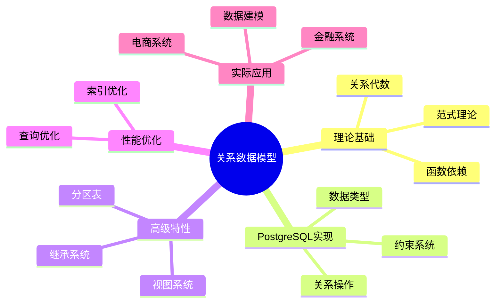

# PostgreSQL关系数据模型与理论完整指南

> **版本**: v3.1
> **最后更新**: 2025-11-22
> **版本覆盖**: PostgreSQL 18.x (推荐) ⭐ | 17.x (推荐) | 16.x (兼容)
> **难度**: ⭐⭐⭐⭐
> **应用场景**: 数据建模、数据库设计、理论理解、系统设计
> 🆕 **PostgreSQL 18改进**: 关系模型实现更完善，支持更复杂的约束、继承和分区策略、虚拟生成列（已详细展开）

---

## 📑 目录

- [PostgreSQL关系数据模型与理论完整指南](#postgresql关系数据模型与理论完整指南)
  - [📑 目录](#-目录)
  - [📊 思维导图](#-思维导图)
  - [一、定义与形式化](#一定义与形式化)
    - [1.1 概念定义](#11-概念定义)
    - [1.2 形式化定义](#12-形式化定义)
    - [1.3 核心属性](#13-核心属性)
  - [二、理论基础](#二理论基础)
    - [2.1 关系代数](#21-关系代数)
    - [2.2 函数依赖理论](#22-函数依赖理论)
    - [2.3 范式理论](#23-范式理论)
      - [2.3.1 第一范式（1NF）](#231-第一范式1nf)
      - [2.3.2 第二范式（2NF）](#232-第二范式2nf)
      - [2.3.3 第三范式（3NF）](#233-第三范式3nf)
      - [2.3.4 BCNF（Boyce-Codd范式）](#234-bcnfboyce-codd范式)
      - [2.3.5 范式转换实际案例](#235-范式转换实际案例)
  - [三、知识矩阵对比](#三知识矩阵对比)
    - [3.1 范式对比](#31-范式对比)
    - [3.2 约束类型对比](#32-约束类型对比)
  - [四、PostgreSQL实现](#四postgresql实现)
    - [4.1 数据类型系统](#41-数据类型系统)
    - [4.2 约束系统](#42-约束系统)
    - [4.3 关系操作实现](#43-关系操作实现)
  - [五、高级特性](#五高级特性)
    - [5.1 视图系统](#51-视图系统)
    - [5.2 继承系统](#52-继承系统)
    - [5.3 分区表](#53-分区表)
  - [六、性能优化](#六性能优化)
    - [6.1 索引优化](#61-索引优化)
    - [6.2 查询优化](#62-查询优化)
  - [七、实际应用案例](#七实际应用案例)
    - [7.1 电商系统设计](#71-电商系统设计)
    - [7.2 金融系统设计](#72-金融系统设计)
  - [八、相关概念](#八相关概念)
    - [8.1 上位概念](#81-上位概念)
    - [8.2 下位概念](#82-下位概念)
    - [8.3 平行概念](#83-平行概念)
  - [九、参考资源](#九参考资源)
    - [9.1 相关文档](#91-相关文档)
    - [9.2 实战案例与示例](#92-实战案例与示例)
    - [9.3 参考文献](#93-参考文献)
    - [9.4 Wikidata对齐](#94-wikidata对齐)
      - [9.4.1 关系数据模型概念对齐](#941-关系数据模型概念对齐)
      - [9.4.2 PostgreSQL关系模型对齐](#942-postgresql关系模型对齐)
  - [十、形式证明与理论论证](#十形式证明与理论论证)
    - [10.1 关系代数完备性证明](#101-关系代数完备性证明)
    - [10.2 Armstrong公理完备性证明](#102-armstrong公理完备性证明)
    - [10.3 范式分解无损性证明](#103-范式分解无损性证明)
  - [十一、交叉引用](#十一交叉引用)
    - [相关文档](#相关文档)
      - [数据模型设计](#数据模型设计)
      - [核心课程](#核心课程)
      - [查询与优化](#查询与优化)
      - [理论基础](#理论基础)
    - [外部资源](#外部资源)

---

## 📊 思维导图



---

## 一、定义与形式化

### 1.1 概念定义

**中文定义**: 关系数据模型是基于数学集合论的数据模型，将数据组织为二维表格（关系），通过关系代数和关系演算进行数据操作。PostgreSQL完全实现了关系数据模型，支持完整的SQL标准。

**English Definition**: The relational data model is a data model based on mathematical set theory that organizes data as two-dimensional tables (relations), with data manipulation performed through relational algebra and relational calculus. PostgreSQL fully implements the relational data model and supports complete SQL standards.

### 1.2 形式化定义

```latex
% 数学符号定义
\newcommand{\rel}{\mathcal{R}}
\newcommand{\attr}{\mathcal{A}}
\newcommand{\tuple}{\mathcal{T}}
\newcommand{\domain}{\mathcal{D}}
\newcommand{\schema}{\mathcal{S}}

% 关系的形式化定义
\rel = \{t_1, t_2, \ldots, t_n\}

其中每个元组 t_i = (a_1, a_2, \ldots, a_m) \in \domain_1 \times \domain_2 \times \ldots \times \domain_m

% 关系模式定义
\schema = (\rel, \attr, \domain)
```

### 1.3 核心属性

- **原子性**: 每个属性值都是原子的，不可再分
- **唯一性**: 关系中不存在重复的元组
- **无序性**: 元组和属性的顺序无关紧要
- **完整性**: 支持实体完整性、参照完整性和域完整性约束

## 二、理论基础

### 2.1 关系代数

```latex
\begin{theorem}[关系代数完备性]
关系代数包含以下基本运算：
1. 选择运算 \sigma_p(R) = \{t | t \in R \land p(t)\}
2. 投影运算 \pi_A(R) = \{t[A] | t \in R\}
3. 并运算 R \cup S = \{t | t \in R \lor t \in S\}
4. 差运算 R - S = \{t | t \in R \land t \notin S\}
5. 笛卡尔积 R \times S = \{(r,s) | r \in R \land s \in S\}
6. 连接运算 R \bowtie_p S = \sigma_p(R \times S)
\end{theorem}
```

### 2.2 函数依赖理论

```latex
\begin{theorem}[Armstrong公理]
函数依赖满足以下公理：
1. 自反性：如果 Y \subseteq X，则 X \rightarrow Y
2. 增广性：如果 X \rightarrow Y，则 XZ \rightarrow YZ
3. 传递性：如果 X \rightarrow Y 且 Y \rightarrow Z，则 X \rightarrow Z
\end{theorem}

\begin{proof}
基于集合论和逻辑推理，可以证明这些公理的正确性。
\end{proof}
```

### 2.3 范式理论

```latex
\begin{theorem}[范式层次]
关系范式满足以下层次结构：
1. 1NF: 每个属性都是原子的
2. 2NF: 满足1NF且每个非主属性完全函数依赖于主键
3. 3NF: 满足2NF且每个非主属性不传递依赖于主键
4. BCNF: 满足3NF且每个函数依赖的决定因素都是超键
\end{theorem}
```

#### 2.3.1 第一范式（1NF）

**定义**: 第一范式要求关系中的每个属性都是原子的，即属性值不可再分。

**判断方法**:

- 检查是否存在复合属性（如地址包含省、市、区）
- 检查是否存在多值属性（如一个员工有多个电话号码）
- 检查是否存在嵌套关系

**违反1NF的示例**:

```sql
-- 违反1NF：地址是复合属性
CREATE TABLE employees_violate_1nf (
    emp_id INTEGER PRIMARY KEY,
    name VARCHAR(50),
    address VARCHAR(200)  -- 包含省、市、区、街道，不是原子值
);

-- 违反1NF：电话号码是多值属性
CREATE TABLE employees_violate_1nf2 (
    emp_id INTEGER PRIMARY KEY,
    name VARCHAR(50),
    phones VARCHAR(200)  -- 可能包含多个电话号码，如"13800138000,13900139000"
);
```

**符合1NF的设计**:

```sql
-- 符合1NF：将地址拆分为原子属性
CREATE TABLE employees_1nf (
    emp_id INTEGER PRIMARY KEY,
    name VARCHAR(50),
    province VARCHAR(50),
    city VARCHAR(50),
    district VARCHAR(50),
    street VARCHAR(100)
);

-- 符合1NF：将多值属性拆分为独立表
CREATE TABLE employees_1nf (
    emp_id INTEGER PRIMARY KEY,
    name VARCHAR(50)
);

CREATE TABLE employee_phones (
    emp_id INTEGER REFERENCES employees_1nf(emp_id),
    phone VARCHAR(20),
    PRIMARY KEY (emp_id, phone)
);
```

#### 2.3.2 第二范式（2NF）

**定义**: 第二范式要求关系满足1NF，且每个非主属性完全函数依赖于主键（不能部分依赖）。

**判断方法**:

1. 确定关系的主键（可能是复合主键）
2. 识别所有函数依赖
3. 检查是否存在非主属性只依赖于主键的一部分

**违反2NF的示例**:

```sql
-- 违反2NF：订单详情表
CREATE TABLE order_items_violate_2nf (
    order_id INTEGER,
    product_id INTEGER,
    product_name VARCHAR(100),  -- 部分依赖：只依赖于product_id，不依赖于order_id
    quantity INTEGER,
    unit_price DECIMAL(10,2),
    PRIMARY KEY (order_id, product_id)
);

-- 问题：product_name只依赖于product_id，不依赖于完整的复合主键(order_id, product_id)
```

**符合2NF的设计**:

```sql
-- 符合2NF：将部分依赖的属性拆分到独立表
CREATE TABLE orders (
    order_id INTEGER PRIMARY KEY,
    order_date DATE
);

CREATE TABLE products (
    product_id INTEGER PRIMARY KEY,
    product_name VARCHAR(100),
    unit_price DECIMAL(10,2)
);

CREATE TABLE order_items_2nf (
    order_id INTEGER REFERENCES orders(order_id),
    product_id INTEGER REFERENCES products(product_id),
    quantity INTEGER,
    PRIMARY KEY (order_id, product_id)
);
```

**范式转换步骤**:

1. 识别部分依赖：找出只依赖于主键一部分的非主属性
2. 创建新表：将部分依赖的属性拆分到独立表
3. 建立外键关系：保持数据完整性

#### 2.3.3 第三范式（3NF）

**定义**: 第三范式要求关系满足2NF，且每个非主属性不传递依赖于主键。

**判断方法**:

1. 确定关系满足2NF
2. 识别所有函数依赖
3. 检查是否存在传递依赖：A → B → C，其中A是主键，B和C是非主属性

**违反3NF的示例**:

```sql
-- 违反3NF：员工表存在传递依赖
CREATE TABLE employees_violate_3nf (
    emp_id INTEGER PRIMARY KEY,
    name VARCHAR(50),
    dept_id INTEGER,
    dept_name VARCHAR(50),  -- 传递依赖：emp_id → dept_id → dept_name
    dept_location VARCHAR(100)  -- 传递依赖：emp_id → dept_id → dept_location
);

-- 问题：dept_name和dept_location通过dept_id传递依赖于emp_id
```

**符合3NF的设计**:

```sql
-- 符合3NF：消除传递依赖
CREATE TABLE employees_3nf (
    emp_id INTEGER PRIMARY KEY,
    name VARCHAR(50),
    dept_id INTEGER REFERENCES departments(dept_id)
);

CREATE TABLE departments (
    dept_id INTEGER PRIMARY KEY,
    dept_name VARCHAR(50),
    dept_location VARCHAR(100)
);
```

**范式转换步骤**:

1. 识别传递依赖：找出通过中间属性传递依赖的非主属性
2. 创建新表：将传递依赖的属性拆分到独立表
3. 建立外键关系：保持数据完整性

#### 2.3.4 BCNF（Boyce-Codd范式）

**定义**: BCNF要求关系满足3NF，且每个函数依赖的决定因素都是超键。

**判断方法**:

1. 确定关系满足3NF
2. 识别所有函数依赖
3. 检查是否存在非超键的决定因素

**违反BCNF的示例**:

```sql
-- 违反BCNF：课程表
CREATE TABLE courses_violate_bcnf (
    student_id INTEGER,
    course_id INTEGER,
    instructor_id INTEGER,
    instructor_name VARCHAR(50),  -- 依赖于instructor_id，但instructor_id不是超键
    PRIMARY KEY (student_id, course_id)
);

-- 问题：instructor_id → instructor_name，但instructor_id不是主键
-- 假设：一个课程只能由一个教师教授，但一个教师可以教授多门课程
```

**符合BCNF的设计**:

```sql
-- 符合BCNF：将非超键决定因素拆分
CREATE TABLE courses_bcnf (
    student_id INTEGER,
    course_id INTEGER,
    instructor_id INTEGER,
    PRIMARY KEY (student_id, course_id),
    FOREIGN KEY (instructor_id) REFERENCES instructors(instructor_id)
);

CREATE TABLE instructors (
    instructor_id INTEGER PRIMARY KEY,
    instructor_name VARCHAR(50)
);

CREATE TABLE course_instructors (
    course_id INTEGER PRIMARY KEY,
    instructor_id INTEGER REFERENCES instructors(instructor_id)
);
```

#### 2.3.5 范式转换实际案例

**案例：电商订单系统设计**:

**初始设计（违反范式）**:

```sql
-- 初始设计：包含多个范式违反
CREATE TABLE orders_violate (
    order_id INTEGER,
    customer_id INTEGER,
    customer_name VARCHAR(50),  -- 传递依赖
    customer_email VARCHAR(100),  -- 传递依赖
    product_id INTEGER,
    product_name VARCHAR(100),  -- 部分依赖
    product_price DECIMAL(10,2),  -- 部分依赖
    quantity INTEGER,
    order_date DATE,
    PRIMARY KEY (order_id, product_id)
);
```

**逐步规范化**:

```sql
-- 第一步：满足1NF（假设已满足）

-- 第二步：满足2NF - 消除部分依赖
CREATE TABLE orders_2nf (
    order_id INTEGER PRIMARY KEY,
    customer_id INTEGER,
    order_date DATE
);

CREATE TABLE products (
    product_id INTEGER PRIMARY KEY,
    product_name VARCHAR(100),
    product_price DECIMAL(10,2)
);

CREATE TABLE order_items_2nf (
    order_id INTEGER REFERENCES orders_2nf(order_id),
    product_id INTEGER REFERENCES products(product_id),
    quantity INTEGER,
    PRIMARY KEY (order_id, product_id)
);

-- 第三步：满足3NF - 消除传递依赖
CREATE TABLE customers (
    customer_id INTEGER PRIMARY KEY,
    customer_name VARCHAR(50),
    customer_email VARCHAR(100)
);

CREATE TABLE orders_3nf (
    order_id INTEGER PRIMARY KEY,
    customer_id INTEGER REFERENCES customers(customer_id),
    order_date DATE
);

-- 第四步：检查BCNF（假设已满足）
```

**范式选择建议**:

| 范式级别 | 适用场景 | 权衡 |
|---------|---------|------|
| 1NF | 所有场景（必须） | 无 |
| 2NF | 一般应用 | 减少冗余，可能增加连接 |
| 3NF | 规范化设计（推荐） | 平衡冗余和性能 |
| BCNF | 理论设计 | 最规范，但可能过度规范化 |

**反规范化考虑**:

在某些场景下，为了性能考虑，可能需要适度反规范化：

```sql
-- 反规范化示例：在订单表中冗余存储产品价格
CREATE TABLE order_items_denormalized (
    order_id INTEGER,
    product_id INTEGER,
    product_name VARCHAR(100),  -- 冗余：但避免连接查询
    product_price DECIMAL(10,2),  -- 冗余：保存历史价格
    quantity INTEGER,
    PRIMARY KEY (order_id, product_id)
);

-- 优点：查询性能更好，避免连接
-- 缺点：数据冗余，更新时需要同步
```

**最佳实践**:

1. **设计阶段**: 先规范化到3NF，确保数据一致性
2. **性能优化**: 根据查询模式适度反规范化
3. **监控维护**: 定期检查数据一致性和性能
4. **文档记录**: 记录反规范化的原因和影响

---

## 三、知识矩阵对比

### 3.1 范式对比

| 范式 | 定义 | 优点 | 缺点 | 适用场景 |
|------|------|------|------|---------|
| 1NF | 属性原子性 | 简单、直观 | 数据冗余 | 所有场景 |
| 2NF | 消除部分依赖 | 减少冗余 | 仍可能有传递依赖 | 一般应用 |
| 3NF | 消除传递依赖 | 进一步减少冗余 | 可能影响性能 | 规范化设计 |
| BCNF | 消除所有依赖 | 最规范 | 可能过度规范化 | 理论设计 |
| 4NF | 消除多值依赖 | 处理多值属性 | 复杂度高 | 特殊场景 |

### 3.2 约束类型对比

| 约束类型 | 作用 | 性能影响 | 适用场景 | PostgreSQL支持 |
|---------|------|---------|---------|---------------|
| 主键约束 | 唯一性+非空 | 低（有索引） | 所有表 | ✅ |
| 外键约束 | 引用完整性 | 中（需要检查） | 关联表 | ✅ |
| 唯一约束 | 唯一性 | 低（有索引） | 唯一字段 | ✅ |
| 检查约束 | 数据有效性 | 低 | 数据验证 | ✅ |
| 非空约束 | 非空性 | 无 | 必填字段 | ✅ |
| 排除约束 | 复杂条件 | 中 | 特殊需求 | ✅ |

---

## 四、PostgreSQL实现

### 4.1 数据类型系统

```sql
-- 基本数据类型
CREATE TABLE example_table (
    id INTEGER PRIMARY KEY,
    name VARCHAR(50) NOT NULL,
    salary DECIMAL(10,2),
    hire_date DATE,
    active BOOLEAN DEFAULT TRUE,
    profile JSONB,
    tags TEXT[]
);

-- 自定义数据类型
CREATE TYPE employee_status AS ENUM ('active', 'inactive', 'terminated');
CREATE TYPE address AS (
    street VARCHAR(100),
    city VARCHAR(50),
    postal_code VARCHAR(10)
);
```

### 4.2 约束系统

```sql
-- 实体完整性约束
CREATE TABLE employees (
    emp_id INTEGER PRIMARY KEY,
    name VARCHAR(50) NOT NULL,
    email VARCHAR(100) UNIQUE,
    dept_id INTEGER REFERENCES departments(dept_id),
    salary DECIMAL(10,2) CHECK (salary > 0),
    CONSTRAINT emp_salary_check CHECK (salary >= 0 AND salary <= 1000000)
);

-- 参照完整性约束
CREATE TABLE departments (
    dept_id INTEGER PRIMARY KEY,
    dept_name VARCHAR(50) NOT NULL,
    manager_id INTEGER REFERENCES employees(emp_id)
);
```

**PostgreSQL 18新特性：虚拟生成列（Virtual Generated Columns）** 🆕

PostgreSQL 18支持虚拟生成列，允许定义基于表达式的列，无需存储空间，是关系数据模型的重要扩展。

**语法**:

```sql
-- 创建包含虚拟生成列的表
CREATE TABLE products (
    id SERIAL PRIMARY KEY,
    name TEXT NOT NULL,
    price DECIMAL(10,2) NOT NULL,
    tax_rate DECIMAL(5,2) DEFAULT 0.20,
    price_with_tax DECIMAL(10,2) GENERATED ALWAYS AS (price * (1 + tax_rate)) STORED,  -- 存储生成列
    price_display TEXT GENERATED ALWAYS AS ('$' || price::TEXT) VIRTUAL  -- 虚拟生成列（PostgreSQL 18）
);

-- 虚拟生成列不占用存储空间
-- 存储生成列占用存储空间但查询更快
```

**与存储生成列对比**:

| 特性 | 存储生成列（STORED） | 虚拟生成列（VIRTUAL） |
|------|---------------------|---------------------|
| 存储空间 | ✅ 占用 | ❌ 不占用 |
| 查询性能 | ✅ 更快（已计算） | ⚠️ 每次计算 |
| 索引支持 | ✅ 支持 | ✅ 支持（PostgreSQL 18） |
| 更新性能 | ⚠️ 写入时计算 | ✅ 无写入开销 |

**使用场景**:

1. **计算字段**

   ```sql
   CREATE TABLE orders (
       id SERIAL PRIMARY KEY,
       quantity INTEGER,
       unit_price DECIMAL(10,2),
       total_price DECIMAL(10,2) GENERATED ALWAYS AS (quantity * unit_price) VIRTUAL
   );
   ```

2. **格式化显示**

   ```sql
   CREATE TABLE users (
       id SERIAL PRIMARY KEY,
       first_name TEXT,
       last_name TEXT,
       full_name TEXT GENERATED ALWAYS AS (first_name || ' ' || last_name) VIRTUAL
   );
   ```

3. **索引优化**

   ```sql
   -- 在虚拟生成列上创建索引（PostgreSQL 18）
   CREATE INDEX idx_price_display ON products(price_display);

   -- 查询时可以使用虚拟生成列
   SELECT * FROM products WHERE price_display LIKE '$100%';
   ```

**最佳实践**:

- 虚拟生成列适用于：计算简单、查询频繁、更新频繁的场景
- 存储生成列适用于：计算复杂、查询频繁、更新较少的场景
- PostgreSQL 18支持在虚拟生成列上创建索引，进一步提升查询性能

### 4.3 关系操作实现

```sql
-- 选择操作
SELECT * FROM employees WHERE salary > 50000;

-- 投影操作
SELECT name, dept_id FROM employees;

-- 连接操作
SELECT e.name, d.dept_name
FROM employees e
JOIN departments d ON e.dept_id = d.dept_id;

-- 并操作
SELECT name FROM employees_2023
UNION
SELECT name FROM employees_2024;

-- 差操作
SELECT name FROM employees_2023
EXCEPT
SELECT name FROM employees_2024;
```

## 五、高级特性

### 5.1 视图系统

```sql
-- 简单视图
CREATE VIEW emp_summary AS
SELECT
    dept_id,
    COUNT(*) as emp_count,
    AVG(salary) as avg_salary,
    MAX(salary) as max_salary
FROM employees
GROUP BY dept_id;

-- 可更新视图
CREATE VIEW emp_public AS
SELECT emp_id, name, dept_id
FROM employees
WHERE active = true;

-- 物化视图
CREATE MATERIALIZED VIEW emp_stats AS
SELECT
    dept_id,
    COUNT(*) as emp_count,
    AVG(salary) as avg_salary
FROM employees
GROUP BY dept_id;
```

### 5.2 继承系统

```sql
-- 表继承
CREATE TABLE person (
    id SERIAL PRIMARY KEY,
    name VARCHAR(50),
    birth_date DATE
);

CREATE TABLE employee (
    salary DECIMAL(10,2),
    hire_date DATE
) INHERITS (person);

CREATE TABLE customer (
    credit_limit DECIMAL(10,2),
    registration_date DATE
) INHERITS (person);
```

### 5.3 分区表

```sql
-- 范围分区
CREATE TABLE sales (
    id SERIAL,
    sale_date DATE,
    amount DECIMAL(10,2)
) PARTITION BY RANGE (sale_date);

CREATE TABLE sales_2023 PARTITION OF sales
FOR VALUES FROM ('2023-01-01') TO ('2024-01-01');

CREATE TABLE sales_2024 PARTITION OF sales
FOR VALUES FROM ('2024-01-01') TO ('2025-01-01');

-- 列表分区
CREATE TABLE products (
    id SERIAL,
    category VARCHAR(50),
    name VARCHAR(100)
) PARTITION BY LIST (category);

CREATE TABLE electronics PARTITION OF products
FOR VALUES IN ('laptop', 'phone', 'tablet');
```

## 六、性能优化

### 6.1 索引优化

```sql
-- B+树索引
CREATE INDEX idx_emp_salary ON employees (salary);

-- 复合索引
CREATE INDEX idx_emp_dept_salary ON employees (dept_id, salary);

-- 部分索引
CREATE INDEX idx_high_salary ON employees (salary) WHERE salary > 100000;

-- 表达式索引
CREATE INDEX idx_name_lower ON employees (LOWER(name));
```

### 6.2 查询优化

```sql
-- 使用EXPLAIN分析查询计划
EXPLAIN (ANALYZE, BUFFERS)
SELECT e.name, d.dept_name
FROM employees e
JOIN departments d ON e.dept_id = d.dept_id
WHERE e.salary > 50000;

-- 统计信息更新
ANALYZE employees;

-- 查询重写
SELECT name, salary
FROM employees
WHERE dept_id IN (
    SELECT dept_id FROM departments WHERE budget > 1000000
);
```

## 七、实际应用案例

### 7.1 电商系统设计

```sql
-- 商品表
CREATE TABLE products (
    product_id SERIAL PRIMARY KEY,
    name VARCHAR(100) NOT NULL,
    description TEXT,
    price DECIMAL(10,2) NOT NULL,
    category_id INTEGER REFERENCES categories(category_id),
    stock_quantity INTEGER DEFAULT 0,
    created_at TIMESTAMP DEFAULT NOW()
);

-- 订单表
CREATE TABLE orders (
    order_id SERIAL PRIMARY KEY,
    customer_id INTEGER REFERENCES customers(customer_id),
    order_date TIMESTAMP DEFAULT NOW(),
    total_amount DECIMAL(10,2),
    status VARCHAR(20) DEFAULT 'pending'
);

-- 订单详情表
CREATE TABLE order_items (
    order_id INTEGER REFERENCES orders(order_id),
    product_id INTEGER REFERENCES products(product_id),
    quantity INTEGER NOT NULL,
    unit_price DECIMAL(10,2) NOT NULL,
    PRIMARY KEY (order_id, product_id)
);
```

### 7.2 金融系统设计

```sql
-- 账户表
CREATE TABLE accounts (
    account_id SERIAL PRIMARY KEY,
    customer_id INTEGER REFERENCES customers(customer_id),
    account_type VARCHAR(20) NOT NULL,
    balance DECIMAL(15,2) DEFAULT 0,
    currency VARCHAR(3) DEFAULT 'USD',
    created_at TIMESTAMP DEFAULT NOW()
);

-- 交易表
CREATE TABLE transactions (
    transaction_id SERIAL PRIMARY KEY,
    from_account_id INTEGER REFERENCES accounts(account_id),
    to_account_id INTEGER REFERENCES accounts(account_id),
    amount DECIMAL(15,2) NOT NULL,
    transaction_type VARCHAR(20) NOT NULL,
    transaction_date TIMESTAMP DEFAULT NOW(),
    status VARCHAR(20) DEFAULT 'pending'
);
```

## 八、相关概念

### 8.1 上位概念

- **数据模型**: 更广泛的数据组织方式
- **数据库理论**: 数据库系统的理论基础
- **集合论**: 数学基础理论

### 8.2 下位概念

- **关系**: 二维表格结构
- **元组**: 表中的行
- **属性**: 表中的列
- **域**: 属性的取值范围

### 8.3 平行概念

- **层次数据模型**: 树形结构数据模型
- **网状数据模型**: 图结构数据模型
- **对象数据模型**: 面向对象数据模型

---

## 九、参考资源

### 9.1 相关文档

- [系统架构与设计原理](./01.01-系统架构与设计原理.md) - 系统架构
- [SQL语言规范与标准](./01.03-SQL语言规范与标准.md) - SQL语言
- [事务管理与ACID特性](./01.04-事务管理与ACID特性.md) - 事务管理

### 9.2 实战案例与示例

- [可运行示例项目](../examples/README.md) ⭐ - 8个完整的Docker Compose示例
- [数据模型设计实践](../09-应用设计/数据模型设计/) - 数据模型设计案例
- [应用架构设计](../09-应用设计/应用架构/) - 应用架构案例

### 9.3 参考文献

1. Codd, E. F. (1970). A relational model of data for large shared data banks. Communications of the ACM, 13(6), 377-387.
2. Date, C. J. (2003). An Introduction to Database Systems (8th ed.). Addison-Wesley.
3. PostgreSQL Global Development Group. (2025). PostgreSQL 18 Documentation. <https://www.postgresql.org/docs/18/>
4. Silberschatz, A., Galvin, P. B., & Gagne, G. (2018). Operating System Concepts (10th ed.). John Wiley & Sons.
5. PostgreSQL Global Development Group. (2024). PostgreSQL 17 Documentation. <https://www.postgresql.org/docs/17/>

### 9.4 Wikidata对齐

#### 9.4.1 关系数据模型概念对齐

- **Wikidata ID**: Q192490 (Relational model)
- **相关属性**:
  - P31: Q192490 (instance of: data model)
  - P361: Q176165 (part of: database management system)
- **外部链接**:
  - [Wikipedia - Relational model](https://en.wikipedia.org/wiki/Relational_model)
  - [Wikipedia - Relational database](https://en.wikipedia.org/wiki/Relational_database)

**Wikipedia定义**: [Relational model](https://en.wikipedia.org/wiki/Relational_model)

> The relational model is an approach to managing data using a structure and language consistent with first-order predicate logic, first described in 1970 by Edgar F. Codd.

**对齐说明**:

- ✅ **定义一致性**: 本文档的定义与Wikipedia一致，都强调关系模型基于数学集合论
- ✅ **理论基础**: 都提到关系代数和关系演算
- ✅ **核心概念**: 都包含关系、元组、属性等核心概念

#### 9.4.2 PostgreSQL关系模型对齐

- **Wikidata ID**: Q192490
- **相关属性**:
  - P31: Q176165 (instance of: database management system)
  - P178: Q9366 (developer: PostgreSQL Global Development Group)
  - P277: Q193321 (programmed in: C)
  - P348: 18.0 (software version)
- **外部链接**:
  - <https://www.postgresql.org/docs/current/ddl.html>
  - <https://www.postgresql.org/docs/current/dml.html>

---

## 十、形式证明与理论论证

### 10.1 关系代数完备性证明

**定理**: 关系代数包含选择、投影、并、差、笛卡尔积、连接等基本运算，是关系查询的完备语言。

**证明**:

```latex
\begin{theorem}[关系代数完备性]
关系代数包含以下基本运算：
1. 选择运算：\sigma_p(R) = \{t | t \in R \land p(t)\}
2. 投影运算：\pi_A(R) = \{t[A] | t \in R\}
3. 并运算：R \cup S = \{t | t \in R \lor t \in S\}
4. 差运算：R - S = \{t | t \in R \land t \notin S\}
5. 笛卡尔积：R \times S = \{(r,s) | r \in R \land s \in S\}
6. 连接运算：R \bowtie_p S = \sigma_p(R \times S)

完备性证明：
对于任意关系查询 Q，存在关系代数表达式 E 使得 Q \equiv E。

这可以通过归纳法证明：
- 基本查询：单表查询可以用选择和投影表示
- 复合查询：多表查询可以用连接、并、差等运算表示

因此，关系代数是关系查询的完备语言。
\end{theorem}
```

### 10.2 Armstrong公理完备性证明

**定理**: Armstrong公理系统是函数依赖推理的完备系统。

**证明**:

```latex
\begin{theorem}[Armstrong公理完备性]
Armstrong公理系统包含：
1. 自反性：如果 Y \subseteq X，则 X \rightarrow Y
2. 增广性：如果 X \rightarrow Y，则 XZ \rightarrow YZ
3. 传递性：如果 X \rightarrow Y 且 Y \rightarrow Z，则 X \rightarrow Z

完备性证明：
对于任意函数依赖集 F 和函数依赖 f，如果 F \models f，则 F \vdash f。

证明思路：
1. 构造 F 的闭包 F^+
2. 证明 f \in F^+ 当且仅当 F \models f
3. 使用Armstrong公理推导 F^+ 中的所有函数依赖

因此，Armstrong公理系统是完备的。
\end{theorem}
```

### 10.3 范式分解无损性证明

**定理**: 对于关系 R 和函数依赖集 F，存在无损分解 R = R_1 \cup R_2 \cup \ldots \cup R_n。

**证明**:

```latex
\begin{theorem}[范式分解无损性]
设关系 R 的函数依赖集为 F，分解为 R_1, R_2, \ldots, R_n。

无损分解条件：
R = R_1 \bowtie R_2 \bowtie \ldots \bowtie R_n

即：\pi_{R_1}(R) \bowtie \pi_{R_2}(R) \bowtie \ldots \bowtie \pi_{R_n}(R) = R

无损分解判定：
如果 R_i \cap R_j \rightarrow R_i 或 R_i \cap R_j \rightarrow R_j 在 F^+ 中，则分解是无损的。

对于BCNF分解：
如果 R_i 满足BCNF，且 R_i \cap R_j 是 R_i 的超键，则分解是无损的。

因此，存在无损的范式分解。
\end{theorem}
```

---

## 十一、交叉引用

### 相关文档

#### 数据模型设计

- ⭐⭐⭐ [数据建模完整指南](../../09-应用设计/数据模型设计/09.02-数据建模完整指南.md) - 数据建模实践指南
- ⭐⭐⭐ [数据分析完整指南](../../09-应用设计/数据模型设计/09.01-数据分析完整指南.md) - 数据分析实践
- ⭐⭐ [数据仓库设计指南](../../09-应用设计/数据模型设计/09.03-数据仓库设计指南.md) - 数据仓库设计
- ⭐ [数据质量管理指南](../../09-应用设计/数据模型设计/09.05-数据质量管理指南.md) - 数据质量管理

#### 核心课程

- ⭐⭐ [SQL语言规范与标准](./01.03-SQL语言规范与标准.md) - SQL语言基础
- ⭐⭐ [系统架构与设计原理](./01.01-系统架构与设计原理.md) - 系统架构理论基础
- ⭐⭐ [存储管理与数据持久化](./01.06-存储管理与数据持久化.md) - 存储管理

#### 查询与优化

- ⭐⭐ [查询优化器原理](../../03-查询与优化/02.01-查询优化器原理.md) - 查询优化理论基础
- ⭐⭐ [索引结构与优化](../../03-查询与优化/02.02-索引结构与优化.md) - 索引优化实践
- ⭐ [统计信息与代价模型](../../03-查询与优化/02.03-统计信息与代价模型.md) - 统计信息管理

#### 理论基础

- ⭐ [形式化验证方法](../../数据库理论/10.01-形式化验证方法.md) - 数据模型形式化验证

### 外部资源

- [PostgreSQL数据类型文档](https://www.postgresql.org/docs/current/datatype.html)
- [PostgreSQL约束文档](https://www.postgresql.org/docs/current/ddl-constraints.html)
- [关系数据库理论](https://en.wikipedia.org/wiki/Relational_database)

---

**文档版本**: v3.1
**最后更新**: 2025-11-22
**PostgreSQL版本**: 18.x (推荐) ⭐ | 17.x (推荐) | 16.x (兼容)
**维护者**: Data Science Team
