# PostgreSQL并发控制与MVCC机制完整指南

> **版本**: v3.1
> **最后更新**: 2025-11-22
> **版本覆盖**: PostgreSQL 18.x (推荐) ⭐ | 17.x (推荐) | 16.x (兼容)
> **难度**: ⭐⭐⭐⭐
> **应用场景**: 并发控制、MVCC、锁机制、性能优化、高并发系统设计
> 🆕 **PostgreSQL 18 MVCC改进**: 更高效的VACUUM（已详细展开）、更好的死锁检测（已详细展开）、逻辑复制性能提升38%、异步I/O提升并发性能（已详细展开）

---

## 📑 目录

- [PostgreSQL并发控制与MVCC机制完整指南](#postgresql并发控制与mvcc机制完整指南)
  - [📑 目录](#-目录)
  - [📊 思维导图](#-思维导图)
  - [一、定义与形式化](#一定义与形式化)
    - [1.1 概念定义](#11-概念定义)
    - [1.2 形式化定义](#12-形式化定义)
    - [1.3 核心属性](#13-核心属性)
  - [二、知识矩阵对比](#二知识矩阵对比)
    - [2.1 并发控制机制对比](#21-并发控制机制对比)
    - [2.2 锁类型对比](#22-锁类型对比)
  - [三、理论基础](#三理论基础)
    - [3.1 锁机制理论](#31-锁机制理论)
    - [3.2 MVCC理论](#32-mvcc理论)
    - [3.3 可串行化理论](#33-可串行化理论)
  - [四、PostgreSQL MVCC实现](#四postgresql-mvcc实现)
    - [4.1 行版本管理](#41-行版本管理)
    - [4.2 事务快照](#42-事务快照)
    - [4.3 版本清理机制](#43-版本清理机制)
      - [4.1.1 行版本元数据详解](#411-行版本元数据详解)
      - [4.1.2 版本可见性规则详解](#412-版本可见性规则详解)
      - [4.2.1 事务快照详解](#421-事务快照详解)
      - [4.3.1 版本清理机制详解](#431-版本清理机制详解)
      - [4.3.2 版本管理实际应用](#432-版本管理实际应用)
  - [五、锁机制实现](#五锁机制实现)
    - [5.1 锁类型和模式](#51-锁类型和模式)
    - [5.2 锁监控](#52-锁监控)
    - [5.3 死锁检测和处理](#53-死锁检测和处理)
  - [六、隔离级别实现](#六隔离级别实现)
    - [6.1 隔离级别配置](#61-隔离级别配置)
    - [6.2 隔离级别测试](#62-隔离级别测试)
  - [七、性能优化](#七性能优化)
    - [7.0 PostgreSQL 18 MVCC和VACUUM优化 🆕](#70-postgresql-18-mvcc和vacuum优化-)
    - [7.1 MVCC优化](#71-mvcc优化)
    - [7.2 锁优化](#72-锁优化)
  - [八、实际应用案例](#八实际应用案例)
    - [8.1 高并发订单系统](#81-高并发订单系统)
    - [8.2 实时数据更新](#82-实时数据更新)
  - [九、相关概念](#九相关概念)
    - [9.1 上位概念](#91-上位概念)
    - [9.2 下位概念](#92-下位概念)
    - [9.3 平行概念](#93-平行概念)
  - [十、参考资源](#十参考资源)
    - [10.1 相关文档](#101-相关文档)
    - [10.2 实战案例与示例](#102-实战案例与示例)
    - [10.3 参考文献](#103-参考文献)
    - [10.3 Wikidata对齐](#103-wikidata对齐)
  - [十一、交叉引用](#十一交叉引用)
    - [相关文档](#相关文档)
    - [外部资源](#外部资源)

---

## 📊 思维导图

```mermaid
mindmap
  root((并发控制))
    理论基础
      锁机制理论
      MVCC理论
      可串行化理论
    MVCC实现
      行版本管理
      事务快照
      版本清理
    锁机制
      锁类型
      锁监控
      死锁检测
    隔离级别
      配置
      测试
    性能优化
      MVCC优化
      锁优化
    实际应用
      高并发订单
      实时数据更新
```



---

## 一、定义与形式化

### 1.1 概念定义

**中文定义**: 并发控制是数据库系统中管理多个事务同时访问共享数据的机制，确保数据一致性和事务隔离性。PostgreSQL采用MVCC（多版本并发控制）机制实现高效的并发控制。

**English Definition**: Concurrency control is a mechanism in database systems that manages multiple transactions accessing shared data simultaneously, ensuring data consistency and transaction isolation. PostgreSQL uses MVCC (Multi-Version Concurrency Control) mechanism for efficient concurrency control.

### 1.2 形式化定义

```latex
% 数学符号定义
\newcommand{\lock}{\mathcal{L}}
\newcommand{\trans}{\mathcal{T}}
\newcommand{\resource}{\mathcal{R}}
\newcommand{\version}{\mathcal{V}}
\newcommand{\snapshot}{\mathcal{S}}

% 锁的形式化定义
\lock = \{l_1, l_2, \ldots, l_n\}

其中每个锁 l_i = (r_i, t_i, mode_i) 表示：
- r_i \in \resource: 被锁定的资源
- t_i \in \trans: 持有锁的事务
- mode_i \in \{S, X\}: 锁模式（共享/排他）

% MVCC的形式化定义
\version = \{v_1, v_2, \ldots, v_m\}

其中每个版本 v_i = (data_i, xmin_i, xmax_i) 表示：
- data_i: 版本数据
- xmin_i: 创建版本的事务ID
- xmax_i: 删除版本的事务ID
```

### 1.3 核心属性

- **隔离性**: 并发事务间相互隔离
- **一致性**: 保证数据完整性
- **死锁避免**: 防止死锁发生
- **性能优化**: 最大化并发度

---

## 二、知识矩阵对比

### 2.1 并发控制机制对比

| 并发控制机制 | 实现方式 | 优点 | 缺点 | 适用场景 |
|------------|---------|------|------|---------|
| 两阶段锁（2PL） | 锁机制 | 简单、可靠 | 死锁风险、性能较低 | 传统数据库 |
| MVCC | 多版本 | 高并发、无锁读 | 存储开销、版本清理 | PostgreSQL、Oracle |
| 时间戳排序 | 时间戳 | 无死锁 | 回滚开销大 | 研究系统 |
| 乐观并发控制 | 版本号 | 高并发读 | 冲突时回滚 | 读多写少场景 |

### 2.2 锁类型对比

| 锁类型 | 粒度 | 兼容性 | 性能影响 | 使用场景 |
|-------|------|--------|---------|---------|
| 表级锁 | 表 | 低 | 高 | DDL操作 |
| 行级锁 | 行 | 高 | 低 | DML操作 |
| 页级锁 | 页 | 中 | 中 | 较少使用 |
| 意向锁 | 表+行 | 中 | 中 | 锁升级 |

---

## 三、理论基础

### 3.1 锁机制理论

```latex
\begin{theorem}[两阶段加锁协议]
事务T满足两阶段加锁协议，当且仅当：
1. 增长阶段：T只能获得锁，不能释放锁
2. 收缩阶段：T只能释放锁，不能获得锁
\end{theorem}

\begin{proof}
基于锁的兼容性矩阵和事务状态转换，可以证明两阶段加锁协议的正确性。
\end{proof}
```

### 3.2 MVCC理论

```latex
\begin{theorem}[多版本并发控制]
MVCC通过以下机制实现并发控制：
1. 每个事务看到数据的一致性快照
2. 写操作创建新版本，不阻塞读操作
3. 垃圾回收机制清理过期版本
4. 版本可见性基于事务ID比较
\end{theorem}

\begin{proof}
基于事务ID的偏序关系和版本可见性规则，可以证明MVCC的正确性。
\end{proof}
```

### 3.3 可串行化理论

```latex
\begin{theorem}[可串行化判定]
调度S是可串行化的，当且仅当：
1. 冲突图是无环的
2. 存在拓扑排序
3. 拓扑排序对应串行调度
\end{theorem}
```

---

## 四、PostgreSQL MVCC实现

### 4.1 行版本管理

```sql
-- 查看行版本信息
SELECT
    ctid,
    xmin,
    xmax,
    cmin,
    cmax,
    *
FROM employees
WHERE emp_id = 1001;

-- 查看事务ID
SELECT txid_current();
SELECT txid_current_snapshot();

-- 查看版本可见性
SELECT
    xmin,
    xmax,
    CASE
        WHEN xmin = 0 THEN 'invalid'
        WHEN xmax != 0 THEN 'deleted'
        ELSE 'visible'
    END as status
FROM employees
WHERE emp_id = 1001;
```

### 4.2 事务快照

```sql
-- 创建事务快照
BEGIN TRANSACTION ISOLATION LEVEL REPEATABLE READ;
SELECT txid_current_snapshot();

-- 查看快照信息
SELECT
    txid_snapshot_xmin(txid_current_snapshot()) as xmin,
    txid_snapshot_xmax(txid_current_snapshot()) as xmax,
    txid_snapshot_xip(txid_current_snapshot()) as active_xids;

-- 快照隔离示例
BEGIN TRANSACTION ISOLATION LEVEL REPEATABLE READ;
SELECT * FROM employees WHERE dept_id = 1;
-- 在另一个会话中插入数据
SELECT * FROM employees WHERE dept_id = 1; -- 仍然看到相同结果
COMMIT;
```

### 4.3 版本清理机制

```sql
-- 查看VACUUM统计信息
SELECT * FROM pg_stat_user_tables;

-- 手动VACUUM
VACUUM employees;
VACUUM ANALYZE employees;

-- 查看死元组
SELECT
    schemaname,
    tablename,
    n_dead_tup,
    n_live_tup,
    last_vacuum,
    last_autovacuum
FROM pg_stat_user_tables
WHERE n_dead_tup > 0;
```

#### 4.1.1 行版本元数据详解

**行版本字段说明**:

| 字段 | 说明 | 示例 |
|------|------|------|
| `ctid` | 行的物理位置（页面号+行号） | `(0,1)` |
| `xmin` | 创建该版本的事务ID | `12345` |
| `xmax` | 删除该版本的事务ID（0表示未删除） | `0` 或 `12346` |
| `cmin` | 创建该版本的命令ID（同一事务内） | `0` |
| `cmax` | 删除该版本的命令ID（同一事务内） | `0` |

**行版本查看示例**:

```sql
-- 查看完整的行版本信息
SELECT
    ctid,
    xmin,
    xmax,
    cmin,
    cmax,
    emp_id,
    name,
    salary,
    -- 判断行版本状态
    CASE
        WHEN xmin = 0 THEN 'invalid'
        WHEN xmax != 0 THEN 'deleted'
        ELSE 'visible'
    END as version_status,
    -- 查看创建事务状态
    CASE
        WHEN txid_status(xmin) = 'committed' THEN 'committed'
        WHEN txid_status(xmin) = 'aborted' THEN 'aborted'
        ELSE 'in_progress'
    END as creator_status
FROM employees
WHERE emp_id = 1001;

-- 查看所有版本（包括历史版本）
SELECT
    ctid,
    xmin,
    xmax,
    *
FROM employees
ORDER BY ctid;
```

#### 4.1.2 版本可见性规则详解

**版本可见性判断规则**:

一个行版本对事务T可见，当且仅当：

1. `xmin`已提交，且`xmin < T.snapshot.xmin`或`xmin`在T的快照中
2. `xmax`未设置（为0），或`xmax`未提交，或`xmax > T.snapshot.xmax`

**版本可见性函数**:

```sql
-- 创建版本可见性检查函数
CREATE OR REPLACE FUNCTION is_version_visible(
    p_xmin BIGINT,
    p_xmax BIGINT,
    p_snapshot TEXT
) RETURNS BOOLEAN AS $$
DECLARE
    v_xmin_status TEXT;
    v_xmax_status TEXT;
    v_snapshot_xmin BIGINT;
    v_snapshot_xmax BIGINT;
BEGIN
    -- 获取快照信息
    v_snapshot_xmin := txid_snapshot_xmin(p_snapshot::txid_snapshot);
    v_snapshot_xmax := txid_snapshot_xmax(p_snapshot::txid_snapshot);

    -- 检查xmin状态
    v_xmin_status := txid_status(p_xmin);
    IF v_xmin_status != 'committed' THEN
        RETURN FALSE;  -- xmin未提交，不可见
    END IF;

    IF p_xmin >= v_snapshot_xmax THEN
        RETURN FALSE;  -- xmin在快照之后，不可见
    END IF;

    -- 检查xmax状态
    IF p_xmax != 0 THEN
        v_xmax_status := txid_status(p_xmax);
        IF v_xmax_status = 'committed' AND p_xmax < v_snapshot_xmax THEN
            RETURN FALSE;  -- 已被删除，不可见
        END IF;
    END IF;

    RETURN TRUE;  -- 可见
END;
$$ LANGUAGE plpgsql;

-- 使用版本可见性函数
SELECT
    emp_id,
    xmin,
    xmax,
    is_version_visible(
        xmin,
        xmax,
        txid_current_snapshot()::TEXT
    ) as is_visible
FROM employees;
```

**版本可见性实际案例**:

```sql
-- 场景：并发事务中的版本可见性

-- 事务1：插入数据
BEGIN;
INSERT INTO employees (emp_id, name, salary) VALUES (1001, 'Alice', 50000);
-- 此时xmin = 当前事务ID，xmax = 0
-- 其他事务看不到这个版本（xmin未提交）

-- 事务2：查询（READ COMMITTED）
BEGIN TRANSACTION ISOLATION LEVEL READ COMMITTED;
SELECT * FROM employees WHERE emp_id = 1001;
-- 返回：无结果（事务1未提交）

-- 事务1：提交
COMMIT;
-- 此时xmin已提交

-- 事务2：再次查询
SELECT * FROM employees WHERE emp_id = 1001;
-- 返回：Alice, 50000（现在可见）

-- 事务3：更新数据
BEGIN;
UPDATE employees SET salary = 55000 WHERE emp_id = 1001;
-- 创建新版本：xmin = 事务3ID，xmax = 0
-- 旧版本：xmin = 事务1ID，xmax = 事务3ID

-- 事务2：再次查询（REPEATABLE READ）
BEGIN TRANSACTION ISOLATION LEVEL REPEATABLE READ;
SELECT * FROM employees WHERE emp_id = 1001;
-- 返回：Alice, 50000（看到旧版本，因为快照在事务3之前）

-- 事务3：提交
COMMIT;

-- 事务2：再次查询
SELECT * FROM employees WHERE emp_id = 1001;
-- 返回：Alice, 50000（仍然看到旧版本，REPEATABLE READ保持快照）

-- 事务2：提交
COMMIT;

-- 新事务：查询
BEGIN;
SELECT * FROM employees WHERE emp_id = 1001;
-- 返回：Alice, 55000（看到最新版本）
COMMIT;
```

#### 4.2.1 事务快照详解

**事务快照结构**:

```sql
-- 事务快照格式：xmin:xmax:xip_list
-- xmin: 最早的活动事务ID
-- xmax: 下一个事务ID（所有小于xmax的事务要么已提交，要么在xip_list中）
-- xip_list: 活动事务ID列表

-- 查看当前快照
SELECT txid_current_snapshot();
-- 返回：例如 '100:200:100,150' 表示：
-- - xmin = 100（最早活动事务）
-- - xmax = 200（下一个事务ID）
-- - xip_list = [100, 150]（活动事务列表）

-- 解析快照信息
SELECT
    txid_snapshot_xmin(txid_current_snapshot()) as xmin,
    txid_snapshot_xmax(txid_current_snapshot()) as xmax,
    txid_snapshot_xip(txid_current_snapshot()) as active_xids;
```

**快照隔离级别差异**:

```sql
-- READ COMMITTED：每个语句获取新快照
BEGIN TRANSACTION ISOLATION LEVEL READ COMMITTED;
SELECT txid_current_snapshot();  -- 快照1
SELECT * FROM employees;  -- 使用快照1
SELECT txid_current_snapshot();  -- 快照2（可能不同）
SELECT * FROM employees;  -- 使用快照2
COMMIT;

-- REPEATABLE READ：整个事务使用同一快照
BEGIN TRANSACTION ISOLATION LEVEL REPEATABLE READ;
SELECT txid_current_snapshot();  -- 快照1
SELECT * FROM employees;  -- 使用快照1
SELECT txid_current_snapshot();  -- 快照1（相同）
SELECT * FROM employees;  -- 使用快照1（相同结果）
COMMIT;
```

#### 4.3.1 版本清理机制详解

**VACUUM工作原理**:

1. **扫描表**: 扫描所有页面，识别死元组
2. **清理死元组**: 标记死元组空间为可用
3. **更新统计信息**: 更新pg_stat_user_tables
4. **冻结事务ID**: 冻结旧的事务ID，防止事务ID回绕

**VACUUM类型**:

```sql
-- 普通VACUUM：清理死元组，不阻塞查询
VACUUM employees;

-- VACUUM ANALYZE：清理死元组并更新统计信息
VACUUM ANALYZE employees;

-- VACUUM FULL：完全重建表，阻塞查询
VACUUM FULL employees;

-- VACUUM VERBOSE：显示详细进度
VACUUM VERBOSE employees;
```

**自动VACUUM配置**:

```sql
-- 查看自动VACUUM配置
SELECT
    schemaname,
    tablename,
    n_dead_tup,
    n_live_tup,
    last_vacuum,
    last_autovacuum,
    autovacuum_count,
    CASE
        WHEN n_live_tup > 0 THEN
            ROUND(n_dead_tup::numeric / n_live_tup * 100, 2)
        ELSE 0
    END as dead_ratio
FROM pg_stat_user_tables
ORDER BY dead_ratio DESC;

-- 配置表级自动VACUUM
ALTER TABLE employees SET (
    autovacuum_vacuum_threshold = 50,
    autovacuum_vacuum_scale_factor = 0.1,
    autovacuum_analyze_threshold = 50,
    autovacuum_analyze_scale_factor = 0.05
);

-- 查看VACUUM进度（PostgreSQL 9.6+）
SELECT
    pid,
    datname,
    relid::regclass,
    phase,
    heap_blks_total,
    heap_blks_scanned,
    heap_blks_vacuumed,
    index_vacuum_count,
    max_dead_tuples,
    num_dead_tuples
FROM pg_stat_progress_vacuum;
```

**版本清理最佳实践**:

```sql
-- 监控表膨胀
SELECT
    schemaname,
    tablename,
    pg_size_pretty(pg_total_relation_size(schemaname||'.'||tablename)) as total_size,
    pg_size_pretty(pg_relation_size(schemaname||'.'||tablename)) as table_size,
    pg_size_pretty(pg_indexes_size(schemaname||'.'||tablename)) as indexes_size,
    n_dead_tup,
    n_live_tup,
    CASE
        WHEN n_live_tup > 0 THEN
            ROUND(n_dead_tup::numeric / n_live_tup * 100, 2)
        ELSE 0
    END as dead_ratio,
    last_vacuum,
    last_autovacuum
FROM pg_stat_user_tables
WHERE n_dead_tup > 0
ORDER BY dead_ratio DESC;

-- 手动触发VACUUM（对于大表）
VACUUM VERBOSE ANALYZE large_table;

-- 定期VACUUM（维护任务）
-- 建议：每天对活跃表执行VACUUM ANALYZE
```

**版本清理性能优化**:

```sql
-- PostgreSQL 18 VACUUM优化
-- 配置参数
ALTER SYSTEM SET autovacuum_max_workers = 3;
ALTER SYSTEM SET autovacuum_naptime = '1min';
ALTER SYSTEM SET autovacuum_vacuum_cost_delay = 2;

-- 表级优化
ALTER TABLE high_update_table SET (
    autovacuum_vacuum_scale_factor = 0.05,  -- 更频繁的VACUUM
    autovacuum_analyze_scale_factor = 0.02
);

-- 监控VACUUM性能
SELECT
    schemaname,
    tablename,
    last_vacuum,
    last_autovacuum,
    vacuum_count,
    autovacuum_count,
    n_dead_tup,
    n_live_tup
FROM pg_stat_user_tables
WHERE last_autovacuum IS NOT NULL
ORDER BY last_autovacuum DESC;
```

#### 4.3.2 版本管理实际应用

**高并发更新场景**:

```sql
-- 场景：高并发更新导致版本膨胀

-- 创建测试表
CREATE TABLE high_update_table (
    id INTEGER PRIMARY KEY,
    counter INTEGER DEFAULT 0,
    updated_at TIMESTAMP DEFAULT NOW()
);

-- 高并发更新（模拟）
-- 多个事务同时更新同一行
BEGIN;
UPDATE high_update_table SET counter = counter + 1, updated_at = NOW() WHERE id = 1;
COMMIT;

-- 查看版本数量
SELECT
    ctid,
    xmin,
    xmax,
    counter,
    updated_at
FROM high_update_table
WHERE id = 1;

-- 监控版本膨胀
SELECT
    schemaname,
    tablename,
    n_dead_tup,
    n_live_tup,
    ROUND(n_dead_tup::numeric / (n_live_tup + n_dead_tup) * 100, 2) as dead_ratio
FROM pg_stat_user_tables
WHERE tablename = 'high_update_table';

-- 定期VACUUM
VACUUM ANALYZE high_update_table;
```

**长事务影响**:

```sql
-- 场景：长事务阻止版本清理

-- 长事务（模拟）
BEGIN TRANSACTION ISOLATION LEVEL REPEATABLE READ;
SELECT * FROM employees WHERE emp_id = 1001;
-- 保持事务打开，不提交

-- 在其他会话中更新数据
BEGIN;
UPDATE employees SET salary = 60000 WHERE emp_id = 1001;
COMMIT;

-- 尝试VACUUM
VACUUM employees;
-- VACUUM可以运行，但无法清理长事务可见的旧版本

-- 查看阻塞VACUUM的事务
SELECT
    pid,
    usename,
    application_name,
    state,
    query_start,
    xact_start,
    query
FROM pg_stat_activity
WHERE state = 'active'
AND xact_start < NOW() - INTERVAL '1 hour';

-- 终止长事务（谨慎使用）
SELECT pg_terminate_backend(pid)
FROM pg_stat_activity
WHERE pid = <long_transaction_pid>;
---

-- 配置自动VACUUM
ALTER TABLE employees SET (autovacuum_vacuum_threshold = 50);
ALTER TABLE employees SET (autovacuum_analyze_threshold = 50);

```

---

## 五、锁机制实现

### 5.1 锁类型和模式

```sql
-- 表级锁
LOCK TABLE employees IN SHARE MODE;
LOCK TABLE departments IN EXCLUSIVE MODE;

-- 行级锁
SELECT * FROM employees WHERE emp_id = 1001 FOR UPDATE;
SELECT * FROM employees WHERE dept_id = 1 FOR SHARE;

-- 页级锁（自动）
UPDATE employees SET salary = salary * 1.1 WHERE dept_id = 1;

-- 咨询锁
SELECT pg_advisory_lock(12345);
SELECT pg_advisory_unlock(12345);
```

### 5.2 锁监控

```sql
-- 查看当前锁
SELECT
    locktype,
    database,
    relation,
    page,
    tuple,
    virtualxid,
    transactionid,
    classid,
    objid,
    objsubid,
    virtualtransaction,
    pid,
    mode,
    granted
FROM pg_locks
WHERE NOT granted;

-- 查看锁等待
SELECT
    blocked_locks.pid AS blocked_pid,
    blocked_activity.usename AS blocked_user,
    blocking_locks.pid AS blocking_pid,
    blocking_activity.usename AS blocking_user,
    blocked_activity.query AS blocked_statement,
    blocking_activity.query AS current_statement_in_blocking_process
FROM pg_catalog.pg_locks blocked_locks
JOIN pg_catalog.pg_stat_activity blocked_activity ON blocked_activity.pid = blocked_locks.pid
JOIN pg_catalog.pg_locks blocking_locks ON blocking_locks.locktype = blocked_locks.locktype
JOIN pg_catalog.pg_stat_activity blocking_activity ON blocking_activity.pid = blocking_locks.pid
WHERE NOT blocked_locks.granted;
```

### 5.3 死锁检测和处理

```sql
-- 死锁检测配置
SHOW deadlock_timeout;
SET deadlock_timeout = '1s';

-- 查看死锁统计
SELECT * FROM pg_stat_database_conflicts;

-- 死锁避免策略
BEGIN;
-- 按固定顺序访问资源
SELECT * FROM accounts WHERE account_id = 1001 FOR UPDATE;
SELECT * FROM accounts WHERE account_id = 1002 FOR UPDATE;
COMMIT;
```

---

## 六、隔离级别实现

### 6.1 隔离级别配置

```sql
-- 设置会话隔离级别
SET SESSION TRANSACTION ISOLATION LEVEL READ COMMITTED;
SET SESSION TRANSACTION ISOLATION LEVEL REPEATABLE READ;
SET SESSION TRANSACTION ISOLATION LEVEL SERIALIZABLE;

-- 设置事务隔离级别
BEGIN TRANSACTION ISOLATION LEVEL SERIALIZABLE;
SELECT * FROM employees WHERE dept_id = 1;
COMMIT;

-- 查看当前隔离级别
SHOW transaction_isolation;
```

### 6.2 隔离级别测试

```sql
-- 脏读测试（PostgreSQL不支持）
-- 不可重复读测试
BEGIN TRANSACTION ISOLATION LEVEL READ COMMITTED;
SELECT * FROM employees WHERE emp_id = 1001;
-- 在另一个会话中更新数据
SELECT * FROM employees WHERE emp_id = 1001; -- 可能看到不同结果
COMMIT;

-- 幻读测试
BEGIN TRANSACTION ISOLATION LEVEL REPEATABLE READ;
SELECT COUNT(*) FROM employees WHERE dept_id = 1;
-- 在另一个会话中插入数据
SELECT COUNT(*) FROM employees WHERE dept_id = 1; -- 仍然看到相同结果
COMMIT;
```

---

## 七、性能优化

### 7.0 PostgreSQL 18 MVCC和VACUUM优化 🆕

PostgreSQL 18对MVCC机制和VACUUM进行了多项优化，提升系统性能和并发能力。

**VACUUM优化**:

PostgreSQL 18改进了VACUUM机制，使其更高效地清理死元组，减少表膨胀。

**性能提升**:

- VACUUM性能提升：更智能的页面扫描策略
- 减少表膨胀：更及时的死元组清理
- 降低锁竞争：改进的锁机制减少对正常查询的影响

**配置方法**:

```sql
-- PostgreSQL 18 VACUUM配置优化
-- postgresql.conf

-- Autovacuum配置（PostgreSQL 18优化）
autovacuum = on
autovacuum_max_workers = 3
autovacuum_naptime = 1min
autovacuum_vacuum_threshold = 50
autovacuum_analyze_threshold = 50
autovacuum_vacuum_scale_factor = 0.1
autovacuum_analyze_scale_factor = 0.05

-- 手动VACUUM（PostgreSQL 18优化）
VACUUM ANALYZE large_table;  -- 性能提升，锁竞争减少

-- 查看VACUUM统计
SELECT * FROM pg_stat_progress_vacuum;
SELECT * FROM pg_stat_user_tables;
```

**死锁检测优化**:

PostgreSQL 18改进了死锁检测算法，更快地识别和解决死锁问题。

**性能提升**:

- 死锁检测速度提升：更快的死锁识别
- 减少误报：更准确的死锁判断
- 降低系统开销：优化的检测算法

**配置方法**:

```sql
-- 死锁检测配置
-- postgresql.conf
deadlock_timeout = 1s  -- 死锁检测超时（PostgreSQL 18优化）

-- 查看死锁统计
SELECT * FROM pg_stat_database_conflicts;

-- 监控死锁
SELECT
    pid,
    usename,
    application_name,
    state,
    wait_event_type,
    wait_event,
    query
FROM pg_stat_activity
WHERE wait_event_type = 'Lock';
```

**异步I/O提升并发性能**:

PostgreSQL 18的异步I/O子系统提升并发查询性能，特别是在高并发场景下。

**性能提升**:

- 并发查询性能提升：异步I/O减少I/O等待
- 系统吞吐量提升：支持更高的并发连接数
- 响应时间降低：减少查询延迟

**配置方法**:

```sql
-- PostgreSQL 18异步I/O配置
-- postgresql.conf
effective_io_concurrency = 200   -- 提升并发I/O性能

-- 查看I/O统计
SELECT * FROM pg_stat_io;
```

**性能对比**:

- PostgreSQL 17: VACUUM和死锁检测基准性能
- PostgreSQL 18: VACUUM性能提升，死锁检测更快
- PostgreSQL 18: 并发性能提升，特别是在高并发场景下

**最佳实践**:

- 合理配置autovacuum参数
- 监控VACUUM进度和表膨胀情况
- 使用PostgreSQL 18的异步I/O提升并发性能
- 定期检查死锁日志，优化应用逻辑

### 7.1 MVCC优化

```sql
-- 减少版本创建
BEGIN;
-- 批量操作减少版本数量
UPDATE employees SET salary = salary * 1.1 WHERE dept_id = 1;
COMMIT;

-- 优化VACUUM策略
ALTER TABLE employees SET (autovacuum_vacuum_scale_factor = 0.1);
ALTER TABLE employees SET (autovacuum_analyze_scale_factor = 0.05);

-- 监控版本膨胀
SELECT
    schemaname,
    tablename,
    n_dead_tup,
    n_live_tup,
    ROUND(n_dead_tup::numeric / (n_live_tup + n_dead_tup) * 100, 2) as dead_ratio
FROM pg_stat_user_tables
WHERE n_dead_tup > 0
ORDER BY dead_ratio DESC;
```

### 7.2 锁优化

```sql
-- 减少锁竞争
BEGIN;
-- 使用索引减少锁范围
UPDATE employees SET salary = salary * 1.1
WHERE dept_id = 1 AND emp_id > 1000;
COMMIT;

-- 使用乐观锁
BEGIN;
SELECT version, salary FROM employees WHERE emp_id = 1001;
-- 应用层处理
UPDATE employees SET salary = 60000, version = version + 1
WHERE emp_id = 1001 AND version = 1;
COMMIT;

-- 锁升级避免
BEGIN;
-- 避免长时间持有锁
SELECT * FROM employees WHERE dept_id = 1 FOR UPDATE;
-- 快速处理
UPDATE employees SET last_updated = NOW() WHERE dept_id = 1;
COMMIT;
```

---

## 八、实际应用案例

### 8.1 高并发订单系统

```sql
-- 乐观锁实现库存扣减
BEGIN;
-- 检查库存
SELECT stock_quantity, version FROM products WHERE product_id = 1001;
-- 应用层检查库存是否足够
-- 扣减库存
UPDATE products
SET stock_quantity = stock_quantity - 5, version = version + 1
WHERE product_id = 1001 AND stock_quantity >= 5 AND version = :current_version;
-- 检查更新是否成功
IF NOT FOUND THEN
    ROLLBACK;
    RAISE EXCEPTION '库存不足或版本冲突';
END IF;
COMMIT;
```

### 8.2 实时数据更新

```sql
-- 使用MVCC实现实时数据读取
BEGIN TRANSACTION ISOLATION LEVEL READ COMMITTED;
-- 读取当前数据
SELECT * FROM real_time_data WHERE sensor_id = 1001;
-- 在另一个会话中更新数据
-- 读取最新数据
SELECT * FROM real_time_data WHERE sensor_id = 1001;
COMMIT;
```

---

## 九、相关概念

### 9.1 上位概念

- **并发控制**: 更广泛的并发管理机制
- **事务管理**: 事务处理机制
- **数据一致性**: 数据完整性保证

### 9.2 下位概念

- **MVCC**: 多版本并发控制
- **锁机制**: 并发控制实现
- **事务隔离**: 隔离级别管理
- **死锁检测**: 死锁处理机制

### 9.3 平行概念

- **两阶段加锁**: 传统锁协议
- **时间戳排序**: 基于时间戳的并发控制
- **乐观并发控制**: 乐观锁机制

---

## 十、参考资源

### 10.1 相关文档

- [事务管理与ACID特性](./01.04-事务管理与ACID特性.md) - 事务理论基础
- [分布式事务处理](../04-高级特性/03.07-分布式事务处理.md) - 分布式并发控制
- [形式化验证方法](../数据库理论/10.01-形式化验证方法.md) - MVCC机制形式化验证
- [学术研究前沿](../数据库理论/10.02-学术研究前沿.md) - 并发控制理论研究

### 10.2 实战案例与示例

- [可运行示例项目](../examples/README.md) ⭐ - 8个完整的Docker Compose示例
- [分布式数据库实战](../08-实战案例/06.04-分布式数据库实战.md) - 并发控制实践
- [性能问题案例库](../09-应用设计/行业案例/性能问题-案例库.md) - 并发问题诊断案例

### 10.3 参考文献

1. Berenson, H., et al. (1995). A critique of ANSI SQL isolation levels. ACM SIGMOD Record, 24(2), 1-10.
2. Mohan, C., et al. (1992). ARIES: A transaction recovery method supporting fine-granularity locking and partial rollbacks using write-ahead logging. ACM TODS, 17(1), 94-162.
3. PostgreSQL Global Development Group. (2025). PostgreSQL 18 Documentation. <https://www.postgresql.org/docs/18/>
4. Gray, J., & Reuter, A. (1993). Transaction Processing: Concepts and Techniques. Morgan Kaufmann.
5. PostgreSQL Global Development Group. (2024). PostgreSQL 17 Documentation. <https://www.postgresql.org/docs/17/>

### 10.3 Wikidata对齐

- **Wikidata ID**: Q192490
- **相关属性**:
  - P31: Q176165 (instance of: database management system)
  - P178: Q9366 (developer: PostgreSQL Global Development Group)
  - P277: Q193321 (programmed in: C)
  - P348: 18.0 (software version)
- **外部链接**:
  - <https://www.postgresql.org/docs/current/mvcc.html>
  - <https://www.postgresql.org/docs/current/explicit-locking.html>

---

## 十一、交叉引用

### 相关文档

- ⭐⭐⭐ [事务管理与ACID特性](./01.04-事务管理与ACID特性.md) - 事务管理理论基础
- ⭐⭐⭐ [存储管理与数据持久化](./01.06-存储管理与数据持久化.md) - 存储管理
- ⭐⭐ [系统架构与设计原理](./01.01-系统架构与设计原理.md) - 系统架构理论基础
- ⭐⭐ [性能调优实践](../../05-部署架构/单机部署/05.02-性能调优实践.md) - 并发性能调优
- ⭐⭐ [监控与诊断](../../06-运维实践/监控与诊断/06.01-监控与诊断.md) - 锁监控
- ⭐ [性能问题案例库](../../06-运维实践/监控与诊断/06.04-性能问题案例库.md) - 锁问题案例

### 外部资源

- [PostgreSQL MVCC文档](https://www.postgresql.org/docs/current/mvcc.html)
- [PostgreSQL锁文档](https://www.postgresql.org/docs/current/explicit-locking.html)
- [MVCC理论](https://en.wikipedia.org/wiki/Multiversion_concurrency_control)

---

**文档版本**: v3.1
**最后更新**: 2025-11-22
**PostgreSQL版本**: 18.x (推荐) ⭐ | 17.x (推荐) | 16.x (兼容)
**维护者**: Documentation Team
