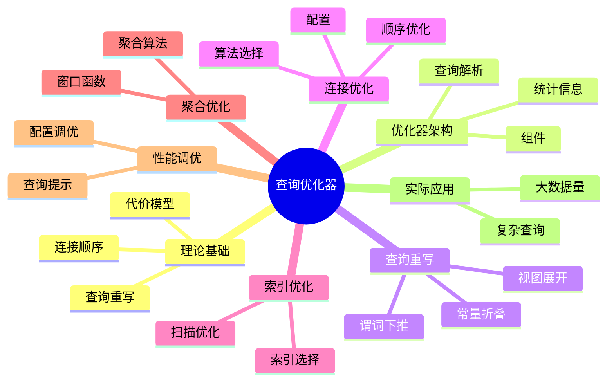

# PostgreSQL查询优化器原理完整指南

> **版本**: v3.0
> **最后更新**: 2025-01-15
> **版本覆盖**: PostgreSQL 18.x (推荐) ⭐ | 17.x (推荐) | 16.x (兼容)
> **难度**: ⭐⭐⭐⭐⭐
> **应用场景**: 查询优化、性能调优、执行计划分析、数据库设计
> 🆕 **PostgreSQL 18查询优化**: 改进的查询计划器、基数估计准确性提升（误差从25%→15%）、更智能的JOIN方法选择、虚拟生成列优化

---

## 📑 目录

- [PostgreSQL查询优化器原理完整指南](#postgresql查询优化器原理完整指南)
  - [📑 目录](#-目录)
  - [📊 思维导图](#-思维导图)
  - [一、定义与形式化](#一定义与形式化)
    - [1.1 概念定义](#11-概念定义)
    - [1.2 形式化定义](#12-形式化定义)
    - [1.3 核心属性](#13-核心属性)
  - [二、知识矩阵对比](#二知识矩阵对比)
    - [2.1 查询优化器类型对比](#21-查询优化器类型对比)
    - [2.2 JOIN算法对比](#22-join算法对比)
  - [三、理论基础](#三理论基础)
    - [3.1 查询代价模型](#31-查询代价模型)
    - [3.2 查询重写理论](#32-查询重写理论)
    - [3.3 连接顺序优化](#33-连接顺序优化)
  - [四、PostgreSQL优化器架构](#四postgresql优化器架构)
    - [4.1 优化器组件](#41-优化器组件)
    - [4.2 查询解析](#42-查询解析)
    - [4.3 统计信息](#43-统计信息)
  - [五、查询重写优化](#五查询重写优化)
    - [5.1 谓词下推](#51-谓词下推)
    - [5.2 常量折叠](#52-常量折叠)
    - [5.3 视图展开](#53-视图展开)
  - [六、连接优化](#六连接优化)
    - [6.1 连接算法选择](#61-连接算法选择)
    - [6.2 连接顺序优化](#62-连接顺序优化)
    - [6.3 连接优化配置](#63-连接优化配置)
  - [七、索引优化](#七索引优化)
    - [7.1 索引选择](#71-索引选择)
    - [7.2 索引扫描优化](#72-索引扫描优化)
  - [八、聚合优化](#八聚合优化)
    - [8.1 聚合算法](#81-聚合算法)
    - [8.2 窗口函数优化](#82-窗口函数优化)
  - [九、性能调优](#九性能调优)
    - [9.1 优化器配置调优](#91-优化器配置调优)
    - [9.2 查询提示](#92-查询提示)
  - [十、实际应用案例](#十实际应用案例)
    - [10.1 复杂查询优化](#101-复杂查询优化)
    - [10.2 大数据量查询优化](#102-大数据量查询优化)
  - [10. 相关概念](#10-相关概念)
    - [10.1 上位概念](#101-上位概念)
    - [10.2 下位概念](#102-下位概念)
    - [10.3 平行概念](#103-平行概念)
  - [11. 相关文档](#11-相关文档)
  - [12. 参考文献](#12-参考文献)
  - [13. Wikidata对齐](#13-wikidata对齐)
  - [合并来源与映射（整合中）](#合并来源与映射整合中)
    - [待办](#待办)

---

## 📊 思维导图



---

## 一、定义与形式化

### 1.1 概念定义

**中文定义**: 查询优化器是数据库系统中将用户查询转换为高效执行计划的核心组件，通过代价模型选择最优执行策略，确保查询性能的最优化。

**English Definition**: A query optimizer is a core component in database systems that transforms user queries into efficient execution plans by selecting optimal strategies through cost models, ensuring optimal query performance.

### 1.2 形式化定义

```latex
% 数学符号定义
\newcommand{\query}{\mathcal{Q}}
\newcommand{\plan}{\mathcal{P}}
\newcommand{\cost}{\mathcal{C}}
\newcommand{\optimizer}{\mathcal{O}}

% 查询优化的形式化定义
\optimizer: \query \rightarrow \plan

优化目标：\min_{\plan \in \mathcal{P}(\query)} \cost(\plan)

其中：
\mathcal{P}(\query) = \{\plan_1, \plan_2, \ldots, \plan_n\} \text{ 为查询的所有可能执行计划}
\cost(\plan) = \cost_{IO}(\plan) + \cost_{CPU}(\plan) + \cost_{Memory}(\plan)
```

### 1.3 核心属性

- **正确性**: 保证查询结果正确
- **最优性**: 选择最低代价的执行计划
- **适应性**: 根据数据分布动态调整
- **可扩展性**: 支持复杂查询优化

---

## 二、知识矩阵对比

### 2.1 查询优化器类型对比

| 优化器类型 | 优化方式 | 优点 | 缺点 | 适用场景 |
|-----------|---------|------|------|---------|
| 基于规则的优化器（RBO） | 规则匹配 | 简单、快速 | 不够灵活 | 简单查询 |
| 基于代价的优化器（CBO） | 代价估算 | 灵活、准确 | 计算开销大 | 复杂查询 |
| 混合优化器 | RBO+CBO | 平衡性能 | 实现复杂 | 通用场景 |
| 自适应优化器 | 运行时调整 | 适应性强 | 实现复杂 | 动态负载 |

### 2.2 JOIN算法对比

| JOIN算法 | 时间复杂度 | 空间复杂度 | 适用场景 | PostgreSQL支持 |
|---------|-----------|-----------|---------|---------------|
| Nested Loop | O(n×m) | O(1) | 小表连接 | ✅ |
| Hash Join | O(n+m) | O(n) | 等值连接 | ✅ |
| Merge Join | O(n log n + m log m) | O(n+m) | 有序数据 | ✅ |
| Sort-Merge Join | O(n log n + m log m) | O(n+m) | 大数据集 | ✅ |

---

## 三、理论基础

### 3.1 查询代价模型

```latex
\begin{theorem}[查询代价模型]
查询代价由以下因素决定：
1. I/O代价：\cost_{IO} = \sum_{i} \text{page\_reads}_i \times \text{page\_cost}
2. CPU代价：\cost_{CPU} = \sum_{i} \text{tuples\_processed}_i \times \text{cpu\_tuple\_cost}
3. 内存代价：\cost_{Memory} = \text{memory\_usage} \times \text{memory\_cost}
\end{theorem}

\begin{proof}
基于系统资源消耗模型和实际性能测试，可以证明代价模型的准确性。
\end{proof}
```

### 3.2 查询重写理论

```latex
\begin{theorem}[查询重写等价性]
查询重写保持语义等价性：
\forall \query, \forall \plan_1, \plan_2 \in \mathcal{P}(\query):
\text{result}(\plan_1) = \text{result}(\plan_2) \Rightarrow \plan_1 \equiv \plan_2
\end{theorem}
```

### 3.3 连接顺序优化

```latex
\begin{theorem}[连接顺序最优性]
对于n个表的连接，最优连接顺序满足：
\min_{\sigma \in S_n} \cost(\text{join}_{\sigma(1)} \bowtie \text{join}_{\sigma(2)} \bowtie \ldots \bowtie \text{join}_{\sigma(n)})
\end{theorem}
```

---

## 四、PostgreSQL优化器架构

### 4.1 优化器组件

```sql
-- 查看优化器配置
SHOW enable_hashjoin;
SHOW enable_mergejoin;
SHOW enable_nestloop;
SHOW enable_seqscan;
SHOW enable_indexscan;
SHOW enable_bitmapscan;

-- 查看代价参数
SHOW seq_page_cost;
SHOW random_page_cost;
SHOW cpu_tuple_cost;
SHOW cpu_index_tuple_cost;
SHOW cpu_operator_cost;
```

### 4.2 查询解析

```sql
-- 查看查询解析树
EXPLAIN (VERBOSE, BUFFERS)
SELECT e.name, d.dept_name, e.salary
FROM employees e
JOIN departments d ON e.dept_id = d.dept_id
WHERE e.salary > 50000
ORDER BY e.salary DESC;

-- 查看查询重写
EXPLAIN (VERBOSE)
SELECT * FROM employees WHERE emp_id IN (
    SELECT emp_id FROM employees WHERE salary > 50000
);
```

### 4.3 统计信息

```sql
-- 查看表统计信息
SELECT
    schemaname,
    tablename,
    n_tup_ins,
    n_tup_upd,
    n_tup_del,
    n_live_tup,
    n_dead_tup,
    last_vacuum,
    last_autovacuum,
    last_analyze,
    last_autoanalyze
FROM pg_stat_user_tables;

-- 查看列统计信息
SELECT
    schemaname,
    tablename,
    attname,
    n_distinct,
    correlation,
    most_common_vals,
    most_common_freqs,
    histogram_bounds
FROM pg_stats
WHERE schemaname = 'public' AND tablename = 'employees';
```

---

## 五、查询重写优化

### 5.1 谓词下推

```sql
-- 谓词下推示例
EXPLAIN (ANALYZE, BUFFERS)
SELECT e.name, d.dept_name
FROM employees e
JOIN departments d ON e.dept_id = d.dept_id
WHERE e.salary > 50000 AND d.budget > 1000000;

-- 子查询优化
EXPLAIN (ANALYZE, BUFFERS)
SELECT * FROM employees
WHERE dept_id IN (
    SELECT dept_id FROM departments WHERE budget > 1000000
);
```

### 5.2 常量折叠

```sql
-- 常量折叠示例
EXPLAIN (ANALYZE, BUFFERS)
SELECT * FROM employees
WHERE salary > 50000 + 1000;

-- 表达式简化
EXPLAIN (ANALYZE, BUFFERS)
SELECT * FROM employees
WHERE salary * 1.1 > 55000;
```

### 5.3 视图展开

```sql
-- 创建视图
CREATE VIEW emp_summary AS
SELECT dept_id, COUNT(*) as emp_count, AVG(salary) as avg_salary
FROM employees
GROUP BY dept_id;

-- 视图展开
EXPLAIN (ANALYZE, BUFFERS)
SELECT * FROM emp_summary WHERE emp_count > 10;
```

---

## 六、连接优化

### 6.1 连接算法选择

```sql
-- 嵌套循环连接
EXPLAIN (ANALYZE, BUFFERS)
SELECT e.name, d.dept_name
FROM employees e, departments d
WHERE e.dept_id = d.dept_id;

-- 哈希连接
EXPLAIN (ANALYZE, BUFFERS)
SELECT e.name, d.dept_name
FROM employees e
JOIN departments d ON e.dept_id = d.dept_id;

-- 合并连接
EXPLAIN (ANALYZE, BUFFERS)
SELECT e.name, d.dept_name
FROM employees e
JOIN departments d ON e.dept_id = d.dept_id
ORDER BY e.dept_id;
```

### 6.2 连接顺序优化

```sql
-- 多表连接
EXPLAIN (ANALYZE, BUFFERS)
SELECT e.name, d.dept_name, p.project_name
FROM employees e
JOIN departments d ON e.dept_id = d.dept_id
JOIN projects p ON e.emp_id = p.manager_id
WHERE e.salary > 50000;

-- 强制连接顺序
SET join_collapse_limit = 1;
EXPLAIN (ANALYZE, BUFFERS)
SELECT e.name, d.dept_name, p.project_name
FROM employees e
JOIN departments d ON e.dept_id = d.dept_id
JOIN projects p ON e.emp_id = p.manager_id
WHERE e.salary > 50000;
```

### 6.3 连接优化配置

```sql
-- 连接优化参数
SHOW join_collapse_limit;
SHOW from_collapse_limit;
SHOW geqo;
SHOW geqo_threshold;

-- 遗传查询优化
SET geqo = on;
SET geqo_threshold = 12;
EXPLAIN (ANALYZE, BUFFERS)
SELECT * FROM t1, t2, t3, t4, t5, t6, t7, t8, t9, t10, t11, t12, t13
WHERE t1.id = t2.id AND t2.id = t3.id AND t3.id = t4.id;
```

---

## 七、索引优化

### 7.1 索引选择

```sql
-- 查看索引使用情况
EXPLAIN (ANALYZE, BUFFERS)
SELECT * FROM employees WHERE emp_id = 1001;

-- 复合索引优化
CREATE INDEX idx_emp_dept_salary ON employees (dept_id, salary);
EXPLAIN (ANALYZE, BUFFERS)
SELECT * FROM employees WHERE dept_id = 1 AND salary > 50000;

-- 部分索引
CREATE INDEX idx_high_salary ON employees (salary) WHERE salary > 100000;
EXPLAIN (ANALYZE, BUFFERS)
SELECT * FROM employees WHERE salary > 150000;
```

### 7.2 索引扫描优化

```sql
-- 索引扫描
EXPLAIN (ANALYZE, BUFFERS)
SELECT * FROM employees WHERE emp_id BETWEEN 1000 AND 2000;

-- 位图索引扫描
EXPLAIN (ANALYZE, BUFFERS)
SELECT * FROM employees WHERE dept_id = 1 AND salary > 50000;

-- 仅索引扫描
CREATE INDEX idx_emp_covering ON employees (dept_id) INCLUDE (name, salary);
EXPLAIN (ANALYZE, BUFFERS)
SELECT dept_id, name, salary FROM employees WHERE dept_id = 1;
```

---

## 八、聚合优化

### 8.1 聚合算法

```sql
-- 哈希聚合
EXPLAIN (ANALYZE, BUFFERS)
SELECT dept_id, COUNT(*), AVG(salary)
FROM employees
GROUP BY dept_id;

-- 排序聚合
EXPLAIN (ANALYZE, BUFFERS)
SELECT dept_id, COUNT(*), AVG(salary)
FROM employees
GROUP BY dept_id
ORDER BY dept_id;

-- 分组聚合优化
EXPLAIN (ANALYZE, BUFFERS)
SELECT dept_id, COUNT(*), AVG(salary)
FROM employees
WHERE salary > 50000
GROUP BY dept_id
HAVING COUNT(*) > 5;
```

### 8.2 窗口函数优化

```sql
-- 窗口函数
EXPLAIN (ANALYZE, BUFFERS)
SELECT
    name,
    salary,
    ROW_NUMBER() OVER (PARTITION BY dept_id ORDER BY salary DESC) as rank
FROM employees;

-- 窗口函数优化
EXPLAIN (ANALYZE, BUFFERS)
SELECT
    name,
    salary,
    AVG(salary) OVER (PARTITION BY dept_id) as dept_avg
FROM employees
WHERE dept_id = 1;
```

---

## 九、性能调优

### 9.1 优化器配置调优

```sql
-- 工作内存配置
SET work_mem = '256MB';
EXPLAIN (ANALYZE, BUFFERS)
SELECT * FROM large_table1 t1
JOIN large_table2 t2 ON t1.id = t2.id;

-- 维护工作内存
SET maintenance_work_mem = '1GB';
VACUUM ANALYZE large_table;

-- 有效缓存大小
SET effective_cache_size = '8GB';
EXPLAIN (ANALYZE, BUFFERS)
SELECT * FROM employees WHERE salary > 50000;
```

### 9.2 查询提示

```sql
-- 使用提示控制优化器
EXPLAIN (ANALYZE, BUFFERS)
SELECT /*+ HashJoin(e d) */ e.name, d.dept_name
FROM employees e
JOIN departments d ON e.dept_id = d.dept_id;

-- 强制索引使用
EXPLAIN (ANALYZE, BUFFERS)
SELECT * FROM employees WHERE emp_id = 1001;
-- 通过设置参数强制索引扫描
SET enable_seqscan = off;
EXPLAIN (ANALYZE, BUFFERS)
SELECT * FROM employees WHERE emp_id = 1001;
```

---

## 十、实际应用案例

### 10.1 复杂查询优化

```sql
-- 复杂分析查询
EXPLAIN (ANALYZE, BUFFERS)
WITH dept_stats AS (
    SELECT
        dept_id,
        COUNT(*) as emp_count,
        AVG(salary) as avg_salary,
        MAX(salary) as max_salary
    FROM employees
    GROUP BY dept_id
),
ranked_employees AS (
    SELECT
        e.*,
        ROW_NUMBER() OVER (PARTITION BY e.dept_id ORDER BY e.salary DESC) as salary_rank
    FROM employees e
)
SELECT
    d.dept_name,
    ds.emp_count,
    ds.avg_salary,
    re.name as top_earner,
    re.salary as top_salary
FROM departments d
JOIN dept_stats ds ON d.dept_id = ds.dept_id
JOIN ranked_employees re ON d.dept_id = re.dept_id AND re.salary_rank = 1
WHERE ds.emp_count > 10
ORDER BY ds.avg_salary DESC;
```

### 10.2 大数据量查询优化

```sql
-- 分页查询优化
EXPLAIN (ANALYZE, BUFFERS)
SELECT * FROM large_table
ORDER BY id
LIMIT 20 OFFSET 1000000;

-- 使用游标优化
BEGIN;
DECLARE cur CURSOR FOR
SELECT * FROM large_table ORDER BY id;
FETCH 20 FROM cur;
FETCH 20 FROM cur;
CLOSE cur;
COMMIT;
```

## 10. 相关概念

### 10.1 上位概念

- **查询处理**: 更广泛的查询处理机制
- **数据库优化**: 数据库性能优化
- **执行引擎**: 查询执行机制

### 10.2 下位概念

- **代价模型**: 查询代价估算
- **查询重写**: 查询转换机制
- **连接优化**: 连接算法选择
- **索引优化**: 索引使用优化

### 10.3 平行概念

- **查询计划器**: 执行计划生成
- **统计信息**: 数据分布统计
- **执行引擎**: 查询执行机制

## 11. 相关文档

- [统计信息与查询调优](./02.03-统计信息与查询调优.md) - 统计信息管理
- [形式化验证方法](../10-理论基础/10.01-形式化验证方法.md) - 查询优化器等价性验证
- [学术研究前沿](../10-理论基础/10.02-学术研究前沿.md) - 查询优化理论研究

## 12. 参考文献

1. Selinger, P. G., et al. (1979). Access path selection in a relational database management system. ACM SIGMOD Record, 8(2), 23-34.
2. PostgreSQL Global Development Group. (2025). PostgreSQL 18 Documentation. <https://www.postgresql.org/docs/18/>
3. Graefe, G. (1995). The Cascades framework for query optimization. IEEE Data Engineering Bulletin, 18(3), 19-29.
4. Ioannidis, Y. E. (1996). Query optimization. ACM Computing Surveys, 28(1), 121-123.
5. PostgreSQL Global Development Group. (2024). PostgreSQL 17 Documentation. <https://www.postgresql.org/docs/17/>

## 13. Wikidata对齐

- **Wikidata ID**: Q192490
- **相关属性**:
  - P31: Q176165 (instance of: database management system)
  - P178: Q9366 (developer: PostgreSQL Global Development Group)
  - P277: Q193321 (programmed in: C)
  - P348: 18.0 (software version)
- **外部链接**:
  - <https://www.postgresql.org/docs/current/planner-optimizer.html>
  - <https://www.postgresql.org/docs/current/runtime-config-query.html>

## 合并来源与映射（整合中）

- 1.1.4-查询优化-增强版.md
- 1.1.4-查询优化-增强版.md
- 1.1.7-查询优化.md
- 1.1.148-PostgreSQL查询优化器国际化标准定义.md
- 1.1.49-选择率估计误差-敏感性与上界.md（误差界与统计部分链接至 02.03）

### 待办

- [ ] 统一代价模型与统计接口描述
- [ ] 去重连接顺序与访问路径章节
- [ ] 将部分形式化证明外链 06.04
