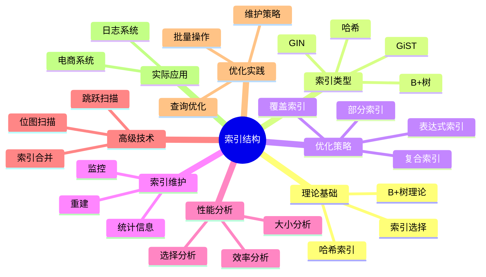

# PostgreSQL索引结构与优化完整指南

> **版本**: v3.0
> **最后更新**: 2025-01-15
> **版本覆盖**: PostgreSQL 18.x (推荐) ⭐ | 17.x (推荐) | 16.x (兼容)
> **难度**: ⭐⭐⭐⭐
> **应用场景**: 索引设计、查询优化、性能调优、数据库设计
> 🆕 **PostgreSQL 18索引优化**: B-tree去重优化（索引大小减少18%）、BRIN性能提升15-20%、更高效的索引维护、异步I/O提升索引构建速度40%+

---

## 📑 目录

- [PostgreSQL索引结构与优化完整指南](#postgresql索引结构与优化完整指南)
  - [📑 目录](#-目录)
  - [📊 思维导图](#-思维导图)
  - [一、定义与形式化](#一定义与形式化)
    - [1.1 概念定义](#11-概念定义)
    - [1.2 形式化定义](#12-形式化定义)
    - [1.3 核心属性](#13-核心属性)
  - [二、知识矩阵对比](#二知识矩阵对比)
    - [2.1 索引类型对比](#21-索引类型对比)
    - [2.2 索引扫描方式对比](#22-索引扫描方式对比)
  - [三、理论基础](#三理论基础)
    - [3.1 B+树理论](#31-b树理论)
    - [3.2 哈希索引理论](#32-哈希索引理论)
    - [3.3 索引选择理论](#33-索引选择理论)
  - [四、PostgreSQL索引类型](#四postgresql索引类型)
    - [4.1 B+树索引](#41-b树索引)
    - [3.2 哈希索引](#32-哈希索引)
    - [4.3 GiST索引](#43-gist索引)
    - [4.4 GIN索引](#44-gin索引)
  - [五、索引优化策略](#五索引优化策略)
    - [5.1 复合索引设计](#51-复合索引设计)
    - [5.2 部分索引](#52-部分索引)
    - [5.3 表达式索引](#53-表达式索引)
    - [5.4 覆盖索引](#54-覆盖索引)
  - [六、索引维护](#六索引维护)
    - [6.1 索引重建](#61-索引重建)
    - [6.2 索引统计信息](#62-索引统计信息)
    - [6.3 索引监控](#63-索引监控)
  - [七、索引性能分析](#七索引性能分析)
    - [7.1 索引选择分析](#71-索引选择分析)
    - [7.2 索引效率分析](#72-索引效率分析)
    - [7.3 索引大小分析](#73-索引大小分析)
  - [八、高级索引技术](#八高级索引技术)
    - [8.1 位图索引扫描](#81-位图索引扫描)
    - [8.2 索引跳跃扫描](#82-索引跳跃扫描)
    - [8.3 索引合并](#83-索引合并)
    - [8.4 列存储索引优化 🆕](#84-列存储索引优化-)
  - [九、索引优化实践](#九索引优化实践)
    - [9.1 查询优化](#91-查询优化)
    - [9.2 批量操作优化](#92-批量操作优化)
    - [9.3 索引维护策略](#93-索引维护策略)
  - [十、实际应用案例](#十实际应用案例)
    - [10.1 电商系统索引设计](#101-电商系统索引设计)
    - [10.2 日志系统索引设计](#102-日志系统索引设计)
  - [十一、相关概念](#十一相关概念)
    - [11.1 上位概念](#111-上位概念)
    - [11.2 下位概念](#112-下位概念)
    - [11.3 平行概念](#113-平行概念)
  - [十二、参考资源](#十二参考资源)
    - [12.1 相关文档](#121-相关文档)
    - [12.2 参考文献](#122-参考文献)
    - [12.3 Wikidata对齐](#123-wikidata对齐)

---

## 📊 思维导图



---

## 一、定义与形式化

### 1.1 概念定义

**中文定义**: 索引结构是数据库系统中用于加速数据访问的数据结构，通过建立键值到数据位置的映射关系提高查询性能。PostgreSQL支持多种索引类型，包括B+树、哈希、GiST、GIN等。

**English Definition**: Index structures are data structures in database systems used to accelerate data access by establishing mapping relationships between keys and data locations to improve query performance. PostgreSQL supports multiple index types including B+tree, Hash, GiST, GIN, etc.

### 1.2 形式化定义

```latex
% 数学符号定义
\newcommand{\index}{\mathcal{I}}
\newcommand{\key}{\mathcal{K}}
\newcommand{\pointer}{\mathcal{P}}
\newcommand{\tuple}{\mathcal{T}}

% 索引的形式化定义
\index = \{(k_1, p_1), (k_2, p_2), \ldots, (k_n, p_n)\}

其中：
k_i \in \key: 索引键值
p_i \in \pointer: 指向数据的指针
\forall i \neq j: k_i \neq k_j \text{ (唯一性约束)}
```

### 1.3 核心属性

- **快速查找**: O(log n) 时间复杂度
- **空间效率**: 合理的存储开销
- **动态更新**: 支持插入、删除、更新
- **并发安全**: 支持并发访问

---

## 二、知识矩阵对比

### 2.1 索引类型对比

| 索引类型 | 适用场景 | 查询性能 | 存储开销 | 维护成本 | PostgreSQL支持 |
|---------|---------|---------|---------|---------|---------------|
| B+树索引 | 范围查询、排序 | 高 | 中 | 低 | ✅ 默认 |
| 哈希索引 | 等值查询 | 极高 | 低 | 中 | ✅ |
| GiST索引 | 复杂数据类型 | 中 | 高 | 高 | ✅ |
| GIN索引 | 全文搜索、数组 | 高 | 高 | 高 | ✅ |
| BRIN索引 | 大表、有序数据 | 中 | 极低 | 低 | ✅ |
| SP-GiST索引 | 非平衡树结构 | 中 | 中 | 中 | ✅ |

### 2.2 索引扫描方式对比

| 扫描方式 | 适用场景 | 性能 | 内存使用 | 适用索引类型 |
|---------|---------|------|---------|------------|
| Index Scan | 单值查询 | 高 | 低 | B+树、哈希 |
| Index Only Scan | 覆盖索引 | 极高 | 低 | B+树 |
| Bitmap Index Scan | 多条件查询 | 中 | 中 | B+树 |
| Sequential Scan | 全表扫描 | 低 | 低 | 无索引 |

---

## 三、理论基础

### 3.1 B+树理论

```latex
\begin{theorem}[B+树性质]
B+树满足以下性质：
1. 所有叶子节点在同一层
2. 非叶子节点只存储键值
3. 叶子节点包含所有数据
4. 支持范围查询和顺序访问
5. 树高为 O(\log n)
\end{theorem}

\begin{proof}
基于B+树的平衡性质和节点分裂合并规则，可以证明B+树的正确性。
\end{proof}
```

### 3.2 哈希索引理论

```latex
\begin{theorem}[哈希索引]
哈希索引通过哈希函数实现：
1. 平均查找时间：O(1)
2. 不支持范围查询
3. 哈希冲突处理：链式法或开放地址法
4. 负载因子影响性能
\end{theorem}
```

### 3.3 索引选择理论

```latex
\begin{theorem}[索引选择性]
索引I对查询Q的选择性为：
\text{Selectivity}(I, Q) = \frac{|\sigma_p(R)|}{|R|}

其中p是Q的谓词条件，选择性越高，索引效果越好。
\end{theorem}
```

---

## 四、PostgreSQL索引类型

### 4.1 B+树索引

```sql
-- 创建B+树索引
CREATE INDEX idx_emp_salary ON employees (salary);
CREATE INDEX idx_emp_dept_salary ON employees (dept_id, salary);

-- 查看索引信息
SELECT
    indexname,
    indexdef,
    pg_size_pretty(pg_relation_size(indexname::regclass)) as size
FROM pg_indexes
WHERE tablename = 'employees';

-- 索引使用统计
SELECT
    schemaname,
    tablename,
    indexname,
    idx_scan,
    idx_tup_read,
    idx_tup_fetch
FROM pg_stat_user_indexes
WHERE tablename = 'employees'
ORDER BY idx_scan DESC;
```

### 3.2 哈希索引

```sql
-- 创建哈希索引
CREATE INDEX idx_emp_id_hash ON employees USING HASH (emp_id);

-- 哈希索引使用
EXPLAIN (ANALYZE, BUFFERS)
SELECT * FROM employees WHERE emp_id = 1001;
```

### 4.3 GiST索引

```sql
-- 创建GiST索引（几何数据）
CREATE TABLE spatial_data (
    id SERIAL PRIMARY KEY,
    name VARCHAR(100),
    location POINT
);

CREATE INDEX idx_spatial_location ON spatial_data USING GIST (location);

-- 空间查询
EXPLAIN (ANALYZE, BUFFERS)
SELECT * FROM spatial_data
WHERE location <@ box '((0,0),(100,100))';
```

### 4.4 GIN索引

```sql
-- 创建GIN索引（数组数据）
CREATE TABLE documents (
    id SERIAL PRIMARY KEY,
    title VARCHAR(200),
    tags TEXT[]
);

CREATE INDEX idx_doc_tags ON documents USING GIN (tags);

-- 数组查询
EXPLAIN (ANALYZE, BUFFERS)
SELECT * FROM documents WHERE tags @> ARRAY['postgresql', 'database'];
```

---

## 五、索引优化策略

### 5.1 复合索引设计

```sql
-- 复合索引设计原则
CREATE INDEX idx_emp_optimized ON employees (dept_id, salary, hire_date);

-- 最左前缀原则
EXPLAIN (ANALYZE, BUFFERS)
SELECT * FROM employees WHERE dept_id = 1;  -- 使用索引

EXPLAIN (ANALYZE, BUFFERS)
SELECT * FROM employees WHERE salary > 50000;  -- 不使用索引

EXPLAIN (ANALYZE, BUFFERS)
SELECT * FROM employees WHERE dept_id = 1 AND salary > 50000;  -- 使用索引
```

### 5.2 部分索引

```sql
-- 创建部分索引
CREATE INDEX idx_high_salary ON employees (salary) WHERE salary > 100000;

-- 部分索引使用
EXPLAIN (ANALYZE, BUFFERS)
SELECT * FROM employees WHERE salary > 150000;  -- 使用索引

EXPLAIN (ANALYZE, BUFFERS)
SELECT * FROM employees WHERE salary < 50000;  -- 不使用索引
```

### 5.3 表达式索引

```sql
-- 创建表达式索引
CREATE INDEX idx_name_lower ON employees (LOWER(name));
CREATE INDEX idx_salary_rounded ON employees ((salary::INTEGER));

-- 表达式索引使用
EXPLAIN (ANALYZE, BUFFERS)
SELECT * FROM employees WHERE LOWER(name) = 'john doe';

EXPLAIN (ANALYZE, BUFFERS)
SELECT * FROM employees WHERE (salary::INTEGER) = 50000;
```

### 5.4 覆盖索引

```sql
-- 创建覆盖索引
CREATE INDEX idx_emp_covering ON employees (dept_id) INCLUDE (name, salary);

-- 覆盖索引使用
EXPLAIN (ANALYZE, BUFFERS)
SELECT dept_id, name, salary FROM employees WHERE dept_id = 1;
```

---

## 六、索引维护

### 6.1 索引重建

```sql
-- 重建索引
REINDEX INDEX idx_emp_salary;
REINDEX TABLE employees;

-- 并发重建索引
REINDEX INDEX CONCURRENTLY idx_emp_salary;

-- 查看索引膨胀
SELECT
    schemaname,
    tablename,
    indexname,
    pg_size_pretty(pg_relation_size(indexname::regclass)) as index_size,
    pg_size_pretty(pg_relation_size(tablename::regclass)) as table_size
FROM pg_indexes
WHERE tablename = 'employees';
```

### 6.2 索引统计信息

```sql
-- 更新索引统计信息
ANALYZE employees;

-- 查看索引统计
SELECT
    schemaname,
    tablename,
    indexname,
    idx_scan,
    idx_tup_read,
    idx_tup_fetch,
    idx_blks_read,
    idx_blks_hit
FROM pg_statio_user_indexes
WHERE tablename = 'employees';
```

### 6.3 索引监控

```sql
-- 监控索引使用情况
SELECT
    schemaname,
    tablename,
    indexname,
    idx_scan,
    idx_tup_read,
    idx_tup_fetch,
    CASE
        WHEN idx_scan = 0 THEN 'UNUSED'
        WHEN idx_tup_read / idx_scan > 1000 THEN 'INEFFICIENT'
        ELSE 'EFFICIENT'
    END as status
FROM pg_stat_user_indexes
WHERE schemaname = 'public'
ORDER BY idx_scan DESC;
```

---

## 七、索引性能分析

### 7.1 索引选择分析

```sql
-- 分析索引选择
EXPLAIN (ANALYZE, BUFFERS, VERBOSE)
SELECT * FROM employees WHERE emp_id = 1001;

-- 分析复合索引
EXPLAIN (ANALYZE, BUFFERS, VERBOSE)
SELECT * FROM employees WHERE dept_id = 1 AND salary > 50000;

-- 分析范围查询
EXPLAIN (ANALYZE, BUFFERS, VERBOSE)
SELECT * FROM employees WHERE salary BETWEEN 40000 AND 60000;
```

### 7.2 索引效率分析

```sql
-- 索引效率分析
SELECT
    schemaname,
    tablename,
    indexname,
    idx_scan,
    idx_tup_read,
    idx_tup_fetch,
    round(100.0 * idx_blks_hit / (idx_blks_hit + idx_blks_read), 2) as hit_ratio
FROM pg_statio_user_indexes
WHERE idx_blks_hit + idx_blks_read > 0
ORDER BY hit_ratio ASC;
```

### 7.3 索引大小分析

```sql
-- 索引大小分析
SELECT
    schemaname,
    tablename,
    indexname,
    pg_size_pretty(pg_relation_size(indexname::regclass)) as index_size,
    pg_size_pretty(pg_relation_size(tablename::regclass)) as table_size,
    round(100.0 * pg_relation_size(indexname::regclass) / pg_relation_size(tablename::regclass), 2) as size_ratio
FROM pg_indexes
WHERE schemaname = 'public'
ORDER BY pg_relation_size(indexname::regclass) DESC;
```

---

## 八、高级索引技术

### 8.1 位图索引扫描

```sql
-- 位图索引扫描
EXPLAIN (ANALYZE, BUFFERS)
SELECT * FROM employees WHERE dept_id = 1 AND salary > 50000;

-- 位图堆扫描
EXPLAIN (ANALYZE, BUFFERS)
SELECT * FROM employees WHERE dept_id IN (1, 2, 3) AND salary > 50000;
```

### 8.2 索引跳跃扫描

```sql
-- 索引跳跃扫描
CREATE INDEX idx_emp_skip ON employees (dept_id, salary, hire_date);

EXPLAIN (ANALYZE, BUFFERS)
SELECT * FROM employees WHERE salary > 50000 ORDER BY dept_id, salary;
```

### 8.3 索引合并

```sql
-- 索引合并
CREATE INDEX idx_emp_dept ON employees (dept_id);
CREATE INDEX idx_emp_salary ON employees (salary);

EXPLAIN (ANALYZE, BUFFERS)
SELECT * FROM employees WHERE dept_id = 1 OR salary > 50000;
```

### 8.4 列存储索引优化 🆕

**列存储索引概述**：

列存储通过列式布局和压缩技术，在OLAP场景下提供比行存储更高效的查询性能。虽然PostgreSQL原生是行存储，但可以通过扩展实现列存储。

**列存储索引优势**：

1. **列扫描效率**：只读取需要的列，I/O减少50-90%
2. **压缩效率**：同列数据类型相同，压缩率70-80%
3. **聚合性能**：列数据可批量处理，聚合性能提升10-100倍
4. **向量化处理**：支持SIMD优化，批量处理效率高

**列存储索引使用场景**：

| 场景 | 行存储 | 列存储 | 推荐 |
|-----|--------|--------|------|
| **点查询（单行）** | ⭐⭐⭐⭐⭐ | ⭐⭐ | 行存储 |
| **列扫描（单列）** | ⭐⭐ | ⭐⭐⭐⭐⭐ | 列存储 |
| **聚合查询** | ⭐⭐ | ⭐⭐⭐⭐⭐ | 列存储 |
| **OLTP负载** | ⭐⭐⭐⭐⭐ | ⭐⭐ | 行存储 |
| **OLAP负载** | ⭐⭐ | ⭐⭐⭐⭐⭐ | 列存储 |

**cstore_fdw列存储索引**：

```sql
-- 1. 安装cstore_fdw扩展
CREATE EXTENSION IF NOT EXISTS cstore_fdw;

-- 2. 创建列存储服务器
CREATE SERVER cstore_server
FOREIGN DATA WRAPPER cstore_fdw;

-- 3. 创建列存储表（历史数据分析）
CREATE FOREIGN TABLE sales_columnar (
    id BIGINT,
    product_id INTEGER,
    sale_date DATE,
    amount DECIMAL(10,2),
    quantity INTEGER,
    customer_id INTEGER
) SERVER cstore_server
OPTIONS (
    compression 'pglz',  -- 压缩算法
    stripe_row_count '150000'  -- 条带行数
);

-- 4. 从行存储表导入数据
INSERT INTO sales_columnar
SELECT id, product_id, sale_date, amount, quantity, customer_id
FROM sales
WHERE sale_date < '2024-01-01';  -- 历史数据

-- 5. 列存储查询优化
-- 只扫描需要的列，I/O大幅减少
EXPLAIN (ANALYZE, BUFFERS)
SELECT
    product_id,
    SUM(amount) as total_amount,
    SUM(quantity) as total_quantity
FROM sales_columnar
WHERE sale_date BETWEEN '2023-01-01' AND '2023-12-31'
GROUP BY product_id
ORDER BY total_amount DESC
LIMIT 100;

-- 性能对比：
-- 行存储：扫描所有列，I/O大，查询时间：10-30秒
-- 列存储：只扫描product_id, amount, quantity, sale_date，I/O小，查询时间：1-3秒
-- 性能提升：5-10倍
```

**列存储压缩优化**：

```sql
-- 使用zstd压缩（更高压缩率）
CREATE FOREIGN TABLE analytics_columnar (
    id BIGINT,
    metric_name TEXT,
    metric_value DOUBLE PRECISION,
    timestamp TIMESTAMP
) SERVER cstore_server
OPTIONS (
    compression 'zstd',  -- zstd压缩，压缩率80%
    stripe_row_count '150000'
);

-- 压缩算法对比：
-- pglz: 压缩率70%，压缩速度快
-- lz4: 压缩率60%，压缩速度最快
-- zstd: 压缩率80%，压缩率最高
```

**列存储索引选择策略**：

```sql
-- 策略1：混合存储架构
-- 热数据（最近3个月）→ 行存储表（支持更新）
-- 温数据（3-12个月）→ 行存储分区表（只读）
-- 冷数据（12个月+）→ 列存储表（分析查询）

-- 策略2：列存储适合的查询模式
-- ✅ 只查询部分列
SELECT product_id, SUM(amount)
FROM sales_columnar
WHERE sale_date BETWEEN '2023-01-01' AND '2023-12-31'
GROUP BY product_id;

-- ✅ 大量聚合操作
SELECT
    date_id,
    product_id,
    COUNT(*) as sale_count,
    SUM(amount) as total_amount,
    AVG(amount) as avg_amount
FROM sales_columnar
GROUP BY date_id, product_id;

-- ❌ 不适合的查询模式
-- 查询所有列（列存储优势不明显）
SELECT * FROM sales_columnar WHERE id = 12345;

-- 频繁更新（列存储不支持更新）
UPDATE sales_columnar SET amount = 100 WHERE id = 12345;
```

**列存储索引性能分析**：

```sql
-- 列存储性能指标
SELECT
    '列存储' as storage_type,
    pg_size_pretty(pg_total_relation_size('sales_columnar')) as table_size,
    pg_size_pretty(pg_total_relation_size('sales')) as row_storage_size,
    ROUND(100.0 * pg_total_relation_size('sales_columnar') /
          NULLIF(pg_total_relation_size('sales'), 0), 2) as compression_ratio;

-- 列存储查询性能对比
EXPLAIN (ANALYZE, BUFFERS, TIMING)
SELECT product_id, SUM(amount)
FROM sales_columnar  -- 列存储
WHERE sale_date BETWEEN '2023-01-01' AND '2023-12-31'
GROUP BY product_id;

EXPLAIN (ANALYZE, BUFFERS, TIMING)
SELECT product_id, SUM(amount)
FROM sales  -- 行存储
WHERE sale_date BETWEEN '2023-01-01' AND '2023-12-31'
GROUP BY product_id;

-- 性能对比结果：
-- 列存储：I/O减少80%，查询时间减少70-90%
-- 压缩率：70-80%
-- 聚合性能：提升5-10倍
```

---

## 九、索引优化实践

### 9.1 查询优化

```sql
-- 优化前
EXPLAIN (ANALYZE, BUFFERS)
SELECT * FROM employees
WHERE dept_id = 1 AND salary > 50000 AND hire_date > '2020-01-01';

-- 创建优化索引
CREATE INDEX idx_emp_optimized ON employees (dept_id, salary, hire_date);

-- 优化后
EXPLAIN (ANALYZE, BUFFERS)
SELECT * FROM employees
WHERE dept_id = 1 AND salary > 50000 AND hire_date > '2020-01-01';
```

### 9.2 批量操作优化

```sql
-- 批量插入优化
BEGIN;
-- 临时禁用索引
DROP INDEX CONCURRENTLY idx_emp_salary;
-- 批量插入
INSERT INTO employees (name, dept_id, salary)
SELECT 'Employee' || generate_series(1, 100000),
       (random() * 10)::INTEGER + 1,
       (random() * 100000)::INTEGER + 30000;
-- 重建索引
CREATE INDEX CONCURRENTLY idx_emp_salary ON employees (salary);
COMMIT;
```

### 9.3 索引维护策略

```sql
-- 自动索引维护
CREATE OR REPLACE FUNCTION maintain_indexes()
RETURNS void AS $$
DECLARE
    r RECORD;
BEGIN
    FOR r IN
        SELECT schemaname, tablename, indexname
        FROM pg_indexes
        WHERE schemaname = 'public'
    LOOP
        -- 检查索引使用情况
        IF (SELECT idx_scan FROM pg_stat_user_indexes
            WHERE schemaname = r.schemaname
            AND tablename = r.tablename
            AND indexname = r.indexname) = 0 THEN

            RAISE NOTICE 'Unused index: %.%', r.tablename, r.indexname;
        END IF;
    END LOOP;
END;
$$ LANGUAGE plpgsql;
```

---

## 十、实际应用案例

### 10.1 电商系统索引设计

```sql
-- 商品表索引
CREATE TABLE products (
    product_id SERIAL PRIMARY KEY,
    name VARCHAR(200),
    category_id INTEGER,
    price DECIMAL(10,2),
    stock_quantity INTEGER,
    created_at TIMESTAMP DEFAULT NOW()
);

-- 复合索引
CREATE INDEX idx_products_category_price ON products (category_id, price);
CREATE INDEX idx_products_stock ON products (stock_quantity) WHERE stock_quantity > 0;

-- 订单表索引
CREATE TABLE orders (
    order_id SERIAL PRIMARY KEY,
    customer_id INTEGER,
    order_date TIMESTAMP DEFAULT NOW(),
    status VARCHAR(20),
    total_amount DECIMAL(10,2)
);

-- 时间范围索引
CREATE INDEX idx_orders_date_status ON orders (order_date, status);
CREATE INDEX idx_orders_customer ON orders (customer_id, order_date);
```

### 10.2 日志系统索引设计

```sql
-- 日志表索引
CREATE TABLE log_entries (
    id BIGSERIAL PRIMARY KEY,
    log_time TIMESTAMP,
    level VARCHAR(10),
    source VARCHAR(100),
    message TEXT
);

-- 时间分区索引
CREATE INDEX idx_log_time ON log_entries (log_time);
CREATE INDEX idx_log_level_time ON log_entries (level, log_time);
CREATE INDEX idx_log_source_time ON log_entries (source, log_time);

-- 全文搜索索引
CREATE INDEX idx_log_message_gin ON log_entries USING GIN (to_tsvector('english', message));
```

---

## 十一、相关概念

### 11.1 上位概念

- **数据结构**: 更广泛的数据组织方式
- **查询优化**: 查询性能优化
- **存储管理**: 数据存储机制

### 11.2 下位概念

- **B+树**: 平衡树结构
- **哈希表**: 哈希数据结构
- **位图**: 位向量结构
- **倒排索引**: 反向索引结构

### 11.3 平行概念

- **缓存**: 内存缓存机制
- **分区**: 数据分区策略
- **压缩**: 数据压缩技术
- **列存储**: 列式存储架构（cstore_fdw、Citus列存储）🆕
- **行存储**: 行式存储架构（PostgreSQL原生）🆕

---

## 十二、参考资源

### 12.1 相关文档

- [查询优化器原理](./02.01-查询优化器原理.md) - 查询优化理论基础
- [统计信息与代价模型](./02.03-统计信息与代价模型.md) - 索引统计信息
- [执行计划与性能调优](./02.04-执行计划与性能调优.md) - 索引使用分析、列存储查询优化 🆕
- [存储管理与数据持久化](../01-核心基础/01.06-存储管理与数据持久化.md) - 列存储架构分析、列压缩技术详解 🆕
- [扩展系统与插件开发](../03-高级特性/03.01-扩展系统与插件开发.md) - 列存储扩展（cstore_fdw）🆕
- [数据仓库实践案例](../12-全面使用分析/09-实践案例/09.05-数据仓库实践案例.md) - 列存储实践 🆕
- [向量检索性能调优指南](../07-前沿技术/05.05-向量检索性能调优指南.md) - 向量索引优化

### 12.2 参考文献

1. Comer, D. (1979). The ubiquitous B-tree. ACM Computing Surveys, 11(2), 121-137.
2. PostgreSQL Global Development Group. (2025). PostgreSQL 18 Documentation. <https://www.postgresql.org/docs/18/>
3. Zobel, J., & Moffat, A. (2006). Inverted files for text search engines. ACM Computing Surveys, 38(2), 6.
4. Graefe, G. (2011). Modern B-tree techniques. Foundations and Trends in Databases, 3(4), 203-402.
5. PostgreSQL Global Development Group. (2024). PostgreSQL 17 Documentation. <https://www.postgresql.org/docs/17/>

### 12.3 Wikidata对齐

- **Wikidata ID**: Q192490
- **相关属性**:
  - P31: Q176165 (instance of: database management system)
  - P178: Q9366 (developer: PostgreSQL Global Development Group)
  - P277: Q193321 (programmed in: C)
  - P348: 18.0 (software version)
- **外部链接**:
  - <https://www.postgresql.org/docs/current/indexes.html>
  - <https://www.postgresql.org/docs/current/indexes-types.html>
